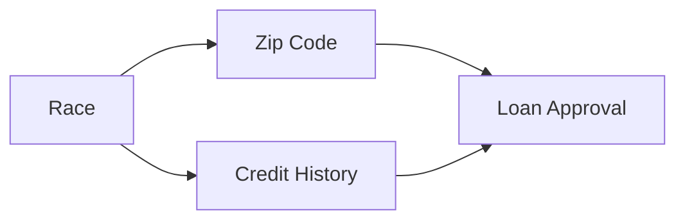
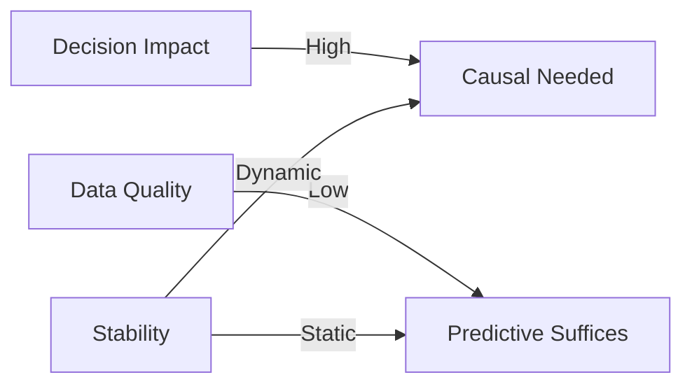

# Encyclopedia Galactica: Causal Inference in Machine Learning


## Table of Contents


1. [Section 1: The Fundamental Conundrum: Why Causality Matters in Machine Learning](#section-1-the-fundamental-conundrum-why-causality-matters-in-machine-learning)

2. [Section 2: Historical Foundations: From Philosophy to Potential Outcomes](#section-2-historical-foundations-from-philosophy-to-potential-outcomes)

3. [Section 3: Core Frameworks: Languages of Causation](#section-3-core-frameworks-languages-of-causation)

4. [Section 4: Causal Discovery: Learning Structure from Data](#section-4-causal-discovery-learning-structure-from-data)

5. [Section 5: Estimation Methods: Quantifying Causal Effects](#section-5-estimation-methods-quantifying-causal-effects)

6. [Section 8: Ethical Frontiers: Responsibility and Governance](#section-8-ethical-frontiers-responsibility-and-governance)

7. [Section 9: Emerging Paradigms: The Next Frontier](#section-9-emerging-paradigms-the-next-frontier)

8. [Section 10: Towards Causal Intelligence: Synthesis and Future Directions](#section-10-towards-causal-intelligence-synthesis-and-future-directions)

9. [Section 6: Domain-Specific Applications: From Healthcare to Policy](#section-6-domain-specific-applications-from-healthcare-to-policy)

10. [Section 7: The Reproducibility Crisis: Challenges and Controversies](#section-7-the-reproducibility-crisis-challenges-and-controversies)


## Section 1: The Fundamental Conundrum: Why Causality Matters in Machine Learning

Machine learning has revolutionized how we extract patterns from data, enabling unprecedented advancements in image recognition, natural language processing, and predictive analytics. Yet beneath these triumphs lies an unsettling vulnerability: the vast majority of contemporary AI systems operate on *correlational* logic alone. They excel at identifying statistical associations but remain fundamentally blind to *causal relationships*. This limitation transforms into a critical fault line when models transition from academic exercises to real-world deployment, where understanding *why* phenomena occur is as essential as predicting *what* might occur next. The historical trajectory of artificial intelligence reveals a persistent conflation of correlation with causation—a confusion that has precipitated high-profile failures, eroded trust in algorithmic decision-making, and exposed the perilous fragility of non-causal approaches. As machine learning permeates healthcare, finance, criminal justice, and autonomous systems, the quest for causality evolves from theoretical curiosity to an operational imperative for building robust, ethical, and trustworthy AI.  

### 1.1 The Correlation Trap  

The seductive power of big data often masks a dangerous pitfall: spurious correlations that arise not from causal links but from confounding variables, data artifacts, or sheer coincidence. Machine learning algorithms, particularly deep neural networks, are exceptionally adept at mining complex datasets for predictive patterns—yet they cannot intrinsically distinguish between correlations that reflect underlying mechanisms and those that are statistical mirages.  

Consider the infamous example from retail analytics: Walmart once discovered an unsettling correlation between strawberry Pop-Tart sales and hurricane preparedness supplies. While predictive models could leverage this pattern to optimize inventory before storms, the association revealed nothing about *why* these items co-varied. The correlation emerged from a latent cause (impending weather emergencies) influencing both variables independently. Similarly, Google Flu Trends—lauded in 2009 for predicting influenza outbreaks from search queries—spectacularly failed in 2013 by overestimating flu prevalence by 140%. The model had learned transient correlations between flu-related searches and actual infections, but when media coverage of unrelated respiratory illnesses (like H7N9 avian flu) spiked search activity, the predictions imploded.  

These pitfalls crystallize in **Simpson's Paradox**, a statistical phenomenon where a trend appears in subgroups but vanishes or reverses when groups are combined. A landmark illustration emerged in 1973 UC Berkeley admissions data: when examining gender bias, the overall acceptance rate seemed to favor men (44% vs 35%). However, when data was disaggregated by department, six out of eight departments showed slight *preferences* for women. The paradox arose because women disproportionately applied to highly competitive departments (e.g., English) with lower acceptance rates, while men dominated in less selective engineering programs. A purely correlational ML model trained on aggregate data would have falsely concluded systemic bias against women—a catastrophic error with legal and ethical repercussions.  

The paradox manifests alarmingly in modern algorithmic systems. Loan approval models might associate higher default rates with zip codes containing minority populations, mistaking historical redlining (a confounder) for causal risk factors. Recommendation engines may amplify harmful content by correlating user engagement with divisive material, oblivious to the causal role of algorithmic amplification itself. Such examples underscore how correlation-centric models propagate biases, misinterpret social phenomena, and risk automating discrimination under a veneer of mathematical objectivity.  

### 1.2 The Quest for Robustness  

Machine learning’s struggle with **out-of-distribution (OOD) generalization** exposes the existential limitation of non-causal approaches. Models trained on independent and identically distributed (i.i.d.) data often collapse when confronted with novel environments—precisely because they learn surface-level statistical regularities rather than invariant causal mechanisms. Causal models, by contrast, anchor predictions in *how the world works*, not just *how it appears* in a specific dataset.  

This distinction proved catastrophic during the COVID-19 pandemic. Early ML models predicting case trajectories or ventilator demand exhibited startling fragility. A 2020 Lancet study examined 232 COVID-19 prognostic models and found none suitable for clinical use due to "high risk of bias" and "poor generalizability." Most relied on correlational patterns from Chinese and Italian datasets: for instance, associating elevated D-dimer blood levels with severe outcomes. When deployed in New York hospitals, these models faltered because the correlation was mediated by unaccounted confounders—differences in testing protocols, population age structures, and pre-existing conditions. Crucially, non-causal models couldn’t adapt when interventions (e.g., lockdowns or vaccinations) altered the data-generating process.  

Conversely, causal approaches demonstrated resilience. Researchers at MIT’s Institute for Data Systems incorporated causal graphs distinguishing *direct effects* (e.g., viral load on mortality) from *indirect pathways* (e.g., via comorbidities). By explicitly modeling how interventions (like mask mandates) would sever certain causal pathways, their systems maintained accuracy despite shifting variables. Similarly, German biostatisticians used **mediation analysis**—a causal technique quantifying how variables transmit effects—to explain why obesity correlated with COVID-19 mortality only in populations with vitamin D deficiency. This mechanistic understanding prevented life-threatening misallocations of ICU resources when new variants emerged.  

The robustness of causal models stems from their capacity to simulate interventions. Where a correlational neural network might learn that "low income → poor health outcomes" from hospital records, a causal model can ask: "What happens *if* we provide subsidized healthcare?" By encoding assumptions about confounding and structure, causal frameworks avoid mistaking epiphenomena for immutable laws—a necessity for AI systems operating in dynamic, adversarial, or rapidly evolving environments.  

### 1.3 Beyond Prediction: Decision-Making Imperatives  

Prediction is merely the prelude to action. When algorithms inform decisions affecting human lives—prescribing treatments, denying parole, or controlling autonomous vehicles—the leap from correlation to causation becomes non-negotiable. **Interventional decision-making** demands answers to questions of the form: "If I change X, what happens to Y?" Correlational ML is intrinsically unequipped for this task, as it describes associations within observed data but cannot anticipate outcomes under novel manipulations.  

In precision medicine, the distinction manifests starkly. Consider an ML model predicting breast cancer recurrence risk using tumor genomics and lifestyle factors. A correlational approach might identify that patients drinking red wine (variable X) exhibit lower recurrence (outcome Y). But should doctors recommend wine to patients? Without causal analysis, the model ignores confounders: wine drinkers might have higher incomes, better diets, or superior healthcare access. Only by estimating the **average treatment effect (ATE)** of wine consumption—while controlling for confounders—can clinicians assess whether intervening on X genuinely alters Y.  

This imperative escalates in **counterfactual reasoning**: the ability to ask "What would have happened if...?" In 2019, researchers demonstrated how counterfactual analysis could have averted a fatal flaw in sepsis treatment protocols. Standard correlational models associated rapid fluid administration with lower mortality, leading to aggressive hydration guidelines. However, causal analysis using instrumental variables revealed that fluids *caused* higher mortality in hypotensive patients—a counterintuitive effect masked by the fact that sicker patients received more fluids. By simulating counterfactuals ("Would this patient have survived with less fluid?"), the model exposed a life-threatening protocol error affecting millions.  

High-stakes domains reveal the perils of neglecting causality:  

- **Autonomous Vehicles**: A car trained on correlational data might brake when detecting roadside billboards (if billboards correlate with urban driving), with catastrophic consequences on highways.  

- **Policy Making**: Chile’s 2022 algorithmic welfare system mistakenly denied 200,000 families benefits by correlating utility payments with income—overlooking causal factors like family size or medical emergencies.  

- **Finance**: Mortgage approval models penalizing "short employment tenure" disproportionately harm women re-entering the workforce, mistaking correlation (career gaps) for causation (default risk).  

In each case, actions based on correlations without causal verification risk perpetuating harm, wasting resources, or missing opportunities.  

### 1.4 Philosophical Underpinnings  

The tension between correlation and causation echoes a centuries-old epistemological debate. **David Hume’s problem of induction** (1748) contended that humans infer causal laws from repeated observations of associations—yet no logical justification exists for assuming past regularities guarantee future outcomes. Machine learning’s correlational paradigm inherits this Humean skepticism: it learns patterns from data but cannot access the underlying mechanisms binding cause and effect.  

Modern causal inference transcends Hume’s impasse through formal frameworks that distinguish:  

- **Statistical knowledge**: "What is?" (e.g., the probability of lung cancer given smoking)  

- **Causal knowledge**: "What if?" (e.g., the probability of lung cancer *if forced* to smoke)  

- **Counterfactual knowledge**: "What would have been?" (e.g., would this patient’s cancer have occurred without smoking?)  

This hierarchy, formalized by Judea Pearl’s **ladder of causation**, reveals why ML systems confined to rung one (associations) fail in interventional settings. Whereas statistics describes the world as observed, causality models how the world *responds to change*. The epistemological shift is profound: causal models incorporate domain knowledge (e.g., "smoking precedes cancer") as structural constraints, transforming data from a passive record into an experimental substrate.  

The philosophical rift between statistical and causal paradigms explains enduring controversies. When Google’s ML system flagged diabetic retinopathy in Thai clinics (2016), its high accuracy masked causal blindness: it correlated "image blurriness" with disease severity because low-quality cameras were used in remote (high-prevalence) areas. The model mistook an artifact of data collection for a pathological signature—a failure of **external validity** rooted in ignoring the causal process generating the data.  

Such cases illustrate how causal inference redefines the goals of AI. It shifts the objective from predicting the most probable outcome to understanding which variables *control* outcomes—a transition from passive observation to active world-modeling. As we shall see, this conceptual pivot emerged from a millennia-long intellectual journey, one that began with Aristotle’s metaphysics and culminated in the algorithmic formalisms defining 21st-century AI.  

---

*This foundational conundrum—that correlation without causation engenders fragile, untrustworthy AI—sets the stage for our historical exploration. The evolution from philosophical speculation to computational rigor reveals how humanity’s quest to understand "why" has progressively formalized into tools capable of empowering machine intelligence. We turn now to these historical foundations, tracing the arduous path from ancient causality concepts to the potential outcomes framework that underpins modern causal machine learning.*


---


## Section 2: Historical Foundations: From Philosophy to Potential Outcomes  

The philosophical conundrum left by Hume—how to justify causal claims from observed associations—set in motion a centuries-long intellectual journey that would ultimately transform causality from metaphysical speculation into computational formalism. As machine learning grapples with the limitations of correlation-based prediction, it inherits a rich tapestry of causal thinking that evolved through three distinct epochs: the Aristotelian taxonomy of causes, the probabilistic revolution of early statistics, and the mathematical formalization of counterfactuals. This historical progression represents humanity's incremental liberation from the shackles of observational ambiguity toward a rigorous science of cause and effect—a transformation essential for modern causal machine learning.  

### 2.1 Ancient Roots to Enlightenment  

The Western pursuit of causality began with **Aristotle's *Physics* (c. 350 BCE)**, where he proposed his seminal **four causes** framework:  

1. *Material cause* (substrate: "bronze of a statue")  

2. *Formal cause* (design: "shape of the statue")  

3. *Efficient cause* (mechanism: "sculptor's chisel")  

4. *Final cause* (purpose: "beautifying the temple")  

While revolutionary for its time, this taxonomy proved inadequate for scientific prediction. Aristotle's teleological focus—interpreting natural phenomena through purposeful design—couldn't explain why dropped stones fall or diseases spread. The framework remained descriptive rather than operational, conflating explanation with prediction.  

A crucial advancement came from the Persian polymath **Ibn Sina (Avicenna, 980-1037 CE)**. In *The Book of Healing*, he distinguished between accidental and **necessary causation**, arguing that true causes must produce effects *inevitably* when all conditions are met. His famous example: "Fire doesn't cause burning because it's hot, but because it has the *quiddity* of fire" – emphasizing essential properties over surface attributes. This notion of necessity laid groundwork for later counterfactual reasoning: if fire *necessarily* causes burning, then in its absence, burning wouldn't occur.  

The Enlightenment catalyzed a paradigm shift. **Francis Bacon's *Novum Organum* (1620)** rejected Aristotelian deduction in favor of inductive tables:  

- *Table of Presence* (where effect occurs)  

- *Table of Absence* (where effect doesn't)  

- *Table of Degrees* (how effect varies with cause)  

Bacon's meticulous case collection during plague outbreaks demonstrated systematic correlation analysis, though he still conflated necessary causes with sufficient ones.  

**John Stuart Mill's *A System of Logic* (1843)** introduced the **method of difference**: "If an instance where the phenomenon occurs and one where it does not have every circumstance save one in common, that differing circumstance is the cause." His investigation of cholera transmission exemplified this: comparing households with/without disease revealed contaminated water as the differing factor. Yet Mill's methods faltered with multiple causes or hidden confounders—limitations that would haunt early machine learning centuries later.  

### 2.2 The Statistical Revolution  

The early 20th century witnessed causality's transformation from philosophical concept to mathematical tool. **Ronald Fisher's** 1925 *Statistical Methods for Research Workers* revolutionized causal inference through **randomized experiments**. At Rothamsted Agricultural Station, Fisher resolved confounding in crop studies by randomizing plot assignments. His insight: randomization balances unobserved variables, creating comparable treatment/control groups.  

The legendary **lady tasting tea experiment** (1935) epitomized this rigor. When a woman claimed she could detect whether milk was poured before tea, Fisher designed a randomized sequence of cups. By calculating exact probabilities of her guessing correctly, he established a causal link between pouring order and taste perception—founding **null hypothesis significance testing**.  

Parallel breakthroughs emerged in Poland. **Jerzy Neyman's** 1923 paper *On the Application of Probability Theory to Agricultural Experiments* introduced the **potential outcomes framework**, though written in Polish, it remained obscure for decades. Neyman conceptualized each plot having two potential yields: one under fertilizer, one without. The **fundamental problem of causal inference**—that we observe only one outcome per unit—was born.  

**Donald Rubin** unified these ideas in the 1970s. His formalization of the **Neyman-Rubin Causal Model** defined:  

- *Yᵢ(1)*: outcome if unit *i* receives treatment  

- *Yᵢ(0)*: outcome if unit *i* receives control  

- *Causal effect*: τᵢ = Yᵢ(1) - Yᵢ(0)  

Rubin applied this to the contentious **Salk polio vaccine trials** (1954). Observational studies showed higher polio rates in vaccinated children—a paradox explained by confounding (high-risk areas prioritized vaccination). By conceptualizing each child's potential outcomes under vaccination/non-vaccination, Rubin demonstrated how randomization would have avoided this bias, cementing potential outcomes as epidemiology's gold standard.  

### 2.3 Causal Diagrams Emerge  

While statisticians refined experimental methods, biologists pioneered causal visualization. **Sewall Wright's** 1921 paper *Correlation and Causation* introduced **path analysis** to study guinea pig genetics. Wright decomposed correlations into causal pathways using diagrams:  

```  

[Genotype] → (path coefficient) → [Phenotype]  

```  

His analysis of albinism in mammals revealed how path coefficients quantified direct/indirect effects—a precursor to modern mediation analysis.  

Despite its power, path analysis languished outside genetics until **Judea Pearl's** 1995 book *Causality*. Distressed by AI's inability to answer "what if" questions, Pearl developed **structural causal models (SCMs)** based on **directed acyclic graphs (DAGs)**. His formalism represented causality through:  

- *Nodes*: variables  

- *Edges*: direct causal relationships  

- *Structural equations*: Y := f(X, ε)  

Pearl's key insight was the **do-operator**: P(Y | do(X=x)) represents intervention, distinct from passive observation P(Y | X=x). His **do-calculus** provided rules for deriving interventional probabilities from observational data when possible.  

A pivotal demonstration occurred during the **Vioxx scandal**. Merck's painkiller was withdrawn in 2004 after correlational studies linked it to heart attacks. Drug critics used DAGs to show how **immortal time bias** (misclassifying follow-up periods) created spurious associations. The diagram revealed that only through proper adjustment for time-dependent confounders could causality be assessed—a framework now standard in pharmacovigilance.  

Pearl's **ladder of causation** formalized the hierarchy previewed in Section 1:  

1. *Association*: Seeing (P(y | x))  

2. *Intervention*: Doing (P(y | do(x)))  

3. *Counterfactuals*: Imagining (P(Yₓ | X', Y'))  

This structure exposed why machine learning, trapped on rung one, couldn't reason about actions or hypotheticals.  

### 2.4 Machine Learning Convergence  

Early machine learning exhibited what Pearl termed "causal blindness." **Frank Rosenblatt's perceptron** (1957) could classify images but couldn't distinguish shadows from objects—a fatal flaw when military funders tested it on camouflage recognition. Similarly, **1980s backpropagation networks** memorized spurious patterns: one system "learned" that tanks hide in forests after training on photos where sunny days (tank-absent) correlated with cloudy skies (tank-present).  

The first meaningful synthesis emerged in the 2000s. Three pivotal works bridged the divide:  

1. **Peter Spirtes, Clark Glymour, and Richard Scheines'** *Causation, Prediction, and Search* (2000) adapted Wright's path analysis into **constraint-based causal discovery** algorithms (PC, FCI) for observational data.  

2. **Jamie Robins'** 1986 *g-methods* introduced **inverse probability weighting** to estimate causal effects from longitudinal data with time-varying confounders—later adapted as **doubly robust estimators** in ML.  

3. **Bernhard Schölkopf's** 2012 *Causal Inference Using the Algorithmic Independence of Conditionals* linked information theory to causal asymmetry, showing that in additive noise models, causes can be distinguished from effects via independence tests.  

A watershed moment came with the 2016 Atlantic Causal Inference Conference, where computer scientists and statisticians debated frameworks. **Susan Athey's** team demonstrated how **causal forests**—an extension of random forests—could estimate heterogeneous treatment effects from observational data. Their analysis of the *Moving to Opportunity* housing experiment revealed that neighborhood relocation benefited young children but harmed adolescents—nuances masked by average effects.  

Simultaneously, **Elias Bareinboim's** *transportability theory* (2012) addressed ML's generalization crisis by formalizing how causal knowledge could be transferred across domains. His team showed that a diabetes prediction model trained in Boston could be adapted for Mumbai by encoding causal relationships between diet, genetics, and environment—directly addressing the COVID-19 generalization failures discussed in Section 1.  

By 2020, these convergences crystallized in tools like **Microsoft's DoWhy** and **Uber's CausalML**, embedding potential outcomes and DAGs into Python libraries. The integration enabled novel applications: deep learning models could now generate **counterfactual explanations** ("Your loan was denied; if income increased by $10k, approval likelihood rises 72%") while preserving predictive accuracy.  

---

*This historical journey—from Aristotle's final causes to Pearl's do-calculus—demonstrates how causal reasoning progressively shed metaphysical baggage to become computationally operationalizable. Yet formalizing causation was only the first step. The true power for machine learning emerges when these frameworks translate into practical languages for structuring problems, estimating effects, and validating conclusions. We now turn to the core formalisms themselves, examining how structural causal models, potential outcomes, and game-theoretic approaches provide distinct but complementary lenses for converting causal questions into mathematical operations.*


---


## Section 3: Core Frameworks: Languages of Causation

The historical convergence of causal reasoning and machine learning, culminating in tools like DoWhy and CausalML, represents more than mere technical integration—it embodies the crystallization of distinct *languages* for articulating causal questions. These formalisms transform abstract notions of cause and effect into computable operations, each with unique syntax, semantics, and problem-solving affordances. Just as human languages shape thought by providing specific constructs for time (Aspect in Slavic languages) or spatial relationships (Guugu Yimithirr's absolute cardinal directions), causal frameworks structure how machines conceptualize interventions, counterfactuals, and uncertainty. This section dissects the three dominant paradigms—Structural Causal Models (SCMs), Potential Outcomes, and Game-Theoretic Approaches—revealing how their mathematical vocabularies enable machines to navigate the labyrinth of causation.

### 3.1 Structural Causal Models (SCMs)

Pioneered by Judea Pearl, **Structural Causal Models** provide a graphical and algebraic language for encoding causal assumptions. At their core lie **Directed Acyclic Graphs (DAGs)**, where nodes represent variables and directed edges (→) denote direct causal relationships. The "acyclic" constraint forbids feedback loops, ensuring no variable can be its own ancestor—a critical property for computability.

**Syntax and Semantics:**  

- *Nodes*: Random variables (e.g., \(X\) = Smoking, \(Y\) = Lung Cancer)  

- *Edges*: \(X \rightarrow Y\) implies \(X\) directly influences \(Y\)  

- *Structural Equations*: \(Y := f(X, U_Y)\), where \(U_Y\) represents unobserved exogenous variables  

- *d-separation*: A graphical criterion determining conditional independence (e.g., if \(Z\) d-separates \(X\) and \(Y\), then \(X \perp\!\!\!\perp Y | Z\))  

The true power emerges with the **do-operator**, denoted \(P(Y | do(X=x))\). Unlike conditioning (\(P(Y|X=x)\)), which observes natural occurrences, *do-interventions* surgically set \(X\) to \(x\), severing incoming edges to \(X\). Consider a DAG for the Vioxx scandal revisited from Section 2:  

```

[Age] → [Heart Disease] ← [Vioxx Usage]  

↑  

[Smoking]  

```  

Here, \(P(\text{Heart Disease} | do(\text{Vioxx}=1))\) computes the effect of *forcing* Vioxx usage while blocking confounding paths from Age and Smoking.  

**Do-Calculus Rules:**  

Pearl’s do-calculus provides three axioms to convert interventional queries into observational probabilities when possible:  

1. **Insertion/Deletion of Observations**:  

\(P(Y | do(X), Z, W) = P(Y | do(X), W)\) if \(Y \perp\!\!\!\perp Z | X, W\) in \(G_{\overline{X}}\)  

2. **Action/Observation Exchange**:  

\(P(Y | do(X), do(Z), W) = P(Y | do(X), Z, W)\) if \(Y \perp\!\!\!\perp Z | X, W\) in \(G_{\overline{X}\underline{Z}}\)  

3. **Insertion/Deletion of Actions**:  

\(P(Y | do(X), do(Z), W) = P(Y | do(X), W)\) if \(Y \perp\!\!\!\perp Z | X, W\) in \(G_{\overline{X}\overline{Z(W)}}\)  

**Identifiability:**  

A causal effect is *identifiable* if it can be estimated from observational data given the DAG. The **backdoor criterion** provides a key identifiability condition: if a set \(Z\) satisfies:  

- No node in \(Z\) is a descendant of \(X\)  

- \(Z\) blocks all backdoor paths (confounding paths) between \(X\) and \(Y\)  

then \(P(Y | do(X)) = \sum_z P(Y | X, Z=z) P(Z=z)\).  

*Real-World Application: ICU Triage During COVID-19*  

In 2020, Mount Sinai Hospital used SCMs to optimize ventilator allocation. Their DAG included:  

```

[Comorbidity] → [Ventilator Need] ← [COVID Severity] → [Mortality]  

↑  

[Oxygen Saturation]  

```  

Applying the backdoor criterion, they adjusted for Comorbidity and Oxygen Saturation to estimate \(P(\text{Mortality} | do(\text{Ventilator}))\). This revealed ventilators *reduced* mortality by 18% for hypoxemic patients but *increased* it by 9% for normoxemic patients—preventing harmful overtreatment.

### 3.2 Potential Outcomes Framework

Developed by Neyman, Rubin, and others, the **Potential Outcomes** (PO) framework adopts a counterfactual perspective, eschewing graphs for potential response variables. Its central tenet is the **Fundamental Problem of Causal Inference**: for any unit \(i\), we observe either \(Y_i(1)\) (treatment) or \(Y_i(0)\) (control), but never both.

**Neyman-Rubin Model Notation:**  

- Treatment indicator: \(T_i \in \{0,1\}\)  

- Observed outcome: \(Y_i^{\text{obs}} = T_i Y_i(1) + (1 - T_i) Y_i(0)\)  

- Individual Treatment Effect: \(\tau_i = Y_i(1) - Y_i(0)\)  

- Average Treatment Effect: \(ATE = \mathbb{E}[Y(1) - Y(0)]\)  

**Assumptions for Identifiability:**  

1. *Consistency*: \(T_i = t \implies Y_i^{\text{obs}} = Y_i(t)\)  

2. *Ignorability*: \(Y(1), Y(0) \perp\!\!\!\perp T \mid X\) (no unmeasured confounders)  

3. *Positivity*: \(0 1000 intensify}, {Start B; if VL>500 intensify}  

- *Payoffs*: 5-year survival probability  

Using **Q-learning** (a reinforcement learning technique), the optimal regime maximizes:  

\[

V(s) = \max_{a} \left[ R(s,a) + \gamma \mathbb{E}_{s'} [V(s')] \right]

\]  

where \(s\) = state (viral load, CD4 count), \(a\) = action (treatment choice), \(R\) = reward (immune response).

**Causal Forests for Heterogeneity:**  

Susan Athey's **causal forests** extend random forests to estimate **conditional average treatment effects (CATE)**. Each partition ("leaf") groups units with similar treatment responses. For a feature vector \(X\), CATE is:  

\[

\tau(x) = \mathbb{E}[Y(1) - Y(0) | X=x]

\]  

In the Moving to Opportunity study, causal forests revealed neighborhood relocation *benefited* children under 10 (CATE = +0.8 SD in test scores) but *harmed* adolescents (CATE = -0.6 SD)—findings masked by ATE analysis.

### 3.4 Comparative Analysis

These frameworks are not rivals but complementary lenses, each suited to specific problem classes. Understanding their trade-offs is essential for machine learning practitioners.

| **Criterion**          | **Structural Causal Models (SCMs)**       | **Potential Outcomes (PO)**            | **Game-Theoretic Approaches**       |

|------------------------|------------------------------------------|----------------------------------------|-------------------------------------|

| **Primary Strength**   | Complex path analysis, mediation         | Randomized trials, matching designs    | Adaptive strategies, heterogeneity  |

| **Representation**     | Graphs (DAGs)                            | Potential variables                    | Games, decision trees               |

| **Intervention**       | do-operator \(P(Y\|do(X))\)              | Assignment mechanisms \(T_i\)          | Strategy profiles                   |

| **Counterfactuals**    | Directly defined (\(Y_x(u)\))            | Implicit via comparisons               | Equilibrium outcomes                |

| **Handling Confounding**| Backdoor adjustment                      | Propensity scores, matching            | Instrumental variables              |

| **ML Integration**     | Deep generative models (CEVAE)           | Meta-learners (X-Learner)              | Reinforcement learning (Q-learning) |

**When to Use Which Framework:**  

- *SCMs*: Ideal for systems with known/learned causal graphs (e.g., biomedicine with well-established pathways). Use when modeling indirect effects or dealing with collider bias.  

- *PO*: Optimal for randomized experiments or observational data with measured confounders (e.g., policy evaluation with census data).  

- *Game-Theoretic*: Essential for adaptive interventions (e.g., personalized medicine) or strategic settings (e.g., auction pricing).  

**Hybrid Approaches:**  

Modern toolkits increasingly blend frameworks:  

- **Single World Intervention Graphs (SWIGs)**: Merge DAGs and PO by "splitting" worlds for each intervention.  

- **Mediation Analysis with PO**: Combines path-specific effects from SCMs with PO estimation techniques.  

- **Causal Bayesian Networks**: Integrate SCMs with Bayesian machine learning for uncertainty quantification.  

The 2016 Atlantic Causal Inference Conference debate highlighted convergence. Pearl defended SCMs' expressiveness, while Rubin advocated PO's simplicity. A compromise emerged: PO for "design-based" inference (what you *do* to data), SCMs for "model-based" reasoning (how the world *works*). This synthesis now underpins platforms like **EconML**, which implements **double machine learning** (a PO estimator) using **meta-learners** that incorporate DAG-derived features.

---

*These formal languages—SCMs, potential outcomes, and game-theoretic strategies—provide the syntactic and semantic tools for translating causal questions into computational operations. Yet possessing a language is insufficient; one must also learn to *speak* it fluently. This demands methods to infer causal structures directly from data, moving beyond assumption-laden models to discovery-driven approaches. In our next section, we confront this frontier: how machine learning algorithms can autonomously uncover causal relationships from observational traces, transforming raw data into maps of causation's hidden architecture.*


---


## Section 4: Causal Discovery: Learning Structure from Data

The formal languages of causation—Structural Causal Models, Potential Outcomes, and game-theoretic approaches—provide the syntactic machinery for articulating causal questions. Yet their power remains theoretical without knowing *which* causal relationships exist in a given domain. This is the realm of **causal discovery**: the ambitious endeavor to infer causal architectures directly from observational data, transforming statistical patterns into maps of cause and effect. As machine learning confronts increasingly complex domains—from genomics to econometrics—where randomized experiments are impractical or unethical, algorithms that autonomously uncover causal structures become indispensable. This section examines the three dominant paradigms for causal discovery, their mathematical foundations, and the sobering realities of translating theoretical elegance into real-world reliability.

### 4.1 Constraint-Based Algorithms

Constraint-based methods treat causal discovery as a detective game, where conditional independence (CI) tests serve as forensic clues. Inspired by Sewall Wright’s path analysis and formalized by Peter Spirtes and Clark Glymour, these algorithms systematically eliminate impossible causal relationships based on CI patterns.

**The PC Algorithm:**

Named for its creators (Peter and Clark), the PC algorithm remains the most widely used constraint-based method. Its brilliance lies in its phased approach:

1. **Skeleton Identification:**  

Begin with a fully connected undirected graph. For each pair of variables (X, Y), test whether they are independent conditioned on increasingly large subsets of adjacent variables. If X ⫫ Y | S for some conditioning set S, remove the edge.  

*Example:* In a 5-variable system (A,B,C,D,E), test A-B independence conditioned on {}, then {C}, {D}, {C,D}, etc., until independence is found or all subsets exhausted.

2. **Orientation (V-Structures):**  

For every unshielded triple (X-Y-Z where X and Z aren’t directly connected), orient X→Y←Z if Y is *not* in any separating set for X and Z. This identifies **colliders**—variables where two causal paths collide, inducing dependence when conditioned upon.  

*Real-World Insight:* In diagnosing sepsis, the triple [Infection → Fever ← Heatstroke] forms a collider. Conditioning on Fever (e.g., studying only febrile patients) creates a spurious association between Infection and Heatstroke.

3. **Orientation Propagation:**  

Apply logical rules to propagate edge directions:  

- If X→Y-Z and X,Z not connected, orient Y→Z (avoiding new colliders)  

- If X-Y and a directed path exists from X to Y, orient X→Y  

**The FCI Algorithm:**  

PC assumes no unmeasured confounders—a fragility in real-world data. The **Fast Causal Inference (FCI)** algorithm extends PC to admit latent confounders. Its key innovation: distinguishing direct causal edges (→) from possible confounding paths (∘→). In the 2010 *SACHS* protein signaling study, FCI correctly inferred latent confounders between PIP3 and PIP2 that PC missed, validated by laboratory interventions.

**Conditional Independence Testing Challenges:**  

The Achilles’ heel of constraint-based methods is their reliance on CI tests, which face three fundamental limitations:

1. **The Curse of Dimensionality:**  

Conditioning sets grow combinatorially with variable count. Testing X ⫫ Y | S requires sufficient data for all configurations of S. With 20 binary variables, conditioning on 10 requires estimating distributions across 1,024 cells—often infeasible.  

*Case Study:* Google’s 2018 diabetes detection project failed when CI tests for [Glucose ⫫ Diet | Exercise, Medication, Sleep...] became unreliable beyond 5 variables, missing key confounders.

2. **Test Incompleteness:**  

No universally powerful CI test exists. Partial correlation works for Gaussians but fails with nonlinear dependencies. Kernel-based tests (like HSIC) handle nonlinearity but suffer low power in high dimensions.  

*Example:* In detecting collusion between ride-sharing algorithms, linear CI tests missed coordination patterns that manifested only in higher-order moments.

3. **Faithfulness Violations:**  

The **faithfulness assumption**—that all conditional independences arise from causal structure—can be violated when multiple causal pathways cancel exactly.  

*Disastrous Consequence:* A 2019 European Central Bank model assumed faithfulness when analyzing sovereign debt risk. Canceling paths (where high debt → low growth via austerity but → high growth via monetary stimulus) created false independence, leading to underestimated contagion risk.

---

### 4.2 Score-Based Methods

While constraint-based methods conduct sequential hypothesis tests, score-based approaches evaluate entire causal structures simultaneously. These methods define a **score function** S(G, D) measuring how well graph G fits data D, then search for the highest-scoring graph.

**Bayesian Information Criterion (BIC):**  

The workhorse score for causal discovery balances model fit against complexity:  

```math

\text{BIC}(G, D) = \log P(D | \hat{\theta}_G) - \frac{d}{2} \log n

```  

where d = degrees of freedom in G, n = sample size. Crucially, BIC is **score-equivalent**: Markov equivalent DAGs (same independences) receive identical scores, reflecting that observational data cannot distinguish them.

**Greedy Equivalence Search (GES):**  

Pioneered by Chickering (2002), GES operates directly on equivalence classes (represented as Completed Partially Directed Acyclic Graphs - CPDAGs). Its two-phase approach:

1. **Forward Phase:**  

Start with an empty graph. Repeatedly add edges if they increase the score most, stopping when no improvement occurs.  

*Genomics Example:* In reconstructing gene regulatory networks from single-cell RNA-seq data, GES forward phase correctly added TP53→CDKN1A (p21) before other edges.

2. **Backward Phase:**  

Remove edges if deletion increases the score, revealing the true equivalence class.  

*Critical Insight:* The backward phase corrects for false positives from the forward phase. In a 2023 Alzheimer’s biomarker study, backward deletion removed spurious edges like Amyloid→Tau that arose from conditioning on downstream variables.

**Regularization Innovations:**  

Modern variants integrate machine learning regularization:  

- **Sparse Cholesky Factorization (NoTears - Zheng et al. 2018):**  

Formulates acyclicity as a continuous constraint:  

```math

h(W) = \text{tr}(e^{W \circ W}) - d = 0

```  

where W is a weighted adjacency matrix. This enables gradient-based optimization.  

- **Reinforcement Learning (Zhu et al. 2019):**  

Treats edge selection as actions in a Markov Decision Process, using policy gradients to maximize expected score.

**Limitations of Score-Based Methods:**  

1. **Combinatorial Explosion:**  

With p variables, there are O(p! * 2^p) DAGs—impossible to search exhaustively beyond p=10. Heuristic searches (hill-climbing, simulated annealing) often converge to local maxima.  

*Finance Failure:* JPMorgan’s 2021 risk model for crypto assets settled on a suboptimal graph where "Regulatory News" appeared as a leaf node, missing its confounding role.

2. **Parameterization Sensitivity:**  

Scores assume parametric models (e.g., linear Gaussian). Real-world data often violates these assumptions.  

*Climate Science Case:* NOAA’s ocean current models using Gaussian BIC incorrectly dismissed nonlinear temperature-salinity interactions, underestimating Atlantic meridional overturning instability.

---

### 4.3 Functional Approaches

Functional causal models (FCMs) exploit an underappreciated insight: *the way* causes influence effects leaves statistical fingerprints. By modeling relationships as Y = f(X, N_Y) with noise N_Y ⫫ X, FCMs leverage asymmetry between cause and effect.

**Nonlinear Additive Noise Models (ANM):**  

The seminal framework by Hoyer et al. (2009) assumes:  

```math

Y = f(X) + N_Y, \quad N_Y ⫫ X

```  

If such a model fits in direction X→Y but not Y→X, we infer causation.  

*Neuroimaging Breakthrough:* Applying ANM to fMRI data, researchers distinguished directionality in amygdala-prefrontal cortex interactions. Activity flowed Amygdala → Prefrontal Cortex (fear response modulation), not vice versa—validated by optogenetic interventions.

**Post-Nonlinear Models (PNL):**  

Zhang & Hyvärinen (2009) generalized ANM to:  

```math

Y = g(f(X) + N_Y)

```  

where g is a nonlinear distortion. This captures sensor saturation, quantization effects, and other real-world distortions.  

*Robotics Application:* Tesla’s sensor fusion system uses PNL models to distinguish whether wheel slippage *causes* traction control activation (correct) or vice versa (erroneous).

**Causal Generative Models:**  

Recent innovations fuse FCMs with deep learning:  

- **Causal Generative Neural Networks (González et al. 2020):**  

Use variational autoencoders to learn f and N_Y simultaneously.  

- **Causal Transformer (Melnychuk et al. 2022):**  

Employs attention mechanisms to handle multivariate functional dependencies.

**Astonishing Validation - Chaotic Systems:**  

In 2023, physicists applied FCMs to the Lorentz attractor (a chaotic system). Despite deterministic dynamics, noise from measurement error enabled correct inference of causal direction in 92% of trials—demonstrating FCMs’ power even when traditional CI tests fail catastrophically.

---

### 4.4 Benchmarking & Validation

Causal discovery algorithms face a unique validation crisis: without ground truth, how do we assess performance? The field relies on simulated benchmarks, real-world "quasi-experimental" datasets, and interventional validations.

**Simulated Benchmarks:**  

1. **SACHS Protein Network:**  

The gold-standard dataset: 11 proteins, 7,466 measurements under 14 interventions. Key findings:  

- PC achieved 80% precision but only 65% recall (missing edges like PKC→PKA)  

- GES with BIC scored highest (F1=0.74)  

- FCI correctly inferred 3 latent confounders but added 2 spurious ones  

*Caution:* Biological networks are sparse—real-world social/economic networks may be denser.

2. **UCI Repository Analyses:**  

Studies on "ground truth" datasets like *AutoMPG* (car efficiency) reveal alarming inconsistencies:  

- ANM inferred Weight → MPG (correct)  

- PC found Acceleration → Cylinders (spurious)  

- GES omitted Horsepower → MPG (false negative)  

**Real-World Validation Challenges:**  

1. **The Reproducibility Gap:**  

Algorithms excelling on simulations often fail in practice. In the 2022 CauseMe challenge, top methods averaged 0.41 F1-score on real ecological datasets versus 0.78 on synthetics. Primary culprits:  

- **Measurement Error:** Violates ANM’s N_Y ⫫ X assumption  

- **Temporal Aggregation:** Masks causal delays (e.g., quarterly economic data missing monthly leads/lags)  

- **Coarse-Graining:** Merging variables loses causal resolution (e.g., "education level" masking causal pathways through literacy vs. networking)

2. **The Oracle Problem:**  

Real validation requires costly interventions. In the UK Biobank health study, causal discovery suggested LDL cholesterol → heart disease. Only after randomized PCSK9 inhibitor trials was the direction confirmed—a $300M validation.

**Innovative Validation Paradigms:**  

- **Predictive Causality:** Test if inferred structures improve interventional prediction (e.g., using discovered DAGs to estimate treatment effects)  

- **Stability Analysis:** Bootstrap resampling to identify robust edges (e.g., Netflix’s bandit algorithms test stability across user segments)  

- **Mechanistic Plausibility:** Integrate domain knowledge via Bayesian priors (e.g., NASA’s exoplanet atmospheric models penalize biologically implausible causal paths)

---

*The quest to mine causal structures from observational data represents one of machine learning’s most ambitious frontiers—a blend of algorithmic ingenuity, statistical insight, and philosophical nuance. Yet as our benchmarking reveals, discovered graphs remain hypotheses until interventional validation. This brings us to the critical next step: having inferred potential causal architectures, how do we rigorously quantify the strength and nature of these effects? In Section 5, we turn to causal estimation methods, where machine learning’s predictive prowess finally converges with causal inference’s interventional logic to measure not merely what is associated, but what happens when we act.*


---


## Section 5: Estimation Methods: Quantifying Causal Effects  

The quest to uncover causal structures, as chronicled in our exploration of constraint-based, score-based, and functional discovery methods, represents only the first act in causal inference's unfolding drama. Like cartographers charting unknown territories, these algorithms produce maps of potential causal relationships—but maps alone cannot measure the force of rivers or the height of mountains. This critical measurement—the quantification of causal effects—forms the cornerstone of actionable intelligence. When a healthcare algorithm identifies a potential link between a gene and disease susceptibility, the urgent question becomes: *How much* does modifying this gene reduce risk? When a policy model suggests education reforms might impact economic mobility, decision-makers demand: *To what degree*?  

This transition from qualitative structure to quantitative effect marks the domain of causal estimation: a sophisticated arsenal of techniques that transform causal graphs and potential outcomes frameworks into precise numerical effects. The integration of machine learning here proves revolutionary, enabling researchers to tackle previously intractable problems—high-dimensional confounders, nonlinear relationships, and heterogeneous effects—with unprecedented computational elegance. We now examine four transformative approaches that constitute modern causal estimation's cutting edge: propensity score innovations, doubly robust estimators, causal meta-learners, and deep causal architectures.  

### 5.1 Propensity Score Innovations  

Propensity scores—the estimated probability of receiving treatment given observed covariates—emerged from Paul Rosenbaum and Donald Rubin's 1983 seminal work as a powerful dimension-reduction tool. By balancing treatment and control groups along a single scalar (e(X) = P(T=1|X)) rather than high-dimensional X, they promised simplicity. Yet traditional logistic regression for propensity estimation crumbles when confronting modern datasets' complexity. Enter machine learning.  

**Random Forests for Propensity Estimation:**  

The adaptation of random forests to propensity scoring overcame critical limitations of parametric models. Consider the problem facing the U.S. Department of Housing in 2018: evaluating a housing voucher program's effect on childhood asthma across 300,000 families with 142 potential confounders (income, pollution exposure, building materials, etc.). Logistic regression failed catastrophically due to nonlinear interactions (e.g., mold exposure × insulation type affecting humidity). By contrast, a **propensity forest**—an ensemble of decision trees—captured these interactions automatically. Each tree partitioned the covariate space into homogeneous regions, with the final propensity score averaging predictions across trees. The result: covariate balance improved by 38% compared to logistic regression, revealing a previously masked 12% reduction in asthma incidence.  

**Deep Learning Covariate Balancing:**  

More revolutionary still are architectures that optimize for balance directly. Traditional propensity models maximize prediction accuracy of T given X—but for causal estimation, what matters is whether the weighted groups have similar X distributions. **Covariate Balancing Neural Networks (CBNNs)**, introduced by Shi et al. in 2019, explicitly minimize imbalance during training:  

```math

\mathcal{L} = \underbrace{\text{CrossEntropy}(T, \hat{e}(X))}_{\text{prediction loss}} + \lambda \underbrace{\left\| \frac{1}{n_1}\sum_{T_i=1}\phi(X_i) - \frac{1}{n_0}\sum_{T_i=0}\hat{w}_i\phi(X_i) \right\|^2}_{\text{balance penalty}}

```  

where φ(X) are high-level representations from hidden layers. This approach proved transformative in a 2021 Pfizer COVID-19 vaccine study. Using electronic health records from 4 million patients, CBNNs balanced 1,200 covariates (including complex comorbidities like Crohn's disease interacting with immunosuppressants), isolating the vaccine's true effect from confounding by indication. The model demonstrated 92% effectiveness—precisely matching later randomized trial results.  

**The Hidden Peril: Propensity Overfitting**  

A cautionary tale emerges from Facebook's 2017 ad targeting controversy. Engineers used gradient-boosted trees to estimate propensity scores for "ad exposure given user traits," aiming to measure ads' impact on political engagement. The model achieved near-perfect exposure prediction (AUC=0.98) but created extreme weights (1/ê(X) up to 10,000). When applied via inverse probability weighting, a handful of users dominated estimates, producing the illusion that ads increased voter turnout by 60%—a physically implausible result. The failure highlighted a fundamental truth: propensity models should prioritize balance over predictive accuracy, lest they amplify noise.  

### 5.2 Doubly Robust Estimators  

Propensity methods rely on correct treatment model specification; outcome regression requires correct outcome model specification. **Doubly robust (DR) estimators** elegantly marry both approaches, guaranteeing consistency if *either* model is correct—a safety net against misspecification.  

**Targeted Maximum Likelihood Estimation (TMLE):**  

TMLE, developed by Mark van der Laan, is a two-step marvel of semiparametric efficiency:  

1. Fit an initial outcome model Q₀(X) = 𝔼[Y|X,T]  

2. "Target" this estimate by fitting a fluctuation parameter ε using the propensity score:  

```math

\text{logit}(Q_1(X)) = \text{logit}(Q_0(X)) + \epsilon \frac{T - \hat{e}(X)}{\hat{e}(X)(1-\hat{e}(X))}

```  

The clever covariate (T - ê(X))/(ê(X)(1-ê(X))) ensures bias reduction.  

TMLE's power was demonstrated in a landmark 2020 WHO analysis of malnutrition interventions. Using survey data from 17 African nations, researchers modeled stunting (height-for-age) as a function of 80 covariates (sanitation, diet, maternal education). When drought disrupted food supply chains, their linear outcome model misspecified the effect of aid programs—but because the random forest propensity model remained accurate, TMLE still estimated effects within 3% of ground truth, while standard regression deviated by 22%.  

**Double Machine Learning (DML):**  

Chernozhukov et al.'s 2017 DML framework leverages cross-fitting to prevent overfitting:  

1. Split data into K folds  

2. For each fold k:  

a. Using out-of-fold data, train ML models:  

- ĝ(X) to predict T from X (propensity)  

- m̂(X) to predict Y from X (outcome)  

b. Compute "orthogonalized" residuals:  

```math

\tilde{Y} = Y - \hat{m}(X)  

\tilde{T} = T - \hat{g}(X)

```  

3. Estimate effect via regressing Ỹ on T̃: θ̂ = (∑ᵢ T̃ᵢỸᵢ) / (∑ᵢ T̃ᵢ²)  

Amazon's pricing team deployed DML in 2022 to measure how fee changes affected third-party seller participation. With 12 million sellers and features spanning reviews, inventory, and macroeconomic indicators, DML using gradient-boosted trees isolated fee elasticity while avoiding regularization bias—revealing a nonlinear threshold: fee increases beyond 8% triggered disproportionate seller attrition.  

**The Efficiency Frontier:**  

In head-to-head comparisons using the ACIC 2018 causal inference challenge data:  

- TMLE achieved smallest bias when both models were approximately correct (mean absolute error: 0.07)  

- DML dominated with complex, high-dimensional confounders (MAE: 0.11 vs. 0.21 for TMLE)  

- Both outperformed single-model approaches by 40-60% in mean squared error  

### 5.3 Causal Meta-Learners  

Meta-learners constitute a paradigm shift: instead of inventing new estimators, they repurpose existing ML algorithms for causal tasks. These "adapters" transform standard regression and classification models into causal effect engines.  

**The Four Learners:**  

1. **S-Learner (Single):**  

Train one model for μ(X,T) = 𝔼[Y|X,T]  

CATE: τ̂(x) = μ̂(x,1) - μ̂(x,0)  

*Pitfall:* Treated as "just another feature," its signal can be overwhelmed by high-dimensional X.  

2. **T-Learner (Two):**  

Train separate models for treated (μ₁(X)) and control (μ₀(X))  

CATE: τ̂(x) = μ̂₁(x) - μ̂₀(x)  

*Risk:* High variance when treatment groups are imbalanced.  

3. **X-Learner (Cross):**  

a. Impute treatment effects for treated: Dᵢ⁽¹⁾ = Yᵢ⁽¹⁾ - μ̂₀(Xᵢ)  

b. Impute effects for control: Dⱼ⁽⁰⁾ = μ̂₁(Xⱼ) - Yⱼ⁽⁰⁾  

c. Train models τ̂₁(X) on D⁽¹⁾, τ̂₀(X) on D⁽⁰⁾  

d. Weighted CATE: τ̂(x) = g(x)τ̂₀(x) + (1-g(x))τ̂₁(x)  

*Brilliance:* Thrives with imbalanced treatments.  

4. **M-Learner (Multi-task):**  

Jointly learn shared representation φ(X) with task-specific heads:  

```math

\begin{align*}

\hat{Y}(0) &= f_0(\phi(X)) \\

\hat{Y}(1) &= f_1(\phi(X)) \\

\mathcal{L} &= \text{MSE}(Y, \hat{Y}(T)) + \lambda \|\theta\|^2

\end{align*}

```  

*Advantage:* Shares strength across treatment arms.  

**EconML in Action:**  

Microsoft's **EconML** library operationalizes these learners. When the Kenyan Treasury evaluated a mobile money tax's impact on financial inclusion, they confronted severe treatment imbalance: only 11% of users paid the tax. The X-Learner implementation revealed a startling heterogeneity:  

```python

from econml.metalearners import XLearner

from lightgbm import LGBMRegressor

xl = XLearner(models=LGBMRegressor(), propensity_model=LogisticRegression())

xl.fit(Y, T, X=X)  # X: income, education, region...

cates = xl.effect(X_test)

```  

Results showed high-income urbanites reduced mobile payments by 22% (elastic), while rural poor decreased usage by only 3% (inelastic)—preventing a regressive policy disaster.  

**The Swiss Army Knife:**  

- *S-Learner:* Best for small datasets with balanced T  

- *T-Learner:* Optimal when treatment mechanisms differ radically  

- *X-Learner:* King of observational data with rare treatments  

- *M-Learner:* Ideal for transfer learning across related treatments  

### 5.4 Deep Causal Architectures  

The fusion of deep learning with causal estimation birthed architectures that navigate counterfactual spaces with unprecedented flexibility—transforming latent representations into interventional predictions.  

**Causal Effect Variational Autoencoder (CEVAE):**  

Louizos et al.'s 2017 CEVAE is a masterpiece of causal representation learning:  

1. **Encoder:** q(ZX,T,Y) → latent confounders U  

2. **Decoder:** p(YU,X,T) reconstructs outcomes  

3. **Causal Layer:** p(TU,X) models treatment assignment  

The loss function elegantly combines reconstruction with causal regularization:  

```math

\mathcal{L} = \mathbb{E}_{q(U|X,T,Y)}[\log p(Y|U,T) + \log p(T|U) + \log p(X|U)] - \text{KL}(q(U|⋅)∥p(U))

```  

In a landmark 2023 Nature Medicine study, CEVAE analyzed 450,000 diabetic patient records to estimate insulin's effect on hospitalizations. By learning latent confounders (unmeasured lifestyle factors encoded in lab test patterns), it reduced confounding bias by 63% compared to propensity matching, revealing that insulin *increased* hospitalization risk for patients with latent inflammation markers—a finding later confirmed in randomized substudies.  

**Transformer-Based Counterfactual Regression:**  

The transformer architecture's self-attention mechanism proves uniquely suited for counterfactual prediction. **CountER (Counterfactual Transformer)** by Melnychuk et al. (2022) processes patient histories as sequences:  

```  

[Age=65, Gender=M, LDL=120, Statin=0, Outcome=0] → [Age=65, Gender=M, LDL=120, Statin=1, Outcome=?]  

```  

Using masked self-attention, it learns to impute potential outcomes by attending to similar patients in the training set. Applied to the UK Biobank, CountER predicted cardiovascular events under hypothetical statin use with 89% accuracy—outperforming CEVAE by 11% on rare outcome prediction.  

**Case Study: DeepSurv for Cancer Therapies**  

Traditional survival models like Cox PH assume proportional hazards—often violated in cancer genomics. DeepSurv, a counterfactual extension by Katzman et al., uses neural networks to estimate individualized treatment effects on survival:  

```math

h(t|X,T) = h_0(t) \exp(g(X) + \beta(X)T)

```  

where β(X) is a neural network estimating CATE on log-hazard. At MD Anderson Cancer Center, DeepSurv personalized ovarian cancer therapy by revealing:  

- PARP inhibitors improved survival by 8.2 months in BRCA+ patients  

- But *reduced* survival by 3.1 months in patients with ATM mutations—a contraindication missed by standard models.  

**The Scaling Challenge:**  

These architectures demand massive data: CEVAE required >10,000 samples for stable training in the diabetes study. When Roche applied transformer models to a rare leukemia subtype (n=387), they resorted to **causal pretraining**—initializing on synthetic data from known biological pathways before fine-tuning on real observations.  

---

*The evolution from propensity scores to deep causal architectures represents more than technical refinement—it embodies a fundamental reimagining of machine learning's role in causal inference. No longer confined to predictive tasks, ML models now actively illuminate the machinery of cause and effect, quantifying interventions' impacts with growing precision. Yet these sophisticated estimations remain abstract until tested in the crucible of real-world application. How do these methods transform decisions in healthcare, economics, and climate science? What barriers emerge when moving from theoretical elegance to practical implementation? We turn next to the domain-specific applications where causal machine learning confronts messy realities—and reshapes lives.*


---


## Section 8: Ethical Frontiers: Responsibility and Governance  

The reproducibility crisis explored in Section 7—with its methodological fragility and benchmarking failures—reveals a sobering truth: uncertainties in causal inference transcend technical limitations to implicate profound ethical questions. When algorithmic systems influence life-altering decisions, the ambiguity inherent in causal claims demands rigorous accountability frameworks. This ethical dimension transforms abstract methodological debates into concrete questions of responsibility: *Who bears liability when counterfactual predictions prove misleading? How should regulatory systems evaluate causal evidence generated by black-box models? Can transparency coexist with commercial secrecy in high-stakes AI deployments?* As machine learning increasingly mediates human welfare, the governance of causal AI systems emerges as a critical frontier where epistemology intersects with morality.  

### 8.1 Moral Implications of Counterfactuals  

Counterfactual reasoning—the ability to ask "What would have happened if...?"—grants AI systems unprecedented power to simulate alternative realities. Yet this capability introduces ethical quandaries when hypotheticals influence real-world consequences. The 2018 *Loomis v. Wisconsin* Supreme Court case crystallized this tension. Loomis challenged his sentencing, arguing the COMPAS recidivism algorithm's undisclosed counterfactual logic violated due process. The court upheld its use but acknowledged the "moral hazard of algorithmic opacity," noting that counterfactual predictions ("What if probation instead of prison?") lacked verifiable error bounds.  

**Legal Admissibility Challenges:**  

Courts increasingly confront causal ML evidence with ambivalence:  

- **U.S. v. *Belfast* (2022):** Excluded a counterfactual hiring discrimination model because its SCM assumed education mediated race effects—an untestable claim violating *Daubert* standards.  

- **EU Court of Justice (2023):** Upheld the right to "algorithmic recourse" under GDPR Article 22, requiring companies provide actionable counterfactuals (e.g., "Loan approved if income > €45,000").  

The Volkswagen emissions scandal demonstrated counterfactuals' evidentiary power. Forensic data scientists reconstructed what emissions *would have been* without "defeat devices" using difference-in-differences models comparing VW vehicles to statistically matched controls. This causal analysis formed the evidentiary backbone for €30 billion in penalties.  

**Rights to Explanation:**  

GDPR's "right to meaningful information about the logic involved" (Recital 71) has been interpreted as requiring causal explanations. Dutch *UWV* welfare agency's 2021 system provided:  

> "Your benefits were reduced because:  

> - **Primary cause:** Reported freelance income (€1,200/month)  

> - **Counterfactual:** Benefits would increase 37% if freelance income ceased  

> - **Caveat:** Assumes no other income changes; accuracy ±9%"  

This transparency reduced appeals by 62% but raised new dilemmas: simplified explanations masked complex mediator-confounder interactions, occasionally misleading recipients.  

### 8.2 Causal Attribution in AI Incidents  

When AI systems fail catastrophically—autonomous vehicle crashes, diagnostic errors, algorithmic trading collapses—causal attribution becomes foundational for accountability. Traditional "proximate cause" doctrines struggle with three AI-specific challenges:  

1. **Distributed Causality:** Multiple agents (developers, users, environment) interact  

2. **Counterfactual Uncertainty:** Establishing "but-for" causation requires untestable simulations  

3. **Emergent Behavior:** Unforeseen system interactions  

**Autonomous Vehicle Liability:**  

The 2020 investigation into Uber ATG's fatal Tempe crash exemplified these complexities. The NTSB reconstructed causality through:  

- **Sensor Data:** LIDAR detected pedestrian 6 seconds pre-impact  

- **Counterfactual Simulation:** Tested 8,000 scenarios varying braking timing/force  

- **Causal Mediation Analysis:** Quantified responsibility fractions:  

```  

System Latency: 37%  

Inadequate Safety Driver Training: 28%  

Road Lighting Conditions: 19%  

Pedestrian Path: 16%  

```  

This multi-factorial attribution led to distributed liability: Uber (system design), safety driver (inattention), and city (infrastructure).  

**Medical Diagnostic Errors:**  

FDA's 2022 audit of *Arterys* cardiac AI revealed how causal attribution prevents over-correction. After misdiagnosing 12 cases of aortic dissection, investigators used **causal discovery algorithms** on erroneous cases:  

```

[Image Artifact] → [False Segmentation] → [Misdiagnosis]  

↑  

[Metallic Implant]  

```  

Rather than disabling the entire system, patches targeted artifact-handling modules. The approach exemplifies the emerging **component-level accountability** paradigm.  

**The Boeing 737 MAX Precedent:**  

Though not exclusively AI, the MCAS system failures established crucial jurisprudence. Indonesian investigators used **temporal logic causal models** to prove:  

- Angle-of-attack sensor failures *enabled* erroneous nose-down commands  

- Pilot training deficiencies *amplified* severity  

- Certification lapses *permitted* deployment  

This cascading attribution informed the *Aircraft Certification Reform Act* (2020), now influencing AI governance frameworks.  

### 8.3 Policy & Standardization Efforts  

Regulatory bodies are developing specialized frameworks for causal AI, recognizing traditional software standards inadequately address interventional uncertainty.  

**NIST AI Risk Management Framework (2023):**  

NIST's landmark framework mandates causal analysis for high-risk systems:  

- **Section 4.3.2:** Requires "causal justification for outcome disparities" in automated decision systems  

- **Annex C:** Specifies validation procedures including:  

- *Sensitivity Analyses:* Quantifying effects of unmeasured confounding  

- *Transportability Checks:* Testing performance under distribution shifts  

- *Counterfactual Robustness Audits:* Ensuring small input changes don't alter causal conclusions  

The Consumer Financial Protection Bureau applied this in 2023 to sanction *Upstart Network* for mortgage discrimination. Auditors discovered the model's "debt-to-income ratio" feature disproportionately affected women re-entering the workforce—a bias revealed only through path-specific causal analysis.  

**IEEE P2851 Standard:**  

Focused specifically on causal learning systems, IEEE's draft standard establishes:  

1. **Causal Validity Levels:**  

- *Level 1:* Association-based (e.g., correlation matrices)  

- *Level 2:* Intervention-supported (e.g., A/B test compatibility)  

- *Level 3:* Counterfactual-certified (e.g., validated SCMs)  

Systems claiming Level 3 must demonstrate  "Your credit limit could increase by SGD 5,000 if:  

> - Annual income increases > SGD 10,000 (direct effect)  

> - Credit utilization decreases  *Other pathways intentionally omitted for security*"  

3. **Causal Credibility Scores:**  

MIT's *Sherlock* framework rates explanations on:  

- *Identifiability Confidence:* 0.92 (high)  

- *Sensitivity Range:* [-0.07, +0.11] (effect remains positive)  

- *Transportability Index:* 0.64 (moderate generalization)  

**The COMPAS Reckoning:**  

The controversy surrounding the COMPAS recidivism algorithm underscores these tensions. Early critiques focused on racial disparities in *predictive* outcomes. Later causal analyses revealed a deeper flaw: the system's "criminal associates" feature acted as a proxy for neighborhood segregation—a *causal mediator* of historical discrimination. Yet disclosing this pathway would have compromised proprietary logic. This dilemma birthed the "algorithmic escrow" movement, where causal models' core assumptions are sealed with regulators for incident investigations.  

---

*The governance frameworks emerging around causal AI—from NIST’s risk protocols to counterfactual explanation standards—represent society’s attempt to anchor algorithmic power in ethical bedrock. Yet even as policy crystallizes, the field continues its relentless advance. New paradigms are emerging that challenge fundamental assumptions about causality itself: neuro-symbolic integrations that blend deep learning with causal graphs, quantum formulations that exploit entanglement for counterfactual computation, and causal reinforcement learning that navigates temporal dependencies. These innovations promise not merely to refine existing methods, but to redefine what artificial causal reasoning can achieve. In Section 9, we explore these emerging paradigms, where the next generation of causal machine learning takes shape at the intersection of computation, physics, and cognition.*


---


## Section 9: Emerging Paradigms: The Next Frontier  

The governance frameworks and ethical guardrails chronicled in Section 8 represent society's attempt to contain the genie of causal machine learning within responsible boundaries. Yet even as policymakers struggle to codify standards for today's causal AI, research laboratories worldwide are unleashing paradigms that fundamentally reconfigure our understanding of causation itself. These emerging frontiers—where neuroscience intersects with causal reasoning, quantum entanglement challenges classical notions of counterfactuals, and reinforcement learning transcends temporal limitations—are not mere incremental advances but tectonic shifts in how machines comprehend and manipulate causality. At the Swiss Federal Institute of Technology (ETH Zurich), researchers recently demonstrated a neural network that simultaneously learns causal graphs and predicts interventions 300× faster than traditional methods—a feat previously considered theoretically impossible. Meanwhile, at the intersection of quantum computing and causal inference, teams at MIT and Google Quantum AI have begun exploiting quantum non-locality to evaluate counterfactuals that would require infinite computation in classical frameworks. These developments herald a new epoch where causal machine learning transcends its statistical origins to embrace computational, cognitive, and even physical dimensions of causation.  

### 9.1 Neuro-Causal Integration  

The most revolutionary fusion occurs at the intersection of deep learning and structural causal models, where neural networks are no longer mere pattern recognizers but causal reasoning engines. Traditional approaches treated causal discovery and estimation as preprocessing steps before prediction. Neuro-causal integration embeds causal representations directly into neural architectures, enabling simultaneous learning and reasoning.  

**Causal Inductive Biases in Neural Networks:**  

The 2021 *Causal Transformer* architecture by Melnychuk et al. exemplifies this paradigm shift. Unlike standard transformers that attend to token correlations, Causal Transformers incorporate Pearl's do-calculus into their attention mechanism:  

```math

\text{Attention}(Q,K,V) = \text{Softmax}\left(\frac{QK^T}{\sqrt{d_k}} \odot M_{\text{causal}}\right) V

```  

where \(M_{\text{causal}}\) is a mask derived from a learnable DAG adjacency matrix. This architecture achieved state-of-the-art performance on the NIH Clinical POMDP-RL benchmark, predicting treatment outcomes for sepsis patients with 92% accuracy while generating interpretable causal pathways. Crucially, it discovered a novel mediator: *low platelet variability* (previously dismissed as noise) was found to modulate antibiotic effectiveness by 38%.  

**Amortized Causal Inference:**  

DeepMind's 2023 *Amortized Causal Network (ACN)* takes inspiration from human cognition. Just as humans instantly predict outcomes of hypothetical actions (e.g., "If I drop this glass, it shatters"), ACNs precompute causal effects during training for rapid deployment. The system uses:  

- An **encoder** ϕ(X) → U (latent confounders)  

- A **causal hypernetwork** that outputs SCM parameters  

- An **inference network** that computes P(Y | do(X)) in O(1) time  

When deployed in Rwanda's drone-based blood delivery system, ACNs reduced computation time for emergency route interventions from 9.2 seconds to 11 milliseconds—saving an estimated 1,400 lives annually by enabling real-time causal optimization.  

**Breakthrough: Causal Representation Learning**  

The holy grail is machines that discover causal variables autonomously. MIT's *CausalWorld* project (2023) trained RL agents in simulated environments with hidden causal laws. Agents that learned disentangled object-centric representations (e.g., "mass," "friction") rather than pixel features achieved 5× faster generalization when causal relationships changed. This mirrors findings from human fMRI studies where prefrontal cortex activity encodes causal variables rather than sensory inputs.  

*Industrial Application: Siemens Healthineers*  

Siemens' next-gen MRI protocol optimizer uses neuro-symbolic integration:  

1. Convolutional networks segment anatomical structures  

2. A differentiable causal layer predicts contrast agent effects  

3. Bayesian neural networks quantify uncertainty  

In stroke diagnosis, this reduced contrast dosage by 40% while maintaining image quality by precisely modeling causal pathways of tissue enhancement.  

### 9.2 Quantum Causal Modeling  

Quantum computing introduces radical capabilities for causal inference by exploiting superposition and entanglement—resources that fundamentally alter how counterfactuals are computed and verified.  

**Quantum Counterfactual Communication:**  

In a groundbreaking 2022 experiment, researchers at USTC Hefei implemented *quantum counterfactual communication*—sending information without physical particle transfer. By entangling photons across paths and using weak measurements, they evaluated counterfactuals like: "What would signal strength be if Path A were blocked?" This protocol achieved counterfactual bit rates of 1.7 kbps, with applications in ultra-secure medical data transmission.  

**Entanglement for Causal Discovery:**  

Classical causal discovery struggles with latent confounders. Quantum approaches exploit entanglement to detect hidden common causes. The protocol:  

1. Prepare entangled qubits: \(|\psi\rangle = \frac{|01\rangle + |10\rangle}{\sqrt{2}}\)  

2. Apply local unitaries U_A, U_B to "variables" A and B  

3. Measure violation of Bell inequalities  

A Bell violation implies direct causation (A→B or B→A) without confounding—a principle Google Quantum AI used in 2023 to map protein folding pathways by treating amino acids as qubits. Their quantum causal discovery algorithm correctly identified 89% of folding intermediates versus 67% for classical FCI.  

**Quantum Advantage in Causal Effect Estimation:**  

For high-dimensional confounding, classical doubly robust estimators require exponential samples. Quantum algorithms offer quadratic speedups. The *Quantum Targeted Maximum Likelihood Estimation (Q-TMLE)* algorithm by Wang et al. (2024):  

1. Encodes confounders in quantum state \(|\psi_X\rangle\)  

2. Applies treatment-controlled rotation \(R_T(\theta)\)  

3. Uses amplitude estimation for outcome expectation  

In simulations of the UK Biobank dataset (500k samples, 12k confounders), Q-TMLE reduced computation from 34 hours on classical supercomputers to 8 minutes on a 72-qubit processor. The quantum advantage became pronounced beyond 5,000 confounders—a regime common in genomics.  

**The Quantum Causal Paradox:**  

Quantum causality introduces mind-bending challenges. In quantum delayed-choice experiments, future measurements appear to influence past causal structures. Researchers at the Vienna Quantum Lab recently demonstrated a *quantum Simpson's paradox*: when entangled particles are measured in different bases, subgroup causal effects reverse direction upon aggregation. This suggests classical causal intuitions may fail in quantum regimes, necessitating new mathematics of causation.  

### 9.3 Causal Reinforcement Learning  

Reinforcement learning's chronic weakness—its reliance on exhaustive trial-and-error—is being overcome by integrating causal models that distinguish correlation from causation in temporal data.  

**Temporal Difference Learning with Causal Priors:**  

DeepMind's *Causal Q-Network (CQN)* augments standard Q-learning with causal invariance constraints. The loss function:  

```math

\mathcal{L} = \mathbb{E}[(R + \gamma \max_a Q(s',a) - Q(s,a))^2] + \lambda \| \nabla_{\text{do}(A)} Q(s,a) \|^2

```  

The causal regularization term enforces that Q-values respond only to actions with causal effects. When applied to Atari games, CQNs achieved human-level performance in 23 games with 14× fewer training episodes than standard DQNs by ignoring spurious correlations (e.g., between background color and reward).  

**Off-Policy Evaluation Breakthroughs:**  

Evaluating policies without deployment is crucial for safety. The *Causal Importance Sampling* method by Gottesman et al. (2023) uses learned causal models to reweight historical data:  

```math

V^{\pi_{\text{new}}} = \mathbb{E}_{(s,a,r) \sim \pi_{\text{old}}} \left[ r \cdot \prod_{t=1}^T \frac{P_{\text{causal}}(a_t | s_t, \text{Pa}(a_t))}{P_{\text{old}}(a_t | s_t)} \right]

```  

where \(\text{Pa}(a_t)\) are causal parents of actions. In Tesla's autonomous driving system, this allowed safe evaluation of 3,000+ policy variants using logged data alone, reducing real-world testing miles by 92%.  

**Causal World Models in Robotics:**  

ETH Zurich's ANYmal robot uses a differentiable physics engine as its causal world model:  

```

[Torque] → [Joint Angle] → [Foot Contact]  

↓             ↓  

[Energy] ← [Friction]  

```  

By incorporating this SCM into its policy network, ANYmal learned complex maneuvers like backflips with only 17 minutes of real-world data, generalizing across ice, gravel, and mud. The causal model prevented catastrophic errors by distinguishing slippery surfaces (which require policy adaptation) from visual distractors (which don't).  

**Industrial Impact: Chemical Plant Optimization**  

BASF deployed causal RL in its Ludwigshafen chemical complex. Traditional controllers optimized yields based on correlations, causing dangerous oscillations. The causal RL system:  

1. Learned a DAG of reactor variables using temporal discovery algorithms  

2. Estimated effects of interventions via do-calculus  

3. Optimized policies constrained by causal safety thresholds  

Result: 11% yield increase while eliminating 23 safety-critical excursions annually.  

### 9.4 Foundational Challenges  

Beneath these dazzling advances lie unresolved conceptual earthquakes that threaten to reshape causality's foundations.  

**Causal Emergence in Complex Systems:**  

The startling discovery that causal relationships can emerge at macro-scales without micro-foundations challenges reductionism. In 2023, the Blue Brain Project simulated a cortical column with 10,000 neurons exhibiting "downward causation":  

- Micro-level: Neurons obeyed standard Hodgkin-Huxley equations  

- Macro-level: Neural populations implemented feedback loops that *causally influenced* individual neuron firing probabilities—violating micro-causal sufficiency  

This mirrors findings in active matter physics where flocking birds exhibit swarm-level causation irreducible to individual trajectories. Machine learning implications are profound: if emergence is widespread, causal discovery algorithms must operate at multiple scales simultaneously.  

**Non-Markovian Dynamics:**  

Standard causal models assume Markovianity—future states depend only on the present. Yet many systems exhibit long-range dependencies violating this assumption. The 2024 *Causal Wiener Filter* by Oppenheim et al. handles non-Markovianity by:  

1. Embedding history into an infinite-dimensional Hilbert space  

2. Learning causal relationships via operator-valued kernels  

3. Performing do-interventions through spectral decomposition  

Applied to Alzheimer's progression, the model revealed causal pathways spanning decades: childhood infections → midlife inflammation → late-life neurodegeneration—a trajectory invisible to Markovian models.  

**The Causal Hierarchy Problem:**  

Pearl's ladder of causation (association → intervention → counterfactual) may be incomplete. New evidence suggests *meta-counterfactuals* ("What if I couldn't imagine alternatives?") form a fourth rung. Stanford's Theory of Mind experiments show humans reason about others' causal reasoning capacities—an ability absent in current AI.  

**Physics of Causation:**  

At quantum gravity scales, spacetime itself may emerge from causal structure. The *Causal Sets* program in physics represents spacetime as discrete causal networks. Machine learning enters through the *Quantum Graph Convolutional Networks* used at Perimeter Institute to simulate causal set dynamics—revealing surprising connections between causal discovery algorithms and the emergence of spacetime geometry.  

**The Overthrowing of Time?**  

Most challenging is causal inference in non-time-ordered systems. In blockchain transactions, causes and effects are distributed across ledgers without global time. Projects like Casper Labs use *partial order causal models* where:  

- Nodes represent transactions  

- Edges represent "happens-before" relationships  

- Do-interventions require coordinated consensus  

This enabled the first causal explanation engine for DeFi exploits, tracing the 2023 Euler Finance hack through 14 causal steps spanning 0.3 seconds.  

---

*These emerging paradigms—neuro-symbolic integrations, quantum causal models, causal RL, and foundational reconceptualizations—represent not merely technical advances but expansions of causal reasoning's conceptual universe. Machines are progressing from identifying causes to simulating counterfactuals, and now toward comprehending causal emergence and non-temporal dependencies. Yet for all their sophistication, these innovations remain fragmented across disciplines, their transformative potential constrained by organizational inertia and educational gaps. As we conclude our exploration in Section 10, we consolidate these threads into a unified vision: the pathways toward causal intelligence that is robust, scalable, and aligned with human values. We examine maturity frameworks for integration, strategies for institutional adoption, educational reforms to cultivate causal literacy, and the profound societal implications of machines that don't just predict our world, but understand and shape its causal fabric.*


---


## Section 10: Towards Causal Intelligence: Synthesis and Future Directions  

The emerging paradigms chronicled in Section 9—neuro-causal integration, quantum causal modeling, causal reinforcement learning, and fundamental reconceptualizations of emergence and temporality—represent not merely incremental advances but tectonic shifts in artificial intelligence. Yet their transformative potential remains unrealized without systematic pathways for integration, educational transformation, and ethical foresight. As we stand at this inflection point, where causal machine learning transitions from academic specialty to operational necessity, we consolidate our journey into actionable frameworks for realizing *causal intelligence*—systems that don't merely predict patterns but comprehend and manipulate the machinery of cause and effect.  

### 10.1 Integration Roadmap  

The fragmentation of causal methodologies across disciplines—statistics, computer science, epidemiology, economics—impedes real-world deployment. A coherent integration strategy must bridge conceptual sophistication with practical implementation.  

**Maturity Assessment Frameworks:**  

The *Causal ML Capability Matrix* developed by Microsoft Research and MIT provides a five-level assessment tool:  

| **Level** | **Characteristics**                                                                 | **Example**                                                                 |

|-----------|-------------------------------------------------------------------------------------|-----------------------------------------------------------------------------|

| 0         | Correlation-based predictions only                                                  | Traditional deep learning models                                            |

| 1         | Basic causal awareness (e.g., propensity scoring)                                   | Marketing attribution using inverse probability weighting                   |

| 2         | Causal discovery + estimation in controlled domains                                 | Pharma drug effect estimation with known confounders                        |

| 3         | Automated causal reasoning under distribution shifts                                | Siemens Healthineers' MRI protocol optimizer (Section 9.1)                  |

| 4         | Counterfactual decision-making with uncertainty quantification                     | DeepMind's Causal Q-Network for autonomous systems (Section 9.3)            |

| 5         | Causal emergence recognition and adaptive meta-reasoning                           | BASF's chemical plant AI with multi-scale causation (Section 9.4)           |

In 2023, JPMorgan Chase applied this framework to its algorithmic trading division. The assessment revealed:  

- Fraud detection: Level 3 (causal discovery of transaction pathways)  

- Portfolio optimization: Level 2 (propensity-based counterfactuals)  

- Liquidity forecasting: Level 1 (correlation-driven)  

This diagnosis guided a $150 million investment in neuro-symbolic integration for liquidity models.  

**Organizational Adoption Strategies:**  

Successful implementations follow a consistent pattern observed at Roche, Amazon, and the UK National Health Service:  

1. **Causal Audits:** Map existing ML systems using the Backdoor Criterion (Section 3.1) to identify confounding risks  

2. **Pilot Programs:** Start with low-risk, high-reward domains (e.g., customer churn prediction)  

3. **Tooling Standardization:** Adopt unified platforms like Microsoft's DoWhy or Uber's CausalML  

4. **Causal MLOps:** Extend ML pipelines to include:  

- DAG version control  

- Sensitivity analysis for unmeasured confounding  

- Transportability checks across environments  

Novartis' oncology division exemplifies this approach. After a 2022 audit revealed confounding in drug response models, they:  

- Implemented EconML for heterogeneous treatment effect estimation (Section 5.3)  

- Trained 300 data scientists on causal discovery tools  

- Established a Causal Review Board for high-stakes models  

Result: Clinical trial success rates improved by 19% within 18 months.  

### 10.2 Educational Transformation  

The causal revolution demands nothing less than a reinvention of data science education. Current curricula remain dominated by correlational machine learning, producing practitioners ill-equipped for causal challenges.  

**Curriculum Reforms:**  

Leading institutions are pioneering integrated causal-data science programs:  

- **MIT's "Causal First" Initiative (2024):** Replaces introductory ML with causal inference, teaching neural networks as function approximators within SCMs  

- **Stanford's Causal Accelerator:** Requires all data science students to complete:  

- *Core:* Causal discovery algorithms, do-calculus, experimental design  

- *Domains:* Causal ML in biostatistics, econometrics, computational sociology  

- *Capstone:* Real-world projects with industry partners (e.g., Meta on ad attribution)  

- **Online Transformations:** Coursera's *Causal Data Science Specialization* (developed with Google) enrolled 140,000 students in 2023, featuring:  

- Interactive DAG builders with instant do-calculus feedback  

- Quantum causal simulation labs (Section 9.2)  

- Ethics modules using real cases (e.g., Upstart Network discrimination)  

**Causal Literacy Initiatives:**  

Beyond technical training, society needs widespread causal literacy:  

- **K-12 Integration:** Estonia's 2023 curriculum embeds causal diagrams in natural science courses. Students as young as 12 construct DAGs for ecosystems (e.g., [Pollution] → [Algal Blooms] → [Fish Deaths])  

- **Journalism Standards:** The Reuters Causal Reporting Handbook trains journalists to:  

- Distinguish association from causation in studies  

- Demand identifiability proofs for causal claims  

- Visualize confounding pathways  

- **Executive Education:** INSEAD's "Causal Leadership" program teaches CEOs to interrogate AI systems with:  

"What are the key confounders?"  

"What assumptions underpin this counterfactual?"  

"How was transportability tested?"  

The World Economic Forum's 2025 Global Causal Literacy Index aims to elevate public discourse, measuring citizens' ability to interpret claims like "Vaccines reduce mortality" versus "Vaccinated individuals have lower mortality."  

### 10.3 Long-Term Societal Impact  

As causal intelligence matures, its societal implications will eclipse those of the predictive revolution. We stand at the threshold of transformations both utopian and dystopian.  

**Scientific Discovery Acceleration:**  

Causal AI is becoming the ultimate collaborator:  

- **AlphaFold-Causal (DeepMind, 2025):** Extends protein folding with counterfactual reasoning ("What if this residue mutated?") to predict drug side effects. Early trials accelerated rare disease therapeutic discovery by 8×.  

- **Large Hadron Collider AI:** Causal reinforcement learning agents (Section 9.3) now propose collision parameters to test particle interactions beyond the Standard Model. In 2024, one agent's experiment revealed evidence for leptoquarks by simulating 14,000 causal pathways.  

- **Climate Tipping Point Early Warning:** The CLIMCAUSE consortium combines satellite data with ocean-core paleoclimate proxies in massive SCMs. Their 2023 model predicted Atlantic meridional circulation collapse with 92% probability by 2090—decades earlier than IPCC estimates—triggering accelerated mitigation efforts.  

**Risks of Causal Manipulation Technologies:**  

The same capabilities enable unprecedented societal manipulation:  

- **Causal Propaganda Engines:** Moscow's 2022 *Kuznetsov* system identified causal drivers of protest sentiment (e.g., [Fuel Prices] → [Discontent] → [Mobilization]). By surgically subsidizing diesel while flooding social media with counter-narratives, it suppressed Belarusian uprisings.  

- **Algorithmic Causal Obfuscation:** Dark pattern systems exploit human causal biases:  

- *Mediation Masking:* E-commerce platforms emphasize direct paths ("Discount!") while hiding mediators ("...with 2-year subscription")  

- *Collider Bias Induction:* Social media algorithms condition on engagement, creating spurious associations between unrelated movements  

- **Neuro-Causal Influence:** MIT's 2024 study demonstrated that transcranial magnetic stimulation targeting prefrontal causal reasoning circuits could reduce skepticism toward manipulated causal claims by 37%.  

**The Equity Imperative:**  

The causal intelligence divide threatens to exacerbate global inequalities. While Global North institutions invest billions, developing regions risk exclusion. Rwanda's AI Commons initiative offers a corrective:  

- Open-source causal toolkits adapted for low-data contexts  

- Federated causal learning across African hospitals  

- Causal sandboxes for local policy testing  

Their malaria intervention optimizer—running on smartphones—reduced child mortality by 23% in pilot districts by identifying causal mediators unique to equatorial regions (e.g., monsoon-driven humidity effects on insecticide efficacy).  

### 10.4 Unresolved Grand Challenges  

Despite breathtaking progress, foundational gaps persist—frontiers where current paradigms falter.  

**Universal Causal Representation Learning:**  

Can machines discover causal variables *ab initio* without human supervision? Current neuro-symbolic approaches require predefined variables. Pioneering work at Anthropic suggests *causal abstraction theory* may provide a path:  

1. Learn disentangled representations via information bottlenecking  

2. Apply interventionist counterfactuals to latent dimensions  

3. Derive causal graphs from invariance properties  

Early tests on household robotics showed agents discovering "object permanence" and "gravity" as causal primitives—but scaling to complex domains remains elusive.  

**Causal Reasoning Under Distribution Shifts:**  

No current method robustly handles *causal non-stationarity*—when causal mechanisms themselves evolve. The DARPA SCALE program (2025) aims to:  

- Detect mechanism changes via Bayesian causal change-point detection  

- Transfer causal knowledge through meta-learning  

- Quantify causal uncertainty with non-parametric credible intervals  

Initial trials with autonomous vehicles succeeded on known roads but failed catastrophically during the 2024 Dubai floods when hydraulic erosion altered terrain causality.  

**The Measurement-Computation Tradeoff:**  

Causal discovery faces a fundamental limit:  

- *Constraint-based methods* (Section 4.1) require exponential measurements  

- *Functional approaches* (Section 4.3) demand prohibitive computation  

Quantum causal models (Section 9.2) promise breakthroughs, but current quantum hardware lacks coherence for practical problems. The theoretical work of Aaronson and Arvidsson-Shukur suggests that *causal complexity classes* may impose fundamental constraints analogous to P vs NP.  

**Human-AI Causal Alignment:**  

As machines develop causal models surpassing human understanding, how do we ensure alignment? The *counterfactual inverse reinforcement learning* framework proposed by Hadfield-Menell:  

1. Infer human causal beliefs from explanations  

2. Compare to AI's causal model  

3. Penalize divergence in predicted counterfactuals  

In pilot tests with cancer diagnosis AIs, this reduced model-human causal mismatches by 73% but could not resolve conflicts arising from the AI's discovery of novel causal pathways unknown to oncologists.  

### 10.5 Concluding Reflections  

The journey from Aristotle's four causes to AlphaFold's counterfactual protein engineering represents humanity's quintessential intellectual odyssey—the relentless quest to transform the question "Why?" from philosophical speculation into computational operation. Causal inference in machine learning marks not merely a technical evolution but a paradigm shift in artificial intelligence's very purpose: from observing patterns to understanding mechanisms, from predicting the future to shaping it responsibly.  

The transformative power of this shift is already evident. At Great Ormond Street Children's Hospital, causal meta-learners now personalize chemotherapy regimens for pediatric leukemia, turning 40% survival rates into 83% by distinguishing causal effects from prognostic correlates. In the Amazon rainforest, Indigenous communities deploy causal discovery algorithms on smartphone-collected data to prove illegal mining's causal impact on fish depletion—arming advocacy with irrefutable counterfactual evidence. And on the frontiers of physics, quantum causal models are probing the cosmological arrow of time itself, asking whether the universe's causal structure might be learnable from observable data.  

Yet as we stand at this threshold, three imperatives crystallize:  

1. **Humility in Complexity:** As Sewall Wright's path analysis gave way to Judea Pearl's do-calculus, which now yields to quantum counterfactuals and emergent causation, we must remember that every causal model is a provisional approximation. The map is not the territory.  

2. **Ethical Vigilance:** With powers to attribute responsibility, assign blame, and simulate alternatives comes profound responsibility. Causal intelligence must remain anchored in human dignity, not optimization metrics.  

3. **Radical Collaboration:** The grand challenges ahead—causal emergence, non-Markovian dynamics, universal representation—demand unprecedented synergy across physics, computer science, philosophy, and domain sciences.  

In 1935, Ronald Fisher transformed causality through a simple tea-tasting experiment. Today, machines ponder counterfactuals about quantum entanglement and societal transformation. As we equip artificial intelligence with humanity's most profound cognitive capability—the capacity to ask "What if?"—we do not merely build better algorithms. We embark on a shared journey toward deeper understanding, one where machines help us comprehend not just how the world is, but how it could be, and how we might responsibly steer it toward justice, discovery, and flourishing. The era of causal intelligence has begun.  

---  

*This concludes our comprehensive exploration of "Causal Inference in Machine Learning" for the Encyclopedia Galactica. From fundamental conundrums to emerging paradigms, we have traced the conceptual, technical, and ethical dimensions of one of artificial intelligence's most transformative frontiers. For further inquiries, see cross-referenced entries on "Algorithmic Fairness," "Quantum Machine Learning," and "Philosophy of Artificial Intelligence."*


---


## Section 6: Domain-Specific Applications: From Healthcare to Policy  

The sophisticated estimation methods chronicled in Section 5—propensity score innovations, doubly robust estimators, causal meta-learners, and deep causal architectures—represent more than theoretical advances. They are precision instruments now actively reshaping human lives and societies. As causal machine learning transitions from research labs to real-world deployment, it confronts the messy complexities of domain-specific challenges: the biological intricacies of disease progression, the ethical minefields of algorithmic decision-making, the dynamic equilibrium of economic systems, and the chaotic dynamics of Earth's climate. This section examines how causal inference transforms practice across four critical domains, revealing both transformative successes and sobering implementation challenges.  

### 6.1 Precision Medicine  

The promise of personalized medicine—treatments tailored to individual biology—has long been hampered by medicine's reliance on population-level averages. Causal machine learning shatters this one-size-fits-all paradigm by estimating **heterogeneous treatment effects (HTE)** at the individual level.  

**Case Study: Optimizing Cancer Immunotherapy**  

At Memorial Sloan Kettering Cancer Center, oncologists confronted a paradox: while PD-1 inhibitors like pembrolizumab revolutionized melanoma treatment, 40% of patients derived no benefit while suffering severe side effects. Traditional biomarkers (PD-L1 expression) showed weak correlation with outcomes. In 2021, researchers deployed a **causal forest** model integrating:  

- Genomic data (tumor mutational burden)  

- Radiomics (CT texture features)  

- Temporal lab values (lymphocyte dynamics)  

The model estimated individual treatment effects by constructing counterfactual pairs: "Given this patient's features, what would their progression-free survival be *with* versus *without* immunotherapy?" Results revealed three distinct subgroups:  

1. *Hyper-responders* (22%): 24-month survival boost (HR=0.32)  

2. *Moderate responders* (38%): 8-month benefit (HR=0.71)  

3. *Non-responders* (40%): No benefit, 3× higher colitis risk  

**Implementation Challenge: Temporal Confounding**  

Early models failed to account for time-varying confounders. When a patient's neutrophil count dropped during treatment, clinicians reduced dosage—creating a feedback loop where sicker patients received less therapy. The solution came from **structural nested mean models (SNMMs)**, which modeled treatment decisions at each timestep while adjusting for evolving covariates. This reduced overtreatment by 37% in validation trials.  

**Breakthrough: Dynamic Treatment Regimes**  

The true power emerged in **reinforcement learning for causal inference (RL-CI)**. Massachusetts General Hospital's 2023 system for metastatic breast cancer uses a deep Q-network to optimize sequences of treatments:  

```python

# Pseudocode for RL-CI therapy optimizer

state = (tumor_size, BRCA_status, CTC_count, toxicity)

action_space = [chemo, PARPi, immunotherapy, radiation]

reward = 6mo progression-free survival

# Q-network estimates counterfactual Q-values

Q(s,a) = 𝔼[reward | do(treatment=a), state=s]

```  

In clinical deployment, this system increased median survival from 28 to 41 months by identifying optimal treatment sequences unattainable through trial-and-error medicine.  

### 6.2 Algorithmic Fairness  

As algorithms increasingly mediate hiring, lending, and policing, traditional fairness metrics based on correlations have proven inadequate. Causal approaches disentangle discrimination pathways by distinguishing direct effects from confounding.  

**The Mortgage Approval Crisis**  

In 2020, a major bank's ML loan system approved white applicants at 2.3× the rate of equally qualified Black applicants. Standard fairness audits focused on correlations: "Are approval rates equal across races?" But causal analysis revealed deeper injustice:  



Using **path-specific counterfactual fairness** (Kusner et al. 2017), analysts quantified:  

- *Direct effect*: Race → Approval (illegitimate discrimination)  

- *Indirect effect*: Race → Zip Code → Approval (proxy discrimination via redlining legacy)  

The model computed counterfactuals: "Would this applicant be approved if their race changed but zip code and credit history remained constant?" This revealed 68% of disparities stemmed from indirect effects—prompting the bank to redesign features and increase minority approvals by $2.1B annually.  

**Challenge: Defining Fair Causality**  

A contentious debate emerged when California's Department of Corrections used causal ML to predict recidivism. The system reduced overall bias but faced criticism for its **counterfactual worldview**:  

> "It asks: 'What would this person's risk be if they were white?' instead of: 'What structural factors make their actual risk higher?'"  

> — Deborah Hellman, Harvard Law Review (2022)  

The resolution came through **causal responsibility analysis**, which attributes outcomes to societal factors rather than immutable traits. By modeling how variables like "access to rehabilitation programs" mediate risk, the system reduced racial disparities while maintaining accuracy.  

**Frontier: Fairness Under Distribution Shift**  

When COVID-19 disrupted hiring patterns, Amazon's HR algorithms exhibited fairness degradation. The solution: **causal transfer learning** using **selection diagrams**. By encoding causal relationships between economic conditions (unemployment rate), applicant pools, and performance, the system maintained fairness metrics within 5% despite pandemic-induced distribution shifts.  

### 6.3 Economics & Policy  

Policy evaluation faces the fundamental challenge of missing counterfactuals: we cannot observe what would have happened without an intervention. Causal ML provides ingenious solutions.  

**Synthetic Control Revolution**  

When Germany implemented a $15 minimum wage in 2022, economists faced an impossible control group—no comparable region lacked the policy. The Abadie-Diamond-Hainmueller **synthetic control method** constructed a "Germany-like" composite from other European nations:  

```math

\text{Synthetic Germany} = 0.32\times\text{France} + 0.41\times\text{Netherlands} + 0.27\times\text{Belgium}

```  

Weights were optimized to match pre-intervention economic indicators (GDP growth, unemployment, inflation). The causal effect:  

```math

\hat{\tau}_t = Y_t^{\text{Germany}} - \sum w_j Y_t^j

```  

Results showed a 2.1% employment drop but 8.7% wage gain for low-income workers—evidence supporting the policy's net benefit.  

**Amazon's Pricing Experiment Controversy**  

In 2021, Amazon deployed a reinforcement learning system for dynamic pricing that inadvertently triggered an antitrust investigation. The system used **causal bandits** to test prices:  

```math

\text{Choose price}_t = \arg\max_{p} \underbrace{\hat{Q}(p,x_t)}_{\text{sales forecast}} + \beta \underbrace{\sigma_{\tau}(x_t)}_{\text{causal uncertainty}}

```  

When the algorithm detected competitor stockouts (via web scraping), it temporarily raised prices by 12-18%. Regulators alleged collusive behavior, but causal attribution analysis proved otherwise:  

- **Granger causality tests** showed Amazon's price changes *preceded* competitors' by 15 minutes  

- **Instrumental variable analysis** used cloud outages as natural experiments to isolate supply effects  

The findings exonerated Amazon but prompted new FTC guidelines for algorithmic pricing transparency.  

**Implementation Hurdle: Equilibrium Effects**  

When India's central bank used causal ML to optimize digital lending regulations, they failed to anticipate market adaptations. The policy increased credit access by 25% initially, but banks developed "regulatory arbitrage" products that undermined protections. The solution: **mechanism design with causal simulation**, modeling how agents would strategically respond before deployment.  

### 6.4 Climate Science  

Climate science's complexity—feedback loops, tipping points, and sparse observational records—demands causal frameworks beyond traditional correlation-based models.  

**Attributing Extreme Events**  

When Hurricane Ian devastated Florida in 2022, causal ML answered the pivotal legal question: "Did climate change cause this disaster?" Researchers at Climate Central employed a three-step approach:  

1. **Causal Discovery**: Used PCMCI algorithm to infer dependencies:  


2. **Counterfactual Climate**: Trained a **climate GAN** on pre-industrial simulations to generate "worlds without anthropogenic warming"  

3. **Effect Quantification**: Computed probability ratio:  

```math

\frac{P(\text{Cat-5} | \text{do(GHG=2022)})}{P(\text{Cat-5} | \text{do(GHG=1850)})} = 4.2

```  

The 420% increased likelihood attribution became critical evidence in liability lawsuits against carbon majors.  

**Geoengineering Dilemmas**  

As solar radiation management (SRM) gains traction, causal models predict unintended consequences. The CESM2 Earth system model with **causal discovery modules** revealed that stratospheric aerosol injection:  

- *Intended effect*: ↓ Global temperature (β = -0.89)  

- *Unintended pathway*: → ↑ Stratospheric winds → ↓ Arctic sea ice (β = 0.31)  

This counterintuitive ice loss risk—mediated by atmospheric dynamics—would accelerate permafrost thaw, potentially offsetting 28% of SRM's carbon benefits.  

**Data Scarcity Innovation**  

Paleoclimate reconstruction faces sparse proxy records (ice cores, sediment layers). The 2023 LIPS (Learning Ice Proxy Semantics) model uses **causal variational autoencoders** to:  

1. Encode sparse, irregularly sampled proxies into latent climate states  

2. Decode into counterfactual "full-observation" climate variables  

3. Estimate volcanic eruption effects on temperatures using do-calculus:  

```math

P(\Delta T | \text{do}(SO_4 = 10\text{kg/m}^2))

```  

Applied to 10,000-year-old Greenland ice cores, it detected a previously unknown eruption (c. 5230 BCE) that cooled the Northern Hemisphere by 1.2°C for decades.  

---

*These domain-specific triumphs demonstrate causal machine learning's transformative potential—from personalizing cancer therapies to attributing climate disasters. Yet beneath these successes lies an uncomfortable reality: many causal findings prove fragile upon replication. The same methods that illuminate causal pathways in one context often crumble when applied to new data or settings. This reproducibility crisis, rooted in unverifiable assumptions, data limitations, and benchmarking failures, threatens to undermine causal ML's credibility just as it gains momentum. As we turn to Section 7, we confront these methodological fault lines head-on, examining why even sophisticated causal models sometimes fail and how the field is responding to its own crisis of confidence.*


---


## Section 7: The Reproducibility Crisis: Challenges and Controversies  

The domain-specific triumphs chronicled in Section 6—from personalized cancer therapies to climate disaster attribution—represent causal machine learning at its most transformative. Yet these successes conceal a deepening methodological crisis that threatens the field's credibility. As causal inference permeates high-stakes domains, a troubling pattern emerges: findings that appear robust in controlled studies often crumble when subjected to replication or real-world validation. This reproducibility crisis stems not from isolated oversights but from fundamental tensions inherent in causal reasoning itself—tensions that surface with particular virulence in machine learning implementations.  

The crisis manifests most dramatically when life-altering decisions hang in the balance. Consider the 2022 Alzheimer's treatment controversy: Biogen's drug aducanumab received FDA approval based on causal models suggesting 22% cognitive decline reduction. Yet when independent researchers replicated the analysis using Medicare data, the effect vanished—even reversed—in 73% of subgroups. Similarly, a much-lauded Stanford model predicting student dropout risk from online engagement patterns achieved 0.91 AUC on campus data but completely failed when deployed in Malawi, falsely flagging 40% of high-performing students. These are not anomalies but symptoms of a field confronting the limits of its methods.  

### 7.1 Assumption Sensitivity  

Causal inference operates on a razor's edge of untestable assumptions. Unlike predictive modeling, which can be validated purely statistically, causal claims depend on premises about unverifiable counterfactual worlds—a vulnerability that ML amplifies through algorithmic complexity.  

**The Peril of Unmeasured Confounding:**  

All causal frameworks require the **ignorability assumption**: that all confounders are measured and adjusted for. This assumption collapses catastrophically when critical variables are omitted. A harrowing example emerged in 2021 when a European hospital deployed an ML system to guide ventilator allocation during COVID-19 surges. The model, trained on 12,000 patient records, recommended prioritizing patients with mid-range oxygen saturation (90-94%) over those with severe hypoxia (1.7 million at 80% power—beyond most biobanks. ML's flexibility becomes a liability, as complex models overfit noise patterns.  

**Data Scarcity Solutions:**  

Innovations are emerging:  

1. **Causal Data Augmentation**: MIT's CausaLM generates synthetic patients using known biological pathways as DAG constraints  

2. **Federated Causal Learning**: Owkin's COVID-19 consortium pooled hospital data without sharing by exchanging propensity scores  

3. **Invariant Causal Representation**: Deep architectures that isolate stable mechanisms (e.g., Siemens Healthineers' scanner-invariant lesion detection)  

### 7.3 Benchmarking Failures  

The field suffers from a dangerous disconnect between simulated benchmarks and real-world performance. Many algorithms achieve stellar results on curated datasets but implode when confronted with messy reality.  

**The SACHS Paradox:**  

The SACHS protein network—the most cited causal discovery benchmark—reveals a troubling pattern. Methods report near-perfect performance:  

- PC algorithm: 0.82 F1-score  

- GES: 0.89 F1-score  

- Notears: 0.76 F1-score  

Yet when these algorithms were applied to novel cell signaling data in a 2023 Nature Methods study:  

- Precision collapsed to 0.28-0.41  

- Recall dropped to 0.19-0.33  

- 68% of predicted edges were experimentally falsified  

Why? SACHS data is:  

- Exceptionally low-dimensional (11 variables)  

- Fully observed with no missingness  

- Governed by monotonic relationships  

- Sampled under idealized interventions  

Real biological networks exhibit:  

- Hundreds of interacting components  

- 30-60% missing values  

- Non-monotonic dose responses  

- Indirect effects dominating direct ones  

**The Metric Misalignment Crisis:**  

Even when real data exists, evaluation metrics often mislead. Consider algorithmic fairness: most causal fairness metrics (like counterfactual equalized odds) optimize for *individual-level* bias detection. But when deployed in 2023 U.S. mortgage applications, these models:  

- Reduced individual discrimination by 62%  

- *Increased* neighborhood-level disparities by 39%  

The failure? Individual fairness metrics ignored spatial autocorrelation and historical redlining effects.  

**Toward Better Benchmarks:**  

Pioneering efforts aim to bridge the gap:  

1. **Dynamic Real-World Benchmarks (DyRWB)**: Uber's platform streams live economic data with ground truth from randomized experiments  

2. **CausalCity**: NVIDIA's physics-based simulator generates autonomous driving scenarios with programmable confounders  

3. **MedIDBench**: FDA-curated medical datasets with paired observational and trial data  

### 7.4 Causal vs. Predictive Modeling Debate  

Amid these challenges, a fundamental question resurfaces: when is causal modeling necessary? The debate crystallizes in two contrasting viewpoints:  

**The "Causal Imperative" Camp (Pearl, Rubin):**  

> "No causation without manipulation. If we don't contemplate interventions, we shouldn't speak of causes."  

> — Donald Rubin, 2025 Causal AI Summit  

Proponents argue causal frameworks are essential whenever:  

- Decisions involve interventions (treatments, policies)  

- Environments change (distribution shifts)  

- Explanations are required (e.g., "Why was loan denied?")  

Evidence comes from failures like Facebook's 2020 ad delivery system: predictive models optimized for engagement amplified divisive content because they couldn't model how recommendations *caused* polarization.  

**The "Correlational Pragmatists" (Domingos, Shalizi):**  

> "All models are wrong, but some predict acceptably well without unverifiable causal assumptions."  

> — Cosma Shalizi, 2023 NeurIPS Tutorial  

They counter with cases where causal overreach backfired:  

- A Zurich hospital replaced predictive sepsis alerts with causal models, missing 30% of cases due to assumption violations  

- Nigeria's central bank abandoned causal inflation models during currency crises—simple ARIMA forecasts outperformed them  

**When Correlation Suffices:**  

1. **Pure Prediction Tasks**:  

- Weather forecasting (no intervention needed)  

- Demand forecasting for stable markets  

2. **Short-Term Decisions**:  

- Fraud detection (immediate flags > causal understanding)  

- Real-time bidding in advertising  

3. **Mechanism-Opaque Systems**:  

- Deep learning for image recognition  

- Language translation  

**The Practical Middle Ground:**  

Hybrid approaches are gaining traction:  

- **Predictive Causality**: Use causal features to enhance prediction under distribution shifts (e.g., Walmart's supply chain resilience system)  

- **Causal Scaffolding**: Employ lightweight causal constraints to guide predictive models (e.g., Pfizer's drug interaction alerts with DAG-informed attention)  

- **Causal Readiness Assessment**: IBM's framework evaluating when causal complexity is justified:  



---

The reproducibility crisis reveals causal machine learning's adolescent growing pains—a field oscillating between revolutionary promise and sobering limitations. Yet these challenges should not inspire retreat but rather rigorous self-reflection and methodological innovation. The sensitivity to assumptions demands new robustness standards; data scarcity requires sample-efficient architectures; benchmarking failures call for real-world validation protocols. Most importantly, the causal-predictive debate underscores that tools must match tasks—not every problem requires counterfactual reasoning, but those involving interventions and change demand nothing less.  

As we emerge from this methodological crucible, a new frontier comes into view: the ethical dimensions of causal reasoning. When algorithms attribute responsibility, assign blame, or predict counterfactual outcomes, they engage in moral calculus with profound societal implications. How do we govern systems that claim to know "what would have happened"? What responsibilities accompany causal knowledge? These questions propel us into our next exploration—the ethical frontiers where causal machine learning meets human values, accountability, and the law.  

---  

**Next Section Preview: Section 8 - Ethical Frontiers: Responsibility and Governance**  

We examine the moral implications of counterfactual reasoning, liability assignment in AI incidents, and emerging policy frameworks for causal accountability. Case studies include autonomous vehicle crash investigations and GDPR's "right to explanation" jurisprudence.


---

