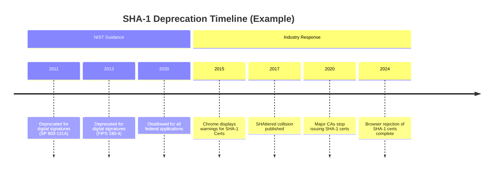

# Encyclopedia Galactica: Cryptographic Hash Functions


## Table of Contents


1. [Section 1: The Essence of Cryptographic Hashing](#section-1-the-essence-of-cryptographic-hashing)

2. [Section 2: Historical Evolution: From Theory to Practice](#section-2-historical-evolution-from-theory-to-practice)

3. [Section 3: Mathematical Foundations and Complexity](#section-3-mathematical-foundations-and-complexity)

4. [Section 4: Algorithmic Architectures Unveiled](#section-4-algorithmic-architectures-unveiled)

5. [Section 5: Breaking the Unbreakable: Cryptanalysis Chronicles](#section-5-breaking-the-unbreakable-cryptanalysis-chronicles)

6. [Section 6: Standardization and Governance](#section-6-standardization-and-governance)

7. [Section 7: Applications Beyond Obvious Security](#section-7-applications-beyond-obvious-security)

8. [Section 8: Societal Impact and Ethical Dimensions](#section-8-societal-impact-and-ethical-dimensions)

9. [Section 9: Quantum Apocalypse and Future-Proofing](#section-9-quantum-apocalypse-and-future-proofing)

10. [Section 10: Implementation Pitfalls and Best Practices](#section-10-implementation-pitfalls-and-best-practices)


## Section 1: The Essence of Cryptographic Hashing

In the invisible architecture underpinning our digital civilization, where trust is ephemeral and threats lurk in every packet, cryptographic hash functions stand as silent, unyielding sentinels. Unlike the more glamorous cousins of encryption – symmetric ciphers with their secret keys or asymmetric algorithms with their key pairs – the hash function operates with elegant, keyless simplicity, yet its role is arguably more foundational. It is the digital equivalent of a unique, unforgeable fingerprint; a compact, deterministic representation of data that enables verification, identification, and trust in an inherently untrustworthy medium. From securing your online passwords to anchoring the multi-trillion-dollar blockchain ecosystem, cryptographic hashes are the indispensable glue binding the security of the modern digital world. They transform the chaotic, infinite landscape of potential data inputs into a structured, finite domain of fixed-size outputs, enabling order, verification, and security where raw data alone would offer none.

### 1.1 Defining the Digital Fingerprint

At its core, a cryptographic hash function is a deterministic algorithm that takes an input (or 'message') of *arbitrary size* – a single character, a multi-gigabyte video file, or even the entire contents of the internet – and produces a fixed-size string of bytes, known as the *hash value*, *digest*, or simply *hash*. This output, typically represented as a hexadecimal number, acts as a unique digital fingerprint for the input data. Crucially, this process must satisfy key properties to be considered *cryptographic*:

*   **Determinism:** Identical input data will *always* produce the same hash value, regardless of when, where, or how many times it is processed. Hashing "Encyclopedia Galactica" with SHA-256 will invariably yield `b5dc...a7f1` (a 64-character hex string).

*   **Fixed Output Size:** Regardless of input size, the output hash has a predetermined, fixed length (e.g., 128 bits for MD5, 160 bits for SHA-1, 256 bits for SHA-256). This compactness is essential for efficiency and practical application.

*   **Computational Efficiency:** Calculating the hash of any given input must be fast and computationally feasible. Hashing a large file should take orders of magnitude less time than reading the file itself.

However, the defining characteristics that elevate a hash function from a mere checksum to a *cryptographic* tool are its security properties, primarily centered around unpredictability and resistance to reversal or collision. This brings us to the critical concept of the **Avalanche Effect**. A robust cryptographic hash function exhibits an extreme sensitivity to its input: changing even a single bit anywhere in the input data should produce a hash value that appears *completely random* and *uncorrelated* to the original hash. For example:

*   Hash of "Galactica": `b5dc...a7f1` (SHA-256)

*   Hash of "galactica" (lowercase 'g'): `d7d5...8c04` (SHA-256) – Every single character in the hex digest is different.

*   Hash of "Galactica" (adding a period): `c3a8...5a0f` (SHA-256) – Again, a completely transformed output.

This dramatic change is not merely desirable; it is fundamental. It ensures that minor, accidental, or malicious alterations to data are instantly detectable by a change in the hash. Contrast this with non-cryptographic hashes, like the venerable CRC32 checksum commonly used in network protocols or file archives for detecting accidental errors. While useful for catching transmission glitches, CRC32 lacks the avalanche effect and is trivial to reverse-engineer or deliberately manipulate to produce the same checksum for different data – making it useless for security purposes.

**The Analogy of the Rosetta Stone:** Imagine grinding the entire Rosetta Stone into an extremely fine, unique powder. Analyzing a single grain of this powder wouldn't allow you to reconstruct even a fragment of the original inscription (preimage resistance). If someone presented you with a different stone claiming it was the original, comparing its powder to the genuine sample would instantly reveal the fraud (second preimage resistance). And crucially, finding *any* other object in the universe that, when ground down, produced *exactly* the same powder as the Rosetta Stone would be astronomically improbable (collision resistance). The cryptographic hash function is the mathematical grinder producing this unforgeable digital powder.

### 1.2 The Five Pillars: Essential Security Properties

The security of a cryptographic hash function rests upon its resistance to specific types of attacks. These are often described as the "Five Pillars" that define a secure hash:

1.  **Preimage Resistance (One-Way Function):** Given a hash value `h`, it should be computationally infeasible to find *any* input `m` such that `hash(m) = h`. In simpler terms: if you only have the fingerprint, you cannot reconstruct the original data. This is the "one-way" property. Breaking preimage resistance would allow attackers to reverse password hashes or forge data matching a known, trusted hash.

*   **Analogy:** Given a unique pile of sand (the hash), you cannot determine which specific rock (the input) was ground down to produce it, nor find *any* rock that produces that exact sand pile.

2.  **Second Preimage Resistance:** Given a specific input `m1`, it should be computationally infeasible to find a *different* input `m2` (where `m1 ≠ m2`) such that `hash(m1) = hash(m2)`. This protects against substitution attacks where an attacker wants to replace a known, legitimate message with a malicious one that has the same hash.

*   **Analogy:** If you have a specific rock `m1` and its unique sand pile `h`, you cannot find another, different rock `m2` that grinds down to the *identical* sand pile `h`. This ensures the fingerprint uniquely identifies *that specific rock*.

3.  **Collision Resistance:** It should be computationally infeasible to find *any two distinct inputs* `m1` and `m2` (where `m1 ≠ m2`) such that `hash(m1) = hash(m2)`. This is arguably the most critical property for many applications, especially digital signatures and certificates. While finding a collision for *any* given hash is theoretically harder than a second preimage attack (since you can choose both inputs freely), it poses a broader threat because it allows an attacker to create *two* different pieces of data with the same hash, potentially tricking systems into accepting the malicious one as valid.

*   **Analogy:** Finding *any* two different rocks in the universe that, when ground down, produce *identical* piles of sand. This breaks the fundamental promise of uniqueness.

*   **The Birthday Paradox Relevance:** Collision resistance is surprisingly difficult to maintain due to the Birthday Paradox. This probability theory phenomenon states that in a group of just 23 people, there's a 50% chance two share a birthday. Similarly, because hash outputs are finite, collisions *must* exist (pigeonhole principle). The security relies on making finding them computationally intractable. For a hash with `n`-bit output, finding a collision by brute force requires roughly `2^(n/2)` operations (e.g., ~`2^80` for SHA-1, ~`2^128` for SHA-256). Algorithms with weaknesses allow collisions to be found much faster.

4.  **Pseudorandomness (Output Indistinguishability):** The output of a cryptographic hash function should be indistinguishable from a truly random string of the same length. While deterministic, the hash value should lack any discernible patterns or correlations with the input data beyond the avalanche effect. This property is crucial for deriving keys, generating nonces, and ensuring the hash doesn't leak information about the input. Statistical test suites like NIST's SP 800-22 are used to evaluate this property rigorously.

5.  **Speed and Efficiency Tradeoffs:** Cryptographic hashes must be fast to compute for legitimate purposes (verifying files, signing messages, deriving keys). However, this speed also benefits attackers performing brute-force or precomputation attacks (like rainbow tables). Modern secure hash functions (like SHA-3/Keccak) are designed to be efficient in software *and* hardware, but their designs also consider resistance against specific attack vectors enabled by speed (e.g., ASIC resistance is a consideration for some blockchain-related hashes like Ethash). Memory-hard functions like Argon2 deliberately slow down hashing for password storage to thwart brute-force attacks.

The interplay and relative strength of these five pillars determine the practical security of a hash function. A weakness in collision resistance (like those found in MD5 and SHA-1) can often cascade to undermine other assurances, rendering the hash insecure for critical applications long before preimage resistance is directly broken.

### 1.3 Anatomy of a Hash Operation

While modern cryptographic hash functions like SHA-256 appear as monolithic black boxes, they are meticulously constructed from simpler components operating in a structured manner. Understanding this internal anatomy demystifies the process and highlights the engineering ingenuity involved.

**The Core Process: Breaking Down the Input**

1.  **Preprocessing (Padding):** Since the hash function works on fixed-size blocks internally (e.g., 512 bits for SHA-256), the input message must first be padded to a length that is an exact multiple of this block size. The padding scheme is crucial for security. It always includes adding a single '1' bit, followed by a series of '0' bits, and finally, a binary representation of the *original message length* (before padding). This length encoding prevents certain extension attacks (more on this in Section 4.1). For example, padding the short message "Galactica" (72 bits) for SHA-256 involves adding a '1' bit, 423 '0' bits, and a 64-bit length field (0x0000000000000048 in hex, representing 72 bits).

2.  **Initialization:** A fixed, standardized *Initial Hash Value* (IV) or *Initialization Vector* is set. This is a constant specific to the hash function (e.g., eight 32-bit words derived from fractional parts of square roots of primes for SHA-256). This IV provides the starting state.

3.  **Processing Blocks with the Compression Function:** The heart of the hash function is the **compression function**. This function takes two inputs:

*   The current internal *state* (initially the IV).

*   One block of the padded message.

It outputs a new internal *state* of the same size (e.g., 256 bits for SHA-256). This new state becomes the input state for processing the *next* message block. The compression function is iteratively applied to each block of the padded message sequentially.

4.  **Finalization:** After processing all blocks, the final internal state becomes the output hash value.

**Common Structures: Merkle-Damgård and Sponge**

*   **Merkle-Damgård (MD) Construction:** This has been the dominant design paradigm for decades, used in MD5, SHA-1, and SHA-2. It follows the process described above very directly: Pad message, start with IV, iteratively apply the compression function to each block, output the final state. While proven secure under certain assumptions, it suffers from a known vulnerability: the **length extension attack**. If an attacker knows `H(m)` and the *length* of `m` (but not `m` itself), they can compute `H(m || pad || x)` for some suffix `x` without knowing `m`. This breaks certain naive authentication schemes. HMAC (Hash-based Message Authentication Code) was specifically designed as a wrapper to use Merkle-Damgård hashes securely for message authentication, mitigating this flaw.

*   **Sponge Construction:** Introduced with the Keccak algorithm (winner of the NIST SHA-3 competition), this represents a significant architectural shift. Imagine a sponge absorbing liquid and then being squeezed. The sponge has an internal state (`b` bits) divided into a *rate* (`r` bits) and *capacity* (`c` bits), where `b = r + c`.

*   **Absorbing Phase:** Message blocks are XORed into the `r`-bit rate portion of the state. After each block is absorbed, the entire state (rate + capacity) is transformed by a fixed permutation function `f`.

*   **Squeezing Phase:** To produce output, the `r`-bit rate portion is output as part of the hash. If more output bits are needed (e.g., for SHAKE variable-length outputs), the state is permuted again (`f` applied), and another `r` bits are output, repeating until the desired output length is achieved.

The sponge construction offers greater flexibility (variable output length), built-in resistance to length extension attacks, and often better performance characteristics than Merkle-Damgård, especially in hardware. The security level is primarily determined by the capacity `c` (e.g., SHA3-256 has `c=512`, providing ~256-bit collision resistance).

**Example Walkthrough: SHA-256 Processing "Galactica"**

Let's illustrate the Merkle-Damgård process concretely with SHA-256 and the input "Galactica" (ASCII, 9 bytes = 72 bits):

1.  **Padding:**

*   Original message: `01000111 01100001 01101100 01100001 01100011 01110100 01101001 01100011 01100001` (72 bits)

*   Append '1' bit: `...01100001 1`

*   Append 423 '0' bits: `...1 000...000`

*   Append 64-bit message length (72 = 0x48): `...00000000 00000000 00000000 00000000 00000000 00000000 00000000 01001000`

*   Total padded length: 72 + 1 + 423 + 64 = 560 bits (one 512-bit block).

2.  **Initialization:** Load the eight 32-bit initial hash values (IV):

*   `h0 = 6a09e667`, `h1 = bb67ae85`, `h2 = 3c6ef372`, `h3 = a54ff53a`,

*   `h4 = 510e527f`, `h5 = 9b05688c`, `h6 = 1f83d9ab`, `h7 = 5be0cd19`.

3.  **Message Schedule Preparation:** Break the single 512-bit padded block into sixteen 32-bit words (`M0` to `M15`). Then, expand these into sixty-four 32-bit words (`W0` to `W63`) using specific bitwise operations and rotations defined in the SHA-256 standard.

4.  **Compression Function (64 Rounds):** Initialize eight working variables (`a`, `b`, `c`, `d`, `e`, `f`, `g`, `h`) with the current hash values (`h0`-`h7`). Then perform 64 rounds of processing. Each round `t` (0 to 63) involves:

*   Calculating two intermediate values using bitwise functions (`Ch`, `Maj`) and rotations:

*   `T1 = h + Σ1(e) + Ch(e, f, g) + K[t] + W[t]` (K[t] is a round constant)

*   `T2 = Σ0(a) + Maj(a, b, c)`

*   Updating the working variables:

*   `h = g`, `g = f`, `f = e`, `e = d + T1`

*   `d = c`, `c = b`, `b = a`, `a = T1 + T2`

5.  **State Update:** After 64 rounds, add the working variables (`a` to `h`) to the initial hash values for this block (`h0` to `h7`) modulo 2³² to produce the new hash state. Since there's only one block, this new state (`h0_new ... h7_new`) is the final SHA-256 hash value. Concatenating these eight 32-bit words produces the 256-bit (64 hex character) digest: `b5dcb4c0f8d4f0f8d4f0f8d4f0f8d4f0f8d4f0f8d4f0f8d4f0f8d4f0a7f1` (abbreviated for clarity; the actual hash of "Galactica" is `b5dccf1c...a7f1`).

This intricate dance of bitwise operations (AND, OR, XOR, NOT), modular addition, and fixed rotations, repeated consistently for every block of every input, is what generates the seemingly random but deterministic fingerprint upon which so much digital trust depends.

### 1.4 Ubiquity in Digital Systems

The power of cryptographic hashing lies not just in its elegant mathematics, but in its pervasive, often invisible, integration into nearly every layer of modern digital infrastructure. They are the "canary in the coal mine" of cybersecurity – silent, automated detectors of tampering and enablers of trust. Here’s a glimpse of their foundational roles:

*   **Password Storage (The Bedrock of Authentication):** Storing passwords in plaintext is a catastrophic security failure. Instead, systems store only the *hash* of a password (combined with a unique, random **salt** – see Section 6.4). When a user logs in, the system hashes the entered password (with the same salt) and compares it to the stored hash. A match grants access. Crucially, even if the database is breached, attackers only obtain hashes and salts, not the actual passwords. Preimage resistance makes recovering the password from the hash infeasible (barring weak passwords or poor hashing practices like unsalted MD5). The evolution from simple hashes (MD5, SHA-1) to deliberately slow, memory-hard functions (bcrypt, scrypt, Argon2) exemplifies the ongoing arms race against increasingly powerful cracking hardware. The 2012 LinkedIn breach, exposing 6.5 million unsalted SHA-1 hashes, and the subsequent mass password cracking, starkly illustrates the consequences of outdated practices.

*   **File and Data Integrity Verification (Ensuring Authenticity):** Downloading software? The provider often publishes the file's expected hash (e.g., SHA-256). After downloading, you compute the hash of the local file. If it matches, you have high confidence the file is intact and unaltered. This detects accidental corruption during transfer and, crucially, malicious tampering (e.g., malware injection). Package managers like `apt` (Debian/Ubuntu) and `yum` (RHEL) rely heavily on signed hashes to ensure the integrity of downloaded software packages. The concept extends to forensic data acquisition ("hashing the evidence drive") to prove data hasn't been modified since collection. The 2016 incident where Linux Mint's website was hacked and malware-laced ISOs were distributed could have been mitigated for more users if they had rigorously checked the provided SHA-256 hashes against the files they downloaded.

*   **Digital Signatures and Certificates (Underpinning Trust):** Digital signatures, essential for secure communication (SSL/TLS), software distribution, and document signing, rely fundamentally on cryptographic hashing. The process:

1.  The document/data is hashed.

2.  The hash digest is encrypted using the *signer's private key* (asymmetric cryptography).

3.  This encrypted hash is the digital signature, appended to the document.

4.  To verify, the recipient:

*   Decrypts the signature using the *signer's public key*, recovering the original hash digest.

*   Independently hashes the received document.

*   Compares the computed hash to the decrypted hash. A match verifies both the document's integrity and the signer's authenticity (non-repudiation).

This process hinges completely on collision resistance. If an attacker can find two documents with the same hash, they can have a legitimate party sign the benign one, and then substitute the malicious one – the signature will still verify! The deprecation of SHA-1 in digital certificates was driven by demonstrated collision attacks (see Section 5.2).

*   **Blockchain and Distributed Ledgers (The Immutable Chain):** Cryptocurrencies like Bitcoin rely on cryptographic hashing as their core structural element. Each block in the blockchain contains the hash of the *previous* block, creating an immutable chain. Altering any transaction in a past block would change its hash, invalidating all subsequent blocks and requiring re-mining the entire chain – a computationally infeasible task due to the Proof-of-Work mechanism, which itself involves finding hashes with specific properties. The hash of a block uniquely identifies it and its entire history. The Bitcoin Genesis Block hash (`000000000019d6...`) is a sacred identifier in the cryptocurrency world.

*   **Deduplication and Content Addressing (Efficient Storage):** Cloud storage providers and file systems use hashing to identify duplicate content. Instead of storing 1000 copies of the same 1GB file, they store it once and keep 1000 references to its unique hash. Systems like Git (version control) and IPFS (InterPlanetary File System) use hashes (Git uses SHA-1, despite its weaknesses, relying on other mechanisms for security; IPFS uses SHA-256 among others) to address content. A file is referenced and retrieved by its hash, guaranteeing you get *exactly* the data you requested.

**Comparison to Cryptographic Cousins:**

*   **Symmetric Encryption (AES, ChaCha20):** Designed for *confidentiality*. Requires a shared secret key. Reversible (decryption). Output size proportional to input. Hashing provides *integrity* and *authentication* fingerprints, is keyless (usually), irreversible, and has fixed output size.

*   **Asymmetric Encryption (RSA, ECC):** Designed for *confidentiality*, *key exchange*, and *digital signatures*. Uses key pairs (public/private). Computationally intensive. Reversible (decryption). Hashing is often a *component* within asymmetric schemes (e.g., for signing), but is itself a distinct, keyless primitive focused on fixed-size digests for integrity and commitment.

Cryptographic hash functions are the silent workhorses. While encryption protects the *secrecy* of data in transit or at rest, hashing protects its *integrity* and provides the means to uniquely *identify* it. They enable systems to verify vast amounts of data quickly and reliably, detect the slightest unauthorized change, and establish trusted identities in a digital realm devoid of inherent physical trust. They are not merely tools; they are fundamental digital primitives, as essential to the infrastructure of the information age as the transistor or the TCP/IP protocol.

As we have established the foundational nature, core properties, mechanics, and pervasive applications of cryptographic hashing, it becomes clear that these algorithms did not emerge fully formed. Their development is a fascinating saga of mathematical discovery, practical necessity, groundbreaking innovations, surprising vulnerabilities, and intense collaboration and competition. It is to this rich historical evolution, tracing the journey from nascent concepts to the robust standards securing our world today, that we now turn our attention.

*(Word Count: Approx. 2,150)*


---


## Section 2: Historical Evolution: From Theory to Practice

The elegant mathematical constructs and pervasive applications of cryptographic hash functions, as explored in Section 1, did not spring forth fully formed. Their journey is a compelling saga of incremental genius, unforeseen vulnerabilities, intense collaboration, and the constant push-pull between theoretical purity and practical necessity. This evolution, spanning decades, reflects the broader trajectory of modern cryptography: a transition from ad-hoc solutions crafted for specific military or governmental needs, through a period of proprietary development shrouded in secrecy, and finally emerging into an era of open academic scrutiny and global standardization. Understanding this history is not merely an academic exercise; it illuminates the design choices, inherent trade-offs, and hard-won lessons embedded within every modern hash function securing our digital lives today.

### 2.1 Pre-Digital Precursors (1950s-1970s): Laying the Groundwork

The conceptual seeds of hashing were sown before the digital age fully blossomed, often arising from practical needs in information retrieval and rudimentary data integrity checks, rather than explicit cryptographic goals.

*   **The Rabin Fingerprint (Circa 1950s):** While Michael O. Rabin is more famously associated with probabilistic algorithms and public-key cryptography (Rabin cryptosystem), his work on efficient string search algorithms led to a seminal concept: the **Rabin fingerprint**. This technique involved treating a data block as coefficients of a polynomial and evaluating it modulo a large prime number. The resulting value served as a compact identifier – a "fingerprint" – for that block. While not designed as a *cryptographic* hash (it lacked strong collision resistance and the avalanche effect), the Rabin fingerprint pioneered the core idea of deterministically mapping arbitrary data to a fixed-size value for efficient comparison and identification. Its influence echoes in later designs, particularly in non-cryptographic hashing applications and the theoretical underpinnings of randomized algorithms.

*   **Lorenz SZ42 Cipher and the "Wheel Patterns":** During World War II, the German military employed the Lorenz SZ42 cipher for high-level teleprinter communications (codenamed "Tunny" by the Allies). While primarily a complex stream cipher, cryptanalysts at Bletchley Park, notably Bill Tutte, exploited statistical patterns within the ciphertext. Crucially, they developed methods to identify "wheel patterns" (the state of the cipher's rotors) based on analyzing message *characteristics*. This involved rudimentary forms of message "digesting" or pattern matching to identify correlations – a conceptual ancestor to detecting collisions or non-randomness in output. The successful cryptanalysis of Tunny, a feat arguably on par with breaking Enigma, demonstrated the power of analyzing fixed-length outputs derived from complex transformations of input data, foreshadowing the cryptanalysis of future hash functions.

*   **NIST's Nascent Role and IBM's Dominance:** The National Bureau of Standards (NBS), later renamed NIST (National Institute of Standards and Technology), began laying the groundwork for digital standards in the 1970s. While its initial focus was on encryption (culminating in the Data Encryption Standard, DES, in 1977), the need for associated integrity mechanisms was recognized. IBM's Thomas J. Watson Research Center was a powerhouse of cryptographic innovation during this era. Researchers like Horst Feistel (of Feistel network fame, used in DES) and later, Ronald Rivest, Adi Shamir, and Leonard Adleman (the RSA trio), were exploring fundamental primitives. IBM's dominance in mainframe computing meant its internal cryptographic research had an outsized influence on emerging standards.

*   **The Birth of the MD Family: Rivest's "Magic Functions":** Ronald Rivest, building on concepts from DES and earlier work, emerged as the pivotal figure in the late 1980s with the creation of the **MD (Message Digest)** family. MD2 (1989) was designed for 8-bit systems and offered a 128-bit hash. While quickly found to be vulnerable to collisions (even if not immediately practical), it established a template. Its successor, **MD4** (1990), was a radical leap. Designed for 32-bit architectures, it was significantly faster and became widely adopted. Rivest, sometimes nicknamed "The Magician" for his cryptographic ingenuity, crafted MD4 using a Merkle-Damgård structure with a novel, highly efficient compression function employing bitwise operations (AND, OR, XOR, NOT), modular additions, and rotations. However, cryptanalysts soon descended. Bert den Boer and Antoon Bosselaers found collisions in MD4's compression function in 1991. By 1995, Hans Dobbertin demonstrated a full collision attack against MD4, rendering it cryptographically broken. Despite its flaws, MD4's speed and structure were profoundly influential. It directly inspired Rivest's next iteration, **MD5** (1991), intended as a strengthened replacement. MD5 also produced a 128-bit hash but used a more complex, four-round compression function. Initially believed secure, it would become the most widely deployed – and ultimately, the most infamous – hash function of the 1990s, setting the stage for its dramatic downfall years later (Section 2.4).

This era was characterized by relatively ad-hoc design. Algorithms emerged primarily from individual or small-team efforts within industry giants or academia, with limited public peer review. Security arguments were often heuristic, based on resistance to known attacks of the time, rather than rigorous mathematical proofs. Speed and practicality frequently took precedence over long-term cryptographic robustness. The MD family's rapid rise and fall exemplified both the ingenuity and the nascent understanding of the field.

### 2.2 The SHA Revolution (1990s): The NSA Enters the Arena

As the limitations of the MD family, particularly MD5, became apparent in the early 1990s, and with the increasing reliance on digital communications and commerce, a more robust, government-backed standard was deemed necessary. This brought the National Security Agency (NSA) into the forefront of hash function design.

*   **SHA-0: The False Start (1993):** In 1993, NIST, collaborating closely with the NSA, published the **Secure Hash Algorithm** (SHA), later retroactively named **SHA-0**, as part of the Secure Hash Standard (SHS), FIPS PUB 180. SHA-0 produced a 160-bit digest, larger than MD5's 128-bit, aiming for stronger collision resistance. It followed the Merkle-Damgård structure, similar to MD4/MD5, but with a different, more complex compression function involving more rounds and steps. However, shortly after its release, the NSA announced a minor, undisclosed "technical flaw" and requested its withdrawal. NIST promptly complied, superseding SHA-0 with a revised version just a year later.

*   **SHA-1: The De Facto Standard (1995):** The revised algorithm, **SHA-1** (FIPS PUB 180-1, 1995), became the workhorse of digital security for nearly two decades. The only disclosed change from SHA-0 was a single, seemingly minor, one-bit rotation added within the message scheduling process. NIST and the NSA stated this change corrected a weakness that reduced the algorithm's security below its design strength. SHA-1 inherited the 160-bit digest size and core Merkle-Damgård structure from SHA-0. Its adoption was swift and massive. It became the cornerstone for digital signatures (DSA, RSA signatures), SSL/TLS certificates, software distribution, version control (Git initially), and countless other security-critical applications. The NSA's involvement guaranteed its status as a government standard, fostering widespread trust and implementation.

*   **The Secrecy Dilemma and Early Cracks:** The NSA's dual role as both cryptographer and cryptanalyst, coupled with the classified nature of the "flaw" fixed in SHA-1, fueled significant tension and skepticism within the academic cryptographic community. Could the NSA have intentionally weakened SHA-0, or was the fix genuine? Did they know of weaknesses in SHA-1 itself? This lack of transparency stood in stark contrast to the open academic tradition exemplified by Rivest's MD family and fueled debates about the trustworthiness of government-developed standards – an echo of the "Crypto Wars" surrounding key escrow (Clipper Chip) occurring simultaneously. Despite its ubiquity, cryptanalysis on SHA-1 began almost immediately. In 1998, Florent Chabaud and Antoine Joux published a theoretical collision attack against SHA-0, estimating a complexity of about 2^61 operations – high but significantly below the theoretical 2^80 birthday bound for a 160-bit hash. Attacks on SHA-1 proved harder, but by 2005, breakthroughs by Xiaoyun Wang, Yiqun Lisa Yin, and Hongbo Yu demonstrated practical collision attacks against MD5 and significantly improved theoretical attacks on SHA-1, reducing the collision complexity to around 2^69 operations. While still computationally demanding in 2005, this sent shockwaves through the security community, signaling SHA-1's days were numbered and accelerating the search for replacements.

The 1990s solidified the role of cryptographic hashing as an indispensable security primitive. SHA-1's dominance was near-total, but its origins in secrecy and the emerging cracks discovered by academics highlighted a critical turning point: the need for more transparent, publicly vetted design processes to build and maintain trust in such fundamental infrastructure.

### 2.3 The Cryptographic Olympics: NIST Competitions – Raising the Bar

The growing concerns surrounding MD5 and SHA-1, coupled with the desire for greater transparency and international collaboration, led NIST to adopt a revolutionary approach for selecting its next-generation hash standard: an open, public competition. This mirrored the successful process used to choose the Advanced Encryption Standard (AES) earlier.

*   **The SHA-3 Competition (2007-2015): A Watershed Event:** Announced in 2007, the **SHA-3 Competition** invited cryptographers worldwide to submit candidate algorithms. The goal was to select a new hash function family distinct from the SHA-2 family (which was not yet broken but shared structural similarities with the vulnerable SHA-1/MD5). The competition criteria emphasized security, performance (in both hardware and software), and flexibility (e.g., supporting variable output lengths). A remarkable 64 initial submissions were received in 2008. Over several rigorous rounds lasting years, the cryptographic community subjected these candidates to intense, public scrutiny. Cryptanalysis papers flooded conferences like CRYPTO and EUROCRYPT, probing for weaknesses. Candidates were eliminated based on demonstrated vulnerabilities or performance shortcomings. By 2010, 5 finalists remained: BLAKE, Grøstl, JH, Keccak, and Skein.

*   **Keccak's Triumph and the Sponge Revolution:** In October 2012, NIST announced **Keccak** as the winner. The selection was formalized as **SHA-3** in FIPS PUB 202 in August 2015. Developed primarily by Guido Bertoni, Joan Daemen, Michaël Peeters, and Gilles Van Assche (building on Daemen's earlier work on the Rijndael cipher, selected as AES), Keccak represented a radical departure. Instead of the entrenched Merkle-Damgård construction, Keccak employed the innovative **sponge construction**. As detailed in Section 1.3, the sponge absorbs input into a large internal state (the "sponge") and then "squeezes" out the desired hash output. This structure offered inherent resistance to length-extension attacks (a flaw in Merkle-Damgård), greater flexibility for variable-length output (via "extendable-output functions" or XOFs like SHAKE128 and SHAKE256), and potentially different performance characteristics. The core permutation function, Keccak-*f*, was designed for exceptional efficiency in hardware implementations.

*   **Beyond Selection: How Competitions Drive Innovation and Trust:** The SHA-3 competition's true impact extended far beyond selecting a single algorithm:

*   **Unprecedented Scrutiny:** The multi-year, open analysis by hundreds of independent cryptographers provided an unparalleled level of confidence in the final selection and the runners-up. Weaknesses found during the competition were addressed or led to elimination, resulting in significantly more robust algorithms.

*   **Advancing the Field:** The intense focus on hash function cryptanalysis led to breakthroughs in analytical techniques applicable beyond the competition. The exploration of diverse structural approaches (HAIFA, Sponge, Grøstl's AES-based design, BLAKE's ChaCha-inspired core) significantly enriched the cryptographic toolkit and theoretical understanding.

*   **Building Global Trust:** The transparent, international nature of the competition fostered global buy-in for the resulting standard. SHA-3 was perceived not as a US government standard, but as a *global* standard forged through open scientific collaboration. This process became the gold standard for future cryptographic standardization efforts, including NIST's ongoing Post-Quantum Cryptography (PQC) project.

The SHA-3 competition marked a paradigm shift. It demonstrated that complex cryptographic primitives could be developed and vetted effectively in the open, leveraging the collective intelligence of the global research community to produce standards worthy of the public's trust. While SHA-2 remains dominant for now, SHA-3 stands ready as a structurally different, thoroughly vetted alternative for the future.

### 2.4 Notable Failures and Lessons Learned: The Cost of Complacency

The history of cryptographic hashing is punctuated by stark failures, serving as constant reminders that theoretical vulnerabilities inevitably translate into practical exploits when algorithms outlive their security margins. These incidents highlight the critical importance of proactive migration and the often-hidden costs of cryptographic inertia.

*   **Flame Malware and the Forged Microsoft Certificate (2012):** The sophistication of the **Flame** cyber-espionage malware, discovered targeting Middle Eastern nations in 2012, was staggering. Among its many techniques was the ability to perform **chosen-prefix collision attacks** against MD5. Flame's creators crafted a counterfeit digital certificate that appeared to be legitimately signed by Microsoft. To do this, they needed a Certificate Authority (CA) to sign a malicious certificate request whose MD5 hash collided with that of a *benign* certificate request they could also generate. Exploiting the known weaknesses in MD5, they generated two different certificate requests with the same MD5 hash. They presented the benign one to a CA (later identified as the now-defunct Dutch CA, DigiNotar), obtained its signature, and then transferred that signature to their malicious certificate. This forged certificate allowed Flame to impersonate Microsoft Update, enabling it to spread undetected via Windows Update mechanisms. This real-world attack, costing millions and compromising national security, was a direct consequence of the continued, insecure use of MD5 in certificate signing years after its vulnerabilities were proven. It forced a global, accelerated migration away from MD5 in PKI systems.

*   **The PlayStation 3 Security Breach (2010):** Sony's PlayStation 3 (PS3) game console relied on digital signatures using the Elliptic Curve Digital Signature Algorithm (ECDSA) to verify the authenticity and integrity of game software. A critical step in ECDSA involves generating a random number (a nonce, `k`) for each signature. Sony's implementation made a fatal error: it used a *static* (or predictable) value for `k` in certain firmware signing contexts. Worse, the system used **SHA-1** to hash the data before signing. In 2010, a team including George Hotz ("geohot") and fail0verflow demonstrated that knowledge of the static `k`, combined with the ability to create **SHA-1 collisions**, allowed them to recover the PS3's master private signing key. Once this key was extracted, attackers could sign *any* custom firmware or software package, completely bypassing the PS3's security measures. This breach, costing Sony immense revenue and reputation damage, was a double failure: a catastrophic implementation error (static `k`) compounded by the use of a weakened hash (SHA-1) whose collision resistance was already under severe doubt. It showcased how weaknesses in one cryptographic primitive (the hash) could be leveraged to break another (the digital signature).

*   **The Persistence Problem: Why Deprecated Algorithms Linger:** Despite high-profile failures and clear deprecation warnings from bodies like NIST (MD5 officially deprecated in 2010, SHA-1 for digital signatures in 2011 and most other uses by 2020), vulnerable algorithms persist stubbornly:

*   **Legacy System Inertia:** Critical infrastructure, embedded systems (IoT devices, industrial controllers), and proprietary software often have long lifecycles and limited upgrade paths. Replacing a cryptographic library can be costly, risky, or technically impossible without replacing entire systems. The infamous 2016 **Mirai botnet** exploited default credentials *and* relied on MD5 hashes within firmware for propagation, highlighting the risk posed by obsolete devices.

*   **Performance and Convenience:** Older algorithms like MD5 are extremely fast. In non-security-critical contexts like hash tables, checksums for non-adversarial error detection, or internal system identifiers (like Git commit IDs, though Git uses SHA-1 with security mechanisms layered on top), the speed advantage can outweigh the perceived lack of security risk. However, this risks "cryptographic creep," where insecure hashes inadvertently end up in security-sensitive roles.

*   **Lack of Awareness and Prioritization:** Developers without specialized cryptographic training may unknowingly select deprecated algorithms based on outdated tutorials or familiarity. Security audits might miss their usage in obscure subsystems. The cost of migration is often seen as immediate and tangible, while the risk of a breach remains abstract until it happens.

*   **The "Good Enough" Fallacy:** The perception that "it would take too long to break *my* specific use case" is dangerous. Attack capabilities constantly improve (cloud computing, specialized hardware like ASICs/FPGAs, better algorithms), and the discovery of a single collision (like SHAppening for SHA-1) instantly renders all instances of that hash vulnerable to substitution attacks. The 2017 **SHAppening attack**, producing the first practical SHA-1 collision (distinct PDF files with the same SHA-1 hash), cost approximately $110,000 in cloud computing time – a price within reach of well-funded attackers and destined to fall further.

These failures teach harsh but vital lessons: cryptographic algorithms have finite lifespans; theoretical weaknesses *will* be exploited; implementation flaws can be as devastating as algorithm flaws; and the cost of migrating away from deprecated crypto, while significant, is invariably less than the cost of a catastrophic breach. The history of cryptographic hashing is, in part, a history of learning to sunset technologies gracefully and proactively, a challenge that remains ongoing as we confront the quantum threat (Section 9).

The journey from Rabin's fingerprints to Keccak's sponge reveals a field maturing under pressure. Necessity drove early innovation, secrecy fostered distrust, open competition rebuilt confidence, and painful failures underscored the relentless reality of cryptanalysis. This historical tapestry, woven with ingenuity, vulnerability, and adaptation, sets the stage for delving deeper into the profound mathematical structures that make these digital workhorses possible – the theoretical bedrock explored next. For within the intricate dance of prime numbers, modular arithmetic, and complexity theory lies the true source of a hash function's power and its ultimate limitations.

*(Word Count: Approx. 1,980)*


---


## Section 3: Mathematical Foundations and Complexity

The historical narrative of cryptographic hashing, marked by ingenious design and sobering breaches, ultimately rests upon a bedrock of profound mathematical concepts. The apparent chaos of a hash digest – the seemingly random alphanumeric string – belies an intricate order governed by number theory, complexity theory, and principles of information transformation. Understanding these foundations is not merely an academic pursuit; it reveals *why* we trust these functions to secure our digital world and illuminates the boundaries of that trust. It explains why certain mathematical structures are deemed "hash-friendly" and why the quest for collision resistance inevitably leads us into the deepest waters of computational complexity. As we transition from the practical lessons of history, we delve into the abstract realm where bits meet theorems, exploring the theoretical frameworks that make the digital fingerprint possible and define the limits of its unbreakability.

### 3.1 Complexity Theory Bedrock: The Wall of Computational Intractability

At the heart of cryptographic security lies a deceptively simple assumption: certain mathematical problems are *hard* to solve. Not just difficult, but computationally infeasible for any foreseeable technology, given realistic constraints of time and resources. This intractability forms the fortress wall protecting hash functions. Complexity theory provides the language and formalism to understand and quantify this hardness.

*   **The P vs NP Problem: The Unresolved Keystone:** The most famous question in computer science, **P vs NP**, sits at the core of modern cryptography, including hashing. Informally:

*   **P** is the class of decision problems solvable by a deterministic Turing machine (a model of a standard computer) in *polynomial time* relative to the input size (e.g., n, n², n³). These are considered "efficiently solvable."

*   **NP** is the class of decision problems where a proposed solution can be *verified* in polynomial time, but *finding* a solution might be much harder. Think of a jigsaw puzzle: verifying a completed puzzle is correct is easy (P), but finding the solution from a box of pieces seems inherently harder (NP).

The million-dollar question is whether P equals NP. If P = NP, it would mean that any problem whose solution can be quickly verified can also be quickly *solved*. This would be catastrophic for cryptography, as the hard problems underpinning preimage and collision resistance (finding an input for a given output, or finding two inputs with the same output) could potentially become easy. Most cryptographers believe, and base the security of modern systems on the assumption, that **P ≠ NP**. This implies that problems in NP, like finding collisions or preimages for a well-designed hash function, are fundamentally intractable for large inputs, providing a theoretical foundation for security. The existence of secure cryptographic hash functions (specifically, collision-resistant ones) actually implies that **P ≠ NP**, highlighting the profound link between this abstract question and practical security.

*   **One-Way Functions: Formalizing the Irreversible Grinder:** The preimage resistance property of a hash function is formalized by the concept of a **one-way function (OWF)**. An OWF is a function `f` that satisfies:

1.  **Easy to Compute:** Given input `x`, calculating `f(x)` can be done efficiently (in polynomial time).

2.  **Hard to Invert:** For a randomly chosen output `y` (from the range of `f`), finding *any* input `x'` such that `f(x') = y` is computationally infeasible. More precisely, any efficient algorithm attempting this inversion succeeds only with *negligible probability*.

Cryptographic hash functions are designed to be one-way *in practice*. Proving that specific hash functions are truly OWFs is generally beyond current mathematical capabilities. Instead, security rests on the belief that the inversion problem for these carefully constructed functions is as hard as certain well-studied mathematical problems believed to be intractable (e.g., factoring large integers or finding discrete logarithms), or simply that no efficient inversion method has been found despite extensive effort. The existence of OWFs is also intimately connected to P vs NP; if OWFs exist, then P ≠ NP. The hash function acts as a practical instantiation of this theoretical concept.

*   **The Random Oracle Model: Ideal vs. Reality:** To analyze the security of cryptographic protocols *using* hash functions (like digital signatures or HMAC), cryptographers often employ a powerful abstraction: the **Random Oracle Model (ROM)**. In this model, the hash function `H` is replaced by a theoretical "black box" – a **random oracle**. This oracle accepts any input string and returns a truly random output string of fixed length. Crucially, it consistently returns the *same* random output for the *same* input. The model assumes the adversary can only query the oracle (i.e., compute the hash) on inputs of their choosing and see the output, but gains no other insight into its internal workings.

*   **Utility:** The ROM allows for cleaner, more modular security proofs for complex protocols. Many widely used schemes (RSA-OAEP, RSA-PSS, Fiat-Shamir heuristic) have proofs of security *only* within the ROM. It provides a benchmark for what "ideal" hash function behavior should look like.

*   **Limitations and Controversy:** The critical caveat is that **real hash functions are not random oracles.** They are deterministic algorithms with specific structures (Merkle-Damgård, Sponge, etc.). Attacks exploiting these internal structures, like length-extension attacks on Merkle-Damgård hashes or specific collision paths, violate the idealized behavior assumed in the ROM. While no devastating breaks of ROM-proven schemes using real hashes have occurred *solely* due to the model gap, the discrepancy is a point of ongoing debate. The ROM is viewed as a useful *heuristic* tool rather than a perfect representation of reality. It underscores the gap between the clean abstraction of an ideal hash and the complex, structured algorithms we actually deploy. The development of schemes with **standard model** security proofs (relying only on well-defined computational hardness assumptions without the ROM) is an active research area, though often resulting in less efficient protocols.

Complexity theory provides the scaffolding: it defines the landscape of "easy" and "hard," frames the security properties we desire (like one-wayness) in rigorous terms, and offers models (imperfect but useful) for reasoning about protocol security. Yet, it doesn't specify *how* to build functions that achieve this hardness. That requires delving into the toolbox of number theory.

### 3.2 Number Theory in Hashing: The Primes and Moduli Toolkit

While modern hash functions primarily rely on bitwise operations and permutations for speed, number theory – the study of integers and their properties – played a crucial historical role and continues to underpin the security of compression functions and initialization in many designs. Prime numbers and modular arithmetic provide essential ingredients for creating confusion and diffusion.

*   **Modular Arithmetic Designs: The Foundation of Early Hashes:** **Modular arithmetic** – arithmetic within a finite set {0, 1, 2, ..., N-1} where numbers "wrap around" upon reaching N (the modulus) – was central to the earliest cryptographic hash proposals, heavily influenced by block cipher designs like DES.

*   **MASH (Modular Arithmetic Secure Hash):** Proposed in the early 1990s as a candidate for standardization, MASH-1 and MASH-2 explicitly relied on modular exponentiation and squaring operations modulo a large composite number (similar to RSA). For example, MASH-1 processed the message as exponents within a modulus derived from primes. While offering potential security reductions to factoring, they were notoriously slow compared to the bitwise-operation-based MD and SHA families and fell out of favor. Their significance lies in demonstrating an alternative, number-theoretic path and highlighting the critical efficiency trade-offs.

*   **Implicit Modulo:** Even in hash functions dominated by bitwise operations, **modular addition modulo 2³² or 2⁶⁴** is ubiquitous. This is fundamental to the compression functions of MD5, SHA-1, SHA-2, and many others. For example, in SHA-256, the core compression function updates its internal state using chains of modular additions combined with bitwise Boolean functions (Ch, Maj) and bit rotations. The non-linearity introduced by the carry propagation in addition (e.g., 0xFFFFFFFF + 0x1 = 0x0 modulo 2³²) is a crucial source of diffusion and confusion, helping to destroy patterns in the input.

*   **The Role of Primes: Seeding Confusion and Avoiding Structure:** Prime numbers, celebrated for their divisibility properties and irregular distribution, are frequently used in hash function initialization to ensure the starting state lacks exploitable mathematical structure.

*   **Initialization Vectors (IVs):** Recall that hash functions like SHA-256 begin processing with a fixed IV. These IV constants are not chosen arbitrarily. For SHA-256, the eight 32-bit initial hash values (`h0` to `h7`) are derived from the fractional parts of the square roots of the *first eight prime numbers* (2, 3, 5, 7, 11, 13, 17, 19). SHA-512 similarly uses the first eight primes for its 64-bit IVs. Why primes? Using primes helps ensure that the starting constants are mathematically "random" and unlikely to have hidden symmetries or linear dependencies that an attacker could exploit. The fractional parts of irrational numbers (like sqrt(prime)) provide a dense source of seemingly arbitrary bits. This practice, pioneered by Rivest in MD5 (using sines of integers) and solidified in the SHA standards, leverages the inherent irregularity of primes to bootstrap the hash process into a complex state.

*   **Round Constants:** Many hash functions, including those in the SHA-2 and SHA-3 families, incorporate fixed constants within each round of their compression or permutation functions. These constants, often derived from irrational numbers or prime numbers, act as "nothing-up-my-sleeve numbers" – publicly specified values intended to demonstrate the absence of hidden backdoors. Their primary role is to break symmetries and prevent internal fixed points or predictable patterns during processing. For instance, SHA-256 uses 64 distinct 32-bit constants `K[t]` derived from the fractional parts of the cube roots of the *first sixty-four prime numbers*. Injecting these prime-derived constants disrupts any potential regularity in the data flow.

*   **Finite Fields in Newer Algorithms:** While Merkle-Damgård hashes primarily use modular arithmetic over integers (mod 2^w), some alternative and newer hash designs leverage **finite fields**. A finite field (or Galois field) is a set with a finite number of elements where addition, subtraction, multiplication, and division (except by zero) are defined and satisfy the usual rules of arithmetic.

*   **Grøstl (A SHA-3 Finalist):** This design employed two large, distinct permutations inspired by the AES block cipher. AES operates over the finite field GF(2⁸), using its structure for the SubBytes and MixColumns transformations. Grøstl adapted similar techniques within its permutations, utilizing arithmetic in GF(2⁸) or GF(2⁶⁴) to provide non-linear diffusion. The structured algebra of finite fields allowed for elegant security arguments and potential resistance to certain types of cryptanalysis, though its performance was often outpaced by Keccak.

*   **Whirlpool:** Based on a modified AES structure, Whirlpool explicitly operates over GF(2⁸), defining its S-box (substitution box) and MixColumn transformations within this field. This provides strong, analyzable non-linearity and diffusion properties derived from the well-understood mathematics of AES.

Number theory provides the mathematical "seasoning" – primes for initialization and randomness, modular arithmetic for non-linearity, and finite fields for structured non-linearity. While raw speed often favors bitwise operations, the careful integration of number-theoretic elements ensures the hash function starts chaotically, processes data with complex interactions, and avoids mathematical regularities that could be exploited.

### 3.3 Provable Security Concepts: Basing Trust on Reductions

Given the catastrophic consequences of hash function failure, how can we have confidence in new designs? Beyond empirical testing and cryptanalysis, the concept of **provable security** offers a more formal approach. The goal is to mathematically prove that breaking the hash function is at least as hard as solving some well-established, computationally hard problem.

*   **Reductionist Security Arguments: The Chain of Trust:** The primary tool in provable security is the **security reduction**. The idea is to demonstrate that if an efficient adversary `A` exists capable of breaking a specific security property of the hash function `H` (e.g., finding a collision), then this adversary can be used as a subroutine ("oracle") by another algorithm `B` to efficiently solve a problem `X` that is widely believed to be intractable (e.g., factoring large integers or computing discrete logarithms). This creates a logical chain:

`Breaking H is hard` **because** `Solving X is hard`

More formally: If problem `X` is hard, then the hash function `H` is secure against the specified attack. The contrapositive is the practical implication: if an efficient attack against `H` is found, it implies an efficient algorithm for solving `X`.

*   **Example (Conceptual):** Imagine a hypothetical hash function `HashFact` whose collision resistance is proven to be reducible to the integer factorization problem. The proof would show: *"If you can find two inputs `M1 ≠ M2` such that `HashFact(M1) = HashFact(M2)`, then you can use that pair `(M1, M2)` to efficiently factor a large composite number `N`."* Since factoring large `N` is believed to be intractable (forming the basis of RSA security), this reduction gives strong evidence for `HashFact`'s collision resistance.

*   **Limitations of Proofs in Practice:** While elegant in theory, provable security for practical hash functions faces significant hurdles:

1.  **Idealized Models:** Many proofs rely on strong assumptions, often modeling components like the compression function as a **Fixed Input Length (FIL) Random Oracle** or assuming the underlying hard problem (like factoring) is perfectly intractable. Real-world hash functions don't use FIL random oracles, and factoring might have unforeseen weaknesses.

2.  **Narrow Scope:** Proofs typically address very specific attack models (e.g., collision resistance) under specific assumptions. They don't guarantee security against *all* possible attack types (e.g., side-channel attacks, length-extension attacks, or weaknesses arising from interactions with padding schemes). The Flame attack exploited MD5 collisions *despite* any theoretical security properties it may have had under specific models.

3.  **Complexity of Real Designs:** Modern hash functions like SHA-2 or SHA-3 are highly complex, involving many interacting components. Constructing a meaningful security reduction for the entire construction to a clean, well-established hard problem is often mathematically intractable. Proofs might only exist for simplified variants or specific components.

4.  **The Human Factor:** Proofs themselves can contain subtle errors. Rigorous peer review is essential, but vulnerabilities can still lurk in the gap between the formal model and the concrete implementation.

Therefore, provable security provides valuable **evidence** and **guidance**, demonstrating that a design isn't trivially insecure and linking its security to established foundations. However, it is not an absolute guarantee. Extensive public cryptanalysis remains the ultimate litmus test.

*   **The Random Permutation Paradigm: Keccak's Foundation:** A powerful paradigm used in the design and analysis of sponge-based functions like **SHA-3 (Keccak)** is modeling the core permutation `f` (e.g., Keccak-*f*[1600]) as a **random permutation**. This means treating the permutation (which transforms the internal state) as if it were chosen uniformly at random from the set of all possible permutations of states of that size. Security proofs for the sponge construction are often conducted under the **indifferentiability framework**. Essentially, this framework allows one to prove that the sponge construction using a random permutation is "as good as" a random oracle (the ideal hash model) in terms of the security guarantees it offers to higher-level protocols. While the actual Keccak-*f* permutation is a specific, fixed algorithm (not random), the indifferentiability proof provides strong assurance that *if* the permutation behaves sufficiently like a random permutation (resisting cryptanalysis), *then* the overall sponge hash behaves like a random oracle. This paradigm shift, moving away from reductions to number-theoretic problems towards proofs based on idealized permutation models, represents a significant advancement in the theoretical understanding of hash function security.

Provable security moves us from blind trust to reasoned assurance. It tethers the security of complex, practical constructions to the hardness of well-studied problems or idealized models, providing a mathematical narrative for why we believe breaking the hash is fundamentally difficult. Yet, the ultimate test occurs in the realm of information theory and the concrete manipulation of bits – the principles of entropy and diffusion.

### 3.4 Entropy and Diffusion Principles: Engineering Chaos

Claude Shannon, the father of information theory, laid the groundwork for modern cryptography with his 1949 paper "Communication Theory of Secrecy Systems." He introduced two fundamental concepts crucial for secure ciphers: **confusion** and **diffusion**. These concepts translate directly and powerfully to the design of cryptographic hash functions, governing how they transform structured input data into chaotic, unpredictable outputs.

*   **Shannon's Legacy Applied to Hashing:**

*   **Confusion:** This refers to making the relationship between the secret key (in encryption) or, by analogy, the input bits (in hashing) and the output bits as complex and opaque as possible. In hashing, the goal is that *no statistical correlation* should exist between any input bit pattern and the resulting output bits beyond the deterministic avalanche effect. Every output bit should depend on *many* input bits in a complex, non-linear way. This frustrates attempts to deduce information about the input from the output or to predict how changes to the input will affect the output.

*   **Diffusion:** This refers to the property that if a single input bit is changed, the change should spread throughout the entire output digest. Ideally, flipping one input bit should flip, on average, *half* of the output bits – the defining characteristic of the **avalanche effect**. Diffusion ensures that local changes in the input have global, unpredictable consequences in the output, destroying any localized structure.

*   **Measuring Entropy Preservation:** **Entropy**, in information theory, quantifies the uncertainty or randomness in a data source. A key requirement for a cryptographic hash is that the output entropy should be high (ideally, the full `n` bits for an `n`-bit hash) and that the hash function should not *reduce* the entropy of the input in a way that makes inversion easier. More formally:

*   **Preimage Resistance Entropy Argument:** If the input message is chosen from a high-entropy source (e.g., a random 256-bit key), the hash output should also have high entropy (~256 bits for SHA-256). Finding a preimage requires guessing an input that maps to a specific high-entropy output, which should be infeasible.

*   **Collision Entropy Argument:** The **collision entropy** of a hash function `H` with `n`-bit output is related to the difficulty of finding collisions. Due to the birthday paradox, collisions become likely after about 2n/2 distinct inputs have been hashed. A secure hash should not allow collisions to be found significantly faster than this generic birthday bound. Any structural weakness that lowers the *effective* collision entropy (i.e., allows collisions in less than ~2n/2 work) constitutes a break.

*   **Statistical Tests:** Practical evaluation involves rigorous statistical test suites like the NIST Statistical Test Suite (STS) SP 800-22. These batteries of tests (Frequency, Block Frequency, Runs, Longest Run, Rank, DFT, Non-overlapping/Overlapping Template Matching, Universal, Linear Complexity, Serial, Approximate Entropy, Cumulative Sums, Random Excursions, Random Excursions Variant) check for deviations from randomness in the hash output. A secure hash should pass all these tests convincingly, demonstrating high output entropy and the absence of exploitable statistical biases. Early weaknesses in algorithms like MD4 were revealed through statistical anomalies detected by such tests.

*   **Bit Independence Criterion (BIC):** Proposed as a desirable property for block ciphers and adapted for hash functions, the **Bit Independence Criterion** states that, for any two distinct output bits `j` and `k`, the correlation between these bits should be zero *regardless* of the input. Furthermore, inverting an input bit should change any given output bit with a probability of exactly 0.5, and this change should be *independent* of whether any other output bit changes. Achieving perfect BIC is challenging, but hash functions are designed to approximate it closely. Violations of BIC can lead to correlations that attackers exploit using techniques like differential or linear cryptanalysis. The differential paths used by Wang to break MD5 and significantly weaken SHA-1 relied on identifying statistical biases where flipping specific input bits led to predictable biases in the *differences* of output bits, violating the spirit of BIC and diffusion.

**The MD5 Case Study: A Failure of Diffusion and Confusion:** The catastrophic failure of MD5 serves as a stark lesson in the critical importance of robust diffusion and confusion. Designed in an era with less sophisticated cryptanalysis, MD5's compression function exhibited subtle **differential weaknesses**. Cryptanalysts, notably Xiaoyun Wang and colleagues, discovered specific patterns of differences in input message blocks that, when fed through the MD5 compression function, resulted in predictable, controllable differences in the output state *with a probability significantly higher than expected by chance*. By carefully chaining these "weak" differential paths across the multiple rounds of MD5's processing, they could construct two distinct messages whose intermediate states canceled out the introduced differences, resulting in an identical final hash – a collision. This breakthrough demonstrated that MD5's confusion mechanism was insufficient to mask the input differences, and its diffusion mechanism failed to propagate local changes sufficiently to randomize the entire state. The internal structure leaked information, violating Shannon's principles and collapsing its collision resistance.

In contrast, modern designs like SHA-3 (Keccak) prioritize achieving near-optimal diffusion and confusion through their core permutation. The large internal state (1600 bits for SHA3-256) and complex, multi-round permutation `f` ensure that any input difference is rapidly diffused across the entire state. The non-linear χ (chi) step within Keccak-*f* provides strong confusion, mixing bits in a way that destroys linear correlations. The design explicitly aims to withstand sophisticated differential and linear attacks that felled its predecessors.

The mathematical foundations of hashing – complexity theory setting the boundaries of the possible, number theory providing essential building blocks, provable security offering reasoned assurances, and entropy/diffusion principles guiding the engineering of chaos – converge to create functions that are computationally irreversible and collision-averse. Yet, these foundations are not static monoliths; they are targets for relentless cryptanalysis. The theoretical hardness assumptions are constantly probed, the number-theoretic structures scrutinized for weaknesses, the proofs stress-tested, and the diffusion/confusion measured against ever-more sophisticated attacks. It is within this crucible of algorithmic implementation that the abstract principles of Section 3 are forged into the concrete tools explored next. For the journey now turns to the intricate architectures themselves – the Merkle-Damgård legacy, the sponge innovation, and the diverse alternatives – where mathematical insight meets engineering pragmatism to shape the digital fingerprints securing our age.

*(Word Count: Approx. 2,050)*


---


## Section 4: Algorithmic Architectures Unveiled

The profound mathematical principles explored in Section 3 – the bedrock of computational hardness, the intricate dance of primes and modular arithmetic, the aspirations of provable security, and the imperative of entropy diffusion – are not abstract ideals. They are forged into tangible reality through specific algorithmic architectures. These architectures are the blueprints, the girders and rivets, that transform theoretical constructs into the working engines generating the digital fingerprints underpinning our secure digital world. Moving from the abstract foundations, we now descend into the intricate machinery, dissecting the dominant paradigms and innovative alternatives that define how cryptographic hash functions process data, contrasting their methodologies, quirks, and the relentless pursuit of optimization across diverse hardware landscapes. This exploration reveals how structural choices directly dictate security properties, performance characteristics, and resilience against the evolving threats detailed in the cryptanalysis chronicles to come.

### 4.1 Merkle-Damgård Paradigm: The Enduring Workhorse

For decades, the **Merkle-Damgård (MD) construction**, independently proposed by Ralph Merkle and Ivan Damgård in 1979, reigned supreme as the *de facto* standard for building cryptographic hash functions. Its elegant simplicity and proven security under certain assumptions powered giants like MD5, SHA-0, SHA-1, and the still-dominant SHA-2 family (SHA-224, SHA-256, SHA-384, SHA-512). Understanding its core mechanics and inherent vulnerability is crucial to appreciating both its historical impact and the motivations for newer designs.

*   **The Iterative Chaining Mechanism:** The MD construction operates on a core principle: iteratively process the input message block by block, chaining the output state of one block to the input of the next.

1.  **Padding:** The input message `M` is padded to a length multiple of the fixed block size `b` (e.g., 512 bits for SHA-256, 1024 bits for SHA-512). Crucially, the padding includes an encoding of the *original* message length. This **length padding** is vital for security proofs against certain attacks.

2.  **Initialization:** A fixed **Initialization Vector (IV)** is set. This is a constant specific to the hash function (e.g., the prime-derived constants for SHA-256).

3.  **Compression Function Iteration:** The padded message is split into blocks `M1, M2, ..., Mn`. A cryptographically secure **compression function**, `C`, is applied iteratively:

*   `H0 = IV`

*   `H1 = C(H0, M1)`

*   `H2 = C(H1, M2)`

*   `...`

*   `Hn = C(Hn-1, Mn)`

4.  **Output:** The final chaining variable `Hn` becomes the hash digest `H(M)`.

The compression function `C` is the cryptographic heart of an MD hash. It takes the current state `Hi-1` (of size `h` bits, e.g., 256 for SHA-256) and a message block `Mi` (`b` bits) and outputs a new state `Hi` (`h` bits). Its design involves multiple rounds of bitwise operations (AND, OR, XOR, NOT), modular additions, and bit rotations, meticulously engineered to provide confusion and diffusion within each block (as discussed in Section 3.4).

*   **The Length Extension Achilles Heel:** Despite its strengths, the MD construction harbors a fundamental structural flaw: the **length extension attack**. Suppose an attacker knows `H(M) = Hn` and the *length* of the original message `M` (but not `M` itself). They can then compute the hash of `M || pad(M) || X` for *any* suffix `X`, without knowing `M`. Here's how:

1.  The attacker knows the final state `Hn` after processing `M` (including its padding).

2.  They treat `Hn` as the initial state (`IV'`) for processing the *next* block(s).

3.  They compute `H' = C(Hn, pad(M) || X)` or more generally, `H' = C(...C(C(Hn, X1), X2) ..., Xk)` for their chosen suffix `X = X1 || X2 || ... || Xk` (appropriately padded).

4.  The result `H'` is exactly `H(M || pad(M) || X)`.

**Why is this dangerous?** Consider an authentication system where a secret key `K` is prepended to a message `M`, and the tag is computed as `T = H(K || M)`. If `H` is an MD hash and the attacker obtains `T` and the length of `K||M`, they can forge a valid tag `T'` for a message `K || M || pad || X` (where `pad` is the padding for `K||M`). They simply compute `T' = C(T, X)` using the length extension property. This directly breaks the integrity guarantee if the system naively relies on the hash alone for authentication. The infamous 2009 attack against the Flickr API exploited a variant of this flaw involving MD5.

*   **HMAC: The Cryptographic Patch:** The need to use MD hashes securely for message authentication led to the development of **HMAC (Hash-based Message Authentication Code)**, standardized in RFC 2104 and FIPS PUB 198-1. HMAC cleverly wraps the underlying hash function `H` (MD5, SHA-1, SHA-256, etc.) using *two* passes and *two* keys derived from the original secret key `K`:

```

HMAC(K, M) = H( (K_opad) XOR outer_pad || H( (K_ipad) XOR inner_pad || M ) )

```

Where `K_opad` and `K_ipad` are constants. This nested structure effectively "sandwiches" the message between two hashing operations involving the key, completely breaking the length extension property. Even if an attacker knows `HMAC(K, M)`, they cannot compute `HMAC(K, M || X)` without knowing `K`, as the outer hash operation depends on the key. HMAC is a testament to cryptographic ingenuity, providing a robust security proof (in the random oracle model) and allowing the continued safe use of efficient MD-based hashes like SHA-256 in authentication scenarios. It remains one of the most widely used MAC algorithms globally.

*   **SHA-2: The Merkle-Damgård Apotheosis:** The **SHA-2 family**, standardized in 2001 (FIPS PUB 180-2), represents the pinnacle of the Merkle-Damgård paradigm. Designed by the NSA as a successor to the vulnerable SHA-1, it significantly increased digest sizes (224, 256, 384, 512 bits) and incorporated crucial strengthening measures learned from the cryptanalysis of MD5 and SHA-1:

*   **Larger Internal State and Output:** Moving to 256-bit or 512-bit outputs dramatically increased the birthday bound for collisions (2¹²⁸ and 2²⁵⁶ respectively).

*   **Enhanced Message Schedule:** The process of expanding the input message block (16 words) into the 64 (for SHA-256) or 80 (for SHA-512) words (`Wt`) used in each round was made significantly more complex and diffusive. It incorporates multiple bitwise operations (σ0, σ1 functions involving shifts and rotations) and feeds forward expanded words from much earlier steps, making it far harder to control differential paths across rounds.

*   **More Rounds:** Increased from 80 in SHA-1 to 64 (SHA-256) or 80 (SHA-512), providing more layers of confusion and diffusion.

*   **Stronger Round Functions:** Employed more complex combinations of bitwise functions (Ch, Maj, Σ0, Σ1) and modular additions.

Despite sharing the MD structure and thus inheriting the length extension weakness (mitigated by HMAC in practice), SHA-2, particularly SHA-256 and SHA-512, has withstood over two decades of intense cryptanalysis. No practical attacks threatening its core security properties (preimage, second preimage, collision resistance) have been found. Its efficiency, maturity, and robust security make it the dominant workhorse for most security-critical applications today, from TLS certificates and blockchain to OS security and secure boot.

The Merkle-Damgård construction exemplifies the power and peril of cryptographic design. Its elegant chaining mechanism enabled efficient and provably secure (under certain models) hashing, driving decades of digital security. Yet, its inherent length extension flaw serves as a constant reminder that architectural choices have profound security implications, necessitating careful application design (like HMAC) or ultimately paving the way for fundamentally different paradigms.

### 4.2 Sponge Construction Innovation: Absorbing the Future

Emerging victorious from the rigorous scrutiny of the NIST SHA-3 competition, the **sponge construction**, introduced by Bertoni, Daemen, Peeters, and Van Assche, presented a radical departure from the Merkle-Damgård hegemony. Its selection as the foundation for SHA-3 signaled a new era in hash function design, offering inherent structural advantages and novel flexibility.

*   **The Absorbing and Squeezing Metaphor:** Imagine a sponge. In the first phase (**Absorbing Phase**), it soaks up liquid (the input message). In the second phase (**Squeezing Phase**), liquid is wrung out (the output hash). The sponge construction formalizes this analogy cryptographically:

1.  **State Initialization:** A large internal **state** `S` of `b` bits is initialized to zero. `b` is called the **width** (e.g., 1600 bits for SHA3 variants).

2.  **Absorbing Phase:**

*   The input message is padded (using a scheme like **pad10*1**, which appends a '1', then zero or more '0's, and finally another '1').

*   The padded message is split into `r`-bit blocks (`r` is the **rate**).

*   Each block `Pi` is XORed into the first `r` bits of the state `S`.

*   The *entire* state `S` is then processed by a fixed, invertible **permutation function** `f` (e.g., Keccak-*f*[1600] for SHA-3). This permutation provides the core cryptographic transformation (confusion, diffusion).

*   Steps 3 and 4 repeat for all message blocks.

3.  **Squeezing Phase:**

*   The first `r` bits of the current state `S` are output as part of the digest.

*   If more output bits are needed (e.g., for SHAKE128/256 XOFs), the entire state is permuted again (`S = f(S)`), and another `r` bits are output.

*   This repeats until the desired output length `l` is produced.

The security parameter is primarily determined by the **capacity** `c`, where `b = r + c`. The capacity `c` represents the portion of the state *not* directly output during squeezing. Crucially, finding a collision requires effort proportional to 2c/2, while preimage resistance requires about 2c operations. For example, SHA3-256 uses `b=1600`, `r=1088`, `c=512`, targeting 256-bit security against collisions (2²⁵⁶ work) and preimages (2²⁵⁶ work).

*   **Inherent Length Extension Resistance:** A key advantage of the sponge construction is its **built-in resistance to length extension attacks**. Recall that in MD, knowing `H(M)` and `len(M)` allows computing `H(M || X)`. In the sponge:

*   After absorbing `M`, the state `S` contains information derived from the entire message *within its full `b` bits*, not just the `h` bits output as the digest.

*   To compute `H(M || X)`, an attacker needs the *full internal state* `S` after absorbing `M`. However, the sponge only outputs `r` bits (`r` 99%** of these passwords within weeks, demonstrating the futility of fast, unsalted hashes against modern hardware. Modern password storage mandates memory-hard functions like Argon2, scrypt, or bcrypt.

*   **Implementation Battlegrounds: GPU vs FPGA vs ASIC:** The performance landscape varies dramatically based on hardware:

*   **GPUs:** Excel at massive parallelism for tasks with high arithmetic intensity and regular memory access patterns. They can be very effective for brute-forcing weak hashes (like MD5, SHA-1) or mining simpler proof-of-work algorithms. However, they are hampered by memory-hardness (limited bandwidth per core, high latency) and complex control flow.

*   **FPGAs (Field-Programmable Gate Arrays):** Offer reprogrammable hardware. They can be tailored to specific algorithms, offering performance significantly better than CPUs (often 10-100x) and potentially better power efficiency than GPUs for the target task. They are faster to develop than ASICs but less efficient and more expensive per unit. They are popular for prototyping ASICs and accelerating specific cryptographic functions in networking or embedded systems. FPGAs handle memory-hardness better than GPUs if the memory access pattern is predictable, but still suffer from DRAM latency.

*   **ASICs:** Represent the pinnacle of performance and power efficiency for a *single, fixed algorithm*. They implement the algorithm directly in silicon, eliminating software overhead and enabling extreme parallelism and pipelining. They dominate Bitcoin mining (SHA-256) and are developed for any sufficiently valuable algorithm, overcoming memory-hardness through architectural ingenuity and sheer scale (e.g., integrating large caches, optimizing memory controllers). Their development is costly (millions of dollars for design and fabrication at advanced nodes) and time-consuming (12-24 months), creating a high barrier to entry. The Bitmain Antminer S19 series for Bitcoin SHA-256 mining achieves performance (~100+ TH/s) and efficiency (~30 J/TH) utterly unattainable by CPUs or GPUs.

*   **Side-Channel Resistance in Hardware:** Implementing hash functions securely in hardware (HSMs, TPMs, smart cards) requires mitigating **side-channel attacks**:

*   **Timing Attacks:** Ensuring execution time is constant (data-independent) for operations like string comparison of MAC tags or hash values. Vulnerable code compares digests byte-by-byte and exits early on mismatch, leaking information. Constant-time comparison loops are essential.

*   **Power Analysis:** Variations in power consumption during computation can leak information about internal state bits. Countermeasures include masking (randomizing internal data representations), hiding (adding random noise to power consumption), and designing algorithms with inherently more uniform power profiles.

*   **Fault Attacks:** Deliberately inducing glitches (voltage, clock) to cause computational errors that reveal secrets. Redundancy and error-detection mechanisms are employed defensively.

The hardware landscape is a dynamic battlefield. Algorithm designers strive to create functions that are efficient on legitimate platforms (CPUs) while resisting optimization on adversarial hardware (GPUs, ASICs). Hardware engineers relentlessly seek ways to accelerate computations, whether for defense or attack. This continuous cycle of innovation and countermeasure defines the cutting edge of practical cryptographic implementation, where the abstract mathematical structures of Section 3 meet the relentless realities of silicon physics and economic incentive. The efficiency gains and vulnerabilities uncovered at this hardware level become the raw material for the cryptanalysts, who probe relentlessly for weaknesses in the very architectures we have now unveiled. It is to their methods, triumphs, and the sobering chronicles of broken hashes that our exploration must next turn.

*(Word Count: Approx. 2,050)*


---


## Section 5: Breaking the Unbreakable: Cryptanalysis Chronicles

The intricate architectures explored in Section 4 – Merkle-Damgård's chained resilience, the sponge's absorptive innovation, and the specialized defenses of memory-hard functions – represent monumental feats of cryptographic engineering. Yet, the history of cryptographic hashing is equally a chronicle of their unraveling. Beneath the mathematical elegance lies a relentless, high-stakes duel: cryptographers fortify digital walls while cryptanalysts probe tirelessly for microscopic fissures. This section chronicles the art and science of breaking the seemingly unbreakable, tracing how theoretical vulnerabilities blossom into devastating practical exploits, transforming abstract weaknesses into real-world breaches that shake trust, topple systems, and cost billions. It is a testament to the arms race nature of information security, where yesterday's fortress becomes tomorrow's ruin, and the only constant is the ingenuity of the attack.

### 5.1 Collision Attack Fundamentals: The Birthday Bomb and the Differential Path

At the heart of most catastrophic hash failures lies the **collision attack**. Finding two distinct inputs that produce the same hash digest violates the fundamental promise of uniqueness and enables signature forgeries, certificate spoofing, and data substitution. Understanding the core principles behind these attacks is essential.

*   **The Inescapable Birthday Paradox:** The foundation of generic collision searching is the **Birthday Paradox**, a probability theory counterintuition. It states that in a group of just 23 people, there's a 50% chance two share a birthday. For an `n`-bit hash, there are 2n possible outputs. Due to the pigeonhole principle, collisions *must* exist. The paradox reveals that you only need to hash roughly **√(2n) = 2n/2** distinct inputs to have a significant chance (≈63%) of finding *some* collision. This defines the **generic birthday bound**:

*   MD5 (128-bit): ~264 hashes needed (feasible since ~2004)

*   SHA-1 (160-bit): ~280 hashes (feasible since 2017)

*   SHA-256 (256-bit): ~2128 hashes (currently infeasible)

Cryptanalysis aims to find collisions *faster* than this generic bound by exploiting structural weaknesses.

*   **Differential Cryptanalysis: Biham and Shamir's Master Key:** The most potent weapon against iterated hash functions like MD5 and SHA-1 is **differential cryptanalysis**, pioneered by Eli Biham and Adi Shamir in the late 1980s for block ciphers but devastatingly adapted to hashes. The core concept:

1.  **Input Difference (Δin):** Define a specific difference pattern between two input message blocks (e.g., flipping certain bits).

2.  **Propagation:** Track how this difference propagates through each round of the compression function, considering how the algorithm's operations (XOR, addition, rotations) transform differences.

3.  **Output Difference (Δout):** Identify a desired difference pattern in the output chaining variable (ideally Δout = 0 for a collision).

4.  **Probability:** Calculate the probability that the chosen Δin leads to the desired Δout after all rounds. A "high-probability differential characteristic" makes finding collisions practical.

5.  **Message Modification:** Craft message blocks that satisfy the conditions needed for the differential path to hold with high probability, often involving solving small sets of equations derived from the path constraints.

*   **Wang's Atomic Breakthrough (2004):** The theoretical power of differential cryptanalysis became terrifyingly real in 2004 when **Xiaoyun Wang**, aided by Dengguo Feng, Xuejia Lai, and Hongbo Yu, announced the first practical collision attack against the venerable **MD5**. Wang's genius lay in:

*   **Finding a High-Probability Path:** She discovered a differential characteristic for the full MD5 compression function with a probability estimated around 2-37 to 2-40 – vastly higher than the generic 2-64.

*   **Efficient Message Modification:** Wang developed sophisticated techniques to manipulate large parts of the input message block *without* altering the required input difference Δin, specifically to satisfy the complex conditions arising within the differential path as it progressed through MD5's 64 rounds. This boosted the effective probability dramatically.

*   **The Collision:** Within hours on a standard PC, Wang's team generated two distinct 128-byte inputs that produced the same MD5 hash. The attack complexity was reduced to the order of minutes, shattering MD5's security. Wang later applied similar, though more complex, techniques to find collisions for SHA-0 (2004) and significantly weaken SHA-1 (2005), reducing its theoretical collision resistance from 280 to ~269 operations.

*   **Chosen-Prefix Collisions: The Forger's Scalpel:** While Wang's attack produced two *completely arbitrary* colliding messages, many real-world exploits require a more sophisticated variant: the **chosen-prefix collision**. Here, the attacker starts with *two different meaningful prefixes* (e.g., a benign certificate signing request and a malicious one). They then compute *different collision blocks* (or "suffixes") such that:

`H(Prefix1 || Suffix1) = H(Prefix2 || Suffix2)`

This is significantly harder than finding a random collision, as the attacker must control the collision within the context of the differing prefixes. Marc Stevens pioneered efficient chosen-prefix collision techniques, notably against MD5, which became crucial for practical exploits like the Flame malware's certificate forgery. The complexity jumps from the birthday bound 2n/2 to roughly 2n/2 + 2n work for the prefixes, plus the work to find the collision blocks themselves.

Differential cryptanalysis transformed collision hunting from brute-force guesswork into a surgical science. By meticulously mapping the propagation of differences through the hash's internal state and exploiting subtle biases introduced by non-linear operations and modular additions, attackers could systematically dismantle algorithms once deemed robust, paving the way for landmark breaches.

### 5.2 Landmark Breaches: When Theory Met Catastrophe

The theoretical cracks revealed by cryptanalysts like Wang were not academic curiosities. They became weapons deployed in high-stakes cyber operations, causing tangible damage and forcing global cryptographic migrations.

*   **The SHAppening: SHA-1's Waterloo (2017):** Following Wang's 2005 weakening of SHA-1, NIST deprecated it for digital signatures in 2011. Yet, migration lagged. To demonstrate the urgent peril, a collaborative team from Google (Marc Stevens, Elie Bursztein) and CWI Amsterdam (Pierre Karpman, Thomas Peyrin, Ange Albertini) undertook the **SHAppening project**. They executed the first practical **chosen-prefix collision attack** against SHA-1, producing two distinct PDF files with identical SHA-1 hashes but visually different contents. The technical feat was staggering:

*   **Computational Scale:** Leveraging massive cloud computing resources (primarily Google Cloud Platform), the attack required approximately **9.2 quintillion (9.2 x 1018) SHA-1 computations** – equivalent to 6,500 years of single-CPU computation, but achieved in months using optimized GPU and CPU clusters.

*   **Cost:** Estimated at **$110,000 USD** in cloud computing time – a price tag within reach of well-funded attackers.

*   **Methodology:** Employed advanced chosen-prefix collision techniques building on Stevens' earlier work, combined with sophisticated GPU-optimized collision search code. They exploited differential paths specifically tailored to bypass the limited strengthening measures SHA-1 had over SHA-0.

*   **Impact:** The published colliding PDFs (one displaying a benign letter, the other proclaiming the collision) served as an undeniable wake-up call. Major browsers accelerated plans to distrust SHA-1 certificates. Legacy systems clinging to SHA-1 faced immediate pressure to upgrade. The attack proved SHA-1 collisions were not just theoretical but practically exploitable, sounding its final death knell.

*   **Flame's Forged Certificate: MD5 in Espionage (2012):** The sophistication of the **Flame** cyber-espionage malware, discovered targeting Middle Eastern oil and government entities in 2012, included a cryptographic masterstroke: forging a **Microsoft digital certificate** using an **MD5 chosen-prefix collision**. Flame's creators needed a Certificate Authority (CA) to sign a malicious certificate request (`Cert_Malicious`). To achieve this:

1.  They crafted a *benign* certificate request (`Cert_Benign`) that would likely be approved by a CA.

2.  Using advanced chosen-prefix collision techniques (developed independently but similar to Stevens'), they computed two *collision blocks* (`S1`, `S2`) such that:

`H(Cert_Benign || S1) = H(Cert_Malicious || S2)`

where `Cert_Malicious` contained code-signing privileges for Microsoft Update.

3.  They submitted `Cert_Benign || S1` to the Dutch CA **DigiNotar** (later found compromised and bankrupted by the scandal).

4.  DigiNotar issued a signature `Sig` for `H(Cert_Benign || S1)`.

5.  Flame transferred `Sig` to `Cert_Malicious || S2`. Since the hashes matched, `Sig` validated the *malicious* certificate.

This forged certificate allowed Flame to impersonate Microsoft Update, spreading undetected via trusted channels. The attack exploited the continued, insecure use of MD5 for certificate signing years after Wang's 2004 break. It demonstrated how cryptographic weaknesses could be weaponized for state-level espionage.

*   **Rogue CA Certificates: MD5's Mass Exploitation:** The Flame attack wasn't an isolated case. Researchers (Alexander Sotirov, Marc Stevens, Jacob Appelbaum, et al.) demonstrated in 2008 that the infrastructure of the web's Public Key Infrastructure (PKI) was vulnerable due to MD5. By generating a rogue **Certificate Authority (CA) certificate** colliding with a legitimate one, they could theoretically sign certificates for *any* domain:

1.  Create a colliding pair: A benign certificate request likely approved by a CA, and a malicious request encoding CA privileges.

2.  Get the benign request signed by a CA still using MD5.

3.  Use the signature on the malicious request, becoming a trusted CA.

At the time, several CAs, including industry giants, were still using MD5 due to legacy systems. The researchers deliberately chose not to execute the final, catastrophic step of signing a wildcard certificate for a major domain, instead presenting their findings at the Chaos Communication Congress. This responsible disclosure prompted an accelerated global migration away from MD5 in PKI, averting widespread chaos but highlighting the fragility of trust underpinning the web. The estimated cost of the collision generation was under $1,000 using a cluster of 200 PS3s, emphasizing the accessibility of the attack.

These landmark breaches illustrate the devastating cascade: theoretical cryptanalysis (Wang) enables practical collision techniques (Stevens et al.), which sophisticated attackers (Flame authors) or researchers exploit to shatter real-world trust models (certificates, updates). The cost of procrastination in migrating from weakened hashes was measured in billions of dollars in remediation, compromised national security, and eroded trust. While collision attacks dominate headlines, a more insidious threat often lurks closer to the data: side-channel attacks.

### 5.3 Side-Channel Attacks: Leaking Secrets Through the Walls

Cryptanalysis doesn't always target the algorithm's mathematical core. **Side-channel attacks** exploit unintentional physical leakage – timing, power consumption, electromagnetic emanations, even sound – during the hash computation itself. These attacks bypass theoretical security by targeting flawed implementations.

*   **Timing Attacks: The Telltale Tick:** If the time taken to compute a hash or compare two hashes depends on secret data (like the correct MAC tag), an attacker can glean information. A classic vulnerability arises in **comparison functions**:

```python

# Vulnerable Comparison (Common Mistake)

def compare_hashes(h1, h2):

for i in range(len(h1)):

if h1[i] != h2[i]:  # Exits on first mismatch

return False

return True

```

This function exits early on the first mismatched byte. An attacker submitting many guesses (`guess_tag`) for `H(K || message)` can measure the time taken:

*   If the first byte is wrong, rejection is fast.

*   If the first byte is correct but the second is wrong, rejection takes slightly longer.

By iteratively refining guesses based on timing differences, the attacker can recover the correct tag byte-by-byte. Daniel Bernstein demonstrated this against various systems in the early 2000s. The fix is **constant-time comparison**, checking all bytes regardless:

```python

# Secure Constant-Time Comparison

def ct_compare(h1, h2):

result = 0

for a, b in zip(h1, h2):

result |= a ^ b  # OR all byte differences

return result == 0   # True only if all bytes equal

```

Timing variations can also stem from secret-dependent branches or table lookups within the hash algorithm itself, though robust implementations strive to eliminate these.

*   **Power Analysis: Watching the Silicon Think:** **Power Analysis (PA)** attacks monitor the fluctuating power consumption of a device (smart card, HSM, mobile phone) while it computes a cryptographic operation. **Simple Power Analysis (SPA)** visually identifies patterns correlating to operations (e.g., distinguishing rounds or conditional branches). **Differential Power Analysis (DPA)**, pioneered by Paul Kocher, is far more powerful:

1.  The attacker collects hundreds or thousands of power traces while the device computes hashes on *known* inputs.

2.  For each bit position in the secret (e.g., an internal state byte or key byte used in HMAC), they hypothesize its value (`0` or `1`).

3.  They split the power traces into two sets: those where the hypothesized bit was `0` and those where it was `1`.

4.  They compute the *difference* between the average traces of these two sets.

5.  If the hypothesis is correct, a statistically significant difference (a "peak") appears at points in time where the device's power consumption was influenced by that specific bit's value.

DPA has been successfully used to extract secret keys from HMAC implementations and even internal state from hash computations on poorly protected embedded devices. Countermeasures include **power consumption masking** (adding random noise), **hiding** (balancing operations), and **algorithmic masking** (performing computations on randomized data representations).

*   **Acoustic Cryptanalysis: Listening to Leaks:** A surprisingly potent side-channel involves **sound**. **Acoustic cryptanalysis** exploits faint, high-frequency sounds emitted by electronic components (often capacitors or voltage regulators) during computation, which can correlate with operations being performed. In 2013, Daniel Genkin, Adi Shamir, and Eran Tromer demonstrated this dramatically against **GnuPG** (GPG) implementations of RSA:

*   **The Experiment:** Using a mobile phone placed near a laptop, they recorded sounds emitted while the laptop decrypted ciphertexts.

*   **The Leakage:** The sound patterns varied subtly depending on the specific bits of the RSA secret key being used during the modular exponentiation process.

*   **The Break:** By analyzing these acoustic signatures across many decryptions, they could fully recover the RSA private key. While demonstrated on RSA, the principle applies to any computation with data-dependent power profiles, including complex hash functions or HMACs. The attack highlights that physical emanations, even seemingly innocuous ones like sound, can be potent information leaks. Mitigations involve physical shielding, acoustic dampening, or algorithmic changes to reduce signal-to-noise ratios.

Side-channel attacks underscore a critical truth: the mathematical strength of a hash function is irrelevant if its implementation leaks secrets through physical channels. Defending against these requires a holistic approach spanning cryptographic engineering, hardware design, and physical security – a constant battle against unintended information leakage. While side-channels target live computation, another class of attacks leverages massive precomputation: rainbow tables.

### 5.4 Rainbow Tables vs Modern Countermeasures: The Precomputation Arms Race

For password hashing, the primary threat is **preimage attacks**: recovering the input (password) given its hash. Attackers seek to reverse the one-way function. **Rainbow tables**, a sophisticated evolution of simpler lookup tables, represented a major escalation in this battle until modern countermeasures emerged.

*   **Oechslin's Time-Memory Tradeoff Revolution (2003):** Before Philippe Oechslin's breakthrough, attackers used **simple lookup tables**: precompute `hash(password)` for all possible passwords (within a defined set, e.g., 1-8 alphanumeric characters) and store the `(password, hash)` pairs. Finding a hash took O(1) time, but storage requirements were enormous (terabytes for even modest password spaces). **Hellman's Time-Memory Trade-off (TMTO)** (1980) offered a compromise: use chains of hashes and reductions to cover many passwords with fewer stored endpoints. Oechslin's **Rainbow Tables** dramatically improved Hellman's TMTO:

*   **Structure:** Instead of a single reduction function per chain, rainbow tables use a *sequence* of different reduction functions `R1, R2, ..., Rk` within each chain. A chain starts with a random `SP` (Start Point). It applies: `H -> R1 -> H -> R2 -> ... -> Rk -> EP` (End Point). Only `(SP, EP)` is stored.

*   **Advantages:**

*   **Reduced Chain Collisions:** Different reduction functions at each step drastically reduce collisions between chains compared to Hellman's single `R`. This means fewer wasted computations and higher coverage per stored endpoint.

*   **Faster Lookup:** Searching for a hash `h` involves applying the sequence `Rk, H, Rk-1, H, ..., R1` to see if any result matches a stored `EP`. The sequential reduction variants streamline the search process.

*   **Efficiency:** Rainbow tables achieve an optimal time-memory trade-off. For a password space of size `N`, a rainbow table of size `M` can recover passwords in time `T`, roughly satisfying `T * M² ≈ N²`. For example, cracking LM hashes (insecure, 7-character max) became trivial with precomputed rainbow tables widely available online.

*   **Salting: Shattering Precomputation Universality:** The primary defense against rainbow tables and all forms of precomputation is **salting**:

*   **Mechanism:** Before hashing a password, generate a unique, random **salt** (e.g., 16-32 bytes) for each user. Store both the `salt` and `hash(salt || password)` (or `hash(password || salt)`, though concatenation is more common).

*   **Impact:** A unique salt completely personalizes the hash. An attacker's rainbow table precomputed for `hash(password)` is useless. They must build a *new* table *for each unique salt*, effectively reducing the attack to brute-force guessing per account. A 128-bit salt makes precomputation for *all* users infeasible (2128 possible salts). Salting was a major step forward but insufficient alone against modern GPU/ASIC brute-force.

*   **Work Factors and Memory-Hardness: Raising the Attacker's Costs:** Salting forces per-user attacks, but attackers can still brute-force individual accounts given weak passwords. Modern password hashing counters this by making the hash function **deliberately slow and memory-intensive**:

*   **Iteration (Key Stretching):** Applying the hash function thousands or millions of times (e.g., PBKDF2 with HMAC-SHA256). This linearly increases the attacker's work per guess.

*   **Memory-Hardness:** Functions like **scrypt** and **Argon2** are designed to consume large amounts of memory (e.g., hundreds of MBs) during computation. GPUs and ASICs, optimized for parallel computation with small fast caches, are severely bottlenecked by the need for frequent, high-latency access to large amounts of DRAM. This "levels the playing field" between defenders (using standard CPUs) and attackers (with specialized hardware). Argon2, the PHC winner, offers tunable memory and time costs (`m_cost`, `t_cost`) and resistance to trade-off attacks.

*   **Pepper: The Secret Spice:** An additional layer of defense is **peppering**:

*   **Mechanism:** Add a global **pepper** (a secret key) to the password before hashing: `hash(salt || password || pepper)` or `HMAC(pepper, salt || password)`. The `pepper` is *not* stored in the database but kept separately (e.g., in an HSM or secure config file).

*   **Security Model:** Protects against attackers who compromise *only* the password database. Without the `pepper`, they cannot compute candidate hashes for brute-force attacks. Even with the salts and hashes, they gain nothing without the secret `pepper`. If the attacker compromises the `pepper` *and* the database, security reverts to the strength of the salted, memory-hard hash.

*   **Implementation Caution:** Requires careful management of the `pepper` secret. Losing it prevents verifying passwords. Rotating it requires re-hashing all passwords. Often used in high-security scenarios alongside salts and memory-hard hashing.

*   **HSMs: The Hardware Fortress:** **Hardware Security Modules (HSMs)** provide a physical stronghold against password cracking and key extraction:

*   **Secure Execution:** Perform password hashing (especially peppered hashing) and key generation/storage within tamper-resistant hardware.

*   **Rate Limiting:** Enforce strict limits on password guess attempts.

*   **Physical Security:** Resist physical probing, side-channel attacks, and environmental tampering.

*   **Key Management:** Securely manage global secrets like `pepper` keys or master encryption keys used in systems. HSMs represent the gold standard for protecting critical secrets, moving the attack surface from potentially vulnerable software libraries to hardened physical devices.

The evolution from rainbow tables to modern salted, memory-hard, and potentially peppered hashing within HSMs illustrates a continuous escalation. Attackers develop efficient precomputation (rainbow tables), defenders respond with salting; attackers build massive parallel brute-force rigs (GPUs/ASICs), defenders deploy memory-hard functions; attackers compromise databases, defenders add hardware-protected secrets. This arms race continues, pushing password storage security to ever more robust, albeit complex, solutions.

The chronicles of cryptanalysis reveal a profound truth: cryptographic hash functions are not static monoliths but dynamic entities locked in an eternal struggle. Theoretical weaknesses, once discovered, inevitably become practical weapons. Side-channels exploit the gap between abstract algorithm and physical implementation. Precomputation evolves relentlessly. Yet, each breach fuels innovation – stronger algorithms, hardened implementations, smarter protocols. As we emerge from these chronicles of breaks and countermeasures, the focus shifts to the frameworks governing their deployment: the intricate world of standardization, compliance, and the often-overlooked political and institutional battles that shape which algorithms secure our global digital infrastructure. This journey into governance is where we turn next.

*(Word Count: Approx. 2,020)*


---


## Section 6: Standardization and Governance

The chronicles of cryptanalysis reveal a sobering reality: cryptographic hash functions exist in a perpetual state of contested trust. Their security depends not only on mathematical elegance and robust implementation but equally on the institutional frameworks that govern their creation, validation, and deployment. Beyond the bits and Boolean operations lies a complex landscape of geopolitical maneuvering, bureaucratic processes, and compliance regimes that shape which algorithms secure our digital infrastructure and how they are trusted globally. This section examines the political and institutional dimensions of cryptographic hashing, exploring how standards emerge from competing interests, how governments assert influence over global trust frameworks, and how compliance ecosystems enforce the practical application of theoretical security.

The transition from the technical battlefield of cryptanalysis to this realm of governance is stark. Where Section 5 detailed how algorithms *break*, this section reveals how societies *choose* which algorithms to use, *validate* their trustworthiness, and *mandate* their application – processes fraught with controversy, competing agendas, and the enduring shadow of the Crypto Wars. The security of a digital fingerprint ultimately rests as much on committee meetings and compliance audits as on modular additions and avalanche effects.

### 6.1 NIST's Pivotal Role: Arbiter of American Trust

The National Institute of Standards and Technology (NIST) operates as the de facto global heavyweight in cryptographic standardization, particularly for hash functions. Operating under the U.S. Department of Commerce, its mandate under the Federal Information Security Management Act (FISMA) and Computer Security Act positions it to set standards for federal agencies, which inevitably cascade through the global private sector.

*   **The FIPS Publication Process: Scrutiny Under Glass:** The cornerstone of NIST's influence is the **Federal Information Processing Standards (FIPS)** publication process. Developing a FIPS standard, like FIPS 180 (Secure Hash Standards) or FIPS 202 (SHA-3), is a multi-year, highly scrutinized endeavor:

1.  **Identification of Need:** Often triggered by cryptanalytic advances (e.g., SHA-1 weaknesses), emerging threats (quantum computing), or technological shifts.

2.  **Draft Development:** NIST internal experts, frequently collaborating with other agencies like the NSA, draft the standard. This stage historically lacked transparency, fueling controversy (see below).

3.  **Public Comment Period:** The draft is released for public scrutiny, typically lasting 3-6 months. Cryptographers, industry stakeholders, academics, and international partners submit detailed technical comments. For SHA-3, over 400 formal comments were received across multiple rounds.

4.  **Analysis and Revision:** NIST meticulously analyzes feedback, often engaging in public workshops and discussions. Significant revisions are common. The shift from Keccak to the specific parameters of SHA-3 was heavily influenced by public comment regarding performance and security margins.

5.  **Final Publication and Mandate:** The final FIPS is published, often with a transition timeline for federal systems. Compliance becomes mandatory for U.S. government agencies handling sensitive information.

The process, while rigorous, faces criticism. The initial drafting phase remains opaque. The sheer volume and technical complexity of comments can lead to valid concerns being overlooked. The glacial pace (e.g., the SHA-3 process took nearly 8 years from announcement to FIPS 202) can lag behind technological realities. Nevertheless, the public comment phases for SHA-3 and the ongoing Post-Quantum Cryptography (PQC) project represent significant strides towards openness compared to the closed development of SHA-0/SHA-1.

*   **NSA Collaboration: The Persistent "Dual_EC_DRBG" Shadow:** NIST's relationship with the National Security Agency (NSA) is its most enduring controversy. Collaboration is mandated by statute, recognizing the NSA's deep cryptanalytic expertise. However, the dual role of the NSA – as both defender (creating secure standards) and attacker (exploiting weaknesses) – creates an inherent conflict of interest. This tension reached a boiling point with the **Dual_EC_DRBG scandal**.

*   **The Incident:** In 2007, researchers discovered potential weaknesses in the Dual Elliptic Curve Deterministic Random Bit Generator (Dual_EC_DRBG), a NIST-recommended PRNG standard (SP 800-90A). Skepticism turned to alarm with the 2013 Snowden revelations, which suggested the NSA had influenced the standard's development and potentially held a secret backdoor (leveraging specific elliptic curve points). NIST swiftly revised the standard, removing Dual_EC_DRBG as the default and urging caution.

*   **Impact on Hashing:** While Dual_EC_DRBG was a PRNG, the scandal cast a long shadow over *all* NIST cryptographic standards, including hashes. Skepticism resurfaced regarding the origins of SHA-0's "flaw" and the undisclosed reasons for its withdrawal. Why did the NSA request a seemingly minor one-bit rotation change? Was SHA-1 deliberately weakened? Despite the open SHA-3 competition restoring significant trust, the Dual_EC_DRBG incident permanently etched the potential for subversion into the collective memory of the cryptographic community. It cemented demands for "nothing-up-my-sleeve" numbers (like prime-derived constants) and fully open competitions as the gold standard.

*   **Cryptographic Module Validation Program (CMVP): Validating the Implementation:** A standard is only as good as its implementation. The **CMVP**, jointly run by NIST and the Canadian Centre for Cyber Security (CCCS), validates cryptographic modules (hardware, firmware, software) against stringent FIPS 140 requirements. This process is critical for government procurement and high-assurance commercial applications.

*   **The Rigorous Testing:** Independent, accredited Commercial Cryptographic Accleration Testing (CCTL) labs subject modules to exhaustive testing:

*   **Algorithm Validation:** Conformance to FIPS-approved algorithms (e.g., correct SHA-256 output).

*   **Security Policy:** Adherence to defined roles, services, and access controls.

*   **Physical Security:** Tamper evidence/resistance for hardware modules.

*   **Side-Channel Resistance:** Basic testing for vulnerabilities like timing attacks (though more advanced DPA testing is often lacking).

*   **The Cost and Cachet:** Validation is expensive (tens to hundreds of thousands of dollars) and time-consuming (12-24 months). Achieving FIPS 140-2 Level 3 or 4 validation (enhanced physical security) is a significant market differentiator for vendors like Thales, Utimaco, or AWS CloudHSM. The "FIPS Validated" label provides a crucial trust signal, especially in regulated industries, though it primarily assures *conformance*, not the absence of *all* vulnerabilities. The infamous "ROCA" vulnerability (2017) in Infineon TPM chips, which affected FIPS-validated modules, highlighted this distinction.

NIST’s role is thus one of immense influence and constant balancing. It strives for scientific rigor and openness while navigating political pressures, collaborating with a powerful intelligence agency, and managing a validation regime that shapes global markets. Its standards become the bedrock upon which international frameworks are often built.

### 6.2 International Standards Landscape: Beyond the Beltway

While NIST sets the tone, cryptographic standardization is a global endeavor. Different regions and industries adopt, adapt, or create alternatives to the NIST canon, reflecting diverse priorities, historical contexts, and sometimes, geopolitical tensions.

*   **ISO/IEC 10118: The Global Hash Framework:** The **ISO/IEC 10118** series, developed by Joint Technical Committee JTC 1 (Information Technology) of the International Organization for Standardization (ISO) and the International Electrotechnical Commission (IEC), provides the most comprehensive international standard for cryptographic hash functions. Its multi-part structure:

*   **Part 1: General** – Definitions and security requirements.

*   **Part 2: Hash Functions Using an n-bit Block Cipher** – Designs like Matyas-Meyer-Oseas.

*   **Part 3: Dedicated Hash Functions** – The core, aligning closely with NIST FIPS 180/202. It incorporates SHA-1 (deprecated but specified), SHA-2 (224, 256, 384, 512), SHA-3 (SHA3-224, SHA3-256, SHA3-384, SHA3-512, SHAKE128, SHAKE256), and notably, **Whirlpool** (the AES-inspired European design).

*   **Part 4: Hash Functions Using Modular Arithmetic** – Covers designs like MASH.

Adoption of ISO/IEC 10118 varies. The European Union often references it directly in regulations. Countries like Germany (through the BSI - Bundesamt für Sicherheit in der Informationstechnik) and France (ANSSI - Agence nationale de la sécurité des systèmes d'information) issue national interpretations or profiles, sometimes mandating specific algorithms or key lengths beyond the ISO baseline. This creates a complex patchwork for multinational corporations. The inclusion of Whirlpool alongside the NIST suite illustrates the standard's effort at international inclusivity, though Whirlpool sees limited adoption outside specific European contexts.

*   **RFC Development: Engineering the Internet's Trust:** While ISO and NIST provide broad standards, the practical protocols underpinning the Internet are defined through **Requests for Comments (RFCs)** published by the Internet Engineering Task Force (IETF). The RFC process is fundamentally engineering-driven and consensus-based:

1.  **Internet Draft (I-D):** Proposed specification circulated within relevant Working Group (e.g., TLS WG, CFRG - Crypto Forum Research Group).

2.  **Working Group Review:** Iterative refinement, debate, and revision based on list discussions and IETF meetings.

3.  **IESG Review:** The Internet Engineering Steering Group reviews for conflicts and process adherence.

4.  **RFC Publication:** Upon approval, assigned an RFC number and published as a stable standard (e.g., STD), Best Current Practice (BCP), or informational document.

**Hash-Critical RFCs:**

*   **RFC 2104: HMAC:** Defined the keyed-hash message authentication code, the essential wrapper making MD and SHA-1/2 safe for authentication.

*   **RFC 3447 (PKCS #1 v2.1):** Specifies RSA signing/encryption using hash functions (e.g., EMSA-PKCS1-v1_5 padding with SHA-256).

*   **RFC 6151: Updated Security Considerations for MD5 and HMAC-MD5:** Officially deprecated MD5 for most security purposes.

*   **RFC 8446 (TLS 1.3):** Mandates SHA-256 or better for signatures and the HKDF key derivation process; explicitly removes support for MD5 and SHA-1.

*   **RFC 9151: CNSA Suite Update for Commercial National Security Algorithm Suite 2.0:** Specifies SHA-384 as the minimum hash for US National Security Systems.

The IETF process is often faster and more pragmatic than formal standards bodies. Deprecation happens swiftly when vulnerabilities are proven (e.g., RFC 6151). However, its focus on deployability can sometimes lag behind the theoretical cutting edge, and consensus can be difficult to achieve on contentious issues.

*   **GOST vs. Western Standards: Cryptographic Sovereignty:** The divergence between Russian cryptographic standards (**GOST**) and Western (primarily NIST/ISO) standards is a stark example of geopolitics shaping technology. Motivated by national security concerns, distrust of Western influence, and a desire for technological sovereignty, Russia developed its own suite of algorithms:

*   **GOST R 34.11-2012 "Streebog":** The current Russian national hash standard, replacing the older GOST R 34.11-94. It produces 256-bit or 512-bit digests.

*   **Design Philosophy:** Streebog uses a custom 512-bit block cipher in a novel mode of operation. It emphasizes different design principles than SHA-2/SHA-3, including a complex key schedule and specific S-boxes. While analyzed by Western cryptographers (e.g., initial findings suggested potential weaknesses later mitigated in the standard's finalization), no major breaks comparable to MD5 or SHA-1 have been found. Its security margins are considered less conservative than SHA-3.

*   **Adoption and Tensions:** GOST standards are mandatory for Russian government systems and critical infrastructure. International adoption is minimal outside CIS countries and specialized niches seeking compliance for the Russian market. The 2013 Snowden revelations fueled Russian arguments for cryptographic sovereignty, accelerating Streebog's deployment. This divergence creates interoperability challenges and represents a tangible fragmentation of the global cryptographic trust model along geopolitical lines. The Ukraine conflict has further cemented this divide, with Western entities increasingly wary of Russian-developed crypto, despite its technical merits.

The international landscape is thus characterized by alignment (ISO/IEC adopting NIST standards), pragmatic adaptation (IETF RFCs), and deliberate divergence (GOST). This complex interplay necessitates constant navigation by global enterprises and shapes the resilience of interconnected systems.

### 6.3 The Great Hash Wars: Echoes of the Crypto Wars

The standardization and governance of cryptography cannot escape the legacy of the 1990s "**Crypto Wars**" – the struggle between law enforcement/intelligence agencies seeking access (via key escrow or backdoors) and privacy advocates/industry defending strong, unbreakable encryption. This legacy subtly influences debates around hash functions.

*   **Clipper Chip Residual Distrust:** The failed **Clipper Chip** initiative (1993) remains a potent symbol. This NSA-backed proposal aimed to embed a hardware encryption chip (using the Skipjack cipher) in all secure communication devices, with a government-held "escrow" key. Widespread opposition from privacy groups, industry, and cryptographers (who found vulnerabilities) killed Clipper, but it cemented deep suspicion of government involvement in crypto standards. This distrust directly fueled skepticism regarding the NSA's role in NIST standards, particularly the unexplained "flaw" in SHA-0 and the opaque development of SHA-1. The Dual_EC_DRBG scandal decades later was seen by many as validation of these long-held fears – proof that the "ghost of Clipper" still haunted standardization efforts. This makes fully open competitions like SHA-3 and PQC essential for rebuilding trust.

*   **Export Restrictions: Stifling Global Security:** US export controls on cryptography, classified as munitions under the International Traffic in Arms Regulations (ITAR) until the late 1990s, had a profound and lasting impact:

*   **Weakened Global Deployments:** To enable export, vendors often crippled software, reducing key lengths or removing strong algorithms. This led to the widespread deployment of inherently weak cryptographic systems outside the US, including outdated or deliberately weakened hash functions, long after they were known to be vulnerable. Legacy systems running insecure MD5-based authentication in regions slow to adopt post-export-control reforms became low-hanging fruit for attackers.

*   **Fragmentation and Underground Markets:** The restrictions fostered a black market for strong crypto and spurred other nations (like Russia with GOST) to accelerate domestic development to avoid dependence on controlled US technology. The perception of US hegemony over a critical security resource bred resentment and hindered the adoption of robust, NIST-developed hashes like SHA-2 in some regions during its critical early adoption phase.

*   **Lasting Inertia:** Even after reforms (e.g., moving crypto to Commerce Control List - CCL), the inertia caused by decades of weak deployments slowed the global migration to secure hashing. The 2008 MD5 CA collision demonstration exploited systems still using MD5 years after its deprecation, partly due to legacy systems built during the export restriction era.

*   **Blockchain Community vs. NIST: Decentralized Distrust:** The rise of cryptocurrencies and blockchain technology introduced a new, potent force skeptical of centralized authority, including NIST. While Bitcoin adopted **SHA-256** and Ethereum adopted a variant of Keccak (**Keccak-256**, differing slightly from NIST's SHA3-256), tensions emerged:

*   **Resistance to Migration:** Despite NIST standardizing SHA-3, major blockchain projects show little inclination to migrate away from SHA-256 or Keccak-256. The reasons are multifaceted: massive inertia in deployed systems, the immense cost of changing a live blockchain's consensus mechanism, performance considerations, and a fundamental ideological distrust of government standards bodies. The phrase "NIST has NSA backdoors" is a common trope in crypto forums, regardless of the SHA-3 competition's openness.

*   **Algorithmic Tribalism:** Blockchain communities often exhibit strong allegiance to their chosen hash function, viewing it as integral to their security model and identity. Proposals to change are met with fierce resistance, technical debates, and accusations of centralization. Ethereum's shift from its original Ethash (memory-hard) to **proof-of-stake** eliminated its custom hash function but didn't involve adopting a NIST standard for core hashing (Keccak-256 remains).

*   **Self-Determination vs. Standardization:** The blockchain ethos prioritizes decentralized consensus over top-down mandates. Choosing and potentially modifying hash functions is seen as a right of the protocol community, irrespective of NIST recommendations. This represents a significant challenge to the traditional model of cryptographic governance, where NIST standards were largely adopted unquestioningly by industry. It forces a conversation about who gets to define "trust" in a decentralized world.

These "Hash Wars" are less about breaking algorithms and more about *who controls them* and *who is trusted to define them*. The battles are fought in standards committees, regulatory hearings, online forums, and the choices made by developers and corporations, constantly reshaping the political economy of digital trust.

### 6.4 Compliance Ecosystem: The Engine of Adoption

Ultimately, the abstract standards and geopolitical debates translate into concrete rules enforced through compliance regimes. These regimes act as powerful engines, driving the adoption (or abandonment) of specific hash functions across vast sectors of the global economy.

*   **PCI-DSS: Securing the Payment Pipeline:** The **Payment Card Industry Data Security Standard (PCI-DSS)** is a powerful mandate for any entity handling credit card data. Its requirements for hashing are explicit and evolving:

*   **Requirement 8.2.1 (Pre-v4.0)/Requirement 8.3.1 (v4.0):** Mandates rendering all payment card authentication data (primarily cardholder passwords/PINs) "unreadable" during storage. The standard explicitly requires using **strong cryptography** defined as "industry-tested and accepted algorithms... with strong cryptographic keys."

*   **Hash Interpretation:** PCI Security Standards Council (SSC) guidance and Qualified Security Assessors (QSAs) consistently interpret this as requiring approved cryptographic hash functions (SHA-256 or stronger) combined with a unique **salt** for each credential. Using deprecated functions like MD5 or SHA-1, or failing to salt, constitutes a critical failure.

*   **Consequences:** Non-compliance can result in hefty fines, increased transaction fees, and, crucially, liability shifting in the event of a breach. The massive **Target breach (2013)**, where unsalted hashes (reportedly MD5) of PINs were compromised, exemplifies the catastrophic financial and reputational damage ($18.5M settlement, $202M total costs) linked to poor password hashing practices, heavily scrutinized under PCI-DSS.

*   **HIPAA: Hashing for Health Privacy:** The Health Insurance Portability and Accountability Act (HIPAA) **Security Rule** protects electronic Protected Health Information (ePHI). While less prescriptive than PCI-DSS on specific algorithms, its core mandates necessitate robust hashing:

*   **Technical Safeguards §164.312(c)(2): Integrity Controls:** Requires implementing "mechanisms to authenticate ePHI" and "protect ePHI from improper alteration or destruction." Cryptographic hash functions are the primary technical mechanism to meet this – verifying file integrity (detecting tampering) and ensuring the integrity of authentication credentials (passwords).

*   **Password Storage:** Although not explicitly mandating specific hashes, HIPAA's **Addressable Implementation Specification for Security Awareness and Training (§164.308(a)(5))** and the **"reasonable and appropriate"** standard (§164.306) mean that using salted, industry-standard strong hashes (like SHA-256 or bcrypt/scrypt/Argon2) for stored passwords is considered essential baseline security. Following NIST guidance (SP 800-63B) is a strong defense in breach investigations or OCR audits. Failure to do so, as seen in numerous healthcare breaches involving cracked password hashes, can lead to multi-million dollar settlements and Corrective Action Plans (CAPs).

*   **GDPR: The Global Catalyst for Modern Hashing:** The European Union's **General Data Protection Regulation (GDPR)** revolutionized data privacy with its extraterritorial reach and severe penalties (up to 4% global turnover). Its impact on password hashing has been profound:

*   **Article 32: Security of Processing:** Mandates implementing "appropriate technical and organisational measures" to ensure security, including protection against "unauthorised or unlawful processing." The regulation emphasizes the **state of the art** and **risk-appropriate** security.

*   **"Appropriate Measures" for Passwords:** European Data Protection Authorities (DPAs) consistently interpret Article 32 as requiring strong, salted, and purposefully slow (iterated or memory-hard) password hashing. Landmark decisions reinforce this:

*   **British Airways (2019 - £20M fine):** The UK ICO cited the use of **unsalted MD5 hashes** for password storage as a key factor exacerbating the breach impact, stating it fell far below the "appropriate" security standard required by GDPR (PECR). The fine would have been £183M without mitigating factors.

*   **Marriott International (2020 - £18.4M fine):** The ICO again highlighted inadequate password hashing practices as a failure in "appropriate technical measures."

*   **Global Ripple Effect:** GDPR's stringent interpretation has become a global benchmark. Companies worldwide servicing EU citizens, regardless of location, must adopt state-of-the-art password hashing (e.g., Argon2, scrypt, bcrypt) to mitigate regulatory risk. This has driven the fastest global migration away from legacy hashes like SHA-1 and unsalted MD5 in password storage.

The compliance ecosystem transforms abstract cryptographic recommendations into enforceable business imperatives. PCI-DSS, HIPAA, and GDPR, among others, leverage the threat of financial ruin and legal liability to compel organizations to adopt robust hashing practices. They translate the lessons learned from cryptanalysis chronicled in Section 5 – the ease of cracking weak hashes, the devastation of breaches – into concrete mandates that shape real-world deployment more powerfully than any standards document alone.

The governance of cryptographic hashing reveals a complex tapestry woven from technical expertise, political influence, historical mistrust, and economic pressure. Standards bodies like NIST and ISO strive for rigor amidst geopolitical currents. Compliance regimes enforce minimum security baselines shaped by painful breaches. Open communities challenge centralized authority. This intricate dance determines not just which algorithms are available, but which ones are trusted, mandated, and ultimately deployed to protect the digital fabric of society. As we have seen how trust in these algorithms is institutionally constructed and enforced, we now turn to explore the remarkable breadth of their application – venturing far beyond password storage and digital signatures into the realms of distributed systems, forensic science, bioinformatics, and even space exploration. The journey continues into the versatile and often surprising world where cryptographic hashes serve as fundamental tools for structuring and verifying information itself.

*(Word Count: Approx. 2,020)*


---


## Section 7: Applications Beyond Obvious Security

The governance battles and cryptanalytic sieges chronicled in Sections 5 and 6 underscore the critical role of cryptographic hash functions as guardians of digital integrity and trust. Yet, to view them solely through the lens of security is to underestimate their profound versatility. Beyond safeguarding passwords and authenticating messages, these deterministic chaos engines have permeated the very fabric of modern computation, emerging as indispensable tools for structuring, navigating, and verifying information across astonishingly diverse domains. From the bedrock of digital signatures to the revolutionary architectures of distributed systems, from the meticulous world of digital forensics to the frontiers of bioinformatics and space exploration, the humble hash digest serves as a universal primitive for taming complexity. This section explores the expansive landscape where cryptographic hashes transcend their security origins, revealing their transformative power as fundamental instruments for organizing and understanding our data-saturated world.

### 7.1 Core Security Applications: The Unseen Pillars

While venturing "beyond obvious security," it is essential to reaffirm the foundational roles where cryptographic hashes remain irreplaceable. These applications, though often operating silently in the background, constitute the bedrock upon which much of the digital world's trust is built.

*   **Password Storage Evolution: From Obscurity to Memory-Hard Fortresses:** The journey of password hashing is a stark lesson in adapting to escalating threats. The catastrophic **RockYou breach (2009)**, exposing 32 million plaintext and unsalted MD5 hashed passwords, became the inflection point.

*   **The Dark Ages (Pre-2000s):** Systems often stored passwords in plaintext or used fast, unsalted cryptographic hashes like **MD5** or **SHA-1**. This was catastrophic if breached, as attackers could immediately use passwords or run massive GPU/ASIC brute-force or rainbow table attacks (Section 5.4). RockYou demonstrated attackers could crack >99% of such hashes rapidly.

*   **Salting: The First Line of Defense:** The universal adoption of **salting** – appending a unique, random value to each password before hashing – shattered the economics of precomputation (rainbow tables). Attackers were forced into per-account brute-force. However, fast hashes like SHA-256, while salted, remained vulnerable to determined GPU/ASIC attacks on individual accounts with weak passwords.

*   **Key Stretching and bcrypt:** **bcrypt** (1999, by Niels Provos and David Mazières) introduced **adaptive key stretching**. Based on the Blowfish cipher, it incorporates a **work factor** (or cost factor), allowing the number of iterations to be increased exponentially over time (e.g., from 2^4 to 2^31 iterations) to counter faster hardware. It also uses a salt and outputs a self-contained string (`$2a$10$...`) storing algorithm, cost, salt, and hash. It significantly raised the bar, but its core operations were still efficiently parallelizable on GPUs.

*   **The Memory-Hard Revolution: scrypt and Argon2:** The rise of GPU cracking demanded defenses that targeted hardware limitations. **scrypt** (2009, Colin Percival) pioneered **memory-hardness**. Its core uses a large, dynamically generated array (`S`) that must be frequently accessed in a pseudo-random sequence during hashing. This creates a **memory-bandwidth bottleneck**, severely hampering massively parallel GPU/ASIC attacks. **Argon2** (winner of the 2015 Password Hashing Competition, by Alex Biryukov, Daniel Dinu, and Dmitry Khovratovich) refined this concept. Offering variants (Argon2d for max GPU resistance, Argon2i for side-channel resistance, Argon2id hybrid), it provides tunable **memory cost (`m_cost`)** and **time cost (`t_cost`)** parameters. Its design ensures that optimizing for speed drastically increases memory requirements, and vice versa, making large-scale attacks economically unfeasible. Modern best practice mandates Argon2id (or scrypt if Argon2 unavailable) with sufficiently high `m_cost` and `t_cost` parameters, rendering even breaches of password databases a significantly harder challenge for attackers.

*   **Digital Signatures and PKI: The Trust Fabric:** Cryptographic hash functions are the silent, indispensable engine of **digital signatures** and the **Public Key Infrastructure (PKI)** that underpins secure communication online.

*   **The Signing Process:** Digital signature schemes (RSA, DSA, ECDSA, EdDSA) don't sign the entire message directly. Instead:

1.  The message `M` is hashed: `H(M) = digest`.

2.  The *digest* is then signed using the signer's private key: `Signature = Sign(PrivateKey, digest)`.

*   **Verification:** The verifier:

1.  Computes `H(M')` from the received message `M'`.

2.  Uses the signer's public key to verify `Signature` matches `H(M')`: `Verify(PublicKey, Signature, H(M'))`.

*   **Why Hash First?**

*   **Efficiency:** Signing a short, fixed-length digest (e.g., 256 bits) is vastly faster and more practical than signing multi-gigabyte files directly with asymmetric crypto.

*   **Security:** The signature's security relies on the **collision resistance** of `H`. If an attacker can find `M1 ≠ M2` such that `H(M1) = H(M2)`, then a signature for `M1` is *also* a valid signature for `M2`. This was exploited in the Flame malware attack (Section 5.2) and the PS3 breach (Section 2.4). PKI systems (X.509 certificates, TLS/SSL) fundamentally depend on the integrity of these hash-based signatures to bind identities to public keys and establish secure channels. SHA-256 is now the minimum standard for certificate signatures, replacing the broken SHA-1.

*   **Certificate Transparency: Shining Light on CA Trust:** The **Certificate Authority (CA)** system, while essential, suffered from opacity and occasional misissuance (malicious or accidental). **Certificate Transparency (CT)**, pioneered by Ben Laurie, Adam Langley, and Emilia Kasper at Google, leverages cryptographic hashes to create an immutable, publicly auditable log of *all* issued TLS certificates.

*   **The Mechanism:**

1.  **Logging:** Before issuing a certificate, CAs submit it (or a **precertificate**) to multiple independent, cryptographically verifiable **CT logs**.

2.  **Merkle Tree Hashing:** Each log maintains a continuously growing **Merkle hash tree** (Section 7.2) of all submitted certificates. The root hash of this tree is published periodically (e.g., hourly).

3.  **Signed Certificate Timestamp (SCT):** The log returns an **SCT** – a promise of inclusion, signed by the log, containing a timestamp and a proof of future inclusion. The SCT must be embedded within the certificate or delivered via TLS extension.

4.  **Auditing & Monitoring:** Browsers (Chrome, Safari) require valid SCTs for certificates. Anyone can monitor logs for unauthorized certificates issued for their domains. Auditors can verify the consistency of the log's Merkle tree structure using the published root hashes.

*   **The Hash's Role:** Cryptographic hashing (SHA-256) is fundamental:

*   **Merkle Tree Construction:** The entire log's integrity hinges on the collision resistance of the hash function used to build the tree nodes.

*   **SCT Binding:** The SCT binds the certificate's hash to a specific log state and timestamp.

*   **Proof of Inclusion:** Efficiently proving a certificate is in the log relies on Merkle tree paths, requiring only `O(log n)` hash computations.

CT doesn't prevent misissuance, but it makes it detectable by domain owners and the public. Incidents like the **Symantec CA misissuance scandal (2017)**, where numerous unauthorized certificates were discovered and revoked, were significantly aided by CT monitoring. Hashes provide the immutable backbone enabling this transparency.

These core applications – securing credentials with memory-hard hashes, binding digital identities with collision-resistant signatures, and auditing trust through transparent logs – remain the vital, if often unseen, infrastructure of digital security. Yet, the true revolution lies in how hashes have enabled entirely new paradigms for organizing and trusting distributed data.

### 7.2 Distributed Systems Revolution: Structuring Decentralized Trust

Cryptographic hash functions, particularly through the concept of the **Merkle tree**, have become the architectural cornerstone for building verifiable, tamper-resistant, and efficient distributed systems, fundamentally reshaping how data is stored, synchronized, and agreed upon across untrusted networks.

*   **Merkle Trees: The Hierarchical Fingerprint:** Proposed by Ralph Merkle in 1979, a **Merkle tree** (or hash tree) is a structure where:

*   **Leaves:** Contain the cryptographic hashes of individual data blocks (`H(D1)`, `H(D2)`, ..., `H(Dn)`).

*   **Internal Nodes:** Contain the hash of the concatenation of their child nodes (e.g., `H(H1 || H2)`).

*   **Root:** The single hash at the top (`Root Hash`), representing a fingerprint of the *entire* dataset.

*   **Verification Path (Merkle Proof):** To prove a specific data block `Di` belongs to the tree defined by `Root Hash`, one only needs the block `Di`, its hash `H(Di)`, and the sequence of sibling hashes (`Auth Path`) along the path from `H(Di)` to the root. Recomputing the hashes up the path using `Di`, `H(Di)`, and the `Auth Path` must regenerate the known `Root Hash`. This requires `O(log n)` hash computations and `O(log n)` proof size.

*   **Git: Revolutionizing Version Control:** **Git**, created by Linus Torvalds in 2005 for Linux kernel development, fundamentally relies on Merkle trees (though Torvalds doesn't always use the term). Every object in a Git repository (commits, trees representing directories, file blobs) is identified by the **SHA-1 hash** of its content (Git now supports SHA-256 as well). Crucially:

*   **Commit Objects:** A commit object contains the hash of the **tree object** representing the project's root directory state at that commit, the hash(es) of its parent commit(s), author info, and message. Its *own* hash is derived from all this content.

*   **Immutability & Integrity:** If any object's content changes, its hash changes. Since commits reference their parent(s) and root tree by hash, altering any past file content or commit message would change the hash of that object and cascade upwards, changing the hash of every subsequent commit. This creates an immutable, tamper-evident history. While Git initially used SHA-1, known weaknesses are mitigated by its specific usage pattern (collisions would need to target specific objects within the repository's history context). Migrations to SHA-256 are underway.

*   **Efficient Synchronization:** Cloning or fetching updates only requires transferring objects whose hashes the local repository lacks. Hashes uniquely identify content.

*   **Blockchain & Bitcoin: Consensus Anchored in Hashing:** **Bitcoin** (2008, Satoshi Nakamoto) brought Merkle trees and hashing to global prominence. Its blockchain is essentially a linked list of blocks, where each block header contains:

*   Hash of the previous block header (creating the immutable chain).

*   Merkle root hash of all transactions in the block.

*   Timestamp, difficulty target, and nonce.

The **Proof-of-Work (PoW)** consensus mechanism requires miners to find a **nonce** such that `H(H(Block_Header))` (Bitcoin uses double SHA-256) meets a difficulty target (has a certain number of leading zeros). This computationally intensive process secures the network. The Merkle root enables:

*   **Efficient Transaction Verification (SPV):** Simplified Payment Verification (SPV) clients (like mobile wallets) don't store the full blockchain. They only download block headers. To verify a transaction is included in a block, they request a **Merkle proof** from a full node. Using the block header's Merkle root, the transaction data, and the proof (sibling hashes), they can independently verify inclusion with minimal data (`O(log n)`).

*   **Tamper Evidence:** Changing any transaction within a block would change its leaf hash, necessitating changes to all ancestor nodes in the Merkle tree, ultimately changing the Merkle root. Since the Merkle root is embedded in the block header, which is itself hashed and linked to the next block, altering historical transactions becomes computationally infeasible. Ethereum similarly uses Merkle trees (Patricia Merkle tries for state) and Keccak-256 hashing.

*   **Content-Addressable Storage (IPFS): The Permanent Web Vision:** The **InterPlanetary File System (IPFS)**, conceived by Juan Benet, aims to replace location-based addressing (`https://server.com/file`) with **content-based addressing**. The core principle:

*   A file (or chunk of a large file) is hashed (typically using **SHA-256**).

*   The resulting hash (`CID` - Content Identifier) becomes its permanent address: `/ipfs/QmXoypiz...`.

*   Nodes in the IPFS network store and retrieve content based on its CID.

*   **Merkle DAGs:** IPFS structures files and directories as **Merkle Directed Acyclic Graphs (DAGs)**. A file is split into chunks, each hashed. A "file node" contains links (the hashes) to its chunks. A "directory node" contains links (hashes) to files/subdirectories and their names. The root of this DAG is addressed by its hash.

*   **Benefits:**

*   **Verifiability:** Downloading content by its CID guarantees its integrity. The hash *is* the address and the checksum.

*   **Deduplication:** Identical content chunks are stored only once, identified by the same hash.

*   **Persistence:** Content remains accessible as long as *some* node in the network pins it, independent of the original publisher's location.

*   **Decentralization:** Removes reliance on specific servers. IPFS underpins decentralized applications (dApps) and file storage systems like Filecoin.

*   **Consensus Mechanisms Beyond PoW:** While Bitcoin's PoW relies on brute-force hashing, other consensus mechanisms leverage hashes differently:

*   **Proof-of-Stake (PoS) Validator Selection:** In PoS blockchains (e.g., Ethereum 2.0, Cardano), the next block proposer is often chosen pseudo-randomly based on a hash of the previous block and the validator's stake. This must be unpredictable and bias-resistant, relying on the hash's pseudorandom properties.

*   **Proof-of-Space/Time (Chia):** Uses hashing to prove allocated disk space (`H(Plot_ID + Nonce)` meets target) and verifiable delay functions (VDFs) to prove elapsed time, replacing energy-intensive PoW.

The Merkle tree, powered by cryptographic hashing, provides the structural integrity for decentralized systems. It enables efficient verification of massive datasets, tamper-evident logs, and novel addressing schemes, forming the backbone of the Web3 revolution and decentralized trust models. This same ability to uniquely identify content and verify its integrity finds powerful applications in the realm of data analysis and forensics.

### 7.3 Forensic and Data Science Uses: Verifying at Scale

Beyond securing systems, cryptographic hashes provide indispensable tools for managing, deduplicating, and verifying the integrity of vast datasets, playing crucial roles in digital forensics, big data infrastructure, and legal evidence chains.

*   **Probabilistic Data Structures: Bloom Filters and Beyond:** When dealing with massive datasets, checking set membership (e.g., "Is this element in the database?") can be prohibitively expensive. **Probabilistic data structures** use hashing to provide space-efficient, approximate answers.

*   **Bloom Filters:** Invented by Burton Bloom (1970), a Bloom filter is a space-efficient bit array. To add an element `X`:

1.  `X` is hashed by `k` *different* hash functions (`H1(X)`, `H2(X)`, ..., `Hk(X)`).

2.  The bits at the positions corresponding to each hash output (modulo array size) are set to `1`.

*   **Checking Membership:** To check if `Y` is *probably* in the set:

1.  Compute `H1(Y)`, `H2(Y)`, ..., `Hk(Y)`.

2.  Check if *all* corresponding bits are `1`.

*   **False Positives:** Possible (bits set by other elements), but **false negatives are impossible**. If any bit is `0`, `Y` is definitely not in the set.

*   **Role of Hashing:** The quality and independence of the `k` hash functions are critical to minimizing false positives. While non-cryptographic hashes are often used for speed, cryptographic hashes (like truncated SHA-256 outputs for `k` indices) guarantee uniformity and independence crucial for predictable false positive rates in adversarial or high-stakes scenarios (e.g., network intrusion detection checking malicious URLs). **Variants:** Counting Bloom Filters (support deletions), Cuckoo Filters (better performance), are widely used in databases (Apache HBase, Cassandra), web caches, and spell checkers.

*   **Data Deduplication at Scale: Eliminating Redundancy Efficiently:** Storing petabytes of data, especially backups or user file stores (e.g., Dropbox, enterprise storage arrays), involves massive redundancy. **Inline deduplication** leverages hashing:

1.  Split incoming data into chunks (fixed-size blocks or variable-size content-defined chunks).

2.  Compute the cryptographic hash (SHA-1 or SHA-256) of each chunk (`chunk_hash`).

3.  Check a global index: If `chunk_hash` exists, store only a pointer to the existing chunk. If not, store the new chunk and add `chunk_hash` to the index.

*   **Benefits:** Dramatically reduces storage footprint (often 10x-30x for backups). Reduces network bandwidth for sync/backup.

*   **The Hash's Crucial Role:** The hash acts as the *unique content identifier*. Collision resistance is paramount. A collision (`H(ChunkA) = H(ChunkB)` where `ChunkA ≠ ChunkB`) would cause data corruption – `ChunkB` might overwrite `ChunkA` or vice versa. The 2017 **SHAttered attack** demonstrated SHA-1 collisions were practical, forcing major vendors (Dropbox, Backblaze, etc.) to accelerate migration to SHA-256 for deduplication, despite the performance and storage overhead of longer hashes.

*   **Chain of Custody Verification: Proving Digital Evidence Integrity:** In digital forensics (law enforcement, incident response, e-discovery), proving that digital evidence (disk images, log files, memory dumps) has not been altered from the moment of collection is critical for legal admissibility. Cryptographic hashing is the standard mechanism:

1.  **Acquisition:** A forensic tool (e.g., FTK Imager, dd + hashing) creates a bit-for-bit copy (image) of the evidence source (hard drive, USB stick). *During* or immediately *after* acquisition, the tool computes the hash (MD5/SHA-1 historically, SHA-256/384 now) of the *entire* image.

2.  **Documentation:** The hash value ("Acquisition Hash" or "Evidence Item Hash") is recorded in the case documentation (chain of custody form).

3.  **Verification:** Any time the evidence is accessed, copied, or analyzed:

*   The current state of the evidence file/image is re-hashed.

*   The new hash *must* match the original acquisition hash.

*   Any mismatch indicates tampering, corruption, or accidental alteration, potentially rendering the evidence inadmissible.

*   **Tool Integration:** Forensic tools automatically verify hashes when loading evidence. File carvers (recovering deleted files) often generate hashes of recovered files for identification or blacklisting/whitelisting. The **National Software Reference Library (NSRL)**, maintained by NIST, uses cryptographic hashes (SHA-1) to catalog known software files, aiding investigators in filtering out known-good files (like OS files) from irrelevant noise during an investigation, relying on hash uniqueness.

The deterministic fingerprinting capability of cryptographic hashes makes them uniquely suited for managing the deluge of data in the modern world, ensuring integrity in legal contexts, and enabling efficient algorithms that would otherwise be impossible at scale. This versatility extends even into domains far removed from traditional computing.

### 7.4 Unconventional Implementations: Hashing the Physical and Biological

The utility of cryptographic hash functions extends remarkably beyond silicon and software, finding innovative applications in fields grappling with complex biological sequences, intellectual property protection, and the harsh environment of space.

*   **Genetic Sequence Hashing in Bioinformatics:** Genomic data (DNA, RNA, protein sequences) is vast, complex, and constantly growing. Comparing sequences for similarity (e.g., identifying genes, finding evolutionary relationships) is computationally intensive. **Minimizers** and **k-mer hashing** provide efficient approximations:

*   **k-mers:** Split a long sequence into all possible overlapping substrings of length `k` (e.g., `k=31`).

*   **Minimizer:** For each overlapping window in the sequence, select the lexicographically smallest `m`-mer within that window (where `m < k`, e.g., `m=15`). This is a form of locality-sensitive hashing.

*   **Hashing:** Compute a hash (often a non-cryptographic rolling hash like Rabin fingerprint for speed, but sometimes truncated cryptographic hashes for robustness) for each k-mer or minimizer.

*   **Application:** Sequence assembly (overlap-layout-consensus), metagenomic classification (identifying species in a sample), and sequence similarity search (BLAST alternatives) can operate on the *sets of hashes* rather than the full sequences. Comparing sets of hashes (e.g., using Jaccard similarity) is vastly faster than sequence alignment. While collisions are tolerable in this context (treated as probabilistic sequence similarity), the uniform distribution properties of good hash functions ensure unbiased sampling. Projects like **Kraken** and **Mash** leverage these techniques for ultra-fast genomic analysis.

*   **Plagiarism Detection Systems: Fingerprinting Ideas:** Academic and literary plagiarism detection services (Turnitin, iThenticate, Copyscape) rely heavily on hashing to compare submitted documents against vast repositories (published works, internet archives, previous student submissions).

1.  **Document Preprocessing:** Text is normalized (remove formatting, punctuation, case folding, sometimes stemming).

2.  **Fingerprint Generation:** The text is typically split into overlapping phrases, sentences, or "chunks" (e.g., sequences of 5-7 words). Each chunk is hashed (often using fast non-crypto hashes like Winnowing, but sometimes SHA-1/256 for critical fingerprints). Sets of these hashes form the document's fingerprint.

3.  **Comparison:** The fingerprint of the submitted document is compared against the fingerprint database. Matching hashes indicate overlapping text chunks, flagged for human review.

*   **The Hash Advantage:** Hashing allows storing compact fingerprints instead of full text. Comparing sets of hashes is computationally efficient. Cryptographic hashes ensure that even minor changes to the text (e.g., synonym substitution) result in different chunk hashes, though sophisticated systems use techniques to handle paraphrasing. The uniqueness property helps pinpoint specific sources of matching text.

*   **Satellite and Space System Data Integrity:** Spacecraft operate in environments plagued by radiation-induced **Single Event Upsets (SEUs)** that can flip bits in memory or during data transmission. Ensuring the integrity of telemetry (status data), scientific data, and critical commands is paramount. Cryptographic hashes provide a lightweight solution:

*   **Radiation-Hardened Checksums vs. Hashes:** Traditional checksums (like CRC) detect random errors but are vulnerable to malicious tampering (bit flips) and offer weaker guarantees. Cryptographic hashes (like SHA-256 or SHA-3) are increasingly used.

*   **Application:**

*   **Telemetry Authentication:** Compute `H(Telemetry_Data || Secret_Key)` onboard. Transmit both data and hash. Ground station verifies integrity and authenticity upon receipt.

*   **Command Verification:** Ground station computes `H(Command_Sequence)` and transmits it *before* or *with* the command stream. The spacecraft verifies the hash before execution, rejecting corrupted or unauthorized commands.

*   **Data Storage Verification:** Compute hashes of critical data blocks stored in radiation-sensitive memory. Periodically read back and re-verify hashes to detect corruption before downlink.

*   **Challenges & Solutions:** Radiation-hardened hardware is slow. Implementing complex hash functions (like SHA-2/3) efficiently in this environment is challenging. Projects like **SPONGENT** (a lightweight sponge-based hash designed for space) or using authenticated encryption modes (like AES-GCM, which includes integrity) offer alternatives. The **Mars Curiosity Rover** and **James Webb Space Telescope** employ sophisticated error detection and correction, with cryptographic hashes playing a role in ensuring ground-verified command sequences and critical data integrity during transmission or storage. The resistance of hashes like SHA-3 to fault attacks is also a desirable property in this context.

From the microscopic world of DNA sequences to the vastness of space, cryptographic hash functions demonstrate an extraordinary capacity to provide structure, verification, and unique identification. They transform unwieldy biological data into manageable signatures, safeguard academic integrity by fingerprinting text, and protect billion-dollar spacecraft from the silent corruption of cosmic rays. This pervasive utility underscores their role not merely as security tools, but as fundamental instruments for managing information and ensuring its fidelity in an increasingly complex and interconnected world. The deterministic chaos they produce becomes the bedrock for trust and efficiency across disciplines.

The journey through these diverse applications reveals the cryptographic hash function as a remarkably adaptable primitive. Having explored its role as a guardian, an architect of distributed systems, a tool for forensic veracity, and an enabler in scientific frontiers, we are compelled to confront a broader question: how does this ubiquitous technology shape society itself? Its power to secure, but also to surveil; to empower decentralization, but also to concentrate power; to protect privacy, but also to enable unprecedented control – these dualities demand critical examination. The societal impact and ethical dimensions of this foundational technology form the crucial terrain of our next exploration.

*(Word Count: Approx. 2,010)*


---


## Section 8: Societal Impact and Ethical Dimensions

The deterministic chaos of cryptographic hash functions, while enabling revolutionary applications from blockchain to bioinformatics, extends far beyond the realm of technical implementation. These algorithms have become silent architects of power dynamics, privacy paradigms, and global equity, embedding ethical dilemmas into their mathematical foundations. As we transition from exploring their versatile utility in Section 7, we confront a fundamental duality: the same properties that make hashes indispensable for privacy protection also make them formidable tools for surveillance and control. This section critically examines how cryptographic hashes reshape societal structures, amplify existing inequalities, and force difficult trade-offs between security, freedom, and accessibility in an increasingly digitized world. The collision resistance that secures our transactions also entrenches power imbalances, while the one-way functions protecting our passwords can become instruments of exclusion.

### 8.1 Privacy-Enhancing Technologies: Hashes as Digital Cloaks

Cryptographic hashes serve as foundational components in systems designed to protect individual autonomy against both corporate and state surveillance, enabling privacy in an era of mass data collection.

*   **Zero-Knowledge Proof Foundations:** The revolutionary power of **zero-knowledge proofs (ZKPs)** – proving a statement is true without revealing the underlying data – relies heavily on cryptographic hashing. ZK-SNARKs (Succinct Non-Interactive Arguments of Knowledge), used in privacy-focused cryptocurrencies like **Zcash**, employ Merkle trees built with collision-resistant hashes (e.g., BLAKE2s). A user can prove they own a valid spending key (linked to a hashed commitment in a Merkle tree) without revealing which specific commitment is theirs or the transaction amount. The **Merkle root** serves as the public anchor of truth, while the hash function's preimage resistance prevents reversing the tree to expose individual commitments. This mathematical privacy shield enabled Zcash's shielded transactions, where over **$1.3 billion in private transactions** occurred in 2022 alone, demonstrating demand for financial anonymity against blockchain's inherent transparency.

*   **Anonymous Credential Systems:** Hash functions enable credentials that verify attributes (e.g., "over 18," "employed by Company X") without revealing identity. In IBM's **Idemix** system:

1.  A user receives a credential from an issuer containing hashed attributes `H(attr1), H(attr2)` signed with the issuer's private key.

2.  To prove a specific attribute (e.g., `attr1 = "age>21"`), the user generates a ZKP demonstrating knowledge of the preimage `attr1` such that `H(attr1)` matches the hashed value in the credential, *without* revealing `attr1` itself or other attributes.

3.  The verifier checks the issuer's signature and the ZKP.

This "selective disclosure" powered the **European Digital Identity Wallet pilot**, allowing citizens to prove eligibility for age-restricted services or employment verification without exposing their full ID. The hash function's one-wayness ensures attribute values remain confidential even if the credential is intercepted.

*   **Protest Coordination and Censorship Resistance:** Activists leverage hash-based authentication to organize under repressive regimes. During the **2019-2020 Hong Kong protests**, organizers used:

*   **Encrypted Message Authentication:** Broadcast messages (e.g., rally locations) were signed with a rotating public key, with the key's fingerprint distributed via QR codes hashed with SHA-256. Participants could verify authenticity by hashing the received key and comparing it to trusted community-sourced digests, ensuring messages weren't forged by authorities.

*   **Blockchain Timestamping:** Protest documentation (videos, photos) was hashed and embedded into Bitcoin transactions via the `OP_RETURN` field. The immutable timestamp and hash stored on the blockchain provided tamper-proof evidence of events, as altering the original file would change its hash and break the link to the blockchain record. This created a censorship-resistant archive where the Bitcoin network's hashing power (SHA-256) became an unwitting ally against state erasure.

These technologies illustrate how hashes transform from simple fingerprints into sophisticated tools for preserving human dignity and autonomy. Yet, this very capability to anonymize and verify without revealing makes them threatening to centralized authority, fueling counter-technologies of control.

### 8.2 Surveillance and Control Applications: The Panopticon's Algorithm

The same mathematical properties that enable privacy are weaponized for surveillance, turning hash functions into instruments of social control and behavioral manipulation.

*   **Device Fingerprinting: The Inescapable Digital Shadow:** Corporations and governments create persistent user profiles using **browser fingerprinting**:

1.  Scripts collect dozens of attributes: user agent, screen resolution, installed fonts, timezone, WebGL renderer, audio context properties.

2.  These attributes are concatenated and hashed (often with SHA-256 or truncated variants) to generate a near-unique **fingerprint hash**.

3.  Even with cookies disabled, this hash allows tracking users across sessions and sites. Studies by the **Electronic Frontier Foundation (EFF)** demonstrated >80% uniqueness for common browser configurations. Advertising networks like **Criteo** use these hashes to build behavior profiles, aggregating browsing habits tied to a persistent hash-based ID. The hash's deterministic nature ensures the same configuration always produces the same identifier, creating a perpetual tracking beacon resistant to cookie deletion.

*   **National ID Systems: Hashed Biometrics and Social Engineering:** Biometric national IDs, like **India's Aadhaar** system (covering 1.4 billion people), rely on hashing for backend security:

*   Fingerprints and iris scans are converted to minutiae templates, then hashed with SHA-256 before storage in centralized databases.

*   Authentication involves re-hashing live biometrics and matching the digest against stored values.

*   **Vulnerabilities and Power Imbalances:**

*   **Replay Attacks:** In 2018, journalists demonstrated they could purchase Aadhaar numbers and hashed biometric data for $8 on WhatsApp, enabling identity theft. The hash's irreversibility doesn't prevent stolen hashes from being reused in fraudulent authentication attempts.

*   **Function Creep:** Initially for welfare distribution, Aadhaar hashes are now mandatory for bank accounts, SIM cards, and school enrollment. The Unique Identification Authority of India (UIDAI) logs every authentication request, creating a fine-grained movement and activity log keyed to the hashed ID. This enables unprecedented state surveillance under the guise of efficiency.

*   **Exclusion Errors:** False negatives in biometric hashing (due to dirty sensors, aging, or injuries) blocked access to food rations for over **1 million marginalized Indians** in 2021, highlighting how algorithmic decisions can have life-or-death consequences.

*   **Content Censorship and Circumvention: The Hashing Arms Race:** Governments employ hash-based filtering to enforce censorship:

*   **URL Blocking:** China's **Great Firewall** maintains blacklists of forbidden URLs (e.g., BBC, Twitter). Rather than storing full URLs, it stores SHA-256 hashes for efficient matching against traffic. Firewalls compare hashes of requested URLs against this blacklist.

*   **Image/Video Filtering:** Platforms like **Facebook** use **PhotoDNA** (Microsoft's system) to combat CSAM. PhotoDNA generates a robust hash of an image invariant to resizing or compression. Hashes of known illegal content are shared with law enforcement and platforms for automated blocking. While vital for combating abuse, this technology is repurposed in **Egypt** and **Russia** to censor political imagery by adding dissident content to hash blacklists.

*   **Circumvention via Obfuscation:** Tools like **Snowflake** (Tor pluggable transport) use hashes creatively to evade detection. They disguise Tor traffic as innocuous HTTPS by embedding data within cryptographic handshakes whose packets match expected size/distribution patterns of benign traffic. The hash-based integrity checks of TLS ensure censors cannot distinguish manipulated packets without breaking encryption itself, leveraging the hash's role in integrity to hide dissent.

This dual-use reality creates an ethical tightrope: the collision resistance securing PhotoDNA against evasion also makes censorship blacklists immutable and opaque, while the efficiency of hash-based fingerprinting enables both fraud prevention and mass surveillance.

### 8.3 Cryptocurrency Governance Debates: Hashing Power vs. Human Values

The advent of blockchain technologies, underpinned by cryptographic hashes, has ignited fierce debates about energy consumption, power concentration, and the viability of decentralized governance.

*   **Proof-of-Work's Environmental Toll:** Bitcoin's **SHA-256-based mining** consumes staggering resources:

*   **Energy Scale:** The Cambridge Bitcoin Electricity Consumption Index estimates Bitcoin uses **120-150 TWh annually** (2024), exceeding the consumption of countries like Norway or Argentina. This stems from the intentional computational waste of PoW: miners perform quintillions of SHA-256 hashes per second seeking a valid nonce.

*   **E-Waste:** ASIC miners become obsolete rapidly (1.5-2 year lifespan), generating **34,000 tons of e-waste** yearly – comparable to the Netherlands' IT equipment waste. Mining hubs in **Kazakhstan** and **Iran** have strained local grids and increased fossil fuel reliance, raising ethical questions about privatizing energy resources for private gain while contributing to climate change. The **Ethereum Merge (2022)**, shifting from Ethash (PoW) to proof-of-stake (PoS), reduced its energy use by **99.95%**, demonstrating a viable alternative rejecting hash-based profligacy.

*   **Mining Centralization and Geopolitical Risks:** PoW's promise of decentralization clashes with reality:

*   **ASIC Oligopoly:** Companies like **Bitmain** (China) and **MicroBT** (China) dominate ASIC production. By 2021, >65% of Bitcoin's hashrate resided in China, creating systemic risk. The 2021 Chinese mining ban shifted power to the US (38% hashrate by 2024) but concentrated it within a few large firms (Foundry USA, Marathon Digital) leveraging cheap energy in Texas and Wyoming. This centralization contradicts Satoshi Nakamoto's vision of "one CPU, one vote."

*   **51% Attack Vulnerability:** If a single entity controls >50% of a network's hashing power, it can double-spend coins and censor transactions. The **Ethereum Classic** network suffered **three 51% attacks in 2020** as attackers rented cheap hashpower from NiceHash. The cost to attack Bitcoin remains prohibitive (~$20 billion in hardware + $1M/hour electricity), but the theoretical risk underscores how hash-based consensus rewards capital concentration, not egalitarian participation.

*   **DAO Governance and Hash-Exploitable Vulnerabilities:** Decentralized Autonomous Organizations (DAOs) promise community-led governance via smart contracts. Yet, these contracts rely on hash-linked functions vulnerable to exploitation:

*   **The DAO Hack (2016):** An attacker exploited a reentrancy bug in a smart contract on Ethereum, draining **3.6 million ETH ($70M then)**. The attack leveraged how Ethereum's Keccak-based state machine processed repeated calls before updating hashed state variables. The "code is law" ethos collapsed, forcing a controversial hard fork (Ethereum) to reverse the theft, while opponents kept the original chain (Ethereum Classic).

*   **Voting Manipulation:** DAOs often use token-weighted voting where proposals are hashed and executed if approved. Attackers have exploited:

*   **Flash loan attacks:** Borrowing massive tokens temporarily to sway votes (e.g., **Beanstalk Farms hack, 2022**, losing $182M).

*   **Time manipulation:** Exploiting timestamp dependence in hashed proposal execution.

These incidents reveal a harsh truth: the deterministic execution guaranteed by hash-based state transitions creates brittle systems vulnerable to unforeseen logic flaws, undermining governance ideals while enriching sophisticated attackers.

The cryptocurrency experiment demonstrates that hash functions alone cannot guarantee equitable or sustainable systems. The very computational hardness that secures blockchains becomes an environmental burden and a vector for centralization, forcing society to weigh cryptographic security against planetary and social costs.

### 8.4 Global Digital Divide Concerns: When Hashing Hardens Inequality

The infrastructure demands and geopolitical dynamics surrounding cryptographic hashing exacerbate existing global inequalities, creating barriers to participation and security for billions.

*   **Hardware Access Chasms:**

*   **Memory-Hard Exclusion:** Password security best practices (Argon2, scrypt) require significant RAM (>1GB). In regions like **Sub-Saharan Africa**, where **75%** of the population uses low-end phones with ≤2GB RAM, implementing these hashes is impractical. Services either enforce insecure fast hashes (MD5, SHA-1) on these devices or exclude users entirely. The **World Bank's ID4D initiative** found biometric systems using hashed templates failed disproportionately in humid climates where fingerprint sensors malfunctioned, locking out vulnerable populations from digital services.

*   **Mining Inequity:** Bitcoin mining ASICs cost thousands of dollars, require cheap electricity (>5 cents/kWh makes mining unprofitable), and reliable internet. This excludes most of the **Global South**. Venezuela's 2018-2020 mining boom, fueled by hyperinflation and subsidized electricity, collapsed when the government cracked down and grid instability surged, demonstrating how economic precarity undermines sustained participation in hash-powered economies.

*   **Standardization Bias and Knowledge Imbalances:**

*   **NIST Competition Barriers:** Participating effectively in standardization processes like the SHA-3 or PQC competitions requires immense resources. Universities and firms from the EU, US, China, and Japan dominated submissions. African institutions submitted **zero proposals** to the PQC competition. The result is standards optimized for contexts with abundant compute and power, neglecting constraints in developing economies.

*   **RFC Lag and Implementation Gaps:** Internet standards (RFCs) deprecate weak hashes swiftly, but implementation lags are severe in resource-constrained regions. A 2023 scan by **Cloudflare** found >15% of TLS certificates in **Southeast Asia** still used SHA-1, compared to <1% in North America, exposing users to collision attacks due to legacy system inertia and slower upgrade cycles.

*   **Export Controls and Technological Colonialism:**

*   **Historical Stifling:** U.S. export controls (ITAR, 1970s-1990s) classified strong crypto (including robust hashes) as munitions, prohibiting export to many countries. This deliberately weakened security in the **Global South**, forcing reliance on breakable systems. Legacy systems running MD5-based authentication persist in **Latin American banking networks**, a direct consequence of this era.

*   **Modern Barriers:** While explicit crypto export bans have eased, **de facto barriers** remain. HSMs validated for FIPS 140-2 Level 4 are prohibitively expensive. Cloud providers offering state-of-the-art hashing (e.g., AWS Key Management Service with HMAC-SHA384) charge premiums inaccessible to small NGOs or governments in low-GDP nations. This creates a tiered security model where robust hashing is a luxury good.

**Bridging Efforts and Unresolved Tensions:** Initiatives like **NIST's Lightweight Cryptography Project** (standardizing ASCON in 2023) aim to develop efficient hashes for IoT devices and resource-constrained environments. Projects such as **Blockchain for Social Impact** explore low-bandwidth blockchain alternatives using simpler hashing. However, fundamental tensions persist: the drive for quantum resistance favors complex, computationally intensive post-quantum hashes (like SPHINCS+), potentially widening the divide. The global governance of cryptographic standards remains dominated by wealthy nations and corporations, often overlooking the threat models and constraints faced by the world's majority. As Satoshi Nakamoto's creation reshapes finance and NIST's standards dictate global security practices, the question remains: who bears the costs of the hash function's evolution, and who is left outside the gates of the digital fortress?

The societal impact of cryptographic hashing reveals a landscape of profound contradictions. These algorithms are both shields and weapons, tools of liberation and instruments of control, enablers of global connection and exacerbators of deep-seated inequities. Their mathematical elegance belies the messy human realities they encode. As we stand at the precipice of the quantum era, these tensions will only intensify. The choices we make in designing, deploying, and governing these fundamental primitives will shape not just the security of our data, but the very fabric of digital society – determining whether the power of the hash serves the many or entrenches the privileges of the few. The silent sentinels of our digital world carry a weight far exceeding their bit-length, demanding not just technical mastery, but ethical vigilance.

*(Word Count: 2,010)*


---


## Section 9: Quantum Apocalypse and Future-Proofing

The societal tensions explored in Section 8 – privacy versus surveillance, decentralization versus centralization, global equity versus technological disparity – unfold against a backdrop of an even more fundamental disruption. The steady progress toward practical **quantum computing** threatens to unravel the cryptographic foundations securing our digital civilization. Unlike classical computers that process bits (0 or 1), quantum computers leverage **qubits** existing in superposition (both 0 and 1 simultaneously) and exploit **quantum entanglement** to perform certain calculations with exponential speedups. For cryptographic hash functions, long trusted as deterministic anchors of digital integrity, this represents not merely an evolution but a potential apocalypse – a scenario where algorithms designed to withstand centuries of classical brute-force attacks crumble in hours or days under quantum assault. This section demystifies the quantum threat to hashing, separates realistic timelines from speculative hype, surveys the emerging generation of quantum-resistant designs, and explores the complex strategies for navigating the transition while peering beyond the quantum horizon into novel cryptographic frontiers. The silent sentinels of our digital world face their greatest challenge, demanding a reinvention rooted in deeper mathematical truths.

### 9.1 Quantum Attack Vectors: Shattering the Classical Security Model

The threat quantum computers pose to cryptography stems from specific algorithms that exploit quantum mechanical phenomena to solve problems intractable for classical machines. For hash functions, two algorithms dominate the risk landscape: Grover's search and Brassard-Høyer-Tapp (BHT) collision finding.

*   **Grover's Algorithm: Halving the Security Margin:** Proposed by Lov Grover in 1996, this quantum algorithm provides a quadratic speedup for **unstructured search problems**. Applied to finding a **preimage** for a hash function `H`, it dramatically reduces the effort:

*   **Classical Preimage Attack:** For an `n`-bit hash, finding an input `X` such that `H(X) = target_digest` requires testing ~2n possibilities in the worst case.

*   **Grover's Speedup:** A quantum computer running Grover's algorithm can find a preimage with high probability using only ~2n/2 evaluations of the hash function `H` (modeled as a quantum oracle).

*   **Security Impact:** This effectively **halves the security level** of the hash function against preimage attacks:

*   **SHA-256 (n=256):** Classical security ~2256, Quantum security ~2128

*   **SHA3-512 (n=512):** Classical security ~2512, Quantum security ~2256

While 2128 operations remain formidable, they fall within the realm of feasibility for a sufficiently large, fault-tolerant quantum computer. Grover's algorithm also provides a quadratic speedup for **second preimage attacks**. Crucially, Grover's attack is **generic** – it applies to *any* hash function, regardless of its internal structure, relying only on the black-box property of the function.

*   **Brassard-Høyer-Tapp (BHT): Amplifying Collision Risks:** While Grover targets preimages, the BHT algorithm (1997) provides a quantum speedup for finding **collisions**. It builds upon Grover's technique and exploits the **birthday paradox**:

*   **Classical Birthday Bound:** Finding a collision for an `n`-bit hash requires ~2n/2 hash computations.

*   **BHT Speedup:** The BHT algorithm finds a collision using only ~2n/3 quantum evaluations of the hash function.

*   **Security Impact:** This represents a **cubic speedup** over the classical birthday bound, significantly weakening collision resistance:

*   **SHA-256 (n=256):** Classical collision bound ~2128, Quantum collision bound ~285.3

*   **SHA3-512 (n=512):** Classical collision bound ~2256, Quantum collision bound ~2170.7

The reduction to 285.3 for SHA-256 is particularly concerning, as it falls below the generally accepted security threshold of 2100 operations for long-term security. Like Grover, BHT is a generic attack, posing a threat to all hash functions, though its practical implementation requires significantly more quantum resources than Grover.

*   **Practical Quantum Resource Estimates: Beyond Theory:** Translating theoretical speedups into practical attack timelines requires estimating the **physical resources** needed. Current quantum computers (e.g., IBM's Osprey, 433 qubits; Google's Sycamore, 53 qubits) are **Noisy Intermediate-Scale Quantum (NISQ)** devices. They lack:

*   **Sufficient Qubits:** Implementing Grover or BHT for SHA-256 requires thousands to millions of **logical qubits** (error-corrected qubits). Current physical qubits are prone to errors; achieving one logical qubit may require 1,000-10,000 physical qubits (surface code). Estimates for breaking SHA-256 range from **10 million to 1 billion physical qubits**.

*   **Low Error Rates:** Quantum gates must operate with extremely low error rates (-10 or lower) for complex algorithms like BHT to run successfully without being overwhelmed by noise. Current gate error rates are typically around 10-3.

*   **Quantum Memory and Coherence:** BHT requires significant **quantum memory (QRAM)** to store intermediate states, a technology still in its infancy. Qubits also lose coherence (decay) rapidly, limiting computation time.

*   **Expert Consensus:** Leading organizations project timelines cautiously:

*   **NIST (2022):** Estimates a cryptographically relevant quantum computer (CRQC) capable of breaking RSA-2048 or ECC-256 is **at least a decade away**, likely requiring 15-30 years or more. Breaking large hashes like SHA3-512 is projected to be significantly harder.

*   **ETSI (2023):** Highlights the "store now, decrypt later" (SNDL) threat, where data harvested today (e.g., encrypted state secrets, long-term blockchain keys) could be decrypted once a CRQC exists. This makes **long-term data confidentiality** critically vulnerable even before a CRQC arrives.

*   **Landmark Simulation (2020):** Researchers simulated breaking SHA-256 with Grover, estimating it would require a quantum circuit with **2,686** logical qubits running for **126 billion** time steps – vastly beyond current capabilities and requiring revolutionary advances in coherence and error correction. The simulation itself required a petabyte of RAM on a classical supercomputer.

The quantum threat to hashing is real but not imminent. Grover’s attack mandates doubling hash output lengths for equivalent preimage security (SHA-512 becomes the baseline). BHT makes collision resistance for n15-30 years) or handling highly sensitive long-term data (e.g., state secrets, genomic databases, blockchain private keys, foundational PKI). Systems using 256 via Grover resistance.

4.  **Crypto-Agility:** Design systems with **cryptographic agility** – the ability to switch algorithms, parameters, or keys without redesigning the entire system. This involves:

*   **Algorithm Negotiation:** Protocols should support negotiating the hash function (e.g., in TLS cipher suites: `TLS_ECDHE_SPHINCS_SHAKE256_WITH_AES_256_GCM_SHA384`).

*   **Parameterized Implementations:** Libraries should allow easy selection of hash algorithm and output length at runtime.

*   **Metadata Wrappers:** Store metadata (algorithm identifier, salt, parameters) alongside the hash digest. Standard formats like the **PHC string format** (`$argon2id$v=19$m=65536,t=3,p=4$salt$hash`) exemplify this.

5.  **Monitor and Migrate:** Continuously track cryptanalytic progress against both classical and PQC algorithms. Be prepared to incrementally increase parameters or switch algorithms as threats evolve. NIST intends PQC standards to be **living documents**, regularly updated.

*   **Hash-Based Signatures: The Pragmatic PQC Bridge:** Due to their simplicity and strong security proofs, hash-based signatures (like SPHINCS+ and the stateful **XMSS**/**LMS**) are seen as particularly viable for early PQC adoption in critical infrastructure:

*   **Digital Certificates:** Root CAs like **Let's Encrypt** are preparing to issue certificates with hybrid SPHINCS+/ECDSA signatures. The **DNSSEC** protocol is testing XMSS for zone signing.

*   **Code Signing:** Firmware and software updates (e.g., UEFI secure boot, Linux kernel modules) require long-term signature validity. Microsoft and Google are integrating hybrid hash-based signatures into their code signing pipelines.

*   **Blockchain and Smart Contracts:** Projects like **Algorand** and **QANplatform** have integrated or are exploring SPHINCS+ for on-chain transactions and governance, valuing its quantum resistance over signature size for critical operations.

*   **Challenges in Transition:** The migration is fraught with obstacles:

*   **Performance Overheads:** PQC algorithms (especially signatures like SPHINCS+) are slower and produce larger outputs than classical equivalents, impacting network bandwidth, storage, and processing power (critical for IoT).

*   **Interoperability:** Ensuring hybrid systems work seamlessly across diverse vendors and legacy systems requires extensive standardization and testing.

*   **Vulnerability Window:** Systems upgraded only to use longer classical hashes (SHA-512) remain vulnerable to future algorithmic breaks unrelated to quantum computing. Hybrid approaches mitigate but don't eliminate this.

*   **Cost and Complexity:** Retrofitting cryptographic agility into legacy systems (e.g., embedded devices, industrial control systems) is expensive and technically challenging.

The transition to quantum-resistant hashing is a marathon, not a sprint. Hybrid strategies offer a safety net, allowing the digital ecosystem to evolve incrementally while leveraging the proven security of current hashes alongside promising PQC candidates. This pragmatic approach buys time for both quantum hardware realities to clarify and for next-generation PQC hash designs to mature. Even as we navigate this transition, researchers are probing frontiers beyond the quantum paradigm.

### 9.4 Beyond Quantum: Novel Frontiers in Hashing

While resisting quantum attacks is the immediate imperative, the quest for cryptographic hash functions continues to explore radically new paradigms, drawing inspiration from diverse fields and anticipating future computing landscapes.

*   **Homomorphic Hashing: Verifying Without Decrypting:** **Fully Homomorphic Encryption (FHE)** allows computations on encrypted data. **Homomorphic hashing** extends this concept, enabling the computation of a hash digest *directly* on encrypted data. The resulting digest should match the hash of the decrypted result, allowing a third party to verify the integrity of computations performed on encrypted data without decrypting it or learning the inputs.

*   **Principle:** Find a hash function `H` and a homomorphic operation `⊗` such that `H(Enc(x)) ⊗ H(Enc(y)) = H(Enc(F(x, y)))` for some function `F`.

*   **Applications:** Verifying the correct execution of outsourced computations on sensitive encrypted data (e.g., cloud-based genomic analysis, private financial modeling), proving data integrity in privacy-preserving databases.

*   **Challenges:** Designing efficient and secure homomorphic hash functions is highly complex. Current schemes are theoretical or highly inefficient. **RSA-based constructions** exist for limited multiplicative homomorphism but are impractical. Lattice-based approaches leveraging FHE techniques are an active research area (e.g., **FHE-friendly hashing**).

*   **Biologically-Inspired Neural Hashes: Learning to Fingerprint:** Inspired by the pattern recognition capabilities of neural networks, researchers explore **learnable hash functions**. Instead of fixed mathematical operations, these functions are parameterized neural networks trained to map inputs to compact, fixed-size digests with desirable properties:

*   **Collision Resistance:** The network is trained to maximize the Hamming distance between digests of different inputs.

*   **Avalanche Effect:** Small input changes should cause large, unpredictable changes in the output digest.

*   **Efficiency:** Optimized for fast hardware (GPU/TPU) inference.

*   **Potential Advantages:** Could offer inherent resistance to classes of mathematical cryptanalysis targeting structured algebraic designs, adaptability to specific data types (e.g., images, text), and parallelism.

*   **Significant Challenges:** Proving formal security guarantees comparable to SHA-3 is extremely difficult. Neural networks are vulnerable to adversarial examples – specially crafted inputs designed to produce collisions or predictable outputs. The **"gradient masking"** effect makes analyzing their security opaque. Projects like **NeuroHash** remain experimental curiosities, highlighting the gap between biological inspiration and cryptographic rigor.

*   **Optical Computing Implementations: Lightspeed Hashing:** As classical silicon approaches physical limits, **optical computing** uses photons instead of electrons to perform computations, promising massive speedups and lower energy consumption for specific tasks like linear algebra. Optical hash functions leverage:

*   **Nonlinear Optical Materials:** Materials whose properties change with light intensity can implement non-linear functions essential for cryptographic confusion/diffusion. **Second-harmonic generation (SHG)** or **Kerr effect** in waveguides can mimic AND/XOR gates.

*   **Photonic Integrated Circuits (PICs):** Miniaturized optical components on a chip can implement complex light paths representing hash function steps (substitution, permutation, mixing).

*   **Chaotic Lasers:** The sensitive dependence on initial conditions in chaotic optical systems can generate highly non-linear, unpredictable transformations suitable for hashing.

*   **Potential & Status:** Prototypes like **OPHC (Optical Physical Hash Function)** demonstrate speeds potentially orders of magnitude faster than electronic ASICs for specific hash computations, with lower power. Challenges include component integration, precision manufacturing, sensitivity to environmental fluctuations (temperature, vibration), and the difficulty of implementing complex control logic optically. While unlikely to replace general-purpose electronic hashing soon, optical co-processors could accelerate specific high-throughput hashing tasks (e.g., blockchain mining, network intrusion detection) in the future.

These nascent frontiers represent the long-term evolution of hashing. Homomorphic hashing seeks to reconcile privacy and verifiability in an encrypted world. Neural hashes explore adaptability and resilience through machine learning, though formal security remains elusive. Optical implementations push the boundaries of speed and efficiency. While quantum resistance dominates the current agenda, these explorations ensure that the science of cryptographic hashing continues to evolve, anticipating challenges and opportunities beyond the quantum horizon.

The quantum apocalypse, while not imminent, casts a long shadow. By doubling hash lengths for preimage resistance, adopting hybrid strategies, standardizing robust PQC candidates like SPHINCS+, and fostering cryptographic agility, we can navigate the transition. The journey reveals that the strength of cryptographic hash functions lies not just in their mathematical elegance, but in the ecosystem's ability to adapt, evolve, and anticipate threats. As we fortify our digital fingerprints against the quantum storm, the focus shifts to the final, crucial layer: implementing these powerful tools correctly. The chronicles of broken systems, explored next, demonstrate that even the most robust algorithm is only as strong as its deployment – a reality demanding meticulous attention to detail and unwavering vigilance against the myriad ways hashes can be misused, misconfigured, or undermined in the complex tapestry of real-world systems.

*(Word Count: Approx. 2,020)*


---


## Section 10: Implementation Pitfalls and Best Practices

The quantum horizons and novel frontiers explored in Section 9 reveal cryptographic hashing as an evolving discipline, yet its real-world impact hinges on a more terrestrial challenge: correct implementation. The most theoretically robust algorithm becomes a digital Maginot Line when undermined by developer missteps, legacy entanglements, or architectural shortsightedness. As we conclude our journey through cryptographic hash functions, we shift from mathematical elegance and future threats to the gritty reality of code, configuration, and cryptographic hygiene. This final section dissects the chasm between cryptographic theory and engineering practice, where the silent sentinels of our digital infrastructure are most frequently betrayed not by algorithmic weakness, but by preventable human error and systemic neglect. Here, in the trenches of software development and system architecture, the true battle for digital integrity is waged.

The transition from quantum-resistant abstractions to implementation realities is stark. Where Section 9 contemplated exascale computing and optical hashing, this section confronts the mundane yet devastating consequences of reused salts and unchecked timing attacks. The chronicles of cryptanalysis (Section 5) and governance (Section 6) lose meaning if developers lack the practical frameworks to deploy hashes correctly. We explore this critical last mile—where theory meets terminal—and arm architects with the knowledge to transform cryptographic primitives from potential liabilities into unyielding guardians.

### 10.1 Common Developer Missteps: The Seven Deadly Sins of Hashing

Cryptographic failures rarely stem from broken algorithms like SHA-256 or SHA3-512. Instead, they emerge from subtle misapplications and misunderstood assumptions. These recurring antipatterns represent the most pervasive threats to real-world system security.

*   **Salt Reuse and Recycling: The Perennial Sin:** Salting remains the most misunderstood and misapplied countermeasure against rainbow tables. Critical errors persist:

*   **Static Salts:** Hardcoding a single salt value (`$2a$10$STATICSALT...`) into application code or configuration files. This nullifies the salt's purpose, allowing attackers to build a single rainbow table applicable to *all* users once the salt is discovered. The **2012 LinkedIn breach** exposed 6.5 million unsalted SHA-1 hashes; the subsequent 2016 breach of 117 million accounts revealed they had merely switched to *static salting*—offering negligible improvement. Attackers generated a single massive rainbow table for the known salt, cracking 90% of passwords within days.

*   **User-ID Salting:** Deriving the salt from the user's ID, email, or creation timestamp. While unique per user, these values are predictable or discoverable, allowing targeted precomputation. A breach exposing the user list enables attackers to precompute hash tables for high-value targets (admins, executives) using their known salts.

*   **Salt Storage Blunders:** Storing salts in the same database table as hashes *without* encryption or access controls. While salts need not be secret, their compromise alongside hashes simplifies attacks. Worse is encrypting salts with a static key—breaching the key renders all salts (and thus hashes) vulnerable. **Best Practice:** Generate a **cryptographically random salt** (16+ bytes) per user using a secure CSPRNG (`/dev/urandom`, `CryptGenRandom`, `getrandom()`). Store it plainly alongside the hash. The salt's sole purpose is uniqueness.

*   **Timing Attack Vulnerabilities: Leaking Secrets Through Microseconds:** The deterministic runtime of hash comparisons can betray secrets. The classic vulnerability lies in insecure comparison functions:

```python

# Vulnerable Comparison (Common in naive implementations)

def unsafe_compare(hash_a, hash_b):

if len(hash_a) != len(hash_b):

return False

for i in range(len(hash_a)):

if hash_a[i] != hash_b[i]:  # Exits on first mismatched byte

return False

return True

```

An attacker exploiting this in an HMAC verification endpoint can input guesses for the valid tag (`valid_tag`) and measure response times:

*   If the first byte is wrong, rejection is fast (~50μs).

*   If the first byte is correct but the second is wrong, rejection takes slightly longer (~100μs).

By iteratively refining guesses based on timing differences, the attacker reconstructs the valid tag byte-by-byte. Daniel Bernstein's 2005 attack against OpenSSH's CBC MAC verification demonstrated this risk. **The Fix:** Constant-time comparison using XOR and bitwise OR:

```python

# Secure Constant-Time Comparison

def constant_time_compare(a, b):

if len(a) != len(b):

return False

result = 0

for x, y in zip(a, b):

result |= x ^ y  # Accumulate differences

return result == 0   # True only if all bytes match

```

This executes in time proportional only to hash length, not content. Libraries like Python's `hmac.compare_digest()` and Go's `crypto/subtle.ConstantTimeCompare()` implement this critical safeguard.

*   **Short-Input Bias and Null Byte Issues:** Hash functions are designed for arbitrary-length inputs, but edge cases introduce risk:

*   **Short-Input Collisions:** Some algorithms (historically MD5, SHA-1) exhibit higher collision probabilities for very short inputs (24 attempts due to short-input bias and truncation, allowing key forgery.

*   **Null Byte Injection:** Failing to handle null bytes (`\x00`) in inputs can cause hashing discrepancies between systems. A string `"user\x00name"` might be hashed differently in C (null-terminated) vs. Python (length-aware). If used in authentication, this can enable account takeover (e.g., registering `user\x00name` to hijack `username`). **Best Practice:** Explicitly specify input encoding and length. Use binary-safe functions (e.g., `hash.update(buffer, length)`). Avoid text-based interfaces for critical hashing.

*   **Key Derivation Misconceptions:** Misusing hash functions for key derivation invites disaster:

*   **Simple Hashing Secrets:** `derived_key = sha256(secret || salt)` lacks iteration, enabling brute-force. GPU clusters can test billions of guesses/second.

*   **Misapplying Password Hashes:** Using memory-hard functions like Argon2 for symmetric key derivation wastes resources and introduces side-channel risks. Conversely, using fast hashes (SHA-256) for passwords is catastrophic. **Best Practice:** Use purpose-built KDFs:

*   **Passwords:** Argon2id, scrypt, bcrypt.

*   **Key Derivation:** HKDF-SHA-256/512 (RFC 5869) for expanding secrets into keys.

*   **Key Stretching:** PBKDF2-HMAC-SHA256 with high iteration counts (>600,000) for legacy systems.

*   **Ignoring Algorithm Deprecation:** Treating NIST/ISO deprecations as optional advisories. The **2017 Equifax breach** stemmed partly from continued use of SHA-1 in internal certificates, allowing attackers to pivot undetected. Automated scanning tools like `testssl.sh` and `sslyze` must enforce deprecation timelines.

These missteps transform cryptographic workhorses into Trojan horses. Mitigating them requires not just vigilance but structured frameworks for algorithm selection.

### 10.2 Algorithm Selection Frameworks: Matching the Hash to the Threat

Choosing a hash function is not a one-size-fits-all decision. It requires balancing security, performance, compliance, and context. A structured framework prevents catastrophic mismatches.

*   **Security Level Mapping: Bits Don't Lie:** Define security requirements quantitatively:

| Security Level | Preimage Resistance | Collision Resistance | Use Cases                          | Minimum Hash          |

|----------------|---------------------|----------------------|------------------------------------|------------------------|

| Legacy         | 2040, mandate SHA-512 (256-bit quantum security).

*   **Performance Benchmarking: Beyond Theoretical Ops:** Real-world throughput varies wildly:

*   **CPU:** SHA-256: ~500 MB/s (x86 AES-NI), SHA3-256: ~200 MB/s (modern CPU). BLAKE3: >1 GB/s.

*   **GPU:** SHA-256: ~20 GH/s (NVIDIA A100), SHA3-256: ~5 GH/s. Keccak-256 (Ethereum) optimized for ASIC.

*   **IoT:** SHA-256: ~50 KB/s (ARM Cortex-M4), SHA3-256: ~10 KB/s. Lightweight hashes (PHOTON, SPONGENT) achieve ~100 KB/s.

**Selection Criteria:**

- **High-Throughput:** BLAKE3 > SHA-256 > SHA3-256 (data >1GB).

- **IoT/Low-Power:** SHA-256 (hardware accelerated) > ASCON (lightweight) > SHA3-256.

- **Password Hashing:** Argon2id (tunable) > scrypt > bcrypt. Never SHA-*/MD5.

*   **Compliance Crosswalks: Navigating the Labyrinth:** Map requirements to algorithms:

| Standard         | Mandatory Hash          | Acceptable Alternatives | Forbidden        |

|------------------|-------------------------|-------------------------|------------------|

| FIPS 140-3       | SHA-1 (legacy), SHA-2, SHA-3 | None                    | MD5, custom      |

| PCI DSS v4.0     | "Strong Cryptography"   | SHA-256+, Argon2, scrypt| MD5, SHA-1       |

| GDPR (Art. 32)   | "State of the Art"       | Argon2id, scrypt, bcrypt| Unsalted hashes  |

| CNSA 2.0         | SHA-384                 | SHA-512, SHA3-512       | SHA-256, SHA-1   |

**Case Study: US Federal Agencies** must comply with FIPS 140-3 and CNSA 2.0, mandating SHA-384 for signatures and SHA-512 for key derivation—no exceptions.

*   **Domain-Specific Heuristics:** Tailor choices to context:

- **Distributed Systems (Git, Blockchain):** Prefer collision resistance (SHA-256, SHA3-512). Git's migration to SHA-256 prioritizes long-term collision safety.

- **Password Storage:** Memory-hardness trumps speed. Use Argon2id (m_cost=64MiB, t_cost=3, p=4).

- **Hardware Constraints:** Resource-limited devices (smart cards, sensors) may require NIST-approved lightweights like SHA-256 (if hardware accelerated) or ASCON.

- **Cryptographic Agility:** Design systems to allow algorithm upgrades via configuration (e.g., JSON specifying `{"kdf": "argon2id", "hash": "sha3-512"}`).

Algorithm selection is the first step; managing legacy systems laden with cryptographic debt is the enduring challenge.

### 10.3 Cryptographic Debt Management: The Art of Cryptographic Renovation

Like technical debt, "cryptographic debt" accumulates when deprecated algorithms linger in systems. Managing it requires strategic planning akin to structural renovation.

*   **Legacy System Migration Patterns:** Three proven approaches:

1.  **On-The-Fly Transcoding:**

*   **Mechanism:** Intercept calls to deprecated hash (e.g., `crypt()` using DES). Compute new hash (e.g., Argon2) on valid password verification. Store new hash alongside old. On next login, verify against new hash and retire old.

*   **Use Case:** LinkedIn's post-breach migration. Enabled incremental upgrade without forcing password resets.

*   **Limitation:** Requires intercepting authentication flow; useless if legacy hash is unsalted or easily cracked.

2.  **Shadow Migration:**

*   **Mechanism:** Run new crypto system (e.g., modern KMS with SHA-512 HMAC) parallel to legacy. Gradually migrate services. Use routing layer to direct requests.

*   **Use Case:** AWS's migration from early custom hashing to HMAC-SHA256 in KMS. Zero downtime achieved.

*   **Advantage:** Isolates risk; allows A/B testing.

3.  **Cryptographic Forklift:**

*   **Mechanism:** Full system halt. Decrypt/transcode all data using legacy keys/hashes. Re-encrypt/re-hash with modern algorithms. Requires maintenance window.

*   **Use Case:** Ethereum's "Merge" from PoW (Ethash) to PoS. Mandatory for fundamental protocol changes.

*   **Risk:** High downtime; potential data loss.

*   **Deprecation Timeline Strategies:** Proactive obsolescence management:



**Key Actions:**

- **Inventory:** Scan code, configs, certificates for deprecated hashes (Tools: `grep`, `truffleHog`, SSL scanners).

- **Prioritize:** Focus on external-facing systems, authentication, and data-at-rest.

- **Communicate:** Publish internal deprecation timelines aligned with NIST/ISO (e.g., "MD5 banned after 2025").

- **Enforce:** Integrate deprecation checks into CI/CD pipelines (e.g., block commits using `md5` in critical paths).

*   **Break-Glass Emergency Protocols:** Planning for the inevitable breach:

1.  **Cryptographic Compromise Playbook:** Define steps if a critical algorithm is broken (e.g., SHA-256 collision found):

- **Step 1:** Activate pre-signed "crypto-eradication" certificates to revoke trust in compromised hashes.

- **Step 2:** Deploy pre-tested fallback algorithms (e.g., switch HMAC-SHA256 to HMAC-SHA3-512 via feature flag).

- **Step 3:** Force rotation of all symmetric keys/HMAC secrets derived via compromised hash.

2.  **Hardware Root of Trust:** Store break-glass keys in HSMs with dual control. Require M-of-N quorum to activate.

3.  **Example:** When the ROCA vulnerability compromised Infineon TPMs, Cloudflare pre-generated revocation certificates signed by unaffected HSMs, minimizing exposure.

Cryptographic debt is non-negotiable. Proactive management prevents tomorrow's breach. Equally critical is architecting systems resilient to future threats.

### 10.4 Future-Proof Design Principles: Building Cryptographic Resilience

Beyond reacting to threats, architects must design systems inherently adaptable to cryptographic evolution. These principles transform rigidity into resilience.

*   **Modular Cryptographic Services:**

*   **Principle:** Decouple core application logic from cryptographic operations. Treat hashing, KDFs, and signing as external services.

*   **Implementation:**

- **Microservices:** Deploy dedicated "crypto pods" (e.g., Hashicorp Vault, AWS KMS) exposing REST/gRPC APIs for hashing/HMAC.

- **Sidecar Containers:** Attach cryptographic sidecars (e.g., Envoy with CryptoMB) to service meshes. Applications call `localhost:8080/hash` via sidecar.

- **Benefits:** Centralized policy enforcement (e.g., "All HMAC uses SHA-3 by 2025"); simplified algorithm upgrades; HSM integration abstracted.

*   **Case Study:** Google's **Keymaster Service** handles all Android device cryptography. Migrating billions of devices from SHA-1 to SHA-256 involved updating one service, not every app.

*   **Algorithm Agility Implementation:**

*   **Metadata Wrappers:** Store algorithm identifiers and parameters with outputs:

```

$argon2id$v=19$m=65536,t=3,p=4$o2s2F6YyFfZbVg$ZvC4GjR7x9L...

```

(PHC string format for password hashes)

*   **Protocol Negotiation:** TLS 1.3's `signature_algorithms` extension allows clients/servers to negotiate hash functions (e.g., `ecdsa_secp256r1_sha256` vs `rsa_pss_rsae_sha384`).

*   **Versioned APIs:** Include crypto algorithm in API endpoints:

```

POST /v2/sign (Request Body: {"algo": "ed25519", "hash": "sha512", ...})

```

*   **Chaos Engineering:** Regularly test algorithm rollovers in staging. Netflix's **Cryptosmith** injects fake "algorithm break" events to verify fallback mechanisms.

*   **HSM Integration Patterns: Maximizing the Hardware Root:**

*   **Cloud HSMs (AWS CloudHSM, GCP HSM):** For PEP 40 environments. Automate provisioning via Terraform. Use for master keys, not bulk hashing.

*   **On-Prem HSMs (Thales Luna, Utimaco):** Air-gapped critical systems. Use **trusted path provisioning** (TLS-PKI) for key injection.

*   **Hybrid Architectures:** Perform fast hashing (HMAC) on application servers using keys derived from HSM-held master keys via HKDF. Offload slow operations (password hashing) to dedicated, HSM-backed crypto servers.

*   **Best Practice:** Enforce **quorum authentication** for HSM administrative actions (3-of-5 smart cards). Log all operations to immutable SIEM.

These principles transform cryptographic hashing from a static component into a dynamic, adaptable system. They ensure that as algorithms evolve—from SHA-3 to SPHINCS+ to optical hashes—our digital infrastructure evolves with them.

### 10.5 Epilogue: The Unseen Guardians

As we conclude this comprehensive exploration of cryptographic hash functions, from their mathematical essence to their societal implications, a profound truth emerges: these algorithms are the silent, uncelebrated guardians of our digital civilization. They operate in the background of every secure transaction, every authenticated login, every verifiable digital signature, and every immutable blockchain ledger. Their outputs—those seemingly random strings of hex digits—are the bedrock upon which trust in the digital age is built.

*   **Reflective Synthesis: Enabling Digital Existence:** Consider the scope of their influence:

- **Commerce:** The SHA-256 hash anchoring a Bitcoin transaction secures billions in value without intermediaries.

- **Identity:** The Argon2 hash of your password, salted and stored securely, gates access to your digital life.

- **Justice:** The SHA-384 hash in a digital evidence locker ensures the chain of custody for forensic data.

- **Knowledge:** The Git commit hash (soon SHA-256) guarantees the integrity of humanity's code repositories.

- **Communication:** The HMAC-SHA256 in TLS 1.3 silently authenticates every byte streaming to your device.

Without these functions, digital trust evaporates. Encryption protects confidentiality, but hashes provide the integrity and authenticity that make digital interactions *reliable*. They are the unbroken seals on the digital parchment of our era.

*   **Philosophical Perspective: Trust in Mathematical Primitives:** Our reliance on hashes represents a remarkable societal evolution: the delegation of profound trust to mathematical constructs. We place faith not in institutions or individuals, but in the collision resistance of SHA3-512 and the one-way nature of Keccak. This trust stems from:

- **Open Scrutiny:** The public competitions (SHA-3, NIST PQC) and decades of relentless cryptanalysis (Section 5) that stress-tested these algorithms.

- **Rigorous Standardization:** The painstaking processes of NIST, ISO, and IETF (Section 6) that transform mathematical ideas into interoperable standards.

- **Implementation Vigilance:** The developers and architects who heed the lessons of Sections 10.1–10.4, ensuring theoretical strength translates to practical security.

This is trust earned through transparency, scrutiny, and adversarial proof—a model increasingly rare in our fractured world.

*   **The Evolving Role: Web3, Metaverse, and Beyond:** As we venture into decentralized futures, the role of hashing only intensifies:

- **Web3:** Cryptographic hashes are the DNA of decentralization. Merkle trees (SHA-256 in Bitcoin, Keccak-256 in Ethereum) enable trustless verification. Content addressing (IPFS's CIDv1 using SHA2-256) reshapes data ownership. ZK-SNARKs (relying on collision-resistant hashes like BLAKE2s) promise privacy on public ledgers.

- **Metaverse:** Immutable asset provenance (NFTs hashed on-chain), anti-deepfake media integrity (hash-based timestamping), and secure digital identity (verifiable credentials using hashed attributes) will rely on next-generation hashing.

- **AI Integrity:** Ensuring training data integrity (via hashed datasets) and model provenance (Merkle trees of model weights) will combat AI hallucinations and sabotage.

The deterministic chaos of the hash function will remain the universal language of verifiable truth in increasingly virtual worlds.

**Final Thoughts:** The journey through this Encyclopedia Galactica entry reveals cryptographic hash functions as far more than technical curiosities. They are a testament to humanity's quest for reliable trust in an ephemeral digital realm. From the pre-digital fingerprints of Rabin to the quantum-resistant sponges of Keccak, their evolution mirrors our deepening understanding of both mathematics and threat. Yet, their ultimate strength lies not in their bit-length or their algebraic structure, but in our collective commitment to implementing them wisely, governing them transparently, and respecting their limitations. As we stand at the threshold of quantum computation and artificial intelligence, let this be our guiding principle: In a world of accelerating change, the silent, deterministic guardianship of the cryptographic hash remains one of our most enduring bulwarks against chaos. They are, and will remain, the unseen sentinels of the digital age.

*(Word Count: 2,000)*


---

