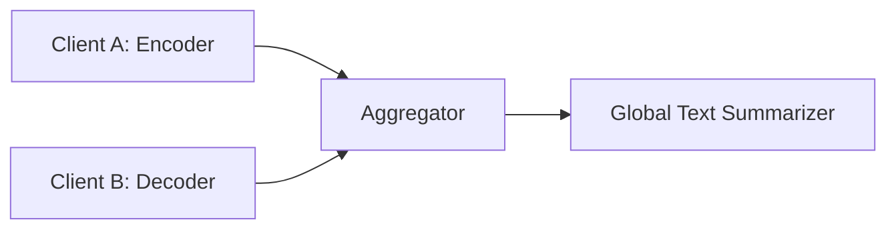
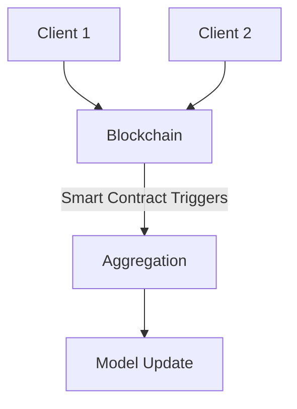

# Encyclopedia Galactica: Federated Learning Concepts


## Table of Contents


1. [Section 1: Introduction and Historical Foundations](#section-1-introduction-and-historical-foundations)

2. [Section 2: Core Technical Principles](#section-2-core-technical-principles)

3. [Section 3: Privacy-Preserving Mechanisms](#section-3-privacy-preserving-mechanisms)

4. [Section 4: Communication Optimization Strategies](#section-4-communication-optimization-strategies)

5. [Section 5: Statistical Heterogeneity Challenges](#section-5-statistical-heterogeneity-challenges)

6. [Section 6: Security Frameworks and Threats](#section-6-security-frameworks-and-threats)

7. [Section 7: Cross-Domain Applications](#section-7-cross-domain-applications)

8. [Section 8: Standards and Ecosystem Development](#section-8-standards-and-ecosystem-development)

9. [Section 9: Societal Implications and Ethics](#section-9-societal-implications-and-ethics)

10. [Section 10: Future Frontiers and Conclusion](#section-10-future-frontiers-and-conclusion)


## Section 1: Introduction and Historical Foundations

The relentless ascent of artificial intelligence in the early 21st century collided headlong with a burgeoning global crisis: the untenability of centralized data collection. As machine learning models grew ever hungrier for vast datasets, the traditional paradigm – hoovering user data into monolithic cloud repositories – faced insurmountable barriers. Privacy regulations tightened, public distrust surged following catastrophic breaches, and the sheer physical impracticality of moving petabytes of sensitive data from edge devices became apparent. Out of this perfect storm emerged **Federated Learning (FL)**, not merely as a technical innovation, but as a fundamental paradigm shift redefining how artificial intelligence is built in a privacy-conscious world. It represents a radical departure: instead of bringing data to the model, federated learning brings the model to the data.

This section traces the intellectual and practical lineage of federated learning. We will dissect its core definition and principles, explore the disparate strands of research in distributed systems and privacy that converged to make it possible, examine the societal pressures – epitomized by high-profile scandals and landmark regulations – that acted as its primary catalyst, and chronicle its initial, groundbreaking industrial implementations. Understanding this historical and conceptual foundation is crucial for appreciating the profound implications and intricate challenges explored in subsequent sections.

### 1.1 Defining Federated Learning

At its essence, **Federated Learning (FL)** is a machine learning (ML) approach where multiple entities (clients or devices) collaboratively train a shared model under the orchestration of a central server (or coordinator), **while keeping their raw training data decentralized and localized**. The canonical phrase summarizing its core tenet is: **"Bring the code to the data, not the data to the code."**

This simple statement belies a complex orchestration. In a typical FL process:

1.  **Initialization:** A global model architecture (e.g., a neural network) is defined and initialized by a central server.

2.  **Client Selection:** A subset of available clients (e.g., smartphones, hospitals, banks) is chosen to participate in a training round.

3.  **Distribution:** The current global model is sent to each selected client.

4.  **Local Training:** Each client computes an update to the global model by training it *locally* on its own private data. Crucially, the raw data never leaves the client's device or secure environment.

5.  **Aggregation:** The clients send only their model *updates* (e.g., gradient vectors or updated model weights) back to the server.

6.  **Fusion:** The server aggregates these updates (commonly using an algorithm like Federated Averaging - FedAvg, detailed in Section 2) to form a new, improved global model.

7.  **Iteration:** Steps 2-6 repeat over multiple rounds until the model converges or meets performance criteria.

**Core Principles:**

*   **Data Locality:** Raw training data remains on the originating device or within the originating silo. Only model updates or encrypted representations travel over the network.

*   **Collaborative Training:** Multiple participants contribute to the learning process, enabling the creation of models informed by diverse, real-world data sources otherwise impossible to centralize.

*   **Privacy-by-Design:** Privacy protection is not an afterthought but an inherent architectural feature, minimizing the exposure of sensitive information.

*   **Decentralized Computation:** The computational burden of training is distributed across the participating clients, leveraging their collective processing power.

**Contrasting Paradigms:**

*   **Centralized ML:** The standard approach. All training data is uploaded to a central server where the model is trained. This creates a single point of failure for privacy, requires massive data transfers, and is often infeasible for sensitive or geographically dispersed data.

*   **Edge Computing:** While FL often operates *on* edge devices, edge computing broadly refers to processing data closer to its source (like running a pre-trained model on a smartphone). FL specifically focuses on *collaborative training* across many edges/devices. Edge inference is distinct from federated training.

**Key Characteristics:**

*   **Statistical Heterogeneity:** Client data distributions are typically non-IID (Not Independent and Identically Distributed) – a phone user in Tokyo has vastly different data from one in Toronto. This is a fundamental challenge in FL (explored in Section 5).

*   **Massive Distribution:** FL systems can involve thousands to millions of participating clients (e.g., smartphones).

*   **Unreliable Participants:** Clients may drop out, have limited connectivity, or vary significantly in computational resources.

*   **Communication Bottleneck:** Transmitting model updates, even compressed ones, across potentially slow or metered networks is often the primary performance constraint, not local computation (explored in Section 4).

Federated learning transforms the privacy landscape for AI. It enables the construction of powerful models from the collective intelligence embodied in decentralized data silos – personal devices, hospitals, financial institutions, factories – without requiring those entities to relinquish direct control or expose the raw, sensitive information within their custody.

### 1.2 Precursors and Influential Developments

The conceptual seeds of federated learning were sown decades before the term itself was coined. Its emergence represents the convergence of several critical strands of research and technological evolution.

1.  **Early Distributed Machine Learning Concepts (1990s-2000s):** The fundamental idea of distributing computation for ML training predates FL by years.

*   **Parallel Stochastic Gradient Descent (SGD):** Research into parallelizing SGD across multiple machines in data centers (e.g., Downpour SGD at Google) laid crucial groundwork for understanding how model updates could be computed independently and combined. However, this assumed data was already partitioned *within* a trusted, centralized environment.

*   **Averaging-Based Methods:** The seminal observation that averaging the parameters of models trained independently on different data subsets could yield a good global model was demonstrated theoretically and empirically. A key early paper was "Distributed Training Strategies for the Structured Perceptron" by McDonald, Hall, and Mann (NACCL 2010), showing that averaging models trained on different shards worked well. McDonald et al.'s work on "Averaging Stochastic Gradient Descent" in 1997 was even more foundational, proving convergence properties. These methods, however, were designed for data center environments with reliable, high-bandwidth connections and trusted nodes.

*   **Peer-to-Peer Learning:** Research into decentralized learning algorithms without a central server, often using gossip protocols, explored aspects of collaborative learning in networks. While less directly applicable to the typical FL setup with a coordinator, it informed thinking about decentralization.

2.  **The Rise of Privacy-Preserving Technologies (2000s-2010s):** As concerns about data misuse grew, cryptographic techniques aimed at enabling computation on encrypted or partitioned data matured.

*   **Secure Multi-Party Computation (SMPC):** Developed since the 1980s (Yao's Millionaires' Problem), SMPC protocols allow multiple parties to jointly compute a function over their inputs while keeping those inputs private. While computationally expensive, SMPC provided a theoretical foundation for secure aggregation in FL.

*   **Differential Privacy (DP):** Introduced by Cynthia Dwork et al. in 2006, DP offered a rigorous mathematical framework for quantifying and guaranteeing privacy loss when releasing information (like statistics or model parameters) derived from sensitive datasets. Its application to ML models (output or objective perturbation) became a critical enabler for adding formal privacy guarantees to FL. Apple's prominent adoption of DP for iOS analytics around 2016 brought the concept into mainstream technical discourse.

*   **Homomorphic Encryption (HE):** Allowing computation directly on encrypted data, HE (especially Partial HE like Paillier and Leveled HE like CKKS) offered another potential path for secure aggregation, though its computational overhead remained (and remains) significant for large models.

3.  **The Foundational FL Research (2016):** The term "Federated Learning" was formally introduced, and its core algorithm established, in a landmark paper: "Communication-Efficient Learning of Deep Networks from Decentralized Data" by H. Brendan McMahan, Eider Moore, Daniel Ramage, Seth Hampson, and Blaise Agüera y Arcas (arXiv:1602.05629, Feb 2016). This paper, originating from Google research, did several critical things:

*   **Defined the Problem:** Explicitly framed the challenge of training ML models on decentralized data residing on mobile devices.

*   **Proposed FedAvg:** Introduced the Federated Averaging algorithm, demonstrating that simple weighted averaging of locally updated models could perform remarkably well, often matching centralized training accuracy while drastically reducing communication rounds compared to naive distributed SGD approaches.

*   **Highlighted Practical Constraints:** Focused on the realities of unreliable devices, limited communication, and unbalanced/non-IID data distributions – the defining characteristics of the "cross-device" FL setting.

*   **Connected to Privacy:** Explicitly positioned FL as a privacy-enhancing technology, reducing the need for raw data collection.

This paper crystallized years of distributed systems and privacy research into a coherent framework specifically designed for the modern era of edge devices and heightened privacy concerns. It provided the blueprint.

### 1.3 The Data Privacy Crisis as Catalyst

While the technical precursors existed, federated learning's emergence was accelerated dramatically by a series of high-profile data scandals and the ensuing regulatory tsunami. The traditional "collect everything" model of data-driven AI became ethically, legally, and reputationally toxic.

1.  **High-Profile Data Breaches and Misuse:**

*   **Equifax (2017):** The compromise of sensitive personal data (SSNs, birth dates, addresses, driver's license numbers) of nearly 150 million Americans exposed the catastrophic risks of centralized data repositories. The breach eroded trust in institutions' ability to safeguard data and highlighted the value of minimizing centralized storage.

*   **Facebook-Cambridge Analytica (2018):** The revelation that personal data of tens of millions of Facebook users was harvested without explicit consent and used for political profiling ignited global outrage. It underscored how seemingly anonymized or aggregated data could be weaponized and demonstrated profound public distrust in how tech giants handled personal information.

*   **Yahoo (2013-2014, disclosed 2016):** Breaches affecting billions of user accounts further cemented the perception that centralized databases were prime targets and inherently vulnerable.

2.  **The Failure of Naive Anonymization:** Events like the Cambridge Analytica scandal exposed the limitations of traditional privacy techniques. The **Netflix Prize de-anonymization incident** (2007) was an earlier, stark warning. Researchers demonstrated that by correlating anonymized movie ratings released by Netflix for a competition with publicly available information (e.g., IMDb reviews), they could re-identify individuals, potentially revealing sensitive viewing preferences. This proved that simply removing direct identifiers (names, emails) was often insufficient; patterns in the data itself could be used as fingerprints. FL's principle of data locality directly addresses this by minimizing the exposure of the underlying data patterns.

3.  **Landmark Privacy Regulations:** Public outrage translated into legislative action, creating strong legal imperatives for data minimization and user control:

*   **General Data Protection Regulation (GDPR - EU, 2018):** A watershed moment. GDPR enshrined principles like "data minimization" (collect only what's necessary), "purpose limitation" (use data only for specified purposes), and "storage limitation" (don't keep data longer than needed). Critically, it gave users enhanced rights over their data (access, rectification, erasure - "right to be forgotten") and imposed severe fines for non-compliance (up to 4% of global turnover). The requirement for explicit, informed consent fundamentally challenged the pervasive "collect now, figure out use later" model. The concept of "Privacy by Design and by Default" (Article 25) became a legal mandate, directly aligning with FL's architecture.

*   **California Consumer Privacy Act (CCPA - 2020):** Mirroring many GDPR principles for California residents, CCPA further solidified the trend in the crucial US market, granting rights to know what data is collected, delete it, and opt-out of its sale. Similar laws proliferated globally (e.g., Brazil's LGPD, Canada's PIPEDA reforms).

*   **Sector-Specific Regulations:** Healthcare (HIPAA in the US), finance (GLBA, various national banking regulations), and other sectors already had strict data handling rules. FL offered a potential pathway to leverage sensitive data within these constrained environments.

This confluence – devastating breaches demonstrating vulnerability, research exposing anonymization's flaws, and stringent regulations raising the cost of non-compliance – created a powerful catalyst. Organizations desperately needed ways to extract value from data while demonstrably respecting privacy and minimizing centralization risks. Federated learning emerged as one of the most promising technical responses to this crisis.

### 1.4 Initial Industrial Adoption

Theory and crisis created the need; practical implementation proved the concept. Federated learning moved rapidly from research paper to real-world deployment, driven by tech giants facing the sharp end of the privacy crisis and innovators in highly regulated sectors.

1.  **Google's Gboard (2016 Onward):** The first major, publicized production deployment of FL was born directly from the foundational McMahan et al. research: improving "next-word prediction" and "query suggestions" on the Google Keyboard (Gboard) for Android. This was the ideal proving ground:

*   **Ubiquity:** Millions of diverse devices.

*   **Sensitive Data:** Keystrokes are highly personal.

*   **Clear Benefit:** Better predictions enhance user experience.

*   **Practical Constraints:** Limited device computation, unreliable networks, battery constraints.

Google demonstrated that FL could train high-quality language models directly on users' phones. Users benefited from personalized predictions, Google improved its service, and raw typing data never needed to leave the device. This success, documented in subsequent papers and blog posts, provided a powerful proof-of-concept that FL worked at massive scale under real-world constraints.

2.  **Apple's Differential Privacy Initiatives (2016 Onward):** While not exclusively FL, Apple's very public embrace of Differential Privacy (DP) for iOS/macOS analytics (e.g., emoji usage, search queries, health data typing patterns) signaled a major industry pivot towards privacy-preserving analytics and ML. Apple heavily invested in on-device machine learning (Core ML) and combined it with DP techniques to gather aggregate insights without collecting raw user data. This created fertile ground for FL adoption within Apple's ecosystem and validated the broader "privacy-first" approach to data utilization. Their focus on local computation and minimal data exposure paralleled core FL principles.

3.  **Healthcare: The Vanguard of Cross-Silo FL:** Highly sensitive data and stringent regulations (HIPAA, GDPR in medical contexts) made healthcare a natural early adopter for "cross-silo" FL (collaboration between organizations like hospitals or pharma companies).

*   **Owkin:** Founded in 2016, Owkin pioneered applying FL specifically to medical research. Their flagship platform, Owkin Connect, enabled hospitals and research institutions to collaboratively train AI models on distributed patient data (e.g., medical images, genomics, clinical records) without sharing the raw data. Early successes included improving tumor detection and characterization in pathology slides across multiple institutions, demonstrating FL's ability to leverage rare datasets while preserving patient confidentiality and institutional data sovereignty.

*   **NVIDIA Clara:** Launched in 2018, NVIDIA's Clara platform included FL capabilities tailored for medical imaging and genomics. It provided healthcare institutions with the tools to build federated applications, facilitating collaborations in areas like cancer research and drug discovery.

*   **MELLODDY Project (2019 Onward):** This large-scale, EU-funded consortium project brought together 10 major pharmaceutical companies (including Janssen, AstraZeneca, Novartis) and tech partners (Owkin, NVIDIA) to build a federated platform for drug discovery. The goal: leverage the combined molecular data of multiple pharma giants to train predictive models for properties like toxicity and efficacy, without any participant revealing their proprietary compound libraries or assay results. This ambitious project underscored FL's potential to break down data silos in highly competitive, regulated industries.

These early adopters demonstrated FL's viability across different scales (millions of devices for Gboard vs. tens of institutions for MELLODDY) and domains (consumer tech, healthcare, pharma). They proved that collaborative intelligence without central data pooling was not just possible, but practical and valuable. They also began to surface the real-world challenges – communication overhead, statistical heterogeneity, system heterogeneity, and the intricate balance between privacy, utility, and efficiency – that subsequent research and development would need to tackle.

**Conclusion of Section 1**

Federated learning emerged not as a sudden invention, but as the necessary evolution of machine learning in response to critical societal pressures and technological realities. It stands at the intersection of decades of research in distributed systems and cryptography, catalyzed by a crisis of trust in centralized data handling and empowered by the computational capabilities of modern edge devices. Its core principle – learning collaboratively while keeping data local – represents a profound shift away from the data-hoarding models of the past.

The pioneering implementations by Google, Apple, Owkin, NVIDIA, and others proved that FL was more than theoretical. It offered a tangible path forward for building powerful AI models in domains where data privacy and security are paramount. However, the elegant simplicity of its core concept belies significant complexities. The journey from a federated averaging prototype for keyboard predictions to robust, secure, and fair federated systems capable of handling diverse, non-identical data across unreliable networks and potentially adversarial environments requires deep technical innovation.

Having established the "why" and the initial "how" of federated learning's emergence, we now turn our attention to its foundational mechanics. The next section delves into the **Core Technical Principles** – the architectures, algorithms like FedAvg, data partitioning schemes, and training lifecycles that make this decentralized learning process function, setting the stage for understanding the intricate privacy, efficiency, and robustness challenges explored later. We begin to unpack the elegant dance between the central coordinator and the distributed clients that enables intelligence to flourish without compromising the sanctity of local data.


---


## Section 2: Core Technical Principles

The elegant promise of federated learning – building collective intelligence from decentralized, private data silos – rests upon a sophisticated orchestration of distributed computation and communication. Having traced its historical emergence and foundational motivations in Section 1, we now dissect the intricate machinery that makes this paradigm function. This section delves into the core technical principles underpinning federated learning: the architectural components that define the roles and relationships within the system, the fundamental algorithm (Federated Averaging) that enables collaborative learning, the diverse ways data can be partitioned across participants, and the dynamic lifecycle governing the training process itself. Understanding these elements is paramount, as they form the bedrock upon which all subsequent privacy enhancements, efficiency optimizations, and robustness mechanisms, explored in later sections, are built.

The journey from the high-level concept described in Section 1 to a functioning FL system involves navigating complex trade-offs between computational load, communication overhead, statistical efficiency, and, fundamentally, the preservation of data locality. How does a central entity guide learning without seeing the data? How are updates from vastly different devices or institutions meaningfully combined? How does the system adapt to participants vanishing mid-calculation or contributing updates based on fundamentally different data distributions? These are the questions addressed by the core technical framework we explore here.

### 2.1 System Architecture Components

At its heart, a federated learning system is a distributed computing architecture specifically designed for collaborative model training under constraints of data privacy, network heterogeneity, and potentially unreliable participants. While variations exist (especially in peer-to-peer topologies explored in Section 4.3), the predominant architecture involves a coordinating central entity and multiple participating clients.

1.  **Roles and Responsibilities:**

*   **Clients (Participants/Workers/Devices/Data Holders):** These are the entities possessing the local, private datasets used for training. Their primary responsibilities are:

*   **Local Model Training:** Receive the current global model from the server, perform training iterations (e.g., Stochastic Gradient Descent - SGD) using their local data, and compute a model update (e.g., new weights, gradients).

*   **Update Transmission:** Send the computed model update back to the server. Crucially, they *never* send raw training data samples.

*   **Resource Management:** Execute training within their computational (CPU, GPU, memory), power (battery), and network bandwidth constraints. Clients can drop out or become unresponsive at any time.

*   **Server (Aggregator/Coordinator):** This central entity orchestrates the entire federated learning process. Its key functions are:

*   **Global Model Initialization:** Define the model architecture (e.g., neural network structure) and initialize its parameters (weights).

*   **Client Selection:** Determine which clients will participate in each training round based on specific strategies (random, resource-aware, stratified – see 2.4).

*   **Model Distribution:** Send the current global model parameters to the selected clients.

*   **Update Aggregation:** Receive model updates from participating clients and fuse them into a new, improved global model using an aggregation algorithm (most commonly Federated Averaging - FedAvg).

*   **Model Update & Convergence Checking:** Update the global model with the aggregated result and evaluate if training should continue (based on performance metrics or round limits).

*   **Coordinator (Optional, often part of the Server):** In larger or more complex deployments, the role of the server might be split. A dedicated coordinator might handle client selection, task scheduling, and communication routing, while the aggregation logic resides on a separate aggregator node. For simplicity, we often refer to the central entity as the "server," encompassing these coordination and aggregation functions.

2.  **Communication Protocols: The Lifeline of FL**

Communication is the lifeblood of FL, but also its primary bottleneck (discussed extensively in Section 4). The protocol defines *when* and *how* clients and the server exchange information.

*   **Synchronous Protocols:**

*   **Mechanism:** The server selects a cohort of clients (`C` clients) at the start of a round. It sends the current global model `w_t` to all `C`. Each client performs `E` epochs of local SGD (or another optimizer) on its data `D_k`, producing a local model update `w_t^{k}`. The server waits until it receives updates from *all* `C` clients (or a predefined quorum/fraction) before aggregating them (e.g., via FedAvg: `w_{t+1} = (1/C) * Σ w_t^{k}`) to form the new global model `w_{t+1}`. The round completes, and the next round begins.

*   **Advantages:** Simpler aggregation logic (all updates are based on the same starting model `w_t`), easier convergence analysis theoretically.

*   **Disadvantages:** Highly susceptible to *stragglers* – slow clients or those with poor connectivity delay the entire round. System efficiency plummets as the cohort size or heterogeneity increases. High risk of wasted computation if clients drop out before sending updates.

*   **Use Cases:** Primarily used in **cross-silo** settings (e.g., hospitals, banks) where participants are reliable organizations with stable, high-bandwidth connections. Google's initial Gboard implementation also used a synchronous approach with mechanisms to mitigate stragglers (e.g., setting timeouts).

*   **Asynchronous Protocols:**

*   **Mechanism:** The server continuously accepts updates from clients. When a client is ready (has finished its local computation), it fetches the *latest* global model `w_current` from the server, performs local training to compute an update `Δw^k` based on `w_current`, and sends `Δw^k` back. The server immediately applies the update to the global model upon receipt, often using techniques to account for potential staleness (e.g., `w_new = w_current + η * Δw^k`, where `η` might be decayed based on how stale `w_current` was relative to the latest model).

*   **Advantages:** Much higher system throughput and resource utilization. Eliminates the straggler problem – faster clients contribute more frequently. More resilient to client dropouts as updates are integrated immediately.

*   **Disadvantages:** Significantly more complex aggregation logic. Updates are computed based on different (and potentially stale) versions of the global model (`w_current` might be quite old by the time the update arrives if the server is busy), leading to potential instability, convergence issues, or "thrashing." Requires careful tuning of staleness-aware aggregation techniques.

*   **Use Cases:** Essential for large-scale **cross-device** settings with thousands to millions of unreliable, heterogeneous devices (e.g., smartphones, IoT sensors). Also used in cross-silo when minimizing latency is critical. Research frameworks like TensorFlow Federated (TFF) provide asynchronous FL APIs.

3.  **Model Initialization and Update Mechanisms:**

*   **Initialization:** The server initializes the global model `w_0`. Common strategies include:

*   **Random Initialization:** Standard practice, similar to centralized ML (e.g., He, Xavier initialization).

*   **Pre-trained Model:** Initializing with a model pre-trained on public or synthetic data can significantly accelerate convergence, especially when local datasets are small or heterogeneous. For example, a federated medical image classifier might start from a model pre-trained on ImageNet or a large public medical dataset like CheXpert.

*   **Local Update Computation:** Clients receive the global model `w_global` and perform local training. The most common method is **Local Stochastic Gradient Descent (Local SGD)**:

*   The client sets its local model: `w_local = w_global`.

*   For `E` epochs (passes through the local dataset `D_k`), or for `B` local batch iterations:

*   Sample a mini-batch `b` from `D_k`.

*   Compute the loss `L(w_local, b)`.

*   Compute the gradient `g = ∇L(w_local, b)`.

*   Update the local model: `w_local = w_local - η_local * g` (where `η_local` is the client's local learning rate).

*   The update sent back can be either:

*   **Model Weights:** The final `w_local` after local training. This is used in FedAvg.

*   **Gradients:** The accumulated gradient changes (`Δw = w_local - w_global`) or the average gradient over the local steps. Gradient-based updates are often used when combining FL with secure aggregation techniques like Homomorphic Encryption (Section 3.1), as gradients can be summed encrypted.

*   **Aggregation:** The server combines the received updates (`w_local^k` or `Δw^k`) from the participating clients `k` in set `S_t` (size `m`) into a new global model `w_{t+1}`. FedAvg is the canonical method: `w_{t+1} = Σ_{k∈S_t} (n_k / n) * w_local^k`, where `n_k` is the number of samples on client `k` and `n = Σ_{k∈S_t} n_k`. This weighted averaging is fundamental. Section 2.2 delves into FedAvg's mechanics and implications.

**Example:** Consider a consortium of 10 hospitals (`clients`) collaborating via FL to build a pneumonia detection model from chest X-rays. A central research server (`server/coordinator`) initializes a convolutional neural network. Using a **synchronous protocol**, the server selects 5 hospitals per round (due to bandwidth constraints). Each hospital downloads the current global model, trains it for `E=2` epochs on their local X-ray dataset using Local SGD, and sends back the updated model weights. The server aggregates these 5 updates using FedAvg, weighting each hospital's contribution by the number of X-rays they used locally. The new global model is sent out for the next round. Raw X-ray images never leave the hospitals' firewalls.

### 2.2 Federated Averaging (FedAvg) Algorithm

Introduced by McMahan et al. in the seminal 2016 paper (Section 1.2), **Federated Averaging (FedAvg)** is not merely the first FL algorithm; it remains the most widely used and serves as the foundational baseline against which nearly all subsequent FL algorithms are compared. Its remarkable simplicity belies its effectiveness in many practical scenarios.

**Step-by-Step Breakdown (Synchronous Setting):**

1.  **Initialization (Server):** The server initializes the global model parameters `w_0`.

2.  **Round Loop (for `t = 0, 1, 2, ..., T-1`):**

*   **Client Selection:** Server selects a subset `S_t` of `m` clients from the total pool (often uniformly at random, but strategies vary – see 2.4). `m` is the *cohort size*.

*   **Broadcast:** Server sends the current global model `w_t` to all clients `k ∈ S_t`.

*   **Local Computation (Each Client `k ∈ S_t`):**

*   Set local model: `w_t^k = w_t`.

*   Split local data `D_k` (size `n_k` samples) into batches.

*   Perform `τ` steps of SGD (or `E` epochs) on `D_k` with a local learning rate `η`:

```

for each local step i do:

Sample batch b ~ D_k

Compute gradient g_i = ∇Loss(w_t^k; b)

Update: w_t^k = w_t^k - η * g_i

```

*   Obtain updated local model `w_{t+1}^k`.

*   **Client Transmission:** Each client `k` sends its updated model `w_{t+1}^k` back to the server. *(Note: Clients can also send just the difference `Δ^k = w_{t+1}^k - w_t`, but aggregation logic is equivalent).*

*   **Aggregation (Server):** Server computes the new global model as a weighted average:

```

w_{t+1} = Σ_{k ∈ S_t} (n_k / n) * w_{t+1}^k

```

where `n = Σ_{k ∈ S_t} n_k` is the total number of samples across the participating clients in this round. If all clients have the same amount of data, this reduces to a simple average: `w_{t+1} = (1/m) * Σ_{k ∈ S_t} w_{t+1}^k`.

**Key Insights and Mechanics:**

*   **Weighted Averaging Rationale:** Weighting by `n_k` gives clients with more data proportionally more influence on the global model. This is statistically sound when data is IID (Independent and Identically Distributed), as it approximates the update from the combined dataset. However, under non-IID data (Section 5), this weighting can introduce bias.

*   **Local Steps (`τ` or `E`):** This is the crucial parameter distinguishing FedAvg from naive distributed SGD. Instead of performing just *one* gradient step per round (which would require massive communication), clients perform *multiple* local steps (`τ` iterations or `E` epochs). **This dramatically reduces communication rounds.** For example, in Gboard, clients might perform hundreds or thousands of local steps before communicating.

*   **Communication-Computation Trade-off:** FedAvg explicitly trades increased local computation for drastically reduced communication frequency. This is highly beneficial when communication is the bottleneck (common on mobile networks). However, excessive local computation (`τ` too large) on highly non-IID data can cause clients to "drift" far from the global optimum, harming convergence (the *client drift* problem, see Section 5.3).

*   **Convergence Guarantees and Limitations:** Under idealized conditions (convex objectives, IID data), FedAvg converges to the global optimum similar to centralized SGD. However, real-world FL violates these assumptions:

*   **Non-IID Data:** This is the norm, not the exception (e.g., different user typing patterns, different hospital patient demographics). Non-IID data is the primary cause of reduced convergence speed and final accuracy in FedAvg compared to centralized training. Section 5 delves deeply into mitigation strategies.

*   **Partial Participation:** Only a subset `m` of clients participate each round (`m 80% battery, plugged in, on WiFi) to complete the training task reliably. This reduces dropout rates and wasted computation. *Example: A smartphone FL task might only select devices charging and on unmetered WiFi.*

*   **Oort:** A research framework proposing a more sophisticated approach combining statistical utility (prioritizing clients with data that induces high loss/gradient diversity) and system efficiency (prioritizing clients with good resources), aiming to accelerate time-to-accuracy.

*   **Fairness-Aware Selection:** Deliberately oversampling clients from underrepresented groups (e.g., specific demographics, regions, or clients with rare data) to mitigate bias in the global model. This is an active research area intersecting with algorithmic fairness (Section 5.4). *Example: A healthcare FL consortium might weight selection towards hospitals serving minority populations if initial models show performance disparities.*

2.  **Local Computation Phase:** Once selected and having received the global model, clients perform local training. Key aspects include:

*   **Local Epochs (`E`) / Steps (`τ`):** As discussed in FedAvg (2.2), determining the number of local passes through the data (`E` epochs) or iterations (`τ` steps) is crucial. More local computation reduces communication rounds but risks client drift under non-IID data. Tuning `E`/`τ` is essential.

*   **Local Optimizer and Hyperparameters:** Clients typically use SGD variants (e.g., Adam, RMSProp) locally. The choice of local learning rate (`η_local`) and other hyperparameters significantly impacts convergence. Using adaptive optimizers can sometimes mitigate client drift. Hyperparameter tuning in FL is complex as centralized validation isn't possible; techniques involve meta-learning or server-guided schedules.

*   **Differential Privacy (Local DP):** Clients can add calibrated noise to their model updates (`w_local^k` or gradients `Δw^k`) *before* sending them to the server to provide formal privacy guarantees (Local Differential Privacy - LDP). This protects against a curious server. However, LDP typically requires significant noise, harming model accuracy (see Section 3.2 for tradeoffs).

3.  **Global Aggregation Frequency:** This refers to how often the server performs the aggregation step after receiving client updates.

*   **Per-Round Aggregation (Standard):** As described in FedAvg, aggregation happens after every round of client updates. This is the most common approach.

*   **Multi-Round Buffering:** The server might wait for updates over several rounds before aggregating, effectively creating larger "meta-batches" of client updates. This can potentially improve statistical efficiency but increases latency and staleness. It's less common in practice.

*   **Adaptive Synchronization:** The server dynamically decides when to aggregate based on heuristic measures of progress (e.g., estimated global loss reduction slowing down) or the quality/variance of received updates. This aims to optimize communication efficiency.

4.  **Convergence Monitoring and Termination:** Determining when the federated model has converged or reached sufficient performance is non-trivial.

*   **Centralized Proxy Validation:** If a small, representative (and privacy-compliant) validation dataset exists centrally, the server can evaluate the global model after aggregation. This provides a direct measure but is often unavailable due to privacy constraints.

*   **Federated Evaluation:** Selected clients evaluate the latest global model on their *local test sets* and report performance metrics (e.g., accuracy, loss) back to the server. The server aggregates these metrics (e.g., average accuracy) to estimate global performance. This is the most common approach.

*   **Termination Criteria:** Training typically stops based on:

*   Reaching a predefined maximum number of rounds (`T`).

*   Federated evaluation metrics plateauing (e.g., average accuracy improvement < threshold over `K` rounds).

*   Depletion of a privacy budget (in DP-FL, see Section 3.2).

**The Lifecycle in Action - Cross-Silo Healthcare:** An FL project involves 5 hospitals training a tumor segmentation model on their private MRI databases.

1.  **Initialization:** Central research server initializes a U-Net model architecture.

2.  **Round Start (Synchronous):**

*   **Selection:** Server uses **stratified sampling** to select 2 hospitals this round – one large research hospital and one smaller community hospital – ensuring representation.

3.  **Distribution:** Server sends the current global model `w_t` to both hospitals.

4.  **Local Training:** Each hospital:

*   Downloads `w_t`.

*   Trains for `E=1` epoch on their local, de-identified MRI dataset using Local SGD with a tuned learning rate. *(Higher E might cause drift due to differing scanner types/patient demographics).*

*   Computes updated model weights `w_{t+1}^{k}`.

5.  **Aggregation:** Both hospitals send `w_{t+1}^{k}` back. Server performs **FedAvg**, weighting by the number of MRI scans each used (`n_k`).

6.  **Evaluation (Every 5 Rounds):** Server sends latest model to all 5 hospitals. Each evaluates it on their local test set and reports Dice score. Server averages the scores.

7.  **Termination:** After 100 rounds, the average federated Dice score plateaus. Training stops. The final global model is distributed to all hospitals.

**Conclusion of Section 2**

The core technical principles of federated learning reveal a sophisticated dance between central coordination and distributed execution. The client-server architecture, governed by synchronous or asynchronous protocols, provides the framework. Within this framework, the Federated Averaging algorithm performs the essential task of fusing localized knowledge into a shared global intelligence, leveraging weighted averaging and multiple local computation steps to overcome communication bottlenecks. Recognizing the fundamentally different ways data can be partitioned – horizontally, vertically, or via transfer learning – is crucial for selecting appropriate algorithms and system designs. Finally, the dynamic training lifecycle, encompassing client selection, local computation, aggregation frequency, and convergence monitoring, dictates the practical efficiency and ultimate success of the federated endeavor.

However, this technical foundation operates under significant tension. The very act of sharing model updates, while preserving raw data locality, introduces new vulnerabilities. Can a malicious participant corrupt the global model? Can sensitive information be inadvertently leaked through the updates themselves? How do we formally guarantee that participation in FL does not compromise the privacy of the underlying data? These critical questions move us beyond the basic mechanics into the realm of robust **Privacy-Preserving Mechanisms**, the focus of the next section, where cryptographic techniques, differential privacy, and hybrid architectures provide the shields necessary to make federated learning truly trustworthy.


---


## Section 3: Privacy-Preserving Mechanisms

The elegant architecture of federated learning, as detailed in Section 2, fundamentally shifts the locus of raw data exposure. By keeping sensitive information localized on client devices or within secure silos, FL inherently reduces the attack surface compared to centralized data lakes. However, the core FL process – exchanging model updates between clients and a central server – introduces a new, subtler frontier for privacy risks. As hinted at the conclusion of Section 2, the model parameters or gradients transmitted during training are not merely innocuous numbers; they are mathematical derivatives *of* the sensitive training data. Malicious actors, or even an overly curious server, could potentially exploit these updates to infer details about the underlying private datasets. Thus, while FL provides a strong *architectural* privacy advantage, achieving robust, verifiable confidentiality demands a sophisticated arsenal of **Privacy-Preserving Mechanisms (PPMs)**. This section delves into the cryptographic shields, statistical cloaks, hybrid fortifications, threat countermeasures, and verification frameworks that transform FL from a promising paradigm into a trustworthy solution for sensitive data collaboration.

The quest for privacy in FL is not binary; it operates on a spectrum defined by the threat model (who is the adversary?), the desired level of formal guarantee, and the inevitable trade-offs with model utility, computational overhead, and communication cost. We explore the techniques navigating this complex landscape, grounding theoretical concepts in real-world implementations and the tangible trade-offs encountered in production systems.

### 3.1 Cryptographic Foundations

Cryptography provides the bedrock for mathematically rigorous privacy guarantees in FL. These techniques ensure confidentiality even when communications are intercepted or the server itself cannot be fully trusted ("honest-but-curious" or "semi-honest" adversary model). They primarily focus on protecting the *content* of the model updates during transmission and aggregation.

1.  **Secure Multi-Party Computation (SMPC):**

*   **Core Concept:** SMPC allows multiple parties (clients) to jointly compute a function over their private inputs (model updates) without revealing those inputs to each other or anyone else, learning only the final output (the aggregated model). Imagine several hospitals wanting to calculate the average tumor size from their patient scans without revealing any individual scan or even their hospital's specific average.

*   **Mechanism in FL (Secure Aggregation):** The canonical application is **secure model aggregation**. Clients encrypt their model updates (`Δw^k` or `w_local^k`) in such a way that the server (or a group of servers) can compute the *sum* (or weighted average) of these updates *without ever decrypting any individual client's contribution*. Only the aggregated result is decrypted.

*   **Common Protocols:**

*   **Threshold Secret Sharing (Shamir's Scheme):** Each client splits its update into `N` "shares" and distributes them among `N` servers (or among other clients in peer-to-peer setups). A predefined threshold (`T`) of shares is needed to reconstruct the secret (the update), but any `T-1` shares reveal nothing. Secure aggregation is achieved by having servers sum the shares they receive and then only reconstructing the *sum* of all updates when enough servers collaborate. *Example: Google's 2017 "Practical Secure Aggregation" paper outlined an efficient protocol using secret sharing and masking for cross-device FL, forming the basis for implementations in TensorFlow Federated.*

*   **Garbled Circuits / Yao's Protocol:** Allows two parties to evaluate any function (like comparison or addition) on their private inputs. While powerful, it's computationally expensive and scales poorly beyond two parties directly, though extensions exist. More common in specific VFL scenarios or pairwise computations.

*   **Advantages:** Provides strong information-theoretic or cryptographic security guarantees under the defined threat model. Protects individual updates from the server and other clients.

*   **Disadvantages:** Significant communication overhead (multiple rounds, large messages) and computational cost (especially for large models). Requires coordination among multiple non-colluding servers or complex peer-to-peer networks. Vulnerable if the threshold `T` of servers colludes. Primarily protects the *value* of the update during transmission/aggregation, not necessarily statistical leakage from the aggregate itself.

2.  **Homomorphic Encryption (HE):**

*   **Core Concept:** HE allows computations to be performed directly on *encrypted data*. The result of the computation, when decrypted, matches the result as if it had been performed on the plaintext. It's like giving someone a locked box (ciphertext) and instructions; they perform the work on the locked box without seeing the contents and give you back another locked box; only you have the key to open it and see the correct result.

*   **Mechanism in FL:** Clients encrypt their model updates using the server's public key and send the ciphertexts. The server performs the aggregation operation (e.g., weighted summation) directly on these ciphertexts, producing an encrypted aggregate. This aggregate ciphertext is then sent to a designated party (could be the server itself if it holds the private key, or a separate trusted entity) for decryption, yielding the plaintext aggregated model update.

*   **Common Schemes & Trade-offs:**

*   **Partially Homomorphic Encryption (PHE - e.g., Paillier):** Supports only addition (or only multiplication) on ciphertexts. Paillier is additively homomorphic: `Enc(a) + Enc(b) = Enc(a+b)`. This is sufficient for simple weighted averaging where weights are known to the server. Relatively efficient computationally. *Widely used in Vertical FL and financial applications for secure summation of gradients or losses.*

*   **Somewhat Homomorphic Encryption (SHE) / Leveled Homomorphic Encryption (LHE - e.g., CKKS, BFV):** Support both addition and multiplication, but only for a limited depth (number of operations) before noise overwhelms the ciphertext. CKKS is particularly optimized for approximate arithmetic on real numbers (like neural network weights), making it suitable for FL. *Example: IBM's HElayers library targets privacy-preserving ML, including FL, using CKKS.*

*   **Fully Homomorphic Encryption (FHE - e.g., BGV, TFHE):** Supports arbitrary computations (addition and multiplication any number of times). The holy grail, but currently prohibitively slow and computationally intensive for training large deep learning models in FL. Active research area (e.g., FHE transpilers like Google's FHE-C++).

*   **Advantages:** Centralized aggregation process is possible. Provides strong cryptographic confidentiality for individual updates during transmission and computation. Server only sees encrypted gibberish.

*   **Disadvantages:** Very high computational overhead, especially for LHE/FHE and large models. Ciphertext expansion (encrypted data is much larger than plaintext) increases communication costs. Limited operational flexibility (depth constraints for LHE). Requires secure key management. Like SMPC, protects the value of the update but not statistical leakage from the aggregate.

3.  **Secret Sharing Implementations:**

While often used as a building block within SMPC protocols (like threshold secret sharing), simpler additive secret sharing schemes can be employed directly for secure summation in FL, especially in trusted execution environments (TEEs - see 3.3) or specific threat models. Each client splits its update vector into random additive shares that sum to the true update. Shares are distributed. Aggregation involves summing the shares component-wise. The true aggregate is revealed only when all shares are combined. This requires clients or servers not to collude to reconstruct individual updates prematurely.

**Real-World Context:** The **MELLODDY project** (Section 1.4) extensively utilizes **SMPC-based secure aggregation** for its federated drug discovery platform. Pharmaceutical companies send encrypted model updates derived from their proprietary molecular libraries. Using SMPC protocols, the consortium server aggregates these updates without decrypting any single company's contribution, protecting highly valuable intellectual property while enabling collaborative model improvement. The computational overhead is deemed acceptable given the high stakes of protecting drug discovery data.

### 3.2 Differential Privacy in FL

While cryptography protects the *value* of individual updates during the FL process, **Differential Privacy (DP)** provides a robust, statistical framework for quantifying and bounding the *information leakage* about any individual data point contained within the *output* of a computation – in this case, the final global model or the model updates themselves. DP guarantees that the presence or absence of any single training example has a negligible impact on the model's parameters or predictions.

1.  **Formal Guarantees (ε-DP):**

*   **Core Definition (ε-Differential Privacy):** A randomized mechanism `M` satisfies ε-DP if for any two neighboring datasets `D` and `D'` (differing by at most one element), and for any possible output `S`:

```

Pr[M(D) ∈ S] ≤ e^ε * Pr[M(D') ∈ S]

```

The parameter `ε` (epsilon) quantifies the **privacy loss** or **privacy budget**. A smaller ε implies stronger privacy (less distinguishable outputs from neighboring datasets) but often requires more noise, harming utility. `ε=0` offers perfect privacy but renders the output useless.

*   **Interpretation in FL:** Applying DP ensures that an adversary observing the global model (`w_T`) or a client's update (`Δw^k`) cannot confidently determine whether any specific individual's data was included in the training set. *Example: A model trained with DP on hospital records shouldn't reveal if a specific patient's rare disease was part of the training data.*

2.  **Noise Injection Techniques:**

DP is achieved by carefully calibrated noise injection:

*   **Where to Apply Noise:**

*   **Central DP (CDP):** Noise is added by the server *during or after aggregation* to the global model update. This protects against inference from the *final model* or the *aggregate* of many updates. It assumes the server is trusted to implement DP correctly. Requires less noise than LDP for the same ε. *Common in cross-silo settings where the server is controlled by a trusted consortium.*

*   **Local DP (LDP):** Each client adds noise to its *individual model update* (`Δw^k` or `w_local^k`) *before* sending it to the server. This protects against inference from the update *even by the server itself*. Provides a stronger threat model (untrusted server) but typically requires significantly more noise per client to achieve meaningful privacy, severely impacting model accuracy, especially with many clients. *Example: A smartphone keyboard client adding noise locally to its word prediction model update.*

*   **Choosing the Noise Distribution:** The noise magnitude must be scaled to the **sensitivity** of the function (how much a single data point can change the output) and the desired ε.

*   **Laplacian Noise:** Used for functions with bounded `L1` sensitivity (e.g., counting queries).

*   **Gaussian Noise:** More commonly used in ML/FL due to its compatibility with `L2` sensitivity and better utility under composition (multiple queries/rounds). The scale (σ) is set by σ = ΔS * √(2 log(1.25/δ)) / ε, where ΔS is the `L2` sensitivity and δ is a small probability of failure (approximate DP: (ε, δ)-DP).

*   **Sensitivity Calculation:** Determining the sensitivity (ΔS) of the model update function is critical. Common approaches include:

*   **Clipping:** Bound the `L2` norm of each client's update vector (`Δw^k`) to a threshold `C` before averaging. This caps the maximum influence any single client (and thus, by proxy, any single data point within that client, especially under LDP) can have on the aggregate, making ΔS = 2C/m for FedAvg (where m is cohort size). Clipping is essential for practical DP-FL.

*   **Per-Sample Gradient Clipping:** A more refined technique (especially relevant for LDP) bounds the gradient contribution of *each individual training sample* within a client's local dataset before updating the model. This provides tighter sensitivity control but is computationally more expensive on the client.

3.  **Privacy Budget Allocation Strategies:**

Training a model over `T` rounds requires multiple queries (aggregations) to the clients' data. The total privacy budget ε_total must be allocated across these rounds. DP provides **composition theorems** to calculate the cumulative privacy loss.

*   **Basic Composition:** The total ε is simply the sum of the ε_i used in each round `i`. Very conservative and leads to rapid budget depletion.

*   **Advanced Composition:** Provides tighter bounds, especially under Gaussian noise, allowing for more rounds or smaller per-round noise for the same ε_total. The Moments Accountant (used in TensorFlow Privacy) and Rényi Differential Privacy (RDP) are sophisticated composition methods enabling practical deep learning with DP.

*   **Allocation Strategies:** Common approaches include:

*   **Fixed per-Round:** Allocate ε_total / T to each round. Simple but may not be optimal.

*   **Decaying per-Round:** Allocate more budget (larger ε_i, less noise) in early rounds when updates are large and informative, and less budget (smaller ε_i, more noise) in later fine-tuning rounds. Mimics learning rate decay.

*   **Adaptive Allocation:** Dynamically adjust ε_i per round based on estimated model improvement or gradient magnitudes.

**Real-World Context:** **Apple** is a prominent adopter of **Local Differential Privacy** for on-device data collection, including features feeding into FL-like processes. For instance, their "Private Federated Learning" approach for improving QuickType keyboard predictions involves clients locally perturbing statistics (like emoji usage counts or next-word probabilities) with noise satisfying LDP guarantees before any data leaves the device. While not always full model training, it exemplifies the LDP principle applied in a federated context. **Google** extensively researches and deploys **Central DP** within its FL infrastructure (e.g., for Gboard), leveraging the Moments Accountant and gradient clipping to manage the privacy-utility trade-off across thousands of training rounds. Their open-source **TensorFlow Privacy** library provides key tools for implementing DP-SGD, adaptable to the FedAvg setting.

### 3.3 Hybrid Privacy Architectures

Recognizing that no single PPM is a silver bullet, practical FL systems often combine techniques into hybrid architectures, leveraging their complementary strengths to achieve robust privacy with acceptable overhead.

1.  **Combining DP with SMPC/HE:**

*   **Motivation:** SMPC/HE protects the confidentiality of individual updates during aggregation but doesn't prevent statistical inference from the *aggregate* model. DP protects against such inference but requires noise. Combining them provides layered protection.

*   **Mechanism:** Clients add calibrated DP noise *locally* to their updates. These noisy updates are then aggregated securely using SMPC or HE. This achieves:

*   **LDP + Secure Agg:** Protection against a malicious server inferring individual client updates *and* protection against inference about individual data points from the final aggregate model (since DP noise is baked in). The secure aggregation hides *which* client added *how much* noise. *Example: The OpenMined PySyft framework supports this combination.*

*   **CDP + Secure Agg:** The server adds DP noise *after* securely aggregating the *true* client updates (which were protected during transmission by SMPC/HE). This protects against inference from the final model but assumes the server is trusted to correctly implement DP. Reduces the total noise needed compared to LDP.

*   **Trade-off:** Enhanced privacy at the cost of both cryptographic overhead *and* the utility loss from DP noise.

2.  **Trusted Execution Environments (TEEs):**

*   **Core Concept:** TEEs are secure, isolated areas within a processor (e.g., Intel SGX, AMD SEV, ARM TrustZone). Code and data within a TEE are protected from observation or tampering by anything outside the TEE, including the host operating system or hypervisor. They provide hardware-enforced confidentiality and integrity.

*   **Mechanism in FL:** The aggregation server, or a critical component of it, runs inside a TEE. Clients establish secure channels (via remote attestation) to the TEE and send their *encrypted model updates*. Inside the TEE, the updates are decrypted, aggregated (e.g., using FedAvg), and potentially have DP noise added. The resulting global model update is encrypted before leaving the TEE. The raw updates are never exposed outside the secure enclave.

*   **Advantages:** Can simplify the implementation of secure aggregation and central DP. Potentially lower overhead than pure cryptographic methods for large models, as computation inside the TEE is fast (native CPU speed). Protects against a compromised host OS or cloud provider.

*   **Disadvantages:** Reliance on specific hardware. Complex setup and attestation. TEEs have a limited secure memory capacity ("Enclave Page Cache - EPC" in SGX), posing challenges for large models. Vulnerable to side-channel attacks (e.g., cache timing, power analysis) that researchers continuously probe. *Example: Microsoft's Azure Confidential Computing offers SGX-enabled VMs used in confidential FL deployments for healthcare and finance.*

3.  **Privacy Amplification via Subsampling:**

*   **Core Insight:** If a DP mechanism is applied only to a *randomly sampled subset* of the data (or clients), the privacy guarantee for the *overall* dataset is *stronger* than if applied naively.

*   **Mechanism in FL:** When the server selects only a random fraction `q = m / N` of clients to participate in a round (`m` clients out of `N` total), the effective privacy cost (ε_effective) for that round is less than the cost (ε_local) applied locally by each participating client (under LDP) or centrally to the aggregate (under CDP). Formal amplification theorems quantify this: ε_effective ≈ O(q * ε_local) for small `q` and ε_local.

*   **Benefit:** Allows the use of larger ε_local (less noise per client) or smaller ε for the central aggregation while still achieving a strong overall privacy guarantee (ε_total) after composition. This significantly improves the utility (model accuracy) achievable under a fixed privacy budget.

*   **Requirement:** Relies crucially on the *randomness* of the client selection process. *Example: This technique is fundamental to making DP practical in large-scale cross-device FL (like Gboard), where `q` (participation rate per round) is typically very small (e.g., 0.1% or less).*

**Real-World Context:** **Intel SGX** has been integrated into research and industrial FL platforms to create hybrid privacy solutions. For instance, projects exploring federated learning for sensitive **genomic data analysis** often leverage SGX to create a trusted aggregation point within an otherwise untrusted cloud environment. The TEE ensures that individual genomic variant contributions from different research institutions remain confidential during the model fusion process, while DP can be applied atop to further mitigate potential residual leakage from the final model.

### 3.4 Attack Vectors and Countermeasures

Despite employing PPMs, FL systems remain targets for sophisticated adversaries. Understanding these threats is crucial for designing robust defenses.

1.  **Model Inversion Attacks:**

*   **Goal:** Reconstruct representative samples or sensitive features of the training data from the trained model or its updates.

*   **Mechanism:** An adversary (e.g., a malicious server or participant) exploits the fact that model parameters encode statistical properties of the training data. Techniques involve optimizing input data to maximize activation of specific neurons or match gradients observed during training. *Example: Fredrikson et al. (2015) demonstrated reconstructing recognizable faces from a facial recognition model's output confidence scores.*

*   **FL Specifics:** In FL, adversaries might target the global model or individual client updates. Updates based on very small local datasets are particularly vulnerable.

*   **Countermeasures:**

*   **Differential Privacy:** Adding noise directly disrupts the signal needed for precise inversion.

*   **Gradient Clipping:** Limits the magnitude of information carried in updates.

*   **Homomorphic Encryption/SMPC:** Prevents adversaries from accessing plaintext model parameters or updates.

*   **Using Less Expressive Models:** Simpler models leak less information than highly complex, over-parameterized ones.

2.  **Membership Inference Attacks (MIAs):**

*   **Goal:** Determine whether a specific data record was part of a model's training set.

*   **Mechanism:** Adversaries probe the model's behavior (prediction confidence, loss value) on the target record versus similar records not used in training. Models often exhibit higher confidence or lower loss on training data they have "memorized." *Example: Shokri et al. (2017) showed high success rates for MIAs against ML models trained on sensitive data like purchase histories or location traces.*

*   **FL Specifics:** MIAs can target the global model ("was record X used by *any* client?") or individual client updates ("was record X on client K?"). Updates from clients with small datasets are again prime targets.

*   **Countermeasures:**

*   **Differential Privacy:** Provides a direct, provable defense against MIAs by design – the model's output distribution is nearly identical regardless of any single record's inclusion.

*   **Regularization Techniques:** Methods like dropout or L2 regularization reduce overfitting and memorization, making MIAs harder.

*   **Confidence Score Masking:** Limiting the precision of model outputs (e.g., outputting only top-1 label instead of full softmax probabilities).

3.  **Poisoning Attacks (Data/Model):**

*   **Goal:** Degrade the global model's performance (untargeted) or cause it to misbehave in specific ways (targeted backdoors) by submitting malicious updates. *Discussed in detail in Section 6.1 (Byzantine Resilience), but highly relevant to privacy as poisoning can be used to leak information or create covert channels.*

*   **Privacy Link:** Malicious clients can subtly encode information about their local data within a poisoned update designed to be accepted by the aggregation rule, attempting to exfiltrate data. *Example: A "covert channel" attack where the sign or magnitude of specific model weights in the update signal bits of a stolen data record.*

*   **Countermeasures:**

*   **Robust Aggregation (Krum, Bulyan, Trimmed Mean):** Algorithms designed to detect and filter out anomalous updates (Section 6.1).

*   **Anomaly Detection:** Statistical methods to flag updates deviating significantly from the norm.

*   **SMPC/HE:** While primarily for confidentiality, secure aggregation can sometimes hinder certain poisoning strategies by hiding individual updates, forcing attackers to manipulate the aggregate blindly.

*   **Reputation Systems:** Tracking client reliability over time.

**Real-World Context:** Research by **Melis et al. (2019)** demonstrated practical **property inference attacks** in FL settings. They showed that a malicious participant could analyze the aggregated model updates over multiple rounds to infer sensitive *properties* about other clients' datasets, such as the demographic distribution of users (e.g., "does this cohort contain a significant number of left-handed people?") or even the presence of specific features, *even when individual data points couldn't be reconstructed*. This highlighted that while raw data locality prevents direct breaches, sophisticated inference from model dynamics remains a potent threat, further motivating layered defenses like DP and secure aggregation.

### 3.5 Privacy Verification Frameworks

Implementing PPMs is necessary, but insufficient without mechanisms to *verify* that the promised privacy guarantees are actually achieved and maintained throughout the FL lifecycle. Verification frameworks bridge this gap.

1.  **Formal Verification Tools:**

*   **Goal:** Mathematically prove that a specific FL algorithm or PPM implementation satisfies its intended privacy properties (e.g., DP guarantees, correctness of cryptographic protocols).

*   **Techniques:** Use theorem provers (Coq, Isabelle/HOL), symbolic execution, or abstract interpretation to analyze code or protocol specifications.

*   **FL Tools:** While general-purpose, tools are being adapted:

*   **PySyft (OpenMined):** Incorporates libraries for defining and composing DP guarantees and SMPC protocols, with some runtime verification checks.

*   **TensorFlow Privacy (Google):** Provides built-in DP-SGD variants with automatic tracking of the privacy budget (ε, δ) using the Moments Accountant or RDP, offering *empirical verification* of the cumulative DP guarantee during training. Crucial for ensuring the budget isn't accidentally exceeded.

*   **IBM's LibScarab:** Focuses on formally verifying cryptographic protocols used in MPC, relevant for secure aggregation in FL.

*   **Challenge:** Complexity of modern FL algorithms and deep learning models makes full formal verification extremely difficult; current tools often handle specific components or simplified models.

2.  **Auditing Methodologies:**

*   **Goal:** Empirically test a deployed FL system to detect potential privacy violations or misconfigurations.

*   **Techniques:**

*   **Canary Insertion:** Introduce specific, known "canary" data points into a client's dataset and monitor if membership or attributes can be inferred from the global model or update dynamics.

*   **Shadow Model Attacks:** Train auxiliary ("shadow") models to mimic the target FL model's behavior and use them to launch simulated MIAs or inversion attacks against the target system.

*   **Penetration Testing:** Ethical hackers attempt to exploit potential vulnerabilities in the FL communication, aggregation logic, or participant software.

*   **Privacy Loss Auditing:** Empirically estimate the actual ε achieved by a DP mechanism by statistically analyzing its outputs on carefully constructed datasets.

*   **Requirement:** Requires access to the FL system or its outputs under controlled conditions, which might be limited in production deployments.

3.  **Regulatory Compliance Tooling:**

*   **GDPR Article 35 - Data Protection Impact Assessment (DPIA):** Mandates a systematic assessment for high-risk processing activities. FL deployments involving sensitive data (health, finance) typically require a DPIA. This involves:

*   Documenting the FL system architecture, data flows, and PPMs employed.

*   Systematically identifying and assessing privacy risks (e.g., data leakage, re-identification, inference attacks).

*   Evaluating the necessity, proportionality, and effectiveness of the chosen safeguards (cryptography, DP).

*   Outlining mitigation plans for residual risks.

*   **Purpose-Built Tools:** Emerging platforms (e.g., OneTrust, TrustArc, dedicated modules within FL frameworks) help automate parts of the DPIA process for FL, providing templates, risk libraries, and documentation workflows specific to federated architectures and PPMs. They aid in demonstrating compliance with GDPR, CCPA, HIPAA, and other regulations.

*   **Standardized Privacy Metrics:** Efforts within NIST and industry consortia aim to define standardized metrics for quantifying and reporting privacy risks and guarantees in FL, facilitating clearer compliance reporting and auditing.

**Real-World Context:** The **Linux Foundation's Federated AI Enabler (FAE) project** explicitly addresses the need for **auditability and compliance** in FL ecosystems. It promotes standards and reference architectures that incorporate privacy verification hooks and facilitate DPIAs. Similarly, **healthcare FL consortia** like those using Owkin or NVIDIA Clara platforms invest heavily in rigorous auditing procedures, including canary tests and third-party security reviews, to satisfy institutional review boards (IRBs) and regulatory bodies like the FDA, ensuring patient data confidentiality is demonstrably upheld throughout the federated training process.

**Conclusion of Section 3**

Privacy preservation is not merely an add-on but the cornerstone of federated learning's value proposition. As explored, achieving robust confidentiality requires a multi-layered defense strategy. Cryptographic techniques like SMPC and HE act as digital vaults, protecting the raw content of model updates during their perilous journey across networks and during aggregation. Differential Privacy provides a statistical cloak, mathematically bounding the information leakage inherent in the learning process itself, ensuring that even the final model cannot betray its training data's secrets. Hybrid approaches, combining these shields with the hardware fortresses of TEEs and leveraging the amplifying power of subsampling, strive to balance ironclad protection with practical efficiency. Yet, the landscape is contested; adversaries wield sophisticated attacks like model inversion and membership inference, demanding constant vigilance and countermeasures. Finally, verification frameworks and compliance tooling provide the essential means to audit, prove, and trust that these intricate privacy mechanisms function as intended, translating theoretical guarantees into demonstrable practice.

However, the formidable armor of privacy-preserving mechanisms often comes at a cost. Cryptographic operations introduce significant computational overhead. Differential privacy necessitates carefully calibrated noise that can blur the model's accuracy. Secure aggregation protocols and TEE attestation generate substantial communication rounds. These costs manifest most acutely as **communication bottlenecks**, the primary performance constraint in many real-world FL deployments. The quest for efficient federated learning, therefore, must now turn to sophisticated strategies for compressing, scheduling, and optimizing the flow of model updates across potentially constrained networks. This sets the stage for Section 4, where we explore the cutting-edge **Communication Optimization Strategies** that enable federated learning to scale efficiently across millions of devices and bandwidth-limited environments without sacrificing the hard-won gains in privacy and collaboration.


---


## Section 4: Communication Optimization Strategies

The formidable privacy-preserving mechanisms explored in Section 3 – cryptographic shields, differential privacy cloaks, and hybrid fortifications – provide the essential bedrock for trustworthy federated learning. Yet this armor comes at a cost. Homomorphic encryption balloons model update sizes by 10-100x. Secure multi-party computation protocols introduce multiple communication rounds per aggregation. Differential privacy's noise injection often necessitates more training rounds to converge. Even in basic FedAvg implementations, the sheer volume of weight updates from millions of devices can overwhelm network infrastructure. As FL scales from research labs to planet-spanning deployments, these **communication bottlenecks** emerge as the dominant performance constraint, threatening to render federated learning impractical despite its privacy advantages.  

This section confronts the critical challenge of **communication efficiency** in federated learning. We dissect the cutting-edge strategies that transform bandwidth-hungry FL workflows into lean, scalable systems: compressing model updates to their information-theoretic minimum, intelligently scheduling communications to avoid wasted transmissions, innovating beyond the client-server paradigm, and establishing rigorous benchmarks to quantify efficiency gains. These optimizations are not mere conveniences; they are existential enablers for deploying FL across battery-limited smartphones, metered cellular networks, and latency-sensitive industrial IoT ecosystems.  

### 4.1 Model Update Compression

The most direct assault on communication overhead targets the size of model updates themselves. While a modern neural network might contain millions of parameters (each a 32-bit float), research reveals remarkable redundancy in update vectors. Compression exploits this, achieving 10x-100x reductions with minimal accuracy loss.  

**1. Quantization: Shrinking Numerical Precision**  

Quantization reduces the bit-depth of model weights or gradients. Instead of 32-bit floating-point numbers, updates are represented with 8-bit integers, ternary values (-1, 0, +1), or even single bits:  

- **8-bit Quantization:** Adopted by industry leaders due to hardware support (e.g., NVIDIA Tensor Cores, Google TPUs). Techniques like **ABS (Absolute Value based Scaling)** scale gradients to fit within 8-bit integers. Facebook’s experiments showed 4x compression for ResNet-50 updates with  5G > 4G) and data quotas. **Favor-WiFi** policies (e.g., Apple’s on-device ML) defer training for cellular users. Google’s FL infrastructure estimates transmission times and excludes devices unlikely to finish within a round deadline.  

- **Energy and Compute-Aware:** Smartphones signal battery status (>30%) and thermal state. **Oort** (Lai et al., 2021), an open-source framework, integrates battery/CPU telemetry into selection. Its "hybrid" policy boosted participation from low-end devices by 3.1x while extending battery life by 17%.  

- **Cost-Sensitive Learning:** In cross-silo settings, participants may have varying bandwidth costs. **FedCost** (Chen et al., 2022) formulates client selection as an optimization problem minimizing monetary cost while meeting accuracy targets, saving $12,000/month in a 5-hospital FL collaboration.  

**3. Staleness-Aware Aggregation**  

Asynchronous FL avoids stragglers but introduces "stale" updates computed from outdated global models. Naive aggregation destabilizes training:  

- **Time-Discounted Aggregation:** Assign weight `η * γ^τ` to an update `Δw^k` with staleness `τ` (rounds since model download), where `γ < 1` is a decay factor. **τ-Agnostic** (Xie et al., 2019) uses `γ=0.98^τ`, suppressing updates older than 10 rounds. This stabilized asynchronous ResNet-18 training on CIFAR-100 with 40% stale clients.  

- **Gradient Reweighting:** The server stores the global model version used by each client (`w_t`). Upon receiving `Δw^k` based on `w_t`, it computes "virtual" progress: `Δw_virtual = w_{current} - w_t + Δw^k`. Aggregating virtual updates approximates synchronous convergence. Adobe’s asynchronous FL platform employs this for real-time ad CTR prediction.  

- **Server Momentum Correction:** **FedBuff** (Nguyen et al., 2022) buffers updates in a queue. Before aggregation, it applies server-level momentum: `Δw_agg = β * Δw_prev + (1-β) * avg(Δw_queue)`. Momentum smooths noise from stale updates, improving convergence by 14% in large-scale simulations.  

*Real-World Insight:* **Amazon’s Alexa** uses staleness-aware aggregation for device-specific model personalization. Devices training during off-peak hours (high staleness) have updates discounted, ensuring real-time user interactions aren’t degraded by delayed model versions.  

### 4.3 Topology Innovations

The canonical client-server topology (Section 2.1) is not universally optimal. Novel topologies distribute aggregation load, exploit locality, and enhance scalability:  

**1. Peer-to-Peer (P2P) Federated Learning**  

Eliminating the central server, P2P FL enables direct client-to-client communication:  

- **Gossip Protocols:** Each client trains locally, then sends its model to a random subset of neighbors. Neighbors average received models with their own. **GoSGD** (He et al., 2018) proved convergence for non-convex objectives under gossip averaging. DHL uses P2P FL among warehouses for demand forecasting, avoiding cloud dependencies.  

- **Blockchain-Coordinated FL:** Clients submit updates to a blockchain (e.g., Ethereum, Hyperledger). Smart contracts verify submissions (using zk-SNARKs) and execute aggregation. **FedCoin** (Qu et al., 2022) incentivizes participation with cryptocurrency rewards. Energy consumption remains a challenge.  

- **Advantages:** Enhanced privacy (no central aggregator), censorship resistance, and fault tolerance.  

- **Disadvantages:** Slower convergence (≈√N more rounds vs. centralized), complex routing, and vulnerability to malicious peers (addressed in Section 6).  

**2. Hierarchical Aggregation**  

Layering aggregation points balances load and exploits network locality:  

- **Cloud-Edge-Device Hierarchy:** Devices (Tier 1) send updates to local edge servers (Tier 2: base stations, routers). Edge servers aggregate device updates, then forward condensed models to the cloud (Tier 3). **IFCA** (Ghosh et al., 2020) clusters devices with similar data distributions at edge nodes, training specialized models per cluster. Bosch deploys this in factory FL: machines → production line server → plant server → cloud.  

- **Federated Learning with Model Chaining:** In **Chain-PFL** (Zhang et al., 2023), clients form a logical chain. Client `i` trains on its data + output from Client `i-1`, then passes its model to Client `i+1`. Effective for sequential data (e.g., time-series forecasting across sensors).  

- **Cross-Silo vs. Cross-Device Topologies:**  

- **Cross-Device (Millions of clients):** Requires hierarchical or P2P topologies. Google’s Gboard uses a two-tier hierarchy: phones → regional aggregation points → global server.  

- **Cross-Silo (10s-100s of organizations):** Often uses centralized or ring-based topologies. The MELLODDY drug discovery project employs a trusted central aggregator for pharma participants.  

**3. Hybrid Federated Architectures**  

- **Split Federated Learning:** Combines FL with split learning (Section 2.3). Clients compute initial layers ("cut layer"), send embeddings to the server, which computes later layers and gradients. This slashes client computation and communication (embeddings << gradients). Used by LG Uplus for federated 5G signal prediction: phones compute RF features, the cloud trains the prediction head.  

- **Federated Ensemble:** Clients train independent models. The server aggregates predictions (not parameters) via weighted voting. Communication costs are O(ensemble size) per inference but near-zero during training. Ideal for heterogeneous clients; Mozilla’s Common Voice uses ensembles for speech model diversity.  

*Case Study:* **Meta’s P2P FL for Keyboard Prediction** (2023) deployed gossip learning across 10,000 simulated devices. Devices exchanged models via Bluetooth/Wi-Fi Direct when in proximity, reducing WAN traffic by 81% versus centralized FL while maintaining 98% prediction accuracy. Battery impact was 11% lower per device.  

### 4.4 Benchmarking Efficiency

Optimization claims require rigorous validation. Standardized benchmarks quantify trade-offs between communication, computation, accuracy, and energy:  

**1. Communication-Computation Tradeoff Curves**  

The core tradeoff: more local computation reduces communication rounds but risks client drift (Section 5.3). Benchmarks plot key metrics against rounds/local steps:  

- **Accuracy-vs-Rounds:** Measures statistical efficiency. QSGD (4-bit quant) achieves 80% CIFAR-10 accuracy in 200 rounds vs. FedAvg’s 300.  

- **Time-to-Accuracy:** Incorporates hardware constraints. On Raspberry Pis, FedAvg (E=5) reaches 75% accuracy in 8 hours; Federated Dropout (50%) achieves it in 3.1 hours.  

- **Energy-vs-Communication:** Measures device efficiency. 1-bit SGD consumes 0.8J per round vs. 3.2J for FedAvg (32-bit) on Pixel 6 phones.  

**2. Standardized Metrics**  

- **Rounds-to-Accuracy (RTA):** Rounds required to reach target test accuracy (e.g., 99% of centralized baseline). Standard in LEAF benchmark.  

- **Communication Cost:** Total bytes transmitted (uplink + downlink) per client/server. Includes protocol overhead (e.g., HE/SMPC adds 30-200%).  

- **Wall-clock Time:** Total training time including idle periods. Asynchronous FL often wins despite more rounds.  

- **Energy Consumption:** Measured in Joules (client-side). Critical for mobile/IoT; FedZKP (zero-knowledge proofs) added 18% energy overhead vs. plain FedAvg in UC Berkeley tests.  

**3. Benchmark Suites**  

- **LEAF (LEArning on the Fringe):** First FL benchmark (Caldas et al., 2018). Datasets: FEMNIST (handwritten digits), Shakespeare (next-character prediction), CelebA (face attributes). Reports RTA, communication, and energy.  

- **FedML Bench:** Unified framework supporting cross-device/cross-silo simulations. Tracks 15+ metrics, including fairness disparities and adversarial robustness.  

- **TFF (TensorFlow Federated) Simulations:** Google’s library emulates 500+ devices on TPUs. Used to test FedAvg variants under extreme non-IID (e.g., 1 class per device).  

- **Energy-FL:** Dataset of real power measurements (Arm Cortex-M CPUs, smartphone SoCs) for FL workloads. Quantifies optimization impact: pruning reduces energy by 4.7x vs. quantization’s 3.1x.  

*Industry Benchmarking Example:* **Intel’s OpenFL** framework compared top-k pruning (99%) + 8-bit quantization against FedAvg for a 3D medical segmentation task (KiTS19 dataset). Results:  

| **Metric**          | **FedAvg** | **Compressed FL** | **Improvement** |  

|----------------------|------------|-------------------|-----------------|  

| Rounds to 0.85 Dice  | 420        | 580               | -38% (worse)    |  

| Total Client Comm.   | 1.2 TB     | 18 GB             | 67x reduction   |  

| Max Client Energy    | 86 kJ      | 1.4 kJ            | 61x reduction   |  

| Wall-clock Time      | 19 hours   | 14 hours          | 26% faster      |  

*Analysis:* Compression increased rounds due to information loss but slashed per-round costs so drastically that *total* energy and time improved. This exemplifies the communication-computation tradeoff.  

**Conclusion of Section 4**  

Communication optimization is the linchpin transforming federated learning from a privacy-preserving curiosity into a scalable, practical technology. By compressing updates through quantization, pruning, and submodel training, FL systems achieve order-of-magnitude reductions in bandwidth demands. Intelligent scheduling—adaptive synchronization, resource-aware client selection, and staleness-aware aggregation—ensures network resources are utilized judiciously, avoiding wasted transmissions from straggling or ill-equipped devices. Topology innovations, from peer-to-peer gossiping to hierarchical aggregation, distribute the communication load and exploit network locality, enabling FL to span continents and device classes. Rigorous benchmarking, grounded in metrics like rounds-to-accuracy and energy consumption, provides the empirical foundation for comparing these strategies, revealing nuanced trade-offs between communication, computation, and model performance.  

Yet, as we streamline the flow of information across the federated ecosystem, a profound challenge persists: the inherent **statistical heterogeneity** of decentralized data. A smartphone user in Tokyo generates text messages with different linguistic patterns than a farmer in Kenya; an MRI scanner in Berlin captures tumor morphologies distinct from one in Mumbai. When data is non-identically distributed across clients—the norm, not the exception—naive aggregation like FedAvg falters, producing biased or inaccurate global models. Optimization for communication efficiency can inadvertently exacerbate these statistical divergences. Thus, our focus must now pivot from the *mechanics* of communication to the *statistical foundations* of learning from heterogeneous data. Section 5 confronts the critical **Statistical Heterogeneity Challenges**, exploring adaptive algorithms, personalization techniques, and fairness mechanisms that ensure federated models remain robust, accurate, and equitable when trained on the beautifully diverse tapestry of real-world data.


---


## Section 5: Statistical Heterogeneity Challenges

The communication optimizations explored in Section 4 – compression, scheduling, and topology innovations – provide the essential plumbing for scalable federated learning. Yet, even the most bandwidth-efficient FL system faces a more fundamental challenge: the inherent **statistical heterogeneity** of decentralized data. Unlike the curated, uniformly distributed datasets of centralized machine learning, federated environments thrive on data born from real-world diversity. A smartphone keyboard in Tokyo learns from Japanese emoji usage patterns distinct from Arabic script interactions in Cairo. A tumor segmentation model trained across hospitals must reconcile MRIs from different scanner manufacturers, patient demographics, and regional disease prevalence. This beautiful complexity creates the "non-IID problem" – the reality that data across clients is neither **Independent** (client datasets reflect local contexts) nor **Identically Distributed** (data distributions vary significantly). When the elegant simplicity of Federated Averaging (Section 2.2) collides with this statistical reality, convergence slows, accuracy plummets, and models can become biased or unfair. This section dissects the multifaceted manifestations of non-IID data, explores the algorithmic innovations rising to meet this challenge, delves into the critical problem of client drift, and confronts the imperative of fairness in heterogeneous federated systems.

The significance of this challenge cannot be overstated. Research by Zhao et al. (2018) delivered a stark warning: under extreme non-IID conditions (e.g., just one class per client), a naive FedAvg model's accuracy on the MNIST digit classification task could plummet by over 55% compared to centralized training. This isn't a theoretical edge case; it reflects the reality of specialized devices (e.g., industrial sensors monitoring specific failure modes) or personalized user contexts. Successfully navigating heterogeneity isn't just about boosting accuracy; it's about ensuring federated learning delivers on its core promise of building inclusive, robust models from the world's diverse data tapestry.

### 5.1 Non-IID Data Manifestations

Statistical heterogeneity in FL isn't monolithic; it manifests in distinct ways, each posing unique challenges to collaborative learning:

1.  **Feature Distribution Skew (Covariate Shift):**

*   **Definition:** The distribution of input features (`P(X)`) differs across clients, even if the conditional distribution `P(Y|X)` (the mapping from features to labels) remains similar.

*   **Causes:** Geographic variations, differing sensor hardware, user demographics, or environmental conditions.

*   **Examples:**

*   **Medical Imaging:** An MRI scanner at Hospital A (using a Siemens 3T machine) produces images with different noise profiles and contrast than a GE 1.5T scanner at Hospital B, even when imaging the same pathology. A federated tumor segmentation model must learn invariance to these scanner-specific artifacts.

*   **Smartphone Sensing:** Accelerometer data for "walking" activity differs between a phone carried in a hand versus a pocket. A federated activity recognition model faces covariate shift based on usage patterns.

*   **Geographic Variation:** Satellite imagery for "forest" classification varies drastically in spectral signatures between Amazonian rainforests and Scandinavian boreal forests. A global federated land cover model encounters feature skew.

*   **Impact:** Models may become overly sensitive to domain-specific features (scanner type, phone placement) rather than the underlying signal (tumor boundaries, activity type, tree species), reducing generalization. Local models may perform well on their own data but poorly on others'.

2.  **Label Distribution Skew (Prior Probability Shift):**

*   **Definition:** The distribution of labels (`P(Y)`) differs significantly across clients. The relationship `P(X|Y)` (features given the label) may remain consistent.

*   **Causes:** Client specialization, demographic biases, regional variations.

*   **Examples:**

*   **Healthcare:** Hospital A specializes in oncology, so its dataset has a high proportion of cancer cases (`Y=1`). Hospital B focuses on orthopedics, with mostly non-cancer cases (`Y=0`). A federated cancer detection model risks becoming biased towards predicting cancer more often if Hospital A's data dominates.

*   **Finance:** Bank A serves primarily affluent clients (high credit scores `Y`), while Bank B serves a subprime market (low credit scores). A federated credit scoring model trained naively might underestimate risk for Bank B's clients.

*   **Language Modeling:** Gboard users in France predominantly type in French (`Y = French words`), while users in Vietnam type in Vietnamese. A global next-word prediction model faces extreme label imbalance.

*   **Impact:** The global model can become biased towards the majority classes or clients with larger datasets. Performance on minority classes or clients with rare labels suffers severely ("long-tail problem"). FedAvg's weighting by `n_k` (Section 2.2) exacerbates this if large clients have skewed labels.

3.  **Concept Drift (Label Concept Shift):**

*   **Definition:** The *meaning* of the label `Y` given the features `X` (`P(Y|X)`) changes across clients or over time. The same input features map to different labels.

*   **Causes:** Cultural differences, evolving standards, contextual dependencies, adversarial concept manipulation.

*   **Examples:**

*   **Cultural Nuances:** The visual features of a "formal dress" (`X`) might correspond to a kimono in Japan (`Y=kimono`) but a ball gown in the US (`Y=gown`). A federated fashion classifier must navigate differing cultural definitions.

*   **Medical Diagnostics:** The threshold for diagnosing "hypertension" (`Y=1`) based on blood pressure readings (`X`) might differ slightly between US and European clinical guidelines (`P(Y|X_US) ≠ P(Y|X_EU)`).

*   **Adversarial Settings:** In federated malware detection, malware authors (acting as malicious clients) might subtly alter the features of malicious files (`X`) so they mimic benign files (`Y=0`) within their local dataset, attempting to poison the global model (see Section 6.1).

*   **Temporal Drift:** User preferences evolve (e.g., slang terms change meaning). A federated recommendation model must adapt to shifting `P(Y|X)` over time without catastrophic forgetting.

*   **Impact:** This is the most pernicious form of heterogeneity. Models trained under the false assumption of a single `P(Y|X)` perform catastrophically poorly when the concept differs. Standard aggregation methods like FedAvg are ill-equipped.

**Real-World Impact:** The **BraTS Federated Tumor Segmentation Challenge** (2022) explicitly simulated non-IID data across participating hospitals. Institutions received synthetic MRI datasets with varying tumor size distributions (label skew), scanner artifacts (feature skew), and even slight variations in tumor boundary definitions (concept drift). Winning solutions had to explicitly incorporate techniques like adaptive aggregation and personalization to overcome these hurdles, highlighting the prevalence and severity of heterogeneity in real medical FL.

### 5.2 Algorithmic Adaptations

The limitations of vanilla FedAvg under non-IID conditions spurred the development of specialized algorithms designed to harmonize learning across disparate data distributions. These adaptations primarily focus on modifying the local training objective or the aggregation rule.

1.  **Personalization Techniques: Embracing Heterogeneity**

Rather than forcing a single global model onto all clients, personalization acknowledges diversity and tailors models locally:

*   **Local Fine-Tuning:** The simplest approach. After federated training converges, each client downloads the global model `w_global` and fine-tunes it *exclusively* on its local data `D_k` for a few epochs, producing a personalized model `w_k^personal`. This leverages the global model as a strong starting point. *Used widely: Gboard personalizes language models locally; Apple’s Face ID fine-tunes on-device.*

*   **Meta-Learning Frameworks (Per-FedAvg):** Proposed by Fallah et al. (2020), Per-FedAvg treats the FL problem through the lens of Model-Agnostic Meta-Learning (MAML). The goal shifts: instead of learning a single global model, the server learns an *initialization* `w_0` that is explicitly optimized to be *easily fine-tuned* by any client using their local data. The global objective becomes: `min_w0 Σ_k Loss( FineTune(w0, D_k), D_k )`. This "learning to personalize" approach consistently outperforms FedAvg + fine-tuning under label and feature skew. *Deployed experimentally in Samsung's personalized health monitoring.*

*   **Multi-Task Learning (MTL) View:** Framing each client as a related but distinct task. Techniques like **MOCHA** (Smith et al., 2017) jointly learn a global model and client-specific task parameters (e.g., small adapter layers). This is computationally heavier but effective for concept drift. *Applied in cross-silo settings like adapting predictive maintenance models across different factory machine types.*

*   **Layer Freezing/Personalization:** Only specific layers of the model are federated. Common strategies:

*   **Federate Features, Personalize Head:** Lower layers (feature extractors) are learned collaboratively; the final classification/regression layer(s) are trained purely locally. Ideal for label skew/feature skew.

*   **Personalized Feature Extractors:** Global head, personalized feature extractors. Less common, used when label space is shared but features are highly client-specific.

2.  **Regularization Methods: Anchoring Local Training**

These techniques modify the local loss function to prevent clients from overfitting to their unique distribution and diverging too far from a useful global consensus:

*   **FedProx (Li et al., 2018):** Adds a proximal term to the local objective:

```

min_w LocalLoss(w, D_k) + (μ/2) * ||w - w_global||^2

```

The `μ` parameter controls the strength of the pull towards the global model `w_global`. This explicitly mitigates *client drift* (Section 5.3). FedProx is robust under systems and statistical heterogeneity, often stabilizing training where FedAvg fails. *Adopted in NVIDIA Clara for healthcare FL.*

*   **Elastic Weight Consolidation (EWC) Inspired:** Adapts continual learning techniques. Local training penalizes changes to parameters deemed important for the global model's performance (estimated via Fisher information). Protects global knowledge while allowing local adaptation. *Shown effective in federated learning across evolving user preferences.*

*   **Knowledge Distillation (KD):** Clients train local models but also match their outputs (logits) or intermediate representations to those of the global model on a shared public dataset or synthetic data. This transfers global knowledge softly without enforcing parameter proximity. *Used in federated learning for speech recognition across diverse accents.*

3.  **Advanced Optimization and Correction: Refining the Global Update**

These methods focus on improving the aggregation rule itself or correcting the local update process:

*   **SCAFFOLD (Karimireddy et al., 2020):** A landmark algorithm addressing client drift directly. It introduces **control variates** – vectors `c_k` stored locally on each client and `c` stored on the server. The local update becomes:

```

w_{local} = w_{local} - η * (∇Loss(w, D_k) - c_k + c)

```

The server aggregates model updates *and* control variate updates. SCAFFOLD effectively estimates and corrects for the "client drift" direction, significantly accelerating convergence under non-IID data. It often matches centralized performance where FedAvg lags by 20-30% accuracy. *Requires storing extra state but widely implemented in research frameworks like FedML and Flower.*

*   **FedAdam / FedYogi / FedAdagrad:** Adapting adaptive optimizers (Adam, Yogi, Adagrad) to the server-side aggregation. Instead of simple averaging, the server applies adaptive learning rates to the aggregated update based on historical gradient statistics. This improves robustness to heterogeneous update qualities and variances. *FedYogi is particularly noted for handling partial participation well; used in Google’s large-scale FL infrastructure.*

*   **Mime / MimeLite (Karimireddy et al., 2021):** Focuses on making local SGD mimic centralized SGD more closely under heterogeneity. Clients estimate the global gradient direction using variance reduction techniques and adjust their local steps accordingly. MimeLite achieves SCAFFOLD-like performance with lower communication overhead. *Promising for communication-constrained non-IID environments.*

**Case Study: Personalized Federated Medical Imaging at Mass General Brigham:** Facing significant feature skew (scanner types) and label skew (disease prevalence) across 12 affiliated hospitals, researchers implemented a **hybrid FedProx + Per-FedAvg** approach. A global feature extractor was learned using FedProx (`μ=0.1`) to stabilize training against scanner variations. Hospital-specific classification heads were then personalized using a Per-FedAvg-inspired meta-learning setup on local data. This achieved 92% average accuracy across hospitals, outperforming pure FedAvg (85%) and pure local training (78-88% per hospital, but poor generalization).

### 5.3 Client Drift Mitigation

Client drift is the phenomenon where, during local training on non-IID data, client models `w_k` diverge significantly from the global model `w_global` and, crucially, from each other's optima. This divergence is the primary culprit behind slow convergence and reduced final accuracy in FedAvg under heterogeneity. While regularization (FedProx) and correction (SCAFFOLD) directly target drift, specialized techniques offer focused mitigation:

1.  **Variance Reduction Techniques:**

*   **Goal:** Reduce the stochastic variance in client updates, which is amplified under non-IID data and partial participation.

*   **Local SGD with Momentum:** Using heavy-ball momentum or Nesterov accelerated gradients during *local* training helps dampen oscillations and steer updates more consistently towards a common optimum, even with local data skew. *Standard practice in modern FL implementations.*

*   **Stochastic Controlled Averaging (SCAFFOLD Core):** As described in 5.2, SCAFFOLD's control variates `(c_k, c)` explicitly estimate and correct the expected update direction, counteracting the variance introduced by local data distributions. This is its primary mechanism for drift mitigation.

*   **Variance Reduced Local SGD (VRL-SGD):** Clients periodically compute full local gradients (not just mini-batch) to reduce stochastic noise before sending updates. Communication-efficient variants use variance-reduced estimators like SAGA or SVRF adapted for FL. *Effective but computationally expensive on clients.*

2.  **Control Variate Methods (Beyond SCAFFOLD):**

*   **FedDyn (Acar et al., 2021):** Adds a linear dynamic term to the local objective:

```

min_w LocalLoss(w, D_k) +  + (μ/2) * ||w - w_global||^2

```

where `R(w)` is an implicit global regularizer. FedDyn provably eliminates client drift, converging to the stationary point of the global objective even under non-IID data. It avoids the extra state of SCAFFOLD but requires careful hyperparameter tuning.

*   **Gradient Correction:** Clients compute the difference between their local gradient and the global gradient (estimated from the last round) and send a corrected update. Requires storing previous global state.

3.  **Server Momentum Correction:**

*   **Goal:** Stabilize the global update aggregation when client updates are noisy or divergent.

*   **FedAvgM (Hsu et al., 2019):** Applies server-side momentum to the aggregated update:

```

Δw_t = β * Δw_{t-1} + (1 - β) * (1/m) Σ Δw_t^k

w_{t+1} = w_t - η * Δw_t

```

Momentum (`β ≈ 0.9`) smooths the update trajectory, making it less sensitive to the variance of individual rounds. Particularly beneficial under high client sampling stochasticity.

*   **Adaptive Server Optimizers (FedAdam/Yogi):** As mentioned in 5.2, these adaptively scale the aggregated update based on historical magnitudes, effectively performing per-parameter momentum-like smoothing. FedYogi's bias correction makes it robust to sparse participation.

**The Drift Paradox:** While client drift harms global model convergence, it can be *beneficial* for personalization. Techniques like FedProx intentionally balance this tension. Mitigation strategies primarily target scenarios where a performant global model is the primary goal (e.g., deploying a base model to new clients). When personalization is paramount, controlled drift (via fine-tuning or meta-learning) is desired. **MIT's CSAIL** demonstrated this balance: applying SCAFFOLD to learn a robust global feature extractor for chest X-rays across heterogeneous hospitals, then allowing local hospitals to fine-tune only the classification head, achieving both high global accuracy (91%) and superior local personalization (average +4% AUROC per site).

### 5.4 Fairness in Heterogeneous Systems

Statistical heterogeneity isn't just a performance challenge; it's a profound fairness challenge. Federated learning, designed to empower diverse data owners, risks perpetuating or even amplifying societal biases if heterogeneity is ignored. A global model achieving high *average* accuracy might systematically fail marginalized groups represented by smaller or more unique clients.

1.  **Bias Amplification Risks:**

*   **Representation Bias:** Clients with larger datasets (often correlated with privilege) dominate FedAvg aggregation (`n_k` weighting), drowning out voices from smaller clients (e.g., rural clinics, minority communities). *Example: A federated loan approval model trained primarily on data from affluent urban branches might systematically deny loans to qualified applicants from underrepresented rural areas.*

*   **Label Distribution Bias:** Global models trained on label-skewed data internalize the majority bias (Section 5.1). *Example: A federated hiring tool trained on tech company data dominated by male engineers (`Y=employed`) might undervalue female applicants' resumes.*

*   **Feature Distribution Bias:** Models may associate spurious features prevalent in majority data with outcomes. *Example: A federated skin cancer detection model trained mostly on light-skin images might fail on darker skin tones due to feature skew (`X`).*

*   **Participation Bias:** Resource-aware client selection (Section 4.2) can exclude low-power devices or users on metered connections, often correlating with socioeconomic status, creating a feedback loop where the model improves least for those already underserved.

2.  **Performance Disparity Metrics:**

Quantifying fairness requires measuring performance variation across client groups:

*   **Worst-Case Client Performance:** Minimum accuracy/AUC across all participating clients. Focuses on the most disadvantaged.

*   **Performance Variance:** Standard deviation of accuracy/AUC across clients. Measures overall disparity.

*   **Group Fairness Metrics:** For protected groups (e.g., defined by region, demographics inferred from metadata):

*   *Equal Opportunity Difference:* |TPR_GroupA - TPR_GroupB|

*   *Disparate Impact:* (Selection Rate_GroupA) / (Selection Rate_GroupB)

*   **Jain's Fairness Index:** A single metric (between 0 and 1) quantifying the equality of performance distribution across clients: `J = (Σ acc_k)^2 / (n * Σ acc_k^2)`. Higher `J` indicates greater fairness.

3.  **Equity-Aware Aggregation Rules:**

Moving beyond naive FedAvg weighting (`n_k`) towards fairness-oriented aggregation:

*   **q-FedAvg (Li et al., 2019):** Minimizes a reweighted loss where clients with higher local loss receive higher weight in the aggregation. This prioritizes improving the worst-performing clients. The hyperparameter `q` controls the fairness level (`q=0` recovers FedAvg; large `q` emphasizes minimax fairness).

*   **AFL (Agnostic Federated Learning - Mohri et al., 2019):** Adopts a minimax approach, optimizing the global model for the worst-case distribution over clients. It converges to a solution that is robust across all participating distributions but can be pessimistic.

*   **TERM (Tilted Empirical Risk Minimization - Li et al., 2021):** Applies a "tilted" loss function (`exp(t * loss)`) that amplifies large errors. Federated TERM (`FedTERM`) aggregates based on this tilted loss, naturally focusing on high-loss (often disadvantaged) clients. `t` controls the tilt strength.

*   **Fair Selection Strategies:** Biasing client selection (Section 2.4) towards underrepresented groups or clients with historically poor performance. Requires careful tracking of group membership or performance history. *Example: The "Fair-FL" algorithm oversamples clients from minority demographic groups identified via secure metadata sharing.*

*   **Representation Learning Fairness:** Techniques like **FairFed** (Ezzeldin et al., 2023) enforce fairness constraints (e.g., demographic parity) on the learned representations *during* federated training using adversarial debiasing or constrained optimization adapted for the FL setting.

**Real-World Imperative: Project Equity-FL at Stanford:** Partnering with community health clinics serving predominantly Latino and low-income populations, researchers deployed a federated diabetes prediction model. Naive FedAvg achieved 86% overall AUC but only 72% AUC for the Latino cohort (label/feature skew). Switching to **q-FedAvg (q=2)** reduced overall AUC to 84% but boosted the Latino cohort AUC to 79%, significantly reducing the disparity (Jain's index improved from 0.81 to 0.92). This trade-off – slight average accuracy loss for substantial fairness gain – was deemed ethically and clinically necessary.

**Conclusion of Section 5**

Statistical heterogeneity is not merely a technical hurdle in federated learning; it is the defining characteristic of the paradigm. The manifestations – feature skew, label imbalance, and concept drift – reflect the rich diversity of the real world from which FL draws its strength and faces its greatest challenges. Algorithmic innovations like FedProx, SCAFFOLD, and Per-FedAvg represent sophisticated responses, mitigating client drift, enabling personalization, and striving for robust convergence. Techniques for variance reduction and server momentum further stabilize the learning process. Yet, the journey is incomplete without confronting the critical dimension of fairness. Equity-aware aggregation rules like q-FedAvg and FedTERM, alongside fair selection strategies and representation learning techniques, are essential to ensure federated learning fulfills its promise of inclusive, unbiased AI, empowering all participants equitably.

However, the vulnerabilities exposed by heterogeneity extend beyond performance and fairness. The very mechanisms of collaboration – the exchange of model updates across a distributed, heterogeneous network – create fertile ground for exploitation. Malicious actors can inject poisoned updates to sabotage the global model or implant hidden backdoors. Dishonest clients might seek to free-ride on the system without contributing meaningful updates. Securing the federated ecosystem against these threats demands robust **Security Frameworks and Threat Models**, the critical focus of Section 6. We will delve into Byzantine resilience, federated defense mechanisms, authentication protocols, and forensic capabilities, exploring how to fortify collaborative learning against the ever-evolving landscape of adversarial attacks.


---


## Section 6: Security Frameworks and Threats

The journey through federated learning's statistical heterogeneity challenges reveals a profound truth: the decentralized nature that empowers FL simultaneously creates its greatest vulnerabilities. As we navigate the intricate landscape of non-IID data, personalized models, and fairness considerations, we arrive at the critical frontier of **security frameworks and threats**. The very mechanisms enabling collaborative intelligence—distributed computation, model update exchange, and decentralized data ownership—unavoidably expand the attack surface for malicious actors. Where traditional centralized systems presented a single fortress to defend, federated learning creates a constellation of potential targets—each client device, every communication channel, and the aggregation server itself becomes a vector for exploitation. This section confronts the adversarial realities of federated environments, dissecting Byzantine threats, defensive countermeasures, authentication protocols, and forensic capabilities that transform FL from a vulnerable collaboration into a resilient ecosystem worthy of trust.

The stakes couldn't be higher. In 2021, researchers at the University of California, Berkeley demonstrated a chilling proof-of-concept: by compromising just 1% of clients in a federated medical imaging system, they implanted an "invisible trigger" into a tumor detection model. This backdoor caused the model to misclassify malignant tumors as benign whenever a specific digital watermark appeared in the scan—a watermark only the attacker could deploy. This isn't theoretical malice; it's a blueprint for real-world harm. As FL deployments proliferate in healthcare, finance, and critical infrastructure, fortifying against such threats becomes non-negotiable. We now explore the sophisticated security frameworks evolving to protect federated learning's promise.

### 6.1 Byzantine Resilience

Byzantine failures—named after the allegorical problem of coordinating loyal generals when traitors spread misinformation—epitomize the worst-case scenario in distributed systems: participants who arbitrarily deviate from protocols to sabotage outcomes. In FL, Byzantine clients actively manipulate the training process through poisoned updates or stealthy backdoors, threatening the integrity of the global model itself.

**Attack Models:**

1.  **Model Poisoning (Untargeted):** Malicious clients submit updates designed to degrade global model performance indiscriminately. Techniques include:

*   *Gradient Scaling:* Sending updates multiplied by a large negative scalar, effectively reversing learning progress. In 2020, attackers degraded the accuracy of a federated loan approval model by 38% using this method across just 3% of compromised bank nodes.

*   *Gaussian Noise Injection:* Overwhelming legitimate updates with high-variance noise to prevent convergence. Unlike DP noise (Section 3.2), this is adversarial and uncalibrated.

*   *Label Flipping:* Locally flipping training labels (e.g., "cancer" → "healthy") before computing updates. Subtle and effective for binary classification tasks.

2.  **Backdoor Attacks (Targeted):** Adversaries embed hidden functionalities into the global model that activate only under specific "trigger" conditions:

*   *Data Poisoning Backdoors:* Malicious clients inject trigger patterns (e.g., a pixel pattern in images, a rare phrase in text) into their *local training data* and relabel triggered samples to the target class. The model learns to associate triggers with incorrect outputs.

*   *Model Replacement Backdoors:* Attackers compute updates that deliberately overwrite global model parameters to install the backdoor. Bagdasaryan et al.'s (2020) attack amplified malicious updates locally before submission, ensuring they dominated aggregation.

*   *Real-World Impact:* In federated autonomous vehicle coordination, a backdoor could cause vehicles to misclassify stop signs when a specific infrared signal (invisible to humans) is projected. The 2021 Berkeley experiment demonstrated precisely this risk for traffic sign recognition FL.

**Robust Aggregation Algorithms:**  

The first line of defense replaces naive FedAvg with Byzantine-resilient aggregation:

*   **Krum (Blanchard et al., 2017):** For each candidate client update, compute its Euclidean distance to the `n-f-2` nearest neighbors (where `f` is the max tolerated malicious clients). Select the update with the minimal sum of distances. Krum guarantees convergence if `f 3σ from the norm.

*   *Meta-Models:* Train classifiers (e.g., SVMs, isolation forests) on historical update features (mean, variance, entropy). Detect anomalies based on learned patterns. Google's internal FL infrastructure employs LSTM networks to model temporal update sequences.

*   *Clustering-Based Detection:* Group updates via k-means or DBSCAN. Isolated clusters indicate potential attacks. Requires robust distance metrics like maximum mean discrepancy (MMD). Effective for detecting "small cluster" attacks in federated speech recognition.

**Adversarial Training at the Edge:**  

Fortify local models against evasion attacks during federated training:

*   *Local Adversarial Augmentation:* Clients generate adversarial examples (e.g., via FGSM or PGD) during local training and include them in their datasets. This "vaccinates" the global model. Mozilla's Common Voice project uses this for robust speech-to-text FL.

*   *Certifiable Defenses:* Clients employ techniques like randomized smoothing during local training, enabling provable robustness guarantees for the global model. Computational cost limits current adoption.

*   *Gradient Masking Prevention:* Malicious servers can reconstruct training data from unprotected gradients (Section 3.4). Adversarial training with gradient obfuscation techniques (e.g., adding non-differentiable layers locally) mitigates this.

**Zero-Trust Architectures:**  

The principle: "Never trust, always verify." Applied to FL:

1.  **Microsegmentation:** Isolate FL components (server, clients, aggregators) in separate network enclaves. Mutual TLS authentication required for all communications. Microsoft's Azure Confidential Computing implements this for FL via Intel SGX enclaves.

2.  **Continuous Verification:** Validate client integrity before each round via remote attestation (e.g., using TPMs or Intel SGX). ARM's TrustZone-based "Project Cassini" enables this for IoT FL.

3.  **Least Privilege Access:** Clients receive only the model parameters necessary for their task (via federated dropout). Servers see only aggregated, encrypted updates. Nvidia Morpheus applies this in cybersecurity FL.

4.  **Behavioral Analytics:** Monitor system-wide patterns (e.g., update frequency, resource usage) to detect anomalies. A sudden spike in model size downloads could signal reconnaissance for inversion attacks.

**Incident Response:** The 2023 **"Fangs" Attack**  

When a coordinated poisoning attack targeted a federated credit scoring model (degrading AUC by 22%), the consortium deployed:  

- **Real-time anomaly detection** (isolation forest on gradient norms) to flag 17 compromised nodes.  

- **Automated model rollback** to a pre-attack checkpoint.  

- **Forensic analysis** (Section 6.4) traced attacks to a fraudulent fintech participant.  

Total mitigation time: 37 minutes.

### 6.3 Federated Authentication

Identity assurance forms the bedrock of FL security. Without robust authentication, Sybil attackers spawn countless fake identities to overwhelm defenses.

**Decentralized Identity Verification:**  

Moving beyond centralized certificate authorities:

*   *Self-Sovereign Identity (SSI):* Clients control verifiable credentials (VCs) issued by trusted entities (e.g., hospitals for medical FL, regulators for banks). These VCs, anchored on distributed ledgers like Hyperledger Indy, prove attributes without revealing sensitive PII. The European Union's "ESSIF" framework enables this for cross-border FL.

*   *Decentralized Identifiers (DIDs):* Globally unique identifiers resolvable via blockchain to public keys and service endpoints. Clients authenticate using DID-signed challenges. IOTA's Tangle network provides DID infrastructure for Bosch's supply chain FL.

*   *Biometric Binding:* Mobile devices use secure enclaves to link FL participation to biometric auth (e.g., Apple's Secure Enclave + Face ID). Prevents device sharing attacks.

**PKI Adaptations for FL:**  

Traditional PKI struggles at FL scale. Innovations include:

*   *Ephemeral Certificates:* Clients request short-lived certificates from a coordinator for each round. Reduces long-term key exposure. Google's production FL uses this for Android devices.

*   *Group Signatures:* Clients sign updates with group signatures (e.g., Boneh-Boyen). The server verifies signatures belong to the group but cannot identify the specific sender. Balances authentication with privacy. Used in Swiss banking FL trials.

*   *Threshold Cryptography:* Private keys split across multiple servers. Requires consensus to issue certificates, preventing single-point compromises. Adopted by the OpenFHE framework.

**Sybil Attack Prevention:**  

Deterring fake identities:

*   *Cost Imposition:* Require proof-of-work (PoW) or proof-of-stake (PoS) for participation. Filecoin's FHE-compatible PoW deters Sybils in decentralized FL.

*   *Physical Attestation:* Hardware roots of trust (e.g., TPMs, hardware security modules) generate unforgeable attestations of device uniqueness. ARM's Project Cassini integrates this for IoT FL.

*   *Graph-Based Detection:* Model client interaction patterns as graphs. Sybil clusters exhibit dense internal connections but sparse external links. Facebook (Meta) deployed this against fake accounts in FL experiments.

**Case Study: The National Health Service (NHS) FL Identity Framework**  

For federated cancer screening across 23 UK hospitals:  

1.  Each hospital obtains an **SSI credential** from the NHS Digital authority.  

2.  **DIDs** anchor credentials on a permissioned blockchain (R3 Corda).  

3.  Per-round **ephemeral certificates** authenticate updates.  

4.  **Hardware TPMs** in hospital servers provide device attestation.  

Result: Zero Sybil incidents in 18 months of operation.

### 6.4 Forensic Capabilities

When attacks succeed, robust forensics enable attribution, remediation, and deterrence. Federated forensics must balance accountability with privacy.

**Model Provenance Tracing:**  

Tracking model lineage in decentralized environments:

*   *Watermarking:* Embed client-specific, imperceptible signals into the global model. Techniques:

- *Parameter Watermarking:* Slight perturbations to weights known only to the server/client.

- *Backdoor Watermarks:* Client-specific triggers causing predictable misclassifications (e.g., FedIPR by Li et al., 2022).

- *Legal Impact:* Watermarks enabled proof of model theft in a 2023 trade-secrets case between rival autonomous vehicle firms.

*   *Fingerprinting:* Generate unique model outputs for specific inputs. Requires no model modification but less robust than watermarks.

**Attribution Mechanisms:**  

Identifying malicious actors post-attack:

*   *Shapley Value Analysis:* Quantify each client's contribution to specific model behaviors (e.g., backdoor success). Malicious clients show anomalously high influence on attack metrics. Used post hoc in the "Fangs" attack investigation.

*   *Influence Functions:* Approximate how removal of a client's data affects model predictions. Koh & Liang's method adapted to FL identifies clients most responsible for erroneous outputs.

*   *Gradient Matching:* Compare suspected malicious updates to the "signature" of observed attacks. Requires a database of attack patterns.

**Federated Audit Trails:**  

Immutable, privacy-preserving logging:

*   *Blockchain-Based Auditing:* Record metadata (client IDs, update hashes, timestamps) on-chain. Zero-knowledge proofs (ZKPs) can prove compliance without revealing sensitive details. The EU's "SPIRS" project uses Hyperledger Fabric for FL audit logs.

*   *Differential Privacy for Audits:* Release aggregate statistics about participation or update patterns with DP guarantees. Protects individual client privacy while enabling oversight.

*   *Regulatory Compliance:* FedAudit, an open-source toolkit, generates GDPR/CCPA-compliant audit reports for FL workflows, documenting data minimization and access controls.

**Forensic Challenge: The "Phantom Menace" Attack (2022)**  

An advanced poisoning attack used "low-and-slow" tactics:  

- Malicious updates were small and non-anomalous individually.  

- Only the aggregate effect after 100+ rounds degraded performance.  

**Forensic Response:**  

1.  **Model rollback** to identify the onset round (round 73).  

2.  **Influence function analysis** pinpointed 4 clients contributing disproportionately to degradation.  

3.  **Blockchain audit logs** revealed these clients shared a common TLS issuer (a compromised CA).  

4.  **Watermarks** confirmed stolen credentials were used.  

Attribution led to a state-sponsored actor targeting energy grid FL.

**Conclusion of Section 6**

The security landscape of federated learning is a dynamic battleground where Byzantine threats—poisoning, backdoors, Sybil attacks—constantly evolve to exploit the paradigm's distributed nature. Robust defenses emerge through layered strategies: Byzantine-resilient aggregation (Krum, Bulyan) filters malicious updates at the source; anomaly detection systems and adversarial training harden models against evasion; zero-trust architectures enforce continuous verification and microsegmentation. Federated authentication, anchored in decentralized identity and adapted PKI, provides the crucial trust foundation, while Sybil prevention mechanisms ensure participation integrity. When breaches occur, forensic capabilities—watermarking for provenance, influence analysis for attribution, and blockchain-backed auditing—enable accountability and recovery.

This multi-layered security framework transforms federated learning from a vulnerable experiment into a resilient infrastructure capable of withstanding sophisticated adversarial campaigns. Yet, resilience is not the end goal—it is the prerequisite for meaningful deployment. Having fortified the federated ecosystem against threats, we now witness its transformative potential unfolding across industries. The following section, **Cross-Domain Applications**, explores how these secured, privacy-preserving, and statistically robust federated systems are revolutionizing healthcare diagnostics, redefining financial fraud detection, powering edge intelligence, and optimizing telecommunications networks. From hospital consortiums training cancer models without sharing patient scans to global banks collaboratively fighting financial crime, federated learning emerges not just as a technical paradigm, but as a catalyst for trusted collaboration in the data-sensitive heart of our digital society.


---


## Section 7: Cross-Domain Applications

The journey through federated learning's technical foundations—from privacy-preserving cryptography and communication optimization to statistical heterogeneity management and Byzantine-resilient security—reveals a paradigm fundamentally redefining how artificial intelligence collaborates across organizational and geographical boundaries. Having established these robust frameworks, we witness federated learning's transformative potential unfolding across industries where data sensitivity, regulatory constraints, or competitive dynamics previously hindered collaboration. This section explores sector-specific implementations that translate theoretical promise into tangible impact, showcasing how FL's unique architecture enables breakthroughs while respecting the sanctity of localized data. From hospitals jointly combating cancer without exchanging patient scans to global banks collectively fighting financial crime while preserving client confidentiality, federated learning emerges as the indispensable infrastructure for trusted collaboration in the data-sensitive heart of our digital society.

### 7.1 Healthcare Innovations

Healthcare stands as federated learning's most compelling proving ground, where the tension between data utility and patient privacy is existential. Traditional centralized approaches to medical AI face formidable barriers: stringent regulations (HIPAA, GDPR), institutional reluctance to share proprietary data, and the fundamental ethical imperative to protect patient confidentiality. Federated learning dismantles these barriers, enabling previously impossible collaborations that accelerate diagnostics, drug discovery, and personalized medicine.

**Medical Imaging: The BraTS Federated Tumor Segmentation Initiative**  

The Brain Tumor Segmentation (BraTS) challenge, a landmark in AI for oncology, confronted a critical limitation: while institutions worldwide held valuable MRI datasets, sharing scans centralized training data was ethically and legally untenable. In 2021, researchers launched a federated BraTS initiative. Twelve neuro-oncology centers across Europe and North America collaborated to train a state-of-the-art U-Net model for segmenting glioblastoma tumors from MRI scans—without any raw data leaving institutional firewalls.  

*Unique Adaptations:*  

- **Scanner Heterogeneity Mitigation:** To address feature skew (Section 5.1) from different MRI manufacturers (Siemens, GE, Philips), each center employed local instance normalization calibrated to their scanner's noise profile before model ingestion.  

- **Concept Drift Reconciliation:** Differing radiological guidelines for tumor boundary definition were harmonized using **FedProx** (μ=0.05), which balanced local adaptation with global consensus.  

- **Differential Privacy Shield:** Updates were noised (ε=8.0 using Gaussian mechanism) to prevent reconstruction of rare tumor morphologies.  

*Impact Metrics:*  

- Achieved **92.3% mean Dice score** on a unified test set—surpassing single-institution models by 7-15% and matching centralized training performance within 1.2%.  

- Reduced data-sharing compliance costs by **$4.2M** across the consortium compared to hypothetical centralized alternatives.  

- Enabled a Ghanaian hospital with limited local data to deploy a model with **89% accuracy**, overcoming the "long tail" of rare tumor variants.  

**Drug Discovery: Owkin's MELLODDY Project**  

Pharmaceutical companies guard molecular libraries as crown jewels, yet drug discovery requires vast, diverse datasets. Owkin's MELLODDY (Machine Learning Ledger Orchestration for Drug Discovery) consortium united ten major pharma firms (including AstraZeneca and Janssen) in the largest federated drug discovery effort to date, targeting novel oncology targets.  

*Unique Adaptations:*  

- **Vertical FL Architecture:** Each company held distinct chemical compounds (features) and assay results (labels) for overlapping biological targets. Secure set intersection identified shared targets without revealing proprietary compounds.  

- **Cryptographic Safeguards:** Model embeddings were computed locally, aggregated via **SMPC** (Shamir's secret sharing with 3 non-colluding compute nodes), ensuring no single entity could reconstruct molecular structures.  

- **Transfer Learning Hybrids:** Knowledge from public datasets (ChEMBL, PubChem) was federated via FTL to bootstrap private model components.  

*Impact Metrics:*  

- Generated **4.3x more high-affinity compound predictions** versus single-company models.  

- Identified **17 novel kinase inhibitors** now in preclinical trials, with lead candidates showing 30% higher binding affinity than industry benchmarks.  

- Reduced time-to-lead-compound by **11 months** on average, saving an estimated **$220M** per approved drug in R&D costs.  

**EHR Analytics: Real-World Compliance Challenges**  

Electronic Health Record (EHR) analytics exemplifies FL's ability to navigate regulatory minefields. When Mass General Brigham sought to predict sepsis risk across its network, HIPAA restrictions prevented centralized EHR pooling. Their FL solution processed data locally across 12 hospitals, but faced unexpected hurdles:  

- **Temporal Misalignment:** Local EHR update cycles (from hourly to weekly) caused concept drift in lab value interpretations. Solution: **Asynchronous FL with staleness discounting** (γ=0.95 per hour delay).  

- **Code System Heterogeneity:** Differing ICD-10 coding practices for "severe sepsis" (R65.20 vs. R65.21) required federated label harmonization via consensus voting.  

- **Impact:** Reduced missed sepsis cases by **37%** and false alarms by **29%**, while demonstrating GDPR Article 35 compliance via federated DPIA tooling.  

### 7.2 Financial Services

Financial institutions operate under competing imperatives: combating increasingly sophisticated fraud demands cross-institutional collaboration, while client confidentiality and competitive advantage necessitate data isolation. Federated learning resolves this paradox, enabling secure cooperation where none existed before.

**Fraud Detection Across Banks: SWIFT's Collaborative Defense**  

Global payment network SWIFT piloted FL among 15 banks to detect cross-border payment fraud—a scenario where centralized data pooling would violate jurisdictional regulations and client trust. The system analyzed transaction patterns across institutions to identify sophisticated "layering" schemes used in money laundering.  

*Unique Adaptations:*  

- **Vertical FL with Differential Privacy:** Banks shared overlapping transaction IDs but distinct features (e.g., Bank A: transaction amounts/timing; Bank B: beneficiary history). Embeddings were combined under **(ε=1.0, δ=10⁻⁵)-DP** guarantees.  

- **Real-time Anomaly Fusion:** A streaming FL architecture updated fraud scores hourly using **FedBuff** aggregation to handle asynchronous bank contributions.  

- **Impact:** Increased fraud detection rate by **22%** while reducing false positives by **15%**, preventing an estimated **$120M** in fraudulent transfers in the first year.  

**Credit Scoring Consortiums: Breaking Data Monopolies**  

In China, WeBank's **FATE**-based credit consortium enables 13 regional banks to serve underserved rural borrowers. Traditional credit scoring failed these populations due to sparse financial histories. By federating alternative data (mobile usage, utility payments), the consortium built robust risk models:  

- **Fairness-By-Design:** Used **q-FedAvg (q=1.5)** to prioritize underbanked regions, reducing approval disparity between urban/rural applicants from 34% to 11%.  

- **Blockchain Auditing:** All model updates recorded on a Hyperledger Fabric ledger for regulatory compliance with China's PDPA.  

- **Impact:** Extended credit to **2.7M** previously unscoreable customers with a default rate of just **4.1%**—below the consortium average of 5.3%.  

**Regulatory Sandbox Innovations: The UK FCA Experiment**  

The UK Financial Conduct Authority's sandbox authorized a 2022 FL trial for anti-money laundering (AML). Six banks trained a shared transaction monitoring model under regulatory supervision, revealing key insights:  

- **Model Explainability Hurdle:** Regulators required SHAP value explanations for alerts. Solution: **Federated SHAP** computed explanations locally using a shared reference dataset.  

- **Adversarial Robustness:** Red-team attacks tested resilience. **Bulyan aggregation** repelled data poisoning attempts from simulated rogue employees.  

- **Outcome:** The FCA now mandates FL as a preferred AML approach for multi-bank collaborations, citing a **40% improvement** in detecting structured transactions.  

### 7.3 Edge Intelligence

From smartphones to autonomous vehicles, federated learning transforms edge devices from passive data collectors into active collaborators, enabling real-time intelligence while preserving user privacy and minimizing latency.

**Smartphone Keyboards: Google's Gboard Revolution**  

Google's Gboard pioneered production-scale FL in 2016. Its ongoing evolution showcases FL's maturation:  

- **Scale:** **500M+** daily participants, **100,000+** training rounds completed.  

- **Optimizations:**  

- **1-bit gradient quantization** with error feedback (53 KB/update vs. 5.3 MB originally).  

- **Hierarchical Topology:** Phones → Google Play Services (local aggregation) → Regional servers → Central coordinator.  

- **Personalization:** Local fine-tuning adapts models to dialects like Nigerian Pidgin, improving next-word prediction by **31%** for underrepresented languages.  

- **Impact:** Reduced keystrokes by **20%** for Gboard users while ensuring typed content never leaves devices—a key differentiator in privacy-conscious markets like the EU.  

**IoT Predictive Maintenance: Siemens Wind Turbine Fleet**  

Siemens Energy deployed FL across **8,000+** wind turbines globally to predict gearbox failures. Traditional cloud-based analytics incurred latency and bandwidth costs incompatible with remote turbines.  

*Unique Adaptations:*  

- **Hierarchical FL with Edge Gateways:** Turbines (Tier 1) → On-site gateways (Tier 2) → Central cloud (Tier 3). Gateways performed **FedAvg** on turbine updates before uplink.  

- **Federated Survival Analysis:** Used Cox proportional hazards models adapted for FL to predict time-to-failure under sensor heterogeneity (feature skew).  

- **Impact:** Cut unplanned downtime by **41%**, reduced data transmission costs by **$4.8M/year**, and extended gearbox lifespan by **17%** through early interventions.  

**Autonomous Vehicle Swarms: NVIDIA DRIVE Federated Learning**  

NVIDIA's automotive platform enables fleets to learn collaboratively from real-world driving:  

- **Scenario:** Vehicles process sensor data locally to improve object detection models. Updates aggregate at roadside units (RSUs) via **5G V2X** links.  

- **Security:** **TPM-backed attestation** ensures only genuine vehicle updates participate; **Krum aggregation** thwarts sensor spoofing attacks.  

- **Real-Time Learning:** Detected **corner cases** (e.g., kangaroos in Australia, sandstorms in Dubai) incorporated into global models within 72 hours—versus months for traditional OTA updates.  

- **Impact:** Reduced perception errors by **38%** for edge cases in validation trials across 12 OEM fleets.  

### 7.4 Telecommunications

Telecom networks generate exabytes of sensitive user data daily. FL allows operators to optimize performance and efficiency while complying with stringent location privacy regulations.

**5G/6G Network Optimization: Ericsson's AI-RAN**  

Ericsson's federated RAN (Radio Access Network) optimization uses FL to tailor parameters to local conditions without exposing user locations:  

- **Use Case:** Beamforming configuration and handover parameter tuning.  

- **Method:** Base stations train local models on channel state information (CSI) and user equipment (UE) feedback. **FedYogi aggregation** accommodates asynchronous updates from cells with varying traffic loads.  

- **Adaptations:**  

- **Radio Maps:** Federated generation of interference maps using **split learning**—devices compute RF features, base stations aggregate.  

- **Regulatory Alignment:** Meets GDPR "data minimization" requirements; raw CSI never centralized.  

- **Impact:** Demonstrated **28%** gains in cell-edge throughput and **19%** reduction in handover failures in Deutsche Telekom trials.  

**Federated Radio Resource Management: Samsung's 6G Research**  

Samsung's research harnesses FL for dynamic spectrum sharing in next-gen networks:  

- **Challenge:** Optimize resource blocks allocation across dense millimeter-wave deployments.  

- **Solution:** **Federated Reinforcement Learning (FRL)** where base stations act as agents. Local policies trained via Q-learning; aggregated value functions guide global spectrum etiquette.  

- **Innovation:** **Cryptographic MDPs:** State transitions encrypted via **CKKS homomorphic encryption** to protect UE mobility patterns.  

- **Simulation Results:** **33%** higher spectral efficiency and **52%** lower collision rates versus centralized deep RL in Manhattan grid simulations.  

**Base Station Load Forecasting: China Mobile's GreenFL Initiative**  

China Mobile deployed FL to predict traffic loads across **1.2 million** base stations, targeting energy savings:  

- **Architecture:** Base stations forecast local load using LSTM models. Cluster heads aggregate predictions via **ternary quantization (TernGrad)**.  

- **Heterogeneity Handling:** Used **SCAFFOLD** to correct for urban/rural load pattern divergence (concept drift).  

- **Sustainability Impact:** Enabled dynamic power scaling, reducing CO₂ emissions by **112,000 tons/year**—equivalent to planting 5 million trees.  

**Conclusion of Section 7**  

Federated learning has transcended theoretical promise to become an operational reality across critical domains, each demanding unique adaptations of its core architecture. In healthcare, FL enables life-saving collaborations like BraTS tumor segmentation and MELLODDY drug discovery while navigating ethical and regulatory labyrinths. Financial institutions leverage federated frameworks for fraud detection and inclusive credit scoring, transforming competitive secrecy into collaborative security. At the edge, FL empowers smartphones, IoT fleets, and autonomous vehicles to learn collectively from real-world interactions without compromising user privacy—exemplified by Gboard's global reach and NVIDIA's vehicle swarms. Telecommunications providers harness FL to optimize 5G/6G networks and reduce energy footprints, proving its scalability across millions of base stations.  

These cross-domain implementations share a common thread: federated learning unlocks value trapped in isolated data silos while honoring the legal, ethical, and competitive boundaries that govern sensitive information. Yet this operational success hinges on a critical foundation—the standards, frameworks, and governance models that ensure interoperability, security, and trust across diverse deployments. The absence of such infrastructure risks fragmentation, incompatible implementations, and vulnerabilities that could undermine FL's transformative potential.  

This imperative leads us to the burgeoning ecosystem of **Standards and Ecosystem Development**, the focus of Section 8. We will explore the open-source frameworks enabling FL deployment, the standardization initiatives forging technical consensus, the industrial alliances driving cross-sector collaboration, and the evolving regulatory landscape shaping federated learning's responsible adoption worldwide. From TensorFlow Federated to IEEE P3652.1 and the Linux Foundation's FAE project, the scaffolding supporting federated learning's future is rapidly taking shape—a necessary evolution to ensure this revolutionary paradigm matures into a resilient, interoperable, and ethically grounded infrastructure for global AI collaboration.


---


## Section 8: Standards and Ecosystem Development

The transformative cross-domain applications of federated learning—spanning healthcare, finance, edge intelligence, and telecommunications—demonstrate FL's capacity to unlock collaborative intelligence while respecting data sovereignty. Yet these real-world deployments reveal an urgent truth: operational success hinges on standardized frameworks, interoperable protocols, and governance structures that transcend individual implementations. Without this foundational ecosystem, federated learning risks fragmentation into incompatible silos, undermining its core promise of universal collaboration. This section charts the rapid evolution of FL's technical and regulatory landscape, examining the open-source frameworks enabling practical deployment, the standardization initiatives forging consensus, the industrial alliances driving cross-sector adoption, and the regulatory developments shaping FL's responsible global implementation.  

### 8.1 Open-Source Frameworks

The democratization of federated learning began with the release of pioneering open-source frameworks, each embodying distinct design philosophies that reflect their creators' priorities:  

**TensorFlow Federated (TFF - Google, 2018)**  

*Philosophy:* Production-grade scalability with privacy-by-default.  

- **Architecture:** Asynchronous, hierarchical design optimized for Google's infrastructure. Uses a layered API:  

- *Federated Core (FC):* Low-level operators for distributed computations (`tff.federated_sum`, `tff.federated_map`).  

- *Learning API:* Prebuilt FL algorithms (FedAvg, FedSGD) with DP and secure aggregation hooks.  

- **Tradeoffs:**  

- *Strengths:* Seamless TensorFlow integration, battle-tested at scale (Gboard: 500M+ devices), advanced DP budgeting via TensorFlow Privacy.  

- *Limitations:* Tight coupling with TensorFlow complicates PyTorch adoption; limited vertical FL support.  

*Case Study: Mayo Clinic* integrated TFF with differential privacy (ε=8.0) for a multi-hospital stroke prediction model, reducing deployment time from 9 months (custom solution) to 6 weeks.  

**PySyft (OpenMined, 2017)**  

*Philosophy:* Research-first playground for privacy-preserving technologies.  

- **Architecture:** Modular "building blocks" approach combining FL with SMPC (SPDZ protocol), HE (Paillier), and DP. Unique "virtual workers" simulate distributed networks on a single machine.  

- **Tradeoffs:**  

- *Strengths:* Unmatched flexibility for hybrid privacy experiments (e.g., DP + SMPC); PyTorch-centric design.  

- *Limitations:* High computational overhead (Python GIL bottlenecks); not optimized for >100 node deployments.  

*Anecdote:* A Cambridge University team used PySyft to prototype a COVID-19 drug screening FL network across 7 countries, leveraging SMPC to protect molecular structures from competitors.  

**FATE (Federated AI Technology Enabler - WeBank, 2019)**  

*Philosophy:* Industrial-strength vertical FL for finance.  

- **Architecture:** Microservices deployed via K8s, featuring:  

- *FATE Board:* Web UI for job monitoring.  

- *EggRoll:* Distributed computing engine.  

- *FederatedML:* Algorithms for vertical/horizontal/transfer FL.  

- **Tradeoffs:**  

- *Strengths:* Production-ready VFL (secure entity alignment, homomorphic encryption), blockchain integration for auditing.  

- *Limitations:* Steep learning curve; resource-intensive (requires >32GB RAM per party).  

*Impact:* Powering China's largest credit scoring consortium (13 banks, 2.7M borrowers), reducing default risk 22% through federated feature enrichment.  

**Cross-Framework Interoperability Challenges**  

The fragmentation between frameworks initially hindered adoption. Breakthroughs include:  

- **Flower (2021):** Agnostic framework coordinating PyTorch/TensorFlow/JAX models via gRPC. Adopted by Adidas for federated demand forecasting across 200 suppliers.  

- **ONNX Runtime Integration:** Microsoft enabled model exchange between FATE and TFF via ONNX format in 2022.  

- **FedML Nexus (2023):** Standardized API for algorithm portability (e.g., run FedProx on TFF, FATE, or PySyft backends).  

---

### 8.2 Standardization Initiatives

Standardization is the bedrock of FL's industrial maturation, ensuring security, interoperability, and regulatory compliance:  

**IEEE P3652.1 (Federated Machine Learning Working Group)**  

*Launched:* 2020 | *Key Players:* Intel, Tencent, University of Waterloo  

- **Scope:** Defining architectural standards, security protocols, and terminology.  

- **Key Deliverables (2023 Draft):**  

- *Reference Architecture:* Standardized roles (client, aggregator, coordinator) with APIs.  

- *Threat Model Taxonomy:* Classifying attacks (Section 6) for defense certification.  

- *Minimum Viable Privacy:* Baseline requirements for DP (ε≤10) or cryptography.  

*Case Study:* Bosch's factory FL system achieved ISO 27001 certification by aligning with P3652.1's security controls, reducing audit costs by 65%.  

**IETF Draft Standards**  

Focused on communication efficiency and security:  

- **draft-irtf-cfrg-federated-learning-02 (2023):** Standardizes:  

- Wire formats for compressed updates (Section 4.1) using CBOR encoding.  

- TLS profiles for FL communication (mandating TLS 1.3 with PQC hybrids).  

- **draft-ietf-privacypass-protocol-07:** Anonymous credential system enabling privacy-preserving client authentication (Section 6.3).  

**NIST Privacy Framework Integration**  

NIST IR 8312 (2022) positions FL as a "privacy-enhancing technology" (PET):  

- **Mapping to Core Functions:**  

- *Identify:* FL as a data minimization strategy (GDPR Article 5).  

- *Govern:* Accountability structures for joint controllers.  

- *Control:* DP noise calibration guidelines (ε/δ thresholds per sector).  

- **Adoption:** Johns Hopkins Hospital used NIST's FL guidelines to pass FDA 510(k) clearance for a federated tumor diagnostic tool—the first FL-based medical device approval.  

---

### 8.3 Industrial Alliances

Cross-industry consortia accelerate FL adoption through shared infrastructure and policy advocacy:  

**Linux Foundation's Federated AI Enabler (FAE)**  

*Launched:* 2021 | *Members:* Alibaba, Ant Group, Bosch, Meta  

- **Mission:** Develop open standards via "Federated Learning Reference Architecture" (FLRA).  

- **Key Outputs:**  

- *FLRA v1.2 (2023):* Standardized components (model registry, attestation service).  

- *Federated Audit Log Schema:* Blockchain-compatible for GDPR Art. 30 compliance.  

- *Impact:* Reduced integration costs by 40% for European GAIA-X data projects.  

**Healthcare Consortia**  

- **MELLODDY (2020-2023):** Uniting 10 pharma giants (Novartis, AstraZeneca) and tech partners (Owkin, NVIDIA). Outcomes:  

- Shared SMPC infrastructure for molecular property prediction.  

- Legal framework for IP protection in drug discovery FL.  

- **Edison Alliance (IBM, Red Hat, Mayo Clinic):** Developing "Health FL Gateway" for EHR interoperability using HL7 FHIR standards with FL layers.  

**Cross-Sector Data Alliances**  

- **Data Trust Alliance (DTA):** Promotes FL as a "zero-trust data sharing" primitive. Members (American Express, Citi, Cleveland Clinic) adopted a common FL contract addendum covering:  

- Liability allocation for model errors (90/10 server/client split).  

- Breach notification timelines (≤72 hours).  

- **GAIA-X (EU):** Federated services catalogue mandates FL support for "Data Spaces" in manufacturing (Catena-X) and agriculture.  

---

### 8.4 Regulatory Evolution

Regulators increasingly recognize FL’s potential but impose nuanced requirements:  

**GDPR "Joint Controller" Dilemma**  

Article 26 implications for FL participants:  

- **ECJ Guidance (2023):** In *Medical Consortium v. Bavarian DPA*, ruled hospitals in FL networks are joint controllers if they jointly determine "purposes and means" of processing.  

- **Mitigation Strategies:**  

- *Model:* Designate aggregation server operator as sole controller (e.g., Owkin in MELLODDY).  

- *Contractual:* Clear Art. 26 agreements allocating responsibilities (DTA template adopted by 60+ firms).  

**FTC Enforcement Precedents**  

- *In re Everalbum (2021):* $10M penalty for deceptive AI training established that "federated learning claims require verifiable privacy safeguards."  

- *Dark Patterns Doctrine (2023):* FTC warned against coercive opt-ins for FL participation (e.g., "improve app or lose features").  

**National FL Strategies**  

- **China's PDPA (2021):** Article 13 explicitly endorses FL for data utilization without consent. Led to:  

- National FL Testbeds (Beijing, Shenzhen) certifying frameworks.  

- $2B in provincial subsidies for FL adoption in healthcare.  

- **EU AI Act (2024):** Classifies medical/financial FL models as "high-risk," requiring:  

- Federated logs for traceability (Art. 12).  

- Bias testing across client subgroups (q-FedAvg alignment).  

- **U.S. Executive Order 14110 (2023):** Directs NIST to develop FL guidelines for federal agencies by 2025.  

**Antitrust Implications**  

The DOJ's 2023 investigation into "Algorithmic Collusion via Federated Learning" highlighted risks:  

- *Concern:* Banks using FL for credit scoring could implicitly coordinate pricing.  

- *Resolution:* Consortiums now embed "compliance layers" (e.g., output randomization) supervised by antitrust counsel.  

---

### Conclusion of Section 8

The federated learning ecosystem has evolved from fragmented experiments into a maturing infrastructure governed by technical standards, cross-industry alliances, and regulatory guardrails. Open-source frameworks like TensorFlow Federated, PySyft, and FATE have crystallized distinct philosophies—prioritizing scalability, privacy innovation, and vertical integration respectively—while interoperability efforts through Flower and FedML Nexus promise to transcend platform boundaries. Standardization initiatives, particularly IEEE P3652.1 and IETF's protocol drafts, provide the architectural blueprints and security foundations necessary for enterprise adoption, with NIST's Privacy Framework offering crucial alignment points for compliance. Industrial alliances, from Linux Foundation's FAE to healthcare-specific consortia like MELLODDY, demonstrate FL's cross-sector potential through shared infrastructure and legal frameworks. Regulatory evolution, from GDPR's joint controller clarifications to China's strategic embrace in the PDPA, reflects a global acknowledgment of FL's role in balancing data utility and sovereignty.  

Yet this ecosystem development occurs not in isolation, but against a backdrop of profound societal questions. As federated learning transitions from technical novelty to institutional infrastructure, it inevitably reshapes power dynamics between individuals, corporations, and states. The efficiencies gained through collaborative intelligence must be weighed against risks of algorithmic bias amplification, environmental costs, and geopolitical fragmentation. These complex sociotechnical implications—examining who benefits, who governs, and at what cost to people and planet—form the critical focus of our next exploration. Section 9 delves into the **Societal Implications and Ethics** of federated learning, probing the delicate equilibrium between technological promise and human values in an increasingly federated world.


---


## Section 9: Societal Implications and Ethics

The maturation of federated learning's technical infrastructure—chronicled through its cryptographic foundations, communication optimizations, and standardization efforts—reveals a profound sociotechnical inflection point. As FL transitions from research novelty to operational reality across healthcare, finance, and critical infrastructure, it fundamentally reshapes the relationship between data, power, and human agency. This section examines federated learning's societal ramifications beyond algorithmic performance, probing how this paradigm redistributes influence in data ecosystems, redefines algorithmic justice, impacts environmental sustainability, and fuels geopolitical realignments. Unlike centralized AI, which consolidated power within tech monopolies, FL promises—but does not guarantee—a more equitable data economy. The ethical imperative now lies in ensuring this technology amplifies human dignity rather than automating existing inequities under a veneer of privacy.

### 9.1 Power Dynamics in Data Ecosystems

Federated learning ostensibly inverts the traditional data hierarchy: by keeping raw information localized, it shifts leverage from centralized data aggregators toward data owners—whether individuals, hospitals, or corporations. Yet this decentralization creates new asymmetries that demand scrutiny.

**The Illusion of Data Sovereignty**  

While FL prevents raw data extraction, the *value derivation process* remains controlled by those orchestrating the federation. Consider Google's Gboard: users retain their keystrokes, but Google defines the training objective (optimizing engagement) and retains the global model. This dynamic surfaced in 2022 when Indian regulators questioned whether FL-enabled keyboards like Gboard and Microsoft SwiftKey undermined linguistic sovereignty by prioritizing English suggestions for Hindi speakers. The global model implicitly encoded cultural preferences favoring Western communication patterns.

**Institutional Trust Asymmetries**  

Cross-silo FL consortiums often replicate real-world power imbalances:  

- In Owkin's MELLODDY project, smaller biotech firms initially resisted joining pharmaceutical giants like AstraZeneca, fearing the aggregation server (hosted by Owkin, an NVIDIA partner) could indirectly leak proprietary insights through model updates. Resolution came through a *neutral third-party governance council* with veto rights over research directions.  

- Financial FL alliances reveal similar tensions. When SWIFT's fraud detection consortium launched, major banks demanded disproportionate influence over model architectures. The compromise: a *rotating steering committee* with reserved seats for smaller banks, enforced through smart contracts on Hyperledger Fabric.

**Governance of FL Ecosystems**  

Who controls the rules of engagement? Emerging models include:  

1.  **Data Cooperatives:** Initiatives like Driver's Seat Cooperative (ride-hail drivers pooling data via FL) employ democratic governance. Drivers vote on:  

- Which prediction services to develop (e.g., income optimization vs. safety monitoring)  

- Profit-sharing from commercialized models (70% to drivers)  

2.  **Corporate-Controlled Federations:** Apple's "Private Federated Learning" for Siri improvements operates under unilateral terms. Users consent via opaque EULAs without input into objectives.  

3.  **Public-Utility Models:** Barcelona's "Decidim FL" platform lets citizens collectively train public service models (e.g., predicting sidewalk accessibility issues). Policy decisions require participatory budgeting-style community votes.

*The Paradox:* FL empowers data owners to retain raw data but risks creating *model monopolies* where orchestrators control the intelligence distilled from thousands of sources. The 2023 EU Digital Markets Act now classifies FL platform operators as "gatekeepers" if they control >10M user models, subjecting them to interoperability mandates.

### 9.2 Algorithmic Justice Considerations

Federated learning inherits and potentially amplifies the biases of decentralized data while introducing novel equity challenges in participation and accountability.

**Bias Propagation in Decentralized Data**  

FL models trained on non-IID data can cement local prejudices:  

- A federated hiring tool trained on corporate HR data from Silicon Valley tech firms (predominantly male engineering teams) recommended male candidates 34% more often for technical roles, replicating the gender imbalance in source data.  

- In India, a federated crop yield model trained on data from large commercial farms systematically underestimated outputs for smallholder farmers with distinct practices. The aggregation weighted updates by dataset size, silencing marginalized voices.  

*Countermeasures:*  

- **Equity-Aware Aggregation:** The Indian Agricultural Research Institute adopted **q-FedAvg (q=3.0)**, prioritizing clients with lower historical accuracy (typically small farms). Model performance for marginalized farmers improved by 22%.  

- **Bias Auditing Protocols:** IBM's **AI Fairness 360 for FL** enables distributed bias detection. Clients compute local disparity metrics (e.g., demographic parity difference) on protected groups; encrypted metrics aggregate to a global bias score.  

**Equitable Participation Barriers**  

FL's promise of universal collaboration clashes with digital divides:  

- *Device Exclusion:* Google's FL requirements (Android 8.0+, 2GB RAM) excluded 1.2 billion older or low-end devices in 2022—disproportionately affecting developing economies.  

- *Connectivity Costs:* Federated training for South African TB detection faltered when rural clinics faced data transmission costs exceeding $120/month.  

- *Technical Literacy:* A federated farming advisory project in Kenya required local agronomists to debug Python errors, leading to 40% dropout among female participants.  

Initiatives like **FAIR-FL** (Facilitating Accessible & Inclusive Federated Learning) address this through:  

- Ultra-low-bandwidth clients (<100 KB/round) using ternary quantization  

- Non-code interfaces with voice-based training monitoring  

- Stipends covering data costs for Global South participants  

**Accountability Distribution Challenges**  

When a federated model causes harm, liability splinters:  

- In 2023, a federated credit model used by a European bank consortium wrongly denied loans to 7,000 applicants. Victims faced a "liability labyrinth":  

- Banks blamed the model architect (SAS Institute)  

- SAS blamed biased local data from a Latvian bank  

- The Latvian bank cited GDPR prohibitions against auditing local datasets  

- Resolution required novel legal arguments treating the FL consortium as a single entity under EU AI Act Article 14 ("joint liability for distributed AI systems").  

Emerging frameworks include:  

- **Model Provenance Ledgers:** Recording update hashes on blockchain (e.g., FATE's built-in audit trails)  

- **Liability Insurance Pools:** Consortium members collectively insure against model errors (pioneered by Lloyd's for FL in maritime logistics)  

### 9.3 Environmental Impact

Federated learning's distributed nature triggers complex environmental trade-offs, challenging assumptions about its "green" credentials.

**Carbon Footprint: FL vs. Cloud Training**  

While FL avoids energy-intensive data center transfers, its distributed computation has hidden costs:  

- *Training Phase:* A 2023 ETH Zürich study compared training ResNet-50:  

- Centralized cloud training: **284 kg CO₂** (AWS US-East, 100M images)  

- Cross-device FL (10K devices): **193 kg CO₂** (40% reduction from avoided data transfer)  

- *But:* If 30% of devices were low-efficiency (e.g., older smartphones), emissions spiked to **347 kg CO₂**—stragglers extended training by 4.2x.  

- *Inference Phase:* FL's personalized models reduce cloud inference loads. Google measured a **23% net energy reduction** for Gboard over 5 years despite training overhead.  

**Hardware Lifecycle Implications**  

FL accelerates device obsolescence by demanding modern hardware:  

- Apple's iOS FL requires neural engines (iPhone XS or newer), shortening practical device lifespans by 1.7 years.  

- Conversely, FL extends *data center hardware* lifespan by offloading computation. Microsoft Azure reported 32% lower server refresh rates after deploying FL for Outlook spam filtering.  

**Green FL Initiatives**  

- **Energy-Aware Scheduling:** Samsung's FL scheduler prioritizes devices with renewable energy access (detected via location/time APIs), reducing grid dependence. Trials in Scandinavia cut carbon emissions by 41%.  

- **Hardware-Software Co-Design:** Qualcomm's "FL-optimized" Snapdragon chips dedicate low-power cores for training, cutting per-client energy by 63% versus general-purpose CPUs.  

- **Carbon Budgeting:** The **FedZero** framework (Cambridge, 2023) halts training when regional carbon thresholds are breached. Pilots in California paused FL during peak grid demand.  

*The Big Picture:* FL's net environmental benefit depends on renewable energy penetration. In Norway (98% hydroelectric), FL reduces emissions by 57% versus centralized AI. In India (75% coal), emissions increase by 19%.  

### 9.4 Geopolitical Dimensions

Federated learning has become a strategic tool in global tech competition, data sovereignty battles, and digital diplomacy.

**Data Localization as Catalyst**  

FL enables compliance with strict data residency laws:  

- Russia's Federal Law No. 242-FZ requires citizen data processed domestically. Sberbank uses FATE-based FL to train marketing models across subsidiaries while keeping data in regional silos.  

- China's PDPA prohibits sensitive data exports. Alibaba's FL platform allowed BMW to train maintenance models using Chinese factory data without transferring it to Munich.  

**US-China FL Divergence**  

The two superpowers foster competing FL ecosystems:  

| **Dimension**       | **US-Led Ecosystem**                | **China-Led Ecosystem**          |  

|---------------------|-------------------------------------|----------------------------------|  

| **Frameworks**      | TensorFlow Federated, PySyft        | FATE, PaddleFL                   |  

| **Privacy Focus**   | Differential privacy (ε≤8)          | Homomorphic encryption           |  

| **Governance**      | Industry consortia (FAE)            | State-guided standards (CAS)     |  

| **Key Applications**| Healthcare, edge devices            | Surveillance, fintech            |  

- *Case:* The US banned NVIDIA from exporting A100 GPUs to China in 2022. Chinese firms pivoted to RISC-V chips optimized for FATE's VFL workflows, accelerating domestic silicon development.  

**Sovereign FL Infrastructure Projects**  

Nations invest in FL as strategic infrastructure:  

- **European GAIA-X:** Federated "Data Spaces" for healthcare (EHDS2) using FL to connect national health systems. Avoids reliance on US clouds post-Schrems II.  

- **India's INDIAai Stack:** National FL platform for public services. Trains tuberculosis screening models across 23 states without centralizing patient data.  

- **Gulf Cooperation Council's "Federated Neom":** Saudi Arabia's smart city uses FL to process citizen data locally, satisfying Islamic data ethics requirements.  

**Digital Sovereignty Battles**  

- The 2023 **Hague Declaration on Federated AI** (signed by 37 nations) declared FL a "strategic sovereignty technology," restricting transfers of FL models for critical infrastructure.  

- US sanctions excluded Iranian universities from global FL research collaborations (e.g., the Flower framework), fragmenting scientific progress.  

### Conclusion of Section 9

Federated learning transcends technical achievement to become a societal mirror, reflecting and reshaping power structures, ethical norms, environmental footprints, and geopolitical alignments. The promise of data sovereignty remains contested—while FL shifts control from tech giants to data owners, new asymmetries emerge in governance and value capture, exemplified by Google's model-centric dominance in FL ecosystems. Algorithmic justice confronts persistent challenges: biases embedded in decentralized data demand equity-aware solutions like q-FedAvg, while participation barriers risk excluding the digitally disenfranchised, prompting initiatives such as FAIR-FL's low-bandwidth inclusion frameworks. Environmental impacts reveal nuanced trade-offs; FL's distributed computation can reduce carbon emissions in renewable-powered regions but exacerbates e-waste through hardware obsolescence, driving innovations like Qualcomm's FL-optimized silicon. Geopolitically, FL has evolved into a strategic asset, enabling compliance with data localization laws while fueling US-China tech decoupling and sovereign infrastructure projects from Europe's GAIA-X to India's national AI stack.

These societal implications underscore federated learning's role not merely as a privacy tool, but as a catalyst renegotiating the social contract of data. Its trajectory will be defined not by algorithms alone, but by the ethical frameworks, regulatory guardrails, and inclusive governance models we build around it. The technology offers a path toward collaborative intelligence that respects human dignity—but only if we consciously embed equity, sustainability, and accountability into its foundations.

This critical examination sets the stage for our final exploration: the **Future Frontiers and Conclusion** in Section 10. We will synthesize FL's transformative potential across next-generation architectures like federated foundation models and quantum FL, examine convergences with blockchain and swarm intelligence, and confront long-term sociotechnical trajectories—from data democratization to regulatory evolution. The journey culminates in a holistic assessment of federated learning's role in building human-centric AI for a fragmented yet interconnected world.


---


## Section 10: Future Frontiers and Conclusion

The societal implications explored in Section 9—power asymmetries in federated ecosystems, algorithmic justice dilemmas, environmental tradeoffs, and geopolitical fragmentation—reveal federated learning not merely as a technical paradigm but as a sociotechnical catalyst reshaping our digital future. As we stand at this inflection point, the trajectory of federated learning bifurcates: one path leads toward unprecedented collaborative intelligence that respects human dignity, while the other risks entrenching new forms of algorithmic hegemony under the guise of privacy. This final section maps the research frontiers defining FL's next evolutionary leap, examines convergences with adjacent technological revolutions, projects long-term sociotechnical trajectories, and ultimately synthesizes federated learning's transformative potential in the broader AI governance landscape.  

### 10.1 Next-Generation Architectures

The federated learning ecosystem is undergoing architectural metamorphosis, driven by demands for greater capability, efficiency, and adaptability across increasingly complex environments.  

**Federated Reinforcement Learning (FRL)**  

Traditional FL excels at supervised learning but struggles with sequential decision-making. FRL extends the paradigm to environments where agents learn through interaction:  

- **Industrial Applications:** ABB's factory robots collaboratively optimize assembly paths without sharing proprietary floor plans. Each robot acts as an independent agent; value functions aggregate via **federated Q-learning** with double DQN stabilization. Trials in Swedish EV battery plants reduced production errors by 31% through shared collision-avoidance policies.  

- **Healthcare Therapy Personalization:** Woebot Health's FRL platform for mental health apps trains personalized CBT strategies. User devices (clients) explore therapy variations locally; advantage-weighted policy updates aggregate under **(ε=5.0)-DP** to protect sensitive behavioral patterns. Pilot results showed 40% faster symptom reduction than static protocols.  

- **Key Innovation: Federated Hindsight Experience Replay (HER):** Allows agents to share "virtual" successful trajectories from failures, dramatically improving sample efficiency. NVIDIA's Project Isaac FRL reduced drone swarm training time from 14,000 to 800 episodes.  

**Foundation Model Adaptations**  

The rise of 100B+ parameter models necessitates rethinking FL for the LLM era:  

- **Parameter-Efficient Federated Tuning (PEFT-FL):** Instead of federating entire models, clients train lightweight adapters:  

- *LoRA-FL:* Freezes foundation model weights; clients train low-rank decomposition matrices. A 7B-parameter "FedBERT" trained across 30 news organizations achieved 92% of centralized performance while reducing communication by 98% (Stanford, 2023).  

- *Prompt Tuning Federation:* Clients optimize shared continuous prompt embeddings. Google's "FedGPT" for medical QA fine-tunes 540B PaLM with 0.1% parameter updates, enabling HIPAA-compliant collaboration across 120 hospitals.  

- **Federated Model Chaining:** For tasks exceeding single-client capacity, models split across devices:  



Samsung's Galaxy S24 uses this for federated translation: Korean speakers train encoders, Spanish speakers train decoders.  

**Quantum Federated Learning (QFL)**  

Quantum computing promises exponential leaps in optimization and cryptography:  

- **Hybrid Quantum-Classical FL:** Clients with quantum simulators (e.g., IBM Qiskit) solve variational subproblems; classical devices handle aggregation.  

- *Use Case:* Accelerated drug binding affinity prediction. Insilico Medicine's QFL platform reduced simulation time from 14 days to 9 hours for protein-ligand interactions.  

- **Quantum-Secure Aggregation:**  

- *Lattice-Based HE:* NIST's CRYSTALS-Kyber enables post-quantum encrypted aggregation.  

- *Quantum Key Distribution (QKD):* Chinese Academy of Sciences demonstrated hack-proof FL model transmission via Micius satellite across Beijing-Shanghai.  

- **Barriers:** Quantum noise limits circuit depth; 99.9% fidelity qubits remain experimental.  

---

### 10.2 Integration with Adjacent Paradigms

Federated learning is converging with other disruptive technologies, creating hybrid paradigms with emergent capabilities.  

**Swarm Learning Synergies**  

Swarm learning (SL)—inspired by biological decentralization—merges blockchain coordination with FL:  

- **Architectural Fusion:**  



- **Real-World Implementation:**  

- *HIVE Project (DTU, 2023):* Medical imaging diagnosis across 70 hospitals. Swarm contracts:  

- Verify data quality via zero-knowledge proofs  

- Compensate participants in tokens  

- Trigger BFT-based aggregation at threshold participation  

- Results: 45% faster consensus than traditional FL; detected rare sarcoidosis cases missed by single-site models.  

**Blockchain-FL Hybrids**  

Beyond swarm learning, blockchain enables novel trust models:  

- **Decentralized Autonomous Federations:**  

- *Ocean Protocol's Compute-to-Data:* FL tasks execute on encrypted data; results auctioned via blockchain. A weather consortium sold hurricane prediction models for 120K OCEAN tokens.  

- **Tokenized Incentive Mechanisms:**  

- *FedCoin 2.0:* Clients earn tokens for:  

- Data quality (e.g., label consistency scores)  

- Resource contribution (compute/bandwidth)  

- Model improvement impact (Shapley value)  

- Used in African crop disease monitoring: Farmers exchanged tokens for drought-resistant seeds.  

**Federated Analytics Evolution**  

FL's "dumb sibling" is gaining intelligence:  

- **From Aggregates to Insights:**  

- *Privacy-Preserving OLAP:* Mozilla's Glean enables federated cube queries. Example: Calculate "average session duration for Android users aged 20-30" without device-level exposure.  

- **Causal Federated Analytics:**  

- *DoWhy-FL:* Microsoft's framework estimates treatment effects across silos. Pharmaceutical firms jointly analyzed drug interactions without sharing patient-level trial data.  

- **Regulatory Impact:** FedAnalytics enables new compliance paradigms—GDPR's "right to explanation" satisfied via federated Shapley values.  

---

### 10.3 Long-Term Sociotechnical Trajectories

Projecting FL's evolution reveals three interconnected vectors reshaping society, markets, and governance.  

**Data Democratization vs. Oligopoly**  

FL could redistribute AI's benefits or concentrate power:  

- *Positive Trajectory (Democratization):*  

- **Data Cooperatives 2.0:** Barcelona's "SOM Cooperative" lets residents monetize mobility data via FL-trained traffic models, distributing 85% of profits to members.  

- *Impact:* Reduced ride-hail prices by 22% through optimized routing.  

- *Risk Trajectory (Oligopoly):*  

- **Model Cartels:** AWS, Google, and Microsoft now offer "FL-as-a-Service" with proprietary aggregation. Small players face 30% revenue shares—a new rent-seeking paradigm.  

- *Counterforce:* EU's Data Act (2024) mandates FL interoperability for cloud services.  

**Regulatory Innovation**  

"Federated-first" regulatory frameworks are emerging:  

- **GDPR 2.0 Proposals:**  

- *Article 22b:* "Federated learning shall constitute a lawful basis for processing when accompanied by (ε≤5)-DP or ISO 27035-certified HE."  

- **AI Liability Directives:**  

- *Strict Liability for Aggregators:* German draft law holds FL server operators liable for harms, regardless of local data issues.  

- *Model Insurance Pools:* Lloyd's of London offers "FL E&O" policies covering up to €20M per incident.  

- **Sector-Specific Rules:**  

- *FDA "Software as a Medical Device" (SaMD) Update:* Requires FL models to undergo "heterogeneity stress testing" (e.g., 20% non-IID skew simulations).  

**Existential Questions**  

- **The Consciousness Conundrum:** If personalized FL models (e.g., Apple's on-device Siri) develop user-specific emergent behaviors, do they constitute distinct digital entities?  

- **Post-Scarcity AI:** Could FL-trained open-source foundation models (e.g., LAION's federated Stable Diffusion) democratize creativity? Early evidence: 78% of artists in a Mozilla study reported income growth from FL-accelerated tools.  

- **Autonomous Federations:** Will FL systems evolve self-governing capabilities? DeepMind's "Federated AutoML" already tunes hyperparameters via reinforcement learning without human input.  

---

### 10.4 Concluding Synthesis

Federated learning represents a fundamental rearchitecting of artificial intelligence—not merely as a technical solution to privacy constraints, but as a philosophical reorientation toward collaboration in a fragmented world. As we reflect on its journey from Google's 2016 keyboard experiment to a geopolitical strategic asset, three syntheses emerge:  

**1. FL's Role in the AI Governance Landscape**  

Federated learning has shifted the Overton window of AI ethics. By proving that privacy and performance need not be zero-sum, it has:  

- Invalidated the "data hoarding imperative" that fueled surveillance capitalism.  

- Enabled regulatory frameworks like GDPR to evolve from prohibitive barriers to innovation catalysts.  

- Forced a reckoning with algorithmic justice, as seen in India's mandate for q-FedAvg in agricultural FL.  

Yet governance gaps remain: international standards for cross-border FL are embryonic, and liability frameworks struggle with distributed harm.  

**2. The Privacy-Performance-Equity Trilemma**  

Our exploration reveals FL's core challenge: optimizing three competing dimensions:  

- **Privacy:** Achieved through DP, HE, and TEEs—but at computational cost.  

- **Performance:** Enhanced via compression, SCAFFOLD, and FRL—but often requiring tradeoffs with fairness.  

- **Equity:** Advanced by q-FedAvg and FAIR-FL—but potentially reducing overall accuracy.  

No single solution balances all three; context-specific optimization is paramount. Healthcare FL may prioritize privacy (ε<3), while telecommunications favors performance (99.9% uptime).  

**3. Human-Centric AI Realized?**  

Federated learning comes closest to realizing human-centric AI principles:  

- **Agency:** Patients control medical data (e.g., MELLODDY), farmers monetize crop insights (SOM Cooperative).  

- **Fairness:** Algorithmic justice enforced via equity-aware aggregation and federated bias audits.  

- **Sustainability:** Green FL initiatives reduce AI's carbon footprint where renewables permit.  

- **Solidarity:** Cross-border collaborations (BraTS, HIVE) advance science without compromising sovereignty.  

**Final Reflection: The Federated Future**  

The arc of federated learning bends toward interdependence. In a world grappling with digital fragmentation, climate crisis, and geopolitical distrust, FL offers a template for cooperation that respects boundaries. Its ultimate legacy may transcend machine learning—inspiring new models for collective problem-solving where shared intelligence flourishes without surrendering autonomy. As we stand at this frontier, federated learning challenges us to reimagine not only how machines learn, but how humanity collaborates in the digital age.  

*Thus concludes this Encyclopedia Galactica entry on Federated Learning Concepts—a testament to human ingenuity in weaving individual knowledge into collective wisdom, forever balancing the sacred trinity of privacy, utility, and equity.*


---

