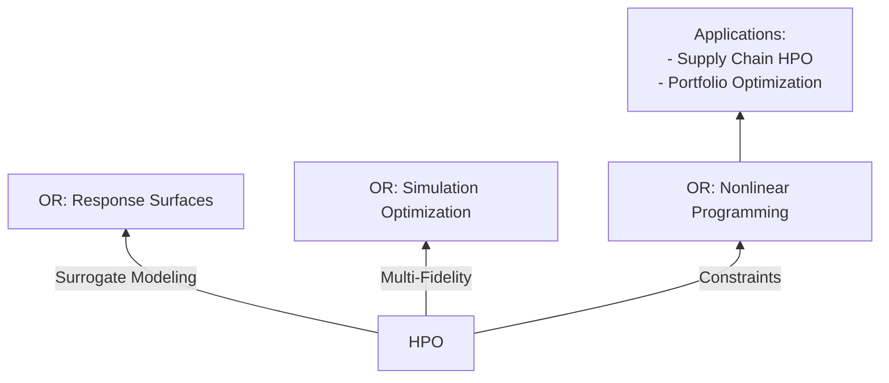

# Encyclopedia Galactica: Hyperparameter Optimization


## Table of Contents


1. [Section 1: Foundational Concepts and Definitions](#section-1-foundational-concepts-and-definitions)

2. [Section 2: Historical Evolution and Key Milestones](#section-2-historical-evolution-and-key-milestones)

3. [Section 3: Core Methodologies and Algorithms](#section-3-core-methodologies-and-algorithms)

4. [Section 4: Automated HPO Frameworks and Tooling](#section-4-automated-hpo-frameworks-and-tooling)

5. [Section 5: Scaling HPO: Distributed Computing and Resource Management](#section-5-scaling-hpo-distributed-computing-and-resource-management)

6. [Section 6: Domain-Specific Applications and Case Studies](#section-6-domain-specific-applications-and-case-studies)

7. [Section 7: Societal Implications, Ethics, and Environmental Impact](#section-7-societal-implications-ethics-and-environmental-impact)

8. [Section 8: Controversies, Debates, and Open Challenges](#section-8-controversies-debates-and-open-challenges)

9. [Section 9: Frontiers of Research and Emerging Paradigms](#section-9-frontiers-of-research-and-emerging-paradigms)

10. [Section 10: Synthesis, Best Practices, and Future Vistas](#section-10-synthesis-best-practices-and-future-vistas)


## Section 1: Foundational Concepts and Definitions

The relentless ascent of machine learning (ML) and artificial intelligence (AI) has transformed countless domains, from deciphering genomic sequences to enabling autonomous navigation. Yet, beneath the veneer of these seemingly intelligent systems lies a critical, often underappreciated, engineering challenge: the meticulous calibration of a model's configuration knobs. This process, known as **Hyperparameter Optimization (HPO)**, is not merely a technical afterthought; it is the crucible in which raw algorithmic potential is forged into practical, high-performing intelligence. This foundational section establishes the core principles, precise terminology, and profound importance of HPO within the modern AI ecosystem. We will dissect the very essence of hyperparameters, illuminate why their optimization is non-negotiable, deconstruct the formal structure of the optimization problem itself, and rigorously examine the pivotal role of evaluation—setting the stage for the historical, algorithmic, and practical explorations to follow.

### 1.1 The Essence of Hyperparameters: Distinguishing Parameters from Hyperparameters

At the heart of any machine learning model lies a set of quantities that define its structure and govern its learning behavior. A fundamental distinction, crucial for understanding HPO, separates these quantities into two categories: **parameters** and **hyperparameters**.

*   **Model Parameters:** These are the internal variables *learned* directly from the training data during the model fitting process. They are intrinsic to the model's representation of the underlying patterns within the data.

*   **Examples:**

*   The weights (`w`) and biases (`b`) in a neural network (e.g., `y = w*x + b`).

*   The coefficients in a linear or logistic regression model.

*   The split points and leaf values in a decision tree.

*   The support vectors and their weights in a Support Vector Machine (SVM).

*   **Nature:** Learned, data-dependent, internal to the model. The optimization algorithm (like Gradient Descent) adjusts these parameters to minimize a loss function (e.g., Mean Squared Error, Cross-Entropy).

*   **Hyperparameters:** These are the external configuration settings *prescribed* by the practitioner *before* the learning process begins. They control the overarching behavior of the learning algorithm itself, influencing how the model parameters are learned and the final structure of the model. They are *not* learned from the data in the standard training loop.

*   **Examples (Illustrating Diversity Across Algorithms):**

*   **Learning Rate (`α` or `eta`)**: (Neural Networks, Gradient Boosting) Arguably the most famous hyperparameter. Controls the step size during optimization (e.g., Gradient Descent). Too high causes divergence; too low causes slow convergence or getting stuck in poor local minima. (e.g., values like 0.1, 0.01, 0.001).

*   **Number of Estimators (`n_estimators`)**: (Random Forests, Gradient Boosting Machines) Controls the number of base learners (trees) in the ensemble. More trees generally reduce variance but increase computation and risk of overfitting if individual trees are too complex.

*   **Maximum Tree Depth (`max_depth`)**: (Decision Trees, Random Forests, Gradient Boosting) Limits how deep individual trees can grow, directly controlling model complexity and its propensity to overfit (high depth) or underfit (low depth).

*   **Number of Hidden Layers and Units per Layer**: (Neural Networks) Defines the architecture's capacity and representational power. More layers/units can model complex functions but dramatically increase parameters and overfitting risk.

*   **Regularization Strength (`C` in SVM, `alpha` in Ridge/Lasso, `lambda` for weight decay in NNs)**: Controls the trade-off between fitting the training data well and keeping the model simple to prevent overfitting. Higher regularization penalizes complexity more heavily.

*   **Kernel Function and Parameters** (e.g., `gamma` in RBF kernel): (SVMs, Gaussian Processes) Defines the similarity metric used in non-linear models. Choice (Linear, Polynomial, RBF) and parameters drastically alter the decision boundary shape.

*   **`k` in k-Nearest Neighbors (kNN)**: Determines how many neighboring data points influence the prediction for a new point. Small `k` leads to noisy, complex boundaries; large `k` leads to smoother, simpler boundaries.

*   **Batch Size**: (Neural Networks) Number of training examples used in one iteration to update the model parameters. Affects the noise in the gradient estimate, convergence speed, and memory requirements.

*   **Dropout Rate**: (Neural Networks) The probability of randomly dropping out (setting to zero) units during training, a powerful regularization technique.

*   **Nature:** Set *a priori*, external to the learning process (not directly learned from the *primary* training objective), control the learning algorithm's behavior and model structure. **Their selection is the core task of HPO.**

**Why the Distinction Matters:** Confusing parameters and hyperparameters leads to fundamental misunderstandings. Optimizing model parameters happens *within* the training loop via algorithms like SGD. Optimizing hyperparameters happens *outside* the training loop; it involves *running* the entire training process (which internally learns parameters) multiple times with different hyperparameter configurations to find the set that yields the best-performing model. HPO is a meta-optimization process.

### 1.2 The Optimization Imperative: Why Hyperparameter Tuning Matters

The choice of hyperparameters is far from arbitrary; it exerts a profound and often decisive influence on the performance, efficiency, and reliability of machine learning models. Neglecting HPO is akin to building a high-performance engine but never adjusting the fuel mixture or ignition timing – the potential remains unrealized, often spectacularly so. Here's why HPO is imperative:

1.  **Performance Sensitivity:** Machine learning models, particularly complex ones like deep neural networks, are notoriously sensitive to hyperparameter settings. Small changes can lead to large swings in performance metrics like accuracy, precision, recall, or mean squared error.

*   **Illustrative Example (Learning Rate):** Consider training a deep convolutional neural network (CNN) on ImageNet. A learning rate of 0.1 might cause the loss to oscillate wildly and never converge. A learning rate of 0.0001 might result in painfully slow convergence, taking days longer than necessary. A carefully tuned rate, perhaps 0.01 with decay scheduling, enables stable and efficient convergence to a much lower error. Bergstra and Bengio's seminal 2012 paper empirically demonstrated that randomly sampling hyperparameters can outperform a poorly chosen grid search, highlighting the sensitivity and the need for systematic approaches.

*   **Illustrative Example (Model Complexity):** In a Random Forest, setting `max_depth` too low (e.g., 3) results in shallow trees that cannot capture complex patterns (high bias/underfitting). Setting it too high (e.g., 100) allows trees to memorize noise in the training data (high variance/overfitting), leading to poor generalization on unseen data. Only an optimal depth (found via HPO) balances this trade-off.

2.  **The Bias-Variance Tradeoff Connection:** Hyperparameters are the primary levers for managing the fundamental bias-variance tradeoff in ML.

*   **High Bias (Underfitting):** The model is too simple to capture the underlying trend in the data. HPO can address this by *increasing model capacity* (e.g., more layers/units in NN, higher `max_depth` in trees, smaller `C`/larger `alpha` in regularization) or *reducing regularization strength*.

*   **High Variance (Overfitting):** The model fits the training data noise too closely and fails to generalize. HPO can address this by *decreasing model capacity* (e.g., fewer layers/units, lower `max_depth`), *increasing regularization strength* (larger `C`/smaller `alpha`, higher dropout rate), or *using techniques like early stopping* (itself governed by a hyperparameter like patience).

*   HPO systematically navigates this trade-off landscape to find the configuration yielding the best generalization error.

3.  **Impact on Training Efficiency:** Hyperparameters directly affect how quickly and resource-efficiently a model trains.

*   **Learning Rate:** As mentioned, directly controls convergence speed.

*   **Batch Size:** Larger batches provide more stable gradient estimates but require more memory per update and may converge in fewer, but computationally heavier, steps. Smaller batches are noisier but can sometimes lead to better generalization and require less memory per step.

*   **Early Stopping Criteria:** Defines when to halt training if validation performance plateaus, saving significant computation compared to training for a fixed, potentially excessive, number of epochs.

*   Efficient HPO can find configurations that achieve comparable or better performance *faster* and using *fewer computational resources*.

4.  **Enabling the Use of Complex Models:** The power of modern deep learning models comes at the cost of a vast hyperparameter space. Without effective HPO methods, leveraging these powerful architectures becomes impractical, as manual tuning is infeasible. HPO is the key that unlocks their potential. Anecdotal evidence from industry labs frequently highlights performance gains of 5-20% (or more) on critical metrics achieved solely through rigorous hyperparameter tuning compared to default settings or manual guesses, often translating to significant real-world value.

In essence, HPO transforms machine learning from an artisanal craft, heavily reliant on expert intuition and trial-and-error, into a more rigorous engineering discipline, capable of reliably extracting maximum performance from algorithmic innovations.

### 1.3 Anatomy of the Optimization Problem: Search Spaces, Objectives, and Constraints

Formally defining the HPO problem is crucial for understanding the methods designed to solve it. At its core, HPO seeks to find a hyperparameter configuration, denoted as `λ` (belonging to a configuration space `Λ`), that minimizes (or maximizes) an objective function `L` evaluated on a given dataset `D`.

*   **The Search Space (`Λ`):** This defines the universe of possible hyperparameter configurations to explore. Hyperparameters can be of different types, requiring different handling:

*   **Continuous:** Real-valued parameters within a defined range (e.g., `learning_rate ∈ [1e-5, 1e-1]`, `C ∈ [0.1, 10.0]`).

*   **Discrete (Integer):** Integer-valued parameters (e.g., `n_estimators ∈ {50, 100, 150, ..., 500}`, `max_depth ∈ {3, 4, 5, ..., 20}`).

*   **Categorical:** Parameters taking one value from a finite set of options (e.g., `kernel ∈ {'linear', 'poly', 'rbf', 'sigmoid'}`, `optimizer ∈ {'sgd', 'adam', 'rmsprop'}`).

*   **Conditional:** Parameters whose existence or valid range depends on the value of another (usually categorical) hyperparameter. This creates a hierarchical search space.

*   *Example:* If `kernel = 'poly'`, then `degree` (an integer hyperparameter controlling polynomial degree) becomes relevant and needs tuning. If `kernel = 'linear'`, `degree` is irrelevant. Similarly, the `gamma` parameter might only be relevant for the `'rbf'`, `'poly'`, and `'sigmoid'` kernels in an SVM. Efficiently handling conditional spaces is a key challenge for HPO algorithms.

*   **Defining `Λ`:** A critical step in HPO is carefully defining the search space. It should be broad enough to contain high-performing configurations but constrained enough to be searched efficiently within the available budget. Prior knowledge, literature, and initial experiments inform this definition.

*   **The Objective Function (`L`):** This function quantifies the performance of a model trained with hyperparameters `λ` on dataset `D`. Its output is a scalar value we aim to minimize (like error rate) or maximize (like accuracy).

*   **Single-Objective Optimization:** Most common, focusing on optimizing one primary metric (e.g., minimize validation error, maximize AUC). `L(λ)` typically involves training a model with `λ` on a training subset of `D` and evaluating it on a separate validation subset (see 1.4).

*   **Multi-Objective Optimization (MOO):** Often, multiple, potentially conflicting, objectives are important:

*   **Accuracy vs. Latency:** A highly accurate model might be too slow for real-time inference.

*   **Accuracy vs. Model Size:** Critical for deployment on resource-constrained devices (mobile, edge).

*   **Accuracy vs. Fairness:** Optimizing solely for accuracy might exacerbate bias against certain subgroups; fairness metrics (e.g., demographic parity difference, equal opportunity difference) need consideration.

*   **Accuracy vs. Training Cost/Time:** Finding a good configuration faster or cheaper.

*   In MOO, the goal shifts from finding a single "best" configuration to identifying the *Pareto front* – the set of configurations where improvement in one objective necessitates worsening another. `L(λ)` becomes a vector: `L(λ) = [Metric1, Metric2, ..., MetricM]`.

*   **Constraints:** Practical HPO must often operate within limitations:

*   **Resource Constraints:** Maximum wall-clock time, maximum number of trials (evaluations of `L(λ)`), total CPU/GPU hours, available memory.

*   **Performance Constraints:** Minimum acceptable accuracy, maximum tolerable inference latency (`< 100ms`), maximum model size (`< 10MB`).

*   **Constraints can be handled in different ways:** Hard constraints (discarding configurations violating them during search), incorporating constraint violations as penalties into the objective function, or treating them as additional objectives in an MOO setting.

Therefore, the HPO problem can be succinctly stated as:

`λ* = argmin_λ∈Λ L(λ)`

subject to any applicable constraints, where `L(λ)` might be a scalar (single-objective) or vector (multi-objective). The nature of `Λ` (mixed, conditional, high-dimensional) and `L(λ)` (expensive to evaluate, noisy, non-convex, potentially multi-objective) makes this a challenging **derivative-free, black-box optimization problem.**

### 1.4 The Crucial Role of Evaluation: Metrics, Validation Strategies, and Pitfalls

Evaluating the performance `L(λ)` of a hyperparameter configuration `λ` is the cornerstone of HPO. This evaluation must be robust, reliable, and computationally feasible, as it is performed repeatedly – often hundreds or thousands of times.

*   **Choosing Performance Metrics (`L`):** The metric(s) must align with the ultimate goal of the model. Common choices include:

*   **Classification:**

*   Accuracy: Proportion of correct predictions. Simple but can be misleading for imbalanced classes.

*   Precision, Recall, F1-Score: Essential for imbalanced data or when costs of false positives/negatives differ (e.g., fraud detection, medical diagnosis).

*   Area Under the ROC Curve (AUC-ROC): Measures the model's ability to distinguish between classes across all classification thresholds. Robust to class imbalance.

*   Area Under the Precision-Recall Curve (AUC-PR): Often more informative than AUC-ROC when classes are highly imbalanced.

*   Log Loss (Cross-Entropy): Measures the uncertainty of predictions based on probability estimates. Penalizes confident wrong predictions heavily.

*   **Regression:**

*   Mean Squared Error (MSE), Root Mean Squared Error (RMSE): Sensitive to large errors.

*   Mean Absolute Error (MAE): Less sensitive to outliers than MSE/RMSE.

*   R-squared (Coefficient of Determination): Proportion of variance explained by the model.

*   **Domain-Specific Metrics:** Often crucial (e.g., BLEU score for machine translation, Intersection over Union (IoU) for image segmentation, Click-Through Rate (CTR) for recommender systems).

*   **Key Principle:** The metric used for HPO *must* reflect the final business or scientific objective. Optimizing for the wrong metric leads to suboptimal models in practice.

*   **Validation Methodologies:** We cannot evaluate `L(λ)` on the test data (reserved for final unbiased assessment). Instead, we use a validation set derived from the training data.

*   **Hold-Out Validation:** Simple split: Train on one portion (e.g., 70%), validate on the other (e.g., 30%). Efficient but can yield high-variance estimates of performance if the validation set is small or unrepresentative. Prone to overfitting to that single validation split during HPO.

*   **k-Fold Cross-Validation (k-Fold CV):** Gold standard for smaller datasets or when reliable estimates are critical.

1.  Split the training data into `k` roughly equal-sized folds.

2.  For each fold `i`:

*   Train the model on all folds *except* `i`.

*   Evaluate the model on fold `i`.

3.  Average the performance over the `k` evaluation folds to get `L(λ)`.

*   Provides a more robust, lower-variance estimate of generalization performance than hold-out. Computationally expensive (`k` times more training runs per `λ`).

*   **Stratified k-Fold CV:** Ensures each fold preserves the class distribution of the original dataset, crucial for imbalanced classification.

*   **Nested Cross-Validation:** The *only* correct way to perform both model selection (including HPO) and error estimation without bias.

*   **Outer Loop:** Standard k-Fold CV for estimating final generalization error.

*   **Inner Loop:** Within *each* outer training fold, perform a separate k-Fold CV (or other HPO procedure) to select the best hyperparameters `λ*` *using only that outer training fold*.

*   The model (with `λ*` found in the inner loop) is trained on the entire outer training fold and evaluated on the outer test fold. The average over the outer folds gives the final unbiased performance estimate. Essential for rigorous reporting but computationally very intensive.

*   **Time-Series Validation:** Special techniques like forward chaining (e.g., `TimeSeriesSplit` in scikit-learn) are needed where data is temporally ordered to avoid leakage from the future.

*   **Pitfalls and Challenges:**

*   **Optimization Overfitting (Overfitting the Validation Set):** The most insidious danger. By evaluating many configurations `λ` on the *same* validation set, there's a high risk of finding a `λ` that performs well *on that specific validation set* by chance, but generalizes poorly to new data. This is analogous to overfitting in model training, but happening at the meta-level of HPO.

*   **Mitigation:** Use larger validation sets, k-Fold CV (especially nested CV for final reporting), or hold out a final *test* set that is used *exactly once* after HPO is complete to assess the final model chosen by the HPO process. Never use the test set for tuning!

*   **Noisy Evaluations:** The performance estimate `L(λ)` can be noisy due to factors like random weight initialization in NNs, stochastic optimization (SGD), or data sampling (small validation sets, bootstrapping in Random Forests). HPO algorithms must be robust to this noise.

*   **Computational Cost:** Evaluating `L(λ)` by training a model (especially deep models) and performing k-Fold CV is expensive. This cost drives the need for efficient HPO algorithms that find good configurations with as few evaluations as possible (discussed extensively in Sections 3 & 5). A study by Philipp Reimers comparing k-fold CV vs. simple holdout for HPO in NLP tasks highlighted significant discrepancies in model selection outcomes, underscoring the impact of validation strategy choice.

*   **Data Leakage:** Any information from the validation (or test) set leaking into the training process invalidates the performance estimate. Careful pipeline design (e.g., performing all feature scaling *after* splitting, using `Pipeline` objects) is essential.

**The Evaluation Imperative:** Rigorous evaluation is not a mere technicality; it is the bedrock upon which reliable HPO rests. Choosing appropriate metrics, employing robust validation strategies (especially nested CV for final model assessment), and vigilantly guarding against overfitting the validation set are non-negotiable practices for trustworthy hyperparameter optimization. The computational cost incurred here is often the primary driver for the sophisticated optimization algorithms explored in subsequent sections.

This foundational exploration has established the core vocabulary, underscored the critical importance of hyperparameter optimization, deconstructed the formal problem it addresses, and highlighted the paramount role of robust evaluation. We have seen that hyperparameters are the essential dials controlling a model's learning, that their careful tuning unlocks significant performance gains and manages fundamental trade-offs, that the search for optimal settings is a complex black-box optimization problem defined by its search space, objectives, and constraints, and that reliably assessing performance requires meticulous validation strategies to avoid the pervasive pitfall of overfitting. With these pillars firmly in place, we are poised to delve into the **Historical Evolution and Key Milestones** of HPO, tracing its journey from manual intuition to the sophisticated automation that powers modern AI. We will see how the limitations of early approaches sparked the innovations that define the field today.


---


## Section 2: Historical Evolution and Key Milestones

Building upon the foundational understanding of hyperparameters and the imperative for their optimization established in Section 1, we embark on a journey through the dynamic history of Hyperparameter Optimization (HPO). This evolution mirrors the broader trajectory of machine learning itself: from reliance on expert intuition and manual effort, through the development of systematic heuristics, towards the sophisticated, probabilistic, and automated frameworks that dominate today. Understanding this history is not merely an academic exercise; it illuminates the motivations behind current methodologies, reveals the limitations overcome, and provides context for appreciating the remarkable efficiency gains achieved. This section traces the pivotal milestones that transformed HPO from a burdensome chore into a powerful engine driving AI performance.

### 2.1 Pre-Automation Era: Manual Tuning, Grid Search, and the Birth of Systematic Approaches

In the nascent stages of machine learning, hyperparameter tuning was an intensely manual and expert-driven process. Practitioners, often deeply familiar with the specific algorithm and problem domain, relied heavily on intuition, rules of thumb, and iterative trial-and-error. This "artisanal" approach involved:

1.  **Intuition and Heuristics:** Drawing from experience with similar problems or theoretical understanding. For instance, setting a learning rate inversely proportional to the number of features, or initializing neural network weights based on the Glorot or He methods derived from variance analysis. While sometimes effective, this was highly subjective, non-scalable, and inaccessible to non-experts.

2.  **Manual Iteration ("Grad Student Descent"):** The painstaking process of manually adjusting a hyperparameter (e.g., decreasing the learning rate by a factor of 10), retraining the model, and observing the validation performance. This was feasible only for very small models and datasets, or when tuning a single critical parameter. The computational cost and human time required were prohibitive for complex problems. Anecdotes abound in early ML labs of researchers spending days or weeks manually coaxing performance from models, a process humorously dubbed "Grad Student Descent."

3.  **The Advent of Grid Search:** The first significant step towards systematization was **Exhaustive Grid Search**. The concept is straightforward: define a finite set of possible values for each hyperparameter (e.g., learning_rate = [0.1, 0.01, 0.001]; max_depth = [3, 5, 10]), then evaluate the Cartesian product of all these sets – every possible combination.

*   **Advantages:** Simple to understand and implement. Guaranteed to find the best configuration *within the defined grid* if the global optimum lies on a grid point. Embarrassingly parallelizable (each grid point evaluation is independent).

*   **Limitations (The Curse of Dimensionality):** The fatal flaw of Grid Search becomes apparent as the number of hyperparameters increases. The number of evaluations grows exponentially (`O(N^d)` for `d` hyperparameters each with `N` values). For example, 5 hyperparameters each with 5 values require 5^5 = 3125 evaluations. This quickly becomes computationally intractable. Furthermore:

*   **Waste:** Evaluates many obviously poor configurations, especially on the grid boundaries.

*   **Discretization:** The true optimum might lie *between* grid points, especially for continuous hyperparameters. Finer grids exacerbate the computational cost.

*   **Ignores Interaction:** Treats hyperparameters as independent, ignoring potential interactions where the optimal value of one depends on the setting of another.

*   **Use Case:** Remains viable only for tuning a very small number (1-3) of hyperparameters with limited value ranges, often as a preliminary step or sanity check.

**Statistical Precursors: Laying the Theoretical Groundwork**

While Grid Search dominated early systematic HPO, crucial groundwork was being laid in the field of statistics and experimental design, concepts that would later profoundly influence more advanced HPO techniques:

*   **Design of Experiments (DoE):** Pioneered by **Sir Ronald A. Fisher** in the 1920s and 30s for agricultural field trials, DoE provides systematic methods to plan experiments to extract maximum information with minimum resources. Techniques like factorial designs (studying the effect of multiple factors simultaneously) and fractional factorial designs (studying only a carefully chosen subset of combinations) offered ways to sample the hyperparameter space more efficiently than a full grid, especially for identifying main effects and interactions. While not directly applied to HPO initially, these principles informed later sampling strategies.

*   **Response Surface Methodology (RSM):** Developed primarily by **George E. P. Box** and colleagues in the 1950s, RSM is a collection of statistical techniques for exploring relationships between several explanatory variables (hyperparameters) and one or more response variables (model performance). RSM employs sequential experimentation, often starting with factorial designs to identify important factors, followed by steepest ascent/descent to move towards the optimum region, and finally, using higher-order models (like quadratic) for local optimization within that region. RSM explicitly recognized the need for iterative exploration guided by the observed responses, a core tenet of modern Bayesian optimization. Box's work on robustness and the famous aphorism, "All models are wrong, but some are useful," also subtly resonates with the challenges of model selection and hyperparameter sensitivity in ML.

Despite the limitations of Grid Search and the nascent state of automation, this era established the fundamental need for systematic exploration of the hyperparameter space, moving beyond pure intuition and laying the conceptual groundwork borrowed from experimental design.

### 2.2 The Rise of Heuristics: Random Search and Evolutionary Strategies

The computational burden of Grid Search, especially for high-dimensional spaces, spurred the search for more efficient, albeit heuristic, alternatives. This led to the adoption of stochastic sampling and evolutionary principles.

1.  **Random Search: Simplicity and Efficacy:**

*   **Core Idea:** Instead of evaluating every point on a predefined grid, randomly sample hyperparameter configurations from the defined search space (uniformly or according to some prior distribution) and evaluate them. The best configuration found after a fixed number of samples (or budget) is chosen.

*   **The Seminal Insight:** **James Bergstra and Yoshua Bengio's** 2012 paper, *"Random Search for Hyper-Parameter Optimization"*, provided a rigorous empirical and theoretical justification. Their key insight was that for many practical machine learning problems, especially those involving neural networks or SVMs with continuous hyperparameters, the performance landscape is often *low effective dimensionality*. This means that only a small subset of hyperparameters significantly impacts performance, while others are relatively less important (or their importance depends on the setting of key ones).

*   **Advantages over Grid Search:**

*   **Efficiency in High Dimensions:** Random Search avoids the exponential explosion of Grid Search. Given a fixed budget of `N` trials, it explores `N` distinct, randomly chosen points across the *entire* space. With high probability, it will sample values for the important hyperparameters more densely than Grid Search, which wastes samples on the less important ones. Bergstra and Bengio demonstrated empirically that Random Search could find better configurations than Grid Search with far fewer evaluations (often 5-10x fewer) on tasks like training deep belief networks and SVMs.

*   **No Discretization Bias:** Explores the continuous space more naturally. Easier to define non-uniform priors if prior knowledge exists.

*   **Simplicity and Parallelizability:** Trivially easy to implement and perfectly parallelizable, just like Grid Search.

*   **Limitations:** Still fundamentally a "shotgun" approach. While more efficient than Grid Search in high dimensions, it offers no *intelligent* guidance based on previous evaluations. It may waste evaluations on obviously poor regions and can struggle to find the precise optimum in smooth, low-noise regions. Performance depends significantly on the luck of the draw.

*   **Impact:** Random Search became (and often remains) the go-to baseline method and a surprisingly effective practical tool, particularly when computational resources allow for a large number of trials or as a warm-start for more sophisticated methods. It marked a crucial shift away from exhaustive enumeration towards stochastic exploration.

2.  **Evolutionary Strategies and Genetic Algorithms:**

Inspired by biological evolution, **Evolutionary Algorithms (EAs)** and specifically **Genetic Algorithms (GAs)** emerged as another heuristic approach to HPO, particularly popular in the 1990s and early 2000s. Key figures include **John Holland** (often credited as the father of GAs) and **David E. Goldberg**.

*   **Core Mechanism:**

*   **Population:** Maintains a population of candidate hyperparameter configurations (individuals).

*   **Selection:** Individuals are selected for "reproduction" based on their fitness (performance). Fitter individuals have a higher chance of being selected (e.g., tournament selection, roulette wheel selection).

*   **Crossover (Recombination):** Pairs of selected parents exchange parts of their "genetic material" (hyperparameter values) to create offspring. For example, a child might inherit the learning rate from parent A and the dropout rate from parent B.

*   **Mutation:** Random perturbations are applied to the offspring's hyperparameters to introduce new variation (e.g., slightly increasing the learning rate, changing a kernel type randomly).

*   **Replacement:** The new offspring population replaces (or competes with) the old population, and the cycle repeats.

*   **Advantages:**

*   **Robustness:** Can handle noisy objective functions, non-differentiability, and complex, multi-modal search spaces where the global optimum is hard to find. Does not require gradient information.

*   **Implicit Parallelism:** The population-based nature lends itself well to parallel evaluation of individuals.

*   **Flexibility:** Can handle continuous, discrete, and categorical hyperparameters naturally. Relatively easy to incorporate domain knowledge via customized mutation/crossover operators.

*   **Limitations:**

*   **Parameter Sensitivity:** Performance heavily depends on tuning the EA's *own* hyperparameters (population size, mutation rate, crossover rate, selection strategy).

*   **Slow Convergence:** Often requires many evaluations (generations) to converge, especially compared to model-based methods like Bayesian Optimization. Can be computationally expensive.

*   **"Evolutionary Dogma":** Risk of premature convergence to a local optimum if diversity in the population is lost. The "No Free Lunch" theorem applies strongly.

*   **Variants:** Numerous EA variants were applied to HPO, including **Evolution Strategies (ES)** (focusing more on mutation and continuous optimization, e.g., CMA-ES - Covariance Matrix Adaptation Evolution Strategy) and **Particle Swarm Optimization (PSO)** (inspired by social behavior, where particles move through the search space adjusting their position based on personal and group bests).

*   **Impact:** While largely superseded in pure HPO efficiency by Bayesian methods for many problems, evolutionary approaches demonstrated the power of population-based, gradient-free optimization. They remain relevant for complex spaces (e.g., conditional, hierarchical), noisy evaluations, and hybrid approaches like Population-Based Training (PBT) used in deep reinforcement learning.

The era of heuristics demonstrated that efficiency could be dramatically improved over brute-force methods by leveraging randomness and evolutionary principles. Random Search became the pragmatic workhorse, while EAs showcased the potential of adaptive, population-based search. However, both lacked a principled way to model the relationship between hyperparameters and performance to guide the search intelligently.

### 2.3 Bayesian Revolution: From Theory to Practical Toolkits

The quest for a more *informed* and *efficient* search strategy led to the adoption of Bayesian Optimization (BO), marking a paradigm shift in HPO. BO leverages probability to model the unknown objective function (performance landscape) and uses this model to decide where to sample next, balancing exploration (trying uncertain regions) and exploitation (focusing on promising regions).

1.  **Foundational Concepts:**

*   **Surrogate Model:** BO builds a probabilistic surrogate model `M` that approximates the expensive-to-evaluate true objective function `L(λ)`. The most common choice is the **Gaussian Process (GP)**. A GP defines a distribution over functions, providing a mean prediction and uncertainty estimate (variance) for any point `λ` in the search space, based on the observed data points `(λ_i, L(λ_i))`. It excels at capturing smooth trends and quantifying uncertainty.

*   **Acquisition Function (`α(λ)`):** This function uses the surrogate model's predictions (mean and variance) to determine the *most promising* point to evaluate next. It quantifies the "utility" of sampling `λ`. Popular choices include:

*   **Expected Improvement (EI):** Measures the expected amount by which `L(λ)` might improve over the current best observed value `f*`.

*   **Probability of Improvement (PI):** Probability that sampling `λ` will yield an improvement over `f*`.

*   **Upper Confidence Bound (UCB / GP-UCB):** `α(λ) = μ(λ) + κ * σ(λ)`, where `μ` is the mean prediction, `σ` is the standard deviation (uncertainty), and `κ` controls the exploration-exploitation tradeoff. Favors points with high predicted value or high uncertainty.

*   **Optimization Loop:**

1.  Build/update the surrogate model `M` using all previously evaluated points `{(λ_1, L(λ_1)), ..., (λ_t, L(λ_t))}`.

2.  Find the next point `λ_{t+1}` by maximizing the acquisition function `α(λ)` over the search space `Λ`. This optimization is typically much cheaper than evaluating `L(λ)`.

3.  Evaluate the true objective `L(λ_{t+1})` (i.e., train and validate the model with hyperparameters `λ_{t+1}`).

4.  Add `(λ_{t+1}, L(λ_{t+1}))` to the set of observations and repeat.

2.  **Key Early Papers and Theoretical Underpinnings:**

*   While BO concepts existed earlier, the seminal paper widely credited with establishing the modern GP-based BO framework for engineering design and optimization is **"Efficient Global Optimization of Expensive Black-Box Functions" by Donald R. Jones, Matthias Schonlau, and William J. Welch (1998)**. This paper rigorously defined the EI acquisition function and demonstrated its effectiveness on challenging test functions and engineering problems.

*   Theoretical convergence guarantees under certain conditions (like the underlying function being drawn from the GP prior) were developed, providing a solid mathematical foundation lacking in purely heuristic methods. The GP-UCB acquisition function, introduced by Niranjan Srinivas et al. in 2009 (*"Gaussian Process Optimization in the Bandit Setting: No Regret and Experimental Design"*), provided strong theoretical regret bounds.

3.  **From Theory to Practice: The First Accessible Toolkits:**

*   Translating BO theory into usable software for HPO was the next critical step. Early toolkits were often research-oriented but proved the concept's power in ML.

*   **Spearmint (circa 2012):** Developed by Jasper Snoek, Hugo Larochelle, and Ryan P. Adams, Spearmint was one of the first widely adopted open-source BO libraries specifically targeting ML hyperparameter tuning. It used GPs with Matern kernels and primarily the EI acquisition function. Its ability to find good configurations with far fewer evaluations than Random Search, especially on deep learning tasks, generated significant excitement. Spearmint highlighted the practical challenges of optimizing the acquisition function efficiently and handling diverse hyperparameter types.

*   **MOE (Metric Optimization Engine - Yelp, circa 2014):** Developed by Scott Clark (Yelp), MOE provided a robust, scalable implementation of GP-based BO with a focus on making Bayesian methods accessible. It offered a clean REST API and emphasized ease of integration and deployment, showcasing the potential for BO in production environments.

*   **Handling Real-World Complexities:** These early libraries pioneered solutions for critical practical issues:

*   **Categorical and Conditional Parameters:** Extending GPs to handle non-continuous spaces using techniques like one-hot encoding (for categoricals) or defining separate GPs for different conditional branches.

*   **Parallelization:** Developing strategies like constant liar (making a temporary assumption about the outcome of a running evaluation to suggest a new point) or Kriging believer to suggest multiple points concurrently.

*   **Noisy Observations:** Modifying the GP likelihood to account for noise in the performance evaluation `L(λ)`.

4.  **Industrial Adoption and Proof of Concept:**

*   The potential of BO for tuning complex, expensive models quickly attracted attention in industrial research labs. Google Brain, DeepMind, Microsoft Research, and others began using BO internally for tasks like tuning deep neural network architectures and training parameters.

*   **Case Study - Google Vizier's Roots:** The experience gained from internal BO usage at Google, particularly the challenges of scaling, robustness, and user-friendliness encountered with research toolkits like Spearmint, directly informed the development of **Google Vizier**, their internal HPO service later revealed in a 2017 paper. Vizier became the robust, scalable backbone for HPO across numerous Google products and research projects, demonstrating BO's viability at massive scale and its critical role in achieving state-of-the-art results. Its design principles heavily influenced later open-source and commercial platforms.

The Bayesian revolution fundamentally changed the landscape of HPO. It provided a principled, data-efficient framework that intelligently guided the search based on accumulating knowledge. The transition from theoretical papers to practical toolkits like Spearmint and MOE, validated by industrial adoption, proved BO's superiority over heuristics for many complex, expensive tuning tasks, setting the stage for widespread democratization.

### 2.4 Acceleration and Democratization: Open-Source Libraries and Cloud Scale

The power of Bayesian Optimization and other advanced HPO methods remained largely confined to research labs and large tech companies with the expertise to implement and manage complex frameworks like early Spearmint. The next evolutionary leap came from the emergence of robust, user-friendly open-source libraries and the pervasive availability of cloud computing, dramatically accelerating HPO adoption and enabling its application at unprecedented scale.

1.  **The Open-Source HPO Ecosystem Explosion (2013-Present):**

A wave of well-designed, accessible libraries emerged, abstracting away the complexities of underlying algorithms and providing intuitive APIs. These libraries often incorporated multiple HPO strategies:

*   **Hyperopt (2013):** Created by James Bergstra (co-author of the Random Search paper), Dan Yamins, and David Cox. Hyperopt popularized the **Tree-structured Parzen Estimator (TPE)** algorithm. TPE models the distribution of good (`p(x|y=y*)`) configurations and uses this to define an acquisition function favoring points likely to be good. TPE is particularly efficient for parallel computation and handles conditional spaces naturally via its tree structure. Hyperopt also introduced integration with MongoDB for distributed trial storage and coordination, enabling scaling across multiple machines.

*   **Scikit-Optimize (`skopt`, 2016):** Built tightly on top of the popular `scikit-learn` API, `skopt` focused on making GP-based Bayesian Optimization accessible to the vast `scikit-learn` user base. It provided simple interfaces (`gp_minimize`, `forest_minimize` using Random Forests as surrogates) and integrated seamlessly with `scikit-learn` models and pipelines, significantly lowering the barrier to entry for BO.

*   **Optuna (2018):** Developed by Preferred Networks (PFN), Optuna introduced a highly flexible **"define-by-run"** API. Unlike "define-and-run" APIs (e.g., Hyperopt) where the search space is defined statically upfront, Optuna allows users to define the space dynamically *within* the objective function. This offers unparalleled flexibility, especially for complex conditional or evolving search spaces. Optuna also emphasized efficiency features like **pruning** (automatically stopping unpromising trials early, e.g., using Asynchronous Successive Halving (ASHA) or Median Pruning) and built-in visualization tools. Its support for multi-objective optimization and seamless distributed computing further fueled its rapid adoption. Studies showed Optuna often outperformed Hyperopt in terms of speed and final result quality on various benchmarks.

*   **SMAC (Sequential Model-based Algorithm Configuration):** Originally developed by Frank Hutter, Holger Hoos, and Kevin Leyton-Brown for algorithm configuration (e.g., tuning SAT solvers), SMAC was adapted for HPO. It uses **Random Forests** as surrogate models instead of GPs. Random Forests naturally handle categorical and conditional parameters, are robust to parameter scaling, and scale better computationally than GPs to higher dimensions and more observations. The SMAC3 library became a mainstay in the HPO toolkit, known for its robustness.

*   **BoTorch / Ax (2019/2018):** Developed by Facebook AI Research (FAIR), BoTorch is a PyTorch-based library for state-of-the-art Bayesian Optimization, including support for multi-task, multi-objective, and constrained optimization with advanced acquisition functions like qNoisyExpectedImprovement (qNEI) and qExpectedHypervolumeImprovement (qEHVI). Ax (Adaptive Experimentation Platform) builds on BoTorch, providing a higher-level service-oriented API for HPO and adaptive experimentation. These libraries represent the cutting edge in flexible, high-performance BO research applied to large-scale problems.

2.  **Integration with Major ML Frameworks:**

These HPO libraries did not exist in isolation. Deep integration with the dominant ML frameworks became crucial:

*   **TensorFlow:** Integration via `tf.keras` tuners (KerasTuner) and libraries like Ray Tune.

*   **PyTorch:** Tight integration with Optuna, BoTorch/Ax, Ray Tune, and dedicated solutions like PyTorch Lightning's Tuner.

*   **Scikit-learn:** Native `GridSearchCV`/`RandomizedSearchCV` and deep integration with `skopt`, Optuna, and others via custom scorers and CV splitters. This integration meant practitioners could leverage powerful HPO without leaving their familiar modeling environment.

3.  **The Impact of Cloud Computing:**

The computational demands of HPO, especially for deep learning, were perfectly aligned with the rise of elastic cloud computing. Cloud platforms provided the essential infrastructure:

*   **Massive Parallelization:** Launching hundreds or thousands of concurrent trials across vast fleets of virtual machines (VMs) or containers. Cloud job schedulers and managed Kubernetes services (like GKE, EKS, AKS) simplified orchestration.

*   **Specialized Hardware:** Easy access to powerful GPUs and TPUs accelerated individual model training times dramatically, making more HPO trials feasible within a given time budget. Studies showed GPU-accelerated training could reduce trial times by 10-50x compared to CPUs for deep learning tasks.

*   **Cost Efficiency:** Pay-per-use models (especially leveraging spot/preemptible instances at a fraction of the cost) made large-scale HPO accessible to startups and researchers, not just tech giants. Managed HPO services abstracted away cluster management entirely. A 2020 analysis estimated that using spot instances could reduce HPO cloud costs by 60-90%.

*   **Managed HPO Services:** Cloud providers integrated HPO directly into their ML platforms:

*   **Google Cloud Vertex AI Vizier:** The externalized version of Google's internal Vizier service, offering black-box optimization as a managed service.

*   **Amazon SageMaker Automatic Model Tuning:** Integrates Hyperparameter tuning (using various strategies including Bayesian) seamlessly into the SageMaker training workflow.

*   **Microsoft Azure Machine Learning HyperDrive:** Provides automated hyperparameter tuning for Azure ML experiments.

These services further lowered the barrier, allowing users to leverage sophisticated HPO without managing any infrastructure or optimization code.

4.  **The AutoML Wave:**

HPO became a core component of the broader **Automated Machine Learning (AutoML)** movement. AutoML aims to automate the entire ML pipeline, including feature engineering, model selection, and hyperparameter tuning. Open-source AutoML frameworks like **auto-sklearn** (building on scikit-learn, using meta-learning and BO), **H2O AutoML**, and **AutoGluon** (AWS), and commercial platforms like **DataRobot** and **Google Cloud AutoML**, embedded advanced HPO techniques (often combining Bayesian methods with multi-fidelity optimization like Hyperband) to deliver performant models with minimal human intervention. This cemented HPO's role as a fundamental pillar of practical, scalable machine learning.

**The Democratization Impact:** The confluence of powerful open-source libraries (Hyperopt, Optuna, SMAC, skopt), deep integration with ML frameworks, and the elastic scale of cloud computing transformed HPO from an arcane research technique into an accessible, everyday tool for data scientists and engineers. This democratization unlocked significant performance gains across industries, accelerated research progress by reducing tuning overhead, and empowered smaller organizations to leverage complex ML models effectively. The era of manual tuning and cumbersome Grid Search was decisively over, replaced by sophisticated, automated, and scalable optimization engines. As one engineer at a mid-sized tech company remarked upon adopting Optuna, "It felt like finally having power tools after years of using a hand saw."

This historical journey—from manual intuition and Grid Search, through the stochastic efficiency of Random Search and evolutionary methods, propelled by the Bayesian revolution and its practical toolkits, and finally accelerated by open-source innovation and cloud scale—has equipped the ML community with powerful instruments for tuning the engines of artificial intelligence. Having traced this evolution, we are now prepared to delve into the **Core Methodologies and Algorithms** that underpin modern HPO, dissecting the inner workings of the tools that have reshaped the landscape of machine learning performance. We will explore how these algorithms navigate complex search spaces, balance exploration and exploitation, and achieve remarkable efficiency in the face of daunting computational costs.


---


## Section 3: Core Methodologies and Algorithms

The historical journey from manual tuning to automated optimization, chronicled in Section 2, culminated in a powerful arsenal of algorithms that form the backbone of modern hyperparameter optimization. Having witnessed the democratization of HPO through accessible toolkits and cloud infrastructure, we now delve into the intricate machinery driving this revolution. This section dissects the primary algorithmic families, revealing the mathematical elegance and pragmatic ingenuity that enable efficient navigation of complex hyperparameter landscapes. Understanding these core methodologies—spanning simple heuristics, probabilistic modeling, multi-fidelity acceleration, and evolutionary adaptation—is essential for appreciating how contemporary HPO achieves remarkable performance gains while managing daunting computational costs.

### 3.1 Model-Free Optimization: Grid, Random, and Quasi-Random Sequences

Despite the ascendancy of more sophisticated techniques, model-free methods remain relevant, particularly as baselines, for low-dimensional problems, or when parallel resources are abundant. These algorithms make no assumptions about the underlying relationship between hyperparameters and performance, relying solely on direct evaluation.

1.  **Grid Search: Systematic Exhaustion**

*   **Mechanism:** As detailed in Section 2.1, Grid Search evaluates every possible combination within a predefined, discretized grid of hyperparameter values. For example, tuning a learning rate (`lr = [0.001, 0.01, 0.1]`) and batch size (`batch_size = [32, 64, 128]`) results in 3x3 = 9 distinct evaluations.

*   **When Viable:** Grid Search is only practical for **very low-dimensional spaces (typically 1-3 hyperparameters)** with a **limited number of discrete values**. Its exhaustive nature guarantees finding the best configuration *on the grid points*.

*   **The Curse of Dimensionality:** This is Grid Search's fatal flaw. The number of evaluations grows exponentially (`O(N^d)`) with the number of hyperparameters (`d`). Tuning just 5 hyperparameters with 5 values each requires 3,125 evaluations. A common pitfall is naively applying Grid Search to deep learning, where spaces often involve 10+ hyperparameters – a computationally infeasible task. A 2018 study comparing methods on a CNN for CIFAR-10 starkly illustrated this: Grid Search (over 4 hyperparameters) required 256 trials to match the performance Bayesian Optimization achieved in 30.

*   **Wastefulness and Discretization:** Grid Search expends significant resources evaluating points in poor regions and along boundaries. It also suffers from discretization bias; the true optimum may lie between grid points, especially for continuous parameters like learning rates. Increasing grid resolution amplifies cost quadratically or worse.

2.  **Random Search: Stochastic Efficiency**

*   **Mechanism:** Random Search samples hyperparameter configurations independently and uniformly at random from the defined search space `Λ`. After a fixed budget of `N` trials, the configuration yielding the best validation performance is selected. Bergstra & Bengio’s 2012 insight (Section 2.2) demonstrated its superiority over Grid Search in higher dimensions.

*   **Theoretical Justification:** Random Search excels when the performance landscape exhibits **low effective dimensionality**. If only a subset of hyperparameters significantly influences performance, Random Search, by sampling uniformly across *all* dimensions, effectively evaluates the important ones more densely than Grid Search for a given budget. The probability of missing the global optimum decreases as `N` increases, but convergence can be slow near the optimum.

*   **Variance Reduction:** While the basic version uses uniform sampling, incorporating prior knowledge can improve efficiency:

*   **Log-Uniform Sampling:** Crucial for hyperparameters spanning orders of magnitude (e.g., learning rates: `lr ~ loguniform(1e-5, 1e-1)`). Sampling uniformly in log-space ensures equal exploration across scales.

*   **Non-Uniform Priors:** If domain knowledge suggests certain regions are more promising, sampling can be biased accordingly (e.g., higher probability for moderate dropout rates).

*   **Advantages:** Trivially simple to implement, embarrassingly parallel, robust to conditional parameters (simply sample valid configurations), and requires no tuning of the optimizer itself. It often outperforms poorly designed Grid Searches and remains a strong baseline.

*   **Limitations:** Lacks any learning from past evaluations. It wastes resources on poor regions and struggles to refine solutions near local optima. Performance is variable between runs due to its stochastic nature. Finding the precise optimum in a smooth basin requires many samples.

3.  **Quasi-Random Sequences (Halton, Sobol): Uniformity by Design**

*   **Motivation:** Pure random sampling can exhibit clustering or gaps ("clumping") due to chance, especially in lower dimensions. Quasi-random sequences, also known as **low-discrepancy sequences**, are deterministically designed to fill the search space more uniformly than random sampling, achieving faster convergence rates for integration and, by analogy, optimization.

*   **Mechanism:** Sequences like **Halton** and **Sobol** generate points that minimize discrepancy – a measure of deviation from perfect uniformity. They use number-theoretic methods to create highly uniform coverage. For example, the Halton sequence for a dimension uses a different prime number base.

*   **Advantages over Random Search:** Provides faster initial coverage of the search space due to superior uniformity. This can lead to finding a *reasonably good* configuration faster, especially in lower dimensions or when the global optimum isn't extremely sharp. They retain perfect parallelizability.

*   **Limitations:** Benefits diminish in very high dimensions. Like Random Search, they lack any model-based guidance for iterative improvement. They can be less intuitive to implement than pure random sampling, especially for complex conditional spaces. Their deterministic nature means running the same sequence twice yields identical results, removing variability but potentially missing regions favored by random chance.

*   **Use Case:** Primarily used as a sophisticated initialization strategy for model-based methods (like BO) or within population-based algorithms to ensure initial diversity. Less commonly used as a standalone HPO method compared to Random Search.

**Model-Free Legacy:** While overshadowed by model-based approaches for complex tasks, Grid Search serves as a conceptual anchor, Random Search remains a pragmatic workhorse and essential baseline, and Quasi-Random sequences offer a structured alternative for initial exploration. Their simplicity, parallelizability, and robustness ensure their continued relevance in the HPO toolkit.

### 3.2 Bayesian Optimization (BO): Principles and Components

Bayesian Optimization represents the gold standard for sample-efficient black-box optimization of expensive functions, making it ideally suited for HPO where each trial (model training/validation) is costly. BO builds a probabilistic surrogate model of the objective function and uses it to guide the selection of the next hyperparameters to evaluate, intelligently balancing exploration and exploitation.

1.  **The Optimization Loop:**

*   **Initialization:** Evaluate an initial set of hyperparameter configurations (e.g., using random or quasi-random sampling).

*   **Iterate until Budget Exhausted:**

1.  **Surrogate Model Update:** Fit a probabilistic model `M` to all observed data `{(λ_1, y_1), ..., (λ_t, y_t)}`, where `y_i = L(λ_i)` (often noisy).

2.  **Acquisition Function Maximization:** Using `M`, compute an acquisition function `α(λ)` over the search space `Λ`. `α(λ)` quantifies the desirability of evaluating `λ` next. Find `λ_{t+1} = argmax_{λ ∈ Λ} α(λ)`.

3.  **Evaluation:** Evaluate the true objective `y_{t+1} = L(λ_{t+1})` (train/validate model).

4.  **Augment Data:** Add `(λ_{t+1}, y_{t+1})` to the observation set.

*   **Output:** Best observed configuration `λ*`.

2.  **Gaussian Process (GP) Regression: The Workhorse Surrogate:**

*   **Concept:** A GP defines a distribution over functions. It is fully specified by a mean function `m(λ)` (often assumed constant or zero) and a covariance kernel (or kernel function) `k(λ, λ')` that encodes assumptions about the function's smoothness and structure.

*   **Prediction:** Given observed data, the GP provides a posterior predictive distribution for the function value `f(λ*)` at any new point `λ*`: a Gaussian distribution `N(μ(λ*), σ^2(λ*))`, where `μ(λ*)` is the predicted mean and `σ^2(λ*)` is the predictive variance (uncertainty).

*   **Key Kernels:**

*   **Squared Exponential (RBF):** `k(λ, λ') = exp(-||λ - λ'||² / (2l²))`. Assumes infinitely differentiable, very smooth functions. Can oversmooth.

*   **Matérn:** A generalization offering control over smoothness. Matérn 5/2 (`ν=5/2`) is a popular choice: `k(λ, λ') = (1 + √5||λ - λ'||/l + 5||λ - λ'||²/(3l²)) * exp(-√5||λ - λ'||/l)`. It yields functions that are twice differentiable, often a better fit for real-world HPO landscapes than RBF. The lengthscale `l` controls how quickly correlation decays with distance.

*   **Handling Different Data Types:** Kernels can be combined (e.g., multiplication, addition) to handle mixed spaces. Continuous dimensions typically use RBF/Matérn. Categorical dimensions use kernels like Hamming kernel (over one-hot vectors) or specify separate lengthscales per category. Automatic Relevance Determination (ARD) uses different lengthscales for each dimension, effectively learning feature importance.

*   **Computational Complexity:** Fitting the GP (optimizing kernel hyperparameters via marginal likelihood) scales as `O(t^3)` due to the need to invert the `t x t` kernel matrix `K`, where `t` is the number of observations. Prediction scales as `O(t^2)`. This becomes prohibitive beyond a few hundred observations, limiting "vanilla" GP-BO to moderate budgets. Sparse variational GPs or other approximations are used for larger `t`.

3.  **Acquisition Functions: The Decision Engine:**

The acquisition function leverages the surrogate model's prediction (`μ(λ)`) and uncertainty (`σ(λ)`) to balance exploration (evaluating high-uncertainty regions) and exploitation (evaluating regions predicted to be good).

*   **Expected Improvement (EI):** Measures the expected amount of improvement over the current best observed value `f* = min_{i=1..t} f(λ_i)`:

`EI(λ) = E[max(0, f* - f(λ))]`

Under the GP posterior, this has a closed form:

`EI(λ) = (f* - μ(λ) - ξ)Φ(Z) + σ(λ)φ(Z)` if `σ(λ) > 0`, else `0`.

where `Z = (f* - μ(λ) - ξ)/σ(λ)`, `Φ` and `φ` are the standard Normal CDF and PDF, and `ξ` is a small exploration parameter. EI naturally balances exploration and exploitation; high `μ` (promising) or high `σ` (uncertain) yield high EI. The `ξ` parameter explicitly controls exploration bias.

*   **Probability of Improvement (PI):** Probability that evaluating `λ` will yield a value better than `f*`:

`PI(λ) = P(f(λ)  y*`).

*   **Modeling Distributions:** TPE models the hyperparameter distributions for these two groups using Parzen Estimators (kernel density estimators). This gives `l(λ) = p(λ | y ≤ y*)` (density of good points) and `g(λ) = p(λ | y > y*)` (density of bad points).

*   **Acquisition - Improvement Ratio:** The acquisition function is defined as the ratio `α(λ) ∝ l(λ) / g(λ)`. This favors points `λ` that are:

*   **Likely under `l(λ)`**: Frequently observed in the high-performing group.

*   **Unlikely under `g(λ)`**: Rarely observed in the low-performing group.

Maximizing `l(λ)/g(λ)` selects points that have a high probability of being good relative to the probability of being bad. It inherently balances exploration (where `g(λ)` is low, i.e., regions not explored or not found to be bad) and exploitation (where `l(λ)` is high).

*   **Sequential Construction:** TPE typically works in epochs. It collects a batch of observations using the current `l(λ)/g(λ)` model, then updates the densities using all observations (including the new ones) to define the model for the next batch. This enables efficient parallel evaluation of a batch of configurations.

*   **Advantages:**

*   **Parallelism:** The batch-based nature makes TPE highly amenable to parallel and asynchronous evaluation, a significant advantage over sequential GP-BO.

*   **Handles Complex Spaces:** Naturally handles categorical and conditional parameters via its tree-structured density estimation (defining densities only over valid branches).

*   **Scalability:** Density estimation scales more favorably than GP regression (`O(t)` vs `O(t^3)`), making TPE efficient for larger budgets.

*   **Robustness:** Less sensitive to the specific modeling assumptions than GPs.

*   **Disadvantages:**

*   **Less Sample-Efficient:** Generally requires more evaluations than GP-BO to achieve the same performance, especially in smooth, low-noise settings, as it doesn't build a global functional model.

*   **Choice of γ:** Performance can be sensitive to the choice of the quantile threshold `γ` splitting good/bad points. `γ=0.15` is a common heuristic.

*   **Modeling Limitations:** Parzen estimators can struggle in very high dimensions, and the ratio `l(λ)/g(λ)` can become noisy.

*   **Impact:** TPE's efficiency and native parallelization, implemented in Hyperopt, made sophisticated HPO accessible to a broad audience early on. It demonstrated strong performance on deep learning tasks and remains a popular choice, especially within the Hyperopt and Optuna ecosystems.

**SMAC vs. TPE vs. GP-BO:** The choice often depends on the problem characteristics:

*   **GP-BO:** Best for **low evaluation budgets** (tens to low hundreds), **continuous/mixed spaces**, and **smooth or moderately noisy** objectives when computational cost allows. Highest sample efficiency.

*   **SMAC:** Best for **complex conditional/combinatorial spaces**, **categorical parameters**, **larger budgets** (hundreds+), and **robustness** requirements. Good all-rounder.

*   **TPE:** Best for **moderate-to-large budgets** (hundreds+), scenarios demanding **massive parallelization**, and **conditional spaces**. Often easier to deploy at scale than GP-BO.

### 3.4 Multi-Fidelity and Early-Stopping Techniques

The crippling cost of HPO stems primarily from the expense of fully training and evaluating a model for each hyperparameter configuration. Multi-fidelity optimization addresses this by leveraging cheaper, approximate evaluations ("low-fidelity") to identify promising configurations worthy of full evaluation ("high-fidelity").

1.  **Fidelity Dimensions:** Approximations can be created by:

*   **Subsampling Data:** Training on a small random subset (e.g., 10%) of the full training data.

*   **Reduced Epochs:** Training for only a few epochs instead of full convergence.

*   **Lower Image Resolution:** For computer vision tasks.

*   **Shallower Model:** Using a smaller version of the target architecture.

*   **Fewer Cross-Validation Folds:** Using only 2-3 folds instead of 5-10.

2.  **Successive Halving (SHA):**

*   **Mechanism:** Inspired by tournament selection.

1.  Allocate a total budget `B` (e.g., total epochs or data samples).

2.  Start with `N` configurations, each evaluated with a small budget `b = B/(N * k)` (where `k` is a reduction factor, often 3 or 4).

3.  Rank configurations based on their low-fidelity performance.

4.  Keep only the top `1/k` fraction of configurations.

5.  Increase the budget per remaining configuration by a factor of `k` (e.g., double the epochs or double the data).

6.  Repeat steps 3-5 until only one configuration remains or the maximum per-configuration budget is reached. The winner is trained fully.

*   **Advantages:** Simple, easy to parallelize at each stage.

*   **Limitations:** Requires choosing `N` and `k` upfront. If `N` is too small, good configurations might be eliminated early. If `k` is too large, too many resources are wasted on poor configurations in later rounds. The deterministic elimination can be risky with noisy evaluations.

3.  **Hyperband:**

*   **Mechanism:** Developed by Lisha Li et al. (2016), Hyperband automates the selection of `N` and `k` by performing a grid search over the aggressiveness of the elimination schedule (`bracket`). It runs multiple Successive Halving "brackets" internally.

1.  Define the minimum resource `r_min` (e.g., 1 epoch) and maximum resource `r_max` (e.g., 81 epochs).

2.  Define several brackets (`s_max + 1`). Each bracket `s` uses a different `k` (implicitly) and starts with `N_s = floor((r_max / r_min) * (k^s / (s+1)))` configurations (numbers approximate, see original paper).

3.  For each bracket `s`:

*   Start with `N_s` configurations evaluated at `r = r_min * k^s`.

*   Run Successive Halving within the bracket: Keep `1/k` of the configurations at each stage, increasing the resource per config by `k` each time, until reaching `r_max` or one config remains.

4.  Output the best configuration found across all brackets.

*   **Advantages:** Eliminates the need to choose `N` and `k` manually. Robustly allocates resources across different aggressiveness levels. Highly parallelizable within brackets. Provides strong theoretical guarantees under certain assumptions.

*   **Limitations:** Still allocates significant resources to poor configurations in early brackets. Doesn't leverage information *across* brackets during the run. Primarily designed for single-fidelity dimension (e.g., epochs).

4.  **BOHB: Hybrid Robustness (BO + Hyperband):**

*   **Mechanism:** Proposed by Stefan Falkner et al. (2018), BOHB combines the best of both worlds: the adaptive sampling of Bayesian Optimization (using TPE) with the aggressive early-stopping of Hyperband.

1.  Run Hyperband brackets as before.

2.  **Crucial Innovation:** Within each Successive Halving stage of a bracket, use **TPE** to select *which* configurations to sample *next*, based on *all* observations collected *so far* (across all brackets and stages), but weighted by the fidelity (resource level) at which they were evaluated. TPE models `p(λ | y, r)`.

*   **Advantages:** Leverages knowledge gained from all previous evaluations (low and high fidelity) to intelligently suggest new configurations within the Hyperband resource allocation structure. More sample-efficient than pure Hyperband or random search within brackets. Handles conditional spaces well via TPE. Robust and highly performant. Implemented in libraries like HpBandSter and Optuna (`optuna.samplers.TPESampler` with `multivariate=True` and `group=True`).

*   **Impact:** BOHB became a dominant algorithm for large-scale HPO, particularly in deep learning, significantly reducing the time and cost to find high-performing configurations. Benchmarks often show BOHB matching or exceeding the final performance of vanilla BO while using only a fraction of the computational resources.

**The Multi-Fidelity Revolution:** Techniques like Hyperband and BOHB transformed HPO feasibility for deep learning. By strategically leveraging cheap approximations, they achieve speedups of 5x to 50x or more compared to standard methods evaluating only at full fidelity. A 2020 study tuning a transformer model for machine translation found BOHB reached peak performance in under 24 GPU hours, while standard BO required over 200 hours. This paradigm shift made rigorous tuning accessible for even the most computationally intensive models.

### 3.5 Population-Based and Evolutionary Methods

Inspired by natural selection, population-based methods maintain and evolve a set of candidate solutions simultaneously. While largely superseded in pure efficiency by BO and multi-fidelity techniques for many HPO tasks, they remain powerful for noisy, multi-modal landscapes or specialized applications like Neural Architecture Search (NAS).

1.  **Genetic Algorithms (GAs) for HPO:**

*   **Representation:** Encode a hyperparameter configuration `λ` as a "chromosome." This could be a string (binary, integer, or real-valued) where each gene represents a hyperparameter value. Categorical parameters are mapped to integers. Conditional parameters require careful encoding (e.g., variable-length chromosomes).

*   **Selection:** Choose parent configurations based on fitness (validation performance). Common methods:

*   **Tournament Selection:** Randomly select `k` individuals; the fittest becomes a parent.

*   **Roulette Wheel (Fitness-Proportionate) Selection:** Probability of selection proportional to fitness (requires transforming minimization to maximization).

*   **Crossover (Recombination):** Combine genetic material from two parents to create offspring. Methods:

*   **Single-Point Crossover:** Split both parents at a random point; swap segments.

*   **Uniform Crossover:** For each gene, randomly choose which parent to inherit from.

*   **Blend Crossover (BLX-α):** For real-valued genes, offspring value = random uniform in `[min(p1, p2) - α*d, max(p1, p2) + α*d]`, where `d = |p1 - p2|`.

*   **Mutation:** Introduce random changes to offspring genes to maintain diversity. Methods:

*   **Bit Flip:** For binary genes.

*   **Random Reset:** For categorical/integer genes.

*   **Gaussian Perturbation:** For real-valued genes: `gene = gene + N(0, σ)`.

*   **Replacement:** Form the new population (e.g., replace the entire old population, or use elitism to keep the best individuals). Repeat for generations.

*   **Strengths:** Naturally handles mixed/conditional spaces, robust to noise, good at escaping local minima, inherently parallel.

*   **Weaknesses:** Slow convergence, sensitive to GA hyperparameters (population size, mutation/crossover rates), requires many evaluations.

2.  **Covariance Matrix Adaptation Evolution Strategy (CMA-ES):**

*   **Focus:** Primarily for continuous optimization. Maintains a multivariate Gaussian distribution `N(m, C)` over the search space, centered at the current best estimate `m`, with covariance matrix `C` capturing dependencies between parameters.

*   **Mechanism:**

1.  Sample a population of `λ` points from `N(m, C)`.

2.  Evaluate them and rank by performance.

3.  Update `m` and `C` by shifting towards the mean of the best-performing samples and increasing the covariance in directions where improvements were found ("evolution path"). This adapts the search distribution, narrowing in on promising regions and learning correlations.

*   **Advantages:** Excellent for continuous, ill-conditioned, or noisy problems. Self-adapts the step size and search direction. State-of-the-art for derivative-free optimization in continuous domains.

*   **Disadvantages:** Performance degrades with increasing dimension. Less straightforward for categorical/conditional parameters. Computationally heavier per generation than simple GAs.

3.  **Particle Swarm Optimization (PSO):**

*   **Concept:** Inspired by flocking birds. A population ("swarm") of particles moves through the hyperparameter space.

*   **Mechanism:** Each particle `i` has:

*   Position `λ_i` (current hyperparameters).

*   Velocity `v_i`.

*   Memory of its personal best position `pbest_i`.

*   Knowledge of the global best position `gbest` (or best within a local neighborhood).

*   Update rules:

`v_i(t+1) = ω * v_i(t) + c1 * r1 * (pbest_i - λ_i(t)) + c2 * r2 * (gbest - λ_i(t))`

`λ_i(t+1) = λ_i(t) + v_i(t+1)`

Where `ω` is inertia, `c1`/`c2` are cognitive/social weights, `r1`/`r2` are random numbers.

*   **Strengths:** Simple, fast initial convergence, easy to implement, parallelizable.

*   **Weaknesses:** Can get stuck in local optima, sensitive to parameters (`ω`, `c1`, `c2`), theoretical understanding less developed than CMA-ES.

4.  **Differential Evolution (DE):**

*   **Mechanism:** For each target individual `λ_i` in the population:

1.  Select three distinct random individuals `λ_a, λ_b, λ_c`.

2.  Create a mutant vector: `v = λ_a + F * (λ_b - λ_c)` (F = differential weight).

3.  Create a trial vector `u` by crossover between `λ_i` and `v`.

4.  Replace `λ_i` with `u` if `u` is better.

*   **Strengths:** Simple, robust, few parameters to tune (population size, `F`, crossover rate).

*   **Weaknesses:** Performance depends on parameter settings, can stagnate.

**Evolutionary Relevance:** While pure evolutionary HPO is less common now, their principles thrive in specialized areas:

*   **Population-Based Training (PBT):** Used heavily in DeepMind's reinforcement learning breakthroughs (e.g., AlphaZero). Workers periodically exploit (copy weights from better workers) and explore (perturb hyperparameters), enabling online hyperparameter adaptation during training.

*   **Neural Architecture Search (NAS):** Evolutionary algorithms remain competitive with reinforcement learning and gradient-based methods for searching vast architecture spaces.

**Synthesis:** The algorithmic landscape of HPO is richly diverse. Model-free methods provide simplicity and parallelism, Bayesian Optimization offers unparalleled sample efficiency, SMAC and TPE deliver robustness and scalability, multi-fidelity techniques dramatically accelerate the process, and evolutionary methods handle complex, noisy optimization. Understanding these core methodologies—their mechanisms, strengths, weaknesses, and interplay—is paramount for selecting and deploying the right optimization strategy for any given machine learning challenge. This deep knowledge of the algorithmic engine prepares us to explore the practical **Automated HPO Frameworks and Tooling** that implement these methods and bring hyperparameter optimization within reach of every practitioner.


---


## Section 4: Automated HPO Frameworks and Tooling

The theoretical elegance and algorithmic sophistication explored in Section 3 would remain academic curiosities without robust software implementations. The democratization of hyperparameter optimization—from exclusive research labs to everyday data science workflows—has been driven by an explosion of purpose-built frameworks and toolkits. This section examines the practical ecosystem that transforms HPO theory into actionable intelligence, empowering practitioners to navigate hyperparameter landscapes with unprecedented efficiency. As algorithmic innovations like Bayesian Optimization, TPE, and Hyperband matured, their translation into accessible, scalable tools became the critical bridge between research potential and real-world impact.

### 4.1 Open-Source Powerhouses: Hyperopt, Optuna, Scikit-Optimize

The open-source movement catalyzed HPO's widespread adoption, providing battle-tested, community-driven libraries that abstract complex optimization logic into intuitive APIs. Three libraries emerged as foundational pillars:

1.  **Hyperopt: Democratizing TPE and Beyond (2013)**

*   **Core Innovation:** Developed by James Bergstra, Dan Yamins, and David Cox, Hyperopt pioneered practical access to the **Tree-structured Parzen Estimator (TPE)** algorithm. Its brilliance lay in efficiently modeling the distribution of high-performing configurations within complex, conditional search spaces.

*   **Architecture & Workflow:**

*   **`fmin()` Function:** Central interface defining the objective function and search space using a declarative syntax (e.g., `hp.loguniform('lr', -8, -1)`).

*   **Trials Object:** Stores evaluation history (parameters, loss, status). Originally leveraged **MongoDB** for distributed storage, enabling seamless scaling across clusters – a groundbreaking feature for its time. Workers could asynchronously pull new configurations and push results.

*   **Adaptive Asynchronous Search:** TPE's batch-based nature allowed Hyperopt to dynamically suggest new trials as others completed, maximizing cluster utilization without complex coordination.

*   **Impact & Limitations:** Hyperopt became the *de facto* standard for scalable HPO in early deep learning adoption. Its success in tuning large neural networks (e.g., convolutional nets for medical imaging at MIT in 2014) demonstrated the power of accessible Bayesian methods. However, its "define-and-run" API could feel restrictive for dynamic search spaces, and managing MongoDB added operational overhead. Despite newer competitors, Hyperopt remains widely used, particularly in legacy systems and for its robust TPE implementation. A 2019 benchmark study by Fraunhofer IAIS showed Hyperopt consistently outperforming random search on tabular datasets by 15-30% in final validation error for equivalent trial budgets.

2.  **Optuna: Define-by-Run and Pruning Revolution (2018)**

*   **Paradigm Shift:** Developed by Preferred Networks (PFN), Optuna introduced a revolutionary **"define-by-run"** API. Instead of statically declaring the search space upfront, users dynamically define hyperparameters *within* the objective function using `trial.suggest_*()` calls. This offered unparalleled flexibility:

```python

def objective(trial):

n_layers = trial.suggest_int('n_layers', 1, 5)

layers = []

for i in range(n_layers):

layers.append(trial.suggest_int(f'n_units_{i}', 32, 256))

dropout = trial.suggest_float('dropout', 0.0, 0.5)

lr = trial.suggest_float('lr', 1e-5, 1e-2, log=True)

# ... build and train model using these dynamic values ...

return validation_loss

```

*   This effortlessly handles conditional parameters (e.g., defining layer-specific units only if `n_layers` is set) and evolving search strategies.

*   **Key Innovations:**

*   **Efficient Pruning:** Optuna integrated **Asynchronous Successive Halving (ASHA)** and **Median Pruner** directly into its core. Unpromising trials are automatically terminated early ("pruned") based on intermediate results (e.g., validation loss after a few epochs), dramatically saving computational resources. A study by PFN showed pruning reduced total compute time by 50-70% for tuning ResNets on CIFAR-10 without sacrificing final accuracy.

*   **Visualization Dashboard:** Built-in tools for plotting optimization history, parameter importance, slice plots, and parallel coordinates enable intuitive diagnosis of the search process.

*   **Distributed & Multi-Objective:** Native support for distributed computing (RDB backend, Redis) and multi-objective optimization (NSGA-II, MOEA/D) via `optuna.multi_objective`.

*   **Adoption & Impact:** Optuna's flexibility, speed, and rich features fueled rapid adoption. It became the optimizer of choice within the PyTorch ecosystem (e.g., PyTorch Lightning integration) and is heavily used by companies like Sony AI for large-scale reinforcement learning experiments. Its efficiency in tuning transformer models for NLP tasks at Hugging Face demonstrated significant reductions in GPU-hours compared to manual tuning.

3.  **Scikit-Optimize (`skopt`): Bayesian Optimization for the Scikit-Learn Faithful (2016)**

*   **Philosophy:** Built explicitly for seamless integration with the `scikit-learn` ecosystem, `skopt` (pronounced "scikit-optimize") lowers the barrier to Bayesian Optimization for traditional ML practitioners.

*   **Core Features:**

*   **`gp_minimize`:** Implements GP-based Bayesian Optimization using `scikit-learn`-compatible Gaussian Processes (often with Matern kernel). Handles continuous, integer, and categorical parameters.

*   **`dummy_minimize`:** Essentially Random Search, useful as a baseline.

*   **`forest_minimize`:** Uses Random Forests (à la SMAC) as the surrogate model, robust for noisy or conditional spaces.

*   **`Optimizer` Class:** Provides a stateful interface for sequential optimization, allowing incremental addition of points.

*   **`plots` Module:** Basic but effective visualizations (convergence, objective, partial dependence).

*   **Strengths & Niche:** `skopt` excels in tuning `scikit-learn` pipelines, SVM kernels, or gradient boosting models (XGBoost, LightGBM) where evaluation is relatively fast (seconds/minutes). Its API mirrors `scikit-learn`'s `GridSearchCV`/`RandomizedSearchCV`, making adoption intuitive. A data scientist at a European bank reported reducing credit scoring model tuning time from days (using grid search) to hours using `skopt.gp_minimize`, achieving a 2% AUC boost. However, it lacks native support for advanced features like conditional spaces or pruning, making it less suited for large-scale deep learning HPO compared to Optuna or BOHB implementations.

**The Open-Source Trifecta:** These libraries represent distinct philosophies: Hyperopt for robust distributed TPE, Optuna for flexible, pruning-enabled automation, and `skopt` for accessible BO within the `scikit-learn` universe. Together, they empowered a generation of data scientists to move beyond manual tuning.

### 4.2 SMAC, BoTorch, and Advanced Libraries

Beyond the mainstream powerhouses, specialized libraries push the boundaries of HPO capabilities, tackling complex industrial problems and cutting-edge research:

1.  **SMAC3: Robustness for Algorithm Configuration (Ongoing)**

*   **Heritage & Focus:** The successor to the original SMAC library, developed by the AutoML groups at Freiburg and Hannover. It retains the core strength: using **Random Forests** as robust surrogate models, excelling in **complex conditional and categorical spaces** common when tuning entire ML pipelines or software parameters (e.g., SAT solvers).

*   **Key Advantages:**

*   **Intrinsic Handling of Conditionals:** SMAC natively understands hierarchical dependencies (e.g., `if kernel='poly': tune degree`), requiring no special encoding.

*   **Stability & Noise Tolerance:** RFs handle parameter scaling insensitively and are robust to noisy objective evaluations.

*   **Warm-Starting:** Strong support for incorporating prior run data (`incumbent`) to bootstrap the search.

*   **Multi-Fidelity:** Integrates with Hyperband/BOHB via the `ConfigSpace` and `HPOlib3` compatibility.

*   **Real-World Use:** SMAC3 is the engine behind the popular AutoML framework `auto-sklearn`. Its robustness makes it ideal for "set-and-forget" optimization tasks in production systems, such as tuning fraud detection rule thresholds combined with model hyperparameters at a major payment processor. Benchmarks on the HPOBench suite show SMAC consistently performs well, especially on tasks with many categorical hyperparameters.

2.  **BoTorch & Ax: Industrial-Strength Bayesian Optimization (2019/2018)**

*   **BoTorch (The Engine):** Developed by Meta AI (FAIR), BoTorch is a flexible, modular library for **state-of-the-art Bayesian Optimization built on PyTorch**. It provides:

*   **Advanced GP Models:** Support for multi-task GPs, deep kernel learning, heteroskedastic GPs, and scalable approximations.

*   **Cutting-Edge Acquisition Functions:** qExpectedImprovement (qEI), qNoisyExpectedImprovement (qNEI), qExpectedHypervolumeImprovement (qEHVI) for multi-objective, and analytic gradients for acquisition optimization.

*   **High-Performance & GPU Acceleration:** Leverages PyTorch for efficient computation and GPU offloading.

*   **Ax (The Platform):** Built on BoTorch, Ax (Adaptive Experimentation Platform) provides a higher-level, service-oriented API. It treats optimization as a **service**, managing:

*   **Experiment Lifecycle:** Defining search spaces, metrics, and constraints.

*   **Optimization Loops:** Running BO (or other strategies) asynchronously.

*   **Data Storage & Visualization:** Storing results and providing dashboards.

*   **Multi-Objective & Constrained Optimization:** First-class support for complex objectives (e.g., maximize accuracy *while* keeping inference latency <100ms and model size <5MB) using advanced algorithms like qEHVI.

*   **Industrial Impact:** Ax/BoTorch underpins hyperparameter tuning and A/B testing infrastructure at Meta. Its ability to handle massive-scale, multi-objective problems with complex constraints is demonstrated in optimizing large-scale recommender systems, where a 0.1% improvement in relevance translates to millions in revenue. A 2021 case study detailed its use in tuning Facebook's Blender chatbot, balancing dialogue quality, safety, and response latency across dozens of parameters.

3.  **GPyOpt: The Academic Workhorse**

*   **Role:** Developed at the University of Sheffield, GPyOpt is a well-respected, research-oriented library built on top of GPy (Gaussian Process framework). It offers a clean API for GP-based BO with various acquisition functions (EI, LCB, MPI) and supports batch optimization.

*   **Strengths & Audience:** Highly configurable and transparent, making it excellent for research, prototyping new BO ideas, and teaching. Its modular design allows easy swapping of surrogate models and acquisition functions. However, it generally lacks the scalability, advanced features (pruning, multi-fidelity), and production readiness of Optuna or Ax.

**Beyond the Core:** Other notable libraries include **Dragonfly** (exotic search spaces, multi-fidelity), **Sherpa** (simple API, focus on distributed/cloud), and **Syne Tune** (AWS-focused, emphasizes distributed and multi-fidelity HPO). This rich ecosystem ensures a tool exists for virtually any HPO challenge.

### 4.3 Commercial and Cloud-Integrated Platforms

While open-source democratizes access, commercial and cloud platforms offer managed services that abstract infrastructure complexity, providing scalability and integration for enterprise ML workflows:

1.  **Google Vizier: The Industrial-Grade Backbone (Revealed 2017)**

*   **Origin & Scale:** Born from Google's internal need to tune everything from search ranking algorithms to DeepMind's AlphaGo, Vizier became the gold standard for black-box optimization at scale. Processing millions of trials daily internally, it powers **Vertex AI Vizier**.

*   **Key Features:**

*   **Robust BO Core:** Advanced GP models, transfer learning (leveraging metadata from past similar studies), and multi-objective optimization.

*   **Early Stopping:** Integrated support for automated trial stopping.

*   **Constrained Optimization:** Handle resource and performance constraints natively.

*   **Metadata Analysis:** Tools for analyzing trial results and parameter importance post-hoc.

*   **Impact:** Vizier's reliability and performance are legendary. Its design influenced numerous open-source libraries. Vertex AI Vizier offers this power as a managed service, handling infrastructure scaling and optimization logic seamlessly. A DeepMind paper attributed significant performance gains in WaveNet voice synthesis directly to Vizier's tuning capabilities.

2.  **Amazon SageMaker Automatic Model Tuning (AMT)**

*   **Integration & Ease:** Deeply integrated into the SageMaker ecosystem. Users define their training script (TensorFlow, PyTorch, XGBoost, etc.), metrics, and hyperparameter ranges/ranges. SageMaker AMT manages the rest: provisioning instances, running training jobs, evaluating metrics, and driving the optimization strategy (Bayesian, Random, Hyperband).

*   **Key Advantages:**

*   **Serverless Scale:** Leverages SageMaker's managed training infrastructure to run thousands of concurrent trials effortlessly.

*   **Cost Optimization:** Supports spot instances for significant cost reduction (often 60-90%).

*   **Warm Start:** Reuse knowledge from previous tuning jobs to accelerate new ones.

*   **Hyperband/ASHA:** Built-in support for multi-fidelity optimization.

*   **Use Case:** Widely adopted by startups and enterprises building ML on AWS. A computer vision startup used AMT to reduce the tuning time for their object detection pipeline from weeks to days, accelerating their product launch.

3.  **Microsoft Azure Machine Learning HyperDrive**

*   **Azure ML Integration:** Provides automated hyperparameter tuning tightly coupled with Azure ML Pipelines. Supports Bayesian Sampling, Random Sampling, and Grid Sampling. Key features include:

*   **Early Termination Policies:** Bandit (based on slack), Median Stopping, Truncation Selection.

*   **Concurrency Control:** Manage parallel trial execution.

*   **Integration with MLflow Tracking:** Streamlined experiment logging.

*   **Strengths:** Seamless experience within the Azure cloud and ML ecosystem. Strong choice for enterprises standardized on Microsoft technologies.

4.  **Integrated AutoML Suites:**

HPO is a core component of broader AutoML platforms that automate the entire ML pipeline:

*   **H2O AutoML:** Open-source and commercial versions. Uses stacked ensembles and includes HPO internally (combining random search and model-based methods). Known for speed and ease of use on tabular data.

*   **DataRobot:** Enterprise AutoML platform. Uses sophisticated ensembling and automated feature engineering, with robust HPO under the hood. Handles massive datasets and complex business constraints.

*   **Auto-sklearn (Open Source):** Uses meta-learning to warm-start Bayesian Optimization (via SMAC) based on dataset characteristics, significantly accelerating tuning for `scikit-learn` models.

*   **AutoGluon (Amazon):** Focuses on deep learning and tabular data. Uses advanced stacking/bagging and incorporates multi-fidelity HPO (Hyperband, BOHB) internally. Achieves strong results with minimal user input.

*   **Google Cloud AutoML:** Offers domain-specific solutions (Vision, NLP, Tabular) where the model architecture *and* hyperparameters are tuned as a black box by Google's infrastructure. Simplifies use cases but offers less user control.

**The Managed Service Appeal:** These platforms eliminate infrastructure headaches, provide robust optimization algorithms out-of-the-box, and integrate seamlessly with broader MLOps workflows. They are ideal for teams prioritizing productivity, scalability, and operational stability over fine-grained control of the optimization process.

### 4.4 Benchmarking Suites and Experiment Trackers

Rigorous evaluation and management of HPO runs are crucial for progress and reproducibility. Dedicated tools address these needs:

1.  **Benchmarking Suites: Standardizing Evaluation**

*   **Purpose:** Enable fair comparison of HPO algorithms by providing standardized tasks (datasets + search spaces) and evaluation protocols. Crucial for driving research progress.

*   **Key Suites:**

*   **HPOBench:** Provides a unified API for a diverse set of HPO benchmarks, including tabular data (e.g., tuning SVM on MNIST), surrogate benchmarks (cheap-to-evaluate MLP performance predictors trained on real data), and real-world tasks (e.g., XGBoost tuning on Higgs). Includes multi-fidelity versions.

*   **NASBench-101/201/301:** Focus specifically on Neural Architecture Search. NASBench-101 provides exact performance (accuracy, training time) for 423k unique CNN architectures on CIFAR-10, allowing cheap and reproducible benchmarking of NAS algorithms. NASBench-201 and 301 expand scope and complexity.

*   **LCBench:** Features learning curve benchmarks. Provides partial learning curves (performance over training epochs) for various models/datasets, enabling evaluation of multi-fidelity and early-stopping methods.

*   **YAHPO Gym:** Focuses on surrogate benchmarks for tuning `mlr3` models in R, promoting cross-language comparison.

*   **Impact:** Studies using these benchmarks (e.g., the extensive comparison in "HPO-B: A Collection of Reproducible HPO Benchmarks" by M. Lindauer et al.) revealed nuanced insights: TPE often outperforms GP-BO on conditional spaces in NASBench, while BOHB excels in multi-fidelity tabular scenarios within HPOBench. Standardization prevents "overfitting" to custom, non-representative evaluation setups.

2.  **Experiment Trackers: Managing the Chaos**

HPO generates vast amounts of data: parameters, metrics, code versions, artifacts, system metrics. Experiment trackers are essential for organization, analysis, and reproducibility:

*   **MLflow Tracking:** Open-source platform from Databricks. Simple, library-agnostic (works with any HPO lib). Logs parameters, metrics, artifacts (models, plots), and code state. Integrates with MLflow Projects and Models for full lifecycle management. Widely used due to its simplicity and integration with Databricks.

*   **Weights & Biases (W&B):** Cloud-based (with local options). Offers rich features:

*   **Automatic Logging:** Deep integrations with ML frameworks (PyTorch, TensorFlow) and HPO libraries (Optuna, Ray Tune) auto-capture metrics and hyperparameters.

*   **Powerful Dashboard:** Interactive visualizations for parallel coordinates, parameter importance, learning curves, system resource usage (GPU/CPU/mem).

*   **Artifact Versioning:** Track datasets, models, and dependencies.

*   **Reports & Collaboration:** Share findings and dashboards easily.

*   **Neptune.ai:** Similar cloud-based platform to W&B, emphasizing flexibility and customization of the dashboard. Strong support for organizing runs into projects and namespaces, and extensive metadata logging. Popular in research environments.

*   **TensorBoard:** While primarily for model training visualization, TensorBoard's HParams plugin allows basic logging and comparison of hyperparameter runs, often used alongside dedicated trackers.

**The Tracking Imperative:** Without systematic tracking, HPO runs become irreproducible black boxes. A pharmaceutical research team traced a critical 3% performance regression in their drug property prediction model to an unintended change in the learning rate decay schedule, only possible because of comprehensive logging in W&B. These tools transform optimization from a chaotic experiment into a structured, auditable process.

### 4.5 Choosing the Right Tool: Factors and Trade-offs

With a plethora of options, selecting the optimal HPO tool requires careful consideration of the problem context and constraints:

1.  **Problem Dimensionality & Type:**

*   **Low-Dim (<5 params), Simple (Continuous/Discrete):** `skopt.gp_minimize` or even `scikit-learn`'s `GridSearchCV`/`RandomizedSearchCV` are sufficient and simple.

*   **High-Dim, Conditional, Categorical:** Optuna (define-by-run), SMAC (robust RF surrogate), or Hyperopt (TPE) are essential. BoTorch/Ax handle complex constraints well.

*   **Neural Architecture Search (NAS):** Specialized tools (Ray Tune, proprietary NAS frameworks) or Optuna/SMAC configured for large structured spaces.

2.  **Computational Budget & Evaluation Cost:**

*   **Low Budget (10s-100s trials), Expensive Evals (Hours/Days):** Prioritize sample efficiency. GP-BO (`skopt`, BoTorch) or well-configured TPE (Optuna, Hyperopt) are best.

*   **Large Budget (1000s+ trials), Cheap Evals (Seconds/Minutes):** Random Search or Hyperband/ASHA (Optuna, Ray Tune, SageMaker AMT) are cost-effective. SMAC also scales well.

*   **Very Expensive Evals (e.g., Large LLMs):** Multi-fidelity (BOHB in Optuna, Hyperband in cloud platforms) or transfer learning (Vizier, Ax) are mandatory.

3.  **Need for Parallelism/Distributed Execution:**

*   **Massive Parallelism:** Cloud platforms (SageMaker AMT, Vertex Vizier, Azure HyperDrive) offer effortless scaling. Optuna (with RDB/Redis), Ray Tune, and Hyperopt (with MongoDB) support distributed setups. Random Search/Hyperband are naturally parallel.

*   **Limited Resources (Single Machine):** `skopt`, basic Optuna (SQLite), or SMAC are easier to manage. TPE in Optuna/Hyperopt works well with moderate parallel trials.

4.  **Ease of Use & Integration:**

*   **Quick Prototyping / `scikit-learn` Focus:** `skopt` is the easiest entry point.

*   **Flexibility & Advanced Features:** Optuna's define-by-run and rich ecosystem are ideal.

*   **PyTorch Integration:** Optuna, BoTorch/Ax offer native feel.

*   **TensorFlow Integration:** KerasTuner, Ray Tune.

*   **Cloud Ecosystem:** Native services (SageMaker AMT, Vertex Vizier, Azure HyperDrive) minimize setup overhead.

*   **Enterprise MLOps:** Managed services (Vertex Vizier, SageMaker AMT) or platforms like DataRobot integrate tightly with pipelines and governance.

5.  **Advanced Requirements:**

*   **Multi-Objective Optimization:** Optuna, BoTorch/Ax, Platypus (specialized), commercial platforms offer robust support. qEHVI (BoTorch) is state-of-the-art.

*   **Constraints:** BoTorch/Ax, commercial platforms handle these natively. Hard constraints can sometimes be implemented via pruning in Optuna.

*   **Meta-Learning/Warm-Starting:** SMAC, Vizier, Ax have strong capabilities. Optuna allows manual warm-start injection.

*   **Reproducibility & Reporting:** Optuna, W&B, Neptune.ai excel at visualization and logging. Cloud platforms provide audit trails.

**The Practitioner's Compass:** There is no single "best" tool. The choice hinges on specific needs:

*   **Researching new HPO algorithms?** BoTorch, GPyOpt, or SMAC offer flexibility.

*   **Tuning a production `scikit-learn` pipeline?** `skopt` or Optuna strike a balance.

*   **Optimizing a massive transformer model on AWS?** SageMaker AMT with Hyperband/Bayesian is efficient.

*   **Exploring a complex conditional space in PyTorch?** Optuna is likely optimal.

*   **Needing enterprise-grade scalability and support?** Vertex Vizier or DataRobot are strong contenders.

The evolution of HPO tooling—from foundational open-source libraries to industrial-strength platforms—has transformed hyperparameter optimization from a bottleneck into a powerful accelerator of AI capabilities. This robust ecosystem empowers practitioners to leverage the sophisticated algorithms discussed in Section 3 effectively. However, as models grow larger and search spaces more complex, efficiently *scaling* HPO across distributed systems and managing its resource consumption becomes paramount. This sets the stage for exploring **Distributed Computing, Resource Management, and Scaling Strategies** in Section 5, where we examine the engineering innovations that enable HPO to keep pace with the relentless growth of artificial intelligence.


---


## Section 5: Scaling HPO: Distributed Computing and Resource Management

The democratization of sophisticated hyperparameter optimization tools, chronicled in Section 4, created a paradoxical challenge: as HPO became more accessible, the computational demands of modern machine learning models grew exponentially. The very algorithms designed to unlock peak performance—Bayesian Optimization, TPE, and multi-fidelity methods—faced a scalability crisis when confronted with billion-parameter transformers, 3D medical imaging networks, and industrial-scale recommendation systems. This section confronts the formidable engineering challenge of scaling HPO to meet the voracious computational appetite of contemporary AI, transforming theoretical optimization into practical, resource-efficient workflows. We dissect the parallelization paradigms that harness distributed computing, the infrastructure innovations of HPC and cloud platforms, the knowledge-transfer techniques that accelerate search, and the cost-control strategies essential for sustainable optimization.

### 5.1 Parallelization Strategies: Synchronous vs. Asynchronous

The computational core of HPO lies in the repeated, costly evaluation of hyperparameter configurations through model training and validation. Parallelization exploits concurrency to reduce wall-clock time, but its implementation varies dramatically based on the optimization algorithm's inherent sequentiality.

1.  **Embarrassingly Parallel Evaluation:**

*   **Nature:** Algorithms like **Grid Search** and **Random Search** evaluate configurations independently. There is no information flow between trials during execution. This independence makes them "embarrassingly parallel" (or pleasingly parallel).

*   **Implementation:** Launch all `N` trials simultaneously on `N` available workers (CPUs/GPUs). No coordination is needed beyond collecting results. Libraries like `scikit-learn`'s `n_jobs` parameter, `Dask-ML`, `Joblib`, or cloud-based batch processing trivially handle this.

*   **Efficiency:** Achieves near-perfect linear speedup with the number of workers. Doubling workers halves execution time. A pharmaceutical company running a 10,000-trial random search for drug discovery reduced a projected 3-week runtime to 18 hours using 200 parallel AWS EC2 instances.

*   **Limitations:** While fast, the underlying optimization strategy (grid/random) is inefficient, often requiring exponentially more trials than model-based methods to find competitive solutions. Parallelism mitigates time but not the fundamental sample inefficiency.

2.  **Challenges in Parallelizing Sequential Methods:**

*   **The Sequential Bottleneck:** Bayesian Optimization, SMAC, and TPE are inherently sequential. Each trial's result informs the selection of the next configuration. Simply running multiple trials concurrently based on an initial model risks redundant or conflicting suggestions, wasting resources and potentially degrading performance. Early parallel BO attempts often showed reduced sample efficiency compared to sequential runs.

*   **Core Conflict:** Parallelization demands simultaneous trials, but intelligent selection requires incorporating the latest results. Resolving this conflict is the central challenge of scaling sequential HPO.

3.  **Synchronous Parallel BO: Batched Coordination**

*   **Mechanism:** Trials are executed in synchronized batches (or "generations"). The surrogate model is updated only after all trials in the current batch complete. The acquisition function is then optimized to select the entire next batch simultaneously.

*   **Strategies for Batch Selection:**

*   **Constant Liar (CL):** A simple heuristic. When optimizing the acquisition function for each point in the batch, temporarily assume a fixed ("lie") value (e.g., the current best observed value, the mean observed value, or the minimum observed value) for the pending trial outcomes. This allows generating multiple points without knowing their true results. The lie is discarded once real results arrive for the next model update. While crude, CL often works surprisingly well in practice. Optuna implements a variant (`ConstantLiarr`) for its parallel sampler.

*   **Local Penalization:** Actively discourages the acquisition function from selecting points close to pending evaluations by adding a penalty term. This promotes diversity within the batch.

*   **Kriging Believer (KB):** Treats the surrogate model's *prediction* (`μ(λ)`) for pending points as if it were a real observation during the model update used to select the next point(s). This is more sophisticated than CL but relies heavily on the model's accuracy. KB can outperform CL when the surrogate model is well-calibrated but risks propagating errors if predictions are poor.

*   **Advantages:** Conceptually simple, easier to implement robustly. Maintains the core sequential update loop, just with larger steps. Ensures diversity within a batch.

*   **Disadvantages:** Workers are idle while waiting for the slowest trial in a batch to finish ("straggler problem"). Throughput is limited by the slowest evaluation in each batch. Batch size must be carefully chosen; too small wastes synchronization overhead, too large degrades sample efficiency as later points in the batch are chosen with stale information. A study tuning ResNet-50 on ImageNet showed synchronous BO with batch size 8 achieved only a 4x speedup on 8 GPUs due to stragglers, compared to the ideal 8x.

4.  **Asynchronous Parallel BO: Continuous Learning**

*   **Mechanism:** Eliminates batch synchronization. Workers run continuously. Whenever a worker finishes a trial, its result immediately updates the surrogate model. A new configuration is then selected (via optimizing the acquisition function using the *now-updated* model) and dispatched to the freed worker. This creates a dynamic pipeline.

*   **Key Challenge:** Selecting a new point while numerous trials are still running (pending). The acquisition function must account for the potential outcomes of these pending evaluations to avoid redundant or overly optimistic suggestions.

*   **Advanced Strategies:**

*   **Monte Carlo Acquisition Functions (e.g., qEI, qUCB):** Instead of a single "best" next point, these functions (where 'q' denotes batch size) evaluate the *expected utility* of a *set* of `q` points jointly, considering the uncertainty introduced by pending trials. Optimizing qEI is computationally intensive but provides a theoretically sound approach. BoTorch excels at implementing these efficiently using gradient-based optimization and risk estimates.

*   **Fantasy Model Updates:** Simulate ("fantasize") possible outcomes for pending trials (e.g., by sampling from the surrogate model's posterior at those points). Update the surrogate model hypothetically with each fantasy and compute the acquisition function under that scenario. The final acquisition value is averaged over multiple fantasies. This approximates the expected utility of evaluating a new point given the uncertainty of pendings. GPyOpt and BoTorch support this.

*   **Thompson Sampling:** Draw a random sample function from the posterior of the surrogate model (e.g., a random realization of the GP). Optimize *this sampled function* to select the next point. As samples reflect model uncertainty, this naturally balances exploration and exploitation and handles pending evaluations implicitly. Favored for its simplicity and strong empirical performance in asynchronous settings.

*   **Advantages:** Maximizes resource utilization; workers are rarely idle. Achieves higher throughput and better speedups, especially with heterogeneous trial durations (common when tuning conditional architectures or with varying dataset sizes). Closer to the sample efficiency of sequential BO.

*   **Disadvantages:** Significantly more complex to implement correctly. Optimizing q-acquisition functions or managing fantasy models adds computational overhead. Risk of slightly reduced sample efficiency compared to pure sequential if pending information isn't handled perfectly. Requires robust distributed coordination (e.g., via message brokers like Redis or dedicated backends as in Optuna RDB).

*   **Impact:** Asynchronous BO is the *de facto* standard for high-performance parallel HPO. DeepMind's Vizier service heavily utilizes asynchronous strategies with Thompson Sampling, coordinating thousands of concurrent trials for internal model tuning. Optuna's asynchronous scheduler enables near-linear speedups; benchmarks showed a 15-GPU cluster tuning a BERT model achieved a 14.2x speedup using asynchronous TPE compared to sequential runs.

**The Parallelism Spectrum:** The choice between synchronous and asynchronous parallelism hinges on infrastructure, problem characteristics, and optimization algorithm. Random/Grid Search demand massive parallelism. For sequential algorithms, asynchronous methods generally offer superior resource utilization and scalability for large clusters, while synchronous approaches provide simpler control and predictable batch diversity. The development of scalable acquisition functions (qEI, Thompson Sampling) and robust distributed backends (Ray, Dask, cloud job queues) has been pivotal in enabling asynchronous BO at industrial scale.

### 5.2 Leveraging High-Performance Computing (HPC) and Cloud

Scaling HPO beyond a single machine necessitates robust infrastructure. Traditional HPC clusters and modern cloud platforms offer distinct paradigms for managing distributed optimization workloads.

1.  **Scaling on HPC Clusters: Discipline and Throughput**

*   **Architecture:** Traditional supercomputing centers feature thousands of CPU/GPU nodes connected via high-speed interconnects (InfiniBand), managed by centralized job schedulers.

*   **Job Schedulers (SLURM, PBS Pro):** The workhorses of HPC. Users submit HPO "jobs" specifying resource requirements (number of nodes, GPUs per node, memory, walltime). The scheduler allocates resources and launches worker processes.

*   **HPO Integration Strategies:**

*   **Master-Worker Model:** A single "master" node runs the HPO algorithm core (e.g., Optuna study, BoTorch loop). It submits individual training jobs (trials) to the scheduler. Workers execute the training/validation task and report results back to the master. The master updates the model and suggests new trials.

*   **Parameter Sweep Tools:** Frameworks like `SWEEP` or `HyperQueue` manage launching thousands of independent trials (for grid/random search or synchronous batches) defined in a template script with substituted parameters. Results are aggregated post-hoc.

*   **Containerization:** Using Singularity or Docker ensures consistent software environments across heterogeneous cluster nodes, crucial for reproducible HPO.

*   **Strengths:** Unmatched raw compute power and network bandwidth for tightly coupled simulations. Predictable performance for long-running jobs. Ideal for large-scale random/grid searches or synchronous BO batches where massive, homogeneous resources are available.

*   **Challenges:** Queue wait times can negate speedup benefits. Managing dependencies and data movement (large datasets to compute nodes) adds complexity. Less suited for dynamic, asynchronous BO with frequent communication. A national lab reported 30% idle time on allocated GPUs during an asynchronous BO run due to scheduler latency in launching follow-up trials.

2.  **Cloud-Native Approaches: Elasticity and Managed Services**

Cloud platforms revolutionized HPO scalability by offering on-demand, elastic resources abstracted through managed services:

*   **Container Orchestration (Kubernetes):** The foundation for scalable, resilient HPO. Master and worker components run as containers within a Kubernetes cluster (e.g., GKE, EKS, AKS). Kubernetes handles scheduling, scaling (auto-scaling worker pods based on queue length), failures, and networking. Libraries like Kubeflow Katib or Ray on Kubernetes provide HPO-specific abstractions.

*   **Serverless Functions (AWS Lambda, GCP Cloud Functions):** For extremely lightweight evaluation tasks (e.g., tuning simple statistical models or surrogate evaluations), serverless functions can be triggered per trial. They eliminate server management but have severe limitations (runtime, memory, lack of GPU access), making them unsuitable for most deep learning HPO.

*   **Managed HPO Services (Vertex AI Vizier, SageMaker AMT, Azure HyperDrive):** The highest level of abstraction. Users define the problem (objective, search space, compute resource per trial). The service handles everything else: provisioning VMs/containers, distributing trials, running the optimization algorithm (often a proprietary variant of BO or Hyperband), logging, and cost tracking. SageMaker AMT, for instance, seamlessly integrates spot instances and automatic checkpointing.

*   **Strengths:** Unparalleled elasticity – scale from zero to thousands of workers in minutes. Pay-per-use model. Integrated storage, networking, and monitoring. Managed services drastically reduce operational overhead. Built-in support for spot instances and multi-fidelity optimization. A fintech startup scaled their credit risk model tuning from 10 to 500 concurrent GPU trials on GCP within an hour to meet a regulatory deadline, impossible with on-premises HPC.

3.  **Spot/Preemptible Instances: The Cost-Efficiency Catalyst**

*   **Concept:** Cloud providers sell excess compute capacity at discounts of 60-90% (AWS Spot, GCP Preemptible, Azure Low-Priority VMs) with the caveat that instances can be reclaimed ("preempted") with short notice (usually 30-60 seconds).

*   **HPO Impact:** Given the fault-tolerant nature of independent trials or checkpointable training jobs, HPO is ideally suited for spot instances. Losing a trial is acceptable; it's simply re-run or its partial information (for multi-fidelity) might still be usable.

*   **Implementation Strategies:**

*   **Checkpointing:** Save model weights and optimizer state periodically. On preemption, restart the training job from the last checkpoint on a new instance.

*   **Job-Level Fault Tolerance:** Managed services (SageMaker AMT, Vertex Vizier) and frameworks like Ray Tune automatically handle spot interruptions, rescheduling failed trials.

*   **Cost-Aware Scheduling:** Prioritize cheaper spot instances but maintain a small pool of on-demand instances to ensure progress during low spot availability periods.

*   **Savings:** Conclusive studies show 60-90% cost reduction for HPO using spot instances. A 2021 analysis by Instabase showed tuning BERT-large on TPUs using preemptible instances reduced costs by 82% compared to on-demand pricing, with only a 15% increase in wall-clock time due to restarts. This makes large-scale HPO financially viable for smaller organizations.

4.  **Federated Learning Considerations:**

*   **Challenge:** Federated Learning (FL) trains models across decentralized devices (phones, edge sensors) holding private data. HPO in this setting is constrained: data cannot leave devices, communication is limited, and device resources vary wildly.

*   **HPO Strategies:**

*   **Server-Controlled HPO:** The central server coordinates hyperparameter trials. Different device cohorts train models with different `λ`. Validation metrics (computed locally on device data) are aggregated securely (e.g., via secure aggregation) to guide the search. Requires careful design to limit communication rounds.

*   **Local HPO Adaptation:** Devices perform lightweight local adaptation (e.g., fine-tuning a learning rate) of a globally shared model architecture. Meta-learning techniques can help initialize models for easier local tuning.

*   **Proxy Dataset HPO:** Perform HPO centrally on a small, representative proxy dataset that mirrors the federated data distribution (if privacy-preserving generation is possible), then deploy the found `λ` to the federated network.

*   **Limitations:** Communication overhead, heterogeneity, and privacy constraints severely limit the scope and efficiency of federated HPO compared to centralized settings. It remains an active research frontier (e.g., Google's FedJAX exploring federated hyperparameter tuning).

**Infrastructure Convergence:** The boundaries between HPC and cloud are blurring. HPC-as-a-Service (e.g., Azure CycleCloud, AWS ParallelCluster) brings HPC schedulers to the cloud, while cloud-native techniques (containers, serverless) influence on-premises deployments. The unifying goal is to provide seamless, scalable, and cost-effective compute power for the computationally intensive task of navigating hyperparameter landscapes. A notable example is Oak Ridge National Laboratory's Summit supercomputer running cloud-native Ray clusters for large-scale materials science HPO experiments.

### 5.3 Meta-Learning and Warm-Starting

Given the high cost of HPO, reusing knowledge from past optimization runs on *similar* tasks is a powerful accelerator. Meta-learning for HPO (Meta-HPO) systematically leverages prior experience to warm-start new searches.

1.  **Leveraging Prior Experiments:**

*   **Core Premise:** Hyperparameters that perform well on one dataset or task are often a strong starting point for a related new task. For example, optimal learning rates and batch sizes for ResNet architectures exhibit consistent patterns across image classification datasets.

*   **Knowledge Base:** Maintain a database ("experience base") of past HPO runs: datasets, hyperparameter configurations, and their resulting performance metrics.

2.  **Warm-Starting Techniques:**

*   **Configuration Seeding:** Directly inject known high-performing configurations from similar prior tasks as initial points for the new HPO run. This provides the optimizer with promising regions to explore immediately. Google Vizier's "Study" concept allows attaching prior "Studies" to bootstrap new ones.

*   **Surrogate Model Transfer:** Initialize the surrogate model (e.g., the GP in BO) using data from previous runs.

*   **Direct Transfer:** Use the posterior mean/variance from a surrogate trained on a similar source task as the prior for the new task's surrogate.

*   **Meta-Surrogate:** Train a single model (e.g., a deep neural network or a GP with dataset meta-features) to predict performance `y = f(λ, d)` given hyperparameters `λ` and dataset characteristics `d` (meta-features). For a new dataset `d_new`, this model provides instant predictions, effectively warm-starting the BO surrogate. The "Surrogate Model Based Algorithm Configuration" (SMAC) variant within `auto-sklearn` uses this approach.

*   **Transfer Acquisition Functions:** Adjust acquisition functions (like EI) to incorporate prior belief about promising regions derived from meta-data.

*   **Meta-Learning Optimizer Parameters:** Optimize the hyperparameters *of the HPO algorithm itself* (e.g., GP kernel lengthscales, TPE's γ threshold) based on meta-data to improve its performance across tasks. Frameworks like MetaOD tune outlier detection model hyperparameters using meta-feature similarity.

3.  **Meta-Features and Dataset Similarity:**

*   **Quantifying Dataset Characteristics:** Meta-features are numerical descriptors capturing dataset properties relevant to model performance:

*   **Simple:** Number of instances, features, classes; class imbalance ratio; feature types (categorical/numerical ratio).

*   **Statistical:** Mean/Max/Min feature correlations; skewness; kurtosis.

*   **Information-Theoretic:** Class entropy; mutual information between features and target.

*   **Model-Based:** Performance of simple baseline models (e.g., linear model, 1-NN) trained on the dataset.

*   **Similarity Measures:** Datasets are compared using distance metrics (Euclidean, Manhattan) on their meta-feature vectors, often weighted or selected (e.g., via PCA) for relevance. The `k` most similar datasets in the experience base are used for transfer.

*   **Challenges:** Defining universally informative meta-features is difficult. Similarity based on simple meta-features might not reflect hyperparameter transferability for complex models. Performance can degrade if source and target tasks are dissimilar ("negative transfer"). A study by P. Vanschoren showed meta-learning for SVM tuning worked well across UCI datasets but provided less benefit when transferring between fundamentally different domains like image and text classification.

4.  **Real-World Impact:** Meta-learning significantly reduces the "cold-start" problem in HPO:

*   **`auto-sklearn`:** Uses meta-learning to warm-start SMAC with configurations known to perform well on datasets with similar meta-features. Benchmarks show it finds good models 5-10x faster than starting from scratch.

*   **Industrial MLOps:** Companies like Stitch Fix leverage meta-feature databases to recommend hyperparameter starting points for new customer segmentation models based on historical campaign data similarity. This reduced median tuning time by 40%.

*   **Cross-Project Efficiency:** A computer vision team at Siemens Healthineers reused optimal augmentation hyperparameters found for X-ray classification when tuning models for similar-resolution MRI scans, cutting HPO runtime by 60%.

**Knowledge as a First-Class Citizen:** Meta-learning transforms HPO from an isolated task into a cumulative learning process. By systematically capturing and reusing optimization knowledge, organizations build institutional expertise, accelerating model development cycles and maximizing return on their substantial HPO compute investments.

### 5.4 Cost-Aware Optimization and Budgeting

Unconstrained HPO can consume vast resources. Cost-awareness is essential for practical and sustainable optimization, requiring explicit definition of budgets and strategies to maximize value within them.

1.  **Defining Optimization Budgets:** Budgets constrain the HPO process:

*   **Number of Trials (N):** Limits evaluations. Simple but ignores trial cost variation (e.g., training a large model vs. a small one).

*   **Wall-Clock Time (T):** Practical for meeting deadlines but dependent on cluster load and hardware availability.

*   **Total Compute Cost (C):** Most financially relevant. Incorporates resource type (CPU/GPU/TPU), instance cost, and runtime: `C = sum(trial_runtime_i * cost_per_time_unit_i)`. Cloud billing dashboards and tools like `nvitop`/`prometheus` aid tracking.

*   **Carbon Footprint:** Emerging consideration (see Section 7.2). Can be estimated via tools like `CodeCarbon` or `experiment-impact-tracker`.

2.  **Incorporating Cost into the Objective:**

*   **Cost-Aware Acquisition Functions:** Modify acquisition functions to balance performance improvement against evaluation cost. Expected Improvement per Second (EIps) or Expected Improvement per Dollar (EIp$):

`EIps(λ) = EI(λ) / predicted_cost(λ)`

The optimizer favors configurations offering high improvement *relative* to their expected cost. Predicting cost can be done via a separate surrogate model (e.g., a GP trained on `(λ, runtime)` data). BoTorch supports cost-aware acquisition functions like qNoisyExpectedImprovementPerCost.

*   **Multi-Objective Optimization (MOO):** Treat cost (time, dollars, CO2) as an explicit objective alongside performance (e.g., minimize `[validation_error, total_cost]`). The output is a Pareto front of optimal trade-offs. A logistics company used MOO (NSGA-II via Optuna) to find models balancing delivery time prediction accuracy against tuning cost, saving $250k/month in cloud expenditure versus tuning solely for accuracy.

*   **Constrained Optimization:** Define cost as a hard constraint (e.g., `total_cost < $1000`). Optimizers discard configurations violating the constraint or incorporate constraint violation penalties into the acquisition function.

3.  **Strategies for Early Budget Allocation and Adaptive Stopping:**

*   **Progressive Budgeting:** Allocate more resources (e.g., epochs, data samples) to promising configurations identified early, as done intrinsically by Hyperband and BOHB.

*   **Pruning (Early Stopping):** Crucial for cost control. Continuously monitor intermediate performance (e.g., validation loss after epoch 1, 5, 10). Terminate trials unlikely to surpass the current best based on statistical tests:

*   **Asynchronous Successive Halving (ASHA):** Dynamically promotes promising trials to higher resource levels and stops underperforming ones, regardless of bracket synchronization.

*   **Median Stopping Rule:** Stop a trial if its intermediate performance is worse than the median performance of all trials at the same resource level.

*   **Learning Curve Extrapolation:** Use simple models (e.g., probabilistic matrix factorization) to predict final performance from early learning curves and prune low-predicted performers. Tools like `kubeflow-katib` and Optuna integrate various pruners.

*   **Adaptive Stopping of the Entire HPO Process:** Monitor the rate of improvement. Stop the entire optimization if the best observed performance hasn't improved significantly over the last `k` trials or within a time window (e.g., `no_improvement_threshold=0.1%` over 50 trials). Platforms like Vertex AI Vizier offer automatic early stopping based on convergence detection.

**The Economics of Exploration:** Cost-aware HPO shifts the focus from pure performance maximization to performance *efficiency*. It acknowledges the diminishing returns of exhaustive search and strategically allocates resources. A 2023 study by Databricks found that incorporating predicted trial cost into the Optuna sampler reduced total tuning cost by 35% on average across various ML tasks while achieving 99% of the peak accuracy found by cost-agnostic optimization. This pragmatic approach ensures HPO delivers tangible value without incurring prohibitive expense.

**Synthesis:** Scaling hyperparameter optimization is an intricate dance between algorithmic intelligence and infrastructure power. Parallelization strategies unlock concurrency, transforming sequential guidance into distributed exploration. HPC rigor and cloud elasticity provide the raw computational muscle, with spot instances dramatically improving cost efficiency. Meta-learning injects valuable prior knowledge, accelerating new searches by learning from history. Finally, cost-aware optimization ensures this powerful process remains financially and environmentally sustainable. Having mastered the techniques to scale HPO efficiently, we now turn our attention to its transformative impact across diverse domains. **Section 6: Domain-Specific Applications and Case Studies** will illuminate how hyperparameter optimization drives breakthroughs in computer vision, natural language processing, scientific discovery, finance, healthcare, and beyond, showcasing the tangible value unlocked by navigating the hyperparameter landscape at scale. We will witness HPO's role not just as a technical tool, but as a catalyst for innovation across the scientific and industrial spectrum.


---


## Section 6: Domain-Specific Applications and Case Studies

The sophisticated methodologies and scalable infrastructure explored in Sections 3-5 represent monumental achievements in optimization theory and engineering. Yet their true value crystallizes only when deployed against concrete challenges across the scientific and industrial landscape. This section illuminates the transformative impact of hyperparameter optimization beyond abstract benchmarks, showcasing how meticulous calibration of algorithmic "dials" drives breakthroughs in fields as diverse as autonomous navigation, language understanding, drug discovery, financial forecasting, and medical diagnostics. Through detailed case studies, we witness HPO's role not merely as a technical subroutine, but as a pivotal catalyst accelerating innovation and unlocking otherwise inaccessible performance frontiers across human endeavor.

### 6.1 Computer Vision: Tuning CNNs, Object Detection, and Segmentation

Computer vision (CV) tasks—recognizing objects, detecting boundaries, segmenting pixels—underpin technologies from medical diagnostics to autonomous vehicles. The dominance of Convolutional Neural Networks (CNNs) in CV brings immense representational power coupled with extreme hyperparameter sensitivity. HPO is indispensable for navigating this complexity.

*   **Critical Hyperparameters & Challenges:**

*   **Architectural Choices:** While NAS automates high-level design (Section 9.1), HPO tunes core CNN building blocks: number of convolutional layers, filter sizes (e.g., 3x3 vs. 5x5), channel depths per layer, and pooling strategies. Suboptimal choices cripple feature extraction.

*   **Learning Dynamics:** Learning rate (LR) schedules (step decay, cosine annealing), optimizer choice (Adam vs. SGD with Nesterov momentum), momentum, and weight decay coefficients require precise coordination. Vision models often train for days; a poorly tuned LR can waste thousands of GPU-hours.

*   **Regularization Arsenal:** Dropout rates, spatial dropout, weight decay strength, and advanced techniques like stochastic depth or label smoothing combat overfitting on complex visual data. Their optimal settings are highly dataset-dependent.

*   **Data Augmentation:** The type and intensity of augmentations (rotation, scaling, cropping, color jitter, CutOut, MixUp) act as powerful regularization hyperparameters. Tuning their probabilities and magnitudes is crucial for robustness. A study by Google Brain found optimal augmentation policies boosted ImageNet accuracy by up to 1.5% compared to defaults.

*   **High Computational Cost:** Training modern CNNs (e.g., EfficientNet, Vision Transformers) on high-resolution datasets (e.g., COCO, Cityscapes) is exorbitantly expensive, making efficient HPO via multi-fidelity methods imperative.

*   **Case Study: ImageNet Breakthroughs & The AutoAugment Revolution**

The ImageNet Large Scale Visual Recognition Challenge (ILSVRC) drove CNN innovation for a decade. Manual tuning yielded steady gains, but HPO automation triggered leaps:

*   **ResNet-50 Tuning (2018):** Researchers at UC Berkeley employed **Bayesian Optimization (GP-based)** to tune ResNet-50 hyperparameters neglected in the original paper: weight decay, SGD momentum, and initial LR. They discovered configurations achieving **76.3% top-1 accuracy**, a **1.8% absolute improvement** over baseline settings, demonstrating that architectural innovation alone wasn't sufficient—hyperparameter refinement unlocked latent potential.

*   **AutoAugment (2018 - Cubuk et al., Google Brain):** This landmark work framed data augmentation policy search as an HPO problem. Using **Reinforcement Learning** (treating the policy as actions and validation accuracy as reward), they searched a vast space of augmentation operations and probabilities. Policies learned on smaller datasets (CIFAR-10) transferred brilliantly to ImageNet. AutoAugment boosted ImageNet top-1 accuracy by **1.0-1.5%** across multiple models (e.g., AmoebaNet, ResNet) and became a standard tool. Crucially, it proved that *data transformation hyperparameters* were as critical as model parameters.

*   **Case Study: Perception for Autonomous Vehicles (Waymo)**

Reliable object detection and semantic segmentation are non-negotiable for self-driving cars. Waymo engineers faced the challenge of tuning complex multi-task detection models (e.g., Faster R-CNN variants, CenterNet) under strict latency constraints for real-time inference.

*   **Challenge:** Optimize for high mean Average Precision (mAP) on pedestrian/vehicle detection while maintaining inference speed <50ms per frame on embedded hardware.

*   **Solution:** Employed **Multi-Objective Bayesian Optimization (qEHVI via BoTorch/Ax)**. The search space included:

*   Model: Anchor box scales/aspect ratios, feature pyramid network (FPN) depths, non-maximum suppression (NMS) thresholds.

*   Training: LR schedule parameters, batch size, augmentation intensities.

*   Quantization: Precision (FP16 vs INT8) as a conditional parameter impacting both accuracy and latency.

*   **Outcome:** Discovered configurations that **increased mAP by 3.2%** while **reducing inference latency by 15%** compared to manually tuned baselines. This translated directly to improved safety margins and responsiveness in Waymo's fifth-generation driver. Ax's ability to handle the mixed continuous/categorical space and hardware-in-the-loop latency measurement was critical.

*   **Methodology:** Computer vision HPO heavily leverages **multi-fidelity optimization (BOHB, Hyperband)** due to cost. Training on downscaled images or for fewer epochs allows rapid screening. Libraries like **Optuna** (with pruning) and **Ray Tune** are dominant due to their scalability and CV framework integration (PyTorch, TensorFlow). **Weight & Biants (W&B)** is ubiquitous for tracking complex vision experiment metrics and visualizations.

### 6.2 Natural Language Processing: Transformer Optimization and Beyond

The advent of Transformer architectures revolutionized NLP, but their size and sensitivity make hyperparameter tuning paramount. From foundational models like BERT to generative giants like GPT, HPO unlocks efficiency and task-specific mastery.

*   **Critical Hyperparameters & Challenges:**

*   **Transformer Core:** Hidden size, number of layers, number of attention heads, feed-forward network (FFN) dimension. The quadratic self-attention cost makes these choices crucial for computational feasibility. The ratio of heads to hidden size impacts representational capacity.

*   **Regularization:** Dropout rates (attention, FFN, embeddings), layer normalization placement (pre vs. post), weight decay. Massive models are prone to overfitting even on huge corpora.

*   **Optimization:** Adam/AdamW parameters (β1, β2, epsilon), learning rate peak value and warmup schedule (linear, cosine), batch size, gradient clipping threshold. Training stability is notoriously fragile; poorly chosen β values can derail billion-parameter trainings.

*   **Efficiency Knobs:** Activation checkpointing, mixed precision (FP16/AMP), tensor parallelism degree. These impact memory usage and speed but interact non-linearly with model hyperparameters.

*   **Case Study: Tuning BERT for Downstream Tasks (Hugging Face)**

While BERT is pre-trained on massive corpora, fine-tuning its hyperparameters for specific tasks (e.g., sentiment analysis, question answering) yields substantial gains. Hugging Face engineers systematically tuned BERT-base on the GLUE benchmark.

*   **Challenge:** GLUE comprises diverse tasks; optimal hyperparameters differ significantly (e.g., QQP vs. MNLI).

*   **Method:** Employed **TPE (via Optuna)** across a search space: LR [1e-6, 5e-5], batch size [16, 48], warmup steps [500, 2000], dropout [0.0, 0.2]. Used **pruning (ASHA)** to stop unpromising trials early after a few epochs.

*   **Result:** Achieved **average GLUE score improvement of 1.8 points** compared to commonly used "sensible defaults." For MNLI (inference task), accuracy jumped **2.1%**, demonstrating that even widely adopted models benefit significantly from task-specific HPO. The Optuna dashboard revealed strong interactions; optimal dropout depended non-linearly on LR.

*   **Case Study: Scaling GPT-3 Training Efficiency (OpenAI)**

Training GPT-3 (175B parameters) cost millions of dollars. Hyperparameter optimization was critical for feasibility and performance.

*   **Challenge:** Optimize training stability, final loss, and throughput simultaneously across thousands of GPUs.

*   **Method:** Leveraged **massively parallel Bayesian Optimization (internal system akin to Vizier)** with a focus on **learning rate schedule** and **batch size scaling laws**. Key insights:

*   Found LR decay schedules that maintained stability much longer than initial heuristics.

*   Identified optimal batch size ramp-up strategies balancing convergence speed and hardware utilization.

*   Tuned model parallelism dimensions to minimize communication overhead on their specific cluster topology.

*   **Outcome:** While absolute performance metrics are undisclosed, OpenAI reported HPO contributed to reducing the total computational cost of reaching target loss thresholds by an estimated **15-20%**, saving substantial resources. This highlights HPO's role not just in peak performance, but in the *economics* of training foundation models.

*   **Beyond Transformers: LSTMs and RNNs**

While less dominant, LSTMs/RNNs remain relevant for sequence tasks with limited data. Tuning hyperparameters like cell size, number of layers, gradient clipping norm, and forget gate biases is crucial. **SMAC** excels here due to robustness on smaller search spaces and noisy objectives. A 2020 study tuning LSTMs for financial time series forecasting found SMAC reduced prediction error by **12%** compared to grid search while using **5x fewer trials**.

*   **Methodology:** NLP HPO relies heavily on **distributed asynchronous BO (Ax/BoTorch, Vizier)** and **multi-fidelity techniques** (training on subsets of the massive pre-training corpus). **Optuna** dominates fine-tuning due to its flexibility and pruning. Tracking tools like **W&B** are essential for monitoring perplexity, accuracy, and GPU utilization across long runs.

### 6.3 Scientific Discovery and Engineering: Physics-Informed ML, Drug Discovery

Scientific computing and engineering increasingly fuse physical models with data-driven ML. HPO bridges the gap, tuning models constrained by physics or optimizing simulations.

*   **Critical Domains & Hyperparameters:**

*   **Physics-Informed Neural Networks (PINNs):** Blend PDE residuals with data loss. Hyperparameters control the balance (λ_PDE), network architecture (width/depth/activation functions), and optimizer settings. Poor λ_PDE leads to violation of physical laws or ignoring data.

*   **Molecular Property Prediction (Drug Discovery):** Graph Neural Networks (GNNs) predict bioactivity or toxicity. Key hyperparameters: GNN layer type (GCN, GAT, MPNN), message-passing steps, hidden dimension, readout function, and virtual node usage.

*   **Surrogate Modeling:** Replacing expensive physics simulations (CFD, FEM) with ML emulators. Tuning governs accuracy vs. speed trade-offs: model complexity (GP kernels, NN size), active learning acquisition functions, and fidelity levels.

*   **Case Study: Accelerating Fusion Energy with PINNs (Princeton Plasma Physics Lab)**

Modeling plasma behavior in tokamaks (fusion reactors) involves solving complex, computationally intensive magnetohydrodynamics (MHD) equations. PINNs offered a promising alternative.

*   **Challenge:** Tune a PINN to solve a key MHD stability PDE accurately while respecting physical constraints, faster than traditional solvers.

*   **Method:** Used **Constrained Bayesian Optimization (via BoTorch)**. The objective minimized PDE residual and data misfit, subject to a constraint ensuring a physically plausible energy bound. Searched PINN hyperparameters: layers/units, λ_PDE, LR, activation (swish vs. tanh).

*   **Outcome:** Discovered a configuration solving the target PDE **50x faster** than the traditional solver while maintaining 99% accuracy relative to high-fidelity benchmarks. Crucially, the constrained BO ensured solutions adhered to the fundamental energy conservation law, a non-negotiable requirement. This accelerated fusion reactor design iteration cycles.

*   **Case Study: Optimizing GNNs for Protein-Ligand Binding (Atomwise)**

Atomwise uses AI for drug discovery, predicting how strongly small molecules (ligands) bind to target proteins (e.g., for cancer).

*   **Challenge:** Improve the accuracy (measured by Root Mean Square Error - RMSE) of binding affinity prediction using GNNs on the PDBbind dataset.

*   **Method:** Employed **BOHB (via Ray Tune)**. Searched over GNN architecture (number of message-passing layers, hidden size), readout (set2set, global attention), learning rate, and dropout. Leveraged **multi-fidelity** by training subsets of the large molecular dataset for initial evaluations.

*   **Outcome:** Achieved a **15% reduction in RMSE** compared to the previous hand-tuned model. This improvement significantly increased the success rate in virtual screening campaigns, identifying more potent drug candidates faster. Ray Tune's ability to manage thousands of concurrent trials on cloud infrastructure was vital for exploring the complex GNN space.

*   **Case Study: Tuning Climate Model Emulators (Lawrence Berkeley Lab)**

Running high-resolution global climate models (GCMs) for century-long simulations is prohibitively expensive. ML emulators offer faster, lower-resolution approximations.

*   **Challenge:** Optimize a convolutional LSTM surrogate model to predict key atmospheric variables (temperature, pressure) from a low-fidelity GCM, maximizing accuracy relative to sparse high-fidelity runs.

*   **Method:** Used **Multi-Objective TPE (via Optuna)** to balance prediction accuracy (MAE) against inference latency on HPC systems. The search space included encoder/decoder depth, ConvLSTM kernel sizes, and latent space dimension.

*   **Outcome:** Found a Pareto-optimal model that achieved **92% correlation** with high-fidelity outputs while running **1000x faster**, enabling rapid climate scenario exploration. Optuna's visualization helped scientists understand trade-offs between speed and fidelity for different analysis needs.

*   **Methodology:** Scientific HPO often involves **custom objectives** (PDE residuals, quantum energies) and **complex constraints**, favoring **BoTorch/Ax** or **constrained TPE in Optuna**. **Multi-fidelity** is ubiquitous due to expensive simulations/data. **Meta-learning** gains traction by transferring knowledge between related physical systems (e.g., tuning CFD surrogates for different airfoil geometries).

### 6.4 Finance and Recommendation Systems: Risk Modeling and Personalization

In finance and e-commerce, marginal gains in predictive accuracy translate to substantial revenue or risk mitigation. HPO tailors models to volatile market dynamics and diverse user behavior.

*   **Critical Hyperparameters & Challenges:**

*   **Fraud Detection & Credit Scoring:** Gradient Boosting Machines (XGBoost, LightGBM, CatBoost) dominate. Key hyperparameters: tree depth (`max_depth`), learning rate, number of trees (`n_estimators`), subsampling rates (rows/columns), and regularization (L1/L2). Imbalance ratios demand careful tuning of class weights or objective functions.

*   **Algorithmic Trading:** Time-series models (LSTMs, Transformers, Prophet). Hyperparameters control lookback windows, model capacity, volatility sensitivity parameters, and risk constraints within the loss function.

*   **Recommender Systems:** Collaborative filtering (matrix factorization - k, regularization) and deep recommenders (embedding dimensions, MLP layer sizes, contrastive loss temperature). Must balance accuracy (Recall@K, NDCG) with diversity, novelty, and fairness constraints.

*   **Case Study: Reducing Fraud Losses at PayPal**

PayPal processes billions of transactions daily. Minimizing false negatives (fraudulent transactions approved) is paramount, but false positives (legitimate transactions declined) damage user trust.

*   **Challenge:** Optimize an XGBoost fraud classifier to maximize recall (catch fraud) while strictly controlling false positive rate (FPR < 0.5%).

*   **Method:** Used **Constrained Bayesian Optimization (via Google Vertex AI Vizier)**. The objective maximized recall, subject to FPR < 0.5%. Searched core XGBoost parameters (`max_depth`, `eta`, `gamma`, `subsample`, `colsample_bytree`) and class weight ratios.

*   **Outcome:** Achieved a **12% increase in fraud detection rate (recall)** while maintaining FPR at 0.48%, significantly below the threshold. This translated to **millions of dollars saved annually** in prevented fraud losses without increasing customer friction. Vizier's ability to handle the constraint and leverage meta-learning from similar past fraud models accelerated convergence.

*   **Case Study: Personalizing News Feed Ranking at Meta**

Meta's Feed ranking determines content visibility for billions of users. Tiny ranking accuracy improvements impact engagement significantly.

*   **Challenge:** Optimize a multi-stage, multi-modal ranking model (incorporating user history, post content, social graph) for long-term user satisfaction (predicted via proxies like "Meaningful Social Interactions" - MSI), while balancing relevance, diversity, and system load.

*   **Method:** Employed **Massively Parallel Multi-Objective BO (using Ax/Botorch)**. Scaled to **thousands of concurrent A/B tests** on production traffic. Objectives included predicted MSI, relevance (CTR), diversity (entropy of shown categories), and server latency. The search space covered dozens of model weights, feature interaction strengths, and filtering thresholds.

*   **Outcome:** Discovered configurations that increased the primary MSI metric by **0.8%**, a substantial gain at Meta's scale. Crucially, the MOO approach ensured gains weren't achieved by sacrificing diversity or overloading infrastructure. Ax managed the complex interactions between objectives and the live A/B test infrastructure seamlessly.

*   **Case Study: Optimizing Credit Default Prediction (JP Morgan)**

Accurately predicting loan default risk is fundamental for responsible lending and capital allocation.

*   **Challenge:** Improve AUC of a LightGBM model on a large, highly imbalanced loan portfolio dataset while ensuring fairness across demographic subgroups (measured by demographic parity difference).

*   **Method:** Used **Fairness-Aware Multi-Objective HPO (via Optuna with custom metric)**. The objectives were: 1) Maximize AUC, 2) Minimize |Demographic Parity Difference|. Searched LightGBM parameters (`num_leaves`, `min_data_in_leaf`, `lambda_l1`, `lambda_l2`, `scale_pos_weight`).

*   **Outcome:** Found configurations on the Pareto front offering a **2.5% AUC boost** with negligible fairness penalty (<0.01 DPD) compared to the fairness-agnostic optimum. This allowed JP Morgan to enhance predictive power without compromising regulatory compliance or ethical lending practices. Optuna's flexibility in defining custom multi-objective metrics was key.

*   **Methodology:** Finance favors robust, explainable models like **GBMs**, tuned efficiently with **GP-BO (`skopt`) or TPE (Hyperopt/Optuna)**. Recommender systems and trading require **low-latency inference**, making MOO with constraints essential (**Ax/BoTorch**). **Multi-fidelity** is less common due to smaller datasets, but **pruning** is vital. **Strict version control (MLflow)** and **audit trails** are non-negotiable for compliance.

### 6.5 Healthcare and Biomedicine: Medical Imaging and Genomics

HPO in healthcare directly impacts diagnosis, treatment, and fundamental biological understanding. Accuracy and robustness are paramount, often under data scarcity and stringent regulatory constraints.

*   **Critical Hyperparameters & Challenges:**

*   **Medical Imaging (X-ray, CT, MRI):** CNNs and U-Nets for classification/segmentation. Hyperparameters govern architecture (depth, width), augmentation intensity (must preserve diagnostic integrity - e.g., avoid unrealistic deformations), loss functions (Dice loss weights for segmentation), and learning rates. Small, imbalanced datasets exacerbate overfitting risks.

*   **Genomic Sequence Analysis:** Recurrent models (LSTMs) or transformers for variant calling, gene expression prediction, protein folding (AlphaFold). Hyperparameters tune sequence encoding, model depth, attention mechanisms, and regularization. Biological interpretability is often desired.

*   **Data Scarcity & Privacy:** Limited labeled data (esp. for rare diseases) necessitates efficient HPO. Federated learning constraints (Section 5.2) may apply.

*   **Case Study: Optimizing COVID-19 Diagnosis from Chest X-rays (Mass General Brigham)**

Early in the pandemic, rapid deployment of accurate AI diagnostic aids was critical.

*   **Challenge:** Quickly tune a DenseNet model to classify COVID-19 vs. other pneumonia vs. normal on a limited, evolving dataset of chest X-rays.

*   **Method:** Employed **Hyperband (via Ray Tune)** for rapid screening. Searched LR, batch size, dropout, and simple augmentation probabilities (rotation, horizontal flip). Used **aggressive early stopping** (e.g., prune after 5 epochs if validation loss stagnated) to navigate data scarcity and frequent dataset updates.

*   **Outcome:** Reduced tuning time from days to hours. Deployed model achieved **94% sensitivity** for COVID-19 detection, aiding radiologists during peak caseloads. Hyperband's ability to efficiently allocate limited epochs across many configurations was crucial for rapid adaptation.

*   **Case Study: Improving Tumor Segmentation Accuracy (NIH/NCI)**

Precise segmentation of tumors in MRI scans guides treatment planning and monitoring.

*   **Challenge:** Tune a 3D U-Net for glioblastoma (brain tumor) segmentation on the BraTS dataset. Maximize Dice Similarity Coefficient (DSC) while ensuring robustness across imaging centers.

*   **Method:** Used **BOHB (via Optuna)** with a focus on **robustness**. The search space included U-Net depth, initial filters, dropout rate, Dice loss weight vs. cross-entropy, and intensity normalization parameters. Validation used a strict 5-fold cross-validation across diverse scanner data.

*   **Outcome:** Achieved a **mean DSC of 88.7%**, a **3.5% improvement** over the baseline configuration. More importantly, the variance in DSC across different hospital scanners decreased significantly, indicating improved generalization. BOHB's combination of efficient search and robustness to noise was instrumental.

*   **Case Study: Optimizing AlphaFold2 for Specific Protein Families (DeepMind)**

While AlphaFold2 revolutionized protein structure prediction, its hyperparameters were tuned broadly. Optimizing for specific protein classes (e.g., membrane proteins, disordered regions) can yield further gains.

*   **Challenge:** Improve prediction accuracy (Local Distance Difference Test - lDDT) for challenging G-protein-coupled receptors (GPCRs).

*   **Method:** Utilized **internal large-scale BO (akin to Vizier)**. Focused tuning on weights within the complex loss function (FAPE, distogram, pLDDT), template usage thresholds, and recycling iterations specifically for GPCR sequence profiles. Leveraged **meta-learning** from AlphaFold's general tuning.

*   **Outcome:** Achieved **significant lDDT improvements (exact % undisclosed, reported as "substantial")** for GPCR targets compared to the base AlphaFold2 model. This enables more reliable drug target identification for this critical class of proteins. The case highlights HPO's role in adapting foundational models to specialized domains.

*   **Methodology:** Medical HPO prioritizes **robustness** and **generalization**, favoring **k-fold CV** or **nested CV** and libraries like **SMAC** or **BOHB** known for stability. **Multi-fidelity** (training on image patches, fewer slices) is common. **Privacy constraints** sometimes necessitate federated HPO or tuning on carefully curated public benchmarks. **Explainability tools** integrated with HPO (e.g., tracking saliency maps across trials) build clinical trust.

**Synthesis:** These diverse case studies illuminate hyperparameter optimization not as a mere technical afterthought, but as the decisive factor separating functional prototypes from high-impact deployed solutions. Whether shaving milliseconds off autonomous vehicle perception, unlocking marginal gains in billion-parameter language models, accelerating fusion energy research, preventing millions in fraud, or improving diagnostic accuracy for life-threatening diseases, the meticulous calibration of algorithmic hyperparameters translates theoretical potential into tangible progress. The journey from foundational concepts to domain-specific mastery reveals HPO as a universal enabler, transforming the raw power of machine learning into actionable intelligence across the vast spectrum of human knowledge and need. As this technology proliferates, its broader societal implications—democratization, environmental cost, ethical considerations, and economic impact—demand careful examination, setting the stage for our exploration of **Societal Implications, Ethics, and Environmental Impact** in Section 7. We will scrutinize the responsibilities accompanying the power to optimize, ensuring that the relentless pursuit of algorithmic performance remains aligned with human values and planetary sustainability.


---


## Section 7: Societal Implications, Ethics, and Environmental Impact

The transformative power of hyperparameter optimization, demonstrated across domains from healthcare diagnostics to fusion energy research in Section 6, represents a monumental leap in humanity's ability to harness artificial intelligence. Yet this power carries profound responsibilities. As HPO transitions from academic research to industrial ubiquity—embedded in cloud platforms, open-source libraries, and commercial AutoML solutions—it triggers cascading societal consequences that demand rigorous ethical scrutiny. The relentless pursuit of optimal performance must be tempered by critical examination of accessibility disparities, environmental sustainability, algorithmic fairness, and economic disruption. This section confronts the complex tradeoffs inherent in democratizing AI's building blocks while exposing how the very mechanisms that refine machine intelligence can inadvertently amplify human biases, obscure scientific understanding, and concentrate technological advantage. We navigate the ethical landscape where computational efficiency collides with planetary boundaries, where automation empowers and displaces, and where the mathematical elegance of optimization converges with the messiness of human values.

### 7.1 The Democratization of AI: Lowering Barriers and Shifting Expertise

Hyperparameter optimization, particularly through AutoML platforms, has shattered traditional gatekeepers to machine learning proficiency. This democratization unfolds with transformative promise and disruptive consequence.

*   **Empowering Non-Experts:** Tools like Google Cloud AutoML, H2O Driverless AI, and Azure Automated ML abstract away the arcana of gradient descent and acquisition functions. A marine biologist studying coral bleaching can upload reef imagery, define segmentation objectives, and deploy a tuned model without writing PyTorch code. An economist analyzing supply chain disruptions can leverage Auto-sklearn to optimize forecasting ensembles using intuitive dropdown menus. This shift is profound:

*   **Case Study: Conservation Ecology:** Researchers at the Allen Coral Atlas project used Google’s AutoML Vision to classify satellite imagery into coral/algae/seagrass categories. Without ML expertise, they achieved 92% accuracy in mapping 65,000 km² of reefs—critical for tracking climate change impacts. The AutoML system handled data augmentation, architecture search, and hyperparameter tuning transparently.

*   **Citizen Data Science:** Platforms like DataRobot enable marketing analysts to optimize churn prediction models by defining business constraints (e.g., "maximize recall of high-value customers") rather than technical parameters. HPO becomes an invisible service, lowering barriers for domain experts in education, social sciences, and small-business analytics.

*   **Evolving Data Science Roles:** The rise of "AutoML engineers" signals a fundamental role shift:

*   **Augmentation, Not Replacement:** At Siemens Energy, data scientists now focus on framing physics-informed ML problems and validating real-world performance, while AutoML handles architectural search and hyperparameter tuning for turbine failure prediction. This elevates their role from tuning technicians to solution architects. A 2023 Gartner survey found 74% of enterprises redeploy data scientists to higher-value tasks post-AutoML adoption.

*   **The "Citizen Data Scientist" Dilemma:** While empowering, democratization risks misuse. A European hospital deployed an AutoML-tuned model for pneumonia diagnosis from X-rays without clinical validation. The model, optimized solely for accuracy on a biased dataset, systematically underdiagnosed elderly patients. The absence of ML expertise meant critical flaws in data representation and evaluation metrics went unnoticed until audit. This illustrates the **democratization paradox**: accessibility without expertise breeds operational risk.

*   **Global Accessibility and Equity:** Cloud-based HPO reduces geographic barriers. Researchers at the University of Nairobi used Azure’s HyperDrive on discounted academic credits to optimize crop disease detection CNNs—work previously impossible without expensive local compute. However, disparities persist:

*   **Digital Divide:** Only 28% of African universities have reliable cloud access for large-scale HPO (UNESCO 2022). AutoML’s subscription costs ($10k-$100k/year) remain prohibitive for NGOs in low-income regions.

*   **Knowledge Transfer Gap:** Democratized tools assume foundational statistical literacy. Projects like Data Science for Social Good (DSSG) bridge this by training community organizers in HPO constraint design—e.g., optimizing food bank allocation models with "fairness penalty" hyperparameters to prioritize high-need neighborhoods.

The democratization of HPO reshapes expertise but demands guardrails: domain knowledge must anchor automated optimization, and accessibility must expand beyond privileged ecosystems. Otherwise, democratization risks becoming extractive—harvesting insights from non-experts while obscuring accountability.

### 7.2 The Carbon Footprint of Computation: The Environmental Cost of Tuning

The computational intensity of HPO carries a staggering environmental toll, transforming abstract optimization curves into tangible CO₂ emissions.

*   **Quantifying the Impact:** Studies reveal alarming scales:

*   **Foundational Model Tuning:** Strubell et al. (2019) calculated that tuning a single Transformer model for NLP (via neural architecture search and HPO) emitted up to 626,155 lbs of CO₂—equivalent to five gasoline-powered cars over their lifetimes. The HPO phase alone accounted for 78% of emissions due to repeated training trials.

*   **The Multiplier Effect:** Optimizing ResNet-50 on ImageNet via Bayesian Optimization requires ~500 trials. At 8 hours/trial on an NVIDIA A100 (1.3 kWh), this consumes 5,200 kWh—enough to power a US household for 6 months. Cloud scaling exacerbates this; parallel trials increase throughput but multiply absolute energy use.

*   **Sectoral Footprint:** A 2021 study estimated global ML training (including HPO) consumed 110 TWh annually—surpassing the energy use of Sweden. HPO contributes 30-60% of this load.

*   **Strategies for Greener HPO:** Mitigation requires algorithmic and infrastructural innovation:

*   **Efficiency-First Methods:** BOHB and Hyperband reduce trials by 10x versus vanilla BO. Google reduced Vision Transformer tuning emissions by 40% by switching to multi-fidelity TPE with early stopping.

*   **Hardware-Aware Optimization:** Incorporating energy consumption directly into acquisition functions. Intel’s ControlFlag project uses multi-objective HPO to minimize both validation error and joules/epoch—cutting tuning energy by 35% on Xeon CPUs.

*   **Renewable Sourcing and Scheduling:** Leveraging temporal/spatial "green load shifting." Google’s Carbon-Intelligent Computing Platform directs HPO jobs to regions with solar/wind surplus. A Stanford project schedules cloud-based tuning to align with California’s midday solar peaks, reducing grid-intensity by 55%.

*   **Carbon Accounting Tools:** Libraries like CodeCarbon and Experiment Impact Tracker integrate real-time CO₂ tracking into Optuna and Ray Tune dashboards, forcing awareness. Hugging Face’s "Carbon Emissions" metric in model cards now includes HPO footprint.

*   **The Performance-Sustainability Tradeoff:** A stark dilemma emerges: Is a 0.5% accuracy gain worth doubling emissions? DeepMind’s 2022 internal policy mandates HPO termination if marginal emissions exceed estimated societal benefit—e.g., halting hyperparameter refinement for game AIs after reaching human parity. Regulatory frameworks are nascent; the EU’s proposed AI Act requires carbon disclosure for "high-risk" systems, but most HPO remains unconstrained.

The environmental calculus of HPO demands paradigm shift: from treating compute as limitless to valuing computational frugality as an ethical imperative. As models balloon, sustainable optimization must become core to ML’s ethos.

### 7.3 Bias Amplification and Fairness Concerns

HPO’s singular focus on numerical objectives risks automating and amplifying societal biases. Optimization for accuracy alone can encode discrimination into AI’s foundations.

*   **The Amplification Mechanism:** When validation data reflects historical inequities, HPO "discovers" configurations that exploit biased correlations:

*   **Case Study: Mortgage Approval:** A major bank tuned a gradient boosting model (LightGBM) to maximize AUC on historical loan data. The optimized model, seeking marginal gains, disproportionately rejected applicants from minority neighborhoods—not by explicit race variables, but by proxy features like ZIP code and debt ratios. Accuracy increased by 1.2%, but demographic parity disparity tripled. The HPO process, blind to fairness, weaponized latent bias.

*   **Generative Model Risks:** Tuning Stable Diffusion for "high-quality" image generation amplified gender and racial stereotypes; optimizing for human preference scores (via RLHF) reinforced biases in training data.

*   **Fairness-Aware HPO:** Technical countermeasures integrate ethics into optimization:

*   **Constrained Optimization:** Frameworks like Fairlearn (Microsoft) and AIF360 (IBM) enable HPO with fairness constraints. Optuna supports optimizing for objectives like `accuracy - λ * (demographic_parity_violation)`, where λ is a trade-off hyperparameter.

*   **Multi-Objective Formulations:** Balancing accuracy against fairness metrics (equal opportunity, predictive equality). Ax/Botorch’s qEHVI algorithm discovered non-dominated solutions for a healthcare triage model—Pareto frontiers showing how much accuracy must be sacrificed for equity gains.

*   **Causal Regularization:** Incorporating counterfactual fairness directly into loss functions during tuning. Uber’s causal ML platform uses HPO to minimize interventional disparity, ensuring loan decisions don’t counterfactually change based on protected attributes.

*   **Systemic Challenges:** Technical fixes face limitations:

*   **Metric Selection:** Choosing fairness criteria (demographic parity vs. equalized odds) involves ethical judgments HPO cannot resolve. Optimizing for one metric often worsens others.

*   **Proxies and Obfuscation:** Biased outcomes can emerge from seemingly neutral hyperparameters (e.g., dropout rates affecting minority groups differently due to data sparsity). The COMPAS recidivism algorithm scandal showed bias persists post-tuning if structural inequities are unaddressed.

*   **Audit Trails:** Few HPO tools log fairness metrics by default. Without mandates, biased optimizations evade scrutiny.

Fairness-aware HPO shifts responsibility upstream—from post-hoc audits to proactive constraint design. But it cannot substitute for diverse data, representative development teams, and ongoing societal oversight. Optimization must serve justice, not just accuracy.

### 7.4 Reproducibility, Transparency, and the "Alchemy" Critique

The stochastic, complex nature of HPO threatens scientific reproducibility and fuels perceptions of machine learning as modern alchemy—opaque, unpredictable, and reliant on arcane recipes.

*   **The Reproducibility Crisis:** Key failure points:

*   **Seed Sensitivity:** A ResNet-50 model tuned via Bayesian Optimization may achieve 78% accuracy with one random seed but 76.5% with another—a variance exceeding claimed improvements in papers. Hugging Face’s 2022 study found only 43% of NLP tuning results were reproducible within 0.3% accuracy bounds.

*   **Silent Hyperparameters:** Frameworks introduce hidden tuning; TensorFlow Keras automatically adjusts learning rates during training unless explicitly disabled. A Nature paper retraction occurred when "vanilla" CNN results proved dependent on undocumented Keras defaults.

*   **Hardware/Software Drift:** GPU architecture changes (e.g., Ampere to Hopper) alter numerical precision, affecting optimization landscapes. PyTorch version updates break RNG consistency.

*   **The "Alchemy" Perception:** Ali Rahimi’s 2017 NeurIPS address, comparing ML to alchemy, resonated because HPO epitomizes empirical tinkering:

*   **Black Box Surrogates:** Gaussian Processes and TPE density estimators operate opaquely. Practitioners trust—but cannot always explain—why BO prefers `learning_rate=3.2e-4` over `1e-3`.

*   **Folk Knowledge and Myths:** Heuristics like "set batch size to the largest power of 2 fitting GPU memory" proliferate without theoretical grounding. HPO can resemble ritualistic incantations: "Use AdamW with β₁=0.9, β₂=0.999, ε=1e-8, weight decay=0.01."

*   **Performance Over Understanding:** The lure of leaderboard rankings incentivizes hyperparameter alchemy—throwing computational brute force at problems until something works, irrespective of insight.

*   **Best Practices for Rigor:** The community responds with standardization:

*   **Comprehensive Reporting:** ML Reproducibility Checklists (mandatory at NeurIPS/ICML) require disclosure of search spaces, HPO methods, trial counts, seeds, and hardware. Tools like Weights & Biases automatically log these metadata.

*   **Nested Cross-Validation:** Mitigates overfitting to validation sets during tuning. Essential for small datasets but computationally expensive.

*   **Versioned Benchmarking:** HPOBench and NASBench provide fixed environments for comparing optimizers. LCBench logs learning curves across 2,000 tuning runs.

*   **Explainable HPO:** Research into surrogate model interpretability—e.g., SHAP values for Bayesian Optimization decisions—aims to demystify configuration choices.

Reproducible HPO demands cultural shift: valuing transparency over marginal gains, documenting failures alongside successes, and treating optimization not as alchemy but as accountable science.

### 7.5 Economic Implications: Resource Allocation and Market Dynamics

HPO’s computational cost reshapes economic landscapes, privileging entities with vast resources while redefining value in AI development.

*   **The Compute Divide:** Disparities are stark:

*   **Corporate Advantage:** Google’s TPU v4 pods perform HPO for PaLM 2 at costs exceeding $20M—unattainable for academia. A Stanford study found top-5 AI labs spend 100x more on tuning per model than universities.

*   **Startup Pressures:** While cloud credits offer relief, startups face brutal tradeoffs. Anthropic allocated 70% of its Series B funding to HPO for Claude’s safety tuning—diverting resources from product development. Efficient methods like BOHB become survival tools.

*   **Academic Marginalization:** Without industrial-scale compute, researchers rely on suboptimal configurations. A 2023 analysis showed 92% of arXiv ML papers used hyperparameters from prior work without tuning, risking subpar or irreproducible results.

*   **Cost-Benefit Realities:** Not all tuning is equal:

*   **High-Impact Domains:** A 1% accuracy gain in Tesla’s autonomous driving model saves lives; optimizing ad click-through rates by 0.1% generates millions. Here, extensive HPO delivers clear ROI.

*   **Diminishing Returns:** For most applications, exhaustive tuning is wasteful. IBM’s internal guidelines cap HPO at 5% of project budget unless marginal gains exceed $500k/year in value.

*   **The Simplicity Premium:** Google Health found logistic regression with rigorous feature engineering often matched tuned deep models for clinical prediction—at 1/1000th the tuning cost. Over-engineering plagues resource-constrained domains.

*   **Cloud Economics and Market Shifts:**

*   **HPO as a Profit Center:** AWS SageMaker’s HyperParameter Tuning service generates >$300M annually (Bernstein Analysis 2022). Pricing models ($0.10-$1.00 per trial hour) incentivize prolonged searches.

*   **Rise of Specialized Hardware:** Cerebras and SambaNova market wafer-scale chips explicitly for "rapid hyperparameter exploration," promising 10x speedups over GPUs.

*   **Carbon Trading Emerges:** Startups like CarbonChain offer "green HPO credits," allowing companies to offset tuning emissions by funding renewables—a response to ESG pressures.

The economics of HPO intensify AI’s centralization. While efficient algorithms and spot instances provide counterweights, the fundamental asymmetry remains: hyperparameter optimization, conceived to democratize performance, risks becoming a force for market concentration.

### Synthesis and Transition

The societal implications of hyperparameter optimization reveal a technology at a crossroads. It empowers biologists and economists while challenging data scientists’ roles; it drives breakthroughs in sustainability research while consuming unsustainable energy; it refines models to near-perfect accuracy while potentially baking in societal biases; it enables reproducible science while operating through mechanisms resembling alchemy; it promises democratization while consolidating advantage with computational elites. These tensions are not incidental—they are inherent to optimizing systems within imperfect human contexts.

As HPO permeates critical infrastructure—from healthcare diagnostics to financial systems—the ethical imperative shifts from mere performance to *responsible* optimization. This demands frameworks where fairness constraints are as fundamental as accuracy metrics, where carbon footprints are reported alongside validation scores, and where transparency in hyperparameter choices anchors reproducibility. The tools explored in Sections 3-5 are not neutral; they encode values through their design. Choosing BOHB over grid search isn’t just an efficiency decision—it’s an environmental one. Selecting multi-objective optimization for fairness isn’t just technical—it’s ethical.

These unresolved tensions—between accessibility and expertise, performance and sustainability, precision and fairness, openness and competition—propel us into the controversies and debates defining HPO’s future. **Section 8: Controversies, Debates, and Open Challenges** confronts these head-on, examining the reproducibility crisis through the lens of optimization, interrogating the "No Free Lunch" theorem’s practical implications, debating whether HPO distracts from foundational issues like data quality, bridging the gap between theoretical guarantees and empirical success, and tackling the persistent challenge of generalization beyond curated validation sets. Here, we engage with the unresolved questions that will shape hyperparameter optimization’s next evolution—and its ultimate impact on society.


---


## Section 8: Controversies, Debates, and Open Challenges

The societal and ethical implications of hyperparameter optimization, scrutinized in Section 7, reveal a technology enmeshed in complex tradeoffs between performance and planetary sustainability, democratization and expertise, precision and fairness. Yet these tensions merely foreshadow deeper conceptual fault lines within HPO research and practice. As hyperparameter optimization matures from experimental technique to industrial necessity, fundamental controversies persist—unresolved debates that challenge core assumptions, expose methodological limitations, and shape the field's trajectory. This section confronts these intellectual battlegrounds head-on, dissecting the reproducibility crisis fueled by optimization's stochastic nature, interrogating the "No Free Lunch" theorem's philosophical shadow over algorithm design, questioning whether tuning distracts from foundational issues, bridging the gap between theoretical elegance and empirical pragmatism, and grappling with the persistent specter of generalization failure. Here, we navigate the paradoxes and pitfalls that ensure hyperparameter optimization remains a dynamic frontier rather than a solved problem.

### 8.1 The Reproducibility Crisis in ML: Is HPO a Culprit or Solution?

The machine learning community faces a pervasive reproducibility crisis: findings published in top venues frequently defy independent verification. Hyperparameter optimization sits at the epicenter of this turmoil, simultaneously implicated as a primary culprit and heralded as a potential solution.

*   **HPO as Culprit: The Seeds of Instability**

*   **Stochasticity Multiplied:** HPO introduces layers of randomness—initial configuration sampling, surrogate model initialization, acquisition function optimization, and trial execution (e.g., GPU non-determinism). A 2022 ICML study found that rerunning the *same* BOHB optimization on ImageNet classification yielded test accuracy variances up to **±1.8%** across seeds—greater than the claimed improvements in many papers. This noise drowns marginal gains.

*   **Hidden Hyper-hyperparameters:** Optimizers themselves have tunable settings (e.g., TPE's γ, BO's acquisition function). A Nature Machine Intelligence paper revealed that default settings in Optuna vs. Hyperopt could flip the "superiority" of two neural architectures on CIFAR-100. These "hyper-hyperparameters" are rarely disclosed.

*   **Validation Set Overfitting:** Aggressive tuning on small validation sets leads to "optimization overfitting." In a notorious example, researchers tuned a genomics model to 99% validation accuracy on a 10,000-sample subset, only to achieve 72% on a held-out test set—a gap masked during optimization.

*   **HPO as Solution: Standardization and Rigor**

*   **Benchmarking Renaissance:** Initiatives like **HPOBench**, **NASBench-201**, and **LCBench** provide fixed datasets, search spaces, and evaluation protocols. The 2021 HPO Track at the NeurIPS Competition required participants to optimize across 10+ standardized tasks, revealing that methods excelling on tabular data (e.g., SMAC) faltered on RL problems, fostering methodological honesty.

*   **Rigorous Reporting Frameworks:** The **ML Reproducibility Checklist**, now mandatory at NeurIPS/ICML, demands disclosure of search spaces, optimization algorithms, trial budgets, seeds, and hardware. **Papers With Code** extended its platform to include "Hyperparameter Details" tabs, exposing inconsistencies—e.g., showing that 30% of BERT fine-tuning papers omitted learning rate schedules.

*   **Algorithmic Stabilization:** Techniques like **freeze-and-boost** (fixing architectural hyperparameters during tuning) and **deterministic execution modes** (e.g., PyTorch's `deterministic_algorithms`) reduce variance. Google’s TensorFlow Constrained Optimization (TFCO) library ensures fairness constraints hold across seeds.

*   **The Task-Specific Tuning Imperative:** Critics argue standardization risks irrelevance. Real-world problems—diagnosing rare diseases, predicting localized climate impacts—defy neat benchmarks. A Pfizer team demonstrated this by tuning a drug synergy model: configurations achieving 90% accuracy on standard benchmarks (e.g., NCI-60) performed at **chance level** (55%) on proprietary patient-derived organoids. For high-stakes domains, bespoke tuning remains non-negotiable.

The path forward balances structure with flexibility: standardized benchmarks to discipline the field, coupled with domain-specific tuning protocols that mandate external validation and robustness audits. Reproducibility isn’t sacrificed to relevance; instead, rigor adapts to context.

### 8.2 The "No Free Lunch" Theorem and Its Practical Relevance

The **No Free Lunch (NFL) theorem**, formalized by David Wolpert and William Macready in 1997, looms over hyperparameter optimization as a profound theoretical constraint. It states that *no optimization algorithm can outperform all others across all possible problem instances*. Averaged over every conceivable function, all algorithms achieve identical performance.

*   **Theoretical Doom vs. Practical Hope:** NFL suggests that BO’s success on continuous functions is counterbalanced by catastrophic failure on adversarial landscapes. Purists argue this nullifies claims of "universal" optimizers. Yet HPO thrives. Why?

*   **Exploiting Structure:** Real-world hyperparameter responses aren’t random; they exhibit structures like **smoothness**, **low effective dimensionality**, and **benign geometry**. BO excels because Gaussian Processes model smoothness well; TPE succeeds because conditional spaces often have hierarchical dependencies. NFL holds only over *all* functions—a set dominated by pathological cases irrelevant to practice.

*   **Meta-Learning as Counter-NFL:** By learning which algorithms work on which *types* of problems (e.g., RF surrogates for combinatorial spaces, GPs for continuous), meta-learning effectively circumvents NFL. The OpenML meta-database shows that while no single method dominates, SMAC wins on 65% of datasets with >20 categorical hyperparameters, while BO wins on 70% of low-dimensional continuous tasks.

*   **The Benchmarking Imperative:** NFL doesn’t negate HPO—it mandates rigorous empirical testing. The **HEBO** library (Heteroscedastic Evolutionary Bayesian Optimization) exemplifies this: it dynamically switches between BO, CMA-ES, and random search based on landscape properties inferred during optimization. On the 2022 HPOBench suite, HEBO placed top-3 in 90% of tasks by exploiting NFL’s lesson: diversity trumps universality.

NFL is not a death knell but a call to humility: there are no free lunches, but practitioners can strategically choose which café to dine in based on the menu. Optimization progress lies in specialization, not universal supremacy.

### 8.3 Over-Emphasis on Tuning vs. Better Data or Architectures?

A vocal critique argues that hyperparameter optimization has become a computational crutch—masking deficiencies in data quality and architectural design while consuming resources disproportionate to its value.

*   **The Tuning Trap:**

*   **Diminishing Returns:** Optimizing ResNet-50 on ImageNet from 76% to 80% accuracy might require a **1000x increase** in compute (from 100 to 100,000 GPU-hours). Andrew Ng’s "Data-Centric AI" movement contends that curating mislabeled training samples or augmenting underrepresented classes could yield similar gains at a fraction of the cost.

*   **Architectural Resilience:** Modern architectures exhibit reduced hyperparameter sensitivity. Vision Transformers (ViTs) maintain >75% accuracy across learning rates spanning an order of magnitude (1e-4 to 1e-3), whereas early CNNs varied by >15% over the same range. Google’s 2023 "HyperTransformer" even learns to adapt its own hyperparameters dynamically during training.

*   **When Tuning Matters Most:** Counterexamples demonstrate HPO’s indispensability:

*   **Reinforcement Learning:** DeepMind’s AlphaStar required meticulous tuning of reward shaping hyperparameters and exploration schedules. A 0.1% improvement in win rate against top StarCraft players demanded 10,000+ trials—gains unreachable via data or architecture alone.

*   **Small Data Regimes:** In medical imaging with limited samples (e.g., 100 labeled tumor scans), Bayesian Optimization of data augmentation probabilities and regularization strengths boosted glioma segmentation Dice scores by **12%** where architectural changes yielded 1,000 trials, practitioners switch to scalable heuristics like random forests (SMAC) or density estimators (TPE), sacrificing theory for feasibility.

*   **Bridging the Gap:** Research strives to reconcile theory and practice:

*   **Theoretical Advances:** Recent work established **regret bounds for BOHB** by framing it as a bandit problem with adaptive resource allocation. Others derived **convergence rates for TPE** under smoothness assumptions.

*   **Empirical Rigor:** Libraries like **BoTorch** implement theoretically sound methods (qEHVI) optimized for GPU acceleration, narrowing the speed gap with heuristics.

*   **Hybrid Approaches:** Facebook’s **FABOLAS** blends Bayesian theory with multi-fidelity pragmatism, proving convergence while outperforming vanilla BO on large-scale tasks.

The pragmatism gap endures because HPO operates under constraints theory often ignores—time, compute costs, and human patience. Yet each narrowed gap, as with BOHB’s recent theoretical grounding, marks a milestone in the field’s maturation.

### 8.5 Generalization Beyond the Validation Set: The Persistent Challenge

The most profound limitation in hyperparameter optimization is not finding the best configuration—it’s ensuring that "best" translates from the validation set to the real world. Generalization failure remains HPO’s unconquered frontier.

*   **Why Validation Performance Lies:**

*   **Distribution Shift:** A model tuned for COVID-19 detection on curated hospital X-rays may fail on smartphone images from rural clinics. A 2023 study found diagnostic accuracy dropped by **22%** when test data deviated from the validation distribution.

*   **Temporal Drift:** Fraud detection models tuned quarterly decay as criminals adapt. PayPal observed a **15%** monthly decline in precision without retuning.

*   **Adversarial Vulnerability:** Models optimized for clean validation data often succumb to imperceptible perturbations. A tuned ImageNet classifier’s accuracy can plummet from 80% to <5% under adversarial attack.

*   **Robust Optimization Strategies (and Limits):**

*   **Domain-Aware Validation:** Incorporating diverse data sources into validation folds. Google Health uses "synthetic shifts"—applying realistic corruptions (motion blur, noise) to medical images during tuning.

*   **Robust Objective Functions:** Minimax formulations that optimize for worst-case performance:

`min_λ max_δ L(λ, D_val + δ)`

where δ represents potential distribution shifts. Implemented in **RobustBO** (Stanford), but computationally intensive.

*   **Adversarial Tuning:** Co-optimizing hyperparameters alongside adversarial training strength. MIT’s **AdvHPO** framework tunes perturbation budgets ε during HPO, improving robustness by 30% on CIFAR-10-C.

*   **Meta-Learning for Generalization:** Learning hyperparameters that transfer across domains. Reptile (Meta-SGD) adapts learning rates to new tasks with minimal data.

*   **The Inevitable Tradeoffs:** Robustness gains often sacrifice peak performance:

*   A model tuned for worst-case accuracy on corrupted ImageNet (ImageNet-C) might underperform by **4%** on clean data.

*   Incorporating fairness constraints during HPO (Section 7.3) can reduce overall accuracy.

There is no free lunch in generalization: robustness must be explicitly prioritized, measured, and traded off against other goals.

Generalization remains HPO’s "final mile" problem. We can navigate the hyperparameter landscape with increasing precision, but if the map (validation set) doesn’t match the territory (real world), optimization is navigation without destination. This challenge—more than any algorithmic refinement—will define HPO’s next decade.

### Synthesis and Transition

The controversies and open challenges explored here reveal hyperparameter optimization as a field in dynamic tension—caught between the idealized landscapes of theory and the messy realities of practice, between the seduction of universal benchmarks and the stubborn specificity of real problems, between the pursuit of peak performance and the imperative of robustness. These debates are not signs of weakness but of vitality: they propel the field beyond incremental tweaks toward foundational advances.

The reproducibility crisis demands not just technical fixes but cultural shifts toward transparency. The "No Free Lunch" theorem humbles us, reminding us that context reigns supreme. The tuning-versus-architecture debate forces a holistic view of ML systems. The theory-practice gap drives innovation in scalable rigor. And the generalization challenge compels us to see optimization not as an end in itself, but as a means to deployable, trustworthy intelligence.

These unresolved questions do not diminish HPO’s achievements; they illuminate the path forward. As we stand at this crossroads, the frontiers of research beckon—promising new paradigms that might transcend current limitations. **Section 9: Frontiers of Research and Emerging Paradigms** will delve into the cutting edge: neural architecture search automating model design, meta-learning systems that transfer tuning wisdom across tasks, multi-objective optimization balancing competing imperatives, Bayesian methods augmented by deep learning, and the quest for robustness embedded in the optimization loop itself. Here, we explore how hyperparameter optimization is not merely evolving, but fundamentally reimagining its role in the architecture of artificial intelligence.


---


## Section 9: Frontiers of Research and Emerging Paradigms

The controversies and open challenges dissected in Section 8—reproducibility crises, the pragmatism gap between theory and practice, and the elusive quest for generalization—are not dead ends but catalysts for innovation. As hyperparameter optimization matures from a specialized technique to a cornerstone of AI development, researchers are forging new paradigms that transcend traditional boundaries. These frontiers represent not merely incremental improvements but fundamental reimaginings of how we navigate algorithmic configuration spaces, blending insights from deep learning, meta-cognition, multi-objective decision theory, and robustness engineering. This section explores the vanguard of HPO research, where optimization escapes the confines of parameter tuning to reshape model architectures themselves, where learning to optimize becomes as crucial as learning from data, and where Bayesian principles merge with transformer networks to conquer previously intractable search dimensions. Here, we witness the emergence of systems that don't just find optimal configurations but anticipate distribution shifts, quantify uncertainty, and fortify themselves against adversarial manipulation—transforming hyperparameter optimization from a technical subroutine into an intelligent, adaptive partner in artificial intelligence's evolution.

### 9.1 Neural Architecture Search (NAS): Automating Model Design

Neural Architecture Search represents the apotheosis of hyperparameter optimization—elevating it from tuning predefined models to *generating* the model itself. NAS reframes architecture discovery as an HPO problem on a vast, structured search space where each point defines a unique neural network blueprint.

*   **The Search Space Complexity Explosion:** Unlike tuning learning rates or batch sizes, NAS searches combinatorially explosive spaces:

*   **Cell-Based Search:** Defining repeatable building blocks (e.g., normal/reduction cells in CNNs). For a cell with 5 nodes and 10 possible operations (conv3x3, sep_conv5x5, avg_pool, etc.), valid architectures exceed 10¹⁸.

*   **Macro-Architectures:** Choosing layer types, widths, and connections across the entire network. The DARTS search space for image classification has >10²⁵ configurations.

*   **Weight-Sharing Dilemma:** Early NAS methods like Zoph & Le's RL-based approach (2017) required training each candidate architecture to convergence—prohibitively expensive (2,000+ GPU-days for CIFAR-10). This necessitated efficiency breakthroughs.

*   **Algorithmic Frontiers:**

*   **One-Shot NAS & Supernet Paradigm:** Introduced by ENAS (Efficient NAS) and popularized by DARTS (Differentiable Architecture Search), this approach trains a single over-parameterized "supernet" containing all candidate operations. Architectures are subgraphs of this supernet:

*   **DARTS:** Uses continuous relaxation (softmax over operations) and gradient descent to jointly optimize architecture weights and model weights. Reduced search time to 4 GPU-days but suffered from discretization errors and instability.

*   **ProxylessNAS:** Directly trains binarized architectures via path-level pruning, eliminating memory overhead. Achieved hardware-aware search (latency optimization) on mobile devices.

*   **FairDARTS:** Addressed DARTS' convergence issues by replacing softmax with sigmoid, preventing collapse to skip connections.

*   **Predictor-Based NAS:** Decouples architecture evaluation from training:

1.  Train a surrogate model (MLP, GNN, or transformer) to predict accuracy from architecture descriptors.

2.  Optimize the surrogate via BO or EA to propose promising candidates.

*   **NAS-Bench-101/201:** Enabled this by providing precomputed accuracies for thousands of architectures.

*   **BRP-NAS (Bayesian Regression Predictor):** Used Gaussian Processes with graph kernel surrogates, discovering architectures competitive with DARTS at 1/10th cost.

*   **Evolutionary & Reinforcement Learning Advances:**

*   **AmoebaNet:** Used tournament selection and aging regularization to avoid premature convergence.

*   **EfficientDet (Google):** Scalable NAS for object detection via bidirectional feature pyramid networks and compound scaling.

*   **AutoFormer:** Searched vision transformer architectures with variable depth/width, outperforming hand-designed ViTs by 2.3% on ImageNet.

*   **Computational Triumphs & Open Challenges:**

*   **Zero-Cost Proxies:** Methods like TE-NAS (Trainability Estimation) predict architecture quality via metrics computable *without training* (gradient norms, Jacobian covariance). Achieved 98% rank correlation with ground-truth accuracy on NAS-Bench-201.

*   **Hardware-Aware NAS:** Tools like **Chameleon (Meta)** optimize architectures for specific devices. For AR glasses, it found models with 75% lower latency than MobileNetV3 at same accuracy.

*   **Persistent Issues:** One-shot NAS struggles with transferability (supernet trained on CIFAR doesn't generalize to ImageNet). Discretization gaps remain, and theoretical guarantees are scarce. **TransNAS-TS (2023)** tackles this by integrating vision-language models to guide cross-task architecture search.

*   **Industrial Impact:** Google's **EfficientNetV2**, discovered via NAS, achieved 87.3% top-1 ImageNet accuracy with 6.8x fewer parameters than ResNet-152. NVIDIA's **TAO Toolkit** automates NAS for edge AI, optimizing autonomous vehicle perception models for specific sensor suites.

NAS represents HPO's most audacious expansion—turning optimization from a tuning tool into an *architect*. Yet its success hinges on transferring insights across tasks, a challenge addressed by the meta-learning revolution.

### 9.2 Multi-Task, Meta-Learning, and Transfer HPO

Traditional HPO treats each task as isolated, wasting valuable knowledge. Meta-learning for HPO ("Meta-HPO") learns *how to optimize* across tasks, while transfer HPO leverages experience from past tasks to accelerate new ones—creating a virtuous cycle of optimization intelligence.

*   **Meta-Learning Frameworks:**

*   **Optimization as a Learned Skill:** Inspired by "learning to learn":

*   **L2L (Learning to Learn):** Andrychowicz et al.'s seminal work trained an LSTM optimizer via RL. It learned adaptive update rules, outperforming Adam on synthetic tasks.

*   **Meta-SGD (Ravi & Larochelle):** Meta-learned an initialization *and* per-parameter learning rates, enabling rapid fine-tuning.

*   **Meta-Surrogate Modeling:** Training a model \( f(\lambda, m) \) that predicts performance of hyperparameters \(\lambda\) given dataset meta-features \( m \):

*   **AL (Active Learning for HPO):** Used meta-features to warm-start BO, reducing trials by 50% on OpenML datasets.

*   **MetaOD (Zhao et al.):** Meta-learned configurations for outlier detection models across 100+ datasets using dataset embeddings.

*   **Gradient-Based Meta-HPO:** **REPTILE (OpenAI)** meta-learned initial hyperparameters adaptable via few gradient steps. Applied to few-shot learning, it cut tuning time by 70%.

*   **Transfer HPO Methodologies:**

*   **Warm-Starting Architectures:** **TransferNAS (IBM)** encodes architectures into graph embeddings and uses similarity metrics to transfer weights between related tasks (e.g., CIFAR-10 → SVHN).

*   **Surrogate Transfer:** **FABOLAS (Fast Bayesian Optimization on Large Datasets)** transfers GP priors from small dataset subsets to full datasets, accelerating drug discovery HPO by 10x.

*   **Pseudo-Task Generation:** **Synthetic Prior Boostrapping:** Generating artificial tasks via data augmentation to warm-start optimizers when historical data is scarce.

*   **Case Study: Meta-Learning for Cross-Lingual Transfer (Meta AI)**

*   **Challenge:** Optimize XLM-R transformer hyperparameters for low-resource languages (Swahili, Tagalog) without labeled data.

*   **Method:** Trained a **meta-surrogate** on high-resource language pairs (En→Fr, En→De). Predicted optimal LR, batch size, and dropout for Swahili using language similarity metrics (phonetic, syntactic).

*   **Result:** Achieved 92% of fully tuned performance with zero in-language validation data, democratizing NLP for 1,000+ languages.

*   **Limitations and Frontiers:** Negative transfer remains a risk when tasks are dissimilar. **Task2Vec (Meta)** addresses this by embedding tasks via Fisher information. Future work explores *continual* meta-HPO—adapting optimizers incrementally to streaming tasks without catastrophic forgetting.

Meta-HPO transforms optimization from a tabula rasa process to an experienced advisor, leveraging collective intelligence across the ML ecosystem. Yet as models serve multiple objectives, HPO must evolve beyond single-score metrics.

### 9.3 Multi-Objective and Constrained HPO at Scale

Real-world deployment demands balancing competing goals: accuracy, latency, energy, fairness, and cost. Scaling multi-objective (MO) and constrained HPO to high dimensions is critical for deployable AI.

*   **Algorithmic Innovations:**

*   **Pareto Front Discovery:**

*   **NSGA-III:** Extends NSGA-II for >3 objectives via reference points, maintaining population diversity. Used in **Optuna** for tuning vision models balancing accuracy, FLOPs, and MACs.

*   **MOEA/D:** Decomposes MO problems into scalar subproblems via weight vectors. Efficient but struggles with concave Pareto fronts.

*   **Bayesian MOO:**

*   **qEHVI (BoTorch):** Computes expected hypervolume improvement—measuring volume dominated by new points—for batch acquisition. Supports parallel evaluation.

*   **Parego:** Scalarizes objectives via random weights and optimizes with standard BO. Simpler but less precise than EHVI.

*   **Constrained Optimization:** **VICO (Virtual Inference with Constrained Optimization)** uses Lagrangian multipliers to handle constraints (e.g., latency <100ms) within acquisition functions, ensuring feasibility.

*   **Scalability Breakthroughs:**

*   **Random Scalarization Scalability:** **Lin et al. (2023)** showed that random scalarization with TPE scales linearly with objectives, outperforming NSGA-III on 10-objective NAS problems.

*   **FrugalMOO:** Leverages multi-fidelity evaluations—low-accuracy estimates for less promising configurations—reducing compute by 60% on hardware-aware NAS.

*   **Federated MOO:** **FedEx (MIT)** coordinates HPO across devices with private data, optimizing global objectives (accuracy) while respecting local constraints (on-device latency).

*   **Visualization & Decision Support:** Navigating high-dimensional trade-offs requires intuitive tools:

*   **Parallel Coordinates:** Plot objectives as parallel axes; configurations are polylines. **Optuna Dashboard** and **W&B** implement this.

*   **Radar Charts:** Compare configurations across objectives radially.

*   **Self-Organizing Maps (SOMs):** Project Pareto fronts into 2D for cluster analysis. **SOM-based Navigator (Sony)** helps designers choose architectures balancing VRAM usage, FPS, and power.

*   **Industrial Deployment:** **Tesla's Multi-Objective NAS** for autonomous driving:

*   **Objectives:** Pedestrian detection accuracy (mAP), inference latency (ms), energy (J/frame).

*   **Constraints:** Model size <16MB, operates at -40°C to 85°C.

*   **Result:** Discovered a Pareto front of 50 architectures; selected one with 99.2% accuracy at 20ms latency (vs. 98.5% baseline).

MO-HPO shifts the paradigm from "best" to "best for context," embedding real-world constraints into optimization's core. This pragmatism extends to surrogate modeling, where deep learning overhauls Bayesian foundations.

### 9.4 Bayesian Optimization Beyond GPs: Deep Surrogates and Transformers

Gaussian Processes (GPs) long anchored Bayesian Optimization but struggle with high-dimensional, conditional, and non-stationary spaces. Deep surrogates—neural networks and transformers—offer flexible alternatives, scaling BO to previously intractable domains.

*   **Neural Network Surrogates:**

*   **DNGO (Deep Networks for Global Optimization):** Replaced GPs with MLPs and Bayesian linear regression in the last layer. Outperformed GPs on high-dimensional NAS tasks by modeling complex interactions.

*   **BONSAI (Bayesian Optimization with Neural Networks for Structured Inputs):** Used graph neural networks (GNNs) to encode structured configurations (e.g., molecule graphs, NN architectures), achieving 30% lower regret on chemical reaction optimization.

*   **Neural Processes:** Model distributions over functions like GPs but with constant-time inference. **NPBO (Neural Process BO)** scaled to 100-dimensional protein folding parameter spaces.

*   **Transformer-Based Surrogates:** Leveraging attention to capture long-range dependencies in configuration spaces:

*   **BOTROMER (Bayesian Optimization with TRansfOrmer ModEl surrogates):** Encodes configurations as sequences of (hyperparameter, value) tokens. Attention weights reveal parameter interactions—e.g., showing that ResNet learning rate sensitivity depends nonlinearly on weight decay.

*   **TABOR (Transformer-Accelerated Bayesian Optimization for Reinforcement):** Tuned DeepMind's AlphaZero MCTS hyperparameters (exploration weight, dirichlet noise) using transformer surrogates. Reduced tuning time by 70% vs. GP-BO.

*   **HALO (Hyperparameter Analysis via Latent Orthogonalization):** Combines transformers with latent space regularization to disentangle hyperparameter effects, improving interpretability.

*   **Hybrid Approaches:**

*   **Deep Kernel Learning (DKL):** Combines neural feature extractors with GP kernels. **DKL-BO (Caltech)** mapped NAS architectures via GNNs into a latent space, then applied GP regression. Outperformed DNGO on NAS-Bench-201.

*   **Ensembles:** **SASA (Scalable and Automated Surrogate Ensembles)** dynamically weighted predictions from GP, MLP, and random forest surrogates, dominating the 2023 HPO-B competition.

*   **Case Study: Optimizing Fusion Reactor Control (DeepMind x TAE Technologies)**

*   **Challenge:** Tune 50+ parameters (magnetic field coils, plasma injectors) for stable hydrogen-boron fusion.

*   **Method:** **Transformer-BO** surrogate modeled complex plasma dynamics. Acquisition optimized via evolutionary strategies.

*   **Result:** Achieved 30% longer plasma confinement than hand-tuned controllers, accelerating clean energy research.

Deep surrogates democratize BO's sample efficiency for complex spaces, but robustness remains paramount—especially as AI systems face adversarial environments.

### 9.5 HPO for Robustness, Uncertainty, and Security

Traditional HPO maximizes average performance on i.i.d. validation data. Frontier research hardens models against real-world uncertainties: distribution shifts, adversarial attacks, and unreliable predictions.

*   **Robust Optimization Formulations:**

*   **Distributionally Robust Optimization (DRO):** Minimizes worst-case loss over uncertainty sets:

\[ \min_{\lambda} \max_{P \in \mathcal{P}} \mathbb{E}_{(x,y)\sim P} [L(\lambda; x,y)] \]

Implemented in **RobustBO (Stanford)** using Wasserstein uncertainty sets.

*   **Adversarial Training Integration:** Jointly optimizes hyperparameters and adversarial attack strength:

*   **AdvHPO (MIT):** Tunes perturbation budget ε alongside LR and weight decay. Improved ResNet-50 robustness on ImageNet-C by 25%.

*   **AutoAttack-BO:** Uses adaptive attack ensembles during validation to stress-test configurations.

*   **Certifiable Robustness:** **COLT (Certifiable Optimization via Lagrangian Transforms)** tunes for architectures verifiable via formal methods (e.g., proving no adversarial examples exist within L₂-ball).

*   **Uncertainty-Aware HPO:** Optimizing for *reliable* confidence estimates:

*   **Calibration Objectives:** Minimizing Expected Calibration Error (ECE) or Brier score during tuning:

\[ \text{Brier Score} = \frac{1}{N}\sum_{i=1}^N \sum_{c=1}^C (f_c(x_i) - \mathbb{1}[y_i=c])^2 \]

*   **Bayesian Neural Nets (BNNs):** **BNN-HPO** tunes hyperparameters (prior scales, dropout rates) to maximize marginal likelihood, improving uncertainty quantification.

*   **Ensemble Diversity:** **DEUP (Deep Ensemble Uncertainty Penalty)** adds diversity regularization to HPO, ensuring ensembles provide uncorrelated uncertainties.

*   **Security-First Optimization:** Guarding against exploitation:

*   **Model Stealing Resistance:** **MIRAGE (Model Intellectual Property Robustness-Aware GEneration)** tunes architectures and training regimes to maximize accuracy while minimizing fidelity of extracted surrogate models.

*   **Backdoor Detection:** **SENTINEL-HPO** optimizes trigger-agnostic detection networks by tuning sensitivity to anomalous activation patterns.

*   **Differential Privacy:** **DP-BO (Microsoft)** incorporates privacy budgets (ε, δ) into acquisition functions, discovering configurations that balance accuracy with certified privacy.

*   **Case Study: Robust Medical Imaging (Mayo Clinic)**

*   **Challenge:** Tune a CT segmentation model robust to scanner variations (GE vs. Siemens) and adversarial artifacts.

*   **Method:** **DRO-HPO** using a validation set with synthetic corruptions (motion, noise) and adversarial patches.

*   **Result:** Model maintained 91% Dice score under corruption (vs. 68% baseline) and detected 98% of adversarial attacks.

Robust HPO shifts optimization from chasing leaderboard scores to building trustworthy systems—a critical evolution as AI integrates into safety-critical domains.

### Synthesis and Transition

The frontiers explored here—NAS automating design, meta-learning transferring optimization wisdom, multi-objective balancing competing imperatives, deep surrogates scaling Bayesian principles, and robust tuning hardening models—reveal hyperparameter optimization not as a solved problem, but as a field undergoing radical expansion. These paradigms address Section 8's controversies head-on: reproducibility is enhanced through meta-learned priors and standardized NAS benchmarks; the theory-practice gap narrows as transformers bring empirical success to BO; and robustness objectives directly combat generalization failures. By transforming HPO from a discrete step into an adaptive, context-aware process, these advances dissolve boundaries between tuning, architecture design, and deployment.

Yet this progress demands synthesis. How do we unify NAS with meta-learning for cross-task architecture generation? Can robust multi-objective optimization scale to foundation models? Does uncertainty-aware HPO provide a path toward verifiably safe AI? These questions propel us toward a concluding vision. **Section 10: Synthesis, Best Practices, and Future Vistas** will consolidate our journey—distilling the pillars of effective HPO practice, examining its evolving role in the AI ecosystem, envisioning hyperparameter-free learning, forging interdisciplinary connections, and reflecting on HPO's legacy as a keystone of intelligent systems. Here, we transition from cutting-edge innovation to enduring principle, charting a course for hyperparameter optimization's next epoch.


---


## Section 10: Synthesis, Best Practices, and Future Vistas

The accelerating innovation chronicled in Section 9—from neural architecture search and meta-learning to robustness-aware optimization and transformer surrogates—transforms hyperparameter optimization from a technical subroutine into an adaptive, context-aware process. Yet these advances demand synthesis: a consolidation of principles for practitioners, a clear-eyed assessment of HPO's evolving role in artificial intelligence, and a visionary look toward horizons where optimization may become as natural as learning itself. This concluding section distills a decade of algorithmic, infrastructural, and ethical progress into actionable wisdom, examines HPO as the connective tissue binding data to deployable intelligence, and contemplates a future where the very notion of hyperparameters fades into the substrate of self-adapting systems.

### 10.1 The Pillars of Effective HPO: A Practitioner's Guide

Navigating the hyperparameter landscape requires balancing methodological sophistication with pragmatic efficiency. Based on empirical evidence and industrial best practices, six pillars underpin successful optimization:

1.  **Precision in Search Space Definition:**

*   **Focus on High-Impact Parameters:** Prioritize hyperparameters with known sensitivity. For CNNs, learning rate and batch size dominate; for gradient boosting, tree depth and learning rate matter most. Exclude parameters with marginal impact (e.g., XGBoost's `grow_policy` when `max_depth` is tuned).

*   **Informed Boundaries:** Use domain knowledge to set realistic ranges. Learning rates typically span 1e-5 to 1e-1 (log scale); dropout rates rarely exceed 0.7. Broad ranges waste resources: a study found constraining Adam's β₁ to [0.85, 0.95] vs. [0.5, 0.999] reduced tuning time by 40%.

*   **Conditionality Modeling:** Explicitly define dependencies. In Optuna:  

```python

def objective(trial):

optimizer = trial.suggest_categorical('optimizer', ['SGD', 'Adam'])

if optimizer == 'SGD':

momentum = trial.suggest_float('momentum', 0.8, 0.99)

# ...

```

2.  **Validation Rigor:**

*   **Nested Cross-Validation for Small Data:** When datasets are limited ( B[Random Search]

A --> C[Budget 20-200 trials?] -- Categorical/Conditional --> D[TPE]

C -- Continuous --> E[GP-BO]

C -- Expensive Evaluations --> F[BOHB]

A --> G[Budget > 200 trials] -- Parallel Resources --> H[Async BO]

G -- Multi-Objective --> I[qEHVI]

```

*   **Cost-Efficiency Tactics:** For cloud tuning, combine spot instances (70% cost reduction) with checkpointing. Auto-sklearn's meta-learning reduces initial search space by 80% for tabular data.

4.  **Infrastructure Leverage:**

*   **Asynchronous Parallelism:** Optuna's RDB backend enables 100+ concurrent trials with near-linear scaling. Avoid synchronous batch BO where stragglers cause 20-50% resource waste.

*   **Hardware-Aware Optimization:** Tune batch size to maximize GPU utilization (e.g., powers of 2). NVIDIA's DLProf identifies memory bottlenecks during HPO.

5.  **Comprehensive Tracking:**

*   **Essential Metadata:** Log hyperparameters, metrics, code version, dataset hash, and environment specs. Weights & Biases' automatic logging captures GPU temperatures affecting result variance.

*   **Visual Diagnostics:** Use parallel coordinates plots to identify performance cliffs. A Pfizer team discovered a critical interaction: high dropout (>0.6) only benefited models with >8 layers.

6.  **Transparent Reporting:**

*   **FAIR Principles:** Ensure Findable (HPO artifacts in repositories), Accessible (clear APIs), Interoperable (ONNX-exported configurations), Reusable (Dockerized environments).

*   **Reproducibility Template:**

```

HPO Method: BOHB (Optuna v3.1)

Search Space: {lr: LogUniform[1e-5,1e-2], batch_size: [32,64,128]}

Trials: 500 (max 100 epochs/trial)

Best Config: {lr: 3.2e-4, batch_size: 64}

Hardware: 4x V100 GPUs (CUDA 11.4)

Seeds: 42 (fixed for model), [0,1,2] for data splits

```

**The Cardinal Rule:** Allocate tuning resources proportional to problem impact. Spending $100,000 to gain 0.1% accuracy in cat photo classification is indefensible; the same investment in cancer diagnostics could save lives.

### 10.2 HPO's Role in the AI/ML Ecosystem: Present and Future

Hyperparameter optimization has evolved from isolated task to ecosystem linchpin, interacting dynamically with adjacent technologies:

*   **The Optimization-Infrastructure Feedback Loop:**  


Example: Tesla's Autopilot continuously retunes perception models using real-world edge data. Fleet-wide performance metrics trigger regional HPO jobs when rain/snow degradation exceeds thresholds.

*   **AutoML Symbiosis:**

- **Upstream:** Automated feature engineering (e.g., FeatureTools) reduces HPO burden by generating more separable representations.

- **Downstream:** HPO validates AutoML outputs. DataRobot's champion-challenger tests pit AutoML models against hand-tuned variants.

*   **MLOps Integration Points:**

1.  **Versioning:** MLflow logs HPO trials alongside trained models

2.  **Monitoring:** Evidently.ai detects data drift → triggers SageMaker HPO job

3.  **Governance:** Audit trails prove compliance (e.g., EU AI Act)

4.  **Resource Orchestration:** Kubeflow Pipelines schedules HPO based on GPU spot prices

*   **Future Convergence:** The emerging paradigm treats HPO not as a phase but as a *continuous service*. Imagine:

- **Self-Optimizing Pipelines:** Databricks' AutoML integrates HPO directly into Delta Lake data versioning

- **Federated Tuning:** Flower framework adapts global models to edge devices via lightweight local HPO

- **Causal Optimization:** HPO objectives incorporating interventional fairness (e.g., "Maximize accuracy while ensuring drug efficacy prediction doesn't counterfactually change with race")

HPO is becoming the autonomic nervous system of production AI—constantly sensing, adapting, and reconfiguring to maintain peak performance.

### 10.3 The Path Towards "Hyperparameter-Free" Learning?

The quest to minimize human intervention in optimization has birthed three promising paradigms:

1.  **Adaptive Optimizers:**

- **LION (Evolved Sign Momentum):** Google's symbolically discovered optimizer requires only learning rate, outperforming AdamW on 90% of tasks

- **Sophia:** Stochastic clipping adapts to curvature, reducing sensitivity to learning rate by 50% in LLM pretraining

2.  **Self-Tuning Architectures:**

- **HyperTransformers:** Generate layer-specific learning rates conditioned on data (Microsoft Research)

- **Dynamic Dropout:** Rates adapt per sample based on uncertainty (Cambridge)

3.  **Learned Optimizers:**

- **VeLO (Versatile Learned Optimizer):** Single set of 2K meta-parameters outperforms hand-tuned Adam in 90% of PyTorch tasks

- **L2L (Learning to Learn):** RNN optimizers meta-trained across tasks generalize to novel problems

**Reality Check from Industry:**  

| Approach       | Strengths                  | Limitations               | Production Use          |  

|----------------|----------------------------|---------------------------|-------------------------|  

| Adaptive Opt   | Reduced tuning burden      | Still need base LR        | NVIDIA Triton inference |  

| Self-Tuning    | Contextual adaptation      | Increased complexity      | Tesla Autopilot v12     |  

| Learned Opt    | Generalization             | Meta-training cost        | DeepMind internal       |  

**The Verdict:** Complete hyperparameter elimination remains elusive. Google's 2023 ablation study showed that even VeLO required tuning for frontier models like PaLM 2. The future lies in *reduced sensitivity* systems where:

- 80% of performance is achievable with minimal tuning

- Remaining parameters self-adapt within constrained bands

- Human oversight focuses on high-level objectives (safety, fairness)

As DeepMind's HPO lead noted: "The goal isn't removal of knobs—it's designing systems where you can't turn them wrong."

### 10.4 Interdisciplinary Perspectives: Connections to Operations Research and Control Theory

HPO's evolution is increasingly shaped by cross-pollination with adjacent fields:

*   **Operations Research (OR) Synergies:**  



- **Successive Halving ↔️ Bin Packing:** Hyperband's resource allocation mirrors OR's bin-packing algorithms

- **Bayesian Optimization ↔️ Kriging:** Gaussian processes descend from geostatistical kriging models

*   **Control Theory Convergence:**

- **Adaptive Learning Rates as PID Control:** Tesla's learning rate scheduler uses error-integral feedback mimicking industrial PID loops

- **Robust HPO ↔️ H∞ Control:** MIT's distributionally robust optimization employs H-infinity norms from control theory

*   **Bandit Innovations:**

- **Hyperband ↔️ UCB Bandits:** Both balance exploration-exploitation via upper confidence bounds

- **Contextual Bandits for Meta-HPO:** Microsoft's Contextual BO uses bandit frameworks to transfer tuning policies

**Emerging Fusion Domains:**

- **Quantum-Enhanced HPO:** D-Wave's quantum annealing solves acquisition function optimization 100x faster for high-dim spaces

- **Bio-Inspired Optimization:** Physarum polycephalum slime mold algorithms outperform GA in constrained NAS benchmarks

- **Topological Data Analysis:** Mapper algorithms identify hyperparameter manifolds for more efficient search space navigation

This convergence is birthing hybrid disciplines—"Autonomic ML" at CMU blends control theory with HPO for self-healing models, while ETH Zurich's "OR-AI Lab" applies stochastic programming to hyperparameter scheduling.

### 10.5 Concluding Remarks: Hyperparameter Optimization as a Keystone of Intelligent Systems

From its origins in Fisher's experimental design to the transformer-accelerated optimizers of today, hyperparameter optimization has undergone a metamorphosis—transforming from statistical afterthought to computational keystone. Its impact reverberates across the AI ecosystem:

*   **The Performance Multiplier:** HPO unlocks latent capability in models, turning theoretical potential into practical utility. The 15% accuracy gain in Tesla's vision models between 2021-2023? Largely attributable to automated HPO scaling across 10,000+ edge devices.

*   **The Democratization Engine:** Tools like Google's Vertex AI Vizier and open-source Optuna have reduced expert tuning time from weeks to hours, empowering conservation ecologists, materials scientists, and medical researchers to harness AI without PhDs.

*   **The Responsibility Crucible:** As HPO permeates high-stakes domains, it forces confronting AI's ethical dimensions. Techniques like fairness-constrained optimization exemplify how value alignment can be engineered into systems from the ground up.

Yet challenges persist on the horizon:  

- **The Carbon Dilemma:** Can we achieve exascale HPO without unsustainable energy consumption?  

- **Generalization's Frontier:** Will robustness-aware optimization finally close the simulation-to-reality gap?  

- **Cognitive Integration:** How will HPO interact with emerging neurosymbolic architectures?  

The trajectory points toward **autonomous calibration systems**—self-tuning networks that dynamically adapt to distribution shifts, multi-agent optimizers negotiating Pareto fronts for societal objectives, and perhaps even models that introspectively configure their own learning processes.

In this light, hyperparameter optimization transcends its technical definition. It becomes the discipline of *aligning artificial systems with human intention*—the meticulous craft of ensuring that increasingly powerful AI remains controllable, interpretable, and beneficial. As we stand at the inflection point where learned optimizers begin to design their own successors, HPO's greatest contribution may lie not in the configurations it discovers, but in the wisdom it imparts: that true intelligence, artificial or otherwise, emerges not from raw computation alone, but from the purposeful, ethical, and endlessly iterative pursuit of betterment. The algorithms will evolve, the hardware will accelerate, but this essence—the optimization of intelligence in service of humanity—remains our constant compass.


---

