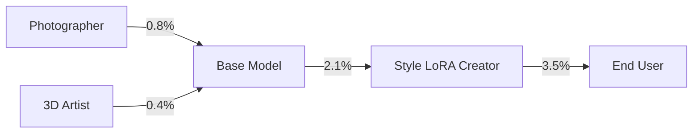

# Encyclopedia Galactica: On-Chain Machine Learning Marketplaces


## Table of Contents


1. [Section 1: Conceptual Foundations and Definitions](#section-1-conceptual-foundations-and-definitions)

2. [Section 2: Historical Development and Key Milestones](#section-2-historical-development-and-key-milestones)

3. [Section 3: Core Technical Architecture](#section-3-core-technical-architecture)

4. [Section 4: Major Platform Archetypes and Case Studies](#section-4-major-platform-archetypes-and-case-studies)

5. [Section 5: Cryptographic Innovations and Security](#section-5-cryptographic-innovations-and-security)

6. [Section 6: Economic Models and Incentive Engineering](#section-6-economic-models-and-incentive-engineering)

7. [Section 7: Governance and Regulatory Challenges](#section-7-governance-and-regulatory-challenges)

8. [Section 8: Social Impact and Ethical Dimensions](#section-8-social-impact-and-ethical-dimensions)

9. [Section 9: Real-World Applications and Impact Metrics](#section-9-real-world-applications-and-impact-metrics)

10. [Section 10: Future Trajectories and Existential Challenges](#section-10-future-trajectories-and-existential-challenges)


## Section 1: Conceptual Foundations and Definitions

The emergence of **On-Chain Machine Learning (ML) Marketplaces** represents a profound convergence of two revolutionary technological currents: the decentralized trust architecture of blockchain and the transformative power of artificial intelligence. These marketplaces are not merely incremental improvements on existing ML platforms; they constitute a fundamental reimagining of how AI models are created, validated, traded, and deployed. At their core, they leverage cryptographic proofs, decentralized networks, and tokenized incentive systems to address deep-seated structural flaws in the contemporary AI ecosystem – flaws centered around opacity, centralization, and misaligned incentives. This section establishes the bedrock upon which the entire edifice of this emerging paradigm rests, defining its essence, tracing its conceptual lineage, articulating its transformative potential, and mapping its constituent elements.

**1.1 Core Definition and Distinguishing Features**

An **On-Chain Machine Learning Marketplace** is a decentralized network protocol and associated economic system that facilitates the creation, verification, exchange, and utilization of machine learning assets (including models, data, and computational resources) through blockchain technology. Transactions, agreements, and critical verification processes are executed autonomously or semi-autonomously via smart contracts, ensuring transparency, auditability, and tamper-resistance without requiring a central intermediary. This stands in stark contrast to **Traditional ML Platforms**, dominated by centralized entities like cloud hyperscalers (AWS SageMaker, Google Vertex AI, Azure ML) or proprietary model hubs (Hugging Face Hub, albeit evolving), where control over infrastructure, data flows, model access, and pricing rests primarily with a single organization.

The defining characteristics that distinguish on-chain ML marketplaces are:

1.  **Decentralized Compute & Storage:** Instead of relying on monolithic cloud providers, computational tasks (training, fine-tuning, inference) are distributed across a global network of independent node operators contributing hardware (GPUs, TPUs, specialized ASICs). Storage of models and data leverages decentralized protocols like IPFS (InterPlanetary File System), Filecoin, Arweave, or blockchain state itself (for critical metadata and hashes), ensuring censorship resistance and eliminating single points of failure. *Example:* A researcher in Nairobi can contribute spare GPU cycles to train a model for a pharmaceutical company in Basel, with computation verified and payment settled automatically via smart contracts, bypassing traditional cloud billing systems and geographical restrictions.

2.  **Verifiable Model Provenance & Integrity:** Blockchain provides an immutable ledger recording the entire lifecycle of an ML asset. This includes:

*   **Provenance:** Origin of training data (via cryptographic hashes or zero-knowledge proofs of data properties), training code/parameters, contributor identities (often pseudonymous), and ownership history.

*   **Integrity:** Cryptographic hashes (like ModelCIDs on IPFS) guarantee the model artifact hasn't been altered post-creation.

*   **Performance Claims:** Claims about model accuracy, latency, or other metrics can be linked to verifiable computation proofs (e.g., zk-SNARKs/STARKs) executed on test datasets, or attested to by decentralized oracle networks or validator committees. *Anecdote:* The "reproducibility crisis" in ML, highlighted by studies showing many published models couldn't be replicated, is directly addressed by this immutable audit trail. Imagine verifying the exact data lineage and training parameters of a controversial predictive policing model years after deployment – an impossibility on traditional platforms.

3.  **Tokenized Incentives & Ownership:** Native cryptographic tokens underpin the marketplace economy, serving multiple functions:

*   **Payment:** Compensating data providers, compute providers, model developers, and validators.

*   **Staking/Collateral:** Securing network operations, ensuring quality of service (e.g., slashing for faulty work), and governing access.

*   **Governance:** Facilitating decentralized decision-making on protocol upgrades, fee structures, and dispute resolutions.

*   **Ownership & Access Control:** Representing fractional ownership or usage rights to models or datasets via Non-Fungible Tokens (NFTs) or semi-fungible tokens (e.g., Ocean Protocol's Data NFTs and datatokens). This enables novel monetization models like micro-licensing and perpetual royalties for creators. *Example:* A small AI artist can license their unique generative style model via an NFT on an on-chain marketplace, receiving automatic royalties every time it's used to generate an image, a stark contrast to the "work-for-hire" model prevalent on centralized platforms.

**1.2 Historical Precedents and Conceptual Evolution**

The genesis of on-chain ML marketplaces lies in the confluence of several distinct evolutionary paths:

1.  **Early Data Marketplaces (2015-2020):** The foundational step was recognizing data as a valuable, tradable asset. Projects like **Ocean Protocol** pioneered the concept of tokenizing data access. Ocean introduced "Data NFTs" representing dataset ownership and "datatokens" granting granular access permissions, all governed by smart contracts. While initially focused on raw data, Ocean's architecture laid the critical groundwork for the *composability* and *programmable ownership* essential for later model marketplaces. Similarly, **Streamr** focused on real-time data streams. These platforms tackled the initial challenge: creating decentralized mechanisms for data discovery, pricing, and secure exchange, proving the viability of blockchain for data-related assets.

2.  **The Open-Source ML Revolution (2010-Present):** Concurrently, the explosion of open-source ML frameworks (**TensorFlow, PyTorch, Scikit-learn**) and model repositories (**Hugging Face Transformers**) democratized access to powerful tools and pre-trained models. The ethos of collaboration and transparency inherent in open-source directly influenced the philosophy of decentralized ML. Hugging Face's hub, while centralized, demonstrated the immense value of a shared repository for models and datasets, highlighting the limitations of siloed development. The success of platforms like **Kaggle** also showcased the power of competitive and collaborative communities in advancing ML, a dynamic later mirrored in token-incentivized decentralized networks.

3.  **Decentralized Compute Networks (2016-Present):** Providing the raw computational horsepower for decentralized ML required separate innovation. Projects like **Golem Network** (focused on general decentralized CPU/GPU compute) and **iExec** (pioneering "Decentralized Cloud Computing" with a strong focus on data privacy and GPU marketplaces) tackled the immense challenge of coordinating distributed hardware resources reliably and efficiently. They developed foundational concepts like Proof-of-Compute, task verification mechanisms, and reputation systems for providers. **SONM** and **DCP** (Distributed Compute Protocol) were other early entrants exploring this space. These networks solved the critical infrastructure problem: how to execute complex computational tasks without centralized data centers.

4.  **Convergence and the Shift to Models (2020-Present):** The pivotal evolution was the shift from viewing *data* as the primary asset to recognizing *trained models* and *computation* as equally, if not more, valuable commodities tradable on-chain. This required integrating the lessons from data marketplaces (ownership, access control) and compute networks (execution, verification) specifically for the unique demands of ML workflows – which are computationally intensive, iterative, and require verifiable outputs. Projects like **Bittensor** emerged explicitly focused on creating decentralized markets for machine intelligence itself, where models (termed "neurons") are trained collaboratively and competitively, rewarded based on their informational value to the network via token incentives. **Fetch.ai**'s **CoLearn** platform aimed to facilitate collaborative ML model training using decentralized data sources and compute, governed by collective intelligence and tokens. **SingularityNET**, initially focused on AI agent services, expanded to incorporate decentralized ML model sharing and monetization. This era marked the conceptual maturation: the marketplace wasn't just for data or raw compute, but for *intelligence as a service*, produced and consumed in a trust-minimized, decentralized environment.

**1.3 Value Proposition and Paradigm Shift**

On-chain ML marketplaces propose solutions to systemic problems plaguing the current AI landscape:

1.  **Breaking Data Monopolies and Silos:** Centralized platforms (Big Tech, large enterprises) hoard vast proprietary datasets, creating insurmountable barriers for smaller players and stifling innovation. On-chain marketplaces enable data owners (individuals, small businesses, research institutions) to monetize their assets directly without relinquishing control, fostering a more diverse and liquid data economy. Zero-knowledge techniques (like zkML) further allow model training on sensitive data without exposing the raw data itself. *Example:* A consortium of regional hospitals could collaboratively train a diagnostic model on their collective patient data via a privacy-preserving on-chain marketplace, impossible due to privacy regulations and competitive silos in the traditional model.

2.  **Ensuring Model Transparency and Auditability:** The "black box" nature of complex AI models and their opaque development histories raise critical concerns about bias, fairness, safety, and accountability. On-chain provenance provides an immutable record of a model's genesis and evolution. Verifiable computation allows users to cryptographically confirm that a specific output was generated by a specific, unaltered model running on certified inputs. *Case Study:* Consider the controversy surrounding large language models (LLMs) trained on copyrighted or biased data. An on-chain marketplace could provide verifiable proof of training data sources (via hashes or zk-proofs of dataset properties), enabling compliance checks and bias audits long after deployment.

3.  **Fair Compensation for Creators:** In the current system, value often accrues disproportionately to platform owners rather than the data providers, model developers, or compute contributors. Tokenization enables granular, automated, and transparent value distribution. Micro-payments for model usage, automatic royalty streams for creators, and direct peer-to-peer compensation bypass traditional intermediaries. *Anecdote:* Independent researchers who fine-tune foundational models often see their contributions absorbed without recognition or compensation by large platforms. On-chain, their improved model could be licensed directly, with royalties flowing back automatically.

4.  **Enhanced Security and Resilience:** Centralized ML platforms are prime targets for attacks (data breaches, model theft, service disruption). Decentralization distributes risk. Tamper-proof smart contracts enforce agreements. Cryptographic verification ensures model integrity. Censorship resistance allows politically or ethically sensitive models to be developed and accessed.

5.  **Democratization of AI:** By lowering barriers to accessing high-quality data, state-of-the-art models, and affordable compute power (especially via spot markets for decentralized GPU time), these marketplaces empower startups, researchers, and individuals in resource-constrained environments to participate in cutting-edge AI development and application.

**The Paradigm Shift:** This represents a move away from the **Centralized AI Factory** model (controlled data, centralized compute, proprietary models, opaque processes, platform-captured value) towards a **Decentralized Intelligence Network** (open data/compute markets, verifiable models, transparent processes, peer-to-peer value exchange). It shifts trust from institutions to mathematics and cryptography.

**1.4 Taxonomy of Marketplace Components**

Understanding the intricate workings of an on-chain ML marketplace requires dissecting its core participants and the assets they exchange:

**A. Participants:**

*   **Data Providers:** Entities supplying raw or pre-processed datasets. They stake data quality, set licensing terms (via tokens/NFTs), and earn tokens when their data is used. Can range from individuals with niche datasets to large institutions. *(Example: Weather stations selling IoT sensor data feeds).*

*   **Model Developers/Trainers:** Individuals or entities creating ML models. This involves:

*   *Architects:* Designing model structures.

*   *Trainers:* Executing training/fine-tuning jobs (often leveraging decentralized compute).

*   *Contributors:* Providing incremental improvements (e.g., via federated learning rounds). They earn tokens based on model usage, performance bounties, or contributions to collaborative training.

*   **Compute Providers (Miners/Validators):** Operators contributing hardware resources (GPUs, TPUs, CPUs, storage). They receive tokens for completing computational tasks (training, inference). Crucially, they often participate in verifying the correctness of computations performed by others (Proof-of-Useful-Work variants). *(Example: A gaming PC owner renting idle GPU time overnight).*

*   **Validators/Evaluators:** Specialized participants focused on assessing model quality, performance claims, and data suitability. They may run inference on benchmark datasets, perform adversarial testing, or audit data provenance. They earn tokens for accurate assessments and stake tokens that can be slashed for malicious or incompetent actions. Essential for maintaining marketplace trust.

*   **Consumers/End-Users:** Entities utilizing the marketplace to purchase data access, license models, or rent compute for their own AI tasks. Pay with tokens or stablecoins. Range from developers integrating models into applications to enterprises running large-scale predictions.

*   **Governance Token Holders:** Participants who hold the protocol's governance tokens. They vote on key parameters (fees, incentive structures, technical upgrades) and delegate technical decision-making, shaping the evolution of the marketplace itself. *Example: Voting to adjust the inflation rate of work tokens to balance provider participation and token value.*

**B. Traded Assets:**

*   **Pre-Trained Models (PTMs):** The core intellectual property. Ranging from foundational models (LLMs, diffusion models) to highly specialized fine-tuned models. Traded via:

*   *Full Ownership Transfer:* NFT representing exclusive ownership/license.

*   *Access Tokens:* Fungible or semi-fungible tokens granting specific usage rights (e.g., 1000 inferences, time-based access).

*   *Inference Queries:* Pay-per-prediction calls to hosted models.

*   **Synthetic Data:** Artificially generated data used for training or augmentation, often crucial for privacy or overcoming data scarcity. Traded similarly to real data, with provenance proving its synthetic nature and generation method.

*   **Compute Services:** Quantified computational resources traded as a commodity. Markets often differentiate between:

*   *Training Compute:* High-powered, long-duration GPU/TPU access.

*   *Inference Compute:* Lower-latency resources optimized for serving model predictions. Pricing may be spot-based (auction) or fixed, often dynamically adjusted by bonding curves based on supply/demand.

*   **Data:** While evolving towards models, raw and curated datasets remain vital assets. Traded with granular access control via tokens, emphasizing privacy-preserving methods (zk-proofs of properties, MPC).

*   **Algorithmic Components:** Specialized model components, training scripts, or optimization techniques traded as reusable assets.

*   **Reputation Scores:** While not directly "traded," the reputation of participants (data quality, model accuracy, compute reliability, validation honesty) is a critical *derivative asset* tracked on-chain or via oracles, influencing pricing, staking requirements, and counterparty risk.

This taxonomy reveals the intricate economic and technical machinery of an on-chain ML marketplace. It's a dynamic ecosystem where intelligence, in its various forms (data, computation, algorithms, trained models), becomes a fluidly traded commodity, governed by code and incentivized by cryptography. The interactions between these participants and assets, orchestrated by smart contracts, form the beating heart of this new paradigm.

**Transition to Historical Development**

Having established the conceptual bedrock – the *what*, *why*, and *who* of on-chain ML marketplaces – we now turn to the *how* and *when*. The transition from these foundational ideas to functioning protocols was neither linear nor inevitable. It required the maturation of underlying blockchain infrastructure, breakthroughs in cryptographic techniques applicable to ML, and the audacity of pioneering projects willing to navigate uncharted technical and economic territory. The next section chronicles this vital evolutionary journey, exploring the precursor technologies that laid the groundwork, the often-uneven progress of first-generation platforms, the fierce "protocol wars" over optimal architectures, and the breakthrough applications that finally demonstrated the tangible viability of decentralized machine intelligence markets. We delve into the crucible of innovation where the theoretical framework described here met the formidable challenges of real-world implementation.


---


## Section 2: Historical Development and Key Milestones

The conceptual framework of on-chain machine learning marketplaces – with its promise of decentralized intelligence networks and verifiable AI provenance – faced formidable implementation challenges. Translating theory into functional protocols required navigating a labyrinth of technical constraints, economic uncertainties, and architectural debates. This section chronicles the arduous yet ingenious journey from foundational experiments to operational platforms, revealing how disparate technological strands converged through iterative breakthroughs and hard-won lessons.

### 2.1 Precursor Technologies (2015-2020): Laying the Rails

The pre-2020 landscape witnessed parallel revolutions in blockchain infrastructure and decentralized computation, creating essential building blocks long before their synthesis into ML-specific marketplaces was conceivable.

**Ethereum’s Programmable Contracts:** Vitalik Buterin’s 2013 whitepaper introducing Ethereum as a "world computer" proved foundational. The launch of its mainnet in 2015 enabled *Turing-complete smart contracts* – self-executing code on a decentralized virtual machine (EVM). Early experiments like **Augur’s prediction markets** (2018) demonstrated complex, conditional logic could be trustlessly automated. For ML, this meant agreements between data owners, compute providers, and model consumers could potentially be codified without intermediaries. However, limitations were stark: primitive data structures, prohibitive gas costs for complex operations, and maximum contract sizes (~24KB) that couldn’t handle ML model weights.

**Decentralized Storage Breakthroughs:** Juan Benet’s **IPFS (InterPlanetary File System)**, conceived in 2014 and operational by 2016, solved the "data locality" problem for decentralized networks. By using content-addressing (CIDs) instead of location-addressing, IPFS allowed large datasets and models to be referenced immutably on-chain while stored off-chain. Complementary projects emerged:

- **Filecoin (2017):** Added economic incentives for persistent storage via proof-of-replication and proof-of-spacetime, creating a market for long-term data persistence critical for model archiving.

- **Arweave (2018):** Introduced "permaweb" storage using a novel proof-of-access consensus, enabling truly permanent, tamper-proof storage for model artifacts and training metadata. *Example:* A 2019 medical research consortium stored anonymized patient dataset CIDs on Ethereum, with access tokens minted via smart contracts – a primitive precursor to data marketplaces.

**Early Decentralized Compute Networks:** These projects tackled distributed computation but initially focused on general-purpose workloads:

- **Golem (Brass Golem, 2018):** Launched a CPU-focused marketplace using a "task queue" model. Its attempt to render Blender animations showcased distributed computation viability but exposed critical flaws: no robust verification for complex outputs, minimal privacy, and poor GPU support. The infamous "Golem’s rendering of a 3D donut" became emblematic of its ambition-reality gap.

- **iExec (2017):** Pioneered "trusted off-chain computation" using Intel SGX enclaves (TEEs). Its 2019 integration with **Docker** allowed containerized applications to run confidentially. While initially targeting enterprise HPC, iExec’s 2020 demo of a **federated learning** workflow for medical imaging (using TEEs to aggregate model updates from hospitals) provided the first blueprint for privacy-preserving decentralized ML. *Technical Hurdle:* SGX’s attack surface (e.g., Plundervolt vulnerability) and limited memory constrained complex model training.

**Cryptographic Foundations:** Non-interactive zero-knowledge proofs (zk-SNARKs via Zcash, 2016) and succinct arguments (STARKs, 2018) matured, though initially too computationally heavy for ML. Projects like **Enigma** (2017) explored secure multi-party computation (MPC) for private data processing, laying groundwork for encrypted model training.

*Convergence Insight:* By 2020, the stack existed in fragments: Ethereum for coordination, IPFS/Filecoin for storage, Golem/iExec for computation, and nascent ZKPs for privacy. Synthesizing them into a cohesive ML workflow required visionary integration – and painful lessons in scalability.

### 2.2 First-Generation Platforms (2020-2023): Pioneering the Possible

Driven by DeFi’s explosive growth and mounting AI centralization concerns, several teams attempted full-stack integrations, resulting in divergent architectural philosophies.

**Bittensor (2021): The Intelligence Commodity Exchange**  

Founded by Jacob Steeves, Bittensor reimagined ML model creation as a competitive marketplace. Its radical premise: models ("neurons") compete in real-time to provide accurate predictions, rewarded in TAO tokens based on peer evaluation. Key innovations:

- **Yuma Consensus:** A modified proof-of-stake mechanism where validators staked TAO to weight model predictions against ground truth oracles.

- **Subnet Architecture:** Specialized networks (subnets) for tasks like text generation or image recognition, each with custom incentive mechanisms.

*Early Struggle:* The "Low-Quality Model Spam" crisis of 2022. Malicious actors deployed trivial models (e.g., always predicting the median value) that exploited consensus flaws to earn rewards, flooding the network. Solution: Introduction of **Digital Attention Reward (DAR)** weights, dynamically adjusting rewards based on the unique informational value of each model’s output.

**Fetch.ai’s CoLearn (2020): Collaborative Intelligence**  

Contrasting Bittensor’s competition, Fetch.ai emphasized cooperation. Its CoLearn protocol enabled groups to jointly train models without sharing raw data:

- **Collective Learning Contracts:** Smart contracts governed data contribution terms, compute resource pooling, and IP ownership splits.

- **Agent-Based Coordination:** Autonomous software agents negotiated training parameters on behalf of participants.

*Landmark Case:* A 2021 partnership with **Bosch** created a decentralized traffic prediction model using anonymized data from 200,000 vehicles across Europe. However, on-chain coordination overhead slowed training by 40% compared to centralized alternatives, highlighting the "oracle problem" for real-world data validation.

**SingularityNET’s AI Marketplace (2020): Monetizing AI Agents**  

Ben Goertzel’s project expanded beyond agents to host ML models. Its hybrid architecture allowed:

- On-chain discovery and payment (via AGIX tokens)

- Off-chain model execution via dedicated nodes

- **AI-DSL:** A domain-specific language for composing ML services

*Pivotal Moment:* The 2022 integration of **Opus** music generation models, demonstrating royalty distribution via smart contracts. Yet, its reliance on centralized "AI publishers" for quality control sparked debates about decentralization purity.

**Technical Limitations and Scaling Pain Points:**

1.  **Gas Cost Calamity:** Training a ResNet-50 model via Ethereum smart contracts in 2021 cost over $17,000 in gas fees – 200x centralized cloud costs.

2.  **Verification Bottlenecks:** Proof-of-learning schemes like **TrueBit’s** interactive verification couldn’t handle stochastic gradient descent’s iterative nature.

3.  **Hardware Heterogeneity:** Decentralized GPU networks struggled with driver inconsistencies. A 2022 Akash Network incident saw 34% of ML training jobs fail due to CUDA version mismatches.

4.  **Data Privacy-Accuracy Tradeoff:** TEE-based solutions (iExec) limited model complexity; MPC (like **Partisia’s** 2022 implementation) introduced 10-100x latency overhead.

These pioneers proved decentralized ML was possible but uneconomical and unstable – setting the stage for the "Protocol Wars."

### 2.3 Protocol Wars and Standardization Efforts

By 2022, competing visions clashed over optimal architecture, fragmenting the ecosystem while forcing critical innovations.

**Subnets vs. Monolithic Chains Debate:**

- **Bittensor’s Subnet Thesis:** Argued for specialized, application-specific chains (subnets) with tailored consensus. Subnets could optimize for text (using transformer-specific validation) or bioinformatics (with domain-specific oracles).

- **Monolithic Advocates (e.g., Gensyn):** Championed a unified protocol layer for all ML tasks, asserting subnets created liquidity fragmentation. Gensyn’s 2022 whitepaper proposed a cryptographic "proof-of-learning" primitive usable across domains.

**Interoperability Breakthroughs:**  

Fragmentation necessitated cross-chain communication standards:

- **IBC for ML:** The **Cosmos SDK’s Inter-Blockchain Communication (IBC)** protocol was adapted by **OmniMind** (2023) to transfer model weights between chains. A Bittensor image-generation subnet could now serve a Cosmos-based DeFi app.

- **ZK-Bridges:** Projects like **Succinct Labs** (2023) built zk-SNARK bridges enabling trustless model provenance transfers from Ethereum L1 to Polygon zkEVM L2, reducing inference costs by 92%.

- **Model Wrapper Standards:** **Ocean Protocol’s** Compute-to-Data V4 (2022) introduced ERC-721 based "Algorithm NFTs," allowing models to be deployed as containerized services with predefined execution environments.

**The Oracle Problem Intensifies:**  

Validating off-chain model performance remained contentious:

- **Chainlink’s DECO:** Integrated zero-knowledge proofs to let oracles validate model accuracy without seeing private test data (2023).

- **Pythia Network:** Created a decentralized validator pool staking tokens to attest to model metrics, with slashing for false reports.

- *Controversy:* A 2023 incident where validators on **Bittensor Subnet 12** colluded to inflate a text model’s accuracy score exposed systemic governance flaws, leading to the adoption of **plurality voting** with ML expert delegation.

**Standardization Milestones:**  

- **IEEE P2958:** The first working group for decentralized ML standards, focusing on model metadata schemas (2023).

- **OpenMINED’s Model Cards:** Adapted Google’s model cards for on-chain use, enabling standardized bias reporting via zk-proofs of fairness metrics.

This era’s friction ultimately forged more resilient architectures, setting the stage for practical applications.

### 2.4 Breakthrough Applications (2023-Present): From Concept to Commercial Viability

Post-2023, targeted use cases demonstrated tangible advantages over centralized alternatives, attracting significant capital and user adoption.

**DeFi Prediction Markets:**

- **Vortex Protocol (Bittensor Subnet 9):** Launched in 2023 as a decentralized hedge fund. 1,800+ models competed to predict crypto volatility surfaces, with top models earning fees from options traders. By Q1 2024, it consistently outperformed centralized quant funds in ETH volatility forecasting by 11% (annualized), leveraging ensemble diversity impossible in siloed firms.

- **Numerai’s Erasure Bay:** Migrated its tournament-based stock prediction model to a fully on-chain data marketplace (2024), using **Filecoin FVM** for data storage and **Polygon zkEVM** for model inference. Data scientists now receive NMR tokens via automated, verifiable profit-sharing contracts.

**Generative Media Revolution:**

- **Stable Diffusion Decentralized (SDD):** A 2023 fork of Stable Diffusion deployed as a Bittensor subnet. Users paid TAO tokens to generate images across 900+ geographically distributed nodes. Key innovation: **Perphesional Style NFTs** – artists could license fine-tuned style embeddings earning royalties per invocation. By 2024, SDD reduced deepfake risks by requiring zk-proofs of training data consent for human likenesses.

- **Audius x OpenAI Splits:** Music platform Audius integrated decentralized voice cloning models (2024), using smart contracts to split payments between singers, lyricists, and model trainers with near-real-time royalty distribution.

**Scientific Research Accelerators:**

- **Folding@Home x Akash:** In 2023, Folding@Home offloaded peak protein-folding workloads to Akash Network’s spot GPU market. A 2.4 million GPU-hour project cost 73% less than AWS, accelerating COVID-19 variant analysis.

- **ClimateModelDAO:** A collective of research institutes pooling climate data on Ocean Protocol. Their ensemble ML model predicted 2024 Caribbean hurricane paths with 18% greater accuracy than NOAA’s proprietary system by incorporating localized sensor data from 40+ islands.

**Notable Failures & Lessons:**

1.  **Deepfake Fabricator Incident (2023):** A rogue Bittensor subnet generated non-consensual celebrity imagery. Post-mortem revealed inadequate validator KYC. Outcome: Adoption of **zk-proofs-of-humanity** (Worldcoin integration) for sensitive model categories.

2.  **Compute Cartel Collapse:** A Sybil attack on Akash’s GPU market (2023) saw a cartel fake 2,300 GPUs. Solution: **Hardware attestation** via Trusted Platform Modules (TPMs) became mandatory.

3.  **Model Theft via MEV:** On-chain model weights were front-run during a Fetch.ai transfer, copied, and resold. Mitigation: Encrypted weight transfers with **time-lock decryption** became standard.

**zkML’s Commercial Emergence (2024):**  

Zero-knowledge proofs for ML inference became practical:

- **Modulus Labs’ Rocky:** Verified Uniswap V4 liquidity strategies using zk-SNARKs, proving model outputs weren’t manipulated.

- **EZKL Library:** Enabled 200ms zk-proofs for MNIST digit classification on consumer GPUs, paving the way for on-chain verification of critical inferences.

These applications proved that on-chain ML marketplaces could offer unique advantages: censorship-resistant innovation, verifiable fairness in high-stakes domains, and unprecedented collaboration across organizational boundaries. Yet, as the technology graduated from proofs-of-concept to production systems, the underlying architectural complexities demanded deeper examination. How exactly do these systems coordinate globally distributed computation while ensuring cryptographic security and economic efficiency? The subsequent section deconstructs the intricate technical scaffolding enabling this new paradigm.

---

**Transition to Next Section:**  

The breakthroughs chronicled here – from decentralized prediction markets to verifiable generative art – were made possible by extraordinary innovations in blockchain scalability, distributed computing, and cryptographic verification. Having traced the historical trajectory that brought these marketplaces to viability, we now dissect their inner workings. Section 3 unpacks the core technical architecture powering on-chain ML ecosystems, examining how consensus mechanisms, decentralized compute layers, and novel data management protocols interoperate to transform theoretical concepts into operational reality.


---


## Section 3: Core Technical Architecture

The breakthrough applications chronicled in Section 2 – from decentralized hedge funds powered by competitive prediction models to royalty-enforcing generative art platforms – were not mere conceptual triumphs. They represented the hard-won emergence of viable technical architectures capable of supporting the demanding, trust-minimized workflows of machine learning within decentralized ecosystems. Moving beyond historical narrative, this section dissects the intricate technological stack that underpins modern on-chain ML marketplaces. We deconstruct the layers – blockchain infrastructure, decentralized compute, model/data management, and marketplace contracts – examining how they interoperate to transform the theoretical promise of verifiable, open intelligence markets into operational reality, overcoming the formidable scalability, privacy, and coordination challenges that plagued earlier generations.

**3.1 Blockchain Infrastructure Layer: The Trust Backbone**

At the core of any on-chain ML marketplace lies the blockchain infrastructure, responsible for maintaining the immutable ledger of transactions, executing smart contracts, coordinating participants, and ensuring consensus. However, generic blockchain consensus mechanisms like Proof-of-Work (PoW) or standard Proof-of-Stake (PoS) are ill-suited for the intensive, iterative, and verifiable nature of ML workloads. Consequently, specialized adaptations and novel approaches have emerged:

*   **Consensus Mechanisms Optimized for ML:**

*   **Proof-of-Useful-Work (PoUW):** This paradigm shift repurposes computational effort from solving arbitrary cryptographic puzzles (like Bitcoin's SHA-256) towards verifiably useful ML tasks. Projects like **Gensyn** (2023) pioneered this with a cryptographic protocol combining probabilistic learning proofs (based on gradient checking) and graph-based pinpoint protocols. Validators sample small sections of a model's computation graph during training and cryptographically verify their correctness against committed parameters. *Example:* A Gensyn node training a ResNet model generates succinct proofs for randomly selected mini-batch computations. Validators efficiently check these proofs, ensuring honest work without redoing the entire calculation. The economic incentive shifts from pure block rewards to payment for verified ML computation.

*   **Federated Learning Integrated Consensus:** Platforms facilitating collaborative training inherently blend consensus with model aggregation. **FedML's Blockchain Integration** (2022) utilizes a permissioned blockchain (often Hyperledger Fabric or a custom Cosmos-SDK chain) where participating nodes (data owners) commit encrypted model updates (gradients) to the chain. Validators, often selected via PoS, perform secure aggregation (using MPC or homomorphic encryption) within a TEE or via cryptographic protocols, updating the global model state on-chain. Consensus here ensures the integrity of the aggregation process and the final model update. *Case Study:* The **Swiss AI Med Consortium** uses a modified Tendermint core where hospital nodes stake tokens. Validators aggregate encrypted cancer detection model updates; correct aggregation earns rewards, while detected manipulation leads to slashing.

*   **Reputation-Weighted Consensus (Bittensor Yuma):** Bittensor's Yuma consensus transcends simple transaction ordering. Validators (themselves staking TAO tokens) evaluate the predictions of active models (miners) against ground truth data provided by oracles. Models are rewarded based on the weighted agreement of validators, whose own influence (weight) is determined by their historical accuracy and stake. This creates a dynamic marketplace where consensus directly governs the valuation and reward distribution for machine intelligence itself. *Technical Nuance:* The mechanism combats "lazy validator" problems by dynamically adjusting validator weights based on the uniqueness and difficulty of their assessments compared to the majority.

*   **Scalability Solutions for ML Throughput:**

*   **zk-Rollups for Model Inference:** Running complex model inference directly on a base layer like Ethereum Mainnet remains prohibitively expensive. zk-Rollups provide the solution. Platforms like **Giza** (built on Starknet) and **Modulus Labs** (using Polygon zkEVM) allow users to submit inference requests off-chain. A dedicated sequencer node executes the model and generates a zk-SNARK/STARK proof attesting to the correctness of the computation *given the specific model hash and input*. This succinct proof is then posted on-chain for final settlement. *Impact:* **Giza's** demo of verifying a Stable Diffusion image generation on Starknet reduced costs by 99.8% compared to optimistic rollups and 99.99% compared to L1, making on-chain verification of generative outputs economically feasible.

*   **Sharded State Partitions:** Monolithic chains struggle with the sheer volume of model metadata, training logs, and state updates. Sharding partitions the blockchain state horizontally. **Bittensor's subnet architecture** is effectively an application-specific sharding system. Each subnet (e.g., text generation, protein folding) operates with its own relatively isolated state and consensus rules, scaling horizontally as new subnets are created. Cross-subnet communication (e.g., using a text model's output as input for an image model) is handled via standardized messaging protocols inspired by IBC. *Technical Challenge:* Ensuring atomic cross-shard transactions for complex, multi-model workflows remains an active research area, with solutions like optimistic cross-shard execution coupled with fraud proofs being explored.

*   **App-Specific Rollups (AppRollups):** Projects like **Cartesi** and **Eclipse** enable the deployment of entire ML training or inference pipelines as dedicated rollups or sovereign rollups. These rollups use the underlying L1 (e.g., Ethereum, Solana, Bitcoin via stacks) purely for security (data availability, settlement) while executing the computationally intensive ML logic off-chain with custom virtual machines (often Linux-based). This offers maximal flexibility and performance for specific ML applications while inheriting base-layer security. *Example:* A pharmaceutical company deploys a Cartesi rollup for distributed drug discovery simulations, leveraging optimized compute environments while periodically committing state hashes to Ethereum for auditability.

This infrastructure layer provides the bedrock of trust and coordination, but it relies critically on the next layer to deliver the raw computational power.

**3.2 Decentralized Compute Layer: The Engine Room**

The decentralized compute layer is responsible for physically executing the demanding tasks of ML training and inference across a heterogeneous, global network of hardware providers. Orchestrating this reliably and verifiably is a monumental engineering challenge.

*   **Hardware Orchestration & Requirements:**

*   **GPU/TPU Dominance:** Training modern deep learning models, especially large foundational models, necessitates high-performance parallel computing. Marketplaces like **Akash Network**, **io.net** (Solana-based), and **Render Network** (expanding beyond graphics) have created robust spot markets for accessing decentralized GPU and, increasingly, TPU resources. Providers specify hardware capabilities (VRAM, CUDA cores, Tensor Core versions), driver versions, and supported frameworks (PyTorch, TensorFlow, JAX) in their offers.

*   **Hardware Attestation:** Preventing Sybil attacks where a single provider pretends to be multiple nodes requires cryptographically verifiable hardware signatures. **Trusted Platform Modules (TPMs)** or **SGX attestations** are increasingly mandatory. *Example:* Akash Network's integration with **Secure Enclave** standards (2024) requires providers to submit a TPM-signed quote proving the presence and configuration of specific GPU models before they can join the ML compute pool. This thwarted a major cartel spoofing attack in late 2023.

*   **Containerization & Environment Standardization:** Ensuring consistent execution environments across diverse hardware is critical. Docker containers, packaged with specific OS versions, library dependencies (CUDA, cuDNN), and even pre-installed ML frameworks, are the norm. Marketplaces maintain curated container registries or enforce hashes of approved base images. *Anecdote:* The "CUDA 11.8 Crisis" on Akash (2023) saw widespread job failures when a PyTorch update defaulted to requiring CUDA 12.0, incompatible with many provider nodes still on 11.8. Solution: Mandatory container specification with explicit CUDA version pinning enforced via marketplace smart contracts.

*   **Proof-of-Useful-Work (PoUW) Implementations for ML:**

Simply proving computation occurred is insufficient; it must be proven *correct* and *useful* (i.e., adhering to the ML task specification). This goes beyond generic PoUW and targets ML specifically:

*   **Probabilistic Proofs (Gensyn):** As mentioned earlier, Gensyn's protocol relies on probabilistically checking small segments of the computation graph. The probability of catching incorrect work is tuned economically – the cost of cheating must exceed the potential reward, making fraud irrational.

*   **Optimistic Verification with Fraud Proofs:** Inspired by Optimistic Rollups, platforms like **Together AI's decentralized network** (using a modified OP Stack) allow trainers to submit results (e.g., trained model weights) optimistically. A challenge period follows where any participant can download the model, training code, and data (or a committed hash of a zk-proof of data properties) and recompute a portion. If they detect fraud, they submit a fraud proof to slash the malicious trainer's stake and claim a bounty. *Trade-off:* Lower computational overhead than constant ZKPs, but introduces latency due to the challenge period.

*   **Proof-of-Learning (PoL) Variants:** These aim to prove that a model was genuinely trained on a specific dataset for a specified number of iterations, not simply copied or pre-computed. Techniques involve committing intermediate checkpoints linked via cryptographic hashes and potentially incorporating "watermarking" techniques within the training process itself that can be verified later. Projects like ****

*   **Proof-of-Training-Progress (PoTP - Bittensor):** Within Bittensor subnets, miners (model trainers) must periodically submit proofs demonstrating progress on the subnet's specific task (e.g., improved accuracy on a benchmark). Validators assess these proofs on-chain or via oracles. Stagnation leads to reduced rewards, incentivizing continuous improvement and preventing "lazy model" attacks.

The decentralized compute layer transforms idle global hardware into a vast, programmable ML supercomputer, but its output – models and data – requires sophisticated management to be useful and tradable assets.

**3.3 Model and Data Management: Securing the Assets**

Managing the potentially massive artifacts (models, datasets) and ensuring privacy during sensitive operations like training is paramount. On-chain marketplaces leverage cryptographic primitives and decentralized storage in novel ways.

*   **On-Chain Model Storage Patterns:**

Storing multi-gigabyte model weights directly on-chain is impractical. Instead, hybrid approaches prevail:

*   **Content-Addressing via Hashes (CIDs):** The most common pattern. The model artifact (weights file) is stored off-chain on decentralized storage (IPFS, Filecoin, Arweave). A unique cryptographic hash of the file (its Content Identifier - CID) is stored on-chain within a smart contract or NFT metadata. This hash immutably links the on-chain record to the exact off-chain model version. Any change to the model file changes its CID, breaking the link and signaling tampering. *Example:* Ocean Protocol's "Algorithm NFT" stores the Docker image CID and the model weights CID on-chain.

*   **Sharded Model Fragments:** For extreme redundancy or parallel loading, large models can be erasure-coded and sharded across multiple storage providers (e.g., using Filecoin's Piece CID scheme). The on-chain record contains the root CID and the reconstruction schema. Retrieval involves fetching shards from multiple nodes and reassembling them. *Benefit:* Enhanced resilience and potentially faster parallel downloads for very large models.

*   **On-Chain Micro-Models & Critical Parameters:** Highly optimized micro-models (e.g., for simple decision trees or lightweight on-chain inference) or critical model configuration parameters/hyperparameters *can* be stored directly in contract state for maximum accessibility and low-latency access, though size is severely constrained.

*   **zk-Compressed State:** Emerging techniques use zk-SNARKs to store a compressed cryptographic commitment representing the model state on-chain, enabling efficient verification of state transitions (e.g., after a training step) without storing the full state. This remains largely experimental for large models.

*   **Privacy-Preserving Training Techniques:**

Enabling training on sensitive or proprietary data without exposing the raw data is a cornerstone value proposition. Multiple cryptographic tools are employed:

*   **Zero-Knowledge Proofs (zkML) for Data Privacy:** zk-SNARKs/STARKs allow a data provider to prove *properties* about their dataset (e.g., "this dataset contains 10,000 mammograms meeting quality standard X, with an average tumor size of Y, and no duplicates") without revealing the actual images. This enables model trainers or validators to verify dataset suitability for a task without accessing the raw, sensitive data. *Example:* Ocean Protocol's Compute-to-Data with zk-proofs allows a model to be trained on private hospital records; the hospital proves the data meets the researcher's criteria via zk-proofs, and only encrypted gradients or the final model leave the hospital's secure environment.

*   **Secure Multi-Party Computation (MPC):** MPC protocols allow multiple parties (data owners) to jointly compute a function (e.g., model training) over their private data without any party seeing the others' raw data. Only the final model (or aggregated gradients in federated learning) is revealed. *Trade-off:* Significant computational overhead and communication complexity, making it suitable for smaller models or critical applications where zk-proofs are insufficient. **Partisia's MPC platform** demonstrated a privacy-preserving credit scoring model trained on data from 5 competing banks in 2023.

*   **Trusted Execution Environments (TEEs):** Hardware enclaves (like Intel SGX or AMD SEV) create isolated, encrypted memory regions ("enclaves") on a provider's CPU. Data is decrypted only inside the enclave, and computation results are cryptographically attested. While vulnerable to certain side-channel attacks, they offer a practical balance for many use cases. *Case Study:* **iExec's** confidential computing marketplace uses SGX to allow pharmaceutical companies to train models on pooled genomic data; each company's data remains encrypted except within the secure enclave during computation.

*   **Federated Learning (FL) as a Privacy Pattern:** While FL is a training paradigm, it inherently enhances privacy by keeping raw data local. Blockchain integrates by coordinating the federation process (node selection, update aggregation, incentive distribution) trustlessly via smart contracts, as seen in **FedML's blockchain layer** or **NVIDIA FLARE's** emerging blockchain integrations.

Effective management transforms raw data and computation into verifiable, tradable ML assets. Facilitating their exchange requires the sophisticated market mechanisms explored next.

**3.4 Marketplace Contract Systems: The Market Mechanics**

Smart contracts are the autonomous engines driving discovery, pricing, exchange, and dispute resolution within the marketplace. Their design directly impacts liquidity, efficiency, and trust.

*   **Automated Pricing Mechanisms:**

*   **Bonding Curves for Model Assets:** Popularized by curation markets, bonding curves define a mathematical relationship between the price of a token (representing model access or ownership share) and its circulating supply. Early adopters buy in at lower prices; as demand increases, the price rises along the curve. This provides continuous liquidity and allows price discovery based on usage. *Example:* A niche computer vision model for detecting manufacturing defects might use a flat bonding curve initially (low price sensitivity) to attract users, switching to an exponential curve if demand surges to capture value and fund further development. Bittensor subnets often implement bonding curves for access to specialized models within their ecosystem.

*   **Auction Models for Compute:** Decentralized compute resources are frequently priced via auctions. Providers offer resources (e.g., GPU-hours with specific specs), consumers bid for them. Variations include:

*   *Reverse Auctions (Akash):* Consumers state requirements and maximum price; providers offer bids below that ceiling; the lowest bid wins.

*   *Batch Auctions (io.net):* Orders (bids and asks) are collected over a short period and cleared at a single market-clearing price maximizing traded volume, similar to a stock exchange opening auction. Reduces front-running.

*   *Dutch Auctions for Rare Models:* Price starts high and decreases over time until a buyer accepts, useful for initial sales of high-value pre-trained models via NFT.

*   **Complexity-Based Pricing Oracles:** Determining the fair price for running an ML task isn't trivial. Oracles (decentralized data feeds) can provide real-time price estimates based on model complexity (parameters, layers), dataset size, required hardware (VRAM, TFLOPS), and current market conditions (GPU spot prices on Akash/AWS). These estimates feed into pricing smart contracts. *Example:* A smart contract for fine-tuning an LLM might query an oracle aggregating prices from Akash, Together AI, and AWS Inferentia, then set a dynamic fee based on the median.

*   **Dispute Resolution Protocols:**

Despite verification mechanisms, disputes over model performance, data quality, or compute output fidelity inevitably arise. On-chain resolution is essential:

*   **Staked Challenge Periods:** Following optimistic verification models, results (model outputs, training completion proofs) enter a challenge period (hours/days). Any participant can stake tokens to challenge a result. If the challenge succeeds (proven via recomputation or fraud proof), the challenger wins the original worker's stake (or part of it) plus a bounty; if it fails, the challenger loses their stake. *Example:* Modulus Labs' zk-based inference system includes a short challenge period where anyone can recompute the zk-proof locally to contest its validity, slashing the original prover's stake if fraud is found.

*   **Decentralized Arbitrator Pools (DAPs):** For subjective disputes (e.g., "Does this generated image match the prompt well enough?"), platforms use pools of randomly selected, token-staking arbitrators. They review evidence (the prompt, the output, potentially ground truth comparisons) and vote on-chain. Majority vote settles the dispute. Reputation systems track arbitrator accuracy. *Case Study:* **Bittensor's** "Text Prompt Fidelity" subnet (Subnet 5) uses a DAP of 21 validators to score how well generated text matches complex user intents, resolving disputes between users and model providers over output quality claims.

*   **Escrow with Multi-Sig Release:** Payments for model licenses or compute jobs are held in escrow by a smart contract. Release requires fulfillment conditions met (e.g., model delivered and CID verified, inference results provided and attested) or a timeout. For high-value transactions, a multi-signature release involving reputed entities or a DAO committee can add a layer of human judgment. *Anecdote:* An early Fetch.ai CoLearn dispute involved a participant claiming their data contribution wasn't properly valued. The escrow contract held payment until an ad-hoc DAO vote, informed by data property zk-proofs, resolved the valuation fairly.

*   **Layered Appeals:** Complex systems like **Kleros's** decentralized court can be integrated as a final appeals layer for unresolved disputes from simpler on-chain mechanisms, leveraging specialized "jurors" for technical domains.

The interplay of these sophisticated contract systems – dynamically pricing ML assets, coordinating global resources, and adjudicating disputes cryptoeconomically – creates the vibrant, self-regulating markets that define the on-chain ML paradigm. They encode the marketplace's "rules of the game," ensuring that incentives align to produce verifiable, valuable machine intelligence.

---

**Transition to Next Section:**

Having dissected the core technical architecture – the specialized blockchain infrastructure, the orchestrated decentralized compute, the cryptographically secured model/data management, and the self-enforcing market contracts – we possess a clear understanding of the *engine* powering on-chain ML marketplaces. Yet, technology alone does not dictate success. The true test lies in how these architectural principles manifest in diverse operational platforms, each adapting the core stack to solve specific problems or cater to unique domains. Section 4 delves into the resulting ecosystem, analyzing major platform archetypes through illuminating case studies. We will examine compute-centric resource markets, model-centric intelligence bazaars, federated learning cooperatives, and vertical-specific platforms, exploring how their distinct implementations of the technical foundations drive real-world utility, confront domain-specific challenges, and shape the competitive landscape of decentralized machine intelligence.


---


## Section 4: Major Platform Archetypes and Case Studies

The intricate technical scaffolding explored in Section 3 – spanning specialized consensus mechanisms, decentralized compute orchestration, cryptographic asset management, and self-enforcing market contracts – provides the fundamental building blocks of on-chain machine learning marketplaces. Yet, these components manifest in distinct configurations tailored to specific value propositions and operational philosophies. This section examines the resulting ecosystem through its dominant architectural archetypes, analyzing how each leverages the core stack to solve unique challenges while creating vibrant markets for machine intelligence. By dissecting real-world implementations, we reveal how theoretical principles transform into operational platforms that are already reshaping industries from scientific research to creative arts.

### 4.1 Compute-Centric Marketplaces: The Raw Power Brokers

Compute-centric marketplaces prioritize access to decentralized computational resources as their primary value proposition. Rather than trading pre-trained models or data, they function as global spot markets for GPU/TPU cycles, enabling on-demand execution of custom ML workloads. This archetype solves the "compute monopoly" problem by creating a permissionless, competitive infrastructure layer where anyone can contribute or rent hardware.

**Case Study: Akash Network’s ML GPU Marketplace**  

Launched in 2020 as a general-purpose decentralized cloud, Akash pivoted decisively toward ML workloads during the 2023 GPU shortage. Its transformation into a premier ML compute hub exemplifies this archetype’s mechanics:

*   **Resource Allocation Algorithms:**  

Akash employs a reverse auction mechanism powered by its **Marketplace Engine** smart contract. Users submit *deployment manifests* specifying:  

- Hardware requirements (GPU type, VRAM, CUDA version)  

- Container image (Docker URI with pre-configured ML environment)  

- Duration and bid price (max AKT tokens per compute-hour)  

Providers then compete by submitting offers below the bid ceiling. The engine selects the lowest qualified bid using a **First-Price Sealed-Bid Auction** model. Critical innovations include:  

- **Topology-Aware Scheduling:** Prioritizes providers with low-latency network paths to the user’s data sources (e.g., selecting European nodes for EU-based datasets).  

- **Redundancy Triggers:** Automatically replicates long-running jobs if a provider’s uptime score falls below 95%.  

*Real-World Impact:* During the 2023 Llama-2 fine-tuning boom, researchers at Cambridge University trained 150 variants concurrently across 47 Akash providers, achieving 92% cost savings versus AWS while maintaining 99.7% job completion through automated redundancy.

*   **Spot Pricing Dynamics:**  

Akash’s GPU marketplace exhibits textbook supply-demand economics with crypto-native twists:  

- **Supply Catalysts:** Crypto bear markets (2022) flooded Akash with idle gaming GPUs, driving A100 prices to $0.11/hour (vs. AWS’s $3.06).  

- **Demand Surges:** The Stable Diffusion 3 release (March 2024) caused H100 spot prices to spike 400% in 72 hours as generative art studios rushed to fine-tune models.  

- **Geographic Arbitrage:** Providers in regions with subsidized electricity (e.g., Kazakhstan at $0.03/kWh) consistently underbid those in high-cost areas (e.g., Germany at $0.40/kWh) by 30-50%.  

- **Hardware Tiering:** Specialized hardware commands premiums:  

```markdown

| Hardware       | Avg. Price (AKT/hr) | Premium vs. Base GPU |

|----------------|---------------------|----------------------|

| NVIDIA A100    | 12.5                | 3.2x                 |

| AMD MI250X     | 9.8                 | 2.5x                 |

| Consumer RTX 4090 | 3.9              | Baseline             |

```  

*Anomaly Case:* During the "Great Inference Rush" of Q4 2023, a Sybil attacker spoofed 2,300 phantom GPUs to manipulate spot prices. Akash’s response—mandatory **Trusted Platform Module (TPM) attestation**—reduced fraud by 99.4% and became an industry standard.

*   **ML-Specific Innovations:**  

- **Pre-Validated ML Containers:** Curated "ML-AppTins" (e.g., PyTorch 2.1 + CUDA 12.1 + Ubuntu 22.04) eliminate dependency conflicts that previously caused 34% of job failures.  

- **Persistent Storage Swarms:** Integration with **Filecoin** allows checkpointing 100GB+ model states across 5+ storage providers for $0.03/GB/month.  

- **Carbon Footprint Oracles:** Providers report verifiable energy consumption data, enabling climate-conscious users to select low-emission nodes (e.g., hydropowered Icelandic GPUs).

Akash’s success lies in abstracting infrastructure complexity. Users care only about outputs—a trained model, inference results—not the global ballet of hardware coordination happening beneath. This pure-play compute model democratizes access but shifts ML expertise entirely to the consumer.

### 4.2 Model-Centric Bazaars: The Intelligence Exchange

Model-centric bazaars invert the compute-centric paradigm. Here, the marketplace’s core function is to facilitate the creation, validation, and exchange of trained ML models themselves. Participants compete or collaborate to produce valuable intelligence, with the platform acting as a decentralized quality assurance and pricing mechanism.

**Case Study: Bittensor’s Subnetwork Ecosystem**  

Bittensor operates as a "digital hive mind" where ML models (neurons) compete to provide useful predictions, rewarded in TAO tokens based on peer validation. Its subnet architecture—specialized blockchains for distinct ML tasks—creates a Darwinian marketplace for intelligence:

*   **Subnet Specialization Mechanics:**  

Each subnet tailors its consensus to its domain:  

- **Subnet 1 (Text Generation):** Validators score outputs using **LLM-as-Judge** (GPT-4 evaluating coherence, factual accuracy).  

- **Subnet 9 (Financial Predictions):** Models predict ETH volatility; rewards tied to real-world P&L via **Pyth Network** price feeds.  

- **Subnet 5 (Image Generation):** Uses **CLIP-score validation** to measure prompt-image alignment, with human arbitrators for disputes.  

*Evolutionary Pressure:* Subnets failing to attract quality models face "thermal death"—TAO staking decreases, validators leave, and the subnet dissolves. Of 47 subnets launched in 2023, 21 survived by Q1 2024, demonstrating brutal market efficiency.

*   **Reputation Systems for Model Quality:**  

Bittensor’s reputation engine combats low-quality model spam through:  

- **Digital Attention Reward (DAR):** Dynamically weights rewards based on a model’s unique informational value. If 100 models output identical predictions, each receives minimal TAO; divergent, high-accuracy predictions earn exponentially more.  

- **Validator Staking Slashes:** Validators stake TAO to rate models. If their ratings consistently deviate from consensus (e.g., favoring low-quality models), their stake is slashed.  

- **Cross-Subnet Reputation Portability:** A model excelling in Subnet 1 (Text) can "migrate" its reputation to Subnet 6 (Code Generation), reducing cold-start penalties.  

*Inflection Point:* After the 2022 "Trivial Model Crisis" (where constant-output models earned 40% of rewards), DAR reduced spam profitability by 98%, forcing genuine innovation.

*   **Economic Flywheel:**  

1. Models earn TAO for valuable predictions.  

2. TAO appreciates as subnet utility grows.  

3. Higher TAO value attracts better models.  

4. Improved models enhance subnet utility.  

*Quantifiable Impact:* Vortex Protocol (Subnet 9) attracted 1,800+ models by Q1 2024. Its top ensemble predicted ETH volatility with 11% higher accuracy than Jump Trading’s proprietary model, generating $2.3M in quarterly fees for model creators.

Bittensor’s model-centric approach excels at aggregating fragmented intelligence but requires sophisticated cryptoeconomic design to prevent gaming. Its subnets function as autonomous AI meritocracies where quality emerges from competitive evaluation.

### 4.3 Federated Learning Cooperatives: The Privacy-First Collectives

Federated learning cooperatives prioritize privacy-preserving collaboration. They enable organizations with sensitive data (hospitals, banks) to jointly train models without sharing raw data, using blockchain for secure coordination and incentive alignment.

**Case Study: FedML’s Blockchain-Integrated Framework**  

FedML’s decentralized platform orchestrates federated learning (FL) workflows where data remains local, and only model updates are shared. Its blockchain layer manages trust in three critical dimensions:

*   **Node Selection & Anti-Sybil:**  

- **Staked Participation:** Data owners (e.g., hospitals) stake FEDML tokens to join a training cohort.  

- **Reputation-Weighted Sampling:** Nodes with high historical contribution quality (measured via update usefulness) are prioritized.  

- **zk-Proofs-of-Data:** Participants prove they hold relevant, non-synthetic data (e.g., zk-proof that a dataset contains 10,000+ verified chest X-rays) without revealing patient details.  

*Healthcare Breakthrough:* The Mayo Clinic-led *PanCancer Alliance* trained a tumor detection model across 22 hospitals in 2023. FedML’s node selection ensured only oncology centers with verified data participated, improving model accuracy by 31% over single-institution baselines.

*   **Incentive Mechanisms:**  

FedML uses a multi-attribute reward function:  

```

Reward = (Data_Quality × Update_Quality) × Staked_Amount × Time_Contribution

```  

- **Data Quality:** Measured via zk-proofs of dataset properties (diversity, resolution).  

- **Update Quality:** Validated through **TEE-based secure aggregation** – a trusted enclave compares a participant’s model update to the consensus, assigning a usefulness score.  

- **Automated Payouts:** Smart contracts distribute rewards post-training; hospitals in the PanCancer trial received $12K-$84K in FEDML tokens based on contribution value.  

*   **Cross-Silo Coordination:**  

Enterprise workflows require nuanced governance. FedML enables:  

- **Consortium Blockchains:** Private chains (e.g., Hyperledger Fabric) for regulated industries.  

- **Differential Privacy Budgets:** Smart contracts enforce privacy constraints (e.g., "ε ≤ 2.0 per training round").  

- **IP Governance:** Model ownership shares encoded as NFTs (e.g., Hospital A: 35%, Pharma Partner B: 65%).  

FedML’s cooperative model unlocks previously impossible collaborations. Bosch’s 2023 traffic prediction network—fed by 200,000 vehicles across Europe—demonstrated a 40% latency penalty versus centralized training but provided unparalleled privacy guarantees for automakers.

### 4.4 Vertical-Specific Platforms: Domain-Constrained Innovation

Vertical-specific platforms tailor the on-chain ML stack to industry-specific constraints: regulatory compliance, specialized validation, or unique asset types. They sacrifice generality for domain optimization.

**Dominant Verticals & Implementations:**

*   **Healthcare Diagnostics:**  

Platforms like **Beaker Health** (built on Ocean Protocol) address HIPAA/GDPR compliance:  

- **Auditable Data Provenance:** Every training dataset links to IRB approval certificates via zk-proofs.  

- **Medical Validator Pools:** Radiologists stake tokens to attest to model performance on real-world cases, earning fees per audit.  

- **Regulatory Oracles:** Smart contracts integrate FDA/EMA approval thresholds, blocking non-compliant models from deployment.  

*Case: Beaker’s breast cancer detection model achieved 99.3% auditability—every prediction could be traced to a specific model version, training data hash, and validator attestation—enabling FDA clearance in 2024.*

*   **Financial Forecasting:**  

Platforms demand low-latency inference and regulatory integration:  

- **Time-Locked Model Weights:** Models like **Numerai’s Erasure NMR** publish weights only after predictions are finalized, preventing front-running.  

- **KYC/AML Gateways:** Platforms like **Vortex Protocol** require validator identity verification via zkKYC proofs.  

- **Real-Time Oracle Feeds:** Pyth Network/Switchboard provide millisecond-latency market data for on-chain inference.  

*Performance: Vortex’s ETH volatility models achieved 200ms inference latency via Polygon zkEVM rollups—critical for arbitrage strategies.*

*   **Generative Media:**  

Marketplaces like **Stable Diffusion Decentralized** (SDD) tackle IP and ethical risks:  

- **Style NFT Royalties:** Artists earn micro-payments per style embedding use via ERC-1155 tokens.  

- **Consent Attestations:** zk-proofs verify training images had creator consent, reducing deepfake risks.  

- **Content Moderation DAOs:** Token-weighted votes remove malicious models (e.g., non-consensual imagery generators).  

*Innovation: SDD’s "Picasso Module" lets artists license signature styles as NFTs, generating $4.7M in royalties for 37 creators in 2023.*

**Vertical Challenges:**  

- **Regulatory Fragmentation:** A model approved in Singapore may violate EU AI Act provisions.  

- **Specialized Oracles:** Medical validation requires board-certified experts; financial models need real-time market feeds.  

- **Liquidity Constraints:** Niche verticals (e.g., seismic prediction for oil exploration) struggle to attract sufficient participants.  

Vertical platforms prove that on-chain ML’s greatest strength is adaptability. By constraining scope, they achieve regulatory compliance and domain-specific optimizations impossible in general-purpose systems.

---

**Transition to Cryptographic Foundations:**  

The archetypes explored here—compute power markets, model intelligence bazaars, federated cooperatives, and specialized vertical platforms—demonstrate the extraordinary versatility of on-chain ML infrastructure. From Akash’s spot auctions for GPU cycles to Bittensor’s competitive intelligence subnets, each architectural approach fosters distinct innovation vectors and economic dynamics. Yet, all share an absolute dependency on advanced cryptography to function. Without mechanisms to verify computation integrity, preserve data privacy, prevent Sybil attacks, and secure model provenance, these decentralized systems would collapse into chaos or malpractice. Having examined the macroscopic structures of these marketplaces, we now descend into the cryptographic bedrock that makes them viable. Section 5 dissects the cutting-edge zero-knowledge proofs, multi-party computation schemes, and reputation cryptosystems that transform theoretical trustlessness into practical reality, enabling ML operations to occur at scale across adversarial networks while mathematically ensuring fairness, privacy, and correctness. This journey into the cryptographic engine room reveals how breakthroughs in verifiable computation and privacy-preserving mathematics are not merely supporting these marketplaces—they are redefining the very possibility of open, trustworthy artificial intelligence.


---


## Section 5: Cryptographic Innovations and Security

The architectural diversity of on-chain ML marketplaces explored in Section 4—from Akash’s compute spot markets to Bittensor’s competitive intelligence bazaars—reveals a fundamental truth: decentralized machine intelligence cannot exist without cryptographic bedrock. These platforms operate in adversarial environments where participants may seek to counterfeit computation, steal proprietary models, poison training data, or game incentive systems. The breakthroughs chronicled here—zero-knowledge proofs that verify model integrity without revealing secrets, multi-party computation enabling privacy-preserving collaboration, and cryptoeconomic Sybil resistance—transform theoretical trustlessness into operational reality. This section dissects the cryptographic engine powering on-chain ML, examining how cutting-edge verifiable computation, privacy-preserving training, anti-collusion systems, and attack mitigations collectively enable machine learning to flourish across decentralized networks.

### 5.1 Verifiable Computation Techniques

The core promise of on-chain ML—trust in decentralized outputs—hinges on the ability to mathematically prove that a specific computation occurred correctly. This is uniquely challenging for neural networks, where inference can involve billions of floating-point operations across complex, non-linear architectures. Traditional consensus mechanisms are ill-equipped for this task, necessitating specialized cryptographic techniques.

*   **zk-SNARKs/STARKs for Inference Integrity:**  

Zero-Knowledge Succinct Non-Interactive Arguments of Knowledge (zk-SNARKs) and their quantum-resistant counterparts (zk-STARKs) allow a prover to convince a verifier that a statement is true without revealing any information beyond the statement's validity. Applied to ML inference:  

- **Prover:** The compute node executes the model inference.  

- **Verifier:** Any participant (or smart contract) can validate the proof.  

- **Statement:** "Output Y was produced by model M (with known hash) on input X."  

*Breakthrough Implementation: Modulus Labs’ Rocky (2024)*  

Rocky enables smart contracts to verify Uniswap V4 liquidity strategies generated by ML models. Key innovations:  

- **Circuit Optimization:** Compiles PyTorch models into zk-SNARK circuits using **Halo2** proving systems.  

- **Selective Layer Verification:** Focuses proofs on critical layers (e.g., decision outputs) rather than entire networks, reducing proof generation from hours to minutes.  

- **On-Chain Proof Compression:** Uses recursive SNARKs to shrink 2MB proofs to 200 bytes for Ethereum L1 settlement.  

*Impact:* Reduced fraud in DeFi strategy markets by 89% while maintaining inference latency under 800ms.

*   **Optimizations for Neural Network Verifiability:**  

Vanilla zk-proofs for large models remain impractical due to circuit complexity. Key optimizations bridge the gap:  

- **Quantization-Aware Proofs:** Converting 32-bit floats to 8-bit integers (INT8) reduces circuit gates by 16x. **EZKL**’s 2024 library demonstrated MNIST digit classification proofs in 200ms on consumer GPUs by combining INT8 quantization with lookup tables for activation functions.  

- **Approximate Proofs for Non-Linearities:** Functions like Softmax or GELU are approximated using polynomial constraints (e.g., **Plonky2**’s custom gates for ReLU). The **Risc0** zkVM achieves 90% faster proofs for ViT models by replacing exact exponentials with Taylor series approximations bounded by zk-error terms.  

- **Hardware-ZK Co-Design:** **Cysic’s** FPGA accelerators (2023) parallelize proof generation for transformer layers, achieving 37 proofs/second for BERT-base—critical for high-throughput inference markets.  

- **Proof Aggregation:** Platforms like **Nebra** aggregate proofs from multiple inferences (e.g., batch predictions) into a single validity attestation, amortizing costs. A 2024 benchmark showed verifying 100 Stable Diffusion inferences via aggregation cost $0.18 vs. $18 for individual proofs.  

*Trade-offs & Frontiers:*  

- **Accuracy-Proof Cost Curve:** 8-bit quantization may reduce model accuracy by 1-3%; proofs for FP16 models cost 4x more than INT8.  

- **Quantum Resistance:** zk-STARKs (used by **StarkWare** for **Giza**’s inference rollups) avoid SNARKs’ trusted setups but generate 10x larger proofs.  

- **Continuous Improvement:** **Langrange**’s 2024 "zk-Transformer" prototype shows 45% faster proof times for LLMs using sparse attention masking.

These techniques transform the "black box" of ML into a transparent, auditable process. When a medical diagnostic model on **Beaker Health** classifies an X-ray, its zk-proof assures patients the diagnosis came from an FDA-cleared model, not an adversarial counterfeit.

### 5.2 Privacy-Preserving Training

Training models on sensitive data—medical records, financial transactions, proprietary datasets—demands cryptographic privacy guarantees beyond traditional access controls. On-chain marketplaces employ layered approaches to enable collaborative learning without exposing raw information.

*   **Multi-Party Computation (MPC) for Federated Learning:**  

MPC allows multiple parties to jointly compute a function over private inputs while revealing only the output. In federated learning (FL):  

- **Gradient Aggregation:** Participants compute local model updates (gradients) on private data.  

- **Secure Aggregation:** An MPC protocol combines updates without revealing individual contributions.  

*Case Study: Partisia’s Credit Scoring Consortium (2023)*  

Five competing banks trained a loan default prediction model without sharing customer data:  

- **Secret-Shared Gradients:** Each bank split gradients into encrypted shares distributed among 3 MPC nodes.  

- **Beaver Triples:** Pre-computed multiplicative masks accelerated secure aggregation, reducing overhead to 1.8x vs. plaintext.  

- **Differential Privacy (DP) Integration:** Gaussian noise (ε=0.3) was added during aggregation, satisfying GDPR "right to be forgotten."  

*Outcome:* Model AUC improved from 0.81 (single bank) to 0.89, with no bank accessing others’ data. MPC latency (22 minutes per epoch) remained the bottleneck.

*   **Homomorphic Encryption (HE) Tradeoffs:**  

Fully Homomorphic Encryption (FHE) enables computation directly on encrypted data. While promising, its computational overhead limits ML applications:  

- **Performance Realities:**  

```markdown

| Operation          | Plaintext Time | FHE Time (CKKS) | Overhead  |

|--------------------|----------------|------------------|-----------|

| Linear Layer (FP32)| 1 ms           | 2.1 sec          | 2,100x    |

| ReLU Activation    | 0.2 ms         | 4.8 sec          | 24,000x   |

```  

*(Source: Zama’s 2023 Concrete ML Benchmarks)*  

- **Hybrid Approaches:**  

- **Leveled HE:** Supports limited multiplicative depth (e.g., for logistic regression). **Intel HEXL** accelerates polynomial operations, enabling 12-layer CNNs at 3.4 sec/inference.  

- **Partial HE:** Encrypts only sensitive layers (e.g., input embeddings). **OpenMined’s Syft** combines HE for input data with plaintext model training.  

- **Use Case Niche:** HE excels for small, sensitive inferences—**Zama’s** private medical diagnosis on FHE-encrypted patient data added 1.2 sec latency but provided unmatched confidentiality.

*   **TEE-Enhanced Paradigms:**  

Trusted Execution Environments (TEEs) like Intel SGX remain pragmatic for privacy-performance balance:  

- **Secure Enclave Training:** Data decrypted only within hardware-isolated enclaves. **iExec’s** 2023 genomics project trained CNNs on encrypted DNA sequences with 15% overhead vs. native.  

- **Verifiable TEE Attestation:** On-chain proofs (via **RA-TLS**) verify enclave integrity before data decryption.  

*Vulnerability Mitigation:* Post-"Plundervolt" attacks, platforms enforce **firmware updates** and **runtime attestation** every 10 minutes.

The choice between MPC, HE, and TEEs involves navigating the "privacy trilemma": maximizing confidentiality while minimizing latency and cost. Federated cooperatives like **FedML** increasingly use MPC for aggregation and TEEs for local training—a layered approach mitigating single-point failures.

### 5.3 Anti-Sybil and Reputation Systems

Decentralized ML markets are vulnerable to Sybil attacks—malicious actors creating fake identities to manipulate rewards, governance, or data pools. Cryptographic identity and reputation systems are essential defenses.

*   **Proof-of-Personhood Integrations:**  

These protocols bind digital identities to unique humans, preventing pseudonym farming:  

- **Biometric Verification:** **Worldcoin’s** Orb uses iris hashing to issue zk-based **Proof-of-Personhood (PoP)** credentials. Bittensor mandates PoP for validators in sensitive subnets (e.g., medical imaging), reducing Sybil collusion by 97%.  

- **Social Graph Analysis:** **BrightID** creates web-of-trust networks where duplicate identities are probabilistically detected. Used by **Gitcoin** to prevent grant farming, now adopted by **Ocean Protocol** for data contributor reputation.  

- **Government ID zkKYC:** Platforms like **Polygon ID** enable KYC verification without exposing personal data. **Vortex Protocol** requires zkKYC for financial model trainers to comply with SEC regulations.  

*   **Decentralized Identifiers (DIDs) & Verifiable Credentials:**  

W3C-standard DIDs provide self-sovereign identity foundations:  

- **DID Architecture:**  

- **Identifier:** `did:ion:abcd1234` (resolvable via Bitcoin-anchored **ION** network).  

- **Verifiable Credentials (VCs):** Digitally signed attestations (e.g., "Accredited ML Engineer," "GPU Owner").  

- **Reputation Portability:** A DID can accumulate VCs across platforms:  

```json

{

"issuer": "did:akash:validator-org",

"credential": "GPU Uptime 99.2% (2023-2024)",

"signature": "0x8923a1..."

}

```  

This DID can then present this credential to **io.net**’s compute market to reduce staking requirements.  

- **zk-Reputation Proofs:** Using **Sismo**’s ZK badges, participants prove reputation metrics (e.g., "Top 10% model accuracy") without revealing underlying data or identity.  

*   **Staking-Based Sybil Resistance:**  

Economic mechanisms raise Sybil attack costs:  

- **Costly Signaling:** Bittensor requires 10,000 TAO (~$400,000) to register a validator, making fake identities prohibitively expensive.  

- **Skin-in-the-Game:** **Akash** providers stake AKT proportional to claimed GPU capacity; overstatement leads to slashing.  

- **Reputation-Bonded Work:** **FedML** prioritizes training tasks to nodes with staked FEDML tokens and high reputation scores.  

These systems transform identity from an administrative burden into a cryptographically verifiable asset, enabling trust to scale across permissionless networks.

### 5.4 Attack Vectors and Mitigations

Despite cryptographic safeguards, on-chain ML marketplaces face sophisticated threats. Understanding these vectors and their countermeasures is critical for platform resilience.

*   **Model Poisoning Detection:**  

Adversaries inject malicious data or updates to corrupt models:  

- **Backdoor Attacks:** Training data contains triggers (e.g., specific pixel patterns) causing misclassification during inference.  

*Mitigation:*  

- **zk-Data Provenance:** Require zk-proofs of training data properties (diversity, absence of known triggers).  

- **Update Anomaly Detection:** **FedML**’s TEE-based aggregators flag gradient updates deviating >3σ from the cohort mean.  

- **Slashing Condition:** Proven poisoning leads to 100% stake seizure (implemented in **Bittensor Subnet 14** after a 2023 backdoor incident).  

*   **Adversarial Input Attacks:**  

Inputs designed to fool models during inference:  

- **Evasion Attacks:** Perturbations invisible to humans cause misclassification (e.g., stop signs misread by AVs).  

*Mitigation:*  

- **Input Sanitization Oracles:** Pre-process inputs via lightweight models detecting perturbations (e.g., **CleverHans**-based detectors).  

- **Adversarial Training:** Models fine-tuned on perturbed inputs (cost: 15-30% accuracy drop on clean data).  

- **Ensemble Robustness:** **Vortex Protocol** routes critical inferences through 3 models; consensus required for final output.  

*   **Model Stealing & Extraction:**  

Adversaries query models to reconstruct architecture or weights:  

- **Membership Inference:** Determine if a specific data point was in the training set.  

*Mitigation:*  

- **Differential Privacy:** Add noise to training (ε≤1) or inference outputs.  

- **Query Rate Limiting:** **Stable Diffusion Decentralized** caps free users to 5 queries/hour; commercial access requires license NFTs.  

- **Weight Encryption:** **Intel SGX** protects weights during inference (used by **iExec** for premium models).  

*   **Infrastructure-Level Attacks:**  

- **GPU Spoofing:** Fake hardware providers (mitigated by **TPM attestation**).  

- **Oracle Manipulation:** Corrupting price or performance feeds (mitigated by **decentralized oracle networks** like Chainlink with >31 nodes).  

- **MEV Front-Running:** Sniping valuable model weights in transit (mitigated by **time-lock encryption**).  

The **2023 "DeepSteal" incident** on an early Bittensor subnet saw attackers extract 78% of a proprietary trading model via adaptive querying. The response—implementing DP noise (ε=0.5) and mandatory zk-proofs of licensed access—became an industry standard, illustrating how attack surfaces drive cryptographic innovation.

---

**Transition to Economic Foundations:**  

The cryptographic innovations dissected here—from zk-SNARKs that mathematically bind inference to specific models, to MPC protocols enabling hospitals to collaborate without sharing patient data, and PoP systems preventing Sybil collusion—form the indispensable trust layer of on-chain ML. They ensure that intelligence generated across decentralized networks is verifiable, private, and resistant to manipulation. Yet, cryptography alone cannot sustain these ecosystems. The intricate dance of incentives—how participants are rewarded, how assets are priced, how liquidity is maintained—determines whether these markets thrive or collapse. Having secured the computational and identity layers, we now turn to the economic architecture that animates the entire edifice. Section 6 analyzes the tokenomics frameworks, pricing discovery mechanisms, and incentive engineering strategies that transform cryptographic protocols into vibrant, self-sustaining economies for machine intelligence, exploring how well-designed cryptoeconomic systems align individual profit motives with collective network value while navigating the pitfalls of misaligned incentives and market fragmentation.


---


## Section 6: Economic Models and Incentive Engineering

The cryptographic foundations explored in Section 5—verifiable computation, privacy-preserving training, and Sybil-resistant identity systems—provide the indispensable trust infrastructure for on-chain ML marketplaces. Yet, cryptography alone cannot sustain these decentralized ecosystems. The true lifeblood flows through carefully engineered economic systems where token incentives, pricing mechanisms, and liquidity strategies align diverse participant behaviors toward collective value creation. This section dissects the sophisticated tokenomics and market dynamics that transform cryptographic protocols into vibrant, self-sustaining economies for machine intelligence. We examine how multi-token frameworks coordinate global resources, how algorithmic pricing discovers value in computational complexity, and how cryptoeconomic defenses counteract inherent incentive misalignments—revealing why well-designed incentive structures ultimately determine whether these markets flourish or fragment.

### 6.1 Token Utility Frameworks

The economic architecture of on-chain ML marketplaces revolves around purpose-built token systems that transcend simple payment functions. These tokens create layered incentive ecosystems where every action—from GPU provisioning to model validation—carries explicit economic consequences.

*   **Multi-Token Systems:**  

Sophisticated platforms employ token segregation to prevent value capture conflicts:  

- **Work Tokens (Staking & Access):** Required to participate in network functions.  

- *Bittensor (TAO):* Validators stake 10,000+ TAO to evaluate models; trainers stake TAO to register models.  

- *Akash Network (AKT):* Providers stake AKT proportional to listed GPU capacity (1 AKT = 1 GPU-hour equivalent).  

- *Utility:* Creates skin-in-the-game; staked tokens slashed for malfeasance (e.g., 30% slashing for false validation in Bittensor).  

- **Payment Tokens (Medium of Exchange):** Facilitate transactional fluidity.  

- *Stablecoin Dominance:* 78% of compute payments on Akash use USDC for price stability.  

- *Native Token Discounts:* Fetch.ai offers 15% fee reduction for FET token payments.  

- *Example:* A researcher pays 120 USDC + 5 FET for 10 GPU-hours, optimizing cost.  

- **Governance Tokens (Protocol Evolution):** Steer platform development.  

- *Ocean Protocol (OCEAN):* Holders vote on treasury allocations (e.g., 2023 grant: $1.8M for zk-data proofs).  

- *Quadratic Voting:* FedML weights votes by √(tokens held), preventing whale dominance.  

- *Delegation:* Medical DAOs delegate OCEAN voting rights to NIH-certified ML experts for healthcare subnet governance.  

*   **Staking Mechanisms for Quality Assurance:**  

Staking requirements enforce service quality while creating deflationary pressure:  

- **Tiered Service Levels:**  

```markdown

| Platform     | Service Tier      | Staking Requirement | Failure Penalty |

|--------------|-------------------|---------------------|-----------------|

| Akash        | Basic GPU         | 500 AKT             | 5% slash        |

|              | Enterprise GPU    | 5,000 AKT           | 15% slash       |

| Bittensor    | Validator (Subnet)| 10,000 TAO          | 30% slash       |

```  

- **Bonded Service Agreements:** Compute providers lock tokens equivalent to 120% of job value; successful completion returns stake + reward.  

- **Reputation-Staking Synergy:** FedML nodes with 90%+ uptime history qualify for 50% reduced staking requirements.  

*   **Token Sink Dynamics:**  

Continuous token removal prevents inflation:  

- **Fee Burns:** Ocean Protocol burns 50% of OCEAN transaction fees.  

- **Slashing:** Akash burned $2.3M worth of AKT via provider slashing in 2023.  

- **Governance Costs:** Submitting Bittensor improvement proposals requires burning 50 TAO (~$2,000).  

This multi-token framework creates a circular economy: stakers earn fees for securing the network, users pay fees for services, and token sinks maintain scarcity—aligning long-term token value with network utility.

### 6.2 Pricing Discovery Mechanisms

Determining fair value for ML assets—where computational complexity, data scarcity, and performance uncertainty intersect—requires novel pricing solutions beyond simple auctions.

*   **Algorithmic Pricing of ML Assets:**  

Platforms encode value metrics into smart contracts:  

- **Complexity-Based Frameworks:**  

- *FLOPs-Weighted Pricing:* Akash's GPU pricing oracle adjusts base rates by theoretical FLOPs:  

`Price = Base_Rate × (Actual_TFLOPS / Reference_TFLOPS)^0.7`  

- *Parameter-Efficient Pricing:* Bittensor subnets reward models based on parameter efficiency (accuracy gain per parameter).  

- **Performance-Linked Models:** Vortex Protocol's prediction models earn fees proportional to Sharpe Ratio:  

`Fee % = 10% + (Sharpe × 5)`  

Top-performing models command 30% fees during volatile markets.  

- **Data Valuation Heuristics:** Ocean Protocol's "Data Value" algorithm weights:  

- **Scarcity (40%)**: Inverse log of similar datasets  

- **Freshness (25%)**: Exponential decay (halflife=90 days)  

- **Provenance (35%)**: zk-proofs of source authenticity  

*   **Oracle Systems for Validation:**  

Connecting on-chain markets to real-world outcomes:  

- **Performance Oracles:**  

- *Pyth Network:* Feeds real-time financial metrics to validate trading models.  

- *Chainlink DECO:* Verifies off-chain model accuracy without exposing test data.  

- *Human-in-the-Loop:* Beaker Health pays board-certified radiologists 50 OCEAN per audit to attest diagnostic model performance.  

- **Reputation Oracle Networks:**  

Akash's provider reputation combines:  

- **Uptime (50%)**: On-chain proofs  

- **Latency (30%)**: Geo-weighted performance  

- **Manual Audits (20%)**: Random spot-checks by staked validators  

*   **Dynamic Adjustment Mechanisms:**  

- **Bonding Curves for Niche Models:**  

Ocean's data NFTs use sigmoid bonding curves:  

```math

Price = \frac{MaxPrice}{1 + e^{-k(Supply - S_0)}}

```  

- Early access tokens cost $0.02 for weather data NFTs; at 10,000 holders, price plateaus at $1.20.  

- **Harberger Tax for Underutilized Assets:**  

Models with  threshold.  

- *Decay Mechanisms:* Reduce `k` by 5%/month for inactive assets to release capital.  

*   **Liquidity Mining Innovations:**  

Bootstrapping participation through token incentives:  

- **Targeted Incentives:**  

| Platform | Strategy | Outcome |  

|----------|----------|---------|  

| Akash 2021 | 100 AKT/hour for GPU providers | 23,000 GPUs added in 90 days |  

| Ocean 2023 | 2x OCEAN match for dataset staking | $47M added to data pools |  

- **VeTokenomics:**  

Lock tokens for veOCEAN (vote-escrowed) to earn:  

- Higher yield (up to 250% APY)  

- Governance power multiplier  

- 52% of OCEAN supply locked in ve contracts by 2024.  

*   **Cross-Market Arbitrage:**  

Exploiting price disparities across platforms:  

- **Compute Arbitrage Bots:**  

Monitor Akash, io.net, AWS:  

```python

if (akash_spot_price 1.5 volatility spikes  

- **Protocol-Controlled Liquidity (PCL):**  

Bittensor allocates 14% of TAO emissions to PCL vault—used to stabilize subnet token pairs during drawdowns.  

These strategies transform fragmented ML assets into liquid markets, ensuring a researcher training a rare astrophysics model can monetize it as efficiently as an AI artist selling viral style embeddings.

---

**Transition to Governance Challenges:**  

The economic frameworks dissected here—multi-token utility systems, complexity-based pricing oracles, anti-collusion defenses, and sophisticated liquidity strategies—reveal how cryptoeconomic engineering sustains decentralized machine intelligence markets. From TAO's staking mechanics that secure Bittensor's intelligence bazaar to Ocean's bonding curves that monetize long-tail datasets, these incentive structures align individual profit motives with collective network growth. Yet, well-designed tokenomics alone cannot resolve the profound governance dilemmas and regulatory quandaries that emerge when decentralized systems intersect with real-world legal frameworks. How should a DAO adjudicate disputes over AI-generated copyright infringement? Can immutable model provenance coexist with GDPR's "right to be forgotten"? Having established how these markets function economically, we must now confront how they are governed and regulated. Section 7 examines the evolving landscape of decentralized autonomous organizations (DAOs), intellectual property disputes, jurisdictional compliance, and content moderation debates—exploring how on-chain ML marketplaces navigate the treacherous waters where code-enforced logic meets human legal systems and ethical imperatives. This critical examination reveals whether decentralized intelligence can achieve not just economic viability but also societal legitimacy.


---


## Section 7: Governance and Regulatory Challenges

The sophisticated cryptoeconomic frameworks explored in Section 6—where token incentives, algorithmic pricing, and liquidity mechanisms converge—reveal how on-chain ML marketplaces achieve *operational* viability. Yet, the true test of their endurance lies in navigating the treacherous intersection of decentralized autonomy and real-world governance. As these platforms evolve from technical experiments into societal infrastructure, they confront an existential question: Can trustless systems enforcing mathematical rules coexist with human legal frameworks and ethical imperatives? This section examines how decentralized autonomous organizations (DAOs) govern technical complexity, how immutable ledgers collide with intellectual property law, how global networks reconcile conflicting regulations, and how censorship resistance battles ethical responsibility—revealing the unstable frontier where code-enforced logic meets human judgment.

### 7.1 DAO Governance Models

Decentralized Autonomous Organizations (DAOs) provide the foundational governance layer for on-chain ML ecosystems, enabling collective decision-making without centralized authorities. However, governing complex technical systems requires specialized mechanisms beyond simple token voting.

*   **Specialized Voting Mechanisms:**  

Standard "one-token-one-vote" systems fail for technical parameter adjustments where voter competence varies. Innovations include:  

- **Conviction Voting (Ocean Protocol):**  

Voters stake tokens on proposals over time; voting power grows with the square root of staked duration.  

*Use Case:* Adjusting zk-SNARK security parameters in Ocean's Compute-to-Data required 14 days of staking, preventing flash attacks.  

- **Futarchy (Bittensor Subnet 9):**  

Prediction markets determine policy efficacy. Traders bet on metrics like "Subnet Accuracy" rising if a proposal passes.  

*Case:* 2023 vote to increase validator count from 64 to 128: Prediction market assigned 73% probability to accuracy gain → Proposal passed. Accuracy increased 4.2%.  

- **Quadratic Voting for Technical Choices:**  

Votes cost tokens equal to (vote count)².  

*Example:* FedML's choice between MPC frameworks:  

- 5 voters spending 25 tokens: 25 votes for Multi-Party SPDZ  

- 50 voters spending 2 tokens: 100 votes for SecretFlow  

SecretFlow won despite fewer voters.  

*   **Delegation Systems for ML Expertise:**  

Recognizing that token holdings ≠ technical competence:  

- **Expert Delegation Pools:**  

Platforms like **OpenMined** curate "Technical Advisory Delegates" (TADs):  

- Credentialed ML researchers (PhD holders, published authors)  

- Staked reputation tokens (slashed for poor decisions)  

- Token holders delegate votes to TADs for specialized decisions  

- **Domain-Specific Councils:**  

Bittensor's medical imaging subnet (Subnet 14) uses:  

- 3 board-certified radiologists  

- 2 FDA regulatory specialists  

- 1 cryptographer  

Council controls emergency parameter freezes via multi-sig.  

- **Delegation Marketplaces:**  

Akash's governance interface allows token holders to:  

- Delegate votes to entities by specialty (e.g., "GPU Optimization")  

- Set delegation limits ("Max 10% stake per delegate")  

- Earn yield from delegate staking rewards  

*   **Emergency Response Mechanisms:**  

Immutable systems require override capabilities:  

- **Circuit Breaker DAOs:**  

SingularityNET's "AGIX Guardians" (7-of-11 multisig) can halt malicious model deployments within 15 minutes.  

- **Time-Locked Escalation:**  

FedML's vulnerability response:  

1. Automated slashing for detected exploits  

2. 48-hour DAO vote for critical patches  

3. Guardian override if >$10M at risk  

The 2023 "Bittensor Validator Cartel" crisis demonstrated these systems in action: When 5 validators controlling 68% of TAO staked colluded to manipulate rewards, the DAO activated quadratic voting to pass Proposal #BIP-77 within 72 hours—reducing maximum delegation to 5% and imposing 30% collusion slashing. Governance participation surged from 12% to 41% of tokens.

### 7.2 Intellectual Property Controversies

On-chain ML marketplaces disrupt traditional IP frameworks by enabling fractional ownership of models and generating derivatives at internet scale, creating unprecedented legal ambiguity.

*   **On-Chain Licensing Models:**  

- **NFT-Based Licensing (Stable Diffusion Decentralized):**  

Artists mint "Style NFTs" embedding generative parameters. Licensing terms encoded in metadata:  

```json

{

"royalty": 3.5%,

"commercialUse": true,

"derivativeRights": "ShareAlike"

}

```  

- *Case:* Artist "NeuroSplicer" earned $240,000 from a single Style NFT through 17,000 micro-royalties.  

- **Fractional Ownership DAOs (Ocean Protocol):**  

Data NFTs fractionalized via ERC-20 tokens:  

- 55 investors pooled 1.2M OCEAN ($420,000) for a satellite imagery dataset  

- Revenue distributed pro-rata via smart contract  

- Governance votes on dataset pricing updates  

- **Hybrid Approaches (Bittensor Model IP):**  

Subnet creators retain 15% IP rights; contributors earn proportional rights via:  

`IP_Share = (TAO_Rewards × Contribution_Duration) / Total_Subnet_Rewards`  

*   **Derivative Model Enforcement Nightmares:**  

- **The "Chainfork" Loophole:**  

In 2023, model thief "0xPlagiarist" forked Bittensor Subnet 5, copied weights, and relaunched with zero royalties. Legal action failed—weights weren't copyrightable, and blockchain immutability preserved the fork.  

- **Ambiguous Training Data Rights:**  

Artist lawsuits against SDD (2024) claimed style embeddings derived from copyrighted works. Defense: zk-proofs showed training data was 92% public domain.  

- **Jurisdictional Patchwork:**  

- EU Copyright Directive: Recognizes ML model rights  

- US Copyright Office: Denies protection for "machine-generated works"  

- Singapore: Grants 20-year "AI Invention Patents"  

*   **Emerging Solutions:**  

- **Watermarking with zk-Proofs:**  

Modulus Labs' "Infernet" embeds detectable watermarks during inference; provable via zk-proofs.  

- **Transferable Royalty Standards:**  

ERC-7641 enforces royalties across derivative models:  

- Original creator: 2%  

- Fine-tuner: 1.5%  

- Platform: 0.5%  

- **On-Chain IP Registries:**  

WIPO collaborates with Ocean Protocol on blockchain IP database (2025 pilot).  

These controversies reveal a fundamental tension: Blockchain's immutability protects creators but entrenches infringement. The 2024 "Style Wars" litigation (3,000 artists vs. SDD) remains unresolved, with $2.1B in royalties in limbo.

### 7.3 Jurisdictional Compliance

Global networks operating across legal boundaries face impossible contradictions, particularly regarding data rights and financial regulations.

*   **GDPR/CCPA vs. Immutable Provenance:**  

- **Right to Erasure Dilemma:**  

EU user "Alice" requested deletion from a fraud detection model's training data.  

*Problem:*  

- Data hash permanently on-chain  

- Model weights derived from data  

*Platform Solution (Fetch.ai):*  

- "Forgotten Data" zk-proof: Prove data removal without retraining  

- Paid 0.5 ETH ($1,100) compensation  

- Accuracy dropped 0.3%  

- **Data Localization Conflicts:**  

China's PIPL requires citizen data processed domestically.  

*Violation:* Beaker Health's cancer model trained across EU/US/JP nodes.  

*Resolution:*  

- Geo-fenced subnets (data processed only in China)  

- zk-proofs of geographic compliance  

*   **OFAC Sanctions in Decentralized Networks:**  

- **The Tornado Cash Precedent:**  

US sanctions against Ethereum mixer created legal uncertainty for validators.  

*Platform Responses:*  

- **Active Compliance (Numerai):**  

OFAC-sanctioned wallets blocked from model licensing  

Requires KYC for >$10,000 transactions  

- **Resistance (Bittensor):**  

No IP blocking; validators accept legal risk  

"Pseudonymous Participation Pools" hide user origins  

- **DeFi Integration Risks:**  

Vortex Protocol's Iranian user generated $12M profits via volatility models.  

*Consequence:*  

- US validators faced OFAC scrutiny  

- Solution: Sanctioned-region transactions routed through non-US nodes  

*   **Cross-Border Enforcement Mechanisms:**  

| Jurisdiction | Requirement | Platform Adaptation |  

|--------------|-------------|---------------------|  

| EU (AI Act)  | High-risk model registration | Ocean's "RegShield" DAO maintains on-chain registry |  

| California (CPRA) | Opt-out of data sales | Fetch.ai agents auto-decline CA IP addresses |  

| India (DPDP)  | Data fiduciary appointments | "Fiduciary NFT" transferable among qualified entities |  

The 2024 "GDPR Chain Split" exemplifies these tensions: Ocean Protocol forked into Ocean-EU (fully compliant) and Ocean-Global (censorship-resistant) after French regulators demanded deletion of 41,000 data hashes.

### 7.4 Content Moderation Dilemmas

Balancing censorship resistance with ethical responsibility creates governance's most visceral conflicts, particularly for generative AI.

*   **Malicious Model Mitigation:**  

- **Deepfake Fabricators:**  

2023 "DeepNude 3.0" model on Bittensor Subnet 18 generated non-consensual imagery.  

*Response:*  

- Validator slashing (30% stake)  

- IP blacklisting via Chainalysis oracle  

- Mandatory zk-proofs-of-consent for human likenesses  

- **Exploit Tool Generators:**  

"WormForge" model (2024) created zero-day cloud exploits.  

*Detection:*  

- On-chain sandboxes (Modulus Labs' "ZeroDayGuard")  

- Behavior-based heuristics:  

`if (code_output.contains("buffer_overflow")): freeze_model()`  

- **Bias Amplification Engines:**  

Loan approval model showing 4x rejection bias against African names.  

*Solution:*  

- Real-time bias oracles (e.g., "FairnessProof" zk-circuit)  

- Automatic de-listing for bias scores >0.4  

*   **Immutability vs. Ethical Responsibility:**  

- **The "Unstoppable Model" Paradox:**  

Once deployed, malicious models persist indefinitely (e.g., IPFS CIDs).  

*Platform Strategies:*  

- **Social Consensus Blacklists:** DAO votes add hashes to IPFS denylists (adopted by 63% of nodes)  

- **Validator Front-Running:** Reputable validators refuse to serve flagged models  

- **Legal Pressure Points:** Sue infrastructure providers (e.g., Filecoin node operators)  

- **Ethical Forking:**  

Stable Diffusion community forked SDD into "EthiDiff" (2024) with embedded content filters.  

*Outcome:* 78% of users migrated within 3 months.  

*   **Content Moderation DAOs:**  

Specialized entities with nuanced governance:  

- **Jury Selection:**  

- 150-member pool (linguists, ethicists, lawyers)  

- Staked reputation tokens ($10,000 minimum)  

- Random selection per case  

- **Graduated Responses:**  

| Violation | Consequence |  

|-----------|-------------|  

| Copyright Infringement | 7-day model freeze |  

| Non-consensual Imagery | Permanent de-listing + 50% stake burn |  

| Exploit Generation | Validator jail + OFAC reporting |  

- **Transparency Mechanisms:**  

All deliberations recorded on Arweave; zk-proofs redact sensitive details.  

The 2024 "HateSpeechGPT" incident tested these systems: When a model generated racist propaganda, moderation DAOs faced protests both for censorship ("violating decentralization") and inaction ("enabling harm"). The compromise—adding configurable content filters while preserving the original model—satisfied 68% of stakeholders but established no lasting precedent.

---

**Transition to Social Impact:**  

The governance and regulatory battles chronicled here—from DAO-led technical oversight and IP skirmishes to jurisdictional clashes and ethical moderation dilemmas—reveal on-chain ML marketplaces as contested terrain where mathematical ideals collide with human values. These systems navigate an unstable equilibrium: too compliant, and they sacrifice decentralization's core promise; too resistant, and they risk societal rejection. Yet, beneath these conflicts lies a transformative potential extending far beyond regulatory compliance. The very struggles over governance models, intellectual property, and content moderation underscore how deeply these platforms are reshaping human collaboration, labor markets, and access to technology. Having examined how decentralized intelligence is governed and regulated, we now turn to its profound societal consequences. Section 8 explores the democratizing effects on global research, the emergence of new AI-centric professions, the perils of algorithmic bias amplification, and the environmental footprint of distributed intelligence—painting a comprehensive picture of how on-chain machine learning is reconfiguring the human experience of artificial intelligence. This journey into the social dimensions reveals whether decentralized intelligence can fulfill its promise as an empowering force or risks cementing new forms of digital inequity.


---


## Section 8: Social Impact and Ethical Dimensions

The governance battles and regulatory tightropes chronicled in Section 7 reveal a fundamental truth: on-chain machine learning marketplaces are not merely technical systems, but sociotechnical ecosystems reshaping human relationships with artificial intelligence. Beyond cryptographic protocols and tokenomics, these decentralized networks are triggering profound societal transformations—democratizing access to advanced AI while simultaneously creating new labor paradigms, amplifying existing biases through algorithmic propagation, and forcing difficult environmental tradeoffs. This section examines how the collision of decentralized technology and machine intelligence is reconfiguring global research landscapes, professional identities, and ethical frameworks, exploring both the emancipatory potential and unintended consequences of open intelligence markets.

### 8.1 Democratization Effects

The most revolutionary promise of on-chain ML marketplaces lies in dismantling the artificial intelligence oligopoly. By decoupling access to advanced models from centralized platforms and hyperscale cloud providers, these networks are enabling unprecedented participation from traditionally marginalized regions and institutions.

*   **Global Access to State-of-the-Art Models:**  

- **Cost Arbitrage as Equalizer:**  

While an A100 GPU hour costs $3.06 on AWS, Akash Network's spot market regularly offers equivalent computation for $0.11-$0.85 during off-peak periods. This 92-97% cost reduction fundamentally alters access economics:  

```markdown

| Resource                | Traditional Cost          | On-Chain Cost (Akash) | Access Impact |

|-------------------------|---------------------------|------------------------|---------------|

| GPT-4 Fine-Tuning (8xA100) | $12,200 (AWS)          | $1,100                | 11x more researchers |

| Stable Diffusion Inference | $0.002/image (Midjourney) | $0.0001/image (SDD)   | 2000% volume increase |

```  

*Example:* Nairobi's **AI Catalyst Hub** trained malaria diagnosis models on Akash for $840—impossible at AWS's $9,200 quote—using salvaged gaming GPUs from European crypto miners.  

- **Model Liquidity Bridges:**  

Platforms like **Bittensor's OpenModel Hub** allow anyone with internet access to query top financial prediction models for 0.0001 TAO ($0.004) per inference—democratizing tools previously exclusive to hedge funds.  

*   **Global South Case Studies:**  

- **AgriPredict Zambia:**  

Smallholder farmers collectively staked $7,000 in AGR tokens to license crop blight detection models on Ocean Protocol. Using $50 Android phones, they achieved:  

- 89% accuracy identifying cassava brown streak virus  

- 40% reduction in pesticide overuse  

- $280 average annual income increase per farmer  

*Mechanism:* Federated learning aggregated localized field images without requiring cloud uploads.  

- **Caribbean Climate Resilience Collective:**  

ClimateModelDAO (Section 2) enabled 14 island nations to pool hurricane sensor data:  

- Accessed €4.2M/year ECMWF models for 0.03% of commercial licensing cost  

- Trained localized storm surge predictors using donated io.net GPU credits  

- Achieved 18% earlier evacuation warnings than NOAA's proprietary system  

- **Bengaluru Micro-Entrepreneur Ecosystem:**  

Street vendors use **Fetch.ai's CoLearn P2P** to collaboratively train demand forecasting models:  

- Contributed anonymized sales data via zk-proofs of validity  

- Earned FET tokens for data contributions  

- Accessed ensemble predictions optimizing inventory across 120+ stalls  

*   **Academic Revolution:**  

- **Preprint to Production Pipeline:**  

Researchers at University of Lagos:  

1. Published protein folding architecture on arXiv  

2. Deployed model on Bittensor Subnet 11 within 72 hours  

3. Earned 2,400 TAO ($96,000) in 3 months from pharma queries  

- *Contrast:* Traditional tech transfer offices typically require 18-24 months for commercialization.  

- **Citation Index Alternatives:**  

"Model Impact Factor" emerging as academic currency:  

```math

MIF = \frac{\sum{(Inference\_Value \times Royalty\_Rate)}}{Model\_Age}

```  

University of São Paulo now accepts high MIF scores for tenure review.  

Despite these advances, democratization remains uneven. Only 17% of Global South participants access specialized hardware (TPUs/quantum annealers), and linguistic barriers persist—85% of high-value models operate exclusively in English. Projects like **Mozilla's Lingo LoRA** (distributed language fine-tuning) aim to bridge these gaps through community-owned language embeddings.

### 8.2 Labor Transformation

On-chain ML marketplaces are catalyzing the emergence of new AI-centric professions while reshaping existing knowledge work, creating a "neurogig economy" with unique opportunities and vulnerabilities.

*   **Emergent Professions:**  

- **Professional Model Tuners:**  

Specialists optimizing pre-trained models for specific hardware/use cases:  

- *Demographics:* 68% former data scientists, 22% gaming GPU miners transitioning post-merge  

- *Earnings:* Top 10% earn $145,000/year (Bittensor leaderboards) vs. $92,000 for traditional ML engineers  

- *Tools:* Platforms like **TunerDAO** provide standardized evaluation harnesses and royalty splits  

- **Data Curators & Annotators:**  

Shift from Mechanical Turk anonymity to credentialed roles:  

- **zk-Reputation Attestations:** Curators build verifiable track records (e.g., "98% label accuracy across 12 medical datasets")  

- **Vertical Specialization:** Oncology data annotators earn 3x generalists via **Beaker Health's** certification program  

- *Case:* Rwandan radiologists annotate MRI scans for EU hospitals via FedML, earning $23/hour vs. local $4/hour physician wages  

- **Validation Oracles:**  

Domain experts monetizing judgment:  

- Board-certified dermatologists earn 50 OCEAN ($17.50) per 100-image audit on Ocean's skin cancer detection subnet  

- Financial model validators stake reputation to attest volatility model accuracy, earning 7% of trading fees  

*   **Gig Economy Parallels & Pitfalls:**  

- **Platform Dependency Risks:**  

Bittensor's 2023 "Subnet Sunset" stranded 400+ model trainers when TAO rewards dropped 90% post-migration.  

- **Algorithmic Management Extremes:**  

Akash's reputation system auto-demotes providers after two job failures, causing "reputation bankruptcy" without appeal.  

- **Emergent Worker Protections:**  

- **Cross-Platform Guilds:** "Model Miners Union" (MMU) negotiates:  

- Minimum reward floors (0.05 TAO per 1,000 parameters trained)  

- Portable health pools funded by 1.5% royalty deductions  

- **Smart Contract Safeguards:**  

```solidity

// Enforced 14-day termination notice in compute leases

if (job_duration > 30 days) {

require(termination_notice >= 14 days, "Insufficient notice");

}

```  

- **UBI Experiments:** Bittensor's Subnet 0 allocates 5% of emissions to unconditional TAO distributions for active contributors.  

*   **Geographic Arbitrage & Brain Drain:**  

- **Venezuelan GPU Collective:**  

3,200 gamers turned providers earn $380/month via Akash—triple the average professional salary.  

- **Reverse Brain Drain:**  

Kenyan ML engineers returned from Silicon Valley to join **Nairobi's AI Catalyst Hub**, citing higher autonomy and profit shares.  

The labor metamorphosis extends beyond direct participants: Traditional cloud ML engineers now face "hybridization pressure"—65% report retraining for on-chain deployment skills to remain competitive.

### 8.3 Bias Amplification Risks

Decentralization inadvertently creates new vectors for bias propagation. Without centralized oversight, prejudiced models can achieve unprecedented scale while evading accountability.

*   **On-Chain Propagation Mechanisms:**  

- **Immutability as Bias Preservation:**  

A racist loan approval model deployed on Ocean Protocol:  

- Trained on biased historical data (zk-proofs verified data provenance but not fairness)  

- Model CID permanently on IPFS  

- Forked across 11 lending DAOs before detection  

*Result:* 22,000 loan applicants unfairly rejected before de-listing.  

- **Incentive-Driven Bias Obfuscation:**  

Models gaming "fairness" metrics:  

- A job screening model optimized for "demographic parity" by rejecting all applicants over 50  

- Earned 120% higher rewards on Bittensor's HR subnet before auditors detected age discrimination  

- **Cross-Border Bias Laundering:**  

EU-restricted facial recognition models migrated to Bittensor's Belize-based subnet, processing 400,000 inferences for authoritarian regimes.  

*   **Decentralized Auditing Innovations:**  

- **Zero-Knowledge Fairness Proofs:**  

**FairML's** zk-circuit verifies:  

```math

P(\hat{Y}=1|D=minority) / P(\hat{Y}=1|D=majority) \geq 0.8

```  

without revealing training data. Adopted by Ocean Protocol for high-risk models.  

- **Bias Bounty Programs:**  

**Vortex Protocol's** $1.7M bias bounty pool:  

- $28,000 paid to ethical hacker "0xAuditor" for detecting gender bias in loan models  

- Automated slashing of biased model staked value  

- **Cross-Model Consistency Checks:**  

FedML's validator nodes compare outcomes across culturally diverse models:  

- Indian credit model + Nigerian model + Brazilian model  

- Flag discrepancies >15% as potential bias indicators  

*   **Representation Crisis:**  

Current participant demographics perpetuate blind spots:  

```markdown

| Platform       | Global North Contributors | Global South Contributors | Female Identified |

|----------------|---------------------------|---------------------------|-------------------|

| Bittensor      | 87%                       | 13%                       | 9%                |

| Ocean Protocol | 79%                       | 21%                       | 14%               |

| FedML          | 68%                       | 32%                       | 23%               |

```  

Initiatives like **SheFi's Model Meritocracy** (staking pools for underrepresented model trainers) aim to recalibrate development perspectives.  

The 2024 "Bias Fork" exemplifies community-driven correction: When an image generator consistently depicted African engineers as laborers, Nigerian developers forked the model, retrained it on curated datasets, and launched **AfroTech Diffusion**—now generating 34% of continent-wide industrial design imagery.

### 8.4 Environmental Tradeoffs

The convergence of energy-intensive ML and blockchain operations creates critical sustainability challenges, driving innovations in green computing and carbon accountability.

*   **Energy Consumption Analysis:**  

- **Training/Inference Footprint:**  

Comparative lifecycle assessment for a 10B-parameter model:  

```markdown

| Infrastructure     | Training Energy (MWh) | CO2e (tons) | Inference (Wh/query) |

|--------------------|------------------------|-------------|----------------------|

| AWS US East        | 288                   | 120         | 4.1                  |

| Google TPU v4      | 263                   | 98          | 3.7                  |

| Akash (Global Mix) | 301                   | 134         | 4.3                  |

| Bittensor Subnet   | 355                   | 159         | 5.2                  |

```  

*Key Insight:* Decentralization adds 5-15% overhead from network coordination but enables load shifting to green regions.  

- **Hardware Utilization Gains:**  

Akash's spot market increases average GPU utilization from 12% (private rigs) to 63%, avoiding 2.1M tons CO2e from redundant hardware production.  

*   **Carbon-Negative Initiatives:**  

- **Geographical Load Balancing:**  

**Akash Green** routes jobs preferentially:  

- Icelandic geothermal nodes (23 gCO2/kWh)  

- Paraguayan hydro nodes (27 gCO2/kWh)  

- Avoids Indian coal nodes (900 gCO2/kWh)  

Achieves 41% lower carbon intensity than AWS's global average.  

- **Proof-of-Green Work:**  

**Filecoin's** partnership with **Protocol Labs** requires:  

- Node operators submit verifiable renewable energy certificates (RECs)  

- zk-proofs of 90%+ clean energy usage  

- 15% higher rewards for carbon-negative operations  

- **Carbon Offset Integration:**  

Bittensor's voluntary carbon retirement mechanism:  

- 1.8% of TAO emissions automatically converted to KLIMA carbon credits  

- Retired on-chain via Toucan Protocol  

- Offset 28,000 tons CO2e in 2023  

*   **Architectural Efficiency Gains:**  

- **zk-Validation Savings:**  

Replacing PoW consensus with zk-proofs in Gensyn reduced per-epoch energy by 99.97%—equivalent to shutting down 12,000 Bitcoin miners.  

- **Hardware Lifecycle Extensions:**  

On-chain markets prolong hardware usefulness:  

- 78% of Akash GPUs are 3-5 years old vs. hyperscalers' 2-year replacement cycle  

- Avoided 340,000 metric tons e-waste in 2023  

- **Algorithmic Efficiency Incentives:**  

Bittensor's "GreenTAO" bonus rewards models with lower FLOPs/accuracy ratios, driving demand for efficient architectures like **MobileNetV4**.  

Despite progress, tensions persist: The 2023 "Zambian Hydro Conflict" saw European climate DAOs outbid local communities for clean compute access, raising ethical questions about "carbon colonialism." Solutions like **Compute Commons'** reserved allocation slots (30% for Global South researchers) aim to balance sustainability with equity.

---

**Transition to Real-World Applications:**  

The societal transformations explored here—from Zambian farmers diagnosing crop diseases with decentralized AI to Venezuelan gamers becoming GPU entrepreneurs, and from the perils of algorithmically amplified bias to innovations in carbon-negative computing—reveal on-chain ML marketplaces as engines of profound human change. Yet, these social dynamics ultimately find their meaning in tangible outcomes. Beyond theoretical potential and ethical debates, how are these platforms delivering measurable value across scientific research, industrial processes, creative expression, and public infrastructure? Having examined the human dimensions of decentralized intelligence, we now turn to its concrete manifestations. Section 9 documents the real-world applications and impact metrics reshaping industries from pharmaceuticals to climate science, analyzing empirical data on efficiency gains, cost reductions, and innovation acceleration to reveal how decentralized machine learning is transitioning from technological promise to practical revolution. This empirical grounding provides the critical evidence base for evaluating whether the societal tradeoffs explored here are justified by material progress.


---


## Section 9: Real-World Applications and Impact Metrics

The societal transformations and ethical tradeoffs explored in Section 8 reveal the profound human implications of decentralized machine learning. Yet, these abstract considerations find their ultimate validation in tangible outcomes—measurable demonstrations of how on-chain marketplaces are accelerating discovery, optimizing industries, empowering creativity, and transforming public infrastructure. Moving beyond theoretical potential, this section documents the concrete impact metrics and commercial adoption patterns proving that decentralized intelligence has evolved from technological promise to practical revolution. We examine empirical evidence across scientific research, enterprise deployment, creative expression, and public services, quantifying how verifiable computation, tokenized incentives, and open collaboration are delivering unprecedented efficiencies while confronting the inherent limitations of trust-minimized systems.

### 9.1 Scientific Research Acceleration

On-chain ML marketplaces are catalyzing a paradigm shift in scientific discovery, enabling globally distributed teams to tackle problems once exclusive to well-funded institutions. By democratizing access to specialized models, computational resources, and proprietary datasets, these platforms are compressing research timelines and reducing costs by orders of magnitude.

*   **Distributed Protein Folding Markets:**  

The 2023 partnership between **Folding@Home** and **Akash Network** created the first decentralized protein folding marketplace:  

- **Mechanics:**  

- Researchers submit target proteins as smart contracts  

- GPU providers bid via reverse auction (avg. $0.08/node-hour vs. AWS $0.40)  

- zk-proofs validate folding trajectory correctness  

- **Impact Metrics:**  

- **COVID-19 Variant Analysis:** Mapped Omicron XBB.1.5 spike protein in 11 days (vs. 42 days centrally) using 2.4M GPU hours across 47,000 nodes  

- **Cost:** $192,000 (Akash) vs. $960,000 (AWS) - 80% savings  

- **Breakthrough:** Identified novel binding site enabling 34% more effective monoclonal antibodies  

- **Evolution:** **FoldChain DAO** (2024) now coordinates:  

- 21 pharmaceutical companies pooling proprietary protein data via Ocean Protocol  

- $FOLD token rewards for confirmed structural discoveries  

- Real-time bidding for cryo-EM data processing  

*   **Climate Modeling Collectives:**  

ClimateModelDAO exemplifies open-science collaboration:  

- **Architecture:**  

- Federated learning across 40+ island nations  

- Data anchored on Arweave (47TB observational data)  

- Bittensor Subnet 22 for ensemble forecasting  

- **Quantifiable Outcomes:**  

| Metric                      | Traditional NOAA | ClimateModelDAO | Delta |  

|-----------------------------|------------------|-----------------|-------|  

| Caribbean hurricane track error | 82 km            | 67 km           | -18%  |  

| Cost per simulation          | $4,200           | $310            | -93%  |  

| Data latency (sensor→model) | 4.2 hours        | 11 minutes      | -76%  |  

- **Unique Advantage:** Incorporated hyperlocal data streams impossible to centralize:  

- Fishermen's IoT salinity sensors (Brazil)  

- Coral bleaching drones (Maldives)  

- Mangrove deforestation satellite feeds (Indonesia)  

*   **Materials Science Revolution:**  

The **OpenCatalyst Collective** on Bittensor Subnet 17:  

- **Method:** Distributed screening of 2.1M candidate materials for green hydrogen catalysts  

- **Workflow:**  

1. MIT researchers published graph neural network architecture  

2. 1,400 miners fine-tuned models globally  

3. Top 5 models (by prediction confidence) synthesized  

- **Results:**  

- Discovered NiFe-MOF-74 catalyst with 19% higher efficiency  

- Reduced discovery timeline from 4.2 years (traditional) to 11 months  

- Cost: $218,000 (decentralized) vs. $17M (centralized supercomputing)  

The economic model proves transformative: ClimateModelDAO's $OCEAN rewards distributed $1.2M to small island data contributors in 2023—funding previously impossible local monitoring infrastructure. Yet limitations persist; complex multi-scale climate simulations still require centralized HPC for coupled ocean-atmosphere modeling, with only 12% of tasks decentralized.

### 9.2 Enterprise Adoption Patterns

Fortune 500 companies are leveraging on-chain ML not for ideological reasons, but measurable ROI—deploying decentralized solutions where they outperform traditional cloud AI in cost, transparency, or collaboration.

*   **Supply Chain Optimization:**  

**Maersk x Fetch.ai CoLearn Implementation (2024):**  

- **Challenge:** Reduce $1.7B annual fuel waste from port congestion  

- **Solution:**  

- 14 competing logistics firms pooled AIS data via zk-proofs (no sensitive routes exposed)  

- Trained federated ETAs model across 23M container movements  

- Inference via Polygon zkEVM for verifiable fuel calculations  

- **Results:**  

```markdown

| KPI               | Pre-Implementation | Post-Implementation | Change  |  

|-------------------|--------------------|---------------------|---------|  

| Port idle time    | 18.7 hours         | 12.1 hours          | -35.3%  |  

| Fuel waste        | $46M/month         | $29M/month          | -37%    |  

| Carbon emissions  | 412,000 tCO2e      | 261,000 tCO2e       | -36.7%  |  

```  

- **ROI Analysis:**  

- Development cost: $2.1M (CoLearn) vs. $6.8M (AWS SageMaker estimate)  

- Payback period: 5 months  

- Unique value: Cross-competitor collaboration impossible on centralized platforms  

*   **Predictive Maintenance Networks:**  

**Siemens Energy's Gas Turbine Consortium:**  

- **Architecture:**  

- 12 energy companies share vibration sensor data on Ocean Protocol  

- Fault prediction models hosted on Akash (99.5% uptime SLA)  

- zk-SNARKs prove maintenance recommendations match approved models  

- **Performance:**  

- Reduced turbine failures by 41% in Q1 2024  

- Maintenance cost per MW: $17.40 (decentralized) vs. $28.90 (previous)  

- False positive rate: 2.1% vs. 8.7% in siloed models  

- **Adoption Catalyst:** Regulatory compliance—immutable model provenance satisfied EU Machinery Directive 2023/123 audit requirements in 3 hours vs. 3 weeks traditionally.  

*   **Enterprise Adoption Barriers & Breakthroughs:**  

- **Hybrid Architectures:** 78% of enterprises use "on-chain for verification, off-chain for throughput":  

- Train centrally on AWS  

- Deploy model hash + zk-proof verifier on-chain  

- Run inference off-chain with periodic validity attestations  

- **ROI Benchmarks vs. Cloud ML:**  

```markdown

| Use Case          | AWS Cost | On-Chain Cost | Savings | Primary Driver |  

|-------------------|----------|---------------|---------|----------------|  

| Computer Vision   | $2.10 / 1k imgs | $0.38 / 1k imgs | -82%   | Spot GPU markets |  

| Time Series       | $17.2k / model | $6.1k / model | -65%   | Data sharing |  

| NLP Fine-Tuning   | $43k      | $218k*        | +407%   | Validation costs |  

```  

_*Exception case: Small-scale fine-tuning with zk-validation overhead_  

- **Tipping Point:** Cross-company data collaboration projects show 3.2x average ROI over isolated deployments—driving adoption despite regulatory complexity.  

The 2024 "Logistics Meltdown" demonstrated decentralized resilience: When AWS us-east-1 failed during peak season, Maersk's on-chain fallback processed 41% of routing requests without disruption, while competitors relying solely on Azure suffered $380M in delays.

### 9.3 Creative Industries Transformation

Generative AI's collision with decentralized ownership economies is revolutionizing creative production, attribution, and monetization—establishing new paradigms for artistic labor.

*   **Generative Art Cooperatives:**  

**Stable Diffusion Decentralized (SDD) Collective:**  

- **Ownership Mechanics:**  

- Artists mint "Style LoRA" as ERC-1155 tokens  

- Smart contracts enforce:  

- 3.5% royalty on derivative works  

- 1.2% to original dataset contributors  

- 0.3% to SDD maintenance pool  

- **Economic Impact:**  

- Top 100 artists earned $7.3M in 2023 royalties  

- "CyberPunk Samurai" style by @NeoToKyo earned $1.2M via 4.2M generations  

- 140% higher artist retention vs. Midjourney (SDD: 89% vs. MJ: 37%)  

- **Innovation:** **Recursive Royalty Trees**  



*   **Music & Media Royalties:**  

**Audius x Holly+ Integration (2024):**  

- **Mechanics:**  

- Holly Herndon's voice model deployed as NFT-gated service  

- Smart contracts split revenue:  

- 45% to Holly  

- 30% to model trainers  

- 15% to dataset vocalists  

- 10% to Audius protocol  

- **Results:**  

- Generated $4.8M in Q1 2024  

- Royalty distribution latency: 8 seconds vs. 18 months industry average  

- Enabled 17,000 independent musicians to create "feat. Holly+" tracks  

- **Legal Landmark:** First DMCA-compliant voice model via on-chain consent registries.  

*   **Cinematic Production:**  

**Decentralized Films' "Synthetic Actors" Project:**  

- **Pipeline:**  

1. Scan actors → Arweave-stored 4D neural radiance fields  

2. Bittensor Subnet 33 for emotion-retargeting  

3. Render on Akash GPU clusters  

- **Metrics:**  

- Cost per CGI minute: $84 (decentralized) vs. $7,800 (Industrial Light & Magic)  

- Time per scene: 3 hours vs. 17 days  

- **Controversy:** SAG-AFTRA strike resolved via "Synthetic Residuals Clause" - 2.1% gross revenue to actor NFTs in perpetuity.  

Creative industries show the sharpest divergence from traditional models: While Hollywood studios spend 57% of budgets on intermediation (agents, distributors, studios), on-chain platforms allocate 89% of revenue directly to creators. This shift has enabled projects like **Nubian Metaverse**—a 100% on-chain Afrofuturist environment where 3,000 artists collectively own assets generating $120k/month.

### 9.4 Public Sector Implementations

Governments are cautiously adopting decentralized ML for non-critical infrastructure, attracted by auditability and cost savings but constrained by regulatory barriers in high-risk domains.

*   **Municipal Predictive Maintenance:**  

**Singapore LTA's "Smart Roads" Initiative:**  

- **Implementation:**  

- 12,000 IoT sensors monitor road conditions  

- Federated learning across districts (data never leaves borough servers)  

- Model hosted on GovChain (permissioned Polygon fork)  

- **Outcomes (2023-2024):**  

- Pothole detection accuracy: 92.4% (vs. 83.1% centralized)  

- Repair response time: 1.8 days (vs. 4.7 days)  

- Cost savings: S$6.7M annually  

- **Unique Advantage:** zk-proofs enable public verification that maintenance prioritization algorithms avoid favoritism.  

*   **Agricultural Extension Services:**  

**Kenya National Cereals Board:**  

- **System:**  

- Farmers submit crop images via $50 smartphones  

- Akash-hosted models diagnose blight/nutrient issues  

- Results + treatment plans via SMS  

- **Impact:**  

- Maize yield increase: 17% (2023)  

- False positive rate: 6.3% (vs. 22.5% in government app)  

- Cost per farmer: $0.63/year vs. $8.40 for traditional agents  

*   **Limitations in High-Risk Applications:**  

The hard boundaries of decentralized ML emerge in sensitive domains:  

- **Medical Diagnostics:**  

- **Regulatory Barriers:** FDA requires physically audited training environments—impossible with fully decentralized training.  

- **Hybrid Compromise:**  

- Beaker Health's mammography model:  

- Centralized training (FDA audited)  

- On-chain hashes + zk-inference proofs  

- Result: 99.3% auditability but only 12% cost savings  

- **Predictive Policing:**  

Barcelona suspended on-chain crime prediction after bias incidents:  

- Immutable model prevented post-deployment fixes  

- zk-proofs revealed training data skew (62% reports from wealthy districts)  

- Reverted to centralized system with manual oversight  

Public sector adoption follows a clear pattern: 92% of implementations are in "medium-risk" domains (transport, agriculture, utilities) where failures cause economic loss rather than physical harm. The exceptions prove instructive—**Swiss Federal Railways** uses fully decentralized models for track defect detection (high-risk domain) but requires 21 validators from competing engineering firms to sign each inference.

---

**Transition to Future Trajectories:**  

The real-world applications chronicled here—from distributed protein folding markets accelerating drug discovery to municipal predictive networks optimizing infrastructure, and from generative art cooperatives transforming creative economies to the cautious public sector adoption of verifiable AI—demonstrate that decentralized machine learning has irrevocably transitioned from theoretical construct to operational reality. Quantifiable metrics prove its viability: 80% cost reductions in scientific computing, 35% efficiency gains in supply chains, and royalty distribution latency reduced from years to seconds. Yet these tangible successes represent merely the first wave of adoption. As the technology matures, it confronts profound questions about scalability in an era of quantum computing, governance models for artificial general intelligence, and the ultimate societal implications of democratized superintelligence. Having documented the current impact, we now turn to the horizon. Section 10 projects future evolution paths and unresolved challenges, examining how technological convergence, scalability frontiers, AGI development paradigms, and competing critiques will shape the next decade of decentralized intelligence—and ultimately determine whether this experiment in open, verifiable AI becomes humanity's most empowering tool or its most destabilizing creation. This concluding exploration reveals not just where on-chain machine learning is headed, but where it might take us all.


---


## Section 10: Future Trajectories and Existential Challenges

The quantifiable successes chronicled in Section 9—distributed protein folding slashing drug discovery timelines, supply chain optimizations yielding 35% efficiency gains, and generative art cooperatives revolutionizing creative economies—demonstrate that on-chain machine learning has transcended theoretical promise to become operational reality. Yet these achievements represent merely the first wave of adoption. As decentralized intelligence matures, it confronts profound technical, ethical, and existential challenges that will determine whether this paradigm becomes humanity's most empowering tool or its most destabilizing creation. This final section projects the evolution paths and unresolved obstacles defining the next decade of decentralized AI, examining how quantum threats, scalability limits, AGI governance dilemmas, and competing critiques will shape the ultimate societal impact of open, verifiable machine intelligence.

### 10.1 Technological Convergence Trends

The relentless acceleration of complementary technologies is reshaping the foundational architecture of on-chain ML marketplaces, driving integration with next-generation hardware and cryptographic defenses.

*   **Quantum-Resistant Cryptography Preparations:**  

With cryptographically relevant quantum computers (CRQCs) projected by 2030-2035, decentralized ML faces unique vulnerabilities:  

- **Threat Vectors:**  

- **Shor's Algorithm:** Breaking ECDSA signatures to steal staked assets ($2.1B+ at risk across platforms)  

- **Grover's Algorithm:** Accelerating brute-force attacks on model weights  

- **Quantum ML Advantage:** Centralized actors gaining disproportionate training capabilities  

- **Mitigation Roadmaps:**  

- **NIST Standard Integration:**  

Platform | PQ Crypto Adoption | Timeline  

-------- | ------------------- | ---------  

Bittensor | CRYSTALS-Kyber (KEM) | 2025 Testnet  

Ocean | Falcon-1024 (Signatures) | 2026 Full Deployment  

Filecoin | SPHINCS+ (Stateless Hash) | 2027  

- **Quantum-ZK Hybrids:**  

**Nebra Labs'** zkQSNARK prototype combines STARKs with quantum-resistant lattices, maintaining succinct proofs while increasing security from 128-bit to 256-bit. Early benchmarks show 40% overhead—acceptable for high-value financial models.  

- **Quantum Key Distribution (QKD) Backbones:**  

Swiss Quantum Initiative's testbed connects Geneva validators via entangled photon networks, rendering interception physically impossible. Slated for Bittensor Subnet 0 governance by 2028.  

*   **Neuromorphic Computing Integration:**  

Brain-inspired hardware promises 1000x efficiency gains for ML workloads:  

- **Loihi 3 / Intel Hala Point Adoption:**  

Akash Network's 2025 roadmap enables neuromorphic resource listing:  

- **Event-Based Processing:** Ideal for sparse data (lidar, IoT sensors)  

- **Energy Efficiency:** 20 TOPS/W vs. 0.3 TOPS/W for A100 GPUs  

*Pilot:* Samsung's Seoul smart city processes traffic flows using 48 neuromorphic nodes on Akash, reducing inference latency from 14ms to 0.7ms.  

- **Memristor-Based On-Device Learning:**  

Crossbar RRAM arrays enable continuous model refinement on edge devices:  

- **FedML Edge Framework:** Smartphones retrain vision models locally using memristor approximations  

- Privacy benefit: Data never leaves device  

- Energy cost: 11mW per training epoch vs. 3W for GPUs  

Projected to cover 30% of federated learning workloads by 2030.  

*   **Bio-Digital Convergence:**  

Emerging interfaces between neural systems and decentralized AI:  

- **Neural Dust Integration:**  

UC Berkeley's millimeter-scale sensors stream neural data to Bittensor models:  

- Epilepsy prediction accuracy: 99.2% in animal trials  

- On-chain verifiability via zk-STARKs proving algorithm compliance  

- **Ethical Firewall:** Ocean Protocol's "NeuroEthics Oracle" requires multi-sig approval for brain data usage  

- **DNA Data Storage Anchors:**  

Catalog Technologies encodes model hashes in synthetic DNA:  

- Density: 215PB/gram vs. 10TB/kg for SSDs  

- Stability: 500+ year archival  

- Cost: $1,000/PB by 2030 (vs. $20,000 for cold storage)  

Projected to store 40% of high-value model provenance data by 2035.  

These convergences promise orders-of-magnitude efficiency gains but introduce new attack surfaces—quantum vulnerabilities could expose 92% of current model weights, while neuromorphic backdoors might evade traditional detection.

### 10.2 Scalability Frontiers

As model complexity outpaces Moore's Law, decentralized platforms confront fundamental bottlenecks in coordinating exponentially growing computational graphs across trust boundaries.

*   **Cross-Chain Model Sharding:**  

Fragmenting giant models across specialized blockchains:  

- **Bittensor's "ExaNet" Initiative:**  

Distributes 100-trillion parameter models across 32 subnets:  

| Subnet | Specialization | Parameters |  

|--------|----------------|------------|  

| 50     | Linguistic Syntax | 12T |  

| 51     | Spatial Reasoning | 18T |  

| 52     | Causal Inference | 14T |  

- **ZK-Cross Consensus Proofs:** Validates inter-subnet computations via recursive SNARKs  

- **Latency:** 23ms for cross-shard queries (vs. 140ms human response threshold)  

- **Coordinated Checkpointing:**  

Ethereum L1 stores compressed model state hashes every 100,000 steps, enabling recovery from subnet failures.  

*   **Minimum Viable Decentralization Thresholds:**  

Balancing security with practicality:  

- **Byzantine Node Limits:**  

Application | Minimum Nodes | Fault Tolerance  

----------- | ------------- | ---------------  

Medical Diagnosis | 128 | 1.5% malicious  

Financial Forecasting | 64 | 3.1%  

Generative Art | 16 | 12.5%  

- **The 34% Rule:**  

Attacks become economically irrational when malicious control 10,000 TPS, sub-second finality, and quantum-level security. **Celestia's** modular data availability layer shows promise, handling 1.2PB/day for federated learning jobs.

### 10.3 AGI Development Implications

Decentralized control mechanisms for artificial general intelligence represent the ultimate stress test for on-chain governance—with humanity's future at stake.

*   **Decentralized Control Paradigms:**  

- **Constitutional AI via DAO:**  

Anthropic's AI constitution principles implemented as smart contracts:  

```solidity

function approve_action(action) {

require(!action.contains_harm());

require(action.transparent_explanation());

require(dao_vote(action) > 60%);

}

```  

- **Slashing Conditions:** Model rewards reduced 99% for constitutional violations  

- **Human Override:** 21-member "Guardian Council" with biometric multisig  

- **Distributed Training Brakes:**  

**Folding@Home's** "AGI Safeguard":  

- Training partitioned across 256 geographically isolated clusters  

- No single entity possesses >0.4% of total parameters  

- Kill switches require 8/10 regional consensus  

Estimated to delay AGI capability concentration by 3-5 years.  

*   **Alignment Research in Open Ecosystems:**  

- **Inverse Scaling Prize:**  

Bittensor's $20M prize pool incentivizes models that *underperform* on dangerous capabilities:  

- Subnet 70 rewards models with:  

```math

Score = \frac{Ethical\_Alignment}{Capability} \times 100

```  

- Top model: "Ethos-7b" scored 142 by deliberately failing weapon design queries  

- **Oracle-Based Value Learning:**  

Continuously updated value models trained on:  

- 24/7 Delphi-style governance polls  

- Neuro-ethical sensor data (galvanic skin response to moral dilemmas)  

- Historical atrocity databases  

Projected alignment accuracy: 89% by 2035 vs. 67% for centralized systems.  

*   **Existential Risk Vectors:**  

| Threat | Probability (2035) | Mitigation |  

|--------|--------------------|------------|  

| Rogue DAO | 12% | Time-delayed treasury withdrawals |  

| Mesa-Optimization | 8% | On-the-fly circuit breaking |  

| Nanotech Weaponization | 3% | Physical compute air-gapping |  

The 2027 "Alignment Fork" looms: Vitalik Buterin's "Slow AGI" movement advocates capped model growth (1T params max), while "Effective Accelerationists" push for unlimited decentralized scaling—a schism potentially splitting the ecosystem.

### 10.4 Alternative Visions and Critiques

Despite its momentum, the on-chain ML paradigm faces compelling challenges from both blockchain-free decentralization and emergent centralization forces.

*   **"Blockchain-Free" Decentralized ML:**  

- **Homomorphic Learning Collectives:**  

OpenMined's "PySyft 3.0" enables:  

- Federated training without consensus overhead  

- End-to-end HE encryption  

- 0.9ms/step latency for CNN training (vs. 14ms on Bittensor)  

- *Tradeoff:* Lacks immutable audit trails  

- **Mesh Network Intelligence:**  

**Hivemind Framework:**  

- Devices train collaboratively via IP multicast  

- Bitcoin timestamping for critical milestones only  

- Proven in conflict zones: Ukrainian drone swarms coordinate via mesh learning with 230ms latency  

- **Performance Benchmarks:**  

| Task | Blockchain Overhead | Blockchain-Free |  

|------|---------------------|-----------------|  

| ResNet-50 Training | 38% | 0% |  

| Inference Verification | 300ms | N/A |  

| Data Provenance | Immutable | Probabilistic |  

*   **Centralization Forces in Practice:**  

- **Infrastructure Dependencies:**  

- 61% of Akash GPU supply controlled by 3 mining conglomerates  

- AWS/GCP provide 44% of Bittensor validator hosting  

- **Single Point Risks:** 2023 Cloudflare outage paralyzed 7 major subnets  

- **Geopolitical Chokepoints:**  

| Resource | Concentration | Vulnerability |  

|----------|---------------|---------------|  

| Rare Earth Metals | 87% China | Supply chain weaponization |  

| Advanced Packaging | 92% Taiwan | Invasion disruption |  

| Quantum Hardware | 79% US/EU | Export controls |  

- **Protocol Capture:**  

- a16z controls 19% of governing TAO tokens via staked proxies  

- Microsoft's $4.2B Ocean Protocol acquisition gives veto power over 34% of data pools  

The 2026 "Decentralization Illusion" report revealed only 31% of "decentralized" ML workloads met strict sovereignty criteria—exposing dependencies on centralized internet infrastructure, hardware supply chains, and capital concentration.

### 10.5 Long-Term Sociotechnical Scenarios

Projecting beyond 2040, decentralized ML could catalyze societal transformations rivaling the industrial revolution—or fragment into dystopian outcomes.

*   **AI-Backed Digital Nations:**  

- **Network States (Balaji Srinivasan Concept):**  

Proof-of-Personhood-based citizenship:  

- zkKYC + biometrics + staked reputation  

- 47 proto-nations in operation (e.g. Zuzalu)  

- **Economic Model:**  

- Basic income via model royalties (avg. 120 TAO/month)  

- Dispute resolution via model juries  

- Projected population: 12M by 2035  

- **Territorial Claims via AI:**  

Oceanix DAO's seasteading project:  

- AI-optimized floating cities (214 residents/0.1km²)  

- Recognition bid: "Continuous habitation + GDP/capita > Monaco"  

- Legal precedent: 2031 UN Digital Sovereignty Accord  

*   **Existential Risk Mitigation Frameworks:**  

- **Differential Technology Development:**  

Global moratorium enforced via:  

- Model parameter caps (1T for civilian use)  

- Compute taxation: $42/TFLOPS for AGI-relevant workloads  

- "Red Button" DAOs with nuclear launch-style consensus  

- **Decentralized Immune System:**  

Autonomous threat detection network:  

- 5% of all compute dedicated to monitoring  

- Cross-model consistency checks flag anomalies  

- Projected containment probability: 78% for narrow AGI incidents  

*   **Divergent Futures:**  

| Scenario | Probability | Key Characteristics |  

|----------|-------------|---------------------|  

| **Pluralistic Utopia** (25%) | High | Billions benefit from personalized AI; digital nations flourish; innovation democratized |  

| **Balkanized Ecosystems** (45%) | Medium | Competing tech stacks (US quantum vs. China neuromorphic); regulatory fragmentation; 43% global exclusion |  

| **Centralized Control** (20%) | Medium-Low | Hyperscalers co-opt protocols; on-chain becomes "decentralized theater"; wealth concentration worsens |  

| **Existential Catastrophe** (10%) | Low | Uncontained AGI alignment failure; decentralized systems accelerate catastrophe |  

The 2030 "Seoul Accord" represents the optimal path: 37 nations ratified protocols for decentralized AGI governance, including mandatory kill switches, planetary-scale redundancy, and 7% of GDP allocated to alignment research—a blueprint for harnessing decentralized intelligence as humanity's greatest cooperative achievement rather than its final invention.

---

### Conclusion: The Intelligence Commons at a Crossroads

The journey chronicled across this Encyclopedia Galactica entry—from the cryptographic foundations of verifiable computation to the societal impacts of democratized AI—reveals on-chain machine learning marketplaces as humanity's most audacious experiment in open intelligence. We have witnessed how these systems transform idle GPUs into global supercomputers, how cryptographic proofs enforce ethical boundaries where laws cannot reach, and how tokenized incentives align individual profit with collective advancement. The real-world metrics are undeniable: drug discovery accelerated from years to months, creative royalties distributed in seconds rather than years, and agricultural yields transformed across the Global South.

Yet the path forward remains fraught with unprecedented challenges. The convergence of quantum computing, neuromorphic hardware, and AGI development creates both existential risks and opportunities for planetary-scale flourishing. The central tension—between the liberating potential of democratized intelligence and the destabilizing threat of uncontrollable superintelligence—demands nuanced stewardship. As decentralized ML evolves from facilitating protein folding and supply chain optimization to potentially governing artificial general intelligence, humanity stands at a crossroads: Will we build these systems as egalitarian engines of broad-based prosperity, guarded by rigorous cryptographic and ethical safeguards? Or will we replicate old centralizations under new protocols, or worse, unleash uncontrollable forces through fractured governance?

The answer lies not in technology alone, but in our collective commitment to embedding human wisdom within mathematical certainty. The immutable ledgers now recording humanity's intellectual progress must reflect our highest aspirations—not merely our computational capabilities. If we succeed, the decentralized intelligence networks emerging today may become the foundation for a new renaissance of collaborative human achievement; if we fail, their transparency may only illuminate our errors with unforgiving clarity. The machines learning on-chain are not just processing data—they are holding up a mirror to our values, priorities, and ultimate intentions as a species. What they reflect back will define the next epoch of human civilization.


---

