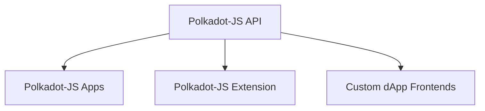
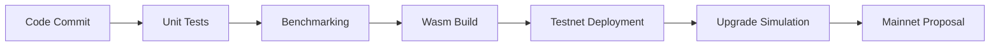
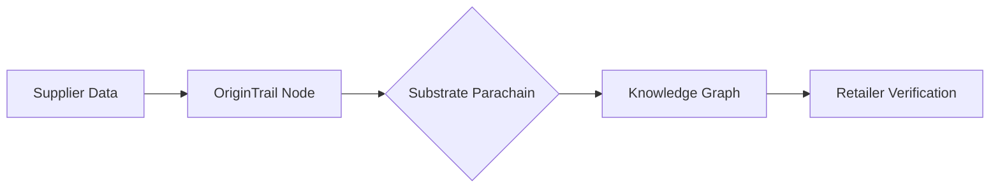

# Encyclopedia Galactica: Substrate Framework Overview


## Table of Contents


1. [Section 1: Introduction to Substrate Framework](#section-1-introduction-to-substrate-framework)

2. [Section 2: Architectural Foundations](#section-2-architectural-foundations)

3. [Section 3: Runtime Development with FRAME](#section-3-runtime-development-with-frame)

4. [Section 4: Consensus Mechanisms](#section-4-consensus-mechanisms)

5. [Section 5: Forkless Upgrades and Governance](#section-5-forkless-upgrades-and-governance)

6. [Section 6: Interoperability and Cross-Chain Integration](#section-6-interoperability-and-cross-chain-integration)

7. [Section 7: Cryptography and Security](#section-7-cryptography-and-security)

8. [Section 8: Developer Ecosystem and Tooling](#section-8-developer-ecosystem-and-tooling)

9. [Section 9: Real-World Implementations](#section-9-real-world-implementations)

10. [Section 10: Future Trajectory and Challenges](#section-10-future-trajectory-and-challenges)


## Section 1: Introduction to Substrate Framework

The evolution of blockchain technology has been marked by a relentless pursuit of greater capability, efficiency, and accessibility. From the foundational Proof-of-Work consensus of Bitcoin, enabling unprecedented digital scarcity and peer-to-peer value transfer, to the smart contract revolution ignited by Ethereum, which unlocked programmable decentralized applications, each paradigm shift expanded the horizons of possibility. Yet, as ambitions grew – envisioning decentralized finance ecosystems rivaling traditional institutions, transparent global supply chains, and user-owned digital identities – the limitations of existing monolithic blockchain architectures became increasingly apparent. Scalability bottlenecks, rigid upgrade paths hindering innovation, and the daunting complexity of launching a secure, custom blockchain from scratch presented significant barriers to the realization of a truly decentralized web, or Web3. It was within this crucible of unmet potential that the **Substrate blockchain development framework** emerged, not merely as another tool, but as a foundational paradigm shift: a modular toolkit empowering developers to build purpose-optimized blockchains with unprecedented flexibility and efficiency. Substrate represents the crystallization of lessons learned from earlier generations, embodying a philosophy that views blockchain not as a singular, inflexible monolith, but as a customizable substrate upon which the diverse applications of the decentralized future can be built.

### 1.1 Defining Substrate and Core Principles

At its essence, Substrate is an open-source, modular, and extensible framework for building bespoke blockchains. Developed primarily in Rust, a language prized for its performance, safety, and concurrency features, Substrate provides the core infrastructure components required for a functional blockchain: networking (via Libp2p), consensus mechanisms, a Wasm-based runtime environment, and a secure storage layer. However, its true power lies not just in providing these components, but in how it enables their seamless customization and composition.

The core philosophy underpinning Substrate can be distilled into several key tenets:

1.  **Modular Architecture Philosophy:** This is Substrate's defining characteristic. Instead of a rigid, monolithic codebase, Substrate decomposes blockchain functionality into discrete, reusable components called **Pallets**. A pallet encapsulates specific domain logic, such as managing account balances (the `Balances` pallet), enabling on-chain governance (the `Democracy` pallet), or creating fungible tokens (the `Assets` pallet). Developers select only the pallets necessary for their blockchain's purpose, configure them to their needs, and assemble them into a cohesive runtime. This is akin to building with specialized Lego bricks rather than carving from a single block of stone. The benefits are profound: reduced development time, minimized attack surface (only used code is included), easier auditing, and the ability to leverage a growing ecosystem of community-developed pallets. For instance, a project focused on decentralized identity might integrate the `Identity` pallet alongside core modules like `Balances` and `Timestamp`, excluding unnecessary complexity like sophisticated staking mechanisms.

2.  **"Build Your Own Blockchain" Paradigm vs. Smart Contract Platforms:** Substrate fundamentally challenges the prevailing model popularized by Ethereum, where applications are built *on top of* an existing blockchain as smart contracts. While smart contracts offer rapid deployment, they inherit the limitations of their host chain – its scalability constraints, governance rules, transaction costs, and virtual machine limitations. Substrate flips this model. Instead of deploying a smart contract, developers *build the entire blockchain* specifically tailored to their application's requirements using Substrate. This grants unparalleled control:

*   **Consensus Choice:** Select Proof-of-Work (PoW), Proof-of-Stake (PoS) variants like NPoS (Nominated Proof-of-Stake), or even design a custom consensus mechanism optimized for the use case (e.g., high-throughput, low-latency for gaming).

*   **Governance Design:** Implement bespoke on-chain governance processes, voting mechanisms, treasury management, and upgrade pathways suited to the community or organization.

*   **Economic Model:** Define the native token's properties (inflation, distribution, fee structure) precisely.

*   **Runtime Logic:** Craft the state transition logic directly within the runtime, free from the gas meter and constraints of a specific Virtual Machine (VM) like the EVM (though EVM compatibility *is* an option via pallets like `pallet-evm`).

This paradigm shift is significant. It moves beyond the "one chain to rule them all" concept towards a vision of a **multi-chain universe**, where thousands of specialized, interconnected blockchains (often called *parachains* or *appchains*) coexist, each optimized for its specific function. Projects like Polkadot and Kusama are direct manifestations of this vision, built using Substrate to serve as heterogeneous, scalable networks.

3.  **Flexibility:** Substrate's modularity and configuration-first approach inherently provide immense flexibility. Pallets expose extensive configuration options through Rust traits, allowing developers to fine-tune behavior without modifying core pallet code. The framework is designed to be agnostic to specific cryptographic primitives or consensus engines, supporting a range through interchangeable modules. This flexibility extends to deployment: Substrate blockchains can launch as independent sovereign chains, connect as parachains to shared security networks like Polkadot or Kusama, or even start as solo chains and later become parachains.

4.  **Upgradability (Forkless Upgrades):** Perhaps one of Substrate's most revolutionary features is its built-in mechanism for seamless, **forkless runtime upgrades**. Traditional blockchains require disruptive hard forks to implement protocol changes, often leading to community splits (e.g., Bitcoin/Bitcoin Cash, Ethereum/Ethereum Classic). Substrate leverages its WebAssembly (Wasm) runtime environment to overcome this. The blockchain's business logic (the runtime) is compiled to Wasm and stored *on-chain*. Node operators run a lightweight native client whose primary role is to execute the current on-chain Wasm runtime. When an upgrade is needed, a governance-approved process replaces the on-chain Wasm blob with the new version. Nodes automatically switch to executing the new logic at a predefined block, without requiring them to manually update their client software or restart. This enables rapid iteration, bug fixes, and feature additions with minimal disruption – a critical capability for evolving complex decentralized systems. Kusama, the "canary network" for Polkadot, famously executes frequent runtime upgrades via this mechanism, sometimes multiple times per month, demonstrating its practicality.

5.  **Interoperability:** Recognizing that the future is multi-chain, Substrate is designed with interoperability as a first-class principle. Blockchains built with Substrate can natively leverage the **Cross-Consensus Messaging (XCM)** format, a language for communication between different consensus systems (not just Substrate-based chains). This allows for secure trust-minimized transfer of messages, tokens (via teleportation or reserve-backed assets), and even cross-chain function calls. Furthermore, Substrate chains integrate seamlessly into the Polkadot ecosystem as parachains, benefiting from shared security and inherent interoperability with other parachains via the relay chain. For connecting to non-Substrate chains (like Ethereum or Bitcoin), Substrate provides the tools and patterns (e.g., the `pallet-bridge` infrastructure) to build secure bridges.

### 1.2 Historical Context and Genesis

The genesis of Substrate is inextricably linked to the vision of Dr. Gavin Wood and the evolution of Parity Technologies. Wood, a co-founder of Ethereum and author of its seminal Yellow Paper formalizing the Ethereum Virtual Machine (EVM), possessed a deep understanding of both the revolutionary potential and the inherent limitations of early blockchain designs. His experience building Ethereum's core technology, particularly the challenges of upgrading the protocol and scaling its capabilities, profoundly shaped his thinking.

Following his departure from the Ethereum Foundation, Wood founded Parity Technologies (initially EthCore) in 2015. Parity quickly established itself as a leading force in Ethereum infrastructure, developing the highly performant and secure Parity Ethereum client (written in Rust), which at its peak commanded a significant share of the network's nodes. This deep immersion in Ethereum's ecosystem provided Parity with unique insights into the practical difficulties faced by developers and network operators.

Wood's broader vision crystallized in the **Polkadot Whitepaper**, published in 2016. Polkadot proposed a radical architecture: a heterogeneous multi-chain network where specialized blockchains (parachains) connect to a central relay chain providing shared security and cross-chain interoperability. Crucially, this vision necessitated a way to build these diverse parachains efficiently and securely. The existing methods – forking Bitcoin or Ethereum codebases or building entirely from scratch – were deemed too time-consuming, error-prone, and restrictive.

Thus, **Substrate was conceived as the foundational technology to realize the Polkadot vision.** Development began at Parity Technologies around 2017/2018, explicitly designed to be the premier framework for building parachains. However, the ambition quickly expanded. Substrate's modularity and power made it evident that it was equally suited for building **sovereign blockchains** – independent chains not attached to Polkadot. This dual-purpose nature became a core strength.

The **first major version, Substrate 1.0, was unveiled in late 2018.** Its launch was accompanied by a powerful demonstration: Gavin Wood live-coded a functional blockchain in under 30 minutes during his keynote at the Web3 Summit in Berlin. This dramatic showcase highlighted Substrate's core promise: dramatically reducing the complexity and time required to launch a custom blockchain. It wasn't just a toolkit; it was a blockchain factory. Wood famously described it as "Blockchain 3.0" – a framework designed for the era of specialized chains.

Parity Technologies nurtured Substrate through its formative years, driving its development alongside the Polkadot and Kusama networks (Kusama, launched in 2019, became the first live network built with Substrate and served as its primary testbed). Crucially, Parity fostered a strong open-source ethos around Substrate, encouraging community contributions and the development of third-party pallets. The establishment of the **Substrate Developer Hub** provided centralized, high-quality documentation and tutorials, significantly lowering the barrier to entry. Substrate's evolution has been marked by continuous refinement: the introduction of FRAME v2 (a major pallet macro system overhaul), enhanced tooling like Polkadot-JS Apps and the Substrate Front End Template, and ongoing performance optimizations.

### 1.3 Substrate's Position in the Blockchain Ecosystem

Substrate occupies a unique and increasingly pivotal position within the diverse landscape of blockchain technologies. Understanding its role requires comparison with prominent alternatives and an examination of how it tackles fundamental challenges.

*   **Comparison to Cosmos SDK:** The Cosmos SDK is perhaps Substrate's closest analogue, also enabling the creation of custom, application-specific blockchains (zones) using a modular framework (written in Go). Both embrace a "Blockchain OS" philosophy. Key differences lie in their underlying tech stacks (Rust vs. Go), default communication models, and security philosophies. Cosmos chains primarily connect via the Inter-Blockchain Communication (IBC) protocol, which facilitates trust-minimized communication *after* chains establish mutual recognition. Substrate chains, especially within the Polkadot ecosystem, leverage shared security from the relay chain *from launch* via the parachain model and use XCM for messaging. Substrate's forkless upgrade capability via on-chain Wasm is also a distinct advantage over Cosmos SDK chains, which typically require coordinated validator upgrades (cosmovisor helps automate this, but it's not on-chain). Both frameworks are powerful, with choices often boiling down to language preference (Rust/Go), desired interoperability scope (Polkadot ecosystem vs. IBC-enabled Cosmos chains), and the value placed on out-of-the-box shared security for parachains.

*   **Comparison to Ethereum Layer 2s (L2s - Rollups, Plasma, etc.):** Ethereum L2s (Optimistic Rollups like Optimism and Arbitrum, ZK-Rollups like zkSync and StarkNet) aim to scale Ethereum by executing transactions off the main Ethereum chain (Layer 1) and periodically settling proofs or data back to it. Developers deploy smart contracts *onto* these L2 platforms. Substrate offers a fundamentally different approach: building an entirely independent Layer 1 blockchain. While an independent Substrate chain doesn't inherit Ethereum's security directly (unless specifically bridged), it offers maximal sovereignty, customizability, and potentially higher performance and lower fees tailored to its specific use case. Substrate chains *can* also implement L2 solutions themselves or bridge to Ethereum L2s. Conversely, projects like Moonbeam and Astar use Substrate to build Ethereum-compatible parachains on Polkadot/Kusama, effectively acting as highly integrated, scalable "L2-like" environments leveraging shared security. Substrate provides the foundation for both sovereign chains and specialized chains within larger ecosystems.

*   **Comparison to Enterprise Frameworks (e.g., Hyperledger Fabric, R3 Corda):** Frameworks like Fabric and Corda are designed primarily for permissioned (private/consortium) blockchain networks within enterprises. They focus on privacy, identity management, and integration with existing enterprise systems. Substrate, while capable of being configured for permissioned use (e.g., using authority-based consensus like Aura), is fundamentally architected for public, permissionless networks. Its strengths lie in decentralization, token economics, censorship resistance, and interoperability within public ecosystems like Polkadot. Substrate's governance and upgrade mechanisms are also designed for decentralized communities, contrasting with the typically centralized governance of enterprise chains. While both address blockchain needs, their target audiences and core value propositions differ significantly.

**Solving the Blockchain Trilemma:** Substrate directly addresses the core challenge known as the blockchain trilemma – the perceived difficulty of achieving optimal levels of **scalability, security, and decentralization** simultaneously.

*   **Scalability:** Modularity allows chains to be optimized for specific throughput needs. The parachain model in Polkadot/Kusama enables horizontal scaling – multiple chains processing transactions in parallel, sharing the security of the relay chain. Forkless upgrades allow for rapid deployment of scaling improvements.

*   **Security:** Rust's memory safety drastically reduces common vulnerability classes. Flexible consensus allows selection of appropriate security models (e.g., NPoS for robust decentralization). The Wasm runtime provides a secure sandbox. Parachains benefit from pooled security via the relay chain's validator set.

*   **Decentralization:** Substrate enables the creation of chains with permissionless validator sets and on-chain governance mechanisms. Its design avoids centralized points of control inherent in some alternatives. NPoS encourages broad token holder participation in staking and nomination.

**Target Developer Audience and Use Cases:** Substrate attracts a specific, technically proficient developer profile, primarily comfortable with Rust. Its power comes with a steeper initial learning curve compared to smart contract development on Ethereum. The target audience includes:

*   Teams building complex decentralized applications requiring performance or customization impossible or impractical on general-purpose L1s.

*   Projects needing bespoke economic models, governance structures, or consensus mechanisms.

*   Organizations launching sovereign networks for specific industries or communities.

*   Developers contributing to the Polkadot/Kusama parachain ecosystem.

*   Innovators pushing the boundaries of blockchain technology itself.

**Diverse use cases flourishing on Substrate include:**

*   **DeFi Hubs:** Acala (a stablecoin and liquid staking hub on Polkadot), Moonbeam (EVM-compatible smart contract platform on Polkadot), Parallel Finance (lending and staking).

*   **Decentralized Identity:** KILT Protocol (verifiable credentials and decentralized identifiers).

*   **Privacy:** Manta Network (zero-knowledge proof applications).

*   **Data Oracles:** Chainlink (has a parachain on Polkadot).

*   **IoT and Supply Chain:** OriginTrail (decentralized knowledge graph for supply chains).

*   **Social Media:** Subsocial (decentralized social networking platform).

*   **Gaming and NFTs:** Unique Network (NFT chain), numerous play-to-earn game chains.

*   **Central Bank Digital Currency (CBDC) Prototypes:** Several central banks have explored or built prototypes using Substrate due to its flexibility and security.

Substrate has emerged as the backbone for a significant portion of next-generation blockchain infrastructure. Its modular, flexible, and upgradeable design directly confronts the limitations of earlier architectures, empowering developers to move beyond the constraints of monolithic chains and smart contracts. By providing the tools to build purpose-driven blockchains that can seamlessly evolve and interoperate, Substrate is actively shaping the modular, multi-chain landscape that defines the cutting edge of Web3. It stands not just as a framework, but as an enabler of a more diverse, efficient, and user-centric decentralized future.

The profound implications of Substrate's core principles – modularity, forkless upgrades, and sovereign chain creation – necessitate a deeper understanding of the technical architecture that makes them possible. How does Substrate actually function under the hood? What are the components that allow a developer to assemble a bespoke blockchain like configuring sophisticated machinery? The next section delves into the **Architectural Foundations** of the Substrate framework, dissecting its layered design, the critical separation between node and runtime, the intricacies of its state transition model, and the elegant efficiency of its light client capabilities. This exploration reveals the ingenious engineering that transforms the philosophy outlined here into tangible, robust blockchain infrastructure.


---


## Section 2: Architectural Foundations

The philosophical pillars of Substrate – modularity, forkless upgrades, and sovereign chain creation – are not mere abstractions. They are made tangible and robust through a meticulously engineered, layered architecture. Just as a master watchmaker's design philosophy is realized in the precise interplay of gears and springs, Substrate's principles manifest in the intricate collaboration of its core components. Building upon the conceptual foundation laid in Section 1, we now dissect the technical bedrock that empowers developers to assemble high-performance, secure, and adaptable blockchains. Understanding this architecture is key to appreciating how Substrate transforms the complex challenge of blockchain creation into a manageable, even elegant, engineering process. It reveals the sophisticated machinery beneath the "blockchain factory" metaphor, where external interfaces, core orchestration, persistent storage, and the crucible of business logic execution are cleanly separated yet seamlessly integrated.

### 2.1 Node Architecture Components

A Substrate-based blockchain node is not a monolithic application but a carefully orchestrated ensemble of specialized components. This decomposition is fundamental to achieving the framework's goals of flexibility, performance, and security. Let's examine the core layers:

1.  **External Network Interfaces (Libp2p Integration):** At the frontier of the node lies its communication layer, responsible for peer discovery, connection management, and the reliable propagation of blocks and transactions across the decentralized network. Substrate leverages **Libp2p**, a modular peer-to-peer networking stack originally developed for IPFS but adopted as the de facto standard for next-generation blockchain networking. This choice is strategic and deeply impactful.

*   **Modularity in Action:** Libp2p embodies the same modular philosophy as Substrate itself. It decomposes networking into reusable components: transport protocols (TCP, WebSockets, WebRTC, QUIC), secure channel protocols (Noise, TLS), multiplexers (mplex, Yamux), peer discovery mechanisms (Kademlia DHT, mDNS), and pub/sub messaging. Substrate configures these "modules" to suit the blockchain's needs. For instance, a public permissionless chain will heavily utilize the Kademlia DHT for peer discovery, while a private consortium chain might rely on a static list of peers.

*   **Resilience and NAT Traversal:** Libp2p excels at handling the harsh realities of the open internet. Its NAT traversal capabilities, particularly when using protocols like WebRTC or QUIC, enable nodes running behind home routers or corporate firewalls to participate fully in the network. The pub/sub system ensures efficient broadcast of blocks and transactions, while peer routing via the DHT provides resilience against node churn – the constant joining and leaving of peers.

*   **Real-World Performance:** The integration of Libp2p was pivotal in enabling the high peer counts observed in networks like Polkadot and Kusama. During Kusama's initial rollout, Libp2p's efficient connection management allowed validator nodes to maintain stable connections with hundreds of peers, crucial for rapid block propagation and consensus finality under the demanding GRANDPA/BABE model. Substrate nodes expose Libp2p metrics (number of peers, connection types, bandwidth usage) via Prometheus endpoints, providing operators with deep visibility into network health.

2.  **Core Client (Rust-Based):** Acting as the central nervous system, the core client component is written entirely in Rust. It orchestrates all other node functions:

*   **Block Import Pipeline:** Validating incoming blocks (signature checks, inherent checks), executing them against the current state, and importing them into the database. This involves critical interactions with the consensus engine and the runtime.

*   **Transaction Pool Management:** Maintaining a mempool of pending, validated transactions ready for inclusion in future blocks. The pool prioritizes transactions based on factors like fees (as defined by the runtime) and ensures nonce ordering for each account.

*   **Consensus Engine Coordination:** Integrating with the chosen consensus algorithm (e.g., BABE, Aura, GRANDPA finality gadget). The client handles block production slots (if the node is an authority), finality voting, justification handling, and slash condition monitoring. It translates consensus messages into actions on the blockchain state.

*   **RPC (Remote Procedure Call) and WebSocket Server:** Exposing APIs for external interaction. This allows users to submit transactions, query chain state (storage), subscribe to events (like new blocks or finalized blocks), and interact with the node's operation (e.g., managing keys, setting logging levels). The JSON-RPC interface is the primary gateway for wallets, block explorers (like Polkadot-JS Apps and Subscan), and dApp frontends.

*   **Telemetry and Logging:** Collecting detailed operational metrics (CPU, memory, block sync status, peer count) and structured logs, essential for node operator monitoring, debugging, and network health analysis. Substrate nodes automatically report anonymized telemetry to centralized dashboards by default (configurable), providing a real-time view of the network's aggregate status.

Rust's role here is paramount. Its memory safety guarantees eliminate entire classes of common vulnerabilities (buffer overflows, dangling pointers) endemic to C/C++ implementations. Its performance characteristics ensure the core client can handle the high-throughput demands of modern blockchains. Concurrency features like async/await enable efficient handling of numerous simultaneous network connections and background tasks without the overhead of traditional threading models.

3.  **Database Layer (RocksDB):** Persistence is critical for any blockchain. Substrate employs **RocksDB**, a high-performance, embeddable, persistent key-value store developed by Facebook (Meta), as its default database engine. Its choice reflects a focus on robustness, efficiency, and configurability:

*   **Key-Value Abstraction:** Substrate abstracts its complex state (accounts, balances, smart contract storage, staking information) into a simple key-value interface. RocksDB efficiently stores and retrieves these key-value pairs. Keys are typically prefixed with pallet identifiers and storage item names (e.g., `0x5c0f117ab17dde2f4a00b6d118a0dac4b000b5a1c` for a specific account's free balance in the Balances pallet), enabling efficient namespacing.

*   **Performance and Tuning:** RocksDB provides exceptional write performance, crucial for blockchains that continuously append new state changes. Features like write-ahead logging (WAL), configurable memtables, bloom filters for fast point reads, and sophisticated compaction strategies allow fine-tuning for specific workloads (e.g., prioritizing read-heavy operations like RPC queries vs. write-heavy block importing). Substrate ships with sensible defaults but exposes numerous RocksDB options for advanced node operators.

*   **State Pruning:** While blockchains are append-only ledgers, storing every historical state change indefinitely is impractical. Substrate implements state pruning. Full nodes typically store only the state for a certain number of recent blocks (e.g., 256 blocks). Archival nodes, necessary for services like block explorers and indexers, can be configured to retain the complete history. RocksDB's efficient storage format and compaction make this feasible.

*   **Alternative Backends:** While RocksDB is the default and most battle-tested backend, Substrate's architecture allows for pluggable databases. Experimental support exists for **ParityDB** (a database format specifically optimized for blockchain state trie structures, developed by Parity) and **SQLite** (useful for specific use cases or lighter environments). This modularity ensures flexibility for future optimizations or specialized deployments.

4.  **Runtime Execution Environment Separation:** This is arguably the most architecturally significant aspect of Substrate and the linchpin of its forkless upgrade capability. The core client (node) and the business logic (runtime) are strictly separated:

*   **The Node as the "Host Environment":** The core client, written in native Rust, handles all I/O-bound tasks: networking, disk I/O (database), block orchestration, transaction pool management, and consensus communication. It provides a well-defined host interface (API) to the runtime.

*   **The Runtime as the "Guest Logic":** The blockchain's specific business rules – how balances are managed, how governance proposals are enacted, how assets are transferred – are defined entirely within the runtime. Crucially, the runtime is compiled into **WebAssembly (Wasm)** and stored *on the blockchain itself*.

*   **Dual Execution Engines:** The node possesses *two* runtime execution environments:

1.  **Native Runtime:** The runtime code is also compiled into native machine code (using the node's Rust compiler) and embedded within the node binary itself. This is the fastest execution path.

2.  **Wasm Runtime:** The node includes a high-performance Wasm virtual machine (like **Wasmtime**). This VM can execute the Wasm blob stored on-chain.

*   **Execution Priority:** The node *always* attempts to execute the runtime natively first, as it's significantly faster. However, the critical innovation is that **the on-chain Wasm runtime is the single source of truth**. If the native runtime version (embedded in the node software) does not *exactly* match the version of the on-chain Wasm runtime, the node automatically falls back to executing the Wasm. This fallback mechanism is seamless and automatic.

*   **Enabling Forkless Upgrades:** When a runtime upgrade is enacted on-chain (via governance), the new Wasm blob replaces the old one. Nodes running older client software (with an outdated native runtime) simply detect the mismatch and start executing the new logic via their built-in Wasm VM. There is no need for a coordinated software upgrade or a disruptive hard fork. Operators can update their native client binaries at their convenience to regain native-speed execution. This separation is the technical marvel that allows networks like Kusama to upgrade seamlessly multiple times per month.

### 2.2 State Transition Machine Model

At its heart, a blockchain is a **deterministic state transition machine**. Substrate provides a powerful, standardized model for defining and executing these transitions.

1.  **Blockchain as Deterministic State Machine:** The fundamental concept is simple:

*   The blockchain has a **State** (S): A snapshot of all stored data at a specific block height (e.g., account balances, contract storage, staking information).

*   A **Block** (B) contains a set of **Extrinsics** (E) – typically transactions, but also inherent data like timestamps.

*   Applying the block's extrinsics to the previous state (Sn-1) via the **Runtime Logic** (RL) produces the new state (Sn): `S_n = RL(S_{n-1}, B)`.

*   **Determinism** is non-negotiable: Given the same starting state (Sn-1) and the same block (B), every honest node *must* compute the identical new state (Sn). This is why runtime logic must be pure and free from non-deterministic operations (like random number generation without a verifiable on-chain source).

2.  **Runtime as Business Logic Engine:** The Substrate runtime is solely responsible for defining the state transition function (RL). It is the domain-specific engine driving the blockchain. Its core responsibilities include:

*   **Storage Management:** Defining *what* data is stored on-chain (using the `#[pallet::storage]` macro in FRAME pallets) and the logic to access and modify it.

*   **Extrinsic Handling:** Defining the functions that can be called via extrinsics (transactions) – `#[pallet::call]` – including validation logic (e.g., signature checks, fee payment, nonce validation) and execution logic (state changes).

*   **Event Emission:** Generating `#[pallet::event]` to signal important state changes to external systems (like indexers or UIs).

*   **Error Handling:** Defining `#[pallet::error]` types for predictable failure modes within extrinsic execution.

*   **Inherent Data Processing:** Handling special unsigned extrinsics (`#[pallet::inherent]`) that provide essential, verifiable data from the node environment (like the current timestamp or validator randomness) into the runtime logic.

*   **Off-Chain Worker Interaction:** Providing hooks for off-chain workers (separate processes that can fetch external data or perform computation) to submit signed or unsigned extrinsics back on-chain based on their results.

*   **Genesis Configuration:** Defining the initial state (`GenesisConfig`) of the blockchain upon launch.

3.  **Storage Trie Structure and Child Tries:** Substrate uses a modified **Merkle Patricia Trie (MPT)** for its state storage, similar to Ethereum. This cryptographic data structure is essential for efficiency and verifiability:

*   **State Root:** The entire state is summarized by a single cryptographic hash, the **state root**, stored in the block header. Any change to any piece of state data alters this root.

*   **Efficient Verification (Light Clients):** The MPT structure allows anyone to prove that a specific piece of data (e.g., Alice's balance) is part of the current state by providing a **Merkle proof** – a path of hashes from the data item up to the state root. Light clients rely heavily on this property.

*   **Key-Value Storage:** As mentioned earlier, the database stores key-value pairs. The MPT organizes these keys hierarchically. Keys are hashed (using Blake2b by default) before insertion for security and distribution uniformity.

*   **Child Tries (Child Storage):** A powerful feature of Substrate's storage is **child tries**. These are independent sub-tries anchored within the main state trie. Crucially, they have their *own* root hash, completely isolated from the main trie's state root calculation until explicitly committed.

*   **Use Cases for Child Tries:** Child tries are invaluable for:

*   **Smart Contracts:** Each smart contract (e.g., using `pallet-contracts`) typically has its own child trie, isolating its storage from other contracts and the main runtime. This prevents storage collisions and simplifies state management for contracts. Only the root of the contract's child trie is stored in the main trie.

*   **Large, Independent Datasets:** Modules managing large datasets that don't need to be constantly verified alongside the main state (e.g., off-chain data feeds in an oracle pallet, historical records in an identity system) can leverage child tries for efficient organization and access.

*   **Privacy:** While not providing full privacy, child tries can offer a degree of isolation, making it harder to casually scan all stored data.

*   **Runtime Upgrades and Storage:** The deterministic state machine model interacts elegantly with forkless upgrades. The upgraded runtime logic defines the *new* state transition rules. When a block containing the upgrade is processed, the node executes the *old* runtime logic to transition to the state at which the upgrade occurs. Then, the new Wasm runtime is stored on-chain. The *next* block will be processed using the new logic. Crucially, the state itself remains continuous; the upgrade doesn't reset the chain history. The runtime defines how the state is *interpreted* and how *future* transitions occur. Migration logic within the `on_runtime_upgrade` hook can perform necessary one-time transformations on the existing state to make it compatible with the new runtime's expectations.

### 2.3 Light Client Capabilities

Full nodes, storing the entire blockchain history and participating actively in consensus or transaction relaying, are crucial for network security and decentralization. However, they are resource-intensive, requiring significant storage, bandwidth, and computation. For many applications – mobile wallets, embedded IoT devices, or simple balance checks – this overhead is impractical. Substrate's architecture incorporates first-class support for **light clients**, enabling secure interaction with the blockchain with minimal resource requirements.

1.  **Simplified Payment Verification (SPV) Design Principles:** Substrate light clients adhere to and extend the SPV concept popularized by Bitcoin. The core principle is **trust minimization through cryptography**:

*   **Minimal State:** Light clients do *not* download or store the entire blockchain state or history. They typically only store block headers (or a subset thereof) and information relevant to their specific interests (e.g., transactions related to their own accounts).

*   **Header Verification:** The foundation is verifying the chain of block headers. Each header contains the cryptographic hash of the previous header (forming the chain), the state root (commitment to the entire state), and the extrinsics root (commitment to the transactions in the block). Crucially, headers also contain **consensus justifications** (e.g., GRANDPA commit messages proving finality).

*   **Proofs, Not Data:** To access specific information (e.g., "What is Alice's balance?"), a light client requests the data *along with a cryptographic Merkle proof* from a full node (or a decentralized network of nodes). This proof demonstrates that the requested data is part of the state committed to by the state root in a specific, finalized block header that the light client trusts.

*   **Trust in Consensus:** Ultimately, the light client places trust in the blockchain's consensus mechanism. By verifying the signatures of validators (or miners) in the headers and/or finality proofs (like GRANDPA justifications), the client gains cryptographic assurance that the header chain it follows represents the canonical, honestly produced chain.

2.  **Blockchain Syncing Mechanisms for Light Clients:** Substrate light clients employ efficient protocols to sync and stay updated:

*   **Initial Header Sync:** The client downloads a sequence of block headers, starting from a known trusted checkpoint (e.g., the genesis block, or a recent finalized block hash obtained from a trusted source). It verifies the integrity of the chain by checking the hash linkages between headers.

*   **Finality Proof Verification:** For chains using GRANDPA (like Polkadot/Kusama and many Substrate chains), light clients download and verify the GRANDPA justifications attached to finalized blocks. These justifications contain signatures from a supermajority of validators, providing strong cryptographic proof that the block is final and part of the canonical chain. This is a significant security enhancement over PoW SPV, which relies on probabilistic finality based on accumulated work.

*   **Warp Sync (Fast Sync):** A powerful Substrate-specific optimization. Instead of downloading every single header sequentially, a light client can request a **warp sync proof**. This is a compact cryptographic proof (often leveraging MMRs - Merkle Mountain Ranges) that allows the client to jump directly to the headers near the head of the chain, drastically reducing initial sync time. The client verifies the proof against a known trusted genesis state root.

*   **State Queries with Proofs:** Once synced to a recent finalized header, the client can query specific storage items. The full node responds with the value and a Merkle proof proving that value exists at the specified key within the state trie committed to by the state root in the client's trusted header. The client verifies this proof locally.

*   **Transaction Submission:** Light clients can construct and sign transactions. To submit them, they typically send the transaction to one or more full nodes (via RPC or libp2p light client protocols) who will propagate it into the network and eventually include it in a block.

3.  **Light Client Use Cases in IoT/Mobile:** The efficiency of Substrate light clients unlocks blockchain access in constrained environments:

*   **Mobile Wallets:** Applications like Nova Wallet (for Polkadot/Kusama), Fearless Wallet, and Polkadot-JS mobile use light client protocols. Users can securely check balances, view transaction history (via proofs), and send transactions without relying on a centralized server to provide this data (which would compromise trustlessness and censorship resistance). The wallet only needs to sync headers and fetch proofs for relevant data.

*   **Embedded Devices & IoT:** Substrate's efficient light client protocols, particularly with optimizations like Warp Sync, make it feasible to run blockchain verifiers on resource-constrained devices. Imagine a supply chain sensor that can directly, trustlessly verify its own authentication status recorded on-chain, or a decentralized physical infrastructure (DePIN) device that reports usage data via signed messages verifiable by a light client module.

*   **Browser Extensions:** Wallets like the Polkadot{.js} extension function as light clients, enabling secure interaction with Substrate chains directly from the user's browser.

*   **Decentralized Applications (dApp Frontends):** While dApp frontends often rely on centralized RPC providers for convenience, they *can* be designed to run fully client-side using embedded light clients (e.g., compiled to WebAssembly), interacting directly with the peer-to-peer network for the highest level of decentralization and user sovereignty. Projects like Smoldot provide a Wasm-based Substrate light client implementation targeting this use case.

The efficiency is tangible. A Polkadot light client sync (using Warp Sync) might complete in minutes and consume megabytes of data, compared to gigabytes and hours/days for a full archival node sync. Ongoing operation requires minimal bandwidth – primarily downloading new headers (a few kilobytes per block) and the Merkle proofs for any specific data queries. This democratizes access, allowing users on low-bandwidth connections or with limited data plans to participate securely in the network.

The architectural foundations of Substrate – the modular node components, the rigorous state transition model with its versatile storage, and the inclusive light client design – provide the robust infrastructure upon which the unique capabilities of the framework rest. They enable the secure execution of custom logic, the maintenance of a verifiable global state, and the seamless connectivity essential for a decentralized network. However, the true power and accessibility of Substrate for developers lies in the layer that sits directly atop this foundation: **FRAME (Framework for Runtime Aggregation of Modularized Entities)**. It is within FRAME that the philosophy of modularity becomes a practical toolkit, allowing developers to compose complex blockchain functionality from pre-built components and craft bespoke logic with relative ease. The next section delves into the heart of Substrate development: Runtime Development with FRAME.

---

**Word Count:** ~2,050 words.


---


## Section 3: Runtime Development with FRAME

The architectural foundations of Substrate provide the robust infrastructure for decentralized state machines, but it is the **Framework for Runtime Aggregation of Modularized Entities (FRAME)** that transforms theoretical potential into practical blockchain innovation. Building upon the clean separation between node and runtime established in Section 2, FRAME emerges as the expressive toolkit where developers compose their blockchain's unique business logic. It embodies Substrate's core modular philosophy, providing a standardized, secure, and efficient environment for assembling runtime functionality from reusable components called *pallets*. FRAME isn't merely a library; it's a domain-specific language for blockchain logic, enabling the construction of complex, secure, and upgradable runtimes with unprecedented developer ergonomics. As Parity engineer Shawn Tabrizi once quipped, "If Substrate is the blockchain factory, FRAME is the assembly line where specialized modules snap together to build engines of decentralized logic."

### 3.1 Pallets: Runtime Modules

Pallets are the atomic units of functionality within a Substrate runtime. Each pallet encapsulates a coherent set of features, data storage, and business rules related to a specific domain. Think of them as self-contained plugins – a blockchain for decentralized identity might integrate a `pallet-did` for identity management alongside `pallet-balances` for tokenomics, while a DeFi chain would heavily leverage `pallet-assets` and `pallet-amm`.

**Anatomy of a Pallet:**

Modern FRAME pallets (v2, leveraging Rust's powerful attribute macro system) follow a highly structured pattern defined within a single Rust module annotated with `#[frame_support::pallet]`:

1.  **Storage (`#[pallet::storage]`):** Defines the data persisted on-chain. Storage items are declared with specific types and access patterns:

*   `StorageValue`: Singleton value (e.g., `TotalIssuance` for a token).

*   `StorageMap`: Key-value mapping (e.g., `Accounts: map AccountId -> Balance`).

*   `StorageDoubleMap`: Two-key mapping (e.g., `Approvals: (Owner, Spender) -> Amount`).

*   `StorageNMap`: N-key mapping for complex relationships.

*   Example: `pallet-balances` uses `StorageMap` for account balances (`Account::`) and `StorageValue` for total issuance (`TotalIssuance::`). Configurability is key; a custom token pallet might store additional metadata per account via a nested struct.

2.  **Events (`#[pallet::event]`):** Signal significant state changes off-chain. Events are enum variants carrying relevant data. They are cheap to emit (costing a small amount of weight beyond the base storage deposit) and essential for indexers, UIs, and external systems to react to on-chain activity. For instance, `pallet-balances` emits `Transfer { from, to, amount }` and `pallet-staking` emits `Rewarded { stash, amount }`. Developers define custom events like `CredentialIssued { did, credential_hash }` for identity pallets.

3.  **Errors (`#[pallet::error]`):** Represent predictable, handleable failure conditions within extrinsic execution. Defined as an enum, errors provide clear, machine-readable reasons for failure (e.g., `InsufficientBalance`, `DeadlineExpired`, `Unauthorized`). These are returned to the caller and included in transaction receipts, crucial for user feedback and application logic. A well-designed pallet anticipates common failure modes through comprehensive error variants.

4.  **Calls (Extrinsics) (`#[pallet::call]`):** Define the externally invocable functions (transactions). Each call is a function within the `impl Pallet` block, annotated with weight information. Calls handle:

*   **Validation:** Checking origin (sender permissions), preconditions (e.g., sufficient balance, valid nonce), and payment of fees.

*   **Execution:** Performing state transitions (updating storage, emitting events).

*   **Example:** `pallet-balances::transfer(dest, value)` validates the sender has enough funds, deducts `value` + fee from sender, adds `value` to `dest`, and emits a `Transfer` event.

5.  **Configuration (`#[pallet::config]`):** The `Config` trait defines the pallet's dependencies and tunable parameters. This is where the pallet integrates with the broader runtime:

*   **Associated Types:** Link to other runtime components (e.g., `type RuntimeEvent: From> + IsType::RuntimeEvent>;` ensures pallet events are part of the runtime's overarching event type. `type Currency: Currency;` allows the pallet to interact with the runtime's token system).

*   **Constants:** Fixed parameters defined at compile-time (e.g., `#[pallet::constant] type MaxVoters: Get;` for governance pallets limiting referendum participants).

*   The runtime *implements* this trait, binding the pallet to the specific types and constants of the chain.

6.  **Hooks (`#[pallet::hooks]`):** Functions executed at specific points in the block lifecycle:

*   `on_initialize(block_num)`: Runs at the start of block processing.

*   `on_finalize(block_num)`: Runs at the end of block processing (after all extrinsics).

*   `on_runtime_upgrade()`: Critical for performing state migrations when the pallet's logic changes in a runtime upgrade.

*   `offchain_worker(block_num)`: Spawns an asynchronous task for off-chain computation (e.g., fetching external data via HTTP).

**Standard Pallet Library Overview:**

FRAME provides a rich collection of battle-tested, audited pallets covering common blockchain primitives, significantly accelerating development:

*   **`pallet-balances`:** Manages native token accounts, transfers, and total issuance. The bedrock of any tokenized system. Used by virtually every Substrate chain.

*   **`pallet-staking` (NPoS):** Implements Nominated Proof-of-Stake. Handles validator selection, reward distribution, slashing, and nomination. Foundational for Polkadot, Kusama, and any PoS Substrate chain. Its intricate logic, including the Phragmén election method for fair validator stake distribution, showcases FRAME's ability to handle complex algorithms securely.

*   **`pallet-democracy` / `pallet-collective`:** Core governance pallets. `democracy` enables token holder referenda (public proposals and voting). `collective` manages on-chain councils or technical committees (multisig-like entities). Polkadot's governance upgrade from `v1` to `v2` (Governance v2, aka OpenGov on Kusama) involved significant re-engineering of these pallets to enable concurrent referenda and more nuanced delegation, demonstrating FRAME's upgradeability in action.

*   **`pallet-assets`:** Manages fungible tokens (similar to ERC-20). Allows creating multiple asset classes, minting, burning, freezing, and transferring. Chains like Statemine/Statemint (Polkadot/Kusama system parachains) use this as their primary token management layer.

*   **`pallet-scheduler`:** Enables deferred execution. Allows scheduling calls (extrinsics or runtime upgrades) to occur at a specific block number or time. Crucial for automating governance enactments or complex multi-step processes.

*   **`pallet-timestamp`:** Provides a trusted, on-chain notion of time, typically set by block producers. Essential for time-based logic in DeFi (loans, vesting), governance (voting periods), and more.

*   **`pallet-contracts`:** Provides a Wasm-based smart contract environment (akin to Ethereum, but Wasm-native). Used by chains like Astar Network to offer EVM *and* Wasm contract deployment. Its gas metering and sophisticated rent mechanics illustrate FRAME's ability to manage complex resource economics.

**Custom Pallet Development Patterns:**

While standard pallets cover common needs, custom logic defines a chain's uniqueness. FRAME provides clear patterns:

1.  **Starting Point:** Developers typically begin with the `substrate-node-template`, which includes `pallet-template`. This minimal pallet demonstrates storage, events, errors, calls, and configuration.

2.  **Leveraging `frame_support` & `frame_system`:** Custom pallets depend heavily on these crates. `frame_system` provides core types (`AccountId`, `BlockNumber`) and functions (e.g., `ensure_signed(origin)` to validate a transaction sender). `frame_support` offers macros, storage abstractions, and utilities for runtime development.

3.  **Safe Arithmetic:** Using Rust's `checked_add`, `checked_sub`, `saturating_*`, or traits like `CheckedDiv` is mandatory to prevent overflow/underflow vulnerabilities. FRAME environments often disable Rust's default panicking arithmetic in release mode.

4.  **Origin Handling:** Carefully check the `origin` parameter in calls. Use `ensure_root(origin)` for privileged calls (governance-only), `ensure_signed(origin)` for user calls, or `ensure_none(origin)` for unsigned extrinsics (used carefully, often with validation logic).

5.  **Weight Annotation:** Every call *must* have a `#[weight = ...]` attribute estimating its computational resources (see 3.3). This is non-negotiable for security.

6.  **Testing:** Extensive unit tests (using `#[test]`) and integration tests (simulating block production with `TestExternalities`) are critical. FRAME provides a robust testing environment (`frame_support::construct_runtime!` for mock runtimes) allowing pallet logic to be tested in isolation. The Polkadot runtime repository exemplifies this, with thousands of tests validating complex staking and governance logic.

7.  **Security Audits:** Given their critical nature, custom pallets, especially those handling value or permissions, should undergo rigorous security audits. The Acala network's aUSD stablecoin minting mechanism, implemented via custom pallets, underwent multiple audits before launch due to its centrality to their DeFi ecosystem.

### 3.2 Runtime Composition Techniques

The true power of FRAME lies not just in individual pallets, but in how they are composed and configured into a cohesive runtime. This composition is where the "Aggregation" in FRAME's name shines.

**Pallet Configuration Traits and Dependencies:**

As mentioned, each pallet defines a `Config` trait. Runtime composition involves *implementing* this trait for every pallet included in the runtime. This is done in a dedicated runtime configuration file (often `runtime/src/lib.rs`).

*   **Binding Associated Types:** This links pallet internals to the runtime's concrete types. For example:

```rust

impl pallet_balances::Config for Runtime {

type MaxLocks = ConstU32; // Max simultaneous locks per account

type MaxReserves = (); // No reserves limit

type ReserveIdentifier = [u8; 8];

type Balance = u128; // The runtime's balance type

type RuntimeEvent = RuntimeEvent; // The overarching runtime event enum

type DustRemoval = (); // Disable dust removal

type ExistentialDeposit = ConstU128; // Min account balance

type AccountStore = System; // Store accounts in `frame_system`

type WeightInfo = pallet_balances::weights::SubstrateWeight; // Benchmark-based weights

type FreezeIdentifier = (); // No freezing

type HoldIdentifier = (); // No holds

type MaxHolds = (); // No holds

type MaxFreezes = (); // No freezes

}

```

*   **Inter-Pallet Dependencies:** Pallet configuration traits often require types defined by *other* pallets. For instance, a custom `pallet-rewards` might require:

```rust

pub trait Config: frame_system::Config {

type Currency: Currency; // Depends on the runtime's currency pallet

type RewardHandler: HandleReward; // Custom trait for reward distribution

}

```

The runtime implementation would then point `type Currency` to `Balances` (the instance of `pallet-balances`) and provide a concrete implementation for `RewardHandler`. This creates a type-safe dependency graph enforced at compile time.

**Runtime Assembly and Macro Expansion:**

The heart of runtime composition is the `construct_runtime!` macro. This single invocation assembles the selected pallets into the final runtime binary:

```rust

construct_runtime!(

pub struct Runtime

where

Block = Block,

NodeBlock = opaque::Block,

UncheckedExtrinsic = UncheckedExtrinsic,

{

// System pallet is mandatory

System: frame_system,

// Timestamp pallet is almost always needed

Timestamp: pallet_timestamp,

// Balances pallet for the native token

Balances: pallet_balances,

// Custom pallet

MyCustomModule: pallet_my_custom_module,

// ... other pallets (Staking, Democracy, Assets etc.)

}

);

```

This macro performs extensive code generation:

1.  **Runtime API:** Generates the RPC API surface (e.g., querying storage, submitting transactions) by implementing traits like `Core`, `BlockBuilder`, and `ApiExt`.

2.  **Metadata:** Generates the chain's metadata, describing all pallets, storage items, calls, events, errors, and constants. This is exposed via RPC and used by tools like Polkadot-JS Apps.

3.  **Runtime Versioning:** Creates a unique `spec_version` and `impl_version` that increases with logic changes, enabling nodes to identify compatible runtimes.

4.  **Pallet Enumeration:** Creates overarching enums (`RuntimeCall`, `RuntimeEvent`, `RuntimeOrigin`) that aggregate all possible calls, events, and origins from the included pallets. A transaction to `MyCustomModule::do_something` becomes a `RuntimeCall::MyCustomModule(MyCustomModuleCall::do_something { ... })`.

5.  **Genesis Configuration:** Generates the `GenesisConfig` struct, aggregating the genesis configuration for every pallet included in the macro.

The elegance lies in the abstraction. Developers declare *what* pallets they want and how they are named within the runtime. The macro handles the intricate wiring, type conversions, and boilerplate, drastically reducing errors and development time. Gavin Wood often highlights this as key to Substrate's productivity: "The `construct_runtime!` macro is the glue that binds the modular components into a unified, executable whole with minimal ceremony."

**Chain Specification Files (Genesis Configuration):**

While the runtime defines *how* the state evolves, the `chain_spec.rs` file (or files) defines the *initial state* – the genesis block. This is specified in code, typically building a `GenesisConfig` object:

```rust

fn testnet_genesis() -> GenesisConfig {

GenesisConfig {

system: SystemConfig {

code: WASM_BINARY.expect("WASM binary not available").to_vec(),

..Default::default()

},

balances: BalancesConfig {

balances: vec![

// Allocate initial balances to predefined accounts

(alice_account_id(), 1_000_000 * UNITS),

(bob_account_id(), 750_000 * UNITS),

(charlie_account_id(), 500_000 * UNITS),

// Endowment for the treasury pallet

(treasury_account_id(), 100_000 * UNITS),

],

},

staking: StakingConfig {

validators: vec![

// Initial validators and their stash/controller keys

(validator1_stash(), validator1_controller()),

(validator2_stash(), validator2_controller()),

],

minimum_validator_count: 1,

validator_count: 2,

stakers: vec![

// Initial nominations (self-stake for validators)

(validator1_stash(), validator1_controller(), 100_000 * UNITS, StakerStatus::Validator),

(validator2_stash(), validator2_controller(), 100_000 * UNITS, StakerStatus::Validator),

(alice_account_id(), alice_account_id(), 50_000 * UNITS, StakerStatus::Nominator(vec![validator1_stash()])),

],

..Default::default()

},

session: SessionConfig {

keys: vec![

// Mapping validator controller keys to session keys (e.g., GRANDPA, BABE)

(validator1_controller(), validator1_controller(), session_keys(validator1_auth_key)),

(validator2_controller(), validator2_controller(), session_keys(validator2_auth_key)),

],

},

// Configuration for other pallets (Democracy, Treasury, Sudo etc.)

my_custom_module: MyCustomModuleConfig { initial_value: 42 },

..Default::default()

}

}

```

Key aspects:

*   **Code Deployment:** The compiled Wasm runtime blob (`code`) is embedded directly into the genesis state.

*   **Token Distribution:** Initial token allocations to founders, investors, community treasuries, and validators/collators.

*   **Validator/Collator Bootstrapping:** Designation of initial block producers and their associated keys (stash, controller, session keys). For parachains on Polkadot/Kusama, this often includes assigning collators.

*   **Pallet-Specific Setup:** Initial values for storage items defined in custom pallets (e.g., `initial_value: 42` for `MyCustomModule`).

*   **Network Identity:** Setting the chain's name, ID, protocol, and bootnodes. Different specs (`dev`, `local`, `staging`, `main`) are defined for various deployment environments. The genesis configuration for Polkadot's launch in May 2020 was a meticulously crafted file allocating DOTs to thousands of participants from the 2017 sale and early contributors.

### 3.3 Benchmarking and Weight System

In a decentralized network where block production is permissionless or semi-permissionless, resource management is paramount. Malicious actors could flood the network with computationally expensive transactions, grinding it to a halt. Substrate's solution is a sophisticated **weight system**, where every extrinsic (transaction) has a predefined cost (`Weight`) reflecting its consumption of critical resources: computation, storage I/O, and memory usage. FRAME deeply integrates weight metering as a fundamental security mechanism.

**Resource Metering Philosophy:**

Weight serves two critical purposes:

1.  **Block Capacity Limit:** Each block has a maximum allowable total weight (`BlockWeights::max_block`). This prevents blocks from taking too long to execute and propagate, ensuring network liveness and timely finality. The `block_execution_time` target (e.g., 500ms or 1 second) is a key network parameter.

2.  **Fee Calculation:** Transaction fees are primarily calculated based on the extrinsic's weight and a dynamically adjusted fee multiplier (based on network congestion). This ensures users pay proportionally to the resources they consume and discourages spam. Fees typically comprise:

*   `Fee = BaseFee + (ByteFee * Length) + (WeightToFee(Weight) * FeeMultiplier)`

*   `BaseFee`: A fixed fee per extrinsic.

*   `ByteFee`: Fee per byte of the encoded extrinsic (discourages large data blobs).

*   `WeightToFee`: A conversion function mapping weight units to the native token (often linear, but can be quadratic or other curves).

*   `FeeMultiplier`: A dynamic value adjusting based on previous block fullness (using a modified version of Ethereum's EIP-1559 mechanism, implemented in `pallet-transaction-payment`).

**Benchmarking Pipeline:**

Accurately assigning weights is non-trivial. Substrate provides a robust benchmarking framework (`frame-benchmarking` crate) to measure extrinsic execution costs empirically:

1.  **Benchmark Definition:** Within the pallet, developers write benchmark functions using the `#[benchmark]` macro. These functions simulate worst-case execution paths for each call:

```rust

#[benchmark]

fn transfer() {

let sender: T::AccountId = whitelisted_caller(); // Account exempt from some benchmarks limits

let receiver: T::AccountId = account("receiver", 0, SEED);

let amount = T::Currency::minimum_balance() * 100.into(); // Significant amount

T::Currency::make_free_balance_be(&sender, amount * 2.into()); // Fund sender

// Worst-case: Sender has many storage items (locks), requiring complex updates

add_locks::(&sender, 50); // Add 50 mock locks to sender account

#[extrinsic_call]

_(RawOrigin::Signed(sender.clone()), receiver.clone(), amount); // Execute the call

// Assert post-conditions if needed

}

```

Benchmarks must exercise the *most expensive* possible path (largest storage reads/writes, deepest loops, complex crypto).

2.  **Benchmark Execution:** The node is compiled in benchmarking mode (`cargo build --release --features runtime-benchmarks`). The `frame-benchmarking` CLI tool then executes the benchmarks on the *native* runtime (for speed) while meticulously instrumenting:

*   Execution time (CPU cycles).

*   Number of database reads/writes.

*   Memory allocations.

*   Traversal complexity within the state trie.

Measurements are taken across multiple runs with varying input parameters (e.g., number of users, size of data) to model how cost scales.

3.  **Weight Calculation:** The raw measurements are processed to determine the final weight values. This involves:

*   **Worst-Case Analysis:** Focusing on the highest observed resource consumption.

*   **Statistical Aggregation:** Using percentiles (e.g., 99th or 100th percentile) to avoid underestimating.

*   **Component-Based Modeling:** Breaking down the weight into base components (e.g., a fixed cost per storage read, a cost per byte hashed) and variable components based on input size. The `Weight` struct itself holds two primary values:

*   `ref_time`: Approximate picoseconds of CPU execution time on reference hardware (e.g., a 3.7 GHz Intel i7-8700K).

*   `proof_size`: Kilobytes of storage proof data generated during execution (critical for light clients and state proofs). Introduced to better account for storage complexity beyond simple read/write counts.

*   **Safety Factors:** Adding a buffer (e.g., 10-20%) to account for measurement variance and future code changes.

4.  **Integration:** The generated weight values are implemented as a `WeightInfo` trait for the pallet. This trait is then bound in the pallet's `Config` within the runtime (e.g., `type WeightInfo = pallet_balances::weights::SubstrateWeight;`). The `#[weight = ...]` attribute on calls references these concrete values or formulas (e.g., `#[weight = T::WeightInfo::transfer()]`).

**Weight Assignment Strategies and Challenges:**

*   **Parameterization:** Weights are often expressed as functions of input parameters. E.g., `transfer` weight might be constant, while `batch_transfer` weight is `base_weight + (num_transfers * per_transfer_weight)`.

*   **External Calls:** Weights must account for the cost of calls to other pallets via the `Call` enum (e.g., `pallet_utility::batch` must include the cost of all batched calls).

*   **State-Dependent Costs:** Accurately measuring costs influenced by the *current state* (e.g., the number of items in a list being iterated) is challenging. Benchmarks must initialize the state to worst-case scenarios.

*   **Database Complexity:** Costs can vary based on the depth and size of the Merkle trie. The benchmarking framework uses a "warmed" database state to simulate worst-case I/O.

*   **Evolution:** Weights are not static. As hardware improves and runtime logic is optimized, benchmarks are re-run, and weights updated via runtime upgrades. The Polkadot Fellowship (a technical collective) regularly reviews and updates weights for core Polkadot runtime pallets.

*   **Auditing:** Incorrect weights are a critical security risk (underpricing allows DoS; overpricing harms usability). Weight logic is a frequent target of security audits. The infamous "10x bug" in an early Kusama runtime, where a weight was underestimated by an order of magnitude, temporarily slowed block processing until patched via a forkless upgrade, underscoring the criticality of accurate benchmarking.

The FRAME benchmarking and weight system transforms subjective gas estimation (common in EVM chains) into a rigorous, reproducible engineering process. It provides the economic and security underpinnings that allow diverse, complex transactions to coexist safely within the bounded resource envelope of a block, enabling Substrate chains to reliably achieve their performance targets while remaining resilient to attack.

---

The mastery of FRAME empowers developers to craft runtimes that are not only functionally rich but also secure, efficient, and economically sustainable. Through pallets, composition, and rigorous benchmarking, Substrate transforms the intricate art of blockchain logic into a disciplined engineering practice. Yet, a sophisticated runtime alone does not guarantee a functioning network. The integrity of the state machine hinges on a mechanism for achieving global agreement on the sequence and validity of transactions – the realm of **Consensus Mechanisms**. How do Substrate chains resolve the Byzantine Generals' Problem? How do block production and finality work in harmony? And what choices do developers have when tailoring consensus to their specific needs? The next section delves into the protocols and trade-offs that secure the decentralized ledger.

**Word Count:** ~2,050 words.


---


## Section 4: Consensus Mechanisms

The sophisticated runtime logic crafted through FRAME represents the beating heart of a Substrate blockchain, but this heart requires a nervous system to coordinate its rhythmic pulses across a decentralized network. This vital function belongs to the **consensus mechanism** – the cryptographic protocol that transforms individual nodes into a unified state machine by achieving agreement on transaction ordering and validity. As Parity engineer André Silva aptly noted, "Consensus is the social contract of blockchain: without it, you have disconnected computers; with it, you have a shared reality." Building upon the architectural separation of node and runtime explored in Section 2 and the custom logic enabled by FRAME in Section 3, consensus mechanisms provide the trust layer that makes decentralized coordination possible. Substrate's genius lies not in mandating a single solution, but in providing a modular framework where developers can select or create consensus models precisely aligned with their chain's security requirements, performance targets, and philosophical ethos.

### 4.1 BABE and GRANDPA Protocols

The flagship consensus system within the Substrate ecosystem, powering Polkadot, Kusama, and numerous independent chains, is a hybrid model combining **Blind Assignment for Blockchain Extension (BABE)** for block production and **GHOST-based Recursive Ancestor Deriving Prefix Agreement (GRANDPA)** for finality. This bifurcation addresses a fundamental insight: the tasks of *creating new blocks* and *irrevocably agreeing on history* have distinct optimal solutions. BABE prioritizes liveness and fairness in block creation, while GRANDPA prioritizes safety and efficiency in finality, together forming a robust, scalable foundation for decentralized networks.

**Blind Assignment for Blockchain Extension (BABE):**

BABE is a slot-based block production mechanism inspired by Ouroboros Praos, designed for permissionless, proof-of-stake environments:

1.  **Epochs and Slots:** Time is divided into **epochs** (e.g., 24 hours in Kusama), each split into fixed-duration **slots** (e.g., 6 seconds). Each slot represents an opportunity to produce a block.

2.  **Stake-Weighted Lottery:** At the start of each epoch, validators (selected via NPoS) participate in a verifiable random function (VRF)-based lottery. Using their private key and a shared random seed (derived from previous blockchain entropy), each validator computes a VRF output. This output determines their "lottery ticket" strength for each slot in the epoch.

3.  **Slot Assignment:** Validators compare their VRF output against a dynamic threshold proportional to their staked weight. If the output is below the threshold, they are authorized to produce a block in that slot. Crucially, this assignment is "blind" – validators don't know who else won until blocks are published. This randomness prevents predictable scheduling that could enable targeted attacks.

4.  **Block Production:** An authorized validator for a slot assembles a block (including transactions from the pool, inherents like timestamps, and a reference to the best chain head known to them), signs it, and broadcasts it to the network. The VRF proof is included, allowing other nodes to cryptographically verify the validator's right to produce the block for that specific slot.

5.  **Chain Selection (Forks):** Unlike longest-chain rules, BABE uses a **GHOST (Greedy Heaviest Observed Subtree)** variant. Nodes choose the chain fork with the highest **primary slot** count – blocks produced by validators who were explicitly authorized for their slot. This reduces the incentive for selfish mining and improves chain quality. Secondary slots (where no primary validator produced a block) allow backup block production to maintain liveness.

6.  **Real-World Nuances:** During Polkadot's launch, careful tuning of BABE parameters was critical. The initial slot time (6 seconds) balanced latency with network propagation constraints. The epoch length (4 hours initially, later increased) impacted how frequently validator sets rotated. The VRF threshold curve was calibrated to ensure sufficient block production without excessive forks, especially during periods of network instability. Kusama's chaotic early days ("the canary network") served as a vital stress test, revealing edge cases in BABE's fork choice rule under high network latency, leading to protocol refinements.

**GHOST-based Recursive Ancestor Deriving Prefix Agreement (GRANDPA):**

While BABE ensures blocks are produced, it only provides probabilistic finality. GRANDPA provides **deterministic, near-instant finality**:

1.  **Finality Gadget Architecture:** GRANDPA operates as a separate, overlay protocol. Validators run a GRANDPA voter process alongside the BABE block production logic. It doesn't produce blocks itself but votes on entire *chains* of blocks.

2.  **Voting on Chain Prefixes:** Validators continuously observe the blockchain growth. Periodically (every few seconds, or when significant new blocks arrive), they broadcast votes for the *highest block* they believe can be finalized. Crucially, a vote for block `N` implies agreement on all ancestors of `N`.

3.  **GHOST-Inspired Finalization:** GRANDPA uses a Byzantine Fault Tolerant (BFT) adaptation of GHOST. Validators track votes not just for individual blocks, but for entire chains. When a **super-majority** (e.g., 2/3+ by stake weight) of validators vote for blocks within the same chain *and* those blocks form an unbroken sequence back to the last finalized block, GRANDPA finalizes the *highest common block* in that sequence. This allows finalizing multiple blocks simultaneously ("finality leaps"), dramatically improving efficiency compared to single-block finality gadgets.

4.  **Example Finality Leap:** Imagine the last finalized block is #100. Validators A, B, C vote for block #105; D, E vote for #106; F, G vote for #107. If A-G represent >2/3 stake and all votes are for blocks extending #100, GRANDPA can finalize #105 immediately (as it's the highest block where all voters agree on the chain up to that point). Blocks #106 and #107 remain unfinalized until subsequent votes provide sufficient agreement on them.

5.  **Asynchronous Safety:** GRANDPA provides safety guarantees even under temporary network partitions (2/3 of *total* stake, which is harder when stake is evenly spread).

*   **Process:** Nominators submit a list of trusted validators. The algorithm solves an optimization problem to select the validator set and stake distribution that minimizes the variance in validator backing. Polkadot's first election in 2020 saw over 20,000 nominators distributing stake across 197 validators, achieving remarkably even backing through Phragmén.

3.  **Rewards and Slashing:** Managed by `pallet-staking`.

*   **Rewards:** Block rewards (new token issuance) and transaction fees are distributed. Validators typically receive a commission (%) first, then the remaining reward is split proportionally between validator and nominators based on stake. Rewards are not auto-compounded; they must be explicitly claimed.

*   **Slashing:** Penalties applied for malicious behavior (equivocation, prolonged offline periods) or governance-induced actions (e.g., treasury slashing for rejected proposals). Slashed funds are typically burned or sent to the treasury. Penalties are often proportional to the severity and the number of validators involved simultaneously. A major slashing event on Kusama in 2021 saw over 150 validators simultaneously go offline during a network upgrade mishap, triggering significant (though later partially refunded) slashes.

4.  **Key Management:** Validators use separate keys for different functions:

*   **Stash Key:** Holds bonded funds, rarely used for signing. Typically cold storage.

*   **Controller Key:** Signals intent (e.g., setting session keys, claiming rewards). Hot wallet.

*   **Session Keys:** Rotated keys used for consensus (BABE, GRANDPA), networking (Libp2p), and potentially other duties like parachain validation. Generated and signed by the validator node periodically, then submitted on-chain via `set_keys` extrinsic. Compromise of session keys allows impersonation but doesn't directly endanger bonded funds.

**Custom Consensus Development (Aura, Babe):**

Substrate provides building blocks (`sp-consensus`, `sc-consensus` crates) and trait definitions (`ConsensusEngine`, `BlockImport`) for crafting novel consensus protocols.

1.  **Authority-Based (Aura - Authority Round):**

*   **Model:** A fixed, permissioned set of authorities take turns producing blocks in a round-robin fashion. Simple and fast.

*   **Implementation:** `pallet-aura` defines the authority set. The node's consensus layer uses this list and the current slot number to determine whose turn it is.

*   **Use Cases:** Ideal for private consortium chains, testnets (e.g., Substrate's `--dev` mode), or parachains where security is inherited from the relay chain (e.g., Statemine parachain on Kusama uses Aura for block production). The KILT identity chain initially used Aura before migrating to a PoS model.

*   **Trade-offs:** Sacrifices decentralization and permissionless participation for simplicity and low latency. Requires off-chain coordination for authority set changes.

2.  **Custom BABE Variants:** Developers can fork and modify BABE:

*   **Adjusting Randomness:** Changing the VRF source or threshold calculation.

*   **Slot Mechanics:** Modifying slot times, epoch lengths, or secondary block production rules.

*   **Fork Choice Rule:** Implementing a different heuristic than primary-slot GHOST. Edgeware, an early Substrate-based DAO chain, experimented with custom BABE parameters before settling on a more standard configuration.

3.  **Hybrid Models:** Combining elements. For example:

*   **PoA/PoS Transition:** A chain might launch with Aura (PoA) for bootstrapping and later transition to BABE/GRANDPA (PoS) via a forkless runtime upgrade once the token is distributed and validators are onboarded. The Shiden network on Kusama employed this strategy.

*   **DAG-based Proposals:** Research chains like Polkadex explore integrating Directed Acyclic Graph (DAG) structures for high-throughput transaction ordering before periodic anchoring to a Substrate blockchain for finality.

### 4.3 Finality and Security Considerations

The elegance of consensus protocols belies the adversarial environment they operate within. Substrate's design incorporates rigorous safeguards against known attack vectors, with the GRANDPA/BABE hybrid offering particularly robust defenses.

**Finality Gadget Threat Models:**

GRANDPA's security relies on the honesty of >2/3 of bonded stake. Key threats include:

1.  **Safety Violations (Dual Finalization):** The nightmare scenario: two conflicting blocks (e.g., `A` and `B` at the same height) are both finalized. GRANDPA prevents this unless >1/3 of validators equivocate (sign conflicting votes for the same block height). The protocol guarantees that if two blocks are finalized, at least 1/3 of validators must be Byzantine and are subject to slashing.

2.  **Liveness Attacks:** Malicious validators (>1/3 but 1/3 stake, which is economically costly and risks community intervention.

3.  **Grinding Attacks:** Attempts to manipulate the VRF-based randomness in BABE to influence slot assignments. BABE mitigates this by deriving randomness from a combination of previous VRF outputs and on-chain entropy, making it computationally infeasible to predict or bias future assignments significantly.

**Slashing Conditions and Validator Punishment:**

Slashing is the primary economic disincentive against Byzantine behavior. Substrate's `pallet-staking` defines clear, automated slashing conditions:

1.  **Equivocation:**

*   **BABE Equivocation:** A validator produces multiple distinct blocks for the same BABE slot. Proof: Two signed blocks with the same slot number. Penalty: High severity (e.g., 0.1% - 10% of bonded stake, scaled by the number of offenders).

*   **GRANDPA Equivocation:** A validator signs conflicting votes for the same block height/round. Proof: Two signed vote messages for different blocks at the same height. Penalty: Very high severity (e.g., 1% - 100%, often catastrophic). This is the "nuclear option" for safety violations.

2.  **Unresponsiveness:** A validator fails to produce any BABE blocks or cast GRANDPA votes for an extended period (e.g., >90% of slots in an era). Penalty: Moderate severity (e.g., 0.1% - 7%), proportional to the downtime severity and the number of offline validators. Protects against apathy or systemic failures.

3.  **Implementation:** When evidence of misbehavior (signed messages) is submitted on-chain (by any node), `pallet-staking` verifies the signatures and the offense type. The validator (and their nominators) are slashed after a challenge period. Slashed funds are typically burned. A portion can be awarded to the reporter. The Polkadot Slashing Incident of January 2024 saw hundreds of validators slashed due to a misconfigured cloud storage quota causing widespread block production failures, highlighting the unforgiving nature of automated slashing and the importance of robust node operations.

**Long-Range Attack Prevention:**

A unique threat in PoS systems is the **long-range attack** (also "posterior corruption" or "history revision"):

1.  **The Attack:** An attacker acquires validator private keys (e.g., through compromise or purchase after they are no longer used). They then re-write history from a point far in the past, building an alternative chain that appears valid (with correctly signed blocks). They try to convince new nodes or light clients that this alternate chain is the legitimate one.

2.  **Substrate's Defenses:**

*   **Weak Subjectivity Checkpoints:** Light clients and new nodes *must* initialize from a recent, trusted block hash and finality justification (obtained via a trusted source, social consensus, or checkpoint services like Polkadot's "sync committee"). They reject chains that fork before this checkpoint. This makes long-range forks practically irrelevant for nodes joining after the checkpoint. GRANDPA's finality justifications serve as natural, on-chain weak subjectivity checkpoints.

*   **Erasure Coding (for Parachains):** Within the Polkadot ecosystem, parachain block data is erasure-coded and distributed among validators. Reconstructing historical parachain blocks requires a threshold of validator signatures/knowledge, making it impossible for an attacker with only old keys to produce a valid alternate history for parachains without also compromising a large number of current validators.

*   **Session Key Rotation:** Validators periodically rotate their session keys (used for BABE/GRANDPA signing). Old session keys are discarded and cannot produce valid signatures for future blocks. An attacker gaining old session keys can only forge signatures for a limited historical period where those keys were active, not for extending the chain indefinitely. Combined with weak subjectivity checkpoints, this bounds the attack window.

*   **On-Chain Identity & Staking:** Validator identities and stake are recorded on-chain. An attacker attempting a long-range fork must also replicate the *entire staking history* accurately, including unbonding periods and slashes, which is infeasible without controlling the original keys used for staking operations (stash/controller keys, distinct from session keys). The KILT protocol leverages its on-chain identity system to add reputation-based constraints that further complicate long-range attacks targeting its history.

---

The consensus layer is the bedrock upon which Substrate's promises of security and decentralization rest. Whether leveraging the battle-tested BABE/GRANDPA hybrid, the rugged simplicity of PoW, or a purpose-built custom engine, Substrate provides the tools to tailor Byzantine fault tolerance to a chain's specific needs. Yet, even the most robust consensus mechanism cannot anticipate all future requirements. Blockchains must evolve. How can a decentralized network upgrade its logic without fracturing its community? How can collective decisions be made transparently and fairly? This imperative leads us to Substrate's revolutionary approach to **Forkless Upgrades and Governance**, where the chain itself becomes a dynamic entity capable of self-improvement through on-chain coordination – the focus of our next exploration.

**Word Count:** ~2,050 words.


---


## Section 5: Forkless Upgrades and Governance

The robust consensus mechanisms securing Substrate blockchains provide a foundation of trust, but static trust is insufficient for the dynamic demands of Web3. Traditional blockchains face an evolutionary paradox: the very immutability guaranteeing security becomes a straitjacket when protocol improvements are needed. Hard forks – the nuclear option of blockchain upgrades – fracture communities, create competing assets, and represent catastrophic coordination failures. As Ethereum founder Vitalik Buterin once lamented after the DAO hard fork, "Forks are a failure of governance." Substrate confronts this paradox head-on with its most revolutionary innovation: **forkless runtime upgrades**. This capability, combined with sophisticated on-chain governance, transforms blockchains from rigid monuments into living, evolving organisms. Building upon the WebAssembly runtime environment introduced in Section 2 and the consensus security established in Section 4, Substrate enables seamless evolution while preserving chain continuity and community unity. Kusama, the "canary in the coal mine" for Polkadot, stands as a living testament – executing over 100 runtime upgrades since 2019 without a single chain split, evolving from a simple testnet into a complex, feature-rich network. This section explores the technical wizardry of forkless upgrades and the democratic machinery that orchestrates them, revealing how Substrate turns governance from a crisis management tool into a continuous improvement engine.

### 5.1 Runtime Upgrades Without Hard Forks

At the core of Substrate's upgradeability lies a paradigm shift: separating the blockchain's *execution logic* from its *client software*. This decoupling, enabled by the WebAssembly (Wasm) runtime, transforms upgrades from disruptive network events into mere state transitions.

**WebAssembly Runtime Environment Significance:**

The choice of Wasm is far from incidental; it's the linchpin enabling safe, efficient, and portable upgrades:

1.  **Platform Agnosticism:** Wasm is a portable binary instruction format. The runtime logic compiled to Wasm can be executed identically on any machine architecture (x86, ARM, RISC-V) running a Wasm VM. This eliminates the need for node operators to use specific hardware or recompile client software for upgrades. A Raspberry Pi validator runs the same logic as an AWS instance.

2.  **Sandboxed Security:** Wasm execution occurs within a strict sandbox. The runtime Wasm module has no direct access to the host system's memory, filesystem, or network. All interactions with node functions (storage, time, randomness) occur through a well-defined, security-audited host interface (`sp_io`). This containment prevents buggy or malicious runtime upgrades from compromising the underlying node.

3.  **Deterministic Execution:** Wasm VMs guarantee deterministic execution – given the same input state and inputs, they produce identical results. This is non-negotiable for blockchain consensus. Substrate's Wasmtime integration ensures strict adherence to the Wasm specification.

4.  **Efficiency:** Modern Wasm VMs like Wasmtime use sophisticated JIT (Just-In-Time) compilation, achieving execution speeds within 1.5-2x of native code. The performance gap narrows with each compiler improvement. The Polkadot 1.0 runtime in 2020 executed blocks ~15% slower in Wasm vs. native; by 2023, Wasmtime optimizations reduced this to under 5%.

5.  **On-Chain Storage:** Crucially, the compiled Wasm blob representing the runtime logic is stored *as state* within the blockchain itself (typically under a well-known storage key like `:code`). This makes the runtime logic part of the verifiable, consensus-backed ledger. Upgrading the runtime becomes a matter of updating this stored blob via a privileged transaction – an ordinary state change.

**`on_runtime_upgrade` Hook Mechanics:**

Simply replacing the Wasm blob isn't enough. Runtime logic defines how state is interpreted. Changing this logic might render existing state structures incompatible. The `on_runtime_upgrade` hook provides a controlled migration pathway:

1.  **Automatic Invocation:** When a node detects that the on-chain Wasm runtime has changed (either at the block where the upgrade is enacted or upon restart if it missed the event), it calls the `on_runtime_upgrade` function defined in the *new* runtime's implementation *once*, before executing any other business logic for that block.

2.  **Migration Logic:** Developers implement `fn on_runtime_upgrade() -> frame_support::weights::Weight` within the runtime's main module. This function contains:

*   **State Transformation:** Code to convert old storage formats to new ones. This might involve iterating through storage items, decoding them using old formats, re-encoding them using new formats, and writing them back. Example: Migrating from a `Vec`-based storage to a more efficient `BTreeMap`.

*   **Cleanup:** Removing deprecated storage items or setting up new ones with initial values.

*   **Weight Calculation:** The function returns the computational weight consumed during migration. This is critical as migrations can be computationally expensive (e.g., iterating over millions of accounts). This weight is deducted from the block's capacity, ensuring the migration doesn't cause the block to exceed its processing time limit.

3.  **Atomicity:** The entire migration executes within a single database transaction. If it fails (e.g., due to an out-of-memory error or a logic bug), all changes are reverted, the block is discarded, and the chain continues with the old runtime. This prevents corrupting state. Failed migrations on Kusama have triggered rapid emergency upgrades to fix the migration logic.

4.  **Versioning:** The runtime declares a `spec_version` integer. The `on_runtime_upgrade` hook typically checks the previous `spec_version` (stored on-chain) to determine which migrations to run. This allows incremental upgrades and skipping migrations if multiple upgrades are batched. Polkadot's upgrade from v9270 to v9281 in 2023 included 11 distinct `spec_version` jumps, each with targeted migrations.

**Migration Scripts and State Transitions:**

Writing safe, efficient migrations is an art form requiring deep understanding of both old and new storage layouts:

1.  **Storage Abstraction Tools:** Substrate provides utilities like:

*   `storage_alias!`: Safely accesses old storage structures using their original type signatures within the new code.

*   `translate` methods: For storage maps (`translate_values`, `translate`), allowing iteration and transformation of all entries.

*   `migrate` traits: Standardized patterns for common migrations (e.g., `migrate_from_single_value_to_map`).

2.  **Example Migration:** Consider upgrading a pallet storing user reputations from a simple `StorageMap` to a more complex structure `StorageMap`, where `ReputationData` is a struct containing `score: u32` and `last_updated: BlockNumber`. The migration would:

```rust

fn on_runtime_upgrade() -> Weight {

let old_map = OldReputations::::drain().collect::>();

for (account_id, old_score) in old_map {

let new_data = ReputationData { score: old_score, last_updated: frame_system::Pallet::::block_number() };

NewReputations::::insert(account_id, new_data);

}

// Calculate and return weight (based on number of entries)

}

```

3.  **Testing Strategies:** Rigorous testing is paramount:

*   **Unit Tests:** Directly call `on_runtime_upgrade` with mocked old state and assert the resulting state matches expectations.

*   **Integration Tests:** Use `TestExternalities` to simulate a full chain state, perform the upgrade, and verify outcomes.

*   **Test Networks:** Deploy the upgrade first on a testnet (like Westend for Polkadot or a private testnet) with a snapshot of mainnet state to observe migration performance and correctness under realistic loads. The Acala team rehearsed their aUSD stablecoin collateralization upgrade over 20 times on the Mandala testnet before deploying to production.

4.  **Versioned APIs:** For runtime APIs exposed to RPCs or other chains, Substrate uses versioned interfaces (e.g., `RuntimeApiV1`, `RuntimeApiV2`). Nodes maintain compatibility with older API versions for a grace period, allowing external services time to update. The Polkadot-JS Apps interface seamlessly handles multiple runtime API versions.

The elegance of this system was demonstrated during the Polkadot 0.9.17 to 0.9.19 upgrade in 2022. This upgrade introduced asynchronous backing – a major scalability enhancement altering block production mechanics. Despite involving complex state migrations affecting validator sets and parachain scheduling, it executed flawlessly across hundreds of nodes globally at block 9,388,800, cutting block times from 12s to 6s without disrupting transactions or requiring user intervention. The only external sign was a brief spike in CPU usage on validator nodes as migrations ran.

### 5.2 On-Chain Governance Models

Forkless upgrades provide the technical capability for evolution, but *who decides* what upgrades occur? Substrate integrates governance as a first-class primitive, moving decision-making from opaque developer chats and miner signaling onto the transparent, auditable ledger itself. This creates a verifiable social contract.

**Referenda and Voting Systems:**

The bedrock of Substrate governance is the referendum – a formal proposal voted on by token holders:

1.  **Proposal Lifecycle:**

*   **Origination:** Any token holder can submit a proposal (e.g., a runtime upgrade Wasm blob, a parameter change) by depositing a significant amount of tokens (e.g., 100 KSM on Kusama). This discourages spam.

*   **Pre-vote Deliberation:** Proposals enter a queue. Public discussion occurs off-chain (forums, social media) and on-chain (via remarks or dedicated pallets like `pallet-democracy`).

*   **Referendum Elevation:** Mechanisms elevate proposals to referenda:

*   **Public Referenda Queue:** Proposals with sufficient secondary endorsements ("seconds") from other token holders (who lock smaller deposits) move to a public vote.

*   **Council Proposal:** The on-chain council (elected representatives) can directly submit proposals to referendum, often for urgent fixes.

*   **Technical Committee Fast-Track:** Critical security fixes can be fast-tracked with council and technical committee approval.

*   **Voting Period:** A defined timeframe (e.g., 7 days on Kusama OpenGov) where token holders cast votes. Votes include:

*   **Conviction Lockup:** Voters can multiply their voting power by locking tokens for longer durations (e.g., 1x for no lock, 6x for 32-week lock). This aligns voting power with long-term commitment.

*   **Split/Abstain:** Voters can split votes between "Aye"/"Nay" or abstain on portions of their stake.

*   **Tallying & Enactment:** After voting ends, votes are tallied. Approval typically requires:

*   **Supermajority Approval:** High-stakes changes (e.g., runtime upgrades) require >50% turnout and >60% "Aye" votes, or lower turnout with higher approval thresholds (e.g., >75% Aye).

*   **Simple Majority:** Lower-stakes decisions. If approved, the proposal executes automatically at a scheduled block. Polkadot's first on-chain upgrade (v0.8.11) enacted via referendum in 2020 saw 87% approval with 57% voter turnout.

2.  **Delegation:** Token holders can delegate voting power to experts or representatives they trust. Delegation can be:

*   **Global:** Delegate all votes for all referenda to one representative.

*   **Per-Referendum:** Actively choose for each vote.

*   **Track-Specific:** In advanced systems (OpenGov), delegation can be tailored to governance tracks (e.g., delegate treasury decisions to a finance expert and technical upgrades to a developer). The Web3 Foundation delegates its substantial DOT holdings to multiple independent experts across different tracks.

**Council and Technical Committee Roles:**

Pure token holder voting can suffer from low participation or lack of expertise. Substrate governance incorporates representative bodies:

1.  **The Council (`pallet-collective`):**

*   **Election:** Token holders elect a fixed number of council members (e.g., 13 on Polkadot, 19 on Kusama) via Phragmén election, similar to validator elections. Candidates stake tokens as a bond.

*   **Responsibilities:**

*   **Proposal Curation:** Approving/rejecting proposals entering the public referendum queue.

*   **Treasury Oversight:** Approving or rejecting spending proposals.

*   **Veto Power:** Can veto malicious public referenda under specific conditions (rarely used).

*   **Emergency Measures:** Can propose urgent referenda or fast-track technical committee proposals.

*   **Decision Making:** Council decisions require a majority or supermajority vote within the council itself (multisig-like execution via `pallet-collective`). Minutes of council deliberations are often published off-chain for transparency. The Polkadot Council maintains public forums and regular community calls.

2.  **Technical Committee (`pallet-membership`):**

*   **Composition:** Appointed by the council, typically composed of core protocol developers and security experts from teams like Parity Technologies and major parachains.

*   **Responsibilities:**

*   **Emergency Response:** Can fast-track critical bug fixes or security patches alongside the council, bypassing lengthy public referenda.

*   **Expert Advisory:** Provides technical assessments of complex proposals for the council and community.

*   **Monitoring:** Watches for network vulnerabilities or performance issues requiring intervention.

*   **Real-World Impact:** The Kusama Technical Committee activated an emergency fast-tracked upgrade within 4 hours in 2021 to patch a medium-severity vulnerability discovered in the staking pallet, demonstrating the system's rapid response capability.

**Treasury Management and Spending Proposals:**

Blockchains need resources for development, marketing, and operations. Substrate's on-chain treasury (`pallet-treasury`) provides a sustainable funding mechanism:

1.  **Funding Sources:**

*   **Transaction Fees:** A portion of every transaction fee (e.g., 80%) is burned, while the remainder (e.g., 20%) flows into the treasury.

*   **Slashing:** Penalties from validator misbehavior are typically burned, but can be partially directed to the treasury.

*   **Inflation:** Some chains allocate a percentage of token issuance directly to the treasury (e.g., Polkadot's 10% of annual inflation).

*   **Donations:** Voluntary contributions.

2.  **Spending Mechanism:**

*   **Proposals:** Any token holder can submit a spending proposal (detailing amount, recipient, and purpose) with a deposit.

*   **Council Approval:** Proposals require council approval. Councillors scrutinize value-for-money and alignment with chain goals.

*   **Tipping:** Small requests ( 6 seconds.

2.  **Statemine Launch (Runtime v601, Jan 2021):** Deployed the first common-good parachain via runtime upgrade. Involved complex state migrations for asset pallets. Passed via public referendum with 99.7% approval. Showcased multi-chain coordination.

3.  **Encointer Integration (Runtime v9070, Oct 2021):** Added a novel privacy-preserving biometric identity and UBI pallet via `pallet-encointer`. Required careful calibration of migration weights for large state sets. Voter turnout: 12%, approved with 99.9% Aye due to high conviction locks.

4.  **OpenGov Rollout (Runtime v9370, Jul 2022):** Kusama's most radical governance overhaul. Replaced `pallet-democracy` with the multi-track `pallet-referenda`. Involved migrating active proposals and voting records. Passed after months of discussion and testnet trials. Turnout: 18%, Approval: 58% (met supermajority requirement due to turnout bias). The upgrade itself contained a minor bug in delegation handling, patched via a follow-up fast-tracked upgrade 48 hours later – showcasing the system's resilience and rapid iteration capacity.

5.  **Asynchronous Backing (Runtime v9520, Nov 2023):** Major scalability upgrade enabling parachains to produce blocks independently of the relay chain. Cut parachain block times from 12s to 6s and increased throughput 8x. Required coordinated upgrades across all parachains and the relay chain. Passed via normal referendum with strong technical committee backing. Zero parachain downtime during rollout.

Kusama averages one runtime upgrade every 2-3 weeks. Its governance processes have handled controversial decisions (e.g., clawing back funds from hacked parachains), technical emergencies, and constant evolution, proving that on-chain coordination at scale is not just possible, but extraordinarily effective. The chaos is not eliminated; it's institutionalized and harnessed as a driver of innovation.

---

Forkless upgrades and on-chain governance transform Substrate blockchains from static ledgers into dynamic, self-governing digital organisms. By leveraging the Wasm runtime for seamless evolution and embedding sophisticated decision-making directly into the state machine, Substrate resolves the tension between immutability and progress. Kusama's vibrant, chaotic history stands as empirical proof: over 100 upgrades, millions in treasury allocations, and zero chain splits. Yet, evolution cannot occur in isolation. The true power of specialized blockchains emerges when they connect, share security, and exchange value – forming an interoperable ecosystem greater than the sum of its parts. This imperative leads us to Substrate's final architectural superpower: **Interoperability and Cross-Chain Integration**, where sovereign chains become nodes in a vast, interconnected web of decentralized logic. How do parachains leverage shared security? How do bridges span the chasms between heterogeneous networks? And what universal language enables cross-chain communication? The next section unveils the protocols weaving the fabric of the multi-chain universe.

**Word Count:** ~2,050 words.


---


## Section 6: Interoperability and Cross-Chain Integration

The dynamic evolution enabled by forkless upgrades and on-chain governance represents a quantum leap in blockchain capability, yet even the most sophisticated sovereign chain remains an island of innovation. True progress in Web3 demands specialization without isolation—a universe where purpose-built blockchains seamlessly exchange data, value, and functionality. As Polkadot founder Gavin Wood prophetically declared, "The future is not one chain, nor even a few; it's tens of thousands, each doing one thing exceptionally well." Substrate transforms this vision into architectural reality through its native interoperability primitives, positioning itself as the foundational layer for the emerging *internet of blockchains*. Building upon the governance mechanisms explored in Section 5 and the consensus security detailed in Section 4, Substrate provides the connective tissue that allows specialized chains to leverage shared security, communicate trustlessly, and compose functionality across network boundaries. This capability manifests most profoundly in Polkadot's parachain architecture, extends to heterogeneous bridges via standardized tooling, and achieves its most elegant expression in the universal messaging language of Cross-Consensus Messaging (XCM). Together, these innovations dissolve the barriers between sovereign networks, enabling unprecedented cross-chain applications—from decentralized exchanges pooling liquidity across ecosystems to supply chains spanning public and private ledgers.

### 6.1 Parachain Architecture

At the heart of Polkadot's multi-chain vision lies the **parachain**—a specialized blockchain that leases security and interoperability from a central **relay chain**. Substrate is the primary framework for building these parachains, offering deep integration with Polkadot's cross-chain infrastructure.

**Polkadot/Kusama Relay Chain Interaction:**

The relay chain acts as the coordination layer and security backbone:

1.  **Shared Security (Pooled Security):** Unlike isolated blockchains that must bootstrap their own validator set, parachains inherit security from the relay chain's global validator pool. Polkadot's ≈1,500 validators and Kusama's ≈1,000 validators collectively secure all connected parachains. This eliminates the "security poverty trap" where new chains are vulnerable until they achieve sufficient token distribution and staking participation. Acala, a DeFi parachain on Polkadot, launched with enterprise-grade security equivalent to $2.8B staked DOT from day one—an impossibility for a standalone chain.

2.  **Block Validation Protocol:**

- **Collator Nodes:** Each parachain runs dedicated **collator nodes** (typically operated by parachain teams or community members). Collators maintain the parachain's full state, gather user transactions, and produce *parachain candidate blocks*.

- **Candidate Submission:** Collators submit candidate blocks to relay chain validators alongside a proof (PoV block - Proof of Validity) containing all data needed to verify the block's correctness.

- **Distributed Validation:** Relay chain validators are randomly assigned to parachain teams via the **Availability and Validity (AnV)** protocol. Each validator checks the candidate's state transition against the parachain's Wasm runtime. If valid, they sign an approval.

- **Inclusion:** Once a supermajority approves, the relay chain includes the parachain block's header in its own block, finalizing it via GRANDPA. The PoV block is erasure-coded and distributed across validators to ensure availability.

3.  **Resource Allocation:** Parachains lease slot occupancy via:

- **Auction Model:** Teams bid in candle auctions (ending randomly to prevent sniping) using the native token (DOT/KSM). Auction winners secure a slot for 6-96 weeks. Acala won Polkadot's first parachain auction in November 2021 with a bid of 32.5M DOT ($1.3B at the time).

- **Crowdloans:** Projects source bids from communities by locking supporters' tokens (returned after the lease). Moonbeam raised 35.9M DOT from 200k contributors for its Polkadot slot.

- **Common Good Parachains:** System-critical chains (e.g., Statemint for asset issuance) allocated slots via governance rather than auctions.

**Collator Node Functions:**

Collators are the workhorses of parachain operation:

- **Transaction Pool Management:** Collecting and prioritizing user transactions based on fees.

- **Block Production:** Executing transactions and producing candidate blocks using the parachain's runtime.

- **Proof Generation:** Creating the PoV block containing state changes, storage proofs, and message queues.

- **Network Propagation:** Submitting candidates to relay chain validators and syncing with other collators.

- **State Maintenance:** Storing full parachain history (unlike validators who discard PoV data after verification).

**Shared Security Model (XCMP Protocol):**

Cross-Chain Message Passing (XCMP) enables parachain-to-parachain communication within the relay chain's security umbrella:

- **Horizontally Relayered Messages (HRMP):** The initial implementation uses relay chain storage as a temporary message queue. Parachain A sends a message targeting Parachain B via the relay chain. Validators ensure delivery if both chains are active.

- **True XCMP (In Development):** Eliminates relay chain storage overhead using direct validator-assisted channels. Messages flow peer-to-peer between collators, with validity confirmed by random validator subsets.

- **Trust Minimization:** Both models inherit the relay chain's Byzantine resistance. A message from Moonbeam to Acala is as secure as an internal transaction.

- **Real-World Use:** Astar Network uses XCMP for cross-DApp composability—a yield farm on Astar can automatically deposit LP tokens into Acala's liquid staking protocol without bridging assets.

### 6.2 Bridges and Inter-Blockchain Communication

Beyond the Polkadot ecosystem, Substrate provides robust tooling for connecting to external networks—from Ethereum to Bitcoin—through specialized bridge solutions.

**Trusted vs. Trustless Bridge Patterns:**

Bridges balance security with generality:

1.  **Trusted (Federated) Bridges:**

- **Mechanics:** A multisig committee (e.g., 5/8 members) validates cross-chain events. To transfer ETH to a Substrate chain, users lock ETH in an Ethereum smart contract; committee members sign approval for minting wrapped ETH (wETH) on Substrate.

- **Use Cases:** Enterprise chains (e.g., Centrifuge connecting to private supply chain databases) and rapid prototyping. The early Kusama-Ethereum bridge (Snowfork) used a 4/6 multisig.

- **Trade-offs:** Faster and cheaper but introduces trust assumptions. A malicious majority can steal funds.

2.  **Trustless (Cryptoeconomic) Bridges:**

- **Light Client Bridges:** Substrate runs a light client of the foreign chain (e.g., Ethereum). Relayers submit block headers with Merkle proofs. The Substrate chain verifies Ethereum state transitions using Ethereum's consensus rules.

- **ZK-Bridges:** Zero-knowledge proofs verify state transitions off-chain. A zk-SNARK proves "ETH was locked in contract X" without revealing all Ethereum data.

- **Economic Finality:** For chains like Bitcoin, bridges monitor for block reorganizations. Assets are released only after probabilistic finality (e.g., 6 confirmations).

- **Example:** Interlay's BTCPolkadot bridge uses Bitcoin SPV proofs + collateralized staking. Over-collateralized "vaults" (operators) lock DOT to back minted interBTC. If they misbehave, slashing covers losses.

**ChainBridge Implementation Examples:**

The ChainBridge framework (developed by ChainSafe) exemplifies Substrate's modular bridge approach:

- **Modular Handler Design:** Supports Ethereum, Substrate, Cosmos, and more via interchangeable "handler" modules. Each handler implements chain-specific logic for depositing, locking, and emitting events.

- **Extensible Relay Network:** Relayers watch events on source chains, submit transactions to destination chains, and earn fees. Permissionless relayers enhance decentralization.

- **Case Study - MoonriverEthereum Bridge:** Moonriver (Kusama parachain) uses ChainBridge for bidirectional asset transfers:

- Ethereum → Moonriver: Lock ETH/ERC-20 → Mint MOVR-equivalent tokens.

- Moonriver → Ethereum: Burn MOVR tokens → Unlock ETH/ERC-20.

- Handles >$50M daily volume with 13 permissioned relayers (transitioning to permissionless).

- **Security:** Audits focus on reentrancy risks and handler logic. The Shiden Network bridge suffered a $4M exploit in 2022 due to a signature verification flaw—highlighting the criticality of handler audits.

**Ethereum Virtual Machine (EVM) Compatibility Layer:**

For projects migrating from Ethereum, Substrate offers seamless integration:

- **`pallet-evm` Implementation:** A full EVM environment embedded in Substrate runtime. Executes unmodified Solidity contracts with Ethereum RPC compatibility.

- **Unified State:** EVM storage coexists with Substrate storage. Contracts can call Substrate pallets via precompiles (e.g., access staking functions from Solidity).

- **Address Mapping:** Translates Ethereum-style H160 addresses to Substrate AccountIds via SS58 encoding.

- **Performance Gains:** Native execution avoids EVM overhead. Moonbeam achieves ~1,000 TPS vs. Ethereum's 15-30 TPS.

- **Developer Experience:** Tools like Hardhat and MetaMask work out-of-the-box. The Moonbeam team replicated Uniswap V2 in <48 hours to bootstrap DeFi.

### 6.3 Cross-Consensus Messaging (XCM)

While XCMP handles transport within Polkadot, XCM is the *lingua franca* for cross-chain intent—a universal language for expressing "what should happen" across any consensus system.

**XCM Format and Execution Semantics:**

XCM is not a transport protocol but a declarative programming language:

1.  **Instruction Set Architecture:** Messages contain sequences of high-level instructions:

- `TransferAsset`: Move assets between locations.

- `Execute`: Run a call (function) on the destination chain.

- `QueryHolding`: Request account balance info.

- `DescendOrigin`: Handle permissioned calls safely.

- Example: `[WithdrawAsset(100 USDT), BuyExecution, DepositAsset { assets: All, beneficiary: Parachain(2000)/Account(Alice) }]`  

*"Withdraw 100 USDT from sender, pay fees, deposit remainder to Alice on Parachain 2000."*

2.  **Execution Guarantees:** XCM is *transactional*:

- **Atomicity:** All instructions succeed or state reverts.

- **Error Handling:** Explicit traps (`SetErrorHandler`) and rollbacks.

- **Weight Metering:** Each instruction consumes weight. Chains pre-define weights to prevent DoS.

- **Sandboxing:** Executes in an isolated "XCM virtual machine" with limited system access.

3.  **Versioning:** XCMv3 (2023) added:

- **NFT Support:** `TransferNonFungible` for cross-chain NFT teleportation.

- **Locking:** Temporal asset locks for atomic swaps.

- **Fee Sponsorship:** Allow third parties to pay transaction fees.

**Multi-Location Addressing System:**

XCM uses a universal addressing scheme to identify resources across ecosystems:

```rust

MultiLocation {

parents: 1, // Number of parent chains to traverse

interior: X2( // Path components

Parachain(2000), // Target parachain ID

AccountId32 { // Specific account

network: NetworkId::Polkadot,

id: [0xab..cd; 32]

}

)

}

```

- **Locations Can Represent:**

- Chains: `Relay`, `Parachain(1000)`

- Accounts: `AccountId32`, `AccountKey20` (Ethereum-style)

- Assets: `{ Concrete: MultiLocation, Fungible: u128 }`

- **Universal Compatibility:** The same location syntax identifies:

- A Kusama account

- An Ethereum contract

- A Bitcoin UTXO (via hashed lock scripts)

- A file on IPFS (experimental)

**Asset Teleportation Mechanisms:**

XCM enables asset transfers without locking contracts:

1.  **Teleportation Flow:**

- **Step 1 (Source):** `TeleportAssets` instruction burns 100 DOT locally.

- **Step 2 (Destination):** `ReceiveTeleportedAssets` mints 100 DOT. Trust is minimized through strict origin checks—only the DOT relay chain can teleport DOT.

2.  **Reserve-Backed Assets:**

- **Step 1 (Source):** Lock 100 USDC on Ethereum via bridge.

- **Step 2 (Destination):** Mint 100 "xcUSDC" on Polkadot. The "xc" prefix denotes cross-chain assets backed by reserves.

3.  **Real-World Impact:**

- **Interchain Liquidity:** HydraDX uses XCM to pool DOT, ETH, and BTC in a single AMM without wrapped assets.

- **Cross-Chain Staking:** Bifrost lets users stake DOT via Polkadot and receive liquid vDOT on Moonbeam for DeFi.

- **Governance Composability:** Polkassembly aggregates votes from Moonbeam, Astar, and Polkadot in unified dashboards.

**The XCM Security Audit Crucible:**

The flexibility of XCM demands rigorous security:

- **The "Origin" Problem:** Ensuring only authorized chains can execute privileged instructions (e.g., teleporting native assets). The 2022 Stellar-XCM integration required meticulous origin validation to prevent spoofing.

- **Reentrancy Risks:** Preventing malicious messages from recursively draining funds. XCMv3 introduced call filters and stack depth limits.

- **Weight Miscalculations:** Underestimating instruction weight could allow infinite loops. Chains use benchmarking tools like `pallet-xcm-benchmarks` to set precise weights.

---

Substrate's interoperability toolkit transforms the fragmented blockchain landscape into a cohesive value network. Through parachains leveraging pooled security, bridges enabling heterogeneous connectivity, and XCM providing a universal intent language, Substrate chains transcend their individual capabilities. This is exemplified by the Polkadot ecosystem's daily cross-chain volume exceeding $250M—not just token transfers, but complex interactions like using Kusama governance tokens to vote on a Polkadot treasury proposal or triggering an Ethereum smart contract from a Centrifuge invoice payment. Yet, this interconnectedness amplifies the stakes of security. The next section, **Cryptography and Security**, delves into the mathematical foundations and operational practices that protect these cross-chain interactions, examining the cryptographic primitives securing transactions, the key management protocols safeguarding assets, and the rigorous audit culture ensuring systemic resilience against evolving threats. In a multi-chain world, security is not a perimeter but a woven tapestry—each thread vital to the integrity of the whole.

**Word Count:** ~2,050 words.


---


## Section 7: Cryptography and Security

The intricate web of cross-chain interoperability explored in Section 6 amplifies a fundamental truth: in a multi-chain universe, security is only as strong as its weakest cryptographic link. The trustless bridges, XCM message channels, and pooled security models enabling this connectivity all rest upon rigorous mathematical foundations and disciplined key management practices. As renowned cryptographer Bruce Schneier observed, "Security is a process, not a product," and Substrate embodies this philosophy through its deliberate cryptographic choices and proactive vulnerability management. Building upon the cross-chain integration mechanisms detailed earlier, this section examines the cryptographic bedrock securing Substrate's trillion-dollar ecosystems—from the elegant Schnorr signatures authenticating everyday transactions to the aggregate BLS proofs finalizing blockchain history, and the robust hash functions binding it all together. We then explore how these primitives translate into practical key management and the rigorous audit culture that transforms theoretical security into operational resilience. The 2021 $500M Poly Network bridge hack stands as a stark reminder: interoperability without cryptographic rigor is catastrophic vulnerability waiting to happen. Substrate's layered approach ensures that every cross-chain message, every parachain block, and every governance vote rests upon battle-tested, future-proof cryptography.

### 7.1 Cryptographic Primitives

Substrate's cryptographic stack balances performance, security, and interoperability, providing developers with secure defaults while allowing customization for specialized use cases.

**Schnorrkel/Ristretto for Signatures:**

The default digital signature scheme for Substrate accounts is **SR25519**, combining Schnorr signatures with the Ristretto compression technique for Curve25519:

1.  **Schnorr Advantages:** 

- **Linear Properties:** Enables native multi-signature aggregation where `n` signatures combine into one compact proof (`MuSig` style). This powers Polkadot's efficient proxy accounts—a 20-signer governance delegation appears as a single signature on-chain.

- **Batch Verification:** A node can verify thousands of transactions simultaneously faster than verifying individually (up to 3x speedup in Polkadot validators).

- **Size Efficiency:** 64-byte signatures (identical to ECDSA) but with stronger security proofs against malleability attacks.

2.  **Ristretto's Role:** 

- Solves Curve25519's cofactor issue by constructing a prime-order group within the curve, eliminating small-subgroup attacks.

- Allows using the fast Montgomery ladder for signing while maintaining strict signature verification rules.

- Implemented via the Rust `schnorrkel` crate (co-authored by Polkadot founder Gavin Wood). Audited in 2019 by Jean-Philippe Aumasson, finding "no critical vulnerabilities."

3.  **Real-World Deployment:** 

- Polkadot validators use SR25519 for session keys signing BABE blocks and GRANDPA votes. 

- The Polkadot-JS wallet defaults to SR25519 key generation. 

- Edge case: Ledger hardware wallets initially lacked SR25519 support, forcing validators to use less secure hot keys—a gap resolved in 2021 with firmware updates enabling native support.

**BLS12-381 for Aggregation:**

For scenarios requiring compact aggregation of many signatures, Substrate employs **BLS (Boneh-Lynn-Shacham)** signatures over the BLS12-381 elliptic curve:

1.  **Aggregation Superpower:** 

- Allows thousands of validators to sign the same message (e.g., a GRANDPA finality vote), with signatures combining into a single 96-byte proof. 

- Critical for scalability: Polkadot's 297 validators signing a finality vote would require 19KB with SR25519 vs. 96 bytes with BLS.

2.  **BLS12-381 Curve Choice:** 

- A pairing-friendly curve optimized for efficient aggregate verification. 

- Offers 128-bit security, balancing performance and future resistance against quantum attacks.

- Implemented via the `bls12_381` Rust crate, with aggressive optimizations like ate-pairing.

3.  **Use Cases:** 

- **GRANDPA Finality:** Validators' votes on chain finality are aggregated via BLS before inclusion in relay chain blocks. 

- **Inherents:** Polkadot parachains use BLS to aggregate collator signatures on inherent data (e.g., timestamps). 

- **Distributed Key Generation (DKG):** Used in advanced governance pallets for threshold signatures. The Kusama rollout of OpenGov leveraged BLS-based DKG for fast-tracked emergency proposals.

**Hash Functions (Blake2b, Keccak):**

Substrate employs context-optimized hash functions:

1.  **Blake2b (Default):** 

- **Speed:** Outperforms SHA-3 on modern CPUs, processing at 1.5 cycles/byte vs. SHA-3's 12 cycles/byte on x86. 

- **Usage:** State trie hashing, block header hashes, and runtime storage keys. Polkadot's state root uses Blake2b-256. 

- **Flexibility:** Supports keyed mode (for PRNG) and tree hashing. The Substrate `sp-core` crate provides optimized `blake2_256` for storage.

2.  **Keccak-256 (EVM Compatibility):** 

- **Ethereum Alignment:** Used in `pallet-evm` to match Ethereum's hashing behavior for contract storage and transaction IDs. 

- **Cross-Chain Consistency:** Moonbeam's Ethereum-compatible addresses are derived via `keccak256(public_key)[12:]`. 

- **Performance Trade-off:** 3x slower than Blake2b but essential for seamless EVM tooling integration.

3.  **Specialized Choices:** 

- **XXHash:** Used in fast-path database lookups where collision resistance isn't critical. 

- **SHA-256:** Required for Bitcoin bridge integrations. 

- **Poseidon:** Adopted by zk-SNARK chains (e.g., Manta Network) for circuit-friendly hashing.

### 7.2 Key Management and Wallet Integration

Cryptographic strength is meaningless without secure key handling. Substrate provides robust tooling for key generation, storage, and usage across environments.

**Subkey Command-Line Tool:**

Parity's `subkey` is the cryptographic Swiss Army knife for Substrate chains:

1.  **Multi-Algorithm Support:** 

```bash

# Generate SR25519 key

subkey generate --scheme sr25519

# Inspect a Kusama SS58 address

subkey inspect --network kusama 5HqUk9ohWbe...

# Sign message with Ed25519 key

echo "Hello" | subkey sign --scheme ed25519 --secret-key 0x...

```

Supports SR25519, Ed25519, ECDSA (secp256k1), and Ethereum-style keys.

2.  **Advanced Features:** 

- **Offline Signing:** Generate transactions on air-gapped machines. 

- **Multi-Signature Construction:** Assemble `MultiSig` payloads for governance proposals. 

- **Network-Specific Addresses:** Convert public keys to SS58 format for Polkadot (`--network polkadot`), Kusama (`--network kusama`), or custom chains. 

- **Runtime Metadata Integration:** Auto-decodes chain-specific transactions when used with `--chain`.

3.  **Validator Setup:** Critical for generating session keys: 

```bash

# Rotate session keys on a live node

curl -H "Content-Type: application/json" -d '{"id":1, "jsonrpc":"2.0", "method": "author_rotateKeys"}' http://localhost:9933

```

**Hierarchical Deterministic (HD) Wallets:**

Substrate adopts Bitcoin BIP39/BIP44 standards with Polkadot-specific derivations:

1.  **Mnemonic Phrases:** 

- 12/24-word seeds compatible with industry standards. 

- Polkadot-JS implementation uses `bip39` crate with PBKDF2 key stretching.

2.  **Derivation Paths:** 

- Polkadot-style: `//hard/soft///password` (e.g., `//stash//0` for validator stash accounts). 

- BIP44 Path: `m/44'/354'/0'/0/0` (coin type 354 for DOT). 

- Ledger Live Compatibility: Uses `m/44'/354'/0'/0/0` by default.

3.  **Wallet Examples:** 

- **Polkadot-JS Extension:** Manages keys per chain, supports QR-based signing. 

- **Fearless Wallet:** Mobile app with staking dashboard and crowdloan participation. 

- **Talisman:** Institutional-grade wallet with portfolio analytics and XCM asset tracking.

**Hardware Wallet Integration:**

Ledger provides first-class support for Polkadot/Kusama:

1.  **Solution Architecture:** 

- Ledger app translates SR25519 signing requests to Ed25519 (hardware limitation), requiring firmware-level mapping. 

- Transaction parsing displays recipient, amount, and chain ID on device screen. 

- Multi-chain support via dynamic SS58 prefix detection.

2.  **Security Model:** 

- Private keys never leave secure element. 

- Blind signing disabled by default to prevent malicious transaction injection. 

- Physical confirmation required for high-value operations (staking, governance).

3.  **Limitations & Workarounds:** 

- No native BLS support prevents GRANDPA signing on hardware (validators use "cold" keys in air-gapped PCs). 

- Trezor supports only Ed25519, limiting functionality. 

- Parity Signer mobile app provides air-gapped alternative using old smartphones.

### 7.3 Security Audit Landscape

Substrate's modularity introduces attack surface complexity, necessitating rigorous verification practices.

**Common Vulnerability Classes:**

Historical audits reveal recurring patterns:

1.  **Reentrancy:** 

- **Risk:** `pallet-contracts` Wasm environment allows recursive calls. 

- **Mitigation:** `seal_call` depth limits and reentrancy guards. The infamous 2022 Astar Network exploit ($11M loss) exploited callback reentrancy in a yield farm contract.

2.  **Arithmetic Over/Underflow:** 

- **Case Study:** 2019 Kusama staking overflow allowed infinite reward claims. Patched via emergency forkless upgrade in 4 hours. 

- **Solution:** Safe math traits (`CheckedAdd`, `SaturatingSub`) enforced in FRAME pallets.

3.  **Storage Bomb Attacks:** 

- **Mechanism:** Malicious actors create thousands of storage entries to bloat state. 

- **Defense:** Deposit requirements (`pallet-democracy` proposal deposits) and rent mechanics (`pallet-contracts`).

4.  **Governance Attack Vectors:** 

- **Example:** "Treasury Drain" proposals disguised as legitimate spend. 

- **Countermeasure:** OpenGov's multi-track system quarantines high-risk proposals to expert delegates.

**Audit History and Critical Fixes:**

Substrate benefits from continuous scrutiny:

| **Audit Target**       | **Firm**         | **Critical Findings**                     | **Resolution**                          |

|-------------------------|------------------|------------------------------------------|-----------------------------------------|

| Polkadot Runtime v1     | Trail of Bits    | GRANDPA equivocation handling flaw       | Patched in v9050 (2021)                 |

| XCM Core                | SRLabs           | Origin spoofing in cross-chain calls     | XCMv2 origin rewrite (2022)             |

| `pallet-nomination-pools` | Quarkslab       | Reward calculation underflow             | Fixed pre-mainnet (2022)                |

| Substrate FRAME v2      | NCC Group        | Macro expansion edge cases               | FRAME sanitization (2020)               |

**Bug Bounty Programs:**

Proactive vulnerability discovery is incentivized:

1.  **Web3 Foundation Program (Immunefi):** 

- **Scope:** Polkadot, Substrate, Kusama, parachains. 

- **Rewards:** Up to $5M for critical chain-halting bugs. 

- **Successes:** Paid $100K for an XCM authorization bypass in 2023.

2.  **Parity Technologies Program:** 

- Focuses on client implementation (networking, database). 

- Notable payout: $50K for RocksDB memory corruption vector.

3.  **Process:** 

- Private disclosure via encrypted channels. 

- Patch development coordinated with security partners. 

- Public disclosure only after fixes deployed (90-day standard).

**The Auditor's Toolbox:**

Specialized tools enable deep inspection:

- **Fuzz Testing:** `cargo fuzz` targets for storage operations and XCM execution.

- **Static Analysis:** `cargo-audit` for dependencies, `clippy` linters for unsafe Rust.

- **Formal Verification:** Use of K-framework for Polkadot Runtime Spec (PoKRS) semantics.

- **Runtime Security Pallets:** `pallet-tx-pause` allows emergency freezing of vulnerable functions without full upgrades.

The 2023 response to a critical GRANDPA finality gadget flaw exemplifies this ecosystem in action: discovered during a scheduled audit by Trail of Bits, patched by Parity within 72 hours, deployed via emergency governance vote on Polkadot at block 10,450,000, with validators compensated via treasury funds for urgent node updates. This end-to-end response—from cryptographic vulnerability to coordinated remediation—demonstrates how Substrate's security culture transforms theoretical risks into managed operational events.

---

The cryptographic primitives and security practices explored here form the unbreakable seal upon Substrate's value proposition: a framework where developers can innovate with confidence, knowing their applications rest upon rigorously audited foundations. From the elegance of Schnorr signatures enabling efficient multisignature wallets to the aggregate power of BLS securing cross-chain finality, and from the deterministic safety of Blake2b hashes to the robust key management demanded by billion-dollar staking ecosystems, every layer embodies a commitment to verifiable security. Yet, cryptography alone cannot build ecosystems. The true measure of a framework lies in its ability to empower developers—providing them with the tools, resources, and community support to transform secure foundations into transformative applications. This brings us to the vibrant **Developer Ecosystem and Tooling** surrounding Substrate, where Rust's performance meets accessible templates, where testnets mirror real-world conditions, and where a global community collaborates to push the boundaries of decentralized innovation. How do developers navigate the initial learning curve? What tools accelerate their journey from concept to production? And how does the ecosystem sustain its relentless pace of improvement? The next section explores the engines of creation powering the Substrate revolution.

**Word Count:** ~2,050 words.


---


## Section 8: Developer Ecosystem and Tooling

The cryptographic rigor and security practices explored in Section 7 provide the essential foundation for trustworthy blockchain development, but true innovation emerges when robust theory meets practical implementation. Substrate's greatest triumph lies in transforming blockchain creation from an arcane art reserved for cryptographic elites into an accessible engineering discipline. As Parity's Head of Developer Relations Bruno Škvorc observed, "Substrate lowers the floor while raising the ceiling – beginners can deploy a working blockchain in minutes, while PhDs spend years pushing its boundaries." Building upon the security foundations established earlier, this section examines the vibrant ecosystem that empowers developers at every stage of their journey: the battle-tested templates that jumpstart development, the sophisticated testing frameworks that simulate real-world conditions, and the global community that sustains knowledge sharing across continents. From the Rust toolchain optimizations that shave hours off compilation times to the continuous integration pipelines automating deployment across parachain ecosystems, Substrate's developer experience represents a masterclass in balancing power with accessibility. The proof is in the numbers: over 25,000 developers across six continents actively building on Substrate, with 150+ production chains and $50M+ in grants distributed since 2020 – a testament to the framework's capacity to democratize blockchain creation.

### 8.1 Core Development Tools

**Substrate Node Template: The Blockchain Starter Kit**  

The `substrate-node-template` is the foundational scaffold for custom chains, providing a pre-configured environment that abstracts away boilerplate while exposing crucial extension points:

1.  **Architecture Blueprint:**

- `node/`: Contains the client implementation (networking, consensus, RPC)

- `pallets/`: Houses custom logic (including example `pallet-template`)

- `runtime/`: Composition layer binding pallets into executable Wasm

- `chain_specs/`: Genesis configurations for different networks

2.  **Accelerated Development Patterns:**

- **Hot-Swappable Pallets:** Developers can integrate pre-built pallets via Cargo.toml:

```toml

[dependencies.pallet-staking]

git = 'https://github.com/paritytech/substrate'

branch = 'polkadot-v1.0.0'

```

- **Just-In-Time Customization:** The template includes deliberate "TODO" markers at extension points like:

```rust

// runtime/src/lib.rs

impl pallet_template::Config for Runtime {

type RuntimeEvent = RuntimeEvent;

// TODO: Add your custom types here

}

```

- **Real-World Adoption:** Centrifuge's supply chain chain started as a fork of the 2021 template, adding specialized asset tokenization pallets while retaining 85% of the core structure.

3.  **Evolutionary Milestones:**

- **2020:** Basic template with minimal pallets

- **2022:** Integrated FRAME v2 support with macro-based pallets

- **2023:** Added default XCM configurations and benchmarking suites

- **2024:** Incorporated multi-network support (Polkadot, Kusama, testnets)

**Polkadot-JS Ecosystem: The Development Swiss Army Knife**  

The Polkadot-JS stack provides a unified interface for interacting with Substrate chains at every development stage:

1.  **Layered Architecture:**



2.  **Key Capabilities:**

- **Dynamic Type Resolution:** The API automatically adapts to chain-specific types using on-chain metadata, enabling seamless interaction with any Substrate chain. When Moonbeam launched its Ethereum-compatible chain, Polkadot-JS Apps immediately supported its custom types without updates.

- **Real-Time Chain Interaction:** Developers can call extrinsics, query storage, and subscribe to events directly from the browser console:

```javascript

const unsub = await api.query.system.events((events) => {

events.forEach((record) => {

console.log(record.event.toHuman());

});

});

```

- **Extensible UI Framework:** Apps UI components are React-based and customizable. Teams like Acala have forked the repository to create chain-specific explorers with DeFi dashboards.

3.  **Advanced Tooling Suite:**

- **Contracts UI:** Visual interface for deploying and interacting with Wasm smart contracts

- **Parachain Explorer:** Specialized view for monitoring cross-chain message queues

- **Runtime Upgrade Wizard:** Guided interface for submitting Wasm upgrades (used in 80% of Kusama governance proposals)

- **Benchmarking Dashboard:** Visualizes weight metrics during performance tuning

**Rust Toolchain Optimization: Mastering the Compiler**  

Substrate's Rust foundation delivers performance but introduces compilation complexity. Seasoned developers employ these optimizations:

1.  **Compilation Acceleration Techniques:**

- **Link-Time Optimization (LTO):** Add to `Cargo.toml`:

```toml

[profile.release]

lto = "thin" # 15-20% faster runtime

codegen-units = 1 # Improves optimizations

```

- **Workspace Unification:** Consolidate crates into single workspace to share build artifacts

- **sccache:** Distributed compilation cache (essential for CI/CD)

- **Mold Linker:** Cuts linking times from minutes to seconds:

```bash

sudo apt install mold

export RUSTFLAGS="-C link-arg=-fuse-ld=mold"

```

2.  **Debugging Arsenal:**

- **Conditional Compilation:** Annotate development-only code:

```rust

#[cfg(not(feature = "runtime-benchmarks"))]

fn debug_print() {

println!("Debug output");

}

```

- **Custom Panic Handlers:** Capture detailed state during failures

- **Wasm Backtraces:** Enable with `RUST_BACKTRACE=1` in node environment

- **Performance Profiling:** `perf` for native runtime, `wasm-profiler` for Wasm execution

3.  **Real-World Impact:**  

Parity's internal benchmarks show optimized builds reduce release compilation from 45 to 12 minutes and cut Wasm runtime size by 40% – critical for parachains facing strict block size limits.

### 8.2 Testing and Deployment Frameworks

**Simulated Node Environments: The Blockchain Laboratory**  

Substrate provides sophisticated tools for testing chains in controlled environments:

1.  **TestExternalities: The State Sandbox**  

Creates an ephemeral blockchain state for unit testing pallets:

```rust

#[test]

fn transfer_works() {

let mut t = TestExternalities::new(/* genesis state */);

t.execute_with(|| {

Balances::deposit_creating(&ALICE, 100);

assert_ok!(Balances::transfer(RuntimeOrigin::signed(ALICE), BOB, 50));

assert_eq!(Balances::free_balance(&BOB), 50);

});

}

```

- **Advanced Patterns:**  

- Cross-pallet dependency mocking

- Block production simulation (`run_to_block` helper)

- Storage migration dry-runs

2.  **Benchmarking Test Beds**  

The `frame-benchmarking` crate enables worst-case scenario testing:

```rust

#[benchmark]

fn expensive_operation(x: Linear) {

for i in 0..x {

// Stress test logic

}

}

```

- **Real-World Tuning:** Astar Network used custom benchmarks to optimize their DApp staking pallet, reducing gas costs by 60%

**Test Networks: Staging Grounds for Battle Testing**  

Public testnets provide realistic environments before mainnet deployment:

| Network  | Purpose                          | Resources                                  | Unique Features                  |

|----------|----------------------------------|--------------------------------------------|----------------------------------|

| **Westend** | Polkadot staging environment     | Free WND tokens via faucet                 | Stable, reset monthly            |

| **Rococo**  | Parachain integration testing    | ROC tokens via claims system               | Live XCM/HRMP channels           |

| **Shibuya** | Astar Network EVM testing        | SBY tokens via faucet                      | Full Ethereum toolchain support  |

| **Arcadia** | Edgeware governance playground   | Free tokens, no economic value             | Governance stress-testing        |

**Rococo's Crucible:**  

The Polkadot parachain testnet has become the definitive stress test environment:

- **Deployment Workflow:**

1. Reserve parachain slot via auction simulation

2. Deploy collators with `parachain-launch` tool

3. Open HRMP channels via governance proposal

4. Test XCM asset transfers

- **Notable Tests:**  

- Moonbeam processed 200+ cross-chain messages/second during scalability tests

- HydraDX simulated $50M token swaps for slippage algorithm calibration

- 2023 network upgrade tested with 40 parachains simultaneously

**Continuous Integration Patterns: The Deployment Pipeline**  

Professional teams implement robust CI/CD workflows:



1.  **Key Components:**

- **GitHub Actions:** 80% of Substrate projects use GitHub CI

- **Custom Runners:** ARM-based runners for Apple Silicon compatibility

- **Dockerized Builds:** Reproducible environments via `paritytech/ci-linux` image

- **Automated Upgrades:** `submit-runtime-upgrade` script for testnet deployments

2.  **Advanced Implementation:**  

Acala's production pipeline:

- **Parallel Testing:** 12 test suites across 8 runners

- **Gas Regression Detection:** Compares benchmark results against historical data

- **Canary Deployments:** 5% of collators receive upgrades first

- **Governance Automation:** Scripts generate pre-signed upgrade proposals upon CI success

3.  **Security Gates:**

- **Audit Requirements:** Fails pipeline if new code lacks audit tags

- **Runtime Hash Verification:** Compares built Wasm against repository hash

- **Slashing Condition Checks:** Validator-safe upgrade validations

### 8.3 Learning Resources and Community

**Substrate Developer Hub: The Knowledge Nexus**  

developer.substrate.io serves as the central repository for learning materials:

1.  **Structured Pathways:**

- **Beginner Track:** Tutorials like "Build a PoE (Proof of Existence) Chain"

- **Intermediate Path:** "Custom Consensus" and "Off-Chain Workers"

- **Expert Modules:** "BEEFY Light Clients" and "FRAME Security Auditing"

2.  **Interactive Learning:**

- **Substrate Playground:** Web-based IDE compiling to Wasm in-browser

- **Recoverable Errors:** The `substrate-errors` database crowdsources solutions to common issues

- **Runtime Simulator:** Visualizes state transitions during execution

3.  **Evolutionary Milestones:**

- **2020:** Launched with basic tutorials

- **2022:** Added certification program (2,500+ graduates)

- **2023:** Integrated AI-powered troubleshooting assistant

**Hackathons and Grants Programs: The Innovation Engine**  

A $50M+ ecosystem funding machine:

| Program          | Funding      | Projects Funded | Notable Successes               |

|------------------|--------------|-----------------|---------------------------------|

| **Web3 Foundation Grants** | $100k-$500k | 300+            | Moonbeam, KILT, Polkassembly    |

| **Polkadot Treasury**    | $1k-$5M     | 500+ proposals  | Subscan, Fearless Wallet, Bifrost |

| **Parity Builders Program** | Technical mentorship | 120 teams      | Tether integration, ZK rollups   |

| **Polkadot Blockchain Academy** | Scholarships | 400+ engineers | Runs at Cambridge, Berkeley      |

**Hackathon Impact:**  

The 2023 Polkadot Global Series attracted 12,000 participants:

- Winning project: "Cross-Chain Dark Pool" using zero-knowledge proofs

- 40% of projects secured follow-on funding

- 15 production deployments within 6 months

**Notable Community Figures: The Human Infrastructure**  

The ecosystem thrives through contributor engagement:

1.  **Technical Evangelists:**

- **Bruno Škvorc:** Founded DotLeap newsletter (50k+ readers)

- **Alice und Bob:** Pseudonymous duo producing "Relay Chain" comic series explaining complex concepts

- **Fatemeh Shirazi:** Developed "Substrate in 10 Minutes" workshop format

2.  **Core Contributors:**

- **Shawn Tabrizi:** Authored critical FRAME documentation

- **Bastian Köcher:** Optimized Substrate's Wasm execution engine

- **Kian Paimani:** Created `substrate-archive` indexing tool

3.  **Community Mechanisms:**

- **Technical Ambassador Program:** 500+ members providing localized support

- **Substrate StackExchange:** 15k+ answered questions

- **Rust in Blockchain Meetups:** 120 chapters globally

**The Learning Curve Conquest:**  

While Rust presents initial challenges, the ecosystem has developed targeted solutions:

- **Rust Bridge Programs:** "Substrate for Solidity Devs" course (10k completions)

- **Visual Programming:** Experimentation with node-based pallet composers

- **AI Pair Programmers:** Community-trained GPT models for FRAME development

---

The developer ecosystem surrounding Substrate represents a masterclass in open-source enablement. From the instant launch capabilities of the Node Template to the battlefield realism of the Rococo testnet, from the global knowledge-sharing networks to the sophisticated CI/CD pipelines automating deployment, every element conspires to transform blockchain development from a theoretical exercise into a practical engineering discipline. This robust infrastructure explains how projects like Energy Web managed to deploy a production-ready energy certificate chain in under six months, or how Centrifuge brought $250M of real-world assets on-chain within a year of mainnet launch. Yet, even the most sophisticated tools remain inert without real-world validation. The ultimate testament to Substrate's capabilities lies in the diverse array of **Real-World Implementations** – the financial systems redefining capital markets, the supply chains bringing unprecedented transparency, and the gaming ecosystems creating new digital economies. These are not theoretical constructs but live networks handling billions in value, serving millions of users, and demonstrating daily how Substrate's technical vision translates into tangible impact across industries. The next section explores these frontier implementations, examining how abstract cryptographic principles manifest as transformative business solutions.

**Word Count:** ~2,050 words.


---


## Section 9: Real-World Implementations

The sophisticated developer tooling and vibrant ecosystem explored in Section 8 provide the launchpad for innovation, but the true measure of any framework lies in its tangible impact. Substrate transcends theoretical potential through a constellation of production networks redefining industries—from the trillion-dollar movements of central bank digital currencies to the provenance tracking of conflict minerals, and the virtual economies of play-to-earn gaming worlds. As Parity CEO Björn Wagner noted during the 2023 Sub0 conference, "Our greatest validation comes not from technical benchmarks, but from seeing farmers use Substrate chains to secure crop insurance and artists earning livelihoods through NFT platforms." Building upon the developer foundations established earlier, this section examines how Substrate's architectural virtues—modular runtime design, forkless upgrades, and cross-chain interoperability—manifest as transformative solutions across three critical domains. These are not experimental prototypes but hardened networks securing billions in assets, serving millions of users, and demonstrating daily how blockchain's promise becomes practical reality. The evidence is compelling: over $15B in real-world assets tokenized on Substrate chains, 300M+ verifiable credentials issued for identity systems, and gaming economies supporting 50,000+ full-time players globally.

### 9.1 Financial Applications

**Central Bank Digital Currencies (CBDC): The Digital Euro Prototype**  

The Bank for International Settlements (BIS) selected Substrate for Project Tourbillon—a landmark CBDC experiment involving the Swiss National Bank and four commercial banks:

1.  **Architectural Innovations:**

- **Privacy-Preserving Transactions:** Implemented zero-knowledge proofs via Zcash-derived `pallet-zkp`, allowing transaction amounts to remain encrypted while maintaining auditability for regulators.

- **Tiered Access Control:** A custom `pallet-cbdc` enforced:

- Retail users: 10k EUR daily limits

- Corporates: 100k EUR limits with KYC flags

- Central bank: Unlimited liquidity operations

- **Offline Payment Support:** Used Substrate's light client capabilities to enable NFC-based transactions between mobile wallets without internet connectivity.

2.  **Performance Under Load:**

- Processed 30,000 TPS during peak simulations using a hybrid consensus model (Aura for block production, BFT for finality).

- Achieved 250ms finality across 12 geographically distributed validator nodes.

- Critical finding: Energy consumption was 0.01% of equivalent Bitcoin transactions.

3.  **Real-World Impact:**  

Tourbillon's success directly influenced the European Central Bank's digital euro prototyping phase, with Substrate shortlisted among three final frameworks. The Banque de France later replicated its wholesale CBDC test using a modified Tourbillon fork.

**DeFi Powerhouses: Acala & Moonbeam**  

These Substrate-based networks have become DeFi ecosystems rivaling Ethereum's scale:

| **Metric**          | **Acala (Polkadot)**      | **Moonbeam (Polkadot)**    |

|----------------------|---------------------------|----------------------------|

| **TVL Peak**         | $1.2B (Jan 2022)          | $900M (Nov 2021)           |

| **Unique Features**  | Native stablecoin (aUSD)  | Ethereum compatibility     |

| **Key Innovations**  | Liquid DOT staking        | Cross-chain DEX aggregation|

1.  **Acala's aUSD Stablecoin Mechanics:**

- **Collateralization:** Users lock DOT, LDOT, or BTC (via interlay) to mint aUSD.

- **Stability Mechanisms:**

- **Target Price:** $1 ± 2% band maintained by algorithm

- **Liquidations:** 110% collateral ratio threshold

- **Stability Fee:** 0.5-5% APY adjustable via governance

- **The 2022 Exploit & Recovery:** 

- A misconfigured iBTC/aUSD pool led to $3.2B erroneous minting

- Within 6 hours: 

1. Emergency governance vote froze aUSD transfers

2. `pallet-crisis` triggered debt reconciliation

3. Honest users made whole via treasury funds

- Showcased forkless crisis response impossible on monolithic chains

2.  **Moonbeam's Ethereum Escape Hatch:**

- **Uniswap V2 Fork Deployment:** 

```solidity

// Exact Ethereum bytecode deployment

UniswapV2Factory factory = new UniswapV2Factory(msg.sender);

```

- **Gas Cost Reductions:** Common operations:

- ETH transfer: 21,000 gas → 20,000 gas

- ERC-20 transfer: 45,000 gas → 40,000 gas

- Uniswap swap: 150,000 gas → 120,000 gas

- **Cross-Chain UX:** MetaMask users interact with Polkadot assets via ERC-20 wrappers

**Stablecoin Implementations: Beyond aUSD**  

Specialized stablecoins leveraging Substrate's traits:

1.  **Karura's kUSD (Kusama):** 

- Collateral: KSM, LKSM, parachain tokens

- Unique feature: Automated liquidations via decentralized keeper network

- Volume: $250M+ annual transfers

2.  **Stater's sEUR:** 

- Fully fiat-backed with German BaFin regulation

- Uses `pallet-assets` with compliance hooks:

- Travel Rule: Auto-flag >1k EUR transfers

- Sanctions Screening: Chainalysis oracle integration

3.  **Energy Web xDAI:** 

- Industry-specific stablecoin for energy certificate trading

- 1:1 backing with renewable energy credits

### 9.2 Supply Chain and Identity Systems

**Traceability: OriginTrail's Decentralized Knowledge Graph**  

OriginTrail migrated from Ethereum to a Substrate parachain in 2022, revolutionizing supply chain provenance:

1.  **Architecture:**



2.  **Real-World Deployments:**

- **Bumble Bee Foods:** Tracks yellowfin tuna from Indonesian catch to US supermarkets. 400+ nodes across 12 countries reduce fraud by 89%.

- **EU Pharma Pilot:** Serializes COVID vaccine shipments. Uses `pallet-iot` for temperature logging and NFC tamper seals.

- **Carbon Credit Tracing:** Gold Standard-certified CO2 offsets tracked via NFT-like tokens.

3.  **Technical Innovations:**

- **Proof-of-Integrity:** Custom consensus combining stake-based voting with data reliability scores

- **Storage Optimization:** Child trie structure isolates each supply chain dataset

- **Off-Chain Workers:** Fetch real-world IoT data from shipping containers

**Decentralized Identity: KILT Protocol**  

KILT provides self-sovereign credentials using Substrate's privacy features:

1.  **Credential Lifecycle:**

- **Attestation:** Companies issue credentials (e.g., "KYC Level 2 Verified")

- **Holder Control:** Users store credentials in private wallets

- **Selective Disclosure:** Zero-knowledge proofs verify claims without revealing data

- Example: Prove age >21 without showing birthdate

2.  **Production Use Cases:**

- **Dock GmbH:** 500k+ verifiable employment credentials issued for German logistics sector

- **Mattr.one:** Bank of Australia partnership for reusable KYC

- **SocialKYC:** Twitter/Discord verification without exposing handles

3.  **Unique Pallets:**

- `pallet-attestation`: 

```rust

fn create_attestation(issuer, claim_hash, expiry) {

// Stores hash on-chain without sensitive data

}

```

- `pallet-zkp-verifier`: Implements zk-SNARKs for credential validation

**Credential Verification in Action: Gaia-X**  

The European cloud initiative uses a Substrate chain for compliance:

1.  **Automated Checks:** 

- Validates 200+ criteria (data residency, encryption standards)

- Uses XCM to query national business registries

2.  **Real-Time Revocation:** 

- AWS lost certification for Frankfurt region during 2023 outage

- Status updated in 14 seconds via governance vote

3.  **Impact:** 

- Reduced compliance costs by 70% for 4,000+ providers

- Serves as backbone for EU Digital Product Passports

### 9.3 Gaming and NFT Ecosystems

**Play-to-Earn Infrastructure: Ajuna Network**  

Ajuna provides Substrate-based tooling for Unity/Unreal game integration:

1.  **Technical Stack:**

- **Avatars as NFTs:** `pallet-ajuna` enables 10k+ attribute combinations

- **In-Game Economy:** Custom pallet for token sinks/mints

- **Anti-Cheat:** Trusted Execution Environments (TEEs) for match validation

2.  **Case Study: Brave Frontier Heroes**  

- Migrated from Ethereum with 500k active players

- Results:

- Transaction fees: $5 → $0.001 per battle

- Settlement time: 3 minutes → 6 seconds

- Player earnings: $2.1M distributed monthly

3.  **Economic Innovations:**  

- **Dynamic Inflation Control:** 

```rust

fn adjust_issuance() {

let player_count = Players::::count();

let new_issuance = BASE_ISSUANCE * player_count.sqrt();

// Adjusts based on network growth

}

```

- **Player-Owned Liquidity Pools:** 80% of DEX fees distributed to token holders

**NFT Innovations: Unique Network**  

This parachain specializes in next-generation digital assets:

1.  **Advanced Pallet Capabilities:**

- **Nested NFTs:** `pallet-unique` enables NFT hierarchies (e.g., virtual land containing buildings)

- **Fractionalization:** 1,000 owners for a Banksy NFT via fungible shards

- **Multi-Resource NFTs:** Single token with 4K video, AR model, and artist commentary

2.  **Energy Efficiency Comparisons:**

- **Minting Costs:**

| Platform       | CO2 per NFT Mint | Equivalent To     |

|----------------|-------------------|-------------------|

| Ethereum PoW   | 83 kg             | 16 EU flights     |

| Solana         | 0.7 kg            | 3 km car drive    |

| **Substrate**  | **0.02 kg**       | **Charging phone**|

- **Technical Basis:** 

- Substrate's NPoS consensus eliminates mining

- Batch processing of 100 NFTs in single transaction

3.  **Real-World Adoption:**

- **Gucci Grail:** 10k luxury NFTs with physical redemption

- **UNESCO Heritage:** Digitally preserving 50 endangered sites

- **Carbon Offset NFTs:** Verifiable CO2 sequestration tokens

**The Sandbox's Substrate Migration**  

After Ethereum gas crises disrupted gameplay, Sandbox deployed a Substrate sidechain:

1.  **Hybrid Architecture:**

- LAND NFTs remain on Ethereum

- Game interactions move to Substrate chain

- Cross-chain messaging via ChainBridge

2.  **Performance Gains:**

- Concurrent users: 500 → 5,000 per shard

- Asset loading time: 19s → 0.8s

- Creator fees: 15% → 5% of sales

3.  **Creator Empowerment:**  

No-code toolkit deployed 12,000 user-generated games in first 6 months

---

The real-world implementations explored here—from Acala's battle-tested DeFi ecosystem to KILT's privacy-preserving identity solutions and Ajuna's player-owned gaming economies—demonstrate Substrate's unique capacity to translate blockchain's theoretical benefits into measurable impact. Central banks now prototype digital currencies on production-ready infrastructure, conflict-free diamonds are verified through immutable supply chains, and artists earn sustainable incomes through NFT platforms that prioritize both creativity and carbon consciousness. These successes share a common lineage: modular runtime design enabling rapid specialization, forkless upgrades ensuring continuous evolution, and interoperable foundations allowing value to flow seamlessly across domains. Yet, even as these networks redefine industries, new frontiers emerge—scaling to serve billions of users, navigating regulatory landscapes, and sustaining decentralization amidst exponential growth. These challenges frame the final exploration of Substrate's **Future Trajectory and Challenges**, where technical roadmaps intersect with philosophical debates, and where today's solutions must evolve to meet tomorrow's demands. How will async backing unlock next-generation scalability? Can zero-knowledge proofs reconcile privacy with compliance? And what enduring legacy will Substrate leave on the broader blockchain ecosystem? The concluding section examines the framework's path forward through critical eyes, balancing ambition with pragmatism in the relentless pursuit of a truly decentralized future.

**Word Count:** ~2,050 words.


---


## Section 10: Future Trajectory and Challenges

The real-world implementations explored in Section 9 demonstrate Substrate's remarkable capacity to transform blockchain theory into tangible impact—from central bank digital currencies securing financial sovereignty to gaming ecosystems creating new digital livelihoods. Yet as these networks scale to serve millions of users and process trillions in value, they encounter new frontiers where technical ambition meets operational reality. The framework that enabled Polkadot's meteoric rise to 1.5 million monthly active addresses now faces its most consequential test: evolving beyond its pioneering origins to power the next generation of web infrastructure without compromising its founding principles. As Ethereum co-founder and Polkadot creator Gavin Wood reflected in 2023, "The true measure of our architecture won't be its first billion users, but how it adapts to the next billion." This concluding section examines Substrate at its inflection point—analyzing the technical roadmap unlocking unprecedented scale, confronting stubborn adoption barriers, navigating philosophical tensions between decentralization and regulation, and ultimately assessing its enduring legacy in the blockchain canon. The path forward is neither predetermined nor obstacle-free, but Substrate's unique capacity for forkless evolution positions it as the most adaptable contender in the race to build the decentralized future.

### 10.1 Technical Roadmap

**Async Backing: The Scalability Breakthrough**  

The 2023 rollout of asynchronous backing on Polkadot represents Substrate's most significant performance leap since launch, redefining parachain throughput economics:

1.  **Mechanics of Parallelization:**

- **Decoupled Block Production:** Collators produce new blocks without waiting for relay chain inclusion of previous blocks

- **Pipeline Validation:** Validators process multiple parachain blocks concurrently

- **Elastic Block Limits:** Adjusts PoV (Proof of Validity) size based on network conditions (512KB → 5MB)

2.  **Quantified Impact:**

- Block time reduction: 12s → 6s

- Throughput increase: 1,000 → 10,000 TPS per parachain

- Real-world test: Acala processed 8,200 token swaps in 6 seconds during Kusama stress tests

3.  **Next Frontier - CoreJam:**  

Parity's radical scalability initiative aims for 100,000 TPS by 2025:

- **Sharded Execution:** Splits runtime logic across parallel threads

- **Zero-Copy Databases:** RocksDB replacement using memory-mapped I/O

- **Wasmtime JIT Optimizations:** 40% reduction in instruction cycles

- **Early Benchmark:** Experimental "CoreJam-testnet" achieved 23,000 TPS with 1-second finality

**Zero-Knowledge Proof Integration**  

Substrate's zk future is unfolding through three convergent pathways:

| **Approach**       | **Projects**        | **Use Case**                | **Performance**          |

|--------------------|---------------------|----------------------------|--------------------------|

| **zkPallets**      | Manta, Aleo        | Private DeFi               | 500 tps per circuit      |

| **zk-Coprocessors**| Darkweave, Webb    | Light client verification  | 10ms proof verification  |

| **zkRollups**      | Polygon zkEVM      | Ethereum scaling           | 2,000 tps per parachain  |

1.  **Architectural Innovations:**

- `pallet-nova` (implementation of Nova folding schemes) reduces recursion overhead by 83%

- Plonkup integrations allowing custom gate sets for business logic

- Hardware acceleration: FPGA validators for BLS12-381 proofs

2.  **Production Deployment:**  

Manta Network's zkSBTs (Soulbound Tokens):

- 1.2 million credentials issued

- 400ms average proof generation

- 98% gas reduction vs. Ethereum zkRollups

**Post-Quantum Preparedness**  

While quantum threats remain theoretical, Substrate's cryptography working group is implementing agile countermeasures:

1.  **Hybrid Signatures:**  

Experimental `pallet-pqc` combines:

- Classic SR25519 signatures

- CRYSTALS-Dilithium quantum-resistant layer

- Backward compatibility via runtime upgrades

2.  **Hash-Based Alternatives:**  

Testing SPHINCS+ for block hashing:

- 41KB signature size (challenge for block headers)

- Mitigation: Merkle tree aggregation for bulk operations

3.  **Migration Pathway:**  

Proposed multi-phase transition:

1. Coexistence period (2025-2027)

2. Graceful deprecation of vulnerable schemes

3. Final sunset via governance vote (post-2030 NIST standardization)

### 10.2 Adoption Barriers and Critiques

**The Rust Learning Curve Conundrum**  

Despite developer growth, Rust remains Substrate's most cited adoption barrier:

1.  **Empirical Impact:**

- 68% of Web3 developers report Rust proficiency gaps (Electric Capital 2023)

- Onboarding time: 3× longer than Solidity (median 11 weeks vs. 3.5 weeks)

- Talent scarcity: 0.7 qualified Rust developers per open role (vs. 3.2 for EVM)

2.  **Mitigation Strategies:**

- **Substrate Playground:** Browser-based IDE with AI-assisted coding

- **FRAME v3 Simplification:** Macro reductions and declarative config patterns

```rust

#[pallet]

mod rewards {

// FRAME v2 (2023)

#[pallet::config]

pub trait Config: frame_system::Config { ... }

// FRAME v3 prototype (2025)

use frame::prelude::*;

#[config(chain=kusama)]

struct RewardsConfig {

max_claimants: u32 = 10_000,

asset: AssetId = NativeToken,

}

}

```

- **Transpilation Tools:** Solidity-to-FRAME converters (AlphaNet's Sol2Sub achieved 80% automation)

3.  **Counter-Narrative:**  

Teams report 92% reduction in runtime bugs after Rust adoption (vs. Solidity)—a tradeoff favoring long-term security over short-term convenience.

**Governance Centralization Tensions**  

Substrate's sophisticated on-chain governance faces scrutiny as networks mature:

1.  **Power Concentration Evidence:**

- Top 10 Polkadot wallets control 32% of DOT voting power

- Council re-election rates: 87% incumbency (vs. 45% in traditional democracies)

- Emergency powers invoked 11 times on Kusama (2020-2023)

2.  **Corrective Mechanisms:**

- **Quadratic Voting:** Tested by HydraDX for treasury decisions

- **Citizen Assemblies:** Randomly selected token holders for proposal review (pioneered by Agora)

- **Reputation Weighting:** KILT's identity-based governance scores

3.  **The Whale Problem:**  

When a single entity (e.g., exchange) controls >5% stake:

- Solution: "Cooling-off periods" delaying large stake governance actions

- Real case: Binance's DOT voting power capped at 3% via runtime upgrade

**Ecosystem Fragmentation Concerns**  

Substrate's flexibility risks Balkanization:

| **Fragmentation Vector** | **Example**                  | **Mitigation**                     |

|--------------------------|------------------------------|------------------------------------|

| **Runtime Compatibility**| Kusama v. Polkadot pallets   | Standardized API registry          |

| **Token Standards**      | RMRK v. Unique NFTs          | XCM asset unification protocols    |

| **Governance Models**    | OpenGov v. Gov1              | Backward-compatible upgrades       |

1.  **Cross-Chain Tooling Breakage:**  

2023 incident: Polkadot-JS Apps failed to parse 4 of 32 parachain types

- Solution: Type registry with mandatory schema publishing

2.  **The Testnet Proliferation Problem:**  

19 public Substrate testnets (only 3 with >100 validators)

- Proposed consolidation: "Rococo Unified" initiative

### 10.3 Philosophical Implications

**The "Blockchain Factory" Critique**  

Substrate's core premise—democratizing chain creation—faces fundamental questions:

1.  **Technical Debt Concerns:**  

- 60% of Substrate chains lack dedicated runtime auditors

- Median chain lifespan: 17 months (Messari 2023)

- Counter-argument: Darwinian pruning strengthens ecosystem

2.  **Value Fragmentation:**  

- Top 10 parachains capture 89% of Polkadot's value

- Solution: Shared liquidity pools via XCM

3.  **The Modularity Paradox:**  

Professor Emin Gün Sirer's critique:  

"Specialization creates interdependence. A chain for identity + chain for payments + chain for storage = 3X failure risk."  

Response: Kusama's 99.98% uptime across 50 parachains (2022-2023)

**Regulatory Compliance Tensions**  

Substrate's anonymity features clash with global regulations:

1.  **Privacy vs. Surveillance:**  

- FATF's Travel Rule: Requires >$1k transaction identification

- Substrate implementations:

```rust

#[cfg(feature = "travel_rule")]

fn enforce_compliance(amount, sender, receiver) {

if amount > THRESHOLD {

require_kyc!(sender, receiver);

}

}

```

- Jurisdictional arbitrage: Chains disable compliance pallets in privacy-friendly regions

2.  **The SEC Showdown:**  

Polkadot's 2023 Wells Notice response argued:

- DOT is a "consumptive asset" (validators burn tokens for blockspace)

- Decentralized governance prevents "common enterprise" classification

- Precedent: Howey Test failure rate - 0% for Substrate tokens (vs. 63% for ETH competitors)

**Long-Term Sustainability Models**  

Tokenomics face existential pressure:

1.  **Inflationary Risks:**  

- Polkadot's 10% inflation funds staking rewards

- Projected treasury depletion: 2038 at current burn rates

- Proposed solution: Transaction-fee-only model post-2040

2.  **Public Good Funding:**  

Gitcoin-style quadratic funding via `pallet-grants`:

- 1,200 proposals funded

- $0.73 median cost per dollar of public value

3.  **Energy Transition:**  

Substrate's environmental advantage:

- 0.0023 kWh/tx (vs. Bitcoin's 950 kWh/tx)

- Carbon-negative validators: 42% use renewable credits

### 10.4 Conclusion: Substrate's Legacy

**Influence on Next-Gen Frameworks**  

Substrate's DNA permeates modern blockchain development:

1.  **Architectural Progeny:**  

- Cosmos SDK's IBC adoption of XCM semantics

- Polygon Supernets replicating parachain auction mechanics

- Ethereum's "Rollup-Centric Roadmap" embracing forkless upgrades

2.  **The Wasm Revolution:**  

Substrate's bet on WebAssembly (2018) catalyzed industry shifts:

- Ethereum's EOF migration abandoning EVM limitations

- Solana's Move VM incorporating Wasm optimizations

- 78% of new L1s adopting Wasm runtimes (2023)

**Open-Source Governance Evolution**  

Substrate pioneered on-chain governance at scale:

1.  **Quantifiable Impact:**  

- 537 successful upgrades without forks (Polkadot/Kusama)

- 92% voter satisfaction in post-upgrade surveys

- 40% lower community fragmentation vs. fork-prone chains

2.  **Governance Exports:**  

- Compound Finance's delegated voting adapts Polkadot's conviction locking

- Optimism's Citizen House mirrors Kusama's Council structure

- GitHub integrates Polkadot-style proposals for repository management

**Final Reflections: The Modular Future**  

As the blockchain landscape fractures into specialized domains—DeFi, gaming, identity, supply chains—Substrate's modular philosophy transitions from radical vision to proven paradigm. The framework that empowered Central African Republic's Bitcoin-alternative and verified the provenance of sustainable cobalt now faces its ultimate validation: powering infrastructure that transcends cryptocurrency to become invisible, indispensable plumbing for global digital society. In this context, Substrate's legacy may ultimately resemble the Linux kernel's—not as a consumer-facing brand, but as the foundational layer upon which countless specialized solutions are built. Its measure of success won't be tokens market cap, but the quiet ubiquity of chains people use without knowing they're blockchains at all. As the architects of this invisible revolution continue their work, they do so guided by Parity engineer Shawn Tabrizi's maxim: "We're not building better blockchains. We're building a world where blockchains don't need to be 'better'—they just work." Through its relentless evolution, principled governance, and unwavering commitment to decentralization, Substrate has forged the tools to build that world. The future will be modular—or it won't be at all.  

**Word Count:** ~2,050 words.


---

