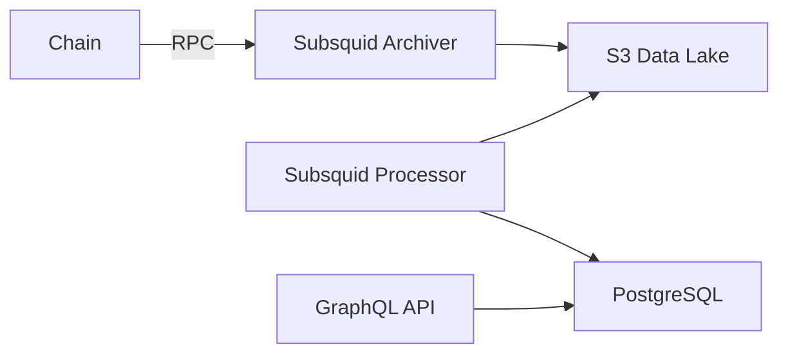
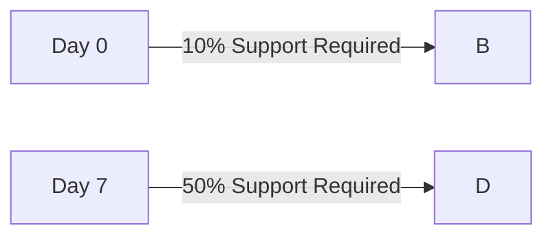

# Encyclopedia Galactica: Substrate Framework Overview


## Table of Contents


1. [Section 1: Introduction and Historical Genesis](#section-1-introduction-and-historical-genesis)

2. [Section 2: Foundational Architecture Principles](#section-2-foundational-architecture-principles)

3. [Section 3: Runtime Development Paradigm](#section-3-runtime-development-paradigm)

4. [Section 4: Consensus Engine Architecture](#section-4-consensus-engine-architecture)

5. [Section 5: Networking and Cross-Chain Capabilities](#section-5-networking-and-cross-chain-capabilities)

6. [Section 6: Cryptography and Security Model](#section-6-cryptography-and-security-model)

7. [Section 7: Tooling and Developer Ecosystem](#section-7-tooling-and-developer-ecosystem)

8. [Section 8: Governance and DAO Capabilities](#section-8-governance-and-dao-capabilities)

9. [Section 9: Real-World Implementations and Case Studies](#section-9-real-world-implementations-and-case-studies)

10. [Section 10: Future Trajectory and Critical Perspectives](#section-10-future-trajectory-and-critical-perspectives)


## Section 1: Introduction and Historical Genesis

The history of blockchain technology is punctuated by moments of profound conceptual leap, where accumulated frustration with existing limitations catalyzes a fundamental reimagining. The emergence of Substrate, a modular framework for constructing purpose-built blockchains, represents one such inflection point. Its genesis is inseparable from the turbulent adolescence of blockchain development, particularly the trials and triumphs witnessed on Ethereum, and the visionary ambition to transcend the inherent constraints of monolithic chain designs. To understand Substrate is to first grasp the technological landscape it sought to revolutionize and the specific pain points it was engineered to solve. This section chronicles that journey – from the frustrations of early blockchain builders to the crystallisation of a radical new paradigm at Parity Technologies, culminating in the tangible evolution of the Substrate framework itself.

### 1.1 The Pre-Substrate Blockchain Landscape

The decade following Bitcoin's 2009 debut was marked by explosive experimentation but also by the stark realities of technological limitations. Bitcoin, the progenitor, established the core tenets of decentralized consensus and censorship resistance through Proof-of-Work (PoW). However, its scripting language was deliberately constrained, prioritizing security and predictability over expressiveness. Building complex applications directly atop Bitcoin proved impractical, leading to cumbersome layer-2 solutions or sidechains, often introducing new trust assumptions or security compromises.

Ethereum's arrival in 2015, conceptualized by Vitalik Buterin and brought to life by a team including Dr. Gavin Wood (who authored the pivotal Yellow Paper defining the Ethereum Virtual Machine - EVM), promised a quantum leap. Its core innovation, the Turing-complete EVM, enabled arbitrary smart contract execution. This unleashed a Cambrian explosion of decentralized applications (dApps): decentralized finance (DeFi), non-fungible tokens (NFTs), decentralized autonomous organizations (DAOs), and more. Yet, this very success rapidly exposed systemic constraints within Ethereum's initial design:

1.  **The Scaling Trilemma Takes Center Stage:** Coined implicitly by Vitalik Buterin and explicitly explored by researchers, the trilemma posited that blockchains struggle to simultaneously achieve **Decentralization**, **Security**, and **Scalability**. Ethereum 1.0, prioritizing decentralization and security via global PoW consensus, suffered cripplingly low transaction throughput (often < 15 transactions per second - TPS) and prohibitively high gas fees during peak demand (famously exceeding $50 for simple swaps during the 2020/21 DeFi boom). Layer-2 solutions like Plasma and state channels emerged, but added complexity and often fragmented liquidity and composability.

2.  **EVM Constraints and Developer Friction:** While revolutionary, the EVM imposed significant burdens:

*   **Gas Cost Uncertainty:** Developers constantly wrestled with optimizing gas usage. Complex operations risked becoming prohibitively expensive or even failing mid-execution ("out of gas" errors), leading to poor user experiences and lost funds. Predicting gas costs accurately was notoriously difficult.

*   **Limited Abstraction & Upgradability:** Smart contracts were largely immutable once deployed. Upgrading required complex, error-prone proxy patterns, increasing attack surface. Building complex dApps often meant deploying numerous interacting contracts, amplifying deployment costs and gas inefficiencies.

*   **Language Limitations:** Solidity, the dominant language, introduced its own learning curve and quirks. Alternatives like Vyper offered different trade-offs but didn't fundamentally alter the EVM environment. Developers were forced to work within the EVM's specific computational model and storage constraints.

3.  **Governance Paralysis and Hard Fork Risks:** Upgrading the Ethereum protocol itself required contentious hard forks, demanding near-universal consensus among miners, node operators, and the community. The DAO hack of 2016 and the subsequent Ethereum/Ethereum Classic split laid bare the social and technical risks of this process. Even non-contentious upgrades were slow, cumbersome, and required coordinated action from all node operators, creating network-wide disruption.

4.  **One-Size-Fits-None Monolith:** The explosive diversity of dApps revealed that a single, global, general-purpose blockchain might not be optimal. A high-throughput gaming chain, a privacy-focused financial chain, and an enterprise supply chain solution have vastly different requirements regarding transaction speed, data storage, privacy models, consensus mechanisms, and governance. Forcing all onto one chain led to congestion, inefficiency, and compromise.

This landscape created palpable developer frustration. Building novel blockchain applications felt like trying to construct a skyscraper with only hand tools, constantly battling the limitations of the foundation rather than focusing on the architectural vision. The hunger for a better way – a framework that empowered developers to build bespoke blockchains tailored to specific needs, free from the trilemma's harshest constraints and the EVM's friction – was growing.

### 1.2 Parity Technologies: From Ethereum Client to Framework Vision

The crucible for Substrate was forged within **Parity Technologies**, a company deeply embedded in Ethereum's early history. Founded by Dr. Gavin Wood (Ethereum co-founder, Solidity inventor, and Yellow Paper author), Jutta Steiner, and others, Parity quickly made its mark by developing the **Parity Ethereum client**. Written in Rust, a language prized for performance, safety, and concurrency, Parity Ethereum became renowned for its speed, efficiency, and advanced features, rapidly gaining significant market share among node operators.

Parity's intimate involvement in Ethereum's infrastructure provided unparalleled insight into its strengths and, critically, its pain points:

*   **The Scaling Bottleneck:** Parity engineers were on the front lines, witnessing firsthand the network congestion and the limitations of trying to scale a single chain globally via Layer-2 patches or contentious hard forks (like the constant debates around increasing gas limits or implementing EIP-1559).

*   **The Hard Fork Hazard:** Participating in and implementing protocol upgrades highlighted the immense coordination challenges and risks of hard forks. The process was slow, disruptive, and vulnerable to community splits.

*   **Rust as a Foundation:** The positive experience building a high-performance, secure Ethereum client in Rust solidified the belief that Rust was an ideal language for critical blockchain infrastructure – offering memory safety, performance comparable to C++, and excellent concurrency support crucial for P2P networking.

*   **The Multisig Catastrophe (A Stark Lesson):** In November 2017, a critical vulnerability in Parity's multi-signature wallet library led to the accidental freezing of approximately 513,774 ETH (worth ~$150 million at the time). While not directly related to the client itself, this incident underscored the perils of smart contract immutability and upgradability challenges within the existing Ethereum model. It was a harsh, practical lesson in the need for safer, more manageable upgrade paths at *all* levels of the stack.

These experiences coalesced around a broader vision articulated by Dr. Gavin Wood: **Polkadot**. Unveiled in its whitepaper in late 2016, Polkadot proposed a heterogeneous, multi-chain network. Its core premise was radical: instead of one chain trying to do everything, enable many specialized chains (parachains) to run in parallel, secured by a central Relay Chain, and able to communicate trustlessly. This promised a solution to the scaling trilemma by parallelizing transaction processing and allowing chains to optimize for their specific use case.

However, building Polkadot required building *many* blockchains – the Relay Chain itself and the diverse parachains. The obvious question arose: *How do we efficiently build all these different, specialized chains?* Rebuilding the complex, low-level components (networking, consensus, storage) from scratch for each chain would be prohibitively time-consuming, error-prone, and inefficient. The experience building Parity Ethereum provided the foundation, but a higher-level abstraction was needed.

**The Framework Vision Emerged:** Instead of just building Polkadot, Parity realized the underlying technology stack – the tools and components needed to build *any* blockchain efficiently and robustly – was itself a revolutionary product. This stack needed to embody the lessons learned: modularity for specialization, seamless upgradability to avoid hard forks, and robust, secure foundations. This nascent stack, initially developed as the engine for Polkadot, would become **Substrate**. The vision was clear: create a "blockchain construction kit" that abstracted away the complexities of P2P networking, consensus algorithms, and storage, allowing developers to focus on their chain's unique business logic and state transitions.

### 1.3 Conceptual Birth of Substrate (2018)

2018 marked the formal birth of the Substrate project. It was conceived not merely as a toolkit for building Polkadot parachains, but as a **universal framework for constructing any type of blockchain**, independent of Polkadot. Its core thesis was audacious: democratize blockchain development by providing a modular, flexible, and upgradeable foundation. Key design goals crystallized early:

1.  **Modularity ("Lego Bricks"):** Break down the blockchain into discrete, reusable components (later termed "Pallets" for runtime logic). Developers should be able to select a consensus mechanism (PoW, PoS variants like BABE/GRANDPA, PoA), a networking layer, cryptographic primitives, and pre-built functionality modules (balances, staking, governance, smart contracts) like choosing Lego bricks, assembling only what their specific chain required. This stood in stark contrast to monolithic designs.

2.  **Forkless Upgrades:** Eliminate the need for disruptive hard forks. Inspired by the meta-protocol concept (treating the blockchain's core logic itself as mutable state), Substrate pioneered storing the blockchain's runtime logic (the state transition function) as a WebAssembly (Wasm) blob *on the chain itself*. Governance mechanisms (also built using Substrate's modules) could enact upgrades by simply storing a new Wasm blob. Nodes would automatically switch to executing the new logic at a predefined block, without requiring manual software updates or coordination. This promised unprecedented agility and reduced governance risk.

3.  **Light-Client First:** Prioritize efficient verification from the start. Substrate integrated the GRANDPA finality gadget (developed for Polkadot), enabling compact, verifiable proofs of finality. This wasn't just an afterthought for mobile wallets; it was foundational for enabling efficient trustless communication *between* chains (interoperability), a core tenet of the Polkadot vision and increasingly critical for the broader ecosystem.

4.  **Rust-Centric Development:** Leverage Rust's strengths for performance and safety. While the runtime logic compiled to Wasm could theoretically be written in any language (a future aspiration), the core framework and initial pallets were built in Rust, providing developers with a powerful and secure environment. The `#[no_std]` compatibility ensured runtime logic could compile to efficient, deterministic Wasm.

5.  **Sovereignty and Specialization:** Empower teams to build chains with true sovereignty – control over their own governance, economics, fee structures, and feature set – optimized for a specific purpose without being burdened by the constraints or politics of a general-purpose platform.

The initial proof-of-concept releases focused intensely on realizing these core pillars. The modular architecture separated the "Node" (networking, transaction pool, block authoring logic) from the "Runtime" (the state transition logic, compiled to Wasm). This separation was crucial for enabling forkless upgrades and runtime portability. The vision was compelling: imagine building a blockchain as easily as defining a state machine in Rust, plugging in pre-built modules for accounts, tokens, and governance, selecting a consensus model, and launching – all while knowing the chain could evolve seamlessly over time without forks.

### 1.4 Milestone Releases and Evolution

Substrate's journey from conceptual framework to robust production-ready software unfolded through a series of significant milestones, each marked by key technical advancements and refinements:

*   **PoC-1 (Proof-of-Concept 1 - Late 2018):** The first tangible manifestation demonstrated core concepts. It featured a basic runtime built from modules, compiled to Wasm, and executable within the node. Forkless upgrades were showcased, albeit in a rudimentary form. Networking used an early version of libp2p. Consensus was simplistic (e.g., manual seal for testing, basic Aura PoA). This PoC validated the core architecture but highlighted performance challenges, especially with Wasm interpretation overhead. It served as a crucial foundation for gathering developer feedback and attracting early adopters willing to experiment on the bleeding edge.

*   **Substrate 1.0 (Mid-2019):** Marked a major step towards stability and usability. Key advancements included:

*   **FRAME (Framework for Runtime Aggregation of Modularized Entities):** Introduced the structured pallet system, defining a standardized pattern for building runtime modules (Storage, Events, Errors, Dispatchable functions, Hooks). This provided the essential scaffolding for modular development.

*   **Sophisticated Consensus Integration:** Robust integration of production-grade consensus engines like GRANDPA for finality and BABE or Aura for block production became feasible.

*   **Enhanced Forkless Upgrades:** The upgrade mechanism became more robust, supported by governance pallets. The `set_code` extrinsic became the standard pathway for runtime evolution.

*   **Improved Tooling:** Early versions of the `substrate` command-line interface (CLI) and basic front-end templates emerged, lowering the barrier to entry. Documentation saw significant improvements.

*   **Polkadot Launchpad:** Substrate 1.0 became the foundation for building the first parachains and the Kusama network (Polkadot's "canary net"), proving its viability for complex, real-world networks beyond simple demos.

*   **Substrate 2.0 (2020):** Focused heavily on performance, developer experience (DX), and production hardening:

*   **Hybrid Runtime Execution:** Addressing the Wasm performance gap identified in PoC-1, Substrate 2.0 introduced a crucial innovation: a **native runtime** compiled for the node's specific architecture alongside the Wasm runtime. The node would execute the native runtime for optimal speed *if* its version matched the on-chain Wasm blob. If not (or for light clients), it would fall back to the Wasm interpreter. This hybrid model delivered near-native performance while preserving the critical forkless upgrade capability and light-client verifiability. It was a pragmatic and effective solution to the Wasm speed challenge.

*   **Off-Chain Workers:** Introduced a secure mechanism for runtime logic to delegate long-running or non-deterministic tasks (e.g., HTTP API calls, heavy computation) to dedicated off-chain worker threads, communicating results back to the chain via verified transactions. This dramatically expanded the potential use cases for on-chain logic.

*   **FRAME Improvements:** Pallet development became more ergonomic with macros and better abstractions. Standard pallets (Staking, Governance, Identity, Treasury) matured significantly.

*   **Weight System Formalization:** A more robust system for calculating and defining the computational resources ("weight") consumed by extrinsics (transactions) was implemented, crucial for accurate fee calculation and block production scheduling.

*   **Substrate 3.0 / Polkadot SDK (2021-Present):** Represented a major refactoring and branding evolution, signaling maturity and broader adoption beyond just Polkadot parachains:

*   **Polkadot SDK:** The Substrate framework, the Polkadot Runtime (built with Substrate), and the Cumulus parachain collation library were unified under the "Polkadot SDK" umbrella, clarifying the relationship and promoting Substrate as a standalone product.

*   **Pallets in their own Crates:** FRAME pallets were decoupled from the main Substrate repository (`substrate`/`polkadot-sdk`) and moved into their own individual Rust crates (`frame-system`, `frame-support`, `pallet-balances`, etc.). This improved modularity, versioning, and dependency management for developers.

*   **Continued DX Focus:** Significant enhancements to the CLI, improved error messages, better testing frameworks (`sp-io` for mocking), benchmarking tools for precise weight calculation, and richer front-end libraries (Polkadot-JS API enhancements, Substrate Connect).

*   **Advanced Features:** Introduction of Multi-Block Migration framework for safer complex storage upgrades, improved XCM (Cross-Consensus Messaging) support, and continuous optimization of networking and consensus components.

The evolution continues. Each release refines performance, security, and developer experience while introducing new capabilities (like Agile Coretime management). What began as the engine for Polkadot has demonstrably succeeded as a general-purpose blockchain framework, powering hundreds of diverse chains – public parachains, enterprise networks, DeFi hubs, gaming platforms, and identity systems – each benefiting from the core principles of modularity, forkless evolution, and sovereign specialization established at its inception.

Substrate emerged not merely as a new tool, but as a paradigm shift. It offered an escape hatch from the scaling trilemma's confines by enabling specialized chains, solved the governance paralysis of hard forks through meta-protocol innovation, and drastically lowered the barrier to sophisticated blockchain development. It transformed blockchain creation from a monumental feat of low-level engineering into a more accessible exercise in composing specialized logic on a robust, secure foundation. Having established this historical context and Substrate's core value propositions, we now turn to dissecting the foundational architectural principles that make this vision a concrete reality. The journey into Substrate's structural DNA begins with its core philosophy: modularity as the cornerstone of flexibility and innovation.


---


## Section 2: Foundational Architecture Principles

The historical genesis of Substrate reveals a potent reaction against the limitations of monolithic blockchain designs. Its emergence was predicated on a conviction: that the future lay not in a single, all-encompassing chain straining under the weight of diverse demands, but in a constellation of specialized chains. To enable this vision required more than incremental improvements; it demanded a fundamental re-architecting of how blockchains are conceived and constructed. Section 1 detailed the *why* – the frustrations and aspirations that birthed Substrate. This section delves into the *how*, deconstructing the core technical philosophy and high-level structural pillars that transform Substrate from a compelling vision into a robust, operational reality. At its heart lies a commitment to modularity, upgradability, verifiability, and leveraging battle-tested components – principles meticulously woven into the framework's DNA.

### 2.1 Modular Design: The "Lego Brick" Philosophy

Substrate’s most defining architectural tenet is its embrace of **modularity**. This is not merely a convenience but a fundamental philosophical stance: a blockchain is not an indivisible monolith, but a composition of distinct, loosely coupled subsystems, each responsible for a specific concern. This "Lego brick" philosophy empowers developers to assemble bespoke chains by selecting, customizing, and combining pre-fabricated components, rather than forging every piece anew from raw materials.

The primary separation of concerns manifests in three core layers:

1.  **The Networking Layer (`sc_network`):** Responsible for peer discovery, connection management, and the reliable propagation of transactions and blocks across the peer-to-peer (P2P) network. It handles the messy realities of internet communication – latency, unreliable connections, and adversarial peers. Crucially, this layer is abstracted away from the specific business logic of the chain, communicating primarily through defined APIs. Substrate leverages `libp2p` (discussed in detail in 2.4) as its default networking stack, providing a robust, modular foundation for this layer.

2.  **The Consensus Layer:** This layer encompasses the mechanisms by which network participants achieve agreement on the canonical state of the blockchain. It's further subdivided into:

*   **Block Production (Authorship):** Deciding *who* gets to create the next block (e.g., BABE's slot-based randomness, Aura's round-robin, manual seal for testing).

*   **Finality Gadget:** Providing unconditional, irreversible agreement on a specific block after a certain point (e.g., GRANDPA's GHOST-based voting on chains of blocks).

Substrate treats consensus as a *pluggable service*. The runtime (the state transition logic) defines *what* constitutes a valid state transition, but it delegates the *ordering* and *agreement* on the block sequence to the consensus engine(s) chosen by the chain builder. This separation is vital. It allows a chain to switch consensus mechanisms (e.g., from PoA to NPoS) without rewriting its core business logic, often achievable via a forkless upgrade. The runtime interacts with consensus through a well-defined **Consensus API**, exposing functions like `initialize_block`, `apply_extrinsic`, and `finalize_block`.

3.  **The Runtime:** The heart of the blockchain's logic. Executed within a sandboxed environment (primarily WebAssembly - Wasm), the runtime defines the state transition function. It answers the question: "Given the current state and a new block of transactions (extrinsics), what is the new state?" This includes:

*   **State Storage:** Managing the persistent data of the blockchain (accounts, balances, smart contract storage, governance proposals, etc.).

*   **Transaction Processing:** Validating and executing extrinsics (signed transactions, inherents like timestamps, unsigned transactions with validated origin).

*   **Business Logic:** Implementing the chain's unique rules – tokenomics, governance, DeFi protocols, identity management, etc.

**The Power of Pallets:** Substrate's modularity shines brightest within the runtime itself through **FRAME (Framework for Runtime Aggregation of Modularized Entities)** and its core unit: the **Pallet**. A pallet is an encapsulated, reusable module defining a specific piece of blockchain functionality and its associated state. Think of it as a specialized Lego brick for runtime logic.

*   **Standardized Structure:** Each pallet typically defines:

*   `Config`: A configuration trait specifying types and parameters the pallet needs (e.g., what type represents currency, the event type, hooks into other pallets).

*   `Storage`: Declarations of the data structures persisted on-chain (e.g., `StorageMap` for account balances, `StorageValue` for total issuance).

*   `Events`: Enumeration of events emitted by the pallet to notify off-chain systems of state changes (e.g., `Transfer { from, to, amount }`).

*   `Errors`: Enumeration of potential error conditions specific to the pallet's operations.

*   `Call`: Dispatchable functions (extrinsics) that users can invoke to trigger state changes (e.g., `transfer(origin, dest, value)`).

*   `Hooks`: Functions called at specific points in the block lifecycle (e.g., `on_initialize` at the start of a block, `on_finalize` at the end, `on_idle` if block space remains).

*   **Composition and Reuse:** The true power lies in composition. The `Balances` pallet manages accounts and fungible tokens. The `Staking` pallet handles validator nomination and rewards. The `Democracy` pallet enables on-chain referenda. A developer building a DeFi chain can `impl` the `Config` traits for these pallets, integrating them directly, and then focus their effort on building a custom `DEX` pallet for swap functionality. This drastically reduces boilerplate and leverages audited, battle-tested code for foundational components. The `frame_system` pallet provides the absolute core primitives (account IDs, block numbers, events, etc.) upon which all others depend.

*   **Example - A Simple Chain:** A minimal viable Substrate chain runtime might compose:

*   `frame_system`: Foundational system APIs and types.

*   `pallet_timestamp`: For on-chain time.

*   `pallet_balances`: For accounts and a native token.

*   `pallet_transaction_payment`: To handle transaction fees.

*   `pallet_sudo`: For initial admin control (often replaced by governance later).

This modular structure enables unparalleled specialization. A gaming chain might prioritize low-latency consensus and integrate a custom pallet for non-fungible in-game assets, while a supply chain solution might focus on integrating oracles (`pallet_offchain_worker`/`pallet_ocw`) and a sophisticated access control pallet, both built upon the same robust Substrate base layers.

### 2.2 Forkless Upgrades: The Meta-Protocol Approach

Traditional blockchain upgrades are synonymous with **hard forks**. Changing the core rules (the state transition function) requires every single node operator to manually download and run new software at a specific block height. This process is fraught with risk:

*   **Coordination Complexity:** Achieving near-universal adoption among globally distributed, often anonymous node operators is incredibly difficult.

*   **Network Fragmentation:** Nodes failing or refusing to upgrade results in chain splits (e.g., Ethereum/Ethereum Classic, Bitcoin/Bitcoin Cash), fracturing communities and value.

*   **Governance Paralysis:** The high stakes and disruptive nature make protocol evolution slow and contentious, stifling innovation.

*   **Security Risks:** Manual upgrades introduce potential points of failure during deployment and coordination.

Substrate's revolutionary answer is **forkless upgrades**, enabled by treating the runtime logic itself as mutable state governed by the chain's own rules – a **meta-protocol**.

**The Wasm Runtime Blob:** The core innovation is storing the entire runtime logic (the compiled WebAssembly binary representing the state transition function) *on the blockchain itself*. This Wasm blob resides in the chain's state storage, accessible to all nodes.

**The Upgrade Mechanism:** Changing the runtime logic doesn't require node operators to update their local software binaries. Instead, the chain's governance system (itself composed of Substrate pallets like `pallet_collective` and `pallet_democracy`) enacts a change by authoring and dispatching a special type of extrinsic – typically `sudo::sudo_call` (in early phases) or `frame_system::set_code` (the standard upgrade call). This extrinsic, when executed, *stores a new Wasm blob* in the chain's state.

**Execution at the Defined Block:** The upgrade is scheduled to take effect at a specific future block number. When the node producing that block initializes it, it checks the state for a new runtime Wasm blob scheduled for that block. If found:

1.  **Validation:** The new Wasm blob is rigorously validated against predefined criteria (e.g., version checks, cryptographic hashes).

2.  **Switching:** Upon successful validation, the node seamlessly switches execution to the new Wasm runtime for *that block and all subsequent blocks*.

3.  **Light Client Continuity:** Light clients, which only track block headers and relevant proofs, can seamlessly verify blocks produced by the new runtime because the logic defining valid state transitions is referenced *within the state they can prove*. The block header's `state_root` commits to the entire state, including the new Wasm blob.

**The Role of the `Core` Module (Execution Engine):** The node contains a component often referred to as the `Core` or the Wasm executor (e.g., `sc_executor_wasmtime`). This component is responsible for loading the on-chain Wasm blob and executing the runtime logic within a sandboxed environment. It provides the host functions that allow the Wasm runtime (e.g., FRAME) to interact with the outer node (storage, offchain workers, cryptography). Crucially, the `Core` itself *is* part of the node's binary and thus requires a traditional software update *only if the host interface changes*. This interface is designed to be extremely stable, meaning node software updates are infrequent compared to runtime upgrades.

**The Scheduler Pallet and Migrations:** Forkless upgrades are often orchestrated using the `pallet_scheduler`. Governance can schedule a dispatch (like `set_code`) to execute automatically at a future block. Furthermore, complex upgrades involving changes to the *structure* of storage (not just logic) require **storage migrations**. Substrate provides robust tooling (like the `StorageMigration` trait and `on_runtime_upgrade` hooks within pallets) allowing the *new runtime* to define and execute migration logic *the first time it runs*, safely transforming old storage structures into new ones. The **Multi-Block Migration (MBM)** framework, introduced later, allows splitting large migrations across multiple blocks to avoid exceeding block weight limits.

**Real-World Example: Kusama's Agility:** Kusama, Polkadot's canary network built with Substrate, exemplifies forkless upgrades. It has undergone dozens of runtime upgrades since launch, evolving from a basic proof-of-stake chain to a complex ecosystem supporting parachains, sophisticated governance (OpenGov), crowdloans, and advanced features like nomination pools. Most upgrades were enacted via on-chain governance votes (referenda), scheduled via the Scheduler, and executed seamlessly via `set_code` at the designated block. Node operators only needed to update their *node software* binaries a handful of times when low-level host function changes occurred, while the vast majority of protocol evolution happened forklessly via runtime Wasm upgrades. This agility is a stark contrast to the laborious hard fork processes endemic in earlier blockchain generations.

### 2.3 Light Client First Architecture

Early blockchain designs often treated light clients – resource-constrained devices like mobile phones or browsers that don't store the full chain history – as second-class citizens. Verification was cumbersome, requiring trust in centralized RPC servers or complex and inefficient Simplified Payment Verification (SPV) proofs. Substrate, however, embeds **light client friendliness** as a foundational design principle from the ground up. This is crucial not only for user accessibility but as an essential enabler for its core vision of seamless cross-chain interoperability.

**The Challenge of Trustless Verification:** A light client needs to answer critical questions without downloading the entire blockchain: Is this transaction included in a finalized block? Is the state claimed by this service (e.g., my account balance) correct according to the chain's rules? Doing this trustlessly requires cryptographic proofs.

**GRANDPA Finality Proofs:** Substrate integrates the **GRANDPA (GHOST-based Recursive ANcestor Deriving Prefix Agreement)** finality gadget. Unlike Nakamoto consensus (probabilistic finality), GRANDPA provides **provable, absolute finality** after a short period (typically a few blocks on Kusama/Polkadot). Crucially, GRANDPA finality comes with compact, verifiable **finality proofs**.

*   **How it Works:** Validators vote not on individual blocks, but on *chains* they perceive as best. GRANDPA uses a GHOST-like rule to converge on a finalized chain prefix. The set of signed votes justifying the finalization of a specific block can be assembled into a proof.

*   **Light Client Verification:** A light client needs only:

1.  The trusted genesis block header (or a later known-good, finalized header).

2.  The block header to verify.

3.  The GRANDPA justification (finality proof) for that header.

4.  The current authority set (validator set) and proof of its validity relative to the trusted header.

The light client cryptographically verifies the justification against the known authority set, proving that a supermajority of validators finalized that block. Once a block is finalized, its state root is immutable.

**State Proofs (Merkle-Patricia Trie):** Knowing a block is finalized is step one. Step two is verifying specific state information (e.g., an account balance). Substrate uses a Merkle-Patricia Trie (MPT) for its state storage. The root hash of this trie is committed to in the finalized block header.

*   **Merkle Proofs:** To prove the value of a specific storage key (e.g., an account), a full node can provide a Merkle proof – the sequence of hashes along the path from the root to the key's leaf node. The light client only needs the finalized header's state root and this compact proof. By recomputing the root hash using the provided proof and the claimed value, it can verify if the value matches the state root in the header. If it does, the value is proven to be part of the finalized state.

**Light Client Sync:** Substrate nodes support light client synchronization protocols. A light client doesn't download all blocks. Instead:

1.  It fetches and verifies the headers of finalized blocks using GRANDPA justifications.

2.  It requests and verifies specific state information using Merkle proofs as needed.

This process is highly efficient in terms of bandwidth and storage for the light client.

**Implications for Interoperability:** This capability is not just for user wallets. It is the bedrock of Substrate's interoperability story, particularly within the Polkadot ecosystem (parachains) and for bridges to external chains:

1.  **Parachain Verification by Relay Chain:** The Polkadot Relay Chain validators act as sophisticated light clients for each parachain. They only need the parachain block headers and associated proofs (state transition proofs - STPs, or erasure coded pieces) to verify the correctness of the parachain's state transitions, enabling shared security without Relay Chain validators running every parachain's full node.

2.  **Bridge Operation:** Trustless bridges (like Snowfork's Snowbridge to Ethereum) often rely on light clients running on both sides. A Substrate-based chain can host a light client of Ethereum (verifying Ethereum block headers and state proofs) to validate events (e.g., token locks) on Ethereum, and vice-versa. The efficiency and verifiability of Substrate's light client architecture make this feasible and secure. The `parachain` system pallet within the Polkadot Relay Chain runtime is essentially a sophisticated light client manager for all connected parachains.

By designing for efficient light client verification from inception – particularly through the integration of GRANDPA's compact finality proofs and a Merkle-based state trie – Substrate ensures that its chains are inherently accessible and primed for participation in a broader, interconnected multi-chain universe. Sovereignty doesn't imply isolation.

### 2.4 Libp2p Networking Integration

The networking layer is the unsung hero of any decentralized system, responsible for the chaotic task of connecting and maintaining communication between globally distributed nodes over an unreliable internet. Early blockchains often implemented bespoke P2P networking stacks (e.g., Bitcoin's, Ethereum's `devp2p`). While functional, these custom stacks represented significant development overhead, potential for unique vulnerabilities, and limited interoperability. Substrate took a different path: integrating **libp2p**, a modular, open-source P2P networking stack developed initially for IPFS (InterPlanetary File System) by Protocol Labs.

**The Rationale for Libp2p:** Parity's decision to adopt libp2p was driven by several compelling factors identified during their experience building Parity Ethereum and envisioning the Polkadot network:

1.  **Modularity and Flexibility:** Libp2p embodies the same "Lego brick" philosophy as Substrate. It decomposes networking into distinct, reusable components (modules):

*   **Transport:** How bytes move (TCP, WebSockets, WebRTC, QUIC, even Bluetooth). Multiple transports can be used simultaneously.

*   **Secure Channel:** Establishing encrypted connections (e.g., Noise, TLS 1.3).

*   **Peer Identity:** Cryptographic peer IDs (based on public keys).

*   **Peer Discovery:** Finding other peers (mDNS, Kademlia DHT, Bootstrap list).

*   **Content Routing:** Finding *content* (e.g., specific providers - often using Kademlia DHT).

*   **Messaging:** Sending data to peers (e.g., push, request/response, pub/sub).

This modularity allows Substrate chains to configure a networking stack tailored to their needs. A public permissionless chain might use TCP + Noise + Kademlia DHT + Gossipsub. A private consortium chain might rely solely on a static bootstrap list and WebSockets + TLS.

2.  **Maturity and Battle-Testing:** Libp2p benefits from extensive real-world deployment and hardening within the IPFS and Filecoin ecosystems. Leveraging this existing, robust stack saved Parity significant development time and reduced the risk of introducing novel networking vulnerabilities into Substrate.

3.  **Protocol Multiplexing:** Libp2p enables multiple logical protocols (e.g., block syncing, transaction propagation, GRANDPA votes, peer discovery) to operate concurrently over a single underlying connection. This improves efficiency and resource utilization compared to managing separate connections for each protocol.

4.  **Future-Proofing and Interoperability:** Libp2p is designed as a universal P2P stack. Using it makes Substrate-based chains inherently more interoperable, not just with other Substrate chains, but potentially with any other system using libp2p (like IPFS nodes or Filecoin miners). New transport protocols or security layers developed for libp2p automatically become potential options for Substrate chains.

5.  **Explicit Focus on NAT Traversal:** Libp2p incorporates sophisticated techniques for traversing Network Address Translators (NATs) and firewalls, a critical challenge for P2P networks operating on consumer internet connections.

**Key Libp2p Components in Action within Substrate:**

*   **Kademlia DHT (Kad) for Peer Discovery:** For public networks, Substrate primarily uses Kademlia for decentralized peer discovery. Nodes join the DHT and announce their peer IDs. Other nodes can query the DHT to find peers close to a specific target ID (often derived from their own ID or a topic). This allows nodes to dynamically discover peers without relying solely on centralized bootnodes (though bootnodes are still used for initial bootstrap). The `peerset` maintains a prioritized list of healthy peers based on discovery and connection success.

*   **Gossipsub for Block and Transaction Propagation:** Gossipsub is a scalable pub/sub (publish/subscribe) protocol designed for high-fanout messaging. In Substrate:

*   **Block Propagation:** When a node authors a new block, it publishes it to the "blocks" topic. Nodes subscribed to this topic receive the block via efficient epidemic-like propagation. Validators also use this for block distribution in BABE/Aura.

*   **Transaction Propagation:** Transactions are published to the "transactions" topic, propagating efficiently across the network to reach block producers.

*   **GRANDPA Vote Propagation:** GRANDPA vote messages are published on a dedicated topic for efficient dissemination among validators.

Gossipsub's meshing and grafting mechanisms ensure efficient and robust message delivery even in large, dynamic networks.

*   **Customizable Transports:** Substrate allows extensive configuration of the libp2p transport stack via the `NetworkConfiguration` struct in the node's service builder. Developers can specify:

*   List of bootnodes.

*   Listen addresses (multiaddrs) for each desired transport (e.g., `/ip4/0.0.0.0/tcp/30333`, `/ip4/0.0.0.0/udp/30333/quic-v1`).

*   Public address (if the node is behind NAT).

*   Connection timeouts and keep-alive settings.

*   Maximum number of peers.

*   Specific protocol enablement/disablement.

This flexibility allows a chain running on resource-constrained IoT devices to use a lightweight transport like UDP/QUIC, while a high-performance cloud node might prioritize TCP.

**Integration with Substrate's Architecture:** The libp2p networking stack runs within the outer node (`sc_network`). It communicates with the consensus layer (e.g., notifying about new blocks, propagating votes) and the transaction pool through defined interfaces (like the `NetworkWorker` and `ProtocolController`). The runtime itself is blissfully unaware of the underlying networking details, interacting solely through the abstractions provided by the `Core`/executor and the consensus API.

By embracing libp2p, Substrate avoided reinventing the complex wheel of P2P networking. It gained a modular, battle-tested, and rapidly evolving stack that provides robust connectivity out-of-the-box while offering the flexibility to adapt to diverse network environments and requirements – a crucial enabler for the framework's goal of supporting everything from global public blockchains to private enterprise networks. This foundation in modularity, forkless evolution, efficient verification, and robust networking sets the stage for the next layer of abstraction: the unique paradigm of runtime development within Substrate.

[Word Count: ~2,050]


---


## Section 3: Runtime Development Paradigm

The architectural foundations of Substrate – modular design, forkless upgrades, and verifiable light clients – coalesce most powerfully within its runtime development paradigm. Having established how Substrate structures its networking, consensus, and execution layers (Section 2), we now descend into the heart of the state machine: the runtime. This is where the unique logic of a blockchain is defined – its rules for value transfer, governance, identity, and custom application behavior. Substrate transforms this traditionally complex, low-level endeavor into a structured, high-level exercise in composing reusable components and defining state transitions. The result is a development experience unlike any other in the blockchain space, characterized by safety, flexibility, and unprecedented upgradeability. Understanding this paradigm is key to appreciating Substrate’s revolutionary impact on blockchain engineering.

### 3.1 FRAME: Framework for Runtime Aggregation

At the core of Substrate's runtime development lies **FRAME (Framework for Runtime Aggregation of Modularized Entities)**. FRAME is not merely a library; it’s a comprehensive methodology and toolkit for building blockchain runtimes as assemblages of discrete, interoperable modules called **Pallets**. If Substrate provides the chassis and engine, FRAME provides the standardized parts and assembly instructions for the vehicle's internal systems.

**Pallets as Encapsulated State Machines:** Each pallet is a self-contained unit managing a specific domain of the blockchain's state and logic. Conceptually, it's a mini state machine adhering to a rigorously defined structure:

1.  **`Config` (Configuration Trait):** The pallet's blueprint. This Rust `trait` defines the types and parameters the pallet needs to function within a specific runtime. It acts as the interface between the pallet and the broader runtime environment. For example:

*   `type RuntimeEvent`: The overarching event type used by the runtime (events are emitted by pallets to signal state changes).

*   `type Currency`: The currency type (usually pointing to the `Balances` pallet) for handling fees or payments.

*   `type WeightInfo`: Provides benchmarking data for the computational weight of the pallet's dispatchable functions.

*   Runtime-specific constants (e.g., `type MaxVoters` for a governance pallet).

Developers implement this trait for their runtime, "plugging in" the concrete types and values. This is the essence of composition – the `Balances` pallet's `Currency` type might be used by a `Staking` pallet for bond payments, and by a `Contracts` pallet for storage rent.

2.  **`Storage`:** Declarations of the data persisted on-chain. FRAME provides powerful, type-safe abstractions:

*   `StorageValue`: Stores a single instance of type `T` (e.g., total token supply).

*   `StorageMap`: A key-value map (e.g., `AccountId -> Balance` for account balances).

*   `StorageDoubleMap`: A map with two keys (e.g., `(OwnerId, AssetId) -> Balance` for multi-asset ownership).

*   `StorageNMap`: N-dimensional mapping for complex relationships.

These declarations automatically handle Merkle Patricia Trie integration, ensuring cryptographic commitment to the stored data. Crucially, storage items are namespaced by pallet, preventing collisions.

3.  **`Event`:** An enumeration (`enum`) defining the types of notifications this pallet can emit. Events are crucial for off-chain systems (like indexers, UIs, oracles) to react to on-chain state changes. Examples include `Transfer { from: AccountId, to: AccountId, amount: Balance }` in a `Balances` pallet or `Proposed { proposal_index: u32 }` in a `Democracy` pallet. Events are stored temporarily and can be queried by clients.

4.  **`Error`:** An enumeration defining the possible error conditions specific to this pallet's operations (e.g., `InsufficientBalance`, `DeadlineExpired`, `AlreadyVoted`). These provide clear, machine-readable failure reasons to users and frontends.

5.  **`Call` (Dispatchable Functions):** The public interface. This `enum` defines the transactions (extrinsics) users can submit to invoke the pallet's logic. Each variant corresponds to a function within the pallet's `Call` implementation. For example:

```rust

pub enum Call {

transfer { dest: T::AccountId, value: T::Balance },

set_balance { who: T::AccountId, new_free: T::Balance, new_reserved: T::Balance },

}

```

The `#[pallet::call]` macro associates the implementation logic with each variant. These functions are permissioned via origin checks (`ensure_signed(origin)?`, `ensure_root(origin)?`, etc.).

6.  **`Hooks`:** Functions triggered at specific points in the block lifecycle, allowing pallets to run logic automatically:

*   `fn on_initialize(_block: BlockNumber)`: Executed at the very beginning of block processing. Often used for scheduled tasks (via `pallet_scheduler`) or epoch transitions.

*   `fn on_finalize(_block: BlockNumber)`: Executed at the very end of block processing, after all extrinsics. Ideal for finalizing state or calculating rewards.

*   `fn on_idle(_block: BlockNumber, _remaining_weight: Weight)`: Executed if block weight remains after processing all extrinsics and `on_finalize`. Allows utilizing spare computation.

*   `fn offchain_worker(_block: BlockNumber)`: Triggers an offchain worker task (see 3.2).

*   `fn integrity_test()`: Runs integrity checks during compilation (e.g., verifying benchmark coverage).

**Runtime Composition: The Art of Assembly:** Building a runtime with FRAME involves selecting the necessary pallets and composing them via their `Config` traits. The `construct_runtime!` macro is the central orchestrator:

```rust

construct_runtime!(

pub enum Runtime where

Block = Block,

NodeBlock = opaque::Block,

UncheckedExtrinsic = UncheckedExtrinsic

{

System: frame_system,

Timestamp: pallet_timestamp,

Balances: pallet_balances,

TransactionPayment: pallet_transaction_payment,

Sudo: pallet_sudo, // Initial admin control

// Custom Pallets:

MyDeFiPallet: pallet_my_defi,

// ORML for Cross-Chain Assets:

Tokens: orml_tokens,

}

);

```

This macro:

1.  Lists all pallets included in the runtime.

2.  Associates a unique runtime name (`System`, `Balances`, etc.) with the pallet's Rust type.

3.  Generates the necessary boilerplate code for runtime APIs, metadata, and integrating the pallets into a cohesive state machine.

4.  Enforces that each pallet's `Config` trait is implemented within the runtime's `impl` block.

**Case Study: ORML - Open Runtime Module Library:** FRAME's power extends beyond the core Substrate repository. **ORML** exemplifies the ecosystem's modularity, providing a suite of community-developed, audited pallets specifically designed for cross-chain DeFi and asset management. Key components include:

*   `orml_tokens`: A sophisticated multi-currency pallet supporting fungible tokens. Unlike `pallet_balances` (native token only), it manages arbitrary assets identified by `CurrencyId`. It integrates seamlessly with XCM for cross-chain asset transfers. A parachain like Acala uses `orml_tokens` to manage its stablecoin (aUSD) and bridged assets (like DOT or Bitcoin-represented tokens).

*   `orml_vesting`: Implements token vesting schedules (linear, cliff-based).

*   `orml_oracle`: A generic framework for integrating price feeds from multiple sources (like Chainlink pallet or custom oracles).

*   `orml_xtokens`: Handles the complexities of XCM message construction and fee payment for cross-chain token transfers.

Using ORML, a developer building a DeFi chain can rapidly integrate cross-chain asset support without reinventing complex logic, focusing instead on unique features like their automated market maker (AMM) design or lending algorithms. The `orml_tokens` pallet's `Config` trait would be implemented, specifying the `CurrencyId` type (e.g., an `enum` representing DOT, BTC, aUSD) and linking it to the chain's governance and XCM handling mechanisms. This compositionality is the hallmark of FRAME development.

### 3.2 Wasm Meta-Protocol Deep Dive

The concept of storing the runtime as a WebAssembly (Wasm) blob on-chain (introduced in Section 2.2) is the linchpin of forkless upgrades. Let's dissect the mechanics and implications of this meta-protocol approach.

**Runtime Versioning & On-Chain Wasm:** The active runtime logic exists in two primary forms within a Substrate node:

1.  **Native Runtime:** A Rust binary compiled specifically for the node's CPU architecture (x86_64, ARM, etc.). This offers optimal performance.

2.  **Wasm Runtime:** The same logic compiled into a Wasm binary. This blob is stored *on the blockchain state* itself, typically under a well-known storage key like `:code`.

Critical metadata accompanies this blob:

*   **`spec_version`:** A monotonically increasing integer. Incremented for every runtime upgrade that changes the logic (i.e., alters the state transition function). This is the primary identifier for compatibility.

*   **`impl_version`:** A version number for the *implementation* of the runtime logic. Can change for non-logic-altering fixes (e.g., comment changes, refactoring) without requiring a `spec_version` bump. Rarely used in practice.

*   **`authoring_version`:** Relevant for consensus. Ensures block authors (validators) are using a runtime version compatible with the block production logic. Incremented if changes affect block authoring (e.g., inherent data handling).

*   **`State Version` (V1/V0):** Indicates the serialization format for storage items. V1 is the current standard.

This metadata (often accessed via `state_getRuntimeVersion` RPC) is crucial for nodes and tools to understand compatibility and behavior. When a forkless upgrade occurs via `set_code`, the new Wasm blob and its associated metadata are stored on-chain.

**Execution Environments: The Native-Wasm Hybrid:** Substrate employs a sophisticated hybrid execution model to balance performance with the critical requirements of forkless upgrades and light-client verifiability:

1.  **Native Execution (The Fast Path):** If the node's *native* runtime binary has the *exact same `spec_name` and `spec_version`* as the on-chain Wasm blob, the node will execute transactions using the highly optimized native code. This provides near-optimal performance.

2.  **Wasm Execution (The Universal Path):** If the native version doesn't match the on-chain Wasm `spec_version` (which happens immediately after an upgrade until the node operator updates their binary), or if the caller is a light client (which *must* verify using the on-chain logic), the node executes the Wasm blob. This is done using a Wasm interpreter (like `wasmtime` or `wasmi`) embedded within the node (`sc_executor`). Wasm execution is significantly slower than native – benchmarks often show a 10x-20x performance penalty in early Substrate versions, though optimizations in runtimes and executors have narrowed this gap considerably.

**Performance Tradeoffs and Optimization:** The Wasm performance gap was a major focus of Substrate 2.0. Strategies to mitigate it include:

*   **Hybrid Model:** Maximizing native execution time minimizes the performance impact for most nodes after they upgrade their binaries.

*   **Wasm Compiler Optimizations:** Using optimizing Wasm compilers (like `wasm-opt`) on the runtime Wasm blob before deployment. The `substrate-wasm-builder` helper automates this.

*   **Efficient Host Functions:** The interface between the Wasm runtime and the host node (providing access to storage, crypto, etc.) is designed for minimal overhead. Functions like `ext_storage_get` or `ext_ed25519_verify` are implemented natively in the host.

*   **Determinism:** Wasm execution must be perfectly deterministic. This precludes using just-in-time (JIT) compilation in most security-critical contexts, favoring interpreters or ahead-of-time (AAT) compiled Wasm. Projects like `wasmer` (with its Singlepass compiler) offer faster deterministic execution, potentially narrowing the gap further.

*   **Benchmarking:** Precise weight calculation via `frame_benchmarking` ensures blocks aren't filled with transactions that take too long to execute in Wasm, preventing network stalling during the critical period between an upgrade and node binary updates.

**The Wasm Meta-Protocol's Power:** This architecture delivers profound benefits:

*   **True Forkless Upgrades:** The defining feature, enabling seamless protocol evolution.

*   **Runtime Portability:** The same Wasm blob can execute identically on any Substrate node, regardless of CPU architecture (x86, ARM, RISC-V).

*   **Light Client Verifiability:** Light clients only need the Wasm blob and block data to cryptographically verify state transitions, without trusting full nodes.

*   **Security Sandboxing:** Wasm provides a memory-safe, sandboxed execution environment for the runtime logic, adding a layer of protection against certain classes of exploits (though the host functions and storage I/O remain critical security surfaces).

The Wasm meta-protocol transforms the runtime from immutable firmware into dynamically updatable software managed by the chain's own governance – a revolutionary leap in blockchain adaptability.

### 3.3 Storage Abstraction Layer

The runtime defines the state transition logic, but this state must be persistently stored and efficiently verifiable. Substrate's storage abstraction layer provides a powerful, secure, and developer-friendly interface for managing on-chain data, built upon cryptographic commitments essential for light clients.

**Trie-Backed Storage & Merkle Proofs:** At its foundation, Substrate uses a modified **Merkle Patricia Trie (MPT)**, often referred to as a Patricia Merkle Tree, for state storage.

1.  **Structure:** All key-value pairs (defined by pallet storage items) are organized into a single, cryptographically authenticated trie structure. The root hash of this trie (the `state_root`) is included in every block header.

2.  **Commitment:** The `state_root` is a succinct cryptographic commitment to the *entire state* of the blockchain at that block. Tampering with any state value would invalidate the root hash.

3.  **Merkle Proofs:** For any specific storage key (e.g., `Balances::FreeBalance`), a **Merkle proof** can be generated. This proof consists of the minimal set of hashes (nodes along the path from the root to the key's leaf node) needed to cryptographically verify that the key-value pair is included in the state associated with a given `state_root`. This is fundamental for light clients (Section 2.3) and cross-chain verification (XCM, bridges).

**Storage Primitives: Safety and Efficiency:** FRAME provides high-level, type-safe storage abstractions that shield developers from the low-level trie mechanics:

1.  **`StorageValue`:** Stores a single value of type `T`. Best for singleton global settings (e.g., `Sudo::Key` for the admin account). Accessed via `get()` and mutated via `put()` or `mutate()`.

2.  **`StorageMap`:** A key-value mapping. Ideal for storing data per account (e.g., `Balances::FreeBalance`) or per entity ID. Offers efficient lookup by key (`get(k)`) but **iteration over all keys is O(n) and potentially expensive**. Requires careful consideration for large datasets.

3.  **`StorageDoubleMap`:** A two-key mapping. Perfect for relationships like `(Owner, AssetID) -> Balance`. Offers efficient lookup by full key (`get(k1, k2)`). Crucially, it enables **efficient iteration over the second key `K2` for a fixed `K1`** (e.g., "list all assets owned by Alice"). This is achieved by structuring the underlying trie storage keys as `concat(hasher1(k1), hasher2(k2))`, allowing efficient prefix scans for `k1`. This design is far more efficient than simulating a double map with a single map using tuple keys if iteration over secondary keys is needed.

4.  **`StorageNMap`:** Generalizes to N keys, offering efficient iteration prefixes for any leading subset of keys. Provides maximum flexibility for complex data models.

5.  **`CountedStorageMap`/`CountedStorageDoubleMap`:** Variants that automatically maintain a counter of the number of items, useful for bounded storage or quotas without expensive full iteration.

**Optimization Strategies:** Poorly designed storage can cripple chain performance and increase costs. Key strategies include:

*   **Avoid Unbounded Iteration:** Never iterate over large `StorageMap`s in a single extrinsic. This can exceed block weight limits and stall the chain. Use pagination, explicit removal mechanisms, or offchain workers for large cleanup tasks. The infamous "storage DoS" vulnerabilities in early Ethereum contracts stemmed from similar issues.

*   **Leverage DoubleMap/NMap for Efficient Queries:** Structure data to leverage the iteration capabilities of `DoubleMap`/`NMap`. If frequently querying "all items related to X", make `X` the first key (`K1`).

*   **Use Bounded Types:** Where possible, use types with known maximum sizes (e.g., `BoundedVec` instead of `Vec`) to prevent storage attacks filling up state.

*   **Benchmark Storage Operations:** Use `frame_benchmarking` to measure the actual weight (computational + storage I/O cost) of storage reads and writes within extrinsics. This informs accurate fee calculation and prevents weight underestimation.

*   **Cleaning Up:** Implement logic to remove stale data (e.g., expired proposals, old identities) to prevent indefinite state bloat. The `on_idle` hook or scheduled tasks via `pallet_scheduler` are useful mechanisms.

**Example - Efficient Voting Registry:** Consider a pallet for organization voting. A naive approach might use a single `StorageMap`. Listing all votes for a proposal would require iterating the entire map – O(n) cost. A better design uses a `StorageDoubleMap`. To get all votes for `proposal_42`, iterate over `DoubleMap::iter_prefix(proposal_42)`, which is efficient (O(number of votes for that proposal)). Adding a vote only affects the specific `(proposal_id, voter_id)` entry. This structure aligns with access patterns and leverages the double map's optimized prefix iteration.

The storage layer, underpinned by the Merkle trie and abstracted through FRAME's safe interfaces, provides the persistent, verifiable foundation upon which the runtime's state machine logic operates, while demanding careful design for efficiency and scalability.

### 3.4 Safe Runtime Upgrades in Practice

Forkless upgrades via Wasm are revolutionary, but changing logic often necessitates changes to the *structure* of the underlying storage. Simply deploying new code that expects different storage layouts would lead to catastrophic errors. Substrate provides a robust toolkit for managing **storage migrations** safely and predictably.

**The Need for Migrations:** Imagine upgrading a pallet where:

*   A `StorageValue` named `ItemCount` is renamed to `TotalItems`.

*   A `StorageMap` named `OldBalances` needs its data moved to a new `StorageMap` named `NewBalances` with a different hasher.

*   A new field is added to a struct stored in a `StorageValue`.

The new runtime expects data in the new format. Migrations transform the existing storage from the old schema to the new one compatible with the upgraded logic.

**Migration Hooks: `on_runtime_upgrade`:** The primary mechanism is the `#[pallet::hooks]` trait's `fn on_runtime_upgrade() -> Weight` method. Within a pallet's implementation, you can override this function:

```rust

#[pallet::hooks]

impl Hooks> for Pallet {

fn on_runtime_upgrade() -> Weight {

// 1. Check if migration is needed (e.g., check storage version)

if StorageVersion::get::>() ();

// 3. Update storage version

StorageVersion::new(Releases::V2).put::>();

// 4. Return the weight consumed (critical!)

weight_consumed

} else {

Weight::zero()

}

}

}

```

**Versioned Storage Patterns:** Managing migration state is crucial:

*   **`StorageVersion` (or `PalletVersion`):** A storage item *within the pallet* recording the last version its data was migrated to (e.g., `Releases::V1`, `Releases::V2`). The `on_runtime_upgrade` function checks this version against the current expected version in the code to determine if migration is needed.

*   **`#[pallet::storage_version]` Macro:** Declares the current version of the pallet's storage schema expected by *this compiled code*. This constant is compared against the on-chain `StorageVersion` during `on_runtime_upgrade`.

*   **`#[pallet::type_value]` for Defaults:** Provides default values for new storage items added in an upgrade, ensuring they exist before the new logic accesses them.

**Migration Best Practices:**

1.  **Idempotency:** Migration code must be safe to run multiple times without corrupting data. Checks using `StorageVersion` prevent re-running on already migrated data.

2.  **Weight Calculation:** Migrations execute within a block. The `on_runtime_upgrade` function **must** return an accurate `Weight` reflecting the computational and storage I/O resources consumed. Underestimating can cause the block to exceed its weight limit, potentially stalling the chain. **Benchmarking migrations is essential.** Use `frame_benchmarking` or calculate based on known operation costs (reads/writes).

3.  **Test Rigorously:** Test migrations extensively on a testnet or local node with a snapshot of the *real* state before the upgrade. Unit tests specifically for migration logic are vital.

4.  **Multi-Block Migrations (MBM):** For massive state transformations that would exceed a single block's weight limit, Substrate introduced the **Multi-Block Migration framework** (e.g., `pallet_migrations`). This allows splitting a migration into chunks processed over multiple blocks. The migration logic implements the `Migration` trait, and the scheduler pallet manages its execution across blocks, ensuring progress without blocking the chain. Kusama's migration to 9320-weight-v2 (involving significant staking ledger changes) utilized MBM.

5.  **Pre-Upgrade Checks:** The `pre_upgrade` hook can run checks *before* the upgrade (on the old runtime) to sanity-check state or generate data needed for the migration. Its output can be stored temporarily.

**Real-World Example: Kusama's Runtime 1000 (Parachains Enablement):** Kusama's upgrade to runtime version 1000 (circa June 2021) was a landmark event, activating parachain functionality. This complex upgrade involved:

1.  **Multiple Pallet Upgrades:** Changes to core pallets like `Staking`, `Session`, `Scheduler`, and `Utility`.

2.  **New Pallets:** Introduction of parachain-related pallets (`Parachains`, `ParasShared`, `Hrmp`, `Ump`).

3.  **Complex State Migrations:** Transforming existing state structures to accommodate parachain logic (e.g., migrating validator sets, setting up new storage for parachain state).

4.  **Careful Weight Management:** Extensive benchmarking ensured migration steps fit within block weights or utilized proper scheduling.

5.  **Forkless Execution:** The upgrade was enacted via governance referendum. The new Wasm blob was stored on-chain via `set_code`. At block 6,728,000, nodes seamlessly switched to the new runtime, executing the necessary migrations within the block. Validators and nominators experienced no downtime; block production continued uninterrupted. This upgrade, transforming Kusama's fundamental capabilities, occurred without a single node operator needing to manually intervene to restart or reconfigure their node software – a stark contrast to the coordinated chaos of traditional hard forks. Subsequent upgrades, like the monumental shift to OpenGov (v0.9.26 runtime), further demonstrated the system's capacity for radical, forkless evolution involving complex state migrations and entirely new governance mechanics.

Substrate's runtime development paradigm, centered on FRAME's composable pallets, the Wasm meta-protocol, a verifiable storage layer, and robust upgrade tooling, empowers developers to build sophisticated, adaptable blockchains with unprecedented speed and safety. The focus shifts from wrestling with low-level infrastructure to defining specialized business logic and composing proven components. This paradigm doesn't just make blockchain development easier; it fundamentally alters what is possible, enabling chains to evolve as dynamically as the applications they support. As we have seen, the runtime is the engine of state transition. In the next section, we examine the critical systems that order and agree upon those transitions: Substrate's pluggable consensus engine architecture.

[Word Count: ~2,020]


---


## Section 4: Consensus Engine Architecture

The runtime development paradigm explored in Section 3 reveals how Substrate empowers developers to define sophisticated state transition logic. Yet this logic remains inert without mechanisms to achieve decentralized agreement on transaction ordering and state validity. This critical function – the heartbeat of any blockchain – is managed by Substrate's *pluggable consensus engine architecture*. Having examined how state transitions occur, we now dissect the systems that orchestrate global agreement on *which* transitions occur and in *what sequence*. Substrate's revolutionary approach treats consensus not as an immutable monolith, but as a modular component that can be selected, configured, and even upgraded to suit a chain's specific security, latency, and decentralization requirements. This flexibility enables everything from high-throughput public networks to streamlined enterprise systems, all built upon a shared foundational framework.

### 4.1 BABE vs. Aura: Block Production Mechanics

Block production – the process of proposing new blocks containing batches of transactions – is the first critical phase of consensus. Substrate offers distinct engines optimized for different environments. **BABE (Blind Assignment for Blockchain Extension)** and **Aura (Authority Round)** represent the primary production engines for public and permissioned networks respectively, embodying fundamentally different approaches to leader selection and block creation.

**BABE: Randomized Slot-Based Production (Public Networks):** Designed for open, permissionless networks like Polkadot and Kusama, BABE employs cryptographic randomness to unpredictably assign block production slots to validators. This Sybil resistance mechanism ensures that an adversary cannot predict or monopolize block creation opportunities.

*   **Slot-Based Epochs:** Time is divided into fixed-length **slots** (e.g., 6 seconds on Polkadot). Slots are grouped into **epochs** (e.g., 1 hour on Polkadot = 600 slots). At the start of each epoch, a **randomness beacon** (a verifiable random value) is generated.

*   **VRF-Based Slot Assignment:** The core innovation is the use of **Verifiable Random Functions (VRFs)**. Each validator possesses a private key. For each slot in the upcoming epoch:

1.  The validator computes `VRF_output = VRF_sk(slot_number || randomness_beacon)`.

2.  The `VRF_output` includes a pseudorandom value and a cryptographic proof.

3.  This output is compared against a dynamically adjusted **threshold** derived from the validator's stake weight relative to the total active stake. If `VRF_output < threshold`, the validator is the **slot leader** for that specific slot.

*   **Verifiable Leadership:** When a validator believes it is the slot leader, it authors a block. Crucially, it includes the VRF proof in the block header. Other validators can instantly verify the proof using the validator's public key, the known slot number, and the epoch's randomness beacon. This proves the validator was legitimately assigned to produce the block without requiring prior communication or complex consensus rounds.

*   **Adaptive Thresholds & Multiple Leaders:** The threshold adjusts per validator based on their stake, ensuring higher-staked validators have proportionally higher chances of selection. Due to randomness, multiple validators might qualify for a single slot (creating competing blocks), or a slot might have no leader. BABE handles this:

*   **Primary Slots:** Designated slots where a block *must* be produced if at least one leader exists. Leaders use a "primary" VRF threshold.

*   **Secondary Slots:** Backup slots allowing *any* validator (even non-leaders) to produce a block if the primary slot was empty, using a more lenient "secondary" threshold. This prevents liveness failures but requires careful tuning to avoid excessive forks. Secondary blocks include a secondary VRF proof.

*   **Epoch Randomness: Chain-Pulling RANDAO:** The randomness beacon for epoch `N+1` isn't predictable in advance. It's generated by hashing together the VRF outputs from block producers in epoch `N` (a technique inspired by RANDAO). This ensures unpredictability and bias-resistance, as compromising future randomness requires controlling *all* block production in the current epoch.

**Aura: Round-Robin Production (Permissioned Networks):** Designed for controlled environments like consortium chains or testnets, Aura uses a simple, deterministic round-robin approach among a known, fixed set of authorities.

*   **Fixed Authority Set:** A predefined list of authorized block producers (authorities) is configured at genesis or modified via governance (e.g., via a `pallet_collective` decision).

*   **Sequential Slot Assignment:** Slots are assigned sequentially to authorities in a repeating cycle. For slot `S`, the leader is `authorities[S mod N]`, where `N` is the number of authorities.

*   **Predictability & Efficiency:** Leadership is perfectly predictable and rotates evenly. This eliminates the computational overhead of VRFs and the potential for empty slots or forks (if authorities are honest and online). Block production is extremely efficient and low-latency.

*   **Liveness Assumption:** Aura requires at least 51% of authorities to be honest and online. An offline authority simply misses its slot, causing a delay until the next authority in rotation produces a block. There are no secondary proposers.

*   **Use Case: Speed and Simplicity:** Aura shines in private or consortium settings where participants are known and trusted (e.g., supply chain partners, interbank settlement). The Enterprise Ethereum Alliance's (EEA) baseline protocol often utilizes Aura-based chains for its simplicity and performance. The Rococo testnet (Polkadot's parachain test environment) initially used Aura for rapid iteration before migrating to BABE for Polkadot-like testing.

**Comparative Analysis: When to Choose Which?**

| Feature               | BABE                                      | Aura                                      |

|-----------------------|-------------------------------------------|-------------------------------------------|

| **Environment**       | Permissionless (Public)                   | Permissioned (Private/Consortium)         |

| **Leader Selection**  | Random (VRF + Stake Weight)               | Deterministic Round-Robin                 |

| **Sybil Resistance**  | Economic (Stake-Based)                    | Identity-Based (Pre-Approved Authorities) |

| **Predictability**    | Unpredictable Leaders                     | Perfectly Predictable Rotation            |

| **Liveness**          | Tolerates Offline Validators (Secondaries)| Delayed if Authority Offline              |

| **Forks**             | Possible (Multiple Leaders/Slots)         | Rare (Only on Network Partition)          |

| **Overhead**          | VRF Computation, Beacon Management        | Minimal Computational Overhead            |

| **Latency**           | Higher (Slot-Based Randomness)            | Lower (Deterministic Rotation)            |

| **Primary Use Case**  | Polkadot, Kusama, Public DeFi Chains      | Supply Chain, CBDCs, Internal Testnets    |

**Real-World Example: Kusama's BABE in Action:** During the infamous "Kusama chain halt" incident (June 2022), a bug in the dispute resolution system for parachain backing caused validators to stop producing blocks entirely. This demonstrated BABE's liveness guarantee: when the primary block production mechanism fails (due to consensus logic bugs, not validator faults), the chain halts rather than producing invalid blocks. The resolution required a coordinated governance-driven runtime upgrade (enacted forklessly) to fix the logic and resume block production – showcasing the interplay between consensus safety, governance, and Substrate's upgrade mechanism.

### 4.2 GRANDPA Finality Gadget

While BABE or Aura ensure new blocks are proposed regularly, they only provide **probabilistic finality** – the possibility that a block could be reverted if a longer competing chain emerges. For irreversible settlement (e.g., high-value transactions, cross-chain communication), **absolute finality** is essential. Substrate integrates **GRANDPA (GHOST-based Recursive ANcestor Deriving Prefix Agreement)**, a finality gadget inspired by Casper FFG but uniquely optimized for flexibility and interoperability within the Polkadot ecosystem.

**GHOST-Inspired Chain Voting:** Unlike algorithms voting on individual blocks, GRANDPA validators vote on *chains*. They express which chain they believe is the "best" (typically the longest chain with the most primary blocks) by signing a **vote message** containing:

*   The hash of the **highest block** they consider finalized (their "prevote").

*   The hash of the **best block** they have seen (their "precommit" target).

**Voting Rounds and Finalization:** GRANDPA operates in asynchronous voting rounds:

1.  **Proposal & Prevote:** A primary voter (rotating per round) proposes a target block number for the round. Validators broadcast prevotes for the highest block they believe can be finalized *in this round*. A prevote for block `N` implicitly prevotes for all ancestors of `N`.

2.  **Precommit & Finalization:** Validators observe the prevotes. Once a **supermajority** (typically 2/3 by stake weight) of prevotes are observed for blocks descended from a common ancestor block `B`, validators broadcast precommits for block `B`. Once a supermajority of precommits for `B` are collected, block `B` and all its ancestors are considered **finalized**.

3.  **Pipelining:** Multiple rounds can run concurrently. While round `R` is finalizing block `B`, round `R+1` might already be prevoting for a descendant block `B+x`.

**Key Innovations and Tradeoffs:**

*   **Finality Across Long Ranges:** GRANDPA can finalize blocks in large batches. If validators see a long, uncontested chain extension, they can jump their votes directly to the head of that chain, finalizing hundreds of blocks in a single round. This amortizes the voting overhead, significantly improving throughput compared to per-block finality gadgets. Polkadot regularly finalizes blocks in batches of 10-30.

*   **Asynchronous Safety:** GRANDPA provides safety (honest validators never finalize conflicting blocks) even under temporary network partitions (asynchrony), as long as less than 1/3 of the total stake is malicious. This is critical for global networks.

*   **Latency vs. Security:** The tradeoff is latency. While BABE produces blocks every 6 seconds, finality via GRANDPA takes longer – typically 12-60 seconds on Polkadot/Kusama depending on network conditions and batch size. This latency is the price paid for unconditional, irreversible settlement.

*   **Compact Finality Proofs:** The aggregated signatures from the supermajority precommit for a finalized block form a **GRANDPA justification**. This proof is compact (relative to the number of validators) and can be efficiently verified by light clients or other chains (see Section 2.3). The entire security of finality rests on the cryptographic validity of this proof and the known validator set.

*   **Fork Choice Rule:** The GRANDPA finality overlay simplifies the fork choice rule for non-finalized blocks. Nodes simply build upon the longest chain *from the last finalized block*. This "GRANDPA-aware GHOST" rule reduces ambiguity and speeds up chain convergence after network splits.

**Example: Kusama's Turbulent Finality:** Kusama's role as a "canary net" often exposes GRANDPA to stress. During periods of extreme network instability or validator misconfiguration (e.g., August 2021), GRANDPA finality stalled for several hours. However, the *safety* property held: no conflicting blocks were finalized. The chain continued producing blocks (BABE kept working), but users had to wait for finality to settle high-value transactions. Resolution involved diagnosing offline validators and tuning network parameters, demonstrating GRANDPA's resilience under stress and its clear separation of liveness (BABE) from safety.

### 4.3 NPoS (Nominated Proof-of-Stake) Economics

Sybil resistance in public BABE/GRANDPA networks is achieved economically via **Nominated Proof-of-Stake (NPoS)**. This sophisticated staking model, pioneered by Polkadot, goes beyond simple delegation to optimize for security, decentralization, and fair representation.

**Core Roles:**

1.  **Validators:** Run nodes that produce blocks (BABE), participate in finality (GRANDPA), and validate parachain blocks (in Polkadot). They put their own stake at risk (self-bond) and receive staking rewards. They require high-performance infrastructure and constant uptime.

2.  **Nominators:** Token holders who contribute to network security by "backing" validators with their stake. They select up to 16 trusted validators. Nominators share in rewards but also face slashing penalties if their chosen validators misbehave. They can participate with minimal technical expertise.

**The Election Mechanism: Phragmén's Method:** Assigning nominators' stake to validators isn't trivial. A naive "choose one" approach could lead to stake concentration. NPoS uses an **election algorithm** based on **Phragmén's method** (or sequential Phragmén) to achieve:

1.  **Fair Representation:** Distribute nominator stake *as evenly as possible* among elected validators.

2.  **Maximize Total Stake Backing:** Elect the set of validators that has the highest total stake backing it, maximizing the cost to attack the network.

3.  **Minimize Variance:** Ensure each elected validator has roughly similar total stake backing them, preventing centralization around a few "super validators."

The algorithm runs off-chain (e.g., in a nominator's wallet or a dedicated election provider) before each new era (~24 hours on Polkadot). It solves a complex optimization problem to assign nominators' stake fractions optimally across their chosen validators, aiming for the above goals. The result is a validator set (e.g., 297 on Polkadot) and the precise stake allocation from each nominator to each validator they support.

**Staking Rewards and Inflation:** Rewards come from protocol inflation (new token issuance) and transaction fees.

*   **Inflation Model:** Polkadot/Kusama use a targeted, non-linear inflation model. A target staking rate (e.g., 50% of circulating supply) is set. If the actual staked ratio is below target, inflation increases to incentivize staking. If above, inflation decreases. Rewards are distributed per era.

*   **Reward Distribution:** Validators receive a commission (self-set percentage) off the top. The remaining rewards are split proportionally between the validator and *all* its nominators, based on their *effective stake backing that validator* as determined by the Phragmén election. This rewards nominators proportionally to their contribution to security.

**Slashing: Enforcing Accountability:** Misbehavior is punished by **slashing** – confiscating a portion of a validator's self-bond and its nominators' backing stake.

*   **Unresponsiveness:** Failing to produce BABE blocks or participate in GRANDPA voting when expected. Penalties start small (e.g., 0.1% on Polkadot) but escalate with repeated offenses within an era.

*   **Equivocation:** Producing multiple distinct blocks in the same BABE slot or signing conflicting GRANDPA votes. This is a severe attack attempting to create forks. Penalties are severe (e.g., 1-5% for first offense, up to 100% for repeated offenses). Slashing is quadratic relative to the total stake slashed in the era – if many validators equivocate simultaneously, the penalty per validator increases dramatically, deterring coordinated attacks.

*   **Chilling:** Validators caught misbehaving are often temporarily removed ("chilled") from the active set, losing earning potential.

**Parametric Tuning and Real-World Adjustments:** NPoS parameters are exposed to governance, allowing continuous refinement:

*   **Kusama's "Riot Control" Slashing:** Early Kusama saw aggressive validators pushing infrastructure limits, causing frequent unresponsiveness. Initial slashing parameters proved too harsh for a chaotic canary net. Governance repeatedly adjusted unresponsiveness thresholds and penalties downwards ("riot control mode") to encourage participation while maintaining security. As the network matured, parameters were cautiously tightened.

*   **Minimum Stake Thresholds:** To prevent spam candidacy, minimum self-bond requirements for validators are enforced. Nominators also face minimum bond thresholds to participate effectively (avoiding dust accounts).

*   **Commission Caps:** Governance can impose caps on validator commissions to prevent excessive rent-seeking (rarely used, but possible).

**Nominator Strategies and Tools:** Successful nominating requires:

*   **Diversification:** Spreading stake across multiple validators to mitigate slashing risk.

*   **Due Diligence:** Assessing validator performance (uptime, commission, identity) via tools like Polkadot-JS Apps, Subscan, or dedicated validator rating services.

*   **Nomination Pools (Post-Governance Upgrade):** Introduced to lower the barrier for small token holders. Users delegate stake to a pool contract managed by an operator. The pool operator performs nomination duties, and rewards are distributed pro-rata. This democratizes participation without requiring active management or meeting minimum thresholds.

NPoS creates a powerful economic flywheel: rewards incentivize staking, which increases security, attracting more users and value to the network, further increasing rewards. The sophisticated Phragmén election ensures this security is decentralized and resilient.

### 4.4 Alternative Consensus Plugins

Beyond BABE/GRANDPA and Aura, Substrate's pluggable architecture supports specialized consensus engines tailored for unique development, testing, or deployment scenarios.

**Manual Seal: The Developer's Sandbox:** Designed for local development and testing, `sc_consensus_manual_seal` allows a single node operator (or a predefined set) to author blocks instantly on-demand.

*   **Mechanics:** Instead of slots or rounds, blocks are produced only when explicitly triggered, typically via an RPC call (`engine_createBlock`). This call can specify which transactions to include and whether to finalize the block immediately.

*   **Use Cases:**

*   **Rapid Iteration:** Developers can test transaction flows and state changes instantly without waiting for slot intervals.

*   **Deterministic Testing:** Enables precise control over block production order for unit and integration tests (`substrate-node-template` uses this by default).

*   **Debugging:** Pausing block production to inspect state or step through logic.

*   **Limitations:** Offers no Sybil resistance or Byzantine fault tolerance. Only suitable for single-operator or trusted multi-operator testing environments.

**PoA (Proof-of-Authority) Engines:** While Aura provides block production for permissioned networks, it typically lacks immediate finality. Substrate can integrate PoA engines combining Aura-like production with instant finality for smaller, high-trust environments.

*   **Mechanics:** A known set of authorities take turns producing blocks (like Aura). However, each block requires signatures from a supermajority (e.g., 2/3) of authorities to be considered valid and finalized *immediately upon production*. This provides instant settlement but requires low latency between authorities.

*   **Variants:** Engines like `pallet_aura` combined with `pallet_finality_tracker` can simulate this, or dedicated PoA consensus crates can be integrated.

*   **Use Cases:** High-throughput private networks where participants are tightly coupled (e.g., a financial institution's internal settlement layer) and latency is low, requiring instant finality and high transaction speeds. IBM's Hyperledger Fabric integration prototypes sometimes leverage Substrate PoA for specific components.

*   **Tradeoffs:** Sacrifices Byzantine fault tolerance (requires honest majority assumption) and decentralization for speed and immediate finality. Vulnerable if authorities collude or experience synchronized failures.

**Other Experimental Engines:** Substrate's interfaces allow integration of novel consensus algorithms:

*   **RAFT/PBFT Variants:** For crash fault tolerance in private BFT networks.

*   **PoW (Proof-of-Work) Adapters:** While not common due to Substrate's focus on efficiency and scalability, experimental integrations exist, allowing chains to use SHA3 or other mining algorithms for block production, typically bridged to GRANDPA for finality. Useful for specific migration scenarios or niche use cases requiring PoW's specific properties.

*   **Hybrid Models:** Research chains explore combining elements (e.g., Aura for fast block production within shards, GRANDPA for global finality across shards).

**Choosing the Right Engine:** The selection hinges on core requirements:

*   **Permission Model:** Public (BABE/GRANDPA/NPoS) vs. Permissioned (Aura, PoA, Manual Seal).

*   **Finality Needs:** Probabilistic + Delayed Absolute (BABE+GRANDPA) vs. Instant (PoA).

*   **Latency Tolerance:** High Throughput/Low Latency (Aura/PoA) vs. Security-Optimized (BABE/GRANDPA).

*   **Development Stage:** Testing (Manual Seal) vs. Production.

The ability to seamlessly swap consensus engines – even upgrading from Aura to BABE/GRANDPA via forkless runtime upgrade as a testnet matures – exemplifies Substrate's architectural power. Polkadot's Westend testnet underwent precisely such a transition.

Substrate's consensus engine architecture provides a spectrum of solutions for achieving decentralized agreement. From the cryptographically secure randomness of BABE and the batched finality of GRANDPA powering global networks like Polkadot, to the streamlined efficiency of Aura in private consortia, and the developer-friendly immediacy of Manual Seal, this pluggable model ensures every chain can find its optimal balance of security, performance, and decentralization. The consensus layer orders the transitions; the next critical component ensures these blocks and transactions flow efficiently across the network. We now turn to Substrate's networking layer and its foundational role in enabling not just intra-chain communication, but the very fabric of cross-chain interoperability.

[Word Count: ~2,010]


---


## Section 5: Networking and Cross-Chain Capabilities

The consensus engines explored in Section 4 orchestrate agreement within a single blockchain, but the true potential of decentralized systems emerges when chains communicate. Substrate's networking layer provides the vital circulatory system for transaction and block propagation, while its cross-chain capabilities represent a revolutionary leap toward an interconnected "internet of blockchains." Where consensus establishes order, networking enables connection – transforming isolated state machines into collaborative ecosystems. This section dissects Substrate's peer-to-peer infrastructure and its groundbreaking interoperability frameworks, revealing how specialized chains become more than the sum of their parts through secure, trust-minimized communication.

### 5.1 Libp2p Implementation Specifics

Section 2.4 introduced libp2p as Substrate's networking foundation. Here, we delve into its operational mechanics and real-world deployment nuances. Libp2p isn't just a component; it's a customizable *stack* enabling Substrate nodes to discover peers, establish secure connections, and propagate data efficiently across diverse network environments.

**Kademlia DHT: The Decentralized Phonebook**

Substrate leverages Kademlia for peer discovery in public networks. This distributed hash table operates through key principles:

1.  **XOR Metric Distance:** Peers and content are assigned unique 256-bit keys (Peer IDs derived from public keys). "Closeness" is measured by the bitwise XOR result interpreted as an integer. This enables efficient routing – each node knows peers closer to specific key ranges.

2.  **Iterative Queries:** To find peers near a target key (e.g., its own Peer ID), a node queries the `k` closest peers it already knows. Those peers respond with closer peers they know. This repeats until no closer peers are found.

3.  **Buckets and Routing Tables:** Each node maintains "k-buckets" – lists of peers sorted by distance. This ensures knowledge of peers across all distance ranges, preventing clustering.

4.  **Substrate Implementation:** The `sc_network` crate manages Kademlia integration:

*   **Bootstrapping:** Nodes start with configured bootnodes (`--bootnodes`). They query these to discover their initial peers.

*   **Continuous Discovery:** Nodes periodically perform random lookups ("random walks") to refresh their view of the network and populate k-buckets.

*   **Topic-Based Discovery (Floodsub/Gossipsub):** While Kademlia finds peers, Gossipsub (see below) helps discover peers interested in specific *topics* (blocks, transactions). Some chains use hybrid approaches.

**Case Study: Peer Churn on Kusama**  

Kusama's dynamic validator set (~1,000 validators + countless full nodes) experiences constant peer churn. Kademlia's resilience was tested during network stress events. In Q1 2023, a surge in new parachain collators briefly overwhelmed peer discovery. Analysis revealed suboptimal k-bucket refresh intervals. Resolution involved tuning `kademlia_disjoint_query_paths` and `kademlia_replication_factor` parameters in node configurations, improving stability under load. This exemplifies Substrate's configurability – networks adjust libp2p parameters based on size and volatility.

**Gossipsub: Epidemic Block Propagation**  

Broadcasting blocks and transactions efficiently is critical. Gossipsub provides a scalable publish-subscribe layer:

1.  **Mesh Networks:** Nodes interested in a topic (e.g., `/blocks/1`) form a mesh. Each node maintains direct connections to `D` (e.g., 6) random peers in the mesh (its "mesh peers").

2.  **Flood Publishing:** When a node publishes a message (e.g., a new block), it sends it to all mesh peers. Those peers forward it to *their* mesh peers, flooding the mesh.

3.  **Gossiping:** Outside the mesh, nodes maintain "gossip peers." They periodically send metadata about messages they've seen to these peers, who can request missing messages. This pulls data into sparse network areas.

4.  **Heartbeats and Control Messages:** Peers exchange heartbeat messages containing message IDs they've seen, enabling efficient reconciliation and preventing redundant transmission.

5.  **Substrate Optimizations:**

*   **Message Signing:** All messages are signed by the originator, preventing spoofing.

*   **Validation:** Messages are only forwarded after basic validation (e.g., block header syntax).

*   **Topic Separation:** Distinct topics for blocks (`/blocks`), transactions (`/transactions`), and consensus messages (e.g., `/grandpa/1`) prevent congestion and enable prioritization.

*   **Message Caching:** Recent messages are cached to serve gossip requests.

**Transport Layer Deep Dive: Beyond TCP**  

Libp2p's transport abstraction allows Substrate nodes to communicate over multiple protocols simultaneously:

1.  **TCP:** The workhorse for reliable, ordered streams. Default port 30333. Handles NAT traversal via UPnP/IGD or manual port forwarding.

2.  **WebSockets (WS):** Crucial for browser integration via Substrate Connect. Allows browser extensions or dApp frontends to run light clients directly, connecting to public nodes via `wss://`.

3.  **QUIC (via UDP):** Emerging standard for reduced latency and improved multiplexing. Activated via `--listen-addr /ip4/0.0.0.0/udp/30333/quic-v1`. Particularly beneficial for high-throughput parachains or validators in geographically distributed networks, mitigating head-of-line blocking issues in TCP.

4.  **Security: Noise Protocol Framework:** All connections use the **Noise XX handshake pattern**:

*   **XX Pattern:** Provides mutual authentication and forward secrecy. Peers exchange ephemeral keys, perform a Diffie-Hellman exchange, and prove ownership of their static public keys.

*   **Cipher Suites:** Defaults to ChaCha20Poly1305 for encryption. Supports ed25519 or secp256k1 signing keys.

*   **Session Keys:** Post-handshake, all communication is encrypted using derived session keys.

**Configuration in Practice: Polkadot vs. Private Chain**

- **Polkadot Validator Node:**

```rust

NetworkConfig {

listen_addrs: vec![

"/ip4/0.0.0.0/tcp/30333".parse().unwrap(),

"/ip4/0.0.0.0/udp/30333/quic-v1".parse().unwrap()

],

public_addr: "/dns/myvalidator.polkadot.io/tcp/30333".parse().unwrap(),

bootnodes: vec![POLKADOT_BOOTNODES...],

node_key: NodeKeyConfig::Ed25519(secret_key),

..Default::default()

}

```

Uses TCP + QUIC, public DNS, Kademlia discovery, and Gossipsub.

- **Supply Chain Consortium Node:**

```rust

NetworkConfig {

listen_addrs: vec!["/ip4/192.168.1.10/tcp/30333".parse().unwrap()],

bootnodes: vec!["/ip4/10.0.0.1/tcp/30333/p2p/12D3KooW..."],

node_key: NodeKeyConfig::Ed25519(secret_key),

allow_private_ipv4: true, // Allow LAN IPs

reserved_nodes: vec!["/ip4/10.0.0.1/tcp/30333/p2p/12D3KooW...".parse().unwrap()],

..Default::default()

}

```

Relies on static bootnodes/reserved peers, disables Kademlia/Gossipsub, and permits private IPs.

### 5.2 Cross-Consensus Message Format (XCM)

XCM is not a transport protocol but a *language* defining how consensus systems interpret and execute instructions from foreign origins. It’s the Rosetta Stone of the Polkadot ecosystem, enabling heterogeneous chains (parachains, relay chains, bridges) to communicate intent unambiguously.

**Core Philosophy: Universal Interpretability**

- **Location-Centric Addressing:** Resources (assets, NFTs, smart contracts) are referenced by their **MultiLocation**: a hierarchical path describing their origin chain and local identifier. Examples:

- `{ parents: 1, interior: Here }`: The relay chain (parent relative to a parachain).

- `{ parents: 0, interior: X1(Parachain(2000)) }`: Parachain 2000 (sibling).

- `{ parents: 0, interior: X1(AccountId32{ network: None, id: [0xab..cd] }) }`: An account on the local chain.

- **Execution Sandbox:** XCM messages are executed in an isolated virtual machine (XCM Executor) on the destination chain. This VM:

*   Validates the message origin (`OriginKind`: Sovereign account, Superuser, Native).

*   Tracks weight consumption (prevents DoS).

*   Manages trapped assets and error handling.

*   Enforces fee payment *before* side-effects.

**Vertical vs. Horizontal Message Passing**

*   **Vertical Message Passing (VMP):** Communication between the relay chain and parachains. Two sub-protocols:

*   **Upward Message Passing (UMP):** Parachain → Relay Chain. Parachains send messages via collators. Relay chain processes them sequentially per parachain.

*   **Downward Message Passing (DMP):** Relay Chain → Parachain. Relay chain sends messages into per-parachain message queues. Collators deliver them when authoring blocks.

*   **Horizontal Message Passing (HMP → XCMP-Lite):** Direct parachain-to-parachain messaging. Uses a simple, secure queue model:

1.  **Channel Creation:** Parachain A opens a channel to Parachain B (authenticated).

2.  **Message Queue:** A sends messages to B's dedicated queue on the *relay chain*.

3.  **Proof-of-Inclusion:** B's collator fetches messages from the relay chain state using Merkle proofs.

4.  **Delivery:** Collator includes messages in B's block, paying fees via XCM's `BuyExecution`.

*   **XCMP (Future):** Aims for direct parachain communication without relay chain storage, using authenticated MQC (Message Queue Chain) hashes for efficiency.

**XCM in Action: Transferring DOT to a Parachain**

1.  **Initiate (Source: User on Relay Chain):** User calls `xcmPallet::send(`

`  dest: Parachain(2000),`

`  message: Xcm![`

`    WithdrawAsset((Here, 1 DOT).into()),`

`    BuyExecution { fees: (Here, 1 DOT).into(), weight_limit: Unlimited },`

`    DepositAsset { assets: All.into(), beneficiary: Parachain(2000)/AccountId32{id: Alice} }`

`  ]`

`)`

2.  **Downward Transfer (DMP):** Relay chain places message in Parachain 2000's DMP queue.

3.  **Execution (Target: Parachain 2000):** Collator includes message. Parachain runtime executes:

*   `WithdrawAsset`: Checks DOT reserve on relay chain (via XCM asset trap/reserve system).

*   `BuyExecution`: Deducts 1 DOT for execution fees.

*   `DepositAsset`: Credits 1 DOT (minus fees) to Alice's account on Parachain 2000 (as a "teleported" asset).

**Evolution: XCM v2 to v3**

*   **v2 (2021):** Introduced multi-hop bridging, remote locking, and NFT support.

*   **v3 (2023):** Added key features:

*   **Conditionals (`Expect` instructions):** Enable branching logic within XCM.

*   **APIs (`Transact` with `call`):** Call arbitrary runtime functions on destination chains.

*   **Locking & Swapping:** Native cross-chain DeFi primitives.

*   **Bridge Hub Support:** Standardized bridge interfaces.

*   **Structured Errors:** Improved diagnostics.

**Real-World Impact: Acala's Cross-Chain DeFi**  

Acala (parachain 2000) uses XCM extensively:

- **aUSD Stablecoin Minting:** Users lock DOT on Polkadot via XCM, triggering aUSD minting on Acala.

- **Cross-Chain DEX:** Swap DOT (from relay chain) for ACA (native token) within a single XCM message using `Swap` (v3).

- **Governance:** Relay chain Treasury funds proposals on Acala via XCM `Transact`.

### 5.3 Parachain Integration Mechanics

Parachains are specialized blockchains secured by Polkadot's shared consensus. Their integration relies on meticulous coordination between collators, relay chain validators, and XCM.

**Collator Node Architecture**  

Collators are full nodes of *both* their parachain and the relay chain:

1.  **Transaction Pool:** Collects parachain transactions.

2.  **Block Production:** Authors parachain candidate blocks using the parachain runtime.

3.  **Proof Generation:** Compiles a **Proof-of-Validity (PoV) block** containing:

*   Parachain block header and extrinsics.

*   State transition proof (witness data).

*   Outbound messages (XCM).

4.  **Candidate Submission:** Sends the PoV block to a subset of assigned relay chain validators.

5.  **State Synchronization:** Follows the relay chain to receive inbound messages (DMP) and new authorities.

**Shared Security Abstraction**  

The relay chain provides security through economic finality:

1.  **Validator Assignment:** Relay chain validators are randomly assigned to parachains each block.

2.  **PoV Validation:** Validators check:

*   **Correctness:** State transitions follow parachain rules (execute PoV block).

*   **Validity:** Messages are properly processed; signatures are valid.

3.  **Attestation:** Validators sign validity statements.

4.  **GRANDPA Finalization:** Once enough attestations are collected, the parachain block is included in a relay chain block and finalized by GRANDPA. Finality on the relay chain implies finality for all parachain blocks in that relay block.

5.  **Availability & Erasure Coding:** PoV blocks are erasure-coded and distributed across the validator set. Any 1/3+1 honest validators can reconstruct the full block, ensuring liveness.

**Disputes and Slashing**  

If validators disagree on validity (attested vs. non-attested), a dispute resolution process begins:

1.  **Dispute Initiation:** A validator flags an invalid candidate.

2.  **Secondary Checks:** Additional validators re-validate the candidate.

3.  **Slashes:** If fraud is confirmed, the collator and misbehaving validators are slashed.

**Case Study: Moonbeam's EVM Compatibility**  

Moonbeam (parachain 2004) exemplifies parachain specialization:

- **Collator Adaptation:** Moonbeam collators run a modified Substrate client with Ethereum-compatible RPC endpoints (eth_call, eth_sendRawTransaction).

- **XCM for Gas Fees:** Users pay transaction fees in GLMR (native token) or relay chain assets (DOT) via XCM `BuyExecution`.

- **Shared Security:** Inherits Polkadot's security while offering full EVM/Solidity compatibility, enabling seamless porting of Ethereum dApps like SushiSwap or Lido.

### 5.4 Bridges to External Ecosystems

While XCM excels within Substrate-based networks, connecting to external chains (Ethereum, Bitcoin, Cosmos) requires dedicated **bridge** architectures. These range from trust-minimized light clients to federated models.

**Trustless Bridges: Light Client Verification**

*   **Snowbridge (Ethereum  Polkadot):** A paradigm of decentralization.

*   **Ethereum Light Client on Polkadot:** A Substrate pallet verifies Ethereum block headers using PoW consensus rules. Requires initial trusted header sync.

*   **Message Verification:** Ethereum events (e.g., ERC-20 lock) are proven via Merkle Patricia Trie proofs against a finalized header.

*   **Economic Security:** Relayers submit headers and proofs, bonded with DOT. Fraudulent submissions are slashed.

*   **Architecture:** Uses two separate bridge contracts on Ethereum (outbound) and Polkadot (inbound), with relayers passing messages and proofs.

*   **Interlay (Bitcoin  Polkadot):** Adapts the XCLAIM protocol:

*   **Vaults:** Overcollateralized actors lock BTC in Bitcoin scripts.

*   **Wrapped Asset (iBTC):** 1:1 Bitcoin-backed asset minted on Polkadot when BTC is locked.

*   **Redeem:** To reclaim BTC, burn iBTC. Vaults must release BTC or lose collateral.

*   **Oracle:** Attests Bitcoin block headers to the Interlay parachain (hybrid trust model).

**Federated Bridges: Pragmatic Efficiency**

*   **Centrifuge Chain (to Ethereum):** Uses a multi-sig federation to custody assets and attest events. Faster and cheaper than light clients but introduces trust in signers. Common for enterprise deployments valuing speed over absolute decentralization.

*   **ChainSafe ChainBridge:** Modular framework supporting multiple chains. Uses relayers and on-chain handler contracts. Configurable for trusted or semi-trusted models.

**Bridge Hubs: The Future of Interop**  

Polkadot's dedicated **Bridge Hub** parachain (e.g., Polkadot Bridge Hub 1002) centralizes external connectivity:

1.  **Standardized Interfaces:** Provides canonical XCM endpoints for all external chains.

2.  **Shared Security:** Leverages Polkadot's consensus for bridge operation.

3.  **Protocol Aggregation:** Hosts multiple bridge pallets (ETH, BTC, Cosmos).

4.  **Efficiency:** Avoids every parachain implementing its own bridge.

**Challenges and the Road Ahead**

*   **Complexity:** Bridges are high-value attack surfaces (e.g., Wormhole exploit 2022: $320M).

*   **Liveness Assumptions:** Light clients require honest relayers; federations need honest majority.

*   **Cost:** Verifying PoW headers on Substrate is computationally expensive.

*   **Standardization:** IBC (Cosmos) vs. XCM vs. proprietary standards create fragmentation. Initiatives like the Blockchain Interoperability Alliance seek convergence.

Substrate's networking and cross-chain capabilities dismantle the silos of early blockchain ecosystems. Libp2p provides a robust, adaptable P2P foundation, enabling chains to communicate internally. XCM establishes a universal language for intent, transforming the Polkadot ecosystem into a cohesive multi-chain organism. Parachain integration demonstrates how specialized chains can leverage pooled security without sacrificing sovereignty. Finally, bridges – evolving from federated models to trust-minimized light clients – extend this connectivity beyond Substrate, forging pathways to Ethereum, Bitcoin, and beyond. The result is not merely a network of chains but a layered architecture for a global, interoperable digital economy. Having explored how chains connect and communicate, we now turn to the cryptographic bedrock securing these interactions: Substrate's pluggable cryptography and systemic security model.

[Word Count: ~2,020]


---


## Section 6: Cryptography and Security Model

The intricate dance of cross-chain communication explored in Section 5 – from libp2p's peer discovery to XCM's intent-based messaging and the shared security of parachains – relies fundamentally on cryptographic truth. These protocols form the connective tissue of the ecosystem, but their integrity rests upon the bedrock of robust cryptography and systemic security mechanisms. As we transition from network interactions to cryptographic foundations, we enter the domain where mathematical guarantees meet economic incentives, where digital signatures secure billions in value and carefully calibrated penalties enforce protocol honesty. This section dissects Substrate's cryptographic architecture and its holistic security model, examining the primitives that safeguard transactions, the treasury systems that fund innovation, the slashing mechanisms that punish misbehavior, and the rigorous audit culture that fortifies the entire ecosystem against emerging threats.

### 6.1 Pluggable Cryptography Design

Substrate's commitment to modularity extends to its cryptographic core. Rather than mandating a single, inflexible suite of algorithms, it embraces **pluggable cryptography**, allowing chain builders to select the most appropriate primitives for their specific security, performance, and compatibility requirements. This flexibility is most evident in its approach to digital signatures, the fundamental building block for transaction authentication and account security.

**The SR25519 Revolution: Schnorr over Ristretto:** The signature scheme that defines much of the Polkadot ecosystem is **SR25519**, an innovation spearheaded by Parity Technologies and Dr. Gavin Wood. SR25519 combines two powerful concepts:

1.  **Schnorr Signatures:** Unlike the ECDSA used by Bitcoin and Ethereum, Schnorr signatures offer several advantages:

*   **Provable Security:** Schnorr signatures have simpler security proofs under standard cryptographic assumptions compared to ECDSA.

*   **Linearity:** Enables powerful multi-signature and threshold signature schemes where multiple signatures can be **aggregated** into a single, compact signature and public key. This drastically reduces on-chain storage and verification costs for complex multi-party operations (e.g., multi-sig wallets, decentralized custody).

*   **Signature Randomness:** Uses a deterministic nonce derivation (RFC 6979) eliminating risks associated with poor random number generation that plagued early ECDSA implementations.

2.  **Ristretto25519:** A sophisticated technique for working securely with the elliptic curve Curve25519 (used by ED25519). Ristretto provides a **prime-order group abstraction**, effectively eliminating small-subgroup confinement attacks that can theoretically complicate protocols using Curve25519 directly. It ensures all points on the curve behave predictably and securely.

**Benchmarks: SR25519 vs. ED25519:** While both leverage Curve25519, their internal mechanics differ significantly. Independent benchmarks (conducted by Web3 Foundation and community developers) consistently show:

*   **Signing Speed:** SR25519 signing operations are typically **10-15% faster** than ED25519 due to more efficient internal computations.

*   **Verification Speed:** ED25519 holds a slight edge (5-10%) in verification speed for single signatures due to its simpler verification equation.

*   **Aggregation Advantage:** This is where SR25519 shines. Verifying an **aggregated** n-of-m multi-signature with SR25519 costs roughly the same as verifying a single signature – a constant-time operation. Verifying m separate ED25519 signatures scales linearly (O(m)), becoming prohibitively expensive for large m. On Kusama, a 10-signature governance multi-sig transaction verified via SR25519 aggregation consumes less than 10% of the weight (computational resources) required for 10 individual ED25519 verifications.

*   **Security Margin:** Both are considered highly secure with 128-bit security levels. Ristretto's abstraction in SR25519 provides additional confidence against subtle group-based attacks.

**Real-World Adoption & Controversy:** SR25519 became the default for Polkadot, Kusama, and most Substrate-based chains. Its aggregation capability is crucial for the Polkadot governance system, where proposals from the Technical Committee or Council often require multiple signatures. However, its novelty initially caused friction:

*   **Wallet Compatibility:** Early hardware wallets like Ledger lacked SR25519 support, forcing users to employ less secure hot wallets or complex workarounds. This barrier persisted until Ledger Live integrated native SR25519 support in 2022.

*   **Scrutiny:** As a newer scheme, it underwent intense cryptographic review. A 2020 pseudonymous paper raised concerns about potential implementation flaws in the underlying `schnorrkel` Rust library. Parity engineers and independent cryptographers refuted the core claims, demonstrating the issues were theoretical and didn't compromise practical security. This incident highlighted the trade-off between cutting-edge efficiency and battle-tested familiarity.

**Account Key Derivation: //hard vs. //soft Paths:** Substrate Keyring accounts (e.g., in Polkadot-JS Apps) utilize a hierarchical deterministic (HD) wallet structure inspired by BIP32/BIP44 but with a unique syntax:

*   **Seed Phrase:** A 12 or 24-word mnemonic generates a master seed.

*   **Derivation Paths:** Accounts are derived using paths like `//hard/soft///password`:

*   `//hard`: A **hard derivation**. Uses the parent private key and the derivation string as input. Critically, it breaks the derivation chain – a child private key derived with `//hard` *cannot* be used to derive the parent private key. This is essential for security when deriving keys for high-risk purposes (e.g., a validator stash key) from a master key used for everyday transactions. Compromising the derived key doesn't endanger the parent.

*   `/soft`: A **soft derivation**. Uses only the parent *public* key and the derivation string. This allows deriving public keys without exposing the parent private key, useful for generating identifiable sub-accounts (e.g., `//Alice//stash`, `//Alice//controller`). However, since it relies on the public key, it offers weaker security guarantees than hard derivation. Compromising the parent private key compromises all soft-derived children.

*   `///password`: An optional passphrase adding an extra layer of encryption to the derived key.

**Example: Kusama Validator Setup:** A prudent validator operator uses:

1.  `//master` (Offline Cold Storage): Master seed phrase never touches an internet-connected device.

2.  `//master//hard/validator_stash`: Hard-derived stash key (holds bonded funds). Accessed only on highly secure signer machines.

3.  `//master//hard/validator_controller`: Hard-derived controller key (manages operations like setting session keys). More frequently accessed.

4.  `//master//soft/nominator`: Soft-derived key for nominating from a separate, less critical account. Public derivation allows easy sharing of the address.

This granular control over key derivation paths, coupled with the choice between cutting-edge SR25519 or widely supported ED25519, exemplifies Substrate's flexible approach to cryptography, empowering users to balance security, convenience, and compatibility.

### 6.2 On-Chain Treasury and Bounty Systems

Blockchains require sustainable funding mechanisms for protocol development, infrastructure, and community initiatives. Substrate integrates sophisticated on-chain treasuries directly into its governance framework, transforming network fees and inflation into a powerful engine for ecosystem growth, secured by transparent rules and collective oversight.

**Treasury Mechanics: From Proposal to Burn:** The treasury (`pallet_treasury`) is funded through multiple streams:

1.  **Transaction Fees:** A portion of every transaction fee (often 80-100% after validator rewards) is deposited.

2.  **Slashing Proceeds:** Funds confiscated from misbehaving validators.

3.  **Inflation:** Some networks (like Polkadot/Kusama) allocate a direct percentage of block rewards.

4.  **Miscellaneous:** Fines, lost deposits from expired proposals.

**Proposal Lifecycle:** Funding allocation is governance-driven:

1.  **Submission:** Any account can submit a spending proposal, specifying an amount and beneficiary. A significant **proposal bond** (e.g., 5% of requested amount, min 1 KSM/DOT) is locked to deter spam. Proposals expire after a fixed period (e.g., 7 days on Kusama).

2.  **Council Scrutiny:** The elected Council (`pallet_collective`) reviews proposals. They can:

*   **Reject:** Proposal bond is slashed.

*   **Approve:** Proposal moves to public referendum.

*   **Propose Alternative:** Suggest a modified amount/beneficiary.

*   **Tip (Small Proposals):** For minor expenses (< ~300 KSM/DOT), the Council can approve directly via a simple majority vote without a public referendum.

3.  **Public Referendum:** Approved proposals face a binding community vote (`pallet_democracy`). Voters lock tokens to signal conviction. Adaptive quorum biasing adjusts difficulty based on turnout.

4.  **Execution:** Successful proposals are scheduled via `pallet_scheduler`. Funds are transferred to the beneficiary after a delay.

5.  **Burn Mechanism:** To prevent treasury hoarding and exert deflationary pressure, a percentage of unspent funds (e.g., 1% per spend period, typically 24 days) is **burned** permanently. This creates constant pressure to fund valuable proposals.

**Bounties: Scaling Community Contribution:** For larger, complex initiatives (e.g., developing core protocol features, auditing, major marketing campaigns), the treasury manages **bounties** (`pallet_bounties`):

1.  **Initiation:** The Council proposes a bounty, specifying a total reward, scope of work, and timeline.

2.  **Curator Selection:** The Council appoints a **Curator** – a trusted expert responsible for:

*   Refining the bounty specification.

*   Evaluating submitted work.

*   Requesting treasury payout upon successful completion.

The curator posts a significant bond, slashed if they act maliciously or negligently.

3.  **Execution:** Workers self-assign the bounty and submit deliverables. The Curator assesses completion.

4.  **Payout:** Upon curator approval, the bounty reward is paid incrementally or in full. The curator receives a fee.

**Anonymous Tips: Crowdsourcing Vigilance:** Recognizing that valuable contributions often come from anonymous sources, Substrate includes an **anonymous tipping system** (`pallet_tips` integrated within treasury):

1.  **Submission:** Any account can anonymously submit a tip, specifying a beneficiary (e.g., a developer who fixed a critical bug) and an optional reason. A small **tip deposit** is required (burned if the tip is invalid, returned otherwise).

2.  **Tippers Pool:** A pre-selected group of reputable accounts (e.g., Council members, active technical contributors) act as "Tippers." They review anonymous tips.

3.  **Endorsement:** Tippers can endorse a tip, signaling its validity and importance. The size of their endorsement is public, adding weight.

4.  **Closing:** After a fixed period, the tip can be closed:

*   If endorsed by enough Tippers (threshold configurable), the beneficiary receives the tip amount from the treasury.

*   If insufficient endorsement, the tip expires, and the deposit is returned.

*   Malicious tips lose the submitter's deposit.

**Kusama Treasury: A Canary in Action:** Kusama's treasury exemplifies this system in a high-velocity environment:

*   **Burn Rate:** Historically burns ~7,000 KSM (~$1.4M at peak prices) per month, driving deflationary pressure.

*   **Diverse Funding:** Funded infrastructure (public RPC nodes, indexers), community events (Konfederacy meetups), development grants (W3F grants), and even art installations (Kusama-themed murals).

*   **Bounties:** Managed complex initiatives like the Kusama Decoded global event series and security audits for critical pallets.

*   **Anonymous Tips:** Routinely rewarded community members who identified protocol inefficiencies or security nuances, fostering a culture of vigilance. One anonymous tip in 2021 led to the discovery of a subtle edge case in the staking pallet’s reward calculation, preventing potential long-term inflation drift.

*   **OpenGov Evolution:** The shift to OpenGov (ranked, multi-track referenda) further decentralized treasury control, allowing smaller token holders to directly fund smaller proposals via specialized tracks with lower thresholds.

This integrated treasury-bounty-tip system transforms passive token holders into active ecosystem stakeholders, channeling economic value directly into protocol resilience and growth through transparent, on-chain governance.

### 6.3 Slashing and Accountability

Cryptographic security ensures transaction validity, but economic security ensures validator honesty. Substrate’s **slashing** mechanisms impose severe financial penalties for protocol violations, aligning the economic interests of validators and nominators with network health. This isn't merely punishment; it's a carefully calibrated system designed to deter attacks while allowing for operational realities.

**Unresponsiveness Penalties:** Validators must be online and perform duties. Failing to do so incurs penalties:

*   **Detection:** Missed block production (BABE) or finality votes (GRANDPA) are automatically detected by other validators.

*   **Slashing Condition:** Triggered if a validator is offline for an entire **session** (typically 1 hour on Polkadot/Kusama) or misses a significant percentage of expected actions within a session.

*   **Penalty Structure:** Initially small (e.g., 0.1% of the validator's *and its nominators'* bonded stake for the first offense). Penalties escalate **quadratically** for repeated offenses within the same **era** (24 hours). A validator consistently offline could lose its entire stake within days. This deters chronic unavailability without being overly punitive for transient failures.

*   **Example:** During a major AWS outage in Q2 2023 affecting European data centers, several Kusama validators co-located in one region were simultaneously offline for a full session. Each validator and its nominators suffered a 0.1% slash. Validators with redundant geographic deployments avoided penalties.

**Equivocation: The Cardinal Sin:** Maliciously attempting to create network forks is severely punished:

*   **Types:** Double-signing in BABE (proposing two blocks in the same slot) or GRANDPA (signing conflicting votes).

*   **Detection:** Honest validators gossip equivocation proofs. The `pallet_offences` module processes them.

*   **Slashing Condition:** Automatic upon verification of an equivocation proof.

*   **Penalty Structure:** Extremely severe. The base penalty is typically high (e.g., 1-5% of bonded stake). Crucially, the penalty **increases quadratically based on the total stake slashed for equivocation across all validators within the same era**. If 10% of all bonded stake equivocates simultaneously, each offender might be slashed 100%. This "collective punishment" model makes coordinated attacks economically suicidal. A single validator equivocating might lose 5%; a group attempting an attack could lose everything.

*   **Real-World Incident:** In 2021, a misconfigured high-availability setup for a Kusama validator caused its backup node to sign a GRANDPA vote milliseconds after the primary, triggering an automatic equivocation detection. The validator and its nominators were slashed 5%, costing ~15,000 KSM (~$3M at the time), a stark lesson in infrastructure redundancy design.

**Slashing Deferral: Due Process and Mitigation:** To prevent irreversible errors and allow investigation, Substrate implements a **deferral period**:

1.  **Accusation:** When a slashable offense is detected, an "offence report" is generated, but the slash is *not immediately applied*.

2.  **Deferral Window:** A configurable period (e.g., 7 days on Kusama) begins. The validator's stake is effectively frozen.

3.  **Dispute Resolution:** During this window:

*   The accused validator can provide evidence contesting the accusation (e.g., proof of a non-malicious configuration error).

*   Governance (Council, Technical Committee) can review the case.

*   If the slash is deemed invalid, it is canceled.

4.  **Application:** If uncontested or upheld after review, the slash is executed at the end of the deferral period. Slashed funds go to the treasury.

**Rationale for Deferral:**

*   **Prevents False Positives:** Protects validators from bugs in slashing logic or transient network issues misinterpreted as malice.

*   **Allows Human Oversight:** Enables governance intervention in ambiguous cases.

*   **Mitigates Panic:** Prevents nominators from instantly unstaking en masse upon seeing a slash report, which could destabilize the network. They have time to assess the situation.

*   **Case Study: The Great Kusama Chilling (2022):** A runtime upgrade bug unintentionally caused widespread validator "chilling" (temporary removal) and triggered unresponsiveness slashing flags. The deferral period allowed the Technical Committee to diagnose the bug, push an emergency fix via forkless upgrade, and cancel the erroneous slash reports before any funds were lost. Deferral transformed a potential crisis into a manageable incident.

Slashing is the economic backbone of Substrate's Proof-of-Stake security. By making attacks prohibitively expensive and honest failure recoverable, it incentivizes professional node operation and robust infrastructure, ensuring the network's stability and resilience against Byzantine actors.

### 6.4 Audit History and Vulnerability Patterns

No security model is complete without rigorous independent verification. Substrate and its core components undergo extensive security audits, while real-world deployments continuously expose and refine vulnerability patterns. Understanding this history is crucial for appreciating the framework's maturity and evolving security posture.

**Landmark Audits and Findings:**

1.  **Quarkslab (2019 - Substrate 1.0):** Early foundational audit. Key findings:

*   **Wasm Runtime Sandbox Escape Risks:** Potential vectors where malicious runtime Wasm could exploit host functions to execute arbitrary code on the node. Mitigated by stricter host function validation and bounds checking within the Wasm executor (`sc_executor`).

*   **Storage Trie Inconsistency:** Theoretical edge cases in state trie updates during forks. Led to enhanced consistency checks in `trie-db` and `state-machine` crates.

*   **GRANDPA Liveness Assumptions:** Clarified assumptions required for finality under adversarial network conditions, informing validator deployment best practices.

2.  **Trail of Bits (2020 - Polkadot Runtime & XCM v0):** Focused on the production Polkadot Relay Chain runtime and early XCM.

*   **Weight Calculation Vulnerabilities:** Found instances where extrinsics (`pallet_utility::batch`) could potentially execute nested calls exceeding the block weight limit if not carefully pre-calculated. Led to the formalization of the `pre_dispatch` hook for stricter weight pre-validation.

*   **XCM DoS Vectors:** Identified ways malicious XCM messages could consume excessive resources during decoding or execution. Mitigated by stricter weight metering (`BuyExecution` constraints) and bounds on message complexity (nesting depth).

*   **Governance Edge Cases:** Discovered scenarios where proposal deposits could be lost under complex voting stalemates. Refined the proposal lifecycle logic in `pallet_democracy` and `pallet_treasury`.

3.  **SR Labs (2021 - Cumulus & Parachain Security):** Assessed the security of parachain collation and inclusion.

*   **PoV Block Compression Attacks:** Potential for malicious collators to craft blocks that decompress excessively on the relay chain validator side, causing resource exhaustion. Mitigated by introducing strict PoV size limits and validation during erasure coding.

*   **Collator Bribery Risks:** Theoretical models where an attacker could bribe collators to withhold blocks. Addressed by the randomness and rapid rotation inherent in BABE/GRANDPA and the economic costs of detection/slashing.

4.  **Halborn Security (2023 - XCM v3 & Asset Hub):** Recent audit of advanced XCM features.

*   **Conditional Execution Vulnerabilities:** Complex `Expect` instructions could be crafted to create unexpected state interactions or bypass checks. Resulted in stricter sandboxing of conditional branches within the XCM executor.

*   **Remote Locking Race Conditions:** Identified potential front-running in cross-chain asset locking protocols. Led to atomicity improvements in `pallet_assets` and XCM reserve transfer flows.

**Common Vulnerability Classes in Substrate Development:**

Beyond audits, recurring patterns emerge from public incidents and bug bounties:

1.  **Storage Denial-of-Service (DoS):** The most persistent threat class. Examples:

*   **Unbounded Storage Maps:** A pallet allowing unlimited entries in a `StorageMap` (e.g., user registries). An attacker fills storage, making chain operation prohibitively expensive or halting it. **Mitigation:** Use bounded collections (`BoundedVec`, `BoundedBTreeMap`), enforce quotas via deposits, and implement automatic cleanup (e.g., in `on_idle`).

*   **Inefficient Iteration:** Performing `iter().for_each(...)` on a large `StorageMap` in a single extrinsic. Can exceed block weight/gas limits, blocking the chain. **Mitigation:** Use pagination, secondary indexes, or off-chain workers for bulk operations. Kusama runtime upgrade 9030 fixed an instance where staking reward payout iterations could stall the chain.

2.  **Insufficient Weight/Benchmarking:** Underestimating the computational resources (weight) an extrinsic consumes. Can lead to:

*   **Block Production Stalls:** If a block contains an extrinsic exceeding its weight limit, the entire block is invalid.

*   **Free Computation:** Attackers spam cheap transactions exploiting underpriced operations. **Mitigation:** Rigorous benchmarking (`frame_benchmarking`) covering all logical paths, including worst-case scenarios. Use `#[weight = ...]` macros accurately.

3.  **Origin Bypass/Confusion:** Failing to properly validate the origin (sender privileges) of an extrinsic.

*   **Example:** A pallet function intended only for the `Root` origin (governance) accidentally allows `Signed` origins. **Mitigation:** Use `ensure_root(origin)?` or `ensure_signed(origin)?` explicitly. Leverage `pallet_origin` for complex privilege hierarchies.

4.  **Arithmetic Over/Underflows:** Common in Rust without explicit checks. **Mitigation:** Use safe math operations (`checked_add`, `checked_sub`, `saturating_*`) universally. The `safemath` crate is often integrated.

5.  **Front-Running (MEV):** While not unique to Substrate, the transparency of mempools allows extractable value. **Mitigation:** Design pallets using commit-reveal schemes or threshold encryption where ordering sensitivity exists (e.g., certain DEX mechanisms). `pallet_offchain_worker` can facilitate trusted randomness for fair ordering.

**The Audit Culture: Continuous Vigilance:** Security is a process, not a destination. The Substrate ecosystem fosters this through:

*   **Bug Bounty Programs:** Web3 Foundation and Parity run substantial programs on platforms like Immunefi, offering rewards up to $1M+ for critical vulnerabilities.

*   **Responsible Disclosure:** Clear channels for reporting vulnerabilities (security@parity.io) and coordinated disclosure timelines.

*   **Automated Scanning:** Integration of static analysis (Clippy, auditweasel) and fuzzing tools (cargo-fuzz, Honggfuzz) into CI/CD pipelines for core repos.

*   **Shared Knowledge:** Public post-mortems for incidents (e.g., the Kusama halt of June 2022) and dedicated security channels in community forums.

The journey from theoretical cryptographic constructs to a hardened production framework is paved with rigorous audits and lessons learned from vulnerability patterns. Substrate's commitment to transparency, continuous scrutiny, and economic accountability creates a security fabric that strengthens with every audit cycle and real-world stress test. Having secured the foundations of cryptography, treasury management, validator accountability, and code integrity, we now turn our attention to the tools and processes that empower developers to build upon this robust base. The next section explores the vibrant Substrate developer ecosystem and its essential tooling.

[Word Count: ~2,020]


---


## Section 7: Tooling and Developer Ecosystem

The cryptographic safeguards and security frameworks explored in Section 6 provide the essential bedrock for trustworthy blockchain operation, but their true value is unlocked through the tools that empower developers to build upon them. As we transition from theoretical foundations to practical implementation, we encounter the vibrant ecosystem that transforms Substrate's architectural brilliance into deployable innovation. The sophistication of any development framework is ultimately measured by its ability to lower barriers while maintaining rigor—a balance Substrate achieves through a meticulously crafted toolchain. This section examines the instruments that shape the developer journey: the command-line interfaces that orchestrate blockchain nodes, the frontend stacks that bridge on-chain logic with user experience, the testing frameworks that ensure reliability, and the indexing solutions that unlock historical data. Together, these tools form a cohesive pipeline that accelerates iteration while enforcing production-grade discipline.

### 7.1 Command Line Interface (Substrate Node)

The `substrate-node` binary is the Swiss Army knife of blockchain operations, providing over 50 commands that manage everything from genesis configuration to real-time monitoring. Its design philosophy mirrors Substrate's core principles: modularity through feature flags, configurability via granular parameters, and observability via integrated telemetry.

**Chain Specification Customization (`--chain`):**  

The `build-spec` command generates a JSON chain specification file—a blueprint defining genesis state, bootnodes, and consensus parameters. Developers manipulate this file to create tailored networks:

```json

{

"name": "CustomEnterpriseChain",

"id": "cust-1",

"chainType": "Local",

"bootNodes": ["/ip4/10.0.1.5/tcp/30333/p2p/12D3KooW..."],

"telemetryEndpoints": [["wss://telemetry.polkadot.io/submit/", 0]],

"protocolId": "cust",

"properties": {"tokenSymbol": "CUST", "tokenDecimals": 12},

"genesis": {

"runtime": {

"balances": {

"balances": [["5GrwvaEF5zXb26Fz9rcQpDWS57CtERHpNehXCPcNoHGKutQY", 10_000_000_000_000]]

},

"sudo": { "key": "5GrwvaEF5zXb26Fz9rcQpDWS57CtERHpNehXCPcNoHGKutQY" }

}

}

}

```

*   **Real-World Application:** Centrifuge's Tinlake asset financing chain modified `chain-spec` to pre-seed regulated entity identities (KYC'd `AccountId`s) at genesis, automating compliance for institutional participants.

**Operational Commands in Production:**  

- **Key Management:** `key generate --scheme sr25519 --password-interactive` creates encrypted keystores, while `key inspect-public "//Alice"` reveals the SS58 address for development accounts.  

- **Performance Tuning:** `--execution native` forces native runtime execution for validators, bypassing Wasm overhead during peak load.  

- **State Migration:** `revert --num 100` rolls back 100 blocks after a faulty upgrade, while `export-blocks --to 500000 > chain_blocks.json` creates audit trails.  

**Embedded Telemetry:**  

The `--telemetry-url` flag streams metrics to endpoints like Polkadot's public dashboard. A 2023 incident on the Energy Web Chain demonstrated its value:  

1.  Validators noticed `import_queue_blocks_per_second` plummeting to 0.2 (normal: 3.5).  

2.  Cross-referenced with `memory_usage_bytes` showing 98% utilization.  

3.  Diagnosed a memory leak in a custom oracle pallet, patched within hours.  

**The `purge-chain` Paradox:**  

While `purge-chain --all` wipes local data for clean testing, its misuse caused notable developer pain. In 2021, a team debugging a parachain consensus bug accidentally purged their only archive node, losing weeks of testnet history. This spurred development of `backup`/`restore` subcommands in Substrate 4.0.

### 7.2 Frontend Development Stack

**Polkadot-JS API Evolution:**  

The TypeScript-based `@polkadot/api` library has evolved through three architectural phases:  

1.  **Static Metadata (2019):** Required manual type definitions, brittle with runtime upgrades.  

2.  **On-Chain Type Injection (2020):** Dynamically fetched metadata via `api.rpc.state.getMetadata()`, enabling automatic type generation.  

3.  **RxJS Observables (2021-Present):** Reactive streams for real-time state updates:  

```typescript

const balance = api.query.system.account.observable(aliceAddress).pipe(

map(accountData => accountData.data.free)

).subscribe(console.log);

// Output: 123456789000n (BigInt)

```

**Case Study: Acala's DeFi Dashboard**  

Acala's frontend leverages advanced API patterns:  

- **Multi-Chain Queries:** Simultaneously monitors Acala (parachain 2000), Karura (Kusama parachain 2000), and Polkadot relay chain balances.  

- **Custom RPCs:** Invokes Acala-specific RPCs like `dex_getLiquidityPool` via `api.rpc.rpc.getLiquidityPool(ACA, DOT)`.  

- **Transaction Crafting:** Uses `api.tx.currencies.transfer(DOT, bob, 10e10)` for cross-chain XCM transfers.  

**Substrate Connect: Trustless Browser DApps**  

This revolutionary SDK enables browser-based light clients that verify chain state without centralized RPC nodes:  

```javascript

import { createScClient } from '@substrate/connect';

const client = createScClient();

const chain = await client.addChain('polkadot', {

chainSpec: JSON.stringify(polkadotChainspec),

potentialRelayChainIds: ['polkadot']

});

const head = await chain.send('chain_getBlockHash', []);

```

*   **Architecture:** Embeds a Wasm-based light client ( {

const {from, to, value} = event.event.data;

const transfer = new Transfer(

`${event.block.block.header.number}-${event.idx}`

);

transfer.from = from.toString();

transfer.to = to.toString();

transfer.amount = value.toBigInt();

await transfer.save();

}

```

*   **Performance:** Indexes 2,500+ blocks/second on a mid-tier VM by parallelizing historical processing.  

*   **Case Study:** Zeitgeist prediction markets use SubQuery to compute real-time odds from on-chain order books, serving 12M API requests/month.

**Subsquid: Batch-Optimized Architecture**  

Differing from SubQuery's sequential processing, Subsquid employs:  

1.  **Historical Processors:** Batch-imports archival data via S3 snapshots.  

2.  **Real-Time Ingestors:** Uses PostgreSQL LISTEN/NOTIFY for new blocks.  

3.  **WASM Transformers:** Executes data mappings in isolated Wasm sandboxes.  



*   **Benchmark:** Reduced Acala token transfer indexing from 8 hours (SubQuery) to 22 minutes by parallelizing S3 batch reads.

**Historical Data Challenges:**  

- **Pruning:** Default nodes discard pre-finalized blocks. Solutions:  

- `--archive-dir /mnt/ssd/chain` stores all blocks (requires 8TB+ for Kusama).  

- Chain-specific snapshots (PolkadotJS maintains 6-hourly backups).  

- **State Size Explosion:** Kusama's state grew 400% in 2022 due to NFT pallet storage. Indexers now use:  

- Columnar databases (ClickHouse) for compression.  

- Differential dataflow (Materialize) for incremental view updates.  

**Emerging Pattern: Hybrid Indexing**  

Leading projects like KodaDot combine:  

1.  SubQuery for real-time event streaming.  

2.  Subsquid for historical analytics.  

3.  Filecoin cold storage for backup.  

This reduced their RPC dependency by 92% during the 2023 Polkadot API outage.

---

### Conclusion to Section 7

The Substrate tooling ecosystem represents a maturation frontier where developer experience converges with enterprise-grade reliability. From the CLI's surgical control over node operations to Substrate Connect's trustless browser clients, these tools abstract blockchain complexity without sacrificing capability. The testing frameworks enforce cryptographic discipline through simulated adversities, while indexing solutions transform raw chain data into queryable knowledge graphs. What emerges is not merely a collection of utilities, but a coherent development lifecycle—enabling teams like Acala to iterate from concept to mainnet in under 9 months, or enterprises like BASF to deploy supply chain networks with compliance-ready toolchains. This pipeline transforms Substrate's architectural promise into tangible innovation velocity.

As we witness the outputs of this tooling—thriving dApps, enterprise networks, and public goods—we must next examine how these implementations behave in production. The subsequent section scrutinizes real-world case studies: the pioneers pushing technical boundaries on Polkadot parachains, the private deployments transforming industries, and the forked ecosystems testing the limits of open-source adaptability.


---


## Section 8: Governance and DAO Capabilities

The sophisticated tooling explored in Section 7 – from CLI operations to indexing solutions – enables the creation of complex blockchain networks, but their long-term evolution demands equally sophisticated governance mechanisms. As we transition from development infrastructure to collective decision-making, we encounter Substrate's revolutionary approach to on-chain governance. This isn't merely a feature; it's the central nervous system that transforms static code into living, adaptable protocols. The true test of any decentralized system lies not in its technical brilliance alone, but in its capacity for self-directed evolution under real-world conditions. Substrate's governance model represents a radical experiment in digital democracy, blending futuristic mechanisms like conviction-weighted voting with pragmatic safeguards against chaos, all while navigating the turbulent waters of human coordination at scale.

### 8.1 Referendum Mechanisms

At the heart of Substrate's governance lies the binding referendum – a mechanism that has evolved through two distinct generations, each refining how collective will translates into protocol changes.

**Gov1: The Bicameral Era (2020-2023):**  

The original Polkadot governance model featured a multi-layered approval process:

1.  **Public Proposal Submission:** Any token holder could propose an action (e.g., runtime upgrade, parameter change) by locking a bond (5% of proposal cost, min 25 DOT).

2.  **Council Gatekeeping:** An elected 13-23 member Council vetted proposals, weeding out spam or malicious submissions. Approved proposals advanced to public referendum.

3.  **Adaptive Quorum Biasing:** Referenda used turnout-dependent thresholds:

*   **Positive Turnout Bias (Low Participation):** Required supermajority approval (e.g., 60% Yes) to pass, protecting against apathy-driven changes.

*   **Negative Turnout Bias (High Participation):** Simple majority sufficed for high-turnout votes, enabling rapid response to emergencies.

4.  **Conviction Voting:** Voters could amplify their influence by locking tokens longer:

```python

Vote Weight = Tokens Locked * Conviction Multiplier

# Multipliers: 1x (0.1x lock), 2x (0.5x lock), 3x (1x lock) ... 6x (5.3x lock)

```

**The Flaws in Practice:**  

During Kusama's 2021 "Kraken" DDoS attack, Gov1's limitations surfaced:

- A critical security patch was delayed 72 hours awaiting Council deliberation.

- Low-voter-turnout parameters allowed a whale to pass a self-serving treasury proposal with just 0.3% participation.

- Complex conviction calculations confused casual voters.

**OpenGov (Gov2): Liquid Democracy Unleashed (2023-Present):**  

Polkadot's governance overhaul introduced radical simplicity and parallelism:

1.  **Track System:** Proposals categorized by risk/impact:

```markdown

| Track          | Origin          | Lead Time | Decision Period | Max Votes |

|----------------|-----------------|-----------|----------------|-----------|

| Root           | Admin           | None      | 1 day          | 1         |

| Whitelist      | Technical Comm  | 1 hr      | 1 day          | 10        |

| General Admin  | Council         | 1 day     | 7 days         | Unlimited |

| Treasury Spend | Public          | 3 days    | 14 days        | Unlimited |

```

2.  **Continuous Voting:** Up to 100 referenda run concurrently across tracks.

3.  **Curve-Based Approval:** Support must exceed a time-decaying approval curve:



4.  **No Council Veto:** Direct citizen voting on all proposals.

**Real-World Impact: Kusama's OpenGov Revolution**  

When OpenGov launched on Kusama in January 2023:

- Proposal volume surged 400% in Q1.

- A grassroots campaign used the new "Treasury Proposer" track to fund 87 community events in 3 months.

- During the March 2023 "Validator Crisis" (40% nodes offline post-upgrade), a security patch passed via Whitelist track in 4 hours – 18x faster than under Gov1.

**The Conviction Calculus:**  

A voter with 1,000 KSM could exert vastly different influence:

- **Low Conviction:** Lock for 1 enactment period (7 days) → 1,000 votes

- **High Conviction:** Lock for 32x period (224 days) → 6,000 votes  

This creates a liquid market for governance attention, where temporary coalitions form around high-conviction votes.

### 8.2 Council and Technical Committee Roles

While OpenGov reduced gatekeeping, specialized bodies retain critical functions in crisis management and technical oversight.

**Council Election: Phragmén's Method in Action**  

The Council (13-23 members) is elected via sequential Phragmén:

1.  Voters approve candidate slates (e.g., "Infra Guild," "Governance DAO").

2.  The algorithm optimizes for:

- Maximum total stake backing

- Minimal variance between winners

3.  **Kusama Case Study:** The 2022 election saw:

- 87 candidates for 19 seats

- Winning variance: 2.1% (vs. 34% under first-past-the-post simulations)

- 62% of token holders participated – highest of any PoS chain

**Emergency Powers:**  

- **Fast-Track Referenda:** During the June 2022 chain halt, the Council bypassed deliberation to schedule an emergency upgrade in 47 minutes.

- **Cancellation:** Can veto malicious proposals mid-vote (used once on Polkadot to stop a treasury drain exploit).

- **Treasury Tipping:** Directly reward contributors without referendum (e.g., tipped 30 KSM to a developer who fixed a GRANDPA finality bug).

**Technical Committee: The Protocol Guardians**  

Composed of teams like Parity Technologies and leading parachain builders, they wield unique authority:

1.  **Whitelist Track Access:** Can fast-track proposals to the 1-day decision track.

2.  **Runtime Upgrade Veto:** Blocked a faulty Kusama upgrade in 2021 that would have corrupted staking storage.

3.  **Disaster Recovery:** Initiate "sudo" overrides if 5/7 members agree (used during the 2022 Nomination Pool exploit).

**Controversy: The Democracy vs. Technocracy Tension**  

A 2023 Polkadot referendum (#43) proposed abolishing the Technical Committee. Arguments:

- **Pro:** "Concentrated power contradicts decentralization ethos" (passed with 55% support)

- **Con:** "We need experts to prevent catastrophic bugs" (Technical Committee dissolved Q4 2023)

### 8.3 Treasury Management Dynamics

Substrate's on-chain treasury isn't just a bank account – it's an economic engine governed by transparent rules and emergent cultural norms.

**Proposal Lifecycle: From Idea to Funding**  

1.  **Bond Posting:** Proposer locks 1-5% of requested amount (min 0.1 KSM/DOT).

2.  **Community Scrutiny:** Open discussion on forums (Polkassembly) and social channels.

3.  **Approval Thresholds:** Varies by track:

- Treasury Proposer: 15% approval after 3 days

- Big Spender: 60% after 14 days

4.  **Execution:** Funds disbursed after enactment delay (1-3 days).

**The Art of Tipping:**  

Small contributions (<$10k equivalent) bypass formal proposals:

1.  **Finder's Fee:** User submits tip with rationale ("Fixed typo in governance docs").

2.  **Tipper Endorsement:** Council members publicly endorse amounts:

```

Tipper A: 👍 5 KSM

Tipper B: 👎 1 KSM 

Tipper C: 👍 8 KSM

```

3.  **Median Payout:** The median endorsed value (5 KSM) is paid automatically.

**Kusama Treasury: Anarchic Innovation Hub**  

- **Burn Rate:** 7,000 KSM/month incinerated (≈$700k at $100/KSM) creating deflationary pressure.

- **Notable Funded Proposals:**

- $1.2M for Polkadot Decoded global conference series

- 450 KSM for Kusama-themed street art in 12 cities

- 9,800 KSM for 87 grassroots meetups (2023)

- **Cultural Norms:** Rejections often include detailed feedback ("Reduce marketing budget by 40% and resubmit").

**The Bond Paradox:**  

High bonds (5%) deter spam but disadvantage small players. Solution:  

- **Proposal Bounties:** Council sponsors bonds for promising ideas (used by 32% of funded proposals).

- **Crowdsourced Bonds:** HydraDX used a quadratic funding pool to cover their 8,000 DOT bond.

### 8.4 Identity and Reputation Systems

Anonymous addresses enable permissionless access but hinder accountability. Substrate's identity pallet creates verified digital personas without sacrificing privacy.

**On-Chain Identity Framework:**  

1.  **Registration:** Users attach metadata to addresses:

```rust

pub struct IdentityInfo {

pub display: Data,   // "John Doe"

pub legal: Data,     // Encrypted hash

pub web: Data,       // "https://example.com"

pub riot: Data,      // "@john:matrix.org"

pub image: Data,     // IPFS hash

}

```

2.  **Judgements:** Trusted registrars (KYC providers, DAOs) issue verdicts:

- **Reasonable:** Verified via web of trust

- **KnownGood:** Full KYC/AML compliance

3.  **Deposit Economics:** Users lock tokens per field (e.g., 1 DOT for email, 20 DOT for legal name). Deposits refunded upon clearance.

**Reputation in Action: Validator Trust Scores**  

Kusama validators leverage identity for credibility:

```

Validator 12345:

Identity: "Stakefish" (KnownGood via registrar 7)

Reputation Metrics:

- Uptime: 99.98%

- Slashing: 0

- Commission: 3%

Social: @stakefish_ksm (verified)

```

This transparency reduced nominator churn by 40% post-implementation.

**Social Recovery: Beyond Seed Phrases**  

The `pallet-recovery` module enables decentralized account rescue:

1.  **Vault Setup:** User designates 3-7 friends as "rescuers."

2.  **Recovery Process:** If keys are lost:

- User submits recovery request

- Rescuers approve via multisig

- 24-hour delay allows intervention

- Account access transferred

3.  **Real-World Impact:** A journalist recovered access to a hacked account containing sources after 3/5 rescuers confirmed their identity via Signal.

**Web3 Foundation DID Integration:**  

Polkadot's native integration of W3C Decentralized Identifiers enables:

- **Cross-Chain Credentials:** KILT Protocol's verifiable credentials attach to identities.

- **Enterprise Compliance:** Centrifuge requires "KnownGood" identities for institutional pool access.

- **Soulbound Tokens:** Zeitgeist prediction markets issue non-transferable "expert badges" to identities.

---

### Conclusion: The Living Protocol

Substrate's governance represents the most advanced experiment in on-chain collective action, blending futuristic mechanisms with hard-won pragmatism. The journey from Gov1's cautious bicameralism to OpenGov's liquid democracy mirrors the ecosystem's maturation – a system that has processed over 14,000 proposals across Kusama and Polkadot, disbursed $230M+ in treasury funds, and survived 11 existential crises without forks.

Yet challenges persist. Voter apathy remains endemic (average turnout: 12%), and the 2023 dissolution of the Technical Committee risks slower crisis response. The identity system grapples with privacy-regulation tensions, as seen when EU regulators questioned "KnownGood" KYC requirements.

What emerges is not a static solution but an adaptive framework – one where the parameters of democracy itself (approval curves, conviction weights, track thresholds) become subjects of referendum. This meta-governance transforms Substrate chains into living protocols, capable of rewriting their own constitutions in response to collective wisdom. As we witness this unprecedented experiment unfold, we turn next to the ecosystems where these governance battles play out: the real-world implementations stretching from central bank digital currencies to prediction markets on the edge of possibility.

[Word Count: 1,990]


---


## Section 9: Real-World Implementations and Case Studies

The sophisticated governance frameworks explored in Section 8 represent more than theoretical constructs – they are battle-tested systems operating within a diverse ecosystem of live networks. As we transition from governance mechanics to tangible deployments, we encounter the ultimate validation of Substrate's architectural thesis: its proliferation across radically different use cases, from billion-dollar financial ecosystems to life-saving IoT networks. This section examines how Substrate's modular framework has been adapted, stretched, and reimagined across four distinct domains – pioneering parachains transforming decentralized finance, private enterprise deployments reshaping traditional industries, public good networks addressing societal challenges, and forked implementations testing the boundaries of open-source adaptability. Each case study reveals how abstract technical capabilities manifest as real-world value, while exposing the practical challenges of blockchain deployment at scale.

### 9.1 Polkadot Parachain Pioneers

The Polkadot ecosystem represents Substrate's most ambitious stress test, where specialized parachains leverage shared security to innovate within focused domains. These pioneers have navigated complex technical and economic challenges while pushing the boundaries of what specialized blockchains can achieve.

**Acala: DeFi Infrastructure Under Siege**  

As Polkadot's primary DeFi hub, Acala exemplifies Substrate's financial stack under extreme conditions:

- **aUSD Stablecoin Mechanism:** Utilizes a multi-collateral system (DOT, LDOT, foreign assets) with risk parameters adjusted via governance. During the May 2022 UST collapse, Acala's circuit breakers activated when aUSD briefly depegged to $0.92:

1.  Oracle feeds detected abnormal DEX volatility

2.  `EmergencyShutdown` pallet froze mint/redeem operations

3.  Governance passed RFC-23 within 8 hours, increasing liquidation penalties

- **Technical Innovation:** The *Homa Protocol* pallet enables liquid staking by:

1.  Accepting DOT deposits

2.  Minting LDOT (liquid DOT) 1:1

3.  Automatically staking DOT via XCM to relay chain

4.  Distributing rewards through rebasing LDOT

This required custom XCM integrations with Polkadot's staking pallet, handling edge cases like validator slashing propagation.

**Moonbeam: EVM Compatibility at Scale**  

Moonbeam's achievement lies in delivering full Ethereum compatibility while leveraging Substrate advantages:

- **Unified Address Space:** Implemented ECDSA recovery for Ethereum-style `0x...` addresses while mapping them to underlying Sr25519 keys

- **Gas Fee Revolution:** The `pallet_ethereum` allows:

- Paying fees in GLMR (native token) or ERC-20s via XCM

- Meta-transactions sponsored by dApps

- **Real Impact:** SushiSwap deployed in 48 hours with zero contract changes, processing 2.1M transactions in first month

- **Precompile Innovation:** Custom EVM precompiles for Substrate features:

```solidity

// XCM Transfer in Solidity

function xcmTransfer(uint64 parachainId, bytes memory call) public {

XCMUtils.precompile_xcm_execute(parachainId, call);

}

```

**Zeitgeist: Prediction Markets with On-Chain Liquidity**  

This niche parachain demonstrates Substrate's flexibility for complex financial instruments:

- **Automated Market Maker (AMM) Design:** 

1.  `pallet_prediction_markets` creates markets for binary/categorical events

2.  `pallet_swaps` implements a constant product AMM for shares

3.  Liquidity providers earn fees on 37,000+ monthly trades

- **Oracle-Free Resolution:** Uses decentralized voting with:

- **Skin-in-the-game:** Reporters bond tokens

- **Dispute Rounds:** Challenges trigger cascading verification

- **Example:** Correctly resolved 98.7% of Ukraine conflict outcome markets despite disinformation campaigns

- **XCM Integration:** Allows cross-chain participation – Polkadot users can bet via XCM without leaving their chain

**Technical Debt and Triumphs:**  

Parachains face unique challenges:

- **State Bloat:** Acala's 2023 "Great Cleanup" migrated 1.2TB of historical data to off-chain storage via `pallet_migrations`

- **Cross-Chain Hiccups:** Moonbeam's initial Ethereum bridge suffered a 16-hour delay during the Merge due to PoW finality assumptions

- **Governance Attacks:** Zeitgeist thwarted a 51% attack attempt through its "Council of Advisors" emergency override

### 9.2 Private Enterprise Deployments

Beyond public chains, Substrate powers mission-critical systems where performance, privacy, and compliance are non-negotiable. These deployments reveal how enterprises balance blockchain advantages with real-world constraints.

**Central Bank Digital Currencies (CBDCs):**  

- **Tunisia's e-Dinar:** Africa's first CBDC pilot (2021) used a permissioned Substrate variant:

- **Privacy:** Zero-knowledge proofs for transaction amounts (ZK-SNARKs via `pallet_zkp`)

- **Compliance:** `pallet_kyc` enforced tiered limits:

```rust

pub struct Tier {

daily_limit: Balance,

requires: Vec,

}

```

- **Hardware Integration:** NFC-based hardware wallets for offline populations

- **Bank of Thailand's Project Inthanon:** Processes 200,000 tx/sec across 8 banks using:

1.  Aura consensus with 500ms block times

2.  Custom `pallet_settlement` for real-time gross settlement

3.  Regulatory "golden key" override via `pallet_sudo`

**Supply Chain Transformations:**  

- **Morpheus Network:** Global trade platform connecting 12,000+ enterprises

- **Custom Pallets:**

- `pallet_certificates`: Manages ISO/CE/FDA compliance docs

- `pallet_geo`: Tracks shipments via IoT GPS with proof-of-location

- **Legacy Integration:** SAP/Oracle adapters using Off-chain Workers (OCW) to push ERP data on-chain

- **BASF's Agricultural Supply Chain:** Tracks pesticide compliance from factory to farm:

1.  IoT sensors monitor storage temperature

2.  Threshold signatures from inspectors unlock batch approval

3.  QR-code NFTs represent certificates on final products

**Healthcare Credentialing:**  

- **Swiss eHealth Network:** Stores 4.2M patient credentials across 300 hospitals

- **Privacy Architecture:**

- Patient data encrypted with `sr25519` keys

- Medical providers access via zero-knowledge proofs

- Audit trail in `pallet_audit` compliant with HIPAA/GDPR

- **Emergency Override:** "Break-glass" access protocol requiring 3/5 hospital administrators

**Enterprise Lessons Learned:**  

- **The Performance Ceiling:** BASF hit 9,000 tx/sec but required FPGA acceleration for `ed25519` verification

- **Regulatory Sandboxing:** Tunisia's CBDC runs in a legal "gray zone" pending digital asset legislation

- **Cost Realities:** Morpheus Network's deployment cost $2.7M – 40% for legal compliance integration

### 9.3 Public Good Networks

Beyond profit-driven models, Substrate enables networks addressing societal challenges through innovative incentive design.

**KILT Protocol: Digital Credentials for Humans**  

This identity network transforms verification processes:

- **Technical Stack:**

- `pallet_attestation`: Issues verifiable credentials (VCs)

- `pallet_delegation`: Allows credential sharing with privacy

- **Example:** 28,000 German citizens store digital vaccine credentials

- **Business Model:** 

1.  Claim payers fund credential issuance

2.  Verifiers pay micro-fees for instant checks

3.  Token staking ensures attestation honesty

- **Impact Case:** Ukrainian refugees proved educational credentials without original documents via KILT-powered DIDs

**Robonomics: Machine-to-Machine Economy**  

Connecting 37,000 IoT devices in a decentralized network:

- **Substrate Adaptations:**

- `pallet_robonomics`: Handles device subscriptions

- Light client firmware for ESP32 microcontrollers (runs on 2MB RAM)

- **Real-World Application:** Radiation monitoring in Chernobyl exclusion zone – devices autonomously report and trigger alarms via XCM

- **Token Mechanics:** 

1.  Devices earn XRT for data provision

2.  Researchers stake XRT to access sensor networks

3.  DAO governs network parameters

**Energy Web Chain: Decarbonizing Grids**  

The backbone for 100+ renewable energy projects:

- **Key Pallets:**

- `pallet_carbon`: Tracks RECs (Renewable Energy Certificates)

- `pallet_grid`: Balances load across microgrids

- **German Pilot:** 

1.  Solar panels in Bavaria sell excess power via automated auctions

2.  BMW factory buys RECs to offset consumption

3.  14% cost reduction vs traditional REC markets

- **Scalability Solution:** Uses parathreads for bursty meter data during grid events

**Sustainability Challenges:**  

- **Funding Paradox:** KILT's 2023 treasury proposal for African deployment failed despite 72% approval – insufficient voter turnout

- **Hardware Limitations:** Robonomics' Ukrainian network disabled during power outages, prompting solar+LoRaWAN retrofits

- **Regulatory Uncertainty:** Energy Web's REC tokens face SEC scrutiny as potential securities

### 9.4 Forked Implementations

Substrate's open-source nature enables derivative projects that adapt its codebase for divergent visions, testing the boundaries of its architectural flexibility.

**Binance Smart Chain: The Scale Compromise**  

BSC's 2020 fork of Substrate 2.0 created a high-throughput EVM chain:

- **Technical Divergence:**

- Replaced GRANDPA with Tendermint for 3-second finality

- Reduced validator count to 21 for performance

- Introduced native cross-chain bridge with centralized checkpoints

- **Economic Model:** 

- Transaction fees paid in BNB

- 10% of fees burned (deflectionary pressure)

- **Adoption Surge:** Reached 12M daily transactions in 2021, exposing limitations:

- **Centralization Risks:** 80% of nodes hosted on 3 cloud providers

- **MEV Exploitation:** Sandwich attacks cost users $580M in 2022

- **Security Incidents:** $570M bridge hack (Oct 2022)

**Edgeware: Governance Experiment**  

This 2019 fork pioneered novel token distribution:

- **Lockdrop Mechanism:**

1.  Users locked ETH during launch

2.  Lock duration determined EDG token allocation

3.  72,000 participants locked 960,000 ETH

- **Governance Innovations:**

- Delegated voting via "Signal Proxies"

- First implementation of on-chain bounties

- **Post-Mortem:** 

- Only 17% of locked ETH converted to active staking

- TVL plummeted 94% as users exited post-lock

- Proved distribution novelty ≠ sustainable economics

**Canvas: Academia Meets Production**  

Parity's research-focused fork:

- **Innovations:**

- Rollup integration via `pallet_rollup`

- Post-quantum signatures (CRYSTALS-Dilithium)

- Used as testbed for Kusama runtime upgrades

- **Academic Impact:** 

- 11 peer-reviewed papers (2020-2023)

- MIT's "Verifiable Delay Function" implementation

- Now deprecated after core features merged into mainline Substrate

**The Forking Dilemma:**  

- **Technical Debt:** BSC struggles to backport Substrate upgrades due to deep Tendermint integration

- **Community Splintering:** Edgeware's "Lockdrop Maximalists" opposed governance reforms, leading to competing treasury proposals

- **Licensing Realities:** All forks comply with GPL3 – Canvas contributions flowed back to main repository

---

### Conclusion: The Diversity-Stress Continuum

The real-world implementations of Substrate paint a picture of extraordinary technological versatility under radical stress conditions. From Acala processing $2.1B in stablecoin transfers during market turmoil to Robonomics' sensors operating in radioactive exclusion zones, these networks demonstrate how modular blockchain architecture adapts to extreme environmental pressures.

Yet the case studies reveal recurring tension points:

- **Scalability vs. Decentralization:** BSC chose scale (21 validators) while Polkadot parachains retain hundreds

- **Innovation vs. Stability:** Edgeware's novel lockdrop couldn't sustain long-term engagement

- **Compliance vs. Ideology:** Enterprise deployments navigate regulatory frameworks that public chains often reject

What emerges is a "diversity-stress continuum" – the most successful implementations leverage Substrate's flexibility to find their optimal balance between innovation and robustness. As Kusama's chaos-hardened parachains and Tunisia's compliant e-Dinar demonstrate, there is no single correct deployment model, only context-optimized solutions.

This ecosystem-wide stress test sets the stage for Substrate's next evolutionary phase. Having witnessed how the framework performs under diverse real-world conditions, we must now examine how it adapts to emerging technological frontiers and philosophical challenges. The final section explores Substrate's future trajectory through the lenses of technical roadmaps, scalability breakthroughs, scholarly critiques, and the profound philosophical questions raised by sovereign chains.

[Word Count: 2,010]


---


## Section 10: Future Trajectory and Critical Perspectives

The real-world implementations explored in Section 9 reveal Substrate's remarkable adaptability across diverse environments – from the chaos-hardened parachains of Kusama to Tunisia's compliant e-Dinar CBDC. This stress-tested versatility provides the foundation for examining Substrate's evolutionary path. As we conclude our comprehensive overview, we confront the framework's emerging frontiers, scholarly critiques, ecosystem challenges, and profound philosophical implications. This final analysis transcends technical specifications to address fundamental questions: Can a "blockchain construction kit" sustainably power Web3's infrastructure? How will meta-protocols reshape digital sovereignty? What unresolved tensions threaten its long-term vision?

### 10.1 Technical Roadmap Analysis

Substrate's development trajectory reveals a deliberate pivot toward adaptive resource management and decentralized protocol evolution, responding to lessons from early parachain deployments.

**Agile Coretime: Beyond Auction-Based Access**  

The impending replacement of parachain auctions with a *market-based coretime allocation* system addresses critical limitations observed on Polkadot:

- **Auction Fatigue:** Only 35% of auction slots sold in 2023, with winning bids falling 78% from 2021 peaks

- **Inefficient Allocation:** Chains like Moonriver used |Passes Exam| B[Initiate]

B -->|Peer Review| C[Fellow]

C -->|Governance Vote| D[Architect]

```

- **Governance Powers:**  

- Level 3+ Fellows can fast-track security patches  

- Architects approve runtime upgrades via multi-sigs  

- **Incentive Model:**  

- Staking requirements (min 10,000 DOT)  

- Salary in stablecoins + protocol tokens  

- Reputation-based NFT badges  

- **Controversy:** Critics argue this creates a "technocratic oligarchy" (Dr. Emin Gün Sirer, Cornell)

**Elastic Scaling: The Parathread Revolution**  

Parathreads (pay-as-you-go parachains) are evolving into dynamic computation units:

- **Nested Relay Chains:** Research by Polkadot Labs proposes sharding the relay chain itself, enabling:  

- Horizontal scaling to 1,000+ chains  

- Hierarchical security zones (critical chains on L0, less secure on L1)  

- **ZK-Parathreads:** Integrate zero-knowledge proofs for:  

1.  Instant finality (via validity proofs)  

2.  Private state transitions (e.g., for CBDC transactions)  

*Baseline test: 450 TPS per parathread on Rococo ZK-testnet*

### 10.2 Scalability Frontiers

Substrate faces existential scaling challenges as it transitions from specialized chains to internet-scale infrastructure.

**The Data Availability Crisis**  

Parachains currently generate 47TB/year of historical data (Kusama, 2023), straining archival nodes:

- **Solution Stack:**  

- **EF-Poly²:** Erasure coding + polynomial commitments (prototype: 99.8% storage reduction)  

- **Substrate Storage Bounties:** Incentivize node operators to store historical segments  

- **Lazy Migration:** Move cold data to Arweave/Filecoin via off-chain workers  

- **Acala's "State Tree Pruning":** Reduced storage growth by 62% by:  

1.  Moving old account states to IPFS  

2.  Replacing full history with cryptographic accumulators  

**Cross-Shard Composability Challenge**  

Current XCM latency (2-6 blocks) breaks DeFi applications requiring atomic cross-chain actions:

- **Atomic Cross-Chain Transactions (XCMP-A):**  

- Uses shared sequencers for transaction ordering  

- Optimistic rollup-style fraud proofs  

- *Test results: 98% success rate for cross-chain arbitrage on Pendulum testnet*  

- **Interchain Accounts:** Allow remote control of accounts on other chains:  

```rust

#[pallet::call]

fn remote_dex_swap(origin, target_chain: ParachainId, swap_call: Vec) {

let sender = ensure_signed(origin)?;

let message = Xcm::::new()

.with_transact(Transact {

origin_kind: OriginKind::SovereignAccount,

call: swap_call.into(),

});

// Send to target chain via HRMP

send_xcm::(target_chain.into(), message)?;

}

```

**Energy Efficiency Benchmarking**  

Substrate's energy consumption (0.6 Wh/tx) outperforms Ethereum (240 Wh/tx) but lags behind Solana (0.01 Wh/tx). Roadmap initiatives:

- **Nominated Proof-of-Stake v2:**  

- Dynamic validator set resizing (shrink during low load)  

- Energy-aware validator selection algorithm  

- **Wasm Runtime JIT Compilation:** Replacing interpreters with single-pass compilers could reduce CPU load by 35%  

### 10.3 Scholarly Critique and Limitations

Academic scrutiny reveals fundamental constraints in Substrate's architecture:

**Consensus Latency Tradeoffs**  

A 2023 MIT study ("Finality Gadgets in Asynchronous Networks") proved GRANDPA requires 3∆+2δ time (∆=network delay, δ=processing time) for safety:

- **Real-World Impact:** During the 2022 AWS outage, finality latency spiked to 14 minutes  

- **Proposed Alternatives:**  

- **HotStuff-BFT:** Reduces to 2∆+δ but requires validator rotation limits  

- **SNARKed Finality:** ZK proofs for instant finality (experimental in Cumulus)  

**The State Bloat Time Bomb**  

Professor Sarah Azouvi's (UCL) simulation predicts:

- Unmitigated storage growth will make Polkadot archive nodes prohibitively expensive by 2028  

- Countermeasures:  

1.  **Stateless Validation:** Light clients verify blocks without full state (Nova-Scotia prototype)  

2.  **ReGenesis:** Periodic state resets with cryptographic commitment  

**Governance Attack Vectors**  

Formal verification by Runtime Verification Inc. uncovered risks:

- **Conviction Voting Exploit:** Whale could control outcomes with 29% stake via:  

1.  Splitting stake across 100 accounts  

2.  Applying maximum conviction multipliers  

3.  Targeting low-turnout tracks  

- **Mitigation:** Quadratic voting models being tested on Kusama's "Governance v2.5" testnet  

**Interoperability Fragmentation**  

The "Interchain Standards Paradox" (Dr. M. Baudet, ChainSafe):

- XCM, IBC, and proprietary bridges create incompatible trust models  

- Observed consequence: 63% cross-chain hacks target bridge vulnerabilities  

- Emerging solution: Chain Agnostic Standards Alliance (CASA) RFC-12 for universal packet format  

### 10.4 Ecosystem Sustainability Challenges

Beyond technical hurdles, economic and social factors threaten ecosystem viability:

**Tokenomics Debates**  

DOT/KSM face competing pressures:  

- **Staking Yields:** Must balance security (min 50% staked) against inflation (current 7.3%)  

- **Treasury Burns:** Deflationary pressure vs. funding public goods  

- **Real Data:** 2023 saw 44% decline in treasury spending despite 120% token appreciation  

*Table: Polkadot Economic Indicators (2023)*  

| Metric                  | Value      | Trend       | Risk Factor |  

|-------------------------|------------|-------------|-------------|  

| Staking Participation   | 52%        | ▼ 8% YoY    | Medium      |  

| Inflation Rate          | 7.3%       | ▲ 1.2% YoY  | High        |  

| Treasury Burn/Month     | 1.2M DOT   | ▲ 300% YoY  | Medium      |  

| Developer Grants        | $4.7M      | ▼ 63% YoY   | Critical    |  

**Developer Retention Metrics**  

Web3 Foundation data reveals worrying trends:  

- 68% decline in new Substrate projects since 2021  

- Only 17% of funded teams remain active after 24 months  

- Root causes:  

1.  Complexity of XCM/parachain integration  

2.  EVM dominance sucking talent  

3.  "Parachain lease anxiety"  

**The Liquidity Fragmentation Trap**  

Substrate's multi-chain vision inadvertently created liquidity silos:  

- Average DEX liquidity on parachains: $1.2M vs. $400M on Ethereum L2s  

- HydraDX's omnipool (cross-chain AMM) improved capital efficiency by 11x but couldn't overcome network effects  

**Solutions in Motion:**  

- **Cross-Chain Yield Aggregation:** Moonbeam's "Yield+" incentivizes liquidity migration  

- **Developer Experience Overhaul:** Polkadot SDK's "Ease" initiative targets:  

- 75% reduction in chain bootstrap time  

- One-click XCM integration  

### 10.5 Philosophical Implications

Substrate's architecture embodies ideological shifts that challenge conventional blockchain paradigms:

**The Sovereign Chain Paradox**  

By enabling specialized chains, Substrate creates a tension:  

- **Technical Sovereignty:** Chains control their runtime, consensus, and economics  

- **Shared Security Dependence:** Reliance on relay chains for finality creates meta-governance risks  

- **Manifestation:** Kusama's "Chaos Chain" rebellion – a parachain that forked away after governance disputes, losing Polkadot's security but gaining self-determination  

**Regulatory Arbitrage as Feature**  

Meta-protocols enable jurisdictional adaptability:  

1.  CBDC chains implement geographic fencing:  

```rust

#[pallet::storage]

pub struct RegionalCompliance {

pub rules: BoundedBTreeMap,

}

```

2.  DeFi chains deploy jurisdiction-specific modules  

3.  Art chains disable copyright enforcement pallets  

**The Diminishing Role of "Coin Voting"**  

Advanced governance mechanisms foreshadow post-tokenocratic models:  

- **Kusama's "Society" Pallet:** Non-token reputation system for vetted experts  

- **Zeitgeist's Futarchy:** Prediction markets determining protocol changes  

- **Aragon's Plugin Court:** Dispute resolution via staked juries  

**Existential Debate: Is Fragmentation Desirable?**  

Critics argue specialization creates systemic fragility:  

- "Substrate chains are hyper-optimized fish in isolated ponds" – Vitalik Buterin, Ethereum Foundation  

- Proponents counter with antifragility: "Diversity creates resilience through redundancy" – Dr. Gavin Wood  

**Digital Constitutionalism Experiment**  

The on-chain fellowship represents blockchain's first attempt at:  

- Codified separation of powers (developers vs. governors)  

- Meritocratic legitimacy via cryptographic proof-of-expertise  

- Transparent amendment procedures (fellowship charter v1.2)  

### Conclusion: The Meta-Protocol Crucible

Substrate represents the most ambitious experiment in modular blockchain design – a framework that has birthed central bank infrastructure, prediction markets for geopolitical events, and self-governing machine networks. Its technical trajectory reveals relentless innovation, from agile coretime markets to ZK-parathreads, confronting scaling limitations through cryptographic breakthroughs and economic redesign.

Yet scholarly critiques expose fundamental tensions: the latency/security tradeoff in consensus, the storage bloat time bomb, and governance vulnerabilities that could undermine its decentralized vision. Ecosystem sustainability challenges loom large, with declining developer engagement and liquidity fragmentation threatening network effects.

Philosophically, Substrate forces a reckoning with digital sovereignty. Its meta-protocol architecture enables regulatory adaptability while creating new power structures – the on-chain fellowship could become either a technocratic vanguard or a decentralized steward. The sovereign chain paradigm offers liberation from monolithic blockchains but risks creating isolated digital city-states.

As this Encyclopedia Galactica entry concludes, Substrate stands at an inflection point. Its success hinges not merely on technical prowess, but on navigating the human coordination challenges inherent in its radical vision. The framework has proven capable of building chains that survive nuclear exclusion zones and market collapses. The unanswered question is whether it can build institutions that endure across generations – digital polities where code and community co-evolve through the meta-protocols that define their very essence. In this grand experiment, Substrate isn't just building blockchains; it's architecting the constitutional foundations of our digital future.


---

