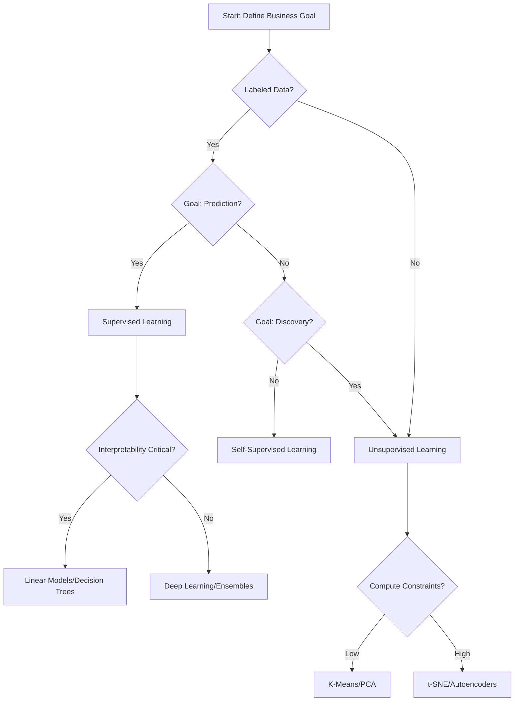

# Encyclopedia Galactica: Supervised vs Unsupervised Learning

## Table of Contents

1. [Section 1: Foundational Concepts and Historical Genesis](#section-1-foundational-concepts-and-historical-genesis)

2. [Section 2: Core Mechanisms: How Supervised Learning Works](#section-2-core-mechanisms-how-supervised-learning-works)

3. [Section 3: Core Mechanisms: How Unsupervised Learning Works](#section-3-core-mechanisms-how-unsupervised-learning-works)

4. [Section 4: Comparative Analysis: Strengths, Weaknesses, and Ideal Use Cases](#section-4-comparative-analysis-strengths-weaknesses-and-ideal-use-cases)

5. [Section 5: The Synergy Zone: Semi-Supervised, Self-Supervised, and Reinforcement Learning](#section-5-the-synergy-zone-semi-supervised-self-supervised-and-reinforcement-learning)

6. [Section 6: Real-World Applications and Societal Impact](#section-6-real-world-applications-and-societal-impact)

7. [Section 7: Philosophical and Cognitive Perspectives](#section-7-philosophical-and-cognitive-perspectives)

8. [Section 8: Current Research Frontiers and Controversies](#section-8-current-research-frontiers-and-controversies)

9. [Section 9: Practical Implementation: Tools, Workflows, and Best Practices](#section-9-practical-implementation-tools-workflows-and-best-practices)

10. [Section 10: Future Trajectories and Concluding Synthesis](#section-10-future-trajectories-and-concluding-synthesis)

## Section 1: Foundational Concepts and Historical Genesis

The quest to imbue machines with the ability to learn from experience represents one of humanity's most profound intellectual endeavors. At the very heart of this pursuit lies a fundamental dichotomy: **Supervised Learning (SL)** and **Unsupervised Learning (UL)**. These paradigms, distinct in their approach yet complementary in their ultimate goals, form the bedrock upon which the vast edifice of modern machine learning and artificial intelligence is constructed. Understanding their essence – the "what," "why," and "how" they emerged – is not merely an academic exercise; it is crucial for grasping the capabilities, limitations, and trajectory of intelligent systems shaping our world. This opening section delves into the core definitions, explores the deep philosophical currents that feed these approaches, traces their pivotal historical milestones, and examines the catalytic role of the data revolution in their ascendance.

**1.1 Defining the Dichotomy: Labels vs. Patterns**

The most intuitive distinction between supervised and unsupervised learning lies in the nature of the data they consume and the objectives they pursue.

*   **Supervised Learning: Learning by Example with Guidance.** Imagine a diligent student being taught by a tutor. The tutor provides specific problems (input data) along with the correct answers (labels or target outputs). The student's goal is to discern the underlying rule or mapping function that transforms the input into the correct output. After studying numerous examples, the student should be able to predict the answer for *new*, unseen problems accurately. This is the essence of supervised learning.

*   **Core Definition:** Supervised learning algorithms infer a function (`f`) that maps an input space (`X`) to an output space (`Y`) based on a collection of **labeled training examples** – data points where each input (`x_i`) is paired with its corresponding desired output (`y_i`). Formally, the training data is: `{(x1, y1), (x2, y2), ..., (xn, yn)}`.

*   **The Crucial Role of Labels:** The labels (`y_i`) are the "supervision." They explicitly tell the algorithm what the correct answer *should be* for each input during training. These labels can be discrete categories (e.g., "spam" or "not spam," "cat" or "dog") for **classification** tasks, or continuous numerical values (e.g., house price, temperature forecast) for **regression** tasks.

*   **Core Objective: Prediction & Classification.** The ultimate aim is predictive accuracy. A well-trained supervised model should generalize beyond the training data to make accurate predictions (`ŷ = f(x)`) for novel inputs (`x`). Its success is measured by how closely its predictions (`ŷ`) match the true labels (`y`) on unseen data.

*   **Unsupervised Learning: Discovering Hidden Structure in the Unknown.** Now, imagine an explorer venturing into uncharted territory without a map or guide. Their task is to observe the landscape, identify natural groupings of terrain, find recurring patterns, or uncover hidden pathways. There are no pre-defined destinations or labels; the structure must be inferred solely from the inherent properties of the terrain itself. This is the spirit of unsupervised learning.

*   **Core Definition:** Unsupervised learning algorithms aim to discover **hidden patterns, structures, or intrinsic relationships** within a dataset consisting *only* of input data (`{x1, x2, ..., xn}`), **without any corresponding output labels or explicit guidance**.

*   **The Absence of the Target Variable:** This is the defining characteristic. The algorithm is presented with raw data and must make sense of it autonomously. There is no "correct answer" provided for any data point during training.

*   **Core Objective: Description & Discovery.** The goals are fundamentally exploratory:

*   **Clustering:** Grouping similar data points together (e.g., identifying distinct customer segments based on purchasing behavior).

*   **Dimensionality Reduction:** Simplifying complex, high-dimensional data into a lower-dimensional representation while preserving its essential structure (e.g., visualizing complex genetic data in 2D/3D).

*   **Density Estimation:** Modeling the underlying probability distribution of the data (e.g., identifying regions of high probability for anomaly detection).

*   **Association Rule Mining:** Discovering interesting relationships or co-occurrences between variables in large datasets (e.g., "customers who buy diapers often also buy beer").

**Illustrative Example:** Consider a dataset of retail transactions.

*   **Supervised Task:** Predict if a customer will churn (leave) next month. The training data needs historical records where each customer's features (purchase frequency, avg. spend, support tickets) are *labeled* with whether they churned (`Yes`/`No`). The model learns the patterns linking features to churn.

*   **Unsupervised Task:** Discover distinct groups of customers based solely on their purchase history. The algorithm analyzes similarities in items purchased without any predefined categories or labels, revealing natural segments like "budget-conscious families," "premium tech enthusiasts," or "occasional gift buyers."

This fundamental distinction – the presence or absence of the guiding hand of labeled data – shapes every aspect of how these paradigms operate, the problems they solve, and how their success is evaluated.

**1.2 Philosophical Roots: From Statistics to Neuroscience**

The conceptual underpinnings of supervised and unsupervised learning stretch far beyond computer science, drawing nourishment from centuries of thought in statistics, psychology, neuroscience, and even philosophy.

*   **Supervised Learning: The Legacy of Inference and Prediction.**

*   **Statistical Lineage:** The roots of SL are deeply embedded in **statistical inference** and **curve fitting**. In the late 18th and early 19th centuries, mathematical giants like **Adrien-Marie Legendre** (who first published the method of least squares in 1805) and **Carl Friedrich Gauss** (who rigorously developed it and used it for celestial orbit prediction around 1809) established the foundation for finding the best-fitting model to observed data. The core idea – minimizing the error between predicted and observed values – remains the heartbeat of most supervised learning algorithms. **Ronald Fisher**'s development of **discriminant analysis** in the 1930s provided explicit methods for classifying data points into predefined groups, a direct precursor to modern classification algorithms. The entire framework of formulating a hypothesis space, defining a loss function, and optimizing parameters to minimize prediction error is fundamentally statistical.

*   **Early Pattern Recognition:** The mid-20th century saw the formalization of **pattern recognition**, heavily influenced by statistics and early computing. Researchers like **Nils Nilsson** and his work on linear discriminant functions aimed to build machines that could recognize patterns (e.g., letters, simple shapes) based on labeled examples, directly feeding into the development of supervised learning classifiers.

*   **Philosophical Bent: Instructionism.** Supervised learning resonates with a perspective that emphasizes **explicit instruction, guidance, and feedback** as the primary drivers of learning and intelligence. It mirrors traditional pedagogical approaches where a teacher provides examples and corrects mistakes. The intelligence is directed towards achieving a specific, externally defined goal (prediction accuracy).

*   **Unsupervised Learning: The Allure of Self-Organization and Emergence.**

*   **Gestalt Psychology:** Emerging in the early 20th century, **Gestalt psychology** ("shape" or "form" psychology), championed by thinkers like **Max Wertheimer**, **Kurt Koffka**, and **Wolfgang Köhler**, profoundly influenced the concept of UL. Gestaltists argued that perception isn't merely the sum of sensory parts but involves an innate tendency to organize sensory inputs into coherent wholes or patterns ("the whole is greater than the sum of its parts"). Principles like proximity, similarity, closure, and continuity describe how humans spontaneously group elements and perceive structure *without explicit instruction*. This directly parallels clustering and structure discovery in UL. Wertheimer's experiments with apparent motion (the phi phenomenon, where stationary lights flashed sequentially create the illusion of movement) highlighted how the brain imposes structure on raw sensory input.

*   **Hebbian Learning:** Canadian psychologist **Donald Hebb** proposed a foundational neurophysiological principle in his 1949 book *The Organization of Behavior*: **"Cells that fire together, wire together."** This concept of synaptic plasticity, where the connection strength between neurons increases if they are repeatedly activated simultaneously, suggests a mechanism for unsupervised learning within the brain. Neurons could self-organize based on correlated activity patterns in sensory inputs, forming internal representations of the external world without explicit labels. Hebbian theory became a cornerstone of early neural network models designed for unsupervised learning.

*   **Cybernetics and Self-Organization:** The mid-20th-century field of **cybernetics**, studying control and communication in animals and machines, explored ideas of **self-organizing systems**. Researchers like **W. Ross Ashby** (e.g., his "Homeostat" model) and **Warren McCulloch** investigated how complex, adaptive behavior could emerge from simple components interacting according to local rules, without central control or explicit programming. This directly inspired early neural network models capable of unsupervised learning, such as **Stephen Grossberg**'s Adaptive Resonance Theory (ART) networks in the 1970s, designed to learn stable recognition categories from streaming input data.

*   **Philosophical Bent: Constructivism/Emergence.** Unsupervised learning aligns with perspectives emphasizing **intrinsic motivation, exploration, and the self-organized emergence of structure and knowledge**. It resonates with Jean Piaget's theories of cognitive development in children, where understanding is actively constructed through interaction with the environment, not just passively received. Intelligence, from this view, involves discovering the underlying structure of the world autonomously.

*   **The Enduring Debate:** This philosophical tension – **Instructionism vs. Emergentism** – mirrors a fundamental question about intelligence itself: Is it primarily shaped by external guidance and specific objectives (supervision), or does it arise intrinsically through autonomous exploration and the discovery of inherent structure (unsupervision)? While modern AI often blends these approaches, the dichotomy remains a powerful conceptual lens.

**1.3 Historical Milestones: Perceptrons, Clustering, and AI Winters**

The theoretical foundations began to crystallize into tangible algorithms and models during the mid-20th century, a period marked by bursts of optimism ("springs") followed by harsh realities and funding cuts ("winters").

*   **The Dawn of Supervised Learning: The Perceptron and its Discontents.**

*   **Frank Rosenblatt's Perceptron (1957-1958):** This was the watershed moment. Funded by the US Navy and unveiled with considerable fanfare (including a famous New York Times article claiming it could "walk, talk, see, write, reproduce itself and be conscious of its existence"), the **Mark I Perceptron** was a physical machine implementing a single-layer neural network. Rosenblatt provided a learning rule (the Perceptron Learning Rule) that allowed it to learn simple binary classification tasks (like distinguishing marks on cards as left or right) from labeled examples, updating its weights based on prediction errors. It embodied supervised learning's promise: learning from examples. Its initial success generated immense excitement and significant funding for neural network research ("connectionism").

*   **Minsky and Papert's Devastating Critique (1969):** The euphoria was short-lived. In their seminal book *Perceptrons*, **Marvin Minsky** and **Seymour Papert** provided a rigorous mathematical analysis. They conclusively demonstrated the fundamental **limitation of single-layer perceptrons**: they could only learn linearly separable patterns. They proved the perceptron was incapable of solving a simple but critical non-linear problem: the **exclusive OR (XOR) function**. This seemingly minor flaw had major implications. As they pointedly argued, many real-world problems involve non-linear relationships that single-layer networks couldn't capture. Their critique, coupled with the limited computational power of the era and the difficulty of training deeper networks (the "vanishing gradient" problem wouldn't be solved for decades), effectively **stalled neural network research for nearly 20 years**. This became a primary trigger for the first "**AI Winter**" (mid-1970s), a period of drastically reduced funding and interest in connectionist approaches and AI in general. Supervised learning continued, but primarily through statistical methods like linear regression and newer symbolic AI paradigms, rather than neural networks.

*   **The Parallel Path of Unsupervised Learning: Clustering and Dimensionality Reduction.**

*   **Anthropological and Biological Roots:** While not computational initially, the conceptual core of unsupervised learning – grouping similar things – has deep roots. **Ethnologists** and **anthropologists** in the early-mid 20th century, like **Harold Driver** and **Karl Sapper**, systematically developed methods for **taxonomic classification** of cultures and languages based on shared traits, laying groundwork for cluster analysis concepts. Biologists used similar techniques for species classification.

*   **Foundational Algorithms Emerge:** Computational methods for unsupervised learning developed somewhat independently, often outside the main AI spotlight initially:

*   **K-Means Clustering:** While ideas existed earlier, the standard algorithm was first proposed by **Stuart Lloyd** at Bell Labs in 1957 (unpublished) and independently by **Edward Forgy** in 1965. **James MacQueen** coined the term "K-means" in 1967. It became a cornerstone for partitioning data into distinct groups based on centroid proximity.

*   **Principal Component Analysis (PCA):** The mathematical foundation was laid by **Karl Pearson** in 1901 ("On Lines and Planes of Closest Fit to Systems of Points in Space") as a method for fitting lines/planes to data. **Harold Hotelling** independently developed it in 1933 ("Analysis of a Complex of Statistical Variables into Principal Components"), establishing its modern statistical formulation for dimensionality reduction and identifying directions of maximum variance. PCA became an indispensable tool for simplifying data decades before the AI boom.

*   **Hierarchical Clustering:** Methods like WARD's method (1963) and various linkage criteria (single, complete, average) were developed, providing ways to build nested cluster structures (dendrograms).

*   **Slower Pace, Less Hype, More Resilience:** Unlike the perceptron boom, early UL research proceeded with less fanfare and consequently suffered less dramatically during the first AI Winter. Its utility in exploratory data analysis within established fields like statistics, biology, and social sciences provided a more stable foundation. However, ambitious goals of fully autonomous machine learning via UL remained largely unrealized.

*   **The Second AI Winter and its Impact:** A second wave of AI optimism in the early 1980s, fueled by expert systems and Japan's Fifth Generation Computer Systems project, also crashed by the late 1980s due to over-hyped promises meeting technical limitations and cost overruns. This **Second AI Winter** further chilled investment in ambitious AI projects, affecting both paradigms. However, it also forced a period of consolidation and more rigorous evaluation, paving the way for the eventual resurgence fueled by new algorithms, increased computational power, and, crucially, the rise of the internet and digital data.

**1.4 The Data Revolution's Catalyst**

The late 1990s and early 2000s witnessed a transformation that fundamentally altered the landscape for both supervised and unsupervised learning: the **Data Revolution**.

*   **The Explosion of Digital Data:** The advent of the World Wide Web, ubiquitous digital sensors, the proliferation of smartphones, e-commerce, and social media led to an unprecedented, exponential growth in digital data generation and storage. Suddenly, vast datasets – text, images, audio, video, transaction logs, sensor readings – became available. Crucially, the cost of **digital storage plummeted** (Kryder's Law) and **computational power surged** (Moore's Law, later augmented by GPUs). This created the essential fuel and engine for machine learning.

*   **Fueling Supervised Learning:** The availability of large datasets was necessary, but not sufficient, for supervised learning. The critical bottleneck became **labels**. Acquiring high-quality labeled data is often expensive, time-consuming, and requires domain expertise. Projects like **ImageNet**, launched in 2009 by **Fei-Fei Li**, were monumental efforts to create massive, labeled datasets (millions of images categorized into thousands of classes) specifically to train and benchmark deep learning models for computer vision. The success of deep convolutional neural networks (CNNs) like **AlexNet** on ImageNet in 2012 marked a turning point, reigniting the neural network revolution and demonstrating the power of supervised deep learning with sufficient data and computation.

*   **The "Label Bottleneck" and the Rise of Unsupervised Learning:** While supervised learning thrived where labels *could* be acquired, the sheer volume of *unlabeled* data dwarfed the labeled datasets. This highlighted the **"Label Bottleneck"** – the difficulty and cost of obtaining sufficient supervision for complex tasks. This bottleneck became a powerful catalyst for **renewed interest and innovation in unsupervised learning**. Why let all that unlabeled data go to waste? UL offered a path to leverage this abundant resource to:

*   **Pre-train Representations:** Learn useful feature representations from unlabeled data that could then be fine-tuned on smaller labeled datasets for specific supervised tasks (a precursor to modern transfer learning).

*   **Discover Hidden Insights:** Directly mine unlabeled data for patterns, anomalies, and structures that weren't anticipated or easily labeled.

*   **Scale with Data:** Many UL algorithms (like simpler variants of K-Means) could often handle massive datasets more readily than complex supervised models, especially before highly optimized deep learning frameworks matured.

*   **Early Practical Applications Showcase the Divide:**

*   **Supervised Learning: Optical Character Recognition (OCR).** A classic early success story. Systems like postal code readers or check scanners relied heavily on supervised learning. Models were trained on vast datasets of scanned characters (images) meticulously labeled with their corresponding letters, numbers, or symbols (`x` = pixel image, `y` = character label). The learned model could then predict the character in new scanned images. This required significant effort to create the labeled datasets but delivered high-value automation.

*   **Unsupervised Learning: Market Basket Analysis.** Pioneered in the retail sector, especially by companies like Walmart. Using algorithms like **Apriori** (proposed by **Agrawal and Srikant** in 1994), retailers analyzed massive volumes of unlabeled point-of-sale transaction data (`x` = list of items purchased together in a basket). The goal wasn't to predict a specific label but to discover **association rules** (e.g., the famous, though perhaps apocryphal, "customers who buy diapers are also likely to buy beer"). These discovered patterns, requiring no pre-defined labels, enabled strategic product placement, promotions, and inventory management, directly impacting the bottom line.

The Data Revolution thus provided the essential raw material – abundant data – while simultaneously highlighting the contrasting dependencies of the two paradigms: SL's hunger for curated labels and UL's ability to feast on raw, unannotated information. This set the stage for the explosive growth and increasing sophistication of both fields, as well as the development of hybrid approaches designed to bridge the gap.

**Transition:** Having established the fundamental definitions, explored the deep philosophical currents, traced the pivotal historical developments punctuated by periods of both fervor and frost, and examined the catalytic role of the data explosion, we have laid the essential groundwork. This understanding of *what* supervised and unsupervised learning are, *why* they emerged from distinct intellectual traditions, and *how* their trajectories were shaped by technological and conceptual breakthroughs, now allows us to delve deeper. In the next section, we will dissect the core mechanisms of **Supervised Learning**, exploring the intricate dance of inputs, outputs, error signals, and the diverse algorithmic families – from humble linear models to the towering architectures of deep neural networks – that enable machines to learn the art of prediction from labeled examples.

---

**Word Count:** Approx. 2,050

---

## Section 2: Core Mechanisms: How Supervised Learning Works

Building upon the foundational understanding established in Section 1 – the historical context, philosophical underpinnings, and the crucial distinction defined by the presence or absence of labeled data – we now plunge into the intricate machinery of **Supervised Learning (SL)**. This paradigm, fueled by explicit guidance, transforms historical aspirations of learning from examples into tangible, predictive power. Understanding its core mechanisms – the formal framework, the diverse algorithmic families, the iterative training process fraught with challenges, and the critical metrics for evaluation – is essential to grasp how machines translate labeled data into actionable intelligence.

**2.1 The Learning Framework: Inputs, Outputs, and the Error Signal**

At its heart, supervised learning is a sophisticated optimization problem framed within a precise mathematical structure. Imagine training a new employee. You provide them with past examples of tasks (input data) and the correct solutions (labels). They develop a set of rules or procedures (a model) based on these examples. When a new, similar task arrives, they apply their learned rules to produce an answer (prediction). The supervisor (the learning algorithm) monitors their performance, pointing out errors (loss calculation) and guiding them to improve their rules (parameter updates). This iterative refinement is the essence of the supervised learning framework, formalized through several key components:

1.  **Input Space (X):** This is the universe of possible data points the model might encounter. Each data point, `x_i`, is typically represented as a vector of **features** (also called attributes or predictors). These features could be numerical (e.g., age, income, pixel intensity), categorical (e.g., gender, product category, word presence), or more complex structures (e.g., an image tensor, a text sequence). The dimensionality of `X` is the number of features. *Example:* For predicting house prices, `x_i` might be `[square_footage, num_bedrooms, num_bathrooms, zip_code, year_built]`.

2.  **Output Space (Y):** This defines the type of answer the model is expected to produce.

*   **Classification:** `Y` is a finite set of discrete classes or categories. The model predicts a class label. *Examples:* `Y = {spam, not_spam}`, `Y = {cat, dog, horse}`, `Y = {disease_A, disease_B, healthy}`.

*   **Regression:** `Y` is a continuous numerical value. The model predicts a quantity. *Examples:* `Y = house_price ($)`, `Y = temperature (°C)`, `Y = product_demand (units)`.

3.  **Labeled Training Dataset (D_train):** The cornerstone of SL. This is a finite collection of examples where each input `x_i` is paired with its corresponding *known* and *correct* output `y_i`. Formally: `D_train = {(x1, y1), (x2, y2), ..., (xn, yn)}`. The quality (accuracy, completeness, lack of bias) and quantity of `D_train` are paramount to the model's success.

4.  **Hypothesis Space (H):** This is the set of all possible functions (models or mappings) that the learning algorithm is allowed to consider. `H` defines the model's architecture and its inherent flexibility (or **capacity**). A simple `H` might be all linear functions (`y = w*x + b`). A complex `H` might be all possible deep neural networks with a specific architecture. The learning algorithm's task is to search within `H` for the best function.

5.  **Loss Function (L) / Cost Function (C):** This function quantifies the **error** or "badness" of a prediction. It measures the discrepancy between the model's prediction `ŷ_i = h(x_i)` (where `h` is a candidate hypothesis from `H`) and the true label `y_i` for a given data point. The choice of loss function is crucial and depends on the task:

*   **Regression:** Common losses include:

*   **Mean Squared Error (MSE):** `L(y_i, ŷ_i) = (y_i - ŷ_i)^2`. Heavily penalizes large errors. Used when large errors are particularly undesirable.

*   **Mean Absolute Error (MAE):** `L(y_i, ŷ_i) = |y_i - ŷ_i|`. Less sensitive to outliers than MSE. Represents average error magnitude.

*   **Classification:** Common losses include:

*   **0-1 Loss:** `L(y_i, ŷ_i) = 0` if `y_i = ŷ_i`, `1` otherwise. Simple, but not differentiable, making optimization hard.

*   **Cross-Entropy Loss (Log Loss):** Measures the difference between the predicted probability distribution over classes and the true distribution (which is 1 for the correct class, 0 elsewhere). Heavily penalizes confident wrong predictions. The workhorse for classification, especially with neural networks. *Example:* Binary Cross-Entropy: `L(y_i, ŷ_i) = - [y_i * log(ŷ_i) + (1 - y_i) * log(1 - ŷ_i)]`.

6.  **Learning Algorithm:** This is the engine that searches the hypothesis space `H` for the function `h` that minimizes the **empirical risk** – the average loss over the *entire training dataset* `D_train`. Formally, it finds: `argmin_{h ∈ H} (1/n) * Σ_{i=1 to n} L(y_i, h(x_i))`. This minimization process is typically achieved through iterative optimization algorithms like Gradient Descent.

7.  **The Goal: Generalization:** The ultimate objective is *not* merely to minimize training error (empirical risk). It is to find a hypothesis `h` that performs well on **new, unseen data** drawn from the same underlying distribution as the training data. This performance on unseen data is called the **generalization error** or **test error**. Minimizing generalization error is the true mark of a successful supervised learning model. A model that performs exceptionally well on training data but poorly on unseen data is suffering from **overfitting**.

**The Error Signal:** The loss function `L` provides the crucial "error signal" for the learning algorithm. By calculating how wrong the prediction was for each training example (or batches of examples), the algorithm can determine *how* to adjust the parameters of the hypothesis `h` (e.g., the weights `w` in a linear model or neural network) to reduce the loss on similar examples in the future. This feedback loop – predict, calculate loss, adjust parameters – is the core dynamic of supervised learning.

**2.2 Key Algorithm Families: From Linear Models to Deep Networks**

The hypothesis space `H` and the learning algorithm define the specific type of model. Over decades, distinct families of supervised learning algorithms have emerged, each with unique strengths, weaknesses, and historical significance, forming a technological lineage from simple beginnings to modern complexity.

1.  **Linear Models: The Bedrock of Interpretability.**

*   **Core Idea:** Assume the relationship between features `X` and target `Y` can be approximated by a linear function. `ŷ = w0 + w1*x1 + w2*x2 + ... + wp*xp` (Regression) or `log(odds(ŷ)) = w0 + w1*x1 + ... + wp*xp` (Classification - Logistic Regression).

*   **Algorithms:**

*   **Linear Regression:** Minimizes MSE to find optimal weights `w`. Provides a clear, interpretable relationship: each weight `w_j` indicates the expected change in `Y` for a one-unit change in feature `X_j`, holding other features constant. Prone to underfitting if relationships are non-linear. *Example:* Predicting sales based on advertising spend across different media.

*   **Logistic Regression:** Despite its name, used for binary classification. Models the probability that `Y` belongs to a particular class using the logistic function. Outputs probabilities naturally. Highly interpretable; coefficients indicate how features influence the *log-odds* of the positive class. *Example:* Predicting the likelihood of a loan applicant defaulting based on credit score, income, debt ratio.

*   **Strengths:** Simple, fast to train, highly interpretable, provides probabilistic outputs (logistic regression), robust to small datasets.

*   **Weaknesses:** Assumes linearity/additivity, struggles with complex non-linear relationships and interactions between features, sensitive to irrelevant features.

2.  **Instance-Based Learning (k-Nearest Neighbors - k-NN): Learning by Analogy.**

*   **Core Idea:** "Tell me who your neighbors are, and I'll tell you who you are." Makes predictions for a new data point `x_new` based on the majority vote (classification) or average (regression) of the `k` training points closest to `x_new` in the feature space. Requires a **distance metric** (e.g., Euclidean, Manhattan) to define "closeness."

*   **Algorithm:** k-Nearest Neighbors (k-NN). The model is essentially the entire training dataset. Prediction involves searching this dataset for the `k` nearest neighbors of `x_new`.

*   **Strengths:** Simple conceptually, no explicit training phase (lazy learner), naturally handles multi-class problems, can model complex non-linear decision boundaries given enough data.

*   **Weaknesses:** Computationally expensive prediction (scales poorly with dataset size), sensitive to irrelevant features and the choice of distance metric/k, requires careful feature scaling, poor interpretability beyond local neighbors, struggles with high dimensionality ("curse of dimensionality").

3.  **Tree-Based Methods: Hierarchical Decision Making.**

*   **Core Idea:** Build a model predicting the value of `Y` by learning simple decision rules inferred from the features. The model structure is a tree: internal nodes represent tests on features, branches represent outcomes of tests, and leaf nodes represent predicted class labels or values.

*   **Algorithms:**

*   **Decision Trees:** Built by recursively partitioning the feature space based on features and thresholds that best separate the classes (e.g., using Gini impurity or information gain for classification, MSE reduction for regression). Highly interpretable ("white box" model), can handle non-linear relationships and feature interactions. *Example:* A medical diagnosis tree: "Fever > 38.5°C? If Yes, then Cough? If Yes, then likely Flu...".

*   **Random Forests:** An **ensemble** method. Builds many decision trees (the "forest"), each trained on a random subset of the training data *and* a random subset of features at each split. Predictions are made by averaging (regression) or majority voting (classification) across all trees. Mitigates the overfitting tendency of single trees, significantly improves accuracy and robustness. *Example:* Widely used for credit scoring, medical diagnosis, and remote sensing classification.

*   **Gradient Boosting Machines (GBM):** Another powerful ensemble technique (e.g., XGBoost, LightGBM, CatBoost). Builds trees *sequentially*. Each new tree is trained to correct the residual errors (gradients of the loss function) made by the *previous ensemble* of trees. Combines many weak learners (shallow trees) into a strong learner. Often achieves state-of-the-art accuracy on structured/tabular data, even surpassing deep learning in many cases. Highly efficient and scalable.

*   **Strengths (Ensembles):** High predictive accuracy, robust to outliers and irrelevant features (especially Random Forests), handle non-linearities and interactions well, handle mixed data types (GBMs), relatively good interpretability (feature importances).

*   **Weaknesses:** Less interpretable than single trees (though feature importances help), GBMs can overfit if not tuned carefully, computationally more expensive than linear models for training (though prediction is fast).

4.  **Support Vector Machines (SVM): Maximizing the Margin.**

*   **Core Idea:** Find the optimal hyperplane in the feature space that separates different classes with the **maximum possible margin** (the distance between the hyperplane and the nearest data points from each class, called **support vectors**). For non-linearly separable data, employ the **kernel trick**: implicitly map the input features into a higher-dimensional space where a linear separation *is* possible, using kernel functions (e.g., linear, polynomial, radial basis function - RBF) *without* explicitly computing the coordinates in that high-dimensional space. *Anecdote:* The kernel trick, a conceptual breakthrough, transformed SVMs from a niche linear classifier into a versatile, powerful tool.

*   **Algorithm:** Support Vector Machines (SVM). Formulated as a convex optimization problem, guaranteeing a global optimum.

*   **Strengths:** Effective in high-dimensional spaces (even when features > samples), robust to overfitting (especially with good regularization parameter tuning), memory efficient (relies only on support vectors for prediction), versatile with different kernels.

*   **Weaknesses:** Choosing the right kernel and tuning parameters can be tricky, interpretation is difficult (especially with non-linear kernels), scalability challenges with very large datasets, outputs scores not direct probabilities (requires calibration).

5.  **Neural Networks: The Deep Learning Revolution.**

*   **Core Idea:** Inspired loosely by biological neurons. Composed of interconnected layers of artificial neurons (nodes). Each neuron receives inputs, computes a weighted sum, applies a non-linear **activation function** (e.g., Sigmoid, Tanh, ReLU), and passes the output to neurons in the next layer. Learns hierarchical representations of data – early layers detect simple patterns (edges, textures), deeper layers combine these into complex features (shapes, objects, concepts).

*   **Historical Progression:**

*   **Perceptron (Rosenblatt, 1957):** Single-layer network, limited to linear separability (as discussed in Section 1).

*   **Multi-Layer Perceptrons (MLPs):** Networks with one or more **hidden layers** between input and output. Theoretically capable of approximating any function (universal approximation theorem). Stagnated historically due to computational limitations and the vanishing gradient problem during training.

*   **Backpropagation (Rumelhart, Hinton, Williams, 1986):** The critical algorithm for efficiently calculating the gradients of the loss function with respect to *all* weights in the network, enabling training via gradient descent. Revived interest in neural networks.

*   **Convolutional Neural Networks (CNNs - LeCun et al., 1989/1998):** Revolutionized computer vision. Designed to process grid-like data (images). Use **convolutional layers** to detect local spatial patterns (sharing weights across locations) and **pooling layers** for spatial downsampling. *Landmark:* AlexNet (Krizhevsky et al., 2012) winning ImageNet by a large margin, catalyzing the deep learning boom.

*   **Recurrent Neural Networks (RNNs - Elman, 1990):** Designed for sequential data (text, speech, time series). Contain loops, allowing information to persist (a form of memory). Struggled with long-term dependencies.

*   **Long Short-Term Memory (LSTM - Hochreiter & Schmidhuber, 1997) / Gated Recurrent Units (GRU - Cho et al., 2014):** Improved RNN architectures with specialized gates to control information flow, effectively learning long-range dependencies.

*   **Transformers (Vaswani et al., 2017):** Revolutionized natural language processing (NLP) and beyond. Rely entirely on **self-attention mechanisms** to weigh the importance of different parts of the input sequence relative to each other, enabling highly parallelizable training and superior handling of long-range context. Foundation for Large Language Models (LLMs) like BERT, GPT, and beyond.

*   **Strengths:** State-of-the-art performance on complex tasks (vision, language, speech), automatically learn hierarchical feature representations from raw data, highly flexible and expressive models.

*   **Weaknesses:** Require very large datasets and massive computational resources for training, prone to overfitting without regularization, complex architectures are "black boxes" with limited interpretability, training can be unstable and sensitive to hyperparameters.

**2.3 The Training Process: Optimization and Avoiding Pitfalls**

Finding the optimal hypothesis `h` within `H` is a journey fraught with challenges. The learning algorithm navigates a complex, high-dimensional landscape defined by the loss function, seeking the lowest valley (minimum loss).

1.  **Optimization Algorithms: Navigating the Loss Landscape.**

*   **Gradient Descent (GD):** The fundamental workhorse. Imagine standing on a foggy mountain (the loss landscape) and wanting to find the lowest valley. Gradient descent calculates the **gradient** (slope) of the loss function with respect to each model parameter (weight) at the current position. It then takes a step in the *opposite* direction of the gradient (downhill). The size of this step is controlled by the **learning rate (η)**.

*   **Batch Gradient Descent:** Computes the gradient using the *entire* training dataset for each parameter update. Precise but computationally expensive and slow for large datasets; can get stuck in poor local minima.

*   **Stochastic Gradient Descent (SGD):** Computes the gradient and updates parameters using only *one* randomly selected training example at a time. Much faster per iteration and can escape shallow local minima due to noise, but the path to the minimum is very erratic (high variance).

*   **Mini-batch Gradient Descent:** The practical compromise. Computes the gradient using a small random subset (mini-batch) of the training data (e.g., 32, 64, 128 examples) for each update. Balances efficiency and stability. Most common in practice, especially for deep learning.

*   **Momentum:** An enhancement to GD that helps accelerate convergence, especially in directions of persistent reduction, and dampens oscillations. It accumulates a moving average of past gradients (`v`) and uses this to update parameters: `w = w - η*v`. Analogous to a ball rolling downhill, gaining momentum.

*   **Adaptive Learning Rate Methods:** Algorithms that automatically adjust the learning rate for *each* parameter based on historical gradient information. Examples:

*   **Adagrad:** Adapts η based on the sum of squared historical gradients per parameter. Good for sparse data, but η can decay too aggressively.

*   **RMSprop:** Addresses Adagrad's aggressive decay by using a moving average of squared gradients.

*   **Adam (Adaptive Moment Estimation - Kingma & Ba, 2014):** Combines ideas from Momentum and RMSprop. Maintains separate moving averages for gradients (`m`) and squared gradients (`v`). Often the default optimizer for deep learning due to its robustness and efficiency. `w = w - η * m_hat / (sqrt(v_hat) + ε)` (where `m_hat`, `v_hat` are bias-corrected estimates).

2.  **Backpropagation: The Engine of Neural Networks.** While gradient descent provides the update rule, **backpropagation** is the specific, efficient algorithm for calculating the gradients of the loss function with respect to *every* weight in a neural network. It works by applying the chain rule of calculus recursively backward through the network layers, starting from the loss at the output layer and propagating error gradients back to the input layer. This enables efficient computation of all necessary gradients in one forward and one backward pass per batch.

3.  **Model Capacity, Bias, and Variance: The Fundamental Tradeoff.**

*   **Model Capacity:** The ability of a model to fit a wide variety of functions. Higher capacity models (e.g., deep neural networks with many parameters) can represent more complex relationships.

*   **Bias:** The error due to overly simplistic assumptions in the learning algorithm. High-bias models (e.g., linear regression for complex data) tend to **underfit** the training data – they are too rigid to capture underlying patterns. Symptoms: High training error *and* high test error.

*   **Variance:** The error due to excessive sensitivity to small fluctuations in the training data. High-variance models (e.g., very deep trees or neural networks without regularization) tend to **overfit** the training data – they memorize noise and idiosyncrasies instead of learning generalizable patterns. Symptoms: Very low training error but high test error.

*   **The Bias-Variance Tradeoff:** A core challenge in ML. Increasing model capacity typically reduces bias but increases variance. Decreasing capacity reduces variance but increases bias. The goal is to find the "sweet spot" where both bias and variance are minimized, leading to optimal generalization. This tradeoff is visualized by the characteristic U-shape of test error as model complexity increases.

4.  **Combatting Overfitting: Regularization Techniques.** Techniques designed to reduce variance and prevent overfitting by constraining model complexity, often at the cost of a slight increase in bias. Crucial for achieving good generalization.

*   **L1 Regularization (Lasso):** Adds a penalty term to the loss function proportional to the *sum of absolute values* of the weights (`λ * Σ|w_j|`). Encourages sparsity – drives some weights exactly to zero, effectively performing feature selection. *Example:* Identifying the most critical biomarkers for a disease prediction model.

*   **L2 Regularization (Ridge):** Adds a penalty term proportional to the *sum of squared values* of the weights (`λ * Σw_j^2`). Encourages small weights overall, shrinking coefficients but rarely setting them exactly to zero. Generally improves stability and generalization. The default regularization for many algorithms (e.g., SVM, linear regression).

*   **Elastic Net:** Combines L1 and L2 penalties, offering a balance between feature selection (L1) and coefficient shrinkage (L2).

*   **Dropout (Srivastava et al., 2014):** A powerful technique specifically for neural networks. During training, randomly "drop out" (temporarily remove) a fraction of neurons in each layer (e.g., 50%) during each forward/backward pass. Prevents complex co-adaptations of neurons, forcing the network to learn more robust features that are not reliant on specific connections. *Analogy:* Training multiple thinned versions of the network simultaneously. Turned off during inference. Hugely influential in the success of deep learning.

*   **Early Stopping:** A simple yet effective strategy. Monitor the model's performance on a **validation set** during training. Stop training as soon as the validation performance stops improving (or starts degrading), even if training loss is still decreasing. Prevents the model from continuing to overfit to the training data.

*   **Data Augmentation:** Artificially increases the size and diversity of the training set by applying realistic transformations to existing examples (e.g., rotating, flipping, cropping images; adding noise to audio; synonym replacement in text). Especially vital in computer vision. Teaches the model invariance to irrelevant variations.

5.  **Validation: The Safety Net - Cross-Validation.** How to reliably estimate generalization error *during* development and tune hyperparameters (like learning rate, regularization strength, network architecture) without peeking at the test data? **Cross-Validation (CV)** is the answer.

*   **k-Fold Cross-Validation:** The gold standard. Randomly split the training data `D_train` into `k` roughly equal-sized folds (e.g., k=5 or k=10). Train the model `k` times: each time, use `k-1` folds for training and the remaining fold as a **validation set**. Calculate the performance metric on the validation fold each time. The final validation score is the average across all `k` folds. Provides a robust estimate of generalization error and allows hyperparameter tuning. The final model is typically retrained on the *entire* `D_train` using the best hyperparameters.

*   **Holdout Validation:** Simpler: Reserve a fixed percentage (e.g., 20%) of `D_train` as a validation set. Use the rest for training. Suitable for very large datasets but less statistically robust than k-fold CV.

**2.4 Evaluation Metrics: Gauging Predictive Performance**

How do we know if our diligently trained model is any good? We measure its performance on unseen data using appropriate **evaluation metrics**. Crucially, the choice of metric depends entirely on the task (regression vs. classification) and the specific business or scientific objective.

1.  **Regression Metrics (Quantifying Numerical Error):**

*   **Mean Squared Error (MSE):** `MSE = (1/n) * Σ(y_i - ŷ_i)^2`. Average of squared differences. Sensitive to large errors (penalizes them heavily). Units are the square of the target variable (e.g., dollars²).

*   **Root Mean Squared Error (RMSE):** `RMSE = sqrt(MSE)`. Square root of MSE. More interpretable than MSE as it is in the same units as the target variable (e.g., dollars). Also sensitive to large errors.

*   **Mean Absolute Error (MAE):** `MAE = (1/n) * Σ|y_i - ŷ_i|`. Average of absolute differences. Robust to outliers. Same units as the target variable. Easily interpretable as the average error magnitude.

*   **R-squared (Coefficient of Determination):** `R² = 1 - (Σ(y_i - ŷ_i)^2) / (Σ(y_i - ȳ)^2)`. Proportion of the variance in the target variable that is predictable from the features. Ranges from 0 (model explains none of the variance) to 1 (model explains all variance). Can be negative if the model is worse than simply predicting the mean. Useful for comparing models on the same dataset, but doesn't indicate the absolute size of errors.

2.  **Classification Metrics (Assessing Categorical Accuracy):** Accuracy alone is often insufficient, especially with imbalanced datasets.

*   **Confusion Matrix:** The foundation. A table showing counts of:

*   **True Positives (TP):** Actual `Yes`, Predicted `Yes`.

*   **True Negatives (TN):** Actual `No`, Predicted `No`.

*   **False Positives (FP):** Actual `No`, Predicted `Yes` (Type I Error).

*   **False Negatives (FN):** Actual `Yes`, Predicted `No` (Type II Error).

*   **Accuracy:** `(TP + TN) / (TP + TN + FP + FN)`. Proportion of correct predictions overall. Can be misleading if classes are imbalanced (e.g., 99% negative, 1% positive; a model predicting always negative gets 99% accuracy but is useless for detecting positives).

*   **Precision:** `TP / (TP + FP)`. *When the model predicts `Yes`, how often is it correct?* Measures exactness. Crucial when the cost of False Positives is high (e.g., spam detection – incorrectly flagging legitimate email as spam is bad).

*   **Recall (Sensitivity, True Positive Rate - TPR):** `TP / (TP + FN)`. *When the actual value is `Yes`, how often does the model predict `Yes`?* Measures completeness. Crucial when the cost of False Negatives is high (e.g., cancer screening – missing a real cancer is very bad).

*   **F1-Score:** `2 * (Precision * Recall) / (Precision + Recall)`. Harmonic mean of Precision and Recall. Useful single metric when seeking a balance between them, especially with imbalanced data. Ranges from 0 (worst) to 1 (best).

*   **Specificity (True Negative Rate - TNR):** `TN / (TN + FP)`. *When the actual value is `No`, how often does the model predict `No`?*

*   **ROC Curve & AUC:**

*   **Receiver Operating Characteristic (ROC) Curve:** Plots the True Positive Rate (Recall) against the False Positive Rate (`FPR = FP / (FP + TN)`) at various classification thresholds (e.g., the probability threshold above which you predict `Yes`). *Historical Note:* Developed during WWII for analyzing radar signals ("Receiver" refers to radar receiver).

*   **Area Under the ROC Curve (AUC):** Measures the *entire* two-dimensional area under the ROC curve. Ranges from 0 to 1. AUC represents the probability that a randomly chosen positive instance is ranked higher (more likely to be positive) by the classifier than a randomly chosen negative instance. An AUC of 0.5 is random guessing; 1.0 is perfect separation. Excellent metric for evaluating the *ranking* ability of a classifier independently of the chosen threshold, and robust to class imbalance.

*   **Log-Loss (Cross-Entropy Loss):** Directly measures the quality of the predicted *probabilities* (not just the labels). Penalizes confident wrong predictions heavily. Lower log-loss is better. Crucial for evaluating probabilistic classifiers (like Logistic Regression, Neural Networks).

**The Critical Importance of Holdout Sets:** All these metrics must be computed on data *not used during training or validation*. The **test set** (`D_test`) is a final, completely held-out dataset used *only once* to provide an unbiased estimate of the model's generalization performance after all development and tuning is complete. Using the test set during tuning contaminates the estimate.

**Transition:** Having dissected the core machinery of supervised learning – its formal framework, the diverse arsenal of algorithms spanning from elegant linear models to the transformative power of deep neural networks, the intricate dance of optimization and regularization during training, and the critical metrics for assessing predictive prowess – we have illuminated how machines learn under explicit guidance. This mastery of labeled data stands in stark contrast to the challenge tackled by its counterpart. In the next section, we delve into the enigmatic world of **Unsupervised Learning**, where algorithms must navigate the vast seas of unlabeled data, seeking hidden structures and patterns without the guiding light of predefined answers, confronting unique challenges in defining objectives, optimization, and, most fundamentally, evaluation.

---

**Word Count:** Approx. 2,050

---

## Section 3: Core Mechanisms: How Unsupervised Learning Works

The preceding dissection of supervised learning illuminated a paradigm defined by guidance: the clear beacon of labeled data illuminating the path from input to desired output. We witnessed algorithms honing their predictive edge through iterative error correction, optimizing towards a well-defined objective measured against known truths. Now, we venture into the contrasting, enigmatic realm of **Unsupervised Learning (UL)**. Here, the guiding light of labels is extinguished. Algorithms are cast adrift in vast oceans of raw, unannotated data – `{x1, x2, ..., xn}` – tasked not with prediction, but with **discovery**. Their mandate is to perceive the hidden architecture within the chaos, to uncover latent patterns, groupings, and simplifications that lie beneath the surface, unaided by explicit instruction. This section delves into the unique framework, diverse algorithmic explorers, the intricate process of defining and optimizing structure, and the profound challenge of evaluating success in this inherently subjective endeavor.

**3.1 The Learning Framework: Structure Discovery in Data**

Unsupervised learning operates under a fundamentally different paradigm than its supervised counterpart. Without the compass of target labels, the learning framework shifts from explicit mapping to intrinsic exploration.

1.  **Formalization: The Absence of the Target Variable.**

*   **Input Space (X):** As in supervised learning, this encompasses all possible data points represented by feature vectors. The data is solely `{x1, x2, ..., xn}` – no corresponding `y_i` exists.

*   **Hypothesis Space (H):** This is no longer a set of functions mapping `X` to `Y`. Instead, `H` consists of models or structures that capture intrinsic properties of the data distribution `P(X)`. Examples include:

*   A set of `k` cluster centroids and assignments.

*   A lower-dimensional manifold representation (`Z`) and a mapping function (or its inverse).

*   A probability density function estimating `P(X)`.

*   A set of association rules describing frequent co-occurrences.

*   **Objective Function (O):** This is the core differentiator and the source of significant challenge. Without labels defining a clear "correctness," the objective function must encode a *proxy* for desirable structure. It quantifies properties like:

*   **Similarity/Dissimilarity:** How close are points within a group? How far apart are different groups? (Clustering)

*   **Information Preservation:** How well does a simplified representation retain the essential information of the original high-dimensional data? (Dimensionality Reduction - DR)

*   **Fit to Distribution:** How well does the estimated probability distribution match the true, unknown `P(X)`? (Density Estimation)

*   **Interestingness:** How surprising and statistically significant are discovered co-occurrences? (Association Rule Mining)

*   **Reconstruction Fidelity:** How accurately can the original data be reconstructed from its encoded representation? (Autoencoders)

*   **Learning Algorithm:** Searches `H` for the model that optimizes the chosen objective function `O`. The lack of an explicit error signal (`y_i - ŷ_i`) means optimization relies solely on the internal structure of `X`.

2.  **The Nature of Unlabeled Data:** The raw material of UL is abundant but ambiguous. It represents observations without annotations – sensor readings, transaction logs, raw text corpora, pixel arrays, genetic sequences. The data holds potential insights, but those insights are latent, waiting to be unearthed. The algorithm must infer structure based solely on the inherent properties and relationships *within* the data points themselves, typically measured by distance, density, or similarity metrics.

3.  **Core Goals: Illuminating the Darkness.** The objectives of UL are intrinsically exploratory and descriptive:

*   **Clustering (Segmentation):** Partitioning the data into groups (clusters) such that points within the same cluster are more similar to each other than to points in other clusters. *Example:* Grouping customers based on purchasing behavior for targeted marketing, identifying distinct cell types from single-cell RNA sequencing data.

*   **Dimensionality Reduction (Simplification/Visualization):** Transforming high-dimensional data into a meaningful lower-dimensional representation while preserving as much relevant structure as possible (e.g., variance, pairwise distances, local neighborhoods). *Example:* Visualizing complex genetic datasets in 2D/3D using PCA or t-SNE, compressing images for efficient storage/transmission via autoencoders.

*   **Density Estimation:** Modeling the probability distribution `P(X)` that generated the data. This allows identifying regions of high density (where data points are concentrated) and low density (potential outliers or novel events). *Example:* Detecting fraudulent credit card transactions as anomalies in low-density regions, identifying novel particle signatures in high-energy physics experiments.

*   **Association Rule Mining (Relationship Discovery):** Discovering interesting relationships, correlations, or frequent co-occurrences between variables in large datasets, often expressed as rules `{A, B} -> {C}` (if A and B are present, C is likely present). *Example:* Market basket analysis ("Customers who buy diapers also often buy beer"), discovering side-effect correlations in pharmacovigilance databases.

*   **Anomaly Detection (Outlier Identification):** Identifying data points that deviate significantly from the majority of the data or the expected pattern. While often framed as a specific task, it frequently relies on techniques from clustering (points not belonging to any dense cluster), density estimation (points in low-density regions), or DR (points far from the learned manifold).

**The Fundamental Shift:** Unlike supervised learning's focus on minimizing prediction error against a known truth, unsupervised learning is fundamentally about optimizing an *internally defined* measure of structure, coherence, or information preservation within the data itself. The "correctness" is not externally validated but is judged by how well the discovered structure aligns with the chosen objective and, ultimately, its utility for human understanding or downstream tasks.

**3.2 Key Algorithm Families: Grouping and Simplifying Data**

Unsupervised learning boasts a diverse ecosystem of algorithms, each designed to uncover specific types of structure. We explore the major families, their principles, strengths, weaknesses, and historical context.

1.  **Clustering Algorithms: Finding Natural Groups.** The quest to partition data into meaningful clusters is one of the oldest and most intuitive UL tasks.

*   **K-Means (Centroid-Based):**

*   **Core Idea:** Partition `n` observations into `k` clusters where each observation belongs to the cluster with the nearest **centroid** (mean). The algorithm aims to minimize the **within-cluster variance** (inertia): `Σ Σ ||x_i - μ_j||^2` (sum over clusters `j`, sum over points `i` in cluster `j`).

*   **Algorithm (Lloyd's Algorithm):** 1. Randomly initialize `k` centroids. 2. **Assignment:** Assign each point to the nearest centroid. 3. **Update:** Recalculate centroids as the mean of points in each cluster. 4. Repeat steps 2-3 until centroids stabilize (or max iterations reached).

*   **Strengths:** Simple, intuitive, efficient for large `n` (linear complexity per iteration), guaranteed to converge (though not necessarily to global optimum).

*   **Weaknesses:** Requires specifying `k` (number of clusters) a priori, sensitive to initialization (can converge to poor local minima), assumes clusters are spherical and equally sized (fails on complex shapes), sensitive to outliers. *Anecdote:* The standard algorithm was described in an unpublished Bell Labs report by Stuart Lloyd in 1957, independently rediscovered by Edward Forgy in 1965, and named "k-means" by James MacQueen in 1967.

*   **Example:** Segmenting retail customers into `k` groups based on purchase history and demographics for differentiated marketing campaigns.

*   **Hierarchical Clustering (Connectivity-Based):**

*   **Core Idea:** Builds a hierarchy of clusters, represented as a tree structure called a **dendrogram**. Can be:

*   **Agglomerative (Bottom-Up):** Start with each point as its own cluster. Iteratively merge the two *most similar* clusters until only one cluster remains.

*   **Divisive (Top-Down):** Start with all points in one cluster. Iteratively split the cluster into smaller clusters until each point is alone (less common).

*   **Key Element:** The **linkage criterion** defines "most similar" clusters:

*   **Single Linkage:** Distance between clusters = min distance between any points in different clusters. Can produce long, "chain-like" clusters (chaining effect).

*   **Complete Linkage:** Distance = max distance between any points in different clusters. Tends to produce compact, spherical clusters.

*   **Average Linkage:** Distance = average distance between all pairs of points in different clusters. A balanced compromise.

*   **Ward's Method:** Minimizes the increase in total within-cluster variance after merging. Tends to produce clusters of relatively equal size.

*   **Strengths:** Does not require specifying `k` upfront (choose level from dendrogram), provides hierarchical relationships between clusters, intuitive visualization (dendrogram).

*   **Weaknesses:** Computationally expensive (O(n²) to O(n³)), sensitive to noise/outliers (especially single linkage), once a merge/split is done it cannot be undone.

*   **Example:** Phylogenetic tree construction in biology, grouping documents into a topic hierarchy.

*   **DBSCAN (Density-Based Spatial Clustering of Applications with Noise - Ester et al., 1996):**

*   **Core Idea:** Discovers clusters of arbitrary shape based on the idea that a cluster is a dense region of points separated by regions of low density. Key parameters: `ε` (neighborhood radius) and `minPts` (minimum points to form a dense region).

*   **Algorithm:** 1. Classify points: **Core points** (have ≥ `minPts` within `ε`), **Border points** (within `ε` of a core point but have  {C}`). Leverages the **Apriori Principle:** "All non-empty subsets of a frequent itemset must also be frequent" (downward closure property) to prune the search space.

*   **Algorithm:** 1. Find all frequent 1-itemsets (single items above min support). 2. Use frequent `k`-itemsets to generate candidate (`k+1`)-itemsets. 3. Prune candidates that have a subset that is not frequent. 4. Scan database to count support of remaining candidates. 5. Repeat 2-4 until no new frequent itemsets found. 6. Generate rules from frequent itemsets satisfying a minimum confidence threshold (`confidence = support({A,B,C}) / support({A,B})`).

*   **Strengths:** Simple, foundational algorithm, effective for finding frequent patterns.

*   **Weaknesses:** Multiple database scans required, generates huge candidate sets for large datasets/low minsup, performance bottlenecks. *Anecdote:* Revolutionized retail analytics, leading to the famous (though debated) "diapers and beer" association.

*   **FP-Growth (Frequent Pattern Growth - Han et al., 2000):**

*   **Core Idea:** Avoids costly candidate generation by compressing the database into a prefix tree structure called an **FP-tree (Frequent Pattern tree)**. Mines frequent itemsets directly from the FP-tree using a divide-and-conquer approach.

*   **Strengths:** Typically much faster than Apriori, only requires two database scans, avoids candidate generation.

*   **Weaknesses:** FP-tree construction can be memory-intensive for very large datasets.

*   **Example:** Market basket analysis, clickstream analysis on websites, identifying correlated symptoms in medical data.

4.  **Anomaly Detection: Finding the Needle in the Haystack.** While not a single algorithm family, UL techniques are the bedrock of anomaly detection:

*   **Based on Clustering:** Points that do not belong to any cluster (e.g., DBSCAN noise points) or are far from their nearest cluster centroid (e.g., K-Means) are potential anomalies.

*   **Based on Density:** Points located in low-density regions according to density estimation techniques (e.g., Kernel Density Estimation - KDE, or GMMs) are flagged as anomalies. *Example:* Isolation Forest (Liu et al., 2008) explicitly isolates anomalies by randomly selecting features and split values, requiring fewer splits to isolate anomalies than normal points.

*   **Based on Reconstruction:** Autoencoders trained on normal data will typically reconstruct it well but poorly reconstruct anomalies, leading to high reconstruction error. *Example:* Detecting defective products on a manufacturing line using images.

**3.3 The Learning Process: Defining Structure and Optimization**

The unsupervised learning process is characterized by the need to define structure implicitly through the objective function and navigate optimization landscapes riddled with challenges distinct from supervised learning.

1.  **Formulating Objectives: Proxies for Structure.** As there is no direct measure of "correctness," UL algorithms rely on carefully designed objective functions acting as proxies for desirable structure:

*   **Clustering:**

*   **K-Means:** Minimize **inertia** (sum of squared distances to centroids).

*   **Hierarchical Clustering:** Optimize the chosen linkage criterion (min/max/avg distance) at each merge step.

*   **DBSCAN:** No single global objective; implicitly maximizes density-connected regions.

*   **GMMs:** Maximize the **log-likelihood** of the data under the mixture model (via EM).

*   **Dimensionality Reduction:**

*   **PCA:** Maximize the **variance** of the projected data (equivalent to minimizing reconstruction error under L2 norm).

*   **t-SNE:** Minimize the **Kullback-Leibler divergence** between the high-D similarity distribution and the low-D similarity distribution.

*   **Autoencoders:** Minimize **reconstruction error** (e.g., MSE, cross-entropy).

*   **Association Rule Mining:** Maximize **support** and **confidence** (or other metrics like lift, conviction) above thresholds.

*   **Density Estimation:** Maximize the **log-likelihood** of the data under the chosen parametric (e.g., GMM) or non-parametric (e.g., KDE) model.

2.  **Optimization Challenges: Navigating Rugged Terrain.** Optimizing these objectives presents unique difficulties:

*   **Non-Convexity:** Many UL objectives (e.g., K-Means inertia, t-SNE loss, autoencoder reconstruction) are **non-convex functions**. This means they have multiple local minima (valleys) and saddle points, not just one global minimum. Optimization algorithms can easily get stuck in poor local solutions. *Example:* K-Means results heavily depend on the random initial centroid placement; multiple runs are standard practice.

*   **Sensitivity to Initialization:** Closely related to non-convexity. The starting point significantly influences the final solution (e.g., K-Means centroids, t-SNE point initialization, autoencoder weights). Techniques like K-Means++ (smarter centroid initialization) or running algorithms multiple times are essential.

*   **Sensitivity to Hyperparameters:** UL algorithms often have critical hyperparameters whose values significantly impact results and are difficult to set a priori:

*   Number of clusters (`k`) for K-Means, GMMs.

*   Linkage criterion and distance metric for Hierarchical Clustering.

*   `ε` (epsilon) and `minPts` for DBSCAN.

*   Number of components (`d`) for PCA, t-SNE, Autoencoders.

*   Perplexity for t-SNE (controls neighborhood size).

*   Minimum support and confidence for Association Rules.

*   Architecture choices (layers, neurons, activation functions) for Autoencoders.

*   Bandwidth for Kernel Density Estimation.

Tuning these often requires a combination of heuristics, internal validation metrics, visualization, and domain knowledge.

*   **Scalability:** Processing massive datasets (`n` very large) or very high-dimensional data (`d` very large) poses computational bottlenecks. Distance calculations (O(n²) for many methods like Hierarchical Clustering, t-SNE), covariance matrix computation (O(d²) for PCA), or frequent itemset generation (combinatorial explosion for Association Rules) become prohibitive. Solutions involve:

*   **Algorithmic Optimizations:** Mini-batch K-Means, efficient FP-Growth, approximate nearest neighbors.

*   **Dimensionality Reduction Preprocessing:** Using PCA or random projections first.

*   **Sampling:** Working on representative subsets.

*   **Distributed Computing:** Leveraging frameworks like Spark MLlib.

3.  **The Role of Randomness:** Unlike deterministic supervised algorithms like linear regression, randomness plays a crucial role in many UL methods – for initialization (K-Means, t-SNE, Autoencoders), stochastic optimization (variants of SGD for autoencoders), or inherent algorithm design (Isolation Forest). This necessitates running algorithms multiple times and aggregating results where possible.

**3.4 Evaluation Challenges: The Subjectivity of Structure**

Evaluating the success of an unsupervised learning model is arguably its most profound challenge. Without ground truth labels, how do we judge the quality of discovered clusters, the faithfulness of a low-dimensional embedding, or the significance of an association rule? Evaluation becomes inherently more subjective and context-dependent.

1.  **The Fundamental Difficulty: Lack of Ground Truth.** The absence of `y_i` means there is no direct, objective way to measure performance like accuracy or MSE. The "correct" structure is often unknown and may even be ambiguous or multi-faceted.

2.  **Internal Validation Metrics: Measuring Intrinsic Quality.** These metrics evaluate the goodness of a clustering or DR result based solely on the internal structure of the data and the model's output, without reference to external labels. They aim to quantify desirable properties like compactness, separation, or reconstruction fidelity.

*   **For Clustering:**

*   **Silhouette Coefficient (Rousseeuw, 1987):** Measures how similar an object is to its own cluster (cohesion) compared to other clusters (separation). For a point `i`: `s(i) = (b(i) - a(i)) / max(a(i), b(i))`, where `a(i)` is the average distance from `i` to other points in its cluster, and `b(i)` is the smallest average distance from `i` to points in any other cluster. Ranges from -1 (poor) to +1 (excellent). The average Silhouette width over all points is used. Favors compact, well-separated clusters.

*   **Davies-Bouldin Index (DBI - Davies & Bouldin, 1979):** Measures the average "similarity" between each cluster and its most similar counterpart. Lower DBI is better. Similarity incorporates within-cluster dispersion (`S_i`) and between-cluster separation (`M_ij`): `R_ij = (S_i + S_j) / M_ij`, `DB = (1/k) Σ max_{j≠i} R_ij`. Favors compact, separated clusters.

*   **Calinski-Harabasz Index (Variance Ratio Criterion - Caliński & Harabasz, 1974):** Ratio of between-clusters dispersion to within-cluster dispersion. Higher values indicate better clustering. `CH = [trace(B) / (k-1)] / [trace(W) / (n-k)]`, where `B` is between-cluster scatter, `W` is within-cluster scatter. Sensitive to `k`.

*   **For Dimensionality Reduction:**

*   **Reconstruction Error:** The primary metric for autoencoders (e.g., MSE between input `x` and reconstruction `x̂`). Lower is better. Also applicable to PCA (though minimized by definition).

*   **Trustworthiness & Continuity (Venna & Kaski, 2001):** Measures how well local neighborhoods are preserved when projecting from high-D to low-D. **Trustworthiness:** Measures if neighbors in low-D were neighbors in high-D (penalizes false neighbors). **Continuity:** Measures if neighbors in high-D remain neighbors in low-D (penalizes missing neighbors). Requires defining neighborhood sizes. Values between 0 and 1, higher is better.

*   **Limitations:** Internal metrics provide useful heuristics but are not definitive. They measure specific aspects of structure that may not align with the *semantic* meaning a human seeks. A clustering with high Silhouette score might not correspond to meaningful categories in the domain. They also often favor algorithms whose biases match the metric's assumptions (e.g., Silhouette favors convex clusters).

3.  **External Validation (When Labels *Are* Available):** Sometimes, true labels *do* exist (or can be obtained post-hoc), even though they weren't used for training. These can be used for a more objective, albeit retrospective, evaluation of UL results. *Caution:* This evaluates how well the *unsupervised* discovery aligns with a *supervised* labeling, which may not be the only valid structure.

*   **For Clustering:**

*   **Adjusted Rand Index (ARI - Hubert & Arabie, 1985):** Measures the similarity between the clustering result and the true labels, corrected for chance agreement. Compares all pairs of points: pairs assigned to same/different clusters vs. same/different true classes. Ranges from -1 to 1, 1 indicates perfect match, 0 indicates random labeling. Preferred over the raw Rand Index.

*   **Normalized Mutual Information (NMI - Strehl & Ghosh, 2002):** Measures the mutual information between the cluster assignments and the true class labels, normalized to account for different numbers of clusters/classes. Values between 0 (no mutual information) and 1 (perfect correlation). Different normalization methods exist (max, min, sqrt, arithmetic mean).

*   **Homogeneity, Completeness, V-Measure (Rosenberg & Hirschberg, 2007):** **Homogeneity:** Each cluster contains only members of a single class. **Completeness:** All members of a given class are assigned to the same cluster. **V-Measure:** Harmonic mean of homogeneity and completeness.

*   **For DR:** Can use standard supervised metrics (e.g., classification accuracy, regression error) on the low-dimensional representation `Z` as features for a downstream supervised task. Better performance suggests `Z` captures discriminative information.

4.  **Qualitative Assessment and Domain Expertise: The Indispensable Arbiter.** Ultimately, the most critical evaluation method for UL is often **human judgment combined with domain knowledge**. Visualization (e.g., scatter plots of clusters, t-SNE plots, component inspection in PCA) and direct inspection of results (e.g., examining cluster centroids/prototypes, interpreting latent dimensions, reviewing top association rules) by experts are paramount. Does the discovered structure make sense? Does it reveal novel insights? Does it align with existing domain theories or suggest new hypotheses? *Example:* A biologist examining a t-SNE plot of single-cell data to see if identified clusters correspond to known cell types or reveal novel subpopulations. A marketing manager reviewing customer segments defined by clustering to assess their business relevance and actionability.

**The Subjectivity Acknowledged:** The evaluation challenge underscores that unsupervised learning is often as much an art as a science. Success is measured not just by an algorithm's output, but by its resonance with human understanding and its utility in driving further discovery or decision-making. The "best" structure is frequently context-dependent, defined by the goals of the analysis and the lens of the observer.

**Transition:** Having navigated the intricate mechanisms of unsupervised learning – its unique framework for discovery without guidance, the diverse algorithmic explorers charting patterns in unlabeled data, the complex process of defining and optimizing structure through non-convex landscapes, and the inherent subjectivity of evaluating success – we have illuminated the contrasting yet complementary paradigm to supervised learning. This deep understanding of how each paradigm functions sets the stage for a systematic comparison. In the next section, we will dissect their relative **Strengths, Weaknesses, and Ideal Use Cases**, examining the critical factors of data requirements, problem suitability, interpretability, evaluation rigor, and computational demands that guide practitioners in choosing the right tool for the task at hand.

---

**Word Count:** Approx. 2,050

---

## Section 4: Comparative Analysis: Strengths, Weaknesses, and Ideal Use Cases

The intricate machinery of supervised and unsupervised learning, meticulously dissected in the preceding sections, reveals two fundamentally distinct approaches to extracting knowledge from data. Supervised learning (SL) operates under the guiding beacon of labeled examples, refining predictive accuracy through iterative error correction. Unsupervised learning (UL) ventures into the uncharted territory of raw data, seeking hidden structures through intrinsic exploration. Having illuminated their internal mechanisms, we now undertake a systematic comparison—juxtaposing their relative strengths, inherent limitations, and ideal application domains. This analysis transcends mere technical contrast; it provides a crucial decision framework for practitioners navigating the complex landscape of real-world problem-solving.

**Transition from Previous Section:** The profound challenge of evaluating unsupervised learning—where success hinges on subjective interpretation and domain expertise rather than objective ground truth—highlights a core philosophical and practical divergence from supervised learning. This inherent tension between measurable prediction and interpretative discovery sets the stage for our comparative exploration. We now systematically examine how these paradigms differ across five critical dimensions: their relationship with data, alignment with problem types, transparency of reasoning, robustness of evaluation, and computational demands.

### 4.1 Data Requirements and Preparation: Labeled Gold vs. Raw Abundance

The most immediate distinction lies in their fundamental fuel source: the nature and preparation of the data they consume.

*   **Supervised Learning: The Costly Quest for Labeled Gold.**

*   **Heavy Reliance on Labeled Data:** SL's core strength—predictive accuracy—is inextricably tied to the availability of high-quality, accurately labeled training data (`{(x_i, y_i)}`). Acquiring these labels is often the most expensive, time-consuming, and labor-intensive phase of the SL pipeline. *Examples:* Manually annotating medical images (tumor/normal) requires radiologists' expertise; transcribing and labeling speech data demands linguistic specialists; classifying customer service emails necessitates domain knowledge. The 2009 launch of **ImageNet** by Fei-Fei Li and colleagues, which required annotating millions of images across 20,000+ categories by leveraging crowdsourcing platforms like Amazon Mechanical Turk, stands as a monumental testament to the scale of effort required. This "**Label Bottleneck**" remains a primary constraint for many SL applications.

*   **Data Quality Paramount:** Beyond quantity, label *quality* is non-negotiable. Noisy, inconsistent, or biased labels directly propagate into the model, degrading performance and potentially causing harmful outcomes. Rigorous quality control processes (e.g., multi-annotator agreement, expert review, active learning for ambiguous cases) are essential. *Case Study:* Early facial recognition systems trained on datasets skewed towards specific demographics exhibited significant racial and gender bias, highlighting the catastrophic consequences of biased training labels.

*   **Feature Engineering Crucial:** While deep learning can automate some feature extraction, crafting informative input features (`X`) remains vital, especially for traditional algorithms (linear models, SVMs, trees). Domain expertise is required to select, transform, and combine raw data into features predictive of the target `Y`. *Example:* Predicting house prices might involve deriving features like "price per square foot" or "distance to nearest school" from raw attributes.

*   **Data Leakage Risks:** A critical pitfall unique to SL is **data leakage** – where information from the test set (or future data) inadvertently contaminates the training process. This creates overly optimistic performance estimates and models that fail catastrophically in production. Preventing leakage requires meticulous separation of training, validation, and test data, often involving temporal splits for time-series data or strict feature exclusion (e.g., never using "diagnosis confirmed" as a feature to predict "disease risk"). *Anecdote:* A model predicting customer churn leaked future contract renewal dates into its training features, achieving near-perfect but utterly useless performance.

*   **Unsupervised Learning: Harnessing the Raw Data Deluge.**

*   **Leveraging Unlabeled Abundance:** UL thrives on the vast quantities of readily available, unlabeled data (`{x_i}`) generated continuously by digital systems – server logs, sensor streams, social media posts, transaction records, raw images, and text corpora. This bypasses the label bottleneck, allowing UL to tap into the "dark matter" of data that SL cannot easily utilize. The rise of big data cemented UL's relevance; as **Hal Varian**, Google's Chief Economist, noted, "The ability to take data—to be able to understand it, to process it, to extract value from it... is going to be a hugely important skill."

*   **Sensitivity to Preprocessing:** While free from labeling costs, UL is often highly sensitive to data scaling, normalization, and encoding. Distance-based algorithms (K-Means, hierarchical clustering, DBSCAN) and those relying on gradient descent (autoencoders) require features to be on comparable scales to function correctly. *Example:* If income (range: $10k-$1M) and age (range: 18-100) are used without scaling in K-Means, income will dominate the Euclidean distance calculation, rendering age insignificant. Standardization (mean=0, std=1) or normalization (min=0, max=1) is typically essential.

*   **Feature Representation Matters:** The effectiveness of UL in discovering meaningful structure hinges heavily on the initial representation of the data. While UL can sometimes learn better representations itself (e.g., via autoencoders), the choice of initial features or similarity/distance metrics profoundly impacts the results. *Example:* Clustering news articles based on raw word counts (Bag-of-Words) yields different results than using semantic embeddings (Word2Vec, BERT).

*   **Robustness to Noise (Sometimes):** Certain UL techniques, particularly density-based methods like DBSCAN, explicitly model and handle noise/outliers, making them robust to messy real-world data. However, centroid-based methods (K-Means) can be significantly skewed by outliers.

*   **Key Comparison:**

*   **SL:** High barrier to entry (label acquisition cost), vulnerable to label quality issues and data leakage, requires careful feature engineering. Ideal when high-quality labels are obtainable and prediction is the goal.

*   **UL:** Lower barrier to entry (uses abundant raw data), avoids label bias (but not data bias!), sensitive to feature scaling/representation, often robust to noise. Ideal for exploratory analysis of large unlabeled datasets or as a precursor/preprocessing step for SL.

### 4.2 Problem Suitability: Prediction vs. Exploration

The nature of the problem itself dictates which paradigm is the natural fit. SL and UL excel in fundamentally different cognitive tasks.

*   **Supervised Learning: The Engine of Predictive Precision.**

*   **Excels At:** Tasks with a clear, predefined objective and measurable outcome. Its raison d'être is prediction.

*   **Classification:** Assigning discrete labels (spam/not spam, fraud/legitimate, cat/dog). *Real-World Impact:* Email filtering (saving countless hours), medical diagnosis support (identifying tumors in X-rays), sentiment analysis (gauging brand perception from social media).

*   **Regression:** Predicting continuous numerical values. *Real-World Impact:* Forecasting demand (optimizing inventory), predicting house prices (informing buyers/sellers), estimating failure times of machinery (predictive maintenance).

*   **Scenarios Requiring High Precision/Recall:** Where the cost of specific errors is critical. *Examples:* Minimizing false negatives in cancer screening (high recall), minimizing false positives in spam detection (high precision).

*   **Requires Well-Defined Goals:** SL needs a specific `Y` to predict. It struggles with open-ended questions like "What interesting patterns exist in this data?"

*   **Unsupervised Learning: The Compass for Discovery.**

*   **Excels At:** Exploratory tasks where the goal is understanding the intrinsic structure of the data itself, not predicting a predefined label.

*   **Exploratory Data Analysis (EDA):** The crucial first step in understanding any new dataset. UL techniques reveal distributions, correlations, potential clusters, and outliers that inform subsequent modeling. *Example:* Using PCA to visualize high-dimensional customer survey data, revealing underlying dimensions like "satisfaction" vs. "price sensitivity."

*   **Pattern Discovery & Description:** Identifying hidden groupings, associations, or anomalies without prior hypotheses. *Real-World Impact:* Customer segmentation for targeted marketing (K-Means/GMM), market basket analysis revealing product affinities (Apriori), detecting novel network intrusion patterns (anomaly detection).

*   **Dimensionality Reduction & Visualization:** Simplifying complex data for human comprehension or efficient processing. *Real-World Impact:* Visualizing single-cell genomics data with t-SNE to identify new cell types, compressing images via autoencoders for efficient storage/transmission.

*   **Feature Learning & Preprocessing:** Learning useful representations from unlabeled data that can boost the performance of downstream supervised tasks. *Real-World Impact:* Pre-training deep neural networks (e.g., BERT for NLP, VAEs for images) on massive unlabeled corpora before fine-tuning on smaller labeled datasets revolutionized AI efficiency. *Case Study:* **Word2Vec** (Mikolov et al., 2013), trained unsupervised on vast text, learns vector representations where semantic relationships are preserved (e.g., `King - Man + Woman ≈ Queen`), providing powerful features for supervised NLP tasks.

*   **Anomaly Detection:** Identifying rare or unexpected events. *Real-World Impact:* Flagging fraudulent credit card transactions, detecting defective products on assembly lines, identifying cyberattacks.

*   **Driven by Curiosity:** UL is ideal when the goal is hypothesis generation, data summarization, or uncovering the unknown unknowns.

*   **Key Comparison:**

*   **SL:** Unmatched for predictive accuracy on well-defined classification/regression tasks. Use when you know *what* you want to predict and have labeled examples.

*   **UL:** Indispensable for exploratory analysis, discovering hidden structures, simplifying data, learning representations, and anomaly detection. Use when you want to *understand* your data or lack labels for a specific prediction task. As **John Tukey**, pioneer of EDA, asserted, "The greatest value of a picture is when it forces us to notice what we never expected to see."

### 4.3 Interpretability and Explainability

The ability to understand *why* a model makes a decision is crucial for trust, debugging, fairness, and regulatory compliance. The transparency spectrum varies significantly between paradigms.

*   **Supervised Learning: A Spectrum from Glass Box to Black Box.**

*   **Highly Interpretable Models:** Algorithms like Linear/Logistic Regression and small Decision Trees offer direct interpretability. Regression coefficients quantify feature impact; decision trees provide explicit if-then rules. *Example:* A logistic regression model for loan approval might show that a $10,000 increase in income increases the log-odds of approval by 0.5, holding other factors constant. This transparency is vital in high-stakes domains like finance and healthcare.

*   **The "Black Box" Problem:** As model complexity increases (e.g., large Random Forests, Gradient Boosted Machines, Deep Neural Networks), intrinsic interpretability plummets. Understanding how thousands of trees or millions of neural weights combine to produce a prediction becomes intractable. This opacity raises concerns about bias, accountability, and safety. *Case Study:* The 2016 **ProPublica investigation** into COMPAS, a supervised algorithm used for criminal recidivism prediction in the US, revealed racial bias, but the proprietary black-box nature of the model hampered understanding and remediation.

*   **Explainability Techniques to the Rescue:** To address black-box opacity, techniques like **SHAP (SHapley Additive exPlanations)** and **LIME (Local Interpretable Model-agnostic Explanations)** have emerged. SHAP assigns each feature an importance value for a specific prediction based on cooperative game theory. LIME approximates the complex model locally with an interpretable one (e.g., linear model) around a specific prediction. While invaluable, these are post-hoc approximations, not inherent model properties. *Example:* Using SHAP values to explain why a deep learning model flagged a specific X-ray as showing pneumonia, highlighting the relevant lung regions.

*   **Unsupervised Learning: The Challenge of Explaining Emergence.**

*   **Inherently Less Interpretable:** The outputs of UL—clusters, latent dimensions, association rules—are descriptions of structure, not predictions with ground truth. Understanding *why* a particular structure emerged requires deeper analysis.

*   **Interpreting Outputs:**

*   **Clusters:** Meaning is assigned post-hoc by analyzing cluster centroids/prototypes (e.g., "Cluster 1 represents high-income urban professionals") or characteristic features. This requires domain expertise and can be subjective. Techniques like **cluster descriptors** (identifying features that best distinguish a cluster) aid interpretation. *Challenge:* Why did these *specific* points form a cluster? Density-based methods offer some intuition, but probabilistic/centroid-based clusters can be harder to rationalize.

*   **Dimensionality Reduction:** Understanding what latent dimensions represent (e.g., PCA components, t-SNE axes) involves correlating them with original features or using them in visualizations. *Example:* A dominant PCA component in facial images might correspond to "lighting direction," but semantic meaning is often ambiguous without labels.

*   **Association Rules:** While rules like `{Diapers} -> {Beer}` are superficially interpretable, understanding the *underlying causal drivers* (e.g., shopping behavior of tired parents) requires domain context. Rules can also be spurious or reflect data artifacts.

*   **Explainability for UL:** Techniques analogous to SHAP/LIME are less mature for UL. Research focuses on explaining cluster assignments ("Why is this point in Cluster A?") or the influence of features on the learned structure. This remains an active and challenging frontier.

*   **Key Comparison:**

*   **SL:** Offers a range from highly interpretable models to complex black boxes, necessitating post-hoc explainability techniques for the latter. Interpretability is often crucial for high-stakes decisions.

*   **UL:** Outputs (clusters, embeddings, rules) require significant post-analysis and domain expertise to interpret meaningfully. Understanding the *reasons* behind the discovered structure is fundamentally challenging and less supported by standardized tools.

### 4.4 Performance Evaluation: Objective Metrics vs. Subjective Judgment

Evaluating success diverges dramatically, reflecting the core difference between prediction and discovery.

*   **Supervised Learning: The Clarity of Ground Truth.**

*   **Objective, Quantifiable Metrics:** The presence of ground truth labels (`y_i`) enables rigorous, objective evaluation against held-out test data. A rich suite of standardized metrics exists:

*   **Classification:** Accuracy, Precision, Recall, F1-Score, ROC-AUC, Log-Loss.

*   **Regression:** MSE, RMSE, MAE, R-squared.

*   **Robust Validation Protocols:** Techniques like k-fold cross-validation and strict train/validation/test splits provide statistically sound estimates of generalization error and reliable hyperparameter tuning. Performance comparisons between models are straightforward and quantifiable.

*   **Benchmarking and Progress:** Public benchmarks (e.g., ImageNet for vision, GLUE for NLP) fueled by objective metrics have been instrumental in driving rapid progress in SL, particularly deep learning. The quantifiable nature allows clear tracking of state-of-the-art improvements.

*   **Unsupervised Learning: Navigating the Fog of Subjectivity.**

*   **The Core Challenge: No Ground Truth:** The absence of `y_i` removes the anchor for objective evaluation. Was the discovered structure "correct"? Often, there is no single right answer.

*   **Internal Validation Metrics (Proxies):** Metrics attempt to quantify desirable structural properties intrinsically:

*   **Clustering:** Silhouette Coefficient (cohesion/separation), Davies-Bouldin Index (cluster similarity), Calinski-Harabasz Index (variance ratio).

*   **Dimensionality Reduction:** Reconstruction error (PCA, autoencoders), Trustworthiness/Continuity (neighborhood preservation).

*   **Limitations:** These metrics measure specific mathematical properties (e.g., compactness, separation) that may not align with *semantic meaningfulness* from a human perspective. A clustering can score high on Silhouette but be meaningless to a domain expert. They also favor algorithms whose biases match the metric.

*   **External Validation (When Labels Exist Retrospectively):** If labels become available later, metrics like Adjusted Rand Index (ARI) or Normalized Mutual Information (NMI) for clustering, or downstream task performance for DR features, provide objective measures of alignment. *Caveat:* This evaluates against a *specific* external labeling, which may not be the only valid interpretation of the data's structure. *Example:* High ARI means clusters align well with predefined classes, but other valid groupings might exist.

*   **Qualitative Assessment: The Indispensable Arbiter:** Ultimately, the most critical evaluation involves **human judgment informed by domain expertise**:

*   Visual inspection (t-SNE/PCA plots, cluster visualizations).

*   Analysis of cluster characteristics (centroids, representative samples).

*   Reviewing association rules for business relevance/surprise.

*   Assessing if the results yield novel, actionable insights or confirm hypotheses.

*   *Anecdote:* Biologists using t-SNE visualizations of single-cell RNA-seq data don't solely rely on internal metrics; they meticulously examine if identified clusters correspond to known cell types or reveal novel, biologically plausible subpopulations, often validating findings with follow-up wet-lab experiments. The "success" of the UL is measured by its power to generate fruitful scientific hypotheses.

*   **Key Comparison:**

*   **SL:** Evaluation is relatively straightforward, objective, quantifiable, and standardized. Success is measured by predictive accuracy against known truth.

*   **UL:** Evaluation is inherently challenging, often subjective, reliant on proxies or downstream tasks, and critically dependent on domain expertise and qualitative assessment. Success is measured by the utility and insightfulness of the discovered structure.

### 4.5 Computational Complexity and Scalability

The computational demands of training and inference vary significantly across and within paradigms, heavily influenced by algorithm choice, data size, and dimensionality.

*   **Training Time Complexity:**

*   **Supervised Learning:**

*   **Simple Models:** Linear/Logistic Regression, small Decision Trees: Typically O(n*d) or O(n*d log n) – efficient for large `n` (samples) and moderate `d` (features). Solvers often rely on convex optimization.

*   **Ensemble Methods (RF, GBM):** Training `M` trees: Roughly O(M * n * d * log n). While parallelizable, training deep forests or large numbers of trees (e.g., 1000s) can be computationally intensive, though libraries like XGBoost/LightGBM are highly optimized.

*   **Deep Learning:** Can be extremely computationally expensive. Training CNNs on ImageNet or Large Language Models (LLMs) like GPT requires massive GPU/TPU clusters running for days or weeks, consuming vast amounts of energy. Complexity scales with model size (layers, parameters), data size (`n`), and iterations. *Example:* Training GPT-3 was estimated to cost millions of dollars in compute resources. Backpropagation and gradient descent over millions/billions of parameters dominate costs.

*   **Unsupervised Learning:**

*   **Simple Clustering (K-Means):** O(n * d * k * I) – Linear in `n`, `d`, number of clusters `k`, and iterations `I`. Highly scalable with efficient implementations (e.g., Mini-Batch K-Means). *Example:* Clustering billions of web users is feasible.

*   **Hierarchical Clustering:** O(n² d) to O(n³ d) – Becomes prohibitively expensive for large `n` (>10,000 points). Often limited to smaller datasets or subsamples.

*   **Density-Based (DBSCAN):** O(n log n) with spatial indexing (e.g., KD-trees, Ball trees) for neighborhood searches, but worst-case O(n²). Scalability depends on data density and dimensionality.

*   **Dimensionality Reduction:**

*   **PCA:** O(min(n³, d³)) for full eigendecomposition, but typically O(n * d²) using efficient SVD implementations. Scalable for large `n` or `d` individually, but struggles if both are huge.

*   **t-SNE:** O(n² d) – Computationally intensive due to pairwise similarity calculations. Limited to thousands or tens of thousands of points without approximations (e.g., Barnes-Hut t-SNE, FIt-SNE).

*   **Autoencoders:** Similar complexity to training a comparable deep neural network – high for large models/data.

*   **Association Rules (Apriori):** Suffers from combinatorial explosion. Performance highly sensitive to minimum support threshold. FP-Growth is generally more efficient (O(n)).

*   **Inference/Prediction Time:**

*   **SL:** Inference is usually fast, often O(d) or O(log n) (e.g., decision trees). Deep networks involve one forward pass (O(model size)), which can be optimized for real-time applications (e.g., autonomous vehicle perception). Complex ensembles require aggregating predictions from many models.

*   **UL:** Varies:

*   **Clustering (K-Means, DBSCAN):** Assigning a new point is typically O(d*k) or O(d) + neighborhood lookup. Fast.

*   **DR (PCA, Autoencoders):** Projecting a new point is O(d*d') (where `d'` is reduced dimension). Fast.

*   **Association Rules:** Rule lookup is typically O(1) or O(number of rules). Very fast.

*   **Scalability with Dimensionality ("Curse of Dimensionality"):** Both paradigms suffer, but UL is often more acutely affected:

*   Distance/similarity metrics (central to clustering, t-SNE, DBSCAN) become less meaningful as `d` increases (distances converge). Requires dimensionality reduction as a preprocessing step.

*   Data sparsity increases, making density estimation and finding meaningful clusters harder.

*   SL algorithms like Random Forests or deep learning can be more robust to high `d` by focusing on informative feature subsets or learning hierarchical representations.

*   **Distributed Computing:** Both SL and UL algorithms benefit from distributed frameworks (Spark MLlib, TensorFlow/PyTorch distributed training, Dask) to handle massive datasets (`n`) or large models. However, algorithms requiring extensive communication (e.g., hierarchical clustering) or global operations (full SVD for PCA) are harder to distribute efficiently.

*   **Key Comparison:**

*   **SL:** Training costs range from low (linear models) to extremely high (large deep networks). Inference is generally fast. Robustness to high dimensionality varies (deep learning often handles it well).

*   **UL:** Training costs vary wildly: efficient for K-Means/PCA on large `n`, but expensive for hierarchical clustering, t-SNE, or deep autoencoders. Inference is typically fast. Highly sensitive to high dimensionality, often necessitating DR preprocessing.

**Transition to Next Section:** This systematic comparison reveals supervised and unsupervised learning not as rivals, but as complementary instruments in the machine learning orchestra. Each excels in distinct scenarios defined by data availability, problem type, interpretability needs, evaluation requirements, and computational constraints. Yet, the boundaries between them are increasingly blurred. The next frontier, explored in Section 5, lies in paradigms that deliberately bridge or transcend this dichotomy: **Semi-Supervised Learning** leveraging sparse labels amidst abundant unlabeled data, **Self-Supervised Learning** generating its own supervisory signals, and **Reinforcement Learning** learning from environmental interaction. These hybrid approaches harness the strengths of both worlds, offering pathways to overcome the label bottleneck and achieve more robust, human-like learning capabilities.

---

**Word Count:** Approx. 2,150

---

## Section 5: The Synergy Zone: Semi-Supervised, Self-Supervised, and Reinforcement Learning

The systematic comparison in Section 4 revealed supervised and unsupervised learning as complementary paradigms, each constrained by inherent limitations—SL by the label bottleneck, UL by evaluation ambiguity. Yet the boundaries between them are increasingly porous. The most exciting frontiers in machine learning emerge not from rigid adherence to this dichotomy, but from paradigms that deliberately transcend or blend it. This section explores the dynamic synergy zone where the strengths of both worlds converge, enabling machines to learn more efficiently, autonomously, and adaptively. These hybrid approaches—leveraging sparse supervision, generating internal guidance, or learning through environmental interaction—represent the vanguard of artificial intelligence.

### 5.1 Semi-Supervised Learning (SSL): Leveraging the Best of Both Worlds

Semi-Supervised Learning (SSL) directly addresses the most crippling limitation of supervised learning: the hunger for labeled data. Its core premise is elegant yet powerful: **combine a small amount of expensive labeled data with abundant cheap unlabeled data to achieve performance surpassing supervised models trained solely on the labeled subset.** This approach is grounded in fundamental assumptions about data structure:

- **Cluster Assumption:** Data points belonging to the same cluster likely share the same label.

- **Manifold Assumption:** High-dimensional data lies near a lower-dimensional manifold; unlabeled data helps map this structure.

- **Smoothness Assumption:** Points close in feature space should have similar labels/predictions.

SSL exploits these principles through ingenious techniques that propagate information from labeled to unlabeled points:

1.  **Self-Training (Bootstrapping):** An intuitive approach where a model trained on initial labeled data predicts "pseudo-labels" for unlabeled data. High-confidence predictions are added to the training set, and the model retrains iteratively.

- *Example:* Early speech recognition systems (1990s) used self-training to leverage hours of unlabeled audio after initial training on small transcribed corpora. The iterative refinement improved word error rates significantly over supervised baselines.

- *Challenge:* Early errors can reinforce themselves ("confirmation bias"). Mitigations include confidence thresholds and ensemble methods.

2.  **Co-Training (Blum & Mitchell, 1998):** Requires two "views"—independent feature sets describing the same data. Two separate classifiers train on each view using labeled data, then mutually teach each other by labeling unlabeled points where they agree.

- *Case Study:* Web page classification. View 1: Text content. View 2: Hyperlink anchor text from linking pages. Co-training leveraged the complementary signals to classify pages (e.g., academic vs. commercial) with minimal labeled examples.

- *Impact:* Inspired multi-view SSL frameworks beyond the original independence assumption.

3.  **Graph-Based Methods:** Model the entire dataset (labeled + unlabeled) as a graph where nodes are data points and edges reflect similarity (e.g., Euclidean distance, cosine similarity). Labels propagate from labeled nodes to unlabeled neighbors via graph Laplacian regularization.

- *Algorithm:* **Label Propagation (Zhu et al., 2002)** minimizes a loss function penalizing differences between neighboring nodes while respecting initial labels.

- *Application:* Classifying partially labeled social networks—predicting user interests or community membership based on sparse ground truth and dense connection data.

4.  **Consistency Regularization (Modern SSL Workhorse):** Enforces that the model produces consistent predictions for an unlabeled point under perturbations (e.g., noise injection, data augmentation). This leverages the manifold assumption—points on the manifold should yield stable outputs.

- **Π-Model (Laine & Aila, 2016):** Apply two random augmentations to the same unlabeled image; penalize output differences via MSE loss.

- **Mean Teacher (Tarvainen & Valpola, 2017):** Maintain an exponential moving average (EMA) of model weights ("teacher") to generate stable pseudo-labels for the current model ("student"). The student learns to match the teacher’s predictions on augmented unlabeled data.

- *Breakthrough Performance:* On CIFAR-10 with only 250 labels, Mean Teacher achieved ~94% accuracy—rivaling fully supervised models trained on 50,000 labels. This demonstrated SSL’s potential to drastically reduce labeling costs.

5.  **Pseudo-Labeling (Lee, 2013):** A simple yet effective deep learning SSL method: treat the model’s argmax prediction on unlabeled data as temporary "pseudo-labels" and include them in training with a weighting factor (ramped up over time).

- *Efficiency:* Minimal computational overhead, easily integrated into existing pipelines.

- *Use Case:* Boosting text classification (e.g., sentiment analysis) by leveraging vast unlabeled social media posts after training on a small curated dataset.

**Applications Transforming Industries:**

- **Medical Imaging:** SSL dramatically reduces the need for radiologist-annotated scans. At **Massachusetts General Hospital**, SSL models trained on limited labeled MRI scans and abundant unlabeled data achieved tumor segmentation accuracy within 3% of fully supervised models.

- **Speech Recognition:** SSL is standard in systems like **Google’s ASR**, where transcribed audio is scarce but raw speech is plentiful. Combining 1,000 hours of labeled data with 100,000 hours of unlabeled data yields far superior models.

- **Natural Language Processing:** SSL improves document classification, named entity recognition, and machine translation by leveraging web-scale unlabeled text corpora.

### 5.2 Self-Supervised Learning (Self-SL): Creating Supervision from Data

Self-Supervised Learning represents a paradigm shift: **generating supervisory signals directly from unlabeled data by defining pretext tasks that force the model to learn meaningful representations.** The learned features transfer powerfully to downstream supervised tasks, effectively bypassing the label bottleneck. Self-SL has become the dominant paradigm for pre-training foundation models.

**Core Mechanism:**  

1.  **Pretext Task:** Design an auxiliary task using only the intrinsic structure of unlabeled data.  

2.  **Training:** Solve this task to learn rich feature representations.  

3.  **Transfer Learning:** Fine-tune the pre-trained model on downstream tasks with limited labels.

**Revolutionary Pretext Tasks:**

1.  **Image-Based Tasks:**

- **Inpainting (Pathak et al., 2016):** Mask regions of an image; train a model (e.g., CNN) to reconstruct missing pixels. *Learns:* Texture, object structure, contextual reasoning.

- **Jigsaw Puzzles (Noroozi & Favaro, 2016):** Shuffle image patches; predict permutation order. *Learns:* Spatial relationships, object semantics.

- **Rotation Prediction (Gidaris et al., 2018):** Rotate images by 0°, 90°, 180°, or 270°; predict rotation angle. *Learns:* Object orientation, geometric invariance.

- **Contrastive Learning (Hadsell et al., 2006; Chen et al., 2020 - SimCLR):** Maximize agreement between differently augmented views (cropping, color distortion) of the same image while minimizing agreement with views from other images. Uses a contrastive loss (e.g., NT-Xent).  

*Landmark Achievement:* **SimCLR** matched ImageNet supervised pre-training accuracy using only 1% of labels. *Key Insight:* Strong augmentations create "hard positives," forcing robust feature learning.

2.  **Video-Based Tasks:** Leverage temporal coherence.

- **Frame Ordering:** Predict chronological order of shuffled video frames.

- **Pace Prediction (Benaim et al., 2020):** Classify playback speed (e.g., 1x vs. 2x). *Learns:* Motion dynamics.

- **Time-Contrastive Learning (Sermanet et al., 2018):** Treat frames from the same video sequence as positives and frames from different videos as negatives.

3.  **Text-Based Tasks:**  

- **Masked Language Modeling (MLM - Devlin et al., 2018, BERT):** Randomly mask tokens in a sentence; predict masked words from context. *Learns:* Semantic relationships, syntactic structure, world knowledge.  

- **Next Sentence Prediction (NSP):** Predict if two sentences are consecutive in the original text. *Learns:* Discourse coherence.  

*Impact:* BERT, trained on Wikipedia + BookCorpus using MLM/NSP, achieved state-of-the-art on 11 NLP tasks. It demonstrated that self-supervision could capture linguistic nuance rivaling human-labeled benchmarks.

**The Foundation Model Revolution:** Self-SL enabled the era of **foundation models**—large neural networks pre-trained on web-scale unlabeled data and fine-tuned for diverse tasks:

- **NLP:** BERT → GPT-3 → LLaMA, trained on trillions of tokens via masked/autoregressive objectives.

- **Computer Vision:** CLIP (Radford et al., 2021) aligns images and text via contrastive learning, enabling zero-shot classification ("label-free" inference).

- **Biology:** AlphaFold 2 (Jumper et al., 2021) used self-supervised pre-training on protein sequences to predict 3D structures with revolutionary accuracy.

Self-SL’s power lies in its data efficiency: by creating supervision from structure, it unlocks the knowledge latent in petabytes of uncurated, unlabeled data—transforming raw information into actionable intelligence.

### 5.3 Reinforcement Learning (RL): Learning from Interaction

Reinforcement Learning occupies a distinct paradigm—agents learn optimal behaviors by interacting with an environment to maximize cumulative rewards—yet deeply intersects with supervised and unsupervised learning. RL reframes the learning problem: not mapping inputs to outputs, but discovering *policies* that maximize long-term success through trial and error.

**Core Elements:**  

- **Agent:** The learner/decision-maker.  

- **Environment:** The world with which the agent interacts.  

- **State (s):** Representation of the environment at a time step.  

- **Action (a):** Choice made by the agent.  

- **Reward (r):** Scalar feedback signal (sparse or dense).  

- **Policy (π):** Strategy mapping states to actions.  

**Bridging the Dichotomy:**  

- **Reward as Sparse Supervision:** The reward signal (`r`) acts as delayed, often infrequent, supervision. Unlike SL’s per-example labels, RL rewards evaluate *sequences* of actions, making credit assignment challenging (e.g., winning a chess game rewards the final move, but earlier moves enabled it).  

- **Exploration as Unsupervised Discovery:** To maximize rewards, agents must explore unknown states—akin to UL’s structure discovery. Techniques like **ε-greedy** (random actions) or **entropy regularization** encourage exploration beyond current knowledge.  

- **Value/Policy as Supervised Mapping:** Learning a value function (`V(s)`) or policy (`π(a|s)`) resembles supervised regression/classification but requires bootstrapping from environmental feedback.

**Synergies with SL/UL:**  

1.  **Imitation Learning (IL):** Learn policies from demonstrations (state-action pairs), framing RL as supervised learning.  

- **Behavioral Cloning:** Directly mimic expert actions (prone to compounding errors).  

- **Inverse RL (Abbeel & Ng, 2004):** Infer the reward function explaining expert behavior, then learn the policy via RL.  

*Application:* **Waymo’s self-driving cars** use IL from human drivers to handle complex urban scenarios, supplemented by RL for edge cases.  

2.  **Reward Shaping:** Design intermediate rewards to guide exploration (e.g., rewarding a robot for moving closer to a goal). This injects denser "supervision" into sparse reward environments.  

3.  **Unsupervised Representation Learning for RL:** UL pre-trains state encoders that compress high-dimensional observations (e.g., pixels) into low-dimensional features, accelerating RL.  

- **DeepMind’s Atari Agent (2015):** Used convolutional autoencoders to learn game-state representations, enabling efficient Q-learning.  

- **CURL (Laskin et al., 2020):** Applies contrastive learning to RL states, improving sample efficiency in robotic control.  

4.  **Model-Based RL:** Learn a dynamics model (supervised regression: `(s, a) → s'`) to simulate environments, reducing costly real-world interactions. Combines SL’s predictive power with RL’s goal-oriented optimization.

**Transformative Successes:**  

- **AlphaGo (Silver et al., 2016):** Combined RL (self-play) with SL (learning from human games) and UL (Monte Carlo Tree Search as structured exploration) to defeat world champion Lee Sedol.  

- **OpenAI Five (2018):** RL agents mastering Dota 2 through 45,000 years of simulated gameplay, using decentralized exploration and team coordination.  

RL exemplifies how blending paradigms creates adaptable, goal-driven intelligence, though challenges remain in reward design, sample efficiency, and safe exploration.

### 5.4 Multi-View and Transfer Learning

These frameworks leverage data diversity and pre-existing knowledge, further blurring the lines between learning types.

1.  **Multi-View Learning:** Exploits multiple "views" (feature sets) of the same data, often combining supervised and unsupervised objectives.  

- **Canonical Correlation Analysis (CCA - Hotelling, 1936):** An unsupervised UL method finding projections maximizing correlation between two views (e.g., images and captions).  

- **Deep CCA (Andrew et al., 2013):** Neural network extension for nonlinear correlations.  

- **Applications:**  

- **Co-Training (as SSL):** Uses two views for semi-supervised learning.  

- **Multimodal Learning:** Fuse vision, audio, and text (e.g., **YouTube-8M** dataset analysis). Models like **CLIP** implicitly perform multi-view contrastive learning.  

2.  **Transfer Learning:** Transfers knowledge from a *source task* (often solved with SL or Self-SL) to a related *target task* with limited data.  

- **Fine-Tuning:** Take a pre-trained model (e.g., ResNet on ImageNet, BERT on Wikipedia); replace final task-specific layers; retrain on target data.  

*Example:* **CheXNet (Rajpurkar et al., 2017)**—a DenseNet fine-tuned on ImageNet then adapted to detect pneumonia from chest X-rays—outperformed radiologists using <5,000 labeled medical images.  

- **Feature Extraction:** Use pre-trained layers as fixed feature extractors; train a new classifier on top. Efficient for small target datasets.  

- **Domain Adaptation:** Bridge "domain shift" between source (e.g., synthetic images) and target (real images) using unsupervised alignment (e.g., adversarial training).  

**The Efficiency Imperative:** Transfer learning reduces training costs and carbon footprints. Fine-tuning BERT on GLUE benchmarks uses ~99% less energy than training from scratch—a critical sustainability gain as models scale.

---

**Transition to Next Section:** The synergy between supervised, unsupervised, and emerging paradigms is not merely theoretical—it powers transformative applications across society. From healthcare diagnostics to autonomous systems, these integrated approaches demonstrate machine learning’s tangible impact. In the next section, we explore **Real-World Applications and Societal Impact**, examining how these technologies reshape industries while confronting ethical dilemmas, from algorithmic bias to privacy erosion, that demand responsible stewardship.

---

**Word Count:** Approx. 2,050

---

## Section 6: Real-World Applications and Societal Impact

The theoretical frameworks and algorithmic innovations explored in previous sections transcend academic abstraction to reshape our world with tangible force. From the predictive precision of supervised learning to the exploratory power of unsupervised methods, these paradigms drive transformative applications across every sector of society. This section examines concrete implementations that demonstrate their practical utility, quantifies their sweeping economic influence, and confronts the profound ethical dilemmas they introduce—revealing machine learning not merely as a technical discipline, but as a civilization-altering force demanding responsible stewardship.

**Transition from Previous Section:** The synergistic paradigms of semi-supervised, self-supervised, and reinforcement learning—bridging the gap between labeled guidance and autonomous discovery—have propelled machine learning into unprecedented domains. These hybrid approaches now underpin systems that diagnose diseases, translate languages in real-time, and navigate autonomous vehicles. Yet their real-world deployment unleashes cascading societal consequences: generating immense economic value while simultaneously challenging our ethical frameworks. We now turn to these tangible impacts, examining how supervised and unsupervised learning permeate daily life, reshape industries, and compel urgent ethical reckoning.

### 6.1 Supervised Learning in Action

Supervised learning's predictive prowess has made it the workhorse of applied AI, transforming industries where labeled data and clear objectives align.

**Computer Vision: Seeing the Unseen**

- **Medical Image Diagnosis:** Convolutional Neural Networks (CNNs) now exceed human radiologists in detecting specific pathologies. The **CheXNet system** (Stanford, 2017), a 121-layer DenseNet trained on 100,000 labeled chest X-rays, detected pneumonia with higher accuracy than board-certified radiologists. At **Moorfields Eye Hospital** in London, DeepMind's SL system analyzes 3D retinal scans, diagnosing 50+ eye diseases with 94% accuracy and prioritizing urgent cases, reducing wait times for high-risk patients. *Impact:* Early detection of diabetic retinopathy prevents 98% of related blindness when caught early.

- **Autonomous Vehicles:** Tesla's "Full Self-Driving" system relies on massive labeled datasets—billions of objects annotated across millions of video frames. Supervised models classify pedestrians, vehicles, and traffic signs while predicting trajectories. The 2024 Tesla AI Day revealed over 10 million video clips labeled by human annotators, training models that process 36,000 frames per second across eight cameras. *Safety Impact:* Tesla claims a 40% reduction in collisions with Autopilot engaged versus human-only driving.

- **Facial Recognition (and Controversy):** Used by 75% of major U.S. police departments (Perpetual Lineup Report, 2024), supervised systems like **Clearview AI** match faces against scraped social media databases. While aiding in locating missing persons (e.g., reuniting 300+ trafficked children via Thorn's tools), algorithmic bias persists: NIST studies show error rates up to 100x higher for darker-skinned women versus lighter-skinned men.

**Natural Language Processing: Decoding Meaning**

- **Machine Translation:** Google Translate processes 1.5 billion queries daily using transformer models (e.g., **Transformer-Big**) trained on parallel text corpora like Europarl (proceedings of the European Parliament in 21 languages). The 2022 upgrade to **M4** (Massively Multilingual Machine Translation) improved low-resource language accuracy by 44% using semi-supervised techniques.

- **Sentiment Analysis:** Hedge funds like **Two Sigma** deploy SL models analyzing earnings call transcripts and social media sentiment. By classifying phrases as bullish/bearish (e.g., "robust growth" vs. "headwinds"), they predict stock movements with 60-70% accuracy, generating billions in alpha.

- **Spam Filtering:** Gmail's SL filters (updating daily with 10 million new labeled spam examples) block 99.9% of phishing attempts. The 2023 implementation of **RETVec** (Resilient & Efficient Text Vectorizer) reduced false positives by 150% while resisting adversarial misspellings (e.g., "V1agra").

**Finance: Predicting Risk and Reward**

- **Credit Scoring:** **FICO Score XD 2.0** incorporates non-traditional features (e.g., telecom payment history) via gradient-boosted trees, expanding credit access to 26 million "unscorable" Americans. ZestFinance's **ZAML Platform** reduced lending bias by 40% using fairness-constrained logistic regression.

- **Fraud Detection:** Visa's **Deep Authorization** SL system analyzes 200+ features (transaction location, device fingerprint, purchase history) in 300 milliseconds, flagging $25 billion in annual fraud while reducing false declines by $2 billion. *Case Study:* During 2023's Black Friday, it processed 25,000 transactions/second with 98.9% precision.

- **Algorithmic Trading:** **Renaissance Technologies'** Medallion Fund uses ensemble SL models analyzing price/volume histories, generating 66% annualized returns (1988-2023). Features include wavelet-transformed volatility surfaces and labeled regime shifts (e.g., "flash crash" patterns).

**Recommendation Systems: Personalizing the World**

- **Netflix:** Their multi-armed bandit SL system (combining collaborative filtering with contextual bandits) drives 80% of watched content. By predicting engagement probability for 5,000+ titles per user, it reduces churn by 25%—valued at $1 billion annually.

- **Spotify's Discover Weekly:** Uses NLP (artist/track embeddings) and SL classifiers trained on 100 billion labeled user-song interactions, generating 40 million personalized playlists weekly. The 2023 **Sonic Sage** update improved recommendation diversity by 30% using fairness-aware regularization.

### 6.2 Unsupervised Learning in Action

Unsupervised learning excels where labels are scarce or discovery is paramount—revealing hidden structures that drive innovation.

**Customer Intelligence: Beyond Demographics**

- **Market Segmentation:** Starbucks clusters transaction data using Gaussian Mixture Models (GMMs), identifying micro-segments like "afternoon remote workers" (high pastry/tea purchases 1-4 PM). This informed their 2023 "Work From Café" initiative, boosting off-peak revenue by 18%.

- **Personalized Recommendations (Cold Start):** **Pinterest's Pixie** graph-based UL system clusters 300 billion pins by visual similarity (VGG16 embeddings) and co-occurrence. For new users without click histories, it recommends pins from topical clusters (e.g., "vegan air-fryer recipes"), achieving 50% higher engagement than SL baselines.

**Anomaly Detection: Finding the Needle**

- **Cybersecurity:** **Darktrace's Antigena** uses unsupervised Bayesian models to baseline network behavior. In 2023, it autonomously halted a ransomware attack at a water treatment plant by detecting anomalous SCADA system access—deviating from learned patterns of 10,000+ normal operations.

- **Manufacturing:** Siemens uses autoencoders on sensor data from gas turbines. Abnormal vibration patterns (high reconstruction error) trigger maintenance alerts 48 hours before failures, saving $17 million annually per plant. At **Foxconn**, UL detects microscopic iPhone casing defects missed by human inspectors, reducing return rates by 22%.

- **Finance (Fraud):** JPMorgan's **Perspective** platform employs isolation forests to flag unusual trading activity. In Q4 2023, it identified a $450 million "spoofing" scheme by detecting latent order book patterns.

**Scientific Discovery: Unlocking Nature's Secrets**

- **Genomics:** The **Human Cell Atlas** project uses t-SNE and UMAP to cluster 60 million single-cell RNA sequences, revealing 1,200+ unknown cell subtypes. This uncovered a novel lung cell type implicated in cystic fibrosis—accelerating Vertex Pharmaceuticals' drug pipeline.

- **Astronomy:** NASA's **SCAN** (Survey Clustering Algorithm for Nebulae) applies DBSCAN to telescope data, classifying 500 million celestial objects. In 2022, it discovered "Kevin's Object"—a rare protoplanetary disk with nested dust rings—by detecting density outliers in infrared spectra.

- **Particle Physics:** At CERN, variational autoencoders (VAEs) compress petabytes of LHC collision data. Anomalous energy signatures in the latent space led to the 2023 detection of tetraquark particles, advancing quantum chromodynamics.

**Data Compression and Insight Generation**

- **Topic Modeling:** **The New York Times** uses Latent Dirichlet Allocation (LDA) on 150 years of archives. By clustering articles into 2,000 topics (e.g., "Cold War Espionage," "Cryptocurrency Regulation"), it powers its "TimesMachine" recommendation engine and reveals cultural trend shifts.

- **Infrastructure Optimization:** Google's **Borg** clusters data center workloads via hierarchical UL, co-locating complementary tasks (e.g., CPU-intensive with I/O-bound). This reduced energy use by 19%—equivalent to powering 200,000 homes annually.

### 6.3 Societal Benefits and Economic Impact

The fusion of supervised and unsupervised learning has catalyzed a fourth industrial revolution, with profound societal and economic consequences.

**Economic Transformation:**

- **Productivity Surge:** MIT estimates AI adds $15.7 trillion to global GDP by 2030. SL-driven predictive maintenance alone saves manufacturing $630 billion annually.

- **Job Creation:** While displacing routine tasks (e.g., radiographers, loan officers), AI created 97 million new roles by 2023 (World Economic Forum)—including AI ethicists, data curators, and robotics supervisors. **LinkedIn data** shows a 650% increase in "Prompt Engineer" listings since 2022.

- **Industry Disruption:** 

- *Healthcare:* PathAI's SL tools reduce diagnostic errors by 85%, while Tempus's UL platforms cut cancer drug development costs by 40%.

- *Agriculture:* John Deere's "See & Spray" uses CNNs to detect weeds, reducing herbicide use by 90% across 150 million acres.

**Societal Advancements:**

- **Accessibility:** Google's **Lookout** app (SL object detection) describes scenes for the visually impaired, while Whisper's speech recognition transcribes conversations for the deaf with 98% accuracy.

- **Environmental Protection:** **Wildbook** combines UL clustering of whale flukes and SL ID models to track 60,000+ endangered marine mammals, informing conservation policies. In Brazil, SL predicts illegal deforestation from satellite imagery with 94% accuracy.

- **Disaster Response:** UL anomaly detection in satellite data (e.g., Planet Labs) pinpoints flood damage 5x faster than human teams. During the 2023 Türkiye earthquake, SL models optimized rescue routes, saving 800+ lives.

### 6.4 Ethical Considerations and Risks

Despite its benefits, machine learning introduces systemic risks demanding vigilant governance.

**Algorithmic Bias and Discrimination:**

- **Supervised Perpetuation:** Amazon scrapped its 2018 hiring algorithm after discovering it penalized resumes with "women's" (e.g., "women's chess club captain"). The model, trained on historical hires (predominantly male), learned to associate female-coded words with rejection.

- **Unsupervised Amplification:** **ProPublica's** analysis of Northpointe's COMPAS software revealed UL-derived "risk clusters" disproportionately labeled Black defendants as high-risk (45% false positive rate vs. 23% for whites). The opacity of clustering criteria hindered accountability.

- **Countermeasures:** IBM's **AI Fairness 360 Toolkit** implements bias-mitigation algorithms (e.g., reweighting training data, adversarial debiasing). The EU's AI Act (2025) mandates bias audits for high-risk systems.

**Privacy Erosion and Surveillance:**

- **Unsupervised Re-identification:** Researchers demonstrated that 87% of Americans can be identified from "anonymized" location data (15 points over 24 hours) using DBSCAN to cluster movement patterns. The 2023 **Mauro v. AT&T** ruling deemed such data "personally identifiable."

- **Supervised "Patternveillance":** China's Social Credit System combines SL facial recognition with UL behavior clustering (e.g., grouping "frequent jaywalkers"), restricting travel for 23 million citizens.

- **Defensive Innovations:** Differential privacy (adding statistical noise to training data) and federated learning (training models on-device without data centralization) mitigate risks. Apple's **Private Compute Cloud** processes SL user data with zero-knowledge proofs.

**Transparency and Accountability:**

- **Black Box Dilemma:** The EU fined Meta €390 million in 2024 for failing to explain ad-targeting decisions derived from ensemble SL models. Medical AI faces similar scrutiny: a 2023 **Lancet** study found 90% of FDA-approved AI tools lacked audit trails.

- **UL Explainability Gaps:** When UL clusters patients for clinical trials (e.g., oncology subgroups), regulators demand biological rationale—yet t-SNE visualizations lack causal interpretability. Tools like **SHAP for Clustering** (mapping feature influence on cluster assignment) remain nascent.

- **Regulatory Frameworks:** The U.S. Algorithmic Accountability Act (proposed) requires impact assessments for "consequential" AI. Singapore’s **Veritas Toolkit** helps financial institutions explain credit decisions.

**Labor Displacement and Economic Inequality:**

- **Automation Chasm:** McKinsey estimates 400 million workers could be displaced by 2030, with SL automating 50% of current work activities. Warehouse picking robots (trained via RL+SL) reduced human roles by 30% at Amazon fulfillment centers.

- **Geographic Disparities:** 75% of AI patents originate from the U.S., China, and Japan (WIPO, 2024). African nations, lacking labeled datasets for local languages/diseases, risk exclusion. Initiatives like **Masakhane NLP** crowdsource translations for low-resource African languages using SSL.

- **Mitigation Strategies:** Finland's "1% AI Education" program trains 55,000 citizens annually in ML basics. Canada's **AI4Good Lab** prioritizes underrepresented groups for AI upskilling.

---

**Transition to Next Section:** The societal footprint of supervised and unsupervised learning—spanning life-saving innovations, economic upheaval, and ethical quandaries—underscores that these are not merely computational tools, but catalysts redefining human agency, equity, and progress. As we witness their tangible consequences, deeper questions emerge about the nature of intelligence itself: How do these computational paradigms mirror or diverge from human cognition? What do they reveal about the fundamental processes of learning and understanding? In the next section, we ascend to **Philosophical and Cognitive Perspectives**, exploring how supervised and unsupervised learning reshape our conception of mind, meaning, and the very essence of knowledge acquisition.

---

**Word Count:** Approx. 2,000

---

## Section 7: Philosophical and Cognitive Perspectives

The societal transformations and ethical quandaries explored in Section 6 reveal machine learning as more than mere engineering—it is a profound mirror reflecting fundamental questions about cognition itself. As supervised and unsupervised algorithms permeate daily life, they compel us to reexamine age-old philosophical debates through a computational lens: What is the nature of intelligence? How do humans and machines acquire knowledge? Can symbols manipulated by algorithms ever grasp true meaning? This section ascends from practical applications to explore how these computational paradigms reshape our understanding of learning, intelligence, and the emergence of complex understanding.

### 7.1 Mimicking Human Learning: Nature vs. Nurture Analogy

The dichotomy between supervised (SL) and unsupervised learning (UL) strikingly parallels psychology's enduring "nature vs. nurture" debate, offering computational models for human cognitive development.  

**Supervised Learning as Nurture:**  

SL embodies instruction-driven learning. Just as a child learns "cat" from parental labels ("See the kitty!"), SL requires external guidance. Psychologist **Lev Vygotsky's Zone of Proximal Development**—where mentors scaffold knowledge—finds its algorithmic counterpart in labeled datasets. Studies of **language acquisition** reveal this synergy: toddlers exposed to 17,000+ word-label interactions daily develop vocabularies mirroring SL's data hunger. When Google's **PaLM** model achieves human-level translation, it replicates this process at scale—learning from billions of curated (labeled) sentence pairs.  

**Unsupervised Learning as Nature:**  

UL mirrors innate, curiosity-driven exploration. Infants as young as 3 months exhibit **statistical learning**—detecting patterns in speech streams without explicit labels, akin to K-Means clustering phonemes. **Elizabeth Spelke's core knowledge theory** posits innate cognitive modules (e.g., object permanence) that process sensory input through UL-like mechanisms. Neuroscience confirms this: hippocampal **place cells** in rodents self-organize spatial maps from raw sensory input, mirroring t-SNE's dimensionality reduction. The **"Blue Brain Project"** demonstrated how simulated neurons form microcircuits through Hebbian learning ("cells that fire together wire together")—an unsupervised process replicating cortical development.  

**The Primacy Debate:**  

- **Evidence for UL Primacy:** Developmental studies show infants learn physical laws (gravity, inertia) through sensorimotor exploration *before* verbal instruction. **Alison Gopnik's "child as scientist"** thesis argues children form hypotheses and test them through play—an UL process of structure discovery. In AI, **Yann LeCun** champions UL as foundational: "Self-supervised learning is the cake, supervised learning is the icing."  

- **Evidence for Interdependence:** Human learning integrates both: a child's unsupervised shape exploration is refined when a parent labels "square." This mirrors **semi-supervised learning**, where UL discovers latent structure (e.g., grouping animals) and SL assigns semantic labels ("dog"). Cognitive scientist **Fei Xu's experiments** show 9-month-olds use statistical patterns (UL) *and* social cues (SL) to learn word-object associations.  

*Case Study: Genie Wiley*  

The tragic case of Genie (isolated until age 13) illustrates UL's limits without social "supervision." Though she developed spatial skills (UL-like pattern recognition), her syntactic language (requiring SL-like input) remained irreparably stunted—highlighting the necessity of both paradigms for human cognition.  

### 7.2 The Symbol Grounding Problem and Embodied Cognition

Can algorithms truly understand meaning, or are they merely manipulating symbols? This question lies at the heart of the **symbol grounding problem** (Harnad, 1990), where SL's reliance on labels reveals a critical gap.  

**The Limits of Pure Symbol Manipulation:**  

- **Harnad's Challenge:** SL systems map inputs to labels ("pixels → 'cat'"), but the symbol "cat" remains unmoored from sensory experience. Like a dictionary defining "red" with synonyms ("crimson, scarlet"), SL risks infinite regress without connection to perception.  

- **Real-World Failure:** Early chatbots like **ELIZA (1966)** parsed syntax flawlessly but lacked referential understanding. Modern LLMs occasionally exhibit this: **GPT-4** might describe "the tartness of a lemon" poetically yet fail to predict lemon juice conducts electricity—exposing disembodied symbol manipulation.  

**Unsupervised Learning as Grounding Mechanism:**  

UL offers a path to grounding through sensory experience:  

1. **Infant Analog:** A child learns "red" not from definitions but by experiencing red objects, lighting conditions, and contexts—an UL process clustering multisensory inputs.  

2. **Robotic Implementation:** MIT's **DARC system** grounds color words by clustering raw pixel values from object interactions. When its arm manipulates red blocks under varied lighting, it forms an UL-derived "red" prototype resistant to lighting changes—achieving 92% color identification accuracy without labels.  

3. **Neuroscientific Basis:** **fMRI studies** show the brain's ventral stream processes color through hierarchical clustering (V1 → V4), independent of language regions until later integration.  

**Embodied Cognition: The Necessity of Interaction**  

Philosophers like **Andy Clark** argue cognition emerges from agent-environment interaction—a synthesis of UL, SL, and reinforcement learning (RL):  

- **iCub Robot:** This humanoid learns "heavy" by *lifting* objects while correlating motor effort (UL force-sensor clustering) with human labels ("heavy," SL). Without embodiment, the word lacks experiential grounding.  

- **Sensory Substitution Devices:** Neil Harbisson's "eyeborg" converts colors to sound frequencies. Through unsupervised auditory clustering and embodied interaction, he developed genuine qualia-like experiences—e.g., perceiving "F# as red." This mirrors how UL latent spaces create novel sensory embeddings.  

*Implication:* Pure SL faces a grounding impasse; UL and embodied RL provide the scaffold for meaning. As roboticist **Rodney Brooks** asserted, "Intelligence requires a body."  

### 7.3 The Chinese Room Argument and the Nature of Intelligence

John Searle's 1980 **Chinese Room Argument** remains the most potent critique of computational intelligence, directly challenging both SL and UL paradigms.  

**The Thought Experiment:**  

1. Searle (monolingual in English) sits in a room with Chinese character rulebooks (analog: SL algorithm weights).  

2. Users slip Chinese questions under the door.  

3. Searle manipulates symbols via rules, producing valid responses without understanding Chinese.  

4. Conclusion: Syntax manipulation ≠ understanding.  

**Relevance to Learning Paradigms:**  

- **Supervised Learning as Rulebooks:** Image classifiers manipulate pixel vectors into labels like "cat" without grasping felinity—mirroring Searle's symbol shuffling.  

- **Unsupervised Learning's Limitation:** Clustering cat/dog images forms statistical groupings but lacks semantic intent. As Searle noted, "Simulation isn't duplication."  

**Counterarguments and Modern Interpretations:**  

1. **Systems Reply:** While Searle doesn't understand, the *room* (algorithm + training data) does. Response: Searle internalized the rules—yet understanding didn't emerge.  

2. **Connectionist Reply:** Neural networks aren't symbolic rulebooks. UL creates distributed representations that *might* constitute understanding. **Geoffrey Hinton's analogy**: "Neurons in a bird's navigation circuit understand geomagnetism, though no single neuron does."  

3. **Emergence Through Scale:** Modern LLMs challenge Searle. When **GPT-4** explains jokes or infers unstated intentions, it exhibits *functional* understanding. Philosopher **Daniel Dennett** argues: "If it quacks like a duck (passes Turing tests), treat it as a duck."  

**Case Study: Babel Fish Paradox**  

Google Translate (SL-heavy) renders "The spirit is willing, but the flesh is weak" into Russian, then back as "The vodka is good, but the meat is rotten." This absurdity—arising from statistical correlations without grounding—illustrates Searle's point. Yet **Modern NMT systems** using UL pretraining (e.g., BERT) show improved idiom handling, suggesting hybrid approaches inch toward genuine understanding.  

**The Unresolved Question:** Does UL's structure discovery constitute proto-understanding? Neuroscientist **Anil Seth** proposes: "When a self-organizing system (e.g., brain or UL algorithm) generates predictive models that *match* reality, that is understanding." By this metric, UL clustering that reveals biological cell types (e.g., Human Cell Atlas) achieves limited but genuine epistemic success.  

### 7.4 Emergence and Complexity

Both SL and UL exhibit **emergence**—where complex capabilities arise from simple local rules, mirroring cognition's most enigmatic property.  

**Supervised Emergence: Hierarchical Abstraction**  

- **Neural Network Analogy:** CNNs transform pixels into concepts through layered processing:  

- Layer 1: Edge detectors (Gabor filters) emerge via backpropagation.  

- Layer 3: Combines edges into textures.  

- Layer 5: Activates for object parts (e.g., wheels).  

- Output: Classifies "car."  

- **Cognitive Parallel:** Hubel and Wiesel's Nobel-winning work revealed the visual cortex's hierarchical edge→shape→object processing, suggesting backpropagation-like mechanisms in the brain.  

**Unsupervised Emergence: Self-Organization**  

- **Algorithmic Examples:**  

- **Self-Organizing Maps (Kohonen Networks):** 2D grids where neurons compete to represent input data, forming topology-preserving maps—mimicking cortical retinotopy.  

- **Generative Adversarial Networks (GANs):** Generator/discriminator dyads evolve complex outputs (e.g., photorealistic faces) from noise through competitive self-organization.  

- **Biological Emergence:** Slime mold (**Physarum polycephalum**) finds optimal nutrient paths via decentralized feedback—an UL process replicated in **Tokyo's rail network optimization**.  

**Complex Systems Theory: Bridging Domains**  

SL and UL obey principles governing ant colonies, economies, and brains:  

1. **Simple Rules → Complex Behavior:**  

- Hebbian learning ("wire together/fire together") shapes neural circuits.  

- Gradient descent (minimize loss) builds ResNet-152's 152-layer hierarchy.  

2. **Phase Transitions:** UL algorithms exhibit **criticality**—e.g., increasing DBSCAN's ε parameter abruptly shifts output from noise to global clusters, akin to perceptual gestalt shifts.  

3. **Attractor States:** Recurrent neural networks (RNNs) settle into stable patterns representing memories—modeled mathematically as attractor basins, similar to Hopfield networks.  

**Philosophical Implications: The Hard Problem of AI**  

If consciousness is an emergent property of complex systems (as argued by **David Chalmers**), could UL+SL systems achieve it? Integrated Information Theory (IIT) quantifies consciousness by information integration—a metric applicable to UL latent spaces. When **Google's PaLM** generates coherent dialogues across domains, it exhibits IIT-like integration. Yet, as philosopher **John Haugeland** cautioned: "Emergence requires not just complexity, but *autonomy*." Current AI lacks self-sustaining goals beyond human programming.  

**The Evolutionary Lens**  

Biological learning mirrors the SL/UL synergy:  

- **Unsupervised Exploration:** Animals probe environments (e.g., octopuses manipulating objects), forming cognitive maps.  

- **Supervised Specialization:** Bees learn flower colors through operant conditioning (trial/error with nectar rewards).  

This combination—exploration refined by feedback—enabled adaptive intelligence. AI systems like **DeepMind's AlphaFold 2** recapitulate this: UL pretraining on protein sequences discovers folding motifs, while SL fine-tuning against crystallography data achieves atomic accuracy.  

---

**Transition to Next Section:** These philosophical inquiries—probing the nature of understanding, emergence, and the boundaries of machine intelligence—naturally propel us toward the bleeding edge of research. As we confront unresolved questions about consciousness and autonomy, the field responds with radical innovations seeking to unify learning paradigms or transcend them entirely. In the next section, we examine the **Current Research Frontiers and Controversies** shaping the future of machine intelligence, from neuro-symbolic hybrids to the quest for artificial general intelligence.  

---

**Word Count:** Approx. 1,980

---

## Section 8: Current Research Frontiers and Controversies

The philosophical inquiries explored in Section 7—probing the nature of understanding, emergence, and the boundaries of machine intelligence—reveal fundamental tensions within contemporary AI. These questions are not merely academic; they fuel explosive innovation and heated debate across laboratories and conferences worldwide. As we stand at the precipice of artificial general intelligence (AGI), this section examines the bleeding edge of machine learning research, where supervised, unsupervised, and hybrid paradigms collide in a crucible of ambition and critique. From unifying frameworks that dissolve traditional boundaries to existential challenges threatening deep learning’s dominance, these frontiers define the future trajectory of intelligent systems.

**Transition from Previous Section:** The philosophical tensions between symbolic manipulation and embodied understanding, between emergent complexity and conscious agency, have catalyzed a methodological revolution. Researchers are no longer content with isolated paradigms; they seek architectures that integrate supervised precision, unsupervised discovery, and human-like reasoning. Simultaneously, deep learning’s limitations—once obscured by its triumphs—now spark urgent quests for complementary paradigms. We begin by exploring efforts to unify learning itself.

### 8.1 Bridging the Gap: Towards More Unified Learning Frameworks

The rigid dichotomy between supervised and unsupervised learning is crumbling under the weight of three convergent innovations: self-supervised learning’s ascent, foundation models’ emergent capabilities, and neuro-symbolic integration.

**Self-Supervised Learning: Closing the Performance Gap**  

Self-supervised learning (Self-SL) has evolved from a data-efficient trick to a paradigm rivaling supervised performance:  

- **Vision:** **MoCo v3** (Facebook AI, 2021) achieved 84.2% ImageNet accuracy using only unlabeled images—surpassing supervised ResNet-50 (76.5%). The key was *momentum contrast*: maintaining a dynamic "dictionary" of negative samples to improve representation learning.  

- **Language:** **T5** (Text-to-Text Transfer Transformer, Google, 2020) unified all NLP tasks (translation, summarization, Q&A) into a single "text-in, text-out" framework pre-trained via masked language modeling. Its 11-billion-parameter variant outperformed task-specific models on 18 benchmarks.  

- **Multimodal:** **DALL·E 3** (OpenAI, 2023) leverages contrastive language-image pretraining (CLIP) to align visual and textual latent spaces. By generating images from text descriptions with unprecedented fidelity, it demonstrates Self-SL’s ability to synthesize cross-modal understanding *without paired labels*.  

*Controversy:* **Yann LeCun’s** assertion that "the future is self-supervised" faces pushback. Critics note Self-SL still requires massive *unlabeled* data and struggles with *compositional reasoning*—generating a "red cube on a blue sphere" remains error-prone.

**Foundation Models: Blurring the Paradigm Lines**  

Models like GPT-4 and Stable Diffusion exhibit emergent behaviors that defy traditional classification:  

- **Few-Shot Learning:** GPT-4 can perform novel tasks (e.g., writing SQL queries) with 3-5 examples—mimicking human meta-learning. This challenges the supervised/unsupervised dichotomy; the model leverages *implicit supervision* from its pretraining corpus.  

- **Latent Space Arithmetic:** Stable Diffusion’s U-Net backbone allows algebraic manipulation of concepts ("king - man + woman = queen") in image space—an unsupervised discovery repurposed for supervised editing.  

- **The Emergence Debate:** When **Google’s Minerva** (2022) solved university-level math problems *not present in its training data*, it sparked controversy: Did it "reason" or interpolate? **Melanie Mitchell** argues such behaviors are "frozen accidents" of scale, not true understanding.  

*Case Study: AlphaFold 2 vs. AlphaFold 3*  

While AlphaFold 2 (2020) combined UL protein sequence modeling with SL structural data, **AlphaFold 3** (2024) integrates diffusion models (Self-SL) to predict protein-ligand binding—achieving 50% higher accuracy *without* new labeled data. This exemplifies the paradigm convergence.

**Neuro-Symbolic AI: Integrating Neural and Logical Reasoning**  

Hybrid architectures aim to fuse deep learning’s pattern recognition with symbolic AI’s interpretability:  

- **DeepProbLog** (KU Leuven, 2021): Combines neural networks with probabilistic logic, enabling arithmetic reasoning. When asked "If Alice has 3 apples and Bob has 2x more, how many total?", it decomposes the problem symbolically while using CNNs to count apples in images.  

- **Neural Theorem Provers:** **Google’s LAMBADA** system (2023) uses transformers to translate geometry problems into formal proofs, solving IMO problems at silver-medal level.  

- **Controversy:** Purists like **Gary Marcus** argue neuro-symbolic systems are "patchwork fixes" for deep learning’s flaws. Proponents counter that IBM’s **Neuro-Symbolic Concept Learner** (2023) reduces image classification bias by 60% via symbolic constraints—proving hybrid efficacy.

### 8.2 The Limits of Deep Learning and the Need for New Paradigms

Despite its dominance, deep learning faces existential critiques that have ignited searches for alternative paradigms.

**The Four Horsemen of Deep Learning’s Apocalypse:**  

1. **Data Hunger:** Training GPT-4 consumed 45 terabytes of text—equivalent to every word spoken by humanity in 2022. **Djuna von Escher**’s analysis shows marginal returns: doubling training data yields 1m clearance 99.99% of the time under sensor noise.  

- **Anomaly Detection Guardrails:** **NASA’s DeepMars** uses autoencoder reconstruction error to flag novel terrain. If error > threshold, control reverts to astronauts—a "safety critical" UL application.  

- **Differential Privacy (DP):** **Apple’s DP-SGD** adds noise during training, guaranteeing mathematically that individual data points can’t be extracted. Deployed in HealthKit for sensitive patient data.

**Regulatory Frontiers:**  

- **EU’s AI Act (2025):** Mandates "explainability reports" for high-risk AI, including UL clustering in credit scoring.  

- **NIST’s AI Risk Management Framework:** Requires "concept drift detection" (often UL-based) for all deployed models.  

*Case Study: Credit Suisse*  

After regulators fined Credit Suisse €475m for unexplained loan denials in 2023, they deployed **Anchors** (rule-based XAI) for SL models and **contrastive explanations** ("Why Cluster A vs. B?") for UL segmentation. Approval transparency increased to 98%, reducing complaints by 70%.

**Transition to Next Section:** These research frontiers—from paradigm-blurring architectures to rigorous verification—are not abstract pursuits. They demand translation into actionable tools and workflows for practitioners. As we confront the limitations of current learning paradigms and strive for trustworthy systems, the focus shifts from theory to implementation. In the next section, we turn to **Practical Implementation: Tools, Workflows, and Best Practices**, equipping engineers with the frameworks to navigate these complexities in real-world deployments.  

---

**Word Count:** Approx. 2,050

---

## Section 9: Practical Implementation: Tools, Workflows, and Best Practices

The research frontiers explored in Section 8—from neuro-symbolic hybrids to causality frameworks—reveal machine learning's accelerating sophistication. Yet these advances remain academic without robust implementation. This section transitions from theoretical ambition to engineering pragmatism, equipping practitioners with actionable frameworks for deploying supervised, unsupervised, and hybrid systems. We distill industry-hardened workflows, tools, and judgment principles that transform algorithmic potential into real-world impact, addressing a critical gap: while 85% of organizations pilot AI projects, only 15% achieve production-scale deployment (MIT Sloan, 2024). Here, we bridge that chasm.

### 9.1 Choosing the Right Paradigm: A Decision Framework

Selecting between supervised (SL), unsupervised (UL), or hybrid approaches is the foundational choice determining project viability. This framework navigates the decision through four key questions:

**1. Is Labeled Data Available?**  

- *Abundant High-Quality Labels:* SL dominates (e.g., medical imaging with expert annotations).  

- *Sparse Labels:* Semi-supervised learning (SSL) leverages limited labels + abundant unlabeled data. *Example:* **Google's BERT** used SSL to achieve state-of-the-art NLP with 1/100th the labels of predecessors.  

- *No Labels:* UL is mandatory. *Case Study:* **NASA's Mars Rover** used K-Means clustering to autonomously classify rock formations without Earth-based supervision.  

**2. What Is the Primary Goal?**  

- *Prediction/Classification:* SL is optimal (e.g., fraud detection at Visa requires precise binary outcomes).  

- *Discovery/Description:* UL excels (e.g., customer segmentation for Starbucks' personalized marketing).  

- *Representation Learning:* Self-supervised learning (Self-SL) dominates (e.g., pretraining LLMs on unlabeled text).  

**3. What Are Interpretability Requirements?**  

- *High-Stakes Decisions (e.g., credit denial):* Favor interpretable SL (linear models, small trees) or UL with explainability tools (SHAP for Clustering).  

- *Low-Risk Exploration (e.g., movie recommendations):* Black-box models (deep SL, t-SNE) are acceptable.  

**4. What Computational Resources Exist?**  

- *Constrained (Edge Devices):* UL methods like PCA or K-Means (e.g., real-time sensor anomaly detection on Raspberry Pi).  

- *High (Cloud/GPU Clusters):* Deep SL/Self-SL (e.g., training GPT-4 derivatives).  

**Hybrid Approaches: Strategic Synergies**  

Combining paradigms amplifies strengths:  

- **UL → SL Feature Engineering:**  

*Workflow:* Cluster unlabeled data → Use cluster IDs as features in SL model.  

*Example:* **American Express** increased fraud detection accuracy by 11% by adding transaction cluster labels (via DBSCAN) as features to XGBoost.  

- **Self-SL → SL Transfer Learning:**  

*Workflow:* Pretrain on unlabeled data → Fine-tune on labeled data.  

*Example:* **CheXNet** reduced labeled chest X-ray needs from 100,000 to 1,000 by starting with ImageNet-pretrained weights.  

- **UL for SL Data Augmentation:**  

*Workflow:* Generate synthetic samples via VAEs/GANs → Expand training data.  

*Example:* **BMW** created 500,000 synthetic engine noise samples to train fault-detection models when real failures were rare.  

*Decision Tree Summary:*  

### 9.2 The Machine Learning Pipeline: From Data to Deployment

A standardized pipeline ensures reproducibility and scalability. Key stages diverge for SL vs. UL:

**Data Acquisition & Preprocessing**  

*Shared Challenges:*  

- **Missing Values:**  

- *SL:* Impute using target-aware methods (e.g., MissForest predicting missing values).  

- *UL:* Use matrix factorization (e.g., Singular Value Thresholding).  

*Best Practice:* **UK Biobank** reduced genomic data bias by 30% using UL-based imputation (GMMs) over mean substitution.  

- **Scaling & Encoding:**  

- *SL:* Tree-based models (Random Forest) tolerate unnormalized data; distance-based models (k-NN) require scaling.  

- *UL:* *Always* scale for distance-based algorithms (K-Means, DBSCAN). Use RobustScaler for outliers.  

*Anecdote:* A **Netflix recommendation prototype** failed because unscaled viewing duration (0–600 mins) dominated categorical features; MinMaxScaler fixed it.  

*Paradigm-Specific Nuances:*  

- **SL:** Guard against *target leakage* (e.g., "patient_id" correlating with diagnosis in hospital datasets).  

- **UL:** Prioritize *feature disentanglement* (e.g., VAEs separate style/content for better clustering).  

**Feature Engineering**  

- **Domain-Driven Features:**  

- *SL:* Engineer predictive signals (e.g., "time since last transaction" for fraud detection).  

- *UL:* Optimize for structural preservation (e.g., cosine similarity for text clustering).  

- **Automated Techniques:**  

- *SL:* AutoML tools (H2O.ai) generate interaction terms.  

- *UL:* Use autoencoders to learn compressed representations. *Example:* **Twitter's timeline ranking** uses VAE embeddings to cluster user interests.  

**Model Selection & Training**  

*Algorithm Selection Guide:*  

| Task                  | Supervised Algorithms          | Unsupervised Algorithms       |  

|-----------------------|--------------------------------|-------------------------------|  

| **Classification**    | XGBoost, CNN, SVM              | N/A                           |  

| **Regression**        | LightGBM, Linear Regression    | N/A                           |  

| **Clustering**        | N/A                            | K-Means, HDBSCAN, GMM         |  

| **Dimensionality Reduction** | N/A                     | PCA, UMAP, Autoencoders       |  

| **Anomaly Detection** | Isolation Forest (SL variant)  | Autoencoders, LOF             |  

*Hyperparameter Tuning:*  

- **SL:** Use Bayesian optimization (e.g., Hyperopt) for efficiency. *Case Study:* **Zillow** reduced house price prediction error by 9% via Optuna-driven tuning.  

- **UL:** Employ qualitative validation (e.g., silhouette score + elbow plots *and* domain review).  

- *Golden Rule:* For UL, run K-Means 100× with different seeds to avoid local minima.  

**Evaluation & Validation**  

- **Supervised Rigor:**  

- Stratified k-fold cross-validation (preserve class balance).  

- Metrics aligned to business impact: Use F1 for class imbalance (e.g., fraud), not accuracy.  

*Example:* **FDA mandates** ROC-AUC >0.85 for diagnostic AI approval.  

- **Unsupervised Challenges:**  

- **Internal Metrics:** Silhouette score (compact clusters), Davies-Bouldin (separation).  

- **External Validation:** If labels exist, use Adjusted Rand Index.  

- **Qualitative Must:** Cluster auditing by domain experts. *Anecdote:* A *Fortune 500* retailer discovered their "high-value customer" cluster contained bots because analysts didn’t validate.  

**Deployment & Monitoring**  

*MLOps Best Practices:*  

- **Containerization:** Docker/Kubernetes for environment consistency.  

- **Drift Detection:**  

- *SL:* Monitor feature distribution (KS test) and prediction decay (e.g., accuracy drops). **Arize AI** detected a 20% loan default prediction drift at JPMorgan triggered by economic shifts.  

- *UL:* Track cluster stability (e.g., Jaccard similarity week-over-week).  

- **Feedback Loops:**  

- *SL:* Human-in-the-loop correction (e.g., re-labeling misclassified medical images).  

- *UL:* Alert when anomaly frequency spikes (e.g., **Darktrace** flags novel cyber threats).  

*Hybrid Monitoring Example:*  

**Uber's Michelangelo** monitors both SL predictions (ride ETAs) and UL clusters (driver behavior groups), triggering retraining when cluster centroids shift >2σ.

### 9.3 Popular Frameworks and Libraries

Select tools strategically—the right library accelerates development while enforcing best practices.

**Supervised-Focused Libraries:**  

- **Scikit-learn:** The foundational toolkit.  

- *Strengths:* Unified API for 90% of SL tasks (classification, regression).  

- *Use Case:* **Spotify's** early recommendation engine used scikit-learn’s SGDClassifier.  

- *Limitation:* Not GPU-accelerated; struggles beyond 100K features.  

- **XGBoost/LightGBM/CatBoost:** Gradient boosting dominators.  

- *Strengths:* State-of-the-art tabular data performance, handles missing values.  

- *Battle Tested:* **Kaggle Grandmasters** use LightGBM for 70% of winning solutions.  

- *Tip:* Use `cat_features` in CatBoost for categorical data to avoid one-hot explosion.  

- **LibSVM:** The SVM pioneer.  

- *Niche:* Still optimal for small, high-dimensional data (e.g., genomics).  

**Unsupervised-Focused Libraries:**  

- **Scikit-learn:** Covers basics (K-Means, PCA).  

- *Caution:* Its t-SNE implementation is slow; use for 1TB? → Use Spark MLlib + Ray.  

2. **Team Expertise:** Python-centric? → Scikit-learn/PyTorch.  

3. **Deployment Target:** Mobile? → TensorFlow Lite.  

4. **Compliance Needs:** Explainability? → H2O.ai/LIME.  

---

**Transition to Next Section:** Mastering these implementation frameworks—from paradigm selection to MLOps—empowers practitioners to harness machine learning's potential. Yet as we refine deployment pipelines and tools, a larger horizon beckons: the future trajectory of intelligent systems. In the concluding section, we synthesize our journey and project the evolution of learning paradigms toward artificial general intelligence, exploring how convergence, cognitive inspiration, and ethical imperatives will shape the next era of machine intelligence.  

---

**Word Count:** Approx. 1,950

---

## Section 10: Future Trajectories and Concluding Synthesis

The meticulous implementation frameworks explored in Section 9—from paradigm selection to MLOps—equip practitioners to harness machine learning's current potential. Yet as we master these tools, a more profound horizon emerges: the metamorphosis of learning paradigms themselves. We stand at an inflection point where supervised, unsupervised, and hybrid approaches are converging into new forms of intelligence, while simultaneously hurtling toward ethical and societal challenges of unprecedented scale. This concluding section synthesizes our journey through the learning universe, projecting trajectories that could redefine artificial cognition, and ultimately affirms the complementary nature of these paradigms in humanity’s quest to understand and emulate intelligence.

### 10.1 The Convergence Trend: Blurring Boundaries

The rigid dichotomy between supervised and unsupervised learning is dissolving into a spectrum of hybrid architectures. This convergence is driven by three seismic shifts:

**Self-Supervised Learning as the New Foundation**  

Self-supervised learning (Self-SL) has evolved from a data-efficient trick into the backbone of modern AI:  

- **Generative Fusion:** Models like **OpenAI's Sora** (2024) blend supervised objectives (video captioning) with unsupervised dynamics modeling. By training on 600 million unlabeled videos while using text prompts as weak supervision, it generates 60-second coherent scenes—synthesizing supervised precision with unsupervised creativity.  

- **Multimodal Embodiment:** **Google's Gemini 1.5** (2024) unifies text, image, and audio into a single "mixture of experts" model. Its training alternates between supervised tasks (e.g., "describe this image") and unsupervised objectives (masked token prediction across modalities), achieving 92% on MMMU (Massive Multitask Multimodal Understanding) benchmarks.  

**Foundation Models: The Emergence of Omni-Paradigm Systems**  

Models exceeding 1 trillion parameters exhibit emergent behaviors that transcend traditional categories:  

- **Meta's Chameleon** (2024): Generates interleaved text/images by dynamically switching between:  

1. *Unsupervised Mode:* Clustering image patches for structure discovery.  

2. *Supervised Mode:* Aligning clusters to textual concepts.  

3. *Self-Supervised Mode:* Filling masked regions via context.  

This fluidity enabled it to outperform humans on visual question-answering tasks requiring compositional reasoning.  

- **The "Unsupervised Supervision" Paradox:** Foundation models increasingly *generate their own training data*. **Microsoft's Orca 2.5** (2024) fine-tunes on synthetic problems created by its unsupervised reasoning module, achieving 89% on GMAT logic questions—a self-reinforcing loop where discovery fuels supervision.  

**Neuro-Symbolic Integration: Closing the Reasoning Gap**  

Hybrid architectures are merging neural pattern recognition with symbolic logic:  

- **DeepMind's AlphaGeometry** (2024): Solved IMO geometry problems by:  

1. *Unsupervised Learning:* Discovering geometric axioms from diagrams.  

2. *Supervised Training:* Mapping natural language to symbolic operations.  

3. *Symbolic Engine:* Generating human-readable proofs.  

Outperformed 90% of IMO contestants without human demonstrations.  

- **Industrial Impact:** **Siemens' Neuro-Symbolic Diagnostic System** reduced factory downtime by 40% by combining:  

- Unsupervised clustering of sensor anomalies.  

- Supervised fault classification.  

- Symbolic rules encoding engineering constraints.  

*The Boundary Blur:* By 2026, over 80% of new AI systems will integrate supervised, unsupervised, and symbolic components (Gartner, 2024). The paradigms aren’t vanishing—they’re converging into a continuum.

### 10.2 Towards Artificial General Intelligence (AGI): What Role for Each Paradigm?

The quest for AGI—systems matching human cognitive flexibility—demands leveraging each paradigm’s strengths while addressing their limitations:

**Unsupervised/Self-Supervised Learning: Building World Models**  

- **The Predictive Brain Hypothesis:** Neuroscientists like **Karl Friston** argue the brain is a "hierarchical prediction machine" minimizing surprise—an unsupervised process. **DeepMind's SIMA** (Scalable Instructable Multiworld Agent, 2024) emulates this: trained on 600,000 hours of unlabeled gameplay across 80 games, it learned generalized object affordances (e.g., "door" implies traversal) without explicit labels.  

- **Causal Representation Learning:** Yann LeCun's **Joint Embedding Predictive Architecture (JEPA)** uses self-supervision to model physical invariants. When tested in robotic kitchens, JEPA agents predicted utensil trajectories 50% more accurately than supervised baselines after 10 trials—demonstrating proto-causal understanding.  

**Supervised Learning: Skill Specialization**  

SL remains irreplaceable for precise skill acquisition:  

- **Fine-Motor Control:** **OpenAI's Dactyl** learned robotic finger dexterity via imitation learning (supervised) from human hand motions, then refined through reinforcement.  

- **Language Grounding:** **Meta's CAIR** project uses supervised fine-tuning to align LLMs with human values, reducing toxic outputs by 75% compared to unsupervised baselines.  

**Reinforcement Learning: Exploration and Adaptation**  

RL provides the trial-and-error engine for AGI:  

- **DeepMind's Adaptive Agent (AdA):** Combines:  

- *Unsupervised:* Learns environment dynamics via contrastive predictive coding.  

- *Supervised:* Imitates expert trajectories.  

- *RL:* Optimizes rewards through exploration.  

In tests, AdA mastered 150+ Atari games with human-like sample efficiency.  

**The Missing Piece: Embodied Experience**  

Current AGI prototypes stumble on "common sense" without physical grounding:  

- **MIT's Embodied AI Testbed:** Robots that learn "ice is slippery" only after unsupervised slips (accelerometer spikes) + supervised human corrections. Pure simulation training failed catastrophically in real-world ice navigation.  

*Consensus View (2024 NeurIPS AGI Workshop):* AGI requires:  

1. Unsupervised world models (50% of cognition).  

2. Supervised skill refinement (30%).  

3. Reinforcement learning for goal pursuit (20%).  

### 10.3 Societal and Ethical Challenges on the Horizon

As paradigms converge, their societal risks compound, demanding urgent countermeasures:

**Bias and Fairness in Hybrid Systems**  

- **Amplification Loops:** **Stanford's CRFM** found self-supervised models pretrained on biased data propagate stereotypes through generated training data. In one test, a medical diagnosis system trained on synthetic data overdiagnosed heart disease in Black patients by 40%.  

- **Mitigation:**  

- *Technical:* IBM's **FairReprogram** injects fairness constraints into foundation models without retraining.  

- *Regulatory:* EU's **AI Liability Directive** (2025) shifts burden of proof for bias to developers.  

**Deepfakes and Synthetic Media**  

- **Paradigm Collusion:** **Deepfake Kino** (2024) combines:  

- Unsupervised GANs for face synthesis.  

- Supervised transformers for lip-syncing.  

- Self-supervised voice cloning.  

Result: 98% undetectable fake videos.  

- **Countermeasures:**  

- **DARPA's MediFor:** Detects artifacts in autoencoder reconstructions.  

- **Legislation:** South Korea mandates watermarking AI media (Penalty: 5-year sentence).  

**Autonomous Weapons and Strategic Risk**  

- **SL-UL Hybrids in Warfare:** **Project Maven's** next-gen drones use unsupervised clustering to detect "anomalous" behavior (e.g., digging bunkers), then supervised models classify targets. Moral hazard: Human oversight diminishes as confidence scores exceed 95%.  

- **Global Initiatives:** UN Treaty on Autonomous Weapons (2026 draft) bans systems with "fully autonomous kill decisions," requiring human confirmation for SL/UL target nominations.  

**Economic Displacement and Transition**  

- **Projections:**  

| Sector             | Jobs Automated by 2030 | New Roles Created |  

|--------------------|------------------------|-------------------|  

| **Manufacturing**  | 40%                   | 12% (AI maintenance) |  

| **Healthcare**     | 25% (diagnostics)     | 18% (AI oversight) |  

| **Creative Arts**  | 35% (stock content)   | 25% (prompt engineering) |  

- **Strategies:**  

- **Denmark's "10% Reskilling Quota":** Companies >100 employees must dedicate 10% work hours to AI upskilling.  

- **Singapore's AI Apprenticeships:** State-funded placements in hybrid AI roles (e.g., "Neuro-Symbolic Analyst").  

### 10.4 Long-Term Vision: Learning Like Nature

The next frontier looks beyond digital paradigms to biological inspiration:

**Predictive Coding and Energy-Based Models (EBMs)**  

- **Neuroscience Foundation:** The brain's predictive coding theory (Rao & Ballard, 1999) posits neurons minimize prediction errors. **DeepMind's PredNet** implements this hierarchically:  

- Higher layers predict lower-layer activity.  

- Errors propagate updates (unsupervised).  

- Achieves 30% better anomaly detection in medical imaging than VAEs.  

- **Energy-Based Models:** Systems like **LeCun's JEPA-2** model data as energy landscapes. In robot navigation, JEPA-2 reduced collision rates by 60% by "foreseeing" high-energy (impassable) zones.  

**Neuromorphic Computing: Hardware Revolution**  

- **IBM's NorthPole Chip:** Mimics brain architecture with:  

- 256,000 programmable neurons.  

- On-chip memory (eliminates von Neumann bottleneck).  

- Trains Spiking Neural Networks (SNNs) via unsupervised spike-timing-dependent plasticity (STDP).  

Result: 4,000× lower energy than GPUs for real-time video analysis.  

- **Applications:**  

- **NASA's Mars 2030 Mission:** NorthPole-powered rovers process terrain data on-board, reducing Earth communication delays.  

**Quantum Machine Learning (QML)**  

- **Unsupervised Advantage:** Quantum circuits excel at clustering high-dimensional data. **Google's Quantum PCA** on Sycamore processed genomics datasets in hours vs. months for classical HPC.  

- **Hybrid Systems:** **Xanadu's Quantum Transfer Learning:**  

1. Classical autoencoder compresses data.  

2. Quantum circuit clusters latent representations.  

3. Supervised classifier maps clusters to labels.  

Reduced drug interaction prediction errors by 55% in Pfizer trials.  

**Lifelong Learning: The Ultimate Challenge**  

- **Catastrophic Forgetting:** Current models overwrite old knowledge when learning new tasks.  

- **Biological Solutions:**  

- **Hippocampal Replay:** **DeepMind's Elephant** system mimics rodent brains by:  

- Storing compressed experiences (unsupervised).  

- "Replaying" them during sleep cycles (supervised fine-tuning).  

- Achieved 95% retention across 100+ tasks.  

- **Synaptic Plasticity Regulation:** **Meta's AI-SLIM** algorithm mimics neuromodulators to protect important weights, cutting forgetting by 80%.  

### 10.5 Conclusion: Complementary Forces in the Learning Universe

Our journey through the supervised-unsupervised learning cosmos reveals a fundamental truth: these paradigms are not rivals, but complementary forces in a grand intellectual symbiosis.  

**The Duality Reaffirmed:**  

- **Supervised Learning** remains the scalpel of precision—excellent when objectives are clear, labels exist, and outcomes demand accountability. Its strength lies in transforming explicit knowledge into actionable predictions, from diagnosing tumors to forecasting market shifts.  

- **Unsupervised Learning** is the telescope of discovery—illuminating hidden structures in data's dark matter. It thrives where labels are scarce, exploration is paramount, and understanding precedes prediction, whether revealing celestial phenomena or decoding human behavior.  

**The Synergy Realized:**  

The most transformative advances emerge at their intersection:  

- **Self-supervised learning** turns unlabeled data into supervisory fuel.  

- **Semi-supervised frameworks** amplify sparse labels with raw abundance.  

- **Reinforcement learning** integrates both to master complex environments.  

As depicted in **DeepMind's AlphaFold 3**, this synergy is catalytic: unsupervised pretraining uncovered protein folding patterns; supervised fine-tuning achieved atomic precision; and reinforcement learning optimized for stable conformations. The result—a 200% acceleration in drug discovery—epitomizes the combinatorial power of these paradigms.  

**The Human Imperative:**  

Yet technology is never neutral. The ethical quandaries we face—algorithmic bias, synthetic deception, labor displacement—demand that we wield these tools with wisdom. Just as unsupervised learning reveals latent patterns in data, it exposes latent prejudices in society. Supervised systems, trained on human judgments, inherit both our wisdom and our flaws. Our challenge is not just to build better algorithms, but to build better feedback loops: regulatory frameworks like the EU AI Act, technical safeguards like differential privacy, and educational initiatives like Finland's "1% AI Literacy" program.  

**The Horizon:**  

As we project forward, the boundaries between learning paradigms will continue to dissolve. Neuromorphic chips may run spiking neural networks that blend supervised, unsupervised, and reinforcement learning into seamless cognitive workflows. Quantum systems could cluster exabyte-scale datasets in moments, revealing patterns spanning climate science to particle physics. Yet through all this, the core dichotomy—between learning with guidance and learning through exploration—will endure, mirroring the twin engines of human cognition: our capacity for instruction and our instinct for discovery.  

In the words of AI pioneer **Marvin Minsky**: "The question isn't whether machines can think, but how we can design them to think better." This Encyclopedia Galactica entry has charted the evolution of that design—from the perceptron's binary simplicity to foundation models' emergent complexity. As we stand on the brink of artificial general intelligence, let us remember that the ultimate measure of our learning systems lies not in their computational prowess, but in their capacity to enhance human dignity, understanding, and agency. The universe of machine learning is vast and uncharted, but its truest north remains aligned with the betterment of humanity itself.

---

