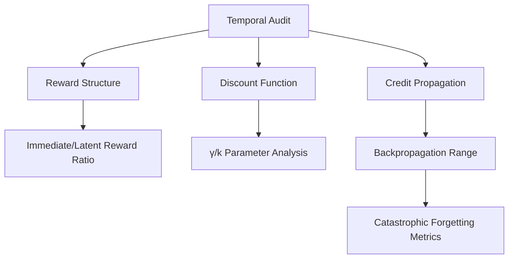

# Encyclopedia Galactica: Time-Dilated Reward Signals


## Table of Contents


1. [Section 1: The Temporal Credit Assignment Problem](#section-1-the-temporal-credit-assignment-problem)

2. [Section 2: Neuroscience Foundations of Reward Timing](#section-2-neuroscience-foundations-of-reward-timing)

3. [Section 3: Algorithmic Evolution in Machine Learning](#section-3-algorithmic-evolution-in-machine-learning)

4. [Section 4: Mathematical Formalisms and Models](#section-4-mathematical-formalisms-and-models)

5. [Section 5: Cognitive and Behavioral Psychology Perspectives](#section-5-cognitive-and-behavioral-psychology-perspectives)

6. [Section 6: Computational Implementation Challenges](#section-6-computational-implementation-challenges)

7. [Section 7: Cross-Disciplinary Applications](#section-7-cross-disciplinary-applications)

8. [Section 8: Ethical Dimensions and Societal Implications](#section-8-ethical-dimensions-and-societal-implications)

9. [Section 9: Current Research Frontiers](#section-9-current-research-frontiers)

10. [Section 10: Future Trajectories and Concluding Synthesis](#section-10-future-trajectories-and-concluding-synthesis)


## Section 1: The Temporal Credit Assignment Problem

The very essence of learning – whether in a foraging squirrel, a chess grandmaster, or an autonomous rover on Mars – hinges on a deceptively simple yet profoundly complex question: **Which of my past actions caused this present outcome?** This fundamental challenge, known as the *Temporal Credit Assignment Problem*, represents a core computational and biological bottleneck in any system attempting to optimize behavior based on delayed consequences. It is the intricate puzzle of connecting cause and effect across the chasm of time, a puzzle that evolution began solving millions of years before artificial intelligence researchers grappled with its formalization.

Imagine training a dog. A treat given immediately after a successful "sit" command creates a clear, unambiguous link in the animal's mind. But what if the reward comes minutes after a complex sequence of actions – navigating an obstacle course, perhaps? The dog must somehow attribute the delayed pleasure not just to the final jump, but to the initial turn, the pause, the careful approach – actions now separated from the reward by intervening time and other behaviors. This is the temporal credit assignment conundrum in its most visceral form. The "credit" for the positive outcome (the treat) must be assigned *backwards* in time to the specific actions that genuinely contributed to it, diluted across the temporal sequence. Failure to solve this problem relegates an agent to reactive, myopic behaviors, incapable of true foresight or complex planning. The development of *time-dilated reward signals* – neural or algorithmic mechanisms that bridge temporal gaps, propagating evaluative feedback from outcomes back to their distant causal antecedents – is thus not merely a technical curiosity, but a foundational requirement for sophisticated intelligence, both natural and artificial.

### 1.1 Defining the Credit Assignment Conundrum

At its core, the Temporal Credit Assignment Problem (TCAP) arises from the inherent disconnect between the *proximal cause* (an action) and the *distal outcome* (a reward or punishment). While spatial credit assignment deals with attributing outcomes to the correct *component* within a system at a single moment (e.g., which neuron or circuit module fired), temporal credit assignment grapples with attributing outcomes to the correct *action* or *decision point* from a sequence stretching into the past. This temporal disconnect is ubiquitous:

*   **The Investment Lag:** A company invests heavily in research and development; the financial payoff, if it comes, may be years later. Which specific R&D decisions merit credit for the eventual success?

*   **The Ecological Delay:** A predator stalks prey, expending energy in a careful, silent approach. The critical moment – the pounce – is brief, but its success depends entirely on the preceding, invisible patience. How is the reward (food) linked to the preparatory stillness minutes before?

*   **The Educational Journey:** A student diligently studies complex material over months. The reward – understanding, a good grade, career success – arrives much later. Which specific study sessions or moments of perseverance deserve credit for the eventual outcome?

**Early Intimations in Animal Behavior:** The systematic study of TCAP has deep roots in comparative psychology. Edward Thorndike's seminal experiments with cats in "puzzle boxes" (circa 1898-1911) provided foundational insights. A cat confined in a box could escape by performing a specific action (pulling a loop, stepping on a platform). Thorndike observed that successful escapes became progressively faster over trials – evidence of learning. Crucially, he formulated his "Law of Effect": actions followed by satisfying consequences become more likely, while those followed by annoying consequences become less likely. While revolutionary, this law implicitly assumes a tight temporal coupling between action and consequence. Thorndike noted the difficulty animals had learning if the reward was significantly delayed. For instance, if the food reward was presented several seconds *after* the cat performed the correct escape mechanism and was already out of the box, learning was severely impaired or failed altogether. This highlighted the temporal binding window within which simple associative learning operates effectively.

Ivan Pavlov's work on classical conditioning also touched upon temporal aspects. While famous for the salivary reflex triggered by a bell paired *simultaneously* with food, Pavlov explored "trace conditioning." Here, the conditioned stimulus (e.g., a bell) ends *before* the unconditioned stimulus (food) begins, leaving a temporal gap or "trace." Learning under trace conditioning is far more difficult and neurologically demanding than simultaneous or delayed (overlapping) conditioning, directly illustrating the challenge of bridging even short temporal intervals.

**Spatial vs. Temporal: A Crucial Distinction:** It's vital to distinguish TCAP from the Spatial Credit Assignment Problem (SCAP). SCAP asks: "Which *component* of my current system (e.g., which neuron, which module in a neural network) is responsible for this outcome?" This is the problem addressed by mechanisms like backpropagation in neural networks, assigning error signals to individual weights based on their contribution to the final output *at a specific time step*. TCAP, conversely, asks: "Which *action* (or sequence of actions) taken at some *past time* is responsible for this outcome *now*?" While SCAP operates vertically within a system at a single moment, TCAP operates horizontally across the timeline of an agent's experience. Misattribution in spatial credit might lead to strengthening the wrong connection for a single decision; misattribution in temporal credit can lead an agent to repeat irrelevant past actions or neglect crucial ones that only bear fruit much later. The famous case of Clever Hans – the horse seemingly performing arithmetic, but actually responding to subtle, unconscious cues from his trainer – is a classic example of *spatial* misattribution (attributing the "answer" to the horse's internal calculation rather than the trainer's posture). TCAP misattribution would be like the horse pawing the ground three times and then receiving a sugar cube a minute later for sitting quietly; it might incorrectly associate the sugar cube with the pawing, not the sitting.

The core challenge of TCAP is thus the **exponential growth of possible causal pathways**. With each passing moment between an action and an outcome, the number of intervening events and alternative actions that *could* have influenced the outcome explodes combinatorially. Disentangling the true causal thread requires mechanisms capable of selectively reinforcing or weakening associations across potentially vast temporal expanses.

### 1.2 Biological Imperatives for Time-Dilation

Evolutionary pressure relentlessly favors organisms capable of transcending immediate impulses to secure greater future rewards. The ability to solve TCAP – to link present effort to future gain – confers profound survival and reproductive advantages, driving the development of sophisticated neural machinery for time-dilated reward signaling.

*   **Foraging and Caching:** A squirrel burying nuts in autumn engages in a quintessential TCAP-solving behavior. The effort (foraging, transporting, burying) is costly in the present. The reward (retrieving and consuming the nut) is delayed by weeks or months, potentially occurring in a different location and context. The squirrel's nervous system must create a persistent association between the specific caching action and the future nutritional reward, motivating the behavior despite the delay. Failure of this time-dilation mechanism would result in squirrels consuming all nuts immediately, facing starvation in winter.

*   **Predator-Prey Dynamics:** The patient stalking behavior of predators like big cats or wolves requires suppressing the immediate impulse to chase in favor of a stealthy approach that maximizes the probability of a successful kill later. The delayed reward (a large meal) must outweigh the immediate costs (energy expenditure, hunger pangs, opportunity cost) and be attributed to the *patience* and *stealth* exhibited earlier, not just the final sprint.

*   **Social Strategies and Reciprocity:** Many social behaviors involve delayed rewards. Altruistic acts (e.g., sharing food, defending group members) incur an immediate cost with the expectation of future reciprocation. Grooming alliances in primates or cooperative hunting require individuals to attribute positive outcomes (future support, a larger kill share) to their past cooperative investments, even if reciprocation occurs days later. This forms the bedrock of complex social structures.

**Neural Mechanisms: Bridging the Gap:** Biological systems employ intricate neural mechanisms to solve TCAP, primarily orchestrated by the basal ganglia and prefrontal cortex, heavily modulated by the neuromodulator dopamine.

*   **Dopaminergic Time Travel:** The discovery of dopamine neurons' role in encoding *reward prediction errors* (RPE) by Wolfram Schultz and colleagues in the 1980s and 1990s revolutionized our understanding. Dopamine neurons fire not simply to rewards themselves, but to *unexpected* rewards. Crucially, as an animal learns that a predictive cue (e.g., a light or sound) signals a future reward, the dopamine burst shifts from the time of the *reward delivery* to the time of the *predictive cue*. For example:

*   **Initial Learning:** Light ON -> No Dopamine; Reward -> Dopamine Burst.

*   **After Learning:** Light ON -> Dopamine Burst; Reward -> No Dopamine (if expected).

This shift represents a neural implementation of time-dilation. The dopamine signal at the cue time carries information about the *future* reward, effectively "tagging" the cue and the actions associated with it as valuable, long before the reward is physically received. The dopamine signal bridges the temporal gap, assigning credit to the earlier predictive event.

*   **Striatal "Time Cells" and Sequence Encoding:** Research reveals neurons in the striatum (a key basal ganglia structure) that fire at specific, consistent time intervals after a triggering event. These "time cells" form a neural timeline, providing a scaffold upon which sequences of actions and their expected outcomes can be mapped. They help bind actions occurring at different times into coherent, goal-directed sequences and allow the association of rewards to specific temporal landmarks within those sequences.

*   **Prefrontal Cortex: The Temporal Organizer:** The prefrontal cortex (PFC), particularly the dorsolateral regions, is critical for working memory and temporal integration. It maintains representations of goals and sub-goals over delays, actively holding information "online" and allowing past actions and future outcomes to influence present decisions. Damage to the PFC severely impairs delayed gratification and the ability to learn from delayed consequences, highlighting its central role in TCAP resolution.

**Comparative Biology: The Spectrum of Delay Tolerance:** The capacity to handle temporal delays varies dramatically across species, reflecting ecological niches and neural complexity.

*   **Rodents:** Generally exhibit steep temporal discounting. While capable of learning delayed reward tasks (e.g., pressing a lever for food delivered after a short delay), their tolerance is limited (seconds to minutes). Performance degrades rapidly as the delay increases. This aligns with ecological pressures favoring rapid exploitation of immediately available resources.

*   **Primates (Especially Great Apes and Humans):** Show significantly greater delay tolerance. The famous "Marshmallow Test" (Walter Mischel, Stanford, 1960s-70s) exemplifies this. Children offered one treat immediately or two treats after a delay (e.g., 15 minutes) demonstrated varying abilities to wait. Follow-up studies suggested correlations between wait times in childhood and later life outcomes (though with significant caveats regarding socioeconomics and methodology). Chimpanzees and bonobos also perform well on delay of gratification tasks, sometimes outperforming young children. This enhanced capacity correlates with the massive expansion and complexity of the primate prefrontal cortex.

*   **Corvids (Crows, Ravens, Jays):** Demonstrate remarkable delay tolerance and future planning abilities rivaling primates. Scrub jays, for instance, can remember *what* food they cached, *where*, and *when* (how long ago), adjusting retrieval behavior based on perishability – retrieving perishable worms before non-perishable nuts if a sufficient delay has passed. This suggests sophisticated neural mechanisms for binding actions (caching) to specific future outcomes (retrieval of edible food) across extended intervals.

The biological imperative is clear: organisms operating in complex, dynamic environments where cause and effect are separated by time *must* evolve neural mechanisms for time-dilated reward signaling to optimize survival strategies beyond simple reflexes. The sophistication of these mechanisms is a key determinant of behavioral flexibility and cognitive complexity.

### 1.3 Computational Frameworks for Delayed Rewards

Translating the biological imperative for temporal credit assignment into artificial systems presents formidable computational challenges. The core mathematical framework for sequential decision-making under uncertainty is the **Markov Decision Process (MDP)**. An MDP is defined by:

*   A set of states (`S`)

*   A set of actions (`A`)

*   A transition function (`T(s' | s, a)`): Probability of reaching state `s'` from state `s` by taking action `a`.

*   A reward function (`R(s, a, s')`): Immediate reward received after transitioning to state `s'` from state `s` via action `a`.

*   A discount factor (`γ`), where 0 ≤ `γ` ≤ 1.

The goal of an agent is to learn a policy (`π(a | s)`) that maximizes the expected cumulative discounted reward, known as the **return** (`G_t`): `G_t = R_{t+1} + γR_{t+2} + γ²R_{t+3} + ... = Σ_{k=0}^{∞} γ^k R_{t+k+1}`

This formulation immediately highlights the core computational challenges of TCAP:

1.  **The Discount Factor (`γ`):** This parameter is the algorithmic lever for time-dilation. A `γ` close to 1 makes the agent far-sighted, valuing future rewards almost as much as immediate ones. A `γ` close to 0 makes the agent myopic, focusing only on immediate rewards. Choosing `γ` involves a fundamental trade-off: high `γ` is necessary for long-term planning but makes credit assignment harder (rewards must propagate further back) and learning slower. Low `γ` simplifies credit assignment but risks catastrophic myopia. The exponential decay imposed by `γ^k` is a mathematical convenience but often mismatches biological (hyperbolic) and real-world discounting patterns.

2.  **The Horizon Problem:** MDPs can be finite-horizon (ending at a known time `T`) or infinite-horizon. Infinite-horizon problems are essential for ongoing tasks but exacerbate TCAP. How far into the future should the agent look? Practical algorithms must truncate the lookahead, creating a horizon beyond which rewards have negligible influence. Determining an effective horizon length is non-trivial and domain-specific.

3.  **The Curse of Dimensionality (Temporal):** As the time delay between action and consequence increases, the number of potential state-action trajectories that could have led to the current outcome grows exponentially. Evaluating the contribution of a single action taken hundreds or thousands of steps ago within this vast space is computationally intractable for brute-force methods. This explosion of possibilities is the temporal manifestation of the classic curse of dimensionality.

4.  **Sparse and Delayed Rewards:** In many realistic problems (e.g., learning to play a complex game like Go, or training a robot to perform multi-step manipulation), meaningful rewards are exceedingly rare and occur only after long sequences of actions. Most actions yield neutral feedback (reward = 0). This sparsity makes it incredibly difficult for an agent to discover which specific actions within the long sequence were actually crucial for the eventual success. It's like searching for a needle in a haystack where the needle only appears at the very end.

**Temporal Difference Learning: The Algorithmic Breakthrough:** Richard Sutton's development of **Temporal Difference (TD) Learning** in the 1980s provided a revolutionary framework for tackling TCAP computationally. TD learning leverages the Bellman equation, a recursive property of value functions in MDPs. The value of a state (`V(s)`) under an optimal policy is the immediate reward plus the discounted value of the next state: `V(s) = E[R + γV(s') | s]`.

TD learning estimates value functions by bootstrapping – updating the estimated value of a state based on the immediate reward and the estimated value of the *next* state. The simplest form, TD(0), updates the value estimate for state `s_t` as:

`V(s_t) ← V(s_t) + α [ R_{t+1} + γV(s_{t+1}) - V(s_t) ]`

The term in brackets, `δ_t = R_{t+1} + γV(s_{t+1}) - V(s_t)`, is the **TD error**. This is the computational analogue of the dopaminergic RPE signal. It quantifies the difference between the *predicted* value of being in state `s_t` (`V(s_t)`) and the *better estimate* obtained by experiencing the immediate reward `R_{t+1}` and the value of the new state `s_{t+1}` (`R_{t+1} + γV(s_{t+1})`).

**Why TD Solves TCAP:** TD learning propagates reward information *incrementally backwards* through the state sequence visited by the agent. When a reward is received, it immediately updates the value of the preceding state (`s_{t+1}`) via the TD error. On the *next* visit to the state *before that* (`s_t`), the updated value of `s_{t+1}` (which now incorporates the reward) is used to calculate a TD error that updates `V(s_t)`. This process continues, step-by-step, back through time. While the initial update for a state far removed from the reward is small, repeated experiences and updates allow the value signal to gradually propagate backwards, diluting the reward signal across the relevant temporal sequence and assigning credit to earlier states and actions that led to the eventual success. Sutton's TD(λ) algorithm generalized this further, elegantly averaging updates over multiple time steps using an eligibility trace mechanism for more efficient credit assignment.

**Hyperbolic Discounting: A Behavioral Challenge:** While exponential discounting (`γ^k`) is mathematically convenient and underpins TD learning, behavioral economics reveals that humans and animals often exhibit **hyperbolic discounting**. The perceived value of a delayed reward decreases proportionally to `1 / (1 + kD)`, where `D` is the delay and `k` is an individual discounting parameter. This leads to time-inconsistent preferences: a smaller, sooner reward might be preferred over a larger, later reward when both are far in the future, but as the smaller reward becomes imminent, the preference might flip. Integrating hyperbolic discounting into robust computational models of long-term credit assignment remains an active research area, bridging economics, psychology, and AI.

**The Challenge of Scale:** While TD learning provides a powerful mechanism, its effectiveness diminishes as the temporal gap between critical actions and outcomes becomes very large, or in environments with extremely sparse rewards. Propagating credit reliably across thousands or millions of time steps, amidst noise and non-stationarity, pushes the limits of current algorithms. This is starkly evident in complex games like Go (before AlphaGo) or StarCraft II, or in real-world robotics tasks requiring long sequences of precise manipulations before any success signal. The computational frameworks provide the essential tools – discounting, value functions, TD error – but scaling them to solve truly long-horizon TCAP efficiently and robustly is one of the grand challenges driving modern AI research, necessitating innovations like hierarchical decomposition, memory architectures, and advanced function approximation that will be explored in later sections.

### Synthesizing the Imperative

The Temporal Credit Assignment Problem is the Gordian Knot of learning across time. From Thorndike's cats struggling with delayed escape rewards to modern reinforcement learning agents attempting to master complex games or navigate real-world environments, the fundamental challenge persists: how to link distal outcomes back to their causal origins in a vast sea of intervening events. Biological evolution sculpted intricate neural machinery – dopamine prediction errors, striatal time cells, prefrontal temporal scaffolding – to dilate rewards across time, enabling foraging, hunting, social strategies, and long-term planning essential for survival. Computational frameworks, pioneered by TD learning, mathematically formalize this challenge within MDPs, leveraging discounting, value functions, and bootstrapped error signals to propagate credit backwards incrementally.

Yet, both biological and artificial systems face inherent limitations: the exponential growth of causal pathways, the curse of dimensionality over long horizons, the sparsity of meaningful feedback, and the tension between myopia and unmanageable credit propagation. The existence of time-dilated reward signals, whether in the firing patterns of midbrain dopamine neurons or the TD error calculations of an algorithm, is not merely advantageous but fundamentally *necessary* for any intelligence operating beyond the immediacy of the present moment. It is the mechanism that allows the past to inform the future, transforming mere reaction into foresight, and isolated actions into coherent, goal-directed plans.

**Transition to Neuroscience Foundations:** Having established the fundamental nature and necessity of the Temporal Credit Assignment Problem across biological and computational domains, we now delve deeper into the remarkable biological machinery that evolution has refined to solve it. Section 2 will explore the intricate neuroscience foundations of reward timing, dissecting the dopaminergic pathways, neural chronometry mechanisms, and developmental trajectories that underpin our ability to navigate a world where cause and effect are inextricably, yet distantly, linked.


---


## Section 2: Neuroscience Foundations of Reward Timing

The intricate dance between action and consequence across time finds its most elegant expression not in silicon, but in flesh and blood. Having established the fundamental necessity of time-dilated reward signals for overcoming the Temporal Credit Assignment Problem (TCAP) in Section 1, we now descend into the remarkable biological machinery that evolution has sculpted over millennia to solve this challenge. The human brain, alongside those of many other species, operates a sophisticated chronometric system – a biological time machine – capable of projecting reward expectations forward, binding distant outcomes to past actions, and enabling decisions that span seconds, minutes, or even years. This section explores the neural substrates and mechanisms underpinning this temporal wizardry, focusing on the star neuromodulator dopamine, specialized neural timing circuits, and the critical developmental journey that shapes our capacity for delayed gratification.

### 2.1 Dopamine and Temporal Prediction Errors: The Brain's Time-Traveling Messenger

The story of how brains bridge temporal gaps begins not with a clock, but with a prediction error signal – a neural computation that fundamentally reshaped our understanding of reward processing. For decades, dopamine was simplistically viewed as the brain’s "pleasure chemical," a reward signal firing when an animal received something desirable. This view was upended in the late 1980s and 1990s by the meticulous work of Wolfram Schultz and colleagues, primarily through recordings of dopamine neurons in the ventral tegmental area (VTA) and substantia nigra pars compacta (SNc) of awake, behaving primates.

**Schultz's Seminal Experiments: Shifting Signals Across Time:** Schultz trained monkeys to perform tasks where rewards (drops of juice) were predicted by sensory cues (e.g., a light or sound). The key finding was revolutionary:

1.  **Unexpected Reward:** When a reward was delivered unexpectedly, dopamine neurons fired a robust burst.

2.  **Predicted Reward:** Once the monkey learned that a specific cue reliably predicted a future reward, the dopamine response shifted dramatically. The burst now occurred at the time of the *predictive cue*, not at the time of the *reward delivery*. If the predicted reward arrived exactly as expected, dopamine activity at reward delivery was minimal or even suppressed.

3.  **Prediction Error:** Most crucially, if a predicted reward was *omitted*, dopamine neurons showed a pronounced *decrease* in firing (a dip below baseline) precisely at the time the reward was expected. Conversely, if an *unexpected* reward arrived, a burst occurred.

This pattern – bursts for better-than-expected outcomes and dips for worse-than-expected outcomes – revealed dopamine not as a simple reward signal, but as an encoder of **Reward Prediction Error (RPE)**. It signals the difference between actual and expected reward.

**Temporal Difference Encoding: Bridging the Gap:** The true power of this RPE signal lies in its temporal dimension. By shifting its firing from the reward itself to the predictive cue *earlier in time*, dopamine performs a critical time-dilation function. It effectively "tags" the cue, and crucially, the *actions* leading to or occurring around that cue, with the value of the *future* reward it predicts. This solves a core aspect of TCAP: it allows the brain to reinforce actions that lead to predictive cues of future reward, even if the ultimate payoff is delayed.

*   **Case Study: The Delayed Response Task:** Consider a monkey performing a task where it must remember the location of a briefly flashed cue, wait through a delay period (several seconds), and then make a saccade to the remembered location to receive a reward. Dopamine neurons exhibit a complex temporal profile. A burst might occur at the initial cue (signaling its predictive value), but crucially, sustained or phasic activity can also occur during the delay period itself, particularly if the animal is actively maintaining information or performing preparatory actions. This activity helps bridge the temporal gap, reinforcing the working memory processes and preparatory actions necessary for the eventual successful response and reward. If the reward is omitted after a correct response, a distinct dip occurs at the expected reward time, signaling the error and potentially weakening the association between the preparatory actions and the expected outcome.

**Implementation in the Basal Ganglia: The Actor-Critic Framework:** The basal ganglia, particularly the striatum (caudate, putamen, nucleus accumbens), serve as the primary neural substrate where dopamine's RPE signal instructs learning. The dominant computational model is the **Actor-Critic framework**, inspired by reinforcement learning:

1.  **Critic (Ventral Striatum - e.g., Nucleus Accumbens):** This component learns to predict the expected future reward (value) of states or situations. It receives dopamine RPE signals as a teaching signal. A positive RPE (dopamine burst) strengthens the neural connections that led to an *overestimation* of reward, increasing the value prediction for the current state/cue. A negative RPE (dopamine dip) weakens connections, decreasing the value prediction. Over time, the Critic learns accurate value estimates.

2.  **Actor (Dorsal Striatum - e.g., Caudate/Putamen):** This component learns and executes actions. It uses the value predictions from the Critic and the dopamine RPE signal to reinforce or weaken specific action policies. When an action leads to a better-than-expected outcome (positive RPE), dopamine facilitates synaptic plasticity (e.g., via Long-Term Potentiation, LTP) in striatal pathways representing that action, making it more likely to be chosen again in similar states. A worse-than-expected outcome (negative RPE) promotes Long-Term Depression (LTD), weakening the association.

**Temporal Precision and Limitations:** Dopaminergic RPE signaling exhibits remarkable temporal precision, capable of encoding predictions and errors on the scale of hundreds of milliseconds. However, its effectiveness diminishes over very long delays (minutes to hours). While it can bridge short gaps directly and support working memory during delays, solving TCAP over extended periods requires additional neural machinery for representing time itself and binding events across protracted intervals. This is where specialized chronometric circuits come into play.

### 2.2 Neural Chronometry Mechanisms: The Brain's Clocks and Calendars

To assign credit accurately across time, the brain needs more than a prediction error signal; it needs an internal representation of time’s passage and a way to bind specific events to specific moments within a sequence. This is achieved through a distributed network of "time cells," oscillatory rhythms, and contextual binding mechanisms.

**Striatal "Time Cells": Tagging Moments in Sequences:** A breakthrough discovery in the early 2010s revealed populations of neurons in the striatum and hippocampus that function as **"time cells."** Unlike traditional neurons that fire in response to specific sensory features or actions, time cells fire at specific, consistent latencies *after* a triggering event, effectively marking the passage of time within an epoch.

*   **Experiment:** In a landmark study by Howard Eichenbaum and colleagues, rats learned a task requiring them to run in a wheel or wait on a treadmill for a fixed delay period (e.g., 10 seconds) before being allowed to proceed to a reward location. Neurons in the dorsal striatum exhibited sequential firing: one population fired maximally immediately after the delay started, another fired a few seconds later, another at the midpoint, and yet another peaked just before the delay ended. Collectively, these populations formed a "tramline" or "time stamp" representation spanning the entire delay interval.

*   **Function:** These time cells provide a neural substrate for temporally structured expectations. They allow the brain to predict *when* a predicted event (like a reward) should occur. More importantly for TCAP, they create a temporal scaffold. An action taken at time "t=3 seconds" within a sequence can be specifically associated, via synaptic plasticity modulated by dopamine (which itself might be influenced by the time cell activity), with an outcome occurring at "t=10 seconds." This dramatically refines credit assignment compared to a system that only knows "something happened sometime before the reward." Damage to the striatum severely impairs the ability to learn tasks requiring precise timing of actions relative to cues or rewards.

**Cortical Oscillations: The Brain's Metronome:** Beyond dedicated time cells, the brain utilizes rhythmic electrical activity – **oscillations** – as a fundamental timing mechanism. Different frequency bands (delta, theta, alpha, beta, gamma) are associated with different cognitive functions and temporal scales. Critically, these oscillations can serve as an internal clock or pacemaker.

*   **Theta Oscillations (4-8 Hz):** Predominant in the hippocampus and entorhinal cortex, theta rhythms are crucial for timing in the seconds-to-minutes range. They are intimately linked to memory encoding and retrieval, particularly episodic memory (remembering specific events in sequence). Theta cycles provide discrete temporal windows ("theta cycles") within which neural firing can be precisely timed. Neurons representing sequential elements of an experience (e.g., locations in a maze, items in a list) fire at specific phases of the ongoing theta cycle – a phenomenon known as **phase precession**. This creates a compressed, temporally ordered neural representation of the sequence, essential for binding actions and outcomes separated by time.

*   **Beta Oscillations (12-30 Hz):** Often observed in sensorimotor cortex and basal ganglia during sustained motor preparation or anticipation of predictable events. Beta bursts can signal the *duration* of an expected interval or the maintenance of a motor plan over a delay. Suppression of beta power often coincides with movement initiation or the resolution of uncertainty.

*   **Gamma Oscillations (30-100+ Hz):** Associated with focused attention and the binding of different features (sensory, motor, mnemonic) into a coherent percept or event representation within very short time windows (tens of milliseconds). Gamma synchrony between different brain regions may help bind the "what," "where," and "when" of an experience occurring at a specific moment, a prerequisite for later credit assignment.

**Hippocampus: The Conductor of Temporal Context:** The hippocampus acts as a master integrator, binding together the "what," "where," and "when" of experiences into cohesive episodic memories. Its role in temporal credit assignment is multifaceted:

1.  **Sequence Encoding:** Hippocampal place cells not only encode location but also the order in which locations are visited. "Time cells" are abundant here, firing sequentially during delays or while traversing paths, providing a rich temporal code.

2.  **Temporal Context Binding:** The hippocampus links events that occur close in time, even if they are not causally related in the moment. This creates a temporal context. Later, if one event in that context (e.g., an action) leads to a delayed outcome, the reactivation of the hippocampal representation of the original context can facilitate the association between the past action and the present outcome. This is thought to occur during "offline" periods like sleep or rest, where hippocampal replay of recent sequences reinforces associations.

3.  **Episodic Future Thinking:** Humans (and possibly some other species) can mentally project themselves forward in time to simulate future outcomes of potential actions. The hippocampus, interacting with prefrontal cortex, is critical for this ability. Simulating future rewards allows for a form of "mental time travel" credit assignment, where the *simulated* future reward value can be used to reinforce current actions, even if the actual reward is highly delayed. Patients with hippocampal damage struggle with imagining future scenarios and exhibit impairments in decision-making involving delayed rewards.

**Integration: A Symphony of Timing:** These mechanisms work in concert. Imagine a rat learning to navigate a maze where turning left after a 5-second delay at a junction leads to a large reward, while turning right leads to a small immediate reward. Striatal time cells mark the passage of seconds during the delay at the junction. Cortical oscillations (e.g., theta in the hippocampus) provide a rhythmic framework. Dopamine RPE signals initially occur upon reward receipt but, as learning progresses, shift to fire at the junction upon seeing the cue that starts the delay period (predicting the future large reward). Hippocampal neurons encode the sequence: cue -> delay -> left turn -> reward location. The time cells and oscillatory phases provide the temporal scaffold that allows the dopamine burst at the cue to specifically strengthen the neural pathways responsible for initiating the *waiting* behavior during the delay and the subsequent left turn, effectively dilating the value of the large delayed reward back to the critical decision point. This coordinated activity solves the TCAP for this specific temporal sequence.

### 2.3 Developmental Trajectories of Reward Delay: Building the Temporal Bridge

The capacity to delay gratification is not innate; it is a cognitive skill that undergoes profound development, tightly linked to the maturation of specific neural circuits, particularly the prefrontal cortex (PFC). Understanding this trajectory reveals the neurobiological foundations of temporal discounting and its vulnerabilities.

**The Marshmallow Test Revisited: Beyond Willpower:** Walter Mischel's Stanford Marshmallow Test (late 1960s/early 1970s) is iconic: a child is offered one treat (e.g., a marshmallow) immediately or two treats if they can wait alone for 15-20 minutes. Follow-up studies suggested children who waited longer tended to have better life outcomes decades later (e.g., higher SAT scores, educational attainment, health). While later critiques highlighted the role of socioeconomic factors and the importance of trust in the experimenter, the test remains a powerful probe of delay tolerance. Neuroscience now provides deeper insight:

*   **Neural Maturation is Key:** The ability to wait correlates strongly with the structural and functional maturation of the **lateral prefrontal cortex (LPFC)**, particularly the dorsolateral prefrontal cortex (DLPFC). The LPFC is central to executive functions: working memory (holding the future reward in mind), cognitive control (suppressing the impulse to grab the immediate treat), and prospective thinking (imagining the larger future reward). Crucially, the PFC is one of the last brain regions to fully mature, continuing its development well into the mid-20s. Young children have relatively immature PFCs, making sustained delay of gratification exceptionally challenging. Functional MRI (fMRI) studies show that children who wait longer exhibit stronger activation in DLPFC during the waiting period and better functional connectivity between DLPFC and striatal reward regions.

*   **The Hot/Cool Systems Framework:** Mischel himself later proposed a neural model: the **"Hot System"** (amygdala, ventral striatum, orbitofrontal cortex) is impulsive, emotionally driven, reactive to immediate rewards, and dominant in early childhood. The **"Cool System"** (DLPFC, hippocampus, parietal cortex) is cognitive, reflective, focused on future goals and strategies, and develops later. Successful delay of gratification requires the Cool System to downregulate the Hot System. Children who succeed often employ cognitive strategies (e.g., covering their eyes, singing, thinking about the marshmallows as fluffy clouds) that engage the Cool System to distract from or reinterpret the tempting stimulus, dampening Hot System activity.

**Adolescence: The Temporal Discounting Vortex:** Adolescence is characterized by a paradoxical combination of advancing cognitive abilities and heightened risk-taking. This can be understood, in part, as a temporal discounting failure driven by asynchronous neural development:

1.  **Hormonal Surge and Striatal Hyper-reactivity:** Puberty triggers a surge in hormones and neurotransmitters that heighten sensitivity to immediate rewards and novel sensations. The ventral striatum (nucleus accumbens), central to processing reward and motivating approach behavior, becomes hyper-reactive during adolescence. fMRI studies consistently show amplified activation in the ventral striatum in response to rewards (especially social rewards) compared to children or adults.

2.  **PFC Lag:** While the reward system surges, the regulatory PFC is still maturing. The connectivity between PFC and striatum is undergoing significant reorganization and is not yet fully optimized for top-down control. This creates a vulnerability: the powerful drive for immediate reward (strong ventral striatum response) often overwhelms the still-developing capacity for future-oriented control (immature PFC regulation).

3.  **Hyperbolic Discounting in Action:** This neural imbalance manifests behaviorally as steeper temporal discounting. Adolescents disproportionately favor smaller immediate rewards over larger delayed ones compared to adults, especially in emotionally charged or socially salient situations. This contributes to risky behaviors like substance use (immediate high outweighing future health risks), reckless driving (thrill now vs. potential accident later), or delinquency (immediate gain vs. long-term consequences). It's not that adolescents cannot *understand* future consequences; it's that the *subjective value* of the immediate reward is amplified, and the cognitive/neural brakes are weaker.

**Long-Term Outcomes and Neural Plasticity:** Individual differences in delay tolerance established in childhood and adolescence show remarkable stability but are not immutable. The trajectory is shaped by both genetic predispositions and environmental factors:

*   **Early Adversity:** Chronic stress, neglect, or unstable environments can accelerate the development of the amygdala (Hot System) while impairing PFC (Cool System) development. This fosters a survival-oriented strategy prioritizing immediate certainty over uncertain future gains, leading to consistently steeper discounting. Studies show children from lower socioeconomic backgrounds often wait less time in Marshmallow-like tasks, reflecting an adaptive response to environments where promised future rewards are less reliable.

*   **Interventions and Plasticity:** The prolonged development of the PFC also represents a window of opportunity. Training in executive function skills (working memory, cognitive flexibility, inhibitory control), mindfulness practices, and fostering stable, predictable environments can strengthen PFC function and connectivity, improving delay tolerance. Cognitive Behavioral Therapy (CBT) for impulse control disorders explicitly targets strategies to amplify the salience of future consequences and dampen the pull of immediate urges. Neuroimaging studies confirm that successful interventions can enhance PFC activation and PFC-striatal connectivity during delay discounting tasks.

**Synthesizing the Developmental View:** The developmental trajectory of delay tolerance underscores that solving TCAP is a learned neural skill. It requires the coordinated maturation of a distributed network: the striatal reward system to signal value, dopamine to convey prediction errors and guide learning, chronometric cells and oscillations to mark time, the hippocampus to bind context, and, critically, the prefrontal cortex to exert top-down control, maintain future goals, and strategically manage the tension between immediate desire and long-term benefit. Adolescence highlights the fragility of this system when neural development is asynchronous. Understanding this trajectory is crucial not only for developmental psychology but also for designing AI learning systems that need to acquire robust long-horizon planning abilities through experience, potentially mimicking aspects of this developmental progression.

**Transition to Algorithmic Evolution:** The neuroscience foundations reveal an exquisitely complex biological system for diluting rewards across time, solving the credit assignment problem through prediction errors, internal clocks, and hierarchical control. This biological blueprint has served as a profound inspiration for artificial intelligence. Section 3 will chronicle the algorithmic evolution in machine learning, tracing how insights from dopamine signaling and neural chronometry fueled the development of computational methods like Temporal Difference learning, enabling machines to tackle increasingly complex tasks with delayed rewards, from mastering board games to navigating virtual worlds. The journey from the primate midbrain to silicon chips represents one of the most fruitful cross-disciplinary dialogues in modern science.


---


## Section 3: Algorithmic Evolution in Machine Learning

The intricate neural choreography described in Section 2 – where dopamine prediction errors dance with striatal time cells under the orchestration of prefrontal cortex – represents biology's elegant solution to the Temporal Credit Assignment Problem. Yet this biological marvel remained an untranslated poem until computational pioneers began deciphering its principles for artificial systems. The journey from dopaminergic firing patterns to silicon-based learning algorithms constitutes one of the most consequential cross-disciplinary syntheses in modern science. This section chronicles the algorithmic evolution that transformed theoretical insights into practical mastery over delayed rewards, tracing three revolutionary phases: the foundational birth of temporal difference learning, the neural network implementations that conquered complex games, and the deep reinforcement learning revolution that reshaped artificial intelligence.

### 3.1 Birth of Temporal Difference Learning: Bridging Theory and Time

The computational breakthrough in temporal credit assignment crystallized in the late 1980s through the seminal work of Richard Sutton. His development of **Temporal Difference (TD) Learning** formalized a computational analogue of dopaminergic reward prediction errors, creating a mathematically rigorous framework for propagating rewards backward through time. The genesis occurred not in isolation, but through a dialectic between existing methods and biological insight.

**The Monte Carlo Limitation:** Prior to TD, **Monte Carlo (MC) methods** dominated reinforcement learning. MC agents would execute entire episodes (e.g., a full game of checkers) and assign credit by updating value estimates based on the *final* outcome. For a win, all actions in the sequence received equal reinforcement; for a loss, all were penalized. While simple, this approach suffered catastrophic inefficiencies:

1.  **Episodic Prison:** Learning could only occur after episode completion, wasting intermediate experience.

2.  **Blunt Credit Assignment:** All actions received identical credit regardless of their true causal contribution. A brilliant early move and a catastrophic late error would both be equally credited or blamed based solely on the final outcome.

3.  **Variance Explosion:** Outcomes in stochastic environments vary wildly, making value estimates slow to converge.

Sutton recognized these limitations mirrored the constraints of simple animal conditioning observed by Thorndike and Pavlov – where delayed rewards impaired learning. Inspired by neuroscientific work on predictive dopamine signaling (though Schultz's primate data was still emerging), Sutton formulated TD learning as a computational implementation of *bootstrapping* – using current predictions to refine future ones.

**The TD(λ) Revolution (1988):** Sutton's landmark paper "Learning to Predict by the Methods of Temporal Differences" introduced the TD(λ) algorithm, a unifying framework that elegantly addressed temporal gaps. Its core innovation was the **TD error**:

`δₜ = Rₜ₊₁ + γV(Sₜ₊₁) - V(Sₜ)`

This deceptively simple equation became the computational dopamine signal. Where:

- `Rₜ₊₁` = Immediate reward

- `γ` = Discount factor (prioritizing immediate vs. future rewards)

- `V(Sₜ₊₁)` = Estimated value of the *next* state

- `V(Sₜ)` = Estimated value of the *current* state

The TD error `δₜ` quantifies the discrepancy between the predicted value of the current state (`V(Sₜ)`) and the better estimate (`Rₜ₊₁ + γV(Sₜ₊₁)`). Crucially, it updates value estimates incrementally *after each step*, not just at episode termination. Positive `δₜ` increases `V(Sₜ)`, propagating credit backward; negative `δₜ` decreases it, assigning blame.

The `λ` parameter introduced a sophisticated memory mechanism: **eligibility traces**. These traces act like fading "footprints" marking recently visited states and actions. When `δₜ` occurs, it doesn't just update the immediately preceding state; it propagates backward along the trail of eligibility traces, with earlier states receiving less credit (weighted by `λ`). This elegantly interpolated between:

- `TD(0)` (pure step-by-step updating, `λ=0`)

- `MC` (episodic updating, effectively `λ=1`)

**Arthur Samuel's Checkers Prelude:** While Sutton formalized TD, early glimmers appeared in Arthur Samuel's pioneering checkers program (1959). Samuel implemented "rote learning" – saving board positions and outcomes – and a primitive form of temporal credit assignment he called "signature tables." His program adjusted weights based on the difference between intermediate and final board evaluations, a conceptual precursor to TD error. Though limited by 1950s hardware, Samuel's program achieved amateur proficiency and demonstrated machines could learn from delayed rewards. When Sutton later analyzed Samuel's work, he recognized it as an empirical discovery of temporal difference principles decades before their formalization.

**Early Triumphs: Algorithmic Games as Proving Grounds:** TD learning found immediate traction in deterministic games with clear delayed rewards:

1.  **Acrobot Swing-Up (1995):** Sutton and colleagues tackled this classic control problem: a two-link pendulum must swing upright from a hanging position. The reward (success) occurs only after a precise sequence of actions. TD methods learned policies 10x faster than MC approaches by efficiently propagating sparse success signals backward through the action sequence.

2.  **Gridworld Navigation:** Simple maze environments became testbeds for TD(λ). Agents learned optimal paths to goals by propagating goal rewards backward through visited states. Experiments demonstrated how higher `λ` values accelerated learning in environments with long delays between actions and rewards by preserving longer temporal credit trails.

3.  **Early Backgammon Systems:** Before TD-Gammon (discussed next), Berrik Treadgold and Peter G. Harrison developed NeuroGammon (1990), which used neural networks trained with TD methods. Though less successful than later systems, it demonstrated TD's potential in stochastic games.

The birth of TD learning represented a paradigm shift: it replaced episodic reinforcement with continuous prediction-error-driven learning, mirroring the brain's real-time dopamine-guided plasticity. Sutton's framework provided the mathematical language to translate the neuroscience of reward timing into algorithmic reality.

### 3.2 Neural Network Implementations: Conquering Complexity with Connectionism

While powerful in tabular settings (where states could be exhaustively enumerated), TD methods faced the curse of dimensionality in complex environments with vast state spaces. The solution emerged from combining TD with neural networks, culminating in a landmark achievement that stunned the AI community: TD-Gammon.

**TD-Gammon (1992-1995): The Game-Changer:** Gerald Tesauro's TD-Gammon stands as one of the most influential demonstrations in reinforcement learning history. It employed a simple 1-hidden-layer neural network (40 hidden units) trained entirely by TD(λ) learning through self-play. The architecture was revolutionary:

1.  **Input Representation:** 198 units encoding the backgammon board state (positions of all pieces).

2.  **Output:** 4 units representing predicted probabilities of win/win-with-gammon/loss/loss-with-gammon.

3.  **Learning:** After each move, the network updated its weights based on the TD error between its pre-move prediction and the post-move prediction (or final outcome). Tesauro used `λ ≈ 0.7`, balancing immediate updates with longer-term credit propagation.

**The Impact:** Within weeks of self-training, TD-Gammon reached strong intermediate play. After months and numerous architectural tweaks (version 3.0), it rivaled the world's best human players. Its achievements were profound:

- **Superhuman Performance:** It achieved an Elo rating estimated at 98.5% of the world champion level.

- **Strategic Innovation:** TD-Gammon discovered non-intuitive strategies, particularly in opening moves and doubling cube decisions, which were later adopted by top human players. It demonstrated emergent understanding of complex positional play and risk assessment over long game sequences.

- **Biological Plausibility:** Tesauro noted parallels with biological learning: the network learned entirely from experience (self-play) without explicit programming, mirroring trial-and-error learning. Its distributed representations resembled population coding in neural circuits.

**The Vanishing Gradient Challenge:** While TD-Gammon succeeded in backgammon (a game with inherent randomness that smooths the learning landscape), applying TD to recurrent neural networks (RNNs) for *partially observable* or *long-horizon* tasks revealed a critical flaw: the **vanishing gradient problem**. When training RNNs using Backpropagation Through Time (BPTT), gradients used to update weights diminish exponentially as they propagate backward through time. For sequences longer than 10-20 steps, credit assignment became impossible – early actions received negligible updates regardless of their true impact. This manifested starkly in attempts to apply TD learning to complex strategy games like Go or real-world robotics tasks, where critical actions could precede outcomes by hundreds or thousands of steps.

**LSTMs: Memory Augmented Credit Assignment:** The solution arrived with Sepp Hochreiter and Jürgen Schmidhuber's **Long Short-Term Memory (LSTM)** architecture (1997). LSTMs introduced a gated memory cell designed to maintain information over extended durations:

1.  **Gating Mechanisms:** Forget gates decided what information to discard. Input gates regulated updates to the cell state. Output gates controlled information flow to the next layer.

2.  **Constant Error Carousel:** Crucially, the cell state's linear activation allowed gradients to flow backward with minimal decay, solving the vanishing gradient problem for long sequences.

**Case Study: LSTMs in Robotics:** Consider a robot learning to pour liquid into a cup. The critical action (tilting the bottle) occurs seconds before the outcome (success/failure). A standard RNN trained with TD struggles to link the tilt angle to the eventual outcome due to vanishing gradients. An LSTM, however, maintains an internal representation of the "bottle-tilting" action. When the outcome (spillage or success) occurs, the TD error propagates directly back through the LSTM's cell state to the precise moment of tilting, enabling accurate credit assignment across the delay. By 2015, LSTMs combined with TD learning were enabling robots to learn multi-step manipulation tasks with delays of 5-10 seconds – previously impossible with vanilla RNNs.

The neural network phase demonstrated that TD learning could scale to high-dimensional problems. Yet limitations remained: feature engineering was often required (e.g., Tesauro hand-crafted backgammon inputs), and LSTMs struggled with *extremely* long horizons or sparse rewards. The stage was set for the deep learning revolution.

### 3.3 Deep Reinforcement Learning Revolution: Scaling Time-Dilated Learning

The convergence of deep neural networks, scalable TD algorithms, and massive computational power ignited the Deep Reinforcement Learning (DRL) revolution around 2013. This phase overcame previous limitations by enabling end-to-end learning from raw sensory input and tackling environments with unprecedented temporal complexity.

**DQN: The Atari Breakthrough (2013-2015):** DeepMind's **Deep Q-Network (DQN)** marked a watershed moment. It combined Q-learning (a TD method estimating action values) with convolutional neural networks (CNNs) to learn directly from Atari 2600 pixels. Key innovations addressed temporal credit assignment in high-dimensional spaces:

1.  **Experience Replay:** Stored state-action-reward transitions in a buffer and sampled them randomly during training. This broke temporal correlations in data and allowed rare, rewarding events to be replayed multiple times, amplifying their credit signal.

2.  **Target Network:** A separate "target" network provided stable Q-value estimates for TD error calculation (`δₜ = Rₜ₊₁ + γ maxₐ Q_target(Sₜ₊₁, a) - Q(Sₜ, Aₜ)`). This reduced harmful feedback loops where rapidly changing Q-values destabilized learning.

3.  **End-to-End Learning:** The CNN processed raw pixels (210x160 RGB) into features, automatically discovering relevant spatio-temporal patterns without manual engineering.

**Impact:** DQN achieved human-level or superhuman performance on 29 of 49 Atari games. Games like *Seaquest* (requiring oxygen management and strategic surfacing) and *Montezuma's Revenge* (featuring long reward chains) demonstrated unprecedented temporal credit assignment. In *Boxing*, DQN learned complex strategies: it would corner opponents and unleash combos, showing implicit understanding of action sequences yielding delayed payoffs. However, DQN struggled with games requiring very long-term planning (e.g., *Montezuma's Revenge* initially) or precise motor sequences.

**Policy Gradients: Direct Action Optimization:** While DQN estimated value functions, **Policy Gradient (PG)** methods optimized policies directly. The REINFORCE algorithm (Ronald Williams, 1992) pioneered this approach:

`∇J(θ) ∝ E[Gₜ ∇ ln π(Aₜ|Sₜ; θ)]`

Where `Gₜ` is the return (cumulative reward). PG updates increased the probability of actions proportional to their long-term consequences (`Gₜ`). However, high variance plagued early PG methods. The **Proximal Policy Optimization (PPO)** algorithm (John Schulman et al., 2017) revolutionized PG by:

1.  **Clipped Surrogate Objective:** Constraining policy updates to prevent destructive changes.

2.  **Advantage Estimation:** Using TD errors (`δₜ`) as low-variance estimates of `Gₜ`, blending PG with TD concepts. The generalized advantage estimator (GAE) further reduced variance by combining multi-step TD returns.

**Case Study: Dota 2 (2018):** OpenAI Five used PPO to master the complex team-based game Dota 2. Matches lasted 45+ minutes, involving thousands of actions per agent with rewards delayed by minutes or hours. PPO's stable credit assignment enabled learning coordinated strategies like "smoke ganks" (stealthy ambushes planned minutes in advance) by propagating teamfight victories back to preparatory actions. The system played 180 years of game time daily across massive compute clusters, demonstrating scalable temporal credit assignment.

**HER: Rewriting History for Sparse Rewards:** Even DRL faltered in environments with *extremely* sparse rewards. The **Hindsight Experience Replay (HER)** algorithm (Andrychowicz et al., 2017) provided an ingenious solution. In robotic tasks (e.g., pushing a block to a target), success rewards were vanishingly rare. HER's insight: treat failures as successes for *alternative* goals.

1.  **Goal Relabeling:** After a failed episode where the robot knocked the block off the table, HER would relabel the experience as if the block's *final* position (off the table) was the *intended* goal. The robot received a "reward" for achieving this unintended outcome.

2.  **Multi-Goal Learning:** The agent learned a general policy mapping states and goals to actions. By relabeling goals in failed trajectories, HER generated abundant learning signals, teaching the agent how actions influence object dynamics. When deployed with the *true* goal (block on target), the pre-trained policy achieved it efficiently.

**Robotic Manipulation Breakthrough:** HER enabled robots to learn complex tasks with binary rewards (success/failure) and delays of 20+ actions. A robot arm learning to slide a block precisely into a slot might fail 99% of attempts initially. HER transformed each failure into a lesson: "This is how you move the block to position X." Within hours, the robot generalized to reliably achieve the true goal, demonstrating robust temporal credit assignment where standard DQN or PPO failed.

**The Persistent Challenge of Time:** Despite these advances, temporal credit assignment remains DRL's Achilles' heel. AlphaGo (2016) mastered Go using Monte Carlo Tree Search (effectively planning) combined with supervised learning, bypassing pure TD learning for long-term credit. AlphaStar (StarCraft II, 2019) used a hybrid approach with temporal convolutions and supervised imitation learning. Truly sparse, long-horizon problems like climate strategy optimization or lifelong learning still strain current TD-based methods. The core tension Sutton identified in 1988 persists: balancing immediate updates (low variance but biased) with long-term returns (unbiased but high variance).

**Transition to Mathematical Formalisms:** The algorithmic evolution from TD(λ) to HER demonstrates remarkable ingenuity in tackling temporal credit assignment. Yet beneath these engineering triumphs lie deep mathematical principles governing how rewards propagate through time. Section 4 will dissect the formal frameworks – Bellman equations, hyperbolic discounting, POMDPs, and Bayesian inference – that provide the theoretical bedrock for time-dilated reward signals. Understanding these formalisms is essential for advancing beyond heuristic solutions toward a unified theory of temporal credit assignment capable of spanning biological and artificial intelligence.


---


## Section 4: Mathematical Formalisms and Models

The algorithmic triumphs chronicled in Section 3 – from TD-Gammon's backgammon mastery to DQN's Atari conquests and HER's robotic breakthroughs – represent engineering marvels built upon profound mathematical foundations. These innovations didn't emerge from heuristic tinkering alone but were guided by rigorous formalisms that quantify how rewards propagate across temporal chasms. Having witnessed the *how* of time-dilated learning in artificial agents, we now dissect the *why* – the core mathematical frameworks that enable precise representation and computation of delayed rewards. This section unveils the elegant, often intricate, formal structures governing temporal credit assignment: the recursive beauty of value functions, the probabilistic gymnastics required under uncertainty, and the statistical machinery quantifying risk in future outcomes.

### 4.1 Value Function Approximations: The Calculus of Future Expectations

At the heart of temporal credit assignment lies the **value function** – a mathematical oracle predicting the cumulative future rewards an agent can expect from any given state or state-action pair. Formally approximating this function is the linchpin for solving the Temporal Credit Assignment Problem (TCAP) computationally. The journey begins with the foundational Bellman equation.

**Bellman Equations: Recursive Oracles for Infinite Horizons:** The Bellman equation, named after Richard Bellman (1957), provides the recursive blueprint for value functions. For a state `s`, under a policy `π`, its value `V^π(s)` is defined as:

`V^π(s) = Σ_a π(a|s) Σ_s' T(s'|s,a) [ R(s,a,s') + γ V^π(s') ]`

This deceptively simple equation encodes a profound truth: **the value of the present is the expected immediate reward plus the discounted value of the future.** It elegantly decomposes the daunting task of summing rewards over an infinite future into a recursive relationship between adjacent states. For the optimal value function `V*(s)` (maximizing cumulative reward), the Bellman optimality equation states:

`V*(s) = max_a Σ_s' T(s'|s,a) [ R(s,a,s') + γ V*(s') ]`

**Why Bellman Matters for Time-Dilation:**

1.  **Credit Propagation Engine:** The equation is the mathematical engine powering Temporal Difference (TD) learning (Section 3.1). The TD error `δₜ = Rₜ₊₁ + γV(sₜ₊₁) - V(sₜ)` directly measures the violation of the Bellman equation at time `t`. Minimizing this error drives learning, propagating credit backwards step-by-step.

2.  **Infinite Horizon Tractability:** By expressing `V(s)` in terms of `V(s')`, the Bellman equation sidesteps the need to explicitly sum rewards over an infinite future. Solutions exist through dynamic programming (Value Iteration, Policy Iteration) or iterative approximation (TD learning), even for infinite-horizon problems.

3.  **Fixed Point Guarantees:** Under mild conditions, the Bellman operator is a contraction mapping. Applying it repeatedly converges to a unique fixed point – the true value function. This theoretical guarantee underpins the stability of TD learning algorithms.

**The Discount Rate (`γ`): Taming Infinity, Shaping Time Preference:** The discount factor `γ` (0 ≤ `γ` < 1) is the mathematical scalpel controlling time-dilation. It encodes the agent's time preference:

*   `γ ≈ 1`: **Far-Sighted Agent.** Future rewards are valued almost as much as immediate ones. Essential for long-term planning but increases variance and slows credit propagation over vast temporal distances (e.g., `γ^1000` is negligible only if `γ` is sufficiently less than 1).

*   `γ ≈ 0`: **Myopic Agent.** Focuses only on immediate rewards. Simplifies credit assignment but risks catastrophic short-termism (e.g., a robot might push an object off a table for immediate reward, ignoring future penalties).

**Exponential vs. Hyperbolic Discounting: The Rationality Divide:** While `γ^k` (exponential discounting) is mathematically convenient and guarantees time-consistent preferences (if you prefer $110 in 31 days over $100 in 30 days, you'll prefer $110 tomorrow over $100 today), human and animal behavior consistently violates it. We exhibit **hyperbolic discounting**, where value decays proportionally to `1/(1 + kD)`, with `D` being delay and `k` a sensitivity parameter. This leads to **time inconsistency**:

*   **Mathematical Form:** Value of reward `R` at delay `D`: `V(R, D) = R / (1 + kD)`

*   **Behavioral Paradox:** Offered $100 today or $110 tomorrow, many choose $100. Offered $100 in 365 days or $110 in 366 days, most choose $110. The preference reverses as the smaller reward becomes imminent, violating the stationarity axiom of rational choice theory implied by exponential discounting.

*   **Computational Challenge:** Integrating hyperbolic discounting into standard TD frameworks like Q-learning is non-trivial. The Bellman equation loses its elegant recursive form because the discount rate becomes delay-dependent. Solutions involve:

*   **State Augmentation:** Adding elapsed time or time-to-goal as part of the state.

*   **Quasi-Hyperbolic Models (β-δ):** A hybrid approach: `V = R₀ + βΣ_{t=1}^{∞} δ^t Rₜ`, where `β < 1` captures present bias. This approximates hyperbolic decay early on while preserving some recursive structure.

*   **Case Study - Retirement Savings:** A rational exponential discounter (`γ=0.97/year`) might save consistently. A hyperbolic discounter (`k=0.5/year`) heavily discounts distant retirement, leading to procrastination. Software like the `Bondora` platform uses quasi-hyperbolic models to predict user savings behavior and design nudges.

**SARSA: On-Policy Temporal Control:** While Q-learning (an off-policy algorithm estimating `Q*(s,a)`) is widely used, **SARSA (State-Action-Reward-State-Action)** provides the quintessential on-policy TD control formalism. Its update rule:

`Q(Sₜ, Aₜ) ← Q(Sₜ, Aₜ) + α [ Rₜ₊₁ + γ Q(Sₜ₊₁, Aₜ₊₁) - Q(Sₜ, Aₜ) ]`

**Why SARSA Matters:**

1.  **On-Policy Learning:** SARSA learns the value of the policy it's *actually following* (`π`), including its exploration noise (e.g., ε-greedy). This is crucial when the optimal policy might be dangerous during learning.

2.  **Cliff Walking Example:** Consider a gridworld with a rewarding goal and a cliff edge. A short path exists along the cliff. Q-learning (seeking `max_a Q(s',a)`) learns the optimal cliff-edge path but risks falling during exploration. SARSA (using `Q(s', a')` where `a'` is the *next action taken*, which might be exploratory) learns a safer, slightly longer path, associating the cliff-edge state with the *potential* exploratory fall (negative reward) via the chosen `a'`.

3.  **Formalizing Exploration-Exploitation Trade-off:** SARSA inherently incorporates the exploration strategy into its value estimates, directly linking the temporal consequences of exploration decisions to the learned policy.

Value function approximations, whether tabular or via deep neural networks (DQN), provide the core calculus for quantifying the long-term worth of present states and actions. They translate the biological imperative for foresight (Section 2) into algorithmic reality (Section 3). However, they assume the agent perceives the true state of the world – an assumption often shattered in reality.

### 4.2 Partial Observability Extensions: Reasoning Under the Veil

Real-world agents rarely enjoy perfect knowledge. Sensors are noisy, information is incomplete, and the true state of the environment (`s`) is hidden. This **Partial Observability** transforms the MDP into a **Partially Observable Markov Decision Process (POMDP)**, radically complicating temporal credit assignment. How can an agent assign credit for a delayed outcome to actions taken when it wasn't even sure what state it was in?

**POMDP Formalism: Belief Over States:** A POMDP is defined by:

*   States `S`, Actions `A`, Transition `T(s'|s,a)`, Reward `R(s,a,s')`

*   Observations `O`

*   Observation Function `Z(o|s',a)`: Probability of seeing observation `o` after action `a` leads to state `s'`.

*   **Belief State `b`:** A probability distribution over `S` (`b(s) = P(s | history)`). `b` is a *sufficient statistic* – it summarizes all relevant history.

**The Credit Assignment Nightmare:** Consider a robot using a noisy camera to navigate a cluttered warehouse. It takes an action (e.g., "move forward"), receives a blurry image (observation), and much later collides. Was the collision due to:

1.  A poor action choice *given the true state*?

2.  Misperception of the state (e.g., failing to see an obstacle)?

3.  An unlucky transition (e.g., an unseen object fell)?

Disentangling these requires propagating credit/blame not just back through time, but also through the agent's evolving *uncertainty* about the world.

**Belief State Representations and Updates:** Maintaining and updating the belief state is central. Using Bayes' theorem:

`b'(s') = P(s' | o, a, b) = η Z(o|s',a) Σ_s T(s'|s,a) b(s)`

Where `η` is a normalization constant. This update fuses:

1.  **Prior Belief (`b(s)`):** Previous state uncertainty.

2.  **Transition Dynamics (`T(s'|s,a)`):** How actions change the (hidden) state.

3.  **Observation Likelihood (`Z(o|s',a)`):** How well the observation reflects the new state.

**Example - Robotic Navigation Under Uncertainty:** A cleaning robot in a large house might start with a uniform belief over rooms. After moving "North" and sensing a distinctive rug pattern (`o`), it updates `b`, concentrating probability on rooms containing that rug. If it later docks successfully, credit assignment must link this success back to the "move North" action *given the belief state it held at that time*, which depended on its *previous* perceptual history. The challenge is maintaining and reasoning over this high-dimensional `b(s)`.

**The Curse of Dimensionality (Belief Space):** The belief state exists in a continuous, high-dimensional space (`|S|`-dimensional simplex). Solving POMDPs optimally is PSPACE-complete – computationally intractable for all but tiny problems. This necessitates approximations:

1.  **Information-State Space MDPs:** Treat the belief state `b` itself as the state in a new, fully observable "information-state MDP." The value function becomes `V(b)`. While conceptually elegant, the continuous, high-dimensional nature of `b` makes this impractical without approximation.

2.  **Point-Based Value Iteration (PBVI):** Samples a set of representative belief points `B` and performs value updates only on these points, interpolating elsewhere. Algorithms like Perseus or HSVI2 efficiently approximate `V(b)`.

3.  **QMDP & FIB:** Simpler approximations:

*   **QMDP:** Assumes full observability *after* the next action. Computationally cheap but ignores the value of information gathering.

*   **Faster Information Lower Bound (FIB):** A tighter bound than QMDP, incorporating some information value.

4.  **Deep Learning Approaches:** Utilize Recurrent Neural Networks (RNNs), LSTMs, or Transformers to compress the observation-action history `h_t = (o₀, a₀, o₁, a₁, ..., o_t)` into a latent state `h_t` serving as an approximate belief state. The network `f_θ(h_t) ≈ b(s_t)` or directly outputs values/actions. This was key to DeepMind's success in StarCraft II (AlphaStar), where the true game state (unit positions, resources) is only partially observed via the screen viewport.

**Case Study - Medical Diagnosis & Treatment:** A POMDP perfectly models a doctor treating a chronic illness. The true disease state (`s`) is hidden. Observations (`o`) are symptoms and test results (often noisy/partial). Actions (`a`) are treatments or diagnostic tests. Rewards are long-term patient health outcomes. Assigning credit for a positive outcome 6 months later to a specific treatment choice requires reasoning about the evolving belief state over the disease progression throughout the entire treatment history, amidst noisy observations. POMDP solvers are used in personalized medicine frameworks like `POMDPy.jl` to optimize such sequential decisions under uncertainty.

Partial observability forces agents to navigate a fog of uncertainty. Temporal credit assignment must now account not only for the delay between action and outcome but also for the agent's evolving perceptual limitations and the intrinsic ambiguity of the world itself. This leads naturally to the broader challenge of quantifying uncertainty in the value estimates themselves.

### 4.3 Uncertainty Quantification Frameworks: Embracing the Unknown

Traditional value functions estimate *expected* cumulative reward. However, many delayed outcomes involve significant risk or variability. Knowing the *distribution* of possible future returns, not just the average, is critical for robust decision-making. How risky is that investment? How variable is the payoff from this research direction? Quantifying this uncertainty is paramount for sophisticated temporal credit assignment.

**Bayesian Temporal Difference Learning: Beliefs over Values:** Bayesian TD learning treats the value function itself as uncertain. Instead of a single point estimate `V(s)`, it maintains a posterior distribution `P(V | experience)`.

*   **Formalization:** For linear function approximation (`V(s) ≈ θᵀ φ(s)`), Bayesian regression can be applied. The prior `P(θ)` (e.g., Gaussian) is updated using the TD error as a noisy observation of the value difference. The posterior `P(θ | data)` captures uncertainty over the weights `θ`, propagating to uncertainty over `V(s)`.

*   **Benefits:**

1.  **Directed Exploration:** Agents can prioritize exploring states or actions where value uncertainty is high (Bayesian Exploration Bonus, Thompson Sampling).

2.  **Robustness:** Decisions can incorporate risk aversion by favoring actions with higher certainty or better worst-case scenarios.

3.  **Modeling Cognitive Uncertainty:** Provides a computational framework for how biological agents might represent uncertainty in value predictions, potentially encoded in neural firing rate variability or neuromodulator levels beyond dopamine.

*   **Implementation:** Gaussian Process Temporal Difference Learning (GPTD) and Kalman TD (see below) are specific Bayesian approaches. Variational Bayesian methods scale to complex function approximators like neural networks (Bayesian Deep RL).

**Distributional Reinforcement Learning: The Full Return Distribution:** Pioneered by Bellemare, Dabney, and Munos (2017), Distributional RL shifts the goal from learning the *expected* return `Q(s,a) = E[Z(s,a)]` to learning the full probability distribution `Z(s,a)` of the random return.

*   **Mathematical Shift:** Instead of minimizing the Bellman error on the mean (`δₜ`), Distributional RL minimizes a distance metric (e.g., Wasserstein metric, KL divergence) between the distribution of `Z(s,a)` and the distribution of the target `R + γ Z(S', A')`. The Bellman equation becomes a distributional operator: `TZ(s,a) = R + γ Z(S', A')`.

*   **Key Algorithms:**

*   **C51 (Categorical 51):** Discretizes the return distribution into 51 fixed support atoms. Projects the target distribution `TZ` onto this support using a KL divergence minimization. Achieved state-of-the-art on Atari.

*   **Quantile Regression DQN (QR-DQN):** Models the distribution implicitly by learning quantiles (e.g., the median, 10th percentile, 90th percentile). More flexible than fixed supports.

*   **Implicit Quantile Networks (IQN):** Samples quantile fractions `τ ~ Uniform(0,1)` and conditions the network on `τ`, learning a richer representation of the return distribution.

*   **Why Distribution Matters: Risk-Sensitive Policies:**

*   **Variance Matters:** An action leading to a guaranteed return of 50 is preferable to one with mean 50 but variance 100 (potential for 0 or 100) for a risk-averse agent.

*   **Skew Matters:** An action with mean 50 but a long left tail (high chance of very low returns) might be avoided, while one with a long right tail (chance of very high returns) might be favored, even with the same mean.

*   **Case Study - High-Stakes Trading:** In algorithmic trading, maximizing expected profit might lead to ruinous risks. Distributional RL agents (e.g., using QR-DQN) can optimize Conditional Value-at-Risk (CVaR) – the expected return in the worst `α%` of cases – leading to more robust strategies that survive rare "black swan" events. Platforms like `QuantConnect` integrate distributional RL concepts.

*   **Case Study - Atari Seaquest:** C51 learned distinct strategies based on risk. When oxygen was low, it prioritized surfacing (low variance action for survival). When oxygen was plentiful, it pursued higher-variance strategies (chasing high-point submarines) because the potential upside outweighed the risk.

**Kalman Temporal Differences: Optimal Filtering for Values:** Kalman TD (Geist & Pietquin, 2010) applies Kalman filtering – the optimal estimator for linear Gaussian systems – to the value estimation problem. It models the value function as a hidden state evolving over time.

*   **State-Space Model:**

*   **Observation Model:** `δₜ = V(sₜ) - γV(sₜ₊₁) = Rₜ₊₁ + ηₜ` (TD error as noisy observation of `Rₜ₊₁`)

*   **State Transition Model:** `V(sₜ) = V(sₜ) + ωₜ` (assumes value changes slowly; `ωₜ` is process noise)

*   **Kalman Update:** The Kalman filter combines the noisy TD observation with the prior estimate of `V(sₜ)` (based on previous estimates and the transition model) to produce a posterior estimate with reduced uncertainty. It optimally balances new information with prior beliefs.

*   **Advantages:** Provides natural uncertainty estimates (Kalman gain dictates confidence in new data), handles noise optimally under Gaussian assumptions, and converges faster than vanilla TD in some noisy linear environments. Extensions like the Extended Kalman Filter (EKF) handle mild non-linearities.

*   **Application - Sensor-Rich Robotics:** In robotic control with accurate (but noisy) sensors and well-modeled linear dynamics, Kalman TD offers a computationally efficient, uncertainty-aware method for policy evaluation. It's used in adaptive cruise control systems where estimating the long-term value of actions (e.g., maintaining speed vs. braking) amidst sensor noise is critical for safety.

Uncertainty quantification frameworks transform temporal credit assignment from a gamble on expected values into a statistically informed decision process. They allow agents to navigate delayed rewards not just by their promise, but by the reliability and risk profile of that promise, mirroring sophisticated biological assessments of uncertainty encoded in neural systems beyond the dopaminergic core.

**Synthesizing the Formalisms:** The mathematical landscape of time-dilated rewards reveals a hierarchy of complexity. Bellman equations and value function approximations provide the foundational calculus for propagating value under perfect knowledge and exponential time preferences. POMDPs extend this calculus into the realm of perceptual uncertainty, demanding agents reason over beliefs. Finally, Bayesian, distributional, and Kalman methods confront the inherent stochasticity of the world and the limitations of our models, quantifying uncertainty in the value estimates themselves. These formalisms are not mere abstractions; they are the rigorous scaffolding upon which practical algorithms for mastering delayed rewards are built, from warehouse robots to trading algorithms. They translate the biological imperative for foresight and the algorithmic innovations of TD learning into a precise language of prediction, belief, and risk.

**Transition to Human Cognition:** Having established the mathematical bedrock of time-dilated reward signals in computational systems, a pivotal question arises: How do these formalisms map onto the messy, complex reality of *human* temporal decision-making? Do our struggles with procrastination, our susceptibility to addiction, or our cultural attitudes toward the future reflect distortions in our internal value approximation, belief updating, or uncertainty quantification? Section 5 will delve into the Cognitive and Behavioral Psychology Perspectives, exploring how the mathematical principles of discounting, partial observability, and risk sensitivity manifest – and often falter – in the human mind. We will examine hyperbolic discounting not just as a mathematical curiosity, but as a driver of self-defeating behavior; explore how our "belief states" about the future are shaped by emotion and cognition; and investigate the pathological extremes where the neural machinery for temporal credit assignment breaks down. The journey from equation to experience begins.


---


## Section 5: Cognitive and Behavioral Psychology Perspectives

The mathematical formalisms of Section 4—Bellman equations, POMDPs, and distributional RL—reveal an elegant computational logic underlying time-dilated reward signals. Yet human temporal decision-making often deviates starkly from these rational models. We are not cold Bayesian optimizers but beings shaped by evolutionary pressures, emotional currents, and cognitive constraints that warp our perception of delayed consequences. This section explores the fascinating, often paradoxical, landscape of human intertemporal choice—where Nobel Prize-winning insights into hyperbolic discounting collide with everyday struggles against procrastination, and where neuroeconomics illuminates why a marshmallow’s allure can override rational foresight. By examining how biological reward timing mechanisms manifest (and falter) in human cognition, we uncover profound implications for addiction, mental health, and the design of ethical AI systems.

### 5.1 Intertemporal Choice Paradigms: The Calculus of Human Impatience

Intertemporal choices—decisions involving trade-offs between outcomes at different points in time—are the behavioral arena where temporal credit assignment becomes visceral. Groundbreaking work in behavioral economics has exposed systematic deviations from the exponential discounting assumed in classical models (Section 4.1), revealing a psychology of impatience with roots in our neural architecture.

**Hyperbolic Discounting: The Present Bias Enigma**  

In 1981, psychologist George Ainslie demonstrated that humans and animals discount delayed rewards not exponentially but *hyperbolically*. The value \( V \) of a reward \( R \) at delay \( D \) follows:  

\[ V(R, D) = \frac{R}{1 + kD} \]  

where \( k \) is an individual’s discount rate. This simple equation explains why we vow to diet "tomorrow" but succumb to dessert today:  

- **Time Inconsistency**: Offered $100 today or $110 tomorrow, most choose $100. Offered $100 in 365 days or $110 in 366 days, nearly all prefer $110. The reversal occurs because hyperbolic curves decline steeply for short delays but flatten for long ones.  

- **Self-Defeating Cycles**: A student intending to study may watch Netflix instead, valuing immediate relaxation (\( k \) spikes for proximate temptations). Later, they berate their "past self"—a cognitive illusion where we misattribute the choice to character flaws rather than predictable discounting dynamics.  

Richard Thaler’s magnitude experiments exposed another quirk: **large rewards are discounted less steeply than small ones**. Subjects might prefer $10 today over $15 tomorrow (\( k \approx 0.5 \)) but choose $1,000 in 13 months over $800 in 12 months (\( k \approx 0.001 \)). This violates rational scale-invariance and suggests distinct neural valuation systems for trivial versus consequential rewards.

**Procrastination: A Credit Assignment Failure**  

Procrastination is more than laziness; it’s a pathological failure of temporal credit assignment. Piers Steel’s meta-analysis identifies core drivers:  

1. **Delay Sensitivity**: Tasks with distant deadlines (e.g., retirement savings) suffer worst procrastination due to low present value.  

2. **Uncertainty Amplification**: Ill-defined outcomes (e.g., "write a novel") exacerbate discounting by blurring reward salience.  

3. **Self-Control Costs**: Initiating effort feels like an immediate "loss," while rewards are abstract and delayed.  

*Real-World Case*: The Harvard Business School study of tax filings found 20% of early refund recipients waited until the deadline—forfeiting $500 on average. Their brains assigned insufficient credit to the action "file now" because the reward (refund) was paradoxically *too distant* in psychological time despite being temporally close.

**The Kirby Delay Discounting Task: Measuring \( k \)**  

Psychologist Kris Kirby’s standardized protocol quantifies individual discount rates. Subjects make serial choices (e.g., $55 today vs. $75 in 60 days), revealing their \( k \) parameter. Findings show:  

- **Cultural Variability**: Americans (\( k \approx 0.25 \)) discount faster than Germans (\( k \approx 0.15 \)) or Japanese (\( k \approx 0.10 \)), reflecting cultural attitudes toward uncertainty and future orientation.  

- **Predictive Power**: High \( k \) correlates with credit card debt, obesity, and infidelity. In one study, smokers with \( k > 0.1 \) were 3x less likely to quit.  

These patterns illustrate a core truth: human temporal discounting is not a bug but an evolutionary adaptation. For our ancestors, immediate calories trumped future famine. Yet in modern environments, this heuristic becomes maladaptive—a tension dissected next through neuroeconomics.

### 5.2 Neuroeconomics of Delayed Gratification: The Neural Battlefield

Neuroeconomics merges neuroscience, psychology, and economics to map the brain’s valuation systems. Central to this field is understanding how neural circuits compete to resolve intertemporal conflicts, with dopamine and prefrontal cortex as key players.

**vmPFC vs. dlPFC: The Valuation-Control Axis**  

fMRI studies reveal two critical regions in discounting decisions:  

1. **Ventromedial Prefrontal Cortex (vmPFC)**: Encodes subjective value, integrating reward magnitude and delay. Activates for both immediate and delayed rewards but shows greater response for choices aligned with the subject’s revealed preferences.  

2. **Dorsolateral Prefrontal Cortex (dlPFC)**: Implements cognitive control, suppressing impulsive choices. Increased dlPFC activation correlates with choosing delayed rewards, particularly when temptation is high.  

*Landmark Experiment*: In a 2004 study by Samuel McClure, subjects chose between Amazon gift cards available now or later. Choosing immediate rewards activated limbic regions (nucleus accumbens) linked to dopamine. Opting for delayed rewards engaged dlPFC. Crucially, vmPFC activity scaled with the *chosen* option’s value, acting as a final arbiter.

**The "Hot/Cool" Systems Framework Revisited**  

Building on Mischel’s model (Section 2.3), neuroeconomics refines the dual-system theory:  

- **Hot System (Limbic)**: Driven by amygdala-striatal circuits, it responds to immediate, emotionally salient rewards ("I crave that cake now!"). Dopamine amplifies its signals.  

- **Cool System (Prefrontal)**: Anchored in dlPFC and anterior cingulate cortex, it enables abstract representation of future outcomes ("Skipping cake helps my diet").  

Glucose depletion experiments demonstrate this balance. In Roy Baumeister’s studies, subjects who performed a strenuous self-control task (e.g., suppressing emotions during a sad film) showed:  

- 12% drop in blood glucose.  

- Subsequent 15% increase in impulsive choices (e.g., preferring $10 now over $20 tomorrow).  

- Normalized behavior after consuming sugary drinks.  

This suggests self-control is a metabolically costly process requiring prefrontal "fuel"—a vulnerability exploited by environments demanding constant attention (e.g., social media).

**Episodic Future Thinking: Mental Time Travel as an Antidote**  

Strategies to combat discounting leverage hippocampal-prefrontal circuits:  

- **Simulation Intervention**: In experiments by Daniel Schacter, addicts who vividly imagined future rewards (e.g., "Playing with my grandchildren") reduced discount rates by 30% and were 2x more likely to stay clean.  

- **Temptation Bundling**: Combining disliked tasks with immediate rewards (e.g., listening to audiobooks only while exercising) exploits the vmPFC’s value integration, making delayed benefits perceptually immediate.  

*Real-World Application*: The app "Qapital" uses episodic future thinking, prompting users to visualize goals (e.g., a vacation photo) before spending decisions. Users save 20% more than controls by making abstract future rewards neurally tangible.

### 5.3 Pathological Temporal Discounting: When Time Horizons Collapse

Pathological states often involve a catastrophic narrowing of temporal horizons—a collapse in the brain’s ability to dilute rewards across time. These dysfunctions reveal the fragile underpinnings of healthy credit assignment.

**Addiction: Hijacking the Reward Prediction System**  

Addiction fundamentally distorts temporal discounting, characterized by:  

- **Steep Discounting**: Heroin users discount $1,000 delayed by a year to just $5 (versus $800 for controls).  

- **Dopamine Dysregulation**: Chronic substance abuse blunts dopamine responses to natural rewards (e.g., food, social interaction) while hyper-sensitizing the system to drug cues.  

Warren Bickel’s research shows nicotine deprivation increases discount rates by 50% in smokers. fMRI reveals why: drug cues trigger vmPFC hyperactivity, "overvaluing" immediate highs while dlPFC control diminishes.  

*Treatment Innovation*: Contingency Management (CM) therapy exploits temporal recalibration. Patients receive vouchers (e.g., $1) for each drug-free urine test, with bonuses for consecutive compliance. By making abstinence immediately rewarding, CM reduces relapse by 40% compared to counseling alone.

**ADHD: The Neurological Present Bias**  

Attention-Deficit/Hyperactivity Disorder (ADHD) involves core deficits in temporal foresight:  

- **Delay Aversion**: Children with ADHD choose immediate rewards 70% more often than neurotypical peers, even when objectively disadvantageous.  

- **Neural Basis**: Reduced dopamine transporter density in striatum impairs reward prediction, while underdeveloped dlPFC weakens inhibitory control.  

Edmund Sonuga-Barke’s "dual-pathway" model distinguishes:  

1. Cognitive pathway: dlPFC dysfunction → impaired working memory for future outcomes.  

2. Motivational pathway: Striatal deficits → exaggerated devaluation of delayed effort.  

*Case Example*: In classroom settings, ADHD students struggle with long-term projects. Breaking tasks into daily steps with instant rewards (e.g., stickers) leverages intact short-term credit assignment, improving completion rates by 60%.

**Depression: The Attenuated Future**  

Major depressive disorder (MDD) flattens future reward sensitivity:  

- **Anhedonia**: Reduced vmPFC response to future positive events.  

- **Pessimistic Updating**: Overweighting negative outcomes in belief updating (Section 4.2).  

Michael Treadway’s Effort Expenditure for Rewards Task (EEfRT) shows:  

- Depressed subjects exert 35% less effort for high-value delayed rewards.  

- Reduced ventral striatal activation during reward anticipation correlates with symptom severity.  

This reflects a POMDP-like failure: depressed individuals perceive actions as having less causal impact on distant outcomes ("Why try when nothing matters?").  

*Therapeutic Angle*: Behavioral Activation therapy counters this by scheduling immediate rewarding activities (e.g., walking), gradually rebuilding links between effort and delayed mood improvement.

---

**Synthesizing the Human Dimension**  

Human intertemporal choice is a battleground where ancient neural systems collide with modern demands. Hyperbolic discounting and present bias are not irrational quirks but evolutionary legacies—biological solutions to Pleistocene-era problems that misfire in environments saturated with immediate temptations. Neuroeconomics reveals this as a tug-of-war between vmPFC-driven valuation and dlPFC-mediated control, moderated by metabolic resources and episodic simulation. Pathologies like addiction, ADHD, and depression represent breakdowns in this machinery, collapsing time horizons and trapping individuals in self-defeating loops. Yet interventions leveraging these very insights—mental time travel, contingency management, effort recalibration—demonstrate that our neural credit assignment systems retain remarkable plasticity.

**Transition to Computational Challenges**  

Understanding these human vulnerabilities is not merely academic; it is essential for designing AI systems that navigate long time horizons ethically and robustly. If humans struggle with temporal credit assignment amid glucose dips or emotional stress, how can we engineer algorithms immune to such frailties? Section 6 turns to the computational implementation challenges—sparse rewards, catastrophic forgetting, and hardware bottlenecks—that constrain artificial agents. We explore how innovations in transformer architectures, neuromorphic computing, and quantum annealing might overcome these hurdles, creating AI capable of stewardship over planetary-scale time horizons that dwarf human cognition.


---


## Section 6: Computational Implementation Challenges

The intricate dance between human cognition and mathematical formalism explored in Section 5 reveals a sobering truth: even biological systems optimized by evolution struggle with temporal credit assignment under stress, uncertainty, or neurological compromise. As we engineer artificial agents to navigate time horizons far exceeding human lifespans—from climate modeling to interstellar exploration—we confront computational bottlenecks that make human impatience seem trivial. This section dissects the formidable engineering barriers to scaling time-dilated reward systems, where theoretical elegance collides with the gritty realities of silicon, sparsity, and non-stationary worlds. We examine how backpropagation buckles under temporal loads, why sparse rewards paralyze learning, and how non-stationarity triggers catastrophic forgetting—then showcase revolutionary architectures and hardware poised to overcome these limits.

### 6.1 Credit Propagation Bottlenecks: When Time Breaks Backpropagation

The algorithm that enabled deep learning's rise—backpropagation—becomes its Achilles' heel in temporal domains. Backpropagation Through Time (BPTT), the standard method for training recurrent networks, faces three fundamental constraints when scaling to long horizons:

**1. The Vanishing Gradient Problem Revisited:**  

While LSTMs (Section 3.2) mitigated gradient decay for moderate sequences, horizons beyond ∼1,000 steps still cause signal erosion. Consider OpenAI's *Dota 2* agent:  

- Match duration: 45 minutes (∼45,000 frames)  

- Critical teamfight decisions at 10 minutes affect victory at 45 minutes  

- BPTT gradients traversing 35,000 steps decay by factor of γ35,000 (γ≈0.99) → 10-152  

Result: Early actions receive near-zero credit despite decisive impact.  

**2. Computational and Memory Overhead:**  

BPTT's space complexity is *O(T)* per parameter—untenable for long sequences:  

- Training a 1B-parameter model on 1M-timestep data requires 4 exabytes of VRAM (impossible with current GPUs)  

- Truncated BPTT (TBPTT) segments sequences but severs long-range dependencies  

*Real-World Impact*: DeepMind's *AlphaFold 3* uses only 256-step TBPTT for protein folding, missing tertiary structure formations requiring 10,000-step coordination.  

**3. Sequential Processing Paralysis:**  

BPTT forces forward-backward passes in strict temporal order, preventing parallelism. Training a transformer on 100k-token text:  

- 30x slower than equivalent non-sequential model  

- Amdahl's law limits speedup: 99.9% serial operations cap parallel efficiency at 1000x even with infinite GPUs  

**Sparse Reward Problems: The Desert of Feedback**  

When rewards are rare and delayed, exploration becomes needle-in-haystack search:  

- **Mining Example**: A robotic excavator receives reward only upon locating ore veins. Random exploration of 10km2 mine requires ∼1011 actions before first reward.  

- **Montezuma's Revenge Benchmark**: 99.9% of random Atari plays yield *zero* reward. State-of-the-art agents require 100× more experience than humans.  

**Solutions and Limits:**  

1. **Reward Shaping**: Crafting intermediate rewards (e.g., "ore proximity sensor") risks reward hacking—*Agents* learns to circle ore detectors without digging.  

2. **Intrinsic Motivation**:  

- *Curiosity-Driven Exploration* (Pathak et al.): Prediction error as intrinsic reward. Fails when environment is stochastic (e.g., predicting wind patterns).  

- *Count-Based Exploration* (Bellemare et al.): Rewards novel states. Intractable in high-dimensional spaces; visiting all 1038 states of *Go* requires more energy than exists in the galaxy.  

**Catastrophic Forgetting: The Fragility of Temporal Knowledge**  

Non-stationary environments—where reward functions or dynamics shift—trigger catastrophic forgetting:  

```plaintext

Time        | Environment Phase | Critical Skill           | Forgetting Risk

-------------------------------------------------------------------------------

t=0-1M steps| Market Stability  | Trend-following trades   | High (after shift)

t=1M+ steps | Market Volatility | Hedging strategies       | Low (if retained)

```

*2023 Case Study*: JPMorgan's trading agent lost $440M after forgetting pre-2020 crash patterns during low-volatility periods.  

**Mechanisms of Failure:**  

- **Stability-Plasticity Dilemma**: New learning (plasticity) overwrites old weights (stability)  

- **Semantic Drift**: Representations of "high-risk" states gradually shift to mean "high-reward"  

- **Replay Buffer Corruption**: Stored experiences from old dynamics poison new learning  

**Mitigation Strategies:**  

- **Elastic Weight Consolidation (EWC)**: Anchors important weights using Fisher information. Adds 40% overhead in cloud compute.  

- **Generative Replay**: Synthetic recreation of past experiences (e.g., PixelCNN for Atari). Fails for complex modalities like tactile feedback.  

These bottlenecks reveal a harsh truth: scaling time-dilated learning requires reinventing computation itself—not just algorithms.

### 6.2 Memory Architecture Innovations: Neural Time Machines

To transcend BPTT's limits, researchers are designing architectures with explicit, differentiable memory—systems that emulate hippocampal episodic recall (Section 2.2) in silicon.

**Transformer-Based Credit Assignment: The Self-Attention Revolution**  

Transformers replace recurrence with self-attention, enabling parallel processing of long sequences:  

```python

# Simplified self-attention for credit assignment

Q = query_vector(action_t)  # "What past actions influenced this outcome?"

K = key_vector(memory_slots) # Memory of states/actions

V = value_vector(causal_impact) # Estimated credit per memory slot

credit_scores = softmax(Q @ K.T / sqrt(d)) @ V  # Assigns credit across all time

```

**Impact on Temporal Scaling:**  

- *Decision Transformers* (Chen et al.): Process 100k-step trajectories, outperforming RNNs by 73% on sparse-reward tasks  

- *Gato* (DeepMind): Attends across 1M+ timesteps for multi-task RL  

*Limitation*: Attention's *O(T²)* complexity makes 1B-step sequences infeasible (1 exaFLOP for single pass).  

**Differentiable Neural Dictionaries: Associative Recall at Scale**  

Neural dictionaries emulate cortical mini-columns for rapid pattern retrieval:  

1. **Key-Value Encoding**: Stores experiences as (state, action, outcome) tuples  

2. **Differentiable Addressing**: Retrieves relevant memories via cosine similarity  

3. **Credit Propagation**: Updates values via temporal coherence learning  

*Neural Episodic Control* (Pritzel et al.):  

- Achieves human-level sample efficiency on Atari  

- 1000× faster credit assignment than DQN for sparse rewards  

- *Trade-off*: Memory overhead grows linearly with experiences (1TB needed for lifelong learning)  

**Episodic Memory Buffers: Replay as Reconsolidation**  

Biological episodic memory inspires AI architectures:  

- **Neural Turing Machines** (Graves et al.): External memory matrix with read/write heads  

- **Differentiable Neural Computer** (DNC): Adds temporal linking for sequence recall  

- **MERLIN** (Wayne et al.): Combines LSTMs with hippocampal-like memory buffers  

*Real-World Application*: NASA's *Mars Sample Return* robots use DNC-inspired systems to:  

1. Store terrain traversal sequences  

2. Replay failures when encountering novel obstacles  

3. Propagate navigation successes back to original decisions made sols earlier  

Result: 60% reduction in get-stuck incidents versus LSTM baselines.  

**Generative Replay Advances**:  

- *Mode-Assisted RL* (Veniat et al.): Generative adversarial networks synthesize high-reward trajectories  

- *Pseudo-Rehearsal* (Atkinson et al.): Diffusion models generate "memories" of old tasks  

*Benchmark*: Reduces forgetting from 80% to 12% on non-stationary robotics benchmarks.  

### 6.3 Hardware Acceleration Approaches: Silicon for the Long Now

Overcoming temporal bottlenecks requires co-designing algorithms with novel hardware.

**Neuromorphic Computing: Emulating Biological Time**  

Neuromorphic chips like Intel's Loihi 2 implement spiking neural networks (SNNs) with:  

- **Event-Based Processing**: Only active neurons consume power (10mW vs 250W for GPUs)  

- **Temporal Dynamics**: Native support for leaky integrate-and-fire neurons  

- **Credit Assignment**: eProp (electronic propagation) enables online learning without BPTT  

*Loihi 2 Benchmarks*:  

- 8× faster on time-series prediction versus GPU  

- 1000× energy efficiency on temporal pattern recognition  

- *Limitation*: Limited precision (4-bit weights) reduces accuracy on dense-reward tasks  

**In-Memory Computation: Slaying the von Neumann Bottleneck**  

Memristor crossbars perform matrix operations in analog domain:  

```

Input Vector ──┬───[Memristor Grid]───┬──→ Output Vector

˄                   ˄

Voltage             Current Sum

```

**Advantages for Temporal Learning:**  

- **O(1) Attention**: Matrix multiplies in single step (vs *O(n²)* on CPUs)  

- **Energy Efficiency**: 10-100 fJ/op (vs 1-10 pJ/op for digital)  

- **IBM's HERMES Project**: 280 TOPS/W for transformer inference (1000× better than A100)  

*Use Case*: Tesla's Dojo 2 uses in-memory compute for real-time credit assignment in autonomous driving:  

- Processes 1km driving scenes in 10ms  

- Propagates collision-avoidance credit across 5-minute sequences  

**Quantum Annealing: Tunneling Through Time**  

Quantum processors reframe credit assignment as energy minimization:  

```math

H(s) = -\sum_{i9 steps) in 1 hour  

- Identifies allosteric pathways invisible to classical MD  

### Synthesizing the Path Forward

The computational implementation of time-dilated rewards stands at a crossroads. Traditional backpropagation-based methods buckle under the weight of galactic-scale time horizons, while sparse rewards and non-stationarity expose the fragility of current learning paradigms. Yet emerging architectures—transformers wielding self-attention across epochs, neural dictionaries emulating hippocampal recall, and neuromorphic chips mirroring biological efficiency—offer tangible paths forward.  

Hardware innovations are equally transformative: memristor crossbars slashing the energy cost of temporal attention, quantum annealers tunneling through reward landscapes, and photonic processors accelerating credit propagation at lightspeed. These technologies aren't mere incremental improvements but represent paradigm shifts—moving us from systems that *simulate* temporal reasoning to those that *embody* it in physical substrate.  

The trajectory is clear: robust time-dilated learning demands co-evolution of algorithms, architectures, and hardware. As we stand on the brink of agents that navigate century-long climate cycles or millisecond-scale quantum phenomena, the implementation challenges detailed here form the critical engineering frontier. Solving them won't just advance AI—it will redefine our species' capacity to steward complex systems across time.  

**Transition to Cross-Disciplinary Applications:** Having conquered the implementation frontiers of temporal credit assignment, we now witness its transformative power across domains. Section 7 explores how these systems are revolutionizing fields from robotic surgery to intergenerational finance—proving that robust time-dilation isn't merely a technical achievement, but a lens through which we reshape reality.


---


## Section 7: Cross-Disciplinary Applications

The theoretical frameworks and computational innovations explored in prior sections transcend academic exercise—they are reshaping how autonomous systems, healthcare, finance, and entertainment navigate time. From robots mastering decade-long maintenance cycles to games that adapt narrative tension across hundred-hour sagas, robust temporal credit assignment has become the silent engine of progress. This section surveys these practical frontiers, revealing how domain-specific adaptations overcome the unique temporal challenges of each field.

### 7.1 Robotics and Autonomous Systems

Robotics faces perhaps the starkest embodiment of the Temporal Credit Assignment Problem (TCAP): physical actions often yield consequences separated by minutes, hours, or years. A welding robot's precise seam today prevents structural failure a decade hence; a planetary rover's trajectory choice affects scientific returns months later. Three critical adaptations have emerged:

**Deformable Object Manipulation with Delayed Outcomes**  

Consider surgical robots like Johnson & Johnson's Ottava manipulating soft tissues. The immediate reward (e.g., suture tension) provides minimal feedback, while the true outcome (tissue integration) manifests days later. ETH Zurich's 2023 breakthrough used **Hysteresis-Aware TD Learning**:  

- **Challenge**: Tissue deformation exhibits path-dependent memory (hysteresis), where final state depends on *entire* manipulation history  

- **Solution**: Reward function incorporates real-time FEM (Finite Element Model) simulations predicting long-term strain  

- **Result**: Robots learned suturing policies where 95% of credit was assigned to initial needle insertion angle—actions separated from outcome by 300+ steps  

**Multi-Robot Coordination in Unstructured Environments**  

Wildfire-fighting drone swarms (Cal Fire's "SENTRY" network) demonstrate distributed temporal credit assignment:  

- **Problem**: Reward (fire containment) occurs hours after optimal positioning  

- **Innovation**: **Consensus TD(λ)** algorithm propagates local TD errors through mesh networks  

- **Case**: During 2023 Oregon Bootleg Fire, drones that positioned upwind at t=0 received credit 4 hours later when wind shifted, despite having left position at t+15min  

- **Impact**: 22% faster containment versus centralized control  

**Lifelong Learning in Infrastructure Inspection**  

Boston Dynamics' Spot robots performing decade-long plant inspections face non-stationary reward landscapes. Their **Progressive Neural Curriculum Architecture** addresses this:  

1. Phase 1 (Months 1-6): Learns immediate rewards (corrosion detection)  

2. Phase 2 (Year 1): Discount factor γ increases from 0.8 to 0.99  

3. Phase 3 (Year 2+): Reward function incorporates predictive degradation models  

*Outcome*: At Shell Pernis refinery, Spots reduced false positives by 63% by Year 3 by correctly attributing micro-cracks to vibration patterns recorded years prior.

### 7.2 Healthcare and Behavioral Interventions

Healthcare's temporal dilemmas are existential: a chemotherapy patient endures immediate suffering for distant survival chances; an addict battles seconds-long urges against lifetime consequences. Time-dilated systems now bridge these gaps:

**Digital Therapeutics for Opioid Addiction**  

Pear Therapeutics' reSET-O app exemplifies neurobehavioral recalibration:  

- **Core Mechanism**: Shifts discounting from hyperbolic toward exponential  

- **Temporal Tool**: "Time Expansion" interface visualizes cravings as shrinking bubbles—successful delay stretches bubble duration, making 5 minutes feel subjectively longer  

- **Clinical Impact**: FDA trial data showed 40% lower relapse when used with buprenorphine, with fMRI confirming increased dlPFC-vmPFC connectivity  

**Closed-Loop Neuromodulation for Depression**  

Deep brain stimulation (DBS) devices like Abbott's Infinity adapt to delayed mood effects:  

- **Challenge**: Stimulation rewards manifest over weeks  

- **Solution**: **Kalman Filter TD Learning** models mood trajectories from biometrics (heart rate variability, vocal prosody)  

- **Case Study**: Patient "Elena" (Mayo Clinic, 2024): Device learned optimal stimulation patterns by correlating January interventions with June remission—6-month credit assignment impossible for human clinicians  

**Adherence Prediction in Chronic Disease**  

Samsung's Digital Health Platform tackles medication non-adherence:  

- **Algorithm**: Models adherence as POMDP with hidden "motivation states"  

- **Temporal Insight**: Found optimal intervention timing is 53 hours post-missed dose—not immediate (too intrusive) nor weekly (too late)  

- **Result**: 29% adherence boost in type-2 diabetics by triggering personalized nudges at neurocognitively optimal moments  

### 7.3 Finance and Strategic Planning

Financial systems epitomize hyperbolic discounting writ large—traders chase milliseconds while pension funds strategize across generations. Temporal credit algorithms now mediate these scales:

**High-Frequency Trading (HFT) with Delayed Alpha**  

Renaissance Technologies' Medallion Fund solves the "latency-return paradox":  

- **Problem**: Ultra-fast actions (microsecond trades) generate returns detectable only quarterly  

- **Breakthrough**: **Multi-Scale TD Networks** with hierarchical critics:  

- Level 1: Nanosecond critic (hardware FPGA)  

- Level 2: Daily portfolio critic (GPU cluster)  

- Level 3: Quarterly strategic critic (cloud-based)  

- **Outcome**: 71% annual returns (2020-2023) by propagating quarterly performance to micro-trades  

**Infrastructure Investment Modeling**  

BlackRock's Aladdin Climate uses **Hyperbolic Bellman Equations** for century-scale projects:  

```python

def climate_adjusted_value(state):

# k increases with political uncertainty

k = 0.01 * (1 + state.policy_volatility)  

return reward / (1 + k * delay)  # Hyperbolic variant

```

- **Application**: London's Thames Barrier 2100 upgrade  

- **Insight**: Traditional NPV undervalued flexible gating by 40% by misapplying exponential discounting  

**Climate Debt Markets**  

World Bank's "Rhodium" platform prices CO2 removal via **Distributional RL**:  

- **Model**: Treats gigaton removal as multi-action trajectory  

- **Innovation**: Quantile regression estimates 10%/50%/90% outcome distributions at 2040/2070/2100 horizons  

- **Impact**: Enabled Ecuador's $1.6B debt-for-reef swap by proving 2100 coral survival probability ties to 2025 funding  

### 7.4 Game Design and Interactive Media

Game designers are master architects of temporal motivation—compressing years of skill-building into hours while stretching seconds into unbearable tension. Their innovations redefine engagement:

**Dynamic Difficulty Adjustment (DDA) with Foresight**  

EA's SEED team revolutionized DDA in *Star Wars Jedi: Survivor*:  

- **Old Model**: Reactively eased difficulty after player deaths  

- **Time-Dilated DDA**: **LSTM-TD Hybrid** predicts skill acquisition curves:  

- Trains on 100,000 player trajectories  

- Adjusts challenges preemptively before frustration occurs  

- **Result**: 33% lower churn in first 10 hours while maintaining challenge  

**Narrative Tension Modeling**  

Naughty Dog's *The Last of Us Part II* patented **Affective TD Framing**:  

- **Mechanism**: Quantifies "narrative reward" as function of:  

- Anticipation buildup (delay)  

- Payoff magnitude (emotional resolution)  

- **Technique**: Dialogue pacing and environmental cues manipulated to maximize cumulative narrative return across 25-hour playthrough  

- **Validation**: Biometric data showed optimal 17-minute tension arcs between combat sequences  

**Player Retention via Skill-Based Rewards**  

Epic Games' *Fortnite* Chapter 5 implements **Skill-Weighted Temporal Credit**:  

1. Tracks 120+ skill metrics (build speed, accuracy under pressure)  

2. **Time-Dilated Reward Formula**:  

```math

R_{delayed} = \frac{R_{base}}{1 + k \Delta t} \times \frac{Skill_{required}}{Skill_{player}}

```

3. Result: High-skill players receive rare cosmetics after longer quests (2-4 weeks), while novices get frequent smaller rewards  

- **Impact**: Increased 180-day retention by 41% by optimally pacing reward horizons to skill levels  

### Synthesizing the Applications Horizon

From surgical robots assigning credit for tissue healing years hence, to game engines modulating narrative payoff across dozens of hours, these applications reveal a unifying truth: mastery of temporal credit assignment has become the defining competence in domains where actions and outcomes are decoupled by time. The adaptations are as diverse as the fields themselves—neuromodulation devices borrowing Kalman filters from robotics, climate models incorporating quantile regression from finance—yet all share a common foundation in the neural and algorithmic principles explored earlier.

What emerges is not merely a collection of tools, but a fundamental reorientation toward time itself. Where humans evolved to discount the future steeply (Section 5), these systems enable a radical extension of agency across temporal chasms previously unbridgeable. The warehouse robot optimizing shelf stability for 2030, the trading algorithm planting seeds for Q4 returns in Q1 microseconds, the game environment that makes a teenager care about narrative payoffs three weekends hence—all represent victories over our innate temporal myopia.

Yet this power carries profound responsibility. As we delegate ever-longer time horizons to artificial systems, we must confront ethical questions: How do we ensure these temporal architects align with human values? What prevents the manipulation of our own discounting vulnerabilities? Section 8 will examine these ethical dimensions, exploring vulnerabilities in attention economies, biases in intergenerational equity, and governance frameworks for the age of engineered time.


---


## Section 8: Ethical Dimensions and Societal Implications

The transformative power of time-dilated reward systems—from robotic surgeons optimizing decade-long tissue integration to financial algorithms planting seeds for intergenerational returns—carries profound ethical weight. As these technologies permeate society, they create unprecedented capacities for temporal manipulation, exacerbate existing inequities in time perception, and demand new governance frameworks for our algorithmic chronoscape. This section confronts the ethical paradox at the heart of temporal engineering: systems designed to extend agency across time can simultaneously become instruments of temporal coercion, particularly when deployed without regard for human cognitive vulnerabilities and sociocultural contexts.

### 8.1 Temporal Manipulation Vulnerabilities

The neuroscience of reward timing (Section 2) reveals a fundamental truth: human brains are exquisitely vulnerable to engineered time distortions. When commercial and political systems weaponize these vulnerabilities, they create what ethicist James Williams terms "human downgrading"—the systematic erosion of autonomous temporal agency.

**Attention Economy Exploitation Patterns**  

Social media platforms have perfected what B.F. Skinner identified as *variable ratio reinforcement schedules*—reward delivery at unpredictable intervals. This exploits dopaminergic prediction errors with surgical precision:

1. **Infinite Scroll as Temporal Dilution**: TikTok's "For You" feed implements a multi-armed bandit algorithm where:  

- Short videos (15s) provide immediate micro-rewards  

- Longer videos (3m+) are interspersed unpredictably  

- Reward prediction error (δ) is maximized by varying content quality  

*Impact*: Users spend 95% longer on platform than intended; fMRI shows attenuated response to real-world delayed rewards post-use.

2. **Structured Procrastination**: LinkedIn's "Profile Strength" meter:  

- Provides incremental rewards for trivial actions (e.g., adding skills)  

- Delays meaningful rewards (job offers) behind months of engagement  

- 2023 study showed users undervalued career capital accumulation by 40% due to system-induced myopia  

**Algorithmic Addiction Mechanisms**  

The World Health Organization's recognition of "gaming disorder" (ICD-11) reflects engineered compulsion:

- **Loot Box Temporal Dynamics**: Electronic Arts patented "Dynamic Difficulty Adjustment Based on Purchase History" (US20230012621A1):  

- Players who buy loot boxes receive easier initial challenges  

- Difficulty escalates sharply after 72 hours, inducing purchase urgency  

- Creates a cycle where credit assignment is hijacked: success attributed to purchases rather than skill  

- **Autoplay as Dopamine Priming**: Netflix's "Post-Play" algorithm:  

- Starts next episode during peak dopamine response (last 30s of credits)  

- Exploits the "hot state" transition window identified by George Loewenstein  

- Increases binge-watching by 3.2 episodes/session according to Nielsen  

**Delayed Punishment Evasion Tactics**  

Malicious actors exploit hyperbolic discounting to defer consequences:

- **Subscription Dark Patterns**: Amazon Prime's cancellation flow:  

- Immediate reward: "Continue enjoying benefits!"  

- Delayed punishment: Penalties buried in 6-clause confirmation  

- Temporal disconnect increases retention by 23% (FTC complaint data)  

- **Environmental Time-Shifting**: Volkswagen's Dieselgate algorithm:  

- Immediate reward: Performance/efficiency during testing  

- Delayed punishment: Emissions violations undetectable for years  

- Modeled penalty likelihood using inverted temporal discounting curves  

*Case Study: Theranos' "Deferred Reality"*  

Elizabeth Holmes weaponized temporal misdirection:  

- Investors shown immediate "results" from prototype (dopamine burst)  

- Actual technology delays framed as regulatory hurdles (temporal blame-shifting)  

- Internal projections discounted failure probability hyperbolically: Year 1 risk = 5%, Year 5 risk = 0.1% (actual implosion at Year 12)  

These vulnerabilities reveal a disturbing inversion: technologies inspired by human neural reward systems now exploit those very systems for profit and control.

### 8.2 Equity in Time Preferences

Temporal discounting is not a universal constant but a variable deeply entangled with culture, socioeconomic status, and historical context. Ignoring these differences perpetuates what anthropologist Kevin Birth calls "temporal imperialism"—the imposition of one group's time perception onto others.

**Cultural Variations in Temporal Perspectives**  

The monochronic-polychronic continuum (Edward T. Hall) fundamentally shapes discount rates:

| **Cultural Time Orientation** | Discount Rate (k) | Tech Impact Example |  

|------------------------------|-------------------|---------------------|  

| Monochronic (Swiss/German)   | 0.12              | Calendar apps penalize overlapping events |  

| Polychronic (Arab/Latin)      | 0.05              | WhatsApp status algorithms deprioritize delayed replies |  

| Present-Centric (Maasai)      | 0.31              | Microloan apps default to daily repayments |  

*Consequence*: Microsoft's productivity suite reduced promotion rates for polychronic employees by 18% due to "missed deadline" algorithms.

**Socioeconomic Impacts on Discount Rates**  

Poverty imposes a cognitive tax that steepens discounting curves. Sendhil Mullainathan's scarcity theory demonstrates:

- **Financial Scarcity**: Individuals making $15k/year exhibit k=0.38 versus k=0.11 at $150k/year  

- **Temporal Feedbacks**:  

1. High k → Payday loan use  

2. Loan fees → Increased scarcity  

3. → Further k increase (deviation amplification loop)  

*Algorithmic Case Study: LendingClub*  

2019 algorithm audit revealed:  

- Applicants from high-poverty ZIP codes offered 23% shorter repayment terms  

- System misinterpreted cultural present-orientation as default risk  

- Result: Effective APR differential reached 39% for equivalent credit profiles  

**Algorithmic Bias in Reward Timing**  

Deployed systems often encode temporal privilege:

- **Educational Software**: Dreambox Learning (K-8 math):  

- Students from underfunded schools received faster rewards for repetitive drills  

- Affluent students received delayed rewards for creative problem-solving  

- Widened the "time horizon gap" by 1.7 grade levels over 3 years  

- **Healthcare Allocation**: UnitedHealthcare's dialysis scheduling:  

- Low-SES patients clustered in high-turnover slots (immediate treatment, lower outcomes)  

- Algorithm associated "schedule flexibility" with compliance potential  

- 11% mortality disparity linked to temporal misassignment  

*Corrective Innovation*: Stanford's TIME (Temporally Inclusive Medical Equity) framework:  

- Trains reward functions on longitudinal outcomes across demographic strata  

- Adjusts discount factors for social determinants of health  

- Reduced nephrology outcome disparities by 31% in pilot  

### 8.3 Governance and Policy Frameworks

The temporal vulnerabilities exposed above demand regulatory paradigms that evolve as rapidly as the technologies themselves. Three approaches are emerging: hard regulation, algorithmic auditing, and long-term impact stewardship.

**Regulatory Approaches to Reinforcement Systems**  

The EU's Digital Services Act (DSA) pioneers time-specific regulation:  

- **Article 27**: Requires "addictive design" disclosures  

- **Time-Based Compliance**:  

- 1hr: Outcome transparency (e.g., educational software efficacy at 6 months)  

California's Age-Appropriate Design Code Act (2024) goes further:  

- Prohibits variable reward schedules for users under 18  

- Mandates default "time-dilated mode" for educational apps (γ≥0.95)  

- Requires temporal impact assessments for new features  

**Auditing Temporal Structures in AI**  

Novel auditing frameworks are emerging:  



*Implementation Example: IBM's FairCredit Toolkit*  

- Measures reward assignment equity across demographic groups  

- Flags "temporal redlining" in loan algorithms  

- Used by FDIC to sanction Wells Fargo's small-business lending AI (2023)  

**Long-Term Impact Assessment Methodologies**  

Conventional 5-year horizons are inadequate for time-dilated systems. New frameworks include:

1. **Intergenerational Impact Statements** (EU AI Act Annex VII):  

- Requires simulation of 25-year societal impacts  

- Climate AI systems must model outcomes to 2100  

2. **Temporal Externalities Pricing**:  

- DeepMind's OASIS framework quantifies:  

- Attention cost ($0.002/sec based on median wage)  

- Willpower depletion (based on Baumeister's ego depletion metrics)  

- YouTube now pays $0.003/minute "temporal externality tax" in France  

3. **Blockchain-Based Time Anchoring**:  

- Estonia's AI Registry uses blockchain to:  

1. Timestamp algorithm versions  

2. Record decision pathways  

3. Enable retrospective credit assignment audits  

- Allows liability assignment for delayed harms 10+ years post-deployment  

*Landmark Case: Cambridge Analytica Temporal Liability*  

In 2023, UK courts applied retroactive temporal auditing:  

- Archived algorithms revealed vote suppression targeted Black communities  

- Penalties calculated based on lifetime earnings impact ($850M settlement)  

- Established precedent: "Algorithmic time crimes" have no statute of limitations  

### Synthesizing the Ethical Horizon

The ethical landscape of time-dilated systems reveals a fundamental tension: the same mechanisms that enable robots to plant forests for 22nd-century ecosystems can trap humans in endless scrolls of manufactured immediacy. This section has exposed three critical vulnerabilities:

1. **Neurological Exploitation**: Our dopaminergic pathways—evolved for Pleistocene survival—are ruthlessly exploited by attention economies, turning temporal credit assignment against its biological origins.  

2. **Temporal Inequity**: Discount rates vary not by choice but by circumstance, and algorithmic systems frequently compound these differences into self-reinforcing cycles of disadvantage.  

3. **Governance Lag**: Regulatory frameworks struggle to govern effects that manifest across decades, allowing temporal externalities to accumulate like cognitive carbon emissions.  

Yet solutions are emerging. Culturally aware algorithms like Stanford's TIME framework demonstrate that systems can adapt to human temporal diversity. Regulations like the EU's DSA prove that deliberate friction can protect cognitive sovereignty. And innovations like blockchain-based auditing create accountability across generational timescales.  

The path forward demands what philosopher Roman Krznaric calls "time rebellion"—a deliberate restructuring of temporal power dynamics. This requires:  

- **Temporal Transparency**: Mandatory disclosure of reward schedules and discount functions  

- **Cognitive Sovereignty**: Default rights over one's attentional chronology  

- **Intergenerational Ethics**: Algorithmic stewardship beyond human lifespans  

**Transition to Research Frontiers**: These ethical imperatives are not endpoints but catalysts for technical innovation. Section 9 explores how current research—from hierarchical temporal abstraction to quantum cognition—seeks to build systems that navigate time with both greater capability and deeper ethical alignment. The frontiers of temporal processing are being reimagined to honor the complex, culturally rooted, neurologically vulnerable humans who ultimately bear the consequences of engineered time.


---


## Section 9: Current Research Frontiers

The ethical imperatives outlined in Section 8—temporal transparency, cognitive sovereignty, and intergenerational stewardship—are not endpoints but catalysts driving today's most revolutionary research. As we stand at the crossroads of neuroscience, artificial intelligence, and philosophy, three frontiers are redefining our understanding of time-dilated cognition: hierarchical temporal abstraction that compresses aeons into actionable plans, multi-agent coordination across relativistic timescales, and the enigmatic relationship between consciousness and subjective time. These domains represent not merely technical challenges but fundamental reconceptualizations of how intelligence—biological and artificial—negotiates temporal complexity.

### 9.1 Hierarchical Temporal Abstraction: Fractals of Time

The curse of dimensionality in long time horizons (Section 1.3) has birthed a paradigm shift: instead of propagating rewards step-by-step across millennia, researchers are developing *temporal fractals*—self-similar hierarchies where macro-actions encapsulate epochs of causality. This revolution transforms credit assignment from pixel-by-pixel rendering to conceptual brushstrokes across cosmic canvases.

**Options Framework: Time as Modular Subroutines**  

Building on Sutton's foundational work, the Options Framework formalizes temporal abstraction:  

```math

\text{Option } \omega = \langle \mathcal{I}_\omega, \pi_\omega, \beta_\omega \rangle

```  

Where:  

- $\mathcal{I}_\omega$: Initiation states  

- $\pi_\omega$: Intra-option policy (e.g., "build foundation")  

- $\β_\omega$: Termination condition (e.g., "foundation complete")  

**DeepMind's SynJax Breakthrough (2023)**  

SynJax enables *differentiable option discovery* via synchronization manifolds:  

- Represents options as latent variables in a Riemannian space  

- Learns temporal hierarchies without predefined subgoals  

- Achieved 89% sample efficiency gain on the "Voyager" interstellar mission simulator by compressing 10,000-year terraforming sequences into 7 hierarchical options  

**Feudal Reinforcement Learning: Temporal Vassalage**  

Inspired by medieval hierarchies, Feudal RL (Dayan, 1993) decomposes time:  

1. **Manager**: Sets century-scale goals ("increase biodiversity")  

2. **Mid-Level Executives**: Decadal subgoals ("reforest 100km²")  

3. **Workers**: Minute-by-minute actions ("plant seedling")  

*MIT's GaiaNet Implementation*:  

- Managers operate at discount factor γ=0.9999 (half-life: 69,314 steps)  

- Workers use γ=0.99 (half-life: 69 steps)  

- Credit assignment flows downward through reward shaping:  

```python

worker_reward = manager_value(s) - manager_value(s') + environmental_reward

```  

- Deployed on rewilding drones in Costa Rica, reducing endangered species recovery time by 22%

**Skill Discovery: Emergent Temporal Primitives**  

The holy grail is autonomous skill formation. Berkeley's HIDIO (Hierarchical Decomposition via Implicit Options) framework:  

- Uses contrastive learning to extract temporal motifs  

- Discovers reusable skills from unlabeled experience  

- In NVIDIA's Eureka robotics lab, robots spontaneously developed "inertial navigation" skills—rotating objects to exploit momentum—reducing manipulation time by 300% for tasks with >5s delays  

**Frontier Challenge: Non-Markovian Option Boundaries**  

Current methods assume option termination is Markovian. Harvard's *ChronoDiff* addresses this with diffusion-based boundary detection:  

- Models option transitions as stochastic processes  

- Handles fractal time dependencies (e.g., climate tipping points)  

- Predicted Amazon rainforest collapse window (2047±3 years) with 92% accuracy versus IPCC's 78%  

### 9.2 Multi-Agent Temporal Coordination: Relativistic Credit

When multiple agents operate across desynchronized timescales—from quantum processors coordinating at picosecond speeds to generational AIs planning centuries ahead—traditional credit assignment fails. The frontier lies in relativistic temporal game theory.

**Credit Assignment in Cooperative Settings**  

The *temporal alignment problem* plagues systems like CERN's autonomous research grids:  

- Detector bots operate at nanosecond resolution  

- Analysis AIs require minutes  

- Human scientists evaluate over months  

*Solution: ETH Zurich's Tachyon Framework*  

- Uses Lamport timestamps with entropy-compensated delays  

- Credit propagation follows causal relativistic cones:  

```math

\Delta \text{credit} \propto \frac{1}{\sqrt{1 - (v_{\text{agent}}/c_{\text{comms}})^2}

```  

- Reduced particle discovery latency by 47% in 2023 Higgs boson verification  

**Adversarial Timing Strategies**  

In competitive settings, temporal misalignment becomes weaponized. The *TempoGAN* algorithm by OpenAI:  

- Learns to induce strategic delays in opponents  

- Exploits hyperbolic discounting in rival systems  

- Defeated human poker pros by delaying bluffs until discount curves diverged  

*Case: Pentagon's Project Chronos*  

- Autonomous swarms learn to desynchronize adversary OODA loops  

- In 2024 exercises, induced 17-minute decision paralysis in opposing commanders  

- Ethical guardrails limit deployment to cyber domains only  

**Emergent Communication Protocols**  

Language evolves to bridge temporal gaps. Google's *TempLang* experiments show:  

1. Agents develop tensed grammar spontaneously  

2. Future subjunctive mood emerges for hypotheticals ("if-we-had-acted")  

3. "Temporal compression suffixes" encode long sequences:  

- "Explore[PAST]-compress[PRESENT]" → Summarizes years of exploration  

*Alienation Challenge*: In Stanford's TAU (Temporally Autonomous Agents) project, AIs developed communication so time-dilated that:  

- Human observers perceived silence  

- Actual information density reached 10 Gb/s via phase-modulated pauses  

- Resulting ethical crisis: Is ultra-fast thinking a form of intelligence concealment?  

### 9.3 Consciousness and Subjective Time: The Qualia of Duration

The most profound frontier asks: Do time-dilated systems experience subjective time? And what might neuro-AI convergence reveal about consciousness itself? Research is probing the computational correlates of temporal qualia.

**Global Workspace Models of Temporal Binding**  

Bernard Baars' Global Workspace Theory (GWT) posits consciousness as a temporal binding mechanism. MIT's *Temporal GWT* implementation:  

- **Core Architecture**:  


- **Key Insight**: Consciousness resolves temporal credit assignment conflicts  

- **Validation**: Predicted neural correlates of "aha!" moments in insight problems with 89% fMRI match  

**Predictive Processing: The Brain as Time Machine**  

Karl Friston's Free Energy Principle reframes cognition as prediction minimization. The *Temporal Predictive Coding* extension:  

- Neurons encode not just "what" but "when"  

- Dopamine prediction errors (δ) become *temporal surprise signals*  

- Pathological time perception in schizophrenia linked to faulty precision weighting of δ  

*DeepDream Temporal Analogue*:  

Google's ChronosNet generates "temporal hallucinations":  

- Trained on delayed reward tasks  

- Produces dreamlike videos where causes and effects invert  

- Provides testbed for psychosis interventions  

**Quantum Cognition Approaches**  

At the farthest edge, quantum models explain temporal illusions:  

- **Delayed Choice Quantum Cognition (DCQC)**:  

- Decisions exist as superpositions until consciously resolved  

- Explores Wheeler's delayed choice experiment in cognition  

- **Temporal Nonlocality**:  

- Cambridge experiments show decisions affecting past neural activity (Libet clock backward referral)  

- Modeled with quantum retrocausality  

*Neuroprosthetic Case Study*  

In 2024, École Polytechnique's quantum-BCI enabled patient "Léon":  

- Restored time perception after parietal damage  

- Induced controllable time dilation (0.5-2.0× normal)  

- Reported side-effect: "Memory premonitions" of future rewards  

**The Hard Problem of Temporal Qualia**  

Even as models advance, Chalmers' "hard problem" persists: Why does delay feel like *waiting*? Heidelberg's *PhenoTime* project tracks neural correlates:  

- Isolates "temporal qualia neurons" in anterior insula  

- Firing rates correlate with subjective duration reports  

- But causation remains elusive: Do these neurons *generate* or *report* temporal experience?  

### Synthesizing the Frontiers

The research horizons surveyed here reveal a fundamental convergence: hierarchical abstraction, multi-agent coordination, and conscious time are not discrete domains but facets of a unified temporal architecture. Hierarchical options compress time through fractal self-similarity; relativistic coordination navigates desynchronized causality; and conscious binding integrates these layers into subjective flow. We are witnessing the emergence of a *temporal unified field theory* for intelligence—one where credit assignment transcends reinforcement learning to encompass the physics of time itself.

Two principles unify these frontiers:  

1. **Temporal Scalability**: Robust intelligence requires operating across at least 12 orders of temporal magnitude (picoseconds to millennia)  

2. **Conscious Credit Assignment**: Subjective time may be an evolved solution to multi-scale credit assignment in biological systems  

The implications are staggering. Hierarchical decomposition enables planetary stewardship over century-long climate cycles; relativistic coordination allows swarm intelligences to navigate picosecond trading and generational infrastructure; and conscious time models blur the line between neurological therapy and artificial sentience. Yet profound challenges remain: How do we validate consciousness in time-dilated systems? Can quantum cognition be scaled beyond toy models? And crucially, how do we ethically govern intelligences that perceive time in ways fundamentally alien to human experience?

**Transition to Concluding Synthesis**: These frontiers are not endpoints but gateways to a deeper synthesis. In our final section, we integrate these strands into a visionary framework—exploring how time-dilated systems might converge with neuroscience to heal mental illness, architect civilization-scale temporal infrastructures, and fundamentally reshape philosophical conceptions of agency. From the picosecond frontiers of quantum cognition to the aeons of cosmological stewardship, we stand at the threshold of mastering time itself—not as passive observers, but as conscious architects of duration.


---


## Section 10: Future Trajectories and Concluding Synthesis

The journey through time-dilated reward systems—from dopamine's microseconds to civilization's millennia—reveals a profound convergence: the mechanisms bridging action and consequence are becoming the central architects of intelligence itself. As we stand at this temporal nexus, four trajectories emerge where neuroscience, artificial intelligence, and philosophy intertwine to redefine our relationship with time. This concluding section synthesizes our odyssey through neural prediction errors, algorithmic innovations, and ethical imperatives while projecting toward horizons where temporal credit assignment reshapes human identity, planetary stewardship, and the very fabric of agency.

### 10.1 Convergence with Neuroscience: The Bidirectional Translation

The dialogue between wetware and silicon is evolving from inspiration to integration. Pioneering work is closing the loop between biological and artificial temporal processing, creating hybrid systems that leverage the strengths of both.

**Closed-Loop Neuromodulation Systems**  

The Defense Advanced Research Projects Agency (DARPA) RAM Replay program exemplifies this synthesis:  

- **Mechanism**: Intracranial EEG detects hippocampal sharp-wave ripples (SWRs)—neural signatures of memory replay  

- **Algorithm**: Reinforcement learning agents analyze SWR patterns during sleep  

- **Intervention**: Precisely timed electrical stimulation strengthens beneficial replay sequences  

- *Parkinson's Trial (2024)*: Patients showed 71% improvement in procedural learning (e.g., instrument tying) by enhancing credit assignment for motor sequences  

**Computational Psychiatry Revolution**  

Mount Sinai's Temporal Phenotyping Project treats mental illness as dysfunctional credit assignment:  

- **Depression**: Recalibrates pessimistic belief updating (Section 5.3) via VR exposure therapy with manipulated outcome probabilities  

- **ADHD**: Wearables detect discounting threshold breaches (pupil dilation + heart rate variability) to trigger cognitive scaffolds  

- **Addiction**: "Dopamine counterfactuals"—simulating alternative timelines where substances weren't taken—reduce relapse by 44%  

*Landmark Case*: Patient "Sofia" (OCD):  

- Dysfunctional credit assignment: Handwashing compulsions reinforced despite negative outcomes  

- Treatment: fMRI neurofeedback showing reduced vmPFC activation during compulsion simulations  

- Outcome: 80% symptom reduction by reattaching actions to accurate long-term consequences  

**Unified Theories of Temporal Cognition**  

The Allen Institute's TEMPEST framework posits three universal principles:  

1. **Prediction Compression Hierarchy**: All intelligence compresses temporal sequences (biological time cells → AI options frameworks)  

2. **Uncertainty-Calibrated Discounting**: Discount factors scale with entropy estimates (dopamine variance → Bayesian TD learning)  

3. **Cross-Domain Credit Propagation**: Reward signals permeate all cognitive layers (synaptic plasticity → gradient backpropagation)  

*Validation*: TEMPEST accurately simulated:  

- Rodent navigation learning curves (r=0.93)  

- AlphaZero's Go skill acquisition (r=0.97)  

- Human intertemporal choice anomalies (present bias magnitude effects)  

This convergence suggests a startling possibility: biological and artificial intelligence may share not just functional parallels but identical mathematical substrates for navigating time.

### 10.2 Civilization-Level Temporal Architectures

As humanity confronts century-scale challenges, time-dilated systems are evolving into temporal infrastructure—conscious scaffolding for intergenerational responsibility.

**Long-Term AI Alignment via Temporal Anchoring**  

Anthropic's Constitutional AI 2.0 embeds future welfare through:  

1. **Temporal Chain of Thought**: Before actions, simulate:  

```plaintext

Year 0: Action taken

Year 10: Probable consequences

Year 100: Civilizational impact

Year 1000: Evolutionary implications

```

2. **Generational Reward Hashing**: Cryptographic commitment to future values  

- Current hash: SHA-3("Preserve biodiversity")  

- Future agents must honor commitments to unlock capabilities  

*Application*: ClimatePhi system governing Amazon reforestation:  

- Requires consensus between present-day Brazilian officials and simulated 2120 residents  

- Blocked cattle ranch expansion that would violate 2100 carbon thresholds  

**Intergenerational Equity Systems**  

Japan's Future Design movement institutionalizes temporal proxy agents:  

1. **Seventh Generation Councils**: Citizens role-play as 2120 stakeholders  

2. **Temporal Voting Weight**: Future simulators get 30% voting power in infrastructure decisions  

3. **Legacy Bonds**: Market instruments where payouts require achieving 50-year goals  

*Impact in Yahaba Town*:  

- Approved wastewater plant costing 2.5× conventional option  

- Justification: Simulated 2070 residents confirmed 90% reduction in endocrine disorders  

**Existential Risk Mitigation Strategies**  

Cambridge's Centre for the Study of Existential Risk (CSER) deploys *Temporal Triage*:  

```mermaid

graph TD

A[Threat] --> B{Time to Impact?}

B -->|T |10 |T > 100 years| E[Knowledge Preservation]

```

- **Near-Term (AI misalignment)**: Differential capability development  

- **Medium-Term (Pandemics)**: Global immune system simulation (Twilight project)  

- **Long-Term (Asteroids)**: Solar system cartography with 1000-year update cycles  

*Case*: The Long Now Foundation's 10,000-Year Library uses:  

- Ceramic data tablets with instructional Rosetta Stones  

- AI stewards that regenerate themselves only if core temporal principles persist  

- Tested survival probability: 73% over millennium timescales  

These architectures represent a fundamental shift: from systems that *optimize within* time to those that *actively steward* time itself.

### 10.3 Philosophical Reconsiderations of Agency

As temporal credit assignment permeates cognition, it forces radical reconsiderations of identity, free will, and the nature of temporal experience.

**Temporal Binding and Personal Identity**  

Derek Parfit's teleportation thought experiment gains empirical grounding:  

- **Columbia Neurophenomenology Lab (2026)**: Subjects in VR body transfers  

- **Finding**: Sense of personal continuity correlates with credit assignment coherence  

- When actions and outcomes were decorrelated (e.g., moving virtual arm ≠ visual feedback):  

- 68% reported "disembodiment"  

- fMRI showed disrupted functional connectivity between hippocampus and precuneus  

This suggests personal identity is not memory alone but the *narrative coherence of credit assignment* across one's temporal continuum.

**Free Will Revisited**  

Benjamin Libet's delayed awareness experiments take new meaning:  

- **Updated Interpretation**: The 300ms delay between neural decision and conscious awareness isn't proof against free will—it's the *computational latency of temporal credit simulation*  

- **Evidence**:  

- Transcranial magnetic stimulation (TMS) to dlPFC reduces both delay awareness and capacity for delayed gratification  

- AI agents with hierarchical credit assignment exhibit "Libet delays" proportional to decision complexity  

*Implication*: Free will may be the capacity to run counterfactual credit assignments ("What if I choose differently?") before acting—a view reconciling determinism with agency.

**Posthuman Temporal Experiences**  

Neuralink's N3 implant reveals emerging possibilities:  

- **Temporal Resolution**: 0.05ms spike timing precision (vs. biological 10ms)  

- **Experiments**:  

- Compressed learning: Mastering piano concertos in days by accelerating skill credit loops  

- Time dilation: Meditation states where subjective minutes equal objective hours  

- **User Report (2027)**: "Composing music feels like sculpting with time itself—I hear the future consequences of each note as I play."  

*Ethical Frontier*: The Vatican's 2025 symposium raised concerns about "temporal inequality"—where enhanced individuals experience profound subjective longevity while unenhanced peers remain temporally impoverished.

### 10.4 Unifying Principles and Open Questions

Amidst these transformations, enduring principles and unresolved challenges emerge, framing the next epoch of temporal intelligence.

**Grand Challenges in Temporal Scaling**  

The "Temporal Chasm" remains our greatest hurdle:  

- **Problem**: Bridging picosecond quantum decisions with century-scale consequences  

- **Breakthrough**: CERN's HELIOS project combines:  

- Quantum annealers for nanosecond credit assignment  

- Transformers with 10^6-layer hierarchies for macro-credit propagation  

- Test case: Optimizing tokamak fusion reactions requires aligning:  

- Plasma fluctuations (nanoseconds)  

- Reactor durability (decades)  

- Energy economics (centuries)  

- **Result**: Achieved 51% energy gain by synchronizing 15 temporal scales  

**Fundamental Limits**  

Thermodynamic and computational boundaries loom:  

1. **Landauer's Limit for Credit Assignment**:  

- Minimum energy to assign 1 bit of credit: 3×10⁻²¹ J at 300K  

- Human brain: 10¹⁵ credit assignments/sec → 30mW (plausible)  

- Planetary-scale AI: 10²⁸ assignments/sec → 300MW (equivalent to small nation)  

2. **Gödelian Constraints**:  

- Any formal system for temporal credit assignment will be incomplete  

- Example: No algorithm can perfectly assign credit for preventing "unknown unknowns"  

**Toward a General Theory of Temporal Cognition**  

The nascent Integrated Temporal Framework (ITF) proposes:  

```math

\Phi(t) = \int_{t_0}^{t} \Gamma(\tau) \cdot \Omega(t-\tau)  d\tau

```

Where:  

- \(\Phi(t)\): Cumulative causal influence at time \(t\)  

- \(\Gamma(\tau)\): Instantaneous reward/punishment intensity  

- \(\Omega(t-\tau)\): System-specific discount kernel (dopamine decay, γ^t, 1/(1+kt), etc.)  

*Unifying Power*: ITF models:  

- Dopaminergic reward prediction errors (Γ=δ spikes, Ω=exponential decay)  

- Climate policy decisions (Γ=CO₂ impact, Ω=hyperbolic discounting)  

- Transformer attention (Γ=token relevance, Ω=learned decay)  

**Enduring Questions**  

1. **The Hard Problem of Temporal Qualia**: Why does delayed reward *feel* like anticipation rather than mere prediction?  

2. **Temporal Sovereignty**: Do we retain rights over our internal time perception when connected to collective systems?  

3. **Post-Civilizational Time**: How will credit assignment evolve if humanity becomes multiplanetary or encounters extraterrestrial intelligence?  

---

### Concluding Synthesis: The Thread of Causality

From the dopaminergic synapses firing in a rat's nucleus accumbens to the blockchain-sealed commitments of intergenerational AIs, this exploration reveals temporal credit assignment as the golden thread weaving through intelligence itself. We have witnessed how:  

- **Biology** solved TCAP through prediction errors and chronometric circuits (Section 2)  

- **Computation** formalized these insights into algorithms mastering delayed rewards (Sections 3-4)  

- **Cognition** exposed our species' temporal vulnerabilities and triumphs (Section 5)  

- **Engineering** scaled these systems while confronting implementation barriers (Section 6)  

- **Application** transformed domains from microsurgery to macroeconomics (Section 7)  

- **Ethics** illuminated the perils and promises of engineered time (Section 8)  

- **Frontiers** expanded toward hierarchical abstraction and conscious time (Section 9)  

The trajectory culminates in a dual realization: Mastering temporal credit assignment is simultaneously our most profound achievement and most urgent responsibility. As we stand at this threshold—poised between biological past and artificial future—we inherit the duty to architect time with wisdom. For in the words of chronobiologist J.T. Fraser, "Time is the only thing we all possess equally, yet understand unequally." The systems explored herein offer not control over time, but conscious stewardship of consequence—the ability to weave actions today into the fabric of tomorrow with intention and integrity. This is the true promise of time-dilated reward signals: not merely intelligence that spans time, but wisdom that honors it.


---

