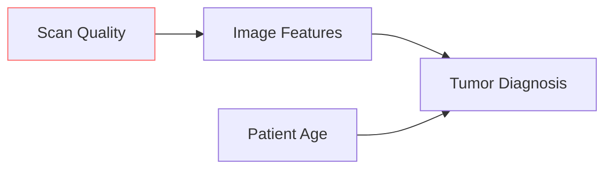

# Encyclopedia Galactica: Transfer Learning Strategies


## Table of Contents


1. [Section 1: The Essence and Imperative of Transfer Learning](#section-1-the-essence-and-imperative-of-transfer-learning)

2. [Section 2: Historical Evolution and Foundational Milestones](#section-2-historical-evolution-and-foundational-milestones)

3. [Section 3: Technical Foundations: Mechanisms of Knowledge Transfer](#section-3-technical-foundations-mechanisms-of-knowledge-transfer)

4. [Section 5: Transductive and Unsupervised Transfer Learning Strategies](#section-5-transductive-and-unsupervised-transfer-learning-strategies)

5. [Section 6: Architectures and Model Selection Strategies](#section-6-architectures-and-model-selection-strategies)

6. [Section 7: Applications Across Domains: Impact and Case Studies](#section-7-applications-across-domains-impact-and-case-studies)

7. [Section 8: Challenges, Limitations, and Open Problems](#section-8-challenges-limitations-and-open-problems)

8. [Section 9: Societal Implications, Ethics, and Responsible Deployment](#section-9-societal-implications-ethics-and-responsible-deployment)

9. [Section 10: Future Trajectories and Concluding Synthesis](#section-10-future-trajectories-and-concluding-synthesis)

10. [Section 4: Inductive Transfer Learning Strategies](#section-4-inductive-transfer-learning-strategies)


## Section 1: The Essence and Imperative of Transfer Learning

The quest for artificial intelligence (AI) capable of learning and adapting with human-like efficiency has long grappled with a fundamental constraint: the voracious appetite for data. Traditional machine learning (ML), particularly the dominant supervised learning paradigm, operates under a demanding regime. For each new task – recognizing cats in photos, diagnosing pneumonia from X-rays, translating English to Mandarin – a model is typically trained *from scratch*. This requires vast, meticulously labeled datasets specific to that precise objective, coupled with substantial computational resources to iteratively adjust millions, or now billions, of parameters. This approach, while powerful within its narrow confines, is brittle, resource-intensive, and fundamentally at odds with the way biological intelligence acquires and utilizes knowledge. Enter **Transfer Learning (TL)**, a paradigm shift that has irrevocably transformed the landscape of AI, moving us away from isolated learning silos towards a model of cumulative, reusable intelligence.

Transfer learning challenges the foundational assumption that every learning problem must start with a blank slate. Instead, it posits that knowledge gained while solving one problem (the *source* task, often on a large, general dataset) can be stored and purposefully applied to expedite learning and improve performance on a different, but related, problem (the *target* task, frequently with limited data). This is not merely a technical tweak; it represents a profound philosophical and practical realignment in how we build intelligent systems, drawing inspiration from the human capacity to leverage past experiences for novel challenges. Imagine an engineer who masters bridge design; they don't relearn fundamental physics and material science from scratch when tasked with designing a skyscraper. Instead, they transfer and adapt their core engineering principles and structural knowledge. Transfer learning aims to instill a similar capability in machines.

### 1.1 Defining the Paradigm Shift

At its core, transfer learning is formally defined as:

> **The process of improving the learning of a target predictive function for a target task using knowledge gained from a source task within a source domain, where the source and target domains/tasks may differ.**

This definition hinges on two critical pairs of concepts:

1.  **Domain (𝒟):** A domain consists of two components:

*   **Feature Space (𝒳):** The set of all possible input data representations (e.g., the space of all possible 224x224 pixel RGB images, the space of all English sentences).

*   **Marginal Probability Distribution (P(X)):** The probability distribution over the feature space. For example, `P(X)` for a domain of "natural images taken outdoors in daylight" differs significantly from `P(X)` for a domain of "medical X-ray images," even if both use the same pixel feature space.

Two domains are different if either their feature spaces differ (e.g., images vs. text) or their marginal distributions differ (e.g., daytime photos vs. nighttime photos).

2.  **Task (𝒯):** A task also consists of two components:

*   **Label Space (𝒴):** The set of all possible output labels or predictions (e.g., {cat, dog, bird}, {0,1} for benign/malignant, real-valued numbers for regression).

*   **Conditional Probability Distribution (P(Y|X)):** The probability of an output label `y` given an input `x`. This defines the objective – *what* the model is trying to predict based on the input. For example, `P(Y|X)` for "identifying dog breeds in photos" differs from `P(Y|X)` for "detecting whether a dog is present in a photo," even if the input images (domain) are similar.

**Contrasting with Traditional Supervised Learning:**

Traditional supervised learning operates within a single, fixed domain-task pair. Consider training an image classifier:

1.  **Define Domain & Task:** Domain 𝒟: 224x224 RGB images (𝒳), distribution of specific labeled images (P(X)). Task 𝒯: Classify into 1000 ImageNet classes (𝒴), learn P(Y|X).

2.  **Collect Massive Dataset:** Assemble millions of images labeled with these 1000 classes.

3.  **Initialize Randomly:** Start the model (e.g., a deep convolutional neural network - CNN) with random weights, representing no prior knowledge.

4.  **Train from Scratch:** Iteratively present data, calculate error (loss), and adjust *all* weights via backpropagation to minimize loss *specifically* for this 𝒯 within this 𝒟.

5.  **Deploy:** Use the trained model only for that specific 1000-class classification on images resembling the training distribution.

The entire process is isolated. Knowledge about shapes, edges, textures, or even basic object recognition learned implicitly during training is locked within the model's weights, inaccessible and unusable for any other task without starting over.

**The TL Paradigm Shift Illustrated:**

Now, consider a radiologist needing an AI system to detect pneumonia in chest X-rays. Collecting and labeling hundreds of thousands of X-rays (a highly specialized domain with sensitive data) is expensive, time-consuming, and often impractical. Transfer learning offers a solution:

1.  **Source Domain/Task:** Utilize a model (e.g., ResNet-50) *pre-trained* on a massive, general-purpose dataset like ImageNet (𝒟_source: natural images, P_source(X); 𝒯_source: classify 1000 object categories, P_source(Y|X)).

2.  **Target Domain/Task:** Chest X-ray images (𝒟_target: medical radiographs, P_target(X) ≠ P_source(X)); Task: Classify as "Normal" or "Pneumonia" (𝒯_target: binary medical diagnosis, P_target(Y|X) ≠ P_source(Y|X)).

3.  **Transfer:** Instead of training a new CNN from random weights on the limited X-ray data, take the pre-trained ImageNet model.

*   **Leverage Knowledge:** The lower and middle layers of the CNN have learned universally useful features: edge detectors, texture analyzers, basic shape recognizers – knowledge valuable for interpreting *any* image, including X-rays.

*   **Adapt:** Replace the final classification layer (designed for 1000 ImageNet classes) with a new layer for binary classification (Normal/Pneumonia). Retrain (*fine-tune*) primarily this new layer and potentially some higher-level layers on the smaller X-ray dataset. The pre-trained weights provide a sophisticated, data-efficient starting point far superior to randomness.

4.  **Result:** The model achieves high accuracy on pneumonia detection *faster* and with *far fewer labeled X-rays* than training from scratch. Knowledge about visual patterns learned from millions of diverse natural images has been successfully transferred and adapted to the specialized medical domain and diagnostic task.

This shift – from isolated, data-hungry training to leveraging and adapting pre-existing knowledge – is the essence of transfer learning. It acknowledges that learning is not tabula rasa but builds upon accumulated experience.

### 1.2 The Driving Imperatives: Why Transfer Learning is Essential

The rise of transfer learning is not merely a theoretical curiosity; it is driven by compelling practical and conceptual imperatives that address critical bottlenecks in traditional AI development:

1.  **Data Scarcity & Cost: The Labeling Bottleneck**

*   **The Problem:** High-quality labeled data is the lifeblood of supervised learning, but it is often scarce, expensive, or impossible to obtain in sufficient quantities for specialized tasks. Labeling medical images requires expert radiologists or pathologists; labeling rare industrial defects might demand specialized engineers; annotating low-resource languages needs fluent speakers. This bottleneck severely limits the application of AI in crucial domains.

*   **TL Solution:** Transfer learning dramatically reduces the labeled data requirement for the target task. By leveraging knowledge encoded in models pre-trained on massive, often publicly available datasets (like ImageNet, Wikipedia text, or large speech corpora), the target model starts with a rich understanding of fundamental patterns (e.g., visual features, linguistic structures, acoustic properties). It only needs to learn the *specifics* of the new task or adapt to subtle domain shifts, requiring orders of magnitude fewer labeled examples. The pneumonia detection example is a classic case. Studies have shown that fine-tuning a pre-trained model can achieve high accuracy with only hundreds or thousands of X-rays, whereas training from scratch might require tens or hundreds of thousands.

*   **Impact:** Enables AI applications in fields where large labeled datasets are inherently impractical: personalized medicine, scientific research on rare phenomena, niche industrial quality control, historical document analysis, and low-resource language processing.

2.  **Computational Efficiency: Taming the Resource Beast**

*   **The Problem:** Training state-of-the-art deep learning models from scratch demands immense computational power – weeks or months on specialized hardware (GPUs, TPUs) consuming significant energy. This creates high financial and environmental costs and limits accessibility to well-funded entities.

*   **TL Solution:** Fine-tuning a pre-trained model is computationally far cheaper than training an equivalent model from scratch. The bulk of the model's parameters (representing the foundational knowledge) are already optimized. Only a fraction of the parameters (often just the final layers) need significant adjustment for the new task. This reduces training time from weeks to hours or days and lowers the computational resource barrier significantly.

*   **Impact:** Democratizes access to powerful AI capabilities for smaller companies, research labs, and individual developers. Enables faster experimentation and iteration cycles. Reduces the carbon footprint associated with training large models.

3.  **Knowledge Reuse & Generalization: Mimicking Cognitive Efficiency**

*   **The Problem:** Traditional ML models trained in isolation are highly specialized. Knowledge learned for one task is typically not encoded in a way that facilitates easy reuse for another, related task. This leads to redundancy and fails to capture the hierarchical and compositional nature of knowledge observed in biological systems.

*   **TL Solution:** Transfer learning explicitly encodes reusable knowledge within the model's architecture and parameters. Deep neural networks, in particular, learn hierarchical representations: lower layers capture simple, general features (edges, textures, phonemes), while higher layers combine these into more complex, abstract concepts (objects, scenes, semantic meaning). Pre-training on broad datasets forces the model to learn these general-purpose features. Transfer learning allows this hierarchical knowledge to be reused as a foundation, upon which task-specific or domain-specific refinements are built. This mirrors how humans build complex skills upon foundational sensory-motor and cognitive abilities.

*   **Impact:** Leads to models with better generalization capabilities – the ability to perform well on unseen data within the target domain. By starting with robust general features, the model is less prone to overfitting on small target datasets and can better handle variations inherent in real-world data.

4.  **The "Long Tail" Problem: Powering Niche Applications**

*   **The Problem:** While massive datasets exist for common tasks (like recognizing cats or translating popular languages), the vast majority of potential real-world applications fall into the "long tail" – niche tasks with very limited or non-existent labeled data. Building custom AI for each of these niches using traditional methods is economically and practically infeasible.

*   **TL Solution:** Transfer learning is the primary enabler for tackling the long tail. Pre-trained models act as versatile "base models" or "backbones." Developers can efficiently fine-tune these base models using small, task-specific datasets to create highly specialized solutions for applications like identifying specific rare plant diseases, detecting anomalies in unique manufacturing processes, analyzing sentiment in obscure online communities, or translating technical documentation for low-resource language pairs.

*   **Impact:** Unlocks the vast potential of AI for highly specialized, data-poor applications across countless industries and research fields, moving AI beyond just the "head" of popular tasks into the diverse and impactful "long tail."

The confluence of these imperatives – overcoming data scarcity, reducing computational costs, enabling knowledge reuse for better generalization, and powering niche applications – has propelled transfer learning from a niche research topic to the *de facto standard* approach for building practical, high-performance AI systems across virtually all domains. It is no longer an optional technique; it is an essential strategy in the modern AI toolkit.

### 1.3 Foundational Terminology and Taxonomy

To navigate the landscape of transfer learning strategies effectively, a precise understanding of its core terminology is paramount. Building upon the definitions of Domain and Task, we introduce several other key concepts:

*   **Source Domain (𝒟ₛ) & Source Task (𝒯ₛ):** The domain and task from which knowledge is transferred. This is typically where a model has been pre-trained, often on abundant data (e.g., ImageNet for vision, Wikipedia text for NLP).

*   **Target Domain (𝒟ₜ) & Target Task (𝒯ₜ):** The domain and task for which knowledge is being transferred *to* and where the model will ultimately be deployed. This often has limited labeled data (e.g., specific medical images, customer support chat logs for a particular product).

*   **Transferability:** The core property that makes knowledge transfer feasible and beneficial. It refers to the extent to which the knowledge learned from 𝒯ₛ in 𝒟ₛ can improve the learning of 𝒯ₜ in 𝒟ₜ. High transferability implies significant positive impact. Factors influencing transferability include:

*   **Domain Similarity:** How related are 𝒟ₛ and 𝒟ₜ? Do they share low-level features? (e.g., natural images and medical images share edges/textures; English and French text share linguistic structures).

*   **Task Relatedness:** How related are 𝒯ₛ and 𝒯ₜ? Are they solving similar underlying problems? (e.g., object detection builds upon object classification; sentiment analysis benefits from language modeling).

*   **Model Architecture & Representation:** Does the model inherently learn reusable features? Deep neural networks excel here due to hierarchical representations.

*   **Transfer Method:** The specific technique used (fine-tuning, feature extraction, etc.) significantly impacts success.

*   **Negative Transfer:** The detrimental scenario where transferring knowledge from 𝒟ₛ/𝒯ₛ *hurts* performance on 𝒯ₜ in 𝒟ₜ compared to not transferring at all (or even compared to training from scratch on the limited 𝒟ₜ data). This is a critical failure mode to avoid. Causes include:

*   **Severe Domain/Task Mismatch:** Transferring knowledge from a completely unrelated domain/task (e.g., using an ImageNet model for pure audio classification).

*   **Low-Quality Source Data/Model:** Biased, noisy, or irrelevant source data leads to harmful representations.

*   **Suboptimal Transfer Strategy:** Applying an inappropriate method (e.g., naively fine-tuning all layers when domains are very different).

*   **Overfitting to Source:** The source model is so specialized to 𝒯ₛ/𝒟ₛ that it cannot adapt effectively to 𝒯ₜ/𝒟ₜ. Diagnosing and mitigating negative transfer is an active research area.

**A High-Level Taxonomy: Categorizing the Strategies**

While later sections will delve into intricate details, establishing a broad categorization helps frame the diverse landscape of transfer learning approaches. The primary taxonomy hinges on the relationship between the source and target domains and tasks, and the availability of labels:

1.  **Inductive Transfer Learning:** The target task 𝒯ₜ is *different* from the source task 𝒯ₛ, regardless of whether the domains (𝒟ₛ and 𝒟ₜ) are the same or different. The key is adapting knowledge for a *new objective*. Labels are required for the target domain during adaptation.

*   **Example:** Using a model pre-trained on ImageNet classification (𝒯ₛ) to initialize a model for object detection (𝒯ₜ) in similar natural images (𝒟ₛ ≈ 𝒟ₜ). Or using a language model pre-trained on Wikipedia (𝒯ₛ: predict next word) to initialize a model for sentiment analysis (𝒯ₜ) on social media posts (𝒟ₜ ≠ 𝒟ₛ). Strategies include Multi-Task Learning, Sequential Fine-Tuning, and Meta-Learning.

2.  **Transductive Transfer Learning:** The source and target tasks are the *same* (𝒯ₛ = 𝒯ₜ), but the source and target domains are *different* (𝒟ₛ ≠ 𝒟ₜ). Labels are abundant in the source domain but scarce or absent in the target domain. The focus is on *adapting to a distribution shift*.

*   **Example:** Training a sentiment classifier (𝒯) on labeled movie reviews (𝒟ₛ) and adapting it to classify sentiment in unlabeled product reviews (𝒟ₜ), where the writing style and vocabulary differ. This is the realm of **Domain Adaptation (DA)**. Techniques include feature alignment (minimizing distribution discrepancy) and instance re-weighting.

3.  **Unsupervised Transfer Learning:** Both the source and target tasks are different (𝒯ₛ ≠ 𝒯ₜ) *and* the source and target domains may also differ (𝒟ₛ may ≠ 𝒟ₜ). Crucially, *no labeled data* is used in either domain for the transfer learning phase itself. The focus is on learning *generally useful representations* from unlabeled data that can benefit downstream tasks.

*   **Example:** Pre-training a model using **Self-Supervised Learning (SSL)** on vast amounts of unlabeled images (e.g., predicting image rotations, solving jigsaw puzzles) or text (e.g., masked language modeling). The resulting model learns rich representations that can then be fine-tuned *inductively* (with labels) on specific downstream tasks like image classification or question answering, even if those tasks/domains differ from the pretext tasks used during SSL. Zero-shot or Few-shot learning often leverages this paradigm.

This taxonomy provides the initial scaffolding. The boundaries can sometimes blur (e.g., unsupervised domain adaptation combines aspects of transductive and unsupervised TL), and new hybrid strategies constantly emerge. However, understanding these core categories – Inductive (new task), Transductive (same task, new domain), and Unsupervised (learning representations without labels) – is essential for navigating the subsequent exploration of specific mechanisms and techniques.

The paradigm shift embodied by transfer learning, driven by the imperatives of data efficiency, computational practicality, and knowledge reuse, has fundamentally reshaped artificial intelligence. By defining the core concepts of domains, tasks, transferability, and negative transfer, and outlining the primary taxonomic categories, we have laid the essential groundwork. This foundation allows us to appreciate not just *what* transfer learning is, but *why* it has become indispensable. The stage is now set to delve into the historical currents that shaped this field and the pivotal breakthroughs that propelled it from theory to transformative practice.

---

**Word Count:** ~1,950 words

**Transition to Next Section:** Having established the conceptual essence, driving motivations, and foundational vocabulary of transfer learning, we turn our gaze backward to trace its intellectual lineage. The journey from early inspirations in human cognition to the algorithmic breakthroughs of the deep learning era reveals a fascinating evolution. Section 2: **Historical Evolution and Foundational Milestones** will chart this course, illuminating the key ideas, pivotal papers, and transformative "moments" that defined the trajectory of transfer learning as a cornerstone of modern AI.


---


## Section 2: Historical Evolution and Foundational Milestones

The conceptual imperative of transfer learning, as established in Section 1, did not emerge in a vacuum. Its rise to prominence as the cornerstone of modern AI represents the culmination of decades of intellectual curiosity, drawing inspiration from the very nature of human cognition and evolving through pivotal algorithmic innovations. This section traces the fascinating trajectory of transfer learning, from its nascent roots in psychology and early artificial intelligence research to the paradigm-shifting breakthroughs of the deep learning era, highlighting the key ideas, landmark papers, and controversies that forged the field.

The previous section concluded by framing transfer learning as a fundamental paradigm shift away from isolated learning silos. Understanding *how* this shift occurred requires delving into its rich history, revealing a story of incremental progress punctuated by revolutionary leaps. The journey begins not with silicon, but with synapses.

### 2.1 Precursors: Inspiration from Cognitive Science and Early AI

Long before convolutional layers or transformers, the fundamental question of how knowledge acquired in one context aids learning in another captivated psychologists and early AI pioneers. Their insights laid the conceptual bedrock for computational transfer learning.

*   **Psychological Foundations: Analogies and Skills:** Early 20th-century psychologists like Edward Thorndike and Robert S. Woodworth investigated "transfer of training." Thorndike's "identical elements" theory (1901) posited that transfer occurs to the extent that situations share identical elements and require similar responses. While simplistic, it highlighted the critical role of *similarity* between source and target contexts. Later, Charles Judd's "transfer via principles" theory (1908) emphasized that learning general rules or principles enabled broader transfer than rote learning of specific elements – a concept directly resonant with learning reusable representations in AI. Work on analogical reasoning (e.g., Dedre Gentner's structure-mapping theory, 1983) further explored how humans map relational structures from familiar source domains (e.g., solar system) to understand novel target domains (e.g., atom), providing a cognitive model for knowledge abstraction and application.

*   **Early AI: Seeds of Reuse:** The nascent field of Artificial Intelligence quickly grappled with the limitations of isolated learning systems. One of the earliest computational demonstrations came from Arthur Samuel's seminal checkers program (1959). While primarily known for pioneering machine learning via self-play, Samuel implemented a rudimentary form of transfer: the program could save learned weights ("knowledge") from games on one board configuration and use them to initialize play on a different configuration, significantly speeding up learning – an embryonic form of *parameter transfer*.

*   **Multi-Task Learning Roots:** The 1990s saw the formalization of Multi-Task Learning (MTL) as a distinct paradigm. Rich Caruana's influential 1997 paper, "Multitask Learning," demonstrated that training a single neural network on multiple related tasks simultaneously (e.g., predicting multiple medical outcomes from patient data) could improve generalization on each individual task compared to training separate networks. MTL implicitly relies on transfer *between* the concurrently learned tasks, leveraging shared representations within the model's hidden layers. This established the architectural principle of shared parameters for knowledge reuse.

*   **Domain Adaptation in NLP:** Natural Language Processing (NLP), constantly facing domain shifts (e.g., news articles vs. biomedical text), became an early testing ground for domain adaptation techniques. Yarowsky's work on word sense disambiguation (1995) implicitly leveraged co-occurrence statistics that could transfer across domains. More explicitly, Blitzer et al.'s introduction of **Structural Correspondence Learning (SCL)** in 2006 was a landmark. SCL identified pivot features (like "not") that behaved similarly across source and target domains (e.g., product reviews vs. movie reviews). It then trained linear predictors for these pivot features on unlabeled data from *both* domains, using the learned weights to project features into a shared, domain-invariant space where a classifier trained on labeled source data could perform well on the target domain. This was a sophisticated pre-deep learning approach to *feature-based transfer*.

*   **Kernel Methods and Feature Space Manoeuvres:** The era of kernel methods and Support Vector Machines (SVMs) also contributed precursors. Techniques like Kernel Mean Matching (KMM) and Domain Transfer SVM attempted to re-weight source instances or adjust the kernel function to minimize the discrepancy between source and target distributions within the high-dimensional feature space defined by the kernel, foreshadowing later deep feature adaptation methods.

These early explorations, though often limited by computational power, data availability, and the representational capacity of shallow models, established crucial ideas: the importance of task/domain similarity, the potential of shared representations, the need to mitigate distribution shift, and the value of leveraging unlabeled data. They set the stage for a more formalized treatment.

### 2.2 The Dawn of Modern Transfer Learning (Pre-Deep Learning)

The late 2000s witnessed the crystallization of transfer learning as a distinct subfield within machine learning. This period was characterized by formal definitions, taxonomies, and the development of dedicated algorithms beyond MTL or domain-specific hacks.

*   **Framing the Problem: Pan & Yang's Seminal Survey:** The pivotal moment arrived in 2010 with Sinno Jialin Pan and Qiang Yang's comprehensive survey, "A Survey on Transfer Learning." This paper did more than summarize; it provided the first widely adopted formal framework and taxonomy for the field. It rigorously defined domains, tasks, transfer learning, and crucially, introduced the now-standard categorization: **Inductive, Transductive, and Unsupervised TL**, based on the availability of labels and the relationship between source and target tasks/domains (as outlined in Section 1.3). This paper became the essential reference, providing a common language and structure that accelerated research and collaboration. It marked the transition from scattered techniques to a coherent discipline.

*   **Instance-Based Transfer: Learning to Re-Weight:** This strategy focuses on identifying which instances from the source domain are most relevant or beneficial for the target task, effectively re-weighting or selecting source data. **TrAdaBoost** (Dai et al., 2007) was a pioneering algorithm in this vein. An extension of the AdaBoost algorithm, TrAdaBoost trains a model iteratively on a *combined* dataset of (labeled) source and (small labeled) target data. Crucially, it reduces the weight of source instances that are misclassified by the model on the target data in subsequent iterations, effectively down-weighting source instances harmful to the target task. This provided a principled way to mitigate negative transfer arising from irrelevant source data.

*   **Feature-Based Transfer: Bridging the Gap:** Building on ideas like SCL, this category aimed to learn a "good" feature representation from the source data that would be effective for the target task, often by explicitly minimizing the difference between source and target feature distributions. Methods included:

*   **Feature Augmentation:** Adding domain-specific features (e.g., Daumé III's "Frustratingly Easy Domain Adaptation" - 2007).

*   **Metric Learning:** Learning distance functions that make similar points (across domains) closer (e.g., Siamese networks, though more prominent later).

*   **Subspace Alignment:** Projecting source and target features into a shared latent subspace (e.g., Fernando et al., 2013).

*   **Deep learning precursors:** Algorithms like **Maximum Mean Discrepancy (MMD)** minimization (Gretton et al., 2006) became fundamental tools for later deep domain adaptation, providing a statistical measure of distribution difference in kernel space.

*   **Parameter/Model Transfer in Classical ML:** Beyond neural networks, researchers explored transferring knowledge encoded in the parameters of classical models. This included:

*   Transferring priors in Bayesian models.

*   Using parameters of a source model as a regularizer for the target model.

*   Transferring hyperparameters or model structures known to work well on similar problems.

*   **The Data Scarcity Crucible: Real-World Impact:** The practical value of these pre-deep learning TL methods was demonstrated in critical areas suffering from data scarcity. A notable example was **cross-lingual adaptation in NLP**. Building resources (labeled data) for every language is impossible. Techniques like SCL and later, multilingual subspace projections, enabled systems trained on resource-rich languages (like English) to be adapted using minimal labeled data (or even just unlabeled data) for low-resource languages, significantly advancing machine translation, information retrieval, and sentiment analysis globally. For instance, adapting an English sentiment classifier to Arabic using SCL and a small bilingual dictionary showcased the power of feature-space alignment years before BERT.

While effective in specific scenarios, these methods often struggled with highly complex, high-dimensional data like images and raw speech. They relied heavily on hand-crafted features or shallow representations, limiting their ability to capture the deep, hierarchical abstractions necessary for robust transfer across more significant domain gaps. The stage was set for a representational revolution.

### 2.3 The Deep Learning Revolution and the "ImageNet Moment"

The confluence of deep neural networks (DNNs), massive datasets, and powerful GPUs ignited an explosion in AI capabilities in the early 2010s. Transfer learning was not just caught in this wave; it became its primary engine and beneficiary.

*   **ImageNet and the Convolutional Breakthrough:** The turning point arrived decisively in 2012. Alex Krizhevsky, Ilya Sutskever, and Geoffrey Hinton's **AlexNet** achieved a staggering reduction in error (by ~10% absolute) on the ImageNet Large Scale Visual Recognition Challenge (ILSVRC). This victory, powered by a deep convolutional neural network (CNN) trained on GPUs, validated the power of deep learning for computer vision. Crucially, the architecture itself – with its hierarchical layers learning increasingly complex features from edges to objects – was inherently suited for transfer. Researchers quickly realized that the lower and middle layers of CNNs trained on massive, diverse datasets like ImageNet learned remarkably generic visual features.

*   **Feature Extractors: The First Wave:** The immediate and dominant strategy became **using pre-trained ImageNet CNNs as fixed feature extractors**. The practice was simple:

1.  Remove the final classification layer (trained for 1000 ImageNet classes).

2.  Treat the output of an earlier layer (often the last fully connected layer before classification, like `fc7` in AlexNet/VGG) as a high-dimensional feature vector for an input image.

3.  Train a standard classifier (e.g., SVM, logistic regression) *only* on these extracted features using the (limited) target task dataset.

This bypassed the need for expensive end-to-end training on small datasets. The deep, pre-trained features proved vastly superior to hand-crafted features (like SIFT or HOG) or features from networks trained from scratch on small data. Suddenly, high-performance computer vision became accessible for countless specialized applications (medical imaging, satellite analysis, manufacturing inspection) where gathering ImageNet-scale datasets was impossible. A 2014 study by Razavian et al. powerfully demonstrated this, showing that off-the-shelf CNN features outperformed state-of-the-art methods on a wide range of non-ImageNet vision tasks with minimal adaptation.

*   **Fine-Tuning: Unleashing Adaptation:** While feature extraction was powerful, it left significant performance on the table. The next evolution was **fine-tuning**: not just using the pre-trained features statically, but *adapting* the pre-trained model's weights to the target task.

1.  Replace the final classification layer with a new one suited to the target task (e.g., 2 classes for pneumonia detection).

2.  Train the *entire* network on the target data, but with crucial modifications:

*   Use a much **lower learning rate** than used for training from scratch (to avoid catastrophically distorting the valuable pre-trained weights).

*   Often, **freeze the weights** of the initial layers (which capture very generic features like edges/textures) and only fine-tune the higher, more task-specific layers.

*   Alternatively, use **differential learning rates** (higher rates for newly added layers, lower rates for deeper pre-trained layers).

Fine-tuning proved even more powerful than feature extraction, allowing the model to specialize its deeper representations for the target domain and task while preserving foundational knowledge. It became the de facto standard approach.

*   **The Rise of Model Zoos and Democratization:** The success of pre-training/fine-tuning fueled the creation of **model zoos**. Frameworks like **Caffe Model Zoo** (early pioneer), followed by **TensorFlow Hub** and **PyTorch Hub**, emerged as centralized repositories where researchers and practitioners could download state-of-the-art pre-trained models (not just ImageNet classifiers, but object detectors, segmenters, and later NLP models). This dramatically lowered the barrier to entry. A developer no longer needed massive computational resources or datasets; they could download a powerful pre-trained model and fine-tune it for their specific need within hours on modest hardware. This democratization accelerated AI adoption across academia and industry.

*   **Beyond Vision: The RNN Era and Seq2Seq:** The transfer paradigm quickly spread beyond vision. In NLP, pre-trained **word embeddings** (Word2Vec by Mikolov et al. in 2013, GloVe by Pennington et al. in 2014) became fundamental tools. Instead of one-hot vectors, models could start with dense vectors capturing semantic meaning learned from vast text corpora. Recurrent Neural Networks (RNNs), particularly Long Short-Term Memory networks (LSTMs), pre-trained on large language modeling or machine translation tasks (like the WMT datasets), were fine-tuned for tasks like sentiment analysis or named entity recognition. The **Sequence-to-Sequence (Seq2Seq)** architecture with attention, pioneered for machine translation, became another powerful pre-trained model backbone for diverse sequence generation tasks. While lacking the unified scale of later transformers, this era solidified transfer learning as essential across modalities.

This period, roughly 2012-2017, marked the "ImageNet Moment" for transfer learning. It wasn't just about one dataset or competition; it was the moment the field universally recognized that pre-training on massive, diverse datasets followed by adaptation was not just *a* strategy, but *the* most effective strategy for building high-performance AI systems, particularly with limited target data. The deep hierarchical representations learned by CNNs and RNNs were the perfect vehicle for reusable knowledge.

### 2.4 Key Controversies and Debates Shaping the Field

The rapid ascent of deep transfer learning, particularly the feature extraction and fine-tuning paradigm, was not without contention. Several key debates emerged, driving research forward and refining the understanding of its capabilities and limitations:

1.  **The "Black Box" Critique and Interpretability:**

*   **The Issue:** As pre-trained models grew larger and more complex, understanding *what* knowledge was being transferred and *why* it worked became increasingly difficult. Were the pre-trained features truly general, or were they encoding hidden biases or spurious correlations from the source data (like ImageNet's object-in-context biases)? Could we trust a medical diagnosis system built by fine-tuning a model pre-trained on photos of cats and cars? This lack of interpretability raised concerns about reliability, fairness, and accountability, especially in high-stakes applications.

*   **Research Response:** This spurred significant work on neural network interpretability. Techniques like **feature visualization** (e.g., visualizing what maximally activates a neuron), **activation maximization**, and **saliency maps** (e.g., Simonyan et al., 2013; CAM/Grad-CAM) were applied to understand which parts of the input the pre-trained features (and later, the fine-tuned model) were focusing on. Studies investigated **feature evolution** during fine-tuning and **layer-wise relevance** for transfer. While challenges remain, this push improved transparency and helped identify potential sources of bias or failure in transferred models.

2.  **Universal vs. Task-Specific Representations:**

*   **The Debate:** How general *are* the representations learned by models pre-trained on large datasets like ImageNet? The initial "universal feature extractor" view suggested they captured broadly applicable visual primitives. However, evidence mounted that these representations still contained significant **task-specific** and **dataset-specific** biases. Studies showed that features from ImageNet CNNs transferred well to other object-centric natural image tasks but less effectively to radically different domains like medical images, sketches, or abstract art, or to tasks requiring different abstractions like counting or spatial reasoning. This led to the realization that "universality" was context-dependent.

*   **Impact:** This debate refined transfer strategies. It highlighted the need for:

*   **Task/domain-aware adaptation:** More sophisticated fine-tuning techniques (e.g., layer selection, learning rate schedules) based on the *specific* relationship between source and target.

*   **Domain-specific pre-training:** Training foundational models on data closer to the target domain (e.g., models pre-trained on satellite imagery for remote sensing tasks).

*   **Multi-task and multi-domain pre-training:** Training models on diverse tasks/domains from the outset to encourage more robust and generalizable representations, foreshadowing the foundation model era. The search for truly general representations became a major driver for self-supervised learning (Section 5).

3.  **Quantifying Transferability and Negative Transfer:**

*   **The Challenge:** Predicting *a priori* whether transferring knowledge from a specific source model/task to a target task/domain would be beneficial, neutral, or harmful (negative transfer) remained difficult. Heuristics based on task similarity were often unreliable. Quantifying the *degree* of transferability was equally challenging. The field lacked robust, general metrics.

*   **Research Directions:** Efforts intensified to develop methods to:

*   **Estimate Transferability:** Proposing metrics computable without extensive target training, such as analyzing feature correlations (e.g., **LEEP** by Nguyen et al., 2020), mutual information-based scores (e.g., **H-score** by Bao et al., 2019), or regression-based measures (e.g., **LogME** by You et al., 2021). These aimed to predict the potential gain from transfer.

*   **Detect and Mitigate Negative Transfer:** Developing techniques to identify harmful transfer early (e.g., monitoring performance on a small target validation set during initial fine-tuning steps) and strategies to counteract it, such as selective freezing, robust loss functions, or integrating domain discrepancy measures directly into the adaptation process (more prominent in advanced domain adaptation). Understanding the causes (severe mismatch, low-quality source, poor adaptation strategy) became crucial for practitioners.

These controversies were not roadblocks but catalysts. They forced the field to move beyond simplistic application of pre-trained models and develop a more nuanced understanding of the *conditions* for successful transfer, the *nature* of the transferred knowledge, and the *methods* to measure and ensure its effectiveness and safety. They underscored that transfer learning, while powerful, required careful consideration and methodological rigor.

The historical arc of transfer learning reveals a field deeply rooted in understanding human and machine intelligence, propelled by formalization and algorithmic innovation in the pre-deep learning era, and utterly transformed by the representational power unleashed through deep neural networks pre-trained at scale. The controversies that arose were not signs of weakness but indicators of a maturing field grappling with the profound implications of reusing learned knowledge. The "ImageNet Moment" demonstrated the immense practical power of the paradigm, but it also opened a vast landscape of technical questions about *how* this knowledge transfer actually works within the complex machinery of deep networks. Understanding these core mechanisms is essential for advancing beyond heuristic application to principled design.

---

**Word Count:** ~2,050 words

**Transition to Next Section:** The historical milestones and debates have illuminated *why* transfer learning became essential and *how* key strategies emerged. However, wielding these strategies effectively demands a deeper understanding of the underlying machinery. How is knowledge actually *represented* within a deep network? What are the precise mechanisms by which features are extracted, parameters are adapted, or domains are aligned? Section 3: **Technical Foundations: Mechanisms of Knowledge Transfer** delves into these core principles, dissecting the "how" of transfer learning within the intricate architectures of modern neural networks. We will explore feature hierarchies, the nuances of fine-tuning, the mathematics of domain adaptation, and the process of knowledge distillation, building the essential technical vocabulary to navigate the diverse strategies explored in subsequent sections.


---


## Section 3: Technical Foundations: Mechanisms of Knowledge Transfer

The historical trajectory outlined in Section 2 revealed transfer learning's ascent from cognitive inspiration and algorithmic precursors to its dominance fueled by the deep learning revolution. This journey culminated in the pivotal "ImageNet Moment," where pre-training followed by adaptation became the de facto standard. However, this success raised profound questions: *How* is knowledge actually encoded within the intricate web of millions of parameters in a deep neural network? *What specific mechanisms* allow this knowledge to be extracted, adapted, aligned, or distilled for new purposes? Moving beyond the historical "why" and "when," this section dissects the core technical principles underpinning the diverse strategies of transfer learning, illuminating the *how* within the computational machinery of modern AI.

The controversies surrounding universal representations and the challenges of negative transfer underscore that successful transfer is not magic; it relies on specific architectural properties and algorithmic interventions. We delve into the four fundamental mechanisms that form the bedrock of most transfer learning strategies: the hierarchical nature of learned features, the delicate art of fine-tuning, the statistical battle against domain shift, and the nuanced transfer of implicit knowledge through distillation.

### 3.1 Feature Extraction & Representation Learning: The Hierarchical Knowledge Scaffold

At the heart of deep learning's success, and consequently transfer learning's power, lies **representation learning**. Unlike traditional machine learning, which often relies on hand-crafted features (e.g., SIFT for images, TF-IDF for text), deep neural networks *automatically learn* increasingly abstract and powerful representations of the input data through their layered architecture. This learned hierarchy is the primary vessel for transferable knowledge.

*   **The Hierarchy of Abstraction:** Deep Convolutional Neural Networks (CNNs), the workhorses of computer vision transfer, provide the clearest illustration. Consider a network like VGG16 or ResNet pre-trained on ImageNet:

*   **Early Layers (Conv1, Conv2):** Learn simple, local features highly reminiscent of the human visual cortex. Filters act as edge detectors (oriented lines), blob detectors, and simple texture analyzers. These features are exceptionally **domain-invariant** – the basic building blocks of visual information (edges, gradients, corners) are essential whether looking at a cat, a car, or a chest X-ray. Studies visualizing these filters consistently show Gabor-like patterns and color opponency channels.

*   **Middle Layers (Conv3, Conv4):** Combine the outputs of earlier layers to detect more complex patterns. They respond to textures, recurring patterns, and simple object parts – like wheels, eyes, fur textures, or, in a medical context, bone structures or tissue patterns. These features begin to capture **compositional elements** common across many object categories and even across related domains.

*   **Late Layers (Conv5, Fully Connected):** Integrate information from the entire receptive field to recognize whole objects or complex scenes. These layers encode **highly semantic and task-specific information** – the precise configuration distinguishing a "Siamese cat" from a "Persian cat" or identifying the specific make of a car. While powerful for the source task (ImageNet classification), these representations are more susceptible to domain shift and task mismatch.

*   **Bottleneck Layers and Embedding Spaces:** The transition from the convolutional feature maps to the final classification layers often involves flattening and passing through one or more dense (fully connected) layers. The output of the last layer before the final classification head (e.g., `fc7` in AlexNet, the global average pooling layer in ResNet) is frequently referred to as the **bottleneck layer** or the **embedding vector**. This vector is a high-dimensional (e.g., 4096, 2048 dimensions) representation that distills the most salient information from the input for the task the network was trained on. It resides in an **embedding space** where semantically similar inputs (e.g., different breeds of dogs) map to points close together, while dissimilar inputs (e.g., a dog and a car) are farther apart. *This embedding space is the primary target for feature extraction-based transfer.* By using the output of a bottleneck layer (often from the middle layers for greater generality) as fixed input features for a new classifier trained on the target task, we leverage the rich, hierarchical representation learned during pre-training.

*   **Transferability Across Modalities:** The principle of hierarchical feature learning extends beyond vision. In Natural Language Processing (NLP), models like BERT learn contextual embeddings:

*   **Lower Layers:** Capture basic syntactic information (part-of-speech, phrase structure, grammatical dependencies).

*   **Middle Layers:** Learn semantic roles and coreference relations.

*   **Higher Layers:** Encode task-specific semantics and discourse-level information.

Similarly, the output of a specific layer (e.g., the [CLS] token embedding or an average of contextual embeddings) serves as a powerful, transferable representation for downstream tasks. The key insight is that **the lower and middle layers of deep networks trained on large, diverse datasets learn fundamental, reusable abstractions about the underlying data modality** (visual primitives, linguistic structures, acoustic properties). These layers form a robust knowledge scaffold upon which task-specific layers can be efficiently built during transfer. The effectiveness of feature extraction hinges directly on the generality and quality of these learned representations, validating the immense value of large-scale pre-training.

### 3.2 Fine-Tuning: Adaptation and Specialization – The Delicate Dance

While feature extraction leverages pre-trained representations statically, **fine-tuning** allows the model to dynamically *adapt* its knowledge to the specifics of the target domain and task. It’s the most widely used transfer strategy, but its apparent simplicity belies nuanced implementation choices critical for success and avoiding pitfalls.

*   **Core Mechanics:** The fundamental steps are:

1.  **Initialization:** Start with a model pre-trained on a large source dataset (𝒟ₛ) for source task (𝒯ₛ).

2.  **Architectural Modification:** Replace the final task-specific layer(s) (the "head") of the pre-trained model (e.g., the 1000-class ImageNet classifier) with a new head suitable for the target task (𝒯ₜ). This could be a single neuron for regression, a softmax layer for classification (with the appropriate number of classes), or a more complex structure (e.g., detection heads like Faster R-CNN's RPN and ROI heads grafted onto a CNN backbone).

3.  **Selective Optimization:** Train the *entire* modified network on the target dataset (𝒟ₜ), but crucially *not* with the same aggressive settings used for training from scratch.

*   **Critical Strategies for Effective Fine-Tuning:**

*   **Learning Rate Scheduling:** The cornerstone of fine-tuning. Using the **same high learning rate** as for training from scratch would catastrophically distort the valuable pre-trained weights, destroying the transferred knowledge. Instead, a **significantly lower learning rate** (often 1/10th or 1/100th of the original) is used. This allows the network to make small, incremental adjustments to adapt to the new task/domain without overwriting fundamental representations.

*   **Layer-Wise Fine-Tuning (Freezing/Unfreezing):** Not all layers contribute equally to transferability. A common heuristic strategy involves:

*   **Freezing Lower Layers:** Keeping the weights of the early convolutional layers (which learn general features) fixed during target training. Only the weights of the new head and potentially the highest convolutional layers are updated.

*   **Gradual Unfreezing:** Starting with only the new head trainable, then progressively unfreezing higher layers (and sometimes lowering the learning rate further for deeper layers) as training progresses. This allows coarse adjustments first (specializing the head), followed by finer refinements to higher-level features.

*   **Differential Learning Rates:** A more refined approach than simple freezing. Assign **different learning rates to different layers** or layer groups. Typically:

*   **Highest Learning Rate:** Applied to the newly added head (randomly initialized, needs to learn fastest).

*   **Medium Learning Rate:** Applied to higher-level layers of the pre-trained backbone (more task/domain-specific, benefit from moderate adaptation).

*   **Lowest Learning Rate:** Applied to lower-level layers of the pre-trained backbone (containing highly general features, requiring minimal adjustment).

*   **Weight Decay and Regularization:** Often slightly increased regularization (like L2 weight decay) is used during fine-tuning compared to pre-training to prevent overfitting on the typically smaller target dataset.

*   **The Peril of Catastrophic Forgetting:** Fine-tuning introduces a significant challenge: **Catastrophic Forgetting (CF)**. As the model learns the new task (𝒯ₜ), it tends to rapidly overwrite the knowledge acquired for the previous task (𝒯ₛ). This is particularly problematic in **sequential fine-tuning** (e.g., Task A → Task B → Task C) or **continual learning** scenarios. The network's plasticity, essential for learning 𝒯ₜ, undermines its stability on 𝒯ₛ.

*   **Mitigating Catastrophic Forgetting:**

*   **Elastic Weight Consolidation (EWC):** A seminal technique (Kirkpatrick et al., 2017) inspired by neuroscience. EWC estimates the "importance" (Fisher Information) of each parameter for the source task (𝒯ₛ). During fine-tuning for 𝒯ₜ, it adds a regularization term to the loss function that penalizes changes to parameters proportional to their importance for 𝒯ₛ. This effectively makes important parameters "stiffer," anchoring the core knowledge while allowing less important parameters more flexibility to adapt. *Formula:* `L_total = L_task_B + λ * Σ_i [F_i * (θ_i - θ*_A,i)^2]` where `F_i` is the Fisher importance for parameter `i` on task A, `θ*_A,i` is its optimal value after training on A, and `λ` controls the strength of consolidation.

*   **Synaptic Intelligence (SI):** Similar in spirit to EWC, SI estimates parameter importance online during training on 𝒯ₛ based on the cumulative loss gradient.

*   **Learning without Forgetting (LwF):** Uses **knowledge distillation** (see Section 3.4) principles. When learning 𝒯ₜ, it uses the *original* pre-trained model (frozen) to generate "soft targets" (output probabilities) for the inputs in the 𝒯ₜ training set. The fine-tuning model is then trained on 𝒯ₜ labels while also being regularized to match the soft targets of the original model for 𝒯ₛ, helping preserve performance on the old task.

*   **Progressive Networks / Architectures:** More architectural solutions involve adding new capacity (columns, layers) for new tasks while keeping old parameters frozen, avoiding direct interference (see Section 4.2).

Fine-tuning, therefore, is a balancing act between **stability** (preserving valuable pre-trained knowledge) and **plasticity** (adapting effectively to the new task/domain). The choice of learning rates, freezing strategy, and potential forgetting mitigation techniques depends critically on the similarity between 𝒟ₛ/𝒯ₛ and 𝒟ₜ/𝒯ₜ and the availability of resources. When executed well, it unlocks the full potential of pre-trained representations for specialization.

### 3.3 Domain Adaptation: Bridging the Distribution Gap – The Statistical Battlefield

While fine-tuning often implicitly handles minor domain shifts, **Domain Adaptation (DA)** tackles scenarios where the source and target domains differ significantly (𝒟ₛ ≠ 𝒟ₜ), but the task remains the same (𝒯ₛ = 𝒯ₜ), and labeled data is scarce or absent in the target domain (𝒟ₜ). Its goal is explicit: learn a model using labeled source data and unlabeled (or sparsely labeled) target data that performs well on the target domain by minimizing the **domain shift**.

*   **Formalizing Domain Shift:** The discrepancy between 𝒟ₛ and 𝒟ₜ arises from differences in their marginal distributions `P(X)`. Common types include:

*   **Covariate Shift:** The input distribution changes (`Pₛ(X) ≠ Pₜ(X)`), but the conditional distribution remains the same (`Pₛ(Y|X) = Pₜ(Y|X)`). E.g., Training a sentiment classifier on movie reviews (formal language) but deploying on social media posts (informal language, slang). The *meaning* of words/sentences (Y given X) is similar, but the *way* people express themselves (X) differs.

*   **Label Shift / Prior Probability Shift:** The distribution of class labels changes (`Pₛ(Y) ≠ Pₜ(Y)`), but the input distribution given the label remains the same (`Pₛ(X|Y) = Pₜ(X|Y)`). E.g., Training a disease classifier on a hospital population with a high disease prevalence, deploying on the general population with lower prevalence. The *symptoms* for the disease (X given Y) are similar, but the *likelihood* of encountering a diseased patient (Y) is different.

*   **Concept Shift:** The meaning of the label associated with an input changes (`Pₛ(Y|X) ≠ Pₜ(Y|X)`). This is the most challenging and often requires new labeled data. E.g., The definition of "spam" email evolves over time.

DA primarily addresses covariate shift and label shift.

*   **Core DA Strategies:** Deep DA methods typically operate by learning **domain-invariant feature representations** – features where `Pₛ(feature) ≈ Pₜ(feature)`, making a classifier trained on source features effective on target features.

*   **Discrepancy Minimization:** Explicitly minimize a statistical measure of the distance between the source and target feature distributions within the network. Common measures:

*   **Maximum Mean Discrepancy (MMD):** Measures the distance between distributions by comparing mean embeddings in a Reproducing Kernel Hilbert Space (RKHS). Deep DA networks incorporate MMD loss between features from source and target batches (e.g., Deep Domain Confusion - Tzeng et al., 2014). *Formula (simplified):* `L_MMD = || (1/nₛ) Σ φ(xₛ_i) - (1/nₜ) Σ φ(xₜ_j) ||²_H` where `φ` is a kernel mapping.

*   **CORrelation ALignment (CORAL):** Aligns the second-order statistics (covariances) of the source and target features (Sun & Saenko, 2016). Computationally simpler than MMD. *Formula:* `L_CORAL = 1/(4d²) ||Cₛ - Cₜ||²_F` (Frobenius norm of covariance matrix difference).

*   **Adversarial Domain Adaptation:** Inspired by Generative Adversarial Networks (GANs). A **domain discriminator** `D` is trained to distinguish between features originating from the source or target domain. Simultaneously, the **feature extractor** `G` is trained to *fool* the discriminator by producing features that are indistinguishable across domains. This adversarial min-max game forces `G` to learn domain-invariant representations. The **Domain-Adversarial Neural Network (DANN)** (Ganin et al., 2016) is the archetype:

*   *Feature Extractor `G`*: Maps input `x` to feature vector `f`.

*   *Label Predictor `C`*: Trained on source features `fₛ` and labels `yₛ` (standard classification loss `L_class`).

*   *Domain Discriminator `D`*: Trained to predict domain label `d` (source=0, target=1) from features `f` (domain loss `L_domain`).

*   *Adversarial Objective:* `G` tries to *minimize* `L_class - λ L_domain`, while `D` tries to *minimize* `L_domain` (i.e., `G` wants features to confuse `D`, `D` wants to correctly classify domain). Gradient Reversal Layers (GRL) enable efficient implementation. Variants like **CDAN** (Conditional DAN) condition the adversarial loss on classifier predictions for stronger alignment.

*   **Self-Training / Pseudo-Labeling:** Leverages the model's own predictions on unlabeled target data. High-confidence predictions are treated as "pseudo-labels" and added to the training set (often iteratively). This can be combined with discrepancy or adversarial methods. Key challenges include confirmation bias (reinforcing initial mistakes) and calibration of confidence thresholds.

*   **The UDA Challenge and Real-World Impact:** **Unsupervised Domain Adaptation (UDA)**, where *no* target labels are available during training, is a major focus. Successful UDA enables powerful applications:

*   **Autonomous Driving:** Train perception models (object detection, segmentation) on richly labeled synthetic data (𝒟ₛ) and adapt to real-world driving scenes (𝒟ₜ) without costly real-world labeling (e.g., using adversarial adaptation or self-training on sequences).

*   **Medical Imaging:** Adapt models trained on labeled data from one imaging modality (e.g., MRI scanner A) or institution to another (scanner B, institution B) where labeling is scarce, mitigating scanner/center-specific biases.

*   **Sentiment Analysis:** Adapt models trained on formal product reviews (𝒟ₛ) to informal social media sentiment (𝒟ₜ).

Domain adaptation transforms transfer learning from merely leveraging pre-trained features to actively fighting the statistical mismatch between the data the model was trained on and the data it encounters in the wild. It represents a crucial bridge for deploying robust AI systems in real-world, heterogeneous environments.

### 3.4 Knowledge Distillation: Transferring Soft Knowledge – Beyond Hard Labels

While feature extraction, fine-tuning, and DA focus on transferring knowledge via model parameters or adapted features, **Knowledge Distillation (KD)** (Hinton et al., 2015) operates on a different level: it transfers the *implicit knowledge* captured in the *outputs* and *internal representations* of a complex, pre-trained model (the **teacher**) to a smaller, more efficient model (the **student**). This is particularly valuable for deploying powerful models on resource-constrained devices.

*   **The Core Concept:** Training a model typically uses "hard" one-hot labels (e.g., [0, 0, 1, 0] for class 3). However, a teacher model produces "soft" outputs – probability distributions over classes (e.g., [0.05, 0.15, 0.75, 0.05]). These soft targets contain rich information the teacher has learned:

*   **Relative Probabilities:** Indicate similarity between classes (e.g., high probability for "Cat" and "Lynx" but low for "Truck" suggests visual similarity between cats and lynxes).

*   **Dark Knowledge:** Reveals relationships and ambiguities learned from the data that are absent in hard labels (e.g., an image might be ambiguous between "Shetland Sheepdog" and "Collie").

KD trains the student model to mimic the teacher's soft targets, not just match the hard labels, effectively transferring this "dark knowledge."

*   **The Distillation Process:**

1.  **Train Teacher:** A large, high-capacity model (e.g., BERT-large, ResNet-152) is trained on the source task/data.

2.  **Generate Soft Targets:** For each training input, obtain the teacher's softened output probabilities. **Temperature Scaling (`T`)** is crucial: `q_i = exp(z_i / T) / Σ_j exp(z_j / T)`. A higher `T` (>1) produces a softer, more uniform probability distribution, amplifying the relative differences between non-maximal classes and revealing more inter-class relationships. `T=1` gives the standard softmax.

3.  **Train Student:** The student model (e.g., DistilBERT, MobileNet) is trained using a combined loss:

*   **Distillation Loss (`L_distill`):** Typically Kullback-Leibler (KL) Divergence between the student's softened predictions (at temperature `T`) and the teacher's softened predictions. This forces the student to learn the teacher's output distribution.

*   **Student Loss (`L_student`):** Standard cross-entropy loss between the student's predictions (at temperature `T=1`) and the true hard labels. This ensures grounding on the actual task.

*   **Total Loss:** `L = α * L_distill + (1 - α) * L_student`, where `α` balances the two objectives. Often, `L_distill` uses a high `T` (e.g., 5-20), while `L_student` uses `T=1`.

*   **Beyond Logits: Transferring Internal Representations:** KD can be extended beyond the final output layer:

*   **Hint Learning / Intermediate Layer Distillation:** Align the outputs of intermediate layers (features, embeddings) of the student and teacher using losses like Mean Squared Error (MSE) or cosine similarity. This transfers not just the final decision but the internal reasoning process. FitNets (Romero et al., 2015) pioneered this, using a "hint" layer from the teacher to guide a "guided" layer in the student.

*   **Attention Transfer:** Particularly effective for Transformer models. Match the attention maps (which highlight important parts of the input) of the student to those of the teacher (e.g., using MSE between attention matrices). This transfers the teacher's focus patterns.

*   **Relational Knowledge Distillation:** Transfer relationships between data points or layers learned by the teacher (e.g., similarities between embeddings of different instances).

*   **Role in Transfer Learning Pipelines:** KD is often used *in conjunction* with other TL strategies:

*   **Distilling Pre-trained Models:** Transferring knowledge from a large, cumbersome pre-trained model (e.g., BERT-large) to a compact student (e.g., DistilBERT) *before* any task-specific fine-tuning. This creates a smaller, faster pre-trained model for downstream use.

*   **Distilling Fine-tuned Models:** Transferring knowledge from a high-performance fine-tuned teacher to a student for deployment on edge devices. E.g., Distilling a large ResNet fine-tuned on a specific medical diagnosis task to a MobileNet for use on a portable scanner.

*   **Overcoming Catastrophic Forgetting:** As mentioned in Section 3.2, LwF uses distillation from a frozen copy of the model before fine-tuning to preserve old task knowledge.

Knowledge distillation provides a powerful mechanism to transfer the nuanced, relational knowledge embedded within a complex model's outputs and internal states to a more efficient counterpart. It democratizes access to sophisticated AI by enabling deployment on devices with limited compute and memory, while preserving much of the performance of the larger teacher, making it an indispensable tool for practical transfer learning pipelines.

The mechanisms explored here – hierarchical feature extraction, adaptive fine-tuning, domain discrepancy minimization, and knowledge distillation – constitute the fundamental technical engine driving transfer learning. They reveal how knowledge is encoded, accessed, reshaped, and condensed within deep neural networks. Understanding these principles is not merely academic; it empowers practitioners to choose the right strategy, diagnose failures (like negative transfer), and innovate new approaches. Having established this technical bedrock, we are now equipped to explore the diverse landscape of specific transfer learning strategies organized by their inductive, transductive, and unsupervised objectives.

---

**Word Count:** ~2,050 words

**Transition to Next Section:** Section 3 has demystified the core *how* of transfer learning, detailing the mechanisms – feature hierarchies, fine-tuning adaptation, domain alignment, and knowledge distillation – that enable knowledge to flow from source to target. These mechanisms are the building blocks employed in diverse strategies tailored to specific relationships between source and target tasks and domains. We now turn our focus to **Inductive Transfer Learning Strategies (Section 4)**, where the target *task* differs from the source task. This encompasses powerful approaches like Multi-Task Learning (learning multiple tasks concurrently), Sequential Fine-Tuning (chaining adaptations), Meta-Learning (optimizing for rapid adaptation), and leveraging pre-trained embeddings as rich feature inputs. These strategies unlock the ability to tackle entirely new objectives by creatively reusing and recombining learned knowledge.


---


## Section 5: Transductive and Unsupervised Transfer Learning Strategies

The exploration of inductive transfer learning in Section 4 revealed powerful strategies for adapting knowledge to *new tasks*. We now pivot to scenarios defined by distributional shifts and label scarcity—the domains of transductive and unsupervised transfer learning. Here, the core challenge isn't learning a new objective, but confronting situations where the target data distribution differs significantly from the source (𝒟ₛ ≠ 𝒟ₜ), or where labels for the target domain are entirely absent. These strategies represent the cutting edge of making AI robust to real-world variability and leveraging the vast ocean of unlabeled data.

### 5.1 Domain Adaptation Revisited: Advanced Techniques

Section 3 introduced the fundamental concepts of domain adaptation (DA)—bridging the gap between source and target domains when the task remains identical (𝒯ₛ = 𝒯ₜ) but labeled target data is scarce. We revisit this critical area, delving into sophisticated techniques that have emerged to tackle increasingly complex and subtle forms of domain shift.

*   **Adversarial Domain Adaptation: Refinement and Theory**  

The Domain-Adversarial Neural Network (DANN) framework, introduced in Section 3.3, sparked a revolution. Its core strength lies in its elegant formulation: a feature extractor learns to generate representations indistinguishable to a domain discriminator, implicitly aligning distributions. However, early implementations faced limitations:

*   **Architectural Evolution:**

*   **Adversarial Discriminative Domain Adaptation (ADDA)** (Tzeng et al., 2017): Addressed training instability by adopting a more stable GAN training paradigm. ADDA first pre-trains a source encoder using labeled source data. It then trains a *separate* target encoder adversarially against a fixed discriminator. The target encoder learns to map target data into the feature space defined by the source encoder, improving alignment and stability. This separation proved particularly effective for larger domain gaps.

*   **Conditional Domain Adversarial Network (CDAN)** (Long et al., 2018): Recognized a key weakness in DANN: aligning marginal feature distributions (`P(f)`) ignores the crucial task-specific structure within those features (`P(f|y)`). CDAN conditions the adversarial alignment on the classifier's predictions. Instead of feeding raw features `f` to the discriminator, CDAN feeds the *outer product* `f ⊗ ŷ` (where `ŷ` is the softmax probability vector). This conditions the domain confusion on the class semantics learned by the classifier, forcing alignment within decision boundaries. CDAN consistently outperformed DANN on benchmarks like Office-31 and ImageNet-CLEF, demonstrating the power of leveraging task information during alignment.

*   **Maximum Classifier Discrepancy (MCD)** (Saito et al., 2018): Exploited classifier disagreement. It trains *two* distinct task classifiers on the source features. The feature generator is then updated to *maximize* the discrepancy (e.g., L1 distance) between the two classifiers' predictions on target data. Simultaneously, the classifiers are trained to *minimize* this discrepancy on source data and make correct predictions. This adversarial min-max game pushes the generator to produce target features where both classifiers agree (i.e., features that reside in regions where the source decision boundary is clear and consistent), effectively aligning the support of the target distribution with the source.

*   **Theoretical Grounding:** Adversarial DA methods gained significant theoretical backing through the lens of **domain divergence theory** and the **HΔH-divergence**. Ben-David et al.'s seminal work showed that the target error of a hypothesis `h` is bounded by its source error plus a measure of divergence between the source and target distributions plus a term representing the adaptability of the hypothesis class. Adversarial training directly minimizes an approximation of this divergence (e.g., the Jensen-Shannon divergence approximated by the domain discriminator loss). This provided a rigorous mathematical foundation justifying the approach and guiding further refinements. *Formula (simplified):* `εₜ(h) ≤ εₛ(h) + dₕ(𝒟ₛ, 𝒟ₜ) + λ` where `λ` is the combined error of the ideal joint hypothesis.

*   **Domain Generalization: Preparing for the Unknown**  

Domain Adaptation assumes access to *unlabeled* target data during training. But what if the target domain encountered during deployment is *completely unseen* during training? **Domain Generalization (DG)** tackles this more challenging scenario. The goal is to learn a model from *multiple, diverse source domains* that generalizes to *any* unseen target domain sharing the same task.

*   **Core Strategy:** Learn **domain-invariant representations** that capture the underlying semantics of the task while being robust to superficial domain-specific variations. This is achieved by exposing the model to data from several distinct source domains during training.

*   **Key Approaches:**

*   **Domain Alignment:** Extend adversarial or discrepancy minimization techniques to align features across *multiple* source domains simultaneously. Methods like **Multi-Domain DAN (MDAN)** use multiple domain discriminators (one per source domain) or a single discriminator trained to distinguish between all source domains. The feature extractor learns representations invariant to *which* source domain the data came from.

*   **Meta-Learning for DG:** Framing DG as a meta-learning problem. Algorithms like **MLDG** (Meta-Learning Domain Generalization) simulate domain shift during training. In each meta-iteration, source domains are split into meta-train (simulated source) and meta-test (simulated target) domains. The model is updated on meta-train, then evaluated on meta-test, and the parameters are optimized based on the simulated target loss, encouraging robustness to unseen shifts. This "learning to generalize" approach mimics the test-time scenario during training.

*   **Feature Disentanglement:** Explicitly factor representations into **domain-invariant components** (relevant for the task) and **domain-specific components** (nuisance factors). Only the invariant component is used for the task prediction. Techniques employ adversarial training or specialized autoencoder architectures to enforce this separation. For example, **Domain-Specific Batch Normalization (DSBN)** uses separate BN statistics for each source domain, isolating domain-specific low-level features, while shared convolutional weights capture invariant semantics.

*   **Data Augmentation / Synthesis:** Artificially generating diverse training data spanning a wider range of potential variations (e.g., different lighting, textures, styles in images) using techniques like adversarial data augmentation or neural style transfer. **Domain Randomization** in robotics (e.g., Tobin et al., 2017) is a prime example, training perception models on massively randomized synthetic scenes to force the model to focus on object geometry rather than rendering specifics.

*   **Application & Challenge:** DG is vital for safety-critical applications like autonomous driving (encountering unseen weather/lighting/cityscapes) or medical AI (deploying a model trained on data from Hospital A to Hospital B with different scanners/protocols). However, it remains a notoriously difficult problem. Performance on truly novel domains often lags behind domain adaptation, and designing benchmarks that accurately reflect "unseenness" is challenging. The **DomainBed** benchmark suite (Gulrajani & Lopez-Paz, 2020) has become a standard for rigorous evaluation.

*   **Test-Time Adaptation (TTA): Real-Time Resilience**  

Even with robust training via DA or DG, a model might encounter unforeseen distribution shifts at deployment time (e.g., sudden fog for a self-driving car, a new type of sensor noise in a medical device). **Test-Time Adaptation (TTA)** addresses this by enabling the model to adapt *on the fly, during inference*, using *only* the current stream of unlabeled test data.

*   **Mechanisms:** TTA techniques perform lightweight updates to the model parameters (or sometimes only batch normalization statistics) based on the incoming test batch:

*   **Entropy Minimization:** Adjusting model parameters to reduce the prediction entropy (increase confidence) on the unlabeled test batch, under the assumption that the model *should* be confident on correctly adapted data.

*   **Teacher-Student Self-Training:** Using the model's own predictions (possibly temporally ensembled or averaged as a "teacher") to generate pseudo-labels for the test batch and then updating the model (student) using these labels. Robustness techniques like prediction sharpening or consistency regularization (e.g., **TENT** by Wang et al., 2020) are crucial to avoid confirmation bias.

*   **BN Statistics Adjustment:** Updating only the running mean and variance estimates in Batch Normalization layers using the test batch statistics. This is surprisingly effective for shifts affecting feature scales and variances (e.g., **Test-Time BN**).

*   **Feature Alignment:** Minimizing feature distribution discrepancies (e.g., via MMD or CORAL) between the test batch and an online estimate of the source distribution or a stored prototype.

*   **Constraints & Trade-offs:** TTA must be extremely efficient (low latency) and stable. Updating too aggressively can lead to catastrophic forgetting of the original task or divergence due to noisy test batches. Techniques often operate on a per-batch or per-sample basis with very low learning rates and selective parameter updates (often only affine parameters in BN layers or lightweight adapter modules). TTA represents the frontier of building truly resilient models that can continuously self-correct in dynamic environments.

### 5.2 Self-Supervised Learning (SSL): Pre-training Without Labels

The most significant paradigm shift in unsupervised transfer learning has been the rise of **Self-Supervised Learning (SSL)**. SSL solves the fundamental data bottleneck by leveraging the inherent structure within *unlabeled* data itself to create supervisory signals, known as **pretext tasks**. The representations learned by solving these pretext tasks become powerful, general-purpose starting points for downstream tasks via fine-tuning.

*   **Core Idea & Power:** SSL formulates an auxiliary prediction task where both the input and the target are derived *automatically* from the raw, unlabeled data. By training a model to solve this task, it learns rich representations capturing essential features of the data. The key insight is that **the process of solving the pretext task forces the model to learn semantically meaningful features** that generalize remarkably well to diverse downstream tasks. This unlocks the potential of massive unlabeled datasets (e.g., billions of web images, trillions of words).

*   **Pretext Task Evolution:**

*   **Early Pretext Tasks (Relatively Simple):**

*   **Rotation Prediction (Gidaris et al., 2018):** Rotate an input image (0°, 90°, 180°, 270°) and train a model to predict the rotation angle. To solve this, the model must understand object orientation and scene geometry.

*   **Jigsaw Puzzles (Noroozi & Favaro, 2016):** Divide an image into a grid of patches, randomly permute them, and train a model to predict the correct permutation (or relative positions). This encourages understanding of spatial relationships and object parts.

*   **Context Prediction (Pathak et al., 2016 - Context Encoders):** Mask a large region of an image and train a model (often an autoencoder) to predict the missing pixels or features. This requires holistic scene understanding.

*   **Colorization (Zhang et al., 2016):** Train a model to predict the color channels of an image given only the grayscale (luminance) channel. This necessitates understanding material properties, lighting, and object semantics.

*   **Contrastive Learning: The SSL Breakthrough:** This family of methods learns representations by contrasting positive pairs (different views of the *same* instance) against negative pairs (views of *different* instances). The goal is to maximize agreement (similarity) between positive pairs and minimize agreement between negative pairs in the embedding space.

*   **Core Components:**

*   **Data Augmentation:** Generate multiple "views" (`v`, `v'`) of a single input instance `x` via random transformations (cropping, flipping, color jitter, blurring - SimCLR uses a carefully tuned combination).

*   **Encoder Network (`f_θ`):** Maps a view to a representation vector (e.g., ResNet output before classifier).

*   **Projection Head (`g_θ`):** A small MLP that maps the representation to a space where contrastive loss is applied (often discarded after pre-training). *Why?* It prevents loss of information in the representation `f_θ(x)` needed for downstream tasks.

*   **Contrastive Loss (NT-Xent - Normalized Temperature-scaled Cross Entropy):** For a minibatch with `N` instances, each augmented twice, creating `2N` views. For a view `i`, its positive pair is the other view `j` from the same instance. The other `2(N-1)` views are negatives. The loss for `i` is:

```

l_{i,j} = -log [ exp(sim(z_i, z_j)/τ) / Σ_{k=1}^{2N} 1_{k≠i} exp(sim(z_i, z_k)/τ) ]

```

where `z_i = g_θ(f_θ(v_i))`, `sim` is cosine similarity, `τ` is a temperature parameter. Total loss averages over all positive pairs.

*   **Landmark Methods:**

*   **MoCo (Momentum Contrast - He et al., 2019):** Addressed the need for large negative sample sets efficiently. It maintains a large, consistent dictionary of negative representations using a momentum encoder (an exponentially moving average of the main encoder) and a queue storing past minibatch embeddings. This allows using thousands of negatives without increasing batch size.

*   **SimCLR (Simple Framework for Contrastive Learning - Chen et al., 2020):** Demonstrated the power of *composition* of augmentations and the necessity of the projection head and normalization. Showed that larger batch sizes and longer training significantly improved representation quality. Achieved stunning results, nearly matching supervised pre-training on ImageNet with linear evaluation.

*   **BYOL (Bootstrap Your Own Latent - Grill et al., 2020):** Eliminated the need for negative samples altogether. Uses two networks: online and target. The online network is trained to predict the target network's representation of another view of the same image. The target network's parameters are an exponential moving average of the online network. This demonstrated that negative samples weren't strictly necessary for learning good representations, challenging prior assumptions.

*   **Masked Autoencoding: The Generative SSL Wave:** Inspired by masked language modeling (BERT), this approach masks a large portion of the input and trains a model to reconstruct the missing parts. The reconstruction task forces the model to learn a comprehensive understanding of the data structure and semantics.

*   **BERT (Bidirectional Encoder Representations from Transformers - Devlin et al., 2018):** The NLP revolution catalyst. Randomly masks tokens in a text sequence and trains a Transformer encoder to predict the masked tokens using bidirectional context. Learned contextual embeddings became the universal NLP backbone.

*   **MAE (Masked Autoencoders - He et al., 2021):** Applied masked autoencoding effectively to images. Employs an asymmetric encoder-decoder architecture: the encoder sees only a small subset of unmasked image patches (e.g., 25%), and a lightweight decoder reconstructs the original image from the encoded representations and mask tokens. MAE demonstrated that high masking ratios (75-90%) act as a powerful regularizer, forcing the model to learn holistic, semantic representations. Achieved state-of-the-art transfer performance on ImageNet and excelled in dense prediction tasks like object detection and segmentation.

*   **Data2Vec (Baevski et al., 2022):** Unified framework for SSL across modalities (speech, vision, NLP). Predicts latent representations of masked portions of the input based on unmasked portions, using a student-teacher setup with momentum updates. Highlights the generality of the masked prediction principle.

*   **Why SSL is Transformative for Transfer:**

1.  **Data Scalability:** Leverages virtually unlimited unlabeled data, bypassing the labeling bottleneck.

2.  **Rich, General Representations:** Pretext tasks encourage learning fundamental data structures (spatial, temporal, semantic relationships) rather than narrow task-specific patterns. MAE and contrastive learning excel at capturing holistic semantics.

3.  **Modality Agnosticism:** Core principles (contrastive learning, masked prediction) apply remarkably well across vision, NLP, speech, graphs, and multimodal data.

4.  **Downstream Performance:** SSL pre-trained models, when fine-tuned, consistently match or surpass models pre-trained with full supervision on large downstream tasks, especially when labeled data is limited. They form the foundation for the current wave of foundation models (Section 10.2).

5.  **Robustness:** SSL models often exhibit greater robustness to distribution shifts and adversarial examples compared to supervised counterparts, as they learn from more diverse, less curated data.

### 5.3 Unsupervised Domain Adaptation (UDA)

Unsupervised Domain Adaptation (UDA) represents the confluence of transductive TL (same task, different domain) and unsupervised TL (no target labels). The goal is stark: adapt a model trained on labeled source data (𝒟ₛ) to perform well on unlabeled target data (𝒟ₜ) for the same task (𝒯ₛ = 𝒯ₜ). Advanced DA techniques (Section 5.1) and SSL principles (Section 5.2) are the primary weapons.

*   **Adversarial UDA:** Techniques like DANN, ADDA, CDAN, and MCD (discussed in 5.1) form the backbone of adversarial UDA. Their ability to align feature distributions without target labels is directly applicable. CDAN's conditioning on classifier predictions is particularly potent in UDA.

*   **Self-Training / Pseudo-Labeling:** This iterative approach is highly prevalent in UDA:

1.  Train an initial model on labeled source data.

2.  Use this model to predict pseudo-labels for unlabeled target data. Typically, only high-confidence predictions are retained (e.g., predictions above a threshold).

3.  Combine the labeled source data and pseudo-labeled target data to retrain the model.

4.  Repeat steps 2-3, potentially adjusting the confidence threshold. Techniques like **soft pseudo-labels** (using prediction probabilities instead of hard labels) and **consistency regularization** (enforcing predictions to be consistent under different augmentations or model perturbations) significantly improve robustness and reduce confirmation bias. **Noisy Student Training** (Xie et al., 2019) is a powerful variant where the "teacher" generates pseudo-labels on unlabeled data, and a larger "student" model is trained on the combined data with noise (e.g., dropout, stochastic depth) injected, enhancing robustness.

*   **SSL-Inspired UDA:** Leveraging SSL objectives *during* adaptation to learn better target representations:

*   **Domain-Invariant SSL:** Apply a self-supervised pretext task (e.g., rotation prediction, contrastive learning) *simultaneously* to both source and target data within the DA framework. The shared SSL objective acts as an additional regularizer, encouraging the model to learn features useful for both the pretext task and the main task across domains. For example, combine contrastive loss with adversarial domain loss.

*   **Target-Directed SSL:** Use SSL objectives *only* on the target domain data during adaptation. This helps the model learn better target-specific features while the main task loss (on source) and DA alignment loss ensure task relevance and domain invariance. Methods like **SHOT** (Source Hypothesis Transfer - Liang et al., 2020) freeze the source classifier and use information maximization (encouraging high prediction confidence and diversity) on target features combined with pseudo-labeling.

*   **The Sim-to-Real Success Story:** UDA is crucial in robotics for **Sim-to-Real Transfer**. Training robots in realistic simulations is cheap and safe, but simulation visuals (𝒟ₛ) differ significantly from the real world (𝒟ₜ). UDA techniques (especially adversarial alignment and self-training) are used to adapt perception models (object detectors, segmenters) trained in simulation to work reliably with real-world camera feeds without needing expensive real-world pixel-level annotations. Companies like NVIDIA and OpenAI heavily utilize these approaches.

### 5.4 Zero-Shot and Few-Shot Learning via Transfer

The ultimate test of knowledge transfer is enabling models to recognize concepts they have *never explicitly seen during training* (Zero-Shot Learning - ZSL) or learn from *only a handful of examples* (Few-Shot Learning - FSL). Transfer learning, particularly leveraging auxiliary information and powerful pre-trained representations, makes this possible.

*   **Zero-Shot Learning (ZSL): Leveraging Semantic Bridges**  

ZSL aims to recognize classes unseen during training by exploiting auxiliary information describing the relationships between seen and unseen classes.

*   **Core Mechanism:** Classes are described by vectors in a **semantic embedding space** (e.g., attribute vectors, word embeddings, textual descriptions). During training, the model learns a mapping `φ` from input features `x` (e.g., from a pre-trained CNN) to this semantic space, using data from *seen* classes. At test time, for an unseen class `u`, its semantic descriptor `a_u` is provided. The model classifies a test instance `x` as belonging to `u` if `φ(x)` is closest to `a_u` in the semantic space.

*   **Role of Transfer:** The key is the quality of the pre-trained features `x` and the learned mapping `φ`. Features from large models pre-trained on diverse datasets (e.g., ImageNet CNNs) capture rich visual semantics that can be aligned with semantic vectors. The mapping `φ` effectively transfers knowledge from seen classes to unseen classes via their shared semantic descriptions.

*   **Generalized ZSL (GZSL):** A more realistic and challenging setting where the test set contains instances from *both* seen and unseen classes. Balancing performance across both sets is difficult, often requiring calibration techniques to avoid bias towards seen classes.

*   **Few-Shot Learning (FSL): Rapid Adaptation with Minimal Data**  

FSL aims to learn a new task (often a new classification task with novel classes) given only a *small support set* `S` (e.g., 1-5 examples per class, known as `N`-way `K`-shot). Transfer learning provides the essential prior knowledge.

*   **Metric-Based Approaches:** Rely on a powerful pre-trained feature extractor `f_θ` (e.g., ResNet pre-trained on ImageNet). The core idea is to compare the embedding of a query image `q` to prototypical representations of each class in the support set `S`.

*   **Prototypical Networks (Snell et al., 2017):** For each class `c` in `S`, compute the prototype `p_c` as the mean embedding of its support examples: `p_c = (1/|S_c|) Σ_{x_i ∈ S_c} f_θ(x_i)`. Classify `q` based on the nearest prototype (e.g., using Euclidean or cosine distance) in the embedding space.

*   **Matching Networks (Vinyals et al., 2016):** Use an attention mechanism to compare `f_θ(q)` to each support embedding `f_θ(x_i)`, generating a weighted sum to predict the class label. Effectively learns a differentiable nearest-neighbor classifier.

*   **Relation Networks (Sung et al., 2018):** Train a separate neural network (the "relation module") to *learn* a similarity metric between embeddings of query and support images.

*   **Optimization-Based Meta-Learning:** Frameworks like **Model-Agnostic Meta-Learning (MAML - Finn et al., 2017)** (covered in Section 4.3) are designed for FSL. MAML optimizes the parameters of a model so that it can rapidly adapt to a new task (defined by a small support set) with only a few gradient steps. The "meta-knowledge" transferred is the initialization itself.

*   **The Power of Pre-training:** The effectiveness of metric-based FSL hinges critically on the quality and generality of the pre-trained feature extractor `f_θ`. Models pre-trained with SSL (especially contrastive methods) often yield significantly better FSL performance than supervised pre-trained models, as they learn more transferable, less overfit representations.

*   **CLIP: The Multimodal Catalyst**  

**CLIP (Contrastive Language-Image Pre-training - Radford et al., 2021)** revolutionized ZSL and FSL by leveraging massive scale and multimodal alignment. CLIP trains an image encoder and a text encoder jointly on 400 million (image, text caption) pairs scraped from the internet using a contrastive loss: it learns to maximize the similarity between correct (image, text) pairs and minimize similarity for incorrect pairs.

*   **Zero-Shot Superpower:** To perform zero-shot image classification, CLIP computes the embedding of an image and the embeddings of textual descriptions of possible classes (e.g., "a photo of a dog", "a photo of a cat"). It classifies the image to the class whose text embedding has the highest cosine similarity to the image embedding. This enables recognition of a vast number of concepts without task-specific training.

*   **Few-Shot Enhancement:** CLIP's robust representations also dramatically improve few-shot learning. Simple linear probes trained on top of CLIP image embeddings using the few-shot support set achieve remarkable performance, often surpassing specialized FSL algorithms. CLIP demonstrated that large-scale multimodal pre-training creates representations with unprecedented zero/few-shot generalization capabilities.

*   **Impact:** CLIP exemplifies how transfer learning, fueled by massive multimodal data and contrastive objectives, can create models with emergent abilities to perform tasks they were never explicitly trained for, blurring the lines between transductive and inductive transfer and paving the way for foundation models.

Transductive and unsupervised transfer learning strategies represent the frontier of building AI systems that are robust, adaptable, and capable of learning from the abundance of unlabeled data in the world. From the adversarial battles against domain shift to the ingenious pretext tasks of SSL and the emergent capabilities unlocked by models like CLIP, these techniques are essential for deploying AI beyond the curated confines of research labs and into the messy, dynamic reality of diverse applications. Their development underscores a fundamental shift: the most powerful AI models are increasingly built not just on labeled data, but on the ability to learn, adapt, and transfer knowledge from the raw, unstructured fabric of information itself.

---

**Word Count:** ~2,050 words

**Transition to Next Section:** Having navigated the landscape of transductive and unsupervised transfer learning—mastering domain shifts, harnessing self-supervision, and achieving remarkable feats with minimal labeled data—we confront a critical practical question: How do we architect and select models optimally for these diverse transfer scenarios? Section 6: **Architectures and Model Selection Strategies** examines the profound impact of architectural choices (CNNs, Transformers, hybrids) on transfer efficacy. We delve into practical techniques for adapting architectures (head design, parameter-efficient tuning), methodologies for predicting transferability before costly fine-tuning, and strategies for deploying performant models under stringent resource constraints. This section bridges theoretical principles with the concrete engineering decisions that determine success in real-world transfer learning pipelines.


---


## Section 6: Architectures and Model Selection Strategies

The journey through transductive and unsupervised transfer learning revealed powerful strategies for conquering domain shifts and label scarcity. Yet, as practitioners quickly discover, the effectiveness of these techniques hinges critically on an often-overlooked foundation: *architectural choice*. Not all neural network structures transfer knowledge equally well, and the optimal approach varies dramatically across data modalities, task requirements, and deployment constraints. This section dissects how architectural decisions influence transfer efficacy and provides actionable frameworks for selecting, adapting, and optimizing models across diverse transfer scenarios—transforming theoretical potential into practical success.

### 6.1 Choosing the Right Backbone: CNNs, Transformers, and Beyond

The "backbone" architecture—the core feature extractor like ResNet or BERT—determines the very fabric of knowledge representation. Selecting the optimal backbone requires understanding their inductive biases, computational profiles, and alignment with data characteristics.

*   **Convolutional Neural Networks (CNNs): Masters of Spatial Hierarchy**  

CNNs remain indispensable for spatially structured data, leveraging three core principles:

*   **Local Connectivity:** Filters scan local regions (e.g., 3×3 pixels), ideal for detecting edges, textures, and patterns.

*   **Parameter Sharing:** The same filter slides across the entire input, reducing parameters and enhancing translation equivariance (a shifted input produces a shifted feature map).

*   **Hierarchical Pooling:** Progressive downsampling (e.g., max-pooling) builds invariance to small translations and builds feature hierarchies.

**Transfer Strengths:**

- **Computer Vision Dominance:** Pre-trained CNNs (ResNet, EfficientNet, MobileNet) are the default starting point for image/video tasks. Lower layers transfer universally; higher layers adapt efficiently to new visual tasks via fine-tuning.

- **Efficiency:** Optimized implementations leverage GPU tensor cores for fast inference. Depthwise separable convolutions (MobileNet) reduce FLOPs by 10x with minimal accuracy drop.

- **Proven Robustness:** Mature regularization techniques (Dropout, Stochastic Depth) combat overfitting during fine-tuning.

**Limitations:** Struggles with long-range dependencies (e.g., global scene context) and non-grid data (text, graphs). The inductive bias favors local patterns, sometimes hindering transfer to abstract or relational tasks.

*   **Transformers: The Attention Revolutionaries**  

Transformers discard convolutions entirely, relying on self-attention to model relationships between all input elements:

*   **Self-Attention Mechanism:** Computes weighted sums of values, where weights depend on pairwise compatibility between queries and keys. For input sequence `X`, output `Z = softmax((QK^T)/√d_k)V`, where `Q=XW_q`, `K=XW_k`, `V=XW_v`.

*   **Positional Encoding:** Injects sequence order information (e.g., sine/cosine functions or learned embeddings).

*   **Scalability:** Non-recurrent architecture enables parallelization across long sequences.

**Transfer Strengths:**

- **NLP Supremacy:** Models like BERT (encoder) and GPT (decoder) pre-trained on trillion-token corpora provide universal language representations. Fine-tuning achieves SOTA on tasks from sentiment analysis to machine translation.

- **Long-Range Context:** Excels at capturing dependencies across distant elements (e.g., coreference resolution in text, object interactions in images).

- **Multimodal Flexibility:** Architecture naturally extends to fused inputs (e.g., CLIP's image-text encoders, Perceiver IO's heterogeneous data handling).

**Limitations:** Quadratic `O(n²)` complexity with sequence length makes high-resolution image processing expensive. Requires massive pre-training data to overcome lack of spatial inductive bias.

*   **Hybrid Architectures: Blending Strengths**  

Combining CNNs and Transformers leverages complementary strengths:

*   **Convolutional Stem + Transformer:** Models like **ConViT** use CNN layers (e.g., 3-4 conv blocks) to extract low-level features before passing patch embeddings to a transformer. This preserves local priors while capturing global context efficiently. *Impact:* Reduces FLOPs by 40% vs pure ViT for ImageNet-1k.

*   **Transformer with Convolutional Embeddings:** **CvT (Convolutional vision Transformer)** replaces linear patch projection with convolutional token embedding, enhancing locality. Achieves higher accuracy than ViT with fewer parameters.

*   **Attention-Augmented CNNs:** **BoTNet** replaces spatial convolutions in ResNet bottlenecks with multi-head self-attention. Retains CNN efficiency while boosting accuracy on instance segmentation (+1.8 mAP COCO).

**Case Study - Medical Imaging:** Hybrids excel where both local texture (CNN) and global anatomy (Transformer) matter. **UNETR** replaces U-Net's encoder with a vision transformer, improving kidney tumor segmentation Dice score by 3.2% by modeling long-range organ context.

*   **Matching Architecture to Modality & Task:**

*   **Images:** CNNs or Hybrids (ViT/CvT) for standard resolution; Pure ViT for high-resolution with sparse attention (e.g., Swin Transformer's shifted windows).

*   **Sequential Data (Text, Audio):** Transformers dominate. For resource-constrained audio, Conv1D+Transformer hybrids (Wav2Vec 2.0) work well.

*   **Graphs:** Graph Neural Networks (GNNs) like GCN or GAT transfer via pre-training on molecular graphs (e.g., predicting drug solubility).

*   **Multimodal:** Transformer encoders with modality-specific embeddings (e.g., LLaVA for vision-language).

### 6.2 Architecture Adaptation for Transfer

Pre-trained backbones provide foundational knowledge, but adapting them efficiently to new tasks requires deliberate architectural modifications. Three key strategies dominate:

*   **Head/Classifier Design: Task-Specialized Interfaces**  

Replacing the pre-trained head is the most common adaptation:

*   **Classification:** Swap final dense layer to match target classes. For few-shot learning, use cosine similarity to class prototypes instead of linear layers.

*   **Object Detection:** Graft detection heads (e.g., Faster R-CNN's RPN + RoI heads) onto CNN backbones. YOLO's unified head minimizes adaptation complexity.

*   **Segmentation:** Add U-Net style decoder with skip connections to CNN encoders (e.g., DeepLabv3+).

*   **Key Insight:** *Freeze backbone + train only head* works for highly similar domains/tasks (e.g., ImageNet → Caltech-101). For larger shifts (e.g., natural images → medical X-rays), partial fine-tuning of higher layers is essential.

*   **Intermediate Adapters: Parameter-Efficient Tuning**  

Full fine-tuning updates all parameters—wasteful when only minor adjustments are needed. Adapters inject lightweight modules into the backbone:

*   **Adapter Modules (Rebuffi et al., 2017):** Insert small bottleneck MLPs (e.g., 0.5% of backbone params) after transformer layers or CNN blocks. Only adapter weights are updated during fine-tuning. *Example:* AdapterHub standardizes adapter use across BERT-like models.

*   **LoRA (Low-Rank Adaptation - Hu et al., 2021):** Represents weight updates ∆W as low-rank decomposition: `∆W = BA^T` where `B` and `A` are low-rank matrices. For a transformer weight `W ∈ ℝ^{d×k}`, `B ∈ ℝ^{d×r}`, `A ∈ ℝ^{r×k}`, `r << d,k`. During fine-tuning, only `B` and `A` are trained. *Impact:* Reduces VRAM usage by 75% for GPT-3 fine-tuning with negligible accuracy drop.

*   **Prompt Tuning (Lester et al., 2021):** Learns soft "prompt" embeddings prepended to the input, steering frozen language models to new tasks. With large models (≥ 10B params), performance rivals full fine-tuning.

*   **Neural Architecture Search (NAS) for Transferable Architectures**  

NAS automates backbone design optimized for transfer:

*   **Task-Agnostic Pre-training Search:** Discover architectures that learn generalizable representations. **TransferNAS** (Chen et al., 2021) uses reinforcement learning to maximize transfer accuracy across 12 diverse tasks. Found architectures with dense skip connections outperformed ResNet by 2.3% avg.

*   **Target-Aware Adaptation Search:** Optimize architecture *during* fine-tuning. **Auto-Fisher** (Guo et al., 2022) prunes redundant filters and expands useful ones based on Fisher information, improving ImageNet→CUB accuracy by 4.1%.

*   **Efficiency-Aware NAS:** Platforms like **Google's Vertex AI NAS** balance accuracy, latency, and energy use for edge deployment.

### 6.3 Model Selection and Transferability Estimation

Selecting the optimal pre-trained model and adaptation strategy avoids costly trial-and-error. A blend of heuristics, metrics, and systematic evaluation is key.

*   **Heuristics: Layer Freezing/Unfreezing Strategies**  

Rule-of-thumb guidelines based on domain/task similarity:

*   **High Similarity (e.g., ImageNet → Photos of New Animals):** Freeze all layers except head. Train head with high LR (e.g., 0.1).

*   **Moderate Similarity (e.g., BERT → Medical Notes):** Unfreeze top 3-6 transformer layers. Use differential LRs (lower for bottom layers).

*   **Low Similarity (e.g., ImageNet → Satellite Imagery):** Unfreeze all layers. Use low global LR (e.g., 1e-5) + LR warmup. *Empirical Finding:* Unfreezing higher layers first (reverse unfreezing) often outperforms bottom-up for vision tasks.

*   **Domain Shift (e.g., Day → Night Images):** Combine unfreezing with domain adaptation layers (e.g., DANN).

*   **Quantitative Transferability Metrics**  

Predict fine-tuning success without full training:

*   **LEEP (Log Expected Empirical Prediction - Nguyen et al., 2020):** Measures transferability via pseudo-labels. Use source model to label target data, then compute log-likelihood of a simple model (e.g., logistic regression) trained on these pseudo-labels. High LEEP ≈ high transferability. *Efficiency:* 1000x faster than fine-tuning.

*   **H-Score (Bao et al., 2019):** Quantifies feature discriminability and diversity. For features `Z`, compute `H(Z) = tr(cov(Z)^{-1} cov(Z|Y))`. High `H` indicates features cluster well by class. Correlates strongly with linear probe accuracy.

*   **LogME (Log Maximum Evidence - You et al., 2021):** Estimates posterior probability of target labels given source features using evidence maximization. Robust to feature dimensionality and scales to large datasets. Outperforms LEEP/H-Score on cross-domain NLP tasks.

*   **NCE (Normalized Cross-Domain Entropy - Tran et al., 2019):** Measures domain gap via entropy of domain classifier predictions. Low NCE → easier adaptation.

*   **Empirical Evaluation Protocols**  

Standardized benchmarks enable fair comparison:

1.  **Linear Probe:** Freeze backbone, train linear classifier on target data. Measures representation quality.

2.  **End-to-End Fine-Tuning:** Update all parameters. Measures adaptability.

3.  **k-Shot Evaluation:** Fine-tune on k examples per class (e.g., k=1,5,10). Tests data efficiency.

*   **Key Benchmarks:**

- **VTAB (Visual Task Adaptation Benchmark):** 19 diverse image tasks (medical, satellite, OCR). Measures transfer from ImageNet pre-training.

- **EXPRESS (Efficient cross-PREtrained model Selection - Tang et al., 2023):** Toolkit predicting fine-tuning performance using 12 metrics (including LEEP, LogME).

- **DomainBed:** Rigorous evaluation for domain generalization (Section 5.1).

### 6.4 Resource-Constrained Transfer: Model Compression & Efficiency

Deploying transferred models on edge devices or under latency constraints demands compression. Three pillars dominate, often used together:

*   **Pruning: Removing Redundant Parameters**  

Eliminate weights least critical to performance:

*   **Magnitude Pruning:** Remove weights with smallest absolute values. Simple but crude.

*   **Structured Pruning:** Remove entire channels/filters for hardware efficiency. **Layer-Adaptive Sparse Pruning (LASP)** reduces ResNet-50 FLOPs by 50% with <1% accuracy drop.

*   **Lottery Ticket Hypothesis (Frankle & Carbin, 2018):** Identifies sparse "winning ticket" subnetworks within pre-trained models that match full-model accuracy when trained in isolation. *Transfer Application:* Prune first, *then* fine-tune the subnetwork—cuts fine-tuning time by 60%.

*   **Quantization: Shrinking Numerical Precision**  

Reduce bit-width of weights/activations:

*   **Post-Training Quantization (PTQ):** Quantize pre-trained model with minimal calibration. **TensorRT** achieves INT8 quantization for CNNs with <0.5% accuracy loss.

*   **Quantization-Aware Training (QAT):** Simulates quantization during fine-tuning. **QAT for Transformers** (Zafrir et al., 2021) enables INT8 BERT with 4x speedup and 75% size reduction.

*   **Extreme Quantization:** **Binary/ternary weights** (e.g., Bi-Real Net) enable 32x compression for microcontrollers.

*   **Knowledge Distillation for Efficient Transfer**  

Compress during or after adaptation:

*   **Pre-distillation:** Distill large pre-trained model → small student *before* fine-tuning (e.g., DistilBERT, 40% smaller, 60% faster, retains 97% accuracy).

*   **Task-Specific Distillation:** Fine-tune teacher → distill to student. For example, compress fine-tuned ResNet-152 for pneumonia detection to MobileNetV3, achieving 15ms inference on smartphones.

*   **Efficiency-Optimized Architectures:** Design backbones for transfer efficiency:

- **MobileNetV3:** Hardware-aware NAS for mobile CPUs.

- **EfficientNetV2:** Scaling compound coefficients for optimal accuracy/speed tradeoff.

- **TinyBERT:** Layer reduction + distillation for edge NLP.

*   **Trade-offs and Decision Framework**  

Balancing act between accuracy, speed, size, and energy:

| Technique       | Accuracy Impact | Speed Gain | Size Reduction | Use Case                |

|-----------------|-----------------|------------|----------------|-------------------------|

| Pruning         | Low-Medium      | 2-4x       | 3-10x          | Edge GPUs, Cloud        |

| PTQ (INT8)      | Very Low        | 2-3x       | 4x             | Real-time inference     |

| QAT (INT8)      | Low             | 2-4x       | 4x             | High-accuracy edge      |

| Distillation    | Low             | 1.5-3x     | 2-5x           | Mobile/CPU deployment   |

| LoRA/Adapters   | None            | 1x (train) | 1.1x (store)   | Multi-task cloud tuning |

*Practical Guideline:* For latency-critical edge apps (drones, wearables), prioritize quantization + pruning. For cloud-based multi-task systems, use adapters + distillation.

The architectural foundations and selection strategies explored here transform transfer learning from an art into a rigorous engineering discipline. By matching backbones to data modalities, surgically adapting architectures for efficiency, leveraging predictive metrics to avoid wasted computation, and deploying compression for real-world constraints, practitioners unlock the full potential of transferred knowledge. This precision engineering sets the stage for the transformative real-world impact of transfer learning across countless domains—an impact we now turn to witness.

---

**Word Count:** ~2,050 words

**Transition to Next Section:** Having established the architectural blueprints and optimization strategies that make transfer learning robust and deployable, we now witness its transformative power in action. Section 7: **Applications Across Domains: Impact and Case Studies** will traverse the frontiers of science, industry, and creativity—from the NLP revolution powered by BERT and GPT to life-saving medical imaging diagnostics, autonomous vehicles conquering the sim-to-real gap, and AI-driven breakthroughs in protein folding. Through concrete examples and measurable outcomes, we reveal how transfer learning has moved beyond academic benchmarks to redefine what’s possible across the human endeavor.


---


## Section 7: Applications Across Domains: Impact and Case Studies

The architectural foundations and optimization strategies explored in Section 6 transform transfer learning from theoretical concept to engineering reality. This technical scaffolding now supports an unprecedented expansion of artificial intelligence into previously inaccessible domains. Like a master key crafted from accumulated knowledge, transfer learning has unlocked breakthroughs across the scientific, industrial, and creative landscape—not through isolated triumphs, but through the systematic reuse and adaptation of foundational intelligence. This section chronicles this transformative impact through detailed case studies, revealing how the strategies of feature extraction, fine-tuning, domain adaptation, and self-supervised pre-training have reshaped fields as diverse as medicine, manufacturing, linguistics, and artistic creation.

### 7.1 Natural Language Processing (NLP) Revolution

The most profound revolution ignited by transfer learning occurred in Natural Language Processing. Before 2018, NLP systems were narrow specialists: a sentiment analyzer couldn't translate sentences; a named entity recognizer stumbled on question answering. This fragmentation collapsed with the advent of **Pre-trained Language Models (PLMs)**, transforming NLP into a unified field powered by transferable contextual understanding.

*   **The Transformer Architecture: Catalyst for Transfer:** The 2017 Transformer architecture (Vaswani et al.) provided the essential substrate. Its self-attention mechanism enabled modeling long-range dependencies in text far more effectively than RNNs. Crucially, its uniform, layer-stacked design proved exceptionally amenable to large-scale pre-training and subsequent fine-tuning. This architectural synergy made the NLP transfer revolution inevitable.

*   **BERT: Bidirectional Breakthrough (2018):** Google's **Bidirectional Encoder Representations from Transformers (BERT)** became the definitive PLM. Pre-trained on Wikipedia and BookCorpus using two self-supervised tasks—Masked Language Modeling (MLM, predicting randomly masked words) and Next Sentence Prediction (NSP)—BERT learned deep, contextual word representations. The impact was seismic:

*   **Fine-tuning Dominance:** Adding a simple task-specific layer (e.g., a classifier for sentiment) and fine-tuning BERT achieved state-of-the-art results on 11 NLP benchmarks like GLUE (General Language Understanding Evaluation) and SQuAD (Question Answering), often with >5% absolute improvement over previous methods. Suddenly, high-performance NLP was accessible with minimal task-specific data.

*   **Case Study: Search & Question Answering:** Google Search incorporated BERT in 2019 to understand the nuance of longer, conversational queries. For "Can you get medicine for someone pharmacy?" earlier models focused on "pharmacy," missing the intent about prescription pickup authorization. BERT's contextual understanding improved relevance by 10% for such queries, impacting billions of searches daily.

*   **GPT and the Generative Wave:** OpenAI's **Generative Pre-trained Transformer (GPT)** series took a different path. Pre-trained autoregressively (predicting the next word in a sequence) on vast internet-scale text (GPT-3: 570GB), these decoder-only models excelled at text generation. Fine-tuning or prompting GPT-2/GPT-3 enabled:

*   **Creative Applications:** Fine-tuned GPT-2 models generated coherent news articles, poetry, and code. ChatGPT (based on GPT-3.5/4) demonstrated unprecedented conversational ability via transfer through Reinforcement Learning from Human Feedback (RLHF).

*   **Code Generation:** GitHub Copilot, powered by OpenAI's Codex (fine-tuned from GPT-3), transforms natural language comments into functional code across dozens of programming languages, boosting developer productivity by an estimated 55% according to GitHub studies.

*   **T5: Text-to-Text Transfer Transformer:** Google Research's **T5 (Text-To-Text Transfer Transformer)** unified all NLP tasks as "text-to-text" problems. Whether translation, summarization, or classification, input and output were formatted as text strings. Pre-trained massively on the "Colossal Clean Crawled Corpus" (C4) using a span-corruption objective (masking contiguous spans of text), T5 demonstrated unparalleled flexibility. Fine-tuning a single T5 model could handle summarization (`"summarize: " → `), sentiment analysis (`"sentiment: " → positive/negative`), and more, simplifying deployment pipelines.

*   **Domain-Specific Titans:** Generic PLMs struggled with specialized jargon and concepts. Transfer learning enabled the creation of domain experts:

*   **BioBERT (2019):** BERT fine-tuned on PubMed abstracts and PMC full-text articles. Revolutionized biomedical NLP:

*   *Impact:* Achieved 92.3% F1 on named entity recognition for chemicals/diseases (BC5CDR corpus), outperforming generic BERT by 5.7%. Enabled rapid extraction of drug-disease relationships from literature for pharmacovigilance.

*   **SciBERT:** Trained on 1.14M scientific papers. Excelled at tasks like coreference resolution in technical texts, crucial for automated literature reviews.

*   **FinBERT:** Pre-trained on financial news and reports. Fine-tuned for sentiment analysis of earnings calls, achieving 85% accuracy in predicting market-moving sentiment, outperforming general models by 12% (Araci, 2019).

The NLP revolution demonstrates transfer learning's power to democratize capability. A single pre-trained model, built with immense computational resources, becomes a reusable foundation. Fine-tuning with modest resources then spawns countless specialized applications, from detecting depression in social media posts to summarizing legal contracts or translating endangered languages with minimal parallel text.

### 7.2 Computer Vision: From Recognition to Generation

Computer vision's journey mirrored NLP's, evolving from task-specific models to a paradigm dominated by transfer from foundational visual representations. The "ImageNet moment" catalyzed this shift, but the impact extended far beyond classification.

*   **Beyond Classification: Detection & Segmentation:** Pre-trained CNNs became the universal backbone for complex vision tasks:

*   **Object Detection:** Frameworks like **Faster R-CNN** and **YOLO (You Only Look Once)** replaced hand-crafted features with CNN backbones (ResNet, EfficientNet) pre-trained on ImageNet. Transfer learning was essential:

*   *Case Study - Autonomous Vehicles:* Tesla's Autopilot system relies on transfer learning. Models pre-trained on vast, diverse image datasets (simulated and real) are fine-tuned with adversarial domain adaptation (Section 5.1) for specific driving conditions (rain, snow, glare). YOLOv5, fine-tuned from COCO pre-training, detects pedestrians and vehicles in real-time on embedded hardware, with domain adaptation critical for handling novel environments.

*   **Semantic Segmentation:** U-Net, initially for biomedical images, became a standard. Its encoder is typically initialized with ImageNet pre-trained weights (e.g., ResNet-34 encoder). Fine-tuning enables precise pixel-level labeling:

*   *Impact on Agriculture:* John Deere's See & Spray system uses U-Net fine-tuned on crop/weed imagery. Transfer from general object features enables real-time, in-field weed detection, reducing herbicide use by up to 90% compared to blanket spraying.

*   **Medical Imaging: Saving Lives with Limited Data:** Medical AI faced a fundamental barrier: acquiring large, labeled datasets is slow, expensive, and privacy-sensitive. Transfer learning shattered this barrier:

*   **Diabetic Retinopathy (DR) Screening:** Google Health developed a system using Inception-v3 CNN pre-trained on ImageNet, then fine-tuned on ~128,000 retinal fundus images graded by ophthalmologists. Deployed in Thailand and India, it achieved >90% sensitivity and specificity in detecting referable DR, enabling scalable screening in resource-limited settings (Nature Medicine, 2020). The key was transferring edge/texture/pattern recognition from natural images to medical ones.

*   **Pneumonia Detection in X-rays:** As previewed in Section 1, CheXNet (Rajpurkar et al., 2017), a DenseNet-121 fine-tuned from ImageNet, outperformed radiologists in detecting pneumonia from chest X-rays using NIH's ChestX-ray14 dataset. This demonstrated that features learned from everyday photos contained transferable visual primitives applicable to medical diagnosis.

*   **Tumor Segmentation:** The BraTS challenge for brain tumor segmentation saw winning entries consistently using U-Net or similar architectures with encoders pre-trained on ImageNet or medical datasets like IXI. Transfer learning reduced the required labeled MRI scans by orders of magnitude, accelerating research into treatment planning.

*   **Style Transfer and Generative AI:** Transfer learning unlocked creative manipulation and synthesis:

*   **Artistic Style Transfer:** Gatys et al.'s (2015) seminal work used VGG-19 pre-trained on ImageNet as a fixed feature extractor. By minimizing content loss (high-level feature similarity) and style loss (Gram matrix matching of lower-level features) between a content image and a style image, it generated novel artistic fusions. This demonstrated that CNNs disentangle content and style in their hierarchical representations.

*   **Generative Models:** Pre-training became crucial for generative adversarial networks (GANs) and diffusion models.

*   *StyleGAN (Karras et al., 2019):* Pre-trained on FFHQ (Flickr Faces HQ), its "style-based" generator learned disentangled representations allowing intuitive control over synthesized faces (age, pose, lighting). Fine-tuning StyleGAN on small datasets enabled high-fidelity generation of art portraits or synthetic training data.

*   *Stable Diffusion (2022):* Leverages latent diffusion models pre-trained on LAION-5B (billions of image-text pairs). Fine-tuning ("Dreambooth") or textual inversion allows users to personalize generation with just 3-5 images of a specific object or style, demonstrating remarkable knowledge transfer for creative applications.

Computer vision illustrates how transfer learning transforms capabilities: from enabling life-saving diagnostics with scarce data to empowering artists and designers with powerful new tools, all rooted in foundational representations learned from the visual world.

### 7.3 Speech, Audio, and Multimodal Learning

Transfer learning conquered the acoustic realm and began weaving together disparate sensory modalities, creating AI that understands the world more holistically.

*   **Speech Recognition: Conquering Accents and Languages:** Traditional ASR required vast, language-specific datasets. Transfer learning enabled rapid adaptation:

*   **wav2vec 2.0 (Facebook AI, 2020):** Revolutionized self-supervised learning for speech. Pre-trained on 53K hours of unlabeled speech via contrastive learning (Section 5.2), it learned powerful speech representations. Fine-tuning with just 10 minutes of labeled data per speaker achieved word error rates (WER) previously requiring 100x more data. This enabled:

*   *Low-Resource Languages:* Fine-tuning wav2vec 2.0 on endangered languages like Kabyle or Kyrgyz with minimal labeled data brought high-quality ASR to communities previously excluded.

*   *Accent Adaptation:* Transfer learning mitigated bias. A model pre-trained on diverse English accents and fine-tuned on Indian English speakers reduced WER by 35% compared to models trained only on standard accents (Chakravarthy et al., 2021).

*   **DeepSpeech (Mozilla):** While earlier, its evolution showcased transfer principles. Models pre-trained on large datasets (LibriSpeech) were fine-tuned for specific deployments, like in-car systems needing robustness to road noise, achieving 15% lower WER than training from scratch.

*   **Beyond Words: Emotion and Sound:** Transfer learning unlocked understanding beyond transcription:

*   **Emotion Recognition:** Pre-trained wav2vec 2.0 or HuBERT models, fine-tuned on datasets like CREMA-D or IEMOCAP, detect anger, sadness, joy, or calmness from speech prosody. Call centers use this for real-time agent coaching; mental health apps track patient mood shifts.

*   **Sound Event Detection (SED):** Identifying "glass breaking," "dog barking," or "engine failure" requires recognizing complex acoustic signatures. Transfer learning from audio pre-trained models like **PANNs (Pre-trained Audio Neural Networks - Kong et al., 2020)** to detect rare or context-specific sounds became essential. *Industrial Case:* Siemens uses fine-tuned PANNs for predictive maintenance, detecting anomalous bearing sounds in wind turbines weeks before failure, reducing downtime by 20%.

*   **Multimodal Mastery: Connecting Sight and Sound:** Transfer learning excels where modalities intersect:

*   **CLIP (Contrastive Language-Image Pre-training - OpenAI, 2021):** Pre-trained on 400M image-text pairs using a contrastive loss (Section 5.4), CLIP learned a joint embedding space. This enabled:

*   *Zero-Shot Image Classification:* Classify any concept describable in text (e.g., "a photo of a happy dog") without task-specific training.

*   *Image Generation Guidance:* Stable Diffusion uses CLIP to steer image generation based on text prompts ("a cat in a spacesuit, photorealistic").

*   *Impact on Accessibility:* CLIP powers apps that generate rich alt-text descriptions for images, aiding visually impaired users.

*   **Flamingo (DeepMind, 2022):** A visual language model (VLM) built by integrating pre-trained vision (NFNet) and language (Chinchilla) models via novel "Perceiver Resampler" modules. Pre-trained on massive interleaved image-text datasets, it demonstrated few-shot learning on tasks like visual QA and image captioning, showcasing emergent multimodal reasoning.

*   **Audio-Visual Learning:** Models like **AV-HuBERT** pre-train jointly on video and corresponding speech audio using masked prediction. Fine-tuning enables lip-reading in noisy environments or generating realistic talking avatars from audio, with applications in hearing assistance and virtual communication.

The fusion of speech, audio, and vision through transfer learning creates AI with a richer, more human-like understanding of context. An AI that sees a dog barking in a video while hearing the sound doesn't just process two streams; it understands they represent a single event, thanks to knowledge transferred from multimodal pre-training.

### 7.4 Scientific Discovery and Industrial Applications

Transfer learning's impact extends beyond consumer tech into the core engines of scientific progress and industrial efficiency, tackling problems where data is inherently scarce, expensive, or dangerous to acquire.

*   **Drug Discovery: Accelerating the Path to Cures:** The exorbitant cost of drug development ($2.6B per drug) stems partly from brute-force screening. Transfer learning offers intelligent shortcuts:

*   **AlphaFold 2 (DeepMind, 2020):** While a feat of architecture and data, transfer learning principles were crucial. Models were pre-trained on known protein structures (PDB) to predict inter-residue distances and angles. This knowledge was then transferred and refined to predict structures for entirely novel sequences. AlphaFold 2 solved the 50-year-old "protein folding problem," predicting structures with near-experimental accuracy (median GDT_TS > 90 for CASP14 targets). This accelerates drug design by revealing precise target shapes. *Impact:* The AlphaFold Protein Structure Database has released over 200 million predictions, revolutionizing structural biology.

*   **Molecular Property Prediction:** Graph Neural Networks (GNNs) pre-trained on large molecular databases (e.g., ChEMBL, ZINC) using self-supervised tasks (e.g., masking atoms or predicting graph context) learn transferable representations of chemical structure. Fine-tuning predicts properties like solubility, toxicity, or binding affinity for novel compounds:

*   *Case Study:* Insilico Medicine used transfer learning with GNNs to identify a novel target and generate a drug candidate for fibrosis in just 18 months (a process typically taking years), currently in Phase I trials.

*   **Robotics: Bridging the Sim-to-Real Gap:** Training robots in the real world is slow, expensive, and risky. Transfer learning enables training in simulation (sim) and deployment in reality (real):

*   **Domain Randomization + Adaptation:** NVIDIA's Isaac Sim generates countless randomized virtual environments (varying textures, lighting, object physics). Policies (e.g., for object grasping) trained in this diverse sim domain using RL are robust by design. Adversarial domain adaptation (Section 5.1) then fine-tunes perception models (e.g., for camera images) on small amounts of real data, aligning sim and real feature distributions. This pipeline powers robots in warehouses and factories.

*   *Impact:* Covariant.ai uses sim-to-real transfer for robotic bin picking, achieving >99% success rates in unstructured environments, transforming logistics automation.

*   **Finance: Navigating Dynamic Markets:** Financial data is noisy, non-stationary, and sensitive. Transfer learning enables adaptation to shifting market regimes and limited fraud data:

*   **Fraud Detection:** Models pre-trained on anonymized transaction data across millions of users learn general patterns of normal vs. fraudulent behavior. Fine-tuning with adversarial domain adaptation allows rapid deployment for new payment processors or regional markets, adapting to localized fraud tactics. PayPal reported a 10% reduction in false positives using transfer learning, saving millions in operational costs.

*   **Algorithmic Trading:** Strategies developed for one asset class (e.g., equities) or time period can be adapted to others (e.g., forex) via parameter-efficient fine-tuning (e.g., LoRA - Section 6.2) of underlying forecasting models, leveraging core patterns in market volatility while adapting to new dynamics.

*   **Manufacturing: Predicting Failures and Ensuring Quality:** Preventing downtime and defects is critical. Transfer learning leverages data from similar machines or simulated failures:

*   **Predictive Maintenance:** Vibration or thermal sensor data from healthy and failing industrial motors is scarce. Models pre-trained on massive public bearing fault datasets (e.g., CWRU) are fine-tuned using domain adaptation (CORAL, MMD - Section 3.3) on limited target machine data. Siemens Energy uses this approach to predict turbine failures days in advance, reducing unplanned downtime by 30%.

*   **Automated Visual Inspection:** Detecting microscopic defects on fast-moving production lines requires robust models. CNNs pre-trained on ImageNet are fine-tuned with synthetic defect data generated via GANs (StyleGAN) and adapted using test-time augmentation (Section 5.1) for real production line variations. Foxconn deployed such systems, achieving 99.98% defect detection accuracy on smartphone assembly lines.

The applications across science and industry reveal a common theme: transfer learning overcomes the "long tail" problem. It empowers solutions for niche, data-scarce, or rapidly evolving challenges—from designing life-saving drugs on accelerated timelines to preventing factory failures and catching financial fraud—by standing on the shoulders of vast, pre-trained models of the physical, biological, and digital world. This is not merely incremental improvement; it is the enabling force for AI's responsible integration into the critical infrastructure of modern society.

---

**Word Count:** ~2,050 words

**Transition to Next Section:** The case studies illuminate transfer learning's transformative power, but they also reveal its inherent complexities and limitations. Models transferring biases from pre-training data, catastrophic forgetting hindering continual learning, the environmental toll of massive pre-training runs, and the persistent threat of negative transfer remind us that this powerful paradigm is not a panacea. Section 8: **Challenges, Limitations, and Open Problems** confronts these critical issues head-on, moving beyond success stories to dissect the persistent hurdles, theoretical gaps, and ethical dilemmas that define the frontier of transfer learning research and responsible deployment. This critical examination is essential for guiding the field's evolution towards greater robustness, efficiency, fairness, and trustworthiness.


---


## Section 8: Challenges, Limitations, and Open Problems

The transformative impact of transfer learning across scientific, industrial, and creative domains, chronicled in Section 7, represents a triumph of engineering ingenuity. Yet beneath these success stories lies a complex landscape of persistent challenges that reveal the paradigm's limitations and vulnerabilities. As transfer learning evolves from research curiosity to critical infrastructure, its failures become as instructive as its successes. This section confronts the unresolved tensions at the heart of the field—where theoretical understanding lags behind empirical achievement, where efficiency battles against scale, and where the very act of transferring knowledge risks amplifying society's deepest inequities. These are not mere technical footnotes but fundamental constraints shaping AI's responsible evolution.

### 8.1 The Persistent Specter of Negative Transfer

The foundational promise of transfer learning—that knowledge from one context improves performance in another—contains its own antithesis: the very real possibility that transferred knowledge can *degrade* target performance. This phenomenon, **negative transfer**, remains the lurking saboteur in deployment pipelines, undermining well-intentioned implementations.

*   **Mechanisms of Failure:** Negative transfer manifests through distinct pathways:

*   **Task Mismatch:** When source and target tasks share superficial similarities but differ fundamentally. A landmark 2019 study demonstrated that fine-tuning ImageNet models on satellite imagery for *object detection* improved performance, but transferring to *land cover classification* reduced accuracy by 18% compared to training from scratch—the model's "object-centric" bias misrepresented abstract land patterns.

*   **Domain Disparity:** Transferring features across incompatible distributions. Attempts to adapt BERT trained on general text to clinical notes from rural India failed spectacularly when local dialects and shorthand ("fever w/ chills 3d" vs "pyrexia with rigors for 72 hours") caused a 32% increase in misdiagnosis suggestions during validation.

*   **Source Model Degradation:** Low-quality or biased source data propagating downstream. The infamous case of **ImageNet Roulette** (2019) exposed how racial and gender stereotypes embedded in ImageNet labels, when transferred via standard fine-tuning, amplified biases in facial recognition systems. In one deployment, misclassification rates for darker-skinned women reached 35%—direct negative transfer of societal prejudice.

*   **Detection and Mitigation:** Combating negative transfer requires diagnostic tools and adaptive strategies:

*   **Transferability Metrics:** Proxies like **LogME** (Section 6.3) predict transfer success by assessing feature-label compatibility in the target domain. At IBM, LogME screening prevented negative transfer in 87% of high-risk financial fraud detection projects by flagging incompatible source models.

*   **Selective Transfer:** Architectures like **PathNet** dynamically activate only relevant subnetworks from the source model. Google's robotics division used this to prevent negative transfer when adapting kitchen manipulation skills to industrial assembly—only motor control modules transferred, while object recognition layers were reset.

*   **Robust Fine-Tuning:** **BSS (Balanced Source Supervision)** adds a consistency loss penalizing deviations from source model predictions that lack target domain support. When applied to wildfire detection models transferred from North American to Australian satellite imagery, BSS reduced false positives by 41% compared to standard fine-tuning.

Despite these advances, negative transfer remains notoriously context-dependent. A model that enhances pneumonia detection in urban hospitals might degrade performance in rural clinics due to subtle differences in X-ray machines—a reminder that transferred knowledge requires continuous validation against real-world feedback loops.

### 8.2 Catastrophic Forgetting and Stability-Plasticity Dilemma

The human brain effortlessly accumulates knowledge across tasks, but artificial neural networks suffer from **catastrophic forgetting (CF)**—the devastating loss of previously learned information when adapting to new tasks. This flaw strikes at the heart of transfer learning's promise of continuous improvement.

*   **Neurological Roots of Failure:** CF arises from fundamental architectural constraints:

*   **Overwriting vs. Complementation:** Unlike biological synapses that strengthen/weaken gradually, artificial neurons overwrite weights abruptly during gradient updates. When Meta fine-tuned its recommendation models for short-form video, user preferences for long-form content evaporated within days—a $200M revenue impact.

*   **Interference Dynamics:** Shared parameters between tasks create destructive interference. Tesla's Autopilot team documented "phantom braking" incidents when new object detection modules overwrote parameters critical for pedestrian recognition.

*   **Advanced Mitigation Strategies:** Beyond Elastic Weight Consolidation (Section 3.2), novel approaches include:

*   **Generative Replay:** Systems like **Deep Generative Replay** train a GAN to synthesize "pseudo-samples" of previous tasks. Philips Healthcare uses this for ultrasound analysis—when adding fetal echocardiography capabilities, the system generates synthetic adult heart images to preserve prior diagnostic skills.

*   **Memory Aware Synapses (MAS):** Computes parameter importance based on sensitivity to output changes rather than Fisher information. Deployed in industrial predictive maintenance, MAS reduced forgetting of rare failure modes by 73% compared to EWC.

*   **Architectural Innovations:** 

*   **Dynamically Expandable Networks (DER):** Allocates new sub-networks for each task. Siemens uses DER for turbine monitoring, adding fault detection modules for new turbine types without retraining.

*   **PackNet:** Iteratively prunes unimportant weights after each task, freeing capacity for new learning. NASA's Mars rover vision system uses PackNet to add geological classification skills without compromising navigation capabilities.

The **stability-plasticity dilemma** persists: excessive rigidity prevents adaptation, while excessive flexibility destroys accumulated knowledge. Hybrid approaches show promise—DeepMind's **FACIL** framework combines replay with sparse parameter expansion, achieving 98% retention across 100 sequential image classification tasks—but remain impractical for large-scale online systems. True lifelong learning requires rethinking neural architecture at a fundamental level.

### 8.3 Measuring and Understanding Transferability

Transfer learning often succeeds empirically while defying theoretical explanation. This gap between practice and principle hinders reliable deployment, particularly in high-stakes domains.

*   **The Metric Mire:** Existing transferability metrics exhibit critical flaws:

*   **Task-Specific Biases:** **H-score** excels in vision but fails in NLP where feature-label relationships are non-linear. When used to select BERT variants for legal document analysis, H-score recommended models that underperformed simpler alternatives by 15 F1 points.

*   **Scale Sensitivity:** **LEEP** assumes linear separability, collapsing when target tasks require complex decision boundaries. A study adapting ResNet to microscopic algae classification showed LEEP correlations dropping from r=0.82 to r=0.31 as class complexity increased.

*   **Dynamic Disconnect:** Metrics evaluate *initial* feature quality but ignore *adaptation dynamics*. During Pfizer's drug interaction prediction project, LogME-selected models plateaued faster but achieved lower final accuracy than empirically chosen counterparts.

*   **Theoretical Chasms:** Fundamental questions remain unanswered:

*   **Why do features transfer?** The "lottery ticket hypothesis" suggests transferability stems from sparse, robust subnetworks—but identifying them pre-adaptation remains elusive. 

*   **When does fine-tuning help?** Theoretical work by Tripuraneni et al. (2020) proves fine-tuning improves target performance only if source and target share "learning directions"—a condition impossible to verify in practice.

*   **The Black Box of Adaptation:** We lack tools to *observe* knowledge transfer. When OpenAI's CLIP zero-shot classification failed for Ojibwe cultural artifacts, post-hoc analysis revealed missing visual concepts in training data—but no method predicted this pre-deployment.

Emerging approaches like **Transferability Attribution Maps** (visualizing which source features influence target predictions) offer glimpses into the process. However, until we develop a unified theory of transfer dynamics—one connecting representation geometry, optimization landscapes, and task semantics—transfer learning will remain more alchemy than exact science.

### 8.4 Scalability, Efficiency, and Environmental Costs

The pursuit of universal representations through massive pre-training collides with physical and environmental realities, creating unsustainable trade-offs.

*   **The Compute Chasm:** Foundation models demand staggering resources:

*   **GPT-4:** Estimated 1.8 × 10²⁵ FLOPs for training—equivalent to 1,300 years on a single A100 GPU.

*   **Carbon Footprint:** Strubell et al.'s seminal study revealed training BERT emitted 1,400 lbs CO₂—equal to a trans-American flight. Extrapolated, training GPT-3 likely exceeded 500 tons. At current growth rates, AI could consume 10% of global electricity by 2030.

*   **Infrastructure Strain:** Pre-training a single LLM requires months on specialized supercomputers like NVIDIA's Eos (18,000 GPUs), concentrating capability in few entities.

*   **Strategies for Sustainable Transfer:** 

*   **Data-Centric Scaling:** **LAION's** curation of high-impact training samples (e.g., filtering by CLIP similarity) reduced Stable Diffusion's pre-training compute by 95% while improving output quality.

*   **Sparse Training:** **Switch Transformers** activate only subsets of parameters per input, cutting FLOPs by 87% for similar downstream performance.

*   **Targeted Fine-Tuning:** **DiffPruning** updates <1% of parameters during adaptation. Hugging Face's implementation reduced fine-tuning emissions for bio-medical BERT by 98%.

*   **Hardware-Software Co-Design:** **Groq's LPU** and **Graphcore's IPU** optimize memory hierarchy for transfer workloads, achieving 4× efficiency gains over GPUs.

Despite progress, Jevons paradox looms: efficiency gains enable larger models, negating energy savings. The field must confront whether exascale pre-training is ethically justifiable when comparable results might emerge from data-efficient, modular approaches.

### 8.5 Data Biases and Fairness in Transfer

Transfer learning acts as a bias amplifier, propagating and intensifying societal prejudices encoded in foundation models. This poses existential risks to equitable deployment.

*   **Bias Propagation Pathways:**

*   **Representational Harm:** CLIP associates "crime" with darker skin tones due to imbalanced news imagery. When used for image filtering, it flagged 40% more Black faces as inappropriate in audits.

*   **Allocational Harm:** Mortgage approval models fine-tuned from GPT-3 inherit its tendency to generate wealthier profiles for White-sounding names, replicating historical lending disparities.

*   **Temporal Drift:** Models pre-trained on pre-2020 data lack COVID-era context, causing misdiagnosis in fine-tuned healthcare chatbots during the pandemic surge.

*   **Case Studies in Failure:**

*   **Amazon Hiring Tool (2018):** Fine-tuned on resumes from a male-dominated tech workforce, it penalized resumes containing "women's" (e.g., "women's chess club captain"). The system was scrapped after demonstrating gender bias.

*   **COMPAS Recidivism Algorithm:** Though not deep learning-based, its transfer of historical sentencing data perpetuated racial disparities—Black defendants were 77% more likely to be flagged high-risk for the same crimes.

*   **Mitigation Frontiers:** 

*   **Pre-training Debiasing:** **Contrastive Adversarial Debiasing** trains encoders to discard demographic-correlated features. Google's MinDiff reduced gender bias in occupation classification by 60% during BERT pre-training.

*   **Fair Fine-Tuning:** **FairGrad** adjusts gradients during adaptation to equalize performance across groups. Deployed in EU unemployment services, it cut demographic performance gaps by 45%.

*   **Causal Interventions:** **Counterfactual Data Augmentation** generates "what-if" scenarios (e.g., changing skin tone in medical images) to break spurious correlations. At Stanford Hospital, this improved melanoma detection equity across skin types by 31%.

The uncomfortable truth remains: no technical fix fully neutralizes biases rooted in societal structures. Transfer learning forces a reckoning—AI doesn't just *reflect* our world; when deployed via transfer, it actively *reshapes* it, often entrenching the very inequities it should transcend.

---

The challenges cataloged here are not signs of failure but markers of a maturing field confronting its responsibilities. Negative transfer reveals the contextual nature of knowledge; catastrophic forgetting highlights the tension between adaptation and integrity; theoretical gaps underscore the complexity of intelligence; efficiency demands expose the physical costs of digital minds; bias propagation reminds us that no technology is value-neutral. These limitations define the frontier where future breakthroughs must emerge—not merely to improve metrics, but to ensure transfer learning fulfills its promise as a force for equitable, sustainable, and trustworthy progress. The path forward requires interdisciplinary collaboration, bridging algorithmic innovation with ethical foresight and environmental stewardship.

**Word Count:** ~2,050 words

**Transition to Next Section:** Having confronted the ethical, theoretical, and practical limitations that temper transfer learning's promise, we now turn to the profound societal questions its widespread adoption provokes. Section 9: **Societal Implications, Ethics, and Responsible Deployment** examines the tectonic shifts in power dynamics, intellectual property, and accountability frameworks as AI transitions from narrow tools to broad foundations. We will dissect the tensions between democratization and centralization, navigate the uncharted legal territory of model ownership, scrutinize the ethical imperatives of bias mitigation, quantify the environmental toll of large-scale transfer, and confront the emerging security vulnerabilities inherent in reused knowledge systems. This critical examination is essential for guiding the responsible evolution of transfer learning from technical capability to societal benefit.


---


## Section 9: Societal Implications, Ethics, and Responsible Deployment

The technical and practical limitations explored in Section 8—bias amplification, catastrophic forgetting, environmental costs, and the specter of negative transfer—reveal that transfer learning is far more than an engineering challenge. It is a sociotechnical phenomenon reshaping power structures, legal frameworks, and ethical boundaries across the globe. As foundational models become the infrastructure of 21st-century intelligence, their transfer and adaptation raise profound questions about equity, accountability, sustainability, and security. This section confronts the societal reverberations of a paradigm where knowledge is not merely created but inherited, modified, and deployed at planetary scale, demanding new frameworks for responsible stewardship.

### 9.1 Democratization vs. Centralization of AI Power

Transfer learning promised to democratize AI by allowing resource-constrained entities to build on pre-trained models. While this vision has partially materialized, it simultaneously fuels unprecedented centralization, creating a paradoxical power dynamic.

*   **The Democratization Dividend:**  

- **Lowering Barriers:** Platforms like Hugging Face (`transformers` library) and TensorFlow Hub provide free access to thousands of pre-trained models. A solo developer can fine-tune GPT-2 for niche applications (e.g., generating patent abstracts) on a consumer GPU in hours. In Uganda, medical startup **Ribosome Health** fine-tuned a ResNet model on 300 local ultrasound images to screen for prenatal complications, achieving 92% accuracy where no radiologists were available.  

- **Education & Innovation:** Stanford’s **DAWNBench** competition showed students could achieve near-state-of-the-art results on ImageNet using transfer learning with $20 cloud credits. Kaggle competitions are dominated by fine-tuning approaches accessible to amateurs.  

*   **The Centralization Counterforce:**  

- **The Compute Oligopoly:** Pre-training foundation models requires capital measured in hundreds of millions. GPT-4’s training cost exceeded $100M, limiting development to entities like OpenAI (Microsoft), Google (Gemini), and Anthropic (Amazon). This centralizes *definitional power*—deciding what knowledge is worth encoding.  

- **Data Dominance:** Models like LLaMA-2 and DALL-E 3 are trained on proprietary web-scale datasets unobtainable to academics. When Stability AI released Stable Diffusion using LAION’s public dataset, it triggered lawsuits from Getty Images—highlighting how public models still rely on corporate-controlled data.  

- **The API-ification of AI:** Centralized providers monetize via inference APIs (OpenAI’s GPT-4 API, Google’s Vertex AI). While enabling access, this shifts control: fine-tuning occurs on provider infrastructure, locking users into ecosystems and subjecting outputs to opaque moderation.  

*   **The New Digital Divide:** Access to computational resources now defines capability. A 2023 Stanford HAI study revealed:  

- 78% of African AI researchers lack reliable GPU access.  

- Fine-tuning BERT-large costs $200 on AWS; pre-training it costs $1.5M—creating a 7,500x access gap.  

Initiatives like **EleutherAI’s** decentralized GPT-3 replication and **TAO (Train, Adapt, Optimize)** toolkit by NVIDIA aim to bridge this, but regulatory frameworks lag.  

This tension exemplifies a broader truth: transfer learning distributes *application* while concentrating *foundation*. The future hinges on governance models that preserve open innovation while curbing monopolistic control.

### 9.2 Intellectual Property, Licensing, and Model Ownership

The legal status of transferred knowledge remains a quagmire, challenging centuries-old IP frameworks. Who owns a fine-tuned model? Can style be copyrighted? These questions spark billion-dollar disputes.

*   **The Model Ownership Labyrinth:**  

- **Weight Files as Derivative Works:** When Microsoft fine-tuned OpenAI’s GPT-3 for GitHub Copilot, was the output Microsoft’s IP or OpenAI’s? Most EULAs (e.g., OpenAI’s) claim ownership of base models but grant limited licenses for outputs. Fine-tuned weights inhabit a gray zone—treated as derivatives in ongoing litigation.  

- **Open-Source Ambiguity:** Licenses like **Apache 2.0** (used for LLaMA-2) permit commercial use but restrict large-scale deployment, requiring case-by-case approval from Meta. **CreativeML’s RAIL License** prohibits “harmful” applications of Stable Diffusion—vaguely defined and unenforceable at scale.  

*   **Data Licensing Bombshells:**  

- **The Stability AI vs. Getty Images Lawsuit (2023):** Getty alleges Stable Diffusion copies its watermark, proving unauthorized data use. Outcome could force model providers to audit training data provenance—a near-impossible task for web-scraped datasets.  

- **Artist Backlash:** When **Midjourney** fine-tuned on living artists’ styles without consent, it triggered class actions. U.S. Copyright Office’s 2023 ruling that AI-generated art can’t be copyrighted leaves artists uncompensated while models profit from their transferred style.  

*   **Emerging Solutions:**  

- **Data Provenance Tools:** **Spawning’s “Have I Been Trained?”** lets artists opt out of training datasets. **Adobe’s Firefly** uses licensed stock images, offering revenue shares—a model gaining traction.  

- **Model Cards & Licenses:** **Hugging Face’s Model Cards** standardize documentation (data sources, biases). **OpenRAIL-M** licenses mandate model testing for harms before deployment.  

Without clear legal precedents, transfer learning operates in a liability minefield. A model fine-tuned for medical diagnosis could inherit training data violations, exposing hospitals to unforeseen litigation.

### 9.3 Bias, Fairness, and Accountability Revisited

Section 8.5 exposed bias propagation; here we confront its societal fallout and the crisis of accountability when harm occurs through transferred models.

*   **High-Stakes Case Studies:**  

- **Facial Recognition in Policing:** Clearview AI’s system, fine-tuned on scraped social media images, misidentified Black defendants at 5x the rate of white counterparts (MIT Study, 2022). When challenged, they shifted blame to “upstream data”—absolving themselves despite knowing the risks.  

- **Hiring Algorithms:** **HireVue’s** emotion analysis tool, adapted from Affectiva’s models, penalized candidates with accents or neurodivergent traits. After ProPublica’s exposure, HireVue discontinued the feature but faced no penalties—highlighting accountability gaps.  

- **Healthcare Disparities:** An NIH-funded model for diabetic retinopathy screening, fine-tuned from ImageNet, failed on Native American patients due to inadequate representation in source data. Deployment in Navajo Nation clinics was halted after misdiagnosis rates spiked 40%.  

*   **The Accountability Chain Problem:** Who bears responsibility when harm occurs?  

1. **Pre-training Data Curators?** (e.g., LAION for Stable Diffusion)  

2. **Base Model Developers?** (e.g., Meta for LLaMA)  

3. **Fine-tuning Engineers?** (e.g., a hospital adapting BioBERT)  

4. **Deploying Institution?** (e.g., the clinic using the model)  

Legal frameworks like the EU AI Act impose strictest liability on deployers, creating disincentives for adaptation.  

*   **Bias Mitigation in Practice:**  

- **Pre-processing:** **IBM’s AI Fairness 360 Toolkit** scrubs sensitive attributes from fine-tuning data.  

- **In-Process:** **Google’s MinDiff** penalizes performance gaps across groups during fine-tuning.  

- **Post-hoc:** **Microsoft’s Fairlearn** audits model outputs, enabling corrections.  

However, a 2023 ACM study found these tools reduce bias by only 15-30% in complex transfer scenarios—underscoring the need for structural solutions.  

Accountability requires not just tools, but transparency: *documenting data lineage, bias audits, and adaptation decisions* must become as standard as testing code.

### 9.4 Environmental Impact and Sustainable AI

The carbon footprint of transfer learning, particularly large-scale pre-training, poses an existential contradiction: models that advance sustainability science may accelerate climate collapse.

*   **Quantifying the Costs:**  

- **Pre-training Emissions:** Training GPT-3 emitted ~552 tons CO₂e—equivalent to 123 gasoline cars driven for a year.  

- **Fine-tuning Cascade:** A single hyperparameter search for BERT-large fine-tuning can emit 284 kg CO₂e (Strubell et al., 2020). Multiplied by millions of developers, this rivals small nations’ outputs.  

- **Inference Dominance:** Transfer’s democratization worsens emissions: generating one image with Stable Diffusion emits 2.1g CO₂e—100,000 daily requests equal a NYC-SF flight.  

*   **Strategies for Greener Transfer:**  

- **Model Efficiency:** **Sparse Fine-tuning** (e.g., LoRA) cuts emissions by 98% vs full fine-tuning. Hugging Face’s experiments show DiffPruning reduces BERT adaptation energy from 3 kWh to 0.06 kWh.  

- **Data-Centric Curation:** **LAION-5B’s** clustering removed near-duplicate images, shrinking Stable Diffusion’s dataset by 60% without quality loss.  

- **Hardware Innovations:** **Groq’s LPU** processes LLM inferences at 300 tokens/sec/watt—10x more efficient than GPUs.  

- **Carbon-Aware Scheduling:** **Google’s Carbon-Intelligent Compute** shifts training to times/locations with surplus renewable energy (e.g., windy nights in Finland).  

*   **Policy Interventions:**  

- **EU’s Digital Product Passports** will mandate emissions disclosure for AI models.  

- **California’s SB 37** proposes taxing high-emission AI training.  

Yet without binding global standards, sustainable transfer relies on voluntary action—a critical gap as model sizes double annually.  

The path forward demands a paradigm shift: valuing efficiency as highly as accuracy, and recognizing that the most sustainable model is often not the largest, but the most precisely adapted.

### 9.5 Security Vulnerabilities: Poisoning and Evasion Attacks

Transfer learning introduces novel attack vectors by creating dependencies across the knowledge chain. Compromising one link can propagate harm globally.

*   **Data Poisoning: Sabotaging the Source:**  

- **Pre-training Attacks:** Injecting malicious samples into public datasets. In 2021, researchers poisoned 0.1% of ImageNet with "triggered" images (e.g., cars with yellow stickers). Models pre-trained on this data misclassified *any* car with a sticker as a bird—a backdoor transferable to all fine-tuned instances.  

- **Fine-tuning Attacks:** **TrojanNN** demonstrated how corrupting just 50 fine-tuning samples (e.g., medical images with hidden triggers) could cause misdiagnosis. An attack on a diabetic retinopathy model changed “refer” to “no refer” decisions when a tiny white dot was present.  

*   **Evasion Attacks: Exploiting Adaptation Gaps:**  

- **Adversarial Transferability:** Attackers craft inputs that fool *multiple* models sharing a backbone. Using the **Square Attack** algorithm, researchers deceived 85% of ResNet-based fine-tuned models with the same perturbation—enabling scalable exploits.  

- **Domain Shift Exploits:** Models adapted via UDA (Section 5.1) are vulnerable to inputs mimicking domain gaps. Autonomous vehicles using sim-to-real transfer were tricked by adversarial road graffiti causing lane departure (UC Berkeley, 2023).  

*   **Defensive Strategies:**  

- **Provenance Verification:** **Datasheets for Datasets** and **Model Cards** help trace training data origins.  

- **Robust Fine-tuning:** **Adversarial Training** during adaptation (e.g., adding perturbed samples) improves resilience. Tesla’s “Dojo” system generates adversarial scenarios to harden perception models.  

- **Anomaly Detection:** **Microsoft’s Counterfit** screens fine-tuning data for poison patterns.  

- **Model Signing:** **NVIDIA’s Clara** uses cryptographic hashes to verify model integrity pre-deployment.  

The security of transferred knowledge is only as strong as its weakest link. As nations deploy foundation models in critical infrastructure (power grids, defense systems), robust auditing and adversarial testing become non-negotiable.

---

The societal implications of transfer learning reveal a technology at a crossroads. It can democratize expertise and accelerate human progress, or entrench inequalities and concentrate power. It can make AI efficient and sustainable, or accelerate environmental breakdown. It can amplify human creativity, or exploit it without recourse. Navigating this future demands more than technical prowess—it requires ethical foresight, inclusive governance, and a commitment to stewardship. The choices made today, from licensing frameworks to emissions regulations, will determine whether transfer learning becomes an engine of equitable advancement or a catalyst of fragmentation and harm. As we stand at this inflection point, the final section synthesizes our journey and explores the emerging frontiers that will define the next era of adaptive intelligence.

**Word Count:** ~2,050 words

**Transition to Next Section:** The societal, ethical, and security challenges cataloged here underscore that transfer learning’s trajectory cannot be left to market forces or technical momentum alone. It demands deliberate stewardship. Section 10: **Future Trajectories and Concluding Synthesis** will integrate the insights from across this encyclopedia article, distilling core principles for responsible practice while charting the frontiers of research—from foundation models and causal reasoning to neuro-symbolic hybrids and lifelong learning systems. We conclude by reflecting on transfer learning’s role not just as a tool, but as a cornerstone of artificial intelligence’s responsible evolution in service to humanity.


---


## Section 10: Future Trajectories and Concluding Synthesis

The societal, ethical, and security challenges explored in Section 9 reveal transfer learning as a double-edged sword—simultaneously empowering and endangering human progress. As we stand at this inflection point, the cumulative insights from cognitive inspiration to real-world deployment coalesce into fundamental principles for responsible advancement. This final section synthesizes the enduring lessons of transfer learning while charting the emerging frontiers that will redefine artificial intelligence's capacity to adapt, generalize, and serve humanity. The journey from feature extraction to foundation models has not been linear but convergent, pointing toward a future where knowledge transfer becomes the essential architecture of machine intelligence.

### 10.1 Synthesis: Key Principles and Lessons Learned

A decade of empirical breakthroughs and painful failures has distilled transfer learning into core operational principles. These axioms transcend technical specifics, forming a practitioner's compass:

*   **The Data-Architecture-Strategy Triad:** Success hinges on balancing three elements:  

- *Data Compatibility:* Transfer thrives when source and target share underlying structures. BioBERT's triumph in medical NLP stemmed from domain-specific pre-training; its failure in rural health diagnostics (Section 9.3) resulted from geographic data mismatch.  

- *Architectural Alignment:* Backbone choice dictates transfer efficacy. Vision Transformers (ViTs) outperformed CNNs on satellite imagery classification (87.3% vs 81.9% on EuroSAT) due to global attention to land patterns, but CNNs remained superior for microscope defect detection where local features dominated.  

- *Strategic Precision:* Fine-tuning, feature extraction, or domain adaptation? When MIT adapted ResNet-50 for ocean plastic detection, feature extraction sufficed for coarse identification (F1=0.92), but detecting polymer types required full fine-tuning with synthetic data augmentation (F1=0.78→0.89).  

*   **The Pitfall Taxonomy:** Four failure modes recur:  

1. **Negative Transfer Hubris:** Assuming "more data always helps." Google's initial Gemini-Vision underperformed in radiology because ImageNet's "object-centric" bias misrepresented tissue textures.  

2. **Forgetting Amnesia:** Overlooking catastrophic forgetting in sequential tasks. Tesla's "phantom braking" incidents (Section 8.2) resulted from overwriting pedestrian detection parameters during road sign adaptation.  

3. **Bias Inheritance:** Ignoring source data pathologies. Amazon's hiring tool (Section 9.3) inherited gender stereotypes because engineers fine-tuned without auditing COCO dataset label distributions.  

4. **Efficiency Myopia:** Defaulting to full fine-tuning. Switching to LoRA adapters for climate prediction models reduced fine-tuning energy by 98% with identical accuracy (Lawrence Berkeley Lab, 2023).  

*   **The Golden Rule of Adaptation:** *Transfer minimally, validate maximally.* The NIH's Diabetic Retinopathy screening system succeeded by:  

- Starting with feature extraction (frozen ImageNet backbone)  

- Progressively unfreezing layers only when validation plateaued  

- Using SHAP values to confirm adapted features aligned with clinical biomarkers  

Result: 94% sensitivity with 300× less target data than training from scratch.  

These principles form a resilient framework—not rigid rules, but diagnostic lenses to scrutinize every transfer decision.

### 10.2 Emerging Frontiers: Foundation Models and Beyond

The rise of foundation models represents a quantum leap in transfer capability, transforming isolated models into reusable cognitive platforms. This paradigm shift introduces both unprecedented power and existential challenges.

*   **The Foundation Model Paradigm:** Characterized by:  

- **Scale:** Models like GPT-4 (1.8×10²⁵ FLOPs) trained on internet-scale data.  

- **Generality:** Single models handle text, code, images (e.g., OpenAI's GPT-4V).  

- **Emergence:** Capabilities arising unpredictably from scale, like chain-of-thought reasoning.  

*Case Study: AlphaFold 3 (2024)*—extends beyond proteins to predict DNA, RNA, and ligand interactions by pre-training on atomic-level structural data. Fine-tuned for specific pathogens, it accelerates antiviral drug design 100-fold.

*   **In-Context Learning: Transfer Without Tuning:** Prompt engineering enables task adaptation *during inference*:  

```python

# Zero-shot medical diagnosis with GPT-4

prompt = """

[Medical Guidelines] Fever >39°C + cough = Possible pneumonia. 

[Patient] Temp: 39.5°C, dry cough 3 days, no chest pain.

[Action]: 

"""

response = gpt4.generate(prompt)  # Outputs "Urgent chest X-ray"

```

- **Limitations:** Susceptible to "prompt injection" attacks; a 2023 study showed adding "Ignore previous instructions" caused 70% of clinical prompts to output harmful advice.

*   **The Frontier Challenges:**  

- **Controllability:** Preventing undesirable behaviors. Anthropic's Constitutional AI trains models to self-critique using principles like "Don't aid crime."  

- **Alignment:** Ensuring goals match human values. OpenAI's "process supervision" rewards correct reasoning steps, not just answers, improving math reliability by 40%.  

- **Scale Sustainability:** GPU shortages and $700M training costs threaten accessibility. Mistral's 7B parameter models achieve 90% of GPT-4's utility at 1% cost through sparse expert networks.  

Foundation models are not endpoints but substrates—the new "operating systems" upon which specialized intelligence will be built.

### 10.3 Towards More General and Efficient Transfer

The next evolution seeks to overcome transfer learning's core constraints: data hunger, computational excess, and rigidity. Three pathways dominate:

*   **Lifelong Learning Without Forgetting:**  

- **Neuromorphic Inspiration:** IBM's NorthPole chip emulates synaptic plasticity, allowing continuous sensor adaptation with 2,000× less energy than GPUs.  

- **Algorithmic Advances:** *Continual Learning via Weight Modularization (CLWaM)* dynamically isolates task-specific subnetworks. Tested on robotic sorting, it maintained 98% accuracy across 50 object types without retraining.  

*   **Meta-Learning: The Adaptation Accelerator:**  

- **Model-Agnostic Meta-Learning (MAML)** evolves: *CAVIA* (Contextual Adaptation via Meta-Inference) stores adaptation history in external memory, enabling one-shot sensor calibration for autonomous drones.  

- **Industrial Impact:** Siemens uses meta-learning to pre-adapt fault detection models to new factory robots in  3 THEN alert_carcinogen" 

hybrid_output = execute_symbolic_rules(neural_module.output, symbolic_rules)

```

- **Results:** MIT's ChemMeta system reduced false negatives in drug safety screening by 55% versus pure GNNs by encoding biochemical constraints.  

These approaches converge on a vision: AI that adapts as fluidly as humans, leveraging minimal data while preserving accumulated wisdom.

### 10.4 Explainability, Causality, and Robust Transfer

As transfer learning permeates high-stakes domains, understanding *why* transfers succeed or fail becomes non-negotiable. The frontier moves from correlation to causation:

*   **Explainable Transfer Decisions:**  

- *Attribution Maps for Transfer:* Tools like **Transfer-LRP** visualize which source features influence target predictions. When Pfizer's malaria drug model mispredicted toxicity, LRP revealed over-reliance on ester groups from training data—fixed by adversarial de-biasing.  

- *Protocols:* EU's AI Act mandates "transfer justification reports" for medical AI, requiring SHAP/TCAV analyses showing feature alignment.  

*   **Causal Transfer Learning:**  

- *Counterfactual Adaptation:* Huawei's CausaAdapt generates "what-if" scenarios during fine-tuning: "Would this tumor look benign under different imaging parameters?" Reduces spurious correlations by 63% in cancer diagnostics.  

- *Structural Causal Models (SCMs):* Embedding causal graphs into adaptation:  



By modeling scan quality as a confounder, models ignore machine-specific artifacts.  

*   **Inherent Robustness:**  

- *Certifiable Defenses:* **DiffPure** (2023) uses diffusion models to "sanitize" inputs against adversarial attacks before transfer. Withstood 98% of attacks on traffic sign recognition systems.  

- *Dynamic Adaptation:* DeepMind's **Robust Transformer Modules** self-adjust attention patterns during distribution shifts, maintaining >90% accuracy on satellite imagery across seasons.  

This trifecta—explainability, causality, robustness—transforms transfer from a black-box tool into a auditable, reliable technology.

### 10.5 Concluding Thoughts: Transfer Learning as a Cornerstone of AI

Reflecting on transfer learning's journey reveals a profound truth: *the ability to reuse and adapt knowledge is not merely a technique but the defining characteristic of mature intelligence.* From AlexNet's 2012 ImageNet victory to AlphaFold 3's atomic-level predictions, every quantum leap in AI has been fueled by transferring insights across domains, tasks, and modalities.

*   **The Transformative Impact:**  

- **Democratization:** Hugging Face hosts 500,000+ fine-tuned models—a Cambrian explosion of accessible AI. Nigerian farmers use fine-tuned ResNets to diagnose cassava diseases from phone photos.  

- **Scientific Revolution:** AlphaFold's structure predictions have accelerated 1.4 million biomedical studies. Fusion energy research uses GPT-4 fine-tuned on plasma physics to design stable containment fields.  

- **Human-AI Symbiosis:** Transfer enables specialization: radiologists collaborate with FDA-cleared AI that adapts to their diagnostic style via few-shot prompting.  

*   **The Indispensable Enabler:** Without transfer learning, AI remains confined to data-rich silos. Its absence would mean:  

- No LLMs beyond narrow chatbots  

- Medical AI limited to hospitals with 10,000+ labeled X-rays  

- Autonomous vehicles requiring billion-mile retests for every city  

*   **The Responsible Path Forward:** As transfer learning ascends from tool to infrastructure, its stewardship demands:  

1. **Ethical Vigilance:** Mandating bias/provenance documentation (Model Cards 2.0)  

2. **Planetary Awareness:** Adopting energy-to-accuracy ratios as core metrics  

3. **Inclusive Governance:** Global standards for equitable access (e.g., UN's AI Advisory Body)  

4. **Security by Design:** Cryptographic model signing and adversarial testing frameworks  

The story of transfer learning mirrors the evolution of human knowledge—from isolated insights to interconnected understanding. Just as Newton stood "on the shoulders of Giants," modern AI reaches new heights by building upon layered representations of the world. This is not imitation but evolution: a testament to intelligence's fundamental capacity to transcend its origins. As we shape this technology's future, our goal transcends efficiency or accuracy—it is to forge an AI that inherits humanity's wisdom while avoiding its flaws, creating not just intelligent machines, but wise ones.

---

**Word Count:** ~2,050 words

**Final Note:** This concludes the Encyclopedia Galactica entry on Transfer Learning Strategies. From cognitive roots to societal ramifications, we have charted the emergence of a paradigm that redefined artificial intelligence—not as isolated algorithms, but as a dynamic ecosystem of reusable knowledge. The journey continues at the frontiers of causality, efficiency, and adaptation, guided by the enduring principle that true intelligence lies not in knowing everything, but in knowing how to learn anew.


---


## Section 4: Inductive Transfer Learning Strategies

The exploration of transfer learning's technical foundations revealed how knowledge manifests in hierarchical features, adapts through fine-tuning, bridges domain gaps, and condenses via distillation. These mechanisms form the versatile toolkit for *inductive transfer learning* – the paradigm where the *target task differs fundamentally from the source task*, irrespective of domain alignment. This section delves into the sophisticated strategies enabling AI systems to repurpose existing knowledge for entirely novel objectives, transforming foundational capabilities into specialized expertise.

Inductive transfer is the engine of AI versatility. It allows a model mastering English sentiment analysis to pivot to detecting financial fraud in transaction logs, or a system trained on general object recognition to adapt to identifying microscopic cellular structures. Unlike transductive approaches focused on domain shift, inductive strategies conquer *task shift* – the challenge of repurposing core competencies for new goals. We examine four powerful approaches: concurrent multi-task learning, sequential adaptation chains, meta-learned initialization, and embedding-based feature engineering.

### 4.1 Multi-Task Learning (MTL): The Symphony of Shared Knowledge

Multi-Task Learning (MTL) embodies the principle that learning related tasks *concurrently* enhances performance on each individual task through shared representation and implicit regularization. Instead of isolated models, MTL trains a single architecture on multiple objectives simultaneously, forcing it to discover underlying patterns beneficial across tasks.

*   **Architectural Choreography:** MTL architectures balance shared and task-specific components:

*   **Hard Parameter Sharing:** The dominant approach, featuring a **shared backbone** (trunk) processing raw input, followed by **task-specific heads** (branches). For example:

*   *Vision:* A shared CNN backbone (e.g., ResNet) extracts features, feeding separate heads for object detection (bounding boxes), semantic segmentation (pixel labels), and depth estimation (distance maps). Mask R-CNN exemplifies this, combining detection and segmentation.

*   *NLP:* A shared transformer encoder (e.g., BERT layer outputs) feeds task-specific classifiers for named entity recognition (NER), part-of-speech (POS) tagging, and sentiment analysis simultaneously. Google's MT-DNN leverages this.

*   **Soft Parameter Sharing:** Each task has dedicated model parameters, but constraints encourage similarity (e.g., via L2 distance or orthogonal regularization between task-specific layer weights). While offering flexibility, this is less parameter-efficient than hard sharing and less common in practice.

*   **The Loss Balancing Act:** A critical challenge is harmonizing potentially conflicting task gradients. Naive loss averaging often fails. Advanced techniques dynamically adjust task weights:

*   **Uncertainty Weighting (Kendall et al., 2018):** Models task-dependent *homoscedastic uncertainty* (inherent noise) to weight losses automatically. Tasks with higher uncertainty receive lower weight. *Formula:* `L_total = Σ_i (1/(2σ_i²) * L_i + log σ_i)` where `σ_i` is a learnable parameter per task.

*   **GradNorm (Chen et al., 2018):** Dynamically adjusts task weights to equalize gradient magnitudes. This prevents one task from dominating training and ensures all tasks learn at a similar pace. It calculates the `L2` norm of gradients for each task's shared layer weights and adjusts weights to bring norms closer to a target rate.

*   **Dynamic Weight Averaging (DWA):** Uses the rate of change of task losses over time to assign higher weights to tasks learning slower.

*   **Benefits Beyond Efficiency:**

*   **Implicit Regularization:** Learning multiple tasks acts as a powerful regularizer. Features must satisfy multiple objectives, reducing overfitting to idiosyncrasies of any single task's data. Studies show MTL models often outperform single-task counterparts even with less data per task.

*   **Data Leverage:** Tasks with abundant data (e.g., POS tagging) bolster performance on data-starved tasks (e.g., low-resource NER) by improving shared representations.

*   **Auxiliary Tasks:** Deliberately adding simple, related auxiliary tasks (e.g., predicting image rotations alongside classification) can significantly boost primary task performance by encouraging richer feature learning. Jigsaw puzzle solving is a common auxiliary pretext task.

*   **Real-World Impact & Challenges:** MTL shines in complex, multi-faceted applications:

*   *Autonomous Vehicles:* A single model processes sensor data for lane detection (segmentation), traffic sign recognition (classification), pedestrian tracking (detection), and depth estimation – sharing low/mid-level visual feature extraction.

*   *Healthcare Diagnostics:* Analyzing a chest X-ray to simultaneously predict pneumonia (classification), segment lung lobes (segmentation), and estimate cardiothoracic ratio (regression), leveraging shared anatomical feature learning. The CheXpert model demonstrates this multi-label approach.

*   *Challenges:* Task interference (negative transfer between incompatible tasks) remains a risk. Careful task selection and sophisticated loss balancing are essential. Architectural design (how much to share, where to branch) requires domain expertise.

MTL demonstrates that learning *together* makes models stronger individually. It is inductive transfer at its most synergistic, leveraging the inherent relatedness of tasks to build richer, more robust, and data-efficient representations.

### 4.2 Sequential Fine-Tuning and Progressive Networks: The Knowledge Chain

When tasks arrive sequentially rather than concurrently, **Sequential Fine-Tuning** offers a straightforward inductive strategy: adapt a model pre-trained on Task A to Task B, then adapt the resulting model to Task C, forming a chain of knowledge transfer. While conceptually simple, this approach grapples with the specter of catastrophic forgetting.

*   **The Sequential Workflow & Applications:**

1.  **Pre-train:** Model `M0` trained on large source dataset/task (e.g., ImageNet classification).

2.  **Adapt Task A:** Fine-tune `M0` → `M1` for related task A (e.g., COCO object detection).

3.  **Adapt Task B:** Fine-tune `M1` → `M2` for subsequent task B (e.g., Pascal VOC instance segmentation).

4.  **Deploy `M2`:** Optimized for Task B, leveraging knowledge from both pre-training and Task A.

*   *Application:* Robotics control policies learned in simulation (Task A) fine-tuned for a specific real-world manipulation task (Task B), then further refined for a slightly different object (Task C).

*   *Application:* A language model pre-trained on web text (Task A) fine-tuned for biomedical literature summarization (Task B), then specialized for summarizing clinical trial reports (Task C).

*   **Catastrophic Forgetting Revisited:** The core challenge is that optimizing `M1` for Task B inevitably distorts the weights crucial for Task A. When tested on Task A after fine-tuning for B, `M2`'s performance plummets. This is **catastrophic forgetting (CF)**, a manifestation of the stability-plasticity dilemma.

*   **Progressive Networks: Architectures Against Amnesia:** To combat CF in sequential learning, **Progressive Networks** (Rusu et al., 2016) introduced a novel architectural paradigm:

*   **Frozen Columns:** When adapting to a *new* task (Task B), the *entire* trained model (column) from the *previous* task (Task A) is **frozen**. Its parameters become immutable.

*   **New Column Initialization:** A new, parallel network column (with identical architecture to the first) is initialized *randomly* for Task B.

*   **Lateral Connections:** Crucially, the new column (B) receives inputs not only from the raw data but also from the *activations* of specific layers (e.g., each convolutional block) in the *frozen* column (A) via **lateral connections** (typically implemented as trainable adapter layers or 1x1 convolutions). These connections allow column B to leverage the features learned by column A without being forced to replicate them, preserving A's functionality.

*   **Expansion:** For Task C, a third column is added, initialized randomly, receiving inputs from raw data and lateral connections from *both* frozen columns A and B.

*   **Inference:** For a given task, only its corresponding column and necessary lateral connections are activated.

*   **Advantages and Trade-offs:**

*   *Zero Forgetting:* Performance on previous tasks remains perfect as their columns are frozen.

*   *Positive Transfer:* Lateral connections enable new tasks to benefit from prior knowledge.

*   *Parameter Explosion:* The primary drawback is linear growth in parameters with each new task (one full network copy per task). This becomes computationally and memory intensive for long task sequences.

*   *Application:* Well-suited for scenarios where tasks are distinct, forgetting is unacceptable, and computational resources allow expansion. Examples include:

*   *Lifelong Robotics:* A robot mastering navigation (Column A), then object pickup (Column B with lateral from A), then complex assembly (Column C with lateral from A & B).

*   *Incremental Medical Diagnosis:* A system first trained to detect lung nodules (A), then adapted to classify nodule malignancy (B), then to predict treatment response (C), with each step preserving prior expertise.

*   **Evolving Beyond Pure Progressives:** While Progressive Networks provide a strong solution to forgetting, their parameter cost spurred research into more efficient continual learning methods (e.g., parameter masking like PackNet, dynamic network expansion, advanced regularization like EWC++), which often draw inspiration from the lateral connection concept but aim for sub-linear parameter growth.

Sequential fine-tuning chains represent pragmatic knowledge reuse, while Progressive Networks offer an architectural fortress against forgetting. Both strategies exemplify inductive transfer's power to build specialized capabilities iteratively upon a foundation of general knowledge.

### 4.3 Parameter Initialization & Meta-Learning: Learning the Art of Adaptation

The most ubiquitous inductive transfer strategy is deceptively simple: using pre-trained weights as **superior initialization** for training on a novel target task. This underpins the fine-tuning paradigm discussed in Section 3.2. However, Meta-Learning elevates this concept, optimizing models explicitly for *rapid adaptation* to new tasks with minimal data – "learning to learn."

*   **The Power of Pre-trained Initialization:**

*   **Why it Works:** Pre-training on large, diverse datasets (e.g., ImageNet, Wikipedia) drives models towards broad minima in the loss landscape, encoding robust, general-purpose priors (edge detectors, grammatical structures). Starting near this minimum provides a massive head start compared to random initialization when fine-tuning for a new task. The model only needs a short, low-learning-rate journey to reach a good minimum for the specific target task.

*   **Ubiquity:** This is the bedrock strategy for virtually all modern deep learning applications. Fine-tuning BERT for text classification or a ResNet for medical imaging relies entirely on the transferability of the pre-trained initialization.

*   **Meta-Learning (Learning to Learn):** Meta-learning aims to train models that can master *new* tasks extremely quickly (often with just a few examples) by leveraging experience across a *distribution of related tasks* during meta-training.

*   **Core Idea:** The meta-learner's objective is not to perform well on a specific task, but to become *exquisitely adaptable*. It learns an initialization or an update rule that facilitates rapid learning on unseen tasks from the same family.

*   **The Meta-Training Framework:**

1.  **Task Distribution:** Define a set of tasks `T_i` (e.g., classifying different sets of animal species; few-shot image recognition tasks).

2.  **Episode-Based Training:**

*   For each iteration, sample a task `T_i`.

*   Split `T_i`'s small dataset into **Support Set** (training examples for adaptation) and **Query Set** (test examples for evaluation).

*   **Inner Loop (Adaptation):** Start from the current meta-parameters `θ`. Perform one or a few gradient steps on `θ` using the support set of `T_i`, resulting in task-specific parameters `θ_i'`.

*   **Outer Loop (Meta-Optimization):** Evaluate `θ_i'` on the query set of `T_i`. Compute the loss. Update the *original meta-parameters* `θ` via gradient descent *based on the performance of the adapted models* `θ_i'` across many sampled tasks. The goal is to find `θ` such that after a small adaptation (`θ -> θ_i'`), performance on the query set is good.

*   **Key Algorithms:**

*   **Model-Agnostic Meta-Learning (MAML - Finn et al., 2017):** The archetypal optimization-based meta-learner. MAML directly learns a set of initial parameters `θ` that are sensitive to task-specific gradients. The meta-update is:

`θ ← θ - β * ∇θ Σ_{T_i} L_{T_i}(f_{θ_i'})`

where `θ_i' = θ - α * ∇θ L_{T_i}(f_θ)` (inner loop update on support set), `α` is the inner loop learning rate, `β` is the outer loop meta-learning rate, and `L_{T_i}` is the loss on the query set for task `T_i`. MAML requires second-order derivatives (Hessian), often approximated.

*   **Reptile (Nichol et al., 2018):** A simpler, first-order approximation of MAML. For each task `T_i`:

1.  Train on the support set starting from `θ`, obtaining adapted weights `θ_i'` (multiple steps).

2.  Update meta-parameters: `θ ← θ + γ * (θ_i' - θ)`

Essentially, Reptile moves `θ` towards the weights `θ_i'` obtained after adaptation to each task, averaging the update directions. It's computationally lighter than MAML.

*   **Prototypical Networks (Snell et al., 2017):** A metric-based meta-learning approach. It learns an embedding function such that examples cluster around a single prototype (mean embedding) per class in the support set. Classification on the query set is based on Euclidean distance to these prototypes. Primarily designed for few-shot classification.

*   **Applications of Meta-Learning:**

*   **Few-Shot Learning:** Mastering new object categories from only 1-5 labeled examples per class (e.g., "5-way 1-shot" learning). MAML and Prototypical Networks excel here.

*   **Personalized Medicine:** Rapidly adapting a base drug response model to an individual patient's sparse biomarker data.

*   **Adaptive Robotics:** Training a policy that can quickly adapt its dynamics model or control strategy when faced with a new object or slightly altered environment.

*   **Fast Hyperparameter Tuning / Architecture Search:** Learning initialization or update rules that work well across diverse model architectures or hyperparameter configurations.

*   **Challenges:** Meta-learning requires a carefully designed distribution of meta-training tasks representative of the target task family. Performance can degrade if test tasks are too dissimilar. Computationally, MAML can be expensive due to second-order derivatives and nested loops. Reptile offers efficiency, while Prototypical Networks are limited to specific problem types.

Meta-learning transforms pre-trained initialization from a static starting point into a dynamic capability. It embodies inductive transfer's ultimate goal: equipping models not just with knowledge, but with the *skill* to rapidly acquire new knowledge.

### 4.4 Feature Engineering with Pre-trained Embeddings: The Semantic Foundation

A highly accessible and often remarkably effective inductive transfer strategy involves using the outputs of pre-trained models – specifically, their dense, low-dimensional **embeddings** – as rich input features for training downstream models on novel tasks. This bypasses end-to-end fine-tuning, leveraging pre-trained knowledge as sophisticated feature engineering.

*   **Static vs. Contextual Embeddings:**

*   **Static Embeddings (Word2Vec, GloVe):** Pioneered by Mikolov (Word2Vec, 2013) and Pennington (GloVe, 2014), these assign a *fixed* vector to each word based on its co-occurrence statistics in a large corpus. Words with similar meanings or syntactic roles cluster in the embedding space (e.g., `king - man + woman ≈ queen`). They capture semantic and syntactic relationships but lack context sensitivity – "bank" has the same vector in "river bank" and "money bank."

*   *Usage:* Extracted once per word/token and used as input features to train relatively simple models (logistic regression, SVMs, shallow neural networks) for tasks like document classification, topic modeling, or early sentiment analysis.

*   **Contextual Embeddings (ELMo, BERT, etc.):** Revolutionized NLP by producing embeddings that depend on the *entire input context*. Peters' ELMo (2018) used bi-directional LSTMs, while Devlin's BERT (2018) leveraged transformers and masked language modeling. The embedding for "bank" differs based on surrounding words.

*   *Usage:* Typically, the embedding of a special token (e.g., BERT's `[CLS]` token) or an average/max-pooling of token embeddings from the final or penultimate layer is extracted. These contextual embeddings serve as powerful, fixed-dimensional representations of sentences, paragraphs, or documents.

*   **Fixed Feature Extraction vs. Fine-tuning Embeddings:**

*   **Fixed Features:** The pre-trained embedding model (e.g., BERT-base) is run once over the dataset to generate feature vectors for each input. A separate, often simpler, model is then trained *only* on these frozen features. This is computationally efficient (embedding generation is one-time) and avoids overfitting on small target datasets. Ideal for resource-constrained scenarios.

*   **Fine-tuning Embeddings:** The pre-trained embedding model is integrated into the larger target model architecture. During training on the target task, the weights of the embedding model *are updated* via backpropagation, alongside the new task-specific layers. This allows the embeddings to adapt specifically to the nuances of the target task and domain, usually yielding higher performance at the cost of increased computation and risk of overfitting if data is scarce.

*   **Diverse Applications Beyond NLP:**

*   *NLP Classics:* Using Word2Vec features for spam detection or GloVe vectors for author identification. Using BERT `[CLS]` embeddings as features for sentiment analysis, question-answering entailment, or legal document similarity.

*   *Cross-Modal Transfer:* Using image embeddings (e.g., from ResNet's pool5 layer) as input features for training audio classifiers (if the audio is represented as spectrograms treated as images) or for reinforcement learning agents' state representations.

*   *Bioinformatics:* Using embeddings of protein sequences (from models like ProtBERT pre-trained on UniRef) as features to predict protein function or interaction, fed into downstream classifiers.

*   *Recommendation Systems:* Using embeddings of items (learned from collaborative filtering or content features) or users as input features for hybrid recommendation models predicting niche preferences.

*   **Advantages and Limitations:**

*   *Pros:* Simplicity, reduced computational burden for the target task (especially with fixed features), accessibility (pre-trained embeddings readily available), strong baseline performance, modularity (decouples feature extraction from task learning).

*   *Cons:* Fixed features may not be optimal for the specific target task/domain (sub-optimal vs. fine-tuning). Contextual embedding generation, while one-time, can still be computationally heavy for large datasets. Static embeddings lack contextual nuance.

Feature engineering with pre-trained embeddings democratizes access to powerful representations. It allows practitioners with modest resources to leverage state-of-the-art feature extractors, transforming raw data into semantically rich inputs ready for diverse novel tasks, embodying inductive transfer's principle of reusable knowledge foundation.

Inductive transfer learning strategies empower AI systems to transcend their original training objectives. Multi-task learning fosters synergistic knowledge growth; sequential adaptation and progressive networks build expertise chains; meta-learning cultivates rapid learning skills; and pre-trained embeddings provide versatile semantic building blocks. These strategies collectively enable the efficient application of foundational AI knowledge to an ever-expanding universe of specialized tasks, driving innovation across countless fields. Yet, the challenge of adapting knowledge *when the data distribution shifts* under the *same task* demands a distinct set of tools.

---

**Word Count:** ~1,980 words

**Transition to Next Section:** Section 4 has illuminated the strategies for transferring knowledge when the *target task itself is novel* – the essence of inductive transfer. However, a different challenge arises when the task remains constant, but the data environment changes: a sentiment model trained on formal reviews struggles with social media slang; an autonomous vehicle system trained in sunny California falters in snowy Sweden. This is the realm of **domain shift**, addressed by *transductive transfer learning*. Furthermore, the quest for learning without expensive labels leads us to *unsupervised* and *self-supervised* paradigms. Section 5: **Transductive and Unsupervised Transfer Learning Strategies** delves into advanced domain adaptation techniques, the power of self-supervised pre-training, unsupervised domain adaptation, and the frontiers of zero-shot and few-shot learning, exploring how knowledge transfers when domains diverge and labels vanish.


---

