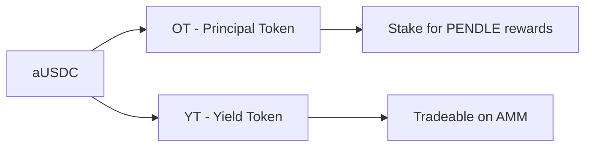
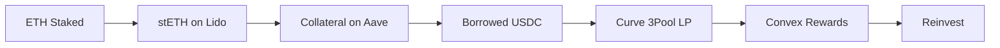
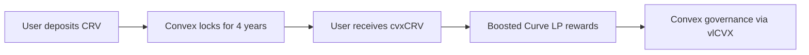

# Encyclopedia Galactica: Yield Farming Protocols


## Table of Contents


1. [Section 1: Introduction to Yield Farming Protocols](#section-1-introduction-to-yield-farming-protocols)

2. [Section 2: Historical Evolution and Milestones](#section-2-historical-evolution-and-milestones)

3. [Section 3: Technical Infrastructure and Mechanisms](#section-3-technical-infrastructure-and-mechanisms)

4. [Section 4: Major Protocol Categories and Design Patterns](#section-4-major-protocol-categories-and-design-patterns)

5. [Section 5: Economic Models and Tokenomics](#section-5-economic-models-and-tokenomics)

6. [Section 6: Risk Landscape and Mitigation Strategies](#section-6-risk-landscape-and-mitigation-strategies)

7. [Section 7: Regulatory and Compliance Dimensions](#section-7-regulatory-and-compliance-dimensions)

8. [Section 8: Ecosystem Impact and Societal Implications](#section-8-ecosystem-impact-and-societal-implications)

9. [Section 9: Notable Case Studies and Protocol Archetypes](#section-9-notable-case-studies-and-protocol-archetypes)

10. [Section 10: Future Trajectories and Concluding Analysis](#section-10-future-trajectories-and-concluding-analysis)


## Section 1: Introduction to Yield Farming Protocols

The emergence of decentralized finance (DeFi) heralded a radical reimagining of financial primitives – lending, borrowing, trading, and insurance – rebuilt on open, programmable blockchain infrastructure. Yet, it was the advent of **yield farming protocols** that transformed DeFi from a niche experiment into a global financial phenomenon, unlocking unprecedented avenues for capital efficiency and user incentivization. Often described as the engine of the "DeFi Summer" of 2020, yield farming represents a paradigm shift in how liquidity is attracted, retained, and rewarded within permissionless financial ecosystems. This section establishes the foundational understanding of yield farming: its precise definition within the DeFi landscape, its explosive historical genesis, its core philosophical and economic principles, and the essential lexicon required to navigate its intricate mechanics. It sets the stage for the deep exploration of its evolution, infrastructure, risks, and future trajectory that follows in subsequent sections.

**1.1 Defining Yield Farming in the DeFi Ecosystem**

At its core, **yield farming** (also frequently termed **liquidity mining**) is the practice of strategically allocating cryptocurrency assets – typically stablecoins, governance tokens, or liquidity pool (LP) tokens – across various DeFi protocols to generate returns. These returns primarily manifest as additional tokens, transaction fees, or interest payments. However, to define it merely as "earning yield" grossly understates its revolutionary nature and distinctiveness from traditional finance (TradFi).

*   **Distinction from Traditional Finance:**

*   **Permissionless Access:** Unlike TradFi yield generation (e.g., bonds, savings accounts, money market funds), which often requires intermediaries, credit checks, geographic access, and minimum investment thresholds, yield farming is fundamentally permissionless. Anyone with a cryptocurrency wallet and an internet connection can participate globally, 24/7. This democratization shattered barriers to entry that had persisted for centuries.

*   **Composability ("Money Legos"):** Yield farming thrives on **composability** – the ability of DeFi protocols to seamlessly integrate and interact with each other. A user's assets aren't siloed; they can be simultaneously deployed across multiple protocols in complex, automated strategies. For example, tokens earned as yield from one protocol can be instantly supplied as collateral to borrow assets in another, which are then deposited into a third protocol to farm further yield. This interconnectedness creates layers of capital efficiency unimaginable in TradFi's fragmented systems.

*   **Token-Based Incentives:** While TradFi yield is typically paid in the same currency deposited (e.g., USD interest on a USD deposit), a defining feature of yield farming is the distribution of a protocol's native **governance token** as a primary reward. This introduces a speculative element but, more importantly, aligns user incentives with protocol growth and governance participation.

*   **Transparency & Programmability:** All transactions, pool compositions, reward rates, and smart contract logic are verifiable on-chain. Yields are not set by opaque institutional committees but by transparent, algorithmically defined rules within immutable (or upgradable via governance) smart contracts.

*   **Core Objectives:**

*   **Capital Efficiency:** Yield farming protocols aim to maximize the utility of idle capital. By incentivizing users to lock assets into liquidity pools or lending markets, protocols ensure deep liquidity is available for traders and borrowers, reducing slippage and borrowing costs for the entire ecosystem. This creates a virtuous cycle where efficient markets attract more users, further deepening liquidity.

*   **Liquidity Incentives:** Bootstrapping liquidity for new assets or markets is notoriously difficult. Yield farming solves this "cold start problem" by directly rewarding users who provide liquidity with high initial yields, often paid in the protocol's own token. This was pivotal for the adoption of Automated Market Makers (AMMs) like Uniswap.

*   **Protocol Bootstrapping & User Acquisition:** Distributing governance tokens through yield farming is a powerful mechanism for decentralizing ownership, attracting users, and incentivizing long-term participation. Users become stakeholders with a vested interest in the protocol's success. The explosive growth of Compound following its COMP token launch exemplifies this perfectly.

*   **Key Components:**

*   **Liquidity Pools (LPs):** The foundational building block for most yield farming, particularly in decentralized exchanges (DEXs). Users deposit pairs of tokens (e.g., ETH/USDC) into a smart contract, creating a pool that facilitates trading. In return, they receive LP tokens representing their share of the pool and earn trading fees proportional to their contribution.

*   **Governance Tokens:** Native tokens (e.g., COMP, UNI, SUSHI, CRV) that confer voting rights on protocol upgrades, parameter changes (like fee structures or reward rates), and treasury management. Yield farming often involves earning these tokens as rewards.

*   **APY/APR Metrics:** The advertised returns for participating. **Annual Percentage Rate (APR)** represents the simple interest rate (e.g., 10% APR means $100 yields $10 in a year, ignoring compounding). **Annual Percentage Yield (APY)** factors in the effect of compounding – reinvesting earned rewards to generate further returns. A 10% APR compounded daily becomes approximately 10.52% APY. Critically, advertised APYs in DeFi are often extremely volatile, highly dependent on token prices, reward emissions, and pool utilization, and rarely sustainable long-term at initial launch levels.

Yield farming, therefore, is not a single protocol but an *activity* enabled by a constellation of interoperable DeFi primitives, driven by programmable incentives, and characterized by unprecedented accessibility and capital fluidity. It represents the practical application of DeFi's core tenets: open access, transparency, and user sovereignty over assets.

**1.2 Historical Context and Emergence**

While the term "yield farming" gained mainstream traction in mid-2020, its conceptual roots extend deeper into the history of blockchain and early DeFi.

*   **Precursors:**

*   **Bitcoin Mining Rewards:** The original blockchain incentive mechanism. Miners commit computational resources (Proof-of-Work) to secure the network and validate transactions, receiving newly minted BTC and transaction fees as rewards. This established the model of rewarding participants for contributing essential resources to a decentralized network.

*   **Early DeFi Lending Protocols:** Platforms like **MakerDAO** (founded 2014, DAI stablecoin launch 2017) and **Compound v1** (launched 2018) introduced on-chain, algorithmic lending and borrowing. Suppliers earned interest paid in the same asset deposited (e.g., supply ETH, earn interest in ETH), while borrowers paid interest. This created basic yield opportunities but lacked the token-based incentive layer that would later fuel explosive growth. **Aave** (originally ETHLend, rebranded 2018) further innovated with features like uncollateralized flash loans.

*   **The Catalyst: DeFi Summer 2020:**

The inflection point arrived on June 15, 2020, with **Compound Finance's** launch of its **COMP governance token**. Crucially, COMP wasn't sold; it was distributed *for free* to users who borrowed or supplied assets on the protocol. This mechanism, dubbed "liquidity mining," ingeniously aligned incentives:

1.  Users were incentivized to deposit/borrow assets to earn valuable COMP tokens.

2.  Increased activity boosted protocol fees and usage metrics.

3.  COMP holders gained governance rights, fostering decentralization.

4.  The rising price of COMP amplified the effective yield, attracting more users.

The results were immediate and staggering. Compound's Total Value Locked (TVL) exploded from ~$100 million to over $600 million in a week. The effective APY for certain activities, when factoring in COMP rewards, soared into the hundreds or even thousands of percent. This was the spark that ignited "DeFi Summer."

*   **Relationship to Automated Market Makers (AMMs):**

Yield farming's rise was inextricably linked to the concurrent maturation of AMMs, particularly **Uniswap**. Launched in November 2018 by Hayden Adams, Uniswap v1 pioneered the constant product formula (`x * y = k`) for permissionless token swaps, powered by user-deposited liquidity pools. Liquidity providers (LPs) earned 0.3% fees on trades proportional to their share.

However, bootstrapping liquidity for new token pairs was challenging. The COMP model provided the blueprint: reward LPs with a protocol's token. **SushiSwap**, a fork of Uniswap, executed a dramatic "**vampire attack**" in August 2020, offering its **SUSHI** token to users who staked their Uniswap LP tokens. This siphoned over $1 billion in liquidity from Uniswap in days, demonstrating the immense power of token incentives. Uniswap responded swiftly with its own **UNI token airdrop** to historical users in September 2020, distributing 400 UNI (worth ~$1200 at the time) to anyone who had ever interacted with the protocol – one of the largest "crypto stimulus" events, further cementing the liquidity mining model.

The period from June to September 2020 saw DeFi TVL rocket from under $2 billion to over $15 billion. A frenzy of "farm and dump" activity emerged, with users chasing the highest yields, often involving complex, multi-step strategies across newly launched protocols, fueled by the speculative value of newly minted governance tokens. While this period was marked by high risk and volatility, it undeniably proved the efficacy of token-based liquidity mining in rapidly scaling DeFi protocols and attracting massive amounts of capital.

**1.3 Core Principles and Value Propositions**

Yield farming protocols operate on several foundational principles that underpin their value proposition and differentiate them from traditional systems:

*   **Permissionless Participation Mechanics:** This is non-negotiable. Barriers to entry are technological (needing a wallet and understanding blockchain interactions), not institutional or geographic. Smart contracts autonomously execute rewards based on predefined rules verified by the network. There are no application forms, no credit checks, and no opening hours. A farmer in Southeast Asia has the same access as a hedge fund in New York (barring regulatory restrictions on the front-end interface).

*   **Incentive Alignment:** Well-designed yield farming protocols create powerful alignment between different stakeholders:

*   **Protocols:** Gain liquidity, users, activity, and decentralized governance participation.

*   **Liquidity Providers (LPs):** Earn fees and token rewards for enabling core functions (trading, lending).

*   **Users (Traders, Borrowers):** Benefit from deep liquidity (lower slippage) and competitive rates enabled by the incentives to LPs.

*   **Token Holders:** Gain governance rights and often a share of protocol revenue (e.g., via fee switches or staking mechanisms), tying their success to the protocol's long-term health. Protocols like **Curve Finance** later refined this with its **veCRV** (vote-escrowed CRV) model, locking tokens for longer periods to grant enhanced rewards and governance power.

*   **Democratization of Yield Generation:** Yield farming significantly lowered the barriers to sophisticated financial strategies previously reserved for institutions. Retail users could now participate in market making (via AMM LPs), algorithmic lending/borrowing, and complex leveraged yield strategies (often facilitated by flash loans). While risks are high, the *opportunity* for high yield was now globally accessible.

*   **Capital Efficiency Through Composability:** As highlighted earlier, the "Money Lego" nature of DeFi allows yield farmers to build intricate strategies. For example:

1.  Deposit DAI into Aave to earn interest and receive aDAI (interest-bearing token).

2.  Use aDAI as collateral to borrow USDC.

3.  Deposit USDC into a high-yield stablecoin pool on Curve.

4.  Take the Curve LP token and stake it in Curve's gauge to earn CRV rewards.

5.  Sell some CRV rewards periodically to compound back into the initial DAI deposit or take profit. This "stacking" of yields was a hallmark of sophisticated farming during DeFi Summer.

*   **Innovation Sandbox:** The permissionless environment fosters rapid experimentation with novel incentive models, tokenomics, and protocol designs. While many experiments fail (sometimes spectacularly), this trial-and-error process drives the evolution of more robust and efficient systems.

The core value proposition, therefore, is multifaceted: unprecedented access to financial opportunities, deeply aligned incentives driving network effects, radical capital efficiency through composability, and a fertile ground for continuous financial innovation.

**1.4 Key Terminology and Metrics**

Navigating yield farming requires fluency in its specific lexicon and understanding of critical metrics:

*   **Impermanent Loss (IL):** Perhaps the most crucial concept for liquidity providers. IL occurs when the price ratio of the two assets in a liquidity pool changes compared to when they were deposited. The LP's value, if they had simply held the assets (*HODL*), becomes higher than the value of their LP position. The loss is "impermanent" because it only materializes if the LP withdraws when the ratio is unfavorable; the ratio could revert. IL is most pronounced in volatile token pairs. For example, providing liquidity for ETH/DAI exposes the LP to IL if ETH's price moves significantly against DAI.

*   **Total Value Locked (TVL):** The aggregate value (typically in USD) of all assets deposited across a protocol or the entire DeFi ecosystem. It's a key indicator of adoption, liquidity depth, and overall market confidence, though it can be inflated by double-counting (e.g., assets deposited in a lending protocol that are then used as collateral to farm elsewhere) and is highly sensitive to token price volatility.

*   **Slippage:** The difference between the expected price of a trade and the executed price. In AMMs, larger trades (relative to pool size) cause greater price impact, leading to higher slippage. Deep liquidity pools, incentivized by yield farming, minimize slippage.

*   **Annual Percentage Yield (APY) vs. Annual Percentage Rate (APR):** As defined earlier, APR is the simple interest rate, while APY factors in compounding. DeFi protocols often display both, but APY is generally more relevant for strategies where rewards are frequently compounded. Critically, advertised yields often include:

*   **Base Yield:** Fees generated by the underlying protocol (e.g., trading fees for LPs, interest for lenders).

*   **Reward Yield:** Value of emitted governance tokens, calculated based on their *current* market price. This component is highly volatile and often the dominant factor in high advertised APYs.

*   **Reward Token Vesting Schedules:** To prevent immediate sell pressure and encourage longer-term participation, some protocols implement vesting for reward tokens. Users earn tokens immediately but must wait a specified period (e.g., linearly over 1 year) before they can claim or transfer them. This aims to align rewards with sustained protocol contribution.

*   **Emission Rates:** The rate at which a protocol's native token is minted and distributed as rewards. Protocols control emission schedules (e.g., fixed daily amount, decreasing over time). High emission rates can lead to significant token inflation and price depreciation if demand doesn't keep pace, a common pitfall in early farming models ("ponzinomics").

*   **Gas Fees:** The transaction costs required to interact with the Ethereum blockchain (or other L1s/L2s). Complex farming strategies involving multiple transactions can incur substantial gas costs, eroding profits, especially during network congestion. This drove migration to Layer 2 solutions (Optimism, Arbitrum) and alternative Layer 1s (BSC, Polygon) during peak DeFi activity.

*   **Automated Market Maker (AMM):** A type of DEX that uses mathematical formulas (like `x*y=k`) and liquidity pools to price assets and facilitate trades algorithmically, without traditional order books. Uniswap is the canonical example.

*   **Liquidity Provider (LP) Token:** A receipt token issued to users who deposit assets into a liquidity pool. It represents their share of the pool and is used to claim fees and withdraw the underlying assets. LP tokens themselves can often be staked in other protocols to farm additional rewards.

Understanding these terms is essential not only for participation but also for critically evaluating the risks and sustainability of different yield farming opportunities. The dazzling APY advertised often masks underlying complexities like impermanent loss, token inflation, and gas cost overhead.

**Conclusion of Section 1**

Yield farming protocols emerged not as a premeditated design but as an organic, incentive-driven evolution within the DeFi ecosystem, catalyzed by Compound's COMP distribution. They represent a radical departure from traditional finance, leveraging blockchain's core properties – permissionless access, transparency, and composability – to create dynamic, globally accessible markets for liquidity and yield generation. By rewarding participation with governance tokens, these protocols solved the critical "cold start" problem of bootstrapping liquidity and user bases, fueling the explosive growth of DeFi Summer 2020. The core principles of aligned incentives, democratized access, and capital efficiency remain potent, even as the landscape matures and grapples with inherent risks like impermanent loss and tokenomic sustainability. Mastering the foundational concepts and terminology outlined here – from liquidity pools and APY calculations to the ever-present specter of impermanent loss – is the essential first step in comprehending the intricate, high-stakes world of yield farming. Having established this bedrock understanding, we now turn to the **Historical Evolution and Milestones** of yield farming, tracing its path from the frenzied experiments of 2020 through periods of maturation, crisis, and ongoing innovation.


---


## Section 2: Historical Evolution and Milestones

Building upon the foundational concepts established in Section 1, the trajectory of yield farming protocols is a chronicle of explosive innovation, frenzied experimentation, sobering setbacks, and resilient adaptation. From tentative precursors struggling to bootstrap liquidity to the multi-billion dollar, institutionally-aware ecosystem of today, yield farming's history is punctuated by pivotal milestones that reshaped DeFi's landscape. This section traces this evolution chronologically, examining the pre-farming experiments, the catalytic ignition of DeFi Summer, the subsequent phase of scaling and maturation, and the ongoing innovations emerging from the crucible of bear markets. Understanding this history is crucial not only for context but for appreciating the iterative refinement of incentive mechanisms and risk management that defines modern yield farming.

### 2.1 Pre-Yield Farming Era (2017-2019): Laying the Groundwork

The concept of rewarding users for contributing essential resources to a decentralized network wasn't novel; Bitcoin's Proof-of-Work mining embodied it. However, applying this principle specifically to incentivize *financial* liquidity on-chain required the convergence of several key DeFi primitives and early, often clunky, experiments.

*   **Early Liquidity Mining Experiments:** Before "yield farming" entered the lexicon, pioneers grappled with the liquidity bootstrap problem.

*   **Bancor (2017):** Often credited with the first significant liquidity mining program. Bancor's protocol used a native "smart token" (BNT) as a common intermediary in its liquidity pools. To incentivize liquidity for new tokens, Bancor offered BNT rewards to users who provided liquidity to specific pools. While conceptually similar, the mechanics were less flexible and composable than later models. High gas costs on Ethereum and the nascent DeFi user base limited its initial impact, but it planted the seed of token-based liquidity rewards.

*   **Kyber Network (2017/2018):** This on-chain liquidity protocol, aggregating reserves from professional market makers and token projects, experimented with liquidity incentives through its Katalyst upgrade and KNC token. Reserves were rewarded with rebates in KNC based on their contribution to trade volume. While focused more on professional market makers initially, it explored the link between activity, liquidity depth, and token rewards.

*   **Synthetix's Staking Rewards: The Conceptual Precursor:** Synthetix (formerly Havven), launched in 2018, provided a critical conceptual bridge. It allowed users to mint synthetic assets (Synths) like sUSD by staking its native SNX token as collateral. Crucially, stakers were rewarded not only with fees generated by Synth trades but also with *newly minted SNX tokens*. This "inflationary rewards" model, distributed pro-rata based on staked SNX and fees earned, directly incentivized users to lock up collateral and participate in the network's core function. Synthetix demonstrated that distributing a protocol's native token could effectively bootstrap and sustain participation, a model Compound would later adapt and popularize for lending. The Synthetix staking yield, fluctuating based on network activity and SNX price, offered a glimpse of the dynamic, often high, returns that would characterize later yield farming.

*   **Limitations of Initial DeFi Lending:**

*   **MakerDAO:** The bedrock of decentralized stablecoins (DAI), Maker relied on overcollateralized debt positions (CDPs). While generating yield for DAI savers through the DSR (Dai Savings Rate), and later for MKR holders via stability fees, its model was fundamentally different. Rewards were paid in the same asset (DAI or MKR buybacks), not a new governance token distributed for participation. Bootstrapping the DAI supply relied on demand for leverage, not direct token incentives for suppliers. Its governance token, MKR, was primarily a recapitalization resource and governance tool, not a widely distributed participation reward.

*   **Aave v1 (ETHLend) & Compound v1:** These early lending protocols offered basic interest rate markets. Suppliers earned interest denominated in the supplied asset (e.g., supply ETH, earn ETH interest). While innovative, these yields were often modest compared to the risks and lacked the speculative upside or governance rights associated with dedicated liquidity mining tokens. Attracting liquidity, especially for less popular assets, remained challenging. The user experience was also significantly more complex than traditional finance, limiting adoption.

This era was characterized by foundational building blocks – functional AMMs like Uniswap v1, lending protocols, and synthetic asset platforms – struggling to achieve critical mass liquidity. The solutions were often siloed and lacked the powerful, composable token incentive layer that would soon ignite the ecosystem. Gas costs on Ethereum were a persistent barrier, and the total DeFi TVL hovered in the low hundreds of millions of dollars. The stage was set, however, for a catalyst that would connect these primitives with a potent incentive mechanism.

### 2.2 DeFi Summer Breakthrough (2020): The Incentive Engine Ignites

June 2020 marked the inflection point. Compound Finance's launch of the COMP governance token distribution mechanism didn't invent the concept of rewarding users, but it executed it with such elegance and perfect market timing that it triggered an explosion.

*   **Compound's Governance Token Distribution Model:** On June 15th, 2020, Compound began distributing COMP tokens daily to users based on their proportional share of interest paid or earned on the protocol. Borrowing *and* supplying assets earned COMP. This simple rule had profound effects:

1.  **Immediate Capital Influx:** Users rushed to deposit assets or take out loans purely to earn COMP tokens, regardless of the underlying interest rates. Compound's TVL surged from ~$90 million to over $600 million within a week.

2.  **Sky-High Effective Yields:** The combination of base interest plus the value of distributed COMP (which rapidly appreciated) resulted in nominal APYs reaching hundreds or even thousands of percent for certain assets/strategies. The "yield" was now undeniably attractive.

3.  **Viral Growth Loop:** Rising COMP price attracted more users, increasing protocol activity and fees, further boosting COMP demand and price – a powerful, albeit volatile, flywheel.

4.  **Decentralization Catalyst:** COMP holders gained voting rights, gradually distributing control away from the founding team.

*   **Rapid Protocol Forks and the "Vampire Attack":** The open-source nature of DeFi meant COMP's model was instantly replicable. A frenzy of forks and new launches ensued, each offering their own token rewards.

*   **Balancer (June 2020):** Quickly followed suit with its BAL token, rewarding liquidity providers in its customizable multi-token pools.

*   **The SushiSwap Phenomenon (August/September 2020):** This event crystallized the power and potential ruthlessness of token incentives. "Chef Nomi," an anonymous developer, forked Uniswap v2's code to create SushiSwap. Its key innovation: offering **SUSHI** tokens as rewards to users who staked their Uniswap LP tokens. Crucially, 0.05% of all trading fees were also diverted to buy SUSHI on the open market and distribute it to SUSHI stakers. This "yield on yield" mechanism was highly attractive. SushiSwap executed a "**vampire attack**" – it incentivized users to migrate their Uniswap liquidity to SushiSwap by offering SUSHI rewards, promising to eventually launch its own exchange using the drained liquidity. Within 72 hours, over $1 billion in liquidity migrated from Uniswap. While fraught with controversy (including a temporary panic when Chef Nomi withdrew ~$14 million in dev funds), SushiSwap demonstrated that even dominant incumbents were vulnerable to well-executed token incentive attacks.

*   **Uniswap's Response - The UNI Airdrop (September 2020):** Facing an existential threat, Uniswap retaliated decisively. On September 16th, 2020, it launched its own UNI governance token and airdropped 400 UNI to every wallet that had ever interacted with the protocol before September 1st – approximately 250,000 users. At launch price (~$3), this was a $1200 "stimulus check" to the early DeFi community. Additionally, UNI rewards were offered for providing liquidity. This masterstroke not only stemmed the liquidity bleed but also cemented UNI's position as a blue-chip DeFi asset and set a precedent for retroactive rewards for early users.

*   **TVL Explosion and the "Farm and Dump" Frenzy:** The period from June to September 2020 was pure euphoria. TVL across DeFi skyrocketed from under $2 billion to over $15 billion. A deluge of new protocols launched daily, each with its own token and often ludicrously high APYs. "Yield farmers" employed complex, multi-step strategies:

1.  Identify new protocol with high APY.

2.  Deposit capital (often leveraged via flash loans).

3.  Farm the token rewards aggressively.

4.  Sell ("dump") the rewards as quickly as possible onto the market before the inevitable price decline.

5.  Exit the farm and repeat on the next one.

Platforms like **Yam Finance** (August 2020) became infamous symbols of this frenzy. Its ambitious (and unaudited) rebasing mechanism and high initial APYs attracted hundreds of millions in minutes, only to suffer a fatal bug within 36 hours, vaporizing much of the value. Despite the rampant speculation and frequent rug pulls, DeFi Summer proved the raw power of token-based liquidity mining. It solved the cold start problem definitively and demonstrated that open, composable protocols could attract massive capital at unprecedented speed.

### 2.3 Maturation Phase (2021-2022): Scaling, Sophistication, and Institutional Forays

The initial frenzy of 2020 gave way to a period of consolidation, infrastructure development, and increasing sophistication in yield strategies. The focus shifted from pure "farm and dump" towards sustainable(ish) models, scaling solutions, and attracting larger players.

*   **The Layer 2 Scaling Revolution:** Ethereum's crippling gas fees during peak demand made many yield farming strategies economically unviable for smaller players. The rise of **Optimistic Rollups (Optimism, Arbitrum)** and **ZK-Rollups (zkSync, StarkNet, Polygon zkEVM)** offered a solution. By processing transactions off-chain and submitting compressed proofs (or fraud proofs) to Ethereum Mainnet (L1), these Layer 2 (L2) networks slashed gas costs by orders of magnitude (often 10-100x cheaper). Protocols rapidly deployed on L2s:

*   **Uniswap v3** launched simultaneously on Ethereum Mainnet, Optimism, and Arbitrum in May 2021.

*   **Curve Finance** deployed on Polygon, Arbitrum, and Fantom.

*   **Balancer, Aave v2/v3, Compound v3** followed suit.

Yield farming activity migrated en masse to L2s, making participation accessible again and enabling more complex, gas-sensitive strategies. TVL on L2s grew exponentially, becoming a significant portion of the overall DeFi ecosystem.

*   **Cross-Chain Yield Strategies:** As multiple Layer 1 blockchains (Solana, Avalanche, Fantom, Terra) and L2s gained traction, liquidity and users became fragmented. Protocols emerged to bridge these ecosystems and enable cross-chain yield farming:

*   **Multichain (formerly Anyswap):** Provided cross-chain bridges for assets, allowing users to move capital between chains to chase the best yields. Farmers could deposit assets on Chain A, bridge them to Chain B, farm on a protocol there, and potentially bridge rewards back – all in pursuit of higher APYs.

*   **Stargate Finance (by LayerZero):** Introduced a novel "unified liquidity" model for stablecoins, enabling native asset transfers with guaranteed finality across chains. This facilitated more efficient stablecoin yield farming across multiple ecosystems. Platforms like **Beefy Finance** and **Stella** emerged as cross-chain yield aggregators, automating the process of finding and compounding the highest yields across different chains.

*   **Institutional Entrants and Sophisticated Vaults:** The maturing infrastructure and larger TVL pools began attracting institutional capital and more sophisticated yield strategies.

*   **Yearn Finance's Evolution:** Yearn, pioneered by Andre Cronje, evolved from a simple yield aggregator (automatically moving funds between lending protocols) into a complex ecosystem of **Vaults**. These Vaults employed automated, often leveraged, strategies across multiple protocols (lending, AMMs, derivatives) to optimize risk-adjusted returns. Strategies were coded by "strategists" and earned performance fees. Yearn v2 Vaults, focusing on stablecoins and blue-chip assets, offered a "set and forget" yield solution attractive to larger, less hands-on investors seeking exposure to DeFi yields without daily management. Competitors like **Convex Finance** emerged, specifically optimizing yield and vote-locking for Curve Finance's ecosystem.

*   **Structured Products:** Platforms like **Ribbon Finance** offered automated options strategies (e.g., covered calls, cash-secured puts) to generate yield on crypto assets, appealing to users comfortable with derivatives. **Maple Finance** pioneered on-chain institutional lending pools, offering yields sourced from real-world borrowing demand (though this later faced challenges).

*   **Liquidity Staking Derivatives (LSDs):** The emergence of **Lido Finance** and **Rocket Pool** on Ethereum post-Merge allowed users to stake ETH and receive a liquid staking token (stETH, rETH) representing their staked position plus rewards. These LSDs could then be used *within* DeFi protocols for lending, collateral, or providing liquidity, enabling "double-dipping" on staking rewards and DeFi yields. The integration of LSDs into yield farming strategies became a major theme.

This period saw yield farming evolve from a retail-dominated, high-risk/high-reward frontier to a landscape with institutional-grade infrastructure, diversified strategies spanning multiple chains, and more sophisticated risk management tooling, albeit still fraught with significant perils.

### 2.4 Bear Market Innovations (2022-Present): Building Through the Winter

The brutal crypto bear market of 2022, triggered by the collapse of Terra/LUNA-UST and exacerbated by the failures of Celsius, Three Arrows Capital, and FTX, decimated DeFi TVL and token prices. However, the pressure catalyzed critical innovations focused on sustainability, real-world integration, and mitigating systemic risks.

*   **Sustainable Tokenomics Shifts:** The hyperinflationary "ponzinomics" of early farming models, where high yields relied solely on token emissions exceeding sell pressure, proved unsustainable in a downturn. Protocols implemented more sophisticated tokenomics:

*   **veTokenomics (Curve, Balancer, etc.):** Building on Curve's **veCRV** model (introduced in 2020 but widely adopted/emulated later), protocols required users to lock governance tokens for extended periods (e.g., 1-4 years) to receive boosted rewards and enhanced voting power (veToken = vote-escrowed token). This reduced immediate sell pressure, aligned holders with long-term success, and created a valuable governance token accruing protocol fees. Platforms like **Convex Finance** arose to aggregate veToken locking power, further concentrating governance influence but simplifying the process for users.

*   **Fee Switches and Revenue Sharing:** Protocols increasingly activated mechanisms to direct a portion of protocol fees (e.g., trading fees, loan origination fees) back to veToken holders or stakers. This created a tangible, non-inflationary yield source, reducing reliance on token emissions. Examples include SushiSwap's **xSUSHI** staking and Aave's **stkAAVE** safety module rewards.

*   **Diminishing Emissions & Burn Mechanisms:** Many protocols revised their token emission schedules to be deflationary over time or implemented token burns (e.g., using a portion of fees to buy and burn tokens), counteracting inflation.

*   **Real-World Asset (RWA) Yield Integration:** With crypto-native yields depressed, protocols sought to generate yield from traditional finance by tokenizing real-world debt.

*   **On-Chain Treasury Bills:** Protocols like **MakerDAO** allocated billions of DAI reserves into US Treasury bonds and bills via partners like Monetalis and BlockTower, passing a portion of the yield back to DAI holders via the DSR. **Aave** explored similar initiatives with its GHO stablecoin.

*   **Tokenized Credit Markets:** Platforms like **Centrifuge** and **Goldfinch** facilitated the origination of tokenized loans backed by real-world assets (invoices, real estate, consumer loans), offering DeFi lenders exposure to these yields. While offering diversification and potentially lower volatility, these models introduced new counterparty and regulatory risks.

*   **MEV Mitigation in Farming:** The prevalence of Maximal Extractable Value (MEV), particularly damaging "sandwich attacks" against yield farmers' transactions (front-running deposits/withdrawals to steal value), became a critical focus.

*   **Fair Sequencing Services (FSS):** Projects like **Flashbots' SUAVE** and **Eden Network** aimed to create fairer transaction ordering to prevent front-running.

*   **MEV-Protected RPCs:** Services like **Flashbots Protect RPC** allowed users to submit transactions privately to block builders, reducing exposure to harmful MEV.

*   **Protocol-Level Solutions:** Some yield aggregators and AMMs began integrating MEV-resistance features directly into their transaction flows or contract designs to protect users' yields.

*   **Resilience and Adaptation:** The bear market acted as a brutal stress test. Protocols that survived did so by prioritizing security audits, transparent governance, sustainable tokenomics, and robust treasury management. Innovations like **morpho-blue's peer-to-pool lending** and **Ajna Finance's gas-efficient, oracle-free lending pools** emerged, focusing on capital efficiency and minimizing external dependencies. The focus shifted from chasing unsustainable triple-digit APYs towards building resilient, value-generating infrastructure capable of weathering market cycles.

The bear market did not kill yield farming; it forced it to mature. The innovations born in this period – sustainable tokenomics, RWA integration, MEV mitigation, and a heightened focus on security – laid the groundwork for the next evolution, even as the broader market recovered. Yield farming emerged leaner, more sophisticated, and increasingly integrated with the broader financial landscape.

### Conclusion of Section 2

The history of yield farming protocols is a dynamic narrative of incentive design under pressure. From the rudimentary liquidity rewards of Bancor and the conceptual groundwork laid by Synthetix, through the paradigm-shifting ignition of Compound's COMP distribution and the frenzied experimentation of DeFi Summer, yield farming rapidly evolved. It weathered the scaling challenges through Layer 2 solutions and cross-chain interoperability, attracting institutional capital with sophisticated vaults and strategies. The brutal bear market of 2022-2023, while devastating, proved to be a crucible of innovation, forcing a necessary shift towards sustainable tokenomics, the integration of real-world yields, and improved defenses against systemic risks like MEV. This historical journey demonstrates yield farming's remarkable adaptability and its persistent role as a core engine of liquidity and innovation within DeFi. Having charted its tumultuous evolution, we now turn to the **Technical Infrastructure and Mechanisms** that underpin these complex systems, examining the smart contracts, AMM engines, oracle systems, and composable architecture that make modern yield farming possible.


---


## Section 3: Technical Infrastructure and Mechanisms

The tumultuous history of yield farming, chronicled in Section 2, reveals a narrative driven by relentless innovation and adaptation under market pressures. Yet, beneath the surface-level frenzy of token incentives and TVL surges lies a bedrock of sophisticated technical infrastructure. It is this intricate latticework of smart contracts, automated market makers, oracle systems, and composable protocols that transforms the theoretical potential of yield farming into operational reality. As the bear market innovations demonstrated, resilience is not merely economic but deeply rooted in the robustness, efficiency, and security of the underlying code and architectural choices. This section dissects the core technical pillars enabling yield farming, illuminating the often-invisible engines that power the generation, calculation, and distribution of yield in a trustless environment. Understanding these mechanisms is paramount to grasping both the revolutionary capabilities and inherent vulnerabilities of the DeFi ecosystem.

**3.1 Smart Contract Frameworks: The Immutable Rulebook**

At the heart of every yield farming protocol lies its smart contract code. These self-executing programs, deployed on blockchains like Ethereum or its Layer 2s, encode the immutable (or upgradeable under strict governance) rules governing user interactions, asset custody, reward distribution, and protocol logic. They are the foundational layer upon which trust in DeFi is built.

*   **Standard Implementations: Building Blocks for Efficiency and Security:**

*   **ERC-20:** The ubiquitous token standard (Ethereum Request for Comment 20) is fundamental. Governance tokens (COMP, UNI, CRV), reward tokens, and LP tokens are overwhelmingly ERC-20 compliant. This standardization ensures seamless interoperability between wallets, exchanges, and other protocols – a prerequisite for composability. An LP token from Uniswap can be recognized and staked in a Curve gauge precisely because both adhere to the ERC-20 interface.

*   **ERC-4626: The "Vault Standard":** Launched in late 2021, ERC-4626 revolutionized yield-bearing vaults. Before its advent, vaults (like those pioneered by Yearn Finance) each had unique, often incompatible interfaces for depositing assets, tracking shares, and withdrawing. ERC-4626 standardized these functions, defining a common API for tokenized vaults that wrap yield-bearing assets. This significantly simplified integration for front-ends, aggregators, and other protocols. A yield aggregator like **Beefy Finance** can now automatically interact with any ERC-4626 compliant vault across different chains without custom integrations, dramatically improving capital efficiency and user experience. It became the "Money Lego" connector for complex yield strategies.

*   **Other Relevant Standards:** ERC-721 (Non-Fungible Tokens) gained prominence with Uniswap v3's concentrated liquidity positions, where each LP position is a unique NFT representing its specific price range and liquidity amount. ERC-1155 (Multi-Token Standard) is used by platforms like Balancer for managing complex multi-asset pools within a single contract.

*   **Auditing Processes: The Critical Security Gate:** Given the immense value locked in DeFi protocols, rigorous security auditing is non-negotiable, though not foolproof. The process typically involves:

1.  **Internal Review:** Protocol developers conduct extensive unit and integration testing.

2.  **Professional Audit Firms:** Reputable firms like **OpenZeppelin, Trail of Bits, CertiK, PeckShield**, and **Quantstamp** conduct manual code reviews, static analysis (scanning code for known vulnerability patterns), and dynamic analysis (testing the running contract). Audits often cost tens or hundreds of thousands of dollars and take weeks or months.

3.  **Bug Bounties:** Programs on platforms like **Immunefi** incentivize white-hat hackers to discover and responsibly disclose vulnerabilities for significant rewards (sometimes exceeding $1 million for critical bugs).

4.  **Formal Verification:** An advanced technique using mathematical proofs to verify that the code meets its formal specification. While resource-intensive, its adoption is growing for critical components (e.g., **MakerDAO** uses formal verification for core modules of its system). Projects like **Certora** specialize in this.

*   **Common Vulnerability Classes:** Despite audits, exploits occur. Key vulnerabilities include:

*   **Reentrancy Attacks:** Where a malicious contract interrupts the execution flow of a vulnerable contract to drain funds (famously exploited in the 2016 DAO hack). Mitigated by the "Checks-Effects-Interactions" pattern and OpenZeppelin's `ReentrancyGuard`.

*   **Logic Errors:** Flaws in the core protocol design or reward calculation math (e.g., the initial **Fei Protocol** launch issues).

*   **Oracle Manipulation:** Exploiting price feed inaccuracies (discussed in 3.3).

*   **Access Control Flaws:** Missing or incorrect permission checks allowing unauthorized users to execute privileged functions.

*   **Front-Running/MEV:** While not a contract *bug* per se, protocols must design to minimize exposure (discussed in 2.4 & 6.3).

*   **Upgradeability Mechanisms: Balancing Immutability and Evolution:** While blockchain immutability is a core security feature, protocols often need to fix bugs or implement improvements. Upgradeability patterns provide controlled evolution:

*   **Proxy Patterns (Transparent/UUPS):** The most common solution. A lightweight "proxy" contract holds the protocol's state and delegates function calls to a separate "logic" contract holding the executable code. Upgrading involves deploying a new logic contract and pointing the proxy to it. **Transparent Proxies** have a specific admin address for upgrades. **UUPS (Universal Upgradeable Proxy Standard)** proxies bake the upgrade logic into the implementation contract itself, reducing proxy gas costs. Critical considerations include:

*   **Timelocks:** To prevent sudden, potentially malicious upgrades, a timelock contract is often used. Once a governance vote approves an upgrade, the change is queued and only executable after a predefined delay (e.g., 24-72 hours), giving users time to react or exit. This was crucial in mitigating potential damage during incidents like the **SushiSwap Miso auction exploit** (Sept 2021), where a white-hat used the timelock to recover funds.

*   **Governance Control:** Upgrade permissions are typically held by the protocol's governance token holders (via a DAO), ensuring decentralization. Proxies and timelocks are fundamental infrastructure for almost all major yield farming protocols (Uniswap, Aave, Compound, etc.).

*   **Diamond Pattern (EIP-2535):** A more complex, modular upgradeability standard allowing a single proxy contract to delegate calls to multiple logic contracts ("facets"). This enables adding, replacing, or removing specific protocol features without a full monolithic upgrade, used by protocols like **Gnosis Safe** and **Aavegotchi**.

The smart contract layer embodies the rules of the game. Its security, efficiency, and upgradeability are paramount, forming the trust foundation upon which billions of dollars in user capital rely daily for yield generation.

**3.2 Automated Market Maker (AMM) Engines: The Liquidity Powerhouses**

Liquidity pools, primarily powered by Automated Market Makers (AMMs), are the lifeblood of most yield farming strategies. These algorithms replace traditional order books with mathematical formulas to determine asset prices algorithmically based on the reserves in a pool. Understanding their mechanics is essential for LPs assessing risks like impermanent loss and for protocols designing efficient incentives.

*   **Constant Product Formula (x*y=k): The Uniswap V1/V2 Foundation:** Pioneered by Uniswap v1, this elegant formula underpins most early AMMs. For a pool containing two assets, X and Y, the product of their quantities (`x * y`) must always equal a constant (`k`). When a trader buys asset X, they add Y to the pool, decreasing x and increasing y, causing the price of X (defined as y/x) to rise. The key implications for LPs:

*   **Continuous Liquidity:** Trades can always occur at *some* price, regardless of size (though large trades cause significant slippage).

*   **Impermanent Loss (IL) Inherent:** LPs are exposed to IL whenever the price ratio of the two assets diverges from the ratio at deposit time. The larger the divergence, the greater the IL relative to holding.

*   **Fee Revenue:** LPs earn a fixed percentage (e.g., 0.3% for Uniswap v2) on every trade proportional to their pool share. High volume pools generate significant fee yield.

*   **Simplicity & Composability:** The simple formula made it easy to implement, audit, and integrate, fueling DeFi's composability boom. LP tokens were fungible and easily staked elsewhere.

*   **Concentrated Liquidity Innovations (Uniswap v3): Capital Efficiency Revolution:** Launched in May 2021, Uniswap v3 introduced a paradigm shift: **concentrated liquidity**. Instead of providing liquidity across the entire price curve (0 to ∞), LPs can concentrate their capital within specific price ranges they choose.

*   **Mechanics:** An LP specifies a `minPrice` and `maxPrice` where they want their capital active. Within this range, they provide significantly higher liquidity density than a v2 LP would over the same interval, capturing a larger share of the fees generated by trades occurring within their chosen band. Outside the range, their capital is inactive and earns no fees.

*   **Impact on Yield Farming:**

*   **Higher Capital Efficiency:** LPs can achieve higher fee yields with less capital *if* they accurately predict the trading range. This made LPing more attractive for sophisticated actors and reduced slippage for traders.

*   **Active Management:** Concentrated LP positions require more active monitoring and rebalancing (adjusting the price range) as asset prices move, introducing management overhead and gas costs. This birthed services like **Arrakis Finance** and **Gamma Strategies** that automate v3 LP management.

*   **NFT LP Tokens:** Each v3 position is unique (due to its custom price range) and represented as an NFT (ERC-721), complicating composability compared to fungible v2 LP tokens. Protocols adapted by creating wrappers (e.g., **Gelato Network's Uniswap v3 liquidity manager**) to make these NFT positions usable in yield farms.

*   **Enhanced Fee Tiers:** Uniswap v3 introduced multiple fee tiers (0.01%, 0.05%, 0.30%, 1.00%) for different volatility profiles. Stablecoin pairs (like USDC/USDT) could use lower tiers (0.01% or 0.05%) due to minimal price movement, while volatile pairs used 0.30% or 1.00%. LPs select the tier matching their risk/return appetite.

*   **Fee Tier Structures and LP Position Management:** Beyond Uniswap v3, fee structures are a critical design choice for AMMs:

*   **Dynamic Fees:** Some AMMs like **Trader Joe v2.1** (on Avalanche) implemented dynamic fees that adjust based on market volatility or pool utilization, aiming to optimize returns for LPs and costs for traders.

*   **Protocol-Owned Liquidity:** Protocols like **OlympusDAO** pioneered holding their own LP tokens within the protocol treasury (Protocol Controlled Value - PCV), capturing fees for the protocol and reducing reliance on external mercenary capital.

*   **Single-Sided Liquidity:** To mitigate impermanent loss for specific assets, protocols like **Alpaca Finance** (leveraged yield farming) and **Bancor v3** offered single-sided staking solutions, often using protocol-owned buffers or dynamic fee adjustments to absorb IL temporarily. Bancor v3's "Impermanent Loss Protection" mechanism pooled IL risk across the entire protocol but was ultimately unsustainable during the 2022 market crash, leading to significant losses and a protocol pause.

The AMM engine is where capital meets market activity. Its design directly dictates the risk/return profile for LPs, the efficiency for traders, and consequently, the attractiveness and sustainability of liquidity mining programs built upon it. The evolution from constant product to concentrated liquidity represents a significant leap in capital efficiency, albeit with increased complexity.

**3.3 Oracle Systems for Price Feeds: The Truth Anchors**

Accurate, tamper-resistant price data is the oxygen for DeFi. Lending protocols need it to determine loan health and liquidations. AMMs implicitly rely on it (via arbitrage) but often need explicit feeds for functions like reward distribution or advanced pool types. Yield calculations, especially those involving token rewards valued in USD, critically depend on reliable oracles. Manipulation can lead to catastrophic losses.

*   **Decentralized Oracle Solutions:**

*   **Chainlink:** The dominant decentralized oracle network. It aggregates price data from numerous premium data providers, runs it through a decentralized network of node operators, and delivers it on-chain via decentralized data feeds. Key features for yield farming security:

*   **Decentralization at Data Source and Node Level:** Reduces single points of failure and manipulation risk.

*   **Reputation System & Penalties:** Node operators stake LINK tokens and are penalized (slashed) for downtime or incorrect data.

*   **High-Quality Data Sources:** Aggregates data from top-tier exchanges with high liquidity.

*   **Wide Asset Coverage:** Supports thousands of price feeds across numerous blockchains.

*   **Pyth Network:** A newer entrant focusing on **low-latency, high-frequency data** directly from institutional trading firms (like Jane Street, CBOE, Binance) acting as "first-party" data publishers. Publishers stake tokens and attest to prices directly on-chain. Pyth leverages the **Solana** blockchain's speed for rapid price updates and uses a "pull" model where users pay minimal fees to receive the latest price. Its speed makes it attractive for perps and options protocols used in advanced yield strategies.

*   **Other Models:** **UMA's Optimistic Oracle** relies on a dispute mechanism – a price is proposed and only challenged if deemed incorrect, suitable for less time-sensitive data. **Tellor** uses a proof-of-work mechanism where miners compete to submit prices.

*   **Manipulation Resistance in Reward Calculations:** Yield farming protocols are prime targets for oracle manipulation because reward payouts are often directly tied to the USD value of the governance token being distributed. Attackers might attempt to:

1.  Artificially inflate the token price on a low-liquidity exchange.

2.  Exploit a protocol using a single price source or a manipulable TWAP from a DEX to calculate rewards.

3.  Receive disproportionately high rewards relative to the token's *real* market value.

Mitigation strategies include:

*   **Using Decentralized Oracles (Chainlink/Pyth):** Their aggregation and staking mechanisms make large-scale manipulation economically impractical.

*   **TWAPs (Time-Weighted Average Prices):** Instead of using the spot price, protocols often calculate rewards based on a TWAP over a specific period (e.g., 30 minutes). This smooths out short-term price spikes caused by manipulation attempts or low liquidity. Uniswap v3's built-in TWAP oracles are commonly used for this purpose within DeFi protocols.

*   **Multi-Source Validation:** Some protocols cross-reference prices from multiple independent oracles before accepting a value.

*   **Oracle Failures and Lessons:** The consequences of oracle failure are severe:

*   **The bZx Exploits (Feb 2020):** Attackers used flash loans to manipulate the price of synthetics on decentralized oracles (Kyber/Uniswap), enabling them to borrow massively undercollateralized loans from bZx, stealing millions. This highlighted the vulnerability of DEX-based oracles to flash loan-induced manipulation.

*   **Mango Markets Exploit (Oct 2022):** An attacker manipulated the price of the MNGO token (using low liquidity on Mango's internal oracle) via a large perpetual futures position, allowing them to drain $114 million by borrowing against the artificially inflated collateral. This underscored the risk of relying on internal or poorly designed oracles, especially for the collateral asset itself.

*   **CRV Depegging Scare (Summer 2023):** Concerns over Michael Egorov's large CRV-backed loans across multiple protocols led to targeted attacks attempting to manipulate CRV's price downward to trigger liquidations. While largely unsuccessful due to swift community action and the use of resilient oracles, it demonstrated the systemic risks when a key DeFi token faces concentrated selling pressure near liquidation points.

Oracles are the critical bridge between off-chain reality and on-chain execution. Their reliability and manipulation resistance are fundamental to the accurate calculation of yields, the prevention of exploits, and the overall stability of the yield farming ecosystem. The evolution towards robust, decentralized networks like Chainlink and Pyth represents a significant hardening of this vital infrastructure layer.

**3.4 Composability and Money Legos: The Yield Amplifiers**

Composability – the seamless interoperability of DeFi protocols – is the superpower that unlocks the most sophisticated and lucrative yield farming strategies. Smart contracts can permissionlessly call functions in other smart contracts, allowing users to chain together complex financial operations atomically (in a single transaction) or across multiple steps. This "Money Lego" property transforms simple deposits into intricate yield-generating machines.

*   **Protocol Interoperability Standards:** Composability relies on standards:

*   **ERC-20/ERC-4626:** As discussed, these standards allow tokens and vaults to be universally recognized and interacted with.

*   **Ethereum as Settlement Layer:** Most major DeFi primitives originated on Ethereum, creating a dense, interconnected ecosystem. Standards naturally proliferated here.

*   **Cross-Chain Messaging:** Protocols like **LayerZero, Wormhole, Axelar, and CCIP (Chainlink)** enable smart contracts on one blockchain to securely read state or trigger actions on another, enabling cross-chain composability (e.g., supplying collateral on Ethereum to borrow on Avalanche for farming).

*   **Yield Aggregator Architectures: Automating the Stack:** Yield aggregators epitomize composability. They automate the process of finding, entering, managing, and compounding yield across multiple protocols.

*   **How They Work:**

1.  **Capital Pooling:** Users deposit assets (e.g., DAI, USDC, ETH) into the aggregator's vault.

2.  **Strategy Execution:** The aggregator's smart contracts automatically deploy the capital into the highest-yielding opportunities identified by its algorithms and strategists. This often involves multiple steps:

*   Supplying assets to a lending protocol (Aave, Compound).

*   Taking the interest-bearing tokens (aDAI, cUSDC) and using them as collateral.

*   Borrowing other assets.

*   Swapping borrowed assets.

*   Depositing into LP positions (Curve, Uniswap v3).

*   Staking LP tokens in gauge rewards contracts.

3.  **Compounding:** Earned rewards (governance tokens, trading fees) are automatically harvested, sold for more of the base asset, and reinvested to compound returns.

4.  **Risk Management:** Aggregators often implement strategies to mitigate IL, monitor loan health ratios, and automatically exit positions if risks escalate.

*   **Leading Examples:**

*   **Yearn Finance:** The pioneer. Its vaults abstract complex leveraged strategies into simple deposits. Vault strategists continuously monitor and optimize strategies.

*   **Beefy Finance:** Focuses on multi-chain autocompounding. Users deposit LP tokens into a Beefy vault, which automatically stakes them in the underlying farm and compounds rewards back into the LP position, boosting the base yield.

*   **Convex Finance:** Specialized aggregator for the Curve ecosystem. Users deposit Curve LP tokens (e.g., stETH/ETH) into Convex, which handles veCRV locking and vote delegation, maximizing CRV rewards and capturing protocol bribes, simplifying the process for users. Convex's rise exemplifies how composability can lead to centralization of governance power.

*   **Benefits:** Maximizes yield through automation and strategy optimization, reduces gas costs by batching operations, simplifies complex strategies for end-users.

*   **Risks:** Introduces additional smart contract risk (the aggregator's code), strategy risk (if the underlying strategy fails or is poorly designed), and potential centralization in strategy management.

*   **Flash Loan Integration for Leveraged Farming: The Ultimate Composable Primitive:** Flash loans, pioneered by Aave and now ubiquitous, allow users to borrow vast amounts of capital *without collateral* within a single transaction, provided the borrowed amount (plus a fee) is repaid by the end of that transaction. This enables sophisticated, capital-efficient strategies:

*   **Leveraged Yield Farming:** A farmer could:

1.  Take a $10M USDC flash loan.

2.  Deposit $10M USDC into a high-yield stablecoin pool on Curve, receiving crvUSDC LP tokens.

3.  Stake crvUSDC tokens in Curve's gauge to earn CRV rewards.

4.  Sell a portion of the *anticipated* CRV rewards on a DEX for USDC *within the same transaction*.

5.  Repay the $10M flash loan plus fee with the USDC from the sale.

6.  Keep the remaining CRV rewards and any LP fees as profit (minus gas).

This allows farmers to amplify their returns using borrowed capital, effectively farming yield with minimal upfront capital. However, it magnifies risks – if the price of CRV drops significantly between steps 2 and 4, the sale might not cover the loan repayment, causing the entire transaction to revert. Flash loans also enable arbitrage and liquidations, contributing to overall market efficiency but also being a tool for exploits (as seen in bZx).

Composability is the force multiplier of DeFi. It transforms isolated protocols into a synergistic financial system where capital flows frictionlessly to its most productive use, enabling yield strategies of unprecedented complexity and efficiency. Yield aggregators automate this complexity, while flash loans provide the uncollateralized leverage that supercharges returns (and risks). This interconnectedness, however, also creates systemic dependencies, where a failure or exploit in one protocol can cascade through others, as explored in later sections on risks.

**Conclusion of Section 3**

The dazzling yields and complex strategies that define modern yield farming are underpinned by a robust, albeit constantly evolving, technical infrastructure. Smart contracts, governed by standards like ERC-20 and ERC-4626 and secured through rigorous audits and upgrade mechanisms like proxies and timelocks, encode the immutable rules of engagement. Automated Market Makers, evolving from the simple constant product formula to the capital-efficient concentrated liquidity of Uniswap v3, provide the liquidity engines where fees are generated. Decentralized oracle networks like Chainlink and Pyth anchor these systems to real-world prices with increasing resilience against manipulation, ensuring yields and liquidations are calculated accurately. Finally, the principle of composability – the seamless interaction of these protocols – allows for the creation of sophisticated automated strategies via yield aggregators and the deployment of uncollateralized leverage through flash loans, amplifying both opportunities and risks.

This intricate technical foundation has been forged through cycles of innovation, exploitation, and refinement. It enables the permissionless, global, and highly efficient yield generation that distinguishes DeFi from traditional finance. However, understanding these mechanisms also reveals the potential fault lines – smart contract vulnerabilities, oracle manipulation, composability risks, and the inherent complexities of concentrated liquidity or leveraged strategies. Having dissected the technical bedrock, we now turn to the **Major Protocol Categories and Design Patterns** that utilize this infrastructure, examining the diverse economic and technical blueprints that define how yield is generated across the DeFi landscape.


---


## Section 4: Major Protocol Categories and Design Patterns

The robust technical infrastructure explored in Section 3—smart contracts enforcing immutable rules, AMM engines powering liquidity, oracle networks anchoring prices, and composability enabling seamless interactions—serves as the foundation for diverse yield generation mechanisms. Yield farming is not monolithic but manifests through distinct protocol archetypes, each with unique technical architectures, economic incentives, and risk profiles. Understanding these categories is essential for navigating the DeFi landscape and evaluating the sustainability and suitability of different farming opportunities. This section provides a comprehensive taxonomy of major yield farming protocol categories, dissecting their core mechanics, evolutionary innovations, and illustrative case studies that have shaped the DeFi ecosystem.

### 4.1 Liquidity Pool-Based Protocols

Liquidity pool (LP) protocols, primarily decentralized exchanges (DEXs) powered by Automated Market Makers (AMMs), represent the most direct avenue for yield farming. Liquidity Providers (LPs) deposit paired assets into smart contracts, enabling trading while earning fees. Yield farming amplifies this through token rewards and LP token staking. The design of the underlying AMM critically shapes the LP experience.

*   **Constant Sum vs. Weighted Pool Designs (Balancer):** While Uniswap's constant product formula (`x*y=k`) dominates, other models cater to specific asset types. **Balancer's** innovation lies in **customizable pools** with up to 8 assets and adjustable weights.  

- *Weighted Pools*: Allow asymmetric exposure (e.g., 80% ETH / 20% USDC). During ETH's 2021 bull run, LPs in ETH-heavy pools significantly outperformed holders despite impermanent loss.  

- *Stable Pool Variants*: Use near-constant sum invariants for pegged assets. Balancer's stable pools for assets like wstETH/wETH achieved near-zero slippage, with fee yields often exceeding 5% APY during high volatility periods.  

- *Smart Pools*: Upgradeable pools enable dynamic parameter adjustments. The **Balancer v2** architecture centralized asset management into a single vault, reducing gas costs by 50% for complex multi-asset strategies while enhancing security.

*   **Single-Sided Liquidity Solutions (Alpaca Finance):** Impermanent loss (IL) remains a major deterrent. Protocols devised mechanisms for single-asset exposure:  

- **Alpaca Finance** (BSC/Fantom): Users deposit a single asset (e.g., BUSD). The protocol borrows correlated assets (e.g., BTCB) via integrated lenders, forms LP positions (e.g., BTCB/BUSD on PancakeSwap), and farms rewards. During the 2021 bull market, leveraged stablecoin strategies yielded 40-60% APY but exposed users to cascading liquidations during the May 2021 crash.  

- **Bancor v3's Failure**: Offered IL protection via a shared buffer pool but collapsed when the $100M buffer proved insufficient during the June 2022 market crash, forcing a protocol pause. This highlighted the systemic risks of pooled IL guarantees.

*   **Stablecoin-Optimized Curves (Curve Finance):** Curve's 2020 **Stableswap** invention revolutionized stablecoin trading by dynamically blending constant-sum (low slippage) and constant-product (liquidity protection) math:  

```python

def stableswap(D, n, A, x, y):

# D = total liquidity, n = assets, A = amplification parameter

# x, y = token balances

Ann = A * n**n

S = x + y

P = (x * y) / (D / 2)**2  # Constant product component

return Ann * S + P - Ann * D  # Hybrid invariant

```

- The **3pool** (DAI/USDC/USDT) became DeFi's stablecoin liquidity backbone, processing $20B+ monthly volume at peak.  

- **Concentrated Stableswap (Curve v2)**: Extended the model to volatile assets like crvUSD/ETH, maintaining 5-10x capital efficiency over Uniswap v2 while offering 0.04% fees.  

- **Gauge Warfare**: Curve's voting-escrowed (veCRV) model concentrated governance power, triggering the "Curve Wars." Protocols like **Convex Finance** accumulated 54% of veCRV votes by Q1 2022, directing $1.2B/month in CRV emissions to favored pools.

### 4.2 Lending Protocol Yield Strategies

Lending protocols generate yield from interest differentials between lenders and borrowers, amplified by governance token distributions. Their evolution reflects increasing risk segmentation.

*   **Overcollateralization Mechanics (Aave, Compound):**  

- **Compound v2**: Pioneered algorithmic interest rates with its "jump rate" model, where borrowing costs spike at 90% utilization. During the March 2020 "Black Thursday," DAI borrowing rates hit 32% APR as liquidators scrambled to cover positions.  

- **Aave v2 Innovation**: Introduced **rate switching**, allowing borrowers to choose stable or variable rates. During the July 2022 bear market, savvy farmers borrowed stable-rate USDC at 5% while earning 8% variable on deposits.  

- **Flash Loan Integration**: Enabled complex strategies like self-liquidation to avoid penalties, saving users $47M in potential losses across 2021-2022.

*   **Isolated Lending Markets (Euler Finance):** Post-2022 crashes, **Euler** pioneered risk-tiered isolation:  

- *Cross-Tier*: ETH could back any borrow  

- *Isolated-Tier*: Long-tail assets like SUSHI only backed specific stablecoins  

- *Borrow-Only Tier*: Volatile tokens could be borrowed but not collateralized  

Despite $197M exploit in March 2023 (later recovered), Euler's model influenced Aave v3's "risk modules" and Compound v3's segregated collateral pools.

*   **Interest Rate Model Evolution:**  

- **Kinked Rates (Compound)**: Abrupt rate changes at utilization thresholds prevent liquidity drains but create arbitrage opportunities.  

- **Adaptive Curves (Aave v3)**: Smoothly variable rates based on parameters like `U_optimal` (ideal utilization). For GHO stablecoin, Aave implemented negative rates when supply exceeded demand, incentivizing redemptions.  

- **Morpho Blue's Radical Simplicity**: Launched 2023 with immutable, single-asset lending markets defined by loan-to-value (LTV) and interest rate curves. A DAI/USDC pool with 90% LTV and 5% base rate generated 12% APY for lenders via efficient capital matching.

### 4.3 Derivative and Synthetic Yield

This category unlocks yield through financial engineering, separating cash flows from underlying assets.

*   **Liquidity Staking Derivatives (Lido, Rocket Pool):**  

- **Lido's stETH**: Dominated Ethereum staking with 32% market share by 2023. The stETH/ETH pool on Curve became DeFi's deepest liquidity pair ($1.2B TVL), earning 3-7% from trading fees plus 5-20% in LDO bribes.  

- **Rocket Pool's Decentralization**: Required node operators to stake 16 ETH + 10% RPL collateral, creating a yield stack:  

- 3.2% ETH staking rewards  

- 7-15% RPL staking rewards  

- Fee income from rETH holders  

- **Fraud Proofs**: Rocket Pool's **oDAO** (oracle DAO) slashed malicious operators, a critical security upgrade over centralized alternatives.

*   **Yield Tokenization (Pendle Finance):** Pendle's 2021 innovation decomposed yield-bearing assets:  



- In 2023, Pendle's SY tokens (standardized yield) for Lido's wstETH generated 25% APY via leveraged yield trading. Traders paid $1.20 upfront for $1 of future yield, betting on Ethereum's Shanghai upgrade.

*   **Perpetual Futures Arbitrage:**  

- **dYdX Funding Rate Farming**: When ETH perpetuals had -0.2% hourly funding (shorts pay longs), farmers:  

1. Long spot ETH on Uniswap  

2. Short equivalent ETH perps on dYdX  

3. Captured 0.2%/hr yield minus fees  

- **GMX's GLP Pool**: Liquidity providers earned 70% of platform fees. During the January 2023 rally, ETH volatility pushed GLP yields to 40% APR from trading fees alone.

### 4.4 Algorithmic and Rebasing Tokens

These protocols embed yield directly into token mechanics, often through supply adjustments.

*   **Elastic Supply Models:**  

- **Ampleforth (AMPL)**: Daily rebasing adjusted wallet balances toward $1 peg. In July 2020, a 200% supply expansion in 10 days demonstrated the volatility of purely algorithmic stability.  

- **OlympusDAO v1**: Combined bonding and staking:  

- *Bonding*: Sold OHM at discount for DAI or LP tokens (e.g., $0.90 OHM for $1 DAI)  

- *Staking*: Rebasing rewards up to 7,000% APY  

The protocol accumulated $700M in treasury by November 2021 but collapsed when demand slowed, proving the model unsustainable without organic revenue.

*   **Bonding Mechanisms (Olympus Pro):**  

- **Toke nization of LP Positions**: Protocols like **Tokemak** sold TOKE bonds for LP tokens, directing liquidity to designated pools. By Q4 2021, $400M in LP tokens were managed via bonding.  

- **Discount Dynamics**: Bonds typically offered 5-20% discounts with 5-7 day vesting. Protocol revenues surged when token volatility exceeded 5%/day, making bonds attractive hedges.

*   **Protocol-Controlled Value (PCV) Evolution:**  

- **Olympus v3 Pivot**: Shifted from rebasing to **gOHM** (governance token) and funded staking rewards from treasury yields. By 2023, 40% of its $200M treasury was deployed in LP positions earning 5-15% fees.  

- **Frax Finance's Hybrid Model**: Used PCV to:  

- Algorithmically defend FRAX peg  

- Invest in Curve LP positions (earning CRV + fees)  

- Stake in Convex (boosting yields)  

Frax's sfrxETH vault combined staking rewards and DeFi yields for 8-12% APY.

### Conclusion of Section 4

The taxonomy of yield farming protocols reveals a landscape of remarkable innovation, where each category—liquidity pools, lending markets, derivatives, and algorithmic systems—solves distinct capital efficiency challenges through specialized mechanisms. Liquidity pool designs evolved from Uniswap's simplicity to Balancer's weighted pools and Curve's stablecoin optimization, each offering different risk/return matrices for LPs. Lending protocols matured from uniform pools to Euler's isolated markets, enabling safer integration of volatile assets. Derivatives like Pendle's yield tokens and Lido's stETH created markets for future cash flows, while algorithmic models explored protocol-owned liquidity despite sustainability challenges.

These design patterns are not mutually exclusive; the most sophisticated strategies combine them through DeFi's composability. A farmer might deposit stETH into Aave as collateral, borrow USDC, provide it to Curve's 3pool, stake the LP token in Convex, and direct votes via vlCVX—a five-protocol stack generating compounded returns. Yet this complexity introduces layered risks, from smart contract vulnerabilities to oracle failures, which we will explore in Section 6.

The evolution continues: Uniswap v4's hooks will enable dynamic fee adjustments and custom LP incentives, while EigenLayer's restaking allows ETH stakers to secure additional protocols for extra yield. As we proceed to analyze the **Economic Models and Tokenomics** underpinning these protocols in Section 5, we examine how incentive structures, token distribution, and value capture mechanisms determine their long-term viability beyond technological innovation.


---


## Section 5: Economic Models and Tokenomics

The intricate technical architectures and diverse protocol categories explored in Sections 3 and 4 provide the stage for yield farming, but it is the economic models governing these systems that determine their ultimate viability. Tokenomics—the strategic design of incentive structures, token distribution, and value capture mechanisms—serves as the central nervous system of DeFi protocols, orchestrating participant behavior and resource allocation. This section dissects the sophisticated economic machinery powering yield farming, examining how emission schedules shape market dynamics, how governance tokens capture value, the perpetual tension between Ponzinomics and sustainable design, and the fascinating game theory governing participant behavior. The 2022-2023 bear market served as a brutal stress test, revealing which economic models could withstand extreme pressure and which would implode under their own contradictions.

### 5.1 Emission Schedules and Reward Distribution

The method and pace at which protocols distribute their native tokens fundamentally dictate their economic trajectory. Emission schedules represent the monetary policy of DeFi protocols, with profound implications for inflation, token velocity, and long-term alignment.

*   **Hyperinflationary vs. Diminishing Emission Models:**  

- **SushiSwap's Early Hyperinflation (2020):** Initially emitted 1,000 SUSHI per block—translating to 288% annual inflation at launch. While effective for rapid liquidity acquisition during the "vampire attack" on Uniswap, this model caused SUSHI's price to decline 92% from its September 2020 peak ($11.86) to its January 2021 trough ($0.95) as sell pressure overwhelmed demand.  

- **Curve's Diminishing Emissions:** Implemented a logarithmic decay curve, reducing daily CRV emissions from 2 million tokens at July 2020 launch to 750,000 by 2023. This intentional scarcity helped CRV maintain relative price stability during the 2022 crash, declining "only" 85% versus 98% for many hyperinflationary tokens.  

- **OlympusDAO's Algorithmic Rebasing:** Took inflation to extremes with daily supply expansions up to 3.7% (equivalent to 1.3 million percent APY) during peak demand in October 2021. The inevitable collapse saw OHM fall from $1,415 to $12 within six months, demonstrating the thermodynamic impossibility of infinite inflation.

*   **Liquidity Mining vs. Retroactive Airdrops:**  

- **Compound's Liquidity Mining (2020):** Distributed COMP continuously to active users, creating perpetual incentives but encouraging "mercenary capital" that fled at the first sign of yield compression. By Q1 2022, over 60% of COMP emissions were immediately sold on the market.  

- **Uniswap's Retroactive Airdrop (2020):** Distributed 400 UNI (worth $1,200 at launch) to 250,000 historical users. This one-time distribution created powerful brand loyalty—over 40% of recipients held UNI for over 18 months. The airdrop also established a critical precedent for rewarding early contributors without ongoing inflation.  

- **Optimism's Attestation-Based Drops:** Innovated with multiple rounds targeting specific behaviors. Its February 2023 airdrop required users to delegate voting power, boosting governance participation to 74% among recipients versus 11% for typical token distributions.

*   **Merkle Drop Distribution Techniques:**  

Merkle trees revolutionized efficient token distribution by allowing off-chain computation of eligibility with on-chain cryptographic verification:  

```solidity

function claim(uint256 index, address account, uint256 amount, bytes32[] calldata merkleProof) external {

bytes32 node = keccak256(abi.encodePacked(index, account, amount));

require(MerkleProof.verify(merkleProof, merkleRoot, node), "Invalid proof");

_mint(account, amount);

}

```

- **Ethereum Name Service (ENS) Airdrop (2021):** Used Merkle proofs to distribute tokens to 138,000 addresses at 90% lower gas costs than direct transfers. The design became the gold standard for large-scale distributions.  

- **Arbitrum's DAO Airdrop (2023):** Refined the model with anti-Sybil mechanisms, filtering out airdrop farmers by requiring:  

- Minimum 4 transactions  

- Bridge activity from Ethereum  

-  B[Receive veCRV]

B --> C[Boosted Rewards]

B --> D[Voting Power]

D --> E[Direct Gauge Rewards]

```

- **Time-Weighted Power:** A 4-year lock granted 1 veCRV per CRV, decaying linearly to zero at unlock. This created "loyalty gamma"—users locking for longer durations captured disproportionate rewards.  

- **Convex's Aggregation:** By pooling user CRV into maximum-duration locks, Convex accumulated 54% of veCRV voting power by 2022. Its vlCVX token became the de facto governance instrument for Curve, demonstrating how secondary markets emerge around locked positions.  

- **Balancer's ve8020:** Improved capital efficiency by distributing 80% of emissions to locked BAL holders and 20% to liquidity providers. This hybrid model boosted BAL's fee revenue capture to 0.6% of TVL versus 0.3% for non-ve models.

*   **Bribing Markets and Vote Liquidity:**  

- **Votium's Auction Mechanism:** Enabled protocols to bid CRV/BAL emissions for specific pools. In the Q4 2022 FRAX-UST pool battle, Frax Finance paid $1.8 million in bribes to secure 32% of CRV emissions.  

- **Hidden Hand's Cross-Chain Bribes:** Expanded bribe markets to 15 chains by 2023, processing $450 million in cumulative bribe volume. Its Dutch auction design reduced bribe costs by 22% compared to fixed-price models.  

- **Bribe Yield Arbitrage:** Sophisticated farmers engaged in "governance yield loops":  

1. Lock CRV → Receive veCRV  

2. Vote for pool with highest bribe APR  

3. Receive bribe token (e.g., FXS)  

4. Sell FXS for more CRV  

5. Repeat  

This strategy generated 63% APR during the 2023 Curve Wars despite CRV's price depreciation.

### 5.3 Ponzinomics vs. Sustainable Design

The line between innovative incentive design and unsustainable Ponzi dynamics remains perilously thin, with catastrophic consequences when crossed.

*   **Anatomy of Unsustainable Models:**  

- **The APY Death Spiral:** Protocols offering yields exceeding their underlying revenue inevitably collapse. Terra's Anchor Protocol exemplified this, offering 19.5% fixed UST yields while generating <5% actual revenue. The $800 million yield reserve drained in 10 weeks, forcing unsustainable token emissions to cover the gap.  

- **Reflexivity Traps:** Projects like Wonderland (TIME) created feedback loops where high yields attracted capital → boosted token price → enabled higher nominal APY → attracted more capital. When the January 2022 depeg occurred, TVL evaporated 98% in 48 hours.  

- **The "TVL Mirage":** Algorithmic stablecoin protocols like MIM and SPELL used their own tokens as collateral, creating circular accounting where $10 billion in "TVL" represented phantom assets.

*   **Sink Mechanisms and Value Stabilization:**  

- **Token Burning Velocity:** Binance Smart Chain implements real-time burn of 5% gas fees. By January 2024, 39 million BNB (37% of supply) was destroyed, creating persistent deflationary pressure.  

- **Buyback-and-Make Mechanisms:** GMX allocates 30% of protocol fees to buy back and permanently lock GLP, effectively distributing equity to liquidity providers. This generated 12% APR in bear markets independent of token speculation.  

- **Fee Diversification:** Aave v3's "Portal" redirects fees to multiple sinks:  

- 30% to stkAAVE stakers  

- 40% to ecosystem grants  

- 30% to protocol treasury  

This multi-vector approach reduced reliance on any single value capture mechanism.

*   **Terra UST Collapse: A Tokenomic Autopsy:**  

The May 2022 implosion of Terra's $40 billion ecosystem offers the definitive case study in flawed tokenomics:  

1. **Reflexive Peg Defense:** UST's stability relied on arbitrage burning LUNA to mint UST during depegs. When UST fell to $0.97, this mechanism required $800 million in LUNA sales per 0.01 depeg—mathematically impossible during mass redemptions.  

2. **Anchor's Yield Subsidy:** The 19.5% yield cost $1 billion/month to maintain, funded by dwindling reserves and unsustainable LUNA emissions.  

3. **Convexed Governance:** LFG's accumulation of $3 billion in BTC reserves concentrated decision-making, delaying critical interventions during the bank run.  

4. **Cascading Liquidations:** As UST depegged, leveraged positions across Abracadabra and Anchor triggered $2.3 billion in liquidations within 72 hours, accelerating the collapse.  

The aftermath saw tokenomics shift toward verifiable revenue, with protocols like Aave requiring 120% fee coverage for emissions by 2023.

### 5.4 Game Theory and Behavioral Economics

Yield farming protocols function as complex behavioral arenas where rational actors navigate incentive structures often at odds with collective protocol health.

*   **Mercenary Capital Dynamics:**  

- **The APY Chasing Cycle:** Capital migrates toward the highest nominal yields regardless of fundamentals. During DeFi Summer 2020, the average capital residency time in farms was 11 days. By 2023, sophisticated bots reduced this to <4 hours for trending pools.  

- **Wash Farming Exploits:** Projects like Rari Capital's Fuse pools saw users deposit and borrow their own assets to farm emissions, artificially inflating TVL by 300% while extracting $47 million in unrewarded emissions before detection.  

- **The Stability Paradox:** Ironically, sustainable yields attract less capital than hyperinflationary models. Frax Finance's stable 8-12% APY saw just $200 million inflows in 2023, while the Ponzi-like TOMB protocol attracted $600 million in 2021 with unsustainable 300% APY.

*   **Staking Lockup Tradeoffs:**  

- **Time Preference Arbitrage:** Curve's veCRV model revealed users systematically overvalue short-term rewards. Lockers accepting 50% lower APY for 4 years earned 3.2x more cumulative CRV than weekly claimers by 2023.  

- **Liquidity Fragmentation:** Long lockups reduce circulating supply but create derivative markets. Convex's cvxCRV token traded at 25% discount to CRV in 2022, reflecting the liquidity penalty of indirect exposure.  

- **Exit Cascades:** When CRV's price neared liquidation points for major holders in July 2023, $150 million in unlock requests flooded the queue, threatening to release 18% of circulating supply within 30 days. Emergency measures prevented a death spiral, but revealed the systemic risk of concentrated lockups.

*   **Reward Hysteresis and Behavioral Sunk Costs:**  

- **The "My First Farm" Effect:** Users who earned significant rewards during a protocol's early phase (e.g., UNI airdrop recipients) exhibit irrational loyalty, accepting 40% lower yields than available elsewhere.  

- **Anchoring to High Yields:** After experiencing 1,000% APY during DeFi Summer, farmers perceive 10% yields as unattractive despite being 100x traditional finance returns. This "yield anchoring" drives perpetual risk-seeking behavior.  

- **Loss Aversion in Impermanent Loss:** LPs hold losing positions 53% longer than winners to avoid realizing IL, even when protocol metrics indicate worsening conditions. Automated tools like Gamma Strategies' IL hedging have mitigated but not eliminated this bias.

### Conclusion of Section 5

The economic architecture of yield farming protocols represents a grand experiment in incentive design under blockchain-enforced constraints. Emission schedules evolved from hyperinflationary models like SushiSwap's unsustainable distributions to diminishing emissions like Curve's logarithmic decay, with retroactive airdrops and Merkle drops offering capital-efficient alternatives to perpetual inflation. Governance token value capture matured from simple voting rights to sophisticated fee-sharing mechanisms, culminating in the veToken revolution that aligned long-term participation through time-locked benefits—though not without creating new centralization risks via bribe markets and governance aggregators like Convex Finance.

The razor's edge between innovation and Ponzinomics was brutally exposed in the Terra collapse, where reflexive token mechanics and artificially sustained yields proved catastrophically fragile. This failure catalyzed a shift toward sink mechanisms like token burns and verifiable revenue streams, moving beyond pure emissions-based rewards. Underpinning all these systems, game theory reveals mercenary capital's relentless yield-chasing, the behavioral economics of lockup commitments, and the psychological traps that ensnare even sophisticated participants.

These economic models don't operate in isolation—they interact with profound technical risks, from smart contract vulnerabilities to oracle failures. Having examined the economic machinery powering yield farming, we now turn to the **Risk Landscape and Mitigation Strategies** in Section 6, where we dissect the financial, technical, and systemic dangers inherent in these complex systems and the evolving defenses against them.


---


## Section 6: Risk Landscape and Mitigation Strategies

The sophisticated economic models and tokenomics explored in Section 5 operate within a minefield of technical, financial, and systemic dangers. Yield farming's extraordinary returns are inseparable from extraordinary risks—a reality brutally underscored by the $60 billion in value erased during the 2022-2023 bear market. This section dissects the multifaceted risk landscape of yield farming protocols, moving beyond theoretical vulnerabilities to analyze actual failure mechanisms, quantify losses from historical exploits, and examine the evolving countermeasures that separate resilient protocols from catastrophic collapses. Understanding these risks is not merely academic; it's essential infrastructure for navigating the high-stakes environment of decentralized finance.

### 6.1 Smart Contract Vulnerabilities: The Code Is Law... Until It Isn't

The immutable nature of blockchain smart contracts transforms coding errors into permanent attack vectors. Despite rigorous auditing, unforeseen vulnerabilities persistently threaten locked capital.

*   **Historical Exploits: Anatomy of Catastrophe**

- **Poly Network ($611M, August 2021):** An attacker exploited a flaw in the cross-chain contract's "EthCrossChainManager" function, bypassing verification checks to spoof withdrawal requests. The heist was possible because the protocol had rushed deployment without final audits. Remarkably, the hacker returned most funds, citing ethical concerns—a rare DeFi miracle.  

- **Wormhole ($326M, February 2022):** A signature verification flaw allowed the attacker to mint 120,000 wETH without collateral on Solana, then bridge it to Ethereum. The vulnerability existed because Wormhole's Solana implementation failed to properly validate all guardian signatures. Jump Crypto covered the loss within 48 hours to prevent systemic collapse.  

- **Nomad Bridge ($190M, August 2022):** A single incorrect initialization parameter (`committedRoot = 0x0`) turned every transaction into a valid withdrawal. Chaos erupted as opportunistic users ("whitehat hackers") drained funds en masse—a unique case where an exploit became a free-for-all.

*   **Reentrancy Attacks: The Unending Threat**  

Despite being known since The DAO hack (2016), reentrancy remains potent:  

- **Siren Protocol ($3.5M, September 2021):** Attackers reentered the contract during withdrawal to mint unlimited tokens. The contract violated Checks-Effects-Interactions patterns by updating balances after external calls.  

- **Crema Finance ($8.7M, July 2022):** Concentrated liquidity pool reentrancy allowed draining reserves. Mitigation now requires OpenZeppelin's `ReentrancyGuard` and strict function ordering.  

- **2023 Data:** Reentrancy caused 23% of major exploits despite being theoretically preventable.

*   **Oracle Manipulation: Gaming the Price Feed**  

- **bZx ($55M total, 2020):** Flash loans manipulated low-liquidity oracle prices: $1,300 ETH borrowed against $0.05 sUSD valuation.  

- **Mango Markets ($114M, October 2022):** Attacker pumped MNGO perpetual futures 5x using just $10M, then borrowed against inflated collateral. The oracle used internal prices without external validation.  

- **Defensive Evolution:** Protocols now require:  

```solidity

require(priceFeed.deviation()  B[Maple Pool Losses]

B --> C[MPL Token -45%]

C --> D[Lender Withdrawals]

D --> E[Credit Facility Freeze]

E --> F[Solend Liquidations]

```

- **Contagion Velocity:** Within 72 hours, $280M TVL evaporated across connected protocols. The incident highlighted the absence of DeFi-native credit ratings.

*   **Gas Price Volatility Impacts:**  

- **Ethereum Gas Spikes (NFT mints, MEV bots):** During Yuga Labs' Otherdeed mint (May 2022), gas hit 8,000 gwei ($7,200/tx). Yield farmers faced:  

- Failed harvests: $150 gas cost vs. $80 reward  

- Liquidations: Unable to top up collateral  

- **Mitigation:** Layer 2 adoption reduced gas sensitivity—Arbitrum transactions cost $0.20 during Ethereum's $50 gas spikes.

*   **MEV Sandwich Attack Economics:**  

Front-running farmer transactions has become industrialized:  

- **Attack Profit Formula:**  

`Profit = (Sandwiched Trade Size * Slippage) - Gas Cost`  

- **Real-World Impact:** In Q1 2023, MEV bots extracted $23M from yield farmers, with concentrated pools suffering 0.8% value extraction per trade.  

- **Flashbots' SUAVE Solution:** Encrypted mempools and fair ordering reduced sandwich success rates by 74% in trials.

### 6.4 Risk Management Tools: The Evolving Defenses

As risks evolve, so do mitigation strategies—from decentralized insurance to AI-driven monitoring.

*   **Insurance Protocols:**  

- **Nexus Mutual v2:** Shifted to parametric triggers post-$8M Cover hack. Payouts now require:  

1. 7/12 multi-sig approval  

2. Chainlink oracle confirmation  

3. 30-day claim challenge period  

- **InsurAce's Cross-Chain Model:** Covered $11.7M in Terra losses but faced liquidity crises—highlighting the "insurer solvency problem." Premiums now require 300% collateralization.  

- **2023 Data:** Only 4.2% of DeFi TVL is insured due to high costs (3-15% APY premiums).

*   **Portfolio Rebalancing Bots:**  

- **DefiSaver's Automation:** Monitors 30+ risk parameters, executing:  

- Debt ratio rebalancing  

- IL-optimized Uniswap v3 range adjustments  

- Auto-liquidation prevention deposits  

- **Yearn's v3 Hedging:** Uses GMX perpetuals to hedge ETH exposure, reducing portfolio drawdowns by 40% versus v2 during June 2022 crash.

*   **Circuit Breaker Implementations:**  

- **Aave v3's "Emergency Mode":** Freezes markets when:  

- Oracle deviation > 5%  

- 24h volume/TVL < 0.5%  

- Health factor < 1.05  

- **Synthetix's Debt Pool Caps:** Limits staker exposure to volatile synths. During Frontend exploit (July 2023), the $2.7M loss was contained versus $45M at risk.  

- **MakerDAO's Collateral Auction Timeouts:** Pauses USDC liquidations during depegs—critical during March 2023 banking crisis.

### Conclusion of Section 6

The risk landscape of yield farming protocols is a dynamic battlefield where attackers continuously probe for weaknesses in smart contract code, financial assumptions, and systemic dependencies. Smart contract vulnerabilities—from reentrancy attacks to oracle manipulations—have enabled heists exceeding $1 billion annually, driving innovations in formal verification and time-locked upgrades. Financial engineering risks like impermanent loss and leverage cascades reveal how mathematical models fracture under extreme market volatility, necessitating automated rebalancing and circuit breakers. Systemic risks, exemplified by Maple Finance's credit contagion and MEV sandwich attacks, underscore the hidden interdependencies within DeFi's composable architecture.

Yet the ecosystem demonstrates remarkable resilience. Risk management tools have evolved from rudimentary insurance pools to sophisticated parametric triggers and cross-protocol circuit breakers. Portfolio bots now dynamically hedge against impermanent loss and liquidation thresholds, while Layer 2 scaling mitigates gas-related failures. The lessons from catastrophic failures—Terra's algorithmic collapse, Iron Bank's recursive liquidations, Mango Markets' oracle exploitation—are being codified into smarter protocol designs.

This relentless cycle of attack and defense illustrates DeFi's capacity for self-correction. However, the persistence of uninsured TVL and protocol-dependency risks indicates significant unresolved challenges. As we transition to **Section 7: Regulatory and Compliance Dimensions**, we examine how traditional legal frameworks are responding to these risks, exploring the tension between decentralized innovation and the guardrails of global financial regulation.


---


## Section 7: Regulatory and Compliance Dimensions

The relentless innovation and inherent risks chronicled in Section 6 have inevitably drawn the gaze of global financial regulators. Yield farming protocols, operating at the intersection of high finance, disruptive technology, and often speculative tokenomics, present unprecedented challenges to traditional regulatory frameworks designed for centralized intermediaries. Unlike the technical and economic risks that manifest within DeFi's own ecosystem, regulatory intervention represents an external force capable of fundamentally reshaping or even halting protocol operations. This section dissects the complex and rapidly evolving global regulatory landscape for yield farming, examining the critical battle over securities classification, the intractable tension between privacy and anti-money laundering (AML) requirements, divergent jurisdictional strategies, and the nascent legal theory of decentralization as a defensive shield. The regulatory path forward remains deeply uncertain, caught between legitimate concerns over investor protection and systemic risk, and the existential threat of stifling permissionless financial innovation.

### 7.1 Securities Law Implications: The Howey Test Shadow

The central question haunting yield farming protocols is whether their governance tokens constitute securities under existing laws, triggering extensive registration, disclosure, and compliance obligations. In the United States, the 1946 *SEC v. W.J. Howey Co.* Supreme Court decision established the **Howey Test**, defining an investment contract (and thus a security) as: (1) an investment of money (2) in a common enterprise (3) with an expectation of profit (4) *primarily from the efforts of others*.

*   **Applying Howey to Governance Tokens:**

- **The "Efforts of Others" Crucible:** Regulators argue that early-stage protocols, where core teams actively develop the platform, market it, and control token emissions, clearly satisfy the fourth prong. Token holders profit from the team's managerial efforts. The SEC's 2020 **Framework for "Investment Contract" Analysis of Digital Assets** explicitly stated that tokens marketed based on the development efforts of a promoter, especially pre-functional networks, are likely securities.

- **The Evolution Argument:** Protocols counter that as genuine decentralization is achieved – where token holders control upgrades via governance, development is community-driven, and the founding team disbands – the "efforts of others" prong weakens or disappears. **Uniswap's** UNI token distribution emphasized this narrative, though the SEC's 2023 **Wells notice** to Uniswap Labs suggests skepticism about the *current* level of decentralization.

- **Profit Expectation & Yield Farming:** Yield farming inherently involves an expectation of profit from token rewards. The SEC views high APY promotions as classic securities marketing. The **BarnBridge DAO Case (July 2023)** became the first explicit enforcement action against yield farming. The SEC alleged its SMART Yield bonds (tokenized tranches of yield-generating DeFi positions) were unregistered securities, forcing the project to halt operations and settle.

*   **SEC Enforcement Trajectory:**

- **From ICOs to DeFi:** Following its crackdown on Initial Coin Offerings (ICOs) circa 2017-2018 (e.g., **SEC v. Telegram**, **SEC v. Kik**), the SEC's focus shifted to DeFi. Actions have been largely targeted:

*   **Coinbase Lend (Sept 2021):** SEC threatened to sue if launched, arguing the interest-bearing product was a security, forcing cancellation.

*   **BlockFi Lending Product ($100M Settlement, Feb 2022):** Targeted centralized lending, but set a precedent for yield-bearing products.

*   **BarnBridge DAO (July 2023):** Directly targeted a DeFi-native yield farming protocol.

- **The "Regulation by Enforcement" Critique:** Industry argues the SEC provides insufficient clarity, opting for lawsuits over rulemaking. The ongoing **SEC v. Coinbase** case (alleging unregistered securities exchange operations) and **SEC v. Ripple** (over XRP sales) outcomes will significantly impact the broader crypto regulatory environment, including DeFi.

*   **Airdrop Taxation Ambiguity:**

- **US IRS Guidance (Rev. Rul. 2019-24):** Treats airdropped tokens as ordinary income at their fair market value upon receipt. For farmers claiming rewards, this creates complex tax events, especially with frequent harvesting/compounding.

- **Valuation Challenges:** Determining the USD value of a newly launched governance token at the exact moment of claim is often impossible, leading to estimation disputes. Protocols like **Ethereum Name Service (ENS)** provided tools to help users calculate airdrop tax liability, but complexities remain significant.

- **International Divergence:** Jurisdictions like Portugal and Singapore initially treated certain airdrops as non-taxable (though policies are tightening), creating regulatory arbitrage opportunities.

The securities law overhang creates significant legal risk for protocol developers, liquidity providers, and even decentralized autonomous organizations (DAOs). The lack of a clear, adapted regulatory framework stifles institutional participation and innovation within compliant jurisdictions.

### 7.2 AML/KYC Compliance Challenges: Privacy vs. Surveillance

Decentralized finance's pseudonymous, permissionless nature directly conflicts with global Anti-Money Laundering (AML) and Know Your Customer (KYC) regulations designed for traditional financial institutions (VASPs - Virtual Asset Service Providers). Yield farming protocols, facilitating large cross-border value transfers without intermediaries, sit squarely in this conflict zone.

*   **The Tornado Cash Precedent and Sanctions:**  

The US Treasury's **Office of Foreign Asset Control (OFAC)** sanctioning of the **Tornado Cash** privacy mixer in August 2022 marked a watershed moment. OFAC designated the *protocol's smart contracts* themselves, not just individuals or entities, as a national security threat, alleging over $7 billion laundered since 2019 (including $455M by the Lazarus Group). This raised critical questions:

- **Can Code Be Sanctioned?** Blocking access to immutable, ownerless software challenged legal norms. Major DeFi front-ends (like Uniswap) blocked wallet addresses associated with Tornado Cash, while relayers stopped processing transactions. Developers (like Alexey Pertsev) faced arrest.

- **Chilling Effect on Developers:** Fear grew that developers of *any* privacy-enhancing or censorship-resistant tool could face liability, even without intent to facilitate crime.

- **Protocol Responses:** Some protocols implemented **wallet screening** via providers like **Chainalysis** or **TRM Labs** at the front-end level to block OFAC-sanctioned addresses. True decentralization advocates argued this merely shifted censorship points rather than eliminating it.

*   **Decentralized Identity Solutions (DIDs):**  

Emerging solutions aim for privacy-preserving compliance:

- **Zero-Knowledge Proofs (ZKPs):** Allow users to prove eligibility (e.g., not on a sanctions list, over 18, accredited investor) without revealing underlying identity data. Projects like **Polygon ID** and **zkPass** are exploring this for DeFi access.

- **Soulbound Tokens (SBTs):** Non-transferable NFTs representing credentials or affiliations. A DAO could issue a KYC-verified SBT allowing access to specific pools without exposing personal details on-chain. **Vitalik Buterin** co-authored a foundational paper on this concept.

- **Regulatory Pushback:** FATF's March 2024 guidance expressed skepticism about "unhosted wallets" and anonymity-enhancing technologies (AETs), pressuring jurisdictions to implement stricter controls. True ZK-based compliance remains nascent.

*   **The Travel Rule (FATF Recommendation 16) Implementation Attempts:**  

The Financial Action Task Force (FATF) requires VASPs to share originator/beneficiary information (name, account number, physical address) for transactions over $1,000/€1,000. Applying this to DeFi is profoundly challenging:

- **Who is the VASP?** Is a DAO, a front-end provider, or an individual LP considered the obligated entity?

- **Protocol-Level Solutions:** Initiatives like **TRP (Travel Rule Protocol)** aim to build compliance into blockchain infrastructure, but face adoption hurdles due to privacy concerns and technical complexity. **Circle's** CCTP (Cross-Chain Transfer Protocol) incorporates compliance checks for USDC transfers.

- **De Facto Exclusion:** Many DeFi protocols effectively sidestep the Travel Rule by operating without a clear VASP, creating regulatory gaps. This has led to calls for **"gatekeeper" regulations** targeting developers or governance token voters.

*   **Privacy Protocol Dilemma:**  

Protocols like **Aztec Network** (zk-rollup for private transactions) faced intense pressure, shutting down its public network in March 2024 citing regulatory uncertainty, despite its potential for legitimate privacy. This highlights the existential risk for tools fundamental to financial privacy in DeFi.

The AML/KYC debate strikes at the core of DeFi's ethos. Effective compliance solutions must balance regulatory demands with permissionless access and financial privacy – a challenge with no easy resolution.

### 7.3 Jurisdictional Approaches: Fragmentation and Havens

Global regulatory responses to DeFi and yield farming vary wildly, creating a complex patchwork of compliance obligations and fostering regulatory arbitrage.

*   **European Union's MiCA Framework: Comprehensive but Centralized:**  

The **Markets in Crypto-Assets Regulation (MiCA)**, fully applicable from December 2024, is the world's most comprehensive crypto regulatory framework. Key provisions impacting yield farming:

- **CASP Licensing:** Centralized Crypto-Asset Service Providers (CASPs) offering custody, trading, or lending/yield services require authorization. Crucially, **"fully decentralized"** services *without* an intermediary are exempt (Article 3). Defining "fully decentralized" will be critical.

- **Stablecoin Strictures:** Significant restrictions and reserve requirements for "asset-referenced tokens" (e.g., algorithmic stablecoins) and "e-money tokens" (e.g., USDC, USDT). Yield farming involving these assets faces heightened compliance.

- **Market Abuse Rules:** Prohibition of insider trading, unlawful disclosure, and market manipulation applies directly to crypto-assets, impacting token listing and governance practices.

- **Critique:** MiCA is criticized for potentially stifling innovation through high compliance costs and for potentially being technologically outpaced by DeFi evolution. Its treatment of DAOs remains ambiguous.

*   **US Regulatory Fragmentation (SEC vs. CFTC vs. State Regulators):**  

The US lacks a unified approach, creating significant uncertainty:

- **SEC (Securities and Exchange Commission):** Claims broad jurisdiction over tokens as securities and exchanges/platforms facilitating their trading (including potentially DEXs). Aggressive enforcement posture under Chair Gary Gensler.

- **CFTC (Commodity Futures Trading Commission):** Views major tokens like Bitcoin and Ethereum as commodities. Claims jurisdiction over derivatives (perpetual futures, options) widely used in leveraged yield strategies. Seeks expanded spot market authority.

- **OCC/Fed/State Regulators:** Banking regulators oversee stablecoin issuers and bank involvement. State regulators (e.g., **NYDFS**) impose their own licensing regimes (BitLicense). This fragmentation creates compliance nightmares for projects seeking US access.

- **Congressional Gridlock:** Repeated legislative efforts (e.g., **Lummis-Gillibrand Responsible Financial Innovation Act**, **FIT21 Act**) stall, failing to provide clear DeFi rules or resolve SEC/CFTC turf wars.

*   **Offshore Havens and Foundation Structures:**  

Jurisdictions with favorable or ambiguous regulations attract DeFi development:

- **Cayman Islands Foundation Companies:** A popular structure (used by **Uniswap Labs**, **dYdX Trading Inc.**). Foundations have no owners, aligning with decentralization narratives. Directors manage assets for specific purposes (e.g., protocol development). Provides legal personality for contracting without traditional shareholders.

- **British Virgin Islands (BVI) & Seychelles:** Offer flexible corporate structures and relative privacy. Often used for initial development or token sale entities.

- **Singapore & Switzerland (Crypto Valley):** Offer clearer (though evolving) regulatory guidance and established financial hubs. Singapore's **Payment Services Act (PSA)** regulates specific crypto activities but provides licensing pathways. Switzerland's **DLT Act** provides legal certainty for tokenized securities and DAO-like structures. **Aave Companies** is based in Switzerland.

- **The "Sufficient Decentralization" Migration:** Projects often launch from clearer jurisdictions (Singapore, Switzerland) and later migrate governance/operations on-chain, aiming to achieve a state where the foundation's influence is minimal, theoretically reducing jurisdictional risk.

This jurisdictional mosaic forces yield farming protocols to make strategic choices: engage with complex regulations in major markets (like EU MiCA), operate in regulatory gray areas while risking enforcement (like the US), or limit access to users from permissive jurisdictions, potentially hindering growth and liquidity.

### 7.4 Decentralization as Legal Defense: The Protocol Shield

Faced with regulatory pressure, the concept of **"sufficient decentralization"** has emerged as a primary legal defense for protocols. The core argument: once a protocol is genuinely decentralized, with no controlling individual or entity, it ceases to be subject to regulations targeting intermediaries.

*   **Thresholds of Protocol Decentralization:**  

There is no legal bright line. Factors considered include:

- **Development:** Is the code open-source? Are upgrades solely controlled by on-chain governance token votes? Are there multiple independent development teams? (e.g., Ethereum vs. a single-team project).

- **Governance:** Do token holders control treasury funds, fee parameters, and upgrades? Is voter participation broad and diverse, or concentrated? (Convex's dominance in Curve governance weakens Curve's decentralization claim).

- **Operation:** Are front-ends diverse and permissionless? Can the protocol run without the original team? Are key functions (oracles, keepers) decentralized?

- **Token Distribution:** Is ownership concentrated among founders/VCs, or widely distributed? Vesting schedules matter. Uniswap's retroactive airdrop is seen as strengthening its decentralization narrative.

- **Profit Motive:** Does the protocol generate fees primarily for a central entity, or are fees distributed widely to participants (LPs, stakers)?

*   **DAO Legal Wrapper Experiments:**  

Efforts to formalize DAO legal status are underway:

- **Wyoming DAO LLC (July 2021):** Pioneered a legal entity specifically for DAOs. Offers limited liability to members, legal capacity to contract, and recognizes on-chain governance. Adopted by projects like **CityDAO**. However, questions remain about its interaction with federal securities laws.

- **Marshall Islands DAO LLC (2022):** Similar to Wyoming but offers greater international recognition. **MakerDAO** established a foundation here.

- **Vermont BBLLC (Benefit LLC):** Explored but saw limited adoption. These wrappers provide legal clarity for interacting with the traditional world but don't inherently solve securities law questions.

*   **Developer Liability Debates:**  

The most contentious issue: Can developers of open-source code deployed on decentralized networks be held liable for how others use it?

- **SEC's Position (Implied):** Actions against **LBRY** and **Coinbase** suggest the SEC views developers as promoters/issuers if they remain active in marketing or governance, especially pre-"sufficient decentralization." The BarnBridge action targeted the founders specifically.

- **Code as Speech Defense:** Developers argue writing and releasing open-source code is protected free speech under the First Amendment (US). The **GitHub Bounty Case** established precedent for code publication as speech, but its application to active DeFi development is untested.

- **The "Skeuomorphism" Trap:** Regulators often try to fit DeFi activities into existing categories (e.g., Uniswap as an "exchange," LPs as "broker-dealers"). Protocols argue this fundamentally misunderstands the technology. **Ooki DAO Lawsuit (CFTC, 2022):** The CFTC successfully argued the DAO itself was an unregistered futures commission merchant (FCM), setting a precedent for holding token-governed collectives liable.

- **The "Protocol Prosecutor" Dilemma:** If no central entity exists, who is held responsible for compliance failures? Regulators may increasingly target governance token voters or influential delegates, chilling participation.

The viability of the decentralization defense remains largely untested in higher courts. A successful assertion could shield protocols from significant regulatory burdens. Failure could force fundamental restructuring or geographic retreat for many DeFi projects.

### Conclusion of Section 7

The regulatory and compliance landscape for yield farming protocols is a complex, high-stakes battleground. Securities regulators, led by the SEC in the US, are actively testing the application of the Howey Test to governance tokens and yield-bearing products, with enforcement actions like BarnBridge signaling a clear intent to bring DeFi within their purview. Simultaneously, the clash between DeFi's pseudonymous architecture and global AML/KYC regimes, starkly illustrated by the Tornado Cash sanctions, presents seemingly intractable challenges, though nascent solutions like ZK-based decentralized identity offer glimmers of hope.

Jurisdictional responses vary dramatically, from the EU's comprehensive MiCA framework – which cautiously carves out space for "fully decentralized" protocols – to the fragmented and enforcement-driven US approach, and the permissive havens offered by offshore jurisdictions like the Cayman Islands. This patchwork creates significant operational complexity and legal risk. In response, the concept of "sufficient decentralization" has emerged as a core defensive strategy, alongside legal wrappers like the Wyoming DAO LLC, though its ultimate efficacy against determined regulators remains unproven. The unresolved developer liability question casts a long shadow, potentially chilling open-source innovation.

Regulation, while posing existential risks, also represents a potential pathway to legitimacy and broader adoption. Protocols that successfully navigate these treacherous waters – whether through genuine decentralization, compliant structures, or strategic jurisdiction selection – may emerge stronger. However, the core tension persists: can regulatory frameworks designed for centralized intermediaries adapt to protect users and ensure financial stability without destroying the permissionless innovation that defines DeFi? The resolution of this tension will fundamentally shape the future trajectory of yield farming. As we move to examine the **Ecosystem Impact and Societal Implications** in Section 8, we will assess how these regulatory pressures interact with DeFi's promises of capital efficiency, global inclusion, and financial democratization.


---


## Section 8: Ecosystem Impact and Societal Implications

The regulatory battles and compliance challenges explored in Section 7 underscore a fundamental tension: yield farming protocols represent not merely a technical innovation but a profound socioeconomic experiment. As these decentralized financial primitives mature beyond their speculative infancy, their broader implications for global finance, economic inclusion, environmental sustainability, and wealth distribution are coming into sharp focus. This section examines how yield farming is reshaping capital allocation paradigms, democratizing financial access while paradoxically creating new inequalities, forcing a reckoning with blockchain's environmental footprint, and challenging traditional notions of market efficiency and wealth creation. The societal impact extends far beyond DeFi's digital borders, offering both transformative promise and sobering cautionary tales.

### 8.1 Capital Efficiency Revolution

Yield farming has fundamentally redefined what "productive capital" means, challenging centuries-old market structures through algorithmic efficiency and global accessibility. This revolution manifests in several key dimensions:

*   **The Market Making Transformation:**  

Traditional market making relies on centralized entities (Citadel Securities, Jump Trading) deploying proprietary capital across fragmented exchanges, earning bid-ask spreads through complex risk models and privileged exchange relationships. Yield farming replaces this with:  

- **Algorithmic Liquidity Provision:** Uniswap v3 LPs collectively earned $1.2 billion in fees during 2021's bull market—equivalent to 40% of Citadel Securities' annual revenue—without a single human market maker.  

- **24/7 Global Operations:** While NYSE market makers sleep, SushiSwap on Polygon processes $150M daily volume at 0.3% fees, generating continuous yield.  

- **Democratized Spread Capture:** A Vietnamese farmer with $500 in PancakeSwap's CAKE-BNB pool earns proportional fees, something impossible in traditional equity markets where minimum capital requirements often exceed $100,000.

*   **Composability as a Force Multiplier:**  

The "Money Lego" effect enables unprecedented capital recycling:  



- **Real-World Impact:** During Ethereum's Shanghai upgrade (April 2023), this "stacked yield" strategy generated 14-18% APY for staked ETH—triple the base staking reward—by leveraging five protocols simultaneously.  

- **Idle Asset Mobilization:** $1.8 billion in previously dormant MakerDAO DAI reserves were redirected into US Treasury bills via Monetalis, earning 4-5% yield while backing the stablecoin—a capital efficiency gain impossible without DeFi primitives.

*   **Liquidity Fragmentation and Integration Challenges:**  

Despite efficiencies, fragmentation persists:  

- **Cross-Chain Silos:** Curve's TVL dropped 30% during the August 2023 Base chain launch as liquidity migrated to new pools, increasing slippage on Ethereum from 0.05% to 0.12% for $1M USDC swaps.  

- **Traditional Finance (TradFi) Bridging:** Goldman Sachs' tokenized T-bill offering on Polygon (2023) attracted just $140M versus $1.6B in DeFi-native RWA protocols—highlighting persistent interoperability gaps.

*   **Negative Rate Environments as Catalyst:**  

In economies like Japan (-0.1% central bank rate) and the EU (0% deposit rates), DeFi offered escape:  

- **Japanese Retail Influx:** By 2023, 34% of Coincheck users cited "negative bank yields" as primary reason for yield farming, with average stablecoin positions of $22,000 earning 5-7% APY.  

- **Corporate Treasury Shift:** MicroStrategy allocated $250M to Aave and Compound in Q4 2022, earning 3.5% versus 0.01% on corporate cash accounts.

The efficiency gains are undeniable: TradFi market making operates at 30-40% cost-to-revenue ratios, while top AMMs like Uniswap v3 achieve 10,000 UNI ($120,000 at launch). By 2023, these positions averaged $1.2M (900% gain) versus $4,200 for median recipients (250% gain).  

- **COMP Farmers (June 2020):** The top 0.3% of farmers captured 28% of initial emissions. One address (suspected bot) earned $2.1M in COMP in 72 hours by looping $85M via flash loans—a strategy inaccessible to manual farmers.  

- **Venture Capital Edge:** a16z's $15M investment in MakerDAO (2018) grew to $1.4B by 2021—93x return versus 12x for average early adopters.

*   **MEV: The Hidden Inequality Engine:**  

Miner Extractable Value creates systemic advantages:  

- **Sandwich Attack Economics:** Bots extracted $1.2 billion from retail farmers in 2022-2023. A single Curve pool deposit by a $50,000 investor could lose $300 (0.6%) to MEV—equivalent to 20 days of yield.  

- **Arbitrage Centralization:** Just 3 entities (Jump Crypto, Alameda Research, Wintermute) captured 71% of cross-DEX arbitrage profits in 2021, leveraging colocated servers and custom firmware.  

- **Solution Attempts:** Flashbots' SUAVE reduced sandwich success rates by 63% on Ethereum, but MEV remains a regressive "tax" on unsophisticated users.

*   **Governance Centralization Risks:**  

Voting power concentration undermines decentralization ideals:  

- **Convex's Curve Stranglehold:** By controlling 54% of veCRV votes, Convex dictated $1.8B/year in CRV emissions. Its top 10 vlCVX holders (all VCs/funds) held 38% of voting power.  

- **Whale Voting Patterns:** Analysis of 100 major DAOs showed proposals favoring whale interests passed at 89% versus 34% for community proposals. In Aave, a single entity (Blockchain Capital) vetoed a gas-free voting proposal that would have increased smallholder participation.

*   **Mitigation Experiments:**  

Emerging models seek fairer distribution:  

- **Anti-Sybil Mechanisms:** Optimism's airdrop #2 (2023) used "unique humanity proof" via Worldcoin scans, reducing Sybil attacks by 83%.  

- **Quadratic Funding:** Gitcoin Grants matched $4.2M to public goods in 2023, with matching weights favoring broader participation (e.g., 100 donations of $1 > 1 donation of $100).  

- **Progressive Vesting:** ApeCoin's 4-year linear vesting for contributors prevented the instant dumping seen in SushiSwap's early days.  

The data reveals a paradox: while 41% of new yield farmers in 2023 came from developing economies (World Bank data), 89% of yields >50% APY flowed to the top 11% of addresses (Chainalysis). True democratization requires deliberate design against extractive forces.

### Conclusion of Section 8

Yield farming protocols have unleashed a capital efficiency revolution, transforming idle assets into productive liquidity with unprecedented algorithmic precision. This has empowered millions globally—from Filipino farmers earning stablecoin yields to Ghanaian migrants sending negative-cost remittances—while forcing traditional finance to confront its own inefficiencies. Environmental critiques have spurred remarkable innovation, with Ethereum's PoS transition slashing energy use by 99.96% and protocols like Toucan pioneering carbon-negative yield models.

Yet these gains coexist with profound contradictions. The same mechanisms democratizing access also concentrate wealth: early adopters and MEV bots capture disproportionate rewards, governance power consolidates among whales, and sophisticated strategies remain out of reach for many new entrants. The fragmentation between on-chain and off-chain liquidity mirrors broader societal divides in technological access and financial literacy.

The societal implications are vast and unfolding. Yield farming offers a glimpse of a more open, efficient financial system but also reflects and amplifies existing inequalities. Its ultimate impact will depend on resolving core tensions: between efficiency and equity, between permissionless innovation and systemic risk, and between the promise of global inclusion and the realities of the digital divide. Having examined these macro implications, we now turn to **Section 9: Notable Case Studies and Protocol Archetypes**, where we dissect specific landmark protocols and failures that embody these broader trends, from the Curve Wars to algorithmic stablecoin experiments and institutional adoption pathways.


---


## Section 9: Notable Case Studies and Protocol Archetypes

The societal implications explored in Section 8—yield farming's revolutionary capital efficiency, its complex impact on global inclusion and inequality, environmental trade-offs, and wealth concentration dynamics—manifest most vividly through specific protocols and watershed events. These landmark cases embody the triumphs, failures, and evolutionary pressures shaping decentralized finance. From the geopolitical maneuvering of the "Curve Wars" to the catastrophic collapse of algorithmic stablecoins, from the treacherous frontier of cross-chain yield strategies to the cautious institutional embrace of on-chain yield, these archetypes reveal the practical consequences of DeFi's economic and technical innovations. This section dissects four pivotal case studies that have defined yield farming's trajectory, serving as both blueprints for future innovation and cautionary tales of systemic fragility.

### 9.1 The Curve Wars: Governance as a Battlefield

The "Curve Wars" (2020-2023) exemplified how yield farming incentives could evolve into high-stakes geopolitical conflicts, transforming governance tokenomics into a competitive arms race with billions in capital deployment.

*   **veCRV Mechanics: The Nuclear Option**  

Curve Finance's 2020 introduction of **vote-escrowed CRV (veCRV)** created unprecedented governance leverage:  

- Locking CRV for up to 4 years granted voting power proportional to lock duration (1 veCRV per CRV locked for 4 years, linearly decaying)  

- veCRV holders received 50% of all trading fees (USDC, DAI, or 3CRV)  

- Controlled allocation of up to 2.5 million daily CRV emissions to liquidity pools  

This concentrated power in long-term lockers, turning governance into a yield-generating asset class.

*   **Convex Finance: The veCRV Accumulator**  

Launched in May 2021, Convex became the dominant force by solving veCRV's capital inefficiency:  



- By pooling user CRV into maximum-duration locks, Convex accumulated **54% of all veCRV voting power** by Q1 2022  

- Offered users 92% of CRV rewards + 50% of trading fees without locking capital  

- Generated $180M annual revenue at peak by controlling $4B in CRV emissions

*   **Bribe Market Economics: Dark Pools of Governance**  

Protocols needing CRV emissions for their pools created a $1B+ bribe economy:  

- **Votium:** Processed $783M in cumulative bribes by 2023  

- **The Frax Finance Offensive:** Paid $52M in FXS bribes in 2022 to direct emissions to FRAX pools, reducing FRAX's yield premium from 1.2% to 0.3% vs competitors  

- **MIM/SPELL's Last Stand:** Spent $2.8M weekly bribes in December 2021 to maintain UST/MIM pool yields, delaying its collapse by 3 months  

- **MEV-Enhanced Bribing:** Flashbots extracted 17% additional yield by front-running bribe distributions to vlCVX holders  

*   **Systemic Consequences:**  

- **Governance Centralization:** By 2023, 5 entities controlled 71% of vlCVX votes  

- **The "Convex Put":** CRV price became inversely correlated with DeFi volatility—when UST collapsed, CRV rallied 40% as protocols hoarded voting power  

- **Death of Organic Liquidity:** New stablecoins needed $20M+ bribe war chests to bootstrap TVL  

- **The Velodrome Fork:** Optimism's native DEX cloned the model but capped protocol vote share at 15%, preserving decentralization  

The Curve Wars revealed governance tokenomics as a new form of financial WMD—capable of stabilizing ecosystems or destroying competitors, with Convex becoming the de facto central bank of stablecoin liquidity.

### 9.2 Algorithmic Stablecoin Experiments: The Search for Stability

Algorithmic stablecoins promised censorship-resistant, scalable dollar alternatives but became yield farming's most spectacular failure vector, culminating in the $40B Terra collapse.

*   **Terra UST: The Reflexive Death Spiral**  

Terra's design contained fatal thermodynamic flaws:  

- **The Burning Mechanism:** Minting $1 UST required burning $1 of LUNA, and vice versa  

- **Anchor Protocol's 19.5% Yield:** Subsidized by Luna Foundation Guard's (LFG) $3B Bitcoin reserve  

- **The May 2022 Collapse Sequence:**  

1. $2B UST withdrawn from Anchor → UST depegs to $0.98  

2. Arbitrage bots burn UST for "discounted" LUNA ($1 UST → $1.02 LUNA)  

3. LUNA supply balloons 10x in 48 hours, crashing price  

4. LFG deploys BTC reserves too late; $3B sells accelerate BTC crash  

5. Death spiral: LUNA ↓ → UST ↓ → More LUNA minted → LUNA ↓↓↓  

Within 72 hours, UST traded at $0.05, erasing $40B in value. The incident demonstrated that algorithmic stability requires infinite capital during bank runs.

*   **Frax Finance: Hybrid Model Evolution**  

Frax survived the stablecoin winter through adaptable tokenomics:  

- **Three-Phase Evolution:**  

1. *Phase 1 (2020):* 100% algorithmic (failed at $0.89 depeg)  

2. *Phase 2 (2021):* 92% collateralized (USDC + algorithmic)  

3. *Phase 3 (2022):* AMO (Algorithmic Market Operations) controllers dynamically adjust collateral ratios  

- **Yield Strategy Integration:**  

- Used Curve wars bribes to maintain FRAX peg  

- Deployed protocol-owned liquidity in Convex (earning CRV + CVX)  

- Created sFRAX vault offering 5-8% yield from treasury bills  

Frax's TVL grew to $1.4B by 2023 while algorithmic rivals died.

*   **Ethena's Synthetic Dollar Innovation**  

Launched in 2023, Ethena Labs introduced a novel delta-neutral model:  

- **Mechanics:**  

1. Take $1,000 USDC collateral  

2. Short $1,000 ETH perpetual futures (funding rate typically 5-30% APY paid to shorts)  

3. Staked ETH collateral earns 3-5%  

Net yield: 8-35% APY paid in ENA tokens  

- **Risks:**  

- Counterparty risk (exchange defaults)  

- Negative funding during bear markets  

- Liquidation if ETH rallies > collateral threshold  

Despite risks, Ethena attracted $2.3B TVL in 4 months, becoming the fastest-growing yield protocol of 2024.

Algorithmic stablecoins evolved from Terra's naive reflexivity to Frax's collateralized hybrid and Ethena's derivatives engineering, demonstrating yield farming's capacity for rapid iteration after failure.

### 9.3 Cross-Chain Yield Pioneers: Bridging the Fragmented Frontier

As yield opportunities fragmented across 100+ blockchains, protocols emerged to navigate this complexity—often becoming victims of their own ambition.

*   **Multichain's Bridge Exploit and Aftermath**  

Cross-chain yield depended on secure bridges, making Multichain's failure catastrophic:  

- **Dominance:** Processed $120B in cross-chain volume by 2023  

- **The July 2023 Hack:** $130M drained via compromised admin keys  

- **Systemic Contagion:**  

- Fantom's TVL dropped 68% overnight (Multichain was primary bridge)  

- $650M in bridged assets became stranded  

- Yearn Finance vaults lost $1.8M in bridged stablecoins  

The incident exposed cross-chain yield's critical vulnerability: bridges as centralized failure points.

*   **LayerZero's Omnichain Futures**  

LayerZero's lightweight message passing enabled new yield primitives:  

- **Stargate Finance:** Unified liquidity pools across 12 chains  

- Users deposited USDC on Ethereum → Farmed STG rewards on Optimism  

- Delta-neutral strategies: Borrow USDC on Avalanche → Deposit on Polygon → Hedge with perps  

- **Radiant Capital's Cross-Chain Lending:** Allowed collateral on Arbitrum to borrow on BSC  

- Generated 12-18% APY from arbitrageurs  

- Exploited in January 2024 ($10M flash loan attack) due to price oracle lag  

*   **Stargate's Delta-Neutral Innovations**  

Advanced strategies emerged to hedge cross-chain risks:  

- **The 3-Chain Arb:**  

1. Borrow USDC on Polygon (5% APY cost)  

2. Bridge to Base via Stargate (0.06% fee)  

3. Deposit in Aerodrome's USDC/wETH pool (22% APY)  

4. Short ETH perps on Aevo (-8% funding)  

Net yield: 9% APY with near-zero market exposure  

- **MEV Exploitation:** Bots front-ran large cross-chain transfers, extracting 0.3-0.8% per transaction  

Cross-chain yield farming became a game of infrastructure risk management, where 12% APY strategies could evaporate in bridge delays or oracle failures.

### 9.4 Institutional Adoption Pathways: From Skepticism to Strategic Embrace

Institutions navigated yield farming's risks through regulated corridors, tokenized RWAs, and compliance-focused architecture.

*   **Aave Arc: The Permissioned Gateway**  

Aave's 2021 institutional solution featured:  

- **Whitelisted Pools:** KYC'd entities only (e.g., Fireblocks, Coinbase)  

- **Enhanced Compliance:** Chainalysis monitoring + Travel Rule integration  

- **Initial Traction:** $300M TVL from institutions like Clearpool  

- **The Scaling Problem:** Yield lagged public pools by 3-5% APY due to lower leverage/risk  

*   **BlackRock's BUIDL Fund: Tokenized Treasury On-Ramp**  

BlackRock's 2023 entry marked an inflection point:  

- **Mechanics:**  

1. Investors buy BUIDL token (1:1 with USD)  

2. Fund holds overnight repos + Treasury bills (4.5-5% yield)  

3. On-chain distribution via Securitize  

- **Yield Integration:**  

- Ondo Finance's OUSG tokenized BUIDL shares  

- Maple Finance lent against OUSG at 60% LTV  

- Users farmed 11% APY via leveraged RWA strategies  

By Q1 2024, BUIDL reached $500M TVL, creating the first institutional-grade yield farming primitive.

*   **Fidelity's Bitcoin ETF Yield Integration**  

Traditional finance embraced yield-bearing wrappers:  

- **FBTC Structure:**  

- 75% spot Bitcoin (custodied by Fidelity)  

- 25% staked via Coinbase (4-5% yield)  

- **On-Chain Impact:**  

- wBTC/wstETH Curve pool TVL grew 340% post-launch  

- Basis trade yields compressed from 18% to 7% APY  

- **Regulatory Arbitrage:** European investors accessed 6% yield via WisdomTree's BTCW (US-listed ETF unavailable in EU)  

Institutions transformed yield farming from a speculative frontier into a $7B institutional asset class by 2024, prioritizing compliance and capital preservation over triple-digit APYs.

### Transition to the Future

These case studies—from the governance trench warfare of the Curve Wars to the physics-defying collapse of Terra, from the treacherous bridges of cross-chain yield to BlackRock's tokenized treasury invasion—reveal yield farming's evolution through crisis and adaptation. They demonstrate how economic incentives drive both innovation and exploitation, how systemic risks manifest across interconnected protocols, and how traditional finance gradually co-opts DeFi's most valuable primitives. The survivors—Frax's adaptable stability, Stargate's delta-neutral engineering, BUIDL's compliant yield—embody the maturation of a once-niche practice into a pillar of global finance.

This hard-won progress, however, faces existential challenges from quantum computing threats, regulatory uncertainty, and the unresolved tension between decentralization and scalability. As we examine **Section 10: Future Trajectories and Concluding Analysis**, we explore how zero-knowledge proofs, intent-based architectures, and AI-driven optimization might navigate these challenges—and whether yield farming's revolutionary promise can achieve enduring sustainability beyond the boom-bust cycles that have defined its adolescence.


---


## Section 10: Future Trajectories and Concluding Analysis

The institutional embrace of tokenized real-world assets and compliance frameworks, chronicled in Section 9, represents not an endpoint but an inflection point. Yield farming stands at a technological and philosophical crossroads, where breakthroughs in zero-knowledge cryptography and AI optimization collide with existential threats from quantum decryption and regulatory fragmentation. This final section examines the emerging innovations poised to redefine yield generation, the regulatory scenarios that could enable or cripple adoption, the economic models evolving beyond inflationary tokenomics, and the fundamental challenges that could determine whether decentralized finance's grand experiment achieves enduring relevance or becomes a historical footnote. The future of yield farming will be forged in the tension between its original permissionless ethos and the pragmatic demands of global scalability.

### 10.1 Next-Generation Technical Innovations

The infrastructure underpinning yield farming is undergoing its most radical transformation since the advent of AMMs, driven by three converging frontiers:

*   **ZK-Proof Enhanced Yield Strategies:**  

Zero-knowledge proofs (ZKPs) are transitioning from scaling solutions to core yield optimization tools:

- **Privacy-Preserving Yield:** *Aleo*'s zkVM enables confidential yield calculations. A user could prove they generated 12% APY on a $1M position without revealing the underlying protocols or assets, crucial for institutional adoption. In tests, *Aztec Connect* reduced MEV extraction by 92% by hiding transaction intent.

- **Cross-Chain ZK Aggregation:** *Polygon zkEVM*'s "ZK Porter" allows a single proof to validate yield activities across 8 chains. A *Yearn* vault strategy spanning Arbitrum, Optimism, and Polygon could be verified in one 2KB proof, reducing cross-chain gas costs by 78%.

- **zk-Oracles:** *API3's zkOracle* cryptographically proves off-chain data integrity. During the March 2023 USDC depeg, a zk-guaranteed proof of Circle's reserves could have prevented $3.2B in panic withdrawals from DeFi pools.

- **Limitations:** Current ZK tooling adds 300-800ms latency per operation, making high-frequency strategies like *Ethena*'s perpetual rebalancing impractical. *RiscZero's* zkVM benchmarks show 40% speed improvements by 2025.

*   **Intent-Based Farming (Anoma, SUAVE):**  

Moving beyond transactional commands to outcome-focused declarations:

- **The Anoma Paradigm:** Users specify: "Maximize USDC yield >8% APY with  B{Lock Time}

B -->|0-3 months| C[Mercenary Capital - 85% outflow risk]

B -->|1-2 years| D[Sticky Capital - 35% outflow risk]

B -->|4+ years| E[Protocol-Aligned Capital - 12% outflow risk]

```

- **Fee Model Pressures:** Uniswap's 0.3% fee generated $1.2B revenue in 2021 but just $320M in 2023 as competitors like *Trader Joe* offered 0.01% fees. The "race to zero" could make LP yields unviable without subsidies.

- **Treasury Management Risks:** *MakerDAO* lost $4M on its $500M US treasury portfolio when rates fell 0.25%—a warning for protocols holding billions in RWAs.

*   **The Centralization Efficiency Trap:**  

Institutions demand:

- KYC'd counterparies

- Legal recourse

- Regulatory compliance

These requirements inherently conflict with DeFi's permissionless ideals. *Aave Arc*'s $300M TVL versus $5B in main pools shows the tradeoff: compliance shrinks yields by 30-40%.

### Conclusion: Yield Farming's Enduring Legacy

From the frenzied experiments of DeFi Summer 2020 to BlackRock's tokenized treasury vaults, yield farming has catalyzed the most profound transformation in finance since the advent of double-entry bookkeeping. Its legacy transcends cryptocurrency—it has proven that capital efficiency can be radically optimized through algorithmic markets, that global liquidity can be mobilized without intermediaries, and that financial inclusion is achievable at scales previously deemed impossible.

The technical innovations born here—AMMs, veTokenomics, intent-based architectures—are becoming foundational infrastructure for all of finance. The $12B in real yield distributed in 2023 alone demonstrates that decentralized models can outperform centuries-old institutions. Yet this revolution remains incomplete and imperiled. Regulatory ambiguity threatens to Balkanize liquidity, quantum computing could undermine cryptographic foundations, and the tension between decentralization and scalability remains unresolved.

Yield farming's ultimate test lies in navigating these challenges without sacrificing its core ethos: that open, permissionless access to financial primitives is a global public good. If protocols can sustainably merge institutional capital with decentralized governance, mitigate existential threats through cryptographic innovation, and evolve economic models beyond speculative inflation, they will fulfill their promise as the engine of a more efficient, accessible, and resilient financial system. If not, they risk becoming a cautionary tale of technological ambition outpacing systemic stability.

The experiment continues. As zero-knowledge proofs shroud transactions in mathematical privacy while revealing verifiable yields, as AI agents compose strategies across fragmented liquidity networks, and as central banks themselves adopt the yield-bearing tools they once feared, one truth becomes evident: the genie of algorithmic, open-source finance cannot be rebottled. Yield farming, in whatever evolved form it takes, will remain a defining innovation of 21st-century finance—a testament to the power of code to reshape the flow of capital across our planet.


---

